# Opinion Poll by Алфа рисърч, 22–26 March 2019

<a href="#voting-intentions">Voting Intentions</a> | <a href="#seats">Seats</a> | <a href="#coalitions">Coalitions</a> | <a href="#technical-information">Technical Information</a>

## Voting Intentions

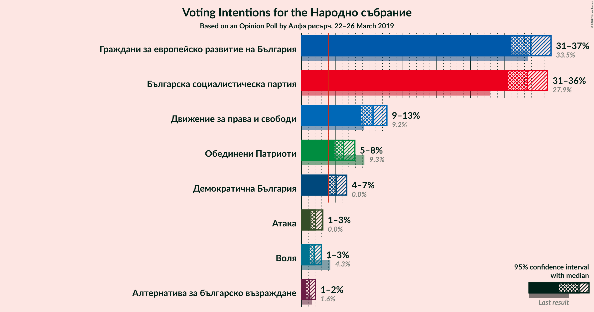

### Confidence Intervals

| Party | Last Result | Poll Result | 80% Confidence Interval | 90% Confidence Interval | 95% Confidence Interval | 99% Confidence Interval |
|:-----:|:-----------:|:-----------:|:-----------------------:|:-----------------------:|:-----------------------:|:-----------------------:|
| Граждани за европейско развитие на България | 33.5% | 33.9% | 32.1–35.9% |31.5–36.4% |31.1–36.9% |30.2–37.8% |
| Българска социалистическа партия | 27.9% | 33.4% | 31.6–35.4% |31.0–35.9% |30.6–36.4% |29.7–37.3% |
| Движение за права и свободи | 9.2% | 10.6% | 9.4–11.9% |9.1–12.3% |8.8–12.6% |8.3–13.3% |
| Обединени Патриоти | 9.3% | 6.2% | 5.3–7.3% |5.1–7.6% |4.9–7.9% |4.5–8.5% |
| Демократична България | 0.0% | 5.1% | 4.3–6.2% |4.1–6.4% |3.9–6.7% |3.6–7.2% |
| Атака | 0.0% | 2.1% | 1.6–2.8% |1.5–3.0% |1.4–3.2% |1.2–3.5% |
| Воля | 4.3% | 1.9% | 1.4–2.6% |1.3–2.7% |1.2–2.9% |1.0–3.3% |
| Алтернатива за българско възраждане | 1.6% | 1.2% | 0.9–1.8% |0.7–1.9% |0.7–2.1% |0.5–2.4% |

*Note:* The poll result column reflects the actual value used in the calculations. Published results may vary slightly, and in addition be rounded to fewer digits.

## Seats

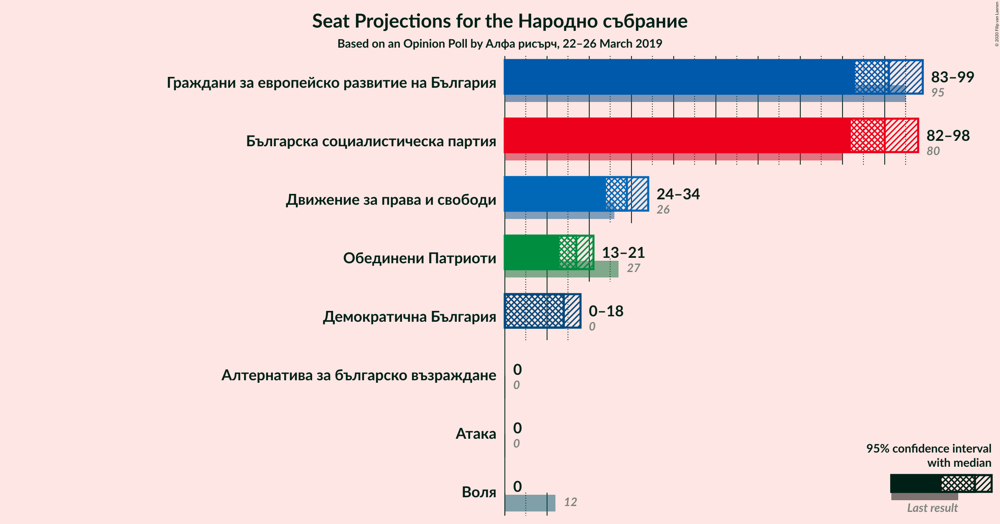

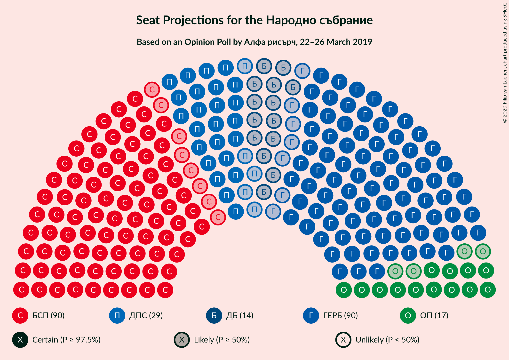

### Confidence Intervals

| Party | Last Result | Median | 80% Confidence Interval | 90% Confidence Interval | 95% Confidence Interval | 99% Confidence Interval |
|:-----:|:-----------:|:------:|:-----------------------:|:-----------------------:|:-----------------------:|:-----------------------:|
| <a href="#граждани-за-европейско-развитие-на-българия">Граждани за европейско развитие на България</a> | 95 | 91 | 86–96 |85–98 |83–99 |81–102 |
| <a href="#българска-социалистическа-партия">Българска социалистическа партия</a> | 80 | 90 | 84–95 |83–96 |82–98 |80–101 |
| <a href="#движение-за-права-и-свободи">Движение за права и свободи</a> | 26 | 29 | 26–32 |25–33 |24–34 |22–35 |
| <a href="#обединени-патриоти">Обединени Патриоти</a> | 27 | 17 | 14–19 |14–20 |13–21 |12–23 |
| <a href="#демократична-българия">Демократична България</a> | 0 | 14 | 12–16 |11–17 |0–18 |0–19 |
| <a href="#атака">Атака</a> | 0 | 0 | 0 |0 |0 |0 |
| <a href="#воля">Воля</a> | 12 | 0 | 0 |0 |0 |0 |
| <a href="#алтернатива-за-българско-възраждане">Алтернатива за българско възраждане</a> | 0 | 0 | 0 |0 |0 |0 |

### Граждани за европейско развитие на България

*For a full overview of the results for this party, see the [Граждани за европейско развитие на България](party-гражданизаевропейскоразвитиенабългария.html) page.*

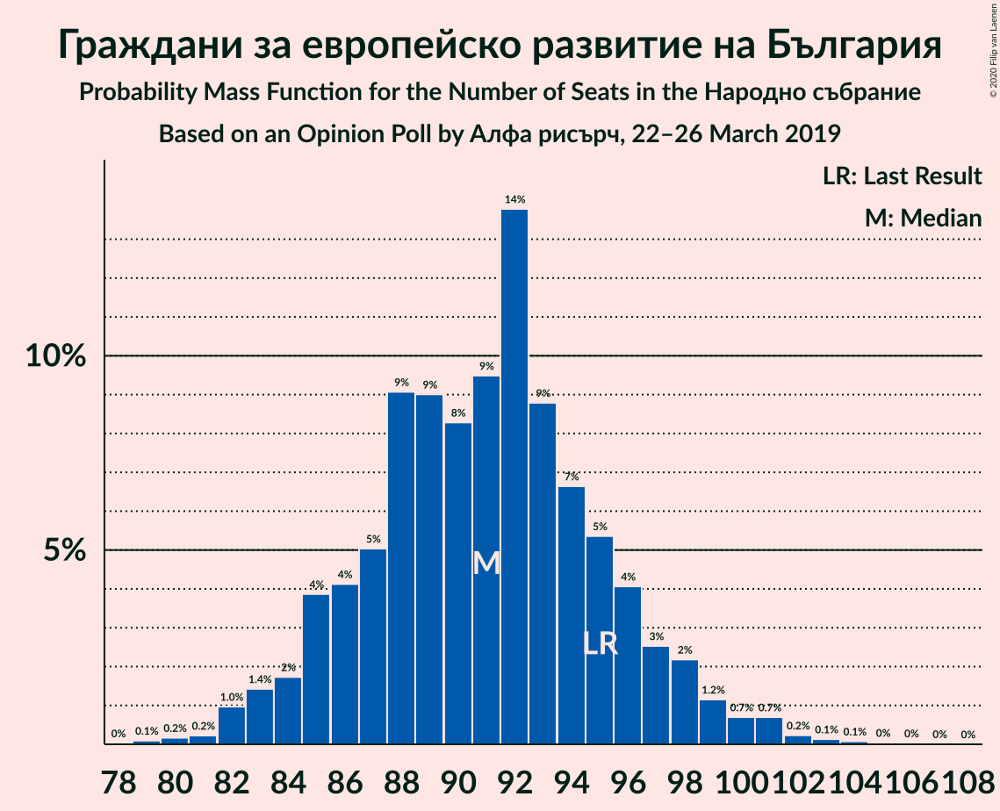

| Number of Seats | Probability | Accumulated | Special Marks |
|:---------------:|:-----------:|:-----------:|:-------------:|
| 79 | 0.1% | 100% |  |
| 80 | 0.2% | 99.9% |  |
| 81 | 0.2% | 99.7% |  |
| 82 | 1.0% | 99.5% |  |
| 83 | 1.4% | 98% |  |
| 84 | 2% | 97% |  |
| 85 | 4% | 95% |  |
| 86 | 4% | 91% |  |
| 87 | 5% | 87% |  |
| 88 | 9% | 82% |  |
| 89 | 9% | 73% |  |
| 90 | 8% | 64% |  |
| 91 | 9% | 56% | Median |
| 92 | 14% | 46% |  |
| 93 | 9% | 33% |  |
| 94 | 7% | 24% |  |
| 95 | 5% | 17% | Last Result |
| 96 | 4% | 12% |  |
| 97 | 3% | 8% |  |
| 98 | 2% | 5% |  |
| 99 | 1.2% | 3% |  |
| 100 | 0.7% | 2% |  |
| 101 | 0.7% | 1.2% |  |
| 102 | 0.2% | 0.5% |  |
| 103 | 0.1% | 0.3% |  |
| 104 | 0.1% | 0.2% |  |
| 105 | 0% | 0.1% |  |
| 106 | 0% | 0.1% |  |
| 107 | 0% | 0% |  |

### Българска социалистическа партия

*For a full overview of the results for this party, see the [Българска социалистическа партия](party-българскасоциалистическапартия.html) page.*

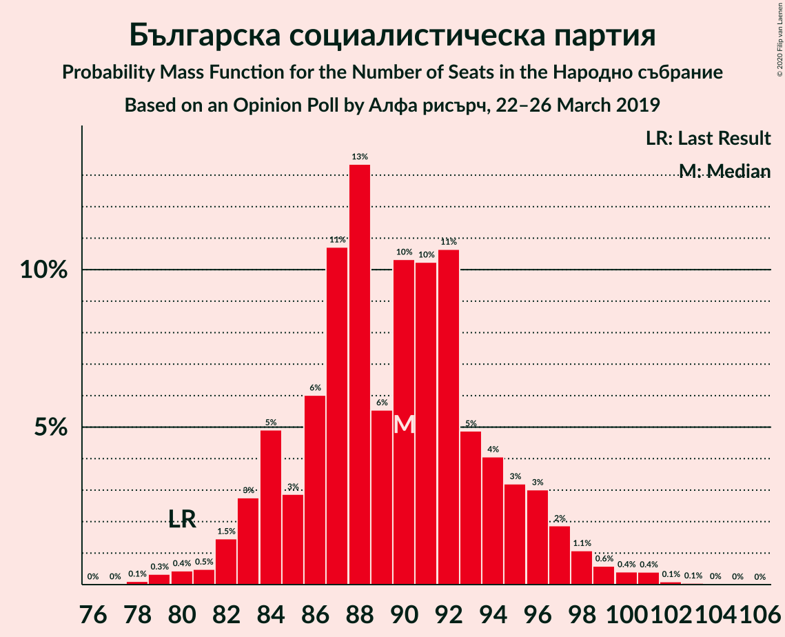

| Number of Seats | Probability | Accumulated | Special Marks |
|:---------------:|:-----------:|:-----------:|:-------------:|
| 77 | 0% | 100% |  |
| 78 | 0.1% | 99.9% |  |
| 79 | 0.3% | 99.8% |  |
| 80 | 0.4% | 99.5% | Last Result |
| 81 | 0.5% | 99.1% |  |
| 82 | 1.5% | 98.6% |  |
| 83 | 3% | 97% |  |
| 84 | 5% | 94% |  |
| 85 | 3% | 89% |  |
| 86 | 6% | 87% |  |
| 87 | 11% | 81% |  |
| 88 | 13% | 70% |  |
| 89 | 6% | 56% |  |
| 90 | 10% | 51% | Median |
| 91 | 10% | 41% |  |
| 92 | 11% | 30% |  |
| 93 | 5% | 20% |  |
| 94 | 4% | 15% |  |
| 95 | 3% | 11% |  |
| 96 | 3% | 8% |  |
| 97 | 2% | 5% |  |
| 98 | 1.1% | 3% |  |
| 99 | 0.6% | 2% |  |
| 100 | 0.4% | 1.0% |  |
| 101 | 0.4% | 0.6% |  |
| 102 | 0.1% | 0.2% |  |
| 103 | 0.1% | 0.1% |  |
| 104 | 0% | 0.1% |  |
| 105 | 0% | 0% |  |

### Движение за права и свободи

*For a full overview of the results for this party, see the [Движение за права и свободи](party-движениезаправаисвободи.html) page.*

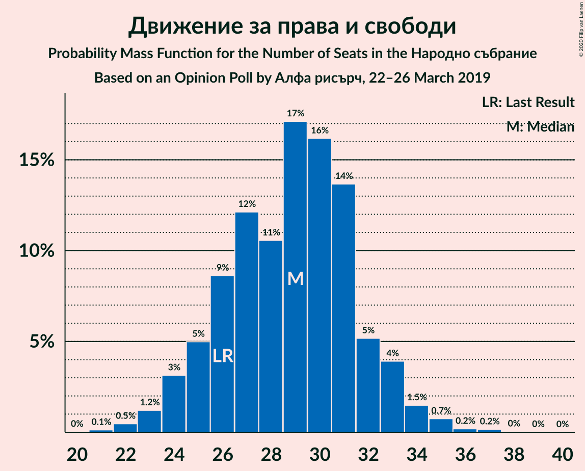

| Number of Seats | Probability | Accumulated | Special Marks |
|:---------------:|:-----------:|:-----------:|:-------------:|
| 21 | 0.1% | 100% |  |
| 22 | 0.5% | 99.8% |  |
| 23 | 1.2% | 99.4% |  |
| 24 | 3% | 98% |  |
| 25 | 5% | 95% |  |
| 26 | 9% | 90% | Last Result |
| 27 | 12% | 81% |  |
| 28 | 11% | 69% |  |
| 29 | 17% | 59% | Median |
| 30 | 16% | 42% |  |
| 31 | 14% | 25% |  |
| 32 | 5% | 12% |  |
| 33 | 4% | 7% |  |
| 34 | 1.5% | 3% |  |
| 35 | 0.7% | 1.2% |  |
| 36 | 0.2% | 0.4% |  |
| 37 | 0.2% | 0.2% |  |
| 38 | 0% | 0.1% |  |
| 39 | 0% | 0% |  |

### Обединени Патриоти

*For a full overview of the results for this party, see the [Обединени Патриоти](party-обединенипатриоти.html) page.*

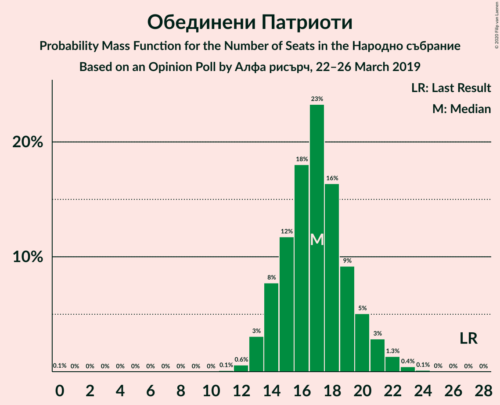

| Number of Seats | Probability | Accumulated | Special Marks |
|:---------------:|:-----------:|:-----------:|:-------------:|
| 0 | 0.1% | 100% |  |
| 1 | 0% | 99.9% |  |
| 2 | 0% | 99.9% |  |
| 3 | 0% | 99.9% |  |
| 4 | 0% | 99.9% |  |
| 5 | 0% | 99.9% |  |
| 6 | 0% | 99.9% |  |
| 7 | 0% | 99.9% |  |
| 8 | 0% | 99.9% |  |
| 9 | 0% | 99.9% |  |
| 10 | 0% | 99.9% |  |
| 11 | 0.1% | 99.9% |  |
| 12 | 0.6% | 99.8% |  |
| 13 | 3% | 99.3% |  |
| 14 | 8% | 96% |  |
| 15 | 12% | 88% |  |
| 16 | 18% | 77% |  |
| 17 | 23% | 59% | Median |
| 18 | 16% | 35% |  |
| 19 | 9% | 19% |  |
| 20 | 5% | 10% |  |
| 21 | 3% | 5% |  |
| 22 | 1.3% | 2% |  |
| 23 | 0.4% | 0.6% |  |
| 24 | 0.1% | 0.2% |  |
| 25 | 0% | 0% |  |
| 26 | 0% | 0% |  |
| 27 | 0% | 0% | Last Result |

### Демократична България

*For a full overview of the results for this party, see the [Демократична България](party-демократичнабългария.html) page.*

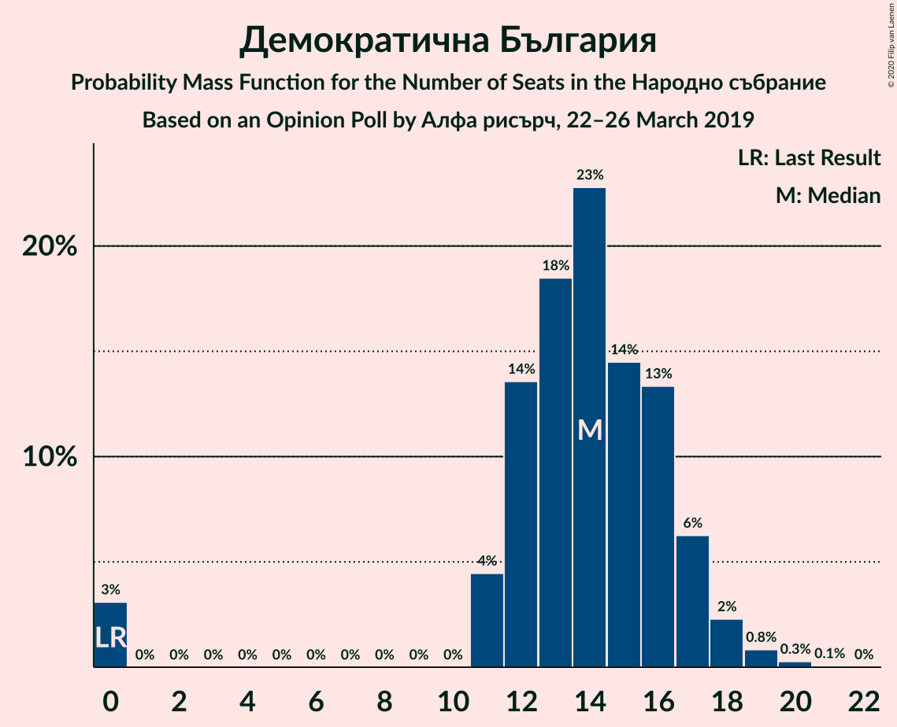

| Number of Seats | Probability | Accumulated | Special Marks |
|:---------------:|:-----------:|:-----------:|:-------------:|
| 0 | 3% | 100% | Last Result |
| 1 | 0% | 97% |  |
| 2 | 0% | 97% |  |
| 3 | 0% | 97% |  |
| 4 | 0% | 97% |  |
| 5 | 0% | 97% |  |
| 6 | 0% | 97% |  |
| 7 | 0% | 97% |  |
| 8 | 0% | 97% |  |
| 9 | 0% | 97% |  |
| 10 | 0% | 97% |  |
| 11 | 4% | 97% |  |
| 12 | 14% | 92% |  |
| 13 | 18% | 79% |  |
| 14 | 23% | 60% | Median |
| 15 | 14% | 38% |  |
| 16 | 13% | 23% |  |
| 17 | 6% | 10% |  |
| 18 | 2% | 3% |  |
| 19 | 0.8% | 1.2% |  |
| 20 | 0.3% | 0.4% |  |
| 21 | 0.1% | 0.1% |  |
| 22 | 0% | 0% |  |

### Атака

*For a full overview of the results for this party, see the [Атака](party-атака.html) page.*

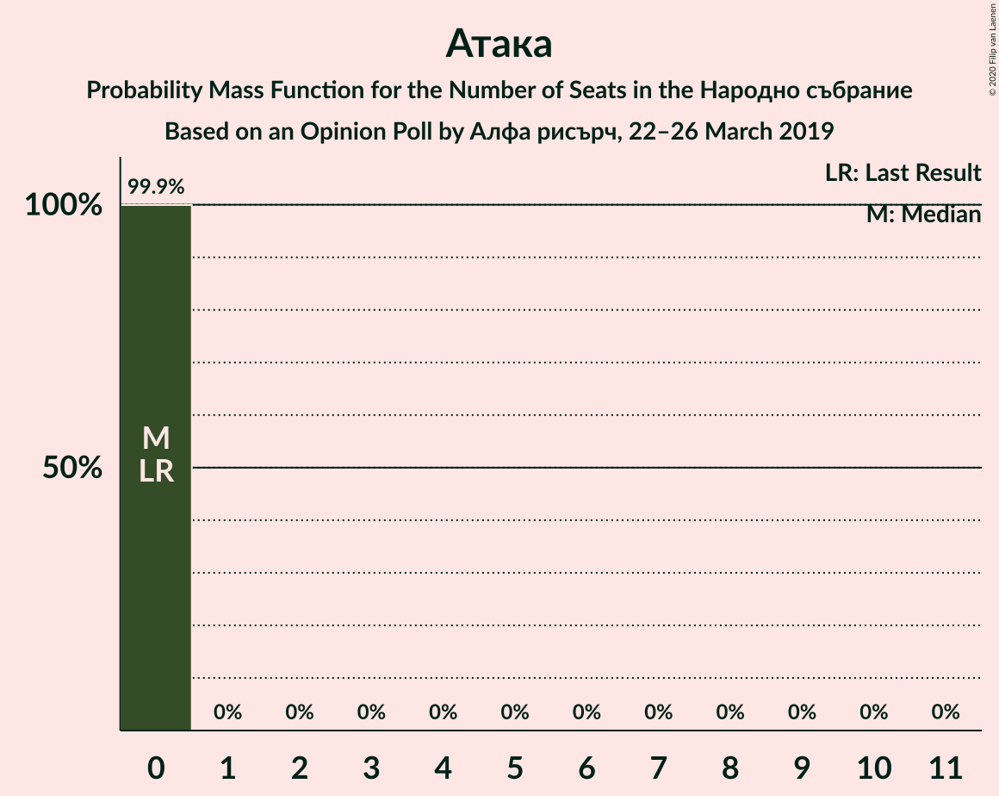

| Number of Seats | Probability | Accumulated | Special Marks |
|:---------------:|:-----------:|:-----------:|:-------------:|
| 0 | 99.9% | 100% | Last Result, Median |
| 1 | 0% | 0.1% |  |
| 2 | 0% | 0.1% |  |
| 3 | 0% | 0.1% |  |
| 4 | 0% | 0.1% |  |
| 5 | 0% | 0.1% |  |
| 6 | 0% | 0.1% |  |
| 7 | 0% | 0.1% |  |
| 8 | 0% | 0.1% |  |
| 9 | 0% | 0.1% |  |
| 10 | 0% | 0.1% |  |
| 11 | 0% | 0% |  |

### Воля

*For a full overview of the results for this party, see the [Воля](party-воля.html) page.*

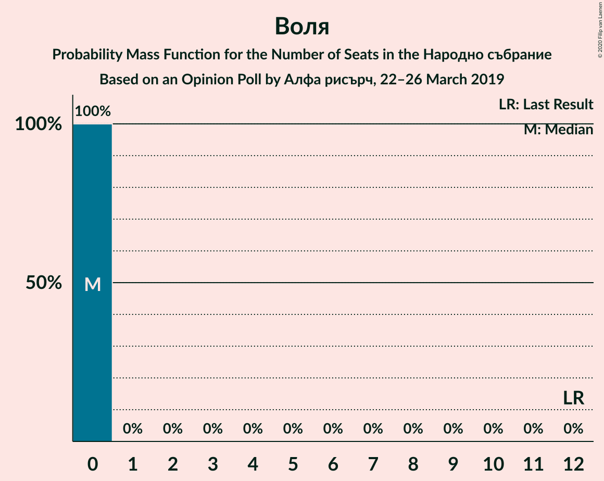

| Number of Seats | Probability | Accumulated | Special Marks |
|:---------------:|:-----------:|:-----------:|:-------------:|
| 0 | 100% | 100% | Median |
| 1 | 0% | 0% |  |
| 2 | 0% | 0% |  |
| 3 | 0% | 0% |  |
| 4 | 0% | 0% |  |
| 5 | 0% | 0% |  |
| 6 | 0% | 0% |  |
| 7 | 0% | 0% |  |
| 8 | 0% | 0% |  |
| 9 | 0% | 0% |  |
| 10 | 0% | 0% |  |
| 11 | 0% | 0% |  |
| 12 | 0% | 0% | Last Result |

### Алтернатива за българско възраждане

*For a full overview of the results for this party, see the [Алтернатива за българско възраждане](party-алтернативазабългарсковъзраждане.html) page.*

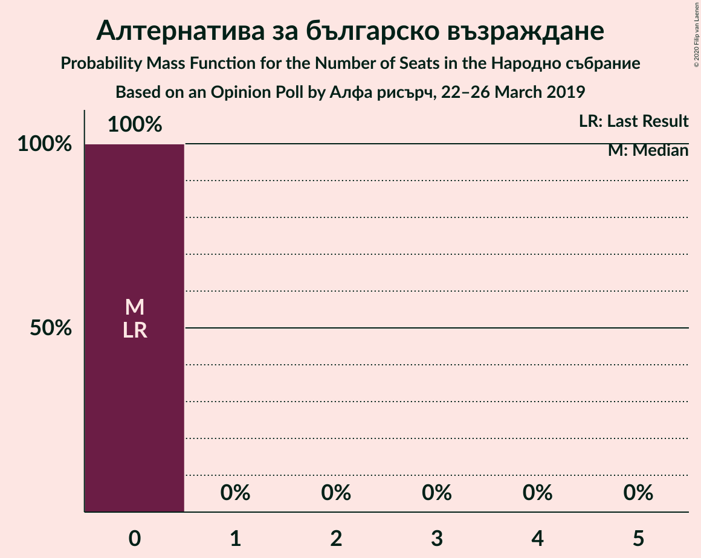

| Number of Seats | Probability | Accumulated | Special Marks |
|:---------------:|:-----------:|:-----------:|:-------------:|
| 0 | 100% | 100% | Last Result, Median |

## Coalitions

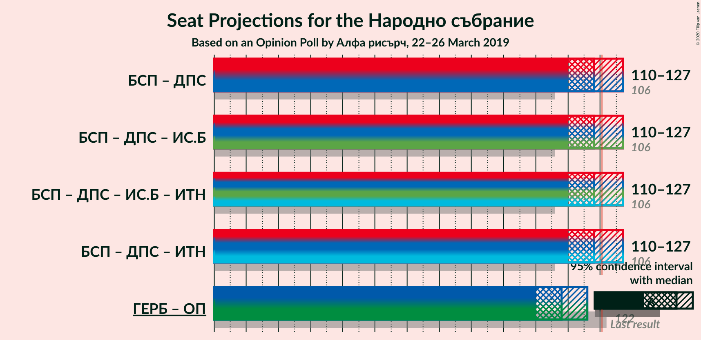

### Confidence Intervals

| Coalition | Last Result | Median | Majority? | 80% Confidence Interval | 90% Confidence Interval | 95% Confidence Interval | 99% Confidence Interval |
|:---------:|:-----------:|:------:|:---------:|:-----------------------:|:-----------------------:|:-----------------------:|:-----------------------:|
| Българска социалистическа партия – Движение за права и свободи | 106 | 118 | 29% | 113–123 | 112–125 | 110–127 | 108–131 |
| Граждани за европейско развитие на България – Обединени Патриоти | 122 | 108 | 0.3% | 103–113 | 101–115 | 100–116 | 98–119 |

### Българска социалистическа партия – Движение за права и свободи

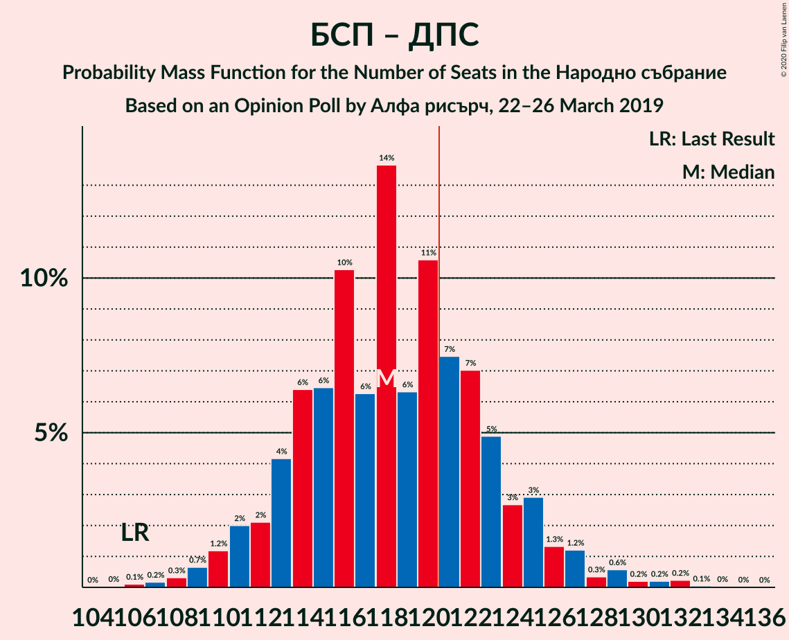

| Number of Seats | Probability | Accumulated | Special Marks |
|:---------------:|:-----------:|:-----------:|:-------------:|
| 105 | 0% | 100% |  |
| 106 | 0.1% | 99.9% | Last Result |
| 107 | 0.2% | 99.8% |  |
| 108 | 0.3% | 99.7% |  |
| 109 | 0.7% | 99.3% |  |
| 110 | 1.2% | 98.7% |  |
| 111 | 2% | 97% |  |
| 112 | 2% | 95% |  |
| 113 | 4% | 93% |  |
| 114 | 6% | 89% |  |
| 115 | 6% | 83% |  |
| 116 | 10% | 76% |  |
| 117 | 6% | 66% |  |
| 118 | 14% | 60% |  |
| 119 | 6% | 46% | Median |
| 120 | 11% | 40% |  |
| 121 | 7% | 29% | Majority |
| 122 | 7% | 22% |  |
| 123 | 5% | 15% |  |
| 124 | 3% | 10% |  |
| 125 | 3% | 7% |  |
| 126 | 1.3% | 4% |  |
| 127 | 1.2% | 3% |  |
| 128 | 0.3% | 2% |  |
| 129 | 0.6% | 1.3% |  |
| 130 | 0.2% | 0.8% |  |
| 131 | 0.2% | 0.6% |  |
| 132 | 0.2% | 0.4% |  |
| 133 | 0.1% | 0.1% |  |
| 134 | 0% | 0.1% |  |
| 135 | 0% | 0% |  |

### Граждани за европейско развитие на България – Обединени Патриоти

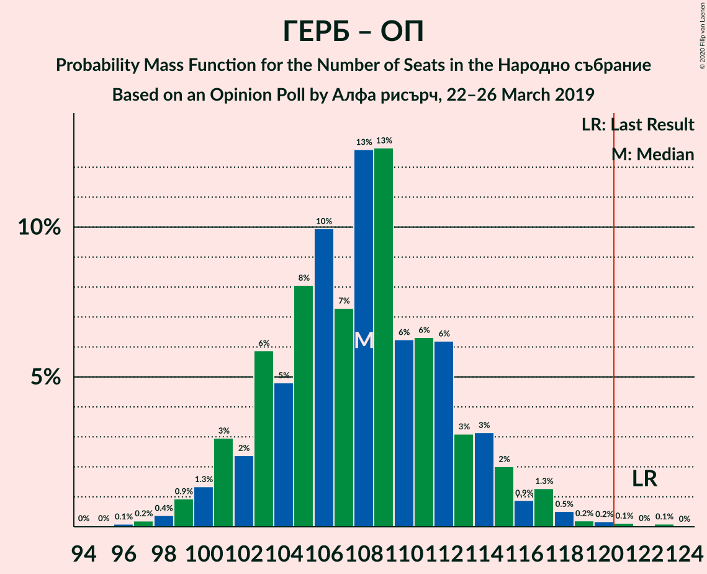

| Number of Seats | Probability | Accumulated | Special Marks |
|:---------------:|:-----------:|:-----------:|:-------------:|
| 94 | 0% | 100% |  |
| 95 | 0% | 99.9% |  |
| 96 | 0.1% | 99.9% |  |
| 97 | 0.2% | 99.8% |  |
| 98 | 0.4% | 99.6% |  |
| 99 | 0.9% | 99.2% |  |
| 100 | 1.3% | 98% |  |
| 101 | 3% | 97% |  |
| 102 | 2% | 94% |  |
| 103 | 6% | 92% |  |
| 104 | 5% | 86% |  |
| 105 | 8% | 81% |  |
| 106 | 10% | 73% |  |
| 107 | 7% | 63% |  |
| 108 | 13% | 56% | Median |
| 109 | 13% | 43% |  |
| 110 | 6% | 30% |  |
| 111 | 6% | 24% |  |
| 112 | 6% | 18% |  |
| 113 | 3% | 12% |  |
| 114 | 3% | 9% |  |
| 115 | 2% | 5% |  |
| 116 | 0.9% | 3% |  |
| 117 | 1.3% | 2% |  |
| 118 | 0.5% | 1.2% |  |
| 119 | 0.2% | 0.7% |  |
| 120 | 0.2% | 0.5% |  |
| 121 | 0.1% | 0.3% | Majority |
| 122 | 0% | 0.2% | Last Result |
| 123 | 0.1% | 0.1% |  |
| 124 | 0% | 0% |  |

## Technical Information

### Opinion Poll

+ **Polling firm:** Алфа рисърч
+ **Commissioner(s):** —
+ **Fieldwork period:** 22–26 March 2019

### Calculations

+ **Sample size:** 1011
+ **Simulations done:** 1,048,576
+ **Error estimate:** 0.99%

