# Opinion Poll by Gallup, 5–11 April 2019

<a href="#voting-intentions">Voting Intentions</a> | <a href="#seats">Seats</a> | <a href="#coalitions">Coalitions</a> | <a href="#technical-information">Technical Information</a>

## Voting Intentions

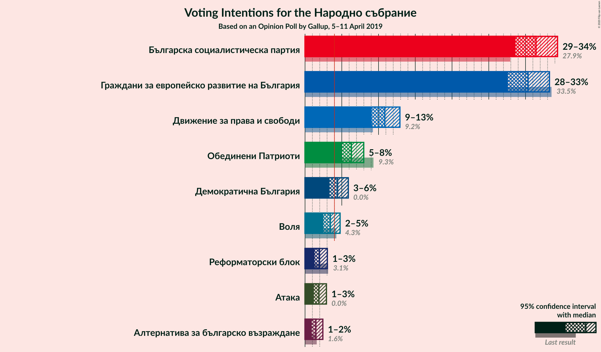

### Confidence Intervals

| Party | Last Result | Poll Result | 80% Confidence Interval | 90% Confidence Interval | 95% Confidence Interval | 99% Confidence Interval |
|:-----:|:-----------:|:-----------:|:-----------------------:|:-----------------------:|:-----------------------:|:-----------------------:|
| Българска социалистическа партия | 27.9% | 31.4% | 29.6–33.3% |29.1–33.9% |28.6–34.4% |27.8–35.3% |
| Граждани за европейско развитие на България | 33.5% | 30.3% | 28.5–32.3% |28.0–32.8% |27.6–33.3% |26.7–34.2% |
| Движение за права и свободи | 9.2% | 10.8% | 9.7–12.2% |9.3–12.6% |9.1–12.9% |8.5–13.6% |
| Обединени Патриоти | 9.3% | 6.3% | 5.4–7.4% |5.2–7.7% |5.0–8.0% |4.6–8.5% |
| Демократична България | 0.0% | 4.4% | 3.7–5.4% |3.5–5.7% |3.3–5.9% |3.0–6.4% |
| Воля | 4.3% | 3.4% | 2.8–4.3% |2.6–4.5% |2.5–4.8% |2.2–5.2% |
| Реформаторски блок | 3.1% | 2.0% | 1.5–2.7% |1.4–2.9% |1.3–3.0% |1.1–3.4% |
| Атака | 0.0% | 1.9% | 1.4–2.5% |1.3–2.7% |1.2–2.9% |1.0–3.3% |
| Алтернатива за българско възраждане | 1.6% | 1.5% | 1.1–2.1% |1.0–2.3% |0.9–2.4% |0.7–2.8% |

*Note:* The poll result column reflects the actual value used in the calculations. Published results may vary slightly, and in addition be rounded to fewer digits.

## Seats

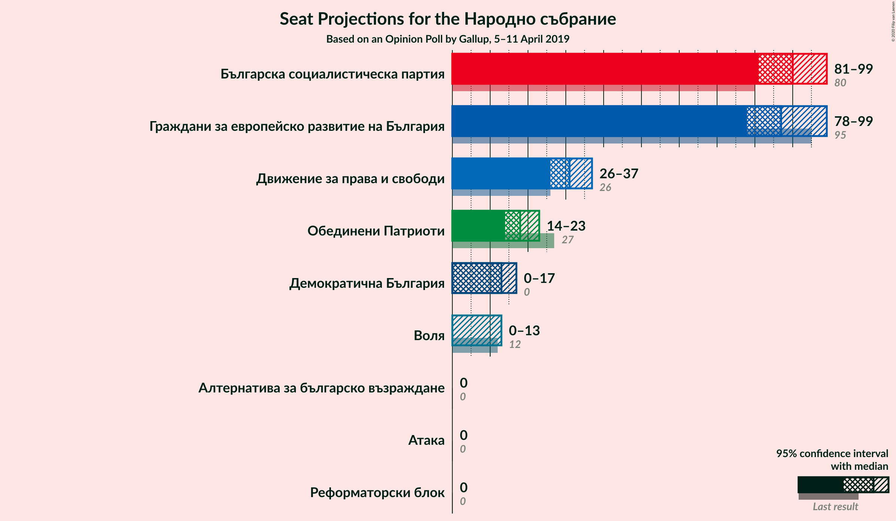

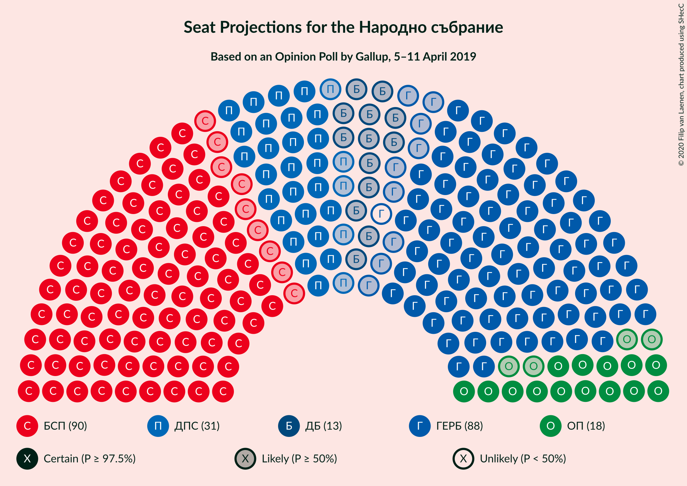

### Confidence Intervals

| Party | Last Result | Median | 80% Confidence Interval | 90% Confidence Interval | 95% Confidence Interval | 99% Confidence Interval |
|:-----:|:-----------:|:------:|:-----------------------:|:-----------------------:|:-----------------------:|:-----------------------:|
| <a href="#българска-социалистическа-партия">Българска социалистическа партия</a> | 80 | 90 | 84–96 |82–97 |81–99 |78–101 |
| <a href="#граждани-за-европейско-развитие-на-българия">Граждани за европейско развитие на България</a> | 95 | 87 | 80–94 |79–98 |78–99 |75–102 |
| <a href="#движение-за-права-и-свободи">Движение за права и свободи</a> | 26 | 31 | 28–34 |26–36 |26–37 |24–39 |
| <a href="#обединени-патриоти">Обединени Патриоти</a> | 27 | 18 | 15–22 |14–22 |14–23 |12–25 |
| <a href="#демократична-българия">Демократична България</a> | 0 | 13 | 0–15 |0–16 |0–17 |0–18 |
| <a href="#воля">Воля</a> | 12 | 0 | 0–12 |0–13 |0–13 |0–14 |
| <a href="#реформаторски-блок">Реформаторски блок</a> | 0 | 0 | 0 |0 |0 |0 |
| <a href="#атака">Атака</a> | 0 | 0 | 0 |0 |0 |0 |
| <a href="#алтернатива-за-българско-възраждане">Алтернатива за българско възраждане</a> | 0 | 0 | 0 |0 |0 |0 |

### Българска социалистическа партия

*For a full overview of the results for this party, see the [Българска социалистическа партия](party-българскасоциалистическапартия.html) page.*

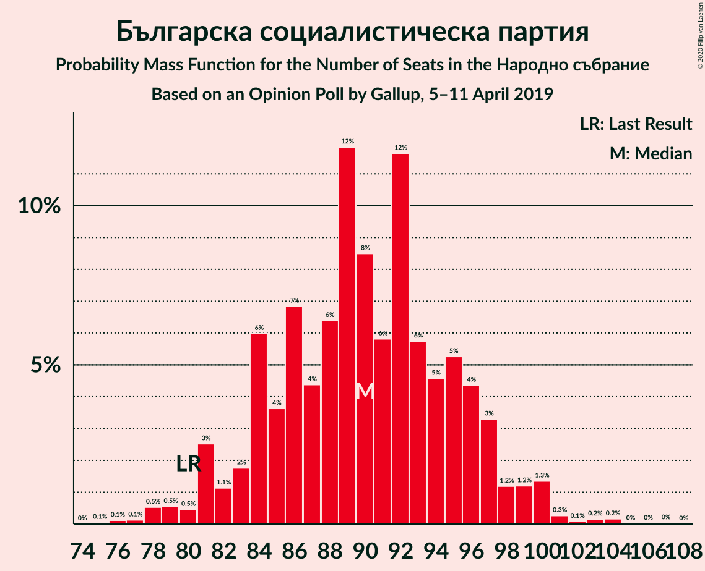

| Number of Seats | Probability | Accumulated | Special Marks |
|:---------------:|:-----------:|:-----------:|:-------------:|
| 75 | 0.1% | 100% |  |
| 76 | 0.1% | 99.9% |  |
| 77 | 0.1% | 99.8% |  |
| 78 | 0.5% | 99.7% |  |
| 79 | 0.5% | 99.2% |  |
| 80 | 0.5% | 98.6% | Last Result |
| 81 | 3% | 98% |  |
| 82 | 1.1% | 96% |  |
| 83 | 2% | 94% |  |
| 84 | 6% | 93% |  |
| 85 | 4% | 87% |  |
| 86 | 7% | 83% |  |
| 87 | 4% | 76% |  |
| 88 | 6% | 72% |  |
| 89 | 12% | 66% |  |
| 90 | 8% | 54% | Median |
| 91 | 6% | 45% |  |
| 92 | 12% | 39% |  |
| 93 | 6% | 28% |  |
| 94 | 5% | 22% |  |
| 95 | 5% | 17% |  |
| 96 | 4% | 12% |  |
| 97 | 3% | 8% |  |
| 98 | 1.2% | 4% |  |
| 99 | 1.2% | 3% |  |
| 100 | 1.3% | 2% |  |
| 101 | 0.3% | 0.7% |  |
| 102 | 0.1% | 0.5% |  |
| 103 | 0.2% | 0.4% |  |
| 104 | 0.2% | 0.2% |  |
| 105 | 0% | 0.1% |  |
| 106 | 0% | 0.1% |  |
| 107 | 0% | 0% |  |

### Граждани за европейско развитие на България

*For a full overview of the results for this party, see the [Граждани за европейско развитие на България](party-гражданизаевропейскоразвитиенабългария.html) page.*

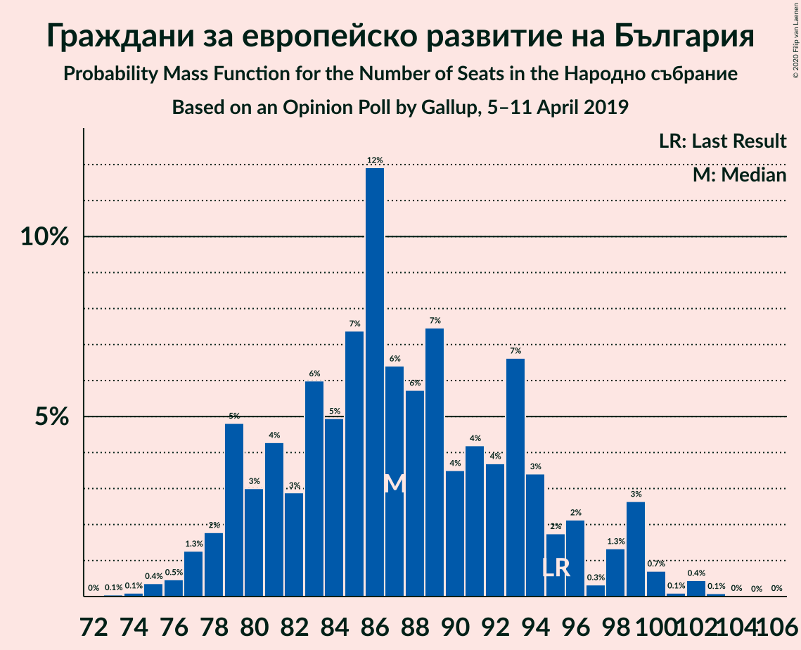

| Number of Seats | Probability | Accumulated | Special Marks |
|:---------------:|:-----------:|:-----------:|:-------------:|
| 72 | 0% | 100% |  |
| 73 | 0.1% | 99.9% |  |
| 74 | 0.1% | 99.9% |  |
| 75 | 0.4% | 99.8% |  |
| 76 | 0.5% | 99.4% |  |
| 77 | 1.3% | 98.9% |  |
| 78 | 2% | 98% |  |
| 79 | 5% | 96% |  |
| 80 | 3% | 91% |  |
| 81 | 4% | 88% |  |
| 82 | 3% | 84% |  |
| 83 | 6% | 81% |  |
| 84 | 5% | 75% |  |
| 85 | 7% | 70% |  |
| 86 | 12% | 63% |  |
| 87 | 6% | 51% | Median |
| 88 | 6% | 44% |  |
| 89 | 7% | 39% |  |
| 90 | 4% | 31% |  |
| 91 | 4% | 28% |  |
| 92 | 4% | 23% |  |
| 93 | 7% | 20% |  |
| 94 | 3% | 13% |  |
| 95 | 2% | 10% | Last Result |
| 96 | 2% | 8% |  |
| 97 | 0.3% | 6% |  |
| 98 | 1.3% | 5% |  |
| 99 | 3% | 4% |  |
| 100 | 0.7% | 1.4% |  |
| 101 | 0.1% | 0.7% |  |
| 102 | 0.4% | 0.6% |  |
| 103 | 0.1% | 0.2% |  |
| 104 | 0% | 0.1% |  |
| 105 | 0% | 0% |  |

### Движение за права и свободи

*For a full overview of the results for this party, see the [Движение за права и свободи](party-движениезаправаисвободи.html) page.*

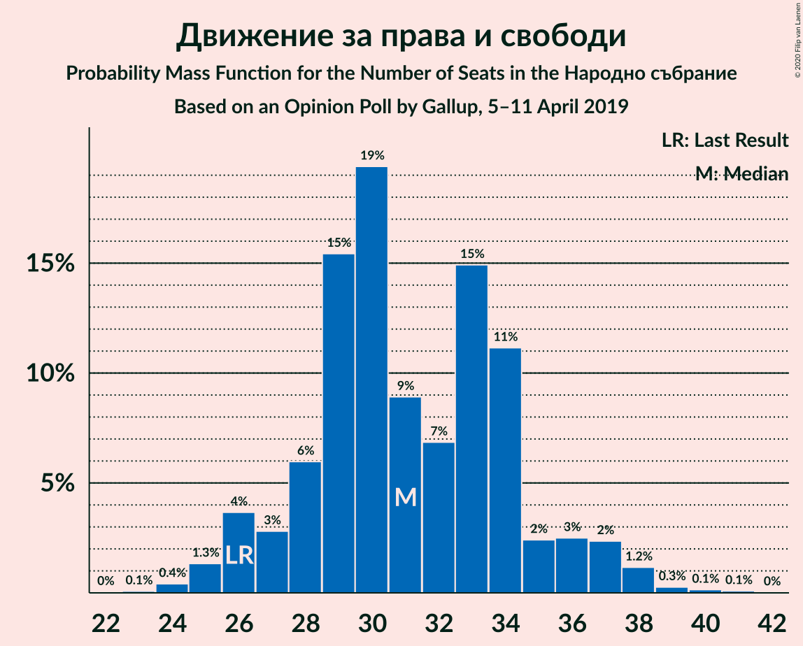

| Number of Seats | Probability | Accumulated | Special Marks |
|:---------------:|:-----------:|:-----------:|:-------------:|
| 22 | 0% | 100% |  |
| 23 | 0.1% | 99.9% |  |
| 24 | 0.4% | 99.9% |  |
| 25 | 1.3% | 99.5% |  |
| 26 | 4% | 98% | Last Result |
| 27 | 3% | 94% |  |
| 28 | 6% | 92% |  |
| 29 | 15% | 86% |  |
| 30 | 19% | 70% |  |
| 31 | 9% | 51% | Median |
| 32 | 7% | 42% |  |
| 33 | 15% | 35% |  |
| 34 | 11% | 20% |  |
| 35 | 2% | 9% |  |
| 36 | 3% | 7% |  |
| 37 | 2% | 4% |  |
| 38 | 1.2% | 2% |  |
| 39 | 0.3% | 0.5% |  |
| 40 | 0.1% | 0.3% |  |
| 41 | 0.1% | 0.1% |  |
| 42 | 0% | 0% |  |

### Обединени Патриоти

*For a full overview of the results for this party, see the [Обединени Патриоти](party-обединенипатриоти.html) page.*

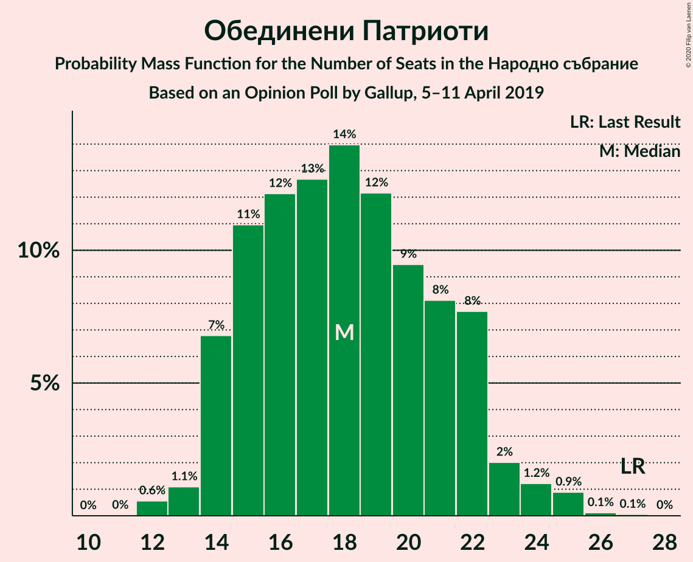

| Number of Seats | Probability | Accumulated | Special Marks |
|:---------------:|:-----------:|:-----------:|:-------------:|
| 12 | 0.6% | 100% |  |
| 13 | 1.1% | 99.4% |  |
| 14 | 7% | 98% |  |
| 15 | 11% | 92% |  |
| 16 | 12% | 81% |  |
| 17 | 13% | 68% |  |
| 18 | 14% | 56% | Median |
| 19 | 12% | 42% |  |
| 20 | 9% | 30% |  |
| 21 | 8% | 20% |  |
| 22 | 8% | 12% |  |
| 23 | 2% | 4% |  |
| 24 | 1.2% | 2% |  |
| 25 | 0.9% | 1.1% |  |
| 26 | 0.1% | 0.2% |  |
| 27 | 0.1% | 0.1% | Last Result |
| 28 | 0% | 0% |  |

### Демократична България

*For a full overview of the results for this party, see the [Демократична България](party-демократичнабългария.html) page.*

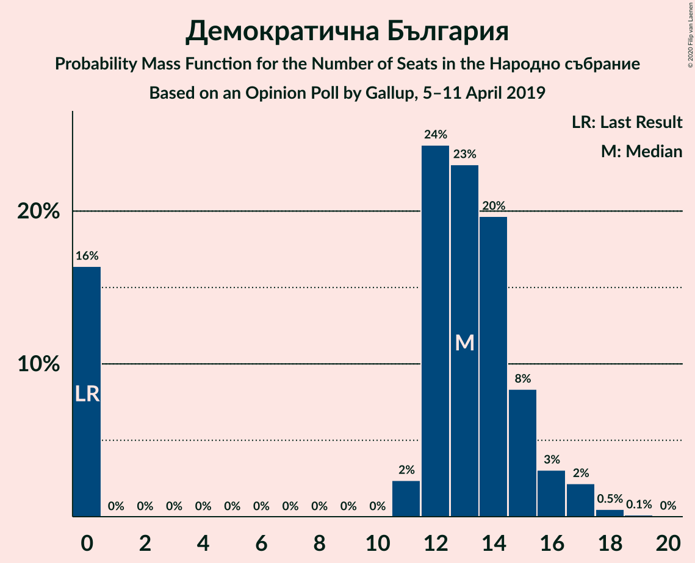

| Number of Seats | Probability | Accumulated | Special Marks |
|:---------------:|:-----------:|:-----------:|:-------------:|
| 0 | 16% | 100% | Last Result |
| 1 | 0% | 84% |  |
| 2 | 0% | 84% |  |
| 3 | 0% | 84% |  |
| 4 | 0% | 84% |  |
| 5 | 0% | 84% |  |
| 6 | 0% | 84% |  |
| 7 | 0% | 84% |  |
| 8 | 0% | 84% |  |
| 9 | 0% | 84% |  |
| 10 | 0% | 84% |  |
| 11 | 2% | 84% |  |
| 12 | 24% | 81% |  |
| 13 | 23% | 57% | Median |
| 14 | 20% | 34% |  |
| 15 | 8% | 14% |  |
| 16 | 3% | 6% |  |
| 17 | 2% | 3% |  |
| 18 | 0.5% | 0.6% |  |
| 19 | 0.1% | 0.2% |  |
| 20 | 0% | 0% |  |

### Воля

*For a full overview of the results for this party, see the [Воля](party-воля.html) page.*

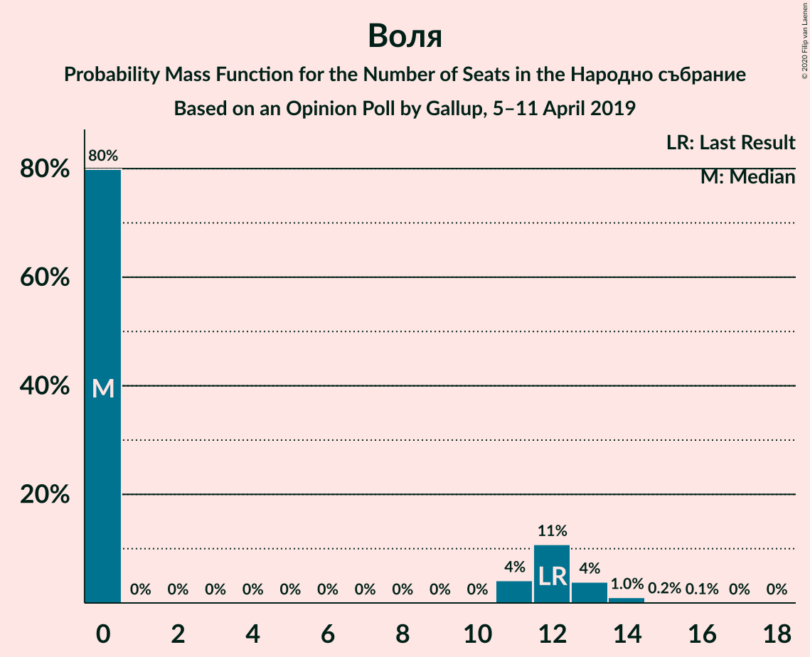

| Number of Seats | Probability | Accumulated | Special Marks |
|:---------------:|:-----------:|:-----------:|:-------------:|
| 0 | 80% | 100% | Median |
| 1 | 0% | 20% |  |
| 2 | 0% | 20% |  |
| 3 | 0% | 20% |  |
| 4 | 0% | 20% |  |
| 5 | 0% | 20% |  |
| 6 | 0% | 20% |  |
| 7 | 0% | 20% |  |
| 8 | 0% | 20% |  |
| 9 | 0% | 20% |  |
| 10 | 0% | 20% |  |
| 11 | 4% | 20% |  |
| 12 | 11% | 16% | Last Result |
| 13 | 4% | 5% |  |
| 14 | 1.0% | 1.3% |  |
| 15 | 0.2% | 0.3% |  |
| 16 | 0.1% | 0.1% |  |
| 17 | 0% | 0% |  |

### Реформаторски блок

*For a full overview of the results for this party, see the [Реформаторски блок](party-реформаторскиблок.html) page.*

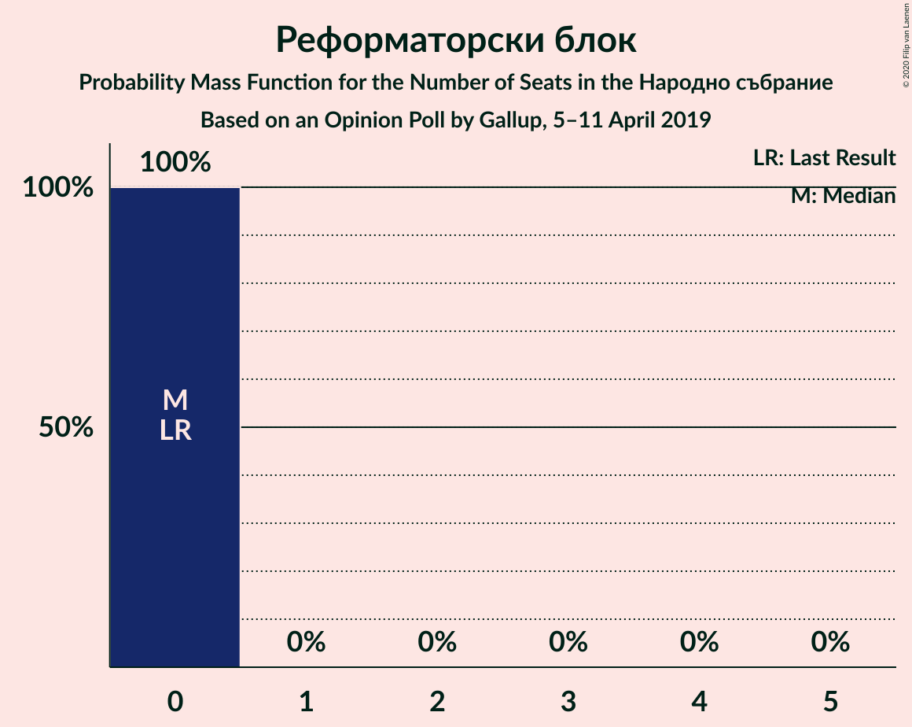

| Number of Seats | Probability | Accumulated | Special Marks |
|:---------------:|:-----------:|:-----------:|:-------------:|
| 0 | 100% | 100% | Last Result, Median |

### Атака

*For a full overview of the results for this party, see the [Атака](party-атака.html) page.*

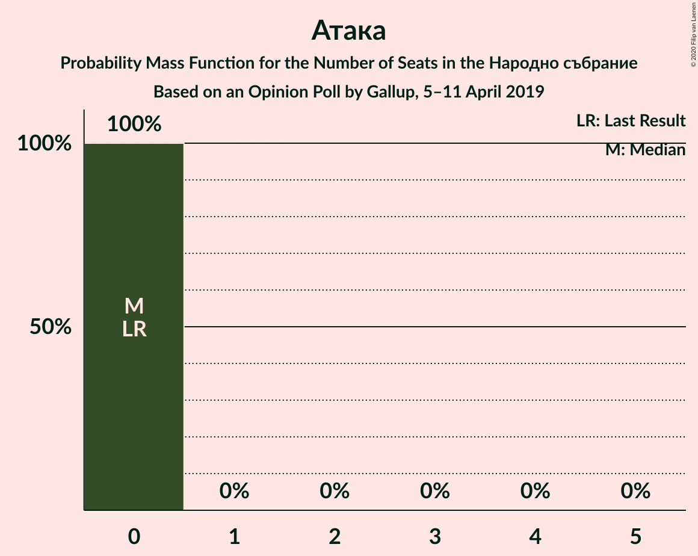

| Number of Seats | Probability | Accumulated | Special Marks |
|:---------------:|:-----------:|:-----------:|:-------------:|
| 0 | 100% | 100% | Last Result, Median |

### Алтернатива за българско възраждане

*For a full overview of the results for this party, see the [Алтернатива за българско възраждане](party-алтернативазабългарсковъзраждане.html) page.*

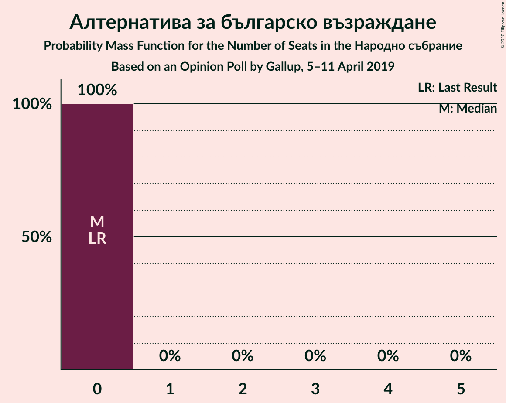

| Number of Seats | Probability | Accumulated | Special Marks |
|:---------------:|:-----------:|:-----------:|:-------------:|
| 0 | 100% | 100% | Last Result, Median |

## Coalitions

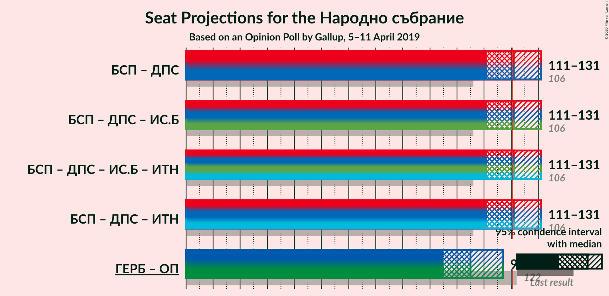

### Confidence Intervals

| Coalition | Last Result | Median | Majority? | 80% Confidence Interval | 90% Confidence Interval | 95% Confidence Interval | 99% Confidence Interval |
|:---------:|:-----------:|:------:|:---------:|:-----------------------:|:-----------------------:|:-----------------------:|:-----------------------:|
| Българска социалистическа партия – Движение за права и свободи | 106 | 121 | 53% | 115–127 | 113–129 | 111–131 | 108–135 |
| Граждани за европейско развитие на България – Обединени Патриоти | 122 | 105 | 0.4% | 99–113 | 97–116 | 95–117 | 93–120 |

### Българска социалистическа партия – Движение за права и свободи

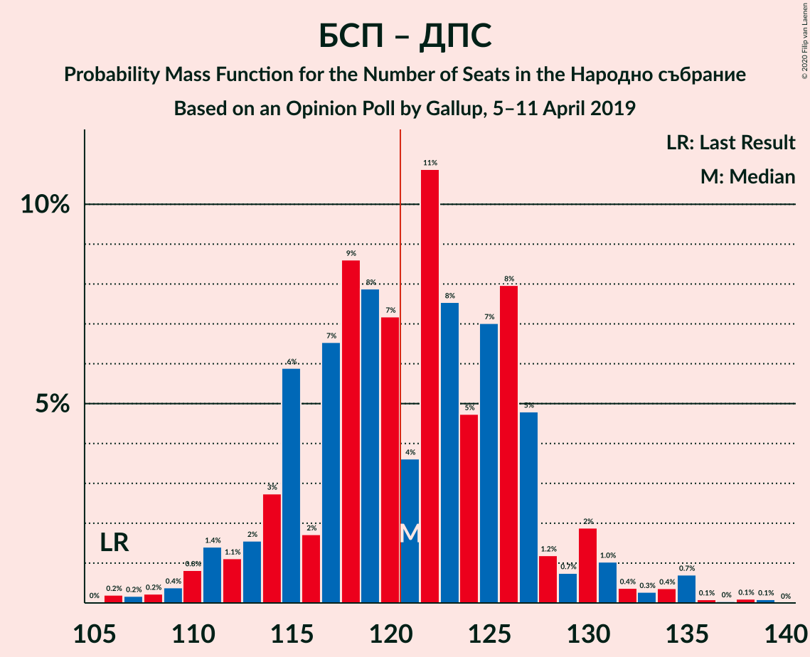

| Number of Seats | Probability | Accumulated | Special Marks |
|:---------------:|:-----------:|:-----------:|:-------------:|
| 105 | 0% | 100% |  |
| 106 | 0.2% | 99.9% | Last Result |
| 107 | 0.2% | 99.7% |  |
| 108 | 0.2% | 99.6% |  |
| 109 | 0.4% | 99.3% |  |
| 110 | 0.8% | 98.9% |  |
| 111 | 1.4% | 98% |  |
| 112 | 1.1% | 97% |  |
| 113 | 2% | 96% |  |
| 114 | 3% | 94% |  |
| 115 | 6% | 91% |  |
| 116 | 2% | 85% |  |
| 117 | 7% | 84% |  |
| 118 | 9% | 77% |  |
| 119 | 8% | 69% |  |
| 120 | 7% | 61% |  |
| 121 | 4% | 53% | Median, Majority |
| 122 | 11% | 50% |  |
| 123 | 8% | 39% |  |
| 124 | 5% | 31% |  |
| 125 | 7% | 27% |  |
| 126 | 8% | 20% |  |
| 127 | 5% | 12% |  |
| 128 | 1.2% | 7% |  |
| 129 | 0.7% | 6% |  |
| 130 | 2% | 5% |  |
| 131 | 1.0% | 3% |  |
| 132 | 0.4% | 2% |  |
| 133 | 0.3% | 2% |  |
| 134 | 0.4% | 1.4% |  |
| 135 | 0.7% | 1.1% |  |
| 136 | 0.1% | 0.3% |  |
| 137 | 0% | 0.3% |  |
| 138 | 0.1% | 0.2% |  |
| 139 | 0.1% | 0.1% |  |
| 140 | 0% | 0% |  |

### Граждани за европейско развитие на България – Обединени Патриоти

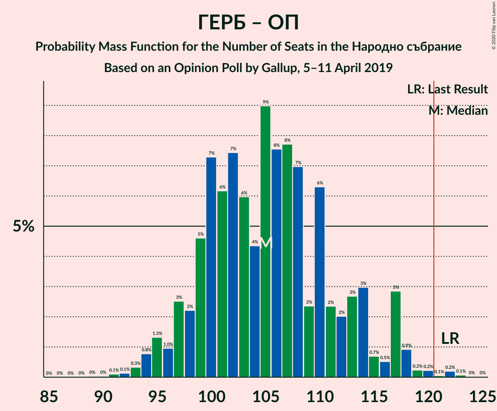

| Number of Seats | Probability | Accumulated | Special Marks |
|:---------------:|:-----------:|:-----------:|:-------------:|
| 89 | 0% | 100% |  |
| 90 | 0% | 99.9% |  |
| 91 | 0.1% | 99.9% |  |
| 92 | 0.1% | 99.8% |  |
| 93 | 0.3% | 99.7% |  |
| 94 | 0.8% | 99.3% |  |
| 95 | 1.3% | 98.6% |  |
| 96 | 1.0% | 97% |  |
| 97 | 3% | 96% |  |
| 98 | 2% | 94% |  |
| 99 | 5% | 92% |  |
| 100 | 7% | 87% |  |
| 101 | 6% | 80% |  |
| 102 | 7% | 73% |  |
| 103 | 6% | 66% |  |
| 104 | 4% | 60% |  |
| 105 | 9% | 56% | Median |
| 106 | 8% | 47% |  |
| 107 | 8% | 39% |  |
| 108 | 7% | 31% |  |
| 109 | 2% | 25% |  |
| 110 | 6% | 22% |  |
| 111 | 2% | 16% |  |
| 112 | 2% | 13% |  |
| 113 | 3% | 11% |  |
| 114 | 3% | 9% |  |
| 115 | 0.7% | 6% |  |
| 116 | 0.5% | 5% |  |
| 117 | 3% | 5% |  |
| 118 | 0.9% | 2% |  |
| 119 | 0.2% | 0.8% |  |
| 120 | 0.2% | 0.6% |  |
| 121 | 0.1% | 0.4% | Majority |
| 122 | 0.2% | 0.3% | Last Result |
| 123 | 0.1% | 0.1% |  |
| 124 | 0% | 0.1% |  |
| 125 | 0% | 0% |  |

## Technical Information

### Opinion Poll

+ **Polling firm:** Gallup
+ **Commissioner(s):** —
+ **Fieldwork period:** 5–11 April 2019

### Calculations

+ **Sample size:** 1015
+ **Simulations done:** 1,048,576
+ **Error estimate:** 1.57%

