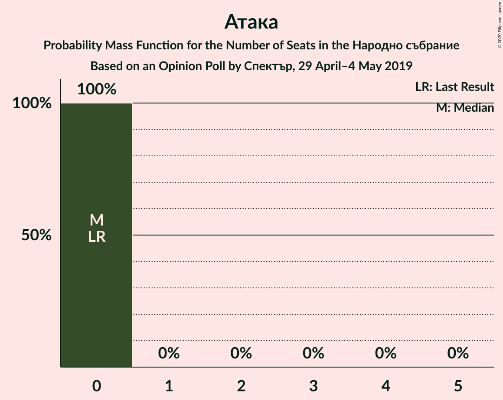

# Opinion Poll by Спектър, 29 April–4 May 2019

<a href="#voting-intentions">Voting Intentions</a> | <a href="#seats">Seats</a> | <a href="#coalitions">Coalitions</a> | <a href="#technical-information">Technical Information</a>

## Voting Intentions

### Confidence Intervals

| Party | Last Result | Poll Result | 80% Confidence Interval | 90% Confidence Interval | 95% Confidence Interval | 99% Confidence Interval |
|:-----:|:-----------:|:-----------:|:-----------------------:|:-----------------------:|:-----------------------:|:-----------------------:|
| Българска социалистическа партия | 27.9% | 33.2% | 31.3–35.2% |30.8–35.8% |30.3–36.2% |29.5–37.2% |
| Граждани за европейско развитие на България | 33.5% | 32.5% | 30.7–34.5% |30.1–35.0% |29.7–35.5% |28.8–36.5% |
| Движение за права и свободи | 9.2% | 8.5% | 7.5–9.8% |7.2–10.2% |7.0–10.5% |6.5–11.1% |
| Обединени Патриоти | 9.3% | 8.1% | 7.1–9.4% |6.8–9.7% |6.6–10.0% |6.1–10.6% |
| Демократична България | 0.0% | 4.2% | 3.4–5.1% |3.2–5.4% |3.1–5.6% |2.8–6.1% |
| Алтернатива за българско възраждане | 1.6% | 2.7% | 2.2–3.5% |2.0–3.8% |1.9–4.0% |1.6–4.4% |
| Воля | 4.3% | 1.9% | 1.5–2.6% |1.3–2.8% |1.2–3.0% |1.1–3.4% |
| Атака | 0.0% | 1.2% | 0.9–1.8% |0.8–2.0% |0.7–2.1% |0.6–2.4% |

*Note:* The poll result column reflects the actual value used in the calculations. Published results may vary slightly, and in addition be rounded to fewer digits.

## Seats

### Confidence Intervals

| Party | Last Result | Median | 80% Confidence Interval | 90% Confidence Interval | 95% Confidence Interval | 99% Confidence Interval |
|:-----:|:-----------:|:------:|:-----------------------:|:-----------------------:|:-----------------------:|:-----------------------:|
| <a href="#българска-социалистическа-партия">Българска социалистическа партия</a> | 80 | 93 | 87–100 |85–102 |84–103 |82–106 |
| <a href="#граждани-за-европейско-развитие-на-българия">Граждани за европейско развитие на България</a> | 95 | 91 | 85–97 |83–99 |82–101 |80–103 |
| <a href="#движение-за-права-и-свободи">Движение за права и свободи</a> | 26 | 23 | 21–27 |20–28 |19–29 |18–31 |
| <a href="#обединени-патриоти">Обединени Патриоти</a> | 27 | 23 | 20–28 |18–28 |18–28 |17–30 |
| <a href="#демократична-българия">Демократична България</a> | 0 | 12 | 0–14 |0–15 |0–16 |0–17 |
| <a href="#алтернатива-за-българско-възраждане">Алтернатива за българско възраждане</a> | 0 | 0 | 0 |0 |0 |0–12 |
| <a href="#воля">Воля</a> | 12 | 0 | 0 |0 |0 |0 |
| <a href="#атака">Атака</a> | 0 | 0 | 0 |0 |0 |0 |

### Българска социалистическа партия

*For a full overview of the results for this party, see the [Българска социалистическа партия](party-българскасоциалистическапартия.html) page.*

| Number of Seats | Probability | Accumulated | Special Marks |
|:---------------:|:-----------:|:-----------:|:-------------:|
| 79 | 0% | 100% |  |
| 80 | 0.1% | 99.9% | Last Result |
| 81 | 0.2% | 99.8% |  |
| 82 | 1.5% | 99.6% |  |
| 83 | 0.2% | 98% |  |
| 84 | 2% | 98% |  |
| 85 | 2% | 96% |  |
| 86 | 3% | 94% |  |
| 87 | 3% | 91% |  |
| 88 | 6% | 88% |  |
| 89 | 4% | 82% |  |
| 90 | 2% | 78% |  |
| 91 | 5% | 76% |  |
| 92 | 16% | 71% |  |
| 93 | 9% | 54% | Median |
| 94 | 16% | 45% |  |
| 95 | 5% | 29% |  |
| 96 | 5% | 24% |  |
| 97 | 5% | 19% |  |
| 98 | 2% | 15% |  |
| 99 | 2% | 12% |  |
| 100 | 4% | 10% |  |
| 101 | 0.7% | 6% |  |
| 102 | 0.9% | 5% |  |
| 103 | 4% | 4% |  |
| 104 | 0.1% | 0.7% |  |
| 105 | 0% | 0.6% |  |
| 106 | 0.4% | 0.5% |  |
| 107 | 0.1% | 0.2% |  |
| 108 | 0% | 0.1% |  |
| 109 | 0.1% | 0.1% |  |
| 110 | 0% | 0% |  |

### Граждани за европейско развитие на България

*For a full overview of the results for this party, see the [Граждани за европейско развитие на България](party-гражданизаевропейскоразвитиенабългария.html) page.*

| Number of Seats | Probability | Accumulated | Special Marks |
|:---------------:|:-----------:|:-----------:|:-------------:|
| 77 | 0.1% | 100% |  |
| 78 | 0.1% | 99.9% |  |
| 79 | 0.3% | 99.8% |  |
| 80 | 0.1% | 99.5% |  |
| 81 | 0.2% | 99.4% |  |
| 82 | 4% | 99.2% |  |
| 83 | 1.2% | 95% |  |
| 84 | 4% | 94% |  |
| 85 | 4% | 90% |  |
| 86 | 5% | 87% |  |
| 87 | 6% | 82% |  |
| 88 | 4% | 77% |  |
| 89 | 18% | 73% |  |
| 90 | 3% | 55% |  |
| 91 | 6% | 52% | Median |
| 92 | 8% | 46% |  |
| 93 | 4% | 37% |  |
| 94 | 5% | 33% |  |
| 95 | 6% | 28% | Last Result |
| 96 | 8% | 22% |  |
| 97 | 7% | 14% |  |
| 98 | 2% | 7% |  |
| 99 | 1.2% | 5% |  |
| 100 | 0.7% | 4% |  |
| 101 | 0.8% | 3% |  |
| 102 | 1.4% | 2% |  |
| 103 | 0.5% | 0.9% |  |
| 104 | 0.3% | 0.5% |  |
| 105 | 0.1% | 0.2% |  |
| 106 | 0% | 0.1% |  |
| 107 | 0% | 0% |  |

### Движение за права и свободи

*For a full overview of the results for this party, see the [Движение за права и свободи](party-движениезаправаисвободи.html) page.*

| Number of Seats | Probability | Accumulated | Special Marks |
|:---------------:|:-----------:|:-----------:|:-------------:|
| 17 | 0.2% | 100% |  |
| 18 | 0.5% | 99.8% |  |
| 19 | 4% | 99.3% |  |
| 20 | 5% | 95% |  |
| 21 | 6% | 90% |  |
| 22 | 9% | 84% |  |
| 23 | 25% | 75% | Median |
| 24 | 19% | 50% |  |
| 25 | 5% | 30% |  |
| 26 | 10% | 25% | Last Result |
| 27 | 8% | 15% |  |
| 28 | 4% | 7% |  |
| 29 | 1.1% | 4% |  |
| 30 | 1.3% | 2% |  |
| 31 | 0.9% | 1.1% |  |
| 32 | 0.1% | 0.2% |  |
| 33 | 0.1% | 0.1% |  |
| 34 | 0% | 0% |  |

### Обединени Патриоти

*For a full overview of the results for this party, see the [Обединени Патриоти](party-обединенипатриоти.html) page.*

| Number of Seats | Probability | Accumulated | Special Marks |
|:---------------:|:-----------:|:-----------:|:-------------:|
| 16 | 0.4% | 100% |  |
| 17 | 0.6% | 99.6% |  |
| 18 | 5% | 98.9% |  |
| 19 | 2% | 94% |  |
| 20 | 6% | 92% |  |
| 21 | 7% | 86% |  |
| 22 | 23% | 79% |  |
| 23 | 12% | 56% | Median |
| 24 | 10% | 44% |  |
| 25 | 7% | 34% |  |
| 26 | 14% | 27% |  |
| 27 | 3% | 13% | Last Result |
| 28 | 9% | 10% |  |
| 29 | 0.2% | 1.2% |  |
| 30 | 0.8% | 1.0% |  |
| 31 | 0.1% | 0.2% |  |
| 32 | 0.1% | 0.1% |  |
| 33 | 0% | 0% |  |

### Демократична България

*For a full overview of the results for this party, see the [Демократична България](party-демократичнабългария.html) page.*

| Number of Seats | Probability | Accumulated | Special Marks |
|:---------------:|:-----------:|:-----------:|:-------------:|
| 0 | 32% | 100% | Last Result |
| 1 | 0% | 68% |  |
| 2 | 0% | 68% |  |
| 3 | 0% | 68% |  |
| 4 | 0% | 68% |  |
| 5 | 0% | 68% |  |
| 6 | 0% | 68% |  |
| 7 | 0% | 68% |  |
| 8 | 0% | 68% |  |
| 9 | 0% | 68% |  |
| 10 | 0% | 68% |  |
| 11 | 6% | 68% |  |
| 12 | 28% | 62% | Median |
| 13 | 19% | 34% |  |
| 14 | 8% | 15% |  |
| 15 | 5% | 8% |  |
| 16 | 2% | 3% |  |
| 17 | 0.6% | 0.9% |  |
| 18 | 0.3% | 0.3% |  |
| 19 | 0% | 0% |  |

### Алтернатива за българско възраждане

*For a full overview of the results for this party, see the [Алтернатива за българско възраждане](party-алтернативазабългарсковъзраждане.html) page.*

| Number of Seats | Probability | Accumulated | Special Marks |
|:---------------:|:-----------:|:-----------:|:-------------:|
| 0 | 98.8% | 100% | Last Result, Median |
| 1 | 0% | 1.2% |  |
| 2 | 0% | 1.2% |  |
| 3 | 0% | 1.2% |  |
| 4 | 0% | 1.2% |  |
| 5 | 0% | 1.2% |  |
| 6 | 0% | 1.2% |  |
| 7 | 0% | 1.2% |  |
| 8 | 0% | 1.2% |  |
| 9 | 0% | 1.2% |  |
| 10 | 0% | 1.2% |  |
| 11 | 0.4% | 1.2% |  |
| 12 | 0.6% | 0.8% |  |
| 13 | 0.2% | 0.2% |  |
| 14 | 0% | 0% |  |

### Воля

*For a full overview of the results for this party, see the [Воля](party-воля.html) page.*

| Number of Seats | Probability | Accumulated | Special Marks |
|:---------------:|:-----------:|:-----------:|:-------------:|
| 0 | 100% | 100% | Median |
| 1 | 0% | 0% |  |
| 2 | 0% | 0% |  |
| 3 | 0% | 0% |  |
| 4 | 0% | 0% |  |
| 5 | 0% | 0% |  |
| 6 | 0% | 0% |  |
| 7 | 0% | 0% |  |
| 8 | 0% | 0% |  |
| 9 | 0% | 0% |  |
| 10 | 0% | 0% |  |
| 11 | 0% | 0% |  |
| 12 | 0% | 0% | Last Result |

### Атака

*For a full overview of the results for this party, see the [Атака](party-атака.html) page.*

| Number of Seats | Probability | Accumulated | Special Marks |
|:---------------:|:-----------:|:-----------:|:-------------:|
| 0 | 100% | 100% | Last Result, Median |

## Coalitions

### Confidence Intervals

| Coalition | Last Result | Median | Majority? | 80% Confidence Interval | 90% Confidence Interval | 95% Confidence Interval | 99% Confidence Interval |
|:---------:|:-----------:|:------:|:---------:|:-----------------------:|:-----------------------:|:-----------------------:|:-----------------------:|
| Българска социалистическа партия – Движение за права и свободи | 106 | 117 | 20% | 110–124 | 109–127 | 108–127 | 105–131 |
| Граждани за европейско развитие на България – Обединени Патриоти | 122 | 114 | 15% | 108–124 | 107–125 | 105–125 | 103–129 |

### Българска социалистическа партия – Движение за права и свободи

| Number of Seats | Probability | Accumulated | Special Marks |
|:---------------:|:-----------:|:-----------:|:-------------:|
| 102 | 0.1% | 100% |  |
| 103 | 0.1% | 99.9% |  |
| 104 | 0.1% | 99.8% |  |
| 105 | 2% | 99.8% |  |
| 106 | 0.2% | 98% | Last Result |
| 107 | 0.4% | 98% |  |
| 108 | 1.2% | 98% |  |
| 109 | 3% | 96% |  |
| 110 | 7% | 94% |  |
| 111 | 3% | 87% |  |
| 112 | 4% | 84% |  |
| 113 | 7% | 80% |  |
| 114 | 2% | 73% |  |
| 115 | 10% | 71% |  |
| 116 | 11% | 61% | Median |
| 117 | 16% | 50% |  |
| 118 | 2% | 34% |  |
| 119 | 5% | 32% |  |
| 120 | 6% | 27% |  |
| 121 | 3% | 20% | Majority |
| 122 | 3% | 18% |  |
| 123 | 4% | 15% |  |
| 124 | 2% | 10% |  |
| 125 | 0.2% | 9% |  |
| 126 | 3% | 9% |  |
| 127 | 3% | 5% |  |
| 128 | 0.1% | 2% |  |
| 129 | 0.1% | 2% |  |
| 130 | 0.2% | 2% |  |
| 131 | 1.4% | 1.5% |  |
| 132 | 0% | 0.1% |  |
| 133 | 0% | 0.1% |  |
| 134 | 0% | 0.1% |  |
| 135 | 0% | 0% |  |

### Граждани за европейско развитие на България – Обединени Патриоти

| Number of Seats | Probability | Accumulated | Special Marks |
|:---------------:|:-----------:|:-----------:|:-------------:|
| 99 | 0% | 100% |  |
| 100 | 0.1% | 99.9% |  |
| 101 | 0.1% | 99.9% |  |
| 102 | 0.2% | 99.8% |  |
| 103 | 0.7% | 99.6% |  |
| 104 | 1.0% | 98.9% |  |
| 105 | 1.1% | 98% |  |
| 106 | 1.0% | 97% |  |
| 107 | 5% | 96% |  |
| 108 | 3% | 91% |  |
| 109 | 5% | 88% |  |
| 110 | 6% | 82% |  |
| 111 | 18% | 77% |  |
| 112 | 2% | 59% |  |
| 113 | 6% | 57% |  |
| 114 | 6% | 51% | Median |
| 115 | 7% | 46% |  |
| 116 | 4% | 38% |  |
| 117 | 5% | 35% |  |
| 118 | 9% | 29% |  |
| 119 | 2% | 20% |  |
| 120 | 3% | 18% |  |
| 121 | 3% | 15% | Majority |
| 122 | 3% | 13% | Last Result |
| 123 | 0% | 10% |  |
| 124 | 2% | 10% |  |
| 125 | 7% | 8% |  |
| 126 | 0.1% | 1.3% |  |
| 127 | 0.2% | 1.1% |  |
| 128 | 0.3% | 0.9% |  |
| 129 | 0.5% | 0.6% |  |
| 130 | 0.1% | 0.2% |  |
| 131 | 0% | 0.1% |  |
| 132 | 0% | 0% |  |

## Technical Information

### Opinion Poll

+ **Polling firm:** Спектър
+ **Commissioner(s):** —
+ **Fieldwork period:** 29 April–4 May 2019

### Calculations

+ **Sample size:** 984
+ **Simulations done:** 131,072
+ **Error estimate:** 2.45%

