# Opinion Poll by Спектър for IMP, 7–14 May 2019

<a href="#voting-intentions">Voting Intentions</a> | <a href="#seats">Seats</a> | <a href="#coalitions">Coalitions</a> | <a href="#technical-information">Technical Information</a>

## Voting Intentions

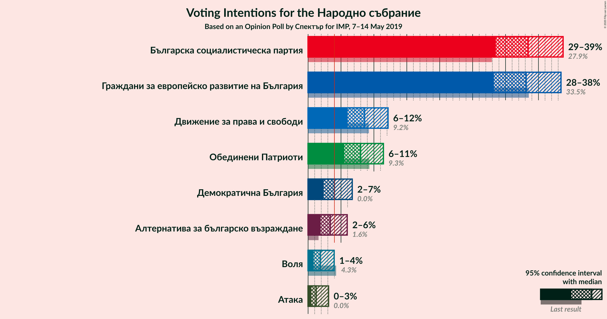

### Confidence Intervals

| Party | Last Result | Poll Result | 80% Confidence Interval | 90% Confidence Interval | 95% Confidence Interval | 99% Confidence Interval |
|:-----:|:-----------:|:-----------:|:-----------------------:|:-----------------------:|:-----------------------:|:-----------------------:|
| Българска социалистическа партия | 27.9% | 33.4% | 30.2–36.9% |29.3–37.9% |28.5–38.7% |27.0–40.4% |
| Граждани за европейско развитие на България | 33.5% | 33.1% | 29.9–36.6% |29.0–37.6% |28.2–38.4% |26.7–40.1% |
| Движение за права и свободи | 9.2% | 8.6% | 6.9–10.9% |6.4–11.6% |6.0–12.1% |5.3–13.3% |
| Обединени Патриоти | 9.3% | 8.0% | 6.3–10.2% |5.9–10.9% |5.5–11.4% |4.8–12.6% |
| Демократична България | 0.0% | 4.0% | 2.9–5.7% |2.6–6.2% |2.3–6.7% |1.9–7.7% |
| Алтернатива за българско възраждане | 1.6% | 3.4% | 2.4–5.0% |2.1–5.5% |1.9–5.9% |1.5–6.8% |
| Воля | 4.3% | 1.8% | 1.2–3.2% |1.0–3.6% |0.9–4.0% |0.6–4.7% |
| Атака | 0.0% | 1.2% | 0.7–2.4% |0.6–2.8% |0.5–3.1% |0.3–3.8% |

*Note:* The poll result column reflects the actual value used in the calculations. Published results may vary slightly, and in addition be rounded to fewer digits.

## Seats

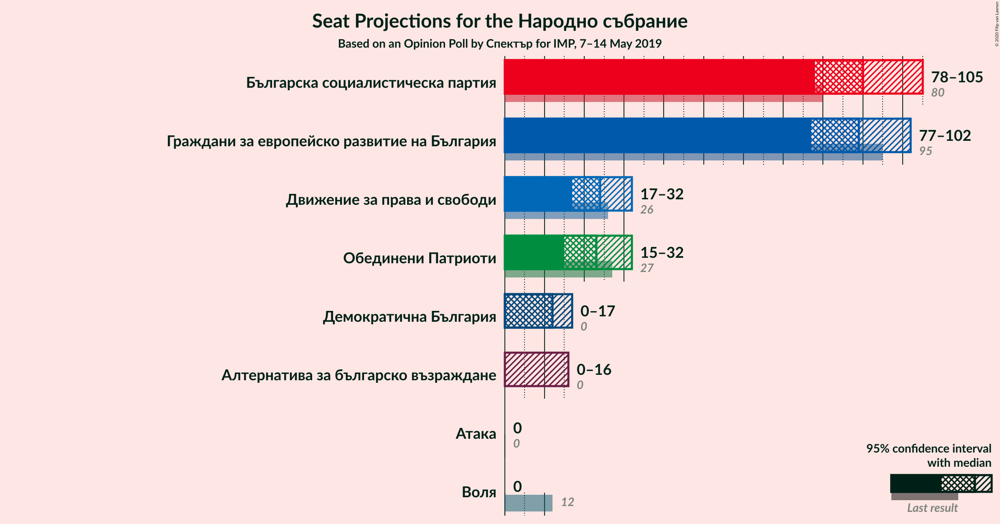

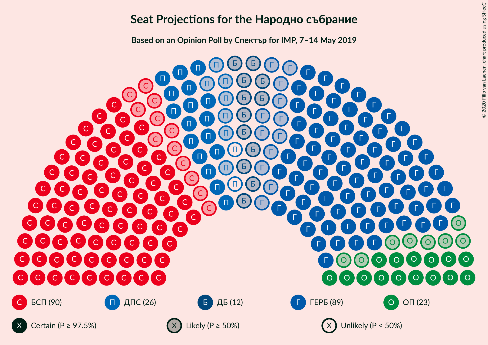

### Confidence Intervals

| Party | Last Result | Median | 80% Confidence Interval | 90% Confidence Interval | 95% Confidence Interval | 99% Confidence Interval |
|:-----:|:-----------:|:------:|:-----------------------:|:-----------------------:|:-----------------------:|:-----------------------:|
| <a href="#българска-социалистическа-партия">Българска социалистическа партия</a> | 80 | 90 | 82–103 |79–105 |78–105 |74–109 |
| <a href="#граждани-за-европейско-развитие-на-българия">Граждани за европейско развитие на България</a> | 95 | 89 | 79–100 |78–101 |77–102 |72–109 |
| <a href="#движение-за-права-и-свободи">Движение за права и свободи</a> | 26 | 24 | 20–28 |18–30 |17–32 |15–36 |
| <a href="#обединени-патриоти">Обединени Патриоти</a> | 27 | 23 | 17–28 |16–30 |15–32 |13–34 |
| <a href="#демократична-българия">Демократична България</a> | 0 | 12 | 0–16 |0–17 |0–17 |0–21 |
| <a href="#алтернатива-за-българско-възраждане">Алтернатива за българско възраждане</a> | 0 | 0 | 0–14 |0–15 |0–16 |0–18 |
| <a href="#воля">Воля</a> | 12 | 0 | 0 |0 |0 |0–12 |
| <a href="#атака">Атака</a> | 0 | 0 | 0 |0 |0 |0 |

### Българска социалистическа партия

*For a full overview of the results for this party, see the [Българска социалистическа партия](party-българскасоциалистическапартия.html) page.*

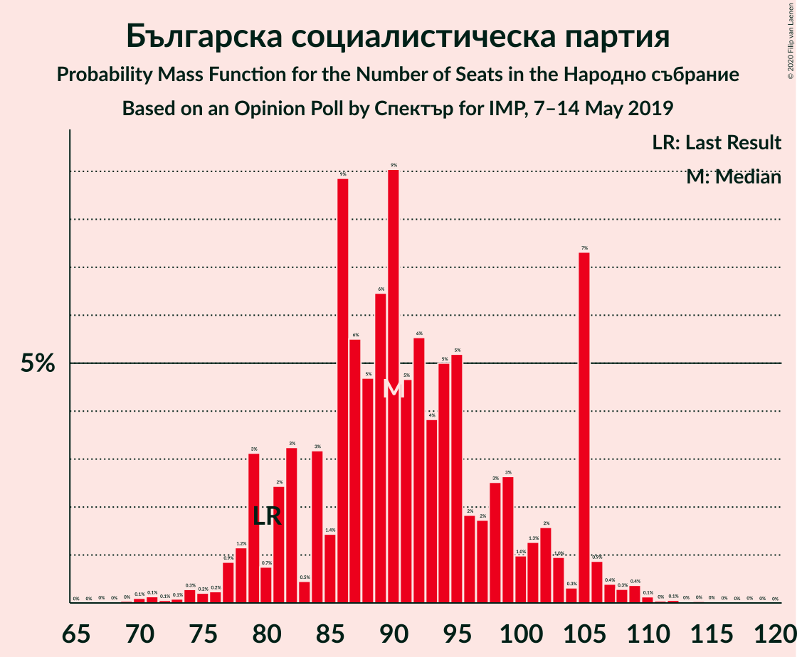

| Number of Seats | Probability | Accumulated | Special Marks |
|:---------------:|:-----------:|:-----------:|:-------------:|
| 68 | 0% | 100% |  |
| 69 | 0% | 99.9% |  |
| 70 | 0.1% | 99.9% |  |
| 71 | 0.1% | 99.8% |  |
| 72 | 0.1% | 99.7% |  |
| 73 | 0.1% | 99.6% |  |
| 74 | 0.3% | 99.5% |  |
| 75 | 0.2% | 99.3% |  |
| 76 | 0.2% | 99.0% |  |
| 77 | 0.9% | 98.8% |  |
| 78 | 1.2% | 98% |  |
| 79 | 3% | 97% |  |
| 80 | 0.7% | 94% | Last Result |
| 81 | 2% | 93% |  |
| 82 | 3% | 90% |  |
| 83 | 0.5% | 87% |  |
| 84 | 3% | 87% |  |
| 85 | 1.4% | 84% |  |
| 86 | 9% | 82% |  |
| 87 | 6% | 73% |  |
| 88 | 5% | 68% |  |
| 89 | 6% | 63% |  |
| 90 | 9% | 57% | Median |
| 91 | 5% | 48% |  |
| 92 | 6% | 43% |  |
| 93 | 4% | 37% |  |
| 94 | 5% | 34% |  |
| 95 | 5% | 29% |  |
| 96 | 2% | 23% |  |
| 97 | 2% | 22% |  |
| 98 | 3% | 20% |  |
| 99 | 3% | 17% |  |
| 100 | 1.0% | 15% |  |
| 101 | 1.3% | 14% |  |
| 102 | 2% | 12% |  |
| 103 | 1.0% | 11% |  |
| 104 | 0.3% | 10% |  |
| 105 | 7% | 10% |  |
| 106 | 0.9% | 2% |  |
| 107 | 0.4% | 1.4% |  |
| 108 | 0.3% | 1.0% |  |
| 109 | 0.4% | 0.7% |  |
| 110 | 0.1% | 0.4% |  |
| 111 | 0% | 0.2% |  |
| 112 | 0.1% | 0.2% |  |
| 113 | 0% | 0.1% |  |
| 114 | 0% | 0.1% |  |
| 115 | 0% | 0.1% |  |
| 116 | 0% | 0.1% |  |
| 117 | 0% | 0% |  |

### Граждани за европейско развитие на България

*For a full overview of the results for this party, see the [Граждани за европейско развитие на България](party-гражданизаевропейскоразвитиенабългария.html) page.*

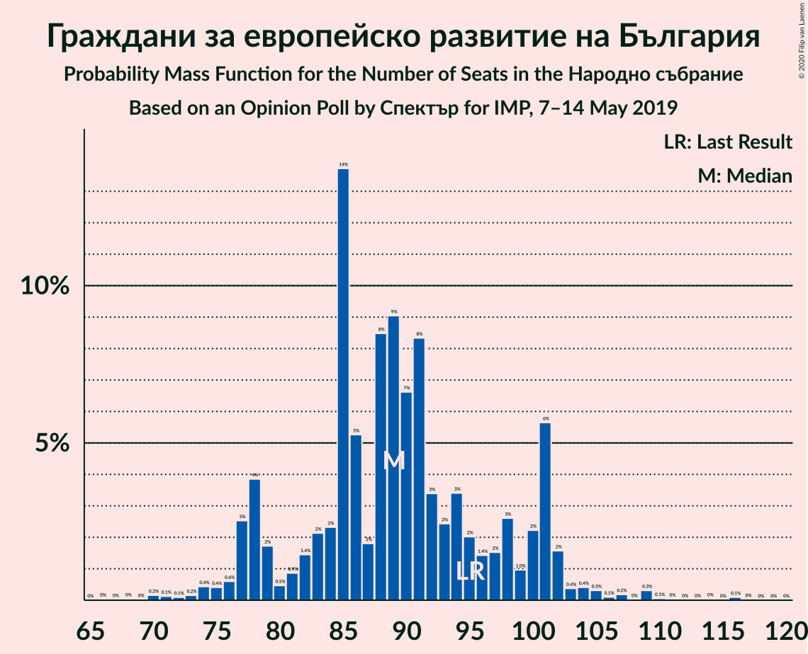

| Number of Seats | Probability | Accumulated | Special Marks |
|:---------------:|:-----------:|:-----------:|:-------------:|
| 66 | 0% | 100% |  |
| 67 | 0% | 99.9% |  |
| 68 | 0% | 99.9% |  |
| 69 | 0% | 99.9% |  |
| 70 | 0.2% | 99.9% |  |
| 71 | 0.1% | 99.7% |  |
| 72 | 0.1% | 99.6% |  |
| 73 | 0.2% | 99.5% |  |
| 74 | 0.4% | 99.3% |  |
| 75 | 0.4% | 98.9% |  |
| 76 | 0.6% | 98% |  |
| 77 | 3% | 98% |  |
| 78 | 4% | 95% |  |
| 79 | 2% | 91% |  |
| 80 | 0.5% | 90% |  |
| 81 | 0.9% | 89% |  |
| 82 | 1.4% | 88% |  |
| 83 | 2% | 87% |  |
| 84 | 2% | 85% |  |
| 85 | 14% | 83% |  |
| 86 | 5% | 69% |  |
| 87 | 2% | 64% |  |
| 88 | 8% | 62% |  |
| 89 | 9% | 53% | Median |
| 90 | 7% | 44% |  |
| 91 | 8% | 38% |  |
| 92 | 3% | 29% |  |
| 93 | 2% | 26% |  |
| 94 | 3% | 23% |  |
| 95 | 2% | 20% | Last Result |
| 96 | 1.4% | 18% |  |
| 97 | 2% | 17% |  |
| 98 | 3% | 15% |  |
| 99 | 1.0% | 12% |  |
| 100 | 2% | 11% |  |
| 101 | 6% | 9% |  |
| 102 | 2% | 4% |  |
| 103 | 0.4% | 2% |  |
| 104 | 0.4% | 2% |  |
| 105 | 0.3% | 1.2% |  |
| 106 | 0.1% | 0.9% |  |
| 107 | 0.2% | 0.8% |  |
| 108 | 0% | 0.6% |  |
| 109 | 0.3% | 0.6% |  |
| 110 | 0.1% | 0.3% |  |
| 111 | 0% | 0.3% |  |
| 112 | 0% | 0.2% |  |
| 113 | 0% | 0.2% |  |
| 114 | 0% | 0.2% |  |
| 115 | 0% | 0.2% |  |
| 116 | 0.1% | 0.1% |  |
| 117 | 0% | 0% |  |

### Движение за права и свободи

*For a full overview of the results for this party, see the [Движение за права и свободи](party-движениезаправаисвободи.html) page.*

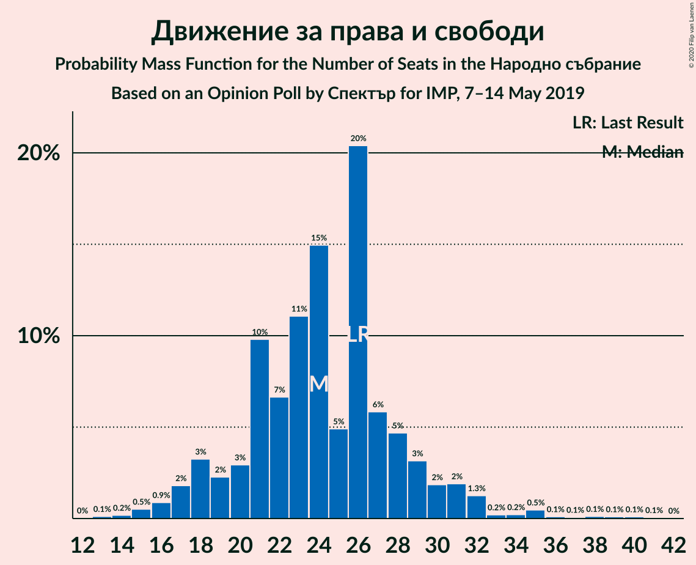

| Number of Seats | Probability | Accumulated | Special Marks |
|:---------------:|:-----------:|:-----------:|:-------------:|
| 13 | 0.1% | 100% |  |
| 14 | 0.2% | 99.8% |  |
| 15 | 0.5% | 99.6% |  |
| 16 | 0.9% | 99.1% |  |
| 17 | 2% | 98% |  |
| 18 | 3% | 96% |  |
| 19 | 2% | 93% |  |
| 20 | 3% | 91% |  |
| 21 | 10% | 88% |  |
| 22 | 7% | 78% |  |
| 23 | 11% | 72% |  |
| 24 | 15% | 60% | Median |
| 25 | 5% | 45% |  |
| 26 | 20% | 41% | Last Result |
| 27 | 6% | 20% |  |
| 28 | 5% | 14% |  |
| 29 | 3% | 10% |  |
| 30 | 2% | 7% |  |
| 31 | 2% | 5% |  |
| 32 | 1.3% | 3% |  |
| 33 | 0.2% | 1.5% |  |
| 34 | 0.2% | 1.3% |  |
| 35 | 0.5% | 1.1% |  |
| 36 | 0.1% | 0.6% |  |
| 37 | 0.1% | 0.5% |  |
| 38 | 0.1% | 0.4% |  |
| 39 | 0.1% | 0.3% |  |
| 40 | 0.1% | 0.2% |  |
| 41 | 0.1% | 0.1% |  |
| 42 | 0% | 0% |  |

### Обединени Патриоти

*For a full overview of the results for this party, see the [Обединени Патриоти](party-обединенипатриоти.html) page.*

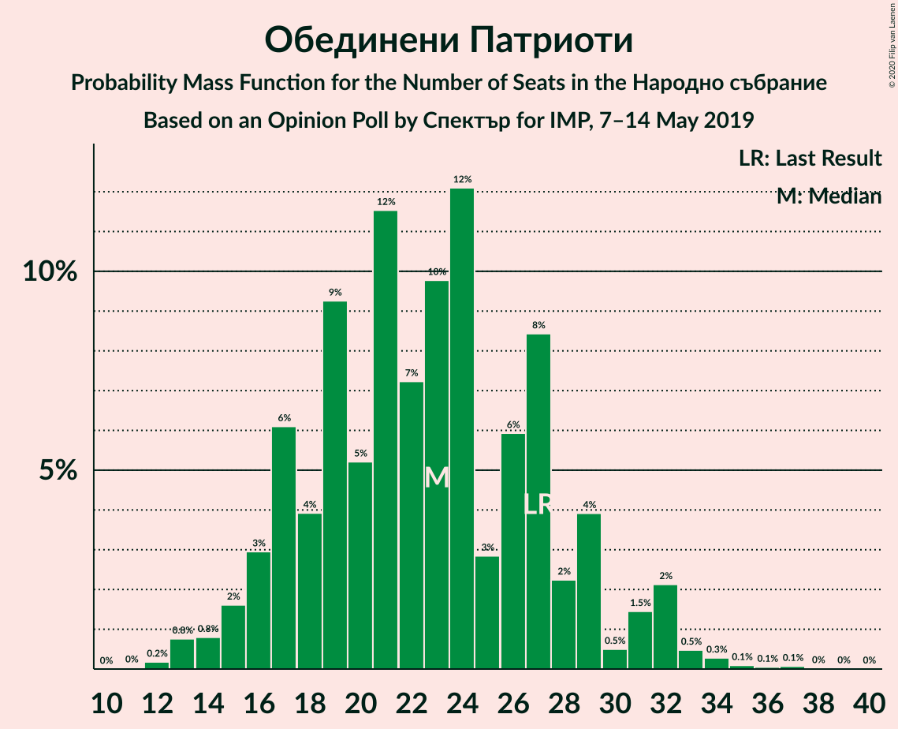

| Number of Seats | Probability | Accumulated | Special Marks |
|:---------------:|:-----------:|:-----------:|:-------------:|
| 11 | 0% | 100% |  |
| 12 | 0.2% | 99.9% |  |
| 13 | 0.8% | 99.8% |  |
| 14 | 0.8% | 99.0% |  |
| 15 | 2% | 98% |  |
| 16 | 3% | 97% |  |
| 17 | 6% | 94% |  |
| 18 | 4% | 88% |  |
| 19 | 9% | 84% |  |
| 20 | 5% | 74% |  |
| 21 | 12% | 69% |  |
| 22 | 7% | 58% |  |
| 23 | 10% | 50% | Median |
| 24 | 12% | 41% |  |
| 25 | 3% | 28% |  |
| 26 | 6% | 26% |  |
| 27 | 8% | 20% | Last Result |
| 28 | 2% | 11% |  |
| 29 | 4% | 9% |  |
| 30 | 0.5% | 5% |  |
| 31 | 1.5% | 5% |  |
| 32 | 2% | 3% |  |
| 33 | 0.5% | 1.0% |  |
| 34 | 0.3% | 0.6% |  |
| 35 | 0.1% | 0.3% |  |
| 36 | 0.1% | 0.2% |  |
| 37 | 0.1% | 0.1% |  |
| 38 | 0% | 0.1% |  |
| 39 | 0% | 0% |  |

### Демократична България

*For a full overview of the results for this party, see the [Демократична България](party-демократичнабългария.html) page.*

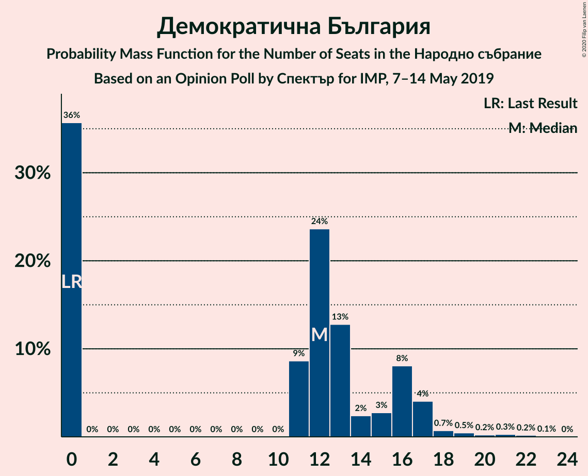

| Number of Seats | Probability | Accumulated | Special Marks |
|:---------------:|:-----------:|:-----------:|:-------------:|
| 0 | 36% | 100% | Last Result |
| 1 | 0% | 64% |  |
| 2 | 0% | 64% |  |
| 3 | 0% | 64% |  |
| 4 | 0% | 64% |  |
| 5 | 0% | 64% |  |
| 6 | 0% | 64% |  |
| 7 | 0% | 64% |  |
| 8 | 0% | 64% |  |
| 9 | 0% | 64% |  |
| 10 | 0% | 64% |  |
| 11 | 9% | 64% |  |
| 12 | 24% | 56% | Median |
| 13 | 13% | 32% |  |
| 14 | 2% | 19% |  |
| 15 | 3% | 17% |  |
| 16 | 8% | 14% |  |
| 17 | 4% | 6% |  |
| 18 | 0.7% | 2% |  |
| 19 | 0.5% | 1.3% |  |
| 20 | 0.2% | 0.8% |  |
| 21 | 0.3% | 0.6% |  |
| 22 | 0.2% | 0.3% |  |
| 23 | 0.1% | 0.1% |  |
| 24 | 0% | 0% |  |

### Алтернатива за българско възраждане

*For a full overview of the results for this party, see the [Алтернатива за българско възраждане](party-алтернативазабългарсковъзраждане.html) page.*

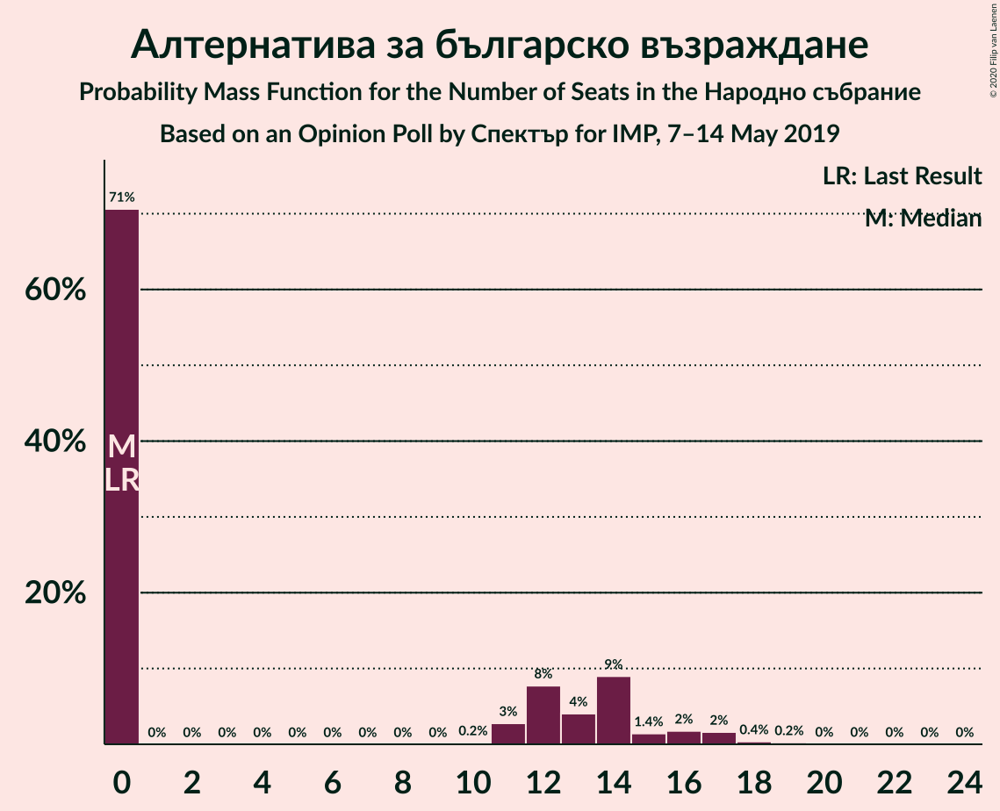

| Number of Seats | Probability | Accumulated | Special Marks |
|:---------------:|:-----------:|:-----------:|:-------------:|
| 0 | 71% | 100% | Last Result, Median |
| 1 | 0% | 29% |  |
| 2 | 0% | 29% |  |
| 3 | 0% | 29% |  |
| 4 | 0% | 29% |  |
| 5 | 0% | 29% |  |
| 6 | 0% | 29% |  |
| 7 | 0% | 29% |  |
| 8 | 0% | 29% |  |
| 9 | 0% | 29% |  |
| 10 | 0.2% | 29% |  |
| 11 | 3% | 29% |  |
| 12 | 8% | 26% |  |
| 13 | 4% | 19% |  |
| 14 | 9% | 15% |  |
| 15 | 1.4% | 6% |  |
| 16 | 2% | 4% |  |
| 17 | 2% | 2% |  |
| 18 | 0.4% | 0.8% |  |
| 19 | 0.2% | 0.4% |  |
| 20 | 0% | 0.1% |  |
| 21 | 0% | 0.1% |  |
| 22 | 0% | 0.1% |  |
| 23 | 0% | 0% |  |

### Воля

*For a full overview of the results for this party, see the [Воля](party-воля.html) page.*

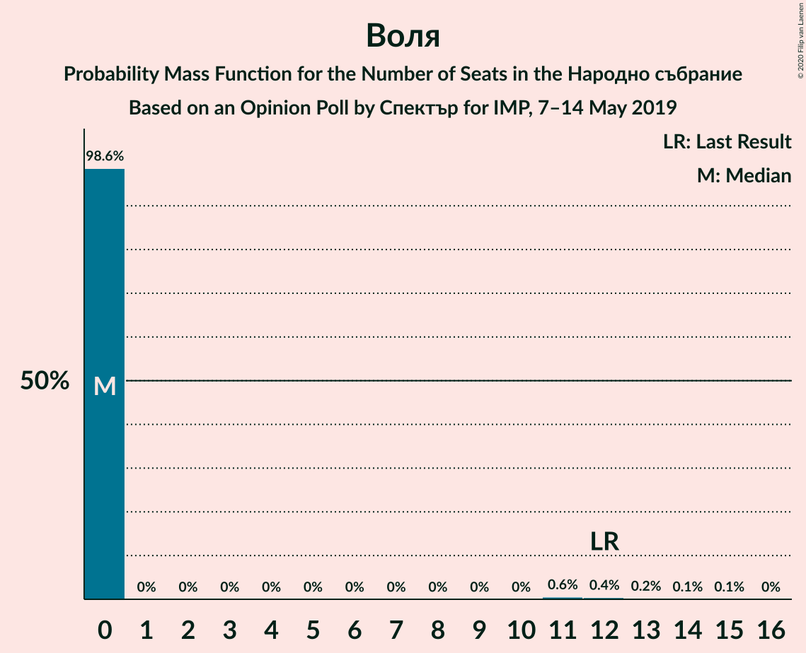

| Number of Seats | Probability | Accumulated | Special Marks |
|:---------------:|:-----------:|:-----------:|:-------------:|
| 0 | 98.6% | 100% | Median |
| 1 | 0% | 1.4% |  |
| 2 | 0% | 1.4% |  |
| 3 | 0% | 1.4% |  |
| 4 | 0% | 1.4% |  |
| 5 | 0% | 1.4% |  |
| 6 | 0% | 1.4% |  |
| 7 | 0% | 1.4% |  |
| 8 | 0% | 1.4% |  |
| 9 | 0% | 1.4% |  |
| 10 | 0% | 1.4% |  |
| 11 | 0.6% | 1.4% |  |
| 12 | 0.4% | 0.8% | Last Result |
| 13 | 0.2% | 0.4% |  |
| 14 | 0.1% | 0.2% |  |
| 15 | 0.1% | 0.1% |  |
| 16 | 0% | 0% |  |

### Атака

*For a full overview of the results for this party, see the [Атака](party-атака.html) page.*

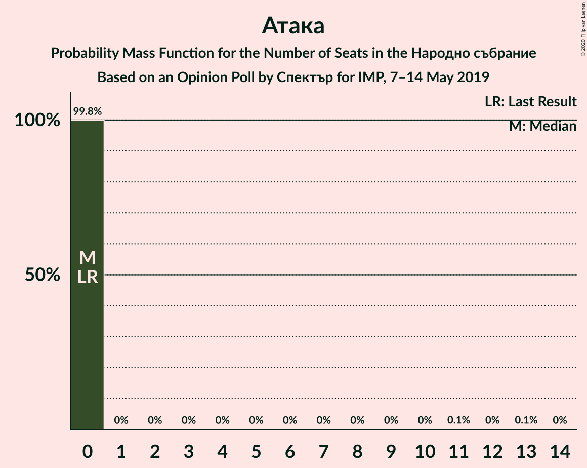

| Number of Seats | Probability | Accumulated | Special Marks |
|:---------------:|:-----------:|:-----------:|:-------------:|
| 0 | 99.8% | 100% | Last Result, Median |
| 1 | 0% | 0.2% |  |
| 2 | 0% | 0.2% |  |
| 3 | 0% | 0.2% |  |
| 4 | 0% | 0.2% |  |
| 5 | 0% | 0.2% |  |
| 6 | 0% | 0.2% |  |
| 7 | 0% | 0.2% |  |
| 8 | 0% | 0.2% |  |
| 9 | 0% | 0.2% |  |
| 10 | 0% | 0.2% |  |
| 11 | 0.1% | 0.2% |  |
| 12 | 0% | 0.1% |  |
| 13 | 0.1% | 0.1% |  |
| 14 | 0% | 0% |  |

## Coalitions

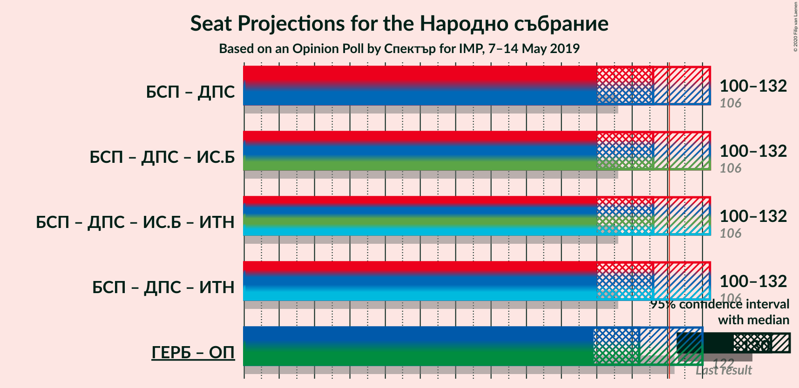

### Confidence Intervals

| Coalition | Last Result | Median | Majority? | 80% Confidence Interval | 90% Confidence Interval | 95% Confidence Interval | 99% Confidence Interval |
|:---------:|:-----------:|:------:|:---------:|:-----------------------:|:-----------------------:|:-----------------------:|:-----------------------:|
| Българска социалистическа партия – Движение за права и свободи | 106 | 116 | 22% | 104–129 | 102–132 | 100–132 | 96–135 |
| Граждани за европейско развитие на България – Обединени Патриоти | 122 | 112 | 15% | 101–125 | 100–126 | 99–130 | 93–134 |

### Българска социалистическа партия – Движение за права и свободи

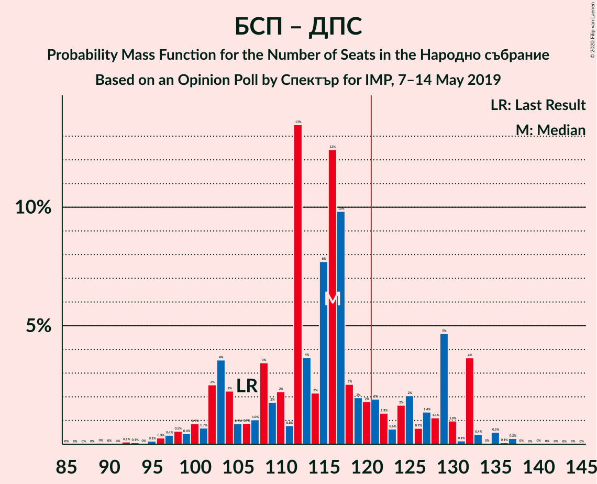

| Number of Seats | Probability | Accumulated | Special Marks |
|:---------------:|:-----------:|:-----------:|:-------------:|
| 89 | 0% | 100% |  |
| 90 | 0% | 99.9% |  |
| 91 | 0% | 99.9% |  |
| 92 | 0.1% | 99.9% |  |
| 93 | 0.1% | 99.8% |  |
| 94 | 0% | 99.7% |  |
| 95 | 0.1% | 99.7% |  |
| 96 | 0.3% | 99.6% |  |
| 97 | 0.4% | 99.3% |  |
| 98 | 0.5% | 98.9% |  |
| 99 | 0.4% | 98% |  |
| 100 | 0.9% | 98% |  |
| 101 | 0.7% | 97% |  |
| 102 | 3% | 96% |  |
| 103 | 4% | 94% |  |
| 104 | 2% | 90% |  |
| 105 | 0.9% | 88% |  |
| 106 | 0.9% | 87% | Last Result |
| 107 | 1.0% | 86% |  |
| 108 | 3% | 85% |  |
| 109 | 2% | 82% |  |
| 110 | 2% | 80% |  |
| 111 | 0.8% | 78% |  |
| 112 | 13% | 77% |  |
| 113 | 4% | 64% |  |
| 114 | 2% | 60% | Median |
| 115 | 8% | 58% |  |
| 116 | 12% | 50% |  |
| 117 | 10% | 38% |  |
| 118 | 3% | 28% |  |
| 119 | 2% | 25% |  |
| 120 | 2% | 23% |  |
| 121 | 2% | 22% | Majority |
| 122 | 1.3% | 20% |  |
| 123 | 0.6% | 18% |  |
| 124 | 2% | 18% |  |
| 125 | 2% | 16% |  |
| 126 | 0.7% | 14% |  |
| 127 | 1.4% | 13% |  |
| 128 | 1.1% | 12% |  |
| 129 | 5% | 11% |  |
| 130 | 1.0% | 6% |  |
| 131 | 0.1% | 5% |  |
| 132 | 4% | 5% |  |
| 133 | 0.4% | 1.4% |  |
| 134 | 0% | 1.0% |  |
| 135 | 0.5% | 0.9% |  |
| 136 | 0.1% | 0.4% |  |
| 137 | 0.2% | 0.4% |  |
| 138 | 0% | 0.1% |  |
| 139 | 0% | 0.1% |  |
| 140 | 0% | 0.1% |  |
| 141 | 0% | 0.1% |  |
| 142 | 0% | 0.1% |  |
| 143 | 0% | 0% |  |

### Граждани за европейско развитие на България – Обединени Патриоти

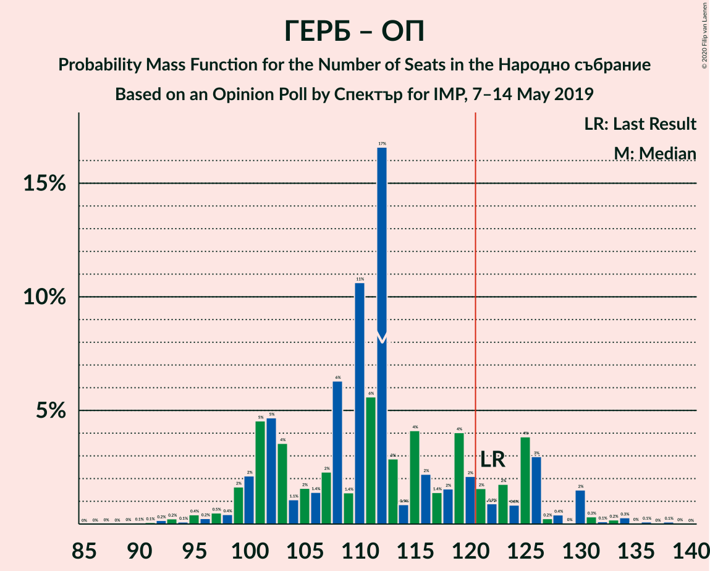

| Number of Seats | Probability | Accumulated | Special Marks |
|:---------------:|:-----------:|:-----------:|:-------------:|
| 87 | 0% | 100% |  |
| 88 | 0% | 99.9% |  |
| 89 | 0% | 99.9% |  |
| 90 | 0.1% | 99.9% |  |
| 91 | 0.1% | 99.8% |  |
| 92 | 0.2% | 99.8% |  |
| 93 | 0.2% | 99.6% |  |
| 94 | 0.1% | 99.4% |  |
| 95 | 0.4% | 99.3% |  |
| 96 | 0.2% | 98.9% |  |
| 97 | 0.5% | 98.6% |  |
| 98 | 0.4% | 98% |  |
| 99 | 2% | 98% |  |
| 100 | 2% | 96% |  |
| 101 | 5% | 94% |  |
| 102 | 5% | 89% |  |
| 103 | 4% | 85% |  |
| 104 | 1.1% | 81% |  |
| 105 | 2% | 80% |  |
| 106 | 1.4% | 79% |  |
| 107 | 2% | 77% |  |
| 108 | 6% | 75% |  |
| 109 | 1.4% | 69% |  |
| 110 | 11% | 67% |  |
| 111 | 6% | 57% |  |
| 112 | 17% | 51% | Median |
| 113 | 3% | 34% |  |
| 114 | 0.9% | 31% |  |
| 115 | 4% | 31% |  |
| 116 | 2% | 27% |  |
| 117 | 1.4% | 24% |  |
| 118 | 2% | 23% |  |
| 119 | 4% | 21% |  |
| 120 | 2% | 17% |  |
| 121 | 2% | 15% | Majority |
| 122 | 0.9% | 14% | Last Result |
| 123 | 2% | 13% |  |
| 124 | 0.8% | 11% |  |
| 125 | 4% | 10% |  |
| 126 | 3% | 6% |  |
| 127 | 0.2% | 3% |  |
| 128 | 0.4% | 3% |  |
| 129 | 0% | 3% |  |
| 130 | 2% | 3% |  |
| 131 | 0.3% | 1.2% |  |
| 132 | 0.1% | 0.9% |  |
| 133 | 0.2% | 0.8% |  |
| 134 | 0.3% | 0.6% |  |
| 135 | 0% | 0.3% |  |
| 136 | 0.1% | 0.3% |  |
| 137 | 0% | 0.2% |  |
| 138 | 0.1% | 0.1% |  |
| 139 | 0% | 0.1% |  |
| 140 | 0% | 0% |  |

## Technical Information

### Opinion Poll

+ **Polling firm:** Спектър
+ **Commissioner(s):** IMP
+ **Fieldwork period:** 7–14 May 2019

### Calculations

+ **Sample size:** 326
+ **Simulations done:** 131,072
+ **Error estimate:** 4.76%

