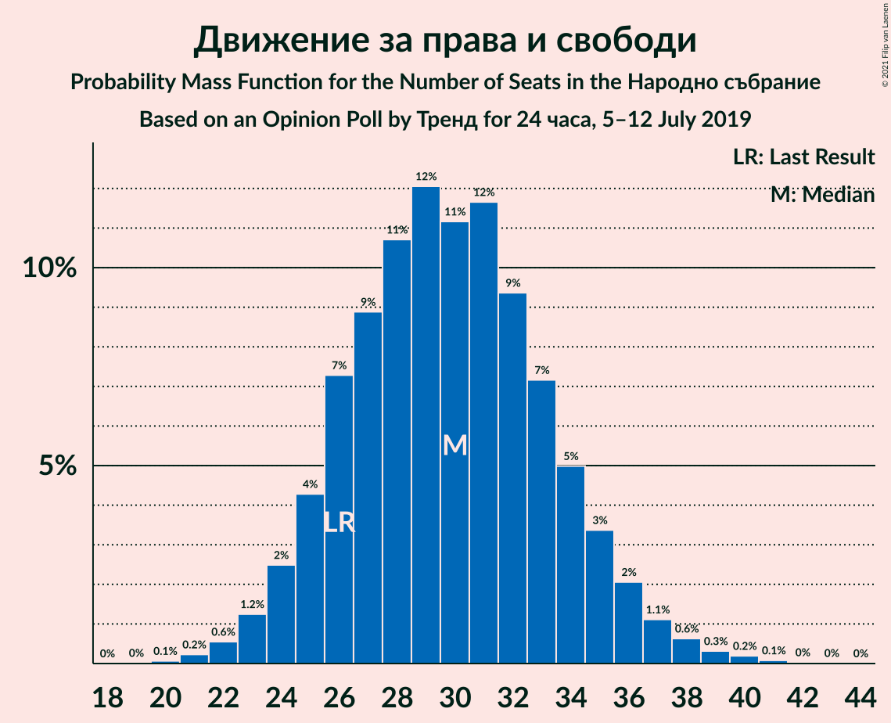
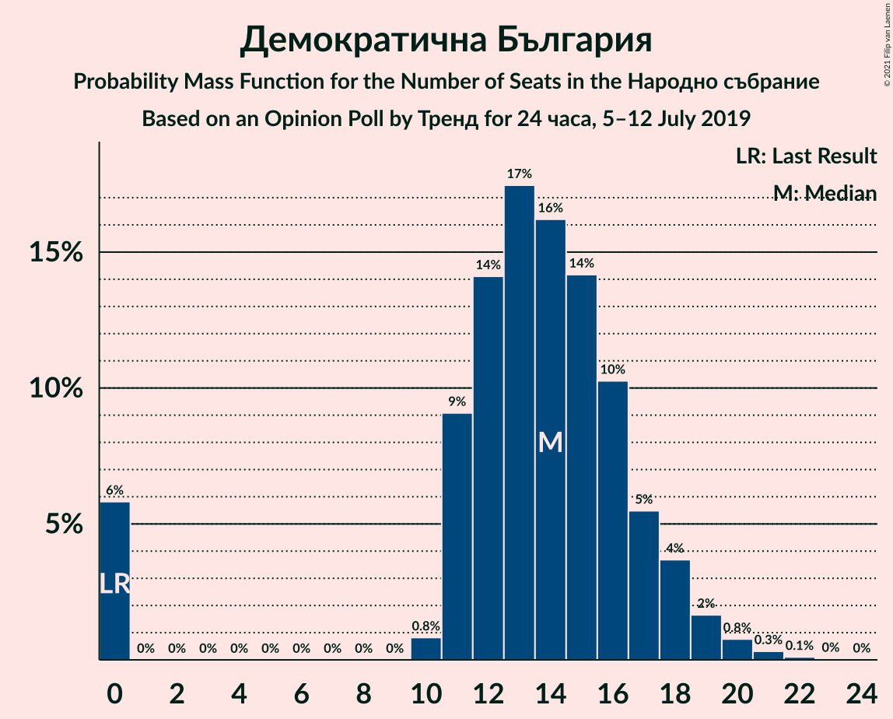
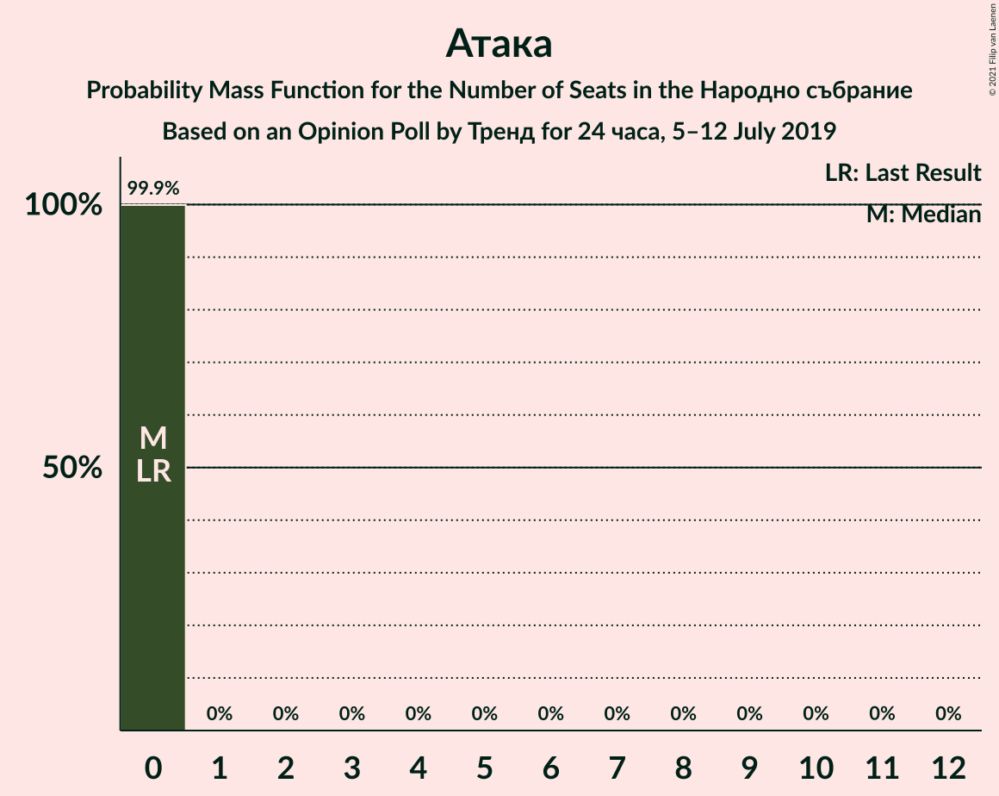

# Opinion Poll by Тренд for 24 часа, 5–12 July 2019

<a href="#voting-intentions">Voting Intentions</a> | <a href="#seats">Seats</a> | <a href="#coalitions">Coalitions</a> | <a href="#technical-information">Technical Information</a>

## Voting Intentions

### Confidence Intervals

| Party | Last Result | Poll Result | 80% Confidence Interval | 90% Confidence Interval | 95% Confidence Interval | 99% Confidence Interval |
|:-----:|:-----------:|:-----------:|:-----------------------:|:-----------------------:|:-----------------------:|:-----------------------:|
| Граждани за европейско развитие на България | 33.5% | 38.1% | 35.7–40.6% |35.0–41.3% |34.4–42.0% |33.2–43.2% |
| Българска социалистическа партия | 27.9% | 30.2% | 27.9–32.6% |27.3–33.3% |26.7–33.9% |25.6–35.0% |
| Движение за права и свободи | 9.2% | 11.4% | 9.9–13.2% |9.5–13.7% |9.2–14.2% |8.5–15.1% |
| Обединени Патриоти | 9.3% | 7.9% | 6.7–9.5% |6.4–9.9% |6.1–10.3% |5.5–11.1% |
| Демократична България | 0.0% | 5.2% | 4.3–6.6% |4.0–6.9% |3.7–7.3% |3.3–8.0% |
| Воля | 4.3% | 1.9% | 1.4–2.8% |1.2–3.1% |1.1–3.3% |0.9–3.8% |
| Атака | 0.0% | 1.7% | 1.2–2.6% |1.1–2.9% |1.0–3.1% |0.8–3.6% |

*Note:* The poll result column reflects the actual value used in the calculations. Published results may vary slightly, and in addition be rounded to fewer digits.

## Seats

### Confidence Intervals

| Party | Last Result | Median | 80% Confidence Interval | 90% Confidence Interval | 95% Confidence Interval | 99% Confidence Interval |
|:-----:|:-----------:|:------:|:-----------------------:|:-----------------------:|:-----------------------:|:-----------------------:|
| <a href="#граждани-за-европейско-развитие-на-българия">Граждани за европейско развитие на България</a> | 95 | 98 | 92–105 |90–107 |89–108 |86–112 |
| <a href="#българска-социалистическа-партия">Българска социалистическа партия</a> | 80 | 78 | 72–84 |70–86 |69–88 |66–91 |
| <a href="#движение-за-права-и-свободи">Движение за права и свободи</a> | 26 | 30 | 26–34 |25–35 |24–36 |22–39 |
| <a href="#обединени-патриоти">Обединени Патриоти</a> | 27 | 21 | 17–24 |16–26 |16–27 |14–29 |
| <a href="#демократична-българия">Демократична България</a> | 0 | 14 | 11–17 |0–18 |0–19 |0–20 |
| <a href="#воля">Воля</a> | 12 | 0 | 0 |0 |0 |0 |
| <a href="#атака">Атака</a> | 0 | 0 | 0 |0 |0 |0 |

### Граждани за европейско развитие на България

*For a full overview of the results for this party, see the [Граждани за европейско развитие на България](party-гражданизаевропейскоразвитиенабългария.html) page.*

| Number of Seats | Probability | Accumulated | Special Marks |
|:---------------:|:-----------:|:-----------:|:-------------:|
| 82 | 0% | 100% |  |
| 83 | 0.1% | 99.9% |  |
| 84 | 0.1% | 99.9% |  |
| 85 | 0.2% | 99.8% |  |
| 86 | 0.3% | 99.6% |  |
| 87 | 0.6% | 99.2% |  |
| 88 | 1.0% | 98.6% |  |
| 89 | 1.3% | 98% |  |
| 90 | 2% | 96% |  |
| 91 | 3% | 94% |  |
| 92 | 4% | 91% |  |
| 93 | 5% | 87% |  |
| 94 | 5% | 82% |  |
| 95 | 7% | 77% | Last Result |
| 96 | 7% | 70% |  |
| 97 | 8% | 63% |  |
| 98 | 8% | 55% | Median |
| 99 | 7% | 47% |  |
| 100 | 8% | 40% |  |
| 101 | 7% | 32% |  |
| 102 | 5% | 25% |  |
| 103 | 6% | 20% |  |
| 104 | 3% | 14% |  |
| 105 | 3% | 11% |  |
| 106 | 2% | 8% |  |
| 107 | 2% | 6% |  |
| 108 | 2% | 4% |  |
| 109 | 0.9% | 2% |  |
| 110 | 0.6% | 2% |  |
| 111 | 0.3% | 0.9% |  |
| 112 | 0.2% | 0.6% |  |
| 113 | 0.2% | 0.4% |  |
| 114 | 0.1% | 0.2% |  |
| 115 | 0.1% | 0.2% |  |
| 116 | 0% | 0.1% |  |
| 117 | 0% | 0% |  |

### Българска социалистическа партия

*For a full overview of the results for this party, see the [Българска социалистическа партия](party-българскасоциалистическапартия.html) page.*

| Number of Seats | Probability | Accumulated | Special Marks |
|:---------------:|:-----------:|:-----------:|:-------------:|
| 63 | 0% | 100% |  |
| 64 | 0.1% | 99.9% |  |
| 65 | 0.2% | 99.8% |  |
| 66 | 0.3% | 99.7% |  |
| 67 | 0.5% | 99.4% |  |
| 68 | 0.9% | 98.8% |  |
| 69 | 1.3% | 98% |  |
| 70 | 2% | 97% |  |
| 71 | 3% | 94% |  |
| 72 | 5% | 92% |  |
| 73 | 4% | 87% |  |
| 74 | 7% | 82% |  |
| 75 | 7% | 75% |  |
| 76 | 7% | 68% |  |
| 77 | 9% | 61% |  |
| 78 | 8% | 52% | Median |
| 79 | 9% | 44% |  |
| 80 | 6% | 35% | Last Result |
| 81 | 6% | 29% |  |
| 82 | 5% | 22% |  |
| 83 | 5% | 18% |  |
| 84 | 4% | 12% |  |
| 85 | 3% | 8% |  |
| 86 | 2% | 6% |  |
| 87 | 1.3% | 4% |  |
| 88 | 1.0% | 3% |  |
| 89 | 0.6% | 2% |  |
| 90 | 0.4% | 0.9% |  |
| 91 | 0.2% | 0.5% |  |
| 92 | 0.1% | 0.3% |  |
| 93 | 0.1% | 0.2% |  |
| 94 | 0.1% | 0.1% |  |
| 95 | 0% | 0% |  |

### Движение за права и свободи

*For a full overview of the results for this party, see the [Движение за права и свободи](party-движениезаправаисвободи.html) page.*

| Number of Seats | Probability | Accumulated | Special Marks |
|:---------------:|:-----------:|:-----------:|:-------------:|
| 20 | 0.1% | 100% |  |
| 21 | 0.2% | 99.9% |  |
| 22 | 0.6% | 99.7% |  |
| 23 | 1.2% | 99.1% |  |
| 24 | 2% | 98% |  |
| 25 | 4% | 95% |  |
| 26 | 7% | 91% | Last Result |
| 27 | 9% | 84% |  |
| 28 | 11% | 75% |  |
| 29 | 12% | 64% |  |
| 30 | 11% | 52% | Median |
| 31 | 12% | 41% |  |
| 32 | 9% | 29% |  |
| 33 | 7% | 20% |  |
| 34 | 5% | 13% |  |
| 35 | 3% | 8% |  |
| 36 | 2% | 4% |  |
| 37 | 1.1% | 2% |  |
| 38 | 0.6% | 1.3% |  |
| 39 | 0.3% | 0.6% |  |
| 40 | 0.2% | 0.3% |  |
| 41 | 0.1% | 0.1% |  |
| 42 | 0% | 0.1% |  |
| 43 | 0% | 0% |  |

### Обединени Патриоти

*For a full overview of the results for this party, see the [Обединени Патриоти](party-обединенипатриоти.html) page.*

| Number of Seats | Probability | Accumulated | Special Marks |
|:---------------:|:-----------:|:-----------:|:-------------:|
| 13 | 0.1% | 100% |  |
| 14 | 0.5% | 99.8% |  |
| 15 | 1.5% | 99.3% |  |
| 16 | 4% | 98% |  |
| 17 | 6% | 94% |  |
| 18 | 10% | 88% |  |
| 19 | 12% | 78% |  |
| 20 | 12% | 66% |  |
| 21 | 14% | 54% | Median |
| 22 | 12% | 40% |  |
| 23 | 11% | 28% |  |
| 24 | 8% | 17% |  |
| 25 | 4% | 9% |  |
| 26 | 3% | 5% |  |
| 27 | 1.4% | 3% | Last Result |
| 28 | 0.8% | 1.3% |  |
| 29 | 0.3% | 0.5% |  |
| 30 | 0.1% | 0.2% |  |
| 31 | 0.1% | 0.1% |  |
| 32 | 0% | 0% |  |

### Демократична България

*For a full overview of the results for this party, see the [Демократична България](party-демократичнабългария.html) page.*

| Number of Seats | Probability | Accumulated | Special Marks |
|:---------------:|:-----------:|:-----------:|:-------------:|
| 0 | 6% | 100% | Last Result |
| 1 | 0% | 94% |  |
| 2 | 0% | 94% |  |
| 3 | 0% | 94% |  |
| 4 | 0% | 94% |  |
| 5 | 0% | 94% |  |
| 6 | 0% | 94% |  |
| 7 | 0% | 94% |  |
| 8 | 0% | 94% |  |
| 9 | 0% | 94% |  |
| 10 | 0.8% | 94% |  |
| 11 | 9% | 93% |  |
| 12 | 14% | 84% |  |
| 13 | 17% | 70% |  |
| 14 | 16% | 53% | Median |
| 15 | 14% | 36% |  |
| 16 | 10% | 22% |  |
| 17 | 5% | 12% |  |
| 18 | 4% | 7% |  |
| 19 | 2% | 3% |  |
| 20 | 0.8% | 1.2% |  |
| 21 | 0.3% | 0.5% |  |
| 22 | 0.1% | 0.2% |  |
| 23 | 0% | 0.1% |  |
| 24 | 0% | 0% |  |

### Воля

*For a full overview of the results for this party, see the [Воля](party-воля.html) page.*

| Number of Seats | Probability | Accumulated | Special Marks |
|:---------------:|:-----------:|:-----------:|:-------------:|
| 0 | 99.8% | 100% | Median |
| 1 | 0% | 0.2% |  |
| 2 | 0% | 0.2% |  |
| 3 | 0% | 0.2% |  |
| 4 | 0% | 0.2% |  |
| 5 | 0% | 0.2% |  |
| 6 | 0% | 0.2% |  |
| 7 | 0% | 0.2% |  |
| 8 | 0% | 0.2% |  |
| 9 | 0% | 0.2% |  |
| 10 | 0.1% | 0.2% |  |
| 11 | 0.1% | 0.1% |  |
| 12 | 0% | 0% | Last Result |

### Атака

*For a full overview of the results for this party, see the [Атака](party-атака.html) page.*

| Number of Seats | Probability | Accumulated | Special Marks |
|:---------------:|:-----------:|:-----------:|:-------------:|
| 0 | 99.9% | 100% | Last Result, Median |
| 1 | 0% | 0.1% |  |
| 2 | 0% | 0.1% |  |
| 3 | 0% | 0.1% |  |
| 4 | 0% | 0.1% |  |
| 5 | 0% | 0.1% |  |
| 6 | 0% | 0.1% |  |
| 7 | 0% | 0.1% |  |
| 8 | 0% | 0.1% |  |
| 9 | 0% | 0.1% |  |
| 10 | 0% | 0.1% |  |
| 11 | 0% | 0.1% |  |
| 12 | 0% | 0% |  |

## Coalitions

### Confidence Intervals

| Coalition | Last Result | Median | Majority? | 80% Confidence Interval | 90% Confidence Interval | 95% Confidence Interval | 99% Confidence Interval |
|:---------:|:-----------:|:------:|:---------:|:-----------------------:|:-----------------------:|:-----------------------:|:-----------------------:|
| Граждани за европейско развитие на България – Обединени Патриоти | 122 | 119 | 38% | 113–125 | 111–128 | 109–130 | 106–133 |
| Българска социалистическа партия – Движение за права и свободи | 106 | 108 | 0.9% | 101–114 | 99–116 | 98–118 | 95–122 |

### Граждани за европейско развитие на България – Обединени Патриоти

| Number of Seats | Probability | Accumulated | Special Marks |
|:---------------:|:-----------:|:-----------:|:-------------:|
| 103 | 0% | 100% |  |
| 104 | 0.1% | 99.9% |  |
| 105 | 0.1% | 99.8% |  |
| 106 | 0.4% | 99.7% |  |
| 107 | 0.3% | 99.3% |  |
| 108 | 0.7% | 99.0% |  |
| 109 | 2% | 98% |  |
| 110 | 1.3% | 97% |  |
| 111 | 3% | 95% |  |
| 112 | 1.4% | 92% |  |
| 113 | 6% | 91% |  |
| 114 | 4% | 85% |  |
| 115 | 6% | 81% |  |
| 116 | 8% | 75% |  |
| 117 | 4% | 67% |  |
| 118 | 12% | 63% |  |
| 119 | 2% | 51% | Median |
| 120 | 10% | 48% |  |
| 121 | 6% | 38% | Majority |
| 122 | 6% | 32% | Last Result |
| 123 | 7% | 25% |  |
| 124 | 2% | 19% |  |
| 125 | 7% | 17% |  |
| 126 | 2% | 10% |  |
| 127 | 3% | 8% |  |
| 128 | 2% | 5% |  |
| 129 | 0.8% | 4% |  |
| 130 | 1.1% | 3% |  |
| 131 | 0.5% | 2% |  |
| 132 | 0.4% | 1.3% |  |
| 133 | 0.4% | 0.9% |  |
| 134 | 0.1% | 0.5% |  |
| 135 | 0.2% | 0.3% |  |
| 136 | 0% | 0.2% |  |
| 137 | 0% | 0.1% |  |
| 138 | 0% | 0.1% |  |
| 139 | 0% | 0% |  |

### Българска социалистическа партия – Движение за права и свободи

| Number of Seats | Probability | Accumulated | Special Marks |
|:---------------:|:-----------:|:-----------:|:-------------:|
| 91 | 0% | 100% |  |
| 92 | 0% | 99.9% |  |
| 93 | 0.1% | 99.9% |  |
| 94 | 0.2% | 99.8% |  |
| 95 | 0.3% | 99.6% |  |
| 96 | 0.6% | 99.3% |  |
| 97 | 0.8% | 98.7% |  |
| 98 | 1.2% | 98% |  |
| 99 | 2% | 97% |  |
| 100 | 3% | 95% |  |
| 101 | 4% | 92% |  |
| 102 | 5% | 88% |  |
| 103 | 6% | 84% |  |
| 104 | 6% | 78% |  |
| 105 | 7% | 72% |  |
| 106 | 8% | 65% | Last Result |
| 107 | 7% | 57% |  |
| 108 | 7% | 50% | Median |
| 109 | 7% | 43% |  |
| 110 | 8% | 36% |  |
| 111 | 5% | 29% |  |
| 112 | 6% | 23% |  |
| 113 | 4% | 17% |  |
| 114 | 4% | 13% |  |
| 115 | 3% | 9% |  |
| 116 | 2% | 7% |  |
| 117 | 1.5% | 4% |  |
| 118 | 0.9% | 3% |  |
| 119 | 0.8% | 2% |  |
| 120 | 0.4% | 1.3% |  |
| 121 | 0.3% | 0.9% | Majority |
| 122 | 0.2% | 0.5% |  |
| 123 | 0.1% | 0.3% |  |
| 124 | 0.1% | 0.2% |  |
| 125 | 0% | 0.1% |  |
| 126 | 0% | 0.1% |  |
| 127 | 0% | 0% |  |

## Technical Information

### Opinion Poll

+ **Polling firm:** Тренд
+ **Commissioner(s):** 24 часа
+ **Fieldwork period:** 5–12 July 2019

### Calculations

+ **Sample size:** 630
+ **Simulations done:** 1,048,576
+ **Error estimate:** 2.01%

