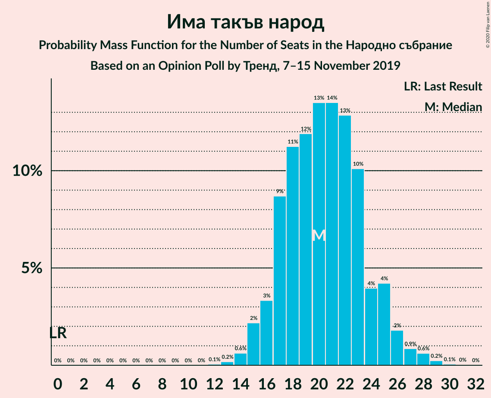
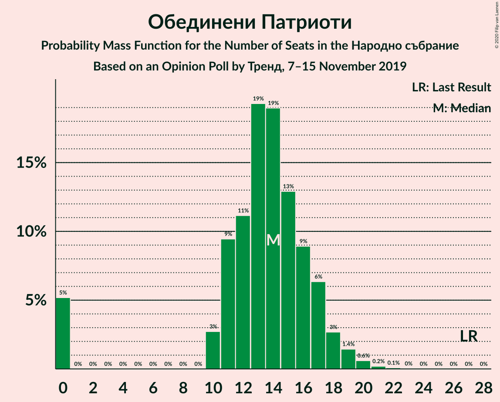
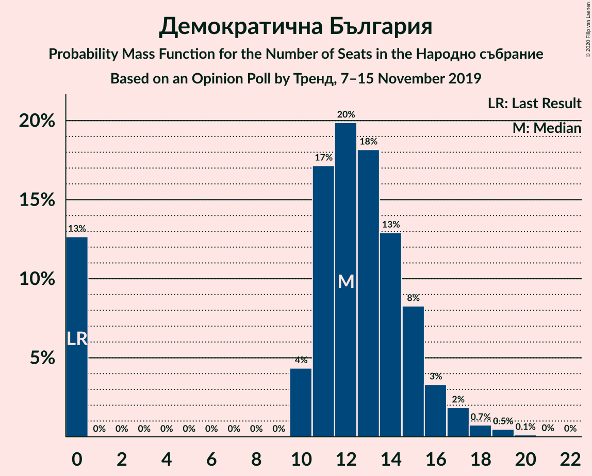
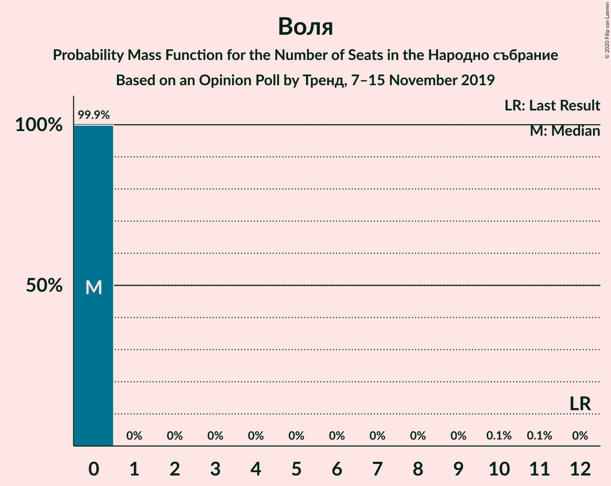
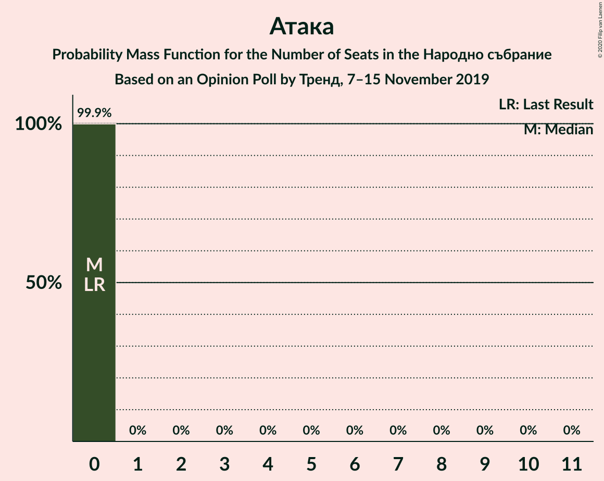
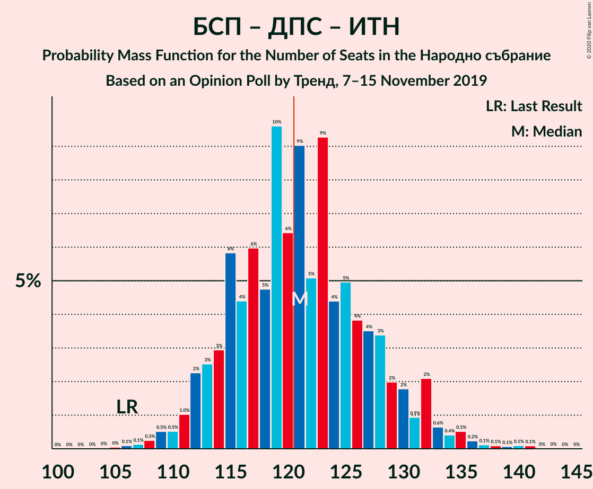
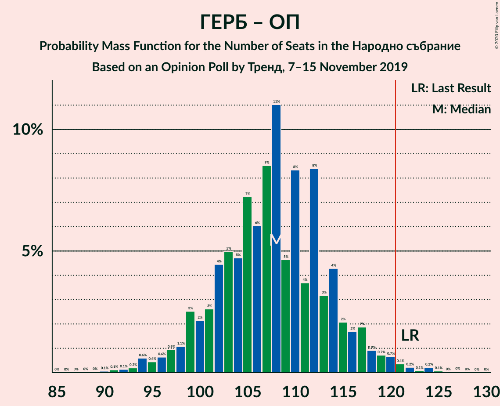

# Opinion Poll by Тренд, 7–15 November 2019

<a href="#voting-intentions">Voting Intentions</a> | <a href="#seats">Seats</a> | <a href="#coalitions">Coalitions</a> | <a href="#technical-information">Technical Information</a>

## Voting Intentions

### Confidence Intervals

| Party | Last Result | Poll Result | 80% Confidence Interval | 90% Confidence Interval | 95% Confidence Interval | 99% Confidence Interval |
|:-----:|:-----------:|:-----------:|:-----------------------:|:-----------------------:|:-----------------------:|:-----------------------:|
| Граждани за европейско развитие на България | 33.5% | 37.0% | 34.6–39.5% |34.0–40.2% |33.4–40.8% |32.3–42.0% |
| Българска социалистическа партия | 27.9% | 28.7% | 26.5–31.1% |25.9–31.7% |25.3–32.3% |24.3–33.5% |
| Движение за права и свободи | 9.2% | 10.6% | 9.2–12.4% |8.8–12.8% |8.5–13.3% |7.9–14.1% |
| Има такъв народ | 0.0% | 7.9% | 6.7–9.4% |6.3–9.8% |6.0–10.2% |5.5–11.0% |
| Обединени Патриоти | 9.3% | 5.2% | 4.3–6.6% |4.0–6.9% |3.8–7.3% |3.4–7.9% |
| Демократична България | 0.0% | 4.8% | 3.9–6.0% |3.6–6.4% |3.4–6.7% |3.0–7.4% |
| Воля | 4.3% | 1.9% | 1.3–2.7% |1.2–3.0% |1.1–3.2% |0.9–3.7% |
| Атака | 0.0% | 1.7% | 1.2–2.6% |1.1–2.8% |0.9–3.0% |0.8–3.5% |

*Note:* The poll result column reflects the actual value used in the calculations. Published results may vary slightly, and in addition be rounded to fewer digits.

## Seats

### Confidence Intervals

| Party | Last Result | Median | 80% Confidence Interval | 90% Confidence Interval | 95% Confidence Interval | 99% Confidence Interval |
|:-----:|:-----------:|:------:|:-----------------------:|:-----------------------:|:-----------------------:|:-----------------------:|
| <a href="#граждани-за-европейско-развитие-на-българия">Граждани за европейско развитие на България</a> | 95 | 94 | 88–101 |86–103 |85–105 |82–109 |
| <a href="#българска-социалистическа-партия">Българска социалистическа партия</a> | 80 | 73 | 68–79 |66–82 |65–83 |61–86 |
| <a href="#движение-за-права-и-свободи">Движение за права и свободи</a> | 26 | 27 | 24–32 |22–33 |22–34 |20–36 |
| <a href="#има-такъв-народ">Има такъв народ</a> | 0 | 20 | 17–24 |16–25 |15–26 |14–28 |
| <a href="#обединени-патриоти">Обединени Патриоти</a> | 27 | 14 | 11–17 |0–18 |0–18 |0–20 |
| <a href="#демократична-българия">Демократична България</a> | 0 | 12 | 0–15 |0–16 |0–17 |0–19 |
| <a href="#воля">Воля</a> | 12 | 0 | 0 |0 |0 |0 |
| <a href="#атака">Атака</a> | 0 | 0 | 0 |0 |0 |0 |

### Граждани за европейско развитие на България

*For a full overview of the results for this party, see the [Граждани за европейско развитие на България](party-гражданизаевропейскоразвитиенабългария.html) page.*

| Number of Seats | Probability | Accumulated | Special Marks |
|:---------------:|:-----------:|:-----------:|:-------------:|
| 79 | 0% | 100% |  |
| 80 | 0.1% | 99.9% |  |
| 81 | 0.2% | 99.8% |  |
| 82 | 0.3% | 99.7% |  |
| 83 | 0.5% | 99.4% |  |
| 84 | 0.9% | 98.8% |  |
| 85 | 2% | 98% |  |
| 86 | 2% | 96% |  |
| 87 | 2% | 95% |  |
| 88 | 4% | 92% |  |
| 89 | 5% | 88% |  |
| 90 | 4% | 83% |  |
| 91 | 7% | 79% |  |
| 92 | 7% | 72% |  |
| 93 | 9% | 65% |  |
| 94 | 8% | 56% | Median |
| 95 | 6% | 48% | Last Result |
| 96 | 7% | 42% |  |
| 97 | 9% | 36% |  |
| 98 | 5% | 27% |  |
| 99 | 8% | 22% |  |
| 100 | 3% | 14% |  |
| 101 | 3% | 11% |  |
| 102 | 2% | 8% |  |
| 103 | 1.4% | 6% |  |
| 104 | 1.5% | 5% |  |
| 105 | 1.0% | 3% |  |
| 106 | 0.8% | 2% |  |
| 107 | 0.4% | 1.4% |  |
| 108 | 0.4% | 1.0% |  |
| 109 | 0.2% | 0.6% |  |
| 110 | 0.1% | 0.3% |  |
| 111 | 0.1% | 0.2% |  |
| 112 | 0.1% | 0.2% |  |
| 113 | 0.1% | 0.1% |  |
| 114 | 0% | 0.1% |  |
| 115 | 0% | 0% |  |

### Българска социалистическа партия

*For a full overview of the results for this party, see the [Българска социалистическа партия](party-българскасоциалистическапартия.html) page.*

| Number of Seats | Probability | Accumulated | Special Marks |
|:---------------:|:-----------:|:-----------:|:-------------:|
| 59 | 0.1% | 100% |  |
| 60 | 0.1% | 99.9% |  |
| 61 | 0.3% | 99.8% |  |
| 62 | 0.3% | 99.5% |  |
| 63 | 0.7% | 99.2% |  |
| 64 | 0.9% | 98% |  |
| 65 | 1.3% | 98% |  |
| 66 | 2% | 96% |  |
| 67 | 2% | 94% |  |
| 68 | 3% | 92% |  |
| 69 | 4% | 89% |  |
| 70 | 6% | 84% |  |
| 71 | 13% | 79% |  |
| 72 | 9% | 65% |  |
| 73 | 14% | 57% | Median |
| 74 | 9% | 43% |  |
| 75 | 8% | 34% |  |
| 76 | 7% | 26% |  |
| 77 | 4% | 19% |  |
| 78 | 3% | 15% |  |
| 79 | 3% | 12% |  |
| 80 | 3% | 9% | Last Result |
| 81 | 2% | 7% |  |
| 82 | 2% | 5% |  |
| 83 | 2% | 3% |  |
| 84 | 0.5% | 2% |  |
| 85 | 0.3% | 1.2% |  |
| 86 | 0.5% | 0.9% |  |
| 87 | 0.2% | 0.4% |  |
| 88 | 0.1% | 0.2% |  |
| 89 | 0% | 0.1% |  |
| 90 | 0% | 0.1% |  |
| 91 | 0% | 0% |  |

### Движение за права и свободи

*For a full overview of the results for this party, see the [Движение за права и свободи](party-движениезаправаисвободи.html) page.*

| Number of Seats | Probability | Accumulated | Special Marks |
|:---------------:|:-----------:|:-----------:|:-------------:|
| 18 | 0% | 100% |  |
| 19 | 0.2% | 99.9% |  |
| 20 | 0.6% | 99.7% |  |
| 21 | 2% | 99.1% |  |
| 22 | 3% | 98% |  |
| 23 | 5% | 95% |  |
| 24 | 8% | 90% |  |
| 25 | 8% | 82% |  |
| 26 | 15% | 74% | Last Result |
| 27 | 12% | 59% | Median |
| 28 | 13% | 47% |  |
| 29 | 12% | 34% |  |
| 30 | 7% | 22% |  |
| 31 | 4% | 15% |  |
| 32 | 5% | 10% |  |
| 33 | 3% | 6% |  |
| 34 | 2% | 3% |  |
| 35 | 0.8% | 2% |  |
| 36 | 0.5% | 0.9% |  |
| 37 | 0.2% | 0.3% |  |
| 38 | 0.1% | 0.1% |  |
| 39 | 0% | 0.1% |  |
| 40 | 0% | 0% |  |

### Има такъв народ

*For a full overview of the results for this party, see the [Има такъв народ](party-иматакъвнарод.html) page.*

| Number of Seats | Probability | Accumulated | Special Marks |
|:---------------:|:-----------:|:-----------:|:-------------:|
| 0 | 0% | 100% | Last Result |
| 1 | 0% | 100% |  |
| 2 | 0% | 100% |  |
| 3 | 0% | 100% |  |
| 4 | 0% | 100% |  |
| 5 | 0% | 100% |  |
| 6 | 0% | 100% |  |
| 7 | 0% | 100% |  |
| 8 | 0% | 100% |  |
| 9 | 0% | 100% |  |
| 10 | 0% | 100% |  |
| 11 | 0% | 100% |  |
| 12 | 0.1% | 100% |  |
| 13 | 0.2% | 99.9% |  |
| 14 | 0.6% | 99.8% |  |
| 15 | 2% | 99.1% |  |
| 16 | 3% | 97% |  |
| 17 | 9% | 94% |  |
| 18 | 11% | 85% |  |
| 19 | 12% | 74% |  |
| 20 | 13% | 62% | Median |
| 21 | 14% | 48% |  |
| 22 | 13% | 35% |  |
| 23 | 10% | 22% |  |
| 24 | 4% | 12% |  |
| 25 | 4% | 8% |  |
| 26 | 2% | 4% |  |
| 27 | 0.9% | 2% |  |
| 28 | 0.6% | 1.0% |  |
| 29 | 0.2% | 0.3% |  |
| 30 | 0.1% | 0.1% |  |
| 31 | 0% | 0.1% |  |
| 32 | 0% | 0% |  |

### Обединени Патриоти

*For a full overview of the results for this party, see the [Обединени Патриоти](party-обединенипатриоти.html) page.*

| Number of Seats | Probability | Accumulated | Special Marks |
|:---------------:|:-----------:|:-----------:|:-------------:|
| 0 | 5% | 100% |  |
| 1 | 0% | 95% |  |
| 2 | 0% | 95% |  |
| 3 | 0% | 95% |  |
| 4 | 0% | 95% |  |
| 5 | 0% | 95% |  |
| 6 | 0% | 95% |  |
| 7 | 0% | 95% |  |
| 8 | 0% | 95% |  |
| 9 | 0% | 95% |  |
| 10 | 3% | 95% |  |
| 11 | 9% | 92% |  |
| 12 | 11% | 83% |  |
| 13 | 19% | 71% |  |
| 14 | 19% | 52% | Median |
| 15 | 13% | 33% |  |
| 16 | 9% | 20% |  |
| 17 | 6% | 11% |  |
| 18 | 3% | 5% |  |
| 19 | 1.4% | 2% |  |
| 20 | 0.6% | 0.9% |  |
| 21 | 0.2% | 0.3% |  |
| 22 | 0.1% | 0.1% |  |
| 23 | 0% | 0% |  |
| 24 | 0% | 0% |  |
| 25 | 0% | 0% |  |
| 26 | 0% | 0% |  |
| 27 | 0% | 0% | Last Result |

### Демократична България

*For a full overview of the results for this party, see the [Демократична България](party-демократичнабългария.html) page.*

| Number of Seats | Probability | Accumulated | Special Marks |
|:---------------:|:-----------:|:-----------:|:-------------:|
| 0 | 13% | 100% | Last Result |
| 1 | 0% | 87% |  |
| 2 | 0% | 87% |  |
| 3 | 0% | 87% |  |
| 4 | 0% | 87% |  |
| 5 | 0% | 87% |  |
| 6 | 0% | 87% |  |
| 7 | 0% | 87% |  |
| 8 | 0% | 87% |  |
| 9 | 0% | 87% |  |
| 10 | 4% | 87% |  |
| 11 | 17% | 83% |  |
| 12 | 20% | 66% | Median |
| 13 | 18% | 46% |  |
| 14 | 13% | 28% |  |
| 15 | 8% | 15% |  |
| 16 | 3% | 7% |  |
| 17 | 2% | 3% |  |
| 18 | 0.7% | 1.4% |  |
| 19 | 0.5% | 0.7% |  |
| 20 | 0.1% | 0.2% |  |
| 21 | 0% | 0.1% |  |
| 22 | 0% | 0% |  |

### Воля

*For a full overview of the results for this party, see the [Воля](party-воля.html) page.*

| Number of Seats | Probability | Accumulated | Special Marks |
|:---------------:|:-----------:|:-----------:|:-------------:|
| 0 | 99.9% | 100% | Median |
| 1 | 0% | 0.1% |  |
| 2 | 0% | 0.1% |  |
| 3 | 0% | 0.1% |  |
| 4 | 0% | 0.1% |  |
| 5 | 0% | 0.1% |  |
| 6 | 0% | 0.1% |  |
| 7 | 0% | 0.1% |  |
| 8 | 0% | 0.1% |  |
| 9 | 0% | 0.1% |  |
| 10 | 0.1% | 0.1% |  |
| 11 | 0.1% | 0.1% |  |
| 12 | 0% | 0% | Last Result |

### Атака

*For a full overview of the results for this party, see the [Атака](party-атака.html) page.*

| Number of Seats | Probability | Accumulated | Special Marks |
|:---------------:|:-----------:|:-----------:|:-------------:|
| 0 | 99.9% | 100% | Last Result, Median |
| 1 | 0% | 0.1% |  |
| 2 | 0% | 0.1% |  |
| 3 | 0% | 0.1% |  |
| 4 | 0% | 0.1% |  |
| 5 | 0% | 0.1% |  |
| 6 | 0% | 0.1% |  |
| 7 | 0% | 0.1% |  |
| 8 | 0% | 0.1% |  |
| 9 | 0% | 0.1% |  |
| 10 | 0% | 0.1% |  |
| 11 | 0% | 0% |  |

## Coalitions

### Confidence Intervals

| Coalition | Last Result | Median | Majority? | 80% Confidence Interval | 90% Confidence Interval | 95% Confidence Interval | 99% Confidence Interval |
|:---------:|:-----------:|:------:|:---------:|:-----------------------:|:-----------------------:|:-----------------------:|:-----------------------:|
| Българска социалистическа партия – Движение за права и свободи – Има такъв народ | 106 | 121 | 53% | 114–128 | 113–131 | 111–132 | 108–137 |
| Граждани за европейско развитие на България – Обединени Патриоти | 122 | 108 | 1.0% | 101–114 | 99–117 | 97–118 | 93–122 |
| Българска социалистическа партия – Движение за права и свободи | 106 | 101 | 0% | 94–107 | 92–110 | 91–112 | 88–116 |

### Българска социалистическа партия – Движение за права и свободи – Има такъв народ

| Number of Seats | Probability | Accumulated | Special Marks |
|:---------------:|:-----------:|:-----------:|:-------------:|
| 104 | 0% | 100% |  |
| 105 | 0% | 99.9% |  |
| 106 | 0.1% | 99.9% | Last Result |
| 107 | 0.1% | 99.8% |  |
| 108 | 0.3% | 99.7% |  |
| 109 | 0.5% | 99.4% |  |
| 110 | 0.5% | 98.9% |  |
| 111 | 1.0% | 98% |  |
| 112 | 2% | 97% |  |
| 113 | 3% | 95% |  |
| 114 | 3% | 93% |  |
| 115 | 6% | 90% |  |
| 116 | 4% | 84% |  |
| 117 | 6% | 79% |  |
| 118 | 5% | 73% |  |
| 119 | 10% | 69% |  |
| 120 | 6% | 59% | Median |
| 121 | 9% | 53% | Majority |
| 122 | 5% | 44% |  |
| 123 | 9% | 39% |  |
| 124 | 4% | 29% |  |
| 125 | 5% | 25% |  |
| 126 | 4% | 20% |  |
| 127 | 4% | 16% |  |
| 128 | 3% | 13% |  |
| 129 | 2% | 9% |  |
| 130 | 2% | 7% |  |
| 131 | 0.9% | 5% |  |
| 132 | 2% | 4% |  |
| 133 | 0.6% | 2% |  |
| 134 | 0.4% | 2% |  |
| 135 | 0.5% | 1.3% |  |
| 136 | 0.2% | 0.8% |  |
| 137 | 0.1% | 0.5% |  |
| 138 | 0.1% | 0.4% |  |
| 139 | 0.1% | 0.3% |  |
| 140 | 0.1% | 0.2% |  |
| 141 | 0.1% | 0.1% |  |
| 142 | 0% | 0.1% |  |
| 143 | 0% | 0% |  |

### Граждани за европейско развитие на България – Обединени Патриоти

| Number of Seats | Probability | Accumulated | Special Marks |
|:---------------:|:-----------:|:-----------:|:-------------:|
| 88 | 0% | 100% |  |
| 89 | 0% | 99.9% |  |
| 90 | 0.1% | 99.9% |  |
| 91 | 0.1% | 99.9% |  |
| 92 | 0.1% | 99.7% |  |
| 93 | 0.2% | 99.6% |  |
| 94 | 0.6% | 99.4% |  |
| 95 | 0.4% | 98.8% |  |
| 96 | 0.6% | 98% |  |
| 97 | 0.9% | 98% |  |
| 98 | 1.1% | 97% |  |
| 99 | 3% | 96% |  |
| 100 | 2% | 93% |  |
| 101 | 3% | 91% |  |
| 102 | 4% | 88% |  |
| 103 | 5% | 84% |  |
| 104 | 5% | 79% |  |
| 105 | 7% | 74% |  |
| 106 | 6% | 67% |  |
| 107 | 9% | 61% |  |
| 108 | 11% | 52% | Median |
| 109 | 5% | 41% |  |
| 110 | 8% | 37% |  |
| 111 | 4% | 28% |  |
| 112 | 8% | 25% |  |
| 113 | 3% | 16% |  |
| 114 | 4% | 13% |  |
| 115 | 2% | 9% |  |
| 116 | 2% | 7% |  |
| 117 | 2% | 5% |  |
| 118 | 0.9% | 3% |  |
| 119 | 0.7% | 2% |  |
| 120 | 0.7% | 2% |  |
| 121 | 0.4% | 1.0% | Majority |
| 122 | 0.2% | 0.7% | Last Result |
| 123 | 0.1% | 0.4% |  |
| 124 | 0.2% | 0.4% |  |
| 125 | 0.1% | 0.2% |  |
| 126 | 0% | 0.1% |  |
| 127 | 0% | 0.1% |  |
| 128 | 0% | 0% |  |

### Българска социалистическа партия – Движение за права и свободи

| Number of Seats | Probability | Accumulated | Special Marks |
|:---------------:|:-----------:|:-----------:|:-------------:|
| 85 | 0% | 100% |  |
| 86 | 0.1% | 99.9% |  |
| 87 | 0.2% | 99.8% |  |
| 88 | 0.3% | 99.7% |  |
| 89 | 0.5% | 99.3% |  |
| 90 | 0.7% | 98.8% |  |
| 91 | 1.0% | 98% |  |
| 92 | 2% | 97% |  |
| 93 | 3% | 95% |  |
| 94 | 3% | 92% |  |
| 95 | 4% | 89% |  |
| 96 | 5% | 85% |  |
| 97 | 7% | 80% |  |
| 98 | 9% | 73% |  |
| 99 | 7% | 64% |  |
| 100 | 6% | 56% | Median |
| 101 | 10% | 51% |  |
| 102 | 6% | 40% |  |
| 103 | 5% | 34% |  |
| 104 | 8% | 30% |  |
| 105 | 6% | 21% |  |
| 106 | 4% | 16% | Last Result |
| 107 | 2% | 12% |  |
| 108 | 2% | 10% |  |
| 109 | 2% | 8% |  |
| 110 | 2% | 6% |  |
| 111 | 1.4% | 4% |  |
| 112 | 0.8% | 3% |  |
| 113 | 0.6% | 2% |  |
| 114 | 0.4% | 1.2% |  |
| 115 | 0.2% | 0.8% |  |
| 116 | 0.2% | 0.6% |  |
| 117 | 0.2% | 0.4% |  |
| 118 | 0.1% | 0.2% |  |
| 119 | 0% | 0.1% |  |
| 120 | 0% | 0.1% |  |
| 121 | 0% | 0% | Majority |

## Technical Information

### Opinion Poll

+ **Polling firm:** Тренд
+ **Commissioner(s):** —
+ **Fieldwork period:** 7–15 November 2019

### Calculations

+ **Sample size:** 648
+ **Simulations done:** 1,048,576
+ **Error estimate:** 0.99%

