# Opinion Poll by Алфа рисърч, 5–12 December 2019

<a href="#voting-intentions">Voting Intentions</a> | <a href="#seats">Seats</a> | <a href="#coalitions">Coalitions</a> | <a href="#technical-information">Technical Information</a>

## Voting Intentions

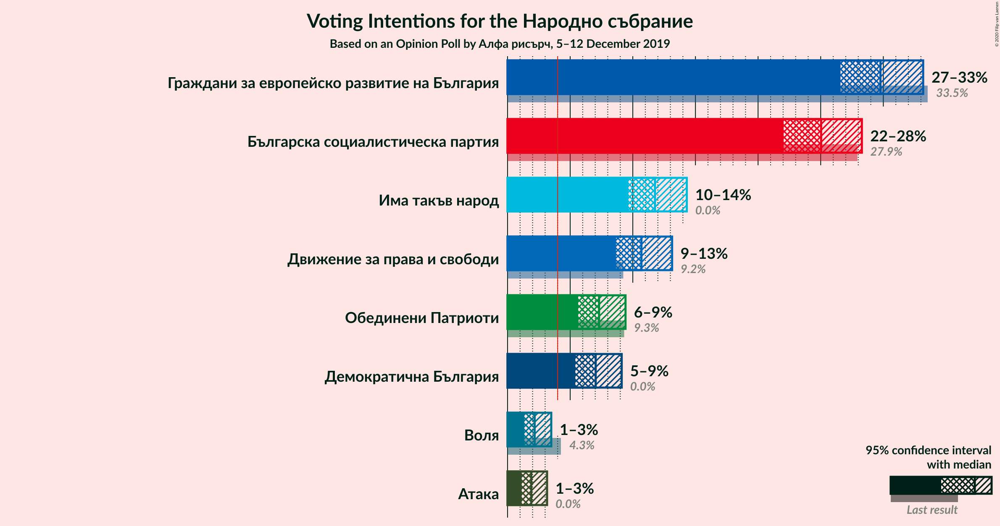

### Confidence Intervals

| Party | Last Result | Poll Result | 80% Confidence Interval | 90% Confidence Interval | 95% Confidence Interval | 99% Confidence Interval |
|:-----:|:-----------:|:-----------:|:-----------------------:|:-----------------------:|:-----------------------:|:-----------------------:|
| Граждани за европейско развитие на България | 33.5% | 29.8% | 27.7–32.0% |27.1–32.6% |26.6–33.2% |25.6–34.2% |
| Българска социалистическа партия | 27.9% | 25.0% | 23.1–27.2% |22.5–27.8% |22.0–28.3% |21.1–29.3% |
| Има такъв народ | 0.0% | 11.8% | 10.4–13.4% |10.0–13.9% |9.6–14.3% |9.0–15.1% |
| Движение за права и свободи | 9.2% | 10.7% | 9.4–12.3% |9.0–12.7% |8.7–13.1% |8.1–13.9% |
| Обединени Патриоти | 9.3% | 7.3% | 6.2–8.7% |5.9–9.1% |5.6–9.4% |5.2–10.1% |
| Демократична България | 0.0% | 7.0% | 6.0–8.4% |5.7–8.8% |5.4–9.1% |4.9–9.8% |
| Воля | 4.3% | 2.2% | 1.6–3.0% |1.5–3.3% |1.3–3.5% |1.1–3.9% |
| Атака | 0.0% | 1.9% | 1.4–2.7% |1.2–3.0% |1.1–3.2% |0.9–3.6% |

*Note:* The poll result column reflects the actual value used in the calculations. Published results may vary slightly, and in addition be rounded to fewer digits.

## Seats

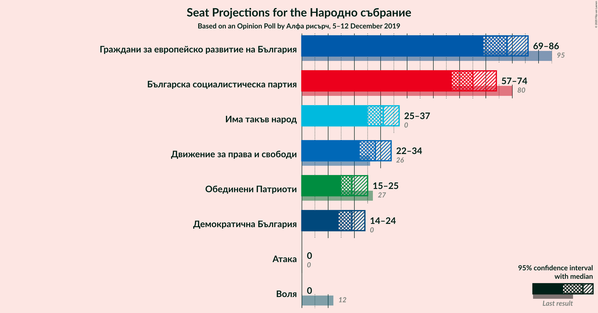

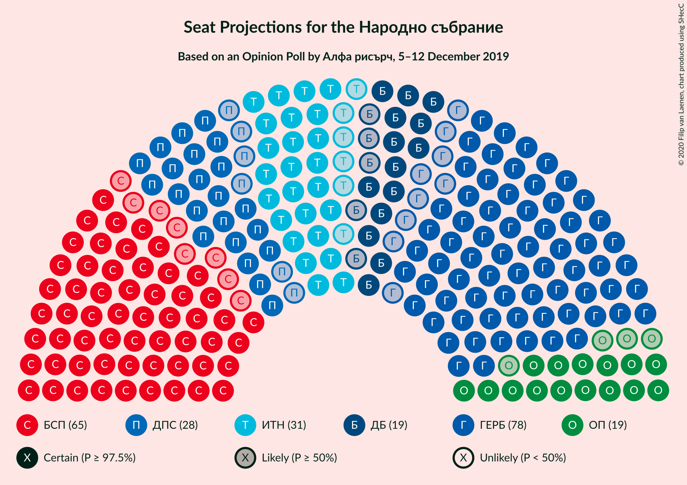

### Confidence Intervals

| Party | Last Result | Median | 80% Confidence Interval | 90% Confidence Interval | 95% Confidence Interval | 99% Confidence Interval |
|:-----:|:-----------:|:------:|:-----------------------:|:-----------------------:|:-----------------------:|:-----------------------:|
| <a href="#граждани-за-европейско-развитие-на-българия">Граждани за европейско развитие на България</a> | 95 | 78 | 72–83 |71–85 |69–86 |67–89 |
| <a href="#българска-социалистическа-партия">Българска социалистическа партия</a> | 80 | 65 | 60–71 |59–73 |57–74 |55–76 |
| <a href="#има-такъв-народ">Има такъв народ</a> | 0 | 31 | 27–35 |26–36 |25–37 |24–39 |
| <a href="#движение-за-права-и-свободи">Движение за права и свободи</a> | 26 | 28 | 24–32 |23–33 |22–34 |21–36 |
| <a href="#обединени-патриоти">Обединени Патриоти</a> | 27 | 19 | 16–23 |15–24 |15–25 |13–26 |
| <a href="#демократична-българия">Демократична България</a> | 0 | 19 | 16–22 |15–23 |14–24 |13–26 |
| <a href="#воля">Воля</a> | 12 | 0 | 0 |0 |0 |0 |
| <a href="#атака">Атака</a> | 0 | 0 | 0 |0 |0 |0 |

### Граждани за европейско развитие на България

*For a full overview of the results for this party, see the [Граждани за европейско развитие на България](party-гражданизаевропейскоразвитиенабългария.html) page.*

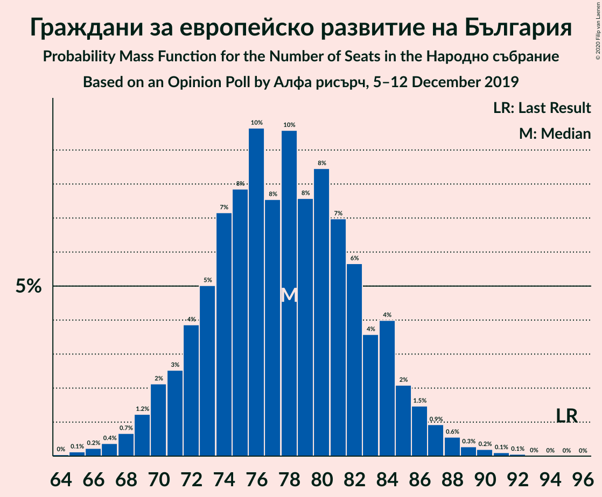

| Number of Seats | Probability | Accumulated | Special Marks |
|:---------------:|:-----------:|:-----------:|:-------------:|
| 64 | 0% | 100% |  |
| 65 | 0.1% | 99.9% |  |
| 66 | 0.2% | 99.8% |  |
| 67 | 0.4% | 99.6% |  |
| 68 | 0.7% | 99.2% |  |
| 69 | 1.2% | 98.5% |  |
| 70 | 2% | 97% |  |
| 71 | 3% | 95% |  |
| 72 | 4% | 93% |  |
| 73 | 5% | 89% |  |
| 74 | 7% | 84% |  |
| 75 | 8% | 77% |  |
| 76 | 10% | 69% |  |
| 77 | 8% | 59% |  |
| 78 | 10% | 52% | Median |
| 79 | 8% | 42% |  |
| 80 | 8% | 34% |  |
| 81 | 7% | 26% |  |
| 82 | 6% | 19% |  |
| 83 | 4% | 13% |  |
| 84 | 4% | 10% |  |
| 85 | 2% | 6% |  |
| 86 | 1.5% | 4% |  |
| 87 | 0.9% | 2% |  |
| 88 | 0.6% | 1.2% |  |
| 89 | 0.3% | 0.7% |  |
| 90 | 0.2% | 0.4% |  |
| 91 | 0.1% | 0.2% |  |
| 92 | 0.1% | 0.1% |  |
| 93 | 0% | 0% |  |
| 94 | 0% | 0% |  |
| 95 | 0% | 0% | Last Result |

### Българска социалистическа партия

*For a full overview of the results for this party, see the [Българска социалистическа партия](party-българскасоциалистическапартия.html) page.*

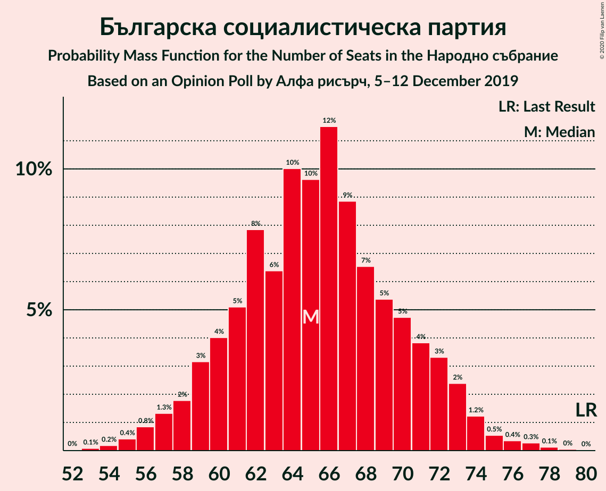

| Number of Seats | Probability | Accumulated | Special Marks |
|:---------------:|:-----------:|:-----------:|:-------------:|
| 52 | 0% | 100% |  |
| 53 | 0.1% | 99.9% |  |
| 54 | 0.2% | 99.9% |  |
| 55 | 0.4% | 99.7% |  |
| 56 | 0.8% | 99.3% |  |
| 57 | 1.3% | 98% |  |
| 58 | 2% | 97% |  |
| 59 | 3% | 95% |  |
| 60 | 4% | 92% |  |
| 61 | 5% | 88% |  |
| 62 | 8% | 83% |  |
| 63 | 6% | 75% |  |
| 64 | 10% | 69% |  |
| 65 | 10% | 59% | Median |
| 66 | 12% | 49% |  |
| 67 | 9% | 38% |  |
| 68 | 7% | 29% |  |
| 69 | 5% | 22% |  |
| 70 | 5% | 17% |  |
| 71 | 4% | 12% |  |
| 72 | 3% | 8% |  |
| 73 | 2% | 5% |  |
| 74 | 1.2% | 3% |  |
| 75 | 0.5% | 1.4% |  |
| 76 | 0.4% | 0.8% |  |
| 77 | 0.3% | 0.5% |  |
| 78 | 0.1% | 0.2% |  |
| 79 | 0% | 0.1% |  |
| 80 | 0% | 0% | Last Result |

### Има такъв народ

*For a full overview of the results for this party, see the [Има такъв народ](party-иматакъвнарод.html) page.*

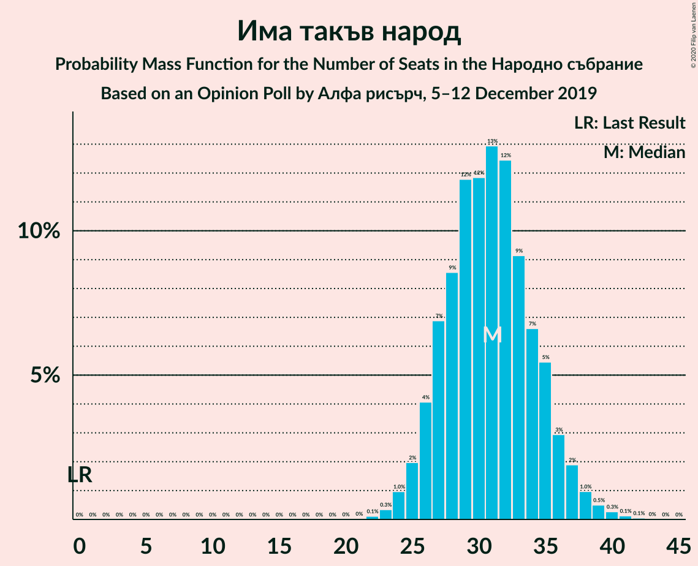

| Number of Seats | Probability | Accumulated | Special Marks |
|:---------------:|:-----------:|:-----------:|:-------------:|
| 0 | 0% | 100% | Last Result |
| 1 | 0% | 100% |  |
| 2 | 0% | 100% |  |
| 3 | 0% | 100% |  |
| 4 | 0% | 100% |  |
| 5 | 0% | 100% |  |
| 6 | 0% | 100% |  |
| 7 | 0% | 100% |  |
| 8 | 0% | 100% |  |
| 9 | 0% | 100% |  |
| 10 | 0% | 100% |  |
| 11 | 0% | 100% |  |
| 12 | 0% | 100% |  |
| 13 | 0% | 100% |  |
| 14 | 0% | 100% |  |
| 15 | 0% | 100% |  |
| 16 | 0% | 100% |  |
| 17 | 0% | 100% |  |
| 18 | 0% | 100% |  |
| 19 | 0% | 100% |  |
| 20 | 0% | 100% |  |
| 21 | 0% | 100% |  |
| 22 | 0.1% | 100% |  |
| 23 | 0.3% | 99.8% |  |
| 24 | 1.0% | 99.5% |  |
| 25 | 2% | 98.5% |  |
| 26 | 4% | 97% |  |
| 27 | 7% | 92% |  |
| 28 | 9% | 86% |  |
| 29 | 12% | 77% |  |
| 30 | 12% | 65% |  |
| 31 | 13% | 53% | Median |
| 32 | 12% | 40% |  |
| 33 | 9% | 28% |  |
| 34 | 7% | 19% |  |
| 35 | 5% | 12% |  |
| 36 | 3% | 7% |  |
| 37 | 2% | 4% |  |
| 38 | 1.0% | 2% |  |
| 39 | 0.5% | 1.0% |  |
| 40 | 0.3% | 0.5% |  |
| 41 | 0.1% | 0.2% |  |
| 42 | 0.1% | 0.1% |  |
| 43 | 0% | 0% |  |

### Движение за права и свободи

*For a full overview of the results for this party, see the [Движение за права и свободи](party-движениезаправаисвободи.html) page.*

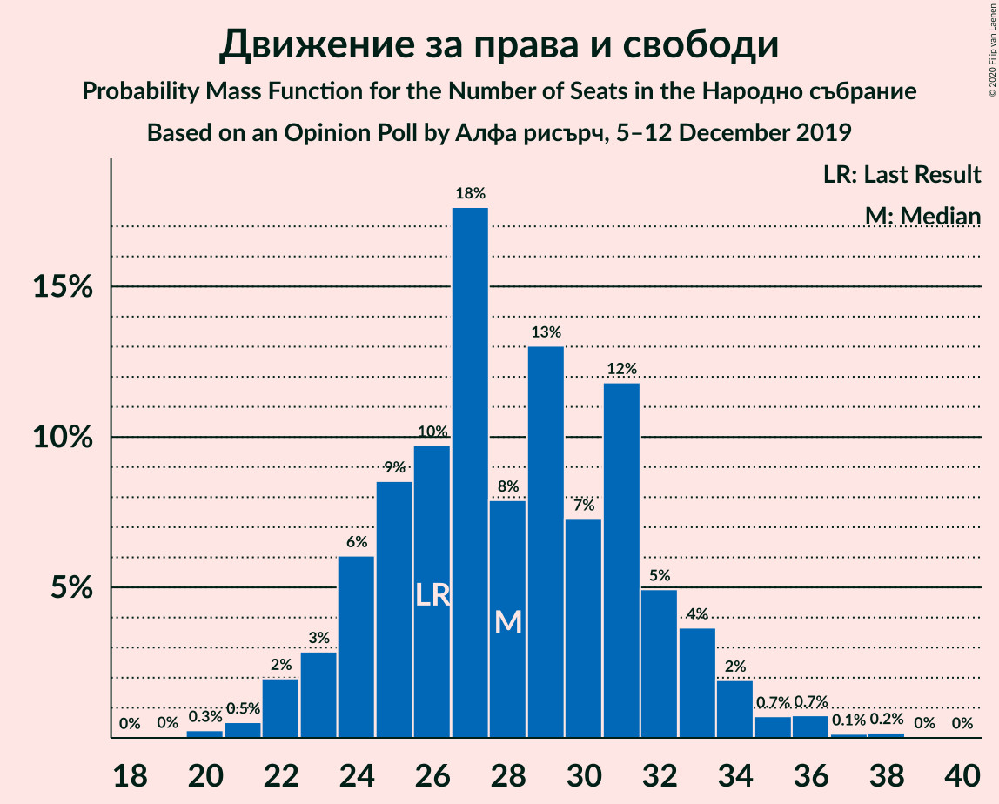

| Number of Seats | Probability | Accumulated | Special Marks |
|:---------------:|:-----------:|:-----------:|:-------------:|
| 19 | 0% | 100% |  |
| 20 | 0.3% | 99.9% |  |
| 21 | 0.5% | 99.7% |  |
| 22 | 2% | 99.2% |  |
| 23 | 3% | 97% |  |
| 24 | 6% | 94% |  |
| 25 | 9% | 88% |  |
| 26 | 10% | 80% | Last Result |
| 27 | 18% | 70% |  |
| 28 | 8% | 52% | Median |
| 29 | 13% | 44% |  |
| 30 | 7% | 31% |  |
| 31 | 12% | 24% |  |
| 32 | 5% | 12% |  |
| 33 | 4% | 7% |  |
| 34 | 2% | 4% |  |
| 35 | 0.7% | 2% |  |
| 36 | 0.7% | 1.1% |  |
| 37 | 0.1% | 0.4% |  |
| 38 | 0.2% | 0.2% |  |
| 39 | 0% | 0.1% |  |
| 40 | 0% | 0% |  |

### Обединени Патриоти

*For a full overview of the results for this party, see the [Обединени Патриоти](party-обединенипатриоти.html) page.*

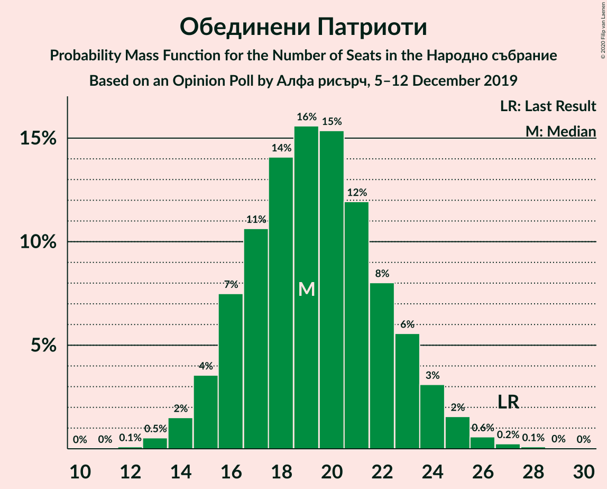

| Number of Seats | Probability | Accumulated | Special Marks |
|:---------------:|:-----------:|:-----------:|:-------------:|
| 12 | 0.1% | 100% |  |
| 13 | 0.5% | 99.9% |  |
| 14 | 2% | 99.4% |  |
| 15 | 4% | 98% |  |
| 16 | 7% | 94% |  |
| 17 | 11% | 87% |  |
| 18 | 14% | 76% |  |
| 19 | 16% | 62% | Median |
| 20 | 15% | 47% |  |
| 21 | 12% | 31% |  |
| 22 | 8% | 19% |  |
| 23 | 6% | 11% |  |
| 24 | 3% | 6% |  |
| 25 | 2% | 3% |  |
| 26 | 0.6% | 1.0% |  |
| 27 | 0.2% | 0.4% | Last Result |
| 28 | 0.1% | 0.1% |  |
| 29 | 0% | 0.1% |  |
| 30 | 0% | 0% |  |

### Демократична България

*For a full overview of the results for this party, see the [Демократична България](party-демократичнабългария.html) page.*

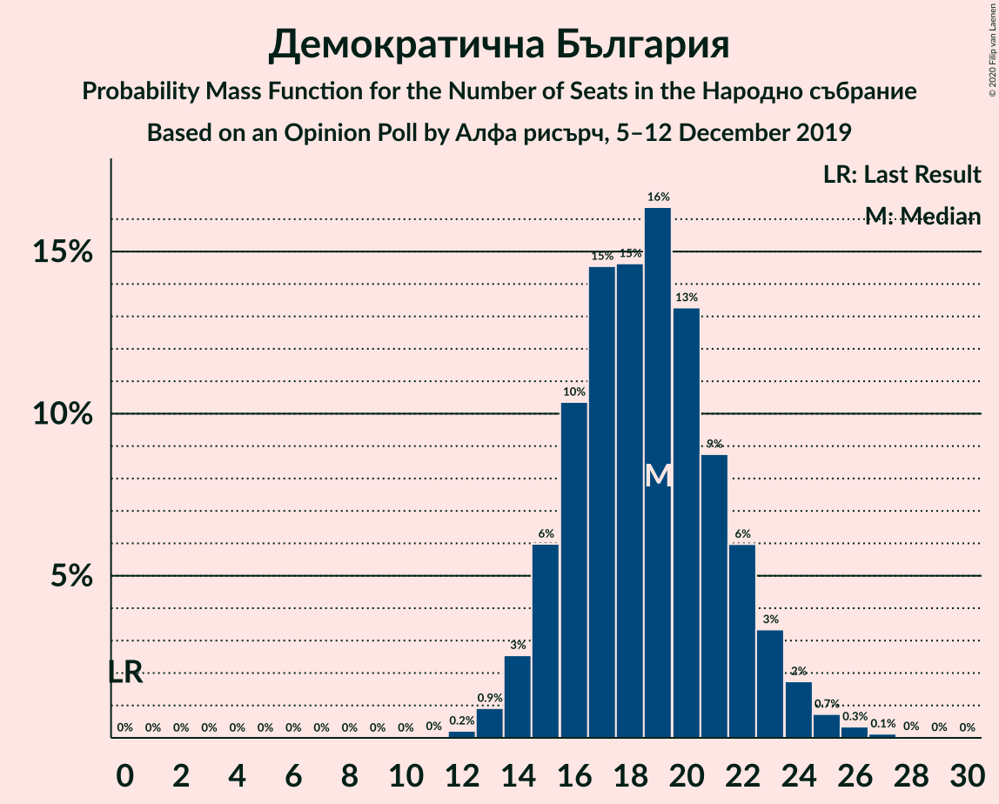

| Number of Seats | Probability | Accumulated | Special Marks |
|:---------------:|:-----------:|:-----------:|:-------------:|
| 0 | 0% | 100% | Last Result |
| 1 | 0% | 100% |  |
| 2 | 0% | 100% |  |
| 3 | 0% | 100% |  |
| 4 | 0% | 100% |  |
| 5 | 0% | 100% |  |
| 6 | 0% | 100% |  |
| 7 | 0% | 100% |  |
| 8 | 0% | 100% |  |
| 9 | 0% | 100% |  |
| 10 | 0% | 100% |  |
| 11 | 0% | 100% |  |
| 12 | 0.2% | 99.9% |  |
| 13 | 0.9% | 99.7% |  |
| 14 | 3% | 98.8% |  |
| 15 | 6% | 96% |  |
| 16 | 10% | 90% |  |
| 17 | 15% | 80% |  |
| 18 | 15% | 65% |  |
| 19 | 16% | 51% | Median |
| 20 | 13% | 34% |  |
| 21 | 9% | 21% |  |
| 22 | 6% | 12% |  |
| 23 | 3% | 6% |  |
| 24 | 2% | 3% |  |
| 25 | 0.7% | 1.3% |  |
| 26 | 0.3% | 0.5% |  |
| 27 | 0.1% | 0.2% |  |
| 28 | 0% | 0.1% |  |
| 29 | 0% | 0% |  |

### Воля

*For a full overview of the results for this party, see the [Воля](party-воля.html) page.*

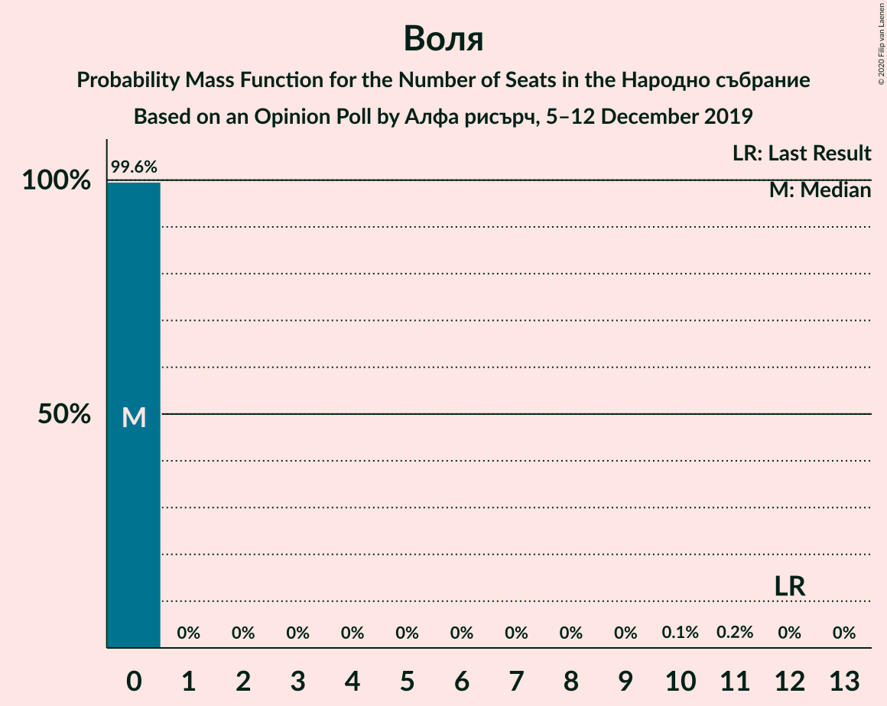

| Number of Seats | Probability | Accumulated | Special Marks |
|:---------------:|:-----------:|:-----------:|:-------------:|
| 0 | 99.6% | 100% | Median |
| 1 | 0% | 0.4% |  |
| 2 | 0% | 0.4% |  |
| 3 | 0% | 0.4% |  |
| 4 | 0% | 0.4% |  |
| 5 | 0% | 0.4% |  |
| 6 | 0% | 0.4% |  |
| 7 | 0% | 0.4% |  |
| 8 | 0% | 0.4% |  |
| 9 | 0% | 0.4% |  |
| 10 | 0.1% | 0.4% |  |
| 11 | 0.2% | 0.2% |  |
| 12 | 0% | 0.1% | Last Result |
| 13 | 0% | 0% |  |

### Атака

*For a full overview of the results for this party, see the [Атака](party-атака.html) page.*

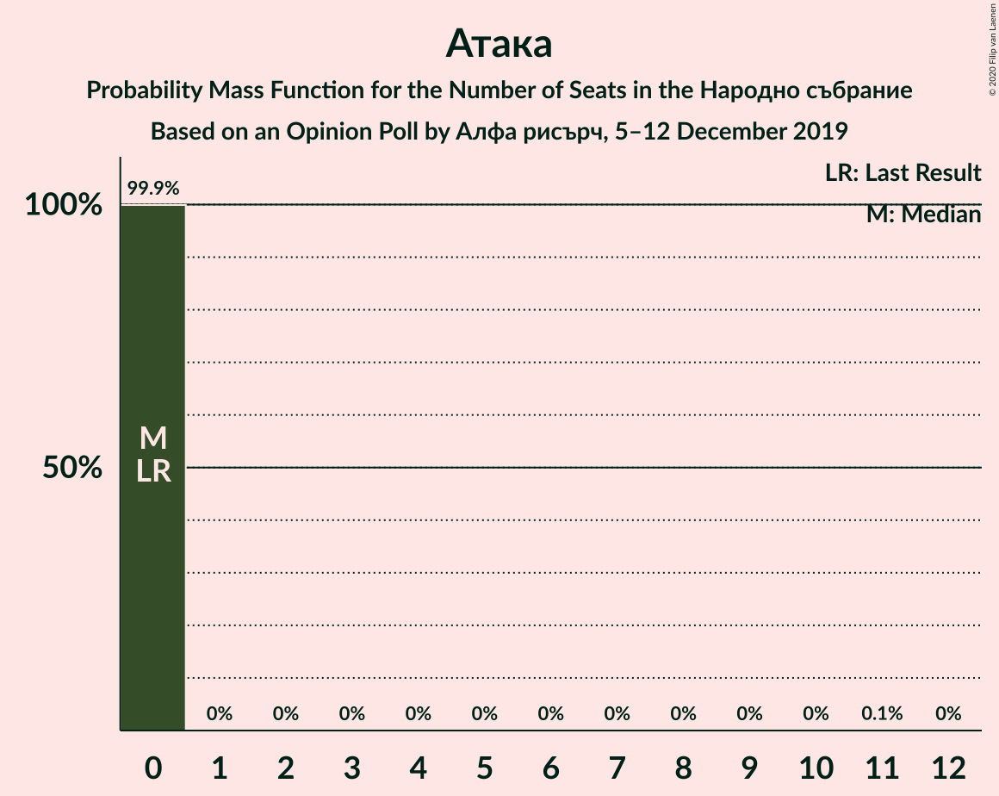

| Number of Seats | Probability | Accumulated | Special Marks |
|:---------------:|:-----------:|:-----------:|:-------------:|
| 0 | 99.9% | 100% | Last Result, Median |
| 1 | 0% | 0.1% |  |
| 2 | 0% | 0.1% |  |
| 3 | 0% | 0.1% |  |
| 4 | 0% | 0.1% |  |
| 5 | 0% | 0.1% |  |
| 6 | 0% | 0.1% |  |
| 7 | 0% | 0.1% |  |
| 8 | 0% | 0.1% |  |
| 9 | 0% | 0.1% |  |
| 10 | 0% | 0.1% |  |
| 11 | 0.1% | 0.1% |  |
| 12 | 0% | 0% |  |

## Coalitions

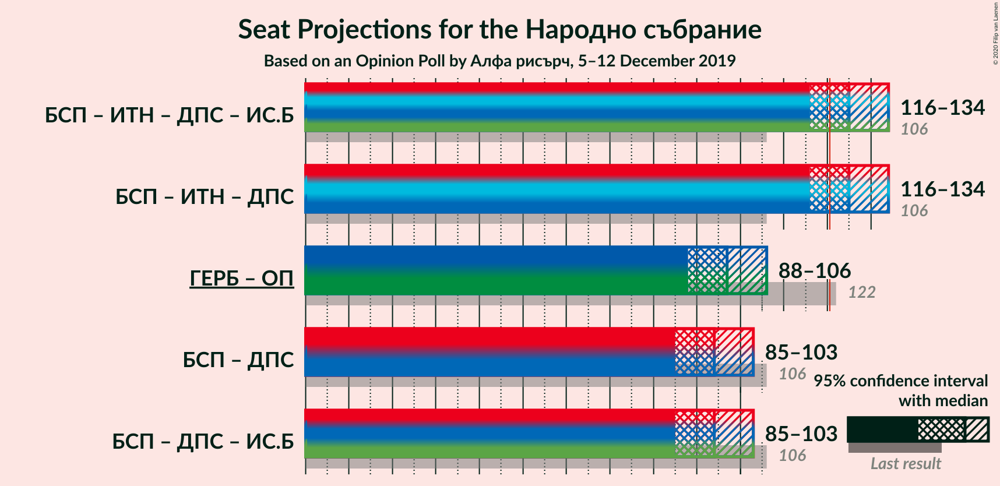

### Confidence Intervals

| Coalition | Last Result | Median | Majority? | 80% Confidence Interval | 90% Confidence Interval | 95% Confidence Interval | 99% Confidence Interval |
|:---------:|:-----------:|:------:|:---------:|:-----------------------:|:-----------------------:|:-----------------------:|:-----------------------:|
| Българска социалистическа партия – Има такъв народ – Движение за права и свободи | 106 | 125 | 74% | 118–130 | 117–133 | 116–134 | 112–136 |
| Граждани за европейско развитие на България – Обединени Патриоти | 122 | 97 | 0% | 91–103 | 89–104 | 88–106 | 85–109 |
| Българска социалистическа партия – Движение за права и свободи | 106 | 94 | 0% | 87–100 | 86–101 | 85–103 | 82–105 |

### Българска социалистическа партия – Има такъв народ – Движение за права и свободи

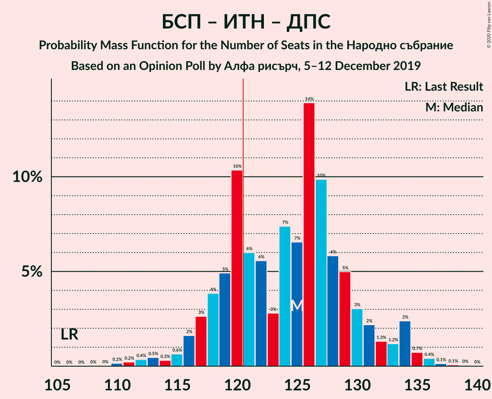

| Number of Seats | Probability | Accumulated | Special Marks |
|:---------------:|:-----------:|:-----------:|:-------------:|
| 106 | 0% | 100% | Last Result |
| 107 | 0% | 100% |  |
| 108 | 0% | 100% |  |
| 109 | 0% | 100% |  |
| 110 | 0.2% | 100% |  |
| 111 | 0.2% | 99.8% |  |
| 112 | 0.4% | 99.6% |  |
| 113 | 0.5% | 99.2% |  |
| 114 | 0.3% | 98.8% |  |
| 115 | 0.6% | 98% |  |
| 116 | 2% | 98% |  |
| 117 | 3% | 96% |  |
| 118 | 4% | 94% |  |
| 119 | 5% | 90% |  |
| 120 | 10% | 85% |  |
| 121 | 6% | 74% | Majority |
| 122 | 6% | 68% |  |
| 123 | 3% | 63% |  |
| 124 | 7% | 60% | Median |
| 125 | 7% | 53% |  |
| 126 | 14% | 46% |  |
| 127 | 10% | 32% |  |
| 128 | 6% | 22% |  |
| 129 | 5% | 17% |  |
| 130 | 3% | 12% |  |
| 131 | 2% | 9% |  |
| 132 | 1.3% | 6% |  |
| 133 | 1.2% | 5% |  |
| 134 | 2% | 4% |  |
| 135 | 0.7% | 1.4% |  |
| 136 | 0.4% | 0.7% |  |
| 137 | 0.1% | 0.3% |  |
| 138 | 0.1% | 0.2% |  |
| 139 | 0% | 0.1% |  |
| 140 | 0% | 0% |  |

### Граждани за европейско развитие на България – Обединени Патриоти

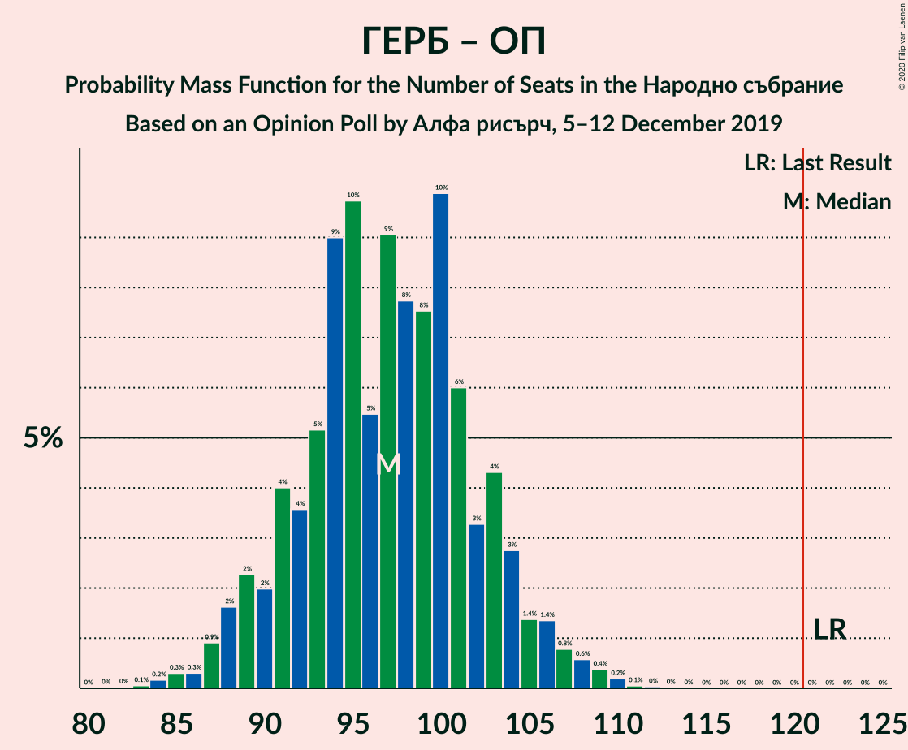

| Number of Seats | Probability | Accumulated | Special Marks |
|:---------------:|:-----------:|:-----------:|:-------------:|
| 82 | 0% | 100% |  |
| 83 | 0.1% | 99.9% |  |
| 84 | 0.2% | 99.9% |  |
| 85 | 0.3% | 99.7% |  |
| 86 | 0.3% | 99.4% |  |
| 87 | 0.9% | 99.1% |  |
| 88 | 2% | 98% |  |
| 89 | 2% | 97% |  |
| 90 | 2% | 94% |  |
| 91 | 4% | 92% |  |
| 92 | 4% | 88% |  |
| 93 | 5% | 85% |  |
| 94 | 9% | 80% |  |
| 95 | 10% | 71% |  |
| 96 | 5% | 61% |  |
| 97 | 9% | 55% | Median |
| 98 | 8% | 46% |  |
| 99 | 8% | 39% |  |
| 100 | 10% | 31% |  |
| 101 | 6% | 21% |  |
| 102 | 3% | 15% |  |
| 103 | 4% | 12% |  |
| 104 | 3% | 8% |  |
| 105 | 1.4% | 5% |  |
| 106 | 1.4% | 3% |  |
| 107 | 0.8% | 2% |  |
| 108 | 0.6% | 1.3% |  |
| 109 | 0.4% | 0.7% |  |
| 110 | 0.2% | 0.3% |  |
| 111 | 0.1% | 0.1% |  |
| 112 | 0% | 0.1% |  |
| 113 | 0% | 0% |  |
| 114 | 0% | 0% |  |
| 115 | 0% | 0% |  |
| 116 | 0% | 0% |  |
| 117 | 0% | 0% |  |
| 118 | 0% | 0% |  |
| 119 | 0% | 0% |  |
| 120 | 0% | 0% |  |
| 121 | 0% | 0% | Majority |
| 122 | 0% | 0% | Last Result |

### Българска социалистическа партия – Движение за права и свободи

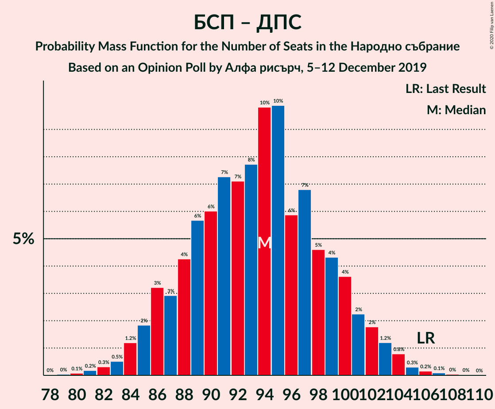

| Number of Seats | Probability | Accumulated | Special Marks |
|:---------------:|:-----------:|:-----------:|:-------------:|
| 79 | 0% | 100% |  |
| 80 | 0.1% | 99.9% |  |
| 81 | 0.2% | 99.8% |  |
| 82 | 0.3% | 99.7% |  |
| 83 | 0.5% | 99.3% |  |
| 84 | 1.2% | 98.8% |  |
| 85 | 2% | 98% |  |
| 86 | 3% | 96% |  |
| 87 | 3% | 93% |  |
| 88 | 4% | 90% |  |
| 89 | 6% | 85% |  |
| 90 | 6% | 80% |  |
| 91 | 7% | 74% |  |
| 92 | 7% | 66% |  |
| 93 | 8% | 59% | Median |
| 94 | 10% | 52% |  |
| 95 | 10% | 42% |  |
| 96 | 6% | 32% |  |
| 97 | 7% | 26% |  |
| 98 | 5% | 19% |  |
| 99 | 4% | 15% |  |
| 100 | 4% | 10% |  |
| 101 | 2% | 7% |  |
| 102 | 2% | 4% |  |
| 103 | 1.2% | 3% |  |
| 104 | 0.8% | 1.4% |  |
| 105 | 0.3% | 0.6% |  |
| 106 | 0.2% | 0.3% | Last Result |
| 107 | 0.1% | 0.2% |  |
| 108 | 0% | 0.1% |  |
| 109 | 0% | 0% |  |

## Technical Information

### Opinion Poll

+ **Polling firm:** Алфа рисърч
+ **Commissioner(s):** —
+ **Fieldwork period:** 5–12 December 2019

### Calculations

+ **Sample size:** 739
+ **Simulations done:** 1,048,576
+ **Error estimate:** 1.83%

