# Opinion Poll by Тренд for 24 часа, 3–10 February 2020

<a href="#voting-intentions">Voting Intentions</a> | <a href="#seats">Seats</a> | <a href="#coalitions">Coalitions</a> | <a href="#technical-information">Technical Information</a>

## Voting Intentions

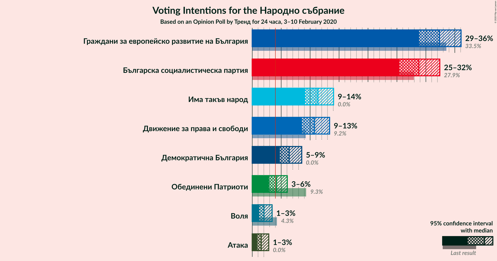

### Confidence Intervals

| Party | Last Result | Poll Result | 80% Confidence Interval | 90% Confidence Interval | 95% Confidence Interval | 99% Confidence Interval |
|:-----:|:-----------:|:-----------:|:-----------------------:|:-----------------------:|:-----------------------:|:-----------------------:|
| Граждани за европейско развитие на България | 33.5% | 32.3% | 30.0–34.8% |29.4–35.5% |28.8–36.1% |27.8–37.3% |
| Българска социалистическа партия | 27.9% | 28.8% | 26.6–31.1% |25.9–31.8% |25.4–32.4% |24.4–33.5% |
| Има такъв народ | 0.0% | 11.4% | 9.9–13.1% |9.5–13.6% |9.1–14.1% |8.5–14.9% |
| Движение за права и свободи | 9.2% | 10.7% | 9.3–12.5% |8.9–12.9% |8.6–13.4% |7.9–14.2% |
| Демократична България | 0.0% | 6.4% | 5.3–7.8% |5.0–8.2% |4.7–8.6% |4.3–9.3% |
| Обединени Патриоти | 9.3% | 4.2% | 3.3–5.4% |3.1–5.7% |2.9–6.1% |2.5–6.7% |
| Воля | 4.3% | 2.0% | 1.5–2.9% |1.3–3.2% |1.2–3.4% |1.0–3.9% |
| Атака | 0.0% | 1.6% | 1.1–2.4% |1.0–2.6% |0.9–2.9% |0.7–3.3% |

*Note:* The poll result column reflects the actual value used in the calculations. Published results may vary slightly, and in addition be rounded to fewer digits.

## Seats

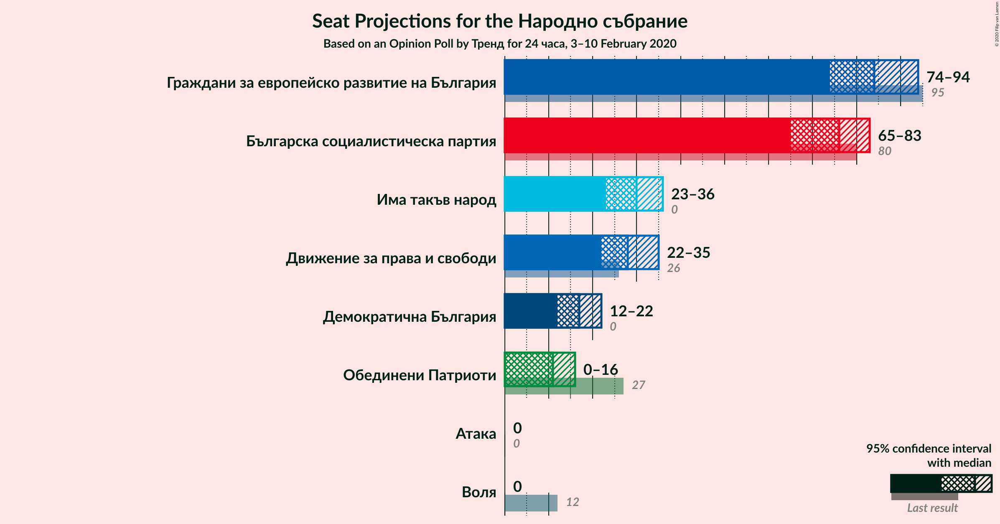

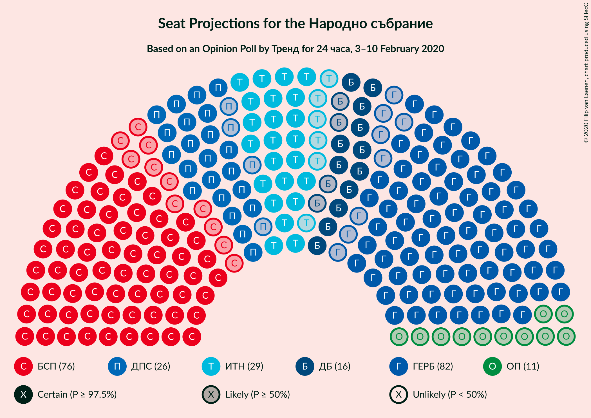

### Confidence Intervals

| Party | Last Result | Median | 80% Confidence Interval | 90% Confidence Interval | 95% Confidence Interval | 99% Confidence Interval |
|:-----:|:-----------:|:------:|:-----------------------:|:-----------------------:|:-----------------------:|:-----------------------:|
| <a href="#граждани-за-европейско-развитие-на-българия">Граждани за европейско развитие на България</a> | 95 | 84 | 77–90 |75–92 |74–94 |71–97 |
| <a href="#българска-социалистическа-партия">Българска социалистическа партия</a> | 80 | 76 | 67–80 |66–82 |65–83 |63–88 |
| <a href="#има-такъв-народ">Има такъв народ</a> | 0 | 30 | 25–34 |24–35 |23–36 |22–39 |
| <a href="#движение-за-права-и-свободи">Движение за права и свободи</a> | 26 | 28 | 24–32 |23–34 |22–35 |20–37 |
| <a href="#демократична-българия">Демократична България</a> | 0 | 17 | 14–20 |13–21 |12–22 |11–24 |
| <a href="#обединени-патриоти">Обединени Патриоти</a> | 27 | 11 | 0–14 |0–15 |0–16 |0–17 |
| <a href="#воля">Воля</a> | 12 | 0 | 0 |0 |0 |0 |
| <a href="#атака">Атака</a> | 0 | 0 | 0 |0 |0 |0 |

### Граждани за европейско развитие на България

*For a full overview of the results for this party, see the [Граждани за европейско развитие на България](party-гражданизаевропейскоразвитиенабългария.html) page.*

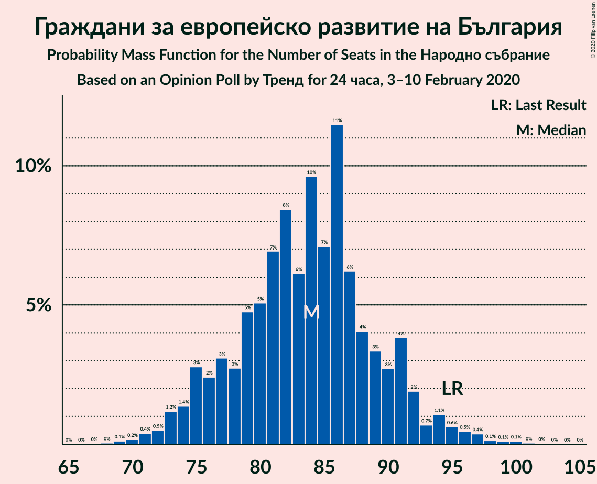

| Number of Seats | Probability | Accumulated | Special Marks |
|:---------------:|:-----------:|:-----------:|:-------------:|
| 68 | 0% | 100% |  |
| 69 | 0.1% | 99.9% |  |
| 70 | 0.2% | 99.8% |  |
| 71 | 0.4% | 99.6% |  |
| 72 | 0.5% | 99.2% |  |
| 73 | 1.2% | 98.7% |  |
| 74 | 1.4% | 98% |  |
| 75 | 3% | 96% |  |
| 76 | 2% | 93% |  |
| 77 | 3% | 91% |  |
| 78 | 3% | 88% |  |
| 79 | 5% | 85% |  |
| 80 | 5% | 80% |  |
| 81 | 7% | 75% |  |
| 82 | 8% | 68% |  |
| 83 | 6% | 60% |  |
| 84 | 10% | 54% | Median |
| 85 | 7% | 44% |  |
| 86 | 11% | 37% |  |
| 87 | 6% | 26% |  |
| 88 | 4% | 19% |  |
| 89 | 3% | 15% |  |
| 90 | 3% | 12% |  |
| 91 | 4% | 9% |  |
| 92 | 2% | 6% |  |
| 93 | 0.7% | 4% |  |
| 94 | 1.1% | 3% |  |
| 95 | 0.6% | 2% | Last Result |
| 96 | 0.5% | 1.3% |  |
| 97 | 0.4% | 0.8% |  |
| 98 | 0.1% | 0.4% |  |
| 99 | 0.1% | 0.3% |  |
| 100 | 0.1% | 0.2% |  |
| 101 | 0% | 0.1% |  |
| 102 | 0% | 0% |  |

### Българска социалистическа партия

*For a full overview of the results for this party, see the [Българска социалистическа партия](party-българскасоциалистическапартия.html) page.*

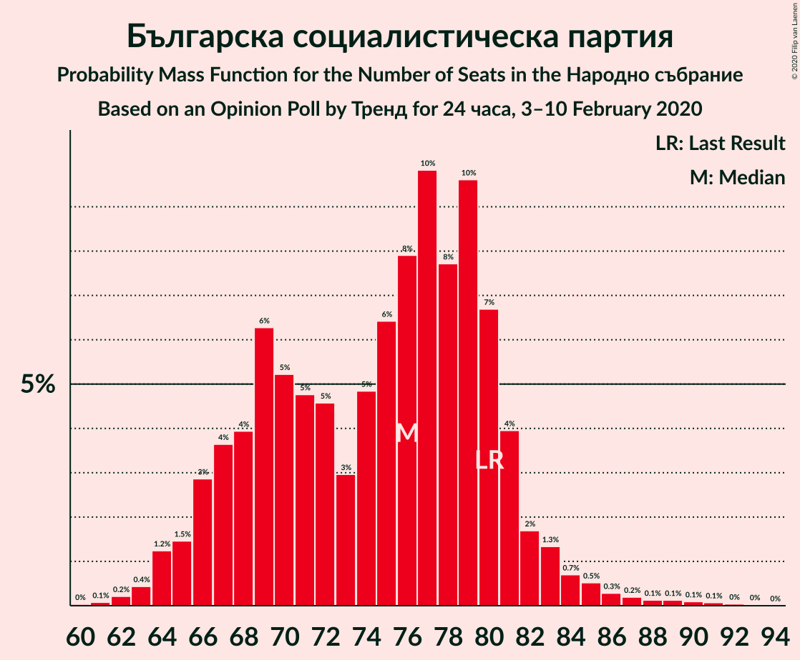

| Number of Seats | Probability | Accumulated | Special Marks |
|:---------------:|:-----------:|:-----------:|:-------------:|
| 60 | 0% | 100% |  |
| 61 | 0.1% | 99.9% |  |
| 62 | 0.2% | 99.8% |  |
| 63 | 0.4% | 99.6% |  |
| 64 | 1.2% | 99.2% |  |
| 65 | 1.5% | 98% |  |
| 66 | 3% | 96% |  |
| 67 | 4% | 94% |  |
| 68 | 4% | 90% |  |
| 69 | 6% | 86% |  |
| 70 | 5% | 80% |  |
| 71 | 5% | 75% |  |
| 72 | 5% | 70% |  |
| 73 | 3% | 65% |  |
| 74 | 5% | 62% |  |
| 75 | 6% | 57% |  |
| 76 | 8% | 51% | Median |
| 77 | 10% | 43% |  |
| 78 | 8% | 33% |  |
| 79 | 10% | 26% |  |
| 80 | 7% | 16% | Last Result |
| 81 | 4% | 9% |  |
| 82 | 2% | 5% |  |
| 83 | 1.3% | 4% |  |
| 84 | 0.7% | 2% |  |
| 85 | 0.5% | 2% |  |
| 86 | 0.3% | 1.0% |  |
| 87 | 0.2% | 0.7% |  |
| 88 | 0.1% | 0.5% |  |
| 89 | 0.1% | 0.4% |  |
| 90 | 0.1% | 0.2% |  |
| 91 | 0.1% | 0.2% |  |
| 92 | 0% | 0.1% |  |
| 93 | 0% | 0% |  |

### Има такъв народ

*For a full overview of the results for this party, see the [Има такъв народ](party-иматакъвнарод.html) page.*

| Number of Seats | Probability | Accumulated | Special Marks |
|:---------------:|:-----------:|:-----------:|:-------------:|
| 0 | 0% | 100% | Last Result |
| 1 | 0% | 100% |  |
| 2 | 0% | 100% |  |
| 3 | 0% | 100% |  |
| 4 | 0% | 100% |  |
| 5 | 0% | 100% |  |
| 6 | 0% | 100% |  |
| 7 | 0% | 100% |  |
| 8 | 0% | 100% |  |
| 9 | 0% | 100% |  |
| 10 | 0% | 100% |  |
| 11 | 0% | 100% |  |
| 12 | 0% | 100% |  |
| 13 | 0% | 100% |  |
| 14 | 0% | 100% |  |
| 15 | 0% | 100% |  |
| 16 | 0% | 100% |  |
| 17 | 0% | 100% |  |
| 18 | 0% | 100% |  |
| 19 | 0% | 100% |  |
| 20 | 0.1% | 100% |  |
| 21 | 0.3% | 99.9% |  |
| 22 | 0.7% | 99.6% |  |
| 23 | 2% | 98.9% |  |
| 24 | 3% | 97% |  |
| 25 | 5% | 94% |  |
| 26 | 8% | 90% |  |
| 27 | 9% | 82% |  |
| 28 | 9% | 73% |  |
| 29 | 11% | 64% |  |
| 30 | 12% | 53% | Median |
| 31 | 12% | 41% |  |
| 32 | 9% | 29% |  |
| 33 | 8% | 20% |  |
| 34 | 5% | 12% |  |
| 35 | 4% | 8% |  |
| 36 | 2% | 4% |  |
| 37 | 0.9% | 2% |  |
| 38 | 0.5% | 1.3% |  |
| 39 | 0.4% | 0.7% |  |
| 40 | 0.2% | 0.3% |  |
| 41 | 0.1% | 0.1% |  |
| 42 | 0% | 0.1% |  |
| 43 | 0% | 0% |  |

### Движение за права и свободи

*For a full overview of the results for this party, see the [Движение за права и свободи](party-движениезаправаисвободи.html) page.*

| Number of Seats | Probability | Accumulated | Special Marks |
|:---------------:|:-----------:|:-----------:|:-------------:|
| 19 | 0.1% | 100% |  |
| 20 | 0.4% | 99.8% |  |
| 21 | 0.9% | 99.5% |  |
| 22 | 2% | 98.6% |  |
| 23 | 4% | 96% |  |
| 24 | 6% | 92% |  |
| 25 | 7% | 86% |  |
| 26 | 14% | 79% | Last Result |
| 27 | 12% | 65% |  |
| 28 | 12% | 54% | Median |
| 29 | 13% | 42% |  |
| 30 | 8% | 30% |  |
| 31 | 7% | 22% |  |
| 32 | 5% | 14% |  |
| 33 | 3% | 9% |  |
| 34 | 2% | 6% |  |
| 35 | 1.3% | 3% |  |
| 36 | 1.0% | 2% |  |
| 37 | 0.6% | 0.9% |  |
| 38 | 0.2% | 0.3% |  |
| 39 | 0.1% | 0.1% |  |
| 40 | 0% | 0.1% |  |
| 41 | 0% | 0% |  |

### Демократична България

*For a full overview of the results for this party, see the [Демократична България](party-демократичнабългария.html) page.*

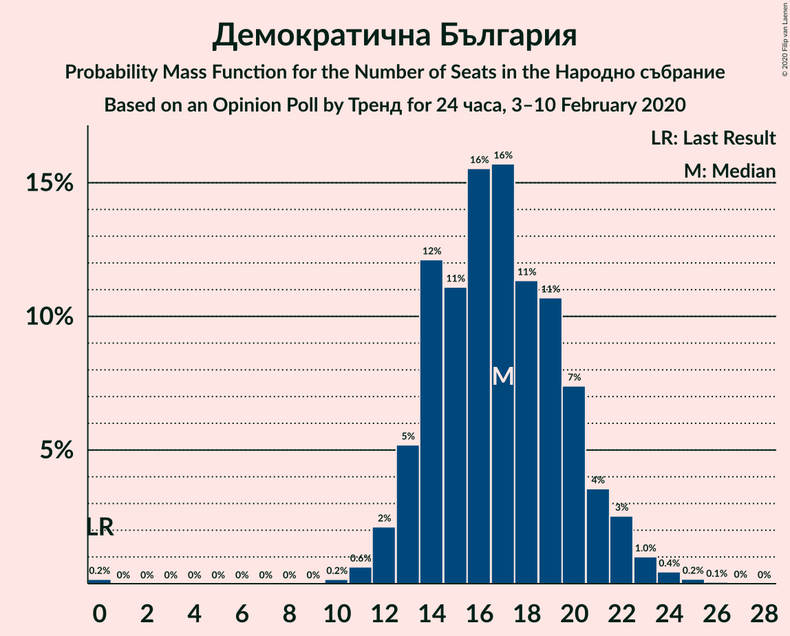

| Number of Seats | Probability | Accumulated | Special Marks |
|:---------------:|:-----------:|:-----------:|:-------------:|
| 0 | 0.2% | 100% | Last Result |
| 1 | 0% | 99.8% |  |
| 2 | 0% | 99.8% |  |
| 3 | 0% | 99.8% |  |
| 4 | 0% | 99.8% |  |
| 5 | 0% | 99.8% |  |
| 6 | 0% | 99.8% |  |
| 7 | 0% | 99.8% |  |
| 8 | 0% | 99.8% |  |
| 9 | 0% | 99.8% |  |
| 10 | 0.2% | 99.8% |  |
| 11 | 0.6% | 99.7% |  |
| 12 | 2% | 99.0% |  |
| 13 | 5% | 97% |  |
| 14 | 12% | 92% |  |
| 15 | 11% | 80% |  |
| 16 | 16% | 68% |  |
| 17 | 16% | 53% | Median |
| 18 | 11% | 37% |  |
| 19 | 11% | 26% |  |
| 20 | 7% | 15% |  |
| 21 | 4% | 8% |  |
| 22 | 3% | 4% |  |
| 23 | 1.0% | 2% |  |
| 24 | 0.4% | 0.7% |  |
| 25 | 0.2% | 0.3% |  |
| 26 | 0.1% | 0.1% |  |
| 27 | 0% | 0% |  |

### Обединени Патриоти

*For a full overview of the results for this party, see the [Обединени Патриоти](party-обединенипатриоти.html) page.*

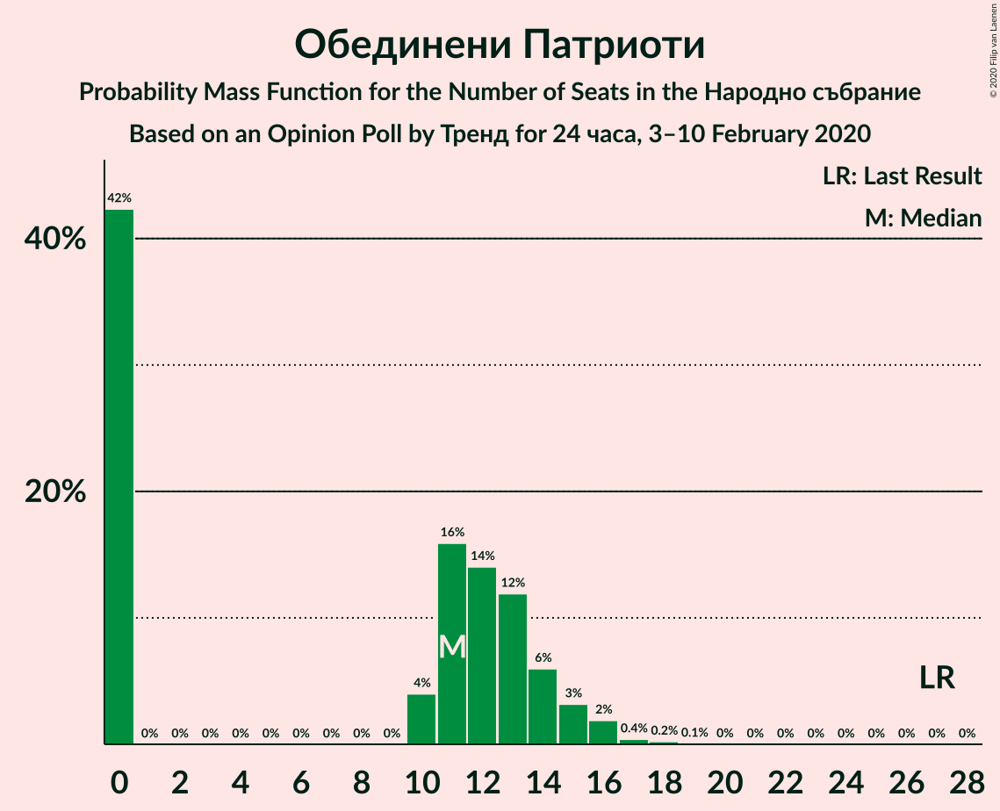

| Number of Seats | Probability | Accumulated | Special Marks |
|:---------------:|:-----------:|:-----------:|:-------------:|
| 0 | 42% | 100% |  |
| 1 | 0% | 58% |  |
| 2 | 0% | 58% |  |
| 3 | 0% | 58% |  |
| 4 | 0% | 58% |  |
| 5 | 0% | 58% |  |
| 6 | 0% | 58% |  |
| 7 | 0% | 58% |  |
| 8 | 0% | 58% |  |
| 9 | 0% | 58% |  |
| 10 | 4% | 58% |  |
| 11 | 16% | 54% | Median |
| 12 | 14% | 38% |  |
| 13 | 12% | 24% |  |
| 14 | 6% | 12% |  |
| 15 | 3% | 6% |  |
| 16 | 2% | 3% |  |
| 17 | 0.4% | 0.7% |  |
| 18 | 0.2% | 0.3% |  |
| 19 | 0.1% | 0.1% |  |
| 20 | 0% | 0% |  |
| 21 | 0% | 0% |  |
| 22 | 0% | 0% |  |
| 23 | 0% | 0% |  |
| 24 | 0% | 0% |  |
| 25 | 0% | 0% |  |
| 26 | 0% | 0% |  |
| 27 | 0% | 0% | Last Result |

### Воля

*For a full overview of the results for this party, see the [Воля](party-воля.html) page.*

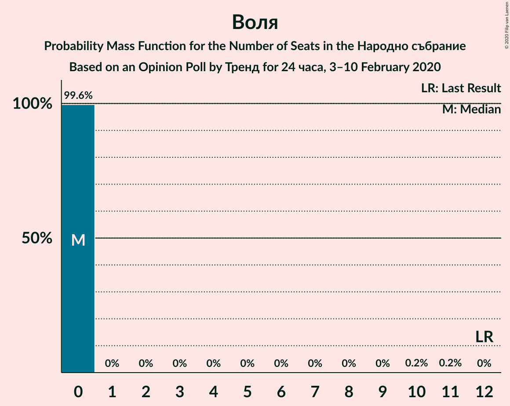

| Number of Seats | Probability | Accumulated | Special Marks |
|:---------------:|:-----------:|:-----------:|:-------------:|
| 0 | 99.6% | 100% | Median |
| 1 | 0% | 0.4% |  |
| 2 | 0% | 0.4% |  |
| 3 | 0% | 0.4% |  |
| 4 | 0% | 0.4% |  |
| 5 | 0% | 0.4% |  |
| 6 | 0% | 0.4% |  |
| 7 | 0% | 0.4% |  |
| 8 | 0% | 0.4% |  |
| 9 | 0% | 0.4% |  |
| 10 | 0.2% | 0.4% |  |
| 11 | 0.2% | 0.2% |  |
| 12 | 0% | 0% | Last Result |

### Атака

*For a full overview of the results for this party, see the [Атака](party-атака.html) page.*

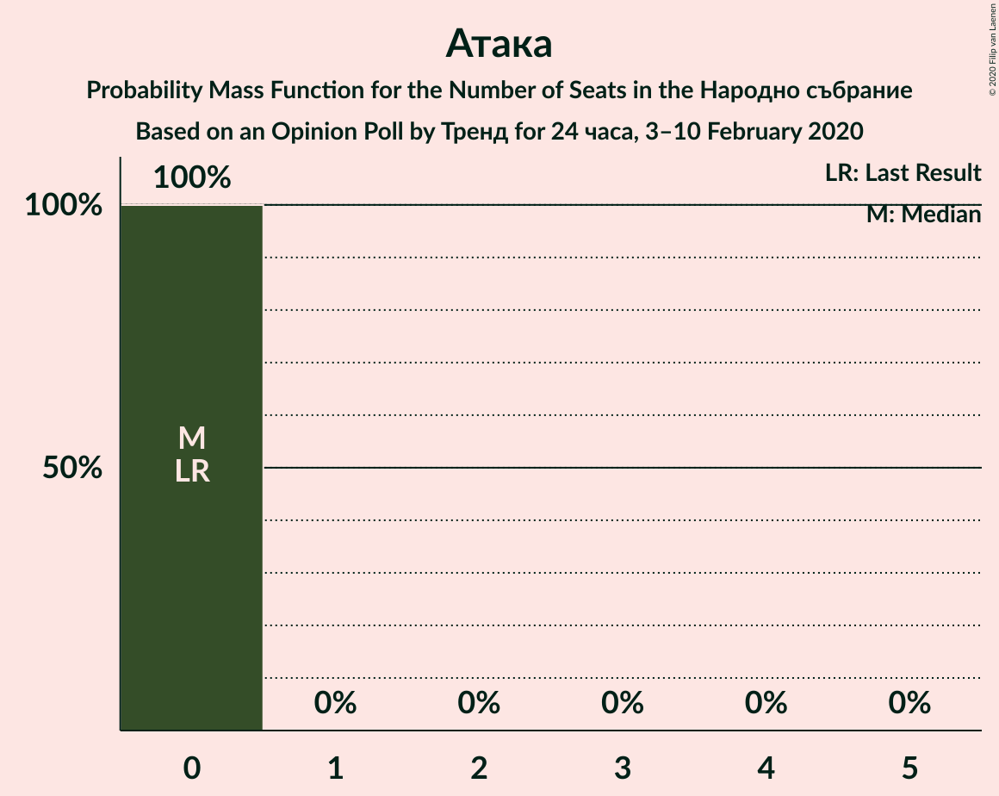

| Number of Seats | Probability | Accumulated | Special Marks |
|:---------------:|:-----------:|:-----------:|:-------------:|
| 0 | 100% | 100% | Last Result, Median |

## Coalitions

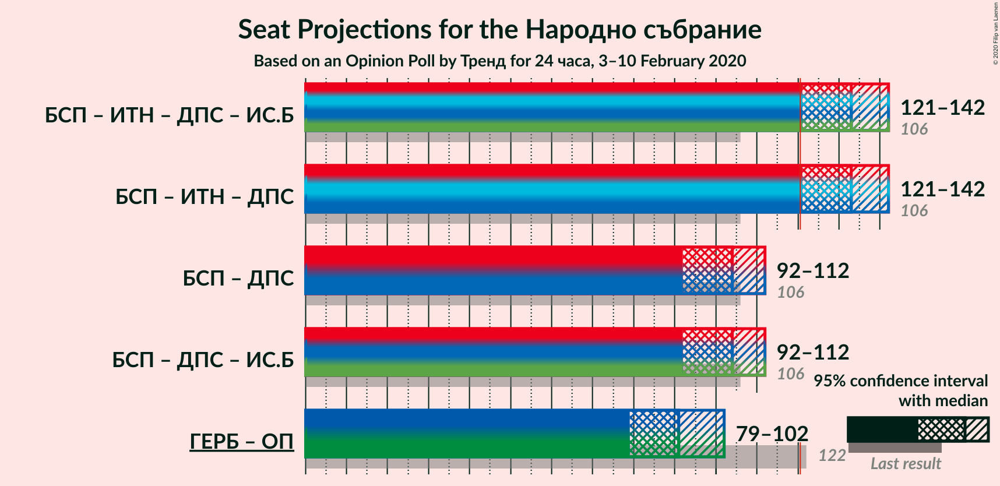

### Confidence Intervals

| Coalition | Last Result | Median | Majority? | 80% Confidence Interval | 90% Confidence Interval | 95% Confidence Interval | 99% Confidence Interval |
|:---------:|:-----------:|:------:|:---------:|:-----------------------:|:-----------------------:|:-----------------------:|:-----------------------:|
| Българска социалистическа партия – Има такъв народ – Движение за права и свободи | 106 | 133 | 98% | 123–140 | 122–141 | 121–142 | 118–148 |
| Българска социалистическа партия – Движение за права и свободи | 106 | 104 | 0.1% | 94–109 | 93–110 | 92–112 | 90–118 |
| Граждани за европейско развитие на България – Обединени Патриоти | 122 | 91 | 0% | 83–100 | 81–101 | 79–102 | 76–106 |

### Българска социалистическа партия – Има такъв народ – Движение за права и свободи

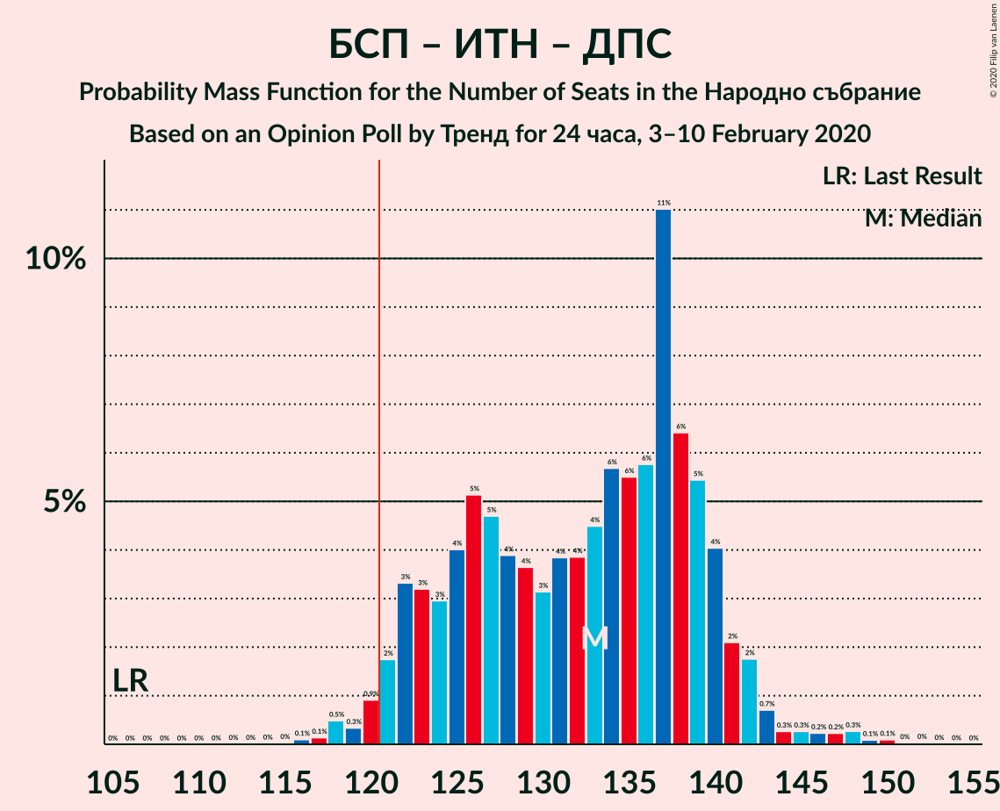

| Number of Seats | Probability | Accumulated | Special Marks |
|:---------------:|:-----------:|:-----------:|:-------------:|
| 106 | 0% | 100% | Last Result |
| 107 | 0% | 100% |  |
| 108 | 0% | 100% |  |
| 109 | 0% | 100% |  |
| 110 | 0% | 100% |  |
| 111 | 0% | 100% |  |
| 112 | 0% | 100% |  |
| 113 | 0% | 100% |  |
| 114 | 0% | 100% |  |
| 115 | 0% | 99.9% |  |
| 116 | 0.1% | 99.9% |  |
| 117 | 0.1% | 99.8% |  |
| 118 | 0.5% | 99.7% |  |
| 119 | 0.3% | 99.2% |  |
| 120 | 0.9% | 98.9% |  |
| 121 | 2% | 98% | Majority |
| 122 | 3% | 96% |  |
| 123 | 3% | 93% |  |
| 124 | 3% | 90% |  |
| 125 | 4% | 87% |  |
| 126 | 5% | 83% |  |
| 127 | 5% | 78% |  |
| 128 | 4% | 73% |  |
| 129 | 4% | 69% |  |
| 130 | 3% | 65% |  |
| 131 | 4% | 62% |  |
| 132 | 4% | 58% |  |
| 133 | 4% | 54% |  |
| 134 | 6% | 50% | Median |
| 135 | 6% | 44% |  |
| 136 | 6% | 39% |  |
| 137 | 11% | 33% |  |
| 138 | 6% | 22% |  |
| 139 | 5% | 16% |  |
| 140 | 4% | 10% |  |
| 141 | 2% | 6% |  |
| 142 | 2% | 4% |  |
| 143 | 0.7% | 2% |  |
| 144 | 0.3% | 2% |  |
| 145 | 0.3% | 1.3% |  |
| 146 | 0.2% | 1.0% |  |
| 147 | 0.2% | 0.8% |  |
| 148 | 0.3% | 0.5% |  |
| 149 | 0.1% | 0.3% |  |
| 150 | 0.1% | 0.2% |  |
| 151 | 0% | 0.1% |  |
| 152 | 0% | 0.1% |  |
| 153 | 0% | 0% |  |

### Българска социалистическа партия – Движение за права и свободи

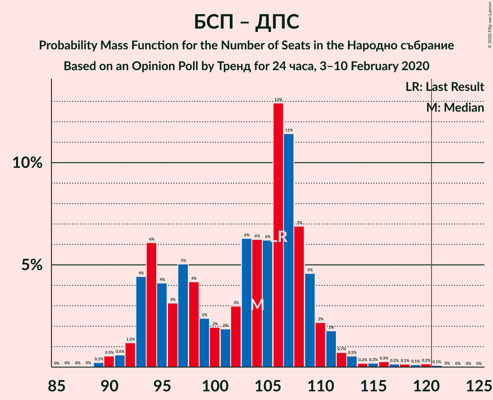

| Number of Seats | Probability | Accumulated | Special Marks |
|:---------------:|:-----------:|:-----------:|:-------------:|
| 86 | 0% | 100% |  |
| 87 | 0% | 99.9% |  |
| 88 | 0% | 99.9% |  |
| 89 | 0.2% | 99.9% |  |
| 90 | 0.5% | 99.6% |  |
| 91 | 0.6% | 99.1% |  |
| 92 | 1.2% | 98% |  |
| 93 | 4% | 97% |  |
| 94 | 6% | 93% |  |
| 95 | 4% | 87% |  |
| 96 | 3% | 83% |  |
| 97 | 5% | 80% |  |
| 98 | 4% | 74% |  |
| 99 | 2% | 70% |  |
| 100 | 2% | 68% |  |
| 101 | 2% | 66% |  |
| 102 | 3% | 64% |  |
| 103 | 6% | 61% |  |
| 104 | 6% | 55% | Median |
| 105 | 6% | 49% |  |
| 106 | 13% | 42% | Last Result |
| 107 | 11% | 29% |  |
| 108 | 7% | 18% |  |
| 109 | 5% | 11% |  |
| 110 | 2% | 7% |  |
| 111 | 2% | 4% |  |
| 112 | 0.7% | 3% |  |
| 113 | 0.5% | 2% |  |
| 114 | 0.2% | 1.3% |  |
| 115 | 0.2% | 1.2% |  |
| 116 | 0.3% | 1.0% |  |
| 117 | 0.2% | 0.7% |  |
| 118 | 0.1% | 0.5% |  |
| 119 | 0.1% | 0.4% |  |
| 120 | 0.2% | 0.3% |  |
| 121 | 0.1% | 0.1% | Majority |
| 122 | 0% | 0% |  |

### Граждани за европейско развитие на България – Обединени Патриоти

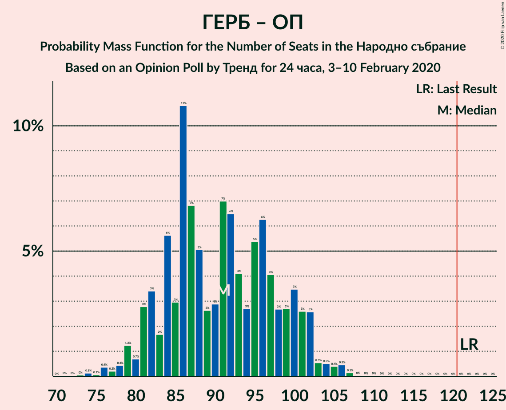

| Number of Seats | Probability | Accumulated | Special Marks |
|:---------------:|:-----------:|:-----------:|:-------------:|
| 72 | 0% | 100% |  |
| 73 | 0% | 99.9% |  |
| 74 | 0.1% | 99.9% |  |
| 75 | 0.1% | 99.8% |  |
| 76 | 0.4% | 99.7% |  |
| 77 | 0.2% | 99.3% |  |
| 78 | 0.4% | 99.1% |  |
| 79 | 1.2% | 98.7% |  |
| 80 | 0.7% | 97% |  |
| 81 | 3% | 97% |  |
| 82 | 3% | 94% |  |
| 83 | 2% | 91% |  |
| 84 | 6% | 89% |  |
| 85 | 3% | 83% |  |
| 86 | 11% | 80% |  |
| 87 | 7% | 70% |  |
| 88 | 5% | 63% |  |
| 89 | 3% | 58% |  |
| 90 | 3% | 55% |  |
| 91 | 7% | 52% |  |
| 92 | 6% | 45% |  |
| 93 | 4% | 39% |  |
| 94 | 3% | 35% |  |
| 95 | 5% | 32% | Median |
| 96 | 6% | 26% |  |
| 97 | 4% | 20% |  |
| 98 | 3% | 16% |  |
| 99 | 3% | 13% |  |
| 100 | 3% | 11% |  |
| 101 | 3% | 7% |  |
| 102 | 3% | 5% |  |
| 103 | 0.5% | 2% |  |
| 104 | 0.5% | 2% |  |
| 105 | 0.4% | 1.1% |  |
| 106 | 0.5% | 0.7% |  |
| 107 | 0.1% | 0.2% |  |
| 108 | 0% | 0.1% |  |
| 109 | 0% | 0.1% |  |
| 110 | 0% | 0% |  |
| 111 | 0% | 0% |  |
| 112 | 0% | 0% |  |
| 113 | 0% | 0% |  |
| 114 | 0% | 0% |  |
| 115 | 0% | 0% |  |
| 116 | 0% | 0% |  |
| 117 | 0% | 0% |  |
| 118 | 0% | 0% |  |
| 119 | 0% | 0% |  |
| 120 | 0% | 0% |  |
| 121 | 0% | 0% | Majority |
| 122 | 0% | 0% | Last Result |

## Technical Information

### Opinion Poll

+ **Polling firm:** Тренд
+ **Commissioner(s):** 24 часа
+ **Fieldwork period:** 3–10 February 2020

### Calculations

+ **Sample size:** 643
+ **Simulations done:** 1,048,576
+ **Error estimate:** 1.36%

