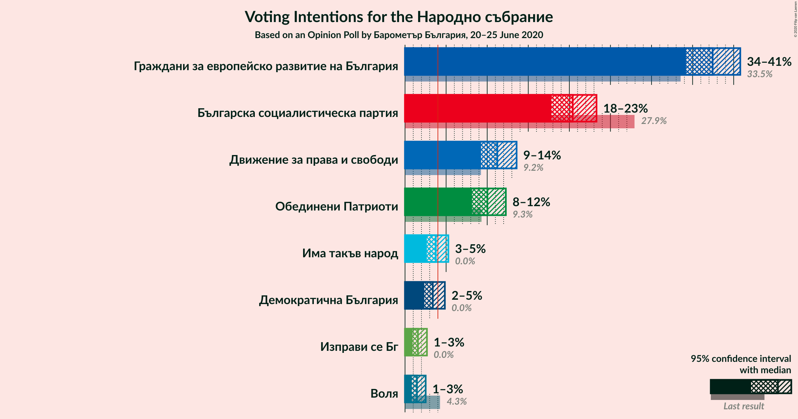
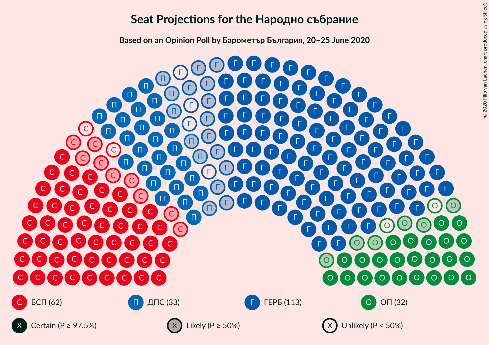
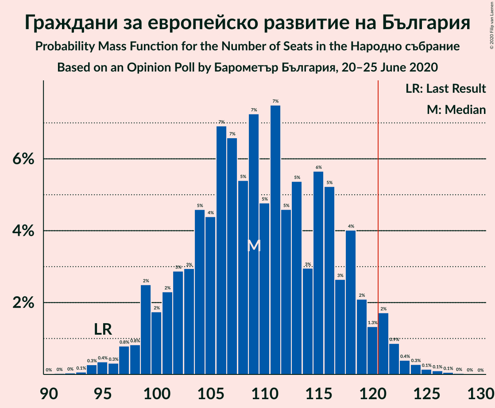
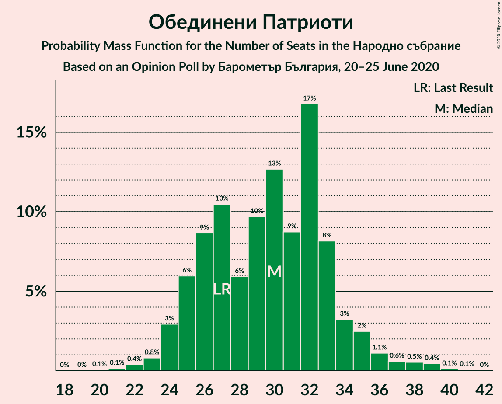
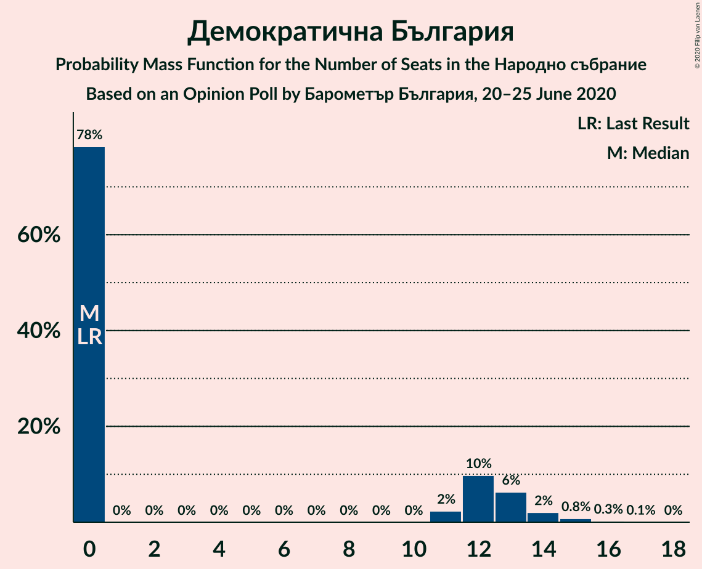
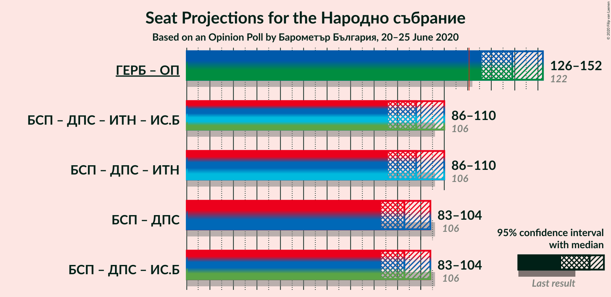
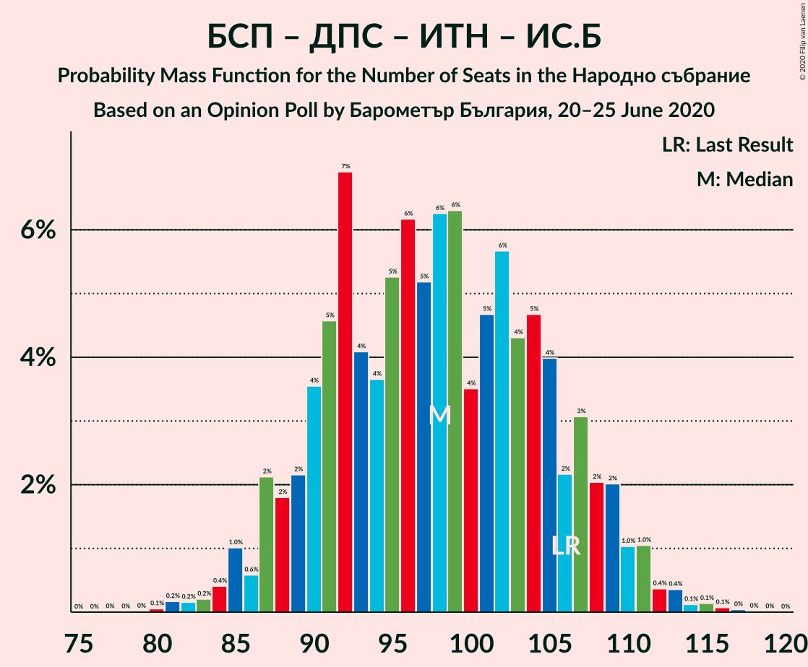
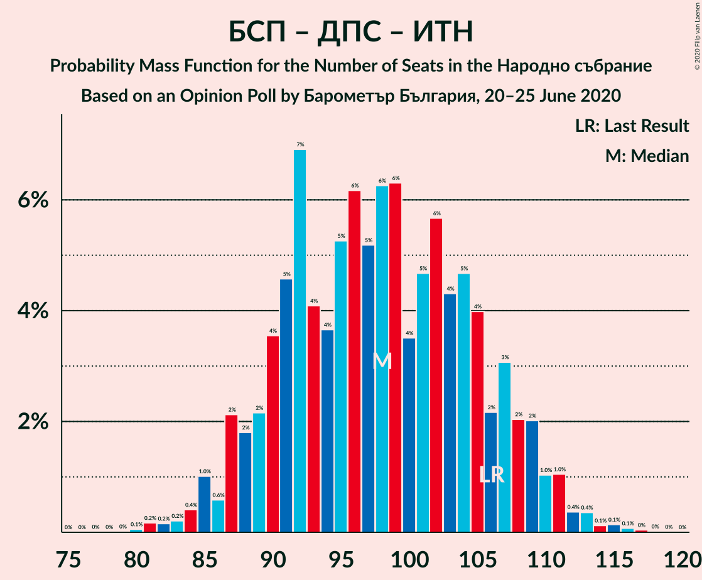
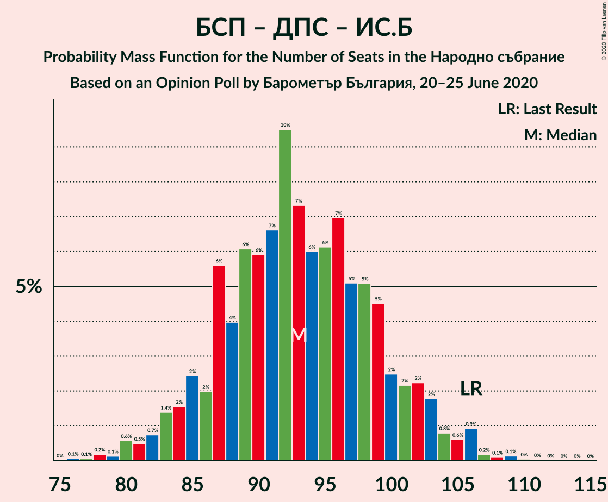

# Opinion Poll by Барометър България, 20–25 June 2020

<a href="#voting-intentions">Voting Intentions</a> | <a href="#seats">Seats</a> | <a href="#coalitions">Coalitions</a> | <a href="#technical-information">Technical Information</a>

## Voting Intentions

### Confidence Intervals

| Party | Last Result | Poll Result | 80% Confidence Interval | 90% Confidence Interval | 95% Confidence Interval | 99% Confidence Interval |
|:-----:|:-----------:|:-----------:|:-----------------------:|:-----------------------:|:-----------------------:|:-----------------------:|
| Граждани за европейско развитие на България | 33.5% | 37.4% | 35.3–39.6% |34.7–40.3% |34.2–40.8% |33.2–41.9% |
| Българска социалистическа партия | 27.9% | 20.4% | 18.7–22.3% |18.2–22.8% |17.8–23.3% |17.0–24.2% |
| Движение за права и свободи | 9.2% | 11.2% | 9.9–12.8% |9.6–13.2% |9.3–13.6% |8.7–14.3% |
| Обединени Патриоти | 9.3% | 10.0% | 8.8–11.5% |8.4–11.9% |8.2–12.3% |7.6–13.0% |
| Има такъв народ | 0.0% | 3.7% | 3.0–4.7% |2.8–5.0% |2.7–5.3% |2.3–5.8% |
| Демократична България | 0.0% | 3.4% | 2.7–4.3% |2.5–4.6% |2.3–4.8% |2.1–5.3% |
| Изправи се Бг | 0.0% | 1.6% | 1.1–2.3% |1.0–2.5% |0.9–2.7% |0.7–3.1% |
| Воля | 4.3% | 1.4% | 1.0–2.1% |0.9–2.3% |0.8–2.5% |0.7–2.9% |

*Note:* The poll result column reflects the actual value used in the calculations. Published results may vary slightly, and in addition be rounded to fewer digits.

## Seats

### Confidence Intervals

| Party | Last Result | Median | 80% Confidence Interval | 90% Confidence Interval | 95% Confidence Interval | 99% Confidence Interval |
|:-----:|:-----------:|:------:|:-----------------------:|:-----------------------:|:-----------------------:|:-----------------------:|
| <a href="#граждани-за-европейско-развитие-на-българия">Граждани за европейско развитие на България</a> | 95 | 109 | 102–118 |99–119 |98–121 |95–124 |
| <a href="#българска-социалистическа-партия">Българска социалистическа партия</a> | 80 | 60 | 55–66 |53–68 |51–69 |49–72 |
| <a href="#движение-за-права-и-свободи">Движение за права и свободи</a> | 26 | 33 | 29–37 |28–39 |27–40 |25–42 |
| <a href="#обединени-патриоти">Обединени Патриоти</a> | 27 | 30 | 25–33 |25–35 |24–36 |22–39 |
| <a href="#има-такъв-народ">Има такъв народ</a> | 0 | 0 | 0–13 |0–14 |0–15 |0–16 |
| <a href="#демократична-българия">Демократична България</a> | 0 | 0 | 0–12 |0–13 |0–14 |0–15 |
| <a href="#изправи-се-бг">Изправи се Бг</a> | 0 | 0 | 0 |0 |0 |0 |
| <a href="#воля">Воля</a> | 12 | 0 | 0 |0 |0 |0 |

### Граждани за европейско развитие на България

*For a full overview of the results for this party, see the [Граждани за европейско развитие на България](party-гражданизаевропейскоразвитиенабългария.html) page.*

| Number of Seats | Probability | Accumulated | Special Marks |
|:---------------:|:-----------:|:-----------:|:-------------:|
| 91 | 0% | 100% |  |
| 92 | 0% | 99.9% |  |
| 93 | 0.1% | 99.9% |  |
| 94 | 0.3% | 99.8% |  |
| 95 | 0.4% | 99.6% | Last Result |
| 96 | 0.3% | 99.2% |  |
| 97 | 0.8% | 98.9% |  |
| 98 | 0.8% | 98% |  |
| 99 | 2% | 97% |  |
| 100 | 2% | 95% |  |
| 101 | 2% | 93% |  |
| 102 | 3% | 91% |  |
| 103 | 3% | 88% |  |
| 104 | 5% | 85% |  |
| 105 | 4% | 80% |  |
| 106 | 7% | 76% |  |
| 107 | 7% | 69% |  |
| 108 | 5% | 62% |  |
| 109 | 7% | 57% | Median |
| 110 | 5% | 50% |  |
| 111 | 7% | 45% |  |
| 112 | 5% | 38% |  |
| 113 | 5% | 33% |  |
| 114 | 3% | 28% |  |
| 115 | 6% | 25% |  |
| 116 | 5% | 19% |  |
| 117 | 3% | 14% |  |
| 118 | 4% | 11% |  |
| 119 | 2% | 7% |  |
| 120 | 1.3% | 5% |  |
| 121 | 2% | 4% | Majority |
| 122 | 0.9% | 2% |  |
| 123 | 0.4% | 1.0% |  |
| 124 | 0.3% | 0.6% |  |
| 125 | 0.1% | 0.4% |  |
| 126 | 0.1% | 0.2% |  |
| 127 | 0.1% | 0.1% |  |
| 128 | 0% | 0.1% |  |
| 129 | 0% | 0% |  |

### Българска социалистическа партия

*For a full overview of the results for this party, see the [Българска социалистическа партия](party-българскасоциалистическапартия.html) page.*

| Number of Seats | Probability | Accumulated | Special Marks |
|:---------------:|:-----------:|:-----------:|:-------------:|
| 46 | 0% | 100% |  |
| 47 | 0.1% | 99.9% |  |
| 48 | 0.2% | 99.9% |  |
| 49 | 0.4% | 99.7% |  |
| 50 | 1.0% | 99.3% |  |
| 51 | 1.0% | 98% |  |
| 52 | 2% | 97% |  |
| 53 | 2% | 95% |  |
| 54 | 3% | 93% |  |
| 55 | 6% | 90% |  |
| 56 | 6% | 84% |  |
| 57 | 7% | 79% |  |
| 58 | 7% | 71% |  |
| 59 | 11% | 64% |  |
| 60 | 8% | 53% | Median |
| 61 | 9% | 46% |  |
| 62 | 12% | 36% |  |
| 63 | 5% | 24% |  |
| 64 | 3% | 19% |  |
| 65 | 5% | 16% |  |
| 66 | 3% | 11% |  |
| 67 | 2% | 8% |  |
| 68 | 2% | 6% |  |
| 69 | 1.3% | 4% |  |
| 70 | 1.3% | 2% |  |
| 71 | 0.3% | 1.2% |  |
| 72 | 0.6% | 0.8% |  |
| 73 | 0.1% | 0.2% |  |
| 74 | 0% | 0.1% |  |
| 75 | 0% | 0.1% |  |
| 76 | 0% | 0% |  |
| 77 | 0% | 0% |  |
| 78 | 0% | 0% |  |
| 79 | 0% | 0% |  |
| 80 | 0% | 0% | Last Result |

### Движение за права и свободи

*For a full overview of the results for this party, see the [Движение за права и свободи](party-движениезаправаисвободи.html) page.*

| Number of Seats | Probability | Accumulated | Special Marks |
|:---------------:|:-----------:|:-----------:|:-------------:|
| 23 | 0.1% | 100% |  |
| 24 | 0.2% | 99.9% |  |
| 25 | 0.4% | 99.7% |  |
| 26 | 1.4% | 99.3% | Last Result |
| 27 | 2% | 98% |  |
| 28 | 4% | 96% |  |
| 29 | 6% | 92% |  |
| 30 | 7% | 86% |  |
| 31 | 10% | 79% |  |
| 32 | 9% | 68% |  |
| 33 | 19% | 60% | Median |
| 34 | 7% | 41% |  |
| 35 | 12% | 33% |  |
| 36 | 4% | 22% |  |
| 37 | 8% | 17% |  |
| 38 | 3% | 9% |  |
| 39 | 3% | 6% |  |
| 40 | 1.4% | 3% |  |
| 41 | 1.3% | 2% |  |
| 42 | 0.3% | 0.7% |  |
| 43 | 0.3% | 0.5% |  |
| 44 | 0.1% | 0.2% |  |
| 45 | 0% | 0.1% |  |
| 46 | 0% | 0% |  |

### Обединени Патриоти

*For a full overview of the results for this party, see the [Обединени Патриоти](party-обединенипатриоти.html) page.*

| Number of Seats | Probability | Accumulated | Special Marks |
|:---------------:|:-----------:|:-----------:|:-------------:|
| 20 | 0.1% | 100% |  |
| 21 | 0.1% | 99.9% |  |
| 22 | 0.4% | 99.8% |  |
| 23 | 0.8% | 99.4% |  |
| 24 | 3% | 98.6% |  |
| 25 | 6% | 96% |  |
| 26 | 9% | 90% |  |
| 27 | 10% | 81% | Last Result |
| 28 | 6% | 71% |  |
| 29 | 10% | 65% |  |
| 30 | 13% | 55% | Median |
| 31 | 9% | 42% |  |
| 32 | 17% | 34% |  |
| 33 | 8% | 17% |  |
| 34 | 3% | 9% |  |
| 35 | 2% | 5% |  |
| 36 | 1.1% | 3% |  |
| 37 | 0.6% | 2% |  |
| 38 | 0.5% | 1.2% |  |
| 39 | 0.4% | 0.7% |  |
| 40 | 0.1% | 0.2% |  |
| 41 | 0.1% | 0.1% |  |
| 42 | 0% | 0% |  |

### Има такъв народ

*For a full overview of the results for this party, see the [Има такъв народ](party-иматакъвнарод.html) page.*

| Number of Seats | Probability | Accumulated | Special Marks |
|:---------------:|:-----------:|:-----------:|:-------------:|
| 0 | 63% | 100% | Last Result, Median |
| 1 | 0% | 37% |  |
| 2 | 0% | 37% |  |
| 3 | 0% | 37% |  |
| 4 | 0% | 37% |  |
| 5 | 0% | 37% |  |
| 6 | 0% | 37% |  |
| 7 | 0% | 37% |  |
| 8 | 0% | 37% |  |
| 9 | 0% | 37% |  |
| 10 | 0% | 37% |  |
| 11 | 3% | 37% |  |
| 12 | 15% | 34% |  |
| 13 | 10% | 20% |  |
| 14 | 6% | 10% |  |
| 15 | 3% | 4% |  |
| 16 | 1.1% | 2% |  |
| 17 | 0.3% | 0.5% |  |
| 18 | 0.1% | 0.1% |  |
| 19 | 0% | 0% |  |

### Демократична България

*For a full overview of the results for this party, see the [Демократична България](party-демократичнабългария.html) page.*

| Number of Seats | Probability | Accumulated | Special Marks |
|:---------------:|:-----------:|:-----------:|:-------------:|
| 0 | 78% | 100% | Last Result, Median |
| 1 | 0% | 22% |  |
| 2 | 0% | 22% |  |
| 3 | 0% | 22% |  |
| 4 | 0% | 22% |  |
| 5 | 0% | 22% |  |
| 6 | 0% | 22% |  |
| 7 | 0% | 22% |  |
| 8 | 0% | 22% |  |
| 9 | 0% | 22% |  |
| 10 | 0% | 22% |  |
| 11 | 2% | 22% |  |
| 12 | 10% | 19% |  |
| 13 | 6% | 9% |  |
| 14 | 2% | 3% |  |
| 15 | 0.8% | 1.1% |  |
| 16 | 0.3% | 0.3% |  |
| 17 | 0.1% | 0.1% |  |
| 18 | 0% | 0% |  |

### Изправи се Бг

*For a full overview of the results for this party, see the [Изправи се Бг](party-изправисебг.html) page.*

| Number of Seats | Probability | Accumulated | Special Marks |
|:---------------:|:-----------:|:-----------:|:-------------:|
| 0 | 100% | 100% | Last Result, Median |

### Воля

*For a full overview of the results for this party, see the [Воля](party-воля.html) page.*

| Number of Seats | Probability | Accumulated | Special Marks |
|:---------------:|:-----------:|:-----------:|:-------------:|
| 0 | 100% | 100% | Median |
| 1 | 0% | 0% |  |
| 2 | 0% | 0% |  |
| 3 | 0% | 0% |  |
| 4 | 0% | 0% |  |
| 5 | 0% | 0% |  |
| 6 | 0% | 0% |  |
| 7 | 0% | 0% |  |
| 8 | 0% | 0% |  |
| 9 | 0% | 0% |  |
| 10 | 0% | 0% |  |
| 11 | 0% | 0% |  |
| 12 | 0% | 0% | Last Result |

## Coalitions

### Confidence Intervals

| Coalition | Last Result | Median | Majority? | 80% Confidence Interval | 90% Confidence Interval | 95% Confidence Interval | 99% Confidence Interval |
|:---------:|:-----------:|:------:|:---------:|:-----------------------:|:-----------------------:|:-----------------------:|:-----------------------:|
| Граждани за европейско развитие на България – Обединени Патриоти | 122 | 139 | 99.9% | 131–148 | 129–150 | 126–152 | 123–155 |
| Българска социалистическа партия – Движение за права и свободи – Има такъв народ – Изправи се Бг | 106 | 98 | 0% | 90–107 | 88–109 | 86–110 | 83–113 |
| Българска социалистическа партия – Движение за права и свободи – Има такъв народ | 106 | 98 | 0% | 90–107 | 88–109 | 86–110 | 83–113 |
| Българска социалистическа партия – Движение за права и свободи | 106 | 93 | 0% | 87–100 | 84–102 | 83–104 | 80–107 |
| Българска социалистическа партия – Движение за права и свободи – Изправи се Бг | 106 | 93 | 0% | 87–100 | 84–102 | 83–104 | 80–107 |

### Граждани за европейско развитие на България – Обединени Патриоти

| Number of Seats | Probability | Accumulated | Special Marks |
|:---------------:|:-----------:|:-----------:|:-------------:|
| 119 | 0% | 100% |  |
| 120 | 0% | 99.9% |  |
| 121 | 0.2% | 99.9% | Majority |
| 122 | 0.2% | 99.7% | Last Result |
| 123 | 0.5% | 99.5% |  |
| 124 | 0.6% | 99.0% |  |
| 125 | 0.6% | 98% |  |
| 126 | 0.6% | 98% |  |
| 127 | 0.6% | 97% |  |
| 128 | 1.1% | 97% |  |
| 129 | 3% | 95% |  |
| 130 | 2% | 92% |  |
| 131 | 3% | 91% |  |
| 132 | 4% | 87% |  |
| 133 | 5% | 84% |  |
| 134 | 3% | 79% |  |
| 135 | 4% | 76% |  |
| 136 | 6% | 72% |  |
| 137 | 6% | 66% |  |
| 138 | 6% | 60% |  |
| 139 | 6% | 54% | Median |
| 140 | 4% | 49% |  |
| 141 | 5% | 44% |  |
| 142 | 6% | 39% |  |
| 143 | 5% | 34% |  |
| 144 | 5% | 29% |  |
| 145 | 4% | 24% |  |
| 146 | 3% | 20% |  |
| 147 | 4% | 17% |  |
| 148 | 5% | 14% |  |
| 149 | 4% | 9% |  |
| 150 | 2% | 5% |  |
| 151 | 0.6% | 3% |  |
| 152 | 1.3% | 3% |  |
| 153 | 0.6% | 1.3% |  |
| 154 | 0.1% | 0.7% |  |
| 155 | 0.3% | 0.5% |  |
| 156 | 0.1% | 0.3% |  |
| 157 | 0.1% | 0.2% |  |
| 158 | 0.1% | 0.1% |  |
| 159 | 0% | 0% |  |

### Българска социалистическа партия – Движение за права и свободи – Има такъв народ – Изправи се Бг

| Number of Seats | Probability | Accumulated | Special Marks |
|:---------------:|:-----------:|:-----------:|:-------------:|
| 80 | 0.1% | 100% |  |
| 81 | 0.2% | 99.9% |  |
| 82 | 0.2% | 99.7% |  |
| 83 | 0.2% | 99.6% |  |
| 84 | 0.4% | 99.4% |  |
| 85 | 1.0% | 99.0% |  |
| 86 | 0.6% | 98% |  |
| 87 | 2% | 97% |  |
| 88 | 2% | 95% |  |
| 89 | 2% | 93% |  |
| 90 | 4% | 91% |  |
| 91 | 5% | 88% |  |
| 92 | 7% | 83% |  |
| 93 | 4% | 76% | Median |
| 94 | 4% | 72% |  |
| 95 | 5% | 69% |  |
| 96 | 6% | 63% |  |
| 97 | 5% | 57% |  |
| 98 | 6% | 52% |  |
| 99 | 6% | 46% |  |
| 100 | 4% | 39% |  |
| 101 | 5% | 36% |  |
| 102 | 6% | 31% |  |
| 103 | 4% | 25% |  |
| 104 | 5% | 21% |  |
| 105 | 4% | 16% |  |
| 106 | 2% | 13% | Last Result |
| 107 | 3% | 10% |  |
| 108 | 2% | 7% |  |
| 109 | 2% | 5% |  |
| 110 | 1.0% | 3% |  |
| 111 | 1.0% | 2% |  |
| 112 | 0.4% | 1.1% |  |
| 113 | 0.4% | 0.8% |  |
| 114 | 0.1% | 0.4% |  |
| 115 | 0.1% | 0.3% |  |
| 116 | 0.1% | 0.1% |  |
| 117 | 0% | 0.1% |  |
| 118 | 0% | 0% |  |

### Българска социалистическа партия – Движение за права и свободи – Има такъв народ

| Number of Seats | Probability | Accumulated | Special Marks |
|:---------------:|:-----------:|:-----------:|:-------------:|
| 80 | 0.1% | 100% |  |
| 81 | 0.2% | 99.9% |  |
| 82 | 0.2% | 99.7% |  |
| 83 | 0.2% | 99.6% |  |
| 84 | 0.4% | 99.4% |  |
| 85 | 1.0% | 99.0% |  |
| 86 | 0.6% | 98% |  |
| 87 | 2% | 97% |  |
| 88 | 2% | 95% |  |
| 89 | 2% | 93% |  |
| 90 | 4% | 91% |  |
| 91 | 5% | 88% |  |
| 92 | 7% | 83% |  |
| 93 | 4% | 76% | Median |
| 94 | 4% | 72% |  |
| 95 | 5% | 69% |  |
| 96 | 6% | 63% |  |
| 97 | 5% | 57% |  |
| 98 | 6% | 52% |  |
| 99 | 6% | 46% |  |
| 100 | 4% | 39% |  |
| 101 | 5% | 36% |  |
| 102 | 6% | 31% |  |
| 103 | 4% | 25% |  |
| 104 | 5% | 21% |  |
| 105 | 4% | 16% |  |
| 106 | 2% | 13% | Last Result |
| 107 | 3% | 10% |  |
| 108 | 2% | 7% |  |
| 109 | 2% | 5% |  |
| 110 | 1.0% | 3% |  |
| 111 | 1.0% | 2% |  |
| 112 | 0.4% | 1.1% |  |
| 113 | 0.4% | 0.8% |  |
| 114 | 0.1% | 0.4% |  |
| 115 | 0.1% | 0.3% |  |
| 116 | 0.1% | 0.1% |  |
| 117 | 0% | 0.1% |  |
| 118 | 0% | 0% |  |

### Българска социалистическа партия – Движение за права и свободи

| Number of Seats | Probability | Accumulated | Special Marks |
|:---------------:|:-----------:|:-----------:|:-------------:|
| 76 | 0.1% | 100% |  |
| 77 | 0.1% | 99.9% |  |
| 78 | 0.2% | 99.8% |  |
| 79 | 0.1% | 99.7% |  |
| 80 | 0.6% | 99.5% |  |
| 81 | 0.5% | 98.9% |  |
| 82 | 0.7% | 98% |  |
| 83 | 1.4% | 98% |  |
| 84 | 2% | 96% |  |
| 85 | 2% | 95% |  |
| 86 | 2% | 92% |  |
| 87 | 6% | 90% |  |
| 88 | 4% | 85% |  |
| 89 | 6% | 81% |  |
| 90 | 6% | 75% |  |
| 91 | 7% | 69% |  |
| 92 | 10% | 62% |  |
| 93 | 7% | 53% | Median |
| 94 | 6% | 45% |  |
| 95 | 6% | 39% |  |
| 96 | 7% | 33% |  |
| 97 | 5% | 26% |  |
| 98 | 5% | 21% |  |
| 99 | 5% | 16% |  |
| 100 | 2% | 12% |  |
| 101 | 2% | 9% |  |
| 102 | 2% | 7% |  |
| 103 | 2% | 5% |  |
| 104 | 0.8% | 3% |  |
| 105 | 0.6% | 2% |  |
| 106 | 0.9% | 1.4% | Last Result |
| 107 | 0.2% | 0.5% |  |
| 108 | 0.1% | 0.3% |  |
| 109 | 0.1% | 0.2% |  |
| 110 | 0% | 0.1% |  |
| 111 | 0% | 0% |  |

### Българска социалистическа партия – Движение за права и свободи – Изправи се Бг

| Number of Seats | Probability | Accumulated | Special Marks |
|:---------------:|:-----------:|:-----------:|:-------------:|
| 76 | 0.1% | 100% |  |
| 77 | 0.1% | 99.9% |  |
| 78 | 0.2% | 99.8% |  |
| 79 | 0.1% | 99.7% |  |
| 80 | 0.6% | 99.5% |  |
| 81 | 0.5% | 98.9% |  |
| 82 | 0.7% | 98% |  |
| 83 | 1.4% | 98% |  |
| 84 | 2% | 96% |  |
| 85 | 2% | 95% |  |
| 86 | 2% | 92% |  |
| 87 | 6% | 90% |  |
| 88 | 4% | 85% |  |
| 89 | 6% | 81% |  |
| 90 | 6% | 75% |  |
| 91 | 7% | 69% |  |
| 92 | 10% | 62% |  |
| 93 | 7% | 53% | Median |
| 94 | 6% | 45% |  |
| 95 | 6% | 39% |  |
| 96 | 7% | 33% |  |
| 97 | 5% | 26% |  |
| 98 | 5% | 21% |  |
| 99 | 5% | 16% |  |
| 100 | 2% | 12% |  |
| 101 | 2% | 9% |  |
| 102 | 2% | 7% |  |
| 103 | 2% | 5% |  |
| 104 | 0.8% | 3% |  |
| 105 | 0.6% | 2% |  |
| 106 | 0.9% | 1.4% | Last Result |
| 107 | 0.2% | 0.5% |  |
| 108 | 0.1% | 0.3% |  |
| 109 | 0.1% | 0.2% |  |
| 110 | 0% | 0.1% |  |
| 111 | 0% | 0% |  |

## Technical Information

### Opinion Poll

+ **Polling firm:** Барометър България
+ **Commissioner(s):** —
+ **Fieldwork period:** 20–25 June 2020

### Calculations

+ **Sample size:** 828
+ **Simulations done:** 1,048,576
+ **Error estimate:** 2.45%

