# Opinion Poll by Алфа рисърч for Дневник, 23–30 July 2020

<a href="#voting-intentions">Voting Intentions</a> | <a href="#seats">Seats</a> | <a href="#coalitions">Coalitions</a> | <a href="#technical-information">Technical Information</a>

## Voting Intentions

### Confidence Intervals

| Party | Last Result | Poll Result | 80% Confidence Interval | 90% Confidence Interval | 95% Confidence Interval | 99% Confidence Interval |
|:-----:|:-----------:|:-----------:|:-----------------------:|:-----------------------:|:-----------------------:|:-----------------------:|
| Граждани за европейско развитие на България | 33.5% | 26.6% | 24.3–29.1% |23.7–29.9% |23.1–30.5% |22.0–31.7% |
| Българска социалистическа партия | 27.9% | 19.2% | 17.2–21.5% |16.6–22.1% |16.1–22.7% |15.2–23.8% |
| Има такъв народ | 0.0% | 18.8% | 16.8–21.1% |16.3–21.8% |15.8–22.3% |14.9–23.4% |
| Демократична България | 0.0% | 12.3% | 10.7–14.3% |10.2–14.8% |9.8–15.3% |9.1–16.3% |
| Движение за права и свободи | 9.2% | 8.3% | 7.0–10.0% |6.6–10.5% |6.3–10.9% |5.7–11.8% |
| Изправи се Бг | 0.0% | 6.0% | 4.9–7.5% |4.5–7.9% |4.3–8.3% |3.8–9.1% |
| Обединени Патриоти | 9.3% | 4.2% | 3.3–5.5% |3.0–5.9% |2.8–6.2% |2.4–6.9% |
| Воля | 4.3% | 0.9% | 0.6–1.7% |0.5–1.9% |0.4–2.1% |0.3–2.5% |
| Възраждане | 0.0% | 0.5% | 0.3–1.2% |0.2–1.4% |0.2–1.6% |0.1–2.0% |

*Note:* The poll result column reflects the actual value used in the calculations. Published results may vary slightly, and in addition be rounded to fewer digits.

## Seats

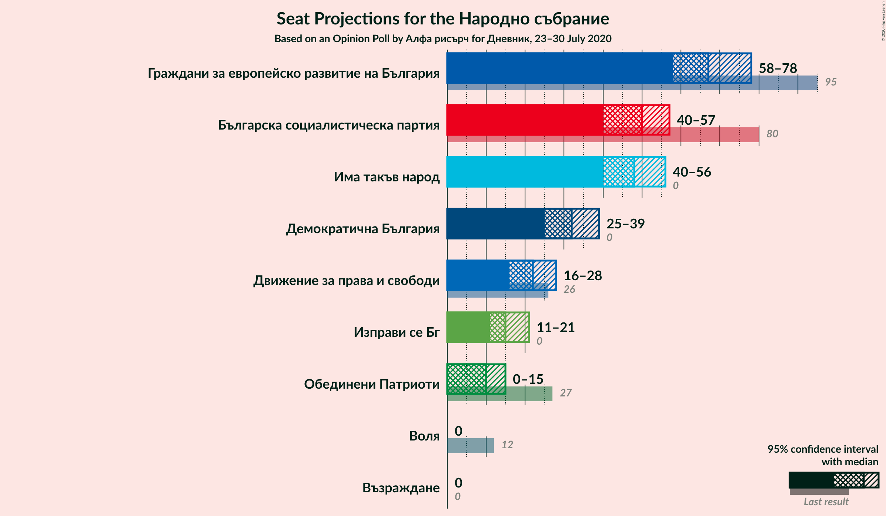

### Confidence Intervals

| Party | Last Result | Median | 80% Confidence Interval | 90% Confidence Interval | 95% Confidence Interval | 99% Confidence Interval |
|:-----:|:-----------:|:------:|:-----------------------:|:-----------------------:|:-----------------------:|:-----------------------:|
| <a href="#граждани-за-европейско-развитие-на-българия">Граждани за европейско развитие на България</a> | 95 | 67 | 61–74 |59–77 |58–78 |56–80 |
| <a href="#българска-социалистическа-партия">Българска социалистическа партия</a> | 80 | 50 | 43–55 |42–56 |40–57 |38–61 |
| <a href="#има-такъв-народ">Има такъв народ</a> | 0 | 48 | 43–54 |41–56 |40–56 |38–60 |
| <a href="#демократична-българия">Демократична България</a> | 0 | 32 | 27–36 |26–38 |25–39 |23–42 |
| <a href="#движение-за-права-и-свободи">Движение за права и свободи</a> | 26 | 22 | 18–25 |17–27 |16–28 |14–30 |
| <a href="#изправи-се-бг">Изправи се Бг</a> | 0 | 15 | 12–19 |11–20 |11–21 |0–23 |
| <a href="#обединени-патриоти">Обединени Патриоти</a> | 27 | 10 | 0–13 |0–14 |0–15 |0–17 |
| <a href="#воля">Воля</a> | 12 | 0 | 0 |0 |0 |0 |
| <a href="#възраждане">Възраждане</a> | 0 | 0 | 0 |0 |0 |0 |

### Граждани за европейско развитие на България

*For a full overview of the results for this party, see the [Граждани за европейско развитие на България](party-гражданизаевропейскоразвитиенабългария.html) page.*

| Number of Seats | Probability | Accumulated | Special Marks |
|:---------------:|:-----------:|:-----------:|:-------------:|
| 52 | 0% | 100% |  |
| 53 | 0.1% | 99.9% |  |
| 54 | 0.1% | 99.9% |  |
| 55 | 0.2% | 99.8% |  |
| 56 | 0.4% | 99.6% |  |
| 57 | 1.2% | 99.2% |  |
| 58 | 2% | 98% |  |
| 59 | 3% | 96% |  |
| 60 | 2% | 93% |  |
| 61 | 2% | 91% |  |
| 62 | 2% | 89% |  |
| 63 | 2% | 87% |  |
| 64 | 3% | 85% |  |
| 65 | 6% | 82% |  |
| 66 | 15% | 76% |  |
| 67 | 20% | 61% | Median |
| 68 | 12% | 41% |  |
| 69 | 4% | 30% |  |
| 70 | 6% | 26% |  |
| 71 | 4% | 20% |  |
| 72 | 2% | 16% |  |
| 73 | 3% | 14% |  |
| 74 | 2% | 11% |  |
| 75 | 2% | 9% |  |
| 76 | 2% | 7% |  |
| 77 | 2% | 6% |  |
| 78 | 2% | 4% |  |
| 79 | 0.6% | 2% |  |
| 80 | 0.9% | 1.2% |  |
| 81 | 0.1% | 0.3% |  |
| 82 | 0% | 0.2% |  |
| 83 | 0% | 0.1% |  |
| 84 | 0% | 0.1% |  |
| 85 | 0% | 0.1% |  |
| 86 | 0% | 0% |  |
| 87 | 0% | 0% |  |
| 88 | 0% | 0% |  |
| 89 | 0% | 0% |  |
| 90 | 0% | 0% |  |
| 91 | 0% | 0% |  |
| 92 | 0% | 0% |  |
| 93 | 0% | 0% |  |
| 94 | 0% | 0% |  |
| 95 | 0% | 0% | Last Result |

### Българска социалистическа партия

*For a full overview of the results for this party, see the [Българска социалистическа партия](party-българскасоциалистическапартия.html) page.*

| Number of Seats | Probability | Accumulated | Special Marks |
|:---------------:|:-----------:|:-----------:|:-------------:|
| 35 | 0% | 100% |  |
| 36 | 0.1% | 99.9% |  |
| 37 | 0.2% | 99.9% |  |
| 38 | 0.3% | 99.7% |  |
| 39 | 0.6% | 99.5% |  |
| 40 | 2% | 98.8% |  |
| 41 | 1.4% | 97% |  |
| 42 | 4% | 96% |  |
| 43 | 3% | 92% |  |
| 44 | 3% | 88% |  |
| 45 | 6% | 86% |  |
| 46 | 6% | 80% |  |
| 47 | 10% | 73% |  |
| 48 | 6% | 63% |  |
| 49 | 7% | 57% |  |
| 50 | 7% | 50% | Median |
| 51 | 7% | 43% |  |
| 52 | 4% | 36% |  |
| 53 | 10% | 32% |  |
| 54 | 9% | 22% |  |
| 55 | 7% | 13% |  |
| 56 | 2% | 6% |  |
| 57 | 0.8% | 3% |  |
| 58 | 1.4% | 2% |  |
| 59 | 0.4% | 1.0% |  |
| 60 | 0.2% | 0.7% |  |
| 61 | 0.2% | 0.5% |  |
| 62 | 0.1% | 0.3% |  |
| 63 | 0.1% | 0.2% |  |
| 64 | 0.1% | 0.1% |  |
| 65 | 0% | 0% |  |
| 66 | 0% | 0% |  |
| 67 | 0% | 0% |  |
| 68 | 0% | 0% |  |
| 69 | 0% | 0% |  |
| 70 | 0% | 0% |  |
| 71 | 0% | 0% |  |
| 72 | 0% | 0% |  |
| 73 | 0% | 0% |  |
| 74 | 0% | 0% |  |
| 75 | 0% | 0% |  |
| 76 | 0% | 0% |  |
| 77 | 0% | 0% |  |
| 78 | 0% | 0% |  |
| 79 | 0% | 0% |  |
| 80 | 0% | 0% | Last Result |

### Има такъв народ

*For a full overview of the results for this party, see the [Има такъв народ](party-иматакъвнарод.html) page.*

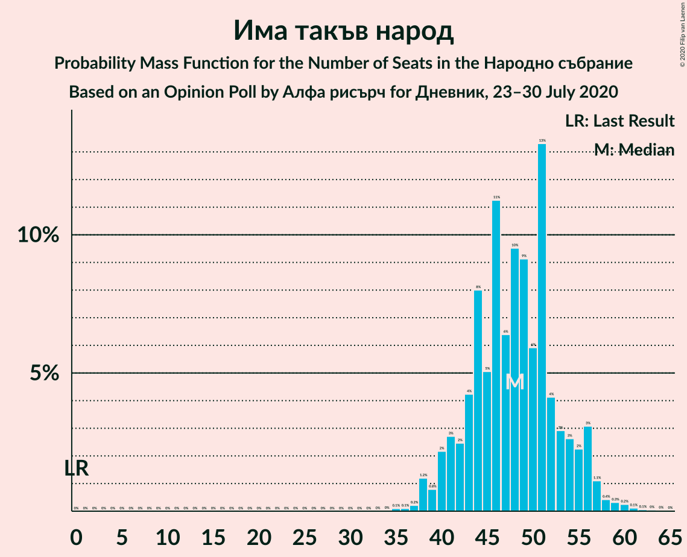

| Number of Seats | Probability | Accumulated | Special Marks |
|:---------------:|:-----------:|:-----------:|:-------------:|
| 0 | 0% | 100% | Last Result |
| 1 | 0% | 100% |  |
| 2 | 0% | 100% |  |
| 3 | 0% | 100% |  |
| 4 | 0% | 100% |  |
| 5 | 0% | 100% |  |
| 6 | 0% | 100% |  |
| 7 | 0% | 100% |  |
| 8 | 0% | 100% |  |
| 9 | 0% | 100% |  |
| 10 | 0% | 100% |  |
| 11 | 0% | 100% |  |
| 12 | 0% | 100% |  |
| 13 | 0% | 100% |  |
| 14 | 0% | 100% |  |
| 15 | 0% | 100% |  |
| 16 | 0% | 100% |  |
| 17 | 0% | 100% |  |
| 18 | 0% | 100% |  |
| 19 | 0% | 100% |  |
| 20 | 0% | 100% |  |
| 21 | 0% | 100% |  |
| 22 | 0% | 100% |  |
| 23 | 0% | 100% |  |
| 24 | 0% | 100% |  |
| 25 | 0% | 100% |  |
| 26 | 0% | 100% |  |
| 27 | 0% | 100% |  |
| 28 | 0% | 100% |  |
| 29 | 0% | 100% |  |
| 30 | 0% | 100% |  |
| 31 | 0% | 100% |  |
| 32 | 0% | 100% |  |
| 33 | 0% | 100% |  |
| 34 | 0% | 100% |  |
| 35 | 0.1% | 100% |  |
| 36 | 0.1% | 99.9% |  |
| 37 | 0.2% | 99.8% |  |
| 38 | 1.2% | 99.6% |  |
| 39 | 0.8% | 98% |  |
| 40 | 2% | 98% |  |
| 41 | 3% | 95% |  |
| 42 | 2% | 93% |  |
| 43 | 4% | 90% |  |
| 44 | 8% | 86% |  |
| 45 | 5% | 78% |  |
| 46 | 11% | 73% |  |
| 47 | 6% | 62% |  |
| 48 | 10% | 55% | Median |
| 49 | 9% | 46% |  |
| 50 | 6% | 37% |  |
| 51 | 13% | 31% |  |
| 52 | 4% | 17% |  |
| 53 | 3% | 13% |  |
| 54 | 3% | 10% |  |
| 55 | 2% | 8% |  |
| 56 | 3% | 5% |  |
| 57 | 1.1% | 2% |  |
| 58 | 0.4% | 1.3% |  |
| 59 | 0.3% | 0.8% |  |
| 60 | 0.2% | 0.5% |  |
| 61 | 0.1% | 0.3% |  |
| 62 | 0.1% | 0.2% |  |
| 63 | 0% | 0.1% |  |
| 64 | 0% | 0.1% |  |
| 65 | 0% | 0% |  |

### Демократична България

*For a full overview of the results for this party, see the [Демократична България](party-демократичнабългария.html) page.*

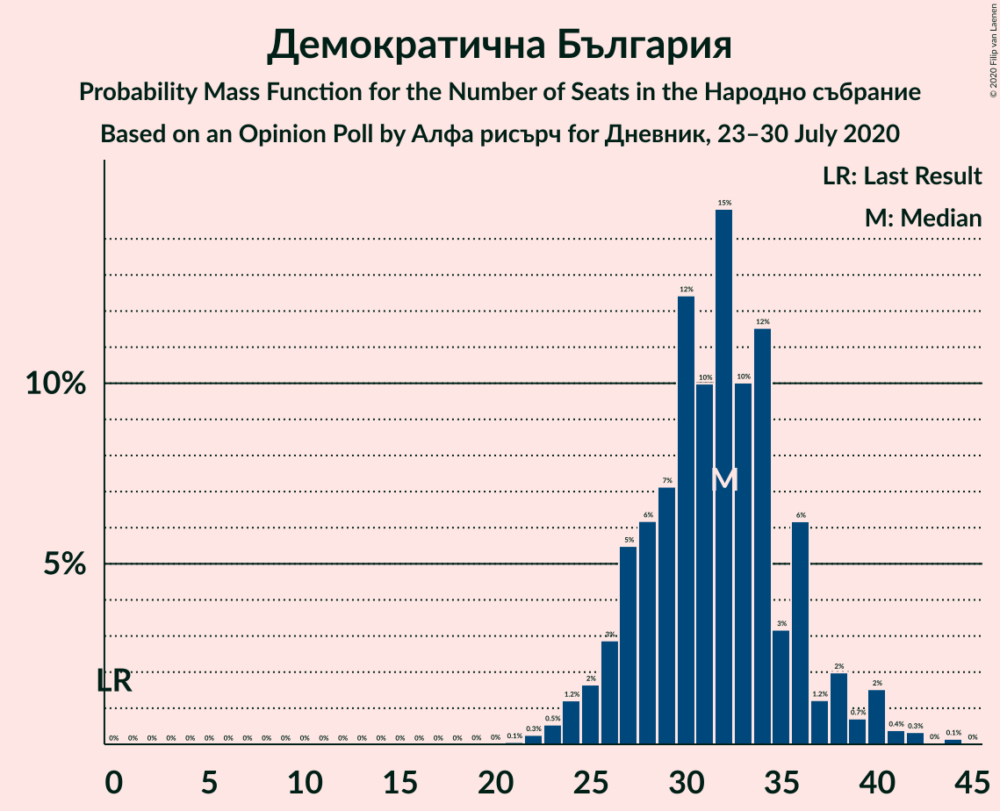

| Number of Seats | Probability | Accumulated | Special Marks |
|:---------------:|:-----------:|:-----------:|:-------------:|
| 0 | 0% | 100% | Last Result |
| 1 | 0% | 100% |  |
| 2 | 0% | 100% |  |
| 3 | 0% | 100% |  |
| 4 | 0% | 100% |  |
| 5 | 0% | 100% |  |
| 6 | 0% | 100% |  |
| 7 | 0% | 100% |  |
| 8 | 0% | 100% |  |
| 9 | 0% | 100% |  |
| 10 | 0% | 100% |  |
| 11 | 0% | 100% |  |
| 12 | 0% | 100% |  |
| 13 | 0% | 100% |  |
| 14 | 0% | 100% |  |
| 15 | 0% | 100% |  |
| 16 | 0% | 100% |  |
| 17 | 0% | 100% |  |
| 18 | 0% | 100% |  |
| 19 | 0% | 100% |  |
| 20 | 0% | 100% |  |
| 21 | 0.1% | 100% |  |
| 22 | 0.3% | 99.9% |  |
| 23 | 0.5% | 99.7% |  |
| 24 | 1.2% | 99.1% |  |
| 25 | 2% | 98% |  |
| 26 | 3% | 96% |  |
| 27 | 5% | 93% |  |
| 28 | 6% | 88% |  |
| 29 | 7% | 82% |  |
| 30 | 12% | 75% |  |
| 31 | 10% | 62% |  |
| 32 | 15% | 52% | Median |
| 33 | 10% | 37% |  |
| 34 | 12% | 27% |  |
| 35 | 3% | 16% |  |
| 36 | 6% | 13% |  |
| 37 | 1.2% | 6% |  |
| 38 | 2% | 5% |  |
| 39 | 0.7% | 3% |  |
| 40 | 2% | 2% |  |
| 41 | 0.4% | 1.0% |  |
| 42 | 0.3% | 0.6% |  |
| 43 | 0% | 0.2% |  |
| 44 | 0.1% | 0.2% |  |
| 45 | 0% | 0% |  |

### Движение за права и свободи

*For a full overview of the results for this party, see the [Движение за права и свободи](party-движениезаправаисвободи.html) page.*

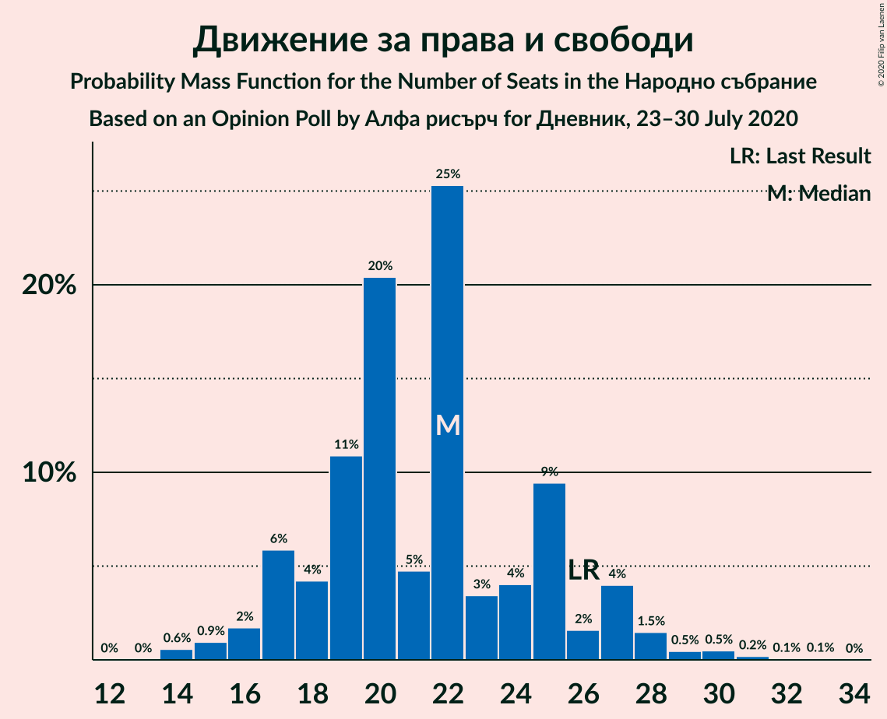

| Number of Seats | Probability | Accumulated | Special Marks |
|:---------------:|:-----------:|:-----------:|:-------------:|
| 13 | 0% | 100% |  |
| 14 | 0.6% | 99.9% |  |
| 15 | 0.9% | 99.4% |  |
| 16 | 2% | 98% |  |
| 17 | 6% | 97% |  |
| 18 | 4% | 91% |  |
| 19 | 11% | 87% |  |
| 20 | 20% | 76% |  |
| 21 | 5% | 55% |  |
| 22 | 25% | 51% | Median |
| 23 | 3% | 25% |  |
| 24 | 4% | 22% |  |
| 25 | 9% | 18% |  |
| 26 | 2% | 8% | Last Result |
| 27 | 4% | 7% |  |
| 28 | 1.5% | 3% |  |
| 29 | 0.5% | 1.3% |  |
| 30 | 0.5% | 0.8% |  |
| 31 | 0.2% | 0.3% |  |
| 32 | 0.1% | 0.1% |  |
| 33 | 0.1% | 0.1% |  |
| 34 | 0% | 0% |  |

### Изправи се Бг

*For a full overview of the results for this party, see the [Изправи се Бг](party-изправисебг.html) page.*

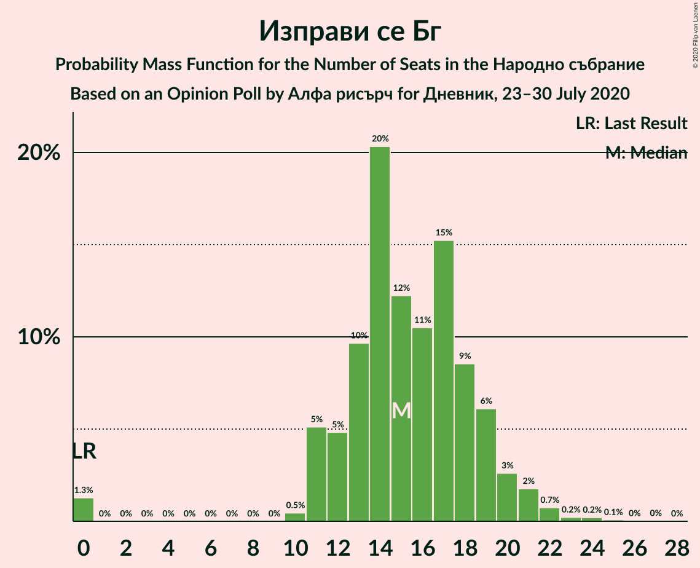

| Number of Seats | Probability | Accumulated | Special Marks |
|:---------------:|:-----------:|:-----------:|:-------------:|
| 0 | 1.3% | 100% | Last Result |
| 1 | 0% | 98.7% |  |
| 2 | 0% | 98.7% |  |
| 3 | 0% | 98.7% |  |
| 4 | 0% | 98.7% |  |
| 5 | 0% | 98.7% |  |
| 6 | 0% | 98.7% |  |
| 7 | 0% | 98.7% |  |
| 8 | 0% | 98.7% |  |
| 9 | 0% | 98.7% |  |
| 10 | 0.5% | 98.7% |  |
| 11 | 5% | 98% |  |
| 12 | 5% | 93% |  |
| 13 | 10% | 88% |  |
| 14 | 20% | 79% |  |
| 15 | 12% | 58% | Median |
| 16 | 11% | 46% |  |
| 17 | 15% | 36% |  |
| 18 | 9% | 20% |  |
| 19 | 6% | 12% |  |
| 20 | 3% | 6% |  |
| 21 | 2% | 3% |  |
| 22 | 0.7% | 1.3% |  |
| 23 | 0.2% | 0.6% |  |
| 24 | 0.2% | 0.3% |  |
| 25 | 0.1% | 0.1% |  |
| 26 | 0% | 0.1% |  |
| 27 | 0% | 0% |  |

### Обединени Патриоти

*For a full overview of the results for this party, see the [Обединени Патриоти](party-обединенипатриоти.html) page.*

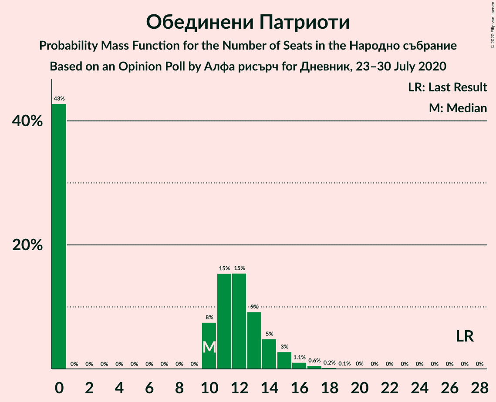

| Number of Seats | Probability | Accumulated | Special Marks |
|:---------------:|:-----------:|:-----------:|:-------------:|
| 0 | 43% | 100% |  |
| 1 | 0% | 57% |  |
| 2 | 0% | 57% |  |
| 3 | 0% | 57% |  |
| 4 | 0% | 57% |  |
| 5 | 0% | 57% |  |
| 6 | 0% | 57% |  |
| 7 | 0% | 57% |  |
| 8 | 0% | 57% |  |
| 9 | 0% | 57% |  |
| 10 | 8% | 57% | Median |
| 11 | 15% | 50% |  |
| 12 | 15% | 34% |  |
| 13 | 9% | 19% |  |
| 14 | 5% | 10% |  |
| 15 | 3% | 5% |  |
| 16 | 1.1% | 2% |  |
| 17 | 0.6% | 0.9% |  |
| 18 | 0.2% | 0.3% |  |
| 19 | 0.1% | 0.1% |  |
| 20 | 0% | 0.1% |  |
| 21 | 0% | 0% |  |
| 22 | 0% | 0% |  |
| 23 | 0% | 0% |  |
| 24 | 0% | 0% |  |
| 25 | 0% | 0% |  |
| 26 | 0% | 0% |  |
| 27 | 0% | 0% | Last Result |

### Воля

*For a full overview of the results for this party, see the [Воля](party-воля.html) page.*

| Number of Seats | Probability | Accumulated | Special Marks |
|:---------------:|:-----------:|:-----------:|:-------------:|
| 0 | 100% | 100% | Median |
| 1 | 0% | 0% |  |
| 2 | 0% | 0% |  |
| 3 | 0% | 0% |  |
| 4 | 0% | 0% |  |
| 5 | 0% | 0% |  |
| 6 | 0% | 0% |  |
| 7 | 0% | 0% |  |
| 8 | 0% | 0% |  |
| 9 | 0% | 0% |  |
| 10 | 0% | 0% |  |
| 11 | 0% | 0% |  |
| 12 | 0% | 0% | Last Result |

### Възраждане

*For a full overview of the results for this party, see the [Възраждане](party-възраждане.html) page.*

| Number of Seats | Probability | Accumulated | Special Marks |
|:---------------:|:-----------:|:-----------:|:-------------:|
| 0 | 100% | 100% | Last Result, Median |

## Coalitions

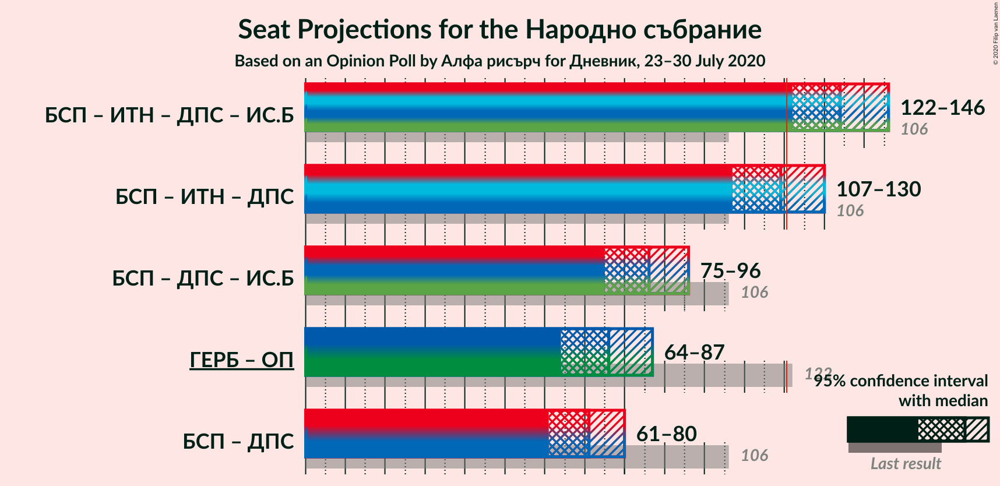

### Confidence Intervals

| Coalition | Last Result | Median | Majority? | 80% Confidence Interval | 90% Confidence Interval | 95% Confidence Interval | 99% Confidence Interval |
|:---------:|:-----------:|:------:|:---------:|:-----------------------:|:-----------------------:|:-----------------------:|:-----------------------:|
| Българска социалистическа партия – Има такъв народ – Движение за права и свободи – Изправи се Бг | 106 | 134 | 98% | 126–142 | 124–143 | 122–146 | 118–149 |
| Българска социалистическа партия – Има такъв народ – Движение за права и свободи | 106 | 119 | 40% | 110–127 | 109–128 | 107–130 | 103–135 |
| Българска социалистическа партия – Движение за права и свободи – Изправи се Бг | 106 | 86 | 0% | 79–94 | 76–94 | 75–96 | 71–100 |
| Граждани за европейско развитие на България – Обединени Патриоти | 122 | 76 | 0% | 67–82 | 65–84 | 64–87 | 59–90 |
| Българска социалистическа партия – Движение за права и свободи | 106 | 71 | 0% | 64–77 | 62–78 | 61–80 | 58–84 |

### Българска социалистическа партия – Има такъв народ – Движение за права и свободи – Изправи се Бг

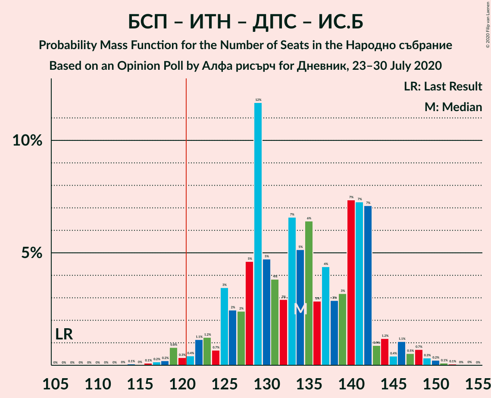

| Number of Seats | Probability | Accumulated | Special Marks |
|:---------------:|:-----------:|:-----------:|:-------------:|
| 106 | 0% | 100% | Last Result |
| 107 | 0% | 100% |  |
| 108 | 0% | 100% |  |
| 109 | 0% | 100% |  |
| 110 | 0% | 100% |  |
| 111 | 0% | 100% |  |
| 112 | 0% | 100% |  |
| 113 | 0% | 100% |  |
| 114 | 0.1% | 100% |  |
| 115 | 0% | 99.9% |  |
| 116 | 0.1% | 99.9% |  |
| 117 | 0.2% | 99.8% |  |
| 118 | 0.2% | 99.6% |  |
| 119 | 0.8% | 99.4% |  |
| 120 | 0.3% | 98.6% |  |
| 121 | 0.4% | 98% | Majority |
| 122 | 1.1% | 98% |  |
| 123 | 1.2% | 97% |  |
| 124 | 0.7% | 95% |  |
| 125 | 3% | 95% |  |
| 126 | 2% | 91% |  |
| 127 | 2% | 89% |  |
| 128 | 5% | 86% |  |
| 129 | 12% | 82% |  |
| 130 | 5% | 70% |  |
| 131 | 4% | 65% |  |
| 132 | 3% | 62% |  |
| 133 | 7% | 59% |  |
| 134 | 5% | 52% |  |
| 135 | 6% | 47% | Median |
| 136 | 3% | 41% |  |
| 137 | 4% | 38% |  |
| 138 | 3% | 33% |  |
| 139 | 3% | 30% |  |
| 140 | 7% | 27% |  |
| 141 | 7% | 20% |  |
| 142 | 7% | 13% |  |
| 143 | 0.9% | 6% |  |
| 144 | 1.2% | 5% |  |
| 145 | 0.4% | 3% |  |
| 146 | 1.1% | 3% |  |
| 147 | 0.5% | 2% |  |
| 148 | 0.7% | 1.5% |  |
| 149 | 0.3% | 0.8% |  |
| 150 | 0.2% | 0.4% |  |
| 151 | 0.1% | 0.2% |  |
| 152 | 0.1% | 0.1% |  |
| 153 | 0% | 0.1% |  |
| 154 | 0% | 0% |  |

### Българска социалистическа партия – Има такъв народ – Движение за права и свободи

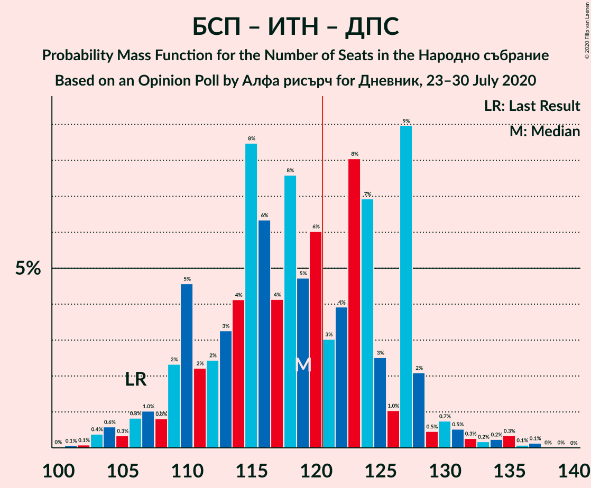

| Number of Seats | Probability | Accumulated | Special Marks |
|:---------------:|:-----------:|:-----------:|:-------------:|
| 100 | 0% | 100% |  |
| 101 | 0.1% | 99.9% |  |
| 102 | 0.1% | 99.9% |  |
| 103 | 0.4% | 99.8% |  |
| 104 | 0.6% | 99.4% |  |
| 105 | 0.3% | 98.8% |  |
| 106 | 0.8% | 98% | Last Result |
| 107 | 1.0% | 98% |  |
| 108 | 0.8% | 97% |  |
| 109 | 2% | 96% |  |
| 110 | 5% | 93% |  |
| 111 | 2% | 89% |  |
| 112 | 2% | 87% |  |
| 113 | 3% | 84% |  |
| 114 | 4% | 81% |  |
| 115 | 8% | 77% |  |
| 116 | 6% | 68% |  |
| 117 | 4% | 62% |  |
| 118 | 8% | 58% |  |
| 119 | 5% | 50% |  |
| 120 | 6% | 46% | Median |
| 121 | 3% | 40% | Majority |
| 122 | 4% | 37% |  |
| 123 | 8% | 33% |  |
| 124 | 7% | 25% |  |
| 125 | 3% | 18% |  |
| 126 | 1.0% | 15% |  |
| 127 | 9% | 14% |  |
| 128 | 2% | 5% |  |
| 129 | 0.5% | 3% |  |
| 130 | 0.7% | 3% |  |
| 131 | 0.5% | 2% |  |
| 132 | 0.3% | 1.3% |  |
| 133 | 0.2% | 1.0% |  |
| 134 | 0.2% | 0.9% |  |
| 135 | 0.3% | 0.6% |  |
| 136 | 0.1% | 0.3% |  |
| 137 | 0.1% | 0.2% |  |
| 138 | 0% | 0.1% |  |
| 139 | 0% | 0.1% |  |
| 140 | 0% | 0% |  |

### Българска социалистическа партия – Движение за права и свободи – Изправи се Бг

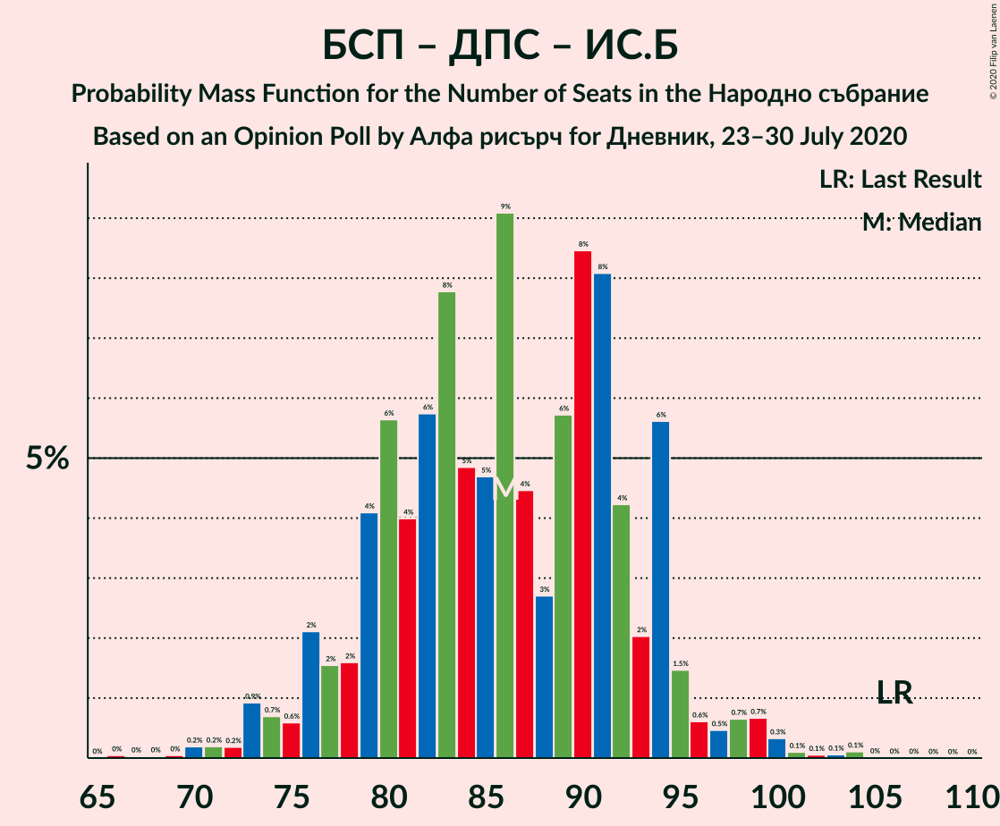

| Number of Seats | Probability | Accumulated | Special Marks |
|:---------------:|:-----------:|:-----------:|:-------------:|
| 66 | 0% | 100% |  |
| 67 | 0% | 99.9% |  |
| 68 | 0% | 99.9% |  |
| 69 | 0% | 99.9% |  |
| 70 | 0.2% | 99.8% |  |
| 71 | 0.2% | 99.6% |  |
| 72 | 0.2% | 99.4% |  |
| 73 | 0.9% | 99.3% |  |
| 74 | 0.7% | 98% |  |
| 75 | 0.6% | 98% |  |
| 76 | 2% | 97% |  |
| 77 | 2% | 95% |  |
| 78 | 2% | 93% |  |
| 79 | 4% | 92% |  |
| 80 | 6% | 88% |  |
| 81 | 4% | 82% |  |
| 82 | 6% | 78% |  |
| 83 | 8% | 72% |  |
| 84 | 5% | 65% |  |
| 85 | 5% | 60% |  |
| 86 | 9% | 55% |  |
| 87 | 4% | 46% | Median |
| 88 | 3% | 41% |  |
| 89 | 6% | 39% |  |
| 90 | 8% | 33% |  |
| 91 | 8% | 25% |  |
| 92 | 4% | 16% |  |
| 93 | 2% | 12% |  |
| 94 | 6% | 10% |  |
| 95 | 1.5% | 5% |  |
| 96 | 0.6% | 3% |  |
| 97 | 0.5% | 2% |  |
| 98 | 0.7% | 2% |  |
| 99 | 0.7% | 1.4% |  |
| 100 | 0.3% | 0.7% |  |
| 101 | 0.1% | 0.4% |  |
| 102 | 0.1% | 0.3% |  |
| 103 | 0.1% | 0.2% |  |
| 104 | 0.1% | 0.1% |  |
| 105 | 0% | 0% |  |
| 106 | 0% | 0% | Last Result |

### Граждани за европейско развитие на България – Обединени Патриоти

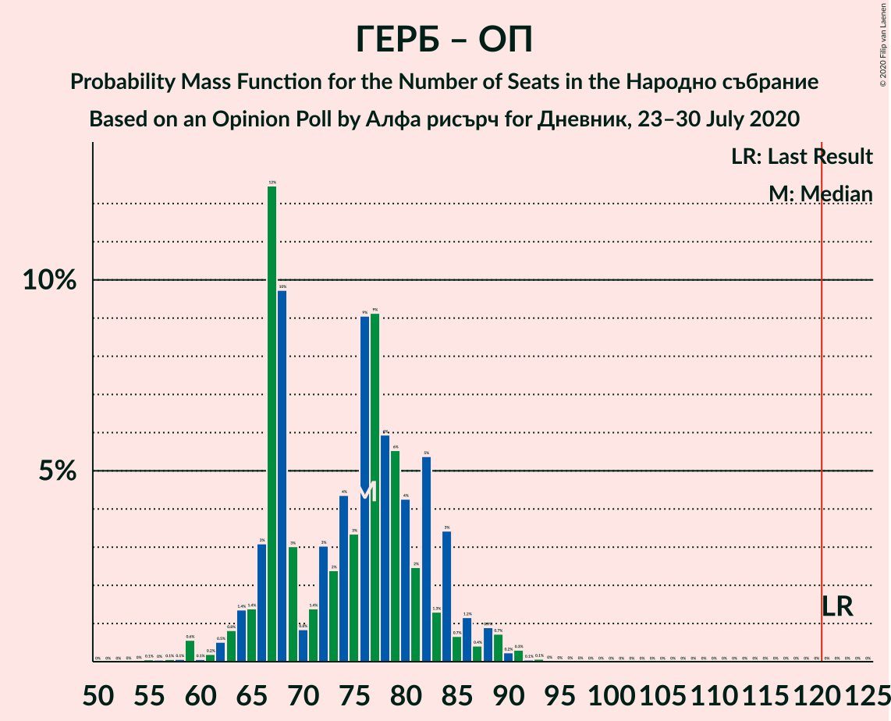

| Number of Seats | Probability | Accumulated | Special Marks |
|:---------------:|:-----------:|:-----------:|:-------------:|
| 55 | 0.1% | 100% |  |
| 56 | 0% | 99.9% |  |
| 57 | 0.1% | 99.9% |  |
| 58 | 0.1% | 99.8% |  |
| 59 | 0.6% | 99.7% |  |
| 60 | 0.1% | 99.2% |  |
| 61 | 0.2% | 99.1% |  |
| 62 | 0.5% | 98.9% |  |
| 63 | 0.8% | 98% |  |
| 64 | 1.4% | 98% |  |
| 65 | 1.4% | 96% |  |
| 66 | 3% | 95% |  |
| 67 | 12% | 92% |  |
| 68 | 10% | 79% |  |
| 69 | 3% | 70% |  |
| 70 | 0.8% | 66% |  |
| 71 | 1.4% | 66% |  |
| 72 | 3% | 64% |  |
| 73 | 2% | 61% |  |
| 74 | 4% | 59% |  |
| 75 | 3% | 54% |  |
| 76 | 9% | 51% |  |
| 77 | 9% | 42% | Median |
| 78 | 6% | 33% |  |
| 79 | 6% | 27% |  |
| 80 | 4% | 21% |  |
| 81 | 2% | 17% |  |
| 82 | 5% | 15% |  |
| 83 | 1.3% | 9% |  |
| 84 | 3% | 8% |  |
| 85 | 0.7% | 5% |  |
| 86 | 1.2% | 4% |  |
| 87 | 0.4% | 3% |  |
| 88 | 0.9% | 2% |  |
| 89 | 0.7% | 1.5% |  |
| 90 | 0.2% | 0.7% |  |
| 91 | 0.3% | 0.5% |  |
| 92 | 0.1% | 0.2% |  |
| 93 | 0.1% | 0.1% |  |
| 94 | 0% | 0.1% |  |
| 95 | 0% | 0% |  |
| 96 | 0% | 0% |  |
| 97 | 0% | 0% |  |
| 98 | 0% | 0% |  |
| 99 | 0% | 0% |  |
| 100 | 0% | 0% |  |
| 101 | 0% | 0% |  |
| 102 | 0% | 0% |  |
| 103 | 0% | 0% |  |
| 104 | 0% | 0% |  |
| 105 | 0% | 0% |  |
| 106 | 0% | 0% |  |
| 107 | 0% | 0% |  |
| 108 | 0% | 0% |  |
| 109 | 0% | 0% |  |
| 110 | 0% | 0% |  |
| 111 | 0% | 0% |  |
| 112 | 0% | 0% |  |
| 113 | 0% | 0% |  |
| 114 | 0% | 0% |  |
| 115 | 0% | 0% |  |
| 116 | 0% | 0% |  |
| 117 | 0% | 0% |  |
| 118 | 0% | 0% |  |
| 119 | 0% | 0% |  |
| 120 | 0% | 0% |  |
| 121 | 0% | 0% | Majority |
| 122 | 0% | 0% | Last Result |

### Българска социалистическа партия – Движение за права и свободи

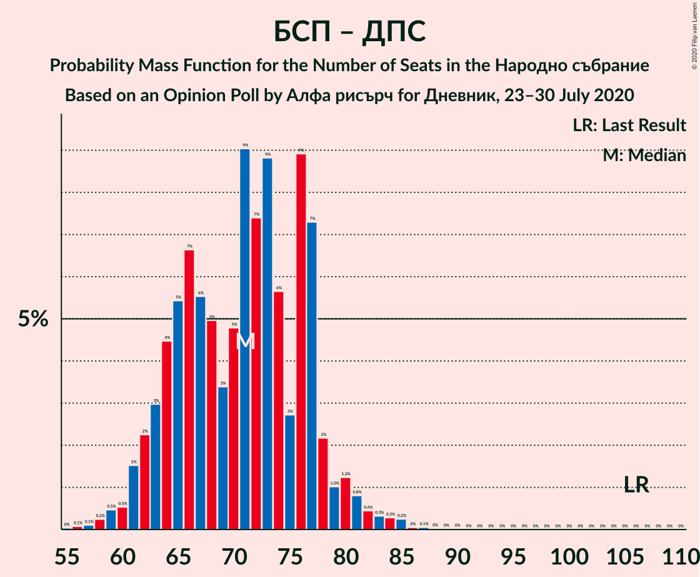

| Number of Seats | Probability | Accumulated | Special Marks |
|:---------------:|:-----------:|:-----------:|:-------------:|
| 55 | 0% | 100% |  |
| 56 | 0.1% | 99.9% |  |
| 57 | 0.1% | 99.8% |  |
| 58 | 0.2% | 99.7% |  |
| 59 | 0.5% | 99.5% |  |
| 60 | 0.5% | 99.0% |  |
| 61 | 2% | 98% |  |
| 62 | 2% | 97% |  |
| 63 | 3% | 95% |  |
| 64 | 4% | 92% |  |
| 65 | 5% | 87% |  |
| 66 | 7% | 82% |  |
| 67 | 6% | 75% |  |
| 68 | 5% | 70% |  |
| 69 | 3% | 65% |  |
| 70 | 5% | 61% |  |
| 71 | 9% | 57% |  |
| 72 | 7% | 47% | Median |
| 73 | 9% | 40% |  |
| 74 | 6% | 31% |  |
| 75 | 3% | 26% |  |
| 76 | 9% | 23% |  |
| 77 | 7% | 14% |  |
| 78 | 2% | 7% |  |
| 79 | 1.0% | 5% |  |
| 80 | 1.2% | 4% |  |
| 81 | 0.8% | 2% |  |
| 82 | 0.4% | 1.5% |  |
| 83 | 0.3% | 1.0% |  |
| 84 | 0.3% | 0.7% |  |
| 85 | 0.2% | 0.4% |  |
| 86 | 0% | 0.2% |  |
| 87 | 0.1% | 0.1% |  |
| 88 | 0% | 0.1% |  |
| 89 | 0% | 0% |  |
| 90 | 0% | 0% |  |
| 91 | 0% | 0% |  |
| 92 | 0% | 0% |  |
| 93 | 0% | 0% |  |
| 94 | 0% | 0% |  |
| 95 | 0% | 0% |  |
| 96 | 0% | 0% |  |
| 97 | 0% | 0% |  |
| 98 | 0% | 0% |  |
| 99 | 0% | 0% |  |
| 100 | 0% | 0% |  |
| 101 | 0% | 0% |  |
| 102 | 0% | 0% |  |
| 103 | 0% | 0% |  |
| 104 | 0% | 0% |  |
| 105 | 0% | 0% |  |
| 106 | 0% | 0% | Last Result |

## Technical Information

### Opinion Poll

+ **Polling firm:** Алфа рисърч
+ **Commissioner(s):** Дневник
+ **Fieldwork period:** 23–30 July 2020

### Calculations

+ **Sample size:** 552
+ **Simulations done:** 1,048,576
+ **Error estimate:** 1.72%

