# Opinion Poll by Маркет ЛИНКС, 28 July–3 August 2020

<a href="#voting-intentions">Voting Intentions</a> | <a href="#seats">Seats</a> | <a href="#coalitions">Coalitions</a> | <a href="#technical-information">Technical Information</a>

## Voting Intentions

### Confidence Intervals

| Party | Last Result | Poll Result | 80% Confidence Interval | 90% Confidence Interval | 95% Confidence Interval | 99% Confidence Interval |
|:-----:|:-----------:|:-----------:|:-----------------------:|:-----------------------:|:-----------------------:|:-----------------------:|
| Граждани за европейско развитие на България | 33.5% | 23.2% | 21.3–25.4% |20.8–26.0% |20.3–26.5% |19.4–27.5% |
| Има такъв народ | 0.0% | 23.0% | 21.0–25.1% |20.5–25.7% |20.0–26.2% |19.1–27.2% |
| Българска социалистическа партия | 27.9% | 20.7% | 18.9–22.8% |18.4–23.4% |17.9–23.9% |17.1–24.9% |
| Демократична България | 0.0% | 10.1% | 8.8–11.7% |8.4–12.1% |8.1–12.5% |7.5–13.3% |
| Движение за права и свободи | 9.2% | 9.7% | 8.4–11.2% |8.0–11.7% |7.7–12.1% |7.1–12.8% |
| Обединени Патриоти | 9.3% | 4.6% | 3.7–5.8% |3.5–6.1% |3.3–6.4% |2.9–7.0% |
| Изправи се Бг | 0.0% | 4.1% | 3.3–5.2% |3.0–5.5% |2.8–5.8% |2.5–6.4% |

*Note:* The poll result column reflects the actual value used in the calculations. Published results may vary slightly, and in addition be rounded to fewer digits.

## Seats

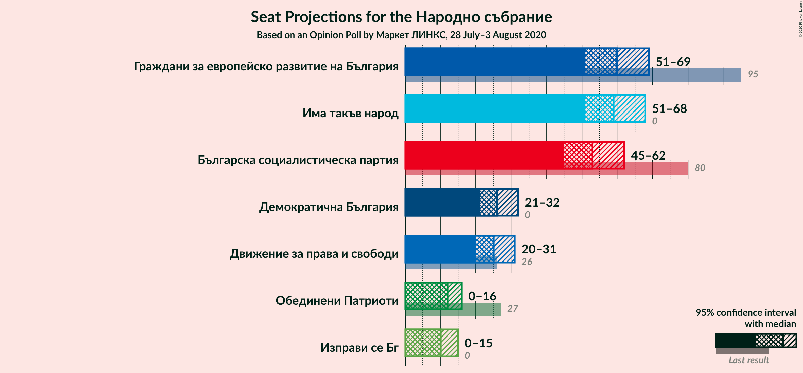

### Confidence Intervals

| Party | Last Result | Median | 80% Confidence Interval | 90% Confidence Interval | 95% Confidence Interval | 99% Confidence Interval |
|:-----:|:-----------:|:------:|:-----------------------:|:-----------------------:|:-----------------------:|:-----------------------:|
| <a href="#граждани-за-европейско-развитие-на-българия">Граждани за европейско развитие на България</a> | 95 | 60 | 55–65 |53–67 |51–69 |49–71 |
| <a href="#има-такъв-народ">Има такъв народ</a> | 0 | 59 | 54–64 |52–66 |51–68 |48–72 |
| <a href="#българска-социалистическа-партия">Българска социалистическа партия</a> | 80 | 53 | 48–58 |47–60 |45–62 |43–65 |
| <a href="#демократична-българия">Демократична България</a> | 0 | 26 | 22–30 |22–31 |21–32 |19–34 |
| <a href="#движение-за-права-и-свободи">Движение за права и свободи</a> | 26 | 25 | 21–29 |20–30 |20–31 |18–33 |
| <a href="#обединени-патриоти">Обединени Патриоти</a> | 27 | 12 | 0–15 |0–15 |0–16 |0–18 |
| <a href="#изправи-се-бг">Изправи се Бг</a> | 0 | 10 | 0–13 |0–14 |0–15 |0–16 |

### Граждани за европейско развитие на България

*For a full overview of the results for this party, see the [Граждани за европейско развитие на България](party-гражданизаевропейскоразвитиенабългария.html) page.*

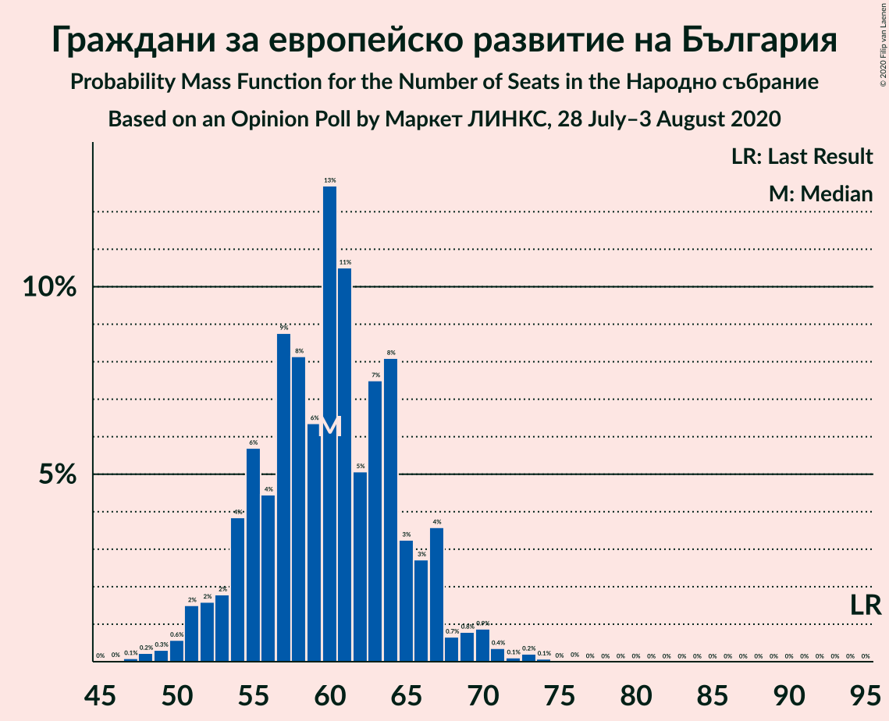

| Number of Seats | Probability | Accumulated | Special Marks |
|:---------------:|:-----------:|:-----------:|:-------------:|
| 46 | 0% | 100% |  |
| 47 | 0.1% | 99.9% |  |
| 48 | 0.2% | 99.9% |  |
| 49 | 0.3% | 99.6% |  |
| 50 | 0.6% | 99.3% |  |
| 51 | 2% | 98.7% |  |
| 52 | 2% | 97% |  |
| 53 | 2% | 96% |  |
| 54 | 4% | 94% |  |
| 55 | 6% | 90% |  |
| 56 | 4% | 84% |  |
| 57 | 9% | 80% |  |
| 58 | 8% | 71% |  |
| 59 | 6% | 63% |  |
| 60 | 13% | 57% | Median |
| 61 | 11% | 44% |  |
| 62 | 5% | 33% |  |
| 63 | 7% | 28% |  |
| 64 | 8% | 21% |  |
| 65 | 3% | 13% |  |
| 66 | 3% | 9% |  |
| 67 | 4% | 7% |  |
| 68 | 0.7% | 3% |  |
| 69 | 0.8% | 3% |  |
| 70 | 0.9% | 2% |  |
| 71 | 0.4% | 0.8% |  |
| 72 | 0.1% | 0.5% |  |
| 73 | 0.2% | 0.4% |  |
| 74 | 0.1% | 0.2% |  |
| 75 | 0% | 0.1% |  |
| 76 | 0% | 0.1% |  |
| 77 | 0% | 0% |  |
| 78 | 0% | 0% |  |
| 79 | 0% | 0% |  |
| 80 | 0% | 0% |  |
| 81 | 0% | 0% |  |
| 82 | 0% | 0% |  |
| 83 | 0% | 0% |  |
| 84 | 0% | 0% |  |
| 85 | 0% | 0% |  |
| 86 | 0% | 0% |  |
| 87 | 0% | 0% |  |
| 88 | 0% | 0% |  |
| 89 | 0% | 0% |  |
| 90 | 0% | 0% |  |
| 91 | 0% | 0% |  |
| 92 | 0% | 0% |  |
| 93 | 0% | 0% |  |
| 94 | 0% | 0% |  |
| 95 | 0% | 0% | Last Result |

### Има такъв народ

*For a full overview of the results for this party, see the [Има такъв народ](party-иматакъвнарод.html) page.*

| Number of Seats | Probability | Accumulated | Special Marks |
|:---------------:|:-----------:|:-----------:|:-------------:|
| 0 | 0% | 100% | Last Result |
| 1 | 0% | 100% |  |
| 2 | 0% | 100% |  |
| 3 | 0% | 100% |  |
| 4 | 0% | 100% |  |
| 5 | 0% | 100% |  |
| 6 | 0% | 100% |  |
| 7 | 0% | 100% |  |
| 8 | 0% | 100% |  |
| 9 | 0% | 100% |  |
| 10 | 0% | 100% |  |
| 11 | 0% | 100% |  |
| 12 | 0% | 100% |  |
| 13 | 0% | 100% |  |
| 14 | 0% | 100% |  |
| 15 | 0% | 100% |  |
| 16 | 0% | 100% |  |
| 17 | 0% | 100% |  |
| 18 | 0% | 100% |  |
| 19 | 0% | 100% |  |
| 20 | 0% | 100% |  |
| 21 | 0% | 100% |  |
| 22 | 0% | 100% |  |
| 23 | 0% | 100% |  |
| 24 | 0% | 100% |  |
| 25 | 0% | 100% |  |
| 26 | 0% | 100% |  |
| 27 | 0% | 100% |  |
| 28 | 0% | 100% |  |
| 29 | 0% | 100% |  |
| 30 | 0% | 100% |  |
| 31 | 0% | 100% |  |
| 32 | 0% | 100% |  |
| 33 | 0% | 100% |  |
| 34 | 0% | 100% |  |
| 35 | 0% | 100% |  |
| 36 | 0% | 100% |  |
| 37 | 0% | 100% |  |
| 38 | 0% | 100% |  |
| 39 | 0% | 100% |  |
| 40 | 0% | 100% |  |
| 41 | 0% | 100% |  |
| 42 | 0% | 100% |  |
| 43 | 0% | 100% |  |
| 44 | 0% | 100% |  |
| 45 | 0% | 100% |  |
| 46 | 0.1% | 100% |  |
| 47 | 0.2% | 99.9% |  |
| 48 | 0.3% | 99.7% |  |
| 49 | 0.5% | 99.4% |  |
| 50 | 1.0% | 99.0% |  |
| 51 | 1.2% | 98% |  |
| 52 | 3% | 97% |  |
| 53 | 3% | 94% |  |
| 54 | 4% | 91% |  |
| 55 | 7% | 87% |  |
| 56 | 8% | 80% |  |
| 57 | 10% | 72% |  |
| 58 | 9% | 62% |  |
| 59 | 12% | 52% | Median |
| 60 | 8% | 40% |  |
| 61 | 8% | 32% |  |
| 62 | 6% | 25% |  |
| 63 | 5% | 18% |  |
| 64 | 4% | 14% |  |
| 65 | 2% | 10% |  |
| 66 | 2% | 7% |  |
| 67 | 2% | 5% |  |
| 68 | 1.0% | 3% |  |
| 69 | 0.7% | 2% |  |
| 70 | 0.5% | 1.4% |  |
| 71 | 0.4% | 1.0% |  |
| 72 | 0.3% | 0.6% |  |
| 73 | 0.2% | 0.3% |  |
| 74 | 0.1% | 0.1% |  |
| 75 | 0% | 0.1% |  |
| 76 | 0% | 0% |  |

### Българска социалистическа партия

*For a full overview of the results for this party, see the [Българска социалистическа партия](party-българскасоциалистическапартия.html) page.*

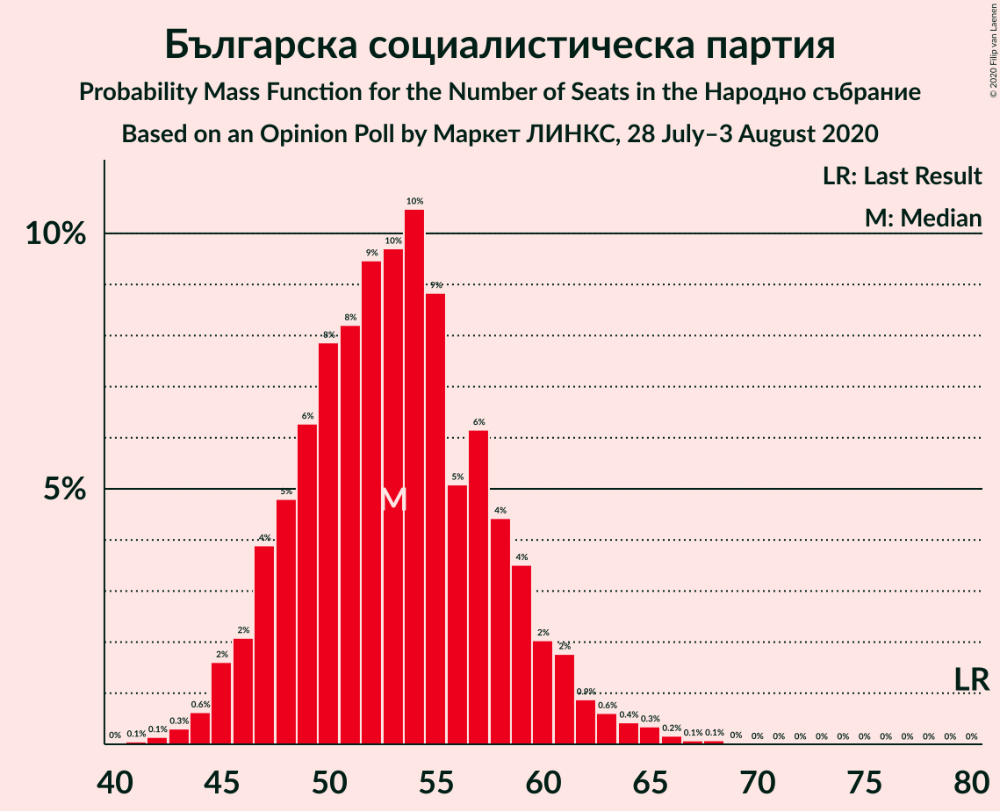

| Number of Seats | Probability | Accumulated | Special Marks |
|:---------------:|:-----------:|:-----------:|:-------------:|
| 41 | 0.1% | 100% |  |
| 42 | 0.1% | 99.9% |  |
| 43 | 0.3% | 99.8% |  |
| 44 | 0.6% | 99.5% |  |
| 45 | 2% | 98.8% |  |
| 46 | 2% | 97% |  |
| 47 | 4% | 95% |  |
| 48 | 5% | 91% |  |
| 49 | 6% | 86% |  |
| 50 | 8% | 80% |  |
| 51 | 8% | 72% |  |
| 52 | 9% | 64% |  |
| 53 | 10% | 55% | Median |
| 54 | 10% | 45% |  |
| 55 | 9% | 34% |  |
| 56 | 5% | 26% |  |
| 57 | 6% | 21% |  |
| 58 | 4% | 14% |  |
| 59 | 4% | 10% |  |
| 60 | 2% | 6% |  |
| 61 | 2% | 4% |  |
| 62 | 0.9% | 3% |  |
| 63 | 0.6% | 2% |  |
| 64 | 0.4% | 1.1% |  |
| 65 | 0.3% | 0.7% |  |
| 66 | 0.2% | 0.4% |  |
| 67 | 0.1% | 0.2% |  |
| 68 | 0.1% | 0.1% |  |
| 69 | 0% | 0% |  |
| 70 | 0% | 0% |  |
| 71 | 0% | 0% |  |
| 72 | 0% | 0% |  |
| 73 | 0% | 0% |  |
| 74 | 0% | 0% |  |
| 75 | 0% | 0% |  |
| 76 | 0% | 0% |  |
| 77 | 0% | 0% |  |
| 78 | 0% | 0% |  |
| 79 | 0% | 0% |  |
| 80 | 0% | 0% | Last Result |

### Демократична България

*For a full overview of the results for this party, see the [Демократична България](party-демократичнабългария.html) page.*

| Number of Seats | Probability | Accumulated | Special Marks |
|:---------------:|:-----------:|:-----------:|:-------------:|
| 0 | 0% | 100% | Last Result |
| 1 | 0% | 100% |  |
| 2 | 0% | 100% |  |
| 3 | 0% | 100% |  |
| 4 | 0% | 100% |  |
| 5 | 0% | 100% |  |
| 6 | 0% | 100% |  |
| 7 | 0% | 100% |  |
| 8 | 0% | 100% |  |
| 9 | 0% | 100% |  |
| 10 | 0% | 100% |  |
| 11 | 0% | 100% |  |
| 12 | 0% | 100% |  |
| 13 | 0% | 100% |  |
| 14 | 0% | 100% |  |
| 15 | 0% | 100% |  |
| 16 | 0% | 100% |  |
| 17 | 0.1% | 100% |  |
| 18 | 0.2% | 99.9% |  |
| 19 | 0.7% | 99.7% |  |
| 20 | 1.5% | 99.0% |  |
| 21 | 2% | 98% |  |
| 22 | 6% | 95% |  |
| 23 | 14% | 89% |  |
| 24 | 11% | 75% |  |
| 25 | 10% | 64% |  |
| 26 | 11% | 55% | Median |
| 27 | 13% | 44% |  |
| 28 | 10% | 31% |  |
| 29 | 9% | 21% |  |
| 30 | 5% | 12% |  |
| 31 | 3% | 7% |  |
| 32 | 1.1% | 3% |  |
| 33 | 1.0% | 2% |  |
| 34 | 0.7% | 1.2% |  |
| 35 | 0.2% | 0.4% |  |
| 36 | 0.1% | 0.2% |  |
| 37 | 0.1% | 0.1% |  |
| 38 | 0% | 0% |  |

### Движение за права и свободи

*For a full overview of the results for this party, see the [Движение за права и свободи](party-движениезаправаисвободи.html) page.*

| Number of Seats | Probability | Accumulated | Special Marks |
|:---------------:|:-----------:|:-----------:|:-------------:|
| 17 | 0.2% | 100% |  |
| 18 | 0.5% | 99.8% |  |
| 19 | 2% | 99.3% |  |
| 20 | 3% | 98% |  |
| 21 | 7% | 95% |  |
| 22 | 8% | 88% |  |
| 23 | 10% | 81% |  |
| 24 | 14% | 70% |  |
| 25 | 13% | 56% | Median |
| 26 | 14% | 44% | Last Result |
| 27 | 8% | 29% |  |
| 28 | 10% | 21% |  |
| 29 | 5% | 11% |  |
| 30 | 3% | 7% |  |
| 31 | 2% | 4% |  |
| 32 | 0.8% | 2% |  |
| 33 | 0.5% | 1.0% |  |
| 34 | 0.3% | 0.4% |  |
| 35 | 0.1% | 0.2% |  |
| 36 | 0% | 0.1% |  |
| 37 | 0% | 0% |  |

### Обединени Патриоти

*For a full overview of the results for this party, see the [Обединени Патриоти](party-обединенипатриоти.html) page.*

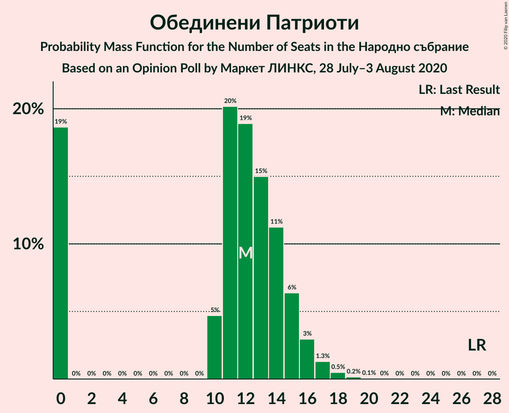

| Number of Seats | Probability | Accumulated | Special Marks |
|:---------------:|:-----------:|:-----------:|:-------------:|
| 0 | 19% | 100% |  |
| 1 | 0% | 81% |  |
| 2 | 0% | 81% |  |
| 3 | 0% | 81% |  |
| 4 | 0% | 81% |  |
| 5 | 0% | 81% |  |
| 6 | 0% | 81% |  |
| 7 | 0% | 81% |  |
| 8 | 0% | 81% |  |
| 9 | 0% | 81% |  |
| 10 | 5% | 81% |  |
| 11 | 20% | 77% |  |
| 12 | 19% | 56% | Median |
| 13 | 15% | 38% |  |
| 14 | 11% | 23% |  |
| 15 | 6% | 11% |  |
| 16 | 3% | 5% |  |
| 17 | 1.3% | 2% |  |
| 18 | 0.5% | 0.7% |  |
| 19 | 0.2% | 0.2% |  |
| 20 | 0.1% | 0.1% |  |
| 21 | 0% | 0% |  |
| 22 | 0% | 0% |  |
| 23 | 0% | 0% |  |
| 24 | 0% | 0% |  |
| 25 | 0% | 0% |  |
| 26 | 0% | 0% |  |
| 27 | 0% | 0% | Last Result |

### Изправи се Бг

*For a full overview of the results for this party, see the [Изправи се Бг](party-изправисебг.html) page.*

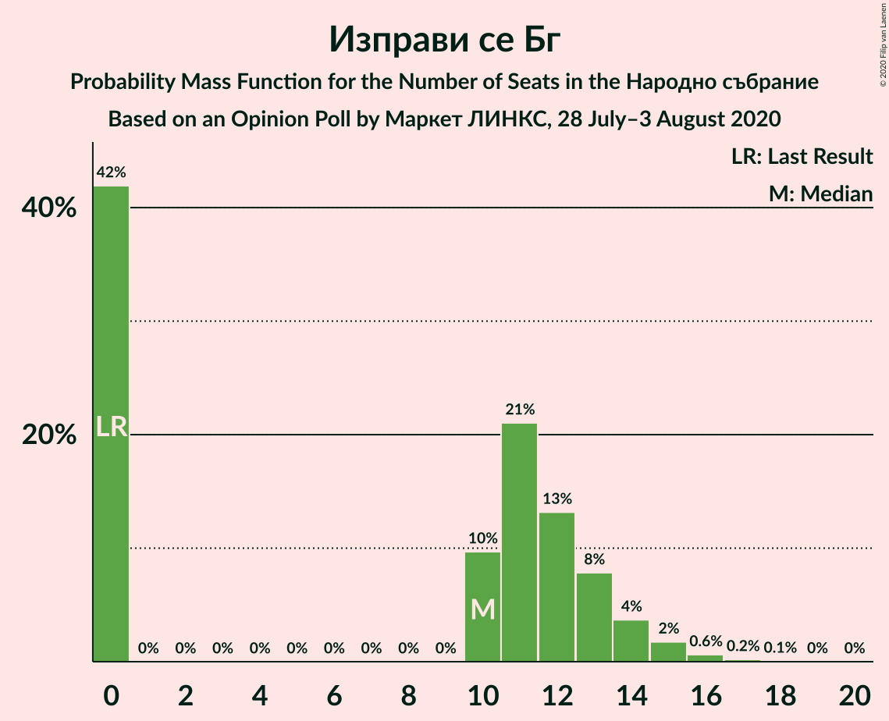

| Number of Seats | Probability | Accumulated | Special Marks |
|:---------------:|:-----------:|:-----------:|:-------------:|
| 0 | 42% | 100% | Last Result |
| 1 | 0% | 58% |  |
| 2 | 0% | 58% |  |
| 3 | 0% | 58% |  |
| 4 | 0% | 58% |  |
| 5 | 0% | 58% |  |
| 6 | 0% | 58% |  |
| 7 | 0% | 58% |  |
| 8 | 0% | 58% |  |
| 9 | 0% | 58% |  |
| 10 | 10% | 58% | Median |
| 11 | 21% | 48% |  |
| 12 | 13% | 27% |  |
| 13 | 8% | 14% |  |
| 14 | 4% | 6% |  |
| 15 | 2% | 3% |  |
| 16 | 0.6% | 0.9% |  |
| 17 | 0.2% | 0.3% |  |
| 18 | 0.1% | 0.1% |  |
| 19 | 0% | 0% |  |

## Coalitions

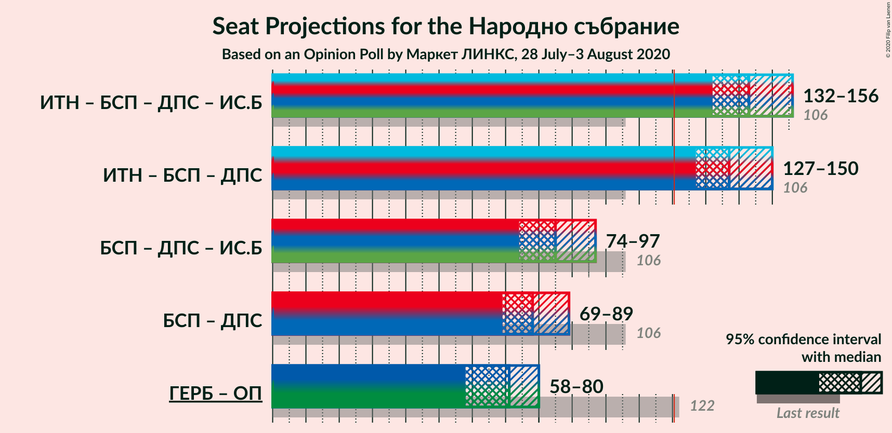

### Confidence Intervals

| Coalition | Last Result | Median | Majority? | 80% Confidence Interval | 90% Confidence Interval | 95% Confidence Interval | 99% Confidence Interval |
|:---------:|:-----------:|:------:|:---------:|:-----------------------:|:-----------------------:|:-----------------------:|:-----------------------:|
| Има такъв народ – Българска социалистическа партия – Движение за права и свободи – Изправи се Бг | 106 | 143 | 100% | 138–152 | 135–154 | 132–156 | 130–160 |
| Има такъв народ – Българска социалистическа партия – Движение за права и свободи | 106 | 137 | 99.8% | 128–145 | 127–148 | 127–150 | 124–155 |
| Българска социалистическа партия – Движение за права и свободи – Изправи се Бг | 106 | 85 | 0% | 78–93 | 76–95 | 74–97 | 71–100 |
| Българска социалистическа партия – Движение за права и свободи | 106 | 78 | 0% | 72–84 | 70–87 | 69–89 | 67–92 |
| Граждани за европейско развитие на България – Обединени Патриоти | 122 | 71 | 0% | 62–77 | 60–79 | 58–80 | 54–83 |

### Има такъв народ – Българска социалистическа партия – Движение за права и свободи – Изправи се Бг

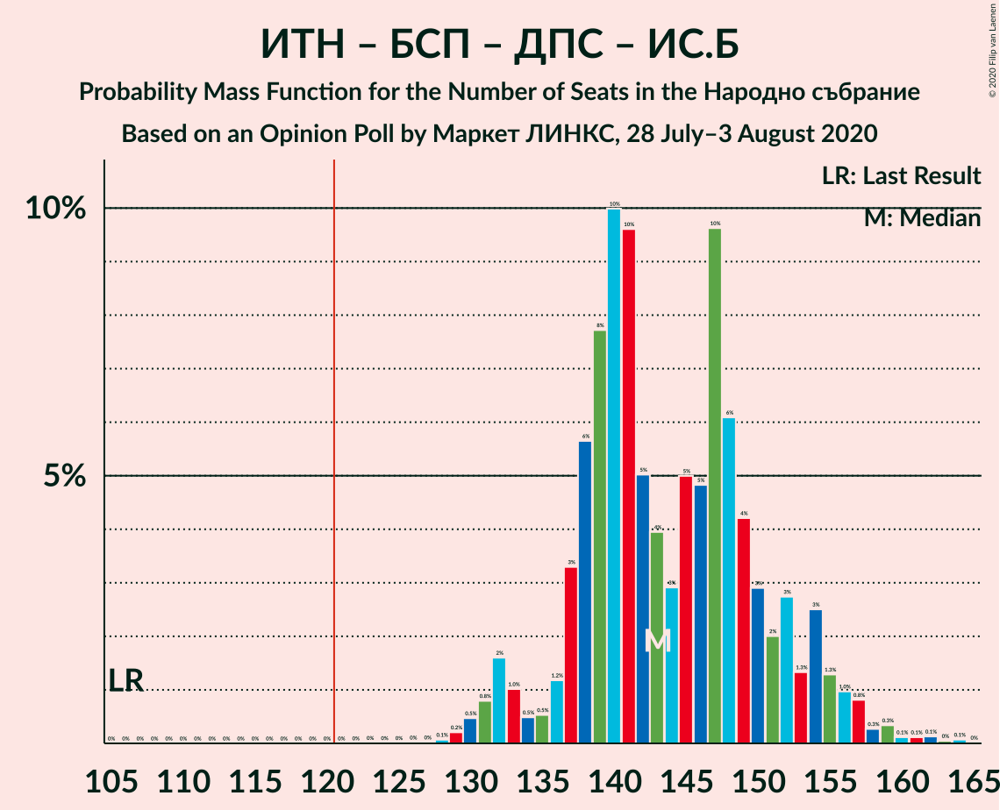

| Number of Seats | Probability | Accumulated | Special Marks |
|:---------------:|:-----------:|:-----------:|:-------------:|
| 106 | 0% | 100% | Last Result |
| 107 | 0% | 100% |  |
| 108 | 0% | 100% |  |
| 109 | 0% | 100% |  |
| 110 | 0% | 100% |  |
| 111 | 0% | 100% |  |
| 112 | 0% | 100% |  |
| 113 | 0% | 100% |  |
| 114 | 0% | 100% |  |
| 115 | 0% | 100% |  |
| 116 | 0% | 100% |  |
| 117 | 0% | 100% |  |
| 118 | 0% | 100% |  |
| 119 | 0% | 100% |  |
| 120 | 0% | 100% |  |
| 121 | 0% | 100% | Majority |
| 122 | 0% | 100% |  |
| 123 | 0% | 100% |  |
| 124 | 0% | 100% |  |
| 125 | 0% | 100% |  |
| 126 | 0% | 100% |  |
| 127 | 0% | 100% |  |
| 128 | 0.1% | 99.9% |  |
| 129 | 0.2% | 99.9% |  |
| 130 | 0.5% | 99.7% |  |
| 131 | 0.8% | 99.2% |  |
| 132 | 2% | 98% |  |
| 133 | 1.0% | 97% |  |
| 134 | 0.5% | 96% |  |
| 135 | 0.5% | 95% |  |
| 136 | 1.2% | 95% |  |
| 137 | 3% | 94% |  |
| 138 | 6% | 90% |  |
| 139 | 8% | 85% |  |
| 140 | 10% | 77% |  |
| 141 | 10% | 67% |  |
| 142 | 5% | 57% |  |
| 143 | 4% | 52% |  |
| 144 | 3% | 48% |  |
| 145 | 5% | 45% |  |
| 146 | 5% | 40% |  |
| 147 | 10% | 36% | Median |
| 148 | 6% | 26% |  |
| 149 | 4% | 20% |  |
| 150 | 3% | 16% |  |
| 151 | 2% | 13% |  |
| 152 | 3% | 11% |  |
| 153 | 1.3% | 8% |  |
| 154 | 3% | 7% |  |
| 155 | 1.3% | 4% |  |
| 156 | 1.0% | 3% |  |
| 157 | 0.8% | 2% |  |
| 158 | 0.3% | 1.1% |  |
| 159 | 0.3% | 0.8% |  |
| 160 | 0.1% | 0.5% |  |
| 161 | 0.1% | 0.4% |  |
| 162 | 0.1% | 0.3% |  |
| 163 | 0% | 0.1% |  |
| 164 | 0.1% | 0.1% |  |
| 165 | 0% | 0% |  |

### Има такъв народ – Българска социалистическа партия – Движение за права и свободи

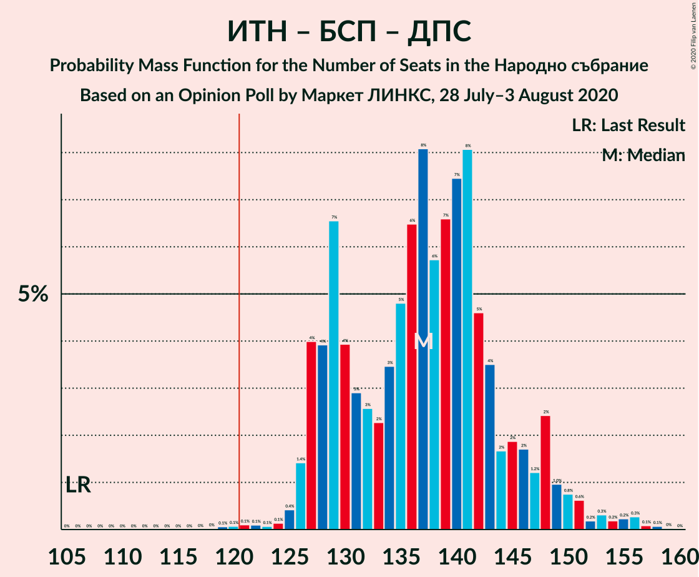

| Number of Seats | Probability | Accumulated | Special Marks |
|:---------------:|:-----------:|:-----------:|:-------------:|
| 106 | 0% | 100% | Last Result |
| 107 | 0% | 100% |  |
| 108 | 0% | 100% |  |
| 109 | 0% | 100% |  |
| 110 | 0% | 100% |  |
| 111 | 0% | 100% |  |
| 112 | 0% | 100% |  |
| 113 | 0% | 100% |  |
| 114 | 0% | 100% |  |
| 115 | 0% | 100% |  |
| 116 | 0% | 100% |  |
| 117 | 0% | 100% |  |
| 118 | 0% | 100% |  |
| 119 | 0.1% | 100% |  |
| 120 | 0.1% | 99.9% |  |
| 121 | 0.1% | 99.8% | Majority |
| 122 | 0.1% | 99.7% |  |
| 123 | 0.1% | 99.6% |  |
| 124 | 0.1% | 99.6% |  |
| 125 | 0.4% | 99.4% |  |
| 126 | 1.4% | 99.0% |  |
| 127 | 4% | 98% |  |
| 128 | 4% | 94% |  |
| 129 | 7% | 90% |  |
| 130 | 4% | 83% |  |
| 131 | 3% | 79% |  |
| 132 | 3% | 76% |  |
| 133 | 2% | 74% |  |
| 134 | 3% | 71% |  |
| 135 | 5% | 68% |  |
| 136 | 6% | 63% |  |
| 137 | 8% | 57% | Median |
| 138 | 6% | 49% |  |
| 139 | 7% | 43% |  |
| 140 | 7% | 36% |  |
| 141 | 8% | 29% |  |
| 142 | 5% | 21% |  |
| 143 | 4% | 16% |  |
| 144 | 2% | 13% |  |
| 145 | 2% | 11% |  |
| 146 | 2% | 9% |  |
| 147 | 1.2% | 7% |  |
| 148 | 2% | 6% |  |
| 149 | 1.0% | 4% |  |
| 150 | 0.8% | 3% |  |
| 151 | 0.6% | 2% |  |
| 152 | 0.2% | 1.4% |  |
| 153 | 0.3% | 1.2% |  |
| 154 | 0.2% | 0.9% |  |
| 155 | 0.2% | 0.7% |  |
| 156 | 0.3% | 0.5% |  |
| 157 | 0.1% | 0.2% |  |
| 158 | 0.1% | 0.1% |  |
| 159 | 0% | 0% |  |

### Българска социалистическа партия – Движение за права и свободи – Изправи се Бг

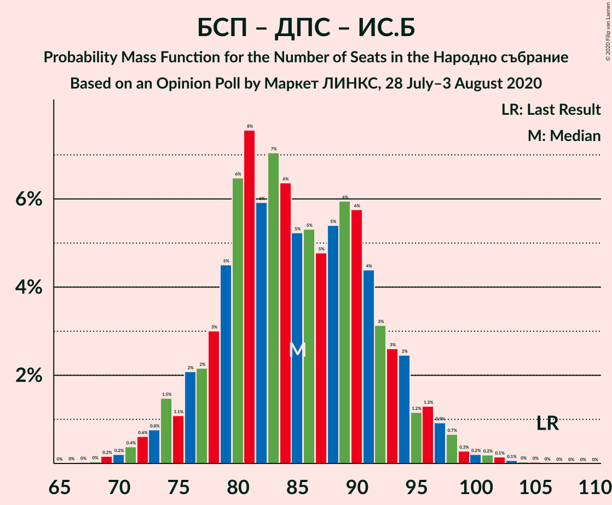

| Number of Seats | Probability | Accumulated | Special Marks |
|:---------------:|:-----------:|:-----------:|:-------------:|
| 67 | 0% | 100% |  |
| 68 | 0% | 99.9% |  |
| 69 | 0.2% | 99.9% |  |
| 70 | 0.2% | 99.7% |  |
| 71 | 0.4% | 99.5% |  |
| 72 | 0.6% | 99.1% |  |
| 73 | 0.8% | 98.5% |  |
| 74 | 1.5% | 98% |  |
| 75 | 1.1% | 96% |  |
| 76 | 2% | 95% |  |
| 77 | 2% | 93% |  |
| 78 | 3% | 91% |  |
| 79 | 5% | 88% |  |
| 80 | 6% | 83% |  |
| 81 | 8% | 77% |  |
| 82 | 6% | 69% |  |
| 83 | 7% | 63% |  |
| 84 | 6% | 56% |  |
| 85 | 5% | 50% |  |
| 86 | 5% | 45% |  |
| 87 | 5% | 40% |  |
| 88 | 5% | 35% | Median |
| 89 | 6% | 29% |  |
| 90 | 6% | 23% |  |
| 91 | 4% | 18% |  |
| 92 | 3% | 13% |  |
| 93 | 3% | 10% |  |
| 94 | 2% | 7% |  |
| 95 | 1.2% | 5% |  |
| 96 | 1.3% | 4% |  |
| 97 | 0.9% | 3% |  |
| 98 | 0.7% | 2% |  |
| 99 | 0.3% | 1.0% |  |
| 100 | 0.2% | 0.7% |  |
| 101 | 0.2% | 0.5% |  |
| 102 | 0.1% | 0.3% |  |
| 103 | 0.1% | 0.2% |  |
| 104 | 0% | 0.1% |  |
| 105 | 0% | 0.1% |  |
| 106 | 0% | 0% | Last Result |

### Българска социалистическа партия – Движение за права и свободи

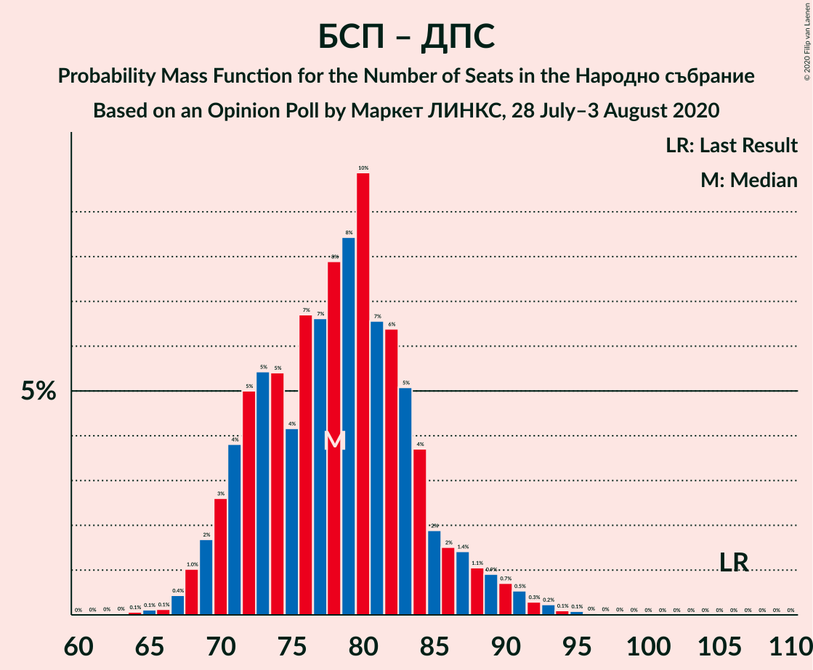

| Number of Seats | Probability | Accumulated | Special Marks |
|:---------------:|:-----------:|:-----------:|:-------------:|
| 63 | 0% | 100% |  |
| 64 | 0.1% | 99.9% |  |
| 65 | 0.1% | 99.9% |  |
| 66 | 0.1% | 99.8% |  |
| 67 | 0.4% | 99.6% |  |
| 68 | 1.0% | 99.2% |  |
| 69 | 2% | 98% |  |
| 70 | 3% | 96% |  |
| 71 | 4% | 94% |  |
| 72 | 5% | 90% |  |
| 73 | 5% | 85% |  |
| 74 | 5% | 80% |  |
| 75 | 4% | 74% |  |
| 76 | 7% | 70% |  |
| 77 | 7% | 63% |  |
| 78 | 8% | 57% | Median |
| 79 | 8% | 49% |  |
| 80 | 10% | 40% |  |
| 81 | 7% | 31% |  |
| 82 | 6% | 24% |  |
| 83 | 5% | 18% |  |
| 84 | 4% | 13% |  |
| 85 | 2% | 9% |  |
| 86 | 2% | 7% |  |
| 87 | 1.4% | 5% |  |
| 88 | 1.1% | 4% |  |
| 89 | 0.9% | 3% |  |
| 90 | 0.7% | 2% |  |
| 91 | 0.5% | 1.3% |  |
| 92 | 0.3% | 0.8% |  |
| 93 | 0.2% | 0.5% |  |
| 94 | 0.1% | 0.3% |  |
| 95 | 0.1% | 0.2% |  |
| 96 | 0% | 0.1% |  |
| 97 | 0% | 0% |  |
| 98 | 0% | 0% |  |
| 99 | 0% | 0% |  |
| 100 | 0% | 0% |  |
| 101 | 0% | 0% |  |
| 102 | 0% | 0% |  |
| 103 | 0% | 0% |  |
| 104 | 0% | 0% |  |
| 105 | 0% | 0% |  |
| 106 | 0% | 0% | Last Result |

### Граждани за европейско развитие на България – Обединени Патриоти

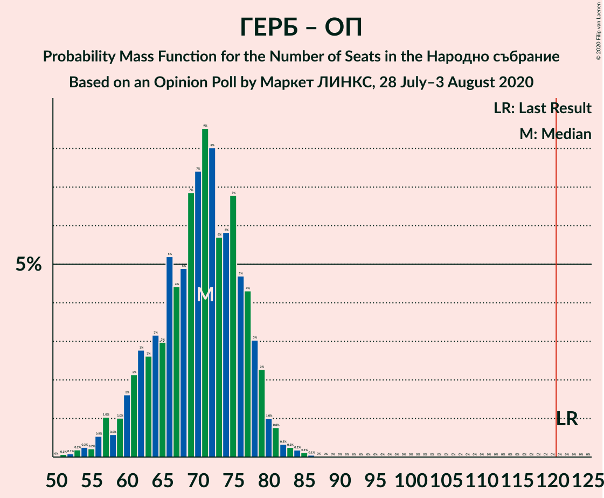

| Number of Seats | Probability | Accumulated | Special Marks |
|:---------------:|:-----------:|:-----------:|:-------------:|
| 51 | 0.1% | 100% |  |
| 52 | 0.1% | 99.9% |  |
| 53 | 0.2% | 99.8% |  |
| 54 | 0.3% | 99.6% |  |
| 55 | 0.2% | 99.4% |  |
| 56 | 0.5% | 99.1% |  |
| 57 | 1.0% | 98.6% |  |
| 58 | 0.6% | 98% |  |
| 59 | 1.0% | 97% |  |
| 60 | 2% | 96% |  |
| 61 | 2% | 94% |  |
| 62 | 3% | 92% |  |
| 63 | 3% | 89% |  |
| 64 | 3% | 87% |  |
| 65 | 3% | 84% |  |
| 66 | 5% | 81% |  |
| 67 | 4% | 75% |  |
| 68 | 5% | 71% |  |
| 69 | 7% | 66% |  |
| 70 | 7% | 59% |  |
| 71 | 9% | 52% |  |
| 72 | 8% | 43% | Median |
| 73 | 6% | 35% |  |
| 74 | 6% | 30% |  |
| 75 | 7% | 24% |  |
| 76 | 5% | 17% |  |
| 77 | 4% | 12% |  |
| 78 | 3% | 8% |  |
| 79 | 2% | 5% |  |
| 80 | 1.0% | 3% |  |
| 81 | 0.8% | 2% |  |
| 82 | 0.3% | 1.0% |  |
| 83 | 0.3% | 0.6% |  |
| 84 | 0.2% | 0.4% |  |
| 85 | 0.1% | 0.2% |  |
| 86 | 0.1% | 0.1% |  |
| 87 | 0% | 0% |  |
| 88 | 0% | 0% |  |
| 89 | 0% | 0% |  |
| 90 | 0% | 0% |  |
| 91 | 0% | 0% |  |
| 92 | 0% | 0% |  |
| 93 | 0% | 0% |  |
| 94 | 0% | 0% |  |
| 95 | 0% | 0% |  |
| 96 | 0% | 0% |  |
| 97 | 0% | 0% |  |
| 98 | 0% | 0% |  |
| 99 | 0% | 0% |  |
| 100 | 0% | 0% |  |
| 101 | 0% | 0% |  |
| 102 | 0% | 0% |  |
| 103 | 0% | 0% |  |
| 104 | 0% | 0% |  |
| 105 | 0% | 0% |  |
| 106 | 0% | 0% |  |
| 107 | 0% | 0% |  |
| 108 | 0% | 0% |  |
| 109 | 0% | 0% |  |
| 110 | 0% | 0% |  |
| 111 | 0% | 0% |  |
| 112 | 0% | 0% |  |
| 113 | 0% | 0% |  |
| 114 | 0% | 0% |  |
| 115 | 0% | 0% |  |
| 116 | 0% | 0% |  |
| 117 | 0% | 0% |  |
| 118 | 0% | 0% |  |
| 119 | 0% | 0% |  |
| 120 | 0% | 0% |  |
| 121 | 0% | 0% | Majority |
| 122 | 0% | 0% | Last Result |

## Technical Information

### Opinion Poll

+ **Polling firm:** Маркет ЛИНКС
+ **Commissioner(s):** —
+ **Fieldwork period:** 28 July–3 August 2020

### Calculations

+ **Sample size:** 714
+ **Simulations done:** 1,048,576
+ **Error estimate:** 0.40%

