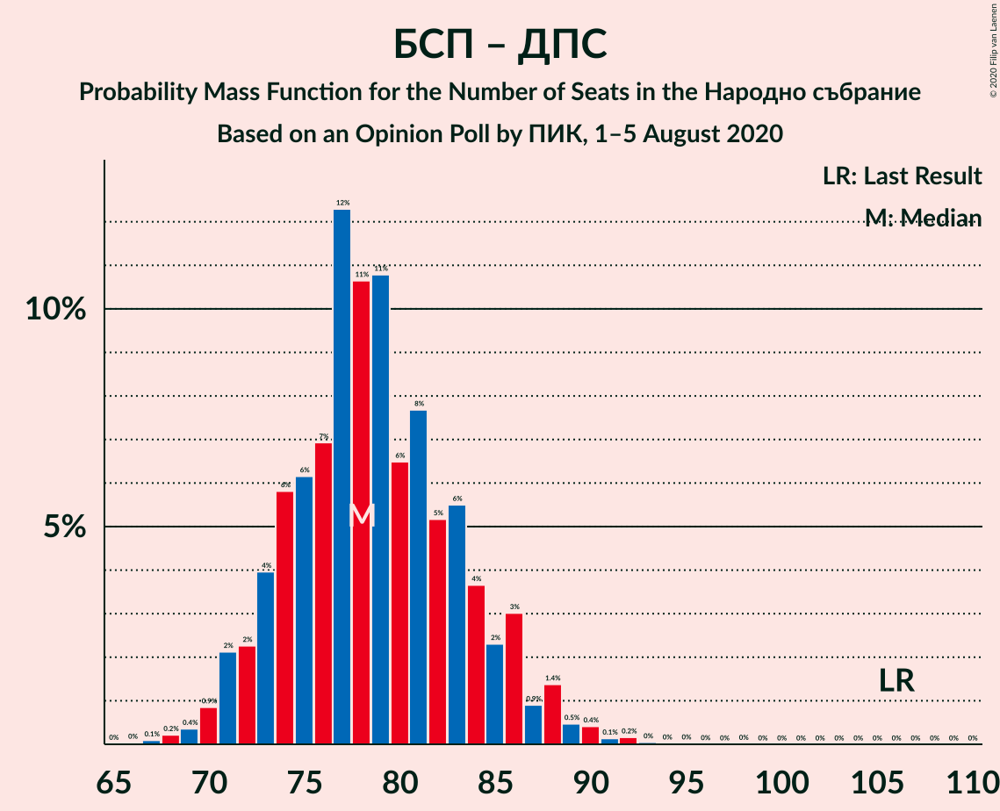

# Opinion Poll by ПИК, 1–5 August 2020

<a href="#voting-intentions">Voting Intentions</a> | <a href="#seats">Seats</a> | <a href="#coalitions">Coalitions</a> | <a href="#technical-information">Technical Information</a>

## Voting Intentions

### Confidence Intervals

| Party | Last Result | Poll Result | 80% Confidence Interval | 90% Confidence Interval | 95% Confidence Interval | 99% Confidence Interval |
|:-----:|:-----------:|:-----------:|:-----------------------:|:-----------------------:|:-----------------------:|:-----------------------:|
| Граждани за европейско развитие на България | 33.5% | 30.2% | 28.4–32.1% |27.9–32.6% |27.4–33.1% |26.6–34.0% |
| Българска социалистическа партия | 27.9% | 19.7% | 18.2–21.4% |17.7–21.8% |17.4–22.3% |16.6–23.1% |
| Има такъв народ | 0.0% | 13.9% | 12.6–15.4% |12.2–15.8% |11.9–16.2% |11.3–16.9% |
| Движение за права и свободи | 9.2% | 10.8% | 9.6–12.1% |9.3–12.5% |9.0–12.8% |8.5–13.5% |
| Демократична България | 0.0% | 10.1% | 9.0–11.4% |8.7–11.8% |8.4–12.1% |7.9–12.8% |
| Изправи се Бг | 0.0% | 5.0% | 4.2–6.0% |4.0–6.3% |3.8–6.5% |3.5–7.0% |
| Обединени Патриоти | 9.3% | 4.3% | 3.6–5.2% |3.4–5.5% |3.2–5.7% |2.9–6.2% |
| Воля | 4.3% | 2.1% | 1.6–2.8% |1.4–3.0% |1.3–3.1% |1.2–3.5% |

*Note:* The poll result column reflects the actual value used in the calculations. Published results may vary slightly, and in addition be rounded to fewer digits.

## Seats

### Confidence Intervals

| Party | Last Result | Median | 80% Confidence Interval | 90% Confidence Interval | 95% Confidence Interval | 99% Confidence Interval |
|:-----:|:-----------:|:------:|:-----------------------:|:-----------------------:|:-----------------------:|:-----------------------:|
| <a href="#граждани-за-европейско-развитие-на-българия">Граждани за европейско развитие на България</a> | 95 | 78 | 73–83 |71–84 |70–86 |68–89 |
| <a href="#българска-социалистическа-партия">Българска социалистическа партия</a> | 80 | 51 | 47–55 |45–56 |44–58 |43–60 |
| <a href="#има-такъв-народ">Има такъв народ</a> | 0 | 36 | 33–40 |31–41 |30–42 |29–44 |
| <a href="#движение-за-права-и-свободи">Движение за права и свободи</a> | 26 | 28 | 25–31 |24–33 |23–33 |21–35 |
| <a href="#демократична-българия">Демократична България</a> | 0 | 26 | 23–29 |22–31 |21–31 |20–33 |
| <a href="#изправи-се-бг">Изправи се Бг</a> | 0 | 13 | 11–15 |10–16 |0–17 |0–18 |
| <a href="#обединени-патриоти">Обединени Патриоти</a> | 27 | 11 | 0–13 |0–14 |0–14 |0–16 |
| <a href="#воля">Воля</a> | 12 | 0 | 0 |0 |0 |0 |

### Граждани за европейско развитие на България

*For a full overview of the results for this party, see the [Граждани за европейско развитие на България](party-гражданизаевропейскоразвитиенабългария.html) page.*

| Number of Seats | Probability | Accumulated | Special Marks |
|:---------------:|:-----------:|:-----------:|:-------------:|
| 66 | 0.1% | 100% |  |
| 67 | 0.2% | 99.9% |  |
| 68 | 0.5% | 99.6% |  |
| 69 | 0.8% | 99.1% |  |
| 70 | 2% | 98% |  |
| 71 | 2% | 96% |  |
| 72 | 4% | 95% |  |
| 73 | 3% | 91% |  |
| 74 | 6% | 88% |  |
| 75 | 9% | 82% |  |
| 76 | 11% | 73% |  |
| 77 | 11% | 62% |  |
| 78 | 11% | 51% | Median |
| 79 | 7% | 40% |  |
| 80 | 6% | 33% |  |
| 81 | 7% | 26% |  |
| 82 | 6% | 19% |  |
| 83 | 4% | 12% |  |
| 84 | 4% | 9% |  |
| 85 | 2% | 5% |  |
| 86 | 1.1% | 3% |  |
| 87 | 0.9% | 2% |  |
| 88 | 0.5% | 1.2% |  |
| 89 | 0.3% | 0.7% |  |
| 90 | 0.3% | 0.5% |  |
| 91 | 0.1% | 0.2% |  |
| 92 | 0% | 0.1% |  |
| 93 | 0% | 0.1% |  |
| 94 | 0% | 0.1% |  |
| 95 | 0% | 0% | Last Result |

### Българска социалистическа партия

*For a full overview of the results for this party, see the [Българска социалистическа партия](party-българскасоциалистическапартия.html) page.*

| Number of Seats | Probability | Accumulated | Special Marks |
|:---------------:|:-----------:|:-----------:|:-------------:|
| 40 | 0% | 100% |  |
| 41 | 0.1% | 99.9% |  |
| 42 | 0.3% | 99.8% |  |
| 43 | 0.7% | 99.5% |  |
| 44 | 1.4% | 98.8% |  |
| 45 | 3% | 97% |  |
| 46 | 4% | 94% |  |
| 47 | 8% | 90% |  |
| 48 | 7% | 82% |  |
| 49 | 12% | 75% |  |
| 50 | 11% | 63% |  |
| 51 | 14% | 52% | Median |
| 52 | 10% | 38% |  |
| 53 | 7% | 28% |  |
| 54 | 8% | 21% |  |
| 55 | 4% | 14% |  |
| 56 | 5% | 10% |  |
| 57 | 2% | 5% |  |
| 58 | 1.2% | 3% |  |
| 59 | 0.8% | 2% |  |
| 60 | 0.4% | 0.9% |  |
| 61 | 0.2% | 0.5% |  |
| 62 | 0.1% | 0.3% |  |
| 63 | 0.1% | 0.2% |  |
| 64 | 0% | 0% |  |
| 65 | 0% | 0% |  |
| 66 | 0% | 0% |  |
| 67 | 0% | 0% |  |
| 68 | 0% | 0% |  |
| 69 | 0% | 0% |  |
| 70 | 0% | 0% |  |
| 71 | 0% | 0% |  |
| 72 | 0% | 0% |  |
| 73 | 0% | 0% |  |
| 74 | 0% | 0% |  |
| 75 | 0% | 0% |  |
| 76 | 0% | 0% |  |
| 77 | 0% | 0% |  |
| 78 | 0% | 0% |  |
| 79 | 0% | 0% |  |
| 80 | 0% | 0% | Last Result |

### Има такъв народ

*For a full overview of the results for this party, see the [Има такъв народ](party-иматакъвнарод.html) page.*

| Number of Seats | Probability | Accumulated | Special Marks |
|:---------------:|:-----------:|:-----------:|:-------------:|
| 0 | 0% | 100% | Last Result |
| 1 | 0% | 100% |  |
| 2 | 0% | 100% |  |
| 3 | 0% | 100% |  |
| 4 | 0% | 100% |  |
| 5 | 0% | 100% |  |
| 6 | 0% | 100% |  |
| 7 | 0% | 100% |  |
| 8 | 0% | 100% |  |
| 9 | 0% | 100% |  |
| 10 | 0% | 100% |  |
| 11 | 0% | 100% |  |
| 12 | 0% | 100% |  |
| 13 | 0% | 100% |  |
| 14 | 0% | 100% |  |
| 15 | 0% | 100% |  |
| 16 | 0% | 100% |  |
| 17 | 0% | 100% |  |
| 18 | 0% | 100% |  |
| 19 | 0% | 100% |  |
| 20 | 0% | 100% |  |
| 21 | 0% | 100% |  |
| 22 | 0% | 100% |  |
| 23 | 0% | 100% |  |
| 24 | 0% | 100% |  |
| 25 | 0% | 100% |  |
| 26 | 0% | 100% |  |
| 27 | 0.1% | 100% |  |
| 28 | 0.2% | 99.9% |  |
| 29 | 0.6% | 99.7% |  |
| 30 | 2% | 99.1% |  |
| 31 | 3% | 97% |  |
| 32 | 4% | 94% |  |
| 33 | 10% | 90% |  |
| 34 | 9% | 80% |  |
| 35 | 14% | 71% |  |
| 36 | 19% | 57% | Median |
| 37 | 11% | 38% |  |
| 38 | 7% | 27% |  |
| 39 | 7% | 20% |  |
| 40 | 7% | 14% |  |
| 41 | 3% | 6% |  |
| 42 | 2% | 3% |  |
| 43 | 0.8% | 1.4% |  |
| 44 | 0.3% | 0.7% |  |
| 45 | 0.1% | 0.3% |  |
| 46 | 0.1% | 0.2% |  |
| 47 | 0.1% | 0.1% |  |
| 48 | 0% | 0% |  |

### Движение за права и свободи

*For a full overview of the results for this party, see the [Движение за права и свободи](party-движениезаправаисвободи.html) page.*

| Number of Seats | Probability | Accumulated | Special Marks |
|:---------------:|:-----------:|:-----------:|:-------------:|
| 20 | 0% | 100% |  |
| 21 | 0.5% | 99.9% |  |
| 22 | 0.8% | 99.4% |  |
| 23 | 1.4% | 98.6% |  |
| 24 | 5% | 97% |  |
| 25 | 8% | 92% |  |
| 26 | 13% | 84% | Last Result |
| 27 | 16% | 71% |  |
| 28 | 21% | 56% | Median |
| 29 | 10% | 34% |  |
| 30 | 8% | 24% |  |
| 31 | 8% | 16% |  |
| 32 | 3% | 9% |  |
| 33 | 3% | 5% |  |
| 34 | 1.1% | 2% |  |
| 35 | 0.6% | 0.9% |  |
| 36 | 0.2% | 0.3% |  |
| 37 | 0.1% | 0.1% |  |
| 38 | 0% | 0% |  |

### Демократична България

*For a full overview of the results for this party, see the [Демократична България](party-демократичнабългария.html) page.*

| Number of Seats | Probability | Accumulated | Special Marks |
|:---------------:|:-----------:|:-----------:|:-------------:|
| 0 | 0% | 100% | Last Result |
| 1 | 0% | 100% |  |
| 2 | 0% | 100% |  |
| 3 | 0% | 100% |  |
| 4 | 0% | 100% |  |
| 5 | 0% | 100% |  |
| 6 | 0% | 100% |  |
| 7 | 0% | 100% |  |
| 8 | 0% | 100% |  |
| 9 | 0% | 100% |  |
| 10 | 0% | 100% |  |
| 11 | 0% | 100% |  |
| 12 | 0% | 100% |  |
| 13 | 0% | 100% |  |
| 14 | 0% | 100% |  |
| 15 | 0% | 100% |  |
| 16 | 0% | 100% |  |
| 17 | 0% | 100% |  |
| 18 | 0% | 100% |  |
| 19 | 0.1% | 100% |  |
| 20 | 0.6% | 99.8% |  |
| 21 | 2% | 99.2% |  |
| 22 | 3% | 97% |  |
| 23 | 8% | 94% |  |
| 24 | 11% | 86% |  |
| 25 | 14% | 75% |  |
| 26 | 21% | 61% | Median |
| 27 | 12% | 40% |  |
| 28 | 11% | 28% |  |
| 29 | 7% | 17% |  |
| 30 | 5% | 10% |  |
| 31 | 3% | 5% |  |
| 32 | 1.2% | 2% |  |
| 33 | 0.7% | 1.0% |  |
| 34 | 0.2% | 0.3% |  |
| 35 | 0.1% | 0.1% |  |
| 36 | 0% | 0% |  |

### Изправи се Бг

*For a full overview of the results for this party, see the [Изправи се Бг](party-изправисебг.html) page.*

| Number of Seats | Probability | Accumulated | Special Marks |
|:---------------:|:-----------:|:-----------:|:-------------:|
| 0 | 5% | 100% | Last Result |
| 1 | 0% | 95% |  |
| 2 | 0% | 95% |  |
| 3 | 0% | 95% |  |
| 4 | 0% | 95% |  |
| 5 | 0% | 95% |  |
| 6 | 0% | 95% |  |
| 7 | 0% | 95% |  |
| 8 | 0% | 95% |  |
| 9 | 0% | 95% |  |
| 10 | 2% | 95% |  |
| 11 | 10% | 94% |  |
| 12 | 21% | 83% |  |
| 13 | 25% | 63% | Median |
| 14 | 18% | 38% |  |
| 15 | 11% | 20% |  |
| 16 | 5% | 9% |  |
| 17 | 3% | 4% |  |
| 18 | 1.1% | 2% |  |
| 19 | 0.3% | 0.4% |  |
| 20 | 0.1% | 0.1% |  |
| 21 | 0% | 0% |  |

### Обединени Патриоти

*For a full overview of the results for this party, see the [Обединени Патриоти](party-обединенипатриоти.html) page.*

| Number of Seats | Probability | Accumulated | Special Marks |
|:---------------:|:-----------:|:-----------:|:-------------:|
| 0 | 27% | 100% |  |
| 1 | 0% | 73% |  |
| 2 | 0% | 73% |  |
| 3 | 0% | 73% |  |
| 4 | 0% | 73% |  |
| 5 | 0% | 73% |  |
| 6 | 0% | 73% |  |
| 7 | 0% | 73% |  |
| 8 | 0% | 73% |  |
| 9 | 0% | 73% |  |
| 10 | 5% | 73% |  |
| 11 | 28% | 68% | Median |
| 12 | 20% | 40% |  |
| 13 | 13% | 20% |  |
| 14 | 5% | 7% |  |
| 15 | 2% | 2% |  |
| 16 | 0.6% | 0.8% |  |
| 17 | 0.2% | 0.2% |  |
| 18 | 0% | 0% |  |
| 19 | 0% | 0% |  |
| 20 | 0% | 0% |  |
| 21 | 0% | 0% |  |
| 22 | 0% | 0% |  |
| 23 | 0% | 0% |  |
| 24 | 0% | 0% |  |
| 25 | 0% | 0% |  |
| 26 | 0% | 0% |  |
| 27 | 0% | 0% | Last Result |

### Воля

*For a full overview of the results for this party, see the [Воля](party-воля.html) page.*

| Number of Seats | Probability | Accumulated | Special Marks |
|:---------------:|:-----------:|:-----------:|:-------------:|
| 0 | 100% | 100% | Median |
| 1 | 0% | 0% |  |
| 2 | 0% | 0% |  |
| 3 | 0% | 0% |  |
| 4 | 0% | 0% |  |
| 5 | 0% | 0% |  |
| 6 | 0% | 0% |  |
| 7 | 0% | 0% |  |
| 8 | 0% | 0% |  |
| 9 | 0% | 0% |  |
| 10 | 0% | 0% |  |
| 11 | 0% | 0% |  |
| 12 | 0% | 0% | Last Result |

## Coalitions

### Confidence Intervals

| Coalition | Last Result | Median | Majority? | 80% Confidence Interval | 90% Confidence Interval | 95% Confidence Interval | 99% Confidence Interval |
|:---------:|:-----------:|:------:|:---------:|:-----------------------:|:-----------------------:|:-----------------------:|:-----------------------:|
| Българска социалистическа партия – Има такъв народ – Движение за права и свободи – Изправи се Бг | 106 | 127 | 93% | 121–134 | 120–136 | 118–138 | 114–140 |
| Българска социалистическа партия – Има такъв народ – Движение за права и свободи | 106 | 114 | 12% | 109–121 | 108–123 | 106–126 | 104–129 |
| Българска социалистическа партия – Движение за права и свободи – Изправи се Бг | 106 | 91 | 0% | 86–97 | 84–99 | 82–101 | 78–104 |
| Граждани за европейско развитие на България – Обединени Патриоти | 122 | 87 | 0% | 79–93 | 76–94 | 75–96 | 73–99 |
| Българска социалистическа партия – Движение за права и свободи | 106 | 78 | 0% | 74–84 | 72–86 | 71–88 | 69–90 |

### Българска социалистическа партия – Има такъв народ – Движение за права и свободи – Изправи се Бг

| Number of Seats | Probability | Accumulated | Special Marks |
|:---------------:|:-----------:|:-----------:|:-------------:|
| 106 | 0% | 100% | Last Result |
| 107 | 0% | 100% |  |
| 108 | 0% | 100% |  |
| 109 | 0% | 100% |  |
| 110 | 0% | 100% |  |
| 111 | 0.1% | 100% |  |
| 112 | 0.1% | 99.9% |  |
| 113 | 0.1% | 99.8% |  |
| 114 | 0.4% | 99.7% |  |
| 115 | 0.4% | 99.3% |  |
| 116 | 0.6% | 98.9% |  |
| 117 | 0.6% | 98% |  |
| 118 | 1.2% | 98% |  |
| 119 | 1.4% | 96% |  |
| 120 | 2% | 95% |  |
| 121 | 4% | 93% | Majority |
| 122 | 4% | 89% |  |
| 123 | 4% | 84% |  |
| 124 | 10% | 80% |  |
| 125 | 8% | 70% |  |
| 126 | 12% | 62% |  |
| 127 | 7% | 51% |  |
| 128 | 5% | 43% | Median |
| 129 | 6% | 38% |  |
| 130 | 6% | 32% |  |
| 131 | 5% | 26% |  |
| 132 | 3% | 21% |  |
| 133 | 5% | 17% |  |
| 134 | 3% | 12% |  |
| 135 | 3% | 9% |  |
| 136 | 2% | 7% |  |
| 137 | 2% | 5% |  |
| 138 | 1.3% | 3% |  |
| 139 | 0.7% | 2% |  |
| 140 | 0.5% | 0.9% |  |
| 141 | 0.2% | 0.4% |  |
| 142 | 0.2% | 0.3% |  |
| 143 | 0% | 0.1% |  |
| 144 | 0% | 0% |  |

### Българска социалистическа партия – Има такъв народ – Движение за права и свободи

| Number of Seats | Probability | Accumulated | Special Marks |
|:---------------:|:-----------:|:-----------:|:-------------:|
| 101 | 0.1% | 100% |  |
| 102 | 0.2% | 99.9% |  |
| 103 | 0.2% | 99.7% |  |
| 104 | 0.4% | 99.5% |  |
| 105 | 1.1% | 99.1% |  |
| 106 | 2% | 98% | Last Result |
| 107 | 1.4% | 96% |  |
| 108 | 4% | 95% |  |
| 109 | 3% | 91% |  |
| 110 | 6% | 89% |  |
| 111 | 9% | 82% |  |
| 112 | 8% | 73% |  |
| 113 | 14% | 66% |  |
| 114 | 7% | 51% |  |
| 115 | 6% | 45% | Median |
| 116 | 5% | 39% |  |
| 117 | 5% | 33% |  |
| 118 | 8% | 28% |  |
| 119 | 4% | 20% |  |
| 120 | 4% | 16% |  |
| 121 | 3% | 12% | Majority |
| 122 | 2% | 9% |  |
| 123 | 3% | 7% |  |
| 124 | 1.4% | 5% |  |
| 125 | 0.6% | 3% |  |
| 126 | 1.4% | 3% |  |
| 127 | 0.5% | 1.4% |  |
| 128 | 0.3% | 0.9% |  |
| 129 | 0.2% | 0.6% |  |
| 130 | 0.1% | 0.4% |  |
| 131 | 0.1% | 0.3% |  |
| 132 | 0.1% | 0.1% |  |
| 133 | 0.1% | 0.1% |  |
| 134 | 0% | 0% |  |

### Българска социалистическа партия – Движение за права и свободи – Изправи се Бг

| Number of Seats | Probability | Accumulated | Special Marks |
|:---------------:|:-----------:|:-----------:|:-------------:|
| 73 | 0% | 100% |  |
| 74 | 0% | 99.9% |  |
| 75 | 0.1% | 99.9% |  |
| 76 | 0.1% | 99.8% |  |
| 77 | 0.2% | 99.7% |  |
| 78 | 0.4% | 99.5% |  |
| 79 | 0.3% | 99.1% |  |
| 80 | 0.5% | 98.7% |  |
| 81 | 0.6% | 98% |  |
| 82 | 0.8% | 98% |  |
| 83 | 1.2% | 97% |  |
| 84 | 2% | 96% |  |
| 85 | 3% | 94% |  |
| 86 | 5% | 90% |  |
| 87 | 4% | 85% |  |
| 88 | 5% | 81% |  |
| 89 | 7% | 77% |  |
| 90 | 17% | 70% |  |
| 91 | 9% | 53% |  |
| 92 | 7% | 44% | Median |
| 93 | 5% | 37% |  |
| 94 | 7% | 32% |  |
| 95 | 7% | 25% |  |
| 96 | 5% | 18% |  |
| 97 | 4% | 13% |  |
| 98 | 3% | 9% |  |
| 99 | 2% | 6% |  |
| 100 | 1.5% | 4% |  |
| 101 | 2% | 3% |  |
| 102 | 0.5% | 1.4% |  |
| 103 | 0.3% | 0.9% |  |
| 104 | 0.3% | 0.6% |  |
| 105 | 0.2% | 0.3% |  |
| 106 | 0.1% | 0.1% | Last Result |
| 107 | 0% | 0% |  |

### Граждани за европейско развитие на България – Обединени Патриоти

| Number of Seats | Probability | Accumulated | Special Marks |
|:---------------:|:-----------:|:-----------:|:-------------:|
| 70 | 0.1% | 100% |  |
| 71 | 0.1% | 99.9% |  |
| 72 | 0.2% | 99.8% |  |
| 73 | 0.3% | 99.6% |  |
| 74 | 0.7% | 99.2% |  |
| 75 | 2% | 98.6% |  |
| 76 | 2% | 97% |  |
| 77 | 1.1% | 95% |  |
| 78 | 2% | 94% |  |
| 79 | 2% | 92% |  |
| 80 | 3% | 90% |  |
| 81 | 4% | 87% |  |
| 82 | 5% | 82% |  |
| 83 | 5% | 78% |  |
| 84 | 5% | 73% |  |
| 85 | 5% | 68% |  |
| 86 | 6% | 63% |  |
| 87 | 9% | 57% |  |
| 88 | 12% | 48% |  |
| 89 | 7% | 36% | Median |
| 90 | 9% | 29% |  |
| 91 | 4% | 20% |  |
| 92 | 4% | 16% |  |
| 93 | 4% | 12% |  |
| 94 | 3% | 8% |  |
| 95 | 2% | 4% |  |
| 96 | 1.2% | 3% |  |
| 97 | 0.5% | 2% |  |
| 98 | 0.3% | 1.1% |  |
| 99 | 0.5% | 0.8% |  |
| 100 | 0.2% | 0.3% |  |
| 101 | 0.1% | 0.1% |  |
| 102 | 0% | 0.1% |  |
| 103 | 0% | 0% |  |
| 104 | 0% | 0% |  |
| 105 | 0% | 0% |  |
| 106 | 0% | 0% |  |
| 107 | 0% | 0% |  |
| 108 | 0% | 0% |  |
| 109 | 0% | 0% |  |
| 110 | 0% | 0% |  |
| 111 | 0% | 0% |  |
| 112 | 0% | 0% |  |
| 113 | 0% | 0% |  |
| 114 | 0% | 0% |  |
| 115 | 0% | 0% |  |
| 116 | 0% | 0% |  |
| 117 | 0% | 0% |  |
| 118 | 0% | 0% |  |
| 119 | 0% | 0% |  |
| 120 | 0% | 0% |  |
| 121 | 0% | 0% | Majority |
| 122 | 0% | 0% | Last Result |

### Българска социалистическа партия – Движение за права и свободи

| Number of Seats | Probability | Accumulated | Special Marks |
|:---------------:|:-----------:|:-----------:|:-------------:|
| 66 | 0% | 100% |  |
| 67 | 0.1% | 99.9% |  |
| 68 | 0.2% | 99.8% |  |
| 69 | 0.4% | 99.6% |  |
| 70 | 0.9% | 99.3% |  |
| 71 | 2% | 98% |  |
| 72 | 2% | 96% |  |
| 73 | 4% | 94% |  |
| 74 | 6% | 90% |  |
| 75 | 6% | 84% |  |
| 76 | 7% | 78% |  |
| 77 | 12% | 71% |  |
| 78 | 11% | 59% |  |
| 79 | 11% | 48% | Median |
| 80 | 6% | 37% |  |
| 81 | 8% | 31% |  |
| 82 | 5% | 23% |  |
| 83 | 6% | 18% |  |
| 84 | 4% | 13% |  |
| 85 | 2% | 9% |  |
| 86 | 3% | 7% |  |
| 87 | 0.9% | 4% |  |
| 88 | 1.4% | 3% |  |
| 89 | 0.5% | 1.3% |  |
| 90 | 0.4% | 0.8% |  |
| 91 | 0.1% | 0.4% |  |
| 92 | 0.2% | 0.3% |  |
| 93 | 0% | 0.1% |  |
| 94 | 0% | 0.1% |  |
| 95 | 0% | 0.1% |  |
| 96 | 0% | 0% |  |
| 97 | 0% | 0% |  |
| 98 | 0% | 0% |  |
| 99 | 0% | 0% |  |
| 100 | 0% | 0% |  |
| 101 | 0% | 0% |  |
| 102 | 0% | 0% |  |
| 103 | 0% | 0% |  |
| 104 | 0% | 0% |  |
| 105 | 0% | 0% |  |
| 106 | 0% | 0% | Last Result |

## Technical Information

### Opinion Poll

+ **Polling firm:** ПИК
+ **Commissioner(s):** —
+ **Fieldwork period:** 1–5 August 2020

### Calculations

+ **Sample size:** 1021
+ **Simulations done:** 1,048,576
+ **Error estimate:** 1.17%

