# Opinion Poll by Барометър България, 3–11 August 2020

<a href="#voting-intentions">Voting Intentions</a> | <a href="#seats">Seats</a> | <a href="#coalitions">Coalitions</a> | <a href="#technical-information">Technical Information</a>

## Voting Intentions

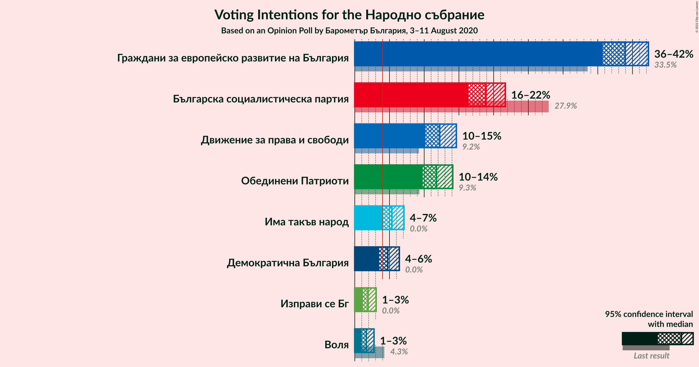

### Confidence Intervals

| Party | Last Result | Poll Result | 80% Confidence Interval | 90% Confidence Interval | 95% Confidence Interval | 99% Confidence Interval |
|:-----:|:-----------:|:-----------:|:-----------------------:|:-----------------------:|:-----------------------:|:-----------------------:|
| Граждани за европейско развитие на България | 33.5% | 39.0% | 36.8–41.2% |36.2–41.8% |35.7–42.3% |34.7–43.3% |
| Българска социалистическа партия | 27.9% | 18.9% | 17.2–20.7% |16.8–21.2% |16.4–21.7% |15.6–22.6% |
| Движение за права и свободи | 9.2% | 12.2% | 10.9–13.8% |10.5–14.2% |10.2–14.6% |9.6–15.4% |
| Обединени Патриоти | 9.3% | 11.8% | 10.4–13.3% |10.1–13.7% |9.8–14.1% |9.1–14.9% |
| Има такъв народ | 0.0% | 5.3% | 4.5–6.5% |4.2–6.8% |4.0–7.1% |3.6–7.7% |
| Демократична България | 0.0% | 4.8% | 3.9–5.8% |3.7–6.1% |3.5–6.4% |3.2–7.0% |
| Изправи се Бг | 0.0% | 1.9% | 1.4–2.7% |1.3–2.9% |1.2–3.1% |1.0–3.5% |
| Воля | 4.3% | 1.7% | 1.2–2.4% |1.1–2.6% |1.0–2.8% |0.8–3.2% |

*Note:* The poll result column reflects the actual value used in the calculations. Published results may vary slightly, and in addition be rounded to fewer digits.

## Seats

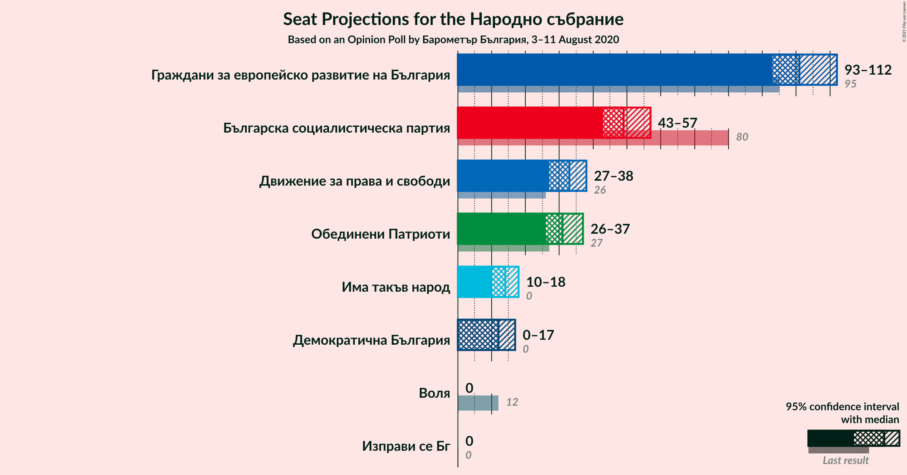

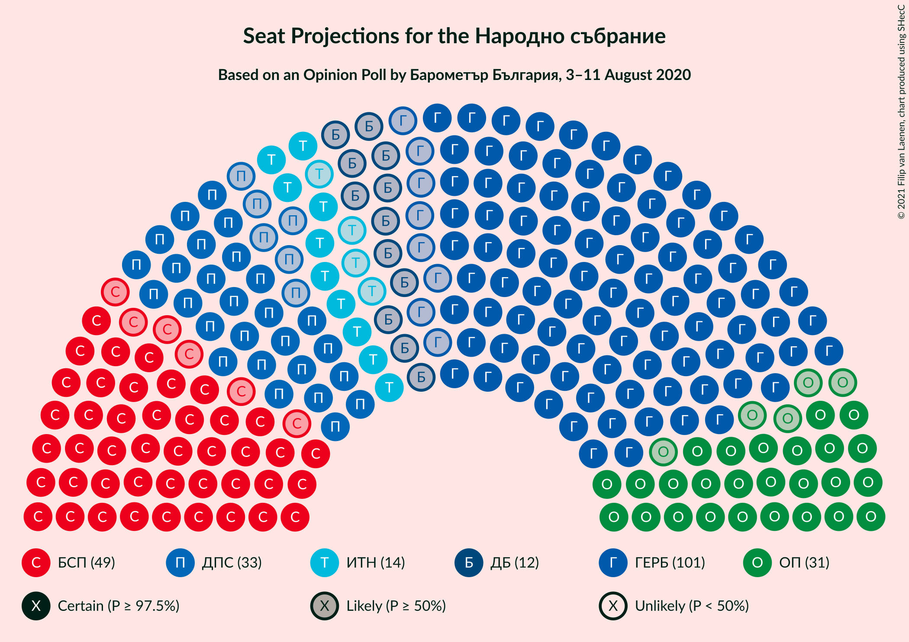

### Confidence Intervals

| Party | Last Result | Median | 80% Confidence Interval | 90% Confidence Interval | 95% Confidence Interval | 99% Confidence Interval |
|:-----:|:-----------:|:------:|:-----------------------:|:-----------------------:|:-----------------------:|:-----------------------:|
| <a href="#граждани-за-европейско-развитие-на-българия">Граждани за европейско развитие на България</a> | 95 | 101 | 96–108 |95–110 |93–112 |91–115 |
| <a href="#българска-социалистическа-партия">Българска социалистическа партия</a> | 80 | 49 | 45–54 |44–56 |43–57 |41–60 |
| <a href="#движение-за-права-и-свободи">Движение за права и свободи</a> | 26 | 33 | 29–36 |28–37 |27–38 |25–40 |
| <a href="#обединени-патриоти">Обединени Патриоти</a> | 27 | 31 | 27–35 |26–36 |26–37 |24–39 |
| <a href="#има-такъв-народ">Има такъв народ</a> | 0 | 14 | 12–17 |11–18 |10–18 |0–20 |
| <a href="#демократична-българия">Демократична България</a> | 0 | 12 | 0–15 |0–16 |0–17 |0–18 |
| <a href="#изправи-се-бг">Изправи се Бг</a> | 0 | 0 | 0 |0 |0 |0 |
| <a href="#воля">Воля</a> | 12 | 0 | 0 |0 |0 |0 |

### Граждани за европейско развитие на България

*For a full overview of the results for this party, see the [Граждани за европейско развитие на България](party-гражданизаевропейскоразвитиенабългария.html) page.*

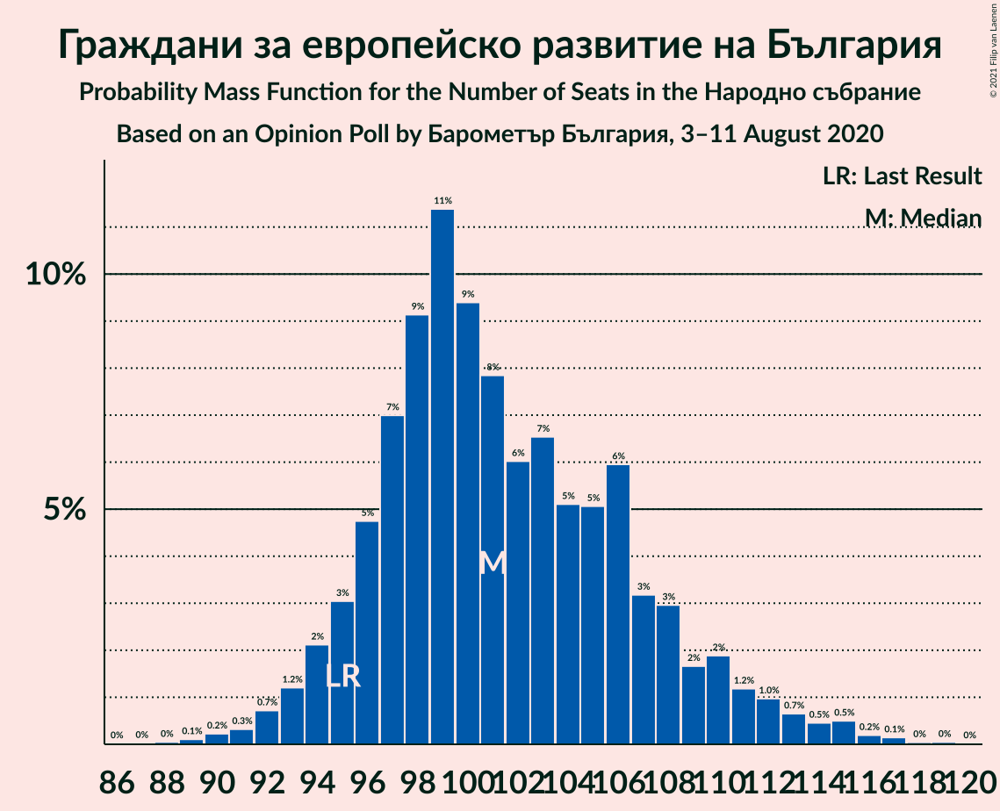

| Number of Seats | Probability | Accumulated | Special Marks |
|:---------------:|:-----------:|:-----------:|:-------------:|
| 87 | 0% | 100% |  |
| 88 | 0% | 99.9% |  |
| 89 | 0.1% | 99.9% |  |
| 90 | 0.2% | 99.8% |  |
| 91 | 0.3% | 99.6% |  |
| 92 | 0.7% | 99.2% |  |
| 93 | 1.2% | 98.5% |  |
| 94 | 2% | 97% |  |
| 95 | 3% | 95% | Last Result |
| 96 | 5% | 92% |  |
| 97 | 7% | 87% |  |
| 98 | 9% | 80% |  |
| 99 | 11% | 71% |  |
| 100 | 9% | 60% |  |
| 101 | 8% | 50% | Median |
| 102 | 6% | 43% |  |
| 103 | 7% | 37% |  |
| 104 | 5% | 30% |  |
| 105 | 5% | 25% |  |
| 106 | 6% | 20% |  |
| 107 | 3% | 14% |  |
| 108 | 3% | 11% |  |
| 109 | 2% | 8% |  |
| 110 | 2% | 6% |  |
| 111 | 1.2% | 4% |  |
| 112 | 1.0% | 3% |  |
| 113 | 0.7% | 2% |  |
| 114 | 0.5% | 1.4% |  |
| 115 | 0.5% | 1.0% |  |
| 116 | 0.2% | 0.5% |  |
| 117 | 0.1% | 0.3% |  |
| 118 | 0% | 0.1% |  |
| 119 | 0% | 0.1% |  |
| 120 | 0% | 0% |  |

### Българска социалистическа партия

*For a full overview of the results for this party, see the [Българска социалистическа партия](party-българскасоциалистическапартия.html) page.*

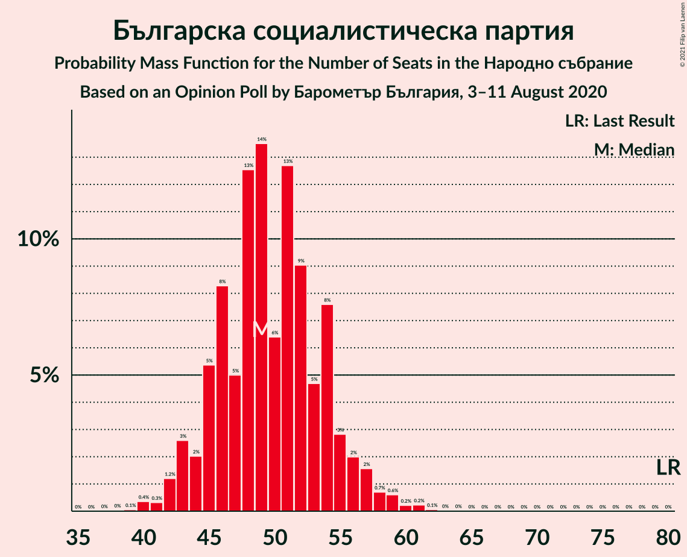

| Number of Seats | Probability | Accumulated | Special Marks |
|:---------------:|:-----------:|:-----------:|:-------------:|
| 38 | 0% | 100% |  |
| 39 | 0.1% | 99.9% |  |
| 40 | 0.4% | 99.9% |  |
| 41 | 0.3% | 99.5% |  |
| 42 | 1.2% | 99.2% |  |
| 43 | 3% | 98% |  |
| 44 | 2% | 95% |  |
| 45 | 5% | 93% |  |
| 46 | 8% | 88% |  |
| 47 | 5% | 80% |  |
| 48 | 13% | 75% |  |
| 49 | 14% | 62% | Median |
| 50 | 6% | 49% |  |
| 51 | 13% | 42% |  |
| 52 | 9% | 30% |  |
| 53 | 5% | 21% |  |
| 54 | 8% | 16% |  |
| 55 | 3% | 8% |  |
| 56 | 2% | 5% |  |
| 57 | 2% | 3% |  |
| 58 | 0.7% | 2% |  |
| 59 | 0.6% | 1.2% |  |
| 60 | 0.2% | 0.6% |  |
| 61 | 0.2% | 0.3% |  |
| 62 | 0.1% | 0.1% |  |
| 63 | 0% | 0.1% |  |
| 64 | 0% | 0% |  |
| 65 | 0% | 0% |  |
| 66 | 0% | 0% |  |
| 67 | 0% | 0% |  |
| 68 | 0% | 0% |  |
| 69 | 0% | 0% |  |
| 70 | 0% | 0% |  |
| 71 | 0% | 0% |  |
| 72 | 0% | 0% |  |
| 73 | 0% | 0% |  |
| 74 | 0% | 0% |  |
| 75 | 0% | 0% |  |
| 76 | 0% | 0% |  |
| 77 | 0% | 0% |  |
| 78 | 0% | 0% |  |
| 79 | 0% | 0% |  |
| 80 | 0% | 0% | Last Result |

### Движение за права и свободи

*For a full overview of the results for this party, see the [Движение за права и свободи](party-движениезаправаисвободи.html) page.*

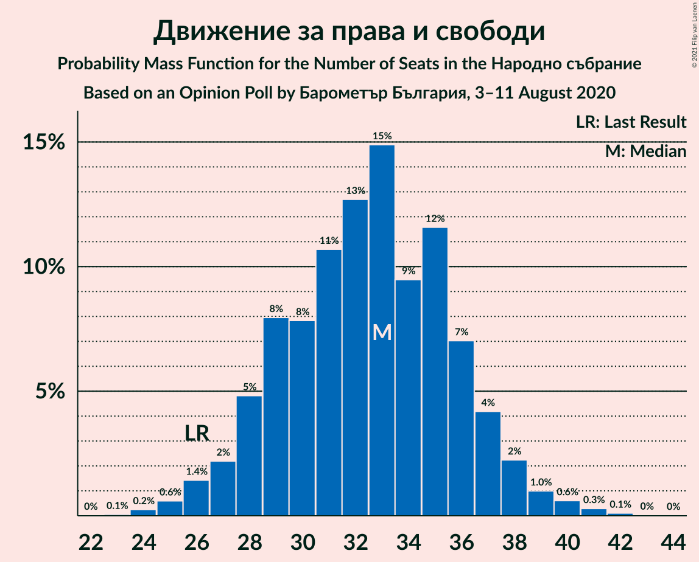

| Number of Seats | Probability | Accumulated | Special Marks |
|:---------------:|:-----------:|:-----------:|:-------------:|
| 23 | 0.1% | 100% |  |
| 24 | 0.2% | 99.9% |  |
| 25 | 0.6% | 99.7% |  |
| 26 | 1.4% | 99.1% | Last Result |
| 27 | 2% | 98% |  |
| 28 | 5% | 95% |  |
| 29 | 8% | 91% |  |
| 30 | 8% | 83% |  |
| 31 | 11% | 75% |  |
| 32 | 13% | 64% |  |
| 33 | 15% | 51% | Median |
| 34 | 9% | 37% |  |
| 35 | 12% | 27% |  |
| 36 | 7% | 16% |  |
| 37 | 4% | 8% |  |
| 38 | 2% | 4% |  |
| 39 | 1.0% | 2% |  |
| 40 | 0.6% | 1.1% |  |
| 41 | 0.3% | 0.5% |  |
| 42 | 0.1% | 0.2% |  |
| 43 | 0% | 0.1% |  |
| 44 | 0% | 0% |  |

### Обединени Патриоти

*For a full overview of the results for this party, see the [Обединени Патриоти](party-обединенипатриоти.html) page.*

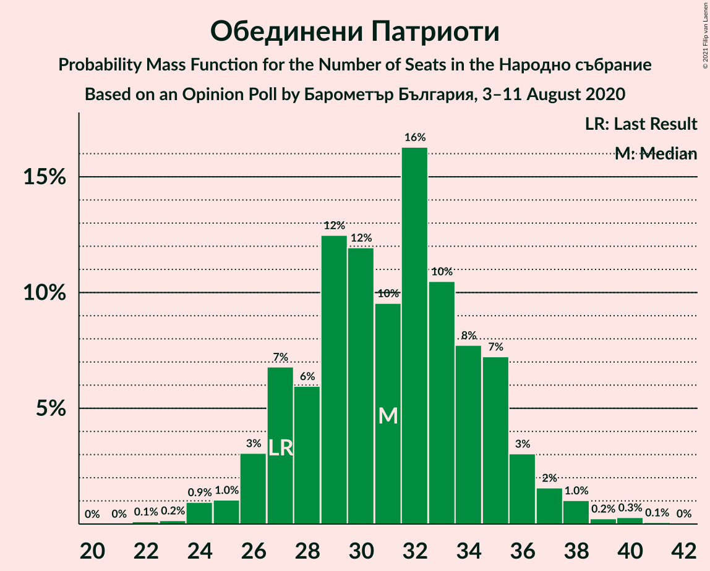

| Number of Seats | Probability | Accumulated | Special Marks |
|:---------------:|:-----------:|:-----------:|:-------------:|
| 22 | 0.1% | 100% |  |
| 23 | 0.2% | 99.9% |  |
| 24 | 0.9% | 99.7% |  |
| 25 | 1.0% | 98.8% |  |
| 26 | 3% | 98% |  |
| 27 | 7% | 95% | Last Result |
| 28 | 6% | 88% |  |
| 29 | 12% | 82% |  |
| 30 | 12% | 69% |  |
| 31 | 10% | 58% | Median |
| 32 | 16% | 48% |  |
| 33 | 10% | 32% |  |
| 34 | 8% | 21% |  |
| 35 | 7% | 13% |  |
| 36 | 3% | 6% |  |
| 37 | 2% | 3% |  |
| 38 | 1.0% | 2% |  |
| 39 | 0.2% | 0.6% |  |
| 40 | 0.3% | 0.4% |  |
| 41 | 0.1% | 0.1% |  |
| 42 | 0% | 0% |  |

### Има такъв народ

*For a full overview of the results for this party, see the [Има такъв народ](party-иматакъвнарод.html) page.*

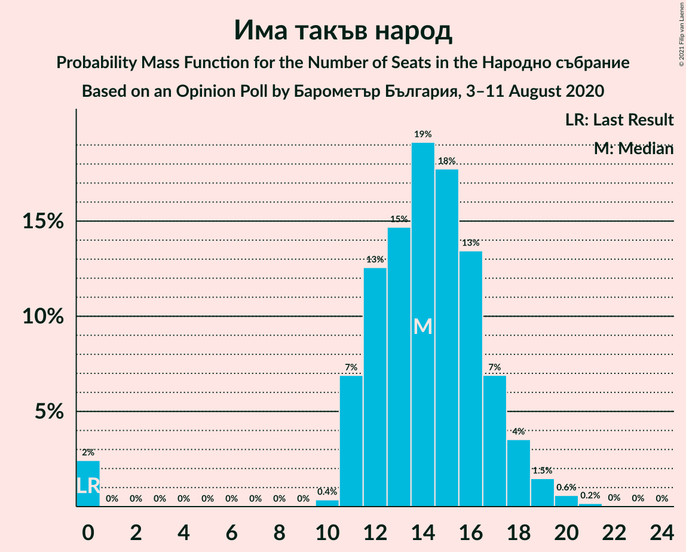

| Number of Seats | Probability | Accumulated | Special Marks |
|:---------------:|:-----------:|:-----------:|:-------------:|
| 0 | 2% | 100% | Last Result |
| 1 | 0% | 98% |  |
| 2 | 0% | 98% |  |
| 3 | 0% | 98% |  |
| 4 | 0% | 98% |  |
| 5 | 0% | 98% |  |
| 6 | 0% | 98% |  |
| 7 | 0% | 98% |  |
| 8 | 0% | 98% |  |
| 9 | 0% | 98% |  |
| 10 | 0.4% | 98% |  |
| 11 | 7% | 97% |  |
| 12 | 13% | 90% |  |
| 13 | 15% | 78% |  |
| 14 | 19% | 63% | Median |
| 15 | 18% | 44% |  |
| 16 | 13% | 26% |  |
| 17 | 7% | 13% |  |
| 18 | 4% | 6% |  |
| 19 | 1.5% | 2% |  |
| 20 | 0.6% | 0.8% |  |
| 21 | 0.2% | 0.2% |  |
| 22 | 0% | 0.1% |  |
| 23 | 0% | 0% |  |

### Демократична България

*For a full overview of the results for this party, see the [Демократична България](party-демократичнабългария.html) page.*

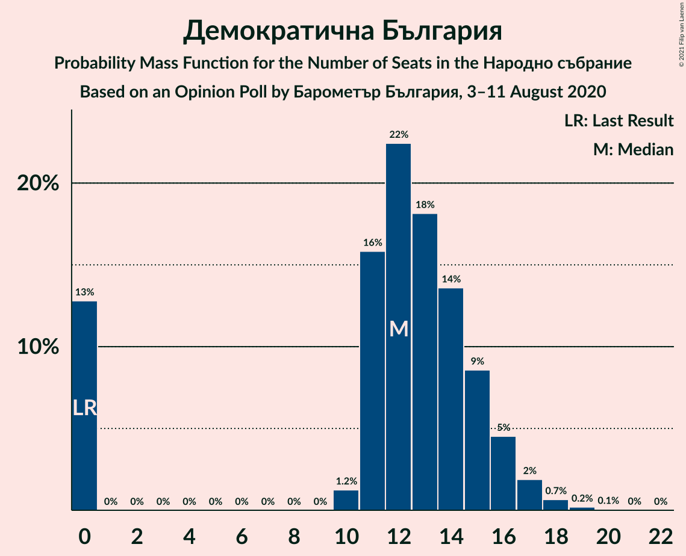

| Number of Seats | Probability | Accumulated | Special Marks |
|:---------------:|:-----------:|:-----------:|:-------------:|
| 0 | 13% | 100% | Last Result |
| 1 | 0% | 87% |  |
| 2 | 0% | 87% |  |
| 3 | 0% | 87% |  |
| 4 | 0% | 87% |  |
| 5 | 0% | 87% |  |
| 6 | 0% | 87% |  |
| 7 | 0% | 87% |  |
| 8 | 0% | 87% |  |
| 9 | 0% | 87% |  |
| 10 | 1.2% | 87% |  |
| 11 | 16% | 86% |  |
| 12 | 22% | 70% | Median |
| 13 | 18% | 48% |  |
| 14 | 14% | 30% |  |
| 15 | 9% | 16% |  |
| 16 | 5% | 7% |  |
| 17 | 2% | 3% |  |
| 18 | 0.7% | 0.9% |  |
| 19 | 0.2% | 0.3% |  |
| 20 | 0.1% | 0.1% |  |
| 21 | 0% | 0% |  |

### Изправи се Бг

*For a full overview of the results for this party, see the [Изправи се Бг](party-изправисебг.html) page.*

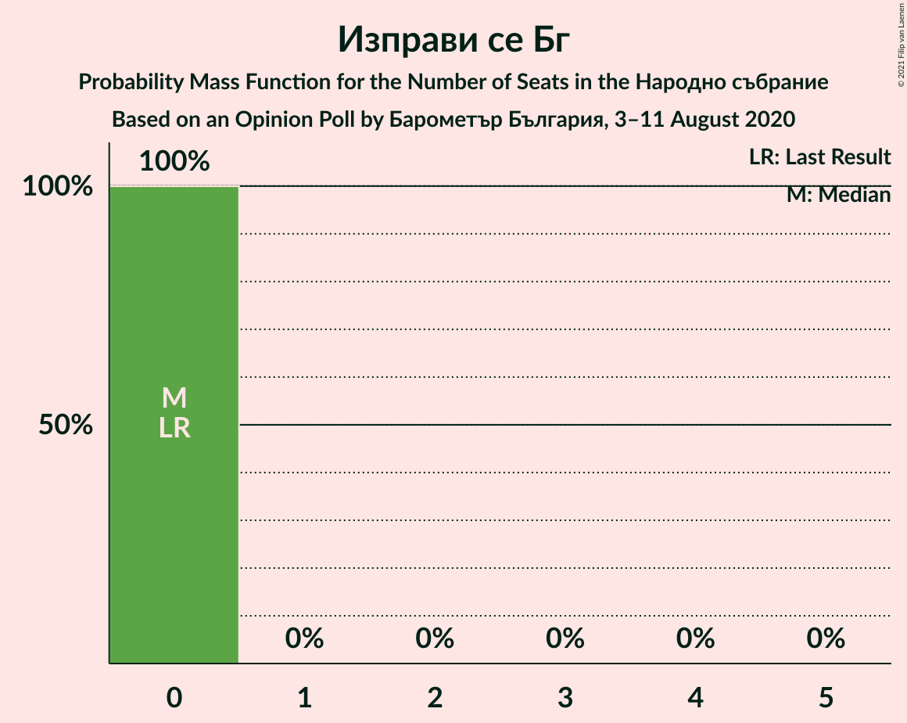

| Number of Seats | Probability | Accumulated | Special Marks |
|:---------------:|:-----------:|:-----------:|:-------------:|
| 0 | 100% | 100% | Last Result, Median |

### Воля

*For a full overview of the results for this party, see the [Воля](party-воля.html) page.*

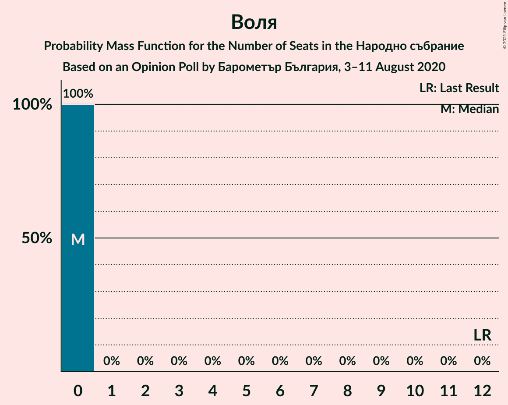

| Number of Seats | Probability | Accumulated | Special Marks |
|:---------------:|:-----------:|:-----------:|:-------------:|
| 0 | 100% | 100% | Median |
| 1 | 0% | 0% |  |
| 2 | 0% | 0% |  |
| 3 | 0% | 0% |  |
| 4 | 0% | 0% |  |
| 5 | 0% | 0% |  |
| 6 | 0% | 0% |  |
| 7 | 0% | 0% |  |
| 8 | 0% | 0% |  |
| 9 | 0% | 0% |  |
| 10 | 0% | 0% |  |
| 11 | 0% | 0% |  |
| 12 | 0% | 0% | Last Result |

## Coalitions

### Confidence Intervals

| Coalition | Last Result | Median | Majority? | 80% Confidence Interval | 90% Confidence Interval | 95% Confidence Interval | 99% Confidence Interval |
|:---------:|:-----------:|:------:|:---------:|:-----------------------:|:-----------------------:|:-----------------------:|:-----------------------:|
| Граждани за европейско развитие на България – Обединени Патриоти | 122 | 132 | 99.6% | 126–139 | 125–142 | 124–144 | 121–148 |
| Българска социалистическа партия – Движение за права и свободи – Има такъв народ – Изправи се Бг | 106 | 96 | 0% | 90–102 | 88–103 | 86–105 | 84–108 |
| Българска социалистическа партия – Движение за права и свободи – Има такъв народ | 106 | 96 | 0% | 90–102 | 88–103 | 86–105 | 84–108 |
| Българска социалистическа партия – Движение за права и свободи | 106 | 82 | 0% | 77–88 | 75–89 | 74–91 | 71–94 |
| Българска социалистическа партия – Движение за права и свободи – Изправи се Бг | 106 | 82 | 0% | 77–88 | 75–89 | 74–91 | 71–94 |

### Граждани за европейско развитие на България – Обединени Патриоти

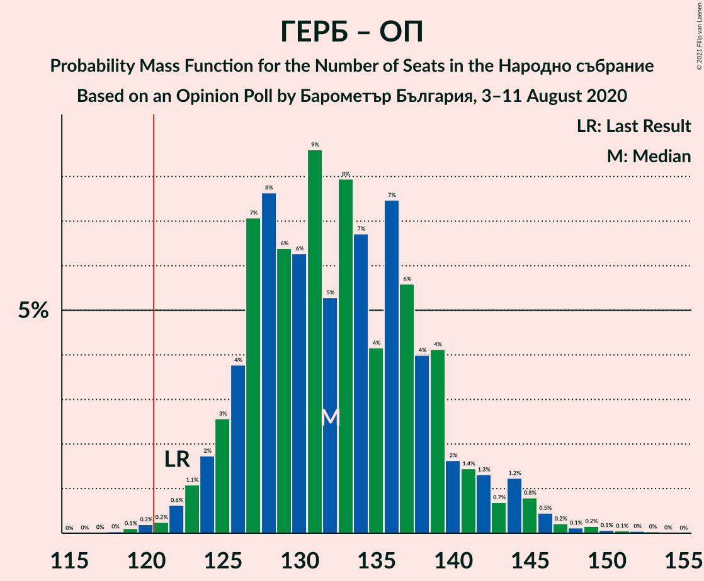

| Number of Seats | Probability | Accumulated | Special Marks |
|:---------------:|:-----------:|:-----------:|:-------------:|
| 118 | 0% | 100% |  |
| 119 | 0.1% | 99.9% |  |
| 120 | 0.2% | 99.8% |  |
| 121 | 0.2% | 99.6% | Majority |
| 122 | 0.6% | 99.4% | Last Result |
| 123 | 1.1% | 98.7% |  |
| 124 | 2% | 98% |  |
| 125 | 3% | 96% |  |
| 126 | 4% | 93% |  |
| 127 | 7% | 90% |  |
| 128 | 8% | 83% |  |
| 129 | 6% | 75% |  |
| 130 | 6% | 68% |  |
| 131 | 9% | 62% |  |
| 132 | 5% | 54% | Median |
| 133 | 8% | 48% |  |
| 134 | 7% | 40% |  |
| 135 | 4% | 34% |  |
| 136 | 7% | 29% |  |
| 137 | 6% | 22% |  |
| 138 | 4% | 16% |  |
| 139 | 4% | 12% |  |
| 140 | 2% | 8% |  |
| 141 | 1.4% | 7% |  |
| 142 | 1.3% | 5% |  |
| 143 | 0.7% | 4% |  |
| 144 | 1.2% | 3% |  |
| 145 | 0.8% | 2% |  |
| 146 | 0.5% | 1.2% |  |
| 147 | 0.2% | 0.7% |  |
| 148 | 0.1% | 0.5% |  |
| 149 | 0.2% | 0.4% |  |
| 150 | 0.1% | 0.2% |  |
| 151 | 0.1% | 0.2% |  |
| 152 | 0% | 0.1% |  |
| 153 | 0% | 0.1% |  |
| 154 | 0% | 0% |  |

### Българска социалистическа партия – Движение за права и свободи – Има такъв народ – Изправи се Бг

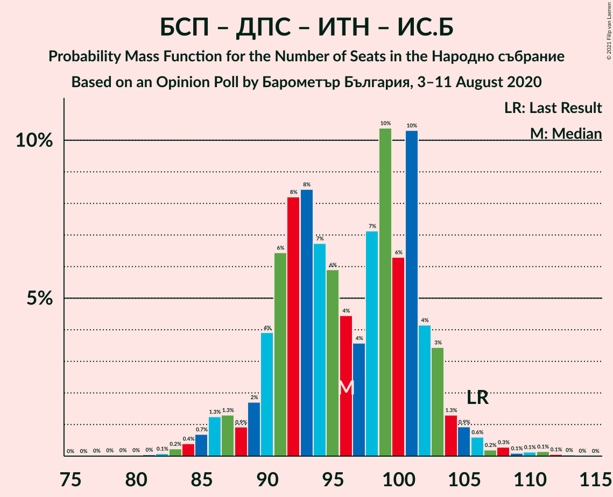

| Number of Seats | Probability | Accumulated | Special Marks |
|:---------------:|:-----------:|:-----------:|:-------------:|
| 78 | 0% | 100% |  |
| 79 | 0% | 99.9% |  |
| 80 | 0% | 99.9% |  |
| 81 | 0% | 99.9% |  |
| 82 | 0.1% | 99.8% |  |
| 83 | 0.2% | 99.7% |  |
| 84 | 0.4% | 99.5% |  |
| 85 | 0.7% | 99.1% |  |
| 86 | 1.3% | 98% |  |
| 87 | 1.3% | 97% |  |
| 88 | 0.9% | 96% |  |
| 89 | 2% | 95% |  |
| 90 | 4% | 93% |  |
| 91 | 6% | 89% |  |
| 92 | 8% | 83% |  |
| 93 | 8% | 75% |  |
| 94 | 7% | 66% |  |
| 95 | 6% | 59% |  |
| 96 | 4% | 54% | Median |
| 97 | 4% | 49% |  |
| 98 | 7% | 46% |  |
| 99 | 10% | 38% |  |
| 100 | 6% | 28% |  |
| 101 | 10% | 22% |  |
| 102 | 4% | 11% |  |
| 103 | 3% | 7% |  |
| 104 | 1.3% | 4% |  |
| 105 | 0.9% | 3% |  |
| 106 | 0.6% | 2% | Last Result |
| 107 | 0.2% | 1.0% |  |
| 108 | 0.3% | 0.8% |  |
| 109 | 0.1% | 0.5% |  |
| 110 | 0.1% | 0.4% |  |
| 111 | 0.1% | 0.3% |  |
| 112 | 0.1% | 0.1% |  |
| 113 | 0% | 0.1% |  |
| 114 | 0% | 0% |  |

### Българска социалистическа партия – Движение за права и свободи – Има такъв народ

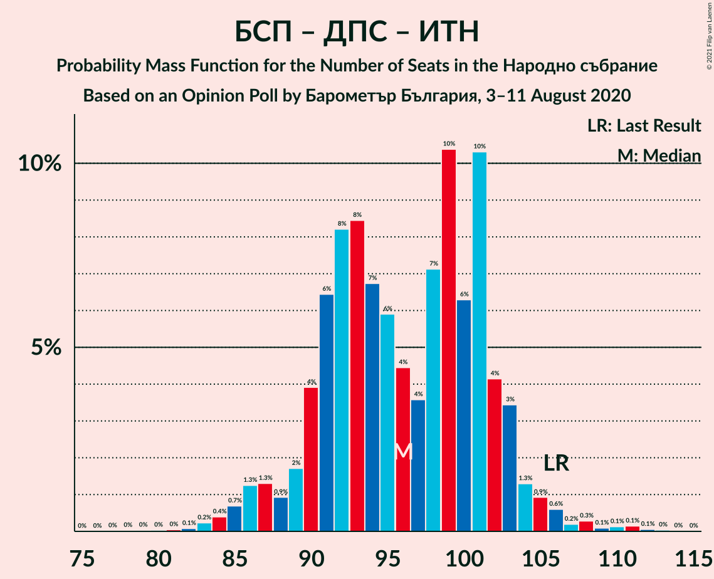

| Number of Seats | Probability | Accumulated | Special Marks |
|:---------------:|:-----------:|:-----------:|:-------------:|
| 78 | 0% | 100% |  |
| 79 | 0% | 99.9% |  |
| 80 | 0% | 99.9% |  |
| 81 | 0% | 99.9% |  |
| 82 | 0.1% | 99.8% |  |
| 83 | 0.2% | 99.7% |  |
| 84 | 0.4% | 99.5% |  |
| 85 | 0.7% | 99.1% |  |
| 86 | 1.3% | 98% |  |
| 87 | 1.3% | 97% |  |
| 88 | 0.9% | 96% |  |
| 89 | 2% | 95% |  |
| 90 | 4% | 93% |  |
| 91 | 6% | 89% |  |
| 92 | 8% | 83% |  |
| 93 | 8% | 75% |  |
| 94 | 7% | 66% |  |
| 95 | 6% | 59% |  |
| 96 | 4% | 54% | Median |
| 97 | 4% | 49% |  |
| 98 | 7% | 46% |  |
| 99 | 10% | 38% |  |
| 100 | 6% | 28% |  |
| 101 | 10% | 22% |  |
| 102 | 4% | 11% |  |
| 103 | 3% | 7% |  |
| 104 | 1.3% | 4% |  |
| 105 | 0.9% | 3% |  |
| 106 | 0.6% | 2% | Last Result |
| 107 | 0.2% | 1.0% |  |
| 108 | 0.3% | 0.8% |  |
| 109 | 0.1% | 0.5% |  |
| 110 | 0.1% | 0.4% |  |
| 111 | 0.1% | 0.3% |  |
| 112 | 0.1% | 0.1% |  |
| 113 | 0% | 0.1% |  |
| 114 | 0% | 0% |  |

### Българска социалистическа партия – Движение за права и свободи

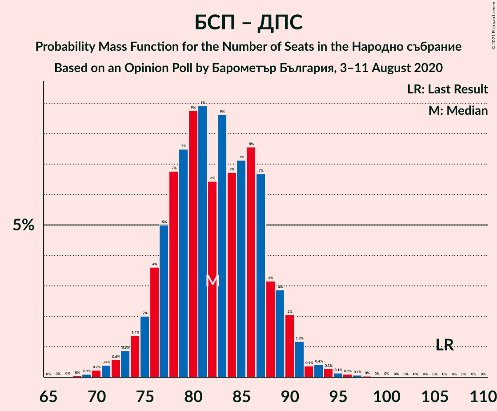

| Number of Seats | Probability | Accumulated | Special Marks |
|:---------------:|:-----------:|:-----------:|:-------------:|
| 68 | 0% | 100% |  |
| 69 | 0.1% | 99.9% |  |
| 70 | 0.2% | 99.8% |  |
| 71 | 0.4% | 99.6% |  |
| 72 | 0.6% | 99.2% |  |
| 73 | 0.9% | 98.6% |  |
| 74 | 1.4% | 98% |  |
| 75 | 2% | 96% |  |
| 76 | 4% | 94% |  |
| 77 | 5% | 91% |  |
| 78 | 7% | 86% |  |
| 79 | 7% | 79% |  |
| 80 | 9% | 72% |  |
| 81 | 9% | 63% |  |
| 82 | 6% | 54% | Median |
| 83 | 9% | 47% |  |
| 84 | 7% | 39% |  |
| 85 | 7% | 32% |  |
| 86 | 8% | 25% |  |
| 87 | 7% | 17% |  |
| 88 | 3% | 11% |  |
| 89 | 3% | 8% |  |
| 90 | 2% | 5% |  |
| 91 | 1.2% | 3% |  |
| 92 | 0.4% | 1.4% |  |
| 93 | 0.4% | 1.1% |  |
| 94 | 0.3% | 0.7% |  |
| 95 | 0.1% | 0.4% |  |
| 96 | 0.1% | 0.2% |  |
| 97 | 0.1% | 0.1% |  |
| 98 | 0% | 0.1% |  |
| 99 | 0% | 0% |  |
| 100 | 0% | 0% |  |
| 101 | 0% | 0% |  |
| 102 | 0% | 0% |  |
| 103 | 0% | 0% |  |
| 104 | 0% | 0% |  |
| 105 | 0% | 0% |  |
| 106 | 0% | 0% | Last Result |

### Българска социалистическа партия – Движение за права и свободи – Изправи се Бг

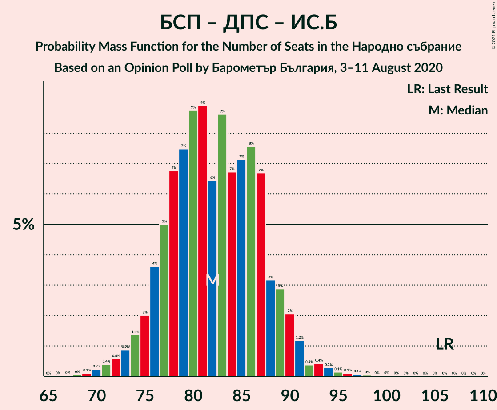

| Number of Seats | Probability | Accumulated | Special Marks |
|:---------------:|:-----------:|:-----------:|:-------------:|
| 68 | 0% | 100% |  |
| 69 | 0.1% | 99.9% |  |
| 70 | 0.2% | 99.8% |  |
| 71 | 0.4% | 99.6% |  |
| 72 | 0.6% | 99.2% |  |
| 73 | 0.9% | 98.6% |  |
| 74 | 1.4% | 98% |  |
| 75 | 2% | 96% |  |
| 76 | 4% | 94% |  |
| 77 | 5% | 91% |  |
| 78 | 7% | 86% |  |
| 79 | 7% | 79% |  |
| 80 | 9% | 72% |  |
| 81 | 9% | 63% |  |
| 82 | 6% | 54% | Median |
| 83 | 9% | 47% |  |
| 84 | 7% | 39% |  |
| 85 | 7% | 32% |  |
| 86 | 8% | 25% |  |
| 87 | 7% | 17% |  |
| 88 | 3% | 11% |  |
| 89 | 3% | 8% |  |
| 90 | 2% | 5% |  |
| 91 | 1.2% | 3% |  |
| 92 | 0.4% | 1.5% |  |
| 93 | 0.4% | 1.1% |  |
| 94 | 0.3% | 0.7% |  |
| 95 | 0.1% | 0.4% |  |
| 96 | 0.1% | 0.2% |  |
| 97 | 0.1% | 0.1% |  |
| 98 | 0% | 0.1% |  |
| 99 | 0% | 0% |  |
| 100 | 0% | 0% |  |
| 101 | 0% | 0% |  |
| 102 | 0% | 0% |  |
| 103 | 0% | 0% |  |
| 104 | 0% | 0% |  |
| 105 | 0% | 0% |  |
| 106 | 0% | 0% | Last Result |

## Technical Information

### Opinion Poll

+ **Polling firm:** Барометър България
+ **Commissioner(s):** —
+ **Fieldwork period:** 3–11 August 2020

### Calculations

+ **Sample size:** 842
+ **Simulations done:** 1,048,576
+ **Error estimate:** 1.05%

