# Opinion Poll by Gallup International, 3–11 September 2020

<a href="#voting-intentions">Voting Intentions</a> | <a href="#seats">Seats</a> | <a href="#coalitions">Coalitions</a> | <a href="#technical-information">Technical Information</a>

## Voting Intentions

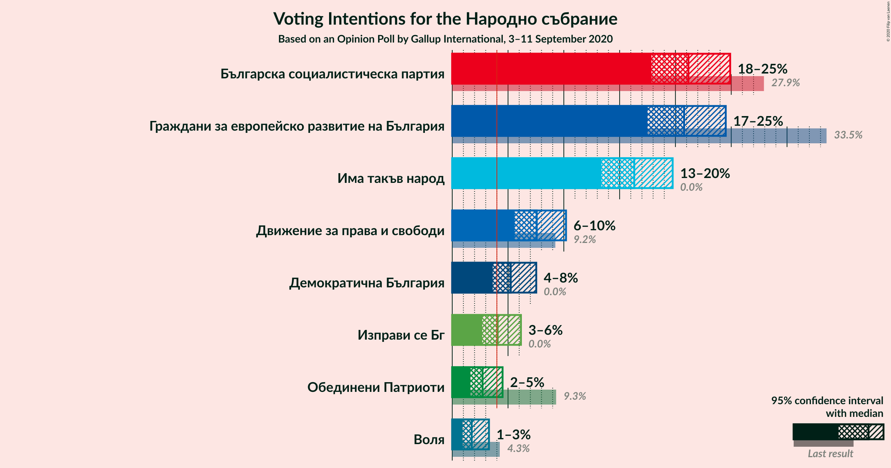

### Confidence Intervals

| Party | Last Result | Poll Result | 80% Confidence Interval | 90% Confidence Interval | 95% Confidence Interval | 99% Confidence Interval |
|:-----:|:-----------:|:-----------:|:-----------------------:|:-----------------------:|:-----------------------:|:-----------------------:|
| Българска социалистическа партия | 27.9% | 21.2% | 19.0–23.6% |18.4–24.3% |17.8–24.9% |16.9–26.1% |
| Граждани за европейско развитие на България | 33.5% | 20.8% | 18.6–23.2% |18.0–23.9% |17.5–24.5% |16.5–25.7% |
| Има такъв народ | 0.0% | 16.3% | 14.4–18.6% |13.8–19.2% |13.4–19.8% |12.5–20.9% |
| Движение за права и свободи | 9.2% | 7.6% | 6.3–9.3% |5.9–9.8% |5.6–10.2% |5.0–11.1% |
| Демократична България | 0.0% | 5.2% | 4.2–6.7% |3.9–7.1% |3.6–7.5% |3.2–8.3% |
| Изправи се Бг | 0.0% | 4.1% | 3.2–5.4% |2.9–5.8% |2.7–6.2% |2.3–6.9% |
| Обединени Патриоти | 9.3% | 2.7% | 2.0–3.9% |1.8–4.2% |1.6–4.5% |1.3–5.1% |
| Воля | 4.3% | 1.7% | 1.2–2.7% |1.1–3.0% |0.9–3.3% |0.7–3.8% |

*Note:* The poll result column reflects the actual value used in the calculations. Published results may vary slightly, and in addition be rounded to fewer digits.

## Seats

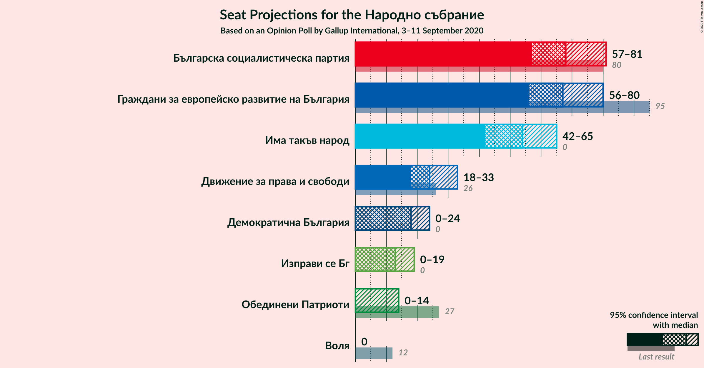

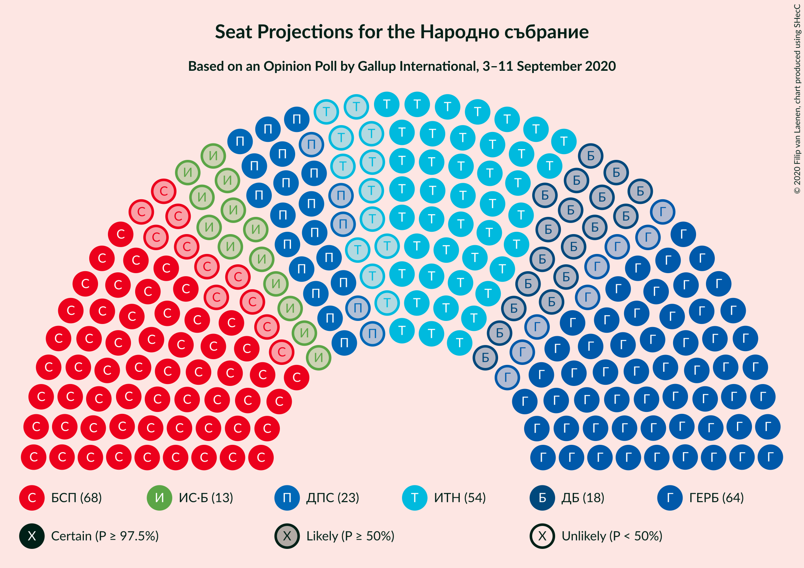

### Confidence Intervals

| Party | Last Result | Median | 80% Confidence Interval | 90% Confidence Interval | 95% Confidence Interval | 99% Confidence Interval |
|:-----:|:-----------:|:------:|:-----------------------:|:-----------------------:|:-----------------------:|:-----------------------:|
| <a href="#българска-социалистическа-партия">Българска социалистическа партия</a> | 80 | 68 | 61–77 |59–77 |57–81 |54–85 |
| <a href="#граждани-за-европейско-развитие-на-българия">Граждани за европейско развитие на България</a> | 95 | 67 | 60–76 |57–77 |56–80 |53–84 |
| <a href="#има-такъв-народ">Има такъв народ</a> | 0 | 54 | 46–59 |45–61 |42–65 |40–69 |
| <a href="#движение-за-права-и-свободи">Движение за права и свободи</a> | 26 | 24 | 20–30 |19–32 |18–33 |16–36 |
| <a href="#демократична-българия">Демократична България</a> | 0 | 18 | 13–22 |0–23 |0–24 |0–26 |
| <a href="#изправи-се-бг">Изправи се Бг</a> | 0 | 13 | 0–17 |0–19 |0–19 |0–21 |
| <a href="#обединени-патриоти">Обединени Патриоти</a> | 27 | 0 | 0 |0–13 |0–14 |0–16 |
| <a href="#воля">Воля</a> | 12 | 0 | 0 |0 |0 |0 |

### Българска социалистическа партия

*For a full overview of the results for this party, see the [Българска социалистическа партия](party-българскасоциалистическапартия.html) page.*

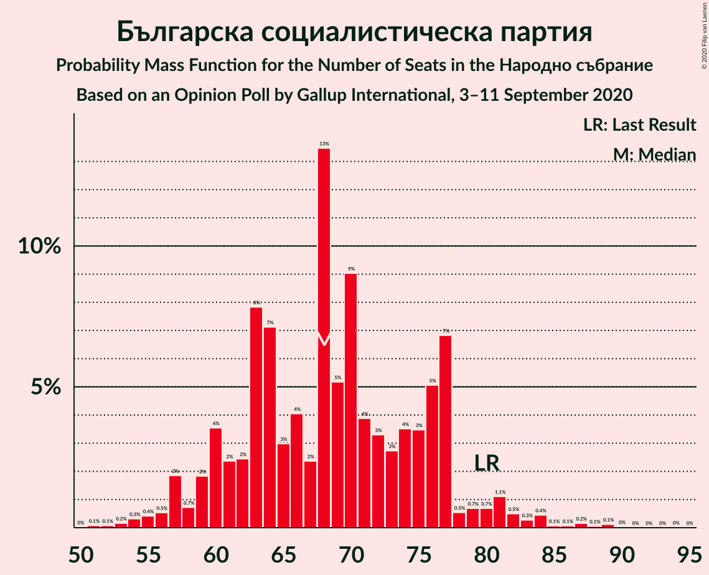

| Number of Seats | Probability | Accumulated | Special Marks |
|:---------------:|:-----------:|:-----------:|:-------------:|
| 51 | 0.1% | 100% |  |
| 52 | 0.1% | 99.9% |  |
| 53 | 0.2% | 99.8% |  |
| 54 | 0.3% | 99.6% |  |
| 55 | 0.4% | 99.3% |  |
| 56 | 0.5% | 98.9% |  |
| 57 | 2% | 98% |  |
| 58 | 0.7% | 97% |  |
| 59 | 2% | 96% |  |
| 60 | 4% | 94% |  |
| 61 | 2% | 90% |  |
| 62 | 2% | 88% |  |
| 63 | 8% | 86% |  |
| 64 | 7% | 78% |  |
| 65 | 3% | 71% |  |
| 66 | 4% | 68% |  |
| 67 | 2% | 64% |  |
| 68 | 13% | 61% | Median |
| 69 | 5% | 48% |  |
| 70 | 9% | 43% |  |
| 71 | 4% | 34% |  |
| 72 | 3% | 30% |  |
| 73 | 3% | 26% |  |
| 74 | 4% | 24% |  |
| 75 | 3% | 20% |  |
| 76 | 5% | 17% |  |
| 77 | 7% | 12% |  |
| 78 | 0.5% | 5% |  |
| 79 | 0.7% | 4% |  |
| 80 | 0.7% | 4% | Last Result |
| 81 | 1.1% | 3% |  |
| 82 | 0.5% | 2% |  |
| 83 | 0.3% | 1.3% |  |
| 84 | 0.4% | 1.0% |  |
| 85 | 0.1% | 0.5% |  |
| 86 | 0.1% | 0.5% |  |
| 87 | 0.2% | 0.4% |  |
| 88 | 0.1% | 0.2% |  |
| 89 | 0.1% | 0.2% |  |
| 90 | 0% | 0.1% |  |
| 91 | 0% | 0% |  |

### Граждани за европейско развитие на България

*For a full overview of the results for this party, see the [Граждани за европейско развитие на България](party-гражданизаевропейскоразвитиенабългария.html) page.*

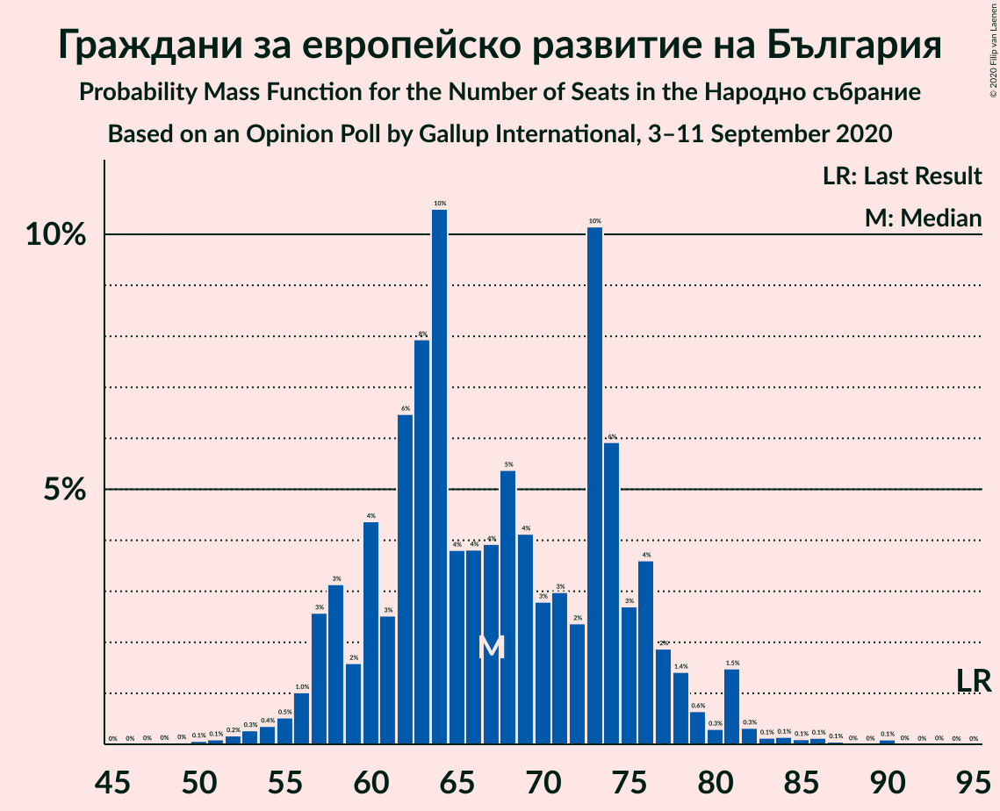

| Number of Seats | Probability | Accumulated | Special Marks |
|:---------------:|:-----------:|:-----------:|:-------------:|
| 49 | 0% | 100% |  |
| 50 | 0.1% | 99.9% |  |
| 51 | 0.1% | 99.9% |  |
| 52 | 0.2% | 99.8% |  |
| 53 | 0.3% | 99.6% |  |
| 54 | 0.4% | 99.3% |  |
| 55 | 0.5% | 99.0% |  |
| 56 | 1.0% | 98% |  |
| 57 | 3% | 97% |  |
| 58 | 3% | 95% |  |
| 59 | 2% | 92% |  |
| 60 | 4% | 90% |  |
| 61 | 3% | 86% |  |
| 62 | 6% | 83% |  |
| 63 | 8% | 77% |  |
| 64 | 10% | 69% |  |
| 65 | 4% | 58% |  |
| 66 | 4% | 55% |  |
| 67 | 4% | 51% | Median |
| 68 | 5% | 47% |  |
| 69 | 4% | 41% |  |
| 70 | 3% | 37% |  |
| 71 | 3% | 34% |  |
| 72 | 2% | 31% |  |
| 73 | 10% | 29% |  |
| 74 | 6% | 19% |  |
| 75 | 3% | 13% |  |
| 76 | 4% | 10% |  |
| 77 | 2% | 7% |  |
| 78 | 1.4% | 5% |  |
| 79 | 0.6% | 3% |  |
| 80 | 0.3% | 3% |  |
| 81 | 1.5% | 2% |  |
| 82 | 0.3% | 1.0% |  |
| 83 | 0.1% | 0.7% |  |
| 84 | 0.1% | 0.6% |  |
| 85 | 0.1% | 0.4% |  |
| 86 | 0.1% | 0.3% |  |
| 87 | 0.1% | 0.2% |  |
| 88 | 0% | 0.1% |  |
| 89 | 0% | 0.1% |  |
| 90 | 0.1% | 0.1% |  |
| 91 | 0% | 0% |  |
| 92 | 0% | 0% |  |
| 93 | 0% | 0% |  |
| 94 | 0% | 0% |  |
| 95 | 0% | 0% | Last Result |

### Има такъв народ

*For a full overview of the results for this party, see the [Има такъв народ](party-иматакъвнарод.html) page.*

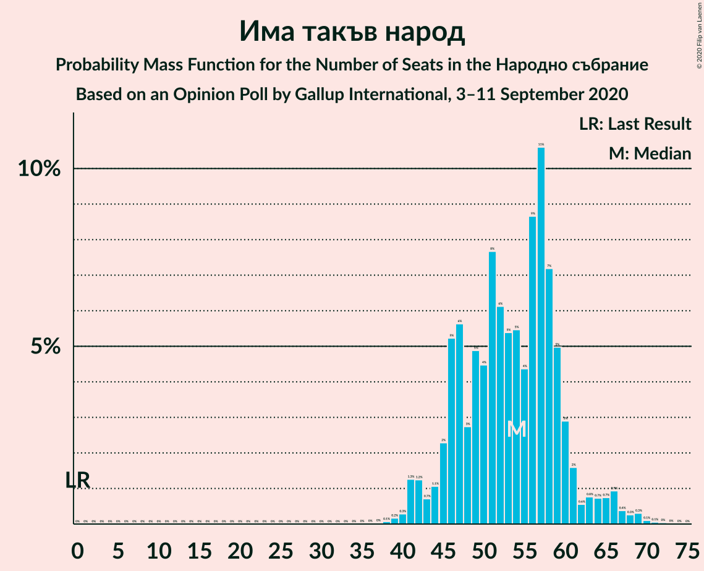

| Number of Seats | Probability | Accumulated | Special Marks |
|:---------------:|:-----------:|:-----------:|:-------------:|
| 0 | 0% | 100% | Last Result |
| 1 | 0% | 100% |  |
| 2 | 0% | 100% |  |
| 3 | 0% | 100% |  |
| 4 | 0% | 100% |  |
| 5 | 0% | 100% |  |
| 6 | 0% | 100% |  |
| 7 | 0% | 100% |  |
| 8 | 0% | 100% |  |
| 9 | 0% | 100% |  |
| 10 | 0% | 100% |  |
| 11 | 0% | 100% |  |
| 12 | 0% | 100% |  |
| 13 | 0% | 100% |  |
| 14 | 0% | 100% |  |
| 15 | 0% | 100% |  |
| 16 | 0% | 100% |  |
| 17 | 0% | 100% |  |
| 18 | 0% | 100% |  |
| 19 | 0% | 100% |  |
| 20 | 0% | 100% |  |
| 21 | 0% | 100% |  |
| 22 | 0% | 100% |  |
| 23 | 0% | 100% |  |
| 24 | 0% | 100% |  |
| 25 | 0% | 100% |  |
| 26 | 0% | 100% |  |
| 27 | 0% | 100% |  |
| 28 | 0% | 100% |  |
| 29 | 0% | 100% |  |
| 30 | 0% | 100% |  |
| 31 | 0% | 100% |  |
| 32 | 0% | 100% |  |
| 33 | 0% | 100% |  |
| 34 | 0% | 100% |  |
| 35 | 0% | 100% |  |
| 36 | 0% | 100% |  |
| 37 | 0% | 100% |  |
| 38 | 0.1% | 99.9% |  |
| 39 | 0.2% | 99.9% |  |
| 40 | 0.3% | 99.7% |  |
| 41 | 1.3% | 99.4% |  |
| 42 | 1.2% | 98% |  |
| 43 | 0.7% | 97% |  |
| 44 | 1.1% | 96% |  |
| 45 | 2% | 95% |  |
| 46 | 5% | 93% |  |
| 47 | 6% | 88% |  |
| 48 | 3% | 82% |  |
| 49 | 5% | 79% |  |
| 50 | 4% | 74% |  |
| 51 | 8% | 70% |  |
| 52 | 6% | 62% |  |
| 53 | 5% | 56% |  |
| 54 | 5% | 51% | Median |
| 55 | 4% | 45% |  |
| 56 | 9% | 41% |  |
| 57 | 11% | 32% |  |
| 58 | 7% | 22% |  |
| 59 | 5% | 14% |  |
| 60 | 3% | 9% |  |
| 61 | 2% | 7% |  |
| 62 | 0.6% | 5% |  |
| 63 | 0.8% | 4% |  |
| 64 | 0.7% | 4% |  |
| 65 | 0.7% | 3% |  |
| 66 | 0.9% | 2% |  |
| 67 | 0.4% | 1.2% |  |
| 68 | 0.3% | 0.8% |  |
| 69 | 0.3% | 0.5% |  |
| 70 | 0.1% | 0.2% |  |
| 71 | 0.1% | 0.1% |  |
| 72 | 0% | 0.1% |  |
| 73 | 0% | 0% |  |

### Движение за права и свободи

*For a full overview of the results for this party, see the [Движение за права и свободи](party-движениезаправаисвободи.html) page.*

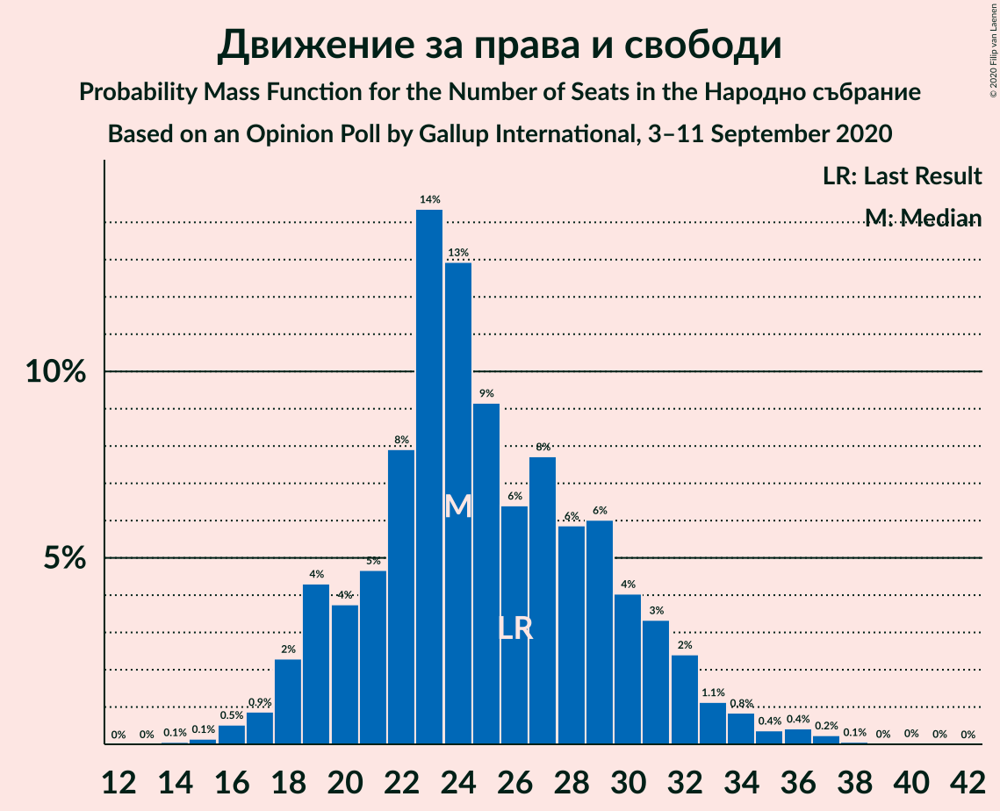

| Number of Seats | Probability | Accumulated | Special Marks |
|:---------------:|:-----------:|:-----------:|:-------------:|
| 14 | 0.1% | 100% |  |
| 15 | 0.1% | 99.9% |  |
| 16 | 0.5% | 99.8% |  |
| 17 | 0.9% | 99.2% |  |
| 18 | 2% | 98% |  |
| 19 | 4% | 96% |  |
| 20 | 4% | 92% |  |
| 21 | 5% | 88% |  |
| 22 | 8% | 83% |  |
| 23 | 14% | 75% |  |
| 24 | 13% | 61% | Median |
| 25 | 9% | 48% |  |
| 26 | 6% | 39% | Last Result |
| 27 | 8% | 33% |  |
| 28 | 6% | 25% |  |
| 29 | 6% | 19% |  |
| 30 | 4% | 13% |  |
| 31 | 3% | 9% |  |
| 32 | 2% | 6% |  |
| 33 | 1.1% | 3% |  |
| 34 | 0.8% | 2% |  |
| 35 | 0.4% | 1.2% |  |
| 36 | 0.4% | 0.8% |  |
| 37 | 0.2% | 0.4% |  |
| 38 | 0.1% | 0.1% |  |
| 39 | 0% | 0.1% |  |
| 40 | 0% | 0.1% |  |
| 41 | 0% | 0% |  |

### Демократична България

*For a full overview of the results for this party, see the [Демократична България](party-демократичнабългария.html) page.*

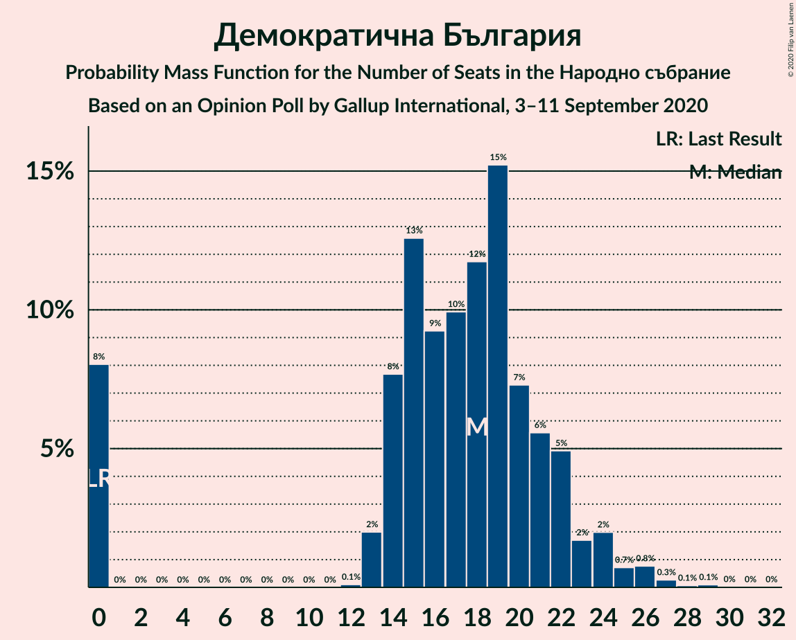

| Number of Seats | Probability | Accumulated | Special Marks |
|:---------------:|:-----------:|:-----------:|:-------------:|
| 0 | 8% | 100% | Last Result |
| 1 | 0% | 92% |  |
| 2 | 0% | 92% |  |
| 3 | 0% | 92% |  |
| 4 | 0% | 92% |  |
| 5 | 0% | 92% |  |
| 6 | 0% | 92% |  |
| 7 | 0% | 92% |  |
| 8 | 0% | 92% |  |
| 9 | 0% | 92% |  |
| 10 | 0% | 92% |  |
| 11 | 0% | 92% |  |
| 12 | 0.1% | 92% |  |
| 13 | 2% | 92% |  |
| 14 | 8% | 90% |  |
| 15 | 13% | 82% |  |
| 16 | 9% | 70% |  |
| 17 | 10% | 60% |  |
| 18 | 12% | 50% | Median |
| 19 | 15% | 39% |  |
| 20 | 7% | 23% |  |
| 21 | 6% | 16% |  |
| 22 | 5% | 11% |  |
| 23 | 2% | 6% |  |
| 24 | 2% | 4% |  |
| 25 | 0.7% | 2% |  |
| 26 | 0.8% | 1.3% |  |
| 27 | 0.3% | 0.5% |  |
| 28 | 0.1% | 0.2% |  |
| 29 | 0.1% | 0.1% |  |
| 30 | 0% | 0.1% |  |
| 31 | 0% | 0% |  |

### Изправи се Бг

*For a full overview of the results for this party, see the [Изправи се Бг](party-изправисебг.html) page.*

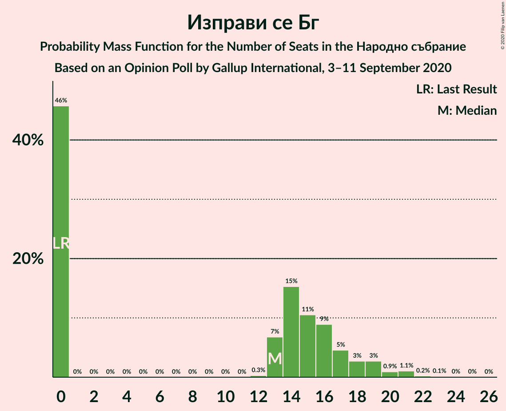

| Number of Seats | Probability | Accumulated | Special Marks |
|:---------------:|:-----------:|:-----------:|:-------------:|
| 0 | 46% | 100% | Last Result |
| 1 | 0% | 54% |  |
| 2 | 0% | 54% |  |
| 3 | 0% | 54% |  |
| 4 | 0% | 54% |  |
| 5 | 0% | 54% |  |
| 6 | 0% | 54% |  |
| 7 | 0% | 54% |  |
| 8 | 0% | 54% |  |
| 9 | 0% | 54% |  |
| 10 | 0% | 54% |  |
| 11 | 0% | 54% |  |
| 12 | 0.3% | 54% |  |
| 13 | 7% | 54% | Median |
| 14 | 15% | 47% |  |
| 15 | 11% | 32% |  |
| 16 | 9% | 21% |  |
| 17 | 5% | 12% |  |
| 18 | 3% | 8% |  |
| 19 | 3% | 5% |  |
| 20 | 0.9% | 2% |  |
| 21 | 1.1% | 2% |  |
| 22 | 0.2% | 0.5% |  |
| 23 | 0.1% | 0.2% |  |
| 24 | 0% | 0.1% |  |
| 25 | 0% | 0.1% |  |
| 26 | 0% | 0% |  |

### Обединени Патриоти

*For a full overview of the results for this party, see the [Обединени Патриоти](party-обединенипатриоти.html) page.*

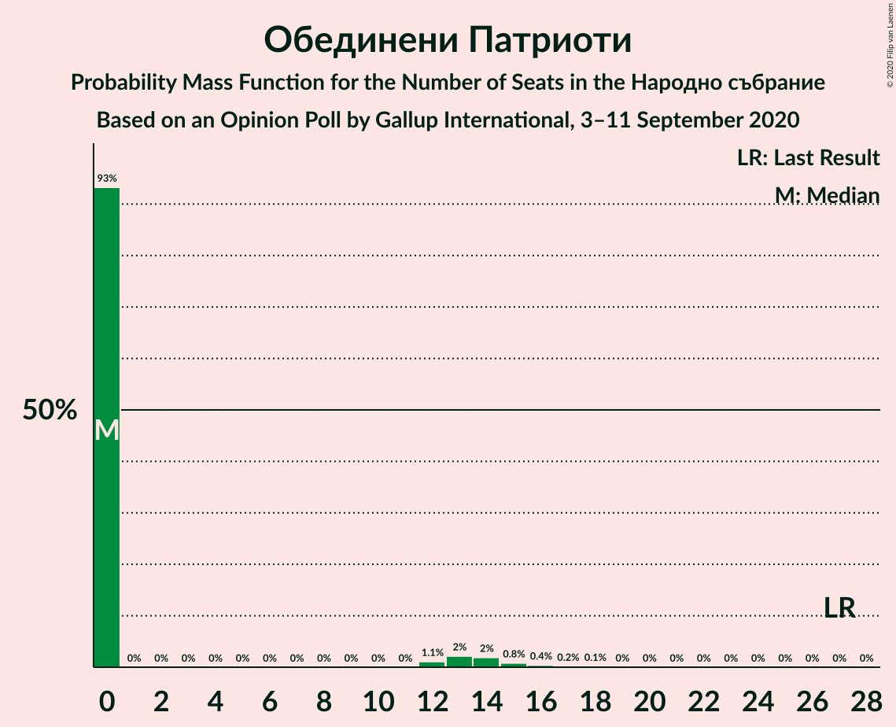

| Number of Seats | Probability | Accumulated | Special Marks |
|:---------------:|:-----------:|:-----------:|:-------------:|
| 0 | 93% | 100% | Median |
| 1 | 0% | 7% |  |
| 2 | 0% | 7% |  |
| 3 | 0% | 7% |  |
| 4 | 0% | 7% |  |
| 5 | 0% | 7% |  |
| 6 | 0% | 7% |  |
| 7 | 0% | 7% |  |
| 8 | 0% | 7% |  |
| 9 | 0% | 7% |  |
| 10 | 0% | 7% |  |
| 11 | 0% | 7% |  |
| 12 | 1.1% | 7% |  |
| 13 | 2% | 6% |  |
| 14 | 2% | 3% |  |
| 15 | 0.8% | 2% |  |
| 16 | 0.4% | 0.7% |  |
| 17 | 0.2% | 0.3% |  |
| 18 | 0.1% | 0.2% |  |
| 19 | 0% | 0% |  |
| 20 | 0% | 0% |  |
| 21 | 0% | 0% |  |
| 22 | 0% | 0% |  |
| 23 | 0% | 0% |  |
| 24 | 0% | 0% |  |
| 25 | 0% | 0% |  |
| 26 | 0% | 0% |  |
| 27 | 0% | 0% | Last Result |

### Воля

*For a full overview of the results for this party, see the [Воля](party-воля.html) page.*

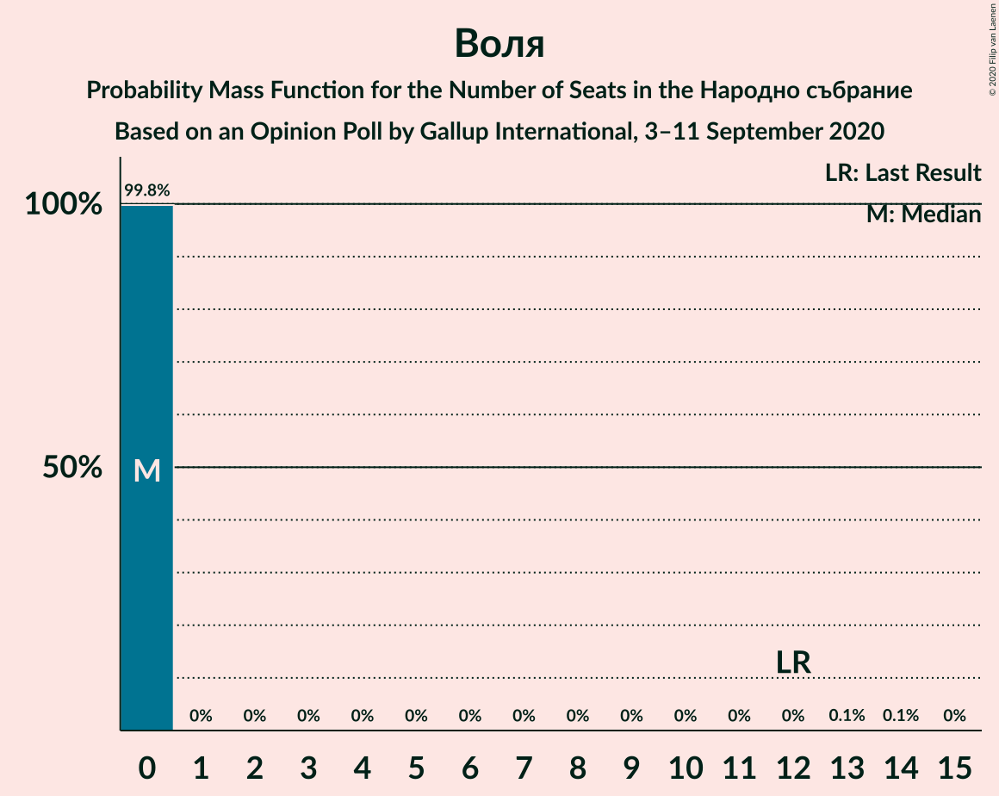

| Number of Seats | Probability | Accumulated | Special Marks |
|:---------------:|:-----------:|:-----------:|:-------------:|
| 0 | 99.8% | 100% | Median |
| 1 | 0% | 0.2% |  |
| 2 | 0% | 0.2% |  |
| 3 | 0% | 0.2% |  |
| 4 | 0% | 0.2% |  |
| 5 | 0% | 0.2% |  |
| 6 | 0% | 0.2% |  |
| 7 | 0% | 0.2% |  |
| 8 | 0% | 0.2% |  |
| 9 | 0% | 0.2% |  |
| 10 | 0% | 0.2% |  |
| 11 | 0% | 0.2% |  |
| 12 | 0% | 0.2% | Last Result |
| 13 | 0.1% | 0.2% |  |
| 14 | 0.1% | 0.1% |  |
| 15 | 0% | 0% |  |

## Coalitions

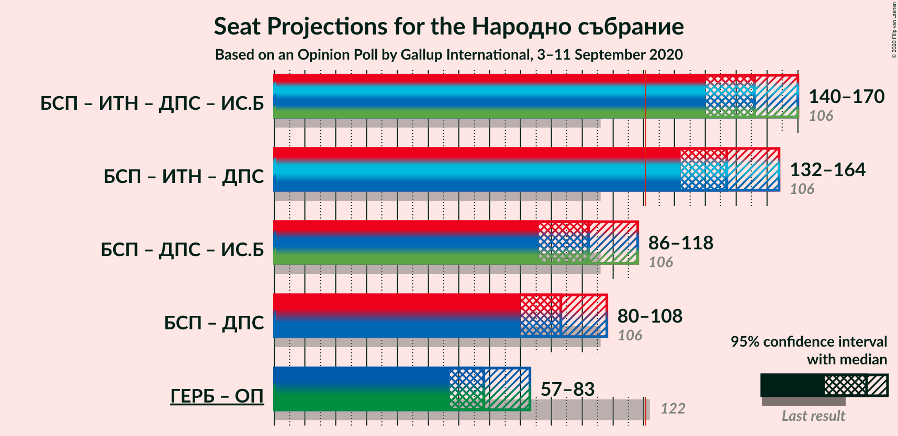

### Confidence Intervals

| Coalition | Last Result | Median | Majority? | 80% Confidence Interval | 90% Confidence Interval | 95% Confidence Interval | 99% Confidence Interval |
|:---------:|:-----------:|:------:|:---------:|:-----------------------:|:-----------------------:|:-----------------------:|:-----------------------:|
| Българска социалистическа партия – Има такъв народ – Движение за права и свободи – Изправи се Бг | 106 | 156 | 100% | 145–165 | 143–168 | 140–170 | 135–175 |
| Българска социалистическа партия – Има такъв народ – Движение за права и свободи | 106 | 147 | 100% | 137–158 | 134–160 | 132–164 | 126–173 |
| Българска социалистическа партия – Движение за права и свободи – Изправи се Бг | 106 | 102 | 1.0% | 91–113 | 90–115 | 86–118 | 82–122 |
| Българска социалистическа партия – Движение за права и свободи | 106 | 93 | 0% | 86–103 | 83–105 | 80–108 | 77–113 |
| Граждани за европейско развитие на България – Обединени Патриоти | 122 | 68 | 0% | 60–77 | 58–80 | 57–83 | 53–87 |

### Българска социалистическа партия – Има такъв народ – Движение за права и свободи – Изправи се Бг

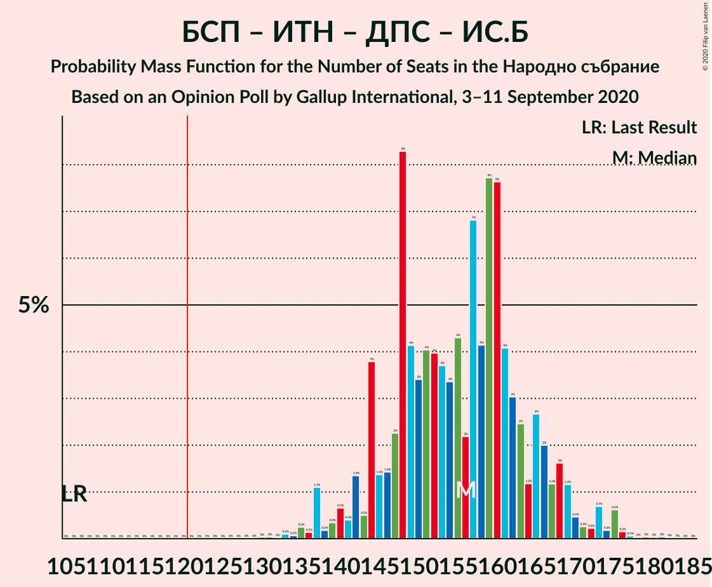

| Number of Seats | Probability | Accumulated | Special Marks |
|:---------------:|:-----------:|:-----------:|:-------------:|
| 106 | 0% | 100% | Last Result |
| 107 | 0% | 100% |  |
| 108 | 0% | 100% |  |
| 109 | 0% | 100% |  |
| 110 | 0% | 100% |  |
| 111 | 0% | 100% |  |
| 112 | 0% | 100% |  |
| 113 | 0% | 100% |  |
| 114 | 0% | 100% |  |
| 115 | 0% | 100% |  |
| 116 | 0% | 100% |  |
| 117 | 0% | 100% |  |
| 118 | 0% | 100% |  |
| 119 | 0% | 100% |  |
| 120 | 0% | 100% |  |
| 121 | 0% | 100% | Majority |
| 122 | 0% | 100% |  |
| 123 | 0% | 100% |  |
| 124 | 0% | 100% |  |
| 125 | 0% | 100% |  |
| 126 | 0% | 100% |  |
| 127 | 0% | 100% |  |
| 128 | 0% | 100% |  |
| 129 | 0% | 100% |  |
| 130 | 0% | 100% |  |
| 131 | 0% | 99.9% |  |
| 132 | 0% | 99.9% |  |
| 133 | 0.1% | 99.9% |  |
| 134 | 0.1% | 99.8% |  |
| 135 | 0.2% | 99.7% |  |
| 136 | 0.1% | 99.5% |  |
| 137 | 1.1% | 99.3% |  |
| 138 | 0.2% | 98% |  |
| 139 | 0.3% | 98% |  |
| 140 | 0.7% | 98% |  |
| 141 | 0.4% | 97% |  |
| 142 | 1.3% | 97% |  |
| 143 | 0.5% | 95% |  |
| 144 | 4% | 95% |  |
| 145 | 1.4% | 91% |  |
| 146 | 1.4% | 90% |  |
| 147 | 2% | 88% |  |
| 148 | 8% | 86% |  |
| 149 | 4% | 78% |  |
| 150 | 3% | 74% |  |
| 151 | 4% | 70% |  |
| 152 | 4% | 66% |  |
| 153 | 4% | 62% |  |
| 154 | 3% | 58% |  |
| 155 | 4% | 55% |  |
| 156 | 2% | 51% |  |
| 157 | 7% | 49% |  |
| 158 | 4% | 42% |  |
| 159 | 8% | 38% | Median |
| 160 | 8% | 30% |  |
| 161 | 4% | 22% |  |
| 162 | 3% | 18% |  |
| 163 | 2% | 15% |  |
| 164 | 1.2% | 13% |  |
| 165 | 3% | 11% |  |
| 166 | 2% | 9% |  |
| 167 | 1.2% | 7% |  |
| 168 | 2% | 6% |  |
| 169 | 1.2% | 4% |  |
| 170 | 0.5% | 3% |  |
| 171 | 0.3% | 2% |  |
| 172 | 0.2% | 2% |  |
| 173 | 0.7% | 2% |  |
| 174 | 0.2% | 1.2% |  |
| 175 | 0.6% | 1.0% |  |
| 176 | 0.2% | 0.4% |  |
| 177 | 0.1% | 0.2% |  |
| 178 | 0% | 0.2% |  |
| 179 | 0% | 0.2% |  |
| 180 | 0% | 0.1% |  |
| 181 | 0% | 0.1% |  |
| 182 | 0% | 0% |  |

### Българска социалистическа партия – Има такъв народ – Движение за права и свободи

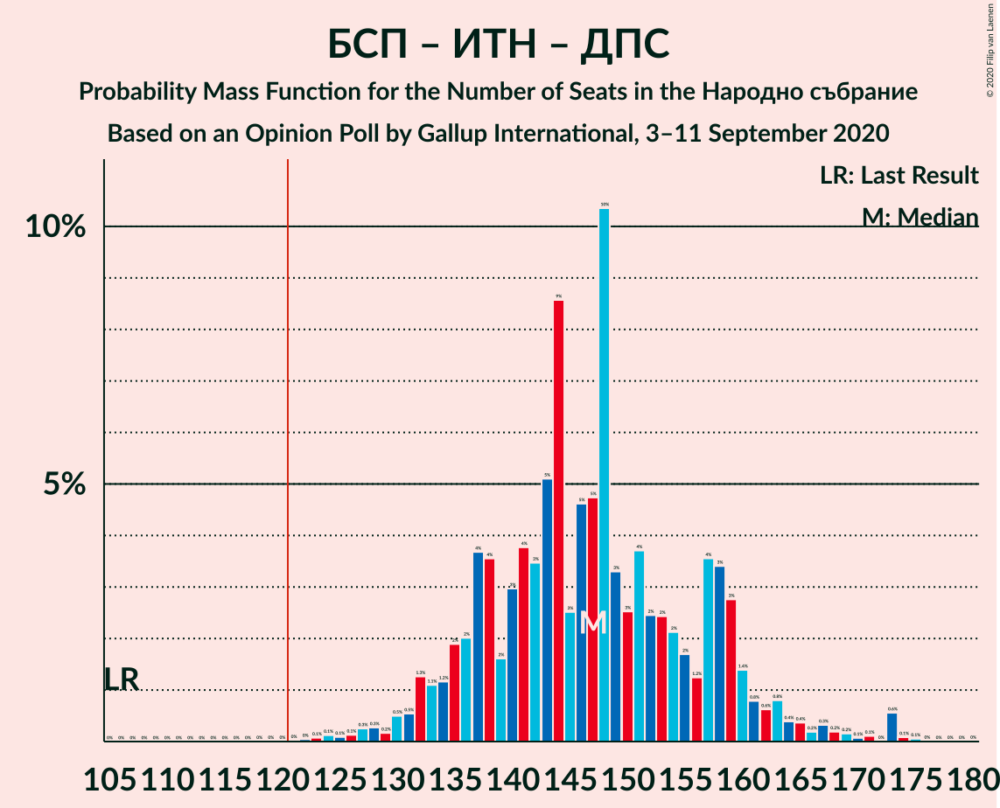

| Number of Seats | Probability | Accumulated | Special Marks |
|:---------------:|:-----------:|:-----------:|:-------------:|
| 106 | 0% | 100% | Last Result |
| 107 | 0% | 100% |  |
| 108 | 0% | 100% |  |
| 109 | 0% | 100% |  |
| 110 | 0% | 100% |  |
| 111 | 0% | 100% |  |
| 112 | 0% | 100% |  |
| 113 | 0% | 100% |  |
| 114 | 0% | 100% |  |
| 115 | 0% | 100% |  |
| 116 | 0% | 100% |  |
| 117 | 0% | 100% |  |
| 118 | 0% | 100% |  |
| 119 | 0% | 100% |  |
| 120 | 0% | 100% |  |
| 121 | 0% | 100% | Majority |
| 122 | 0% | 100% |  |
| 123 | 0.1% | 99.9% |  |
| 124 | 0.1% | 99.8% |  |
| 125 | 0.1% | 99.7% |  |
| 126 | 0.1% | 99.6% |  |
| 127 | 0.3% | 99.5% |  |
| 128 | 0.3% | 99.2% |  |
| 129 | 0.2% | 99.0% |  |
| 130 | 0.5% | 98.8% |  |
| 131 | 0.5% | 98% |  |
| 132 | 1.3% | 98% |  |
| 133 | 1.1% | 96% |  |
| 134 | 1.2% | 95% |  |
| 135 | 2% | 94% |  |
| 136 | 2% | 92% |  |
| 137 | 4% | 90% |  |
| 138 | 4% | 87% |  |
| 139 | 2% | 83% |  |
| 140 | 3% | 81% |  |
| 141 | 4% | 79% |  |
| 142 | 3% | 75% |  |
| 143 | 5% | 71% |  |
| 144 | 9% | 66% |  |
| 145 | 3% | 58% |  |
| 146 | 5% | 55% | Median |
| 147 | 5% | 50% |  |
| 148 | 10% | 46% |  |
| 149 | 3% | 35% |  |
| 150 | 3% | 32% |  |
| 151 | 4% | 30% |  |
| 152 | 2% | 26% |  |
| 153 | 2% | 23% |  |
| 154 | 2% | 21% |  |
| 155 | 2% | 19% |  |
| 156 | 1.2% | 17% |  |
| 157 | 4% | 16% |  |
| 158 | 3% | 12% |  |
| 159 | 3% | 9% |  |
| 160 | 1.4% | 6% |  |
| 161 | 0.8% | 5% |  |
| 162 | 0.6% | 4% |  |
| 163 | 0.8% | 3% |  |
| 164 | 0.4% | 3% |  |
| 165 | 0.4% | 2% |  |
| 166 | 0.2% | 2% |  |
| 167 | 0.3% | 2% |  |
| 168 | 0.2% | 1.3% |  |
| 169 | 0.2% | 1.1% |  |
| 170 | 0.1% | 0.9% |  |
| 171 | 0.1% | 0.9% |  |
| 172 | 0% | 0.7% |  |
| 173 | 0.6% | 0.7% |  |
| 174 | 0.1% | 0.2% |  |
| 175 | 0.1% | 0.1% |  |
| 176 | 0% | 0% |  |

### Българска социалистическа партия – Движение за права и свободи – Изправи се Бг

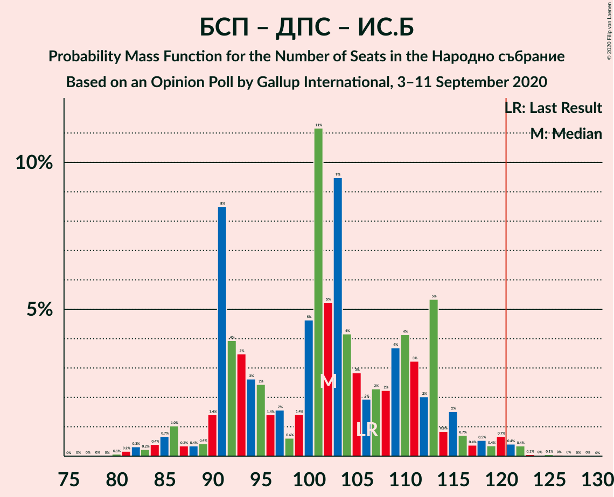

| Number of Seats | Probability | Accumulated | Special Marks |
|:---------------:|:-----------:|:-----------:|:-------------:|
| 78 | 0% | 100% |  |
| 79 | 0% | 99.9% |  |
| 80 | 0.1% | 99.9% |  |
| 81 | 0.2% | 99.8% |  |
| 82 | 0.3% | 99.7% |  |
| 83 | 0.2% | 99.4% |  |
| 84 | 0.4% | 99.1% |  |
| 85 | 0.7% | 98.7% |  |
| 86 | 1.0% | 98% |  |
| 87 | 0.3% | 97% |  |
| 88 | 0.4% | 97% |  |
| 89 | 0.4% | 96% |  |
| 90 | 1.4% | 96% |  |
| 91 | 8% | 94% |  |
| 92 | 4% | 86% |  |
| 93 | 3% | 82% |  |
| 94 | 3% | 79% |  |
| 95 | 2% | 76% |  |
| 96 | 1.4% | 73% |  |
| 97 | 2% | 72% |  |
| 98 | 0.6% | 71% |  |
| 99 | 1.4% | 70% |  |
| 100 | 5% | 68% |  |
| 101 | 11% | 64% |  |
| 102 | 5% | 53% |  |
| 103 | 9% | 47% |  |
| 104 | 4% | 38% |  |
| 105 | 3% | 34% | Median |
| 106 | 2% | 31% | Last Result |
| 107 | 2% | 29% |  |
| 108 | 2% | 27% |  |
| 109 | 4% | 24% |  |
| 110 | 4% | 21% |  |
| 111 | 3% | 17% |  |
| 112 | 2% | 13% |  |
| 113 | 5% | 11% |  |
| 114 | 0.8% | 6% |  |
| 115 | 2% | 5% |  |
| 116 | 0.7% | 4% |  |
| 117 | 0.4% | 3% |  |
| 118 | 0.5% | 3% |  |
| 119 | 0.4% | 2% |  |
| 120 | 0.7% | 2% |  |
| 121 | 0.4% | 1.0% | Majority |
| 122 | 0.4% | 0.6% |  |
| 123 | 0.1% | 0.3% |  |
| 124 | 0% | 0.2% |  |
| 125 | 0.1% | 0.2% |  |
| 126 | 0% | 0.1% |  |
| 127 | 0% | 0.1% |  |
| 128 | 0% | 0.1% |  |
| 129 | 0% | 0% |  |

### Българска социалистическа партия – Движение за права и свободи

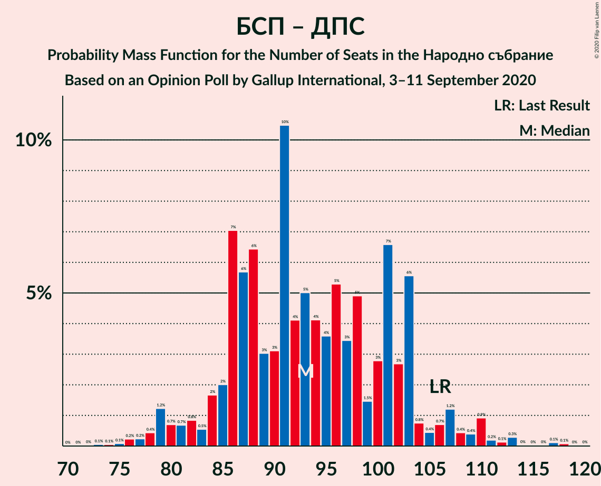

| Number of Seats | Probability | Accumulated | Special Marks |
|:---------------:|:-----------:|:-----------:|:-------------:|
| 72 | 0% | 100% |  |
| 73 | 0.1% | 99.9% |  |
| 74 | 0.1% | 99.9% |  |
| 75 | 0.1% | 99.8% |  |
| 76 | 0.2% | 99.8% |  |
| 77 | 0.2% | 99.5% |  |
| 78 | 0.4% | 99.3% |  |
| 79 | 1.2% | 98.8% |  |
| 80 | 0.7% | 98% |  |
| 81 | 0.7% | 97% |  |
| 82 | 0.8% | 96% |  |
| 83 | 0.5% | 95% |  |
| 84 | 2% | 95% |  |
| 85 | 2% | 93% |  |
| 86 | 7% | 91% |  |
| 87 | 6% | 84% |  |
| 88 | 6% | 78% |  |
| 89 | 3% | 72% |  |
| 90 | 3% | 69% |  |
| 91 | 10% | 66% |  |
| 92 | 4% | 55% | Median |
| 93 | 5% | 51% |  |
| 94 | 4% | 46% |  |
| 95 | 4% | 42% |  |
| 96 | 5% | 39% |  |
| 97 | 3% | 33% |  |
| 98 | 5% | 30% |  |
| 99 | 1.5% | 25% |  |
| 100 | 3% | 23% |  |
| 101 | 7% | 21% |  |
| 102 | 3% | 14% |  |
| 103 | 6% | 11% |  |
| 104 | 0.8% | 6% |  |
| 105 | 0.4% | 5% |  |
| 106 | 0.7% | 5% | Last Result |
| 107 | 1.2% | 4% |  |
| 108 | 0.4% | 3% |  |
| 109 | 0.4% | 2% |  |
| 110 | 0.9% | 2% |  |
| 111 | 0.2% | 0.9% |  |
| 112 | 0.1% | 0.7% |  |
| 113 | 0.3% | 0.6% |  |
| 114 | 0% | 0.3% |  |
| 115 | 0% | 0.3% |  |
| 116 | 0% | 0.3% |  |
| 117 | 0.1% | 0.2% |  |
| 118 | 0.1% | 0.1% |  |
| 119 | 0% | 0.1% |  |
| 120 | 0% | 0% |  |

### Граждани за европейско развитие на България – Обединени Патриоти

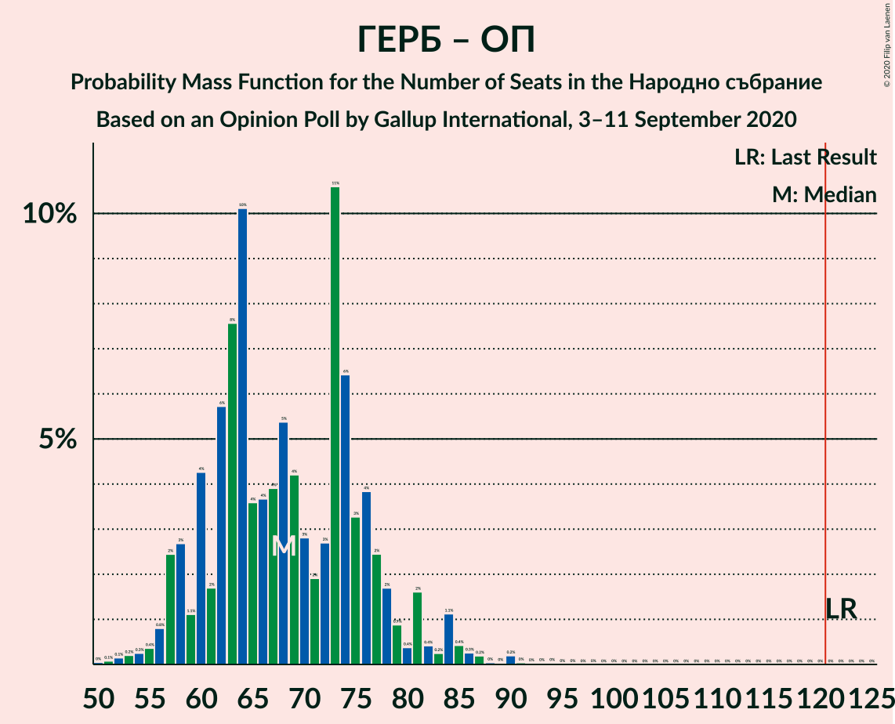

| Number of Seats | Probability | Accumulated | Special Marks |
|:---------------:|:-----------:|:-----------:|:-------------:|
| 50 | 0% | 100% |  |
| 51 | 0.1% | 99.9% |  |
| 52 | 0.1% | 99.8% |  |
| 53 | 0.2% | 99.7% |  |
| 54 | 0.3% | 99.5% |  |
| 55 | 0.4% | 99.2% |  |
| 56 | 0.8% | 98.9% |  |
| 57 | 2% | 98% |  |
| 58 | 3% | 96% |  |
| 59 | 1.1% | 93% |  |
| 60 | 4% | 92% |  |
| 61 | 2% | 88% |  |
| 62 | 6% | 86% |  |
| 63 | 8% | 80% |  |
| 64 | 10% | 73% |  |
| 65 | 4% | 62% |  |
| 66 | 4% | 59% |  |
| 67 | 4% | 55% | Median |
| 68 | 5% | 51% |  |
| 69 | 4% | 46% |  |
| 70 | 3% | 42% |  |
| 71 | 2% | 39% |  |
| 72 | 3% | 37% |  |
| 73 | 11% | 34% |  |
| 74 | 6% | 24% |  |
| 75 | 3% | 17% |  |
| 76 | 4% | 14% |  |
| 77 | 2% | 10% |  |
| 78 | 2% | 8% |  |
| 79 | 0.9% | 6% |  |
| 80 | 0.4% | 5% |  |
| 81 | 2% | 5% |  |
| 82 | 0.4% | 3% |  |
| 83 | 0.2% | 3% |  |
| 84 | 1.1% | 2% |  |
| 85 | 0.4% | 1.3% |  |
| 86 | 0.3% | 0.9% |  |
| 87 | 0.2% | 0.6% |  |
| 88 | 0% | 0.4% |  |
| 89 | 0% | 0.4% |  |
| 90 | 0.2% | 0.3% |  |
| 91 | 0% | 0.2% |  |
| 92 | 0% | 0.1% |  |
| 93 | 0% | 0.1% |  |
| 94 | 0% | 0.1% |  |
| 95 | 0% | 0% |  |
| 96 | 0% | 0% |  |
| 97 | 0% | 0% |  |
| 98 | 0% | 0% |  |
| 99 | 0% | 0% |  |
| 100 | 0% | 0% |  |
| 101 | 0% | 0% |  |
| 102 | 0% | 0% |  |
| 103 | 0% | 0% |  |
| 104 | 0% | 0% |  |
| 105 | 0% | 0% |  |
| 106 | 0% | 0% |  |
| 107 | 0% | 0% |  |
| 108 | 0% | 0% |  |
| 109 | 0% | 0% |  |
| 110 | 0% | 0% |  |
| 111 | 0% | 0% |  |
| 112 | 0% | 0% |  |
| 113 | 0% | 0% |  |
| 114 | 0% | 0% |  |
| 115 | 0% | 0% |  |
| 116 | 0% | 0% |  |
| 117 | 0% | 0% |  |
| 118 | 0% | 0% |  |
| 119 | 0% | 0% |  |
| 120 | 0% | 0% |  |
| 121 | 0% | 0% | Majority |
| 122 | 0% | 0% | Last Result |

## Technical Information

### Opinion Poll

+ **Polling firm:** Gallup International
+ **Commissioner(s):** —
+ **Fieldwork period:** 3–11 September 2020

### Calculations

+ **Sample size:** 515
+ **Simulations done:** 1,048,576
+ **Error estimate:** 2.90%

