# Opinion Poll by Маркет ЛИНКС, 18–26 September 2020

<a href="#voting-intentions">Voting Intentions</a> | <a href="#seats">Seats</a> | <a href="#coalitions">Coalitions</a> | <a href="#technical-information">Technical Information</a>

## Voting Intentions

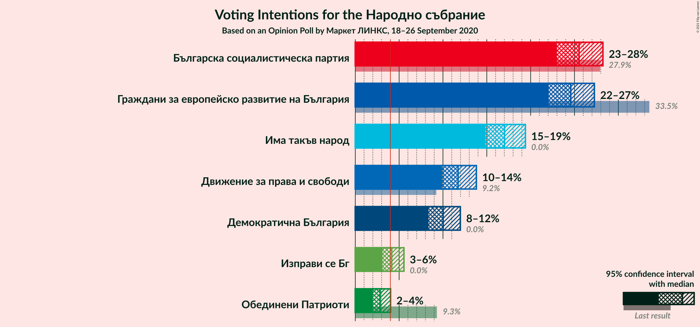

### Confidence Intervals

| Party | Last Result | Poll Result | 80% Confidence Interval | 90% Confidence Interval | 95% Confidence Interval | 99% Confidence Interval |
|:-----:|:-----------:|:-----------:|:-----------------------:|:-----------------------:|:-----------------------:|:-----------------------:|
| Българска социалистическа партия | 27.9% | 25.5% | 23.9–27.3% |23.4–27.8% |23.0–28.2% |22.2–29.1% |
| Граждани за европейско развитие на България | 33.5% | 24.6% | 22.9–26.3% |22.5–26.8% |22.1–27.3% |21.3–28.1% |
| Има такъв народ | 0.0% | 17.0% | 15.6–18.6% |15.2–19.0% |14.9–19.4% |14.2–20.2% |
| Движение за права и свободи | 9.2% | 11.7% | 10.5–13.1% |10.2–13.5% |9.9–13.8% |9.4–14.5% |
| Демократична България | 0.0% | 10.0% | 8.9–11.3% |8.6–11.7% |8.4–12.0% |7.8–12.6% |
| Изправи се Бг | 0.0% | 4.2% | 3.5–5.1% |3.3–5.3% |3.1–5.5% |2.8–6.0% |
| Обединени Патриоти | 9.3% | 2.8% | 2.3–3.6% |2.1–3.8% |2.0–4.0% |1.8–4.4% |

*Note:* The poll result column reflects the actual value used in the calculations. Published results may vary slightly, and in addition be rounded to fewer digits.

## Seats

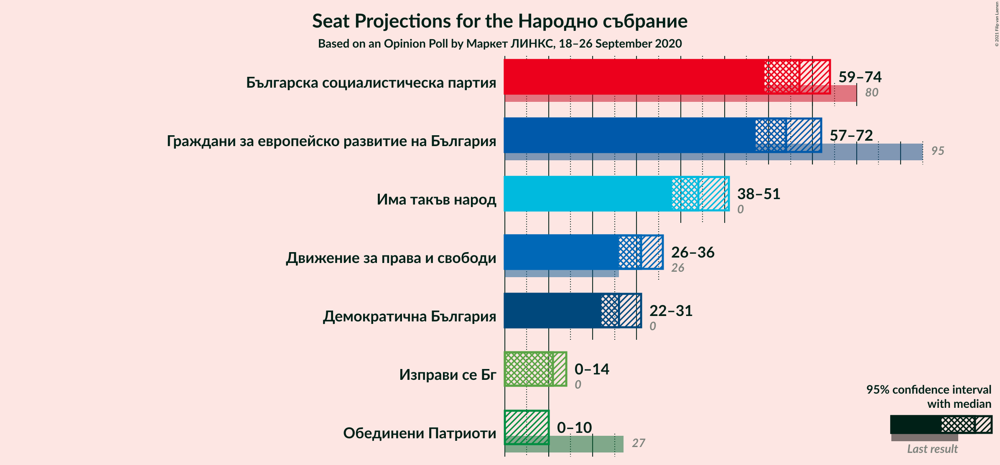

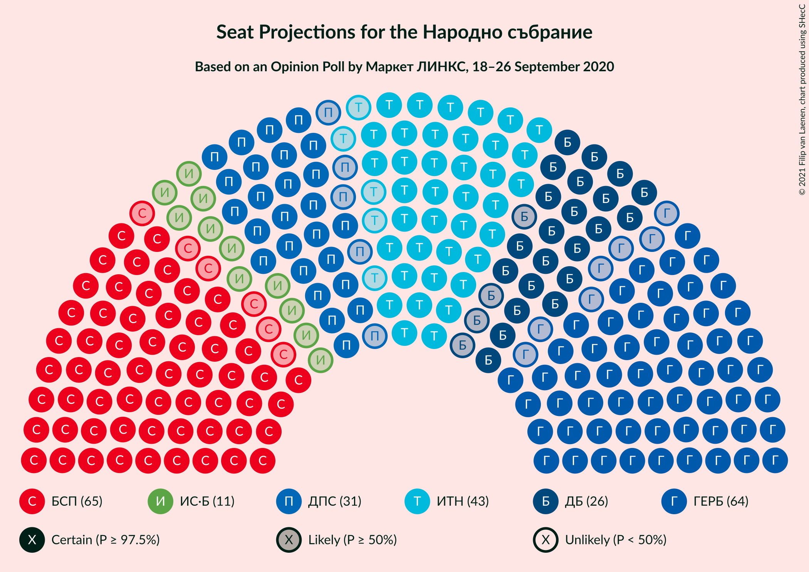

### Confidence Intervals

| Party | Last Result | Median | 80% Confidence Interval | 90% Confidence Interval | 95% Confidence Interval | 99% Confidence Interval |
|:-----:|:-----------:|:------:|:-----------------------:|:-----------------------:|:-----------------------:|:-----------------------:|
| <a href="#българска-социалистическа-партия">Българска социалистическа партия</a> | 80 | 67 | 62–72 |60–73 |59–74 |57–77 |
| <a href="#граждани-за-европейско-развитие-на-българия">Граждани за европейско развитие на България</a> | 95 | 64 | 59–69 |58–70 |57–72 |55–74 |
| <a href="#има-такъв-народ">Има такъв народ</a> | 0 | 44 | 40–49 |39–50 |38–51 |37–53 |
| <a href="#движение-за-права-и-свободи">Движение за права и свободи</a> | 26 | 31 | 27–34 |27–35 |26–36 |24–38 |
| <a href="#демократична-българия">Демократична България</a> | 0 | 26 | 23–30 |22–30 |22–31 |20–33 |
| <a href="#изправи-се-бг">Изправи се Бг</a> | 0 | 11 | 0–13 |0–14 |0–14 |0–15 |
| <a href="#обединени-патриоти">Обединени Патриоти</a> | 27 | 0 | 0 |0 |0–10 |0–11 |

### Българска социалистическа партия

*For a full overview of the results for this party, see the [Българска социалистическа партия](party-българскасоциалистическапартия.html) page.*

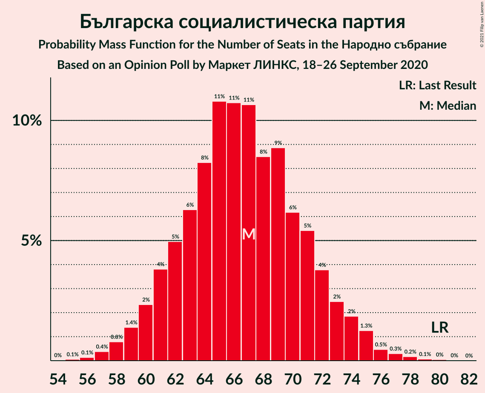

| Number of Seats | Probability | Accumulated | Special Marks |
|:---------------:|:-----------:|:-----------:|:-------------:|
| 55 | 0.1% | 100% |  |
| 56 | 0.1% | 99.9% |  |
| 57 | 0.4% | 99.8% |  |
| 58 | 0.8% | 99.4% |  |
| 59 | 1.4% | 98.6% |  |
| 60 | 2% | 97% |  |
| 61 | 4% | 95% |  |
| 62 | 5% | 91% |  |
| 63 | 6% | 86% |  |
| 64 | 8% | 80% |  |
| 65 | 11% | 72% |  |
| 66 | 11% | 61% |  |
| 67 | 11% | 50% | Median |
| 68 | 8% | 39% |  |
| 69 | 9% | 31% |  |
| 70 | 6% | 22% |  |
| 71 | 5% | 16% |  |
| 72 | 4% | 10% |  |
| 73 | 2% | 7% |  |
| 74 | 2% | 4% |  |
| 75 | 1.3% | 2% |  |
| 76 | 0.5% | 1.1% |  |
| 77 | 0.3% | 0.6% |  |
| 78 | 0.2% | 0.3% |  |
| 79 | 0.1% | 0.1% |  |
| 80 | 0% | 0.1% | Last Result |
| 81 | 0% | 0% |  |

### Граждани за европейско развитие на България

*For a full overview of the results for this party, see the [Граждани за европейско развитие на България](party-гражданизаевропейскоразвитиенабългария.html) page.*

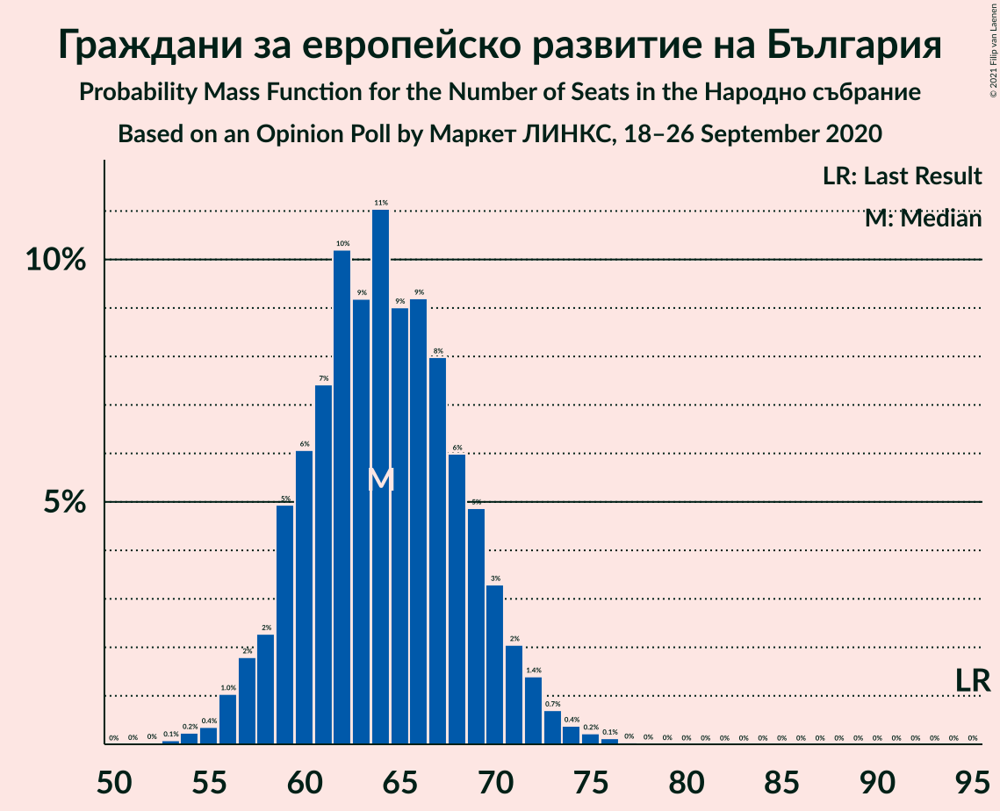

| Number of Seats | Probability | Accumulated | Special Marks |
|:---------------:|:-----------:|:-----------:|:-------------:|
| 53 | 0.1% | 100% |  |
| 54 | 0.2% | 99.9% |  |
| 55 | 0.4% | 99.6% |  |
| 56 | 1.0% | 99.3% |  |
| 57 | 2% | 98% |  |
| 58 | 2% | 96% |  |
| 59 | 5% | 94% |  |
| 60 | 6% | 89% |  |
| 61 | 7% | 83% |  |
| 62 | 10% | 76% |  |
| 63 | 9% | 66% |  |
| 64 | 11% | 56% | Median |
| 65 | 9% | 45% |  |
| 66 | 9% | 36% |  |
| 67 | 8% | 27% |  |
| 68 | 6% | 19% |  |
| 69 | 5% | 13% |  |
| 70 | 3% | 8% |  |
| 71 | 2% | 5% |  |
| 72 | 1.4% | 3% |  |
| 73 | 0.7% | 2% |  |
| 74 | 0.4% | 0.8% |  |
| 75 | 0.2% | 0.4% |  |
| 76 | 0.1% | 0.2% |  |
| 77 | 0% | 0.1% |  |
| 78 | 0% | 0% |  |
| 79 | 0% | 0% |  |
| 80 | 0% | 0% |  |
| 81 | 0% | 0% |  |
| 82 | 0% | 0% |  |
| 83 | 0% | 0% |  |
| 84 | 0% | 0% |  |
| 85 | 0% | 0% |  |
| 86 | 0% | 0% |  |
| 87 | 0% | 0% |  |
| 88 | 0% | 0% |  |
| 89 | 0% | 0% |  |
| 90 | 0% | 0% |  |
| 91 | 0% | 0% |  |
| 92 | 0% | 0% |  |
| 93 | 0% | 0% |  |
| 94 | 0% | 0% |  |
| 95 | 0% | 0% | Last Result |

### Има такъв народ

*For a full overview of the results for this party, see the [Има такъв народ](party-иматакъвнарод.html) page.*

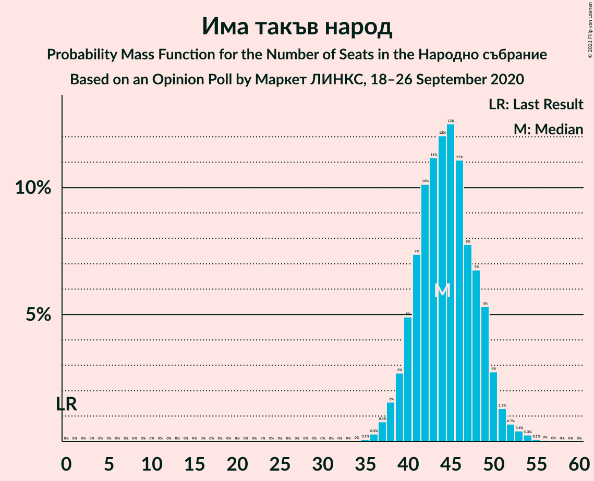

| Number of Seats | Probability | Accumulated | Special Marks |
|:---------------:|:-----------:|:-----------:|:-------------:|
| 0 | 0% | 100% | Last Result |
| 1 | 0% | 100% |  |
| 2 | 0% | 100% |  |
| 3 | 0% | 100% |  |
| 4 | 0% | 100% |  |
| 5 | 0% | 100% |  |
| 6 | 0% | 100% |  |
| 7 | 0% | 100% |  |
| 8 | 0% | 100% |  |
| 9 | 0% | 100% |  |
| 10 | 0% | 100% |  |
| 11 | 0% | 100% |  |
| 12 | 0% | 100% |  |
| 13 | 0% | 100% |  |
| 14 | 0% | 100% |  |
| 15 | 0% | 100% |  |
| 16 | 0% | 100% |  |
| 17 | 0% | 100% |  |
| 18 | 0% | 100% |  |
| 19 | 0% | 100% |  |
| 20 | 0% | 100% |  |
| 21 | 0% | 100% |  |
| 22 | 0% | 100% |  |
| 23 | 0% | 100% |  |
| 24 | 0% | 100% |  |
| 25 | 0% | 100% |  |
| 26 | 0% | 100% |  |
| 27 | 0% | 100% |  |
| 28 | 0% | 100% |  |
| 29 | 0% | 100% |  |
| 30 | 0% | 100% |  |
| 31 | 0% | 100% |  |
| 32 | 0% | 100% |  |
| 33 | 0% | 100% |  |
| 34 | 0% | 100% |  |
| 35 | 0.1% | 100% |  |
| 36 | 0.3% | 99.9% |  |
| 37 | 0.8% | 99.6% |  |
| 38 | 2% | 98.8% |  |
| 39 | 3% | 97% |  |
| 40 | 5% | 95% |  |
| 41 | 7% | 90% |  |
| 42 | 10% | 82% |  |
| 43 | 11% | 72% |  |
| 44 | 12% | 61% | Median |
| 45 | 13% | 49% |  |
| 46 | 11% | 36% |  |
| 47 | 8% | 25% |  |
| 48 | 7% | 18% |  |
| 49 | 5% | 11% |  |
| 50 | 3% | 6% |  |
| 51 | 1.3% | 3% |  |
| 52 | 0.7% | 1.5% |  |
| 53 | 0.4% | 0.8% |  |
| 54 | 0.3% | 0.4% |  |
| 55 | 0.1% | 0.1% |  |
| 56 | 0% | 0.1% |  |
| 57 | 0% | 0% |  |

### Движение за права и свободи

*For a full overview of the results for this party, see the [Движение за права и свободи](party-движениезаправаисвободи.html) page.*

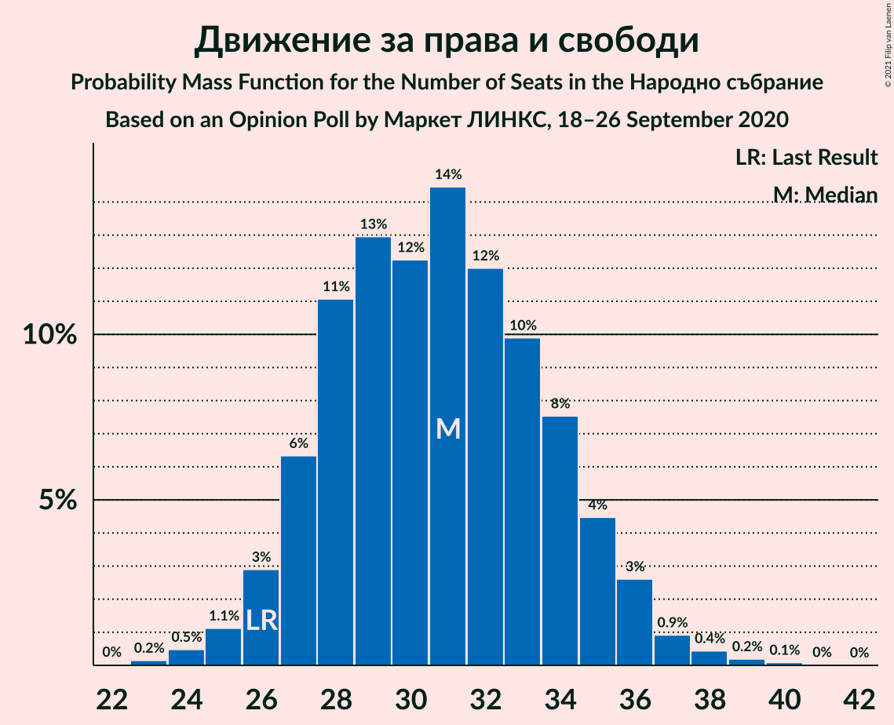

| Number of Seats | Probability | Accumulated | Special Marks |
|:---------------:|:-----------:|:-----------:|:-------------:|
| 23 | 0.2% | 100% |  |
| 24 | 0.5% | 99.8% |  |
| 25 | 1.1% | 99.3% |  |
| 26 | 3% | 98% | Last Result |
| 27 | 6% | 95% |  |
| 28 | 11% | 89% |  |
| 29 | 13% | 78% |  |
| 30 | 12% | 65% |  |
| 31 | 14% | 53% | Median |
| 32 | 12% | 38% |  |
| 33 | 10% | 26% |  |
| 34 | 8% | 16% |  |
| 35 | 4% | 9% |  |
| 36 | 3% | 4% |  |
| 37 | 0.9% | 2% |  |
| 38 | 0.4% | 0.8% |  |
| 39 | 0.2% | 0.3% |  |
| 40 | 0.1% | 0.1% |  |
| 41 | 0% | 0% |  |

### Демократична България

*For a full overview of the results for this party, see the [Демократична България](party-демократичнабългария.html) page.*

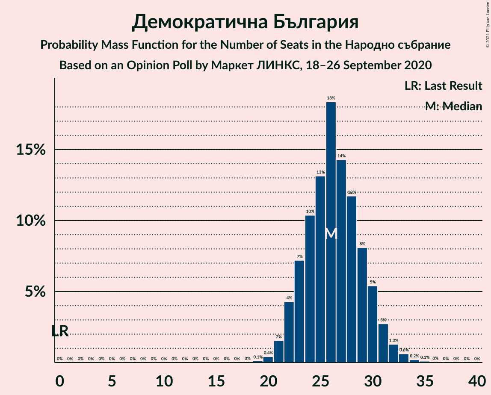

| Number of Seats | Probability | Accumulated | Special Marks |
|:---------------:|:-----------:|:-----------:|:-------------:|
| 0 | 0% | 100% | Last Result |
| 1 | 0% | 100% |  |
| 2 | 0% | 100% |  |
| 3 | 0% | 100% |  |
| 4 | 0% | 100% |  |
| 5 | 0% | 100% |  |
| 6 | 0% | 100% |  |
| 7 | 0% | 100% |  |
| 8 | 0% | 100% |  |
| 9 | 0% | 100% |  |
| 10 | 0% | 100% |  |
| 11 | 0% | 100% |  |
| 12 | 0% | 100% |  |
| 13 | 0% | 100% |  |
| 14 | 0% | 100% |  |
| 15 | 0% | 100% |  |
| 16 | 0% | 100% |  |
| 17 | 0% | 100% |  |
| 18 | 0% | 100% |  |
| 19 | 0.1% | 100% |  |
| 20 | 0.4% | 99.9% |  |
| 21 | 2% | 99.4% |  |
| 22 | 4% | 98% |  |
| 23 | 7% | 94% |  |
| 24 | 10% | 86% |  |
| 25 | 13% | 76% |  |
| 26 | 18% | 63% | Median |
| 27 | 14% | 45% |  |
| 28 | 12% | 30% |  |
| 29 | 8% | 18% |  |
| 30 | 5% | 10% |  |
| 31 | 3% | 5% |  |
| 32 | 1.3% | 2% |  |
| 33 | 0.6% | 1.0% |  |
| 34 | 0.2% | 0.3% |  |
| 35 | 0.1% | 0.1% |  |
| 36 | 0% | 0% |  |

### Изправи се Бг

*For a full overview of the results for this party, see the [Изправи се Бг](party-изправисебг.html) page.*

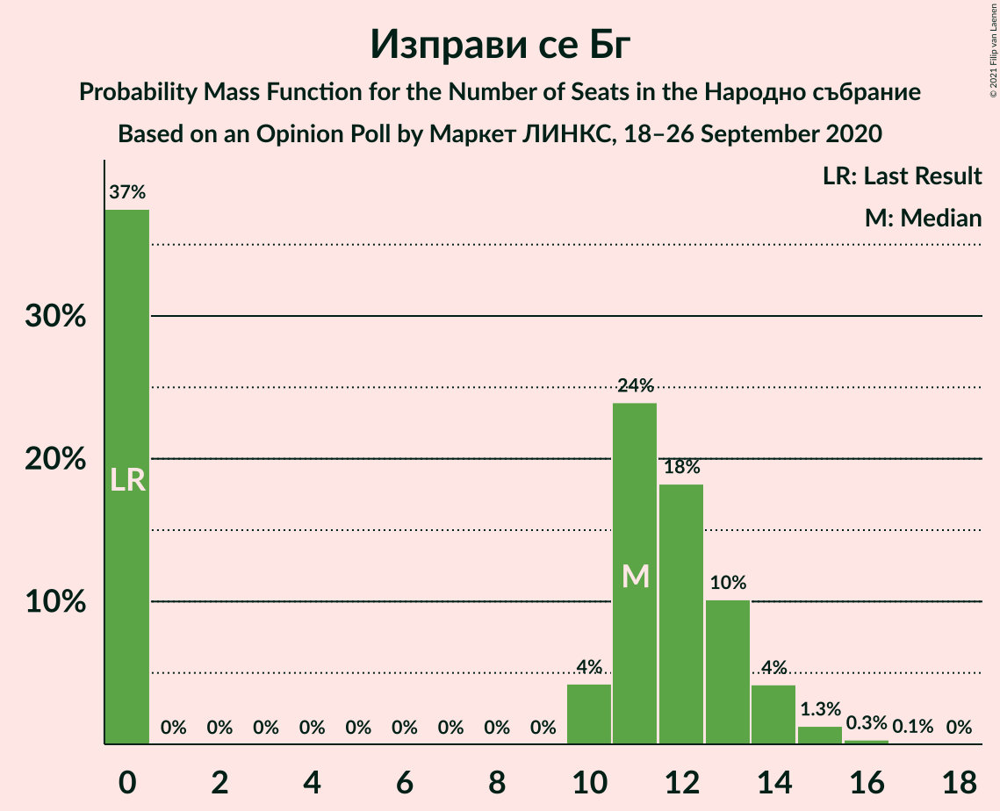

| Number of Seats | Probability | Accumulated | Special Marks |
|:---------------:|:-----------:|:-----------:|:-------------:|
| 0 | 37% | 100% | Last Result |
| 1 | 0% | 63% |  |
| 2 | 0% | 63% |  |
| 3 | 0% | 63% |  |
| 4 | 0% | 63% |  |
| 5 | 0% | 63% |  |
| 6 | 0% | 63% |  |
| 7 | 0% | 63% |  |
| 8 | 0% | 63% |  |
| 9 | 0% | 63% |  |
| 10 | 4% | 63% |  |
| 11 | 24% | 58% | Median |
| 12 | 18% | 34% |  |
| 13 | 10% | 16% |  |
| 14 | 4% | 6% |  |
| 15 | 1.3% | 2% |  |
| 16 | 0.3% | 0.4% |  |
| 17 | 0.1% | 0.1% |  |
| 18 | 0% | 0% |  |

### Обединени Патриоти

*For a full overview of the results for this party, see the [Обединени Патриоти](party-обединенипатриоти.html) page.*

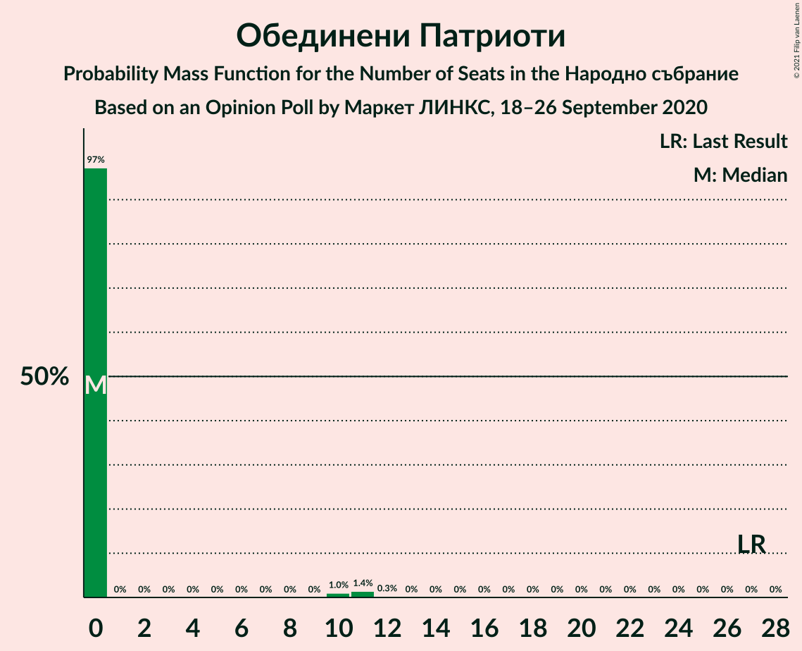

| Number of Seats | Probability | Accumulated | Special Marks |
|:---------------:|:-----------:|:-----------:|:-------------:|
| 0 | 97% | 100% | Median |
| 1 | 0% | 3% |  |
| 2 | 0% | 3% |  |
| 3 | 0% | 3% |  |
| 4 | 0% | 3% |  |
| 5 | 0% | 3% |  |
| 6 | 0% | 3% |  |
| 7 | 0% | 3% |  |
| 8 | 0% | 3% |  |
| 9 | 0% | 3% |  |
| 10 | 1.0% | 3% |  |
| 11 | 1.4% | 2% |  |
| 12 | 0.3% | 0.3% |  |
| 13 | 0% | 0% |  |
| 14 | 0% | 0% |  |
| 15 | 0% | 0% |  |
| 16 | 0% | 0% |  |
| 17 | 0% | 0% |  |
| 18 | 0% | 0% |  |
| 19 | 0% | 0% |  |
| 20 | 0% | 0% |  |
| 21 | 0% | 0% |  |
| 22 | 0% | 0% |  |
| 23 | 0% | 0% |  |
| 24 | 0% | 0% |  |
| 25 | 0% | 0% |  |
| 26 | 0% | 0% |  |
| 27 | 0% | 0% | Last Result |

## Coalitions

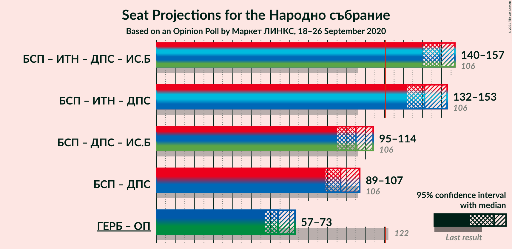

### Confidence Intervals

| Coalition | Last Result | Median | Majority? | 80% Confidence Interval | 90% Confidence Interval | 95% Confidence Interval | 99% Confidence Interval |
|:---------:|:-----------:|:------:|:---------:|:-----------------------:|:-----------------------:|:-----------------------:|:-----------------------:|
| Българска социалистическа партия – Има такъв народ – Движение за права и свободи – Изправи се Бг | 106 | 149 | 100% | 143–155 | 141–156 | 140–157 | 137–160 |
| Българска социалистическа партия – Има такъв народ – Движение за права и свободи | 106 | 141 | 100% | 135–149 | 134–150 | 132–153 | 130–155 |
| Българска социалистическа партия – Движение за права и свободи – Изправи се Бг | 106 | 105 | 0% | 98–111 | 96–113 | 95–114 | 92–116 |
| Българска социалистическа партия – Движение за права и свободи | 106 | 97 | 0% | 92–103 | 90–105 | 89–107 | 86–109 |
| Граждани за европейско развитие на България – Обединени Патриоти | 122 | 64 | 0% | 60–70 | 58–71 | 57–73 | 55–76 |

### Българска социалистическа партия – Има такъв народ – Движение за права и свободи – Изправи се Бг

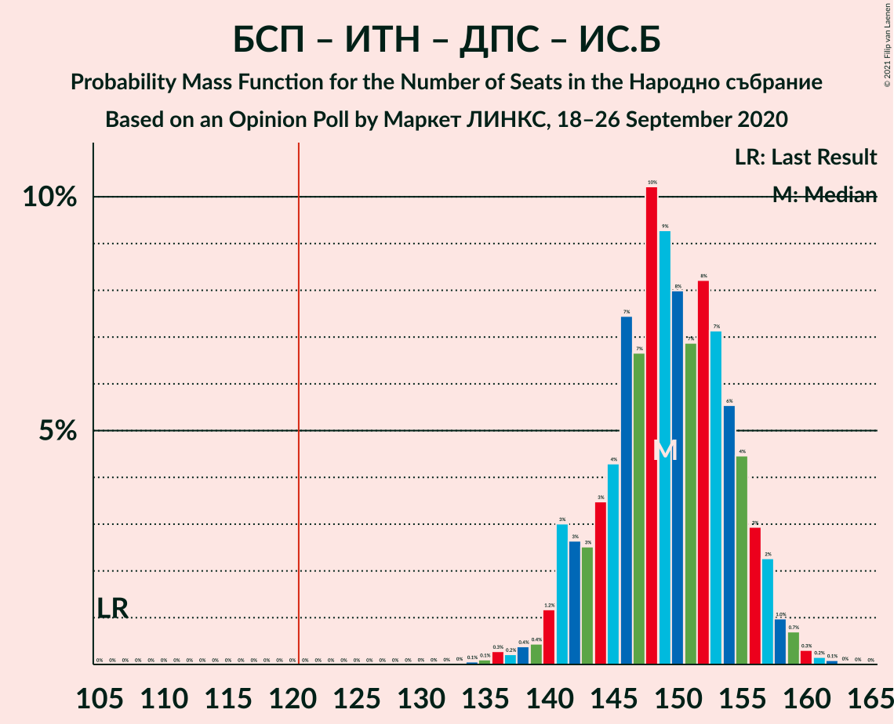

| Number of Seats | Probability | Accumulated | Special Marks |
|:---------------:|:-----------:|:-----------:|:-------------:|
| 106 | 0% | 100% | Last Result |
| 107 | 0% | 100% |  |
| 108 | 0% | 100% |  |
| 109 | 0% | 100% |  |
| 110 | 0% | 100% |  |
| 111 | 0% | 100% |  |
| 112 | 0% | 100% |  |
| 113 | 0% | 100% |  |
| 114 | 0% | 100% |  |
| 115 | 0% | 100% |  |
| 116 | 0% | 100% |  |
| 117 | 0% | 100% |  |
| 118 | 0% | 100% |  |
| 119 | 0% | 100% |  |
| 120 | 0% | 100% |  |
| 121 | 0% | 100% | Majority |
| 122 | 0% | 100% |  |
| 123 | 0% | 100% |  |
| 124 | 0% | 100% |  |
| 125 | 0% | 100% |  |
| 126 | 0% | 100% |  |
| 127 | 0% | 100% |  |
| 128 | 0% | 100% |  |
| 129 | 0% | 100% |  |
| 130 | 0% | 100% |  |
| 131 | 0% | 100% |  |
| 132 | 0% | 100% |  |
| 133 | 0% | 100% |  |
| 134 | 0.1% | 100% |  |
| 135 | 0.1% | 99.9% |  |
| 136 | 0.3% | 99.8% |  |
| 137 | 0.2% | 99.5% |  |
| 138 | 0.4% | 99.3% |  |
| 139 | 0.4% | 98.9% |  |
| 140 | 1.2% | 98% |  |
| 141 | 3% | 97% |  |
| 142 | 3% | 94% |  |
| 143 | 3% | 92% |  |
| 144 | 3% | 89% |  |
| 145 | 4% | 86% |  |
| 146 | 7% | 81% |  |
| 147 | 7% | 74% |  |
| 148 | 10% | 67% |  |
| 149 | 9% | 57% |  |
| 150 | 8% | 48% |  |
| 151 | 7% | 40% |  |
| 152 | 8% | 33% |  |
| 153 | 7% | 25% | Median |
| 154 | 6% | 18% |  |
| 155 | 4% | 12% |  |
| 156 | 3% | 7% |  |
| 157 | 2% | 5% |  |
| 158 | 1.0% | 2% |  |
| 159 | 0.7% | 1.3% |  |
| 160 | 0.3% | 0.6% |  |
| 161 | 0.2% | 0.3% |  |
| 162 | 0.1% | 0.1% |  |
| 163 | 0% | 0.1% |  |
| 164 | 0% | 0% |  |

### Българска социалистическа партия – Има такъв народ – Движение за права и свободи

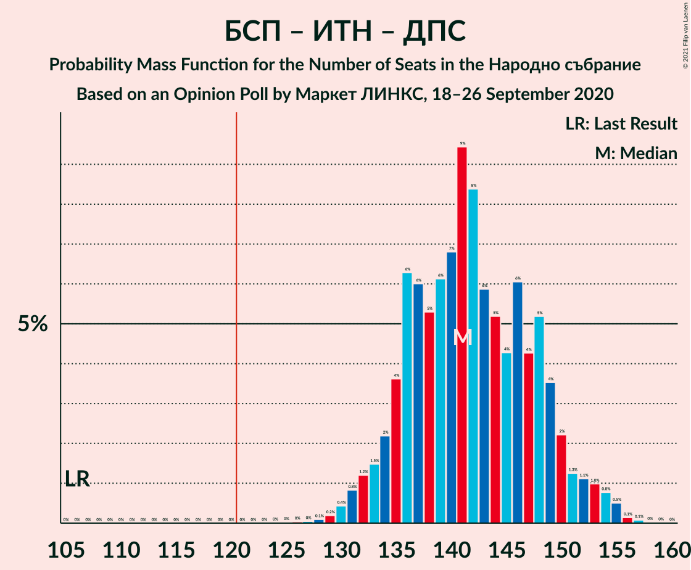

| Number of Seats | Probability | Accumulated | Special Marks |
|:---------------:|:-----------:|:-----------:|:-------------:|
| 106 | 0% | 100% | Last Result |
| 107 | 0% | 100% |  |
| 108 | 0% | 100% |  |
| 109 | 0% | 100% |  |
| 110 | 0% | 100% |  |
| 111 | 0% | 100% |  |
| 112 | 0% | 100% |  |
| 113 | 0% | 100% |  |
| 114 | 0% | 100% |  |
| 115 | 0% | 100% |  |
| 116 | 0% | 100% |  |
| 117 | 0% | 100% |  |
| 118 | 0% | 100% |  |
| 119 | 0% | 100% |  |
| 120 | 0% | 100% |  |
| 121 | 0% | 100% | Majority |
| 122 | 0% | 100% |  |
| 123 | 0% | 100% |  |
| 124 | 0% | 100% |  |
| 125 | 0% | 100% |  |
| 126 | 0% | 100% |  |
| 127 | 0% | 99.9% |  |
| 128 | 0.1% | 99.9% |  |
| 129 | 0.2% | 99.8% |  |
| 130 | 0.4% | 99.6% |  |
| 131 | 0.8% | 99.2% |  |
| 132 | 1.2% | 98% |  |
| 133 | 1.5% | 97% |  |
| 134 | 2% | 96% |  |
| 135 | 4% | 93% |  |
| 136 | 6% | 90% |  |
| 137 | 6% | 84% |  |
| 138 | 5% | 78% |  |
| 139 | 6% | 72% |  |
| 140 | 7% | 66% |  |
| 141 | 9% | 59% |  |
| 142 | 8% | 50% | Median |
| 143 | 6% | 41% |  |
| 144 | 5% | 36% |  |
| 145 | 4% | 30% |  |
| 146 | 6% | 26% |  |
| 147 | 4% | 20% |  |
| 148 | 5% | 16% |  |
| 149 | 4% | 11% |  |
| 150 | 2% | 7% |  |
| 151 | 1.3% | 5% |  |
| 152 | 1.1% | 4% |  |
| 153 | 1.0% | 3% |  |
| 154 | 0.8% | 2% |  |
| 155 | 0.5% | 0.8% |  |
| 156 | 0.1% | 0.3% |  |
| 157 | 0.1% | 0.1% |  |
| 158 | 0% | 0% |  |

### Българска социалистическа партия – Движение за права и свободи – Изправи се Бг

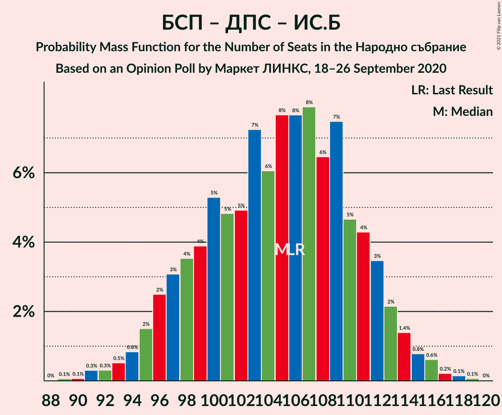

| Number of Seats | Probability | Accumulated | Special Marks |
|:---------------:|:-----------:|:-----------:|:-------------:|
| 89 | 0.1% | 100% |  |
| 90 | 0.1% | 99.9% |  |
| 91 | 0.3% | 99.8% |  |
| 92 | 0.3% | 99.5% |  |
| 93 | 0.5% | 99.2% |  |
| 94 | 0.8% | 98.7% |  |
| 95 | 2% | 98% |  |
| 96 | 2% | 96% |  |
| 97 | 3% | 94% |  |
| 98 | 4% | 91% |  |
| 99 | 4% | 87% |  |
| 100 | 5% | 83% |  |
| 101 | 5% | 78% |  |
| 102 | 5% | 73% |  |
| 103 | 7% | 68% |  |
| 104 | 6% | 61% |  |
| 105 | 8% | 55% |  |
| 106 | 8% | 47% | Last Result |
| 107 | 8% | 40% |  |
| 108 | 6% | 32% |  |
| 109 | 7% | 25% | Median |
| 110 | 5% | 18% |  |
| 111 | 4% | 13% |  |
| 112 | 3% | 9% |  |
| 113 | 2% | 5% |  |
| 114 | 1.4% | 3% |  |
| 115 | 0.8% | 2% |  |
| 116 | 0.6% | 1.1% |  |
| 117 | 0.2% | 0.5% |  |
| 118 | 0.1% | 0.3% |  |
| 119 | 0.1% | 0.1% |  |
| 120 | 0% | 0% |  |

### Българска социалистическа партия – Движение за права и свободи

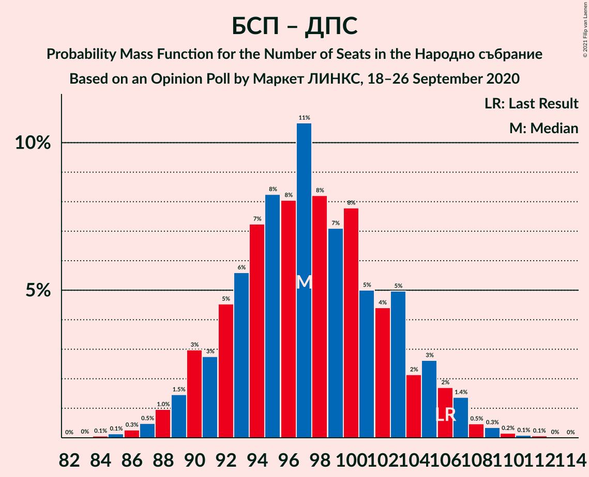

| Number of Seats | Probability | Accumulated | Special Marks |
|:---------------:|:-----------:|:-----------:|:-------------:|
| 83 | 0% | 100% |  |
| 84 | 0.1% | 99.9% |  |
| 85 | 0.1% | 99.9% |  |
| 86 | 0.3% | 99.8% |  |
| 87 | 0.5% | 99.5% |  |
| 88 | 1.0% | 99.0% |  |
| 89 | 1.5% | 98% |  |
| 90 | 3% | 97% |  |
| 91 | 3% | 94% |  |
| 92 | 5% | 91% |  |
| 93 | 6% | 86% |  |
| 94 | 7% | 81% |  |
| 95 | 8% | 73% |  |
| 96 | 8% | 65% |  |
| 97 | 11% | 57% |  |
| 98 | 8% | 46% | Median |
| 99 | 7% | 38% |  |
| 100 | 8% | 31% |  |
| 101 | 5% | 23% |  |
| 102 | 4% | 18% |  |
| 103 | 5% | 14% |  |
| 104 | 2% | 9% |  |
| 105 | 3% | 7% |  |
| 106 | 2% | 4% | Last Result |
| 107 | 1.4% | 3% |  |
| 108 | 0.5% | 1.2% |  |
| 109 | 0.3% | 0.7% |  |
| 110 | 0.2% | 0.3% |  |
| 111 | 0.1% | 0.2% |  |
| 112 | 0.1% | 0.1% |  |
| 113 | 0% | 0% |  |

### Граждани за европейско развитие на България – Обединени Патриоти

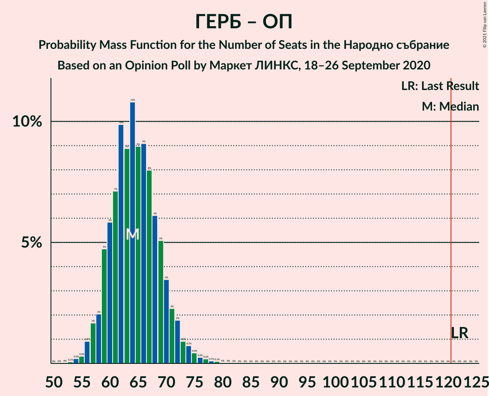

| Number of Seats | Probability | Accumulated | Special Marks |
|:---------------:|:-----------:|:-----------:|:-------------:|
| 53 | 0.1% | 100% |  |
| 54 | 0.2% | 99.9% |  |
| 55 | 0.3% | 99.7% |  |
| 56 | 0.9% | 99.4% |  |
| 57 | 2% | 98% |  |
| 58 | 2% | 97% |  |
| 59 | 5% | 95% |  |
| 60 | 6% | 90% |  |
| 61 | 7% | 84% |  |
| 62 | 10% | 77% |  |
| 63 | 9% | 67% |  |
| 64 | 11% | 58% | Median |
| 65 | 9% | 48% |  |
| 66 | 9% | 39% |  |
| 67 | 8% | 29% |  |
| 68 | 6% | 21% |  |
| 69 | 5% | 15% |  |
| 70 | 3% | 10% |  |
| 71 | 2% | 7% |  |
| 72 | 2% | 5% |  |
| 73 | 0.9% | 3% |  |
| 74 | 0.7% | 2% |  |
| 75 | 0.4% | 1.1% |  |
| 76 | 0.3% | 0.7% |  |
| 77 | 0.2% | 0.4% |  |
| 78 | 0.1% | 0.2% |  |
| 79 | 0.1% | 0.1% |  |
| 80 | 0% | 0.1% |  |
| 81 | 0% | 0% |  |
| 82 | 0% | 0% |  |
| 83 | 0% | 0% |  |
| 84 | 0% | 0% |  |
| 85 | 0% | 0% |  |
| 86 | 0% | 0% |  |
| 87 | 0% | 0% |  |
| 88 | 0% | 0% |  |
| 89 | 0% | 0% |  |
| 90 | 0% | 0% |  |
| 91 | 0% | 0% |  |
| 92 | 0% | 0% |  |
| 93 | 0% | 0% |  |
| 94 | 0% | 0% |  |
| 95 | 0% | 0% |  |
| 96 | 0% | 0% |  |
| 97 | 0% | 0% |  |
| 98 | 0% | 0% |  |
| 99 | 0% | 0% |  |
| 100 | 0% | 0% |  |
| 101 | 0% | 0% |  |
| 102 | 0% | 0% |  |
| 103 | 0% | 0% |  |
| 104 | 0% | 0% |  |
| 105 | 0% | 0% |  |
| 106 | 0% | 0% |  |
| 107 | 0% | 0% |  |
| 108 | 0% | 0% |  |
| 109 | 0% | 0% |  |
| 110 | 0% | 0% |  |
| 111 | 0% | 0% |  |
| 112 | 0% | 0% |  |
| 113 | 0% | 0% |  |
| 114 | 0% | 0% |  |
| 115 | 0% | 0% |  |
| 116 | 0% | 0% |  |
| 117 | 0% | 0% |  |
| 118 | 0% | 0% |  |
| 119 | 0% | 0% |  |
| 120 | 0% | 0% |  |
| 121 | 0% | 0% | Majority |
| 122 | 0% | 0% | Last Result |

## Technical Information

### Opinion Poll

+ **Polling firm:** Маркет ЛИНКС
+ **Commissioner(s):** —
+ **Fieldwork period:** 18–26 September 2020

### Calculations

+ **Sample size:** 1058
+ **Simulations done:** 1,048,576
+ **Error estimate:** 1.54%

