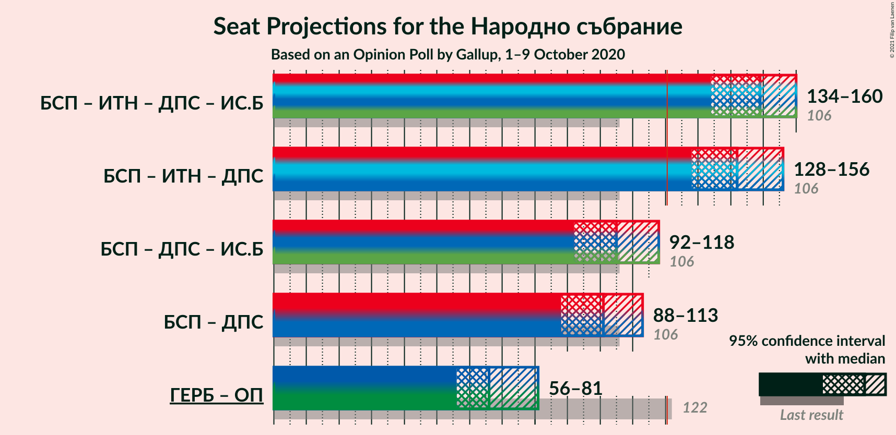

# Opinion Poll by Gallup, 1–9 October 2020

<a href="#voting-intentions">Voting Intentions</a> | <a href="#seats">Seats</a> | <a href="#coalitions">Coalitions</a> | <a href="#technical-information">Technical Information</a>

## Voting Intentions

### Confidence Intervals

| Party | Last Result | Poll Result | 80% Confidence Interval | 90% Confidence Interval | 95% Confidence Interval | 99% Confidence Interval |
|:-----:|:-----------:|:-----------:|:-----------------------:|:-----------------------:|:-----------------------:|:-----------------------:|
| Българска социалистическа партия | 27.9% | 19.8% | 18.1–21.7% |17.6–22.2% |17.2–22.7% |16.4–23.6% |
| Граждани за европейско развитие на България | 33.5% | 19.1% | 17.4–20.9% |16.9–21.5% |16.5–21.9% |15.7–22.8% |
| Има такъв народ | 0.0% | 12.6% | 11.2–14.2% |10.8–14.7% |10.5–15.1% |9.8–15.9% |
| Движение за права и свободи | 9.2% | 10.1% | 8.8–11.6% |8.5–12.0% |8.2–12.4% |7.6–13.1% |
| Демократична България | 0.0% | 7.3% | 6.3–8.7% |6.0–9.0% |5.7–9.4% |5.3–10.0% |
| Изправи се Бг | 0.0% | 3.7% | 3.0–4.8% |2.8–5.0% |2.6–5.3% |2.3–5.8% |
| Обединени Патриоти | 9.3% | 3.4% | 2.7–4.3% |2.5–4.6% |2.3–4.9% |2.0–5.4% |
| Воля | 4.3% | 2.6% | 2.0–3.5% |1.9–3.7% |1.7–4.0% |1.5–4.4% |

*Note:* The poll result column reflects the actual value used in the calculations. Published results may vary slightly, and in addition be rounded to fewer digits.

## Seats

### Confidence Intervals

| Party | Last Result | Median | 80% Confidence Interval | 90% Confidence Interval | 95% Confidence Interval | 99% Confidence Interval |
|:-----:|:-----------:|:------:|:-----------------------:|:-----------------------:|:-----------------------:|:-----------------------:|
| <a href="#българска-социалистическа-партия">Българска социалистическа партия</a> | 80 | 67 | 60–73 |57–76 |56–76 |54–80 |
| <a href="#граждани-за-европейско-развитие-на-българия">Граждани за европейско развитие на България</a> | 95 | 64 | 58–71 |56–72 |55–74 |52–77 |
| <a href="#има-такъв-народ">Има такъв народ</a> | 0 | 42 | 37–47 |36–49 |35–52 |32–53 |
| <a href="#движение-за-права-и-свободи">Движение за права и свободи</a> | 26 | 34 | 29–39 |28–40 |27–41 |25–44 |
| <a href="#демократична-българия">Демократична България</a> | 0 | 24 | 21–29 |20–31 |19–31 |17–34 |
| <a href="#изправи-се-бг">Изправи се Бг</a> | 0 | 0 | 0–16 |0–16 |0–17 |0–19 |
| <a href="#обединени-патриоти">Обединени Патриоти</a> | 27 | 0 | 0–14 |0–15 |0–16 |0–17 |
| <a href="#воля">Воля</a> | 12 | 0 | 0 |0 |0 |0–14 |

### Българска социалистическа партия

*For a full overview of the results for this party, see the [Българска социалистическа партия](party-българскасоциалистическапартия.html) page.*

| Number of Seats | Probability | Accumulated | Special Marks |
|:---------------:|:-----------:|:-----------:|:-------------:|
| 50 | 0% | 100% |  |
| 51 | 0% | 99.9% |  |
| 52 | 0.1% | 99.9% |  |
| 53 | 0.1% | 99.8% |  |
| 54 | 0.7% | 99.7% |  |
| 55 | 0.7% | 99.0% |  |
| 56 | 1.2% | 98% |  |
| 57 | 2% | 97% |  |
| 58 | 2% | 95% |  |
| 59 | 2% | 93% |  |
| 60 | 3% | 91% |  |
| 61 | 3% | 88% |  |
| 62 | 5% | 84% |  |
| 63 | 6% | 79% |  |
| 64 | 4% | 74% |  |
| 65 | 14% | 70% |  |
| 66 | 4% | 55% |  |
| 67 | 11% | 51% | Median |
| 68 | 10% | 41% |  |
| 69 | 6% | 31% |  |
| 70 | 8% | 25% |  |
| 71 | 2% | 17% |  |
| 72 | 4% | 15% |  |
| 73 | 2% | 10% |  |
| 74 | 2% | 8% |  |
| 75 | 1.1% | 6% |  |
| 76 | 3% | 5% |  |
| 77 | 1.0% | 2% |  |
| 78 | 0.3% | 1.4% |  |
| 79 | 0.4% | 1.1% |  |
| 80 | 0.3% | 0.8% | Last Result |
| 81 | 0.3% | 0.5% |  |
| 82 | 0.1% | 0.2% |  |
| 83 | 0% | 0.1% |  |
| 84 | 0% | 0.1% |  |
| 85 | 0% | 0% |  |

### Граждани за европейско развитие на България

*For a full overview of the results for this party, see the [Граждани за европейско развитие на България](party-гражданизаевропейскоразвитиенабългария.html) page.*

| Number of Seats | Probability | Accumulated | Special Marks |
|:---------------:|:-----------:|:-----------:|:-------------:|
| 48 | 0% | 100% |  |
| 49 | 0.2% | 99.9% |  |
| 50 | 0.1% | 99.8% |  |
| 51 | 0.1% | 99.7% |  |
| 52 | 0.5% | 99.5% |  |
| 53 | 0.5% | 99.0% |  |
| 54 | 0.9% | 98% |  |
| 55 | 2% | 98% |  |
| 56 | 2% | 95% |  |
| 57 | 3% | 93% |  |
| 58 | 5% | 90% |  |
| 59 | 4% | 85% |  |
| 60 | 4% | 82% |  |
| 61 | 3% | 78% |  |
| 62 | 13% | 74% |  |
| 63 | 10% | 61% |  |
| 64 | 9% | 51% | Median |
| 65 | 6% | 42% |  |
| 66 | 7% | 36% |  |
| 67 | 4% | 29% |  |
| 68 | 6% | 25% |  |
| 69 | 7% | 19% |  |
| 70 | 1.2% | 12% |  |
| 71 | 5% | 11% |  |
| 72 | 2% | 6% |  |
| 73 | 0.4% | 4% |  |
| 74 | 1.1% | 3% |  |
| 75 | 0.8% | 2% |  |
| 76 | 0.3% | 1.2% |  |
| 77 | 0.4% | 0.9% |  |
| 78 | 0.3% | 0.5% |  |
| 79 | 0% | 0.2% |  |
| 80 | 0.1% | 0.2% |  |
| 81 | 0% | 0.1% |  |
| 82 | 0% | 0% |  |
| 83 | 0% | 0% |  |
| 84 | 0% | 0% |  |
| 85 | 0% | 0% |  |
| 86 | 0% | 0% |  |
| 87 | 0% | 0% |  |
| 88 | 0% | 0% |  |
| 89 | 0% | 0% |  |
| 90 | 0% | 0% |  |
| 91 | 0% | 0% |  |
| 92 | 0% | 0% |  |
| 93 | 0% | 0% |  |
| 94 | 0% | 0% |  |
| 95 | 0% | 0% | Last Result |

### Има такъв народ

*For a full overview of the results for this party, see the [Има такъв народ](party-иматакъвнарод.html) page.*

| Number of Seats | Probability | Accumulated | Special Marks |
|:---------------:|:-----------:|:-----------:|:-------------:|
| 0 | 0% | 100% | Last Result |
| 1 | 0% | 100% |  |
| 2 | 0% | 100% |  |
| 3 | 0% | 100% |  |
| 4 | 0% | 100% |  |
| 5 | 0% | 100% |  |
| 6 | 0% | 100% |  |
| 7 | 0% | 100% |  |
| 8 | 0% | 100% |  |
| 9 | 0% | 100% |  |
| 10 | 0% | 100% |  |
| 11 | 0% | 100% |  |
| 12 | 0% | 100% |  |
| 13 | 0% | 100% |  |
| 14 | 0% | 100% |  |
| 15 | 0% | 100% |  |
| 16 | 0% | 100% |  |
| 17 | 0% | 100% |  |
| 18 | 0% | 100% |  |
| 19 | 0% | 100% |  |
| 20 | 0% | 100% |  |
| 21 | 0% | 100% |  |
| 22 | 0% | 100% |  |
| 23 | 0% | 100% |  |
| 24 | 0% | 100% |  |
| 25 | 0% | 100% |  |
| 26 | 0% | 100% |  |
| 27 | 0% | 100% |  |
| 28 | 0% | 100% |  |
| 29 | 0% | 100% |  |
| 30 | 0% | 100% |  |
| 31 | 0.2% | 99.9% |  |
| 32 | 0.4% | 99.8% |  |
| 33 | 0.5% | 99.4% |  |
| 34 | 1.3% | 98.9% |  |
| 35 | 2% | 98% |  |
| 36 | 3% | 96% |  |
| 37 | 4% | 93% |  |
| 38 | 7% | 89% |  |
| 39 | 8% | 82% |  |
| 40 | 10% | 74% |  |
| 41 | 10% | 64% |  |
| 42 | 10% | 54% | Median |
| 43 | 10% | 44% |  |
| 44 | 7% | 34% |  |
| 45 | 5% | 27% |  |
| 46 | 4% | 22% |  |
| 47 | 8% | 17% |  |
| 48 | 3% | 9% |  |
| 49 | 1.5% | 6% |  |
| 50 | 1.0% | 5% |  |
| 51 | 1.2% | 4% |  |
| 52 | 2% | 3% |  |
| 53 | 0.3% | 0.6% |  |
| 54 | 0.1% | 0.3% |  |
| 55 | 0.1% | 0.2% |  |
| 56 | 0% | 0.2% |  |
| 57 | 0.1% | 0.1% |  |
| 58 | 0% | 0% |  |

### Движение за права и свободи

*For a full overview of the results for this party, see the [Движение за права и свободи](party-движениезаправаисвободи.html) page.*

| Number of Seats | Probability | Accumulated | Special Marks |
|:---------------:|:-----------:|:-----------:|:-------------:|
| 23 | 0.1% | 100% |  |
| 24 | 0.3% | 99.9% |  |
| 25 | 0.5% | 99.7% |  |
| 26 | 0.6% | 99.2% | Last Result |
| 27 | 1.4% | 98.5% |  |
| 28 | 4% | 97% |  |
| 29 | 5% | 93% |  |
| 30 | 5% | 88% |  |
| 31 | 10% | 83% |  |
| 32 | 11% | 74% |  |
| 33 | 10% | 63% |  |
| 34 | 9% | 52% | Median |
| 35 | 9% | 44% |  |
| 36 | 10% | 35% |  |
| 37 | 9% | 25% |  |
| 38 | 3% | 15% |  |
| 39 | 4% | 12% |  |
| 40 | 4% | 8% |  |
| 41 | 3% | 5% |  |
| 42 | 0.9% | 2% |  |
| 43 | 0.5% | 1.4% |  |
| 44 | 0.5% | 1.0% |  |
| 45 | 0.3% | 0.4% |  |
| 46 | 0.1% | 0.1% |  |
| 47 | 0% | 0.1% |  |
| 48 | 0% | 0% |  |

### Демократична България

*For a full overview of the results for this party, see the [Демократична България](party-демократичнабългария.html) page.*

| Number of Seats | Probability | Accumulated | Special Marks |
|:---------------:|:-----------:|:-----------:|:-------------:|
| 0 | 0% | 100% | Last Result |
| 1 | 0% | 100% |  |
| 2 | 0% | 100% |  |
| 3 | 0% | 100% |  |
| 4 | 0% | 100% |  |
| 5 | 0% | 100% |  |
| 6 | 0% | 100% |  |
| 7 | 0% | 100% |  |
| 8 | 0% | 100% |  |
| 9 | 0% | 100% |  |
| 10 | 0% | 100% |  |
| 11 | 0% | 100% |  |
| 12 | 0% | 100% |  |
| 13 | 0% | 100% |  |
| 14 | 0% | 100% |  |
| 15 | 0% | 100% |  |
| 16 | 0.1% | 100% |  |
| 17 | 0.4% | 99.8% |  |
| 18 | 0.9% | 99.4% |  |
| 19 | 2% | 98% |  |
| 20 | 5% | 96% |  |
| 21 | 7% | 92% |  |
| 22 | 12% | 85% |  |
| 23 | 9% | 73% |  |
| 24 | 16% | 65% | Median |
| 25 | 10% | 49% |  |
| 26 | 11% | 39% |  |
| 27 | 10% | 28% |  |
| 28 | 4% | 18% |  |
| 29 | 6% | 14% |  |
| 30 | 3% | 8% |  |
| 31 | 3% | 6% |  |
| 32 | 1.3% | 2% |  |
| 33 | 0.3% | 1.0% |  |
| 34 | 0.5% | 0.7% |  |
| 35 | 0.1% | 0.2% |  |
| 36 | 0.1% | 0.1% |  |
| 37 | 0% | 0.1% |  |
| 38 | 0% | 0% |  |

### Изправи се Бг

*For a full overview of the results for this party, see the [Изправи се Бг](party-изправисебг.html) page.*

| Number of Seats | Probability | Accumulated | Special Marks |
|:---------------:|:-----------:|:-----------:|:-------------:|
| 0 | 61% | 100% | Last Result, Median |
| 1 | 0% | 39% |  |
| 2 | 0% | 39% |  |
| 3 | 0% | 39% |  |
| 4 | 0% | 39% |  |
| 5 | 0% | 39% |  |
| 6 | 0% | 39% |  |
| 7 | 0% | 39% |  |
| 8 | 0% | 39% |  |
| 9 | 0% | 39% |  |
| 10 | 0% | 39% |  |
| 11 | 0% | 39% |  |
| 12 | 0.1% | 39% |  |
| 13 | 7% | 39% |  |
| 14 | 16% | 33% |  |
| 15 | 6% | 17% |  |
| 16 | 7% | 11% |  |
| 17 | 1.4% | 3% |  |
| 18 | 1.2% | 2% |  |
| 19 | 0.4% | 0.7% |  |
| 20 | 0.2% | 0.2% |  |
| 21 | 0.1% | 0.1% |  |
| 22 | 0% | 0% |  |

### Обединени Патриоти

*For a full overview of the results for this party, see the [Обединени Патриоти](party-обединенипатриоти.html) page.*

| Number of Seats | Probability | Accumulated | Special Marks |
|:---------------:|:-----------:|:-----------:|:-------------:|
| 0 | 81% | 100% | Median |
| 1 | 0% | 19% |  |
| 2 | 0% | 19% |  |
| 3 | 0% | 19% |  |
| 4 | 0% | 19% |  |
| 5 | 0% | 19% |  |
| 6 | 0% | 19% |  |
| 7 | 0% | 19% |  |
| 8 | 0% | 19% |  |
| 9 | 0% | 19% |  |
| 10 | 0% | 19% |  |
| 11 | 0% | 19% |  |
| 12 | 0.4% | 19% |  |
| 13 | 6% | 18% |  |
| 14 | 6% | 13% |  |
| 15 | 4% | 7% |  |
| 16 | 2% | 3% |  |
| 17 | 0.7% | 1.1% |  |
| 18 | 0.3% | 0.4% |  |
| 19 | 0.1% | 0.1% |  |
| 20 | 0% | 0% |  |
| 21 | 0% | 0% |  |
| 22 | 0% | 0% |  |
| 23 | 0% | 0% |  |
| 24 | 0% | 0% |  |
| 25 | 0% | 0% |  |
| 26 | 0% | 0% |  |
| 27 | 0% | 0% | Last Result |

### Воля

*For a full overview of the results for this party, see the [Воля](party-воля.html) page.*

| Number of Seats | Probability | Accumulated | Special Marks |
|:---------------:|:-----------:|:-----------:|:-------------:|
| 0 | 98% | 100% | Median |
| 1 | 0% | 2% |  |
| 2 | 0% | 2% |  |
| 3 | 0% | 2% |  |
| 4 | 0% | 2% |  |
| 5 | 0% | 2% |  |
| 6 | 0% | 2% |  |
| 7 | 0% | 2% |  |
| 8 | 0% | 2% |  |
| 9 | 0% | 2% |  |
| 10 | 0% | 2% |  |
| 11 | 0% | 2% |  |
| 12 | 0.1% | 2% | Last Result |
| 13 | 0.9% | 2% |  |
| 14 | 0.9% | 1.4% |  |
| 15 | 0.4% | 0.5% |  |
| 16 | 0.1% | 0.1% |  |
| 17 | 0% | 0% |  |

## Coalitions

### Confidence Intervals

| Coalition | Last Result | Median | Majority? | 80% Confidence Interval | 90% Confidence Interval | 95% Confidence Interval | 99% Confidence Interval |
|:---------:|:-----------:|:------:|:---------:|:-----------------------:|:-----------------------:|:-----------------------:|:-----------------------:|
| Българска социалистическа партия – Има такъв народ – Движение за права и свободи – Изправи се Бг | 106 | 149 | 100% | 139–156 | 136–158 | 134–160 | 130–163 |
| Българска социалистическа партия – Има такъв народ – Движение за права и свободи | 106 | 142 | 99.9% | 133–153 | 130–154 | 128–156 | 124–159 |
| Българска социалистическа партия – Движение за права и свободи – Изправи се Бг | 106 | 105 | 1.2% | 96–115 | 94–117 | 92–118 | 89–123 |
| Българска социалистическа партия – Движение за права и свободи | 106 | 101 | 0% | 92–107 | 89–112 | 88–113 | 85–116 |
| Граждани за европейско развитие на България – Обединени Патриоти | 122 | 66 | 0% | 59–77 | 57–78 | 56–81 | 53–84 |

### Българска социалистическа партия – Има такъв народ – Движение за права и свободи – Изправи се Бг

| Number of Seats | Probability | Accumulated | Special Marks |
|:---------------:|:-----------:|:-----------:|:-------------:|
| 106 | 0% | 100% | Last Result |
| 107 | 0% | 100% |  |
| 108 | 0% | 100% |  |
| 109 | 0% | 100% |  |
| 110 | 0% | 100% |  |
| 111 | 0% | 100% |  |
| 112 | 0% | 100% |  |
| 113 | 0% | 100% |  |
| 114 | 0% | 100% |  |
| 115 | 0% | 100% |  |
| 116 | 0% | 100% |  |
| 117 | 0% | 100% |  |
| 118 | 0% | 100% |  |
| 119 | 0% | 100% |  |
| 120 | 0% | 100% |  |
| 121 | 0% | 100% | Majority |
| 122 | 0% | 100% |  |
| 123 | 0% | 100% |  |
| 124 | 0% | 100% |  |
| 125 | 0% | 100% |  |
| 126 | 0.1% | 100% |  |
| 127 | 0.1% | 99.9% |  |
| 128 | 0.1% | 99.8% |  |
| 129 | 0.1% | 99.8% |  |
| 130 | 0.4% | 99.7% |  |
| 131 | 0.2% | 99.3% |  |
| 132 | 0.3% | 99.1% |  |
| 133 | 0.9% | 98.8% |  |
| 134 | 0.6% | 98% |  |
| 135 | 1.4% | 97% |  |
| 136 | 2% | 96% |  |
| 137 | 0.9% | 94% |  |
| 138 | 2% | 93% |  |
| 139 | 1.2% | 91% |  |
| 140 | 3% | 90% |  |
| 141 | 4% | 86% |  |
| 142 | 2% | 83% |  |
| 143 | 5% | 80% | Median |
| 144 | 5% | 75% |  |
| 145 | 4% | 70% |  |
| 146 | 5% | 66% |  |
| 147 | 5% | 61% |  |
| 148 | 5% | 55% |  |
| 149 | 6% | 51% |  |
| 150 | 5% | 45% |  |
| 151 | 5% | 40% |  |
| 152 | 2% | 35% |  |
| 153 | 7% | 33% |  |
| 154 | 6% | 25% |  |
| 155 | 3% | 20% |  |
| 156 | 7% | 17% |  |
| 157 | 2% | 10% |  |
| 158 | 3% | 8% |  |
| 159 | 2% | 5% |  |
| 160 | 0.5% | 3% |  |
| 161 | 1.0% | 2% |  |
| 162 | 0.7% | 1.4% |  |
| 163 | 0.2% | 0.7% |  |
| 164 | 0.1% | 0.4% |  |
| 165 | 0.1% | 0.3% |  |
| 166 | 0.1% | 0.2% |  |
| 167 | 0% | 0.1% |  |
| 168 | 0% | 0% |  |

### Българска социалистическа партия – Има такъв народ – Движение за права и свободи

| Number of Seats | Probability | Accumulated | Special Marks |
|:---------------:|:-----------:|:-----------:|:-------------:|
| 106 | 0% | 100% | Last Result |
| 107 | 0% | 100% |  |
| 108 | 0% | 100% |  |
| 109 | 0% | 100% |  |
| 110 | 0% | 100% |  |
| 111 | 0% | 100% |  |
| 112 | 0% | 100% |  |
| 113 | 0% | 100% |  |
| 114 | 0% | 100% |  |
| 115 | 0% | 100% |  |
| 116 | 0% | 100% |  |
| 117 | 0% | 100% |  |
| 118 | 0% | 100% |  |
| 119 | 0% | 100% |  |
| 120 | 0% | 99.9% |  |
| 121 | 0.1% | 99.9% | Majority |
| 122 | 0.1% | 99.8% |  |
| 123 | 0.2% | 99.7% |  |
| 124 | 0.3% | 99.6% |  |
| 125 | 0.4% | 99.2% |  |
| 126 | 0.4% | 98.8% |  |
| 127 | 0.4% | 98% |  |
| 128 | 0.5% | 98% |  |
| 129 | 1.4% | 97% |  |
| 130 | 1.1% | 96% |  |
| 131 | 2% | 95% |  |
| 132 | 2% | 93% |  |
| 133 | 2% | 91% |  |
| 134 | 2% | 89% |  |
| 135 | 3% | 87% |  |
| 136 | 4% | 84% |  |
| 137 | 3% | 80% |  |
| 138 | 6% | 77% |  |
| 139 | 4% | 71% |  |
| 140 | 5% | 67% |  |
| 141 | 7% | 62% |  |
| 142 | 6% | 56% |  |
| 143 | 6% | 49% | Median |
| 144 | 6% | 44% |  |
| 145 | 4% | 38% |  |
| 146 | 5% | 34% |  |
| 147 | 4% | 29% |  |
| 148 | 4% | 25% |  |
| 149 | 4% | 21% |  |
| 150 | 2% | 16% |  |
| 151 | 2% | 14% |  |
| 152 | 2% | 12% |  |
| 153 | 4% | 11% |  |
| 154 | 2% | 7% |  |
| 155 | 1.2% | 5% |  |
| 156 | 2% | 3% |  |
| 157 | 0.7% | 2% |  |
| 158 | 0.4% | 1.1% |  |
| 159 | 0.2% | 0.7% |  |
| 160 | 0.1% | 0.4% |  |
| 161 | 0.1% | 0.3% |  |
| 162 | 0.1% | 0.2% |  |
| 163 | 0% | 0.1% |  |
| 164 | 0% | 0% |  |

### Българска социалистическа партия – Движение за права и свободи – Изправи се Бг

| Number of Seats | Probability | Accumulated | Special Marks |
|:---------------:|:-----------:|:-----------:|:-------------:|
| 85 | 0% | 100% |  |
| 86 | 0% | 99.9% |  |
| 87 | 0.1% | 99.9% |  |
| 88 | 0.3% | 99.8% |  |
| 89 | 0.2% | 99.5% |  |
| 90 | 0.4% | 99.3% |  |
| 91 | 0.7% | 98.9% |  |
| 92 | 0.9% | 98% |  |
| 93 | 1.2% | 97% |  |
| 94 | 1.2% | 96% |  |
| 95 | 1.1% | 95% |  |
| 96 | 4% | 94% |  |
| 97 | 1.2% | 90% |  |
| 98 | 2% | 89% |  |
| 99 | 2% | 86% |  |
| 100 | 3% | 84% |  |
| 101 | 6% | 81% | Median |
| 102 | 5% | 75% |  |
| 103 | 7% | 69% |  |
| 104 | 8% | 62% |  |
| 105 | 6% | 54% |  |
| 106 | 4% | 48% | Last Result |
| 107 | 4% | 43% |  |
| 108 | 1.4% | 39% |  |
| 109 | 2% | 37% |  |
| 110 | 2% | 35% |  |
| 111 | 4% | 33% |  |
| 112 | 6% | 29% |  |
| 113 | 5% | 23% |  |
| 114 | 7% | 18% |  |
| 115 | 3% | 12% |  |
| 116 | 4% | 9% |  |
| 117 | 1.4% | 5% |  |
| 118 | 2% | 4% |  |
| 119 | 0.2% | 2% |  |
| 120 | 0.4% | 2% |  |
| 121 | 0.4% | 1.2% | Majority |
| 122 | 0.2% | 0.8% |  |
| 123 | 0.2% | 0.5% |  |
| 124 | 0.2% | 0.4% |  |
| 125 | 0.1% | 0.2% |  |
| 126 | 0.1% | 0.1% |  |
| 127 | 0% | 0.1% |  |
| 128 | 0% | 0% |  |

### Българска социалистическа партия – Движение за права и свободи

| Number of Seats | Probability | Accumulated | Special Marks |
|:---------------:|:-----------:|:-----------:|:-------------:|
| 80 | 0% | 100% |  |
| 81 | 0% | 99.9% |  |
| 82 | 0% | 99.9% |  |
| 83 | 0% | 99.9% |  |
| 84 | 0.2% | 99.9% |  |
| 85 | 0.2% | 99.6% |  |
| 86 | 0.4% | 99.5% |  |
| 87 | 1.1% | 99.1% |  |
| 88 | 2% | 98% |  |
| 89 | 1.1% | 96% |  |
| 90 | 2% | 95% |  |
| 91 | 2% | 93% |  |
| 92 | 3% | 91% |  |
| 93 | 2% | 88% |  |
| 94 | 2% | 86% |  |
| 95 | 3% | 84% |  |
| 96 | 5% | 82% |  |
| 97 | 3% | 77% |  |
| 98 | 8% | 73% |  |
| 99 | 7% | 66% |  |
| 100 | 8% | 59% |  |
| 101 | 8% | 50% | Median |
| 102 | 8% | 42% |  |
| 103 | 6% | 34% |  |
| 104 | 7% | 28% |  |
| 105 | 6% | 21% |  |
| 106 | 3% | 16% | Last Result |
| 107 | 3% | 12% |  |
| 108 | 1.1% | 9% |  |
| 109 | 1.0% | 8% |  |
| 110 | 0.4% | 7% |  |
| 111 | 0.7% | 7% |  |
| 112 | 2% | 6% |  |
| 113 | 1.2% | 3% |  |
| 114 | 0.8% | 2% |  |
| 115 | 0.7% | 2% |  |
| 116 | 0.5% | 0.8% |  |
| 117 | 0.2% | 0.3% |  |
| 118 | 0.1% | 0.1% |  |
| 119 | 0% | 0% |  |

### Граждани за европейско развитие на България – Обединени Патриоти

| Number of Seats | Probability | Accumulated | Special Marks |
|:---------------:|:-----------:|:-----------:|:-------------:|
| 50 | 0% | 100% |  |
| 51 | 0.1% | 99.9% |  |
| 52 | 0.2% | 99.8% |  |
| 53 | 0.3% | 99.6% |  |
| 54 | 0.6% | 99.3% |  |
| 55 | 0.6% | 98.8% |  |
| 56 | 2% | 98% |  |
| 57 | 2% | 96% |  |
| 58 | 3% | 95% |  |
| 59 | 3% | 92% |  |
| 60 | 3% | 89% |  |
| 61 | 2% | 85% |  |
| 62 | 12% | 83% |  |
| 63 | 9% | 71% |  |
| 64 | 5% | 62% | Median |
| 65 | 5% | 57% |  |
| 66 | 6% | 52% |  |
| 67 | 4% | 46% |  |
| 68 | 7% | 42% |  |
| 69 | 7% | 35% |  |
| 70 | 2% | 28% |  |
| 71 | 6% | 26% |  |
| 72 | 3% | 20% |  |
| 73 | 1.5% | 17% |  |
| 74 | 2% | 15% |  |
| 75 | 2% | 13% |  |
| 76 | 0.9% | 11% |  |
| 77 | 2% | 10% |  |
| 78 | 4% | 8% |  |
| 79 | 0.7% | 4% |  |
| 80 | 0.5% | 3% |  |
| 81 | 1.0% | 3% |  |
| 82 | 0.7% | 2% |  |
| 83 | 0.2% | 1.1% |  |
| 84 | 0.5% | 0.9% |  |
| 85 | 0.2% | 0.4% |  |
| 86 | 0.1% | 0.2% |  |
| 87 | 0% | 0.1% |  |
| 88 | 0.1% | 0.1% |  |
| 89 | 0% | 0% |  |
| 90 | 0% | 0% |  |
| 91 | 0% | 0% |  |
| 92 | 0% | 0% |  |
| 93 | 0% | 0% |  |
| 94 | 0% | 0% |  |
| 95 | 0% | 0% |  |
| 96 | 0% | 0% |  |
| 97 | 0% | 0% |  |
| 98 | 0% | 0% |  |
| 99 | 0% | 0% |  |
| 100 | 0% | 0% |  |
| 101 | 0% | 0% |  |
| 102 | 0% | 0% |  |
| 103 | 0% | 0% |  |
| 104 | 0% | 0% |  |
| 105 | 0% | 0% |  |
| 106 | 0% | 0% |  |
| 107 | 0% | 0% |  |
| 108 | 0% | 0% |  |
| 109 | 0% | 0% |  |
| 110 | 0% | 0% |  |
| 111 | 0% | 0% |  |
| 112 | 0% | 0% |  |
| 113 | 0% | 0% |  |
| 114 | 0% | 0% |  |
| 115 | 0% | 0% |  |
| 116 | 0% | 0% |  |
| 117 | 0% | 0% |  |
| 118 | 0% | 0% |  |
| 119 | 0% | 0% |  |
| 120 | 0% | 0% |  |
| 121 | 0% | 0% | Majority |
| 122 | 0% | 0% | Last Result |

## Technical Information

### Opinion Poll

+ **Polling firm:** Gallup
+ **Commissioner(s):** —
+ **Fieldwork period:** 1–9 October 2020

### Calculations

+ **Sample size:** 803
+ **Simulations done:** 1,048,576
+ **Error estimate:** 1.40%

