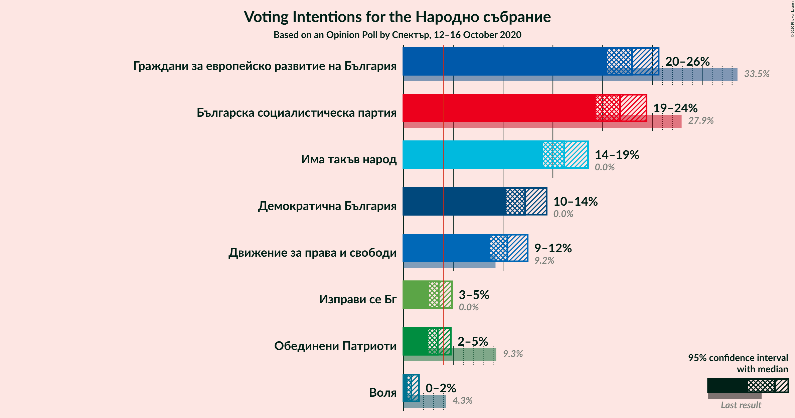
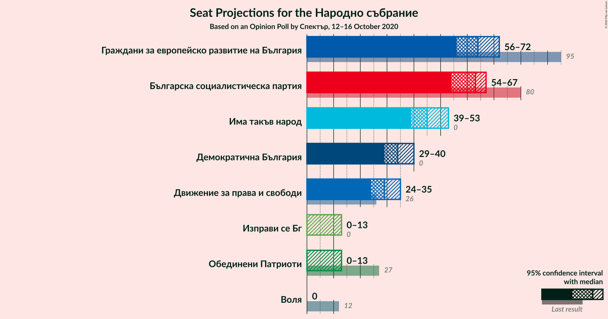
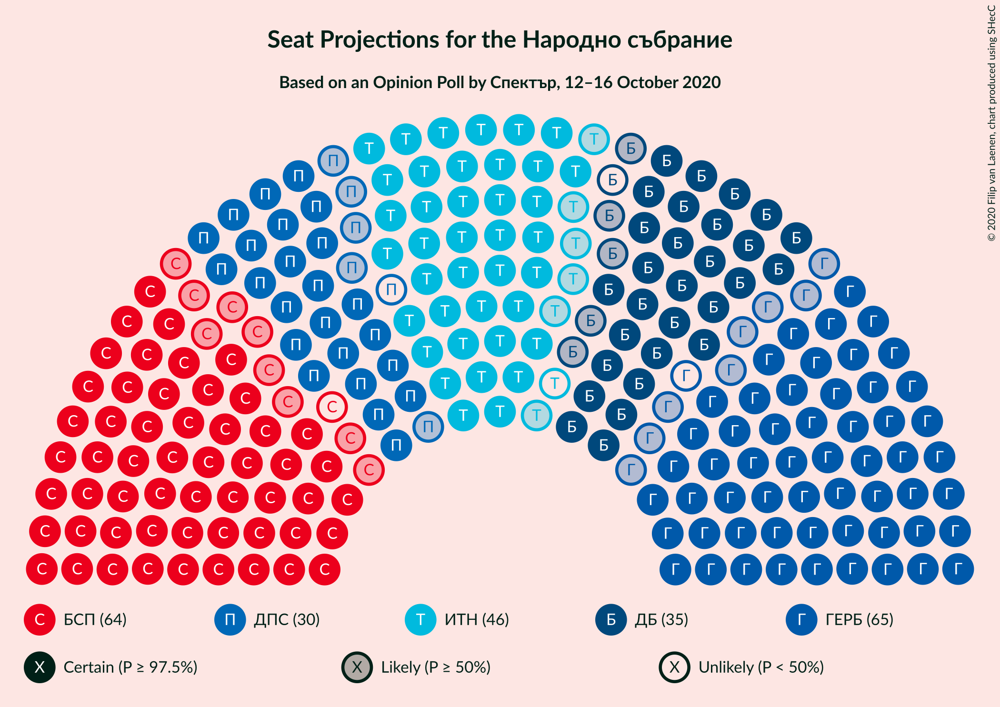
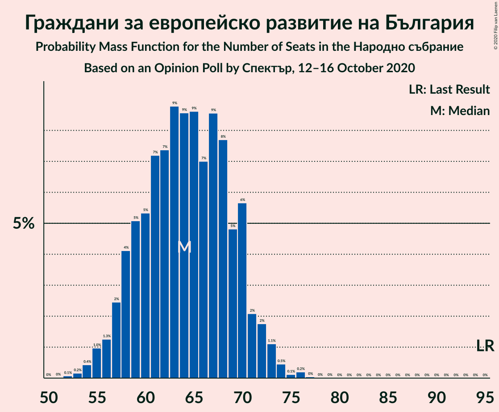
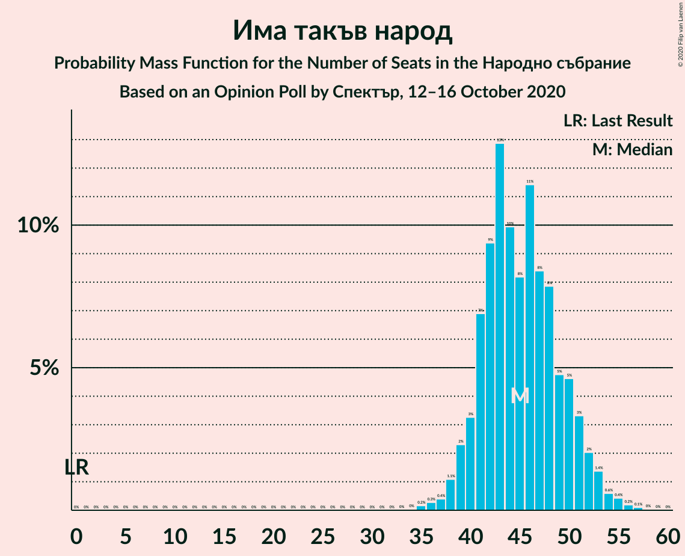
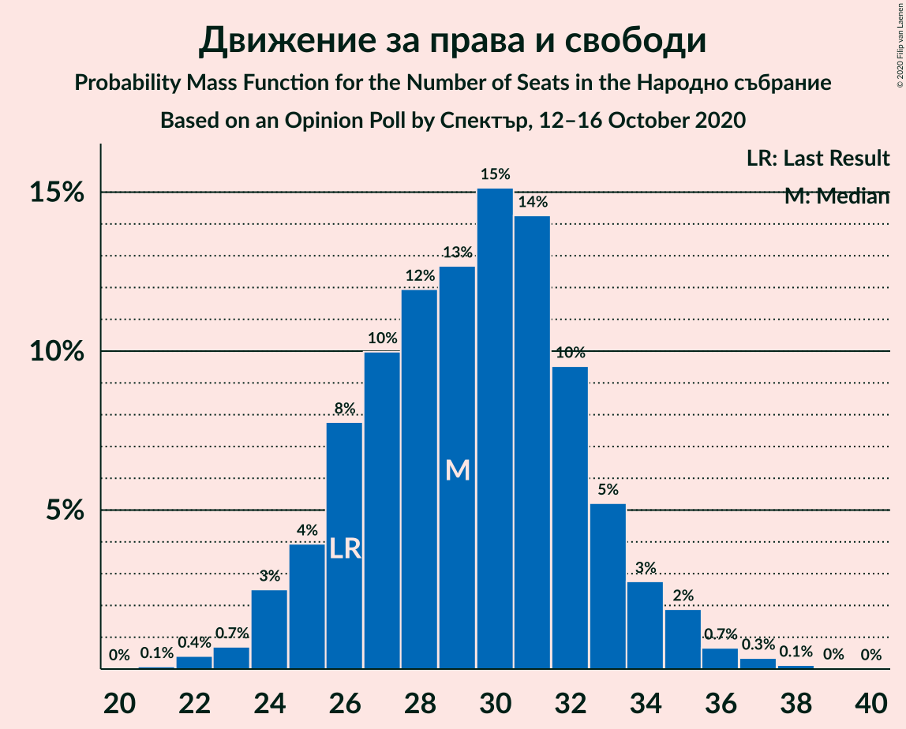
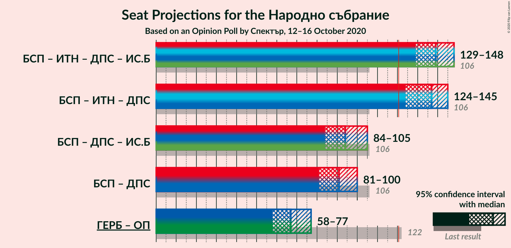
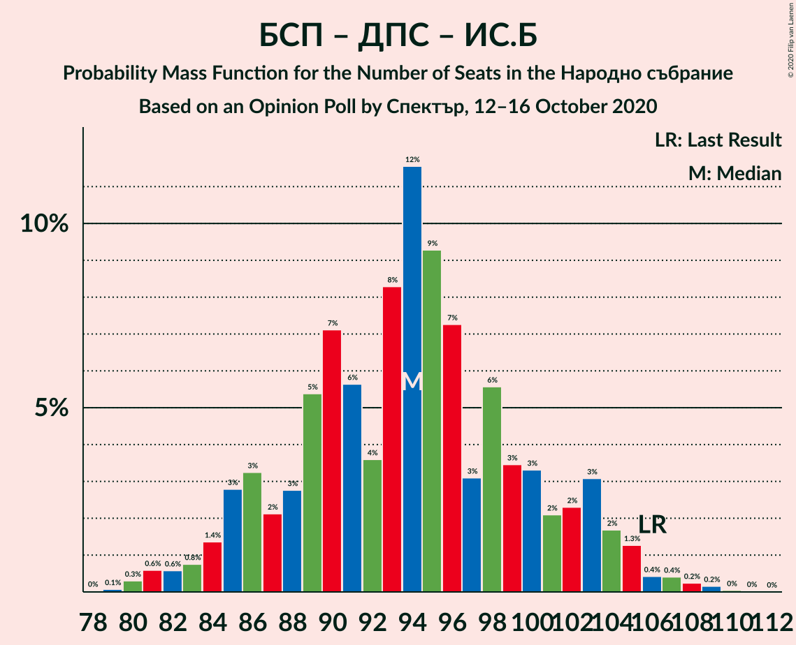
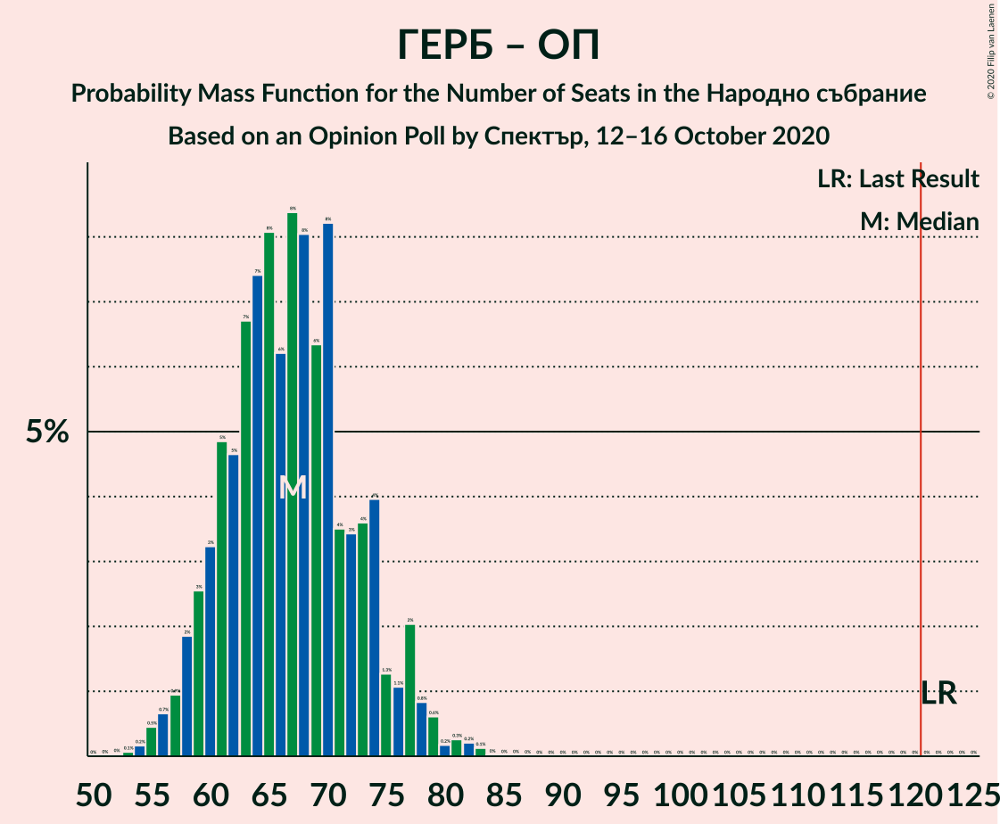

# Opinion Poll by Спектър, 12–16 October 2020

<a href="#voting-intentions">Voting Intentions</a> | <a href="#seats">Seats</a> | <a href="#coalitions">Coalitions</a> | <a href="#technical-information">Technical Information</a>

## Voting Intentions

### Confidence Intervals

| Party | Last Result | Poll Result | 80% Confidence Interval | 90% Confidence Interval | 95% Confidence Interval | 99% Confidence Interval |
|:-----:|:-----------:|:-----------:|:-----------------------:|:-----------------------:|:-----------------------:|:-----------------------:|
| Граждани за европейско развитие на България | 33.5% | 22.9% | 21.3–24.7% |20.8–25.2% |20.5–25.6% |19.7–26.5% |
| Българска социалистическа партия | 27.9% | 21.8% | 20.1–23.5% |19.7–24.0% |19.3–24.4% |18.6–25.2% |
| Има такъв народ | 0.0% | 16.1% | 14.7–17.7% |14.3–18.2% |14.0–18.5% |13.4–19.3% |
| Демократична България | 0.0% | 12.2% | 11.0–13.6% |10.6–14.0% |10.3–14.4% |9.8–15.1% |
| Движение за права и свободи | 9.2% | 10.4% | 9.3–11.8% |9.0–12.1% |8.7–12.5% |8.2–13.1% |
| Изправи се Бг | 0.0% | 3.5% | 2.9–4.4% |2.7–4.6% |2.6–4.9% |2.3–5.3% |
| Обединени Патриоти | 9.3% | 3.4% | 2.8–4.3% |2.6–4.5% |2.5–4.8% |2.2–5.2% |
| Воля | 4.3% | 0.8% | 0.5–1.3% |0.5–1.4% |0.4–1.6% |0.3–1.8% |

*Note:* The poll result column reflects the actual value used in the calculations. Published results may vary slightly, and in addition be rounded to fewer digits.

## Seats

### Confidence Intervals

| Party | Last Result | Median | 80% Confidence Interval | 90% Confidence Interval | 95% Confidence Interval | 99% Confidence Interval |
|:-----:|:-----------:|:------:|:-----------------------:|:-----------------------:|:-----------------------:|:-----------------------:|
| <a href="#граждани-за-европейско-развитие-на-българия">Граждани за европейско развитие на България</a> | 95 | 64 | 59–70 |57–71 |56–72 |54–74 |
| <a href="#българска-социалистическа-партия">Българска социалистическа партия</a> | 80 | 63 | 57–66 |55–66 |54–67 |52–68 |
| <a href="#има-такъв-народ">Има такъв народ</a> | 0 | 45 | 41–50 |40–51 |39–53 |37–55 |
| <a href="#демократична-българия">Демократична България</a> | 0 | 34 | 30–38 |30–39 |29–40 |27–42 |
| <a href="#движение-за-права-и-свободи">Движение за права и свободи</a> | 26 | 29 | 26–33 |25–34 |24–35 |22–37 |
| <a href="#изправи-се-бг">Изправи се Бг</a> | 0 | 0 | 0–12 |0–13 |0–13 |0–14 |
| <a href="#обединени-патриоти">Обединени Патриоти</a> | 27 | 0 | 0–12 |0–13 |0–13 |0–14 |
| <a href="#воля">Воля</a> | 12 | 0 | 0 |0 |0 |0 |

### Граждани за европейско развитие на България

*For a full overview of the results for this party, see the [Граждани за европейско развитие на България](party-гражданизаевропейскоразвитиенабългария.html) page.*

| Number of Seats | Probability | Accumulated | Special Marks |
|:---------------:|:-----------:|:-----------:|:-------------:|
| 52 | 0.1% | 100% |  |
| 53 | 0.2% | 99.9% |  |
| 54 | 0.4% | 99.7% |  |
| 55 | 1.0% | 99.3% |  |
| 56 | 1.3% | 98% |  |
| 57 | 2% | 97% |  |
| 58 | 4% | 95% |  |
| 59 | 5% | 90% |  |
| 60 | 5% | 85% |  |
| 61 | 7% | 80% |  |
| 62 | 7% | 73% |  |
| 63 | 9% | 66% |  |
| 64 | 9% | 57% | Median |
| 65 | 9% | 48% |  |
| 66 | 7% | 40% |  |
| 67 | 9% | 33% |  |
| 68 | 8% | 24% |  |
| 69 | 5% | 16% |  |
| 70 | 6% | 11% |  |
| 71 | 2% | 6% |  |
| 72 | 2% | 4% |  |
| 73 | 1.1% | 2% |  |
| 74 | 0.5% | 0.8% |  |
| 75 | 0.1% | 0.4% |  |
| 76 | 0.2% | 0.3% |  |
| 77 | 0% | 0.1% |  |
| 78 | 0% | 0% |  |
| 79 | 0% | 0% |  |
| 80 | 0% | 0% |  |
| 81 | 0% | 0% |  |
| 82 | 0% | 0% |  |
| 83 | 0% | 0% |  |
| 84 | 0% | 0% |  |
| 85 | 0% | 0% |  |
| 86 | 0% | 0% |  |
| 87 | 0% | 0% |  |
| 88 | 0% | 0% |  |
| 89 | 0% | 0% |  |
| 90 | 0% | 0% |  |
| 91 | 0% | 0% |  |
| 92 | 0% | 0% |  |
| 93 | 0% | 0% |  |
| 94 | 0% | 0% |  |
| 95 | 0% | 0% | Last Result |

### Българска социалистическа партия

*For a full overview of the results for this party, see the [Българска социалистическа партия](party-българскасоциалистическапартия.html) page.*

| Number of Seats | Probability | Accumulated | Special Marks |
|:---------------:|:-----------:|:-----------:|:-------------:|
| 49 | 0.1% | 100% |  |
| 50 | 0.1% | 99.9% |  |
| 51 | 0.2% | 99.7% |  |
| 52 | 0.5% | 99.5% |  |
| 53 | 1.1% | 99.0% |  |
| 54 | 1.1% | 98% |  |
| 55 | 2% | 97% |  |
| 56 | 3% | 94% |  |
| 57 | 5% | 92% |  |
| 58 | 6% | 87% |  |
| 59 | 5% | 81% |  |
| 60 | 6% | 76% |  |
| 61 | 8% | 70% |  |
| 62 | 11% | 62% |  |
| 63 | 13% | 51% | Median |
| 64 | 17% | 38% |  |
| 65 | 10% | 21% |  |
| 66 | 7% | 11% |  |
| 67 | 3% | 4% |  |
| 68 | 0.3% | 0.8% |  |
| 69 | 0.1% | 0.4% |  |
| 70 | 0.1% | 0.3% |  |
| 71 | 0.1% | 0.2% |  |
| 72 | 0% | 0.2% |  |
| 73 | 0% | 0.1% |  |
| 74 | 0% | 0.1% |  |
| 75 | 0% | 0.1% |  |
| 76 | 0% | 0% |  |
| 77 | 0% | 0% |  |
| 78 | 0% | 0% |  |
| 79 | 0% | 0% |  |
| 80 | 0% | 0% | Last Result |

### Има такъв народ

*For a full overview of the results for this party, see the [Има такъв народ](party-иматакъвнарод.html) page.*

| Number of Seats | Probability | Accumulated | Special Marks |
|:---------------:|:-----------:|:-----------:|:-------------:|
| 0 | 0% | 100% | Last Result |
| 1 | 0% | 100% |  |
| 2 | 0% | 100% |  |
| 3 | 0% | 100% |  |
| 4 | 0% | 100% |  |
| 5 | 0% | 100% |  |
| 6 | 0% | 100% |  |
| 7 | 0% | 100% |  |
| 8 | 0% | 100% |  |
| 9 | 0% | 100% |  |
| 10 | 0% | 100% |  |
| 11 | 0% | 100% |  |
| 12 | 0% | 100% |  |
| 13 | 0% | 100% |  |
| 14 | 0% | 100% |  |
| 15 | 0% | 100% |  |
| 16 | 0% | 100% |  |
| 17 | 0% | 100% |  |
| 18 | 0% | 100% |  |
| 19 | 0% | 100% |  |
| 20 | 0% | 100% |  |
| 21 | 0% | 100% |  |
| 22 | 0% | 100% |  |
| 23 | 0% | 100% |  |
| 24 | 0% | 100% |  |
| 25 | 0% | 100% |  |
| 26 | 0% | 100% |  |
| 27 | 0% | 100% |  |
| 28 | 0% | 100% |  |
| 29 | 0% | 100% |  |
| 30 | 0% | 100% |  |
| 31 | 0% | 100% |  |
| 32 | 0% | 100% |  |
| 33 | 0% | 100% |  |
| 34 | 0% | 100% |  |
| 35 | 0.2% | 99.9% |  |
| 36 | 0.3% | 99.8% |  |
| 37 | 0.4% | 99.5% |  |
| 38 | 1.1% | 99.1% |  |
| 39 | 2% | 98% |  |
| 40 | 3% | 96% |  |
| 41 | 7% | 92% |  |
| 42 | 9% | 86% |  |
| 43 | 13% | 76% |  |
| 44 | 10% | 63% |  |
| 45 | 8% | 53% | Median |
| 46 | 11% | 45% |  |
| 47 | 8% | 34% |  |
| 48 | 8% | 25% |  |
| 49 | 5% | 17% |  |
| 50 | 5% | 13% |  |
| 51 | 3% | 8% |  |
| 52 | 2% | 5% |  |
| 53 | 1.4% | 3% |  |
| 54 | 0.6% | 1.4% |  |
| 55 | 0.4% | 0.8% |  |
| 56 | 0.2% | 0.4% |  |
| 57 | 0.1% | 0.2% |  |
| 58 | 0% | 0.1% |  |
| 59 | 0% | 0% |  |

### Демократична България

*For a full overview of the results for this party, see the [Демократична България](party-демократичнабългария.html) page.*

| Number of Seats | Probability | Accumulated | Special Marks |
|:---------------:|:-----------:|:-----------:|:-------------:|
| 0 | 0% | 100% | Last Result |
| 1 | 0% | 100% |  |
| 2 | 0% | 100% |  |
| 3 | 0% | 100% |  |
| 4 | 0% | 100% |  |
| 5 | 0% | 100% |  |
| 6 | 0% | 100% |  |
| 7 | 0% | 100% |  |
| 8 | 0% | 100% |  |
| 9 | 0% | 100% |  |
| 10 | 0% | 100% |  |
| 11 | 0% | 100% |  |
| 12 | 0% | 100% |  |
| 13 | 0% | 100% |  |
| 14 | 0% | 100% |  |
| 15 | 0% | 100% |  |
| 16 | 0% | 100% |  |
| 17 | 0% | 100% |  |
| 18 | 0% | 100% |  |
| 19 | 0% | 100% |  |
| 20 | 0% | 100% |  |
| 21 | 0% | 100% |  |
| 22 | 0% | 100% |  |
| 23 | 0% | 100% |  |
| 24 | 0% | 100% |  |
| 25 | 0.1% | 100% |  |
| 26 | 0.2% | 99.9% |  |
| 27 | 0.6% | 99.7% |  |
| 28 | 1.2% | 99.1% |  |
| 29 | 3% | 98% |  |
| 30 | 6% | 95% |  |
| 31 | 8% | 89% |  |
| 32 | 11% | 81% |  |
| 33 | 12% | 70% |  |
| 34 | 14% | 58% | Median |
| 35 | 17% | 44% |  |
| 36 | 7% | 28% |  |
| 37 | 8% | 21% |  |
| 38 | 6% | 13% |  |
| 39 | 3% | 7% |  |
| 40 | 2% | 4% |  |
| 41 | 1.0% | 2% |  |
| 42 | 0.5% | 0.8% |  |
| 43 | 0.1% | 0.3% |  |
| 44 | 0.1% | 0.2% |  |
| 45 | 0% | 0.1% |  |
| 46 | 0% | 0% |  |

### Движение за права и свободи

*For a full overview of the results for this party, see the [Движение за права и свободи](party-движениезаправаисвободи.html) page.*

| Number of Seats | Probability | Accumulated | Special Marks |
|:---------------:|:-----------:|:-----------:|:-------------:|
| 21 | 0.1% | 100% |  |
| 22 | 0.4% | 99.9% |  |
| 23 | 0.7% | 99.5% |  |
| 24 | 3% | 98.8% |  |
| 25 | 4% | 96% |  |
| 26 | 8% | 92% | Last Result |
| 27 | 10% | 85% |  |
| 28 | 12% | 75% |  |
| 29 | 13% | 63% | Median |
| 30 | 15% | 50% |  |
| 31 | 14% | 35% |  |
| 32 | 10% | 21% |  |
| 33 | 5% | 11% |  |
| 34 | 3% | 6% |  |
| 35 | 2% | 3% |  |
| 36 | 0.7% | 1.2% |  |
| 37 | 0.3% | 0.5% |  |
| 38 | 0.1% | 0.2% |  |
| 39 | 0% | 0.1% |  |
| 40 | 0% | 0% |  |

### Изправи се Бг

*For a full overview of the results for this party, see the [Изправи се Бг](party-изправисебг.html) page.*

| Number of Seats | Probability | Accumulated | Special Marks |
|:---------------:|:-----------:|:-----------:|:-------------:|
| 0 | 77% | 100% | Last Result, Median |
| 1 | 0% | 23% |  |
| 2 | 0% | 23% |  |
| 3 | 0% | 23% |  |
| 4 | 0% | 23% |  |
| 5 | 0% | 23% |  |
| 6 | 0% | 23% |  |
| 7 | 0% | 23% |  |
| 8 | 0% | 23% |  |
| 9 | 0% | 23% |  |
| 10 | 0.1% | 23% |  |
| 11 | 7% | 23% |  |
| 12 | 9% | 15% |  |
| 13 | 4% | 6% |  |
| 14 | 1.4% | 2% |  |
| 15 | 0.4% | 0.5% |  |
| 16 | 0.1% | 0.1% |  |
| 17 | 0% | 0% |  |

### Обединени Патриоти

*For a full overview of the results for this party, see the [Обединени Патриоти](party-обединенипатриоти.html) page.*

| Number of Seats | Probability | Accumulated | Special Marks |
|:---------------:|:-----------:|:-----------:|:-------------:|
| 0 | 78% | 100% | Median |
| 1 | 0% | 22% |  |
| 2 | 0% | 22% |  |
| 3 | 0% | 22% |  |
| 4 | 0% | 22% |  |
| 5 | 0% | 22% |  |
| 6 | 0% | 22% |  |
| 7 | 0% | 22% |  |
| 8 | 0% | 22% |  |
| 9 | 0% | 22% |  |
| 10 | 0.1% | 22% |  |
| 11 | 7% | 22% |  |
| 12 | 9% | 14% |  |
| 13 | 4% | 6% |  |
| 14 | 1.2% | 2% |  |
| 15 | 0.4% | 0.4% |  |
| 16 | 0% | 0.1% |  |
| 17 | 0% | 0% |  |
| 18 | 0% | 0% |  |
| 19 | 0% | 0% |  |
| 20 | 0% | 0% |  |
| 21 | 0% | 0% |  |
| 22 | 0% | 0% |  |
| 23 | 0% | 0% |  |
| 24 | 0% | 0% |  |
| 25 | 0% | 0% |  |
| 26 | 0% | 0% |  |
| 27 | 0% | 0% | Last Result |

### Воля

*For a full overview of the results for this party, see the [Воля](party-воля.html) page.*

| Number of Seats | Probability | Accumulated | Special Marks |
|:---------------:|:-----------:|:-----------:|:-------------:|
| 0 | 100% | 100% | Median |
| 1 | 0% | 0% |  |
| 2 | 0% | 0% |  |
| 3 | 0% | 0% |  |
| 4 | 0% | 0% |  |
| 5 | 0% | 0% |  |
| 6 | 0% | 0% |  |
| 7 | 0% | 0% |  |
| 8 | 0% | 0% |  |
| 9 | 0% | 0% |  |
| 10 | 0% | 0% |  |
| 11 | 0% | 0% |  |
| 12 | 0% | 0% | Last Result |

## Coalitions

### Confidence Intervals

| Coalition | Last Result | Median | Majority? | 80% Confidence Interval | 90% Confidence Interval | 95% Confidence Interval | 99% Confidence Interval |
|:---------:|:-----------:|:------:|:---------:|:-----------------------:|:-----------------------:|:-----------------------:|:-----------------------:|
| Българска социалистическа партия – Има такъв народ – Движение за права и свободи – Изправи се Бг | 106 | 139 | 100% | 132–145 | 131–147 | 129–148 | 125–151 |
| Българска социалистическа партия – Има такъв народ – Движение за права и свободи | 106 | 137 | 99.7% | 129–143 | 126–144 | 124–145 | 121–148 |
| Българска социалистическа партия – Движение за права и свободи – Изправи се Бг | 106 | 94 | 0% | 87–101 | 85–103 | 84–105 | 81–107 |
| Българска социалистическа партия – Движение за права и свободи | 106 | 91 | 0% | 85–97 | 82–98 | 81–100 | 78–102 |
| Граждани за европейско развитие на България – Обединени Патриоти | 122 | 67 | 0% | 61–74 | 59–76 | 58–77 | 55–81 |

### Българска социалистическа партия – Има такъв народ – Движение за права и свободи – Изправи се Бг

| Number of Seats | Probability | Accumulated | Special Marks |
|:---------------:|:-----------:|:-----------:|:-------------:|
| 106 | 0% | 100% | Last Result |
| 107 | 0% | 100% |  |
| 108 | 0% | 100% |  |
| 109 | 0% | 100% |  |
| 110 | 0% | 100% |  |
| 111 | 0% | 100% |  |
| 112 | 0% | 100% |  |
| 113 | 0% | 100% |  |
| 114 | 0% | 100% |  |
| 115 | 0% | 100% |  |
| 116 | 0% | 100% |  |
| 117 | 0% | 100% |  |
| 118 | 0% | 100% |  |
| 119 | 0% | 100% |  |
| 120 | 0% | 100% |  |
| 121 | 0% | 100% | Majority |
| 122 | 0% | 100% |  |
| 123 | 0% | 99.9% |  |
| 124 | 0.1% | 99.9% |  |
| 125 | 0.3% | 99.8% |  |
| 126 | 0.4% | 99.5% |  |
| 127 | 0.5% | 99.0% |  |
| 128 | 0.6% | 98.5% |  |
| 129 | 0.9% | 98% |  |
| 130 | 2% | 97% |  |
| 131 | 3% | 95% |  |
| 132 | 5% | 92% |  |
| 133 | 4% | 88% |  |
| 134 | 3% | 84% |  |
| 135 | 4% | 81% |  |
| 136 | 5% | 77% |  |
| 137 | 9% | 73% | Median |
| 138 | 8% | 63% |  |
| 139 | 9% | 55% |  |
| 140 | 6% | 45% |  |
| 141 | 5% | 39% |  |
| 142 | 9% | 35% |  |
| 143 | 6% | 25% |  |
| 144 | 4% | 19% |  |
| 145 | 5% | 15% |  |
| 146 | 3% | 10% |  |
| 147 | 2% | 7% |  |
| 148 | 2% | 5% |  |
| 149 | 0.9% | 2% |  |
| 150 | 0.7% | 1.4% |  |
| 151 | 0.3% | 0.7% |  |
| 152 | 0.2% | 0.3% |  |
| 153 | 0.1% | 0.2% |  |
| 154 | 0% | 0.1% |  |
| 155 | 0% | 0% |  |

### Българска социалистическа партия – Има такъв народ – Движение за права и свободи

| Number of Seats | Probability | Accumulated | Special Marks |
|:---------------:|:-----------:|:-----------:|:-------------:|
| 106 | 0% | 100% | Last Result |
| 107 | 0% | 100% |  |
| 108 | 0% | 100% |  |
| 109 | 0% | 100% |  |
| 110 | 0% | 100% |  |
| 111 | 0% | 100% |  |
| 112 | 0% | 100% |  |
| 113 | 0% | 100% |  |
| 114 | 0% | 100% |  |
| 115 | 0% | 100% |  |
| 116 | 0% | 100% |  |
| 117 | 0% | 100% |  |
| 118 | 0% | 100% |  |
| 119 | 0.1% | 99.9% |  |
| 120 | 0.2% | 99.8% |  |
| 121 | 0.5% | 99.7% | Majority |
| 122 | 0.6% | 99.2% |  |
| 123 | 0.9% | 98.6% |  |
| 124 | 0.3% | 98% |  |
| 125 | 1.1% | 97% |  |
| 126 | 2% | 96% |  |
| 127 | 2% | 95% |  |
| 128 | 2% | 93% |  |
| 129 | 2% | 91% |  |
| 130 | 3% | 89% |  |
| 131 | 3% | 86% |  |
| 132 | 7% | 83% |  |
| 133 | 7% | 76% |  |
| 134 | 4% | 69% |  |
| 135 | 4% | 65% |  |
| 136 | 5% | 60% |  |
| 137 | 10% | 56% | Median |
| 138 | 9% | 46% |  |
| 139 | 8% | 37% |  |
| 140 | 5% | 29% |  |
| 141 | 4% | 24% |  |
| 142 | 8% | 20% |  |
| 143 | 5% | 12% |  |
| 144 | 3% | 6% |  |
| 145 | 2% | 3% |  |
| 146 | 0.7% | 2% |  |
| 147 | 0.5% | 1.2% |  |
| 148 | 0.3% | 0.7% |  |
| 149 | 0.2% | 0.4% |  |
| 150 | 0.1% | 0.1% |  |
| 151 | 0% | 0.1% |  |
| 152 | 0% | 0% |  |

### Българска социалистическа партия – Движение за права и свободи – Изправи се Бг

| Number of Seats | Probability | Accumulated | Special Marks |
|:---------------:|:-----------:|:-----------:|:-------------:|
| 78 | 0% | 100% |  |
| 79 | 0.1% | 99.9% |  |
| 80 | 0.3% | 99.9% |  |
| 81 | 0.6% | 99.6% |  |
| 82 | 0.6% | 99.0% |  |
| 83 | 0.8% | 98% |  |
| 84 | 1.4% | 98% |  |
| 85 | 3% | 96% |  |
| 86 | 3% | 93% |  |
| 87 | 2% | 90% |  |
| 88 | 3% | 88% |  |
| 89 | 5% | 85% |  |
| 90 | 7% | 80% |  |
| 91 | 6% | 73% |  |
| 92 | 4% | 67% | Median |
| 93 | 8% | 64% |  |
| 94 | 12% | 55% |  |
| 95 | 9% | 44% |  |
| 96 | 7% | 34% |  |
| 97 | 3% | 27% |  |
| 98 | 6% | 24% |  |
| 99 | 3% | 19% |  |
| 100 | 3% | 15% |  |
| 101 | 2% | 12% |  |
| 102 | 2% | 10% |  |
| 103 | 3% | 7% |  |
| 104 | 2% | 4% |  |
| 105 | 1.3% | 3% |  |
| 106 | 0.4% | 1.3% | Last Result |
| 107 | 0.4% | 0.9% |  |
| 108 | 0.2% | 0.5% |  |
| 109 | 0.2% | 0.2% |  |
| 110 | 0% | 0.1% |  |
| 111 | 0% | 0% |  |

### Българска социалистическа партия – Движение за права и свободи

| Number of Seats | Probability | Accumulated | Special Marks |
|:---------------:|:-----------:|:-----------:|:-------------:|
| 75 | 0% | 100% |  |
| 76 | 0.1% | 99.9% |  |
| 77 | 0.2% | 99.9% |  |
| 78 | 0.4% | 99.7% |  |
| 79 | 0.3% | 99.3% |  |
| 80 | 1.0% | 99.0% |  |
| 81 | 2% | 98% |  |
| 82 | 2% | 96% |  |
| 83 | 2% | 95% |  |
| 84 | 2% | 93% |  |
| 85 | 4% | 91% |  |
| 86 | 5% | 86% |  |
| 87 | 4% | 82% |  |
| 88 | 5% | 77% |  |
| 89 | 6% | 73% |  |
| 90 | 9% | 66% |  |
| 91 | 7% | 57% |  |
| 92 | 5% | 50% | Median |
| 93 | 8% | 45% |  |
| 94 | 11% | 37% |  |
| 95 | 9% | 26% |  |
| 96 | 7% | 17% |  |
| 97 | 2% | 10% |  |
| 98 | 4% | 9% |  |
| 99 | 2% | 5% |  |
| 100 | 2% | 3% |  |
| 101 | 0.7% | 1.3% |  |
| 102 | 0.3% | 0.6% |  |
| 103 | 0.2% | 0.3% |  |
| 104 | 0.1% | 0.1% |  |
| 105 | 0.1% | 0.1% |  |
| 106 | 0% | 0% | Last Result |

### Граждани за европейско развитие на България – Обединени Патриоти

| Number of Seats | Probability | Accumulated | Special Marks |
|:---------------:|:-----------:|:-----------:|:-------------:|
| 53 | 0.1% | 100% |  |
| 54 | 0.2% | 99.9% |  |
| 55 | 0.5% | 99.7% |  |
| 56 | 0.7% | 99.3% |  |
| 57 | 0.9% | 98.6% |  |
| 58 | 2% | 98% |  |
| 59 | 3% | 96% |  |
| 60 | 3% | 93% |  |
| 61 | 5% | 90% |  |
| 62 | 5% | 85% |  |
| 63 | 7% | 81% |  |
| 64 | 7% | 74% | Median |
| 65 | 8% | 66% |  |
| 66 | 6% | 58% |  |
| 67 | 8% | 52% |  |
| 68 | 8% | 44% |  |
| 69 | 6% | 36% |  |
| 70 | 8% | 29% |  |
| 71 | 4% | 21% |  |
| 72 | 3% | 18% |  |
| 73 | 4% | 14% |  |
| 74 | 4% | 11% |  |
| 75 | 1.3% | 7% |  |
| 76 | 1.1% | 5% |  |
| 77 | 2% | 4% |  |
| 78 | 0.8% | 2% |  |
| 79 | 0.6% | 1.4% |  |
| 80 | 0.2% | 0.8% |  |
| 81 | 0.3% | 0.6% |  |
| 82 | 0.2% | 0.4% |  |
| 83 | 0.1% | 0.2% |  |
| 84 | 0% | 0.1% |  |
| 85 | 0% | 0% |  |
| 86 | 0% | 0% |  |
| 87 | 0% | 0% |  |
| 88 | 0% | 0% |  |
| 89 | 0% | 0% |  |
| 90 | 0% | 0% |  |
| 91 | 0% | 0% |  |
| 92 | 0% | 0% |  |
| 93 | 0% | 0% |  |
| 94 | 0% | 0% |  |
| 95 | 0% | 0% |  |
| 96 | 0% | 0% |  |
| 97 | 0% | 0% |  |
| 98 | 0% | 0% |  |
| 99 | 0% | 0% |  |
| 100 | 0% | 0% |  |
| 101 | 0% | 0% |  |
| 102 | 0% | 0% |  |
| 103 | 0% | 0% |  |
| 104 | 0% | 0% |  |
| 105 | 0% | 0% |  |
| 106 | 0% | 0% |  |
| 107 | 0% | 0% |  |
| 108 | 0% | 0% |  |
| 109 | 0% | 0% |  |
| 110 | 0% | 0% |  |
| 111 | 0% | 0% |  |
| 112 | 0% | 0% |  |
| 113 | 0% | 0% |  |
| 114 | 0% | 0% |  |
| 115 | 0% | 0% |  |
| 116 | 0% | 0% |  |
| 117 | 0% | 0% |  |
| 118 | 0% | 0% |  |
| 119 | 0% | 0% |  |
| 120 | 0% | 0% |  |
| 121 | 0% | 0% | Majority |
| 122 | 0% | 0% | Last Result |

## Technical Information

### Opinion Poll

+ **Polling firm:** Спектър
+ **Commissioner(s):** —
+ **Fieldwork period:** 12–16 October 2020

### Calculations

+ **Sample size:** 1016
+ **Simulations done:** 1,048,576
+ **Error estimate:** 0.55%

