# Opinion Poll by Барометър България, 24–29 November 2020

<a href="#voting-intentions">Voting Intentions</a> | <a href="#seats">Seats</a> | <a href="#coalitions">Coalitions</a> | <a href="#technical-information">Technical Information</a>

## Voting Intentions

### Confidence Intervals

| Party | Last Result | Poll Result | 80% Confidence Interval | 90% Confidence Interval | 95% Confidence Interval | 99% Confidence Interval |
|:-----:|:-----------:|:-----------:|:-----------------------:|:-----------------------:|:-----------------------:|:-----------------------:|
| Граждани за европейско развитие на България | 33.5% | 33.4% | 31.4–35.5% |30.8–36.1% |30.3–36.7% |29.4–37.7% |
| Българска социалистическа партия | 27.9% | 20.8% | 19.1–22.6% |18.6–23.2% |18.2–23.7% |17.4–24.6% |
| Движение за права и свободи | 9.2% | 13.2% | 11.8–14.8% |11.4–15.3% |11.1–15.7% |10.5–16.5% |
| Обединени Патриоти | 9.3% | 12.6% | 11.3–14.2% |10.9–14.7% |10.6–15.0% |9.9–15.8% |
| Има такъв народ | 0.0% | 6.1% | 5.2–7.3% |4.9–7.7% |4.7–8.0% |4.3–8.6% |
| Демократична България | 0.0% | 5.2% | 4.3–6.3% |4.1–6.6% |3.9–6.9% |3.5–7.5% |
| Изправи се Бг | 0.0% | 2.5% | 1.9–3.3% |1.8–3.6% |1.6–3.8% |1.4–4.2% |
| Воля | 4.3% | 1.2% | 0.8–1.8% |0.7–2.0% |0.6–2.2% |0.5–2.5% |

*Note:* The poll result column reflects the actual value used in the calculations. Published results may vary slightly, and in addition be rounded to fewer digits.

## Seats

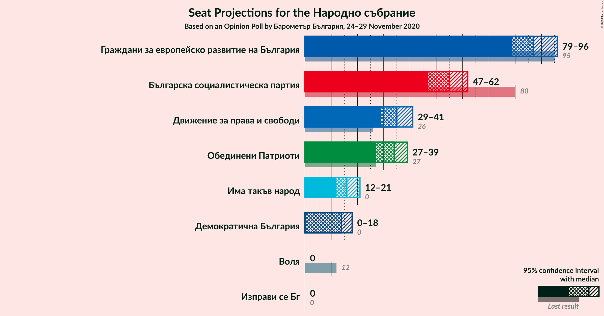

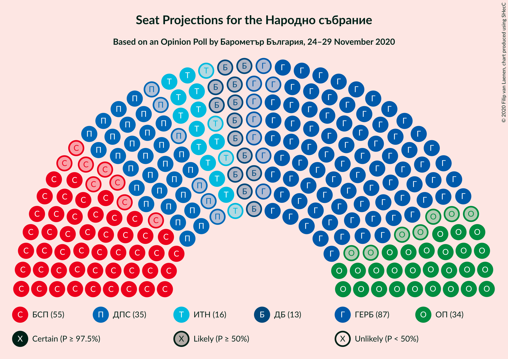

### Confidence Intervals

| Party | Last Result | Median | 80% Confidence Interval | 90% Confidence Interval | 95% Confidence Interval | 99% Confidence Interval |
|:-----:|:-----------:|:------:|:-----------------------:|:-----------------------:|:-----------------------:|:-----------------------:|
| <a href="#граждани-за-европейско-развитие-на-българия">Граждани за европейско развитие на България</a> | 95 | 87 | 82–93 |80–95 |79–96 |77–99 |
| <a href="#българска-социалистическа-партия">Българска социалистическа партия</a> | 80 | 55 | 50–59 |48–61 |47–62 |46–64 |
| <a href="#движение-за-права-и-свободи">Движение за права и свободи</a> | 26 | 35 | 31–39 |30–40 |29–41 |27–43 |
| <a href="#обединени-патриоти">Обединени Патриоти</a> | 27 | 34 | 29–37 |28–38 |27–39 |26–41 |
| <a href="#има-такъв-народ">Има такъв народ</a> | 0 | 16 | 14–19 |13–20 |12–21 |11–22 |
| <a href="#демократична-българия">Демократична България</a> | 0 | 14 | 11–17 |11–18 |0–18 |0–20 |
| <a href="#изправи-се-бг">Изправи се Бг</a> | 0 | 0 | 0 |0 |0 |0–11 |
| <a href="#воля">Воля</a> | 12 | 0 | 0 |0 |0 |0 |

### Граждани за европейско развитие на България

*For a full overview of the results for this party, see the [Граждани за европейско развитие на България](party-гражданизаевропейскоразвитиенабългария.html) page.*

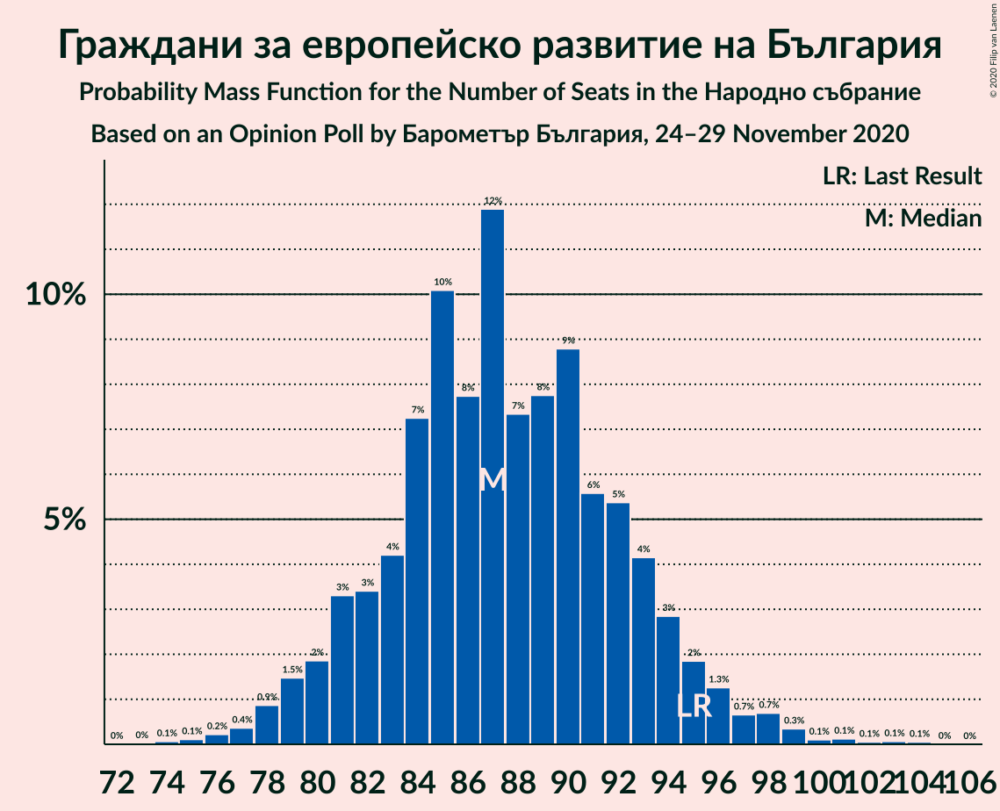

| Number of Seats | Probability | Accumulated | Special Marks |
|:---------------:|:-----------:|:-----------:|:-------------:|
| 74 | 0.1% | 100% |  |
| 75 | 0.1% | 99.9% |  |
| 76 | 0.2% | 99.8% |  |
| 77 | 0.4% | 99.6% |  |
| 78 | 0.9% | 99.2% |  |
| 79 | 1.5% | 98% |  |
| 80 | 2% | 97% |  |
| 81 | 3% | 95% |  |
| 82 | 3% | 92% |  |
| 83 | 4% | 88% |  |
| 84 | 7% | 84% |  |
| 85 | 10% | 77% |  |
| 86 | 8% | 67% |  |
| 87 | 12% | 59% | Median |
| 88 | 7% | 47% |  |
| 89 | 8% | 40% |  |
| 90 | 9% | 32% |  |
| 91 | 6% | 23% |  |
| 92 | 5% | 18% |  |
| 93 | 4% | 12% |  |
| 94 | 3% | 8% |  |
| 95 | 2% | 5% | Last Result |
| 96 | 1.3% | 3% |  |
| 97 | 0.7% | 2% |  |
| 98 | 0.7% | 1.5% |  |
| 99 | 0.3% | 0.8% |  |
| 100 | 0.1% | 0.4% |  |
| 101 | 0.1% | 0.3% |  |
| 102 | 0.1% | 0.2% |  |
| 103 | 0.1% | 0.1% |  |
| 104 | 0.1% | 0.1% |  |
| 105 | 0% | 0% |  |

### Българска социалистическа партия

*For a full overview of the results for this party, see the [Българска социалистическа партия](party-българскасоциалистическапартия.html) page.*

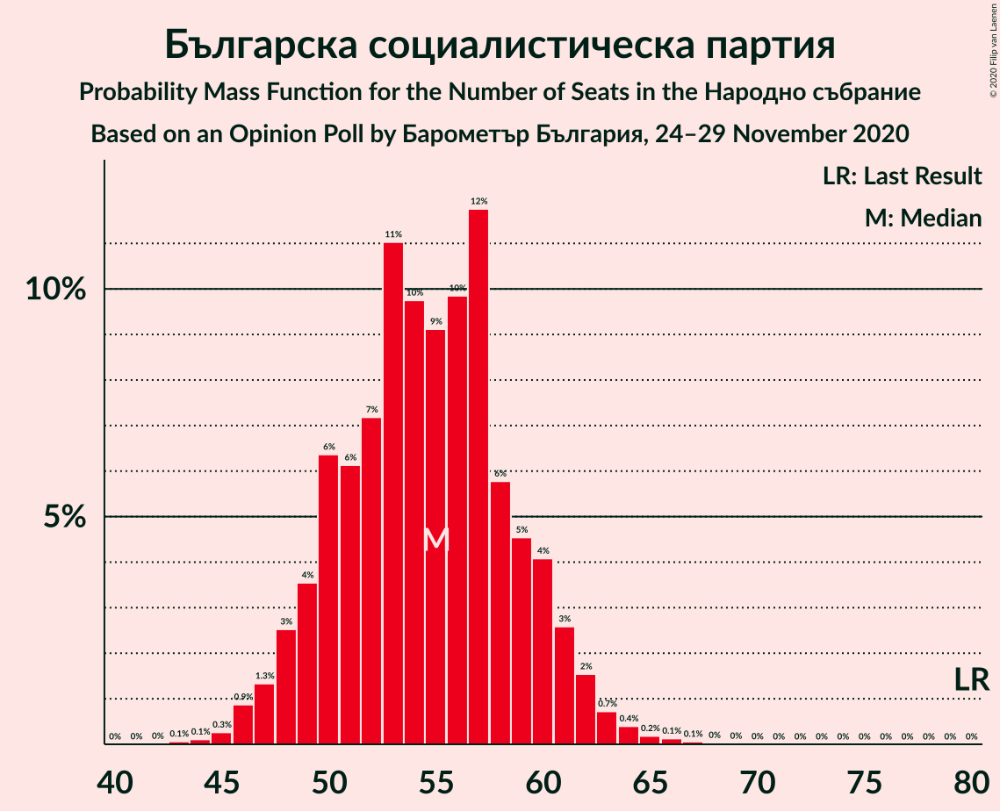

| Number of Seats | Probability | Accumulated | Special Marks |
|:---------------:|:-----------:|:-----------:|:-------------:|
| 43 | 0.1% | 100% |  |
| 44 | 0.1% | 99.9% |  |
| 45 | 0.3% | 99.8% |  |
| 46 | 0.9% | 99.5% |  |
| 47 | 1.3% | 98.7% |  |
| 48 | 3% | 97% |  |
| 49 | 4% | 95% |  |
| 50 | 6% | 91% |  |
| 51 | 6% | 85% |  |
| 52 | 7% | 79% |  |
| 53 | 11% | 72% |  |
| 54 | 10% | 61% |  |
| 55 | 9% | 51% | Median |
| 56 | 10% | 42% |  |
| 57 | 12% | 32% |  |
| 58 | 6% | 20% |  |
| 59 | 5% | 14% |  |
| 60 | 4% | 10% |  |
| 61 | 3% | 6% |  |
| 62 | 2% | 3% |  |
| 63 | 0.7% | 2% |  |
| 64 | 0.4% | 0.8% |  |
| 65 | 0.2% | 0.4% |  |
| 66 | 0.1% | 0.2% |  |
| 67 | 0.1% | 0.1% |  |
| 68 | 0% | 0.1% |  |
| 69 | 0% | 0% |  |
| 70 | 0% | 0% |  |
| 71 | 0% | 0% |  |
| 72 | 0% | 0% |  |
| 73 | 0% | 0% |  |
| 74 | 0% | 0% |  |
| 75 | 0% | 0% |  |
| 76 | 0% | 0% |  |
| 77 | 0% | 0% |  |
| 78 | 0% | 0% |  |
| 79 | 0% | 0% |  |
| 80 | 0% | 0% | Last Result |

### Движение за права и свободи

*For a full overview of the results for this party, see the [Движение за права и свободи](party-движениезаправаисвободи.html) page.*

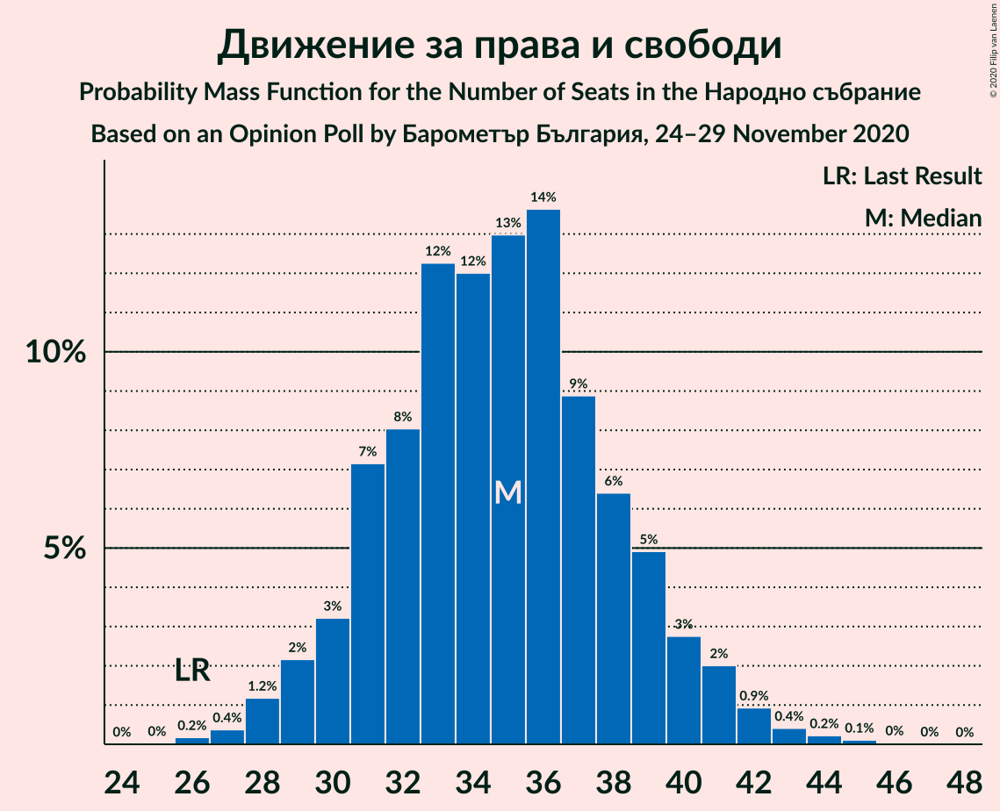

| Number of Seats | Probability | Accumulated | Special Marks |
|:---------------:|:-----------:|:-----------:|:-------------:|
| 26 | 0.2% | 100% | Last Result |
| 27 | 0.4% | 99.8% |  |
| 28 | 1.2% | 99.4% |  |
| 29 | 2% | 98% |  |
| 30 | 3% | 96% |  |
| 31 | 7% | 93% |  |
| 32 | 8% | 86% |  |
| 33 | 12% | 78% |  |
| 34 | 12% | 65% |  |
| 35 | 13% | 53% | Median |
| 36 | 14% | 40% |  |
| 37 | 9% | 27% |  |
| 38 | 6% | 18% |  |
| 39 | 5% | 11% |  |
| 40 | 3% | 7% |  |
| 41 | 2% | 4% |  |
| 42 | 0.9% | 2% |  |
| 43 | 0.4% | 0.8% |  |
| 44 | 0.2% | 0.4% |  |
| 45 | 0.1% | 0.2% |  |
| 46 | 0% | 0.1% |  |
| 47 | 0% | 0% |  |

### Обединени Патриоти

*For a full overview of the results for this party, see the [Обединени Патриоти](party-обединенипатриоти.html) page.*

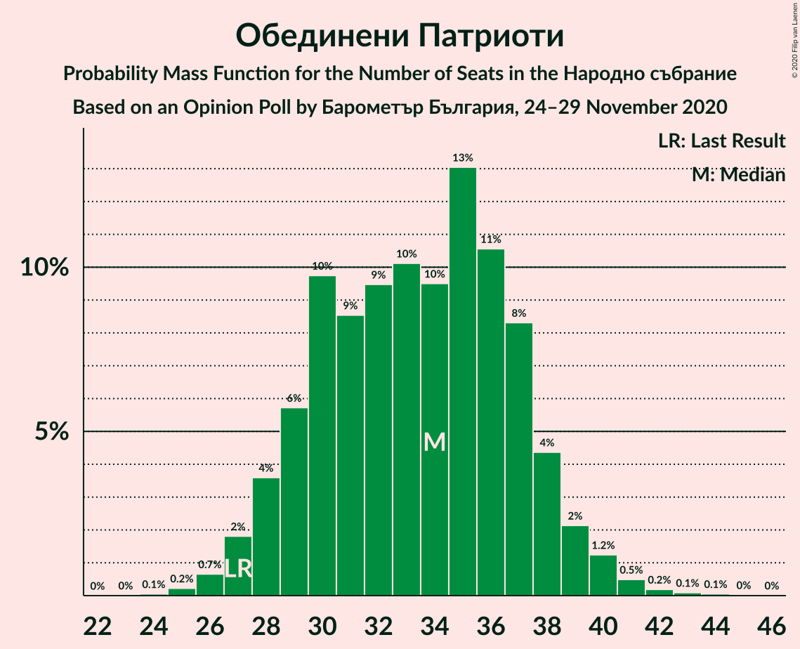

| Number of Seats | Probability | Accumulated | Special Marks |
|:---------------:|:-----------:|:-----------:|:-------------:|
| 24 | 0.1% | 100% |  |
| 25 | 0.2% | 99.9% |  |
| 26 | 0.7% | 99.7% |  |
| 27 | 2% | 99.1% | Last Result |
| 28 | 4% | 97% |  |
| 29 | 6% | 94% |  |
| 30 | 10% | 88% |  |
| 31 | 9% | 78% |  |
| 32 | 9% | 70% |  |
| 33 | 10% | 60% |  |
| 34 | 10% | 50% | Median |
| 35 | 13% | 41% |  |
| 36 | 11% | 27% |  |
| 37 | 8% | 17% |  |
| 38 | 4% | 9% |  |
| 39 | 2% | 4% |  |
| 40 | 1.2% | 2% |  |
| 41 | 0.5% | 0.9% |  |
| 42 | 0.2% | 0.4% |  |
| 43 | 0.1% | 0.2% |  |
| 44 | 0.1% | 0.1% |  |
| 45 | 0% | 0% |  |

### Има такъв народ

*For a full overview of the results for this party, see the [Има такъв народ](party-иматакъвнарод.html) page.*

| Number of Seats | Probability | Accumulated | Special Marks |
|:---------------:|:-----------:|:-----------:|:-------------:|
| 0 | 0.1% | 100% | Last Result |
| 1 | 0% | 99.9% |  |
| 2 | 0% | 99.9% |  |
| 3 | 0% | 99.9% |  |
| 4 | 0% | 99.9% |  |
| 5 | 0% | 99.9% |  |
| 6 | 0% | 99.9% |  |
| 7 | 0% | 99.9% |  |
| 8 | 0% | 99.9% |  |
| 9 | 0% | 99.9% |  |
| 10 | 0% | 99.9% |  |
| 11 | 0.7% | 99.8% |  |
| 12 | 3% | 99.2% |  |
| 13 | 6% | 97% |  |
| 14 | 13% | 90% |  |
| 15 | 13% | 77% |  |
| 16 | 20% | 64% | Median |
| 17 | 17% | 44% |  |
| 18 | 11% | 27% |  |
| 19 | 9% | 17% |  |
| 20 | 4% | 8% |  |
| 21 | 3% | 4% |  |
| 22 | 0.9% | 1.4% |  |
| 23 | 0.4% | 0.5% |  |
| 24 | 0.1% | 0.1% |  |
| 25 | 0% | 0% |  |

### Демократична България

*For a full overview of the results for this party, see the [Демократична България](party-демократичнабългария.html) page.*

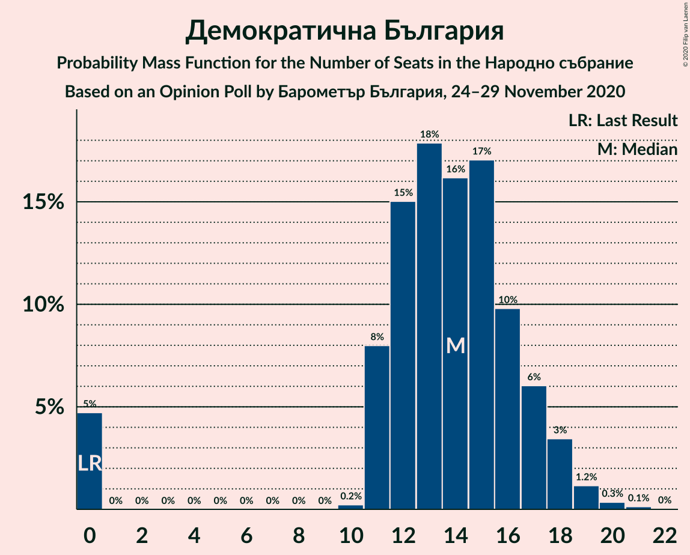

| Number of Seats | Probability | Accumulated | Special Marks |
|:---------------:|:-----------:|:-----------:|:-------------:|
| 0 | 5% | 100% | Last Result |
| 1 | 0% | 95% |  |
| 2 | 0% | 95% |  |
| 3 | 0% | 95% |  |
| 4 | 0% | 95% |  |
| 5 | 0% | 95% |  |
| 6 | 0% | 95% |  |
| 7 | 0% | 95% |  |
| 8 | 0% | 95% |  |
| 9 | 0% | 95% |  |
| 10 | 0.2% | 95% |  |
| 11 | 8% | 95% |  |
| 12 | 15% | 87% |  |
| 13 | 18% | 72% |  |
| 14 | 16% | 54% | Median |
| 15 | 17% | 38% |  |
| 16 | 10% | 21% |  |
| 17 | 6% | 11% |  |
| 18 | 3% | 5% |  |
| 19 | 1.2% | 2% |  |
| 20 | 0.3% | 0.5% |  |
| 21 | 0.1% | 0.2% |  |
| 22 | 0% | 0% |  |

### Изправи се Бг

*For a full overview of the results for this party, see the [Изправи се Бг](party-изправисебг.html) page.*

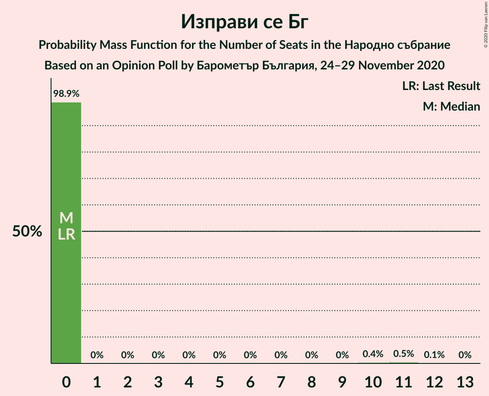

| Number of Seats | Probability | Accumulated | Special Marks |
|:---------------:|:-----------:|:-----------:|:-------------:|
| 0 | 98.9% | 100% | Last Result, Median |
| 1 | 0% | 1.1% |  |
| 2 | 0% | 1.1% |  |
| 3 | 0% | 1.1% |  |
| 4 | 0% | 1.1% |  |
| 5 | 0% | 1.1% |  |
| 6 | 0% | 1.1% |  |
| 7 | 0% | 1.1% |  |
| 8 | 0% | 1.1% |  |
| 9 | 0% | 1.1% |  |
| 10 | 0.4% | 1.1% |  |
| 11 | 0.5% | 0.6% |  |
| 12 | 0.1% | 0.1% |  |
| 13 | 0% | 0% |  |

### Воля

*For a full overview of the results for this party, see the [Воля](party-воля.html) page.*

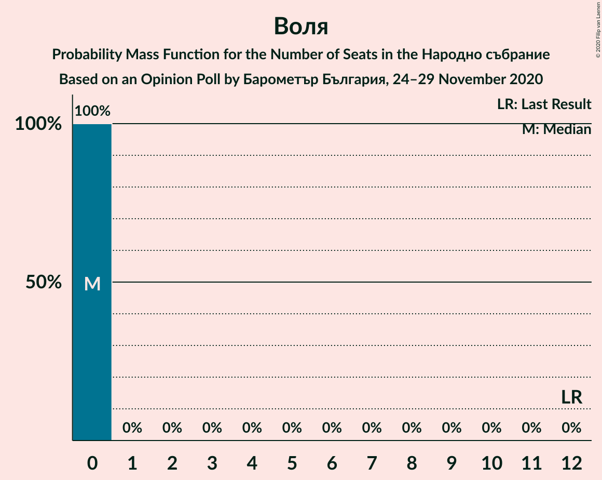

| Number of Seats | Probability | Accumulated | Special Marks |
|:---------------:|:-----------:|:-----------:|:-------------:|
| 0 | 100% | 100% | Median |
| 1 | 0% | 0% |  |
| 2 | 0% | 0% |  |
| 3 | 0% | 0% |  |
| 4 | 0% | 0% |  |
| 5 | 0% | 0% |  |
| 6 | 0% | 0% |  |
| 7 | 0% | 0% |  |
| 8 | 0% | 0% |  |
| 9 | 0% | 0% |  |
| 10 | 0% | 0% |  |
| 11 | 0% | 0% |  |
| 12 | 0% | 0% | Last Result |

## Coalitions

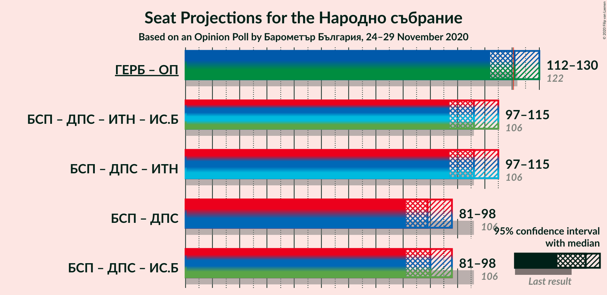

### Confidence Intervals

| Coalition | Last Result | Median | Majority? | 80% Confidence Interval | 90% Confidence Interval | 95% Confidence Interval | 99% Confidence Interval |
|:---------:|:-----------:|:------:|:---------:|:-----------------------:|:-----------------------:|:-----------------------:|:-----------------------:|
| Граждани за европейско развитие на България – Обединени Патриоти | 122 | 121 | 54% | 115–127 | 113–129 | 112–130 | 109–134 |
| Българска социалистическа партия – Движение за права и свободи – Има такъв народ – Изправи се Бг | 106 | 106 | 0.1% | 100–112 | 98–113 | 97–115 | 94–118 |
| Българска социалистическа партия – Движение за права и свободи – Има такъв народ | 106 | 106 | 0.1% | 100–112 | 98–113 | 97–115 | 94–118 |
| Българска социалистическа партия – Движение за права и свободи | 106 | 89 | 0% | 84–95 | 82–96 | 81–98 | 78–101 |
| Българска социалистическа партия – Движение за права и свободи – Изправи се Бг | 106 | 90 | 0% | 84–95 | 82–96 | 81–98 | 78–101 |

### Граждани за европейско развитие на България – Обединени Патриоти

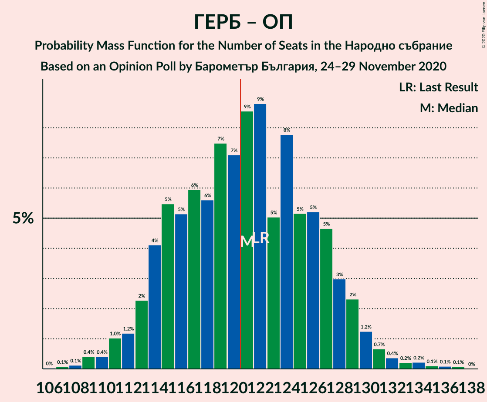

| Number of Seats | Probability | Accumulated | Special Marks |
|:---------------:|:-----------:|:-----------:|:-------------:|
| 106 | 0% | 100% |  |
| 107 | 0.1% | 99.9% |  |
| 108 | 0.1% | 99.9% |  |
| 109 | 0.4% | 99.7% |  |
| 110 | 0.4% | 99.3% |  |
| 111 | 1.0% | 98.9% |  |
| 112 | 1.2% | 98% |  |
| 113 | 2% | 97% |  |
| 114 | 4% | 94% |  |
| 115 | 5% | 90% |  |
| 116 | 5% | 85% |  |
| 117 | 6% | 80% |  |
| 118 | 6% | 74% |  |
| 119 | 7% | 68% |  |
| 120 | 7% | 61% |  |
| 121 | 9% | 54% | Median, Majority |
| 122 | 9% | 45% | Last Result |
| 123 | 5% | 36% |  |
| 124 | 8% | 31% |  |
| 125 | 5% | 23% |  |
| 126 | 5% | 18% |  |
| 127 | 5% | 13% |  |
| 128 | 3% | 8% |  |
| 129 | 2% | 5% |  |
| 130 | 1.2% | 3% |  |
| 131 | 0.7% | 2% |  |
| 132 | 0.4% | 1.1% |  |
| 133 | 0.2% | 0.7% |  |
| 134 | 0.2% | 0.5% |  |
| 135 | 0.1% | 0.3% |  |
| 136 | 0.1% | 0.2% |  |
| 137 | 0.1% | 0.1% |  |
| 138 | 0% | 0% |  |

### Българска социалистическа партия – Движение за права и свободи – Има такъв народ – Изправи се Бг

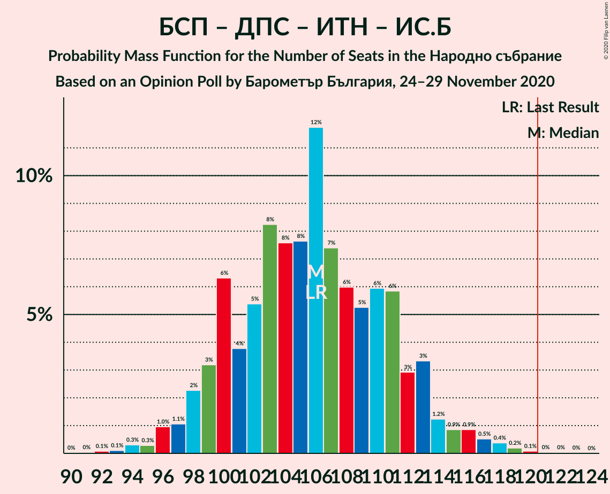

| Number of Seats | Probability | Accumulated | Special Marks |
|:---------------:|:-----------:|:-----------:|:-------------:|
| 91 | 0% | 100% |  |
| 92 | 0.1% | 99.9% |  |
| 93 | 0.1% | 99.8% |  |
| 94 | 0.3% | 99.7% |  |
| 95 | 0.3% | 99.4% |  |
| 96 | 1.0% | 99.1% |  |
| 97 | 1.1% | 98% |  |
| 98 | 2% | 97% |  |
| 99 | 3% | 95% |  |
| 100 | 6% | 92% |  |
| 101 | 4% | 85% |  |
| 102 | 5% | 82% |  |
| 103 | 8% | 76% |  |
| 104 | 8% | 68% |  |
| 105 | 8% | 60% |  |
| 106 | 12% | 53% | Last Result, Median |
| 107 | 7% | 41% |  |
| 108 | 6% | 34% |  |
| 109 | 5% | 28% |  |
| 110 | 6% | 22% |  |
| 111 | 6% | 16% |  |
| 112 | 3% | 11% |  |
| 113 | 3% | 8% |  |
| 114 | 1.2% | 4% |  |
| 115 | 0.9% | 3% |  |
| 116 | 0.9% | 2% |  |
| 117 | 0.5% | 1.3% |  |
| 118 | 0.4% | 0.8% |  |
| 119 | 0.2% | 0.4% |  |
| 120 | 0.1% | 0.2% |  |
| 121 | 0% | 0.1% | Majority |
| 122 | 0% | 0.1% |  |
| 123 | 0% | 0% |  |

### Българска социалистическа партия – Движение за права и свободи – Има такъв народ

| Number of Seats | Probability | Accumulated | Special Marks |
|:---------------:|:-----------:|:-----------:|:-------------:|
| 91 | 0% | 100% |  |
| 92 | 0.1% | 99.9% |  |
| 93 | 0.1% | 99.8% |  |
| 94 | 0.3% | 99.7% |  |
| 95 | 0.3% | 99.4% |  |
| 96 | 1.0% | 99.1% |  |
| 97 | 1.1% | 98% |  |
| 98 | 2% | 97% |  |
| 99 | 3% | 94% |  |
| 100 | 6% | 91% |  |
| 101 | 4% | 85% |  |
| 102 | 5% | 81% |  |
| 103 | 8% | 76% |  |
| 104 | 8% | 67% |  |
| 105 | 8% | 60% |  |
| 106 | 12% | 52% | Last Result, Median |
| 107 | 7% | 40% |  |
| 108 | 6% | 33% |  |
| 109 | 5% | 27% |  |
| 110 | 6% | 22% |  |
| 111 | 6% | 16% |  |
| 112 | 3% | 10% |  |
| 113 | 3% | 7% |  |
| 114 | 1.2% | 4% |  |
| 115 | 0.7% | 3% |  |
| 116 | 0.8% | 2% |  |
| 117 | 0.5% | 1.2% |  |
| 118 | 0.4% | 0.7% |  |
| 119 | 0.2% | 0.3% |  |
| 120 | 0.1% | 0.1% |  |
| 121 | 0% | 0.1% | Majority |
| 122 | 0% | 0.1% |  |
| 123 | 0% | 0% |  |

### Българска социалистическа партия – Движение за права и свободи

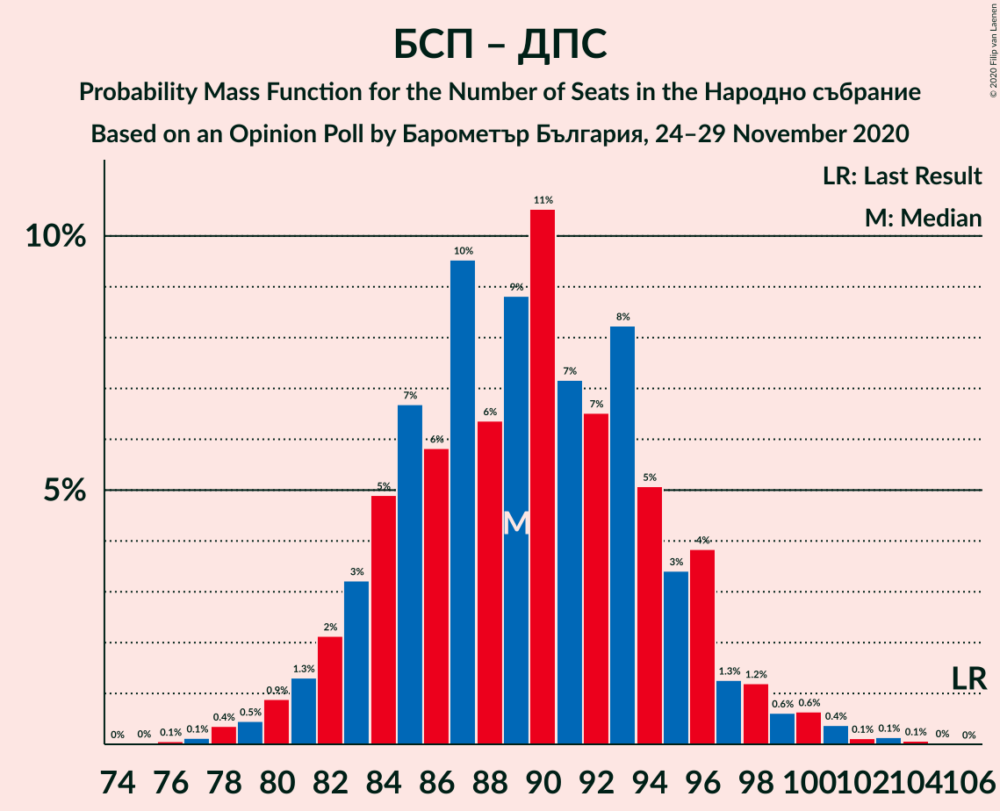

| Number of Seats | Probability | Accumulated | Special Marks |
|:---------------:|:-----------:|:-----------:|:-------------:|
| 76 | 0.1% | 100% |  |
| 77 | 0.1% | 99.9% |  |
| 78 | 0.4% | 99.8% |  |
| 79 | 0.5% | 99.4% |  |
| 80 | 0.9% | 99.0% |  |
| 81 | 1.3% | 98% |  |
| 82 | 2% | 97% |  |
| 83 | 3% | 95% |  |
| 84 | 5% | 91% |  |
| 85 | 7% | 87% |  |
| 86 | 6% | 80% |  |
| 87 | 10% | 74% |  |
| 88 | 6% | 64% |  |
| 89 | 9% | 58% |  |
| 90 | 11% | 49% | Median |
| 91 | 7% | 39% |  |
| 92 | 7% | 32% |  |
| 93 | 8% | 25% |  |
| 94 | 5% | 17% |  |
| 95 | 3% | 12% |  |
| 96 | 4% | 8% |  |
| 97 | 1.3% | 4% |  |
| 98 | 1.2% | 3% |  |
| 99 | 0.6% | 2% |  |
| 100 | 0.6% | 1.4% |  |
| 101 | 0.4% | 0.8% |  |
| 102 | 0.1% | 0.4% |  |
| 103 | 0.1% | 0.3% |  |
| 104 | 0.1% | 0.1% |  |
| 105 | 0% | 0.1% |  |
| 106 | 0% | 0% | Last Result |

### Българска социалистическа партия – Движение за права и свободи – Изправи се Бг

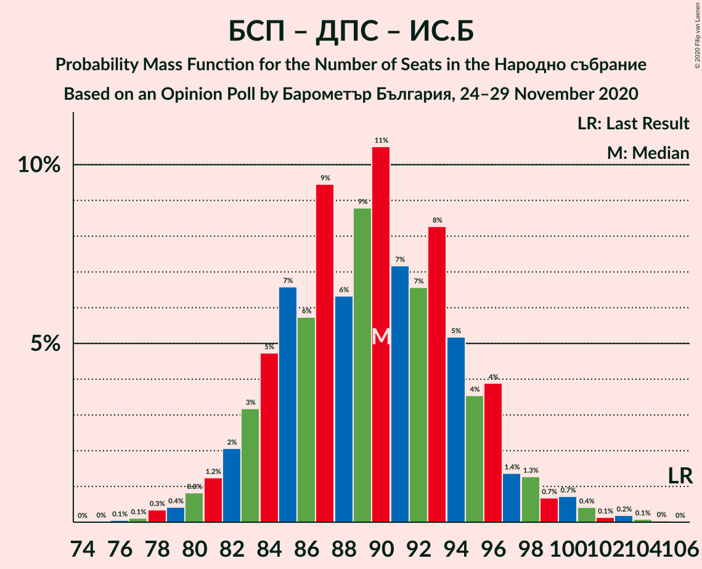

| Number of Seats | Probability | Accumulated | Special Marks |
|:---------------:|:-----------:|:-----------:|:-------------:|
| 76 | 0.1% | 100% |  |
| 77 | 0.1% | 99.9% |  |
| 78 | 0.3% | 99.8% |  |
| 79 | 0.4% | 99.4% |  |
| 80 | 0.8% | 99.0% |  |
| 81 | 1.2% | 98% |  |
| 82 | 2% | 97% |  |
| 83 | 3% | 95% |  |
| 84 | 5% | 92% |  |
| 85 | 7% | 87% |  |
| 86 | 6% | 80% |  |
| 87 | 9% | 75% |  |
| 88 | 6% | 65% |  |
| 89 | 9% | 59% |  |
| 90 | 11% | 50% | Median |
| 91 | 7% | 40% |  |
| 92 | 7% | 32% |  |
| 93 | 8% | 26% |  |
| 94 | 5% | 18% |  |
| 95 | 4% | 12% |  |
| 96 | 4% | 9% |  |
| 97 | 1.4% | 5% |  |
| 98 | 1.3% | 4% |  |
| 99 | 0.7% | 2% |  |
| 100 | 0.7% | 2% |  |
| 101 | 0.4% | 0.9% |  |
| 102 | 0.1% | 0.5% |  |
| 103 | 0.2% | 0.4% |  |
| 104 | 0.1% | 0.2% |  |
| 105 | 0% | 0.1% |  |
| 106 | 0% | 0% | Last Result |

## Technical Information

### Opinion Poll

+ **Polling firm:** Барометър България
+ **Commissioner(s):** —
+ **Fieldwork period:** 24–29 November 2020

### Calculations

+ **Sample size:** 847
+ **Simulations done:** 1,048,576
+ **Error estimate:** 1.71%

