# Opinion Poll by Exacta, 5–12 December 2020

<a href="#voting-intentions">Voting Intentions</a> | <a href="#seats">Seats</a> | <a href="#coalitions">Coalitions</a> | <a href="#technical-information">Technical Information</a>

## Voting Intentions

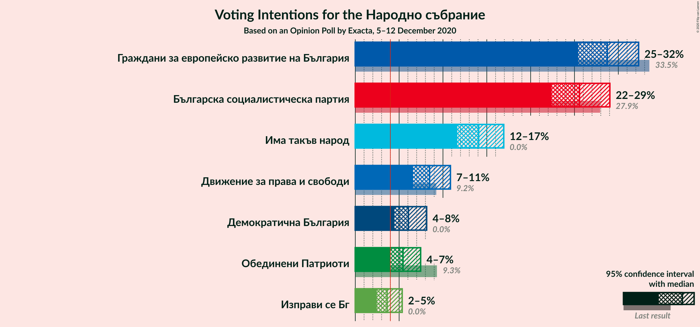

### Confidence Intervals

| Party | Last Result | Poll Result | 80% Confidence Interval | 90% Confidence Interval | 95% Confidence Interval | 99% Confidence Interval |
|:-----:|:-----------:|:-----------:|:-----------------------:|:-----------------------:|:-----------------------:|:-----------------------:|
| Граждани за европейско развитие на България | 33.5% | 28.7% | 26.6–31.1% |25.9–31.7% |25.4–32.3% |24.4–33.5% |
| Българска социалистическа партия | 27.9% | 25.6% | 23.5–27.8% |22.9–28.5% |22.4–29.0% |21.4–30.1% |
| Има такъв народ | 0.0% | 14.1% | 12.5–15.9% |12.0–16.5% |11.6–16.9% |10.9–17.9% |
| Движение за права и свободи | 9.2% | 8.5% | 7.2–10.0% |6.9–10.5% |6.6–10.9% |6.0–11.6% |
| Демократична България | 0.0% | 6.1% | 5.0–7.4% |4.7–7.8% |4.5–8.1% |4.0–8.8% |
| Обединени Патриоти | 9.3% | 5.4% | 4.5–6.8% |4.2–7.1% |4.0–7.5% |3.5–8.1% |
| Изправи се Бг | 0.0% | 3.6% | 2.9–4.8% |2.6–5.1% |2.5–5.3% |2.1–5.9% |

*Note:* The poll result column reflects the actual value used in the calculations. Published results may vary slightly, and in addition be rounded to fewer digits.

## Seats

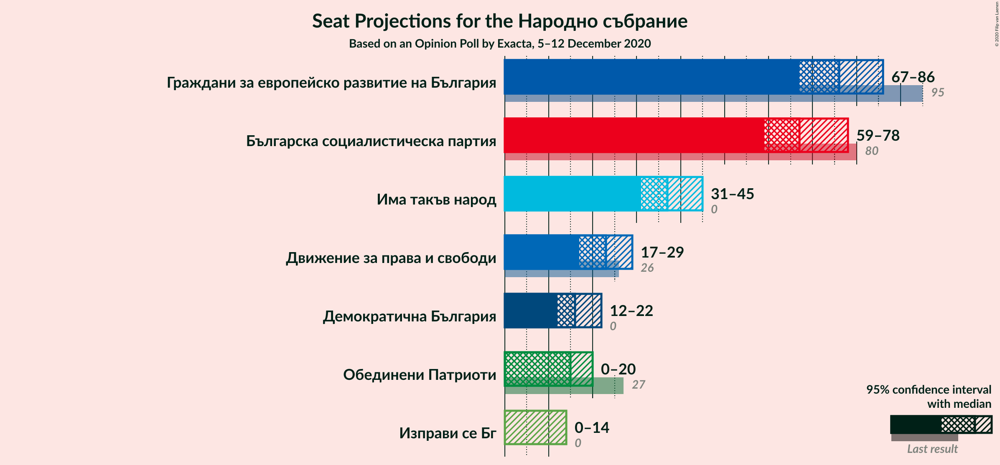

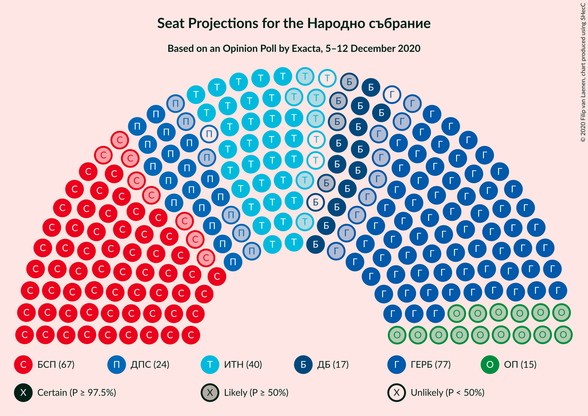

### Confidence Intervals

| Party | Last Result | Median | 80% Confidence Interval | 90% Confidence Interval | 95% Confidence Interval | 99% Confidence Interval |
|:-----:|:-----------:|:------:|:-----------------------:|:-----------------------:|:-----------------------:|:-----------------------:|
| <a href="#граждани-за-европейско-развитие-на-българия">Граждани за европейско развитие на България</a> | 95 | 76 | 70–83 |68–85 |67–86 |64–90 |
| <a href="#българска-социалистическа-партия">Българска социалистическа партия</a> | 80 | 67 | 62–75 |61–76 |59–78 |56–81 |
| <a href="#има-такъв-народ">Има такъв народ</a> | 0 | 37 | 33–43 |32–44 |31–45 |29–48 |
| <a href="#движение-за-права-и-свободи">Движение за права и свободи</a> | 26 | 23 | 19–27 |18–28 |17–29 |16–31 |
| <a href="#демократична-българия">Демократична България</a> | 0 | 16 | 13–20 |13–21 |12–22 |0–24 |
| <a href="#обединени-патриоти">Обединени Патриоти</a> | 27 | 15 | 12–18 |11–19 |0–20 |0–22 |
| <a href="#изправи-се-бг">Изправи се Бг</a> | 0 | 0 | 0–12 |0–13 |0–14 |0–15 |

### Граждани за европейско развитие на България

*For a full overview of the results for this party, see the [Граждани за европейско развитие на България](party-гражданизаевропейскоразвитиенабългария.html) page.*

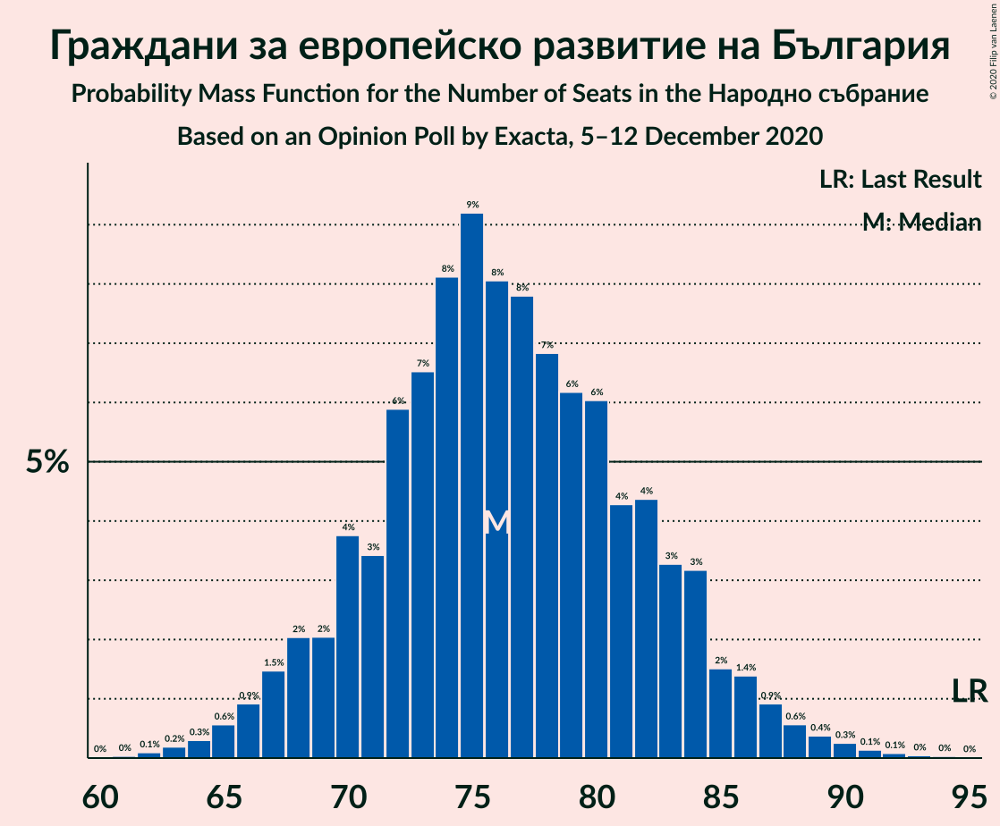

| Number of Seats | Probability | Accumulated | Special Marks |
|:---------------:|:-----------:|:-----------:|:-------------:|
| 61 | 0% | 100% |  |
| 62 | 0.1% | 99.9% |  |
| 63 | 0.2% | 99.8% |  |
| 64 | 0.3% | 99.6% |  |
| 65 | 0.6% | 99.3% |  |
| 66 | 0.9% | 98.8% |  |
| 67 | 1.5% | 98% |  |
| 68 | 2% | 96% |  |
| 69 | 2% | 94% |  |
| 70 | 4% | 92% |  |
| 71 | 3% | 89% |  |
| 72 | 6% | 85% |  |
| 73 | 7% | 79% |  |
| 74 | 8% | 73% |  |
| 75 | 9% | 65% |  |
| 76 | 8% | 55% | Median |
| 77 | 8% | 47% |  |
| 78 | 7% | 40% |  |
| 79 | 6% | 33% |  |
| 80 | 6% | 27% |  |
| 81 | 4% | 20% |  |
| 82 | 4% | 16% |  |
| 83 | 3% | 12% |  |
| 84 | 3% | 9% |  |
| 85 | 2% | 5% |  |
| 86 | 1.4% | 4% |  |
| 87 | 0.9% | 2% |  |
| 88 | 0.6% | 2% |  |
| 89 | 0.4% | 1.0% |  |
| 90 | 0.3% | 0.6% |  |
| 91 | 0.1% | 0.3% |  |
| 92 | 0.1% | 0.2% |  |
| 93 | 0% | 0.1% |  |
| 94 | 0% | 0.1% |  |
| 95 | 0% | 0% | Last Result |

### Българска социалистическа партия

*For a full overview of the results for this party, see the [Българска социалистическа партия](party-българскасоциалистическапартия.html) page.*

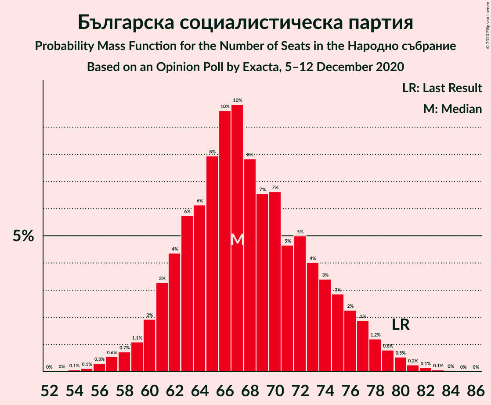

| Number of Seats | Probability | Accumulated | Special Marks |
|:---------------:|:-----------:|:-----------:|:-------------:|
| 53 | 0% | 100% |  |
| 54 | 0.1% | 99.9% |  |
| 55 | 0.1% | 99.9% |  |
| 56 | 0.3% | 99.7% |  |
| 57 | 0.6% | 99.4% |  |
| 58 | 0.7% | 98.9% |  |
| 59 | 1.1% | 98% |  |
| 60 | 2% | 97% |  |
| 61 | 3% | 95% |  |
| 62 | 4% | 92% |  |
| 63 | 6% | 87% |  |
| 64 | 6% | 82% |  |
| 65 | 8% | 76% |  |
| 66 | 10% | 68% |  |
| 67 | 10% | 58% | Median |
| 68 | 8% | 48% |  |
| 69 | 7% | 40% |  |
| 70 | 7% | 34% |  |
| 71 | 5% | 27% |  |
| 72 | 5% | 23% |  |
| 73 | 4% | 18% |  |
| 74 | 3% | 14% |  |
| 75 | 3% | 10% |  |
| 76 | 2% | 7% |  |
| 77 | 2% | 5% |  |
| 78 | 1.2% | 3% |  |
| 79 | 0.8% | 2% |  |
| 80 | 0.5% | 1.1% | Last Result |
| 81 | 0.2% | 0.6% |  |
| 82 | 0.1% | 0.3% |  |
| 83 | 0.1% | 0.2% |  |
| 84 | 0% | 0.1% |  |
| 85 | 0% | 0.1% |  |
| 86 | 0% | 0% |  |

### Има такъв народ

*For a full overview of the results for this party, see the [Има такъв народ](party-иматакъвнарод.html) page.*

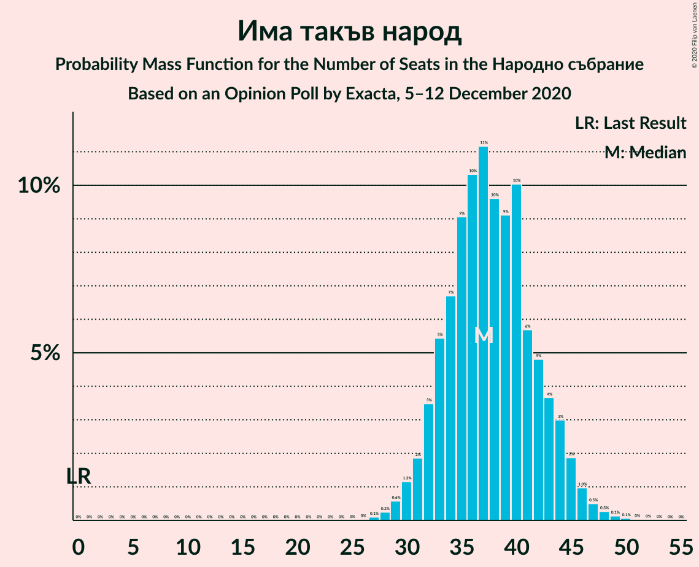

| Number of Seats | Probability | Accumulated | Special Marks |
|:---------------:|:-----------:|:-----------:|:-------------:|
| 0 | 0% | 100% | Last Result |
| 1 | 0% | 100% |  |
| 2 | 0% | 100% |  |
| 3 | 0% | 100% |  |
| 4 | 0% | 100% |  |
| 5 | 0% | 100% |  |
| 6 | 0% | 100% |  |
| 7 | 0% | 100% |  |
| 8 | 0% | 100% |  |
| 9 | 0% | 100% |  |
| 10 | 0% | 100% |  |
| 11 | 0% | 100% |  |
| 12 | 0% | 100% |  |
| 13 | 0% | 100% |  |
| 14 | 0% | 100% |  |
| 15 | 0% | 100% |  |
| 16 | 0% | 100% |  |
| 17 | 0% | 100% |  |
| 18 | 0% | 100% |  |
| 19 | 0% | 100% |  |
| 20 | 0% | 100% |  |
| 21 | 0% | 100% |  |
| 22 | 0% | 100% |  |
| 23 | 0% | 100% |  |
| 24 | 0% | 100% |  |
| 25 | 0% | 100% |  |
| 26 | 0% | 100% |  |
| 27 | 0.1% | 100% |  |
| 28 | 0.2% | 99.9% |  |
| 29 | 0.6% | 99.6% |  |
| 30 | 1.2% | 99.0% |  |
| 31 | 2% | 98% |  |
| 32 | 3% | 96% |  |
| 33 | 5% | 93% |  |
| 34 | 7% | 87% |  |
| 35 | 9% | 80% |  |
| 36 | 10% | 71% |  |
| 37 | 11% | 61% | Median |
| 38 | 10% | 50% |  |
| 39 | 9% | 40% |  |
| 40 | 10% | 31% |  |
| 41 | 6% | 21% |  |
| 42 | 5% | 15% |  |
| 43 | 4% | 11% |  |
| 44 | 3% | 7% |  |
| 45 | 2% | 4% |  |
| 46 | 1.0% | 2% |  |
| 47 | 0.5% | 1.0% |  |
| 48 | 0.3% | 0.5% |  |
| 49 | 0.1% | 0.3% |  |
| 50 | 0.1% | 0.1% |  |
| 51 | 0% | 0.1% |  |
| 52 | 0% | 0% |  |

### Движение за права и свободи

*For a full overview of the results for this party, see the [Движение за права и свободи](party-движениезаправаисвободи.html) page.*

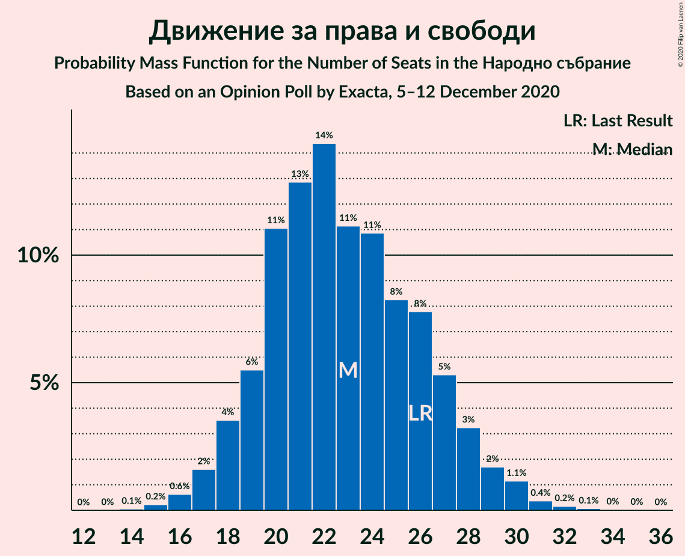

| Number of Seats | Probability | Accumulated | Special Marks |
|:---------------:|:-----------:|:-----------:|:-------------:|
| 14 | 0.1% | 100% |  |
| 15 | 0.2% | 99.9% |  |
| 16 | 0.6% | 99.7% |  |
| 17 | 2% | 99.1% |  |
| 18 | 4% | 97% |  |
| 19 | 6% | 94% |  |
| 20 | 11% | 88% |  |
| 21 | 13% | 77% |  |
| 22 | 14% | 65% |  |
| 23 | 11% | 50% | Median |
| 24 | 11% | 39% |  |
| 25 | 8% | 28% |  |
| 26 | 8% | 20% | Last Result |
| 27 | 5% | 12% |  |
| 28 | 3% | 7% |  |
| 29 | 2% | 4% |  |
| 30 | 1.1% | 2% |  |
| 31 | 0.4% | 0.7% |  |
| 32 | 0.2% | 0.3% |  |
| 33 | 0.1% | 0.1% |  |
| 34 | 0% | 0.1% |  |
| 35 | 0% | 0% |  |

### Демократична България

*For a full overview of the results for this party, see the [Демократична България](party-демократичнабългария.html) page.*

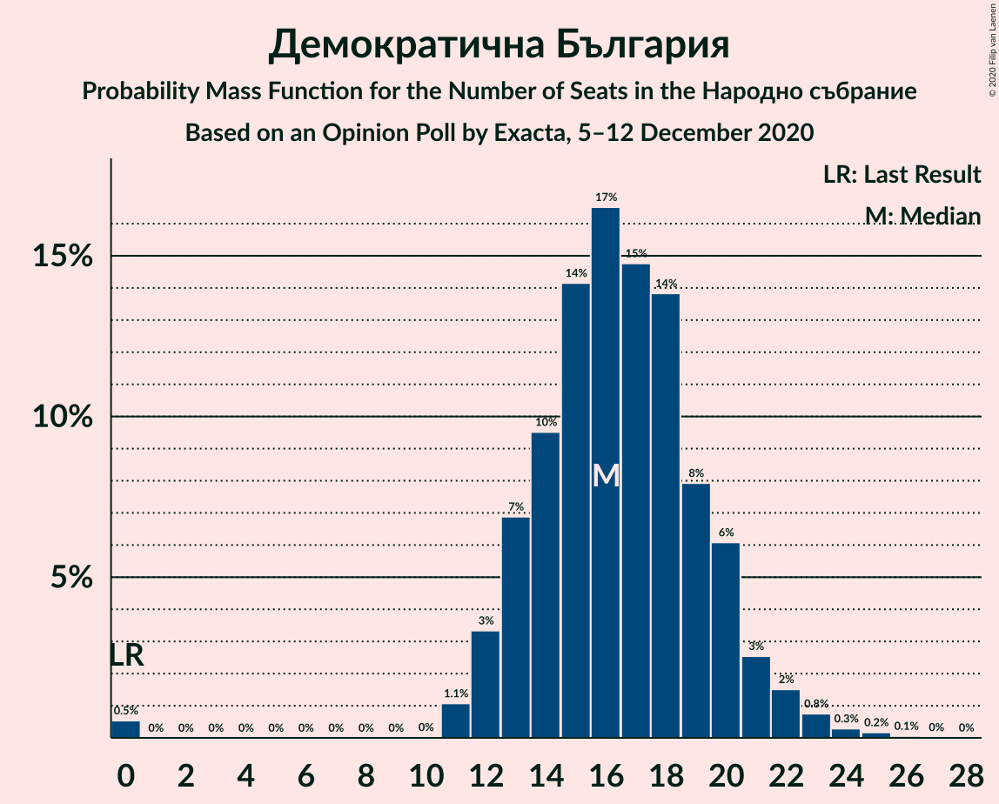

| Number of Seats | Probability | Accumulated | Special Marks |
|:---------------:|:-----------:|:-----------:|:-------------:|
| 0 | 0.5% | 100% | Last Result |
| 1 | 0% | 99.5% |  |
| 2 | 0% | 99.5% |  |
| 3 | 0% | 99.5% |  |
| 4 | 0% | 99.5% |  |
| 5 | 0% | 99.5% |  |
| 6 | 0% | 99.5% |  |
| 7 | 0% | 99.5% |  |
| 8 | 0% | 99.5% |  |
| 9 | 0% | 99.5% |  |
| 10 | 0% | 99.5% |  |
| 11 | 1.1% | 99.4% |  |
| 12 | 3% | 98% |  |
| 13 | 7% | 95% |  |
| 14 | 10% | 88% |  |
| 15 | 14% | 79% |  |
| 16 | 17% | 64% | Median |
| 17 | 15% | 48% |  |
| 18 | 14% | 33% |  |
| 19 | 8% | 19% |  |
| 20 | 6% | 11% |  |
| 21 | 3% | 5% |  |
| 22 | 2% | 3% |  |
| 23 | 0.8% | 1.3% |  |
| 24 | 0.3% | 0.5% |  |
| 25 | 0.2% | 0.3% |  |
| 26 | 0.1% | 0.1% |  |
| 27 | 0% | 0% |  |

### Обединени Патриоти

*For a full overview of the results for this party, see the [Обединени Патриоти](party-обединенипатриоти.html) page.*

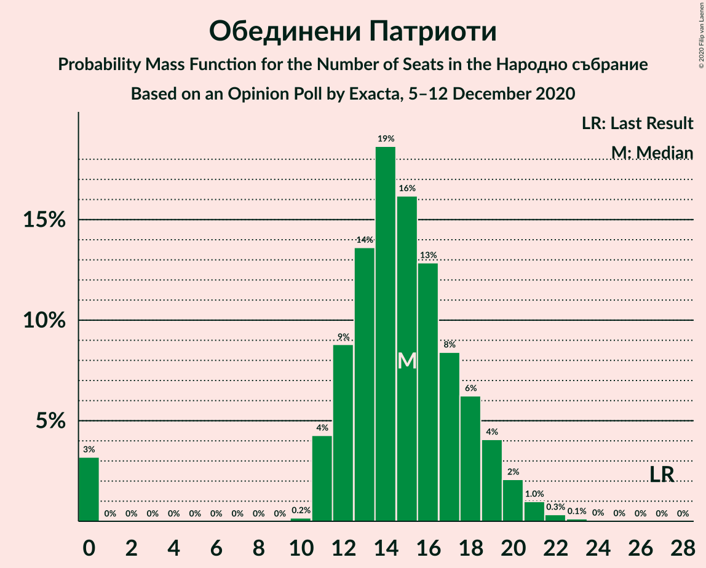

| Number of Seats | Probability | Accumulated | Special Marks |
|:---------------:|:-----------:|:-----------:|:-------------:|
| 0 | 3% | 100% |  |
| 1 | 0% | 97% |  |
| 2 | 0% | 97% |  |
| 3 | 0% | 97% |  |
| 4 | 0% | 97% |  |
| 5 | 0% | 97% |  |
| 6 | 0% | 97% |  |
| 7 | 0% | 97% |  |
| 8 | 0% | 97% |  |
| 9 | 0% | 97% |  |
| 10 | 0.2% | 97% |  |
| 11 | 4% | 97% |  |
| 12 | 9% | 92% |  |
| 13 | 14% | 84% |  |
| 14 | 19% | 70% |  |
| 15 | 16% | 51% | Median |
| 16 | 13% | 35% |  |
| 17 | 8% | 22% |  |
| 18 | 6% | 14% |  |
| 19 | 4% | 8% |  |
| 20 | 2% | 4% |  |
| 21 | 1.0% | 2% |  |
| 22 | 0.3% | 0.5% |  |
| 23 | 0.1% | 0.2% |  |
| 24 | 0% | 0.1% |  |
| 25 | 0% | 0% |  |
| 26 | 0% | 0% |  |
| 27 | 0% | 0% | Last Result |

### Изправи се Бг

*For a full overview of the results for this party, see the [Изправи се Бг](party-изправисебг.html) page.*

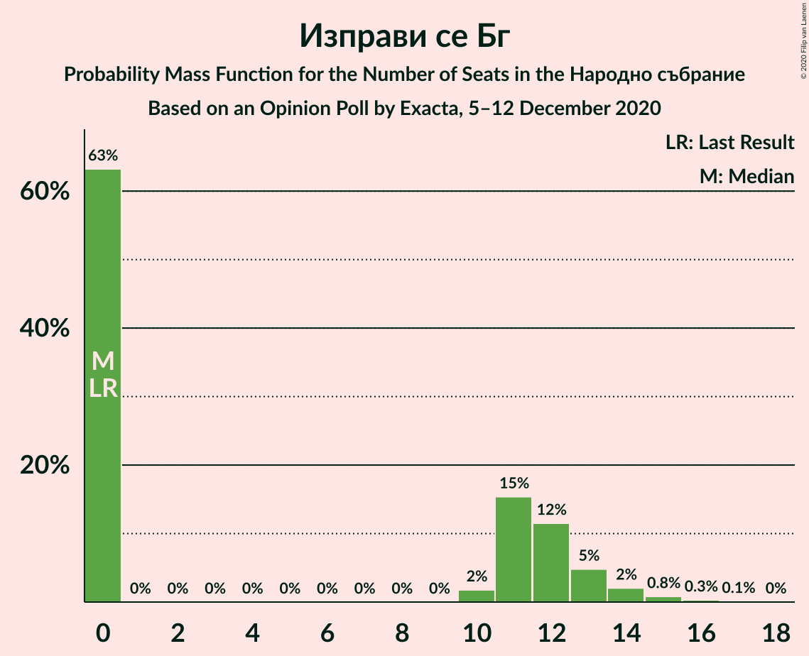

| Number of Seats | Probability | Accumulated | Special Marks |
|:---------------:|:-----------:|:-----------:|:-------------:|
| 0 | 63% | 100% | Last Result, Median |
| 1 | 0% | 37% |  |
| 2 | 0% | 37% |  |
| 3 | 0% | 37% |  |
| 4 | 0% | 37% |  |
| 5 | 0% | 37% |  |
| 6 | 0% | 37% |  |
| 7 | 0% | 37% |  |
| 8 | 0% | 37% |  |
| 9 | 0% | 37% |  |
| 10 | 2% | 37% |  |
| 11 | 15% | 35% |  |
| 12 | 12% | 20% |  |
| 13 | 5% | 8% |  |
| 14 | 2% | 3% |  |
| 15 | 0.8% | 1.3% |  |
| 16 | 0.3% | 0.4% |  |
| 17 | 0.1% | 0.1% |  |
| 18 | 0% | 0% |  |

## Coalitions

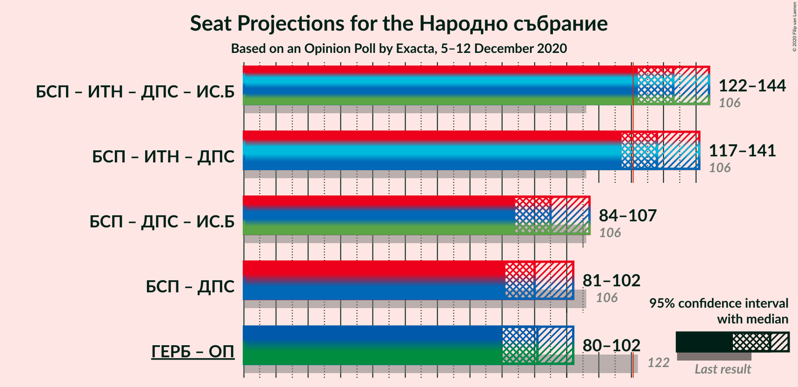

### Confidence Intervals

| Coalition | Last Result | Median | Majority? | 80% Confidence Interval | 90% Confidence Interval | 95% Confidence Interval | 99% Confidence Interval |
|:---------:|:-----------:|:------:|:---------:|:-----------------------:|:-----------------------:|:-----------------------:|:-----------------------:|
| Българска социалистическа партия – Има такъв народ – Движение за права и свободи – Изправи се Бг | 106 | 133 | 98.8% | 125–140 | 123–142 | 122–144 | 119–147 |
| Българска социалистическа партия – Има такъв народ – Движение за права и свободи | 106 | 128 | 92% | 121–137 | 119–139 | 117–141 | 114–144 |
| Българска социалистическа партия – Движение за права и свободи – Изправи се Бг | 106 | 95 | 0% | 87–102 | 85–105 | 84–107 | 81–111 |
| Българска социалистическа партия – Движение за права и свободи | 106 | 90 | 0% | 84–98 | 82–100 | 81–102 | 78–105 |
| Граждани за европейско развитие на България – Обединени Патриоти | 122 | 91 | 0% | 84–98 | 82–100 | 80–102 | 76–105 |

### Българска социалистическа партия – Има такъв народ – Движение за права и свободи – Изправи се Бг

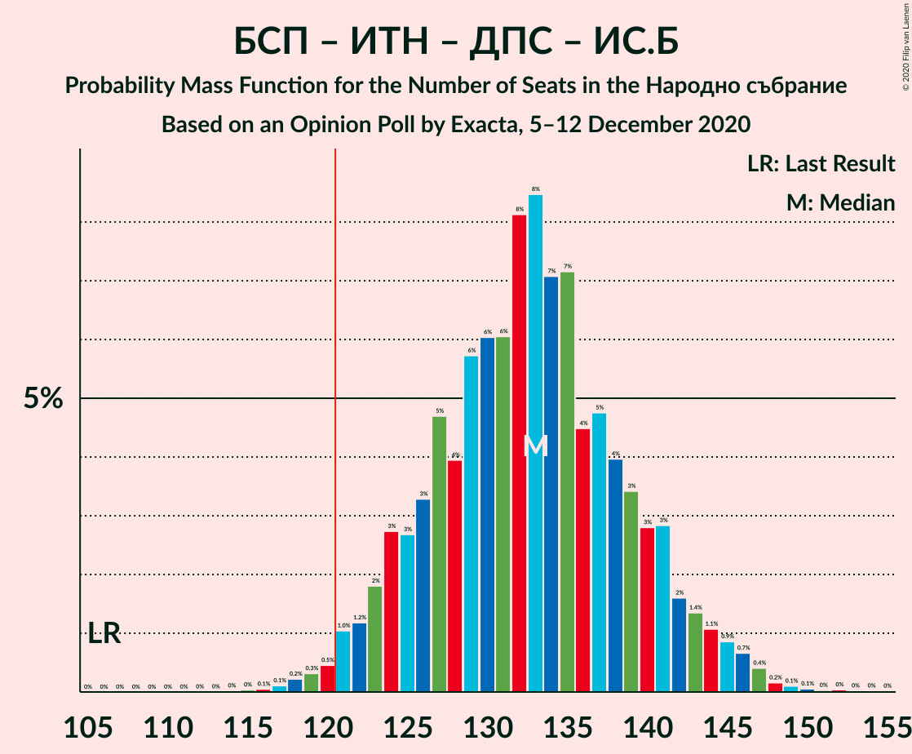

| Number of Seats | Probability | Accumulated | Special Marks |
|:---------------:|:-----------:|:-----------:|:-------------:|
| 106 | 0% | 100% | Last Result |
| 107 | 0% | 100% |  |
| 108 | 0% | 100% |  |
| 109 | 0% | 100% |  |
| 110 | 0% | 100% |  |
| 111 | 0% | 100% |  |
| 112 | 0% | 100% |  |
| 113 | 0% | 100% |  |
| 114 | 0% | 100% |  |
| 115 | 0% | 100% |  |
| 116 | 0.1% | 99.9% |  |
| 117 | 0.1% | 99.9% |  |
| 118 | 0.2% | 99.8% |  |
| 119 | 0.3% | 99.5% |  |
| 120 | 0.5% | 99.2% |  |
| 121 | 1.0% | 98.8% | Majority |
| 122 | 1.2% | 98% |  |
| 123 | 2% | 97% |  |
| 124 | 3% | 95% |  |
| 125 | 3% | 92% |  |
| 126 | 3% | 89% |  |
| 127 | 5% | 86% | Median |
| 128 | 4% | 81% |  |
| 129 | 6% | 77% |  |
| 130 | 6% | 72% |  |
| 131 | 6% | 66% |  |
| 132 | 8% | 60% |  |
| 133 | 8% | 51% |  |
| 134 | 7% | 43% |  |
| 135 | 7% | 36% |  |
| 136 | 4% | 29% |  |
| 137 | 5% | 24% |  |
| 138 | 4% | 19% |  |
| 139 | 3% | 16% |  |
| 140 | 3% | 12% |  |
| 141 | 3% | 9% |  |
| 142 | 2% | 6% |  |
| 143 | 1.4% | 5% |  |
| 144 | 1.1% | 3% |  |
| 145 | 0.9% | 2% |  |
| 146 | 0.7% | 2% |  |
| 147 | 0.4% | 0.9% |  |
| 148 | 0.2% | 0.5% |  |
| 149 | 0.1% | 0.3% |  |
| 150 | 0.1% | 0.2% |  |
| 151 | 0% | 0.2% |  |
| 152 | 0% | 0.1% |  |
| 153 | 0% | 0.1% |  |
| 154 | 0% | 0.1% |  |
| 155 | 0% | 0% |  |

### Българска социалистическа партия – Има такъв народ – Движение за права и свободи

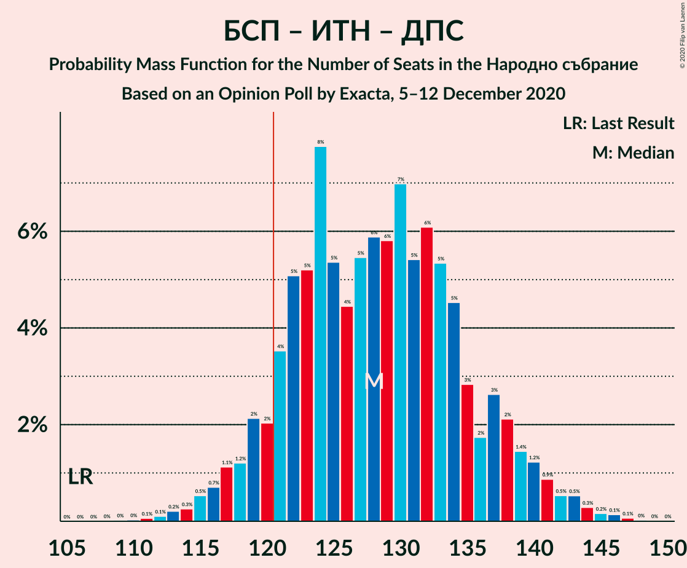

| Number of Seats | Probability | Accumulated | Special Marks |
|:---------------:|:-----------:|:-----------:|:-------------:|
| 106 | 0% | 100% | Last Result |
| 107 | 0% | 100% |  |
| 108 | 0% | 100% |  |
| 109 | 0% | 100% |  |
| 110 | 0% | 100% |  |
| 111 | 0.1% | 99.9% |  |
| 112 | 0.1% | 99.9% |  |
| 113 | 0.2% | 99.8% |  |
| 114 | 0.3% | 99.5% |  |
| 115 | 0.5% | 99.3% |  |
| 116 | 0.7% | 98.8% |  |
| 117 | 1.1% | 98% |  |
| 118 | 1.2% | 97% |  |
| 119 | 2% | 96% |  |
| 120 | 2% | 94% |  |
| 121 | 4% | 92% | Majority |
| 122 | 5% | 88% |  |
| 123 | 5% | 83% |  |
| 124 | 8% | 78% |  |
| 125 | 5% | 70% |  |
| 126 | 4% | 65% |  |
| 127 | 5% | 60% | Median |
| 128 | 6% | 55% |  |
| 129 | 6% | 49% |  |
| 130 | 7% | 43% |  |
| 131 | 5% | 36% |  |
| 132 | 6% | 31% |  |
| 133 | 5% | 25% |  |
| 134 | 5% | 19% |  |
| 135 | 3% | 15% |  |
| 136 | 2% | 12% |  |
| 137 | 3% | 10% |  |
| 138 | 2% | 7% |  |
| 139 | 1.4% | 5% |  |
| 140 | 1.2% | 4% |  |
| 141 | 0.9% | 3% |  |
| 142 | 0.5% | 2% |  |
| 143 | 0.5% | 1.3% |  |
| 144 | 0.3% | 0.7% |  |
| 145 | 0.2% | 0.4% |  |
| 146 | 0.1% | 0.3% |  |
| 147 | 0.1% | 0.1% |  |
| 148 | 0% | 0.1% |  |
| 149 | 0% | 0% |  |

### Българска социалистическа партия – Движение за права и свободи – Изправи се Бг

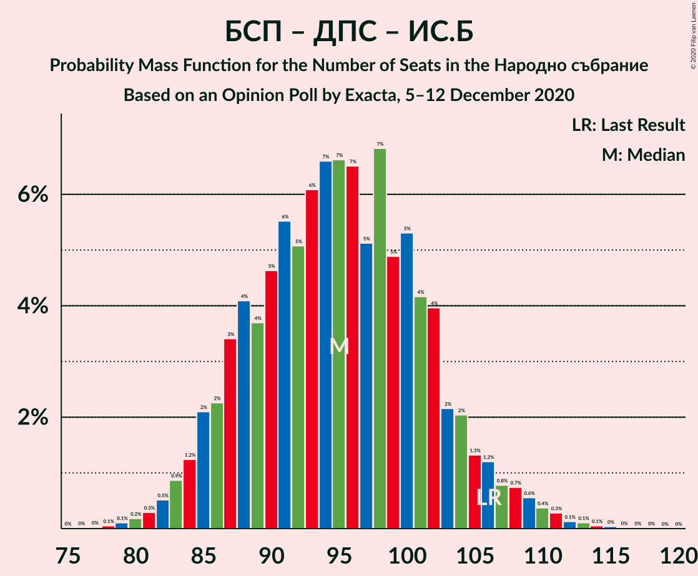

| Number of Seats | Probability | Accumulated | Special Marks |
|:---------------:|:-----------:|:-----------:|:-------------:|
| 78 | 0.1% | 100% |  |
| 79 | 0.1% | 99.9% |  |
| 80 | 0.2% | 99.8% |  |
| 81 | 0.3% | 99.6% |  |
| 82 | 0.5% | 99.3% |  |
| 83 | 0.9% | 98.8% |  |
| 84 | 1.2% | 98% |  |
| 85 | 2% | 97% |  |
| 86 | 2% | 95% |  |
| 87 | 3% | 92% |  |
| 88 | 4% | 89% |  |
| 89 | 4% | 85% |  |
| 90 | 5% | 81% | Median |
| 91 | 6% | 77% |  |
| 92 | 5% | 71% |  |
| 93 | 6% | 66% |  |
| 94 | 7% | 60% |  |
| 95 | 7% | 53% |  |
| 96 | 7% | 47% |  |
| 97 | 5% | 40% |  |
| 98 | 7% | 35% |  |
| 99 | 5% | 28% |  |
| 100 | 5% | 23% |  |
| 101 | 4% | 18% |  |
| 102 | 4% | 14% |  |
| 103 | 2% | 10% |  |
| 104 | 2% | 8% |  |
| 105 | 1.3% | 6% |  |
| 106 | 1.2% | 4% | Last Result |
| 107 | 0.8% | 3% |  |
| 108 | 0.7% | 2% |  |
| 109 | 0.6% | 2% |  |
| 110 | 0.4% | 1.0% |  |
| 111 | 0.3% | 0.6% |  |
| 112 | 0.1% | 0.4% |  |
| 113 | 0.1% | 0.2% |  |
| 114 | 0.1% | 0.1% |  |
| 115 | 0% | 0.1% |  |
| 116 | 0% | 0% |  |

### Българска социалистическа партия – Движение за права и свободи

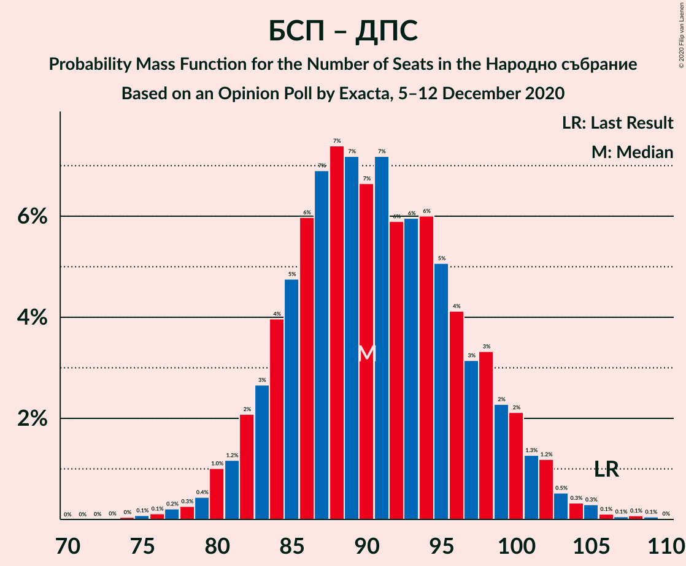

| Number of Seats | Probability | Accumulated | Special Marks |
|:---------------:|:-----------:|:-----------:|:-------------:|
| 74 | 0% | 100% |  |
| 75 | 0.1% | 99.9% |  |
| 76 | 0.1% | 99.8% |  |
| 77 | 0.2% | 99.7% |  |
| 78 | 0.3% | 99.5% |  |
| 79 | 0.4% | 99.3% |  |
| 80 | 1.0% | 98.8% |  |
| 81 | 1.2% | 98% |  |
| 82 | 2% | 97% |  |
| 83 | 3% | 95% |  |
| 84 | 4% | 92% |  |
| 85 | 5% | 88% |  |
| 86 | 6% | 83% |  |
| 87 | 7% | 77% |  |
| 88 | 7% | 70% |  |
| 89 | 7% | 63% |  |
| 90 | 7% | 56% | Median |
| 91 | 7% | 49% |  |
| 92 | 6% | 42% |  |
| 93 | 6% | 36% |  |
| 94 | 6% | 30% |  |
| 95 | 5% | 24% |  |
| 96 | 4% | 19% |  |
| 97 | 3% | 15% |  |
| 98 | 3% | 12% |  |
| 99 | 2% | 8% |  |
| 100 | 2% | 6% |  |
| 101 | 1.3% | 4% |  |
| 102 | 1.2% | 3% |  |
| 103 | 0.5% | 1.5% |  |
| 104 | 0.3% | 1.0% |  |
| 105 | 0.3% | 0.6% |  |
| 106 | 0.1% | 0.3% | Last Result |
| 107 | 0.1% | 0.2% |  |
| 108 | 0.1% | 0.2% |  |
| 109 | 0.1% | 0.1% |  |
| 110 | 0% | 0% |  |

### Граждани за европейско развитие на България – Обединени Патриоти

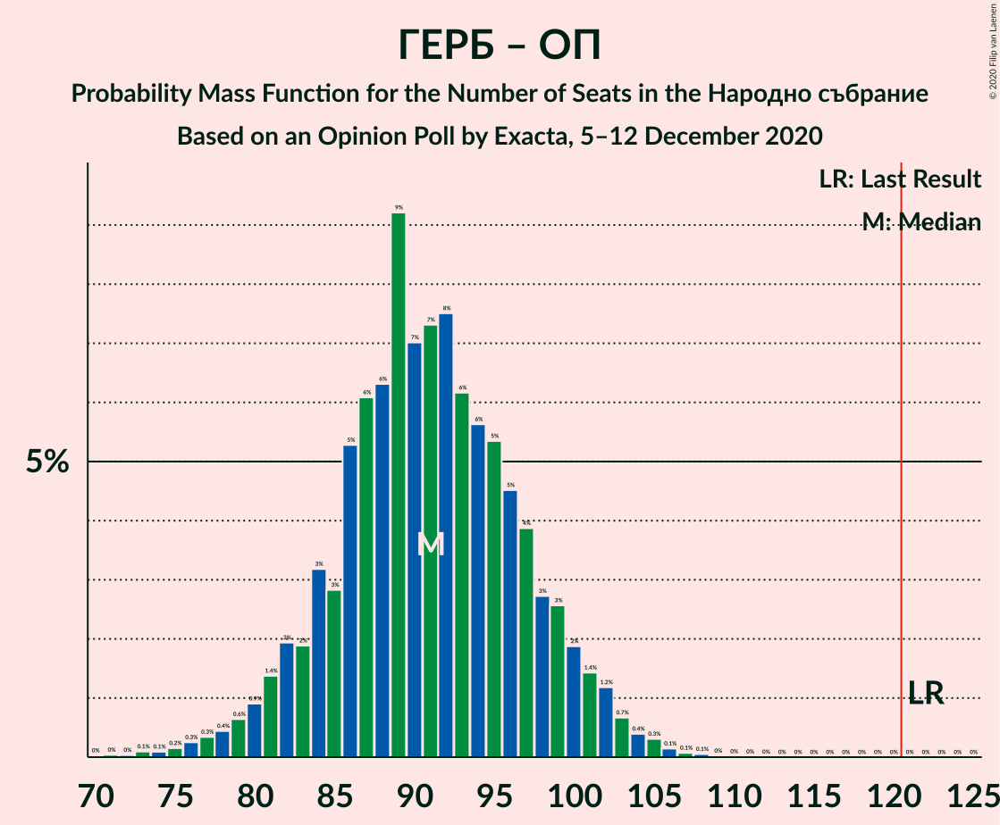

| Number of Seats | Probability | Accumulated | Special Marks |
|:---------------:|:-----------:|:-----------:|:-------------:|
| 70 | 0% | 100% |  |
| 71 | 0% | 99.9% |  |
| 72 | 0% | 99.9% |  |
| 73 | 0.1% | 99.9% |  |
| 74 | 0.1% | 99.8% |  |
| 75 | 0.2% | 99.7% |  |
| 76 | 0.3% | 99.5% |  |
| 77 | 0.3% | 99.3% |  |
| 78 | 0.4% | 98.9% |  |
| 79 | 0.6% | 98% |  |
| 80 | 0.9% | 98% |  |
| 81 | 1.4% | 97% |  |
| 82 | 2% | 96% |  |
| 83 | 2% | 94% |  |
| 84 | 3% | 92% |  |
| 85 | 3% | 89% |  |
| 86 | 5% | 86% |  |
| 87 | 6% | 80% |  |
| 88 | 6% | 74% |  |
| 89 | 9% | 68% |  |
| 90 | 7% | 59% |  |
| 91 | 7% | 52% | Median |
| 92 | 8% | 45% |  |
| 93 | 6% | 37% |  |
| 94 | 6% | 31% |  |
| 95 | 5% | 25% |  |
| 96 | 5% | 20% |  |
| 97 | 4% | 15% |  |
| 98 | 3% | 11% |  |
| 99 | 3% | 9% |  |
| 100 | 2% | 6% |  |
| 101 | 1.4% | 4% |  |
| 102 | 1.2% | 3% |  |
| 103 | 0.7% | 2% |  |
| 104 | 0.4% | 1.0% |  |
| 105 | 0.3% | 0.6% |  |
| 106 | 0.1% | 0.3% |  |
| 107 | 0.1% | 0.2% |  |
| 108 | 0.1% | 0.1% |  |
| 109 | 0% | 0% |  |
| 110 | 0% | 0% |  |
| 111 | 0% | 0% |  |
| 112 | 0% | 0% |  |
| 113 | 0% | 0% |  |
| 114 | 0% | 0% |  |
| 115 | 0% | 0% |  |
| 116 | 0% | 0% |  |
| 117 | 0% | 0% |  |
| 118 | 0% | 0% |  |
| 119 | 0% | 0% |  |
| 120 | 0% | 0% |  |
| 121 | 0% | 0% | Majority |
| 122 | 0% | 0% | Last Result |

## Technical Information

### Opinion Poll

+ **Polling firm:** Exacta
+ **Commissioner(s):** —
+ **Fieldwork period:** 5–12 December 2020

### Calculations

+ **Sample size:** 661
+ **Simulations done:** 1,048,576
+ **Error estimate:** 0.93%

