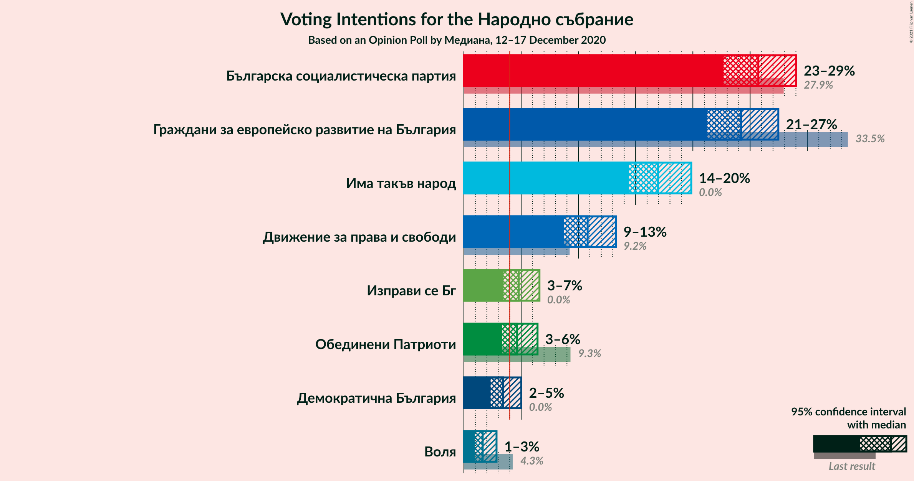
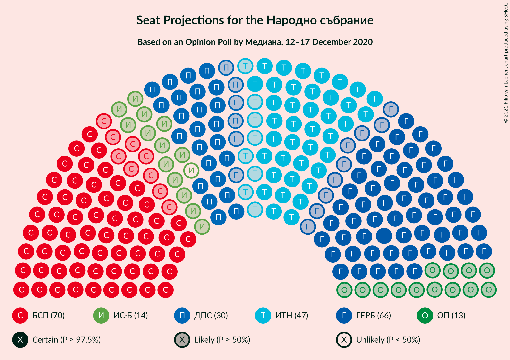
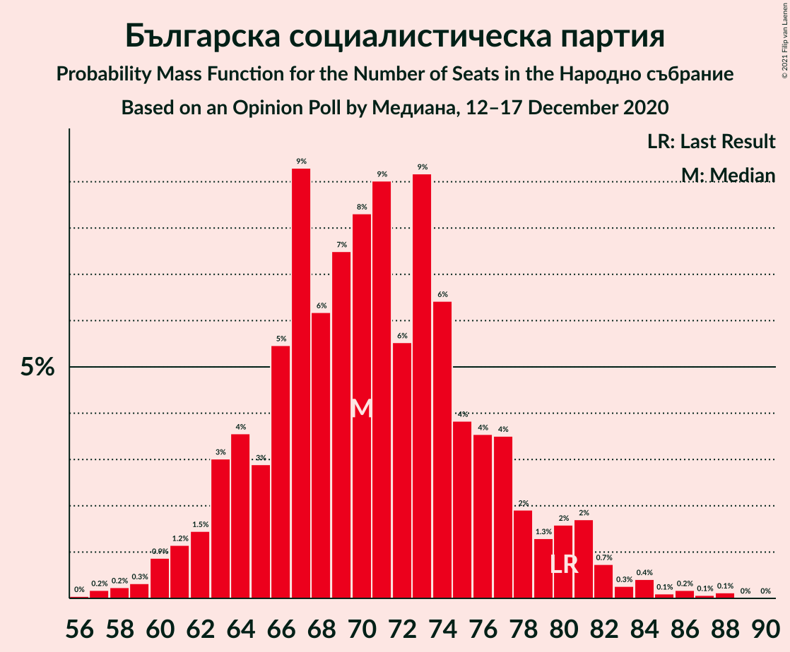
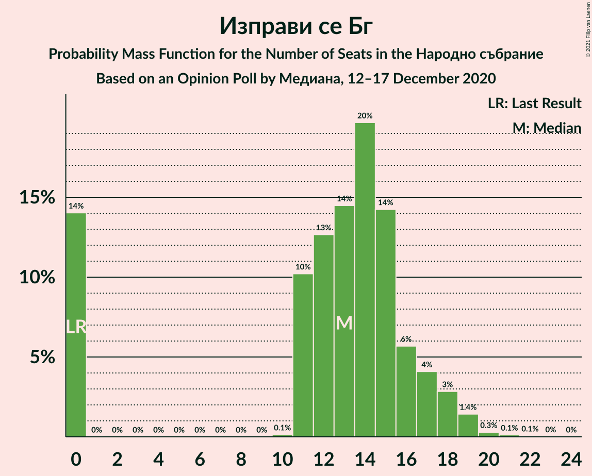
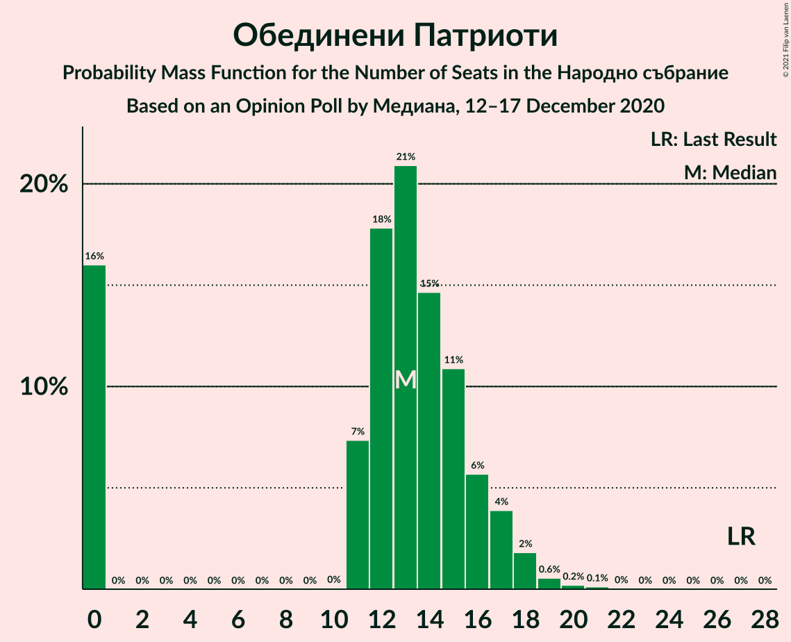
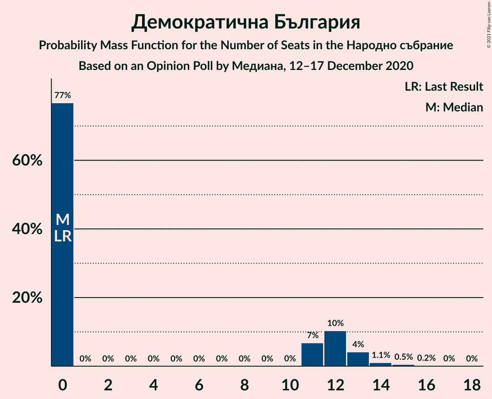
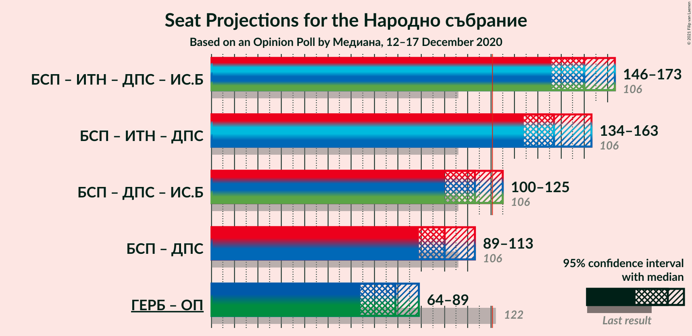
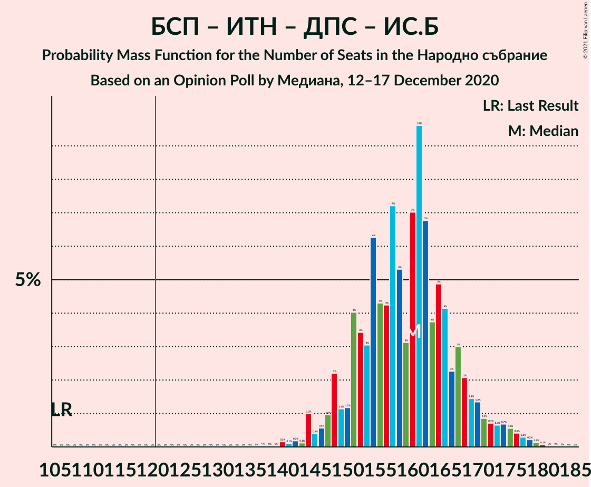
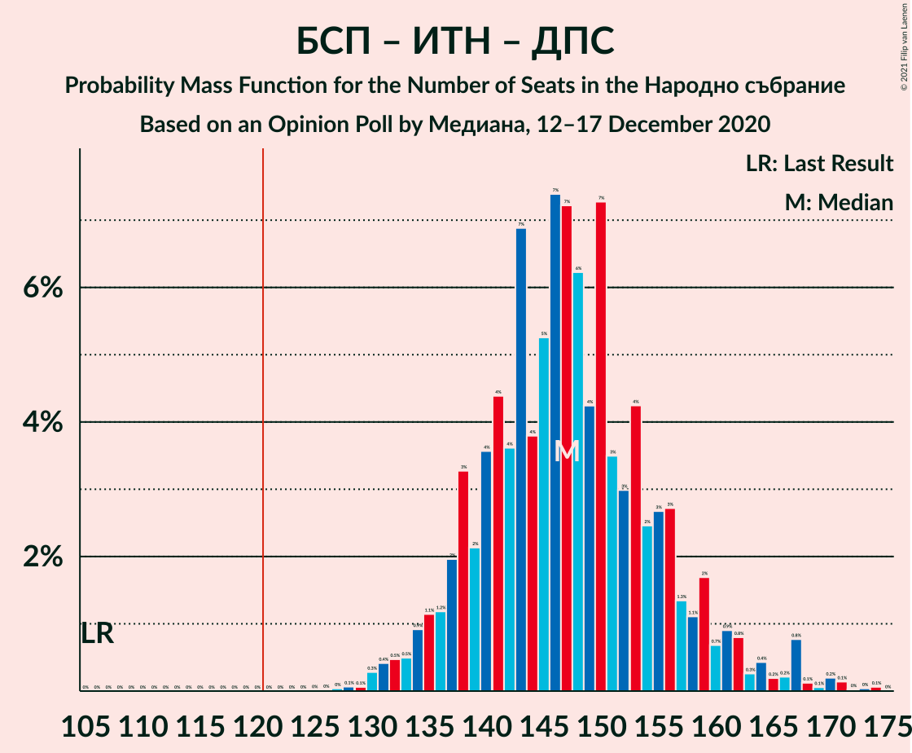
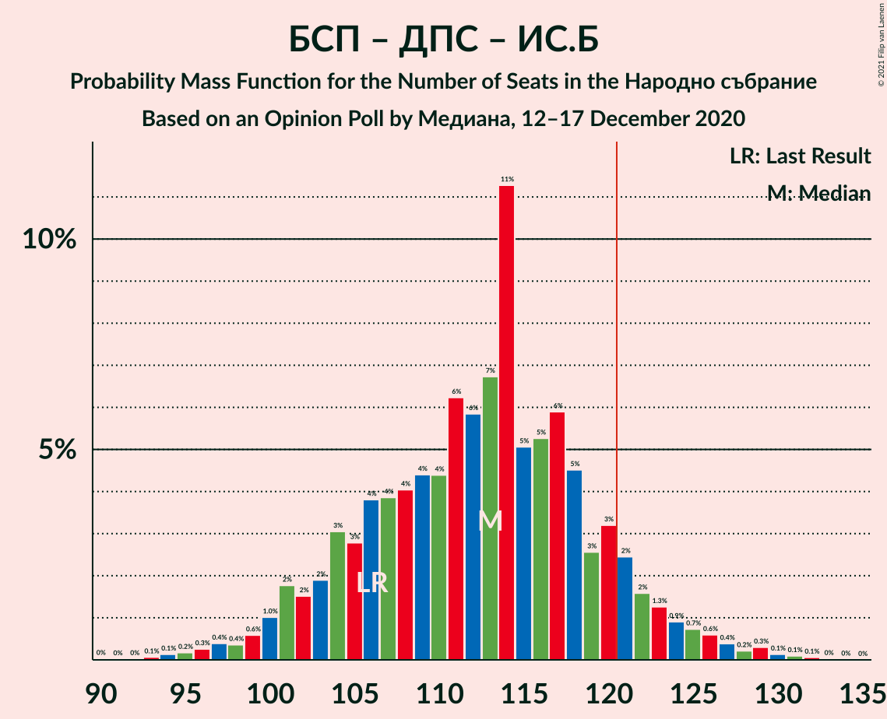

# Opinion Poll by Медиана, 12–17 December 2020

<a href="#voting-intentions">Voting Intentions</a> | <a href="#seats">Seats</a> | <a href="#coalitions">Coalitions</a> | <a href="#technical-information">Technical Information</a>

## Voting Intentions

### Confidence Intervals

| Party | Last Result | Poll Result | 80% Confidence Interval | 90% Confidence Interval | 95% Confidence Interval | 99% Confidence Interval |
|:-----:|:-----------:|:-----------:|:-----------------------:|:-----------------------:|:-----------------------:|:-----------------------:|
| Българска социалистическа партия | 27.9% | 25.7% | 23.7–27.9% |23.2–28.5% |22.7–29.0% |21.7–30.1% |
| Граждани за европейско развитие на България | 33.5% | 24.2% | 22.3–26.3% |21.7–26.9% |21.2–27.5% |20.3–28.5% |
| Има такъв народ | 0.0% | 17.0% | 15.3–18.9% |14.8–19.4% |14.4–19.9% |13.6–20.8% |
| Движение за права и свободи | 9.2% | 10.8% | 9.4–12.4% |9.1–12.9% |8.7–13.3% |8.1–14.1% |
| Изправи се Бг | 0.0% | 4.8% | 3.9–6.0% |3.7–6.3% |3.5–6.6% |3.1–7.2% |
| Обединени Патриоти | 9.3% | 4.7% | 3.8–5.8% |3.6–6.1% |3.3–6.4% |3.0–7.0% |
| Демократична България | 0.0% | 3.4% | 2.7–4.5% |2.5–4.7% |2.3–5.0% |2.0–5.5% |
| Воля | 4.3% | 1.6% | 1.2–2.4% |1.1–2.7% |0.9–2.9% |0.8–3.3% |

*Note:* The poll result column reflects the actual value used in the calculations. Published results may vary slightly, and in addition be rounded to fewer digits.

## Seats

### Confidence Intervals

| Party | Last Result | Median | 80% Confidence Interval | 90% Confidence Interval | 95% Confidence Interval | 99% Confidence Interval |
|:-----:|:-----------:|:------:|:-----------------------:|:-----------------------:|:-----------------------:|:-----------------------:|
| <a href="#българска-социалистическа-партия">Българска социалистическа партия</a> | 80 | 70 | 64–77 |63–80 |61–81 |58–85 |
| <a href="#граждани-за-европейско-развитие-на-българия">Граждани за европейско развитие на България</a> | 95 | 66 | 60–73 |59–74 |57–76 |55–79 |
| <a href="#има-такъв-народ">Има такъв народ</a> | 0 | 47 | 42–52 |40–54 |39–55 |37–58 |
| <a href="#движение-за-права-и-свободи">Движение за права и свободи</a> | 26 | 30 | 26–34 |25–36 |24–37 |22–39 |
| <a href="#изправи-се-бг">Изправи се Бг</a> | 0 | 13 | 0–16 |0–17 |0–18 |0–20 |
| <a href="#обединени-патриоти">Обединени Патриоти</a> | 27 | 13 | 0–16 |0–17 |0–18 |0–19 |
| <a href="#демократична-българия">Демократична България</a> | 0 | 0 | 0–12 |0–13 |0–13 |0–15 |
| <a href="#воля">Воля</a> | 12 | 0 | 0 |0 |0 |0 |

### Българска социалистическа партия

*For a full overview of the results for this party, see the [Българска социалистическа партия](party-българскасоциалистическапартия.html) page.*

| Number of Seats | Probability | Accumulated | Special Marks |
|:---------------:|:-----------:|:-----------:|:-------------:|
| 56 | 0% | 100% |  |
| 57 | 0.2% | 99.9% |  |
| 58 | 0.2% | 99.7% |  |
| 59 | 0.3% | 99.5% |  |
| 60 | 0.9% | 99.2% |  |
| 61 | 1.2% | 98% |  |
| 62 | 1.5% | 97% |  |
| 63 | 3% | 96% |  |
| 64 | 4% | 93% |  |
| 65 | 3% | 89% |  |
| 66 | 5% | 86% |  |
| 67 | 9% | 81% |  |
| 68 | 6% | 71% |  |
| 69 | 7% | 65% |  |
| 70 | 8% | 58% | Median |
| 71 | 9% | 49% |  |
| 72 | 6% | 40% |  |
| 73 | 9% | 35% |  |
| 74 | 6% | 26% |  |
| 75 | 4% | 19% |  |
| 76 | 4% | 15% |  |
| 77 | 4% | 12% |  |
| 78 | 2% | 8% |  |
| 79 | 1.3% | 7% |  |
| 80 | 2% | 5% | Last Result |
| 81 | 2% | 4% |  |
| 82 | 0.7% | 2% |  |
| 83 | 0.3% | 1.2% |  |
| 84 | 0.4% | 0.9% |  |
| 85 | 0.1% | 0.5% |  |
| 86 | 0.2% | 0.4% |  |
| 87 | 0.1% | 0.2% |  |
| 88 | 0.1% | 0.2% |  |
| 89 | 0% | 0% |  |

### Граждани за европейско развитие на България

*For a full overview of the results for this party, see the [Граждани за европейско развитие на България](party-гражданизаевропейскоразвитиенабългария.html) page.*

| Number of Seats | Probability | Accumulated | Special Marks |
|:---------------:|:-----------:|:-----------:|:-------------:|
| 52 | 0% | 100% |  |
| 53 | 0.1% | 99.9% |  |
| 54 | 0.3% | 99.9% |  |
| 55 | 0.4% | 99.6% |  |
| 56 | 0.6% | 99.2% |  |
| 57 | 1.2% | 98.6% |  |
| 58 | 2% | 97% |  |
| 59 | 2% | 96% |  |
| 60 | 4% | 93% |  |
| 61 | 3% | 90% |  |
| 62 | 7% | 87% |  |
| 63 | 5% | 80% |  |
| 64 | 7% | 74% |  |
| 65 | 9% | 67% |  |
| 66 | 10% | 58% | Median |
| 67 | 8% | 48% |  |
| 68 | 6% | 40% |  |
| 69 | 7% | 34% |  |
| 70 | 5% | 27% |  |
| 71 | 4% | 22% |  |
| 72 | 6% | 18% |  |
| 73 | 4% | 12% |  |
| 74 | 3% | 8% |  |
| 75 | 2% | 5% |  |
| 76 | 1.3% | 3% |  |
| 77 | 0.8% | 2% |  |
| 78 | 0.4% | 1.3% |  |
| 79 | 0.4% | 0.8% |  |
| 80 | 0.2% | 0.5% |  |
| 81 | 0.1% | 0.2% |  |
| 82 | 0.1% | 0.2% |  |
| 83 | 0.1% | 0.1% |  |
| 84 | 0% | 0.1% |  |
| 85 | 0% | 0% |  |
| 86 | 0% | 0% |  |
| 87 | 0% | 0% |  |
| 88 | 0% | 0% |  |
| 89 | 0% | 0% |  |
| 90 | 0% | 0% |  |
| 91 | 0% | 0% |  |
| 92 | 0% | 0% |  |
| 93 | 0% | 0% |  |
| 94 | 0% | 0% |  |
| 95 | 0% | 0% | Last Result |

### Има такъв народ

*For a full overview of the results for this party, see the [Има такъв народ](party-иматакъвнарод.html) page.*

| Number of Seats | Probability | Accumulated | Special Marks |
|:---------------:|:-----------:|:-----------:|:-------------:|
| 0 | 0% | 100% | Last Result |
| 1 | 0% | 100% |  |
| 2 | 0% | 100% |  |
| 3 | 0% | 100% |  |
| 4 | 0% | 100% |  |
| 5 | 0% | 100% |  |
| 6 | 0% | 100% |  |
| 7 | 0% | 100% |  |
| 8 | 0% | 100% |  |
| 9 | 0% | 100% |  |
| 10 | 0% | 100% |  |
| 11 | 0% | 100% |  |
| 12 | 0% | 100% |  |
| 13 | 0% | 100% |  |
| 14 | 0% | 100% |  |
| 15 | 0% | 100% |  |
| 16 | 0% | 100% |  |
| 17 | 0% | 100% |  |
| 18 | 0% | 100% |  |
| 19 | 0% | 100% |  |
| 20 | 0% | 100% |  |
| 21 | 0% | 100% |  |
| 22 | 0% | 100% |  |
| 23 | 0% | 100% |  |
| 24 | 0% | 100% |  |
| 25 | 0% | 100% |  |
| 26 | 0% | 100% |  |
| 27 | 0% | 100% |  |
| 28 | 0% | 100% |  |
| 29 | 0% | 100% |  |
| 30 | 0% | 100% |  |
| 31 | 0% | 100% |  |
| 32 | 0% | 100% |  |
| 33 | 0% | 100% |  |
| 34 | 0% | 100% |  |
| 35 | 0.1% | 99.9% |  |
| 36 | 0.2% | 99.9% |  |
| 37 | 0.5% | 99.7% |  |
| 38 | 0.7% | 99.1% |  |
| 39 | 1.5% | 98% |  |
| 40 | 3% | 97% |  |
| 41 | 3% | 94% |  |
| 42 | 5% | 91% |  |
| 43 | 9% | 86% |  |
| 44 | 9% | 78% |  |
| 45 | 7% | 68% |  |
| 46 | 9% | 61% |  |
| 47 | 14% | 52% | Median |
| 48 | 7% | 38% |  |
| 49 | 5% | 31% |  |
| 50 | 7% | 25% |  |
| 51 | 7% | 19% |  |
| 52 | 3% | 11% |  |
| 53 | 1.4% | 9% |  |
| 54 | 4% | 7% |  |
| 55 | 1.4% | 4% |  |
| 56 | 0.7% | 2% |  |
| 57 | 0.7% | 2% |  |
| 58 | 0.6% | 1.0% |  |
| 59 | 0.3% | 0.4% |  |
| 60 | 0.1% | 0.2% |  |
| 61 | 0% | 0.1% |  |
| 62 | 0% | 0.1% |  |
| 63 | 0% | 0% |  |

### Движение за права и свободи

*For a full overview of the results for this party, see the [Движение за права и свободи](party-движениезаправаисвободи.html) page.*

| Number of Seats | Probability | Accumulated | Special Marks |
|:---------------:|:-----------:|:-----------:|:-------------:|
| 20 | 0.1% | 100% |  |
| 21 | 0.2% | 99.9% |  |
| 22 | 0.4% | 99.7% |  |
| 23 | 1.1% | 99.3% |  |
| 24 | 2% | 98% |  |
| 25 | 4% | 96% |  |
| 26 | 6% | 91% | Last Result |
| 27 | 11% | 85% |  |
| 28 | 10% | 75% |  |
| 29 | 9% | 65% |  |
| 30 | 16% | 56% | Median |
| 31 | 9% | 40% |  |
| 32 | 9% | 31% |  |
| 33 | 10% | 22% |  |
| 34 | 4% | 12% |  |
| 35 | 2% | 7% |  |
| 36 | 2% | 6% |  |
| 37 | 2% | 3% |  |
| 38 | 0.7% | 1.3% |  |
| 39 | 0.3% | 0.7% |  |
| 40 | 0.2% | 0.4% |  |
| 41 | 0.1% | 0.2% |  |
| 42 | 0% | 0.1% |  |
| 43 | 0% | 0% |  |

### Изправи се Бг

*For a full overview of the results for this party, see the [Изправи се Бг](party-изправисебг.html) page.*

| Number of Seats | Probability | Accumulated | Special Marks |
|:---------------:|:-----------:|:-----------:|:-------------:|
| 0 | 14% | 100% | Last Result |
| 1 | 0% | 86% |  |
| 2 | 0% | 86% |  |
| 3 | 0% | 86% |  |
| 4 | 0% | 86% |  |
| 5 | 0% | 86% |  |
| 6 | 0% | 86% |  |
| 7 | 0% | 86% |  |
| 8 | 0% | 86% |  |
| 9 | 0% | 86% |  |
| 10 | 0.1% | 86% |  |
| 11 | 10% | 86% |  |
| 12 | 13% | 76% |  |
| 13 | 14% | 63% | Median |
| 14 | 20% | 48% |  |
| 15 | 14% | 29% |  |
| 16 | 6% | 15% |  |
| 17 | 4% | 9% |  |
| 18 | 3% | 5% |  |
| 19 | 1.4% | 2% |  |
| 20 | 0.3% | 0.5% |  |
| 21 | 0.1% | 0.2% |  |
| 22 | 0.1% | 0.1% |  |
| 23 | 0% | 0% |  |

### Обединени Патриоти

*For a full overview of the results for this party, see the [Обединени Патриоти](party-обединенипатриоти.html) page.*

| Number of Seats | Probability | Accumulated | Special Marks |
|:---------------:|:-----------:|:-----------:|:-------------:|
| 0 | 16% | 100% |  |
| 1 | 0% | 84% |  |
| 2 | 0% | 84% |  |
| 3 | 0% | 84% |  |
| 4 | 0% | 84% |  |
| 5 | 0% | 84% |  |
| 6 | 0% | 84% |  |
| 7 | 0% | 84% |  |
| 8 | 0% | 84% |  |
| 9 | 0% | 84% |  |
| 10 | 0% | 84% |  |
| 11 | 7% | 84% |  |
| 12 | 18% | 77% |  |
| 13 | 21% | 59% | Median |
| 14 | 15% | 38% |  |
| 15 | 11% | 23% |  |
| 16 | 6% | 12% |  |
| 17 | 4% | 7% |  |
| 18 | 2% | 3% |  |
| 19 | 0.6% | 0.9% |  |
| 20 | 0.2% | 0.4% |  |
| 21 | 0.1% | 0.2% |  |
| 22 | 0% | 0% |  |
| 23 | 0% | 0% |  |
| 24 | 0% | 0% |  |
| 25 | 0% | 0% |  |
| 26 | 0% | 0% |  |
| 27 | 0% | 0% | Last Result |

### Демократична България

*For a full overview of the results for this party, see the [Демократична България](party-демократичнабългария.html) page.*

| Number of Seats | Probability | Accumulated | Special Marks |
|:---------------:|:-----------:|:-----------:|:-------------:|
| 0 | 77% | 100% | Last Result, Median |
| 1 | 0% | 23% |  |
| 2 | 0% | 23% |  |
| 3 | 0% | 23% |  |
| 4 | 0% | 23% |  |
| 5 | 0% | 23% |  |
| 6 | 0% | 23% |  |
| 7 | 0% | 23% |  |
| 8 | 0% | 23% |  |
| 9 | 0% | 23% |  |
| 10 | 0% | 23% |  |
| 11 | 7% | 23% |  |
| 12 | 10% | 16% |  |
| 13 | 4% | 6% |  |
| 14 | 1.1% | 2% |  |
| 15 | 0.5% | 0.8% |  |
| 16 | 0.2% | 0.3% |  |
| 17 | 0% | 0.1% |  |
| 18 | 0% | 0% |  |

### Воля

*For a full overview of the results for this party, see the [Воля](party-воля.html) page.*

| Number of Seats | Probability | Accumulated | Special Marks |
|:---------------:|:-----------:|:-----------:|:-------------:|
| 0 | 100% | 100% | Median |
| 1 | 0% | 0% |  |
| 2 | 0% | 0% |  |
| 3 | 0% | 0% |  |
| 4 | 0% | 0% |  |
| 5 | 0% | 0% |  |
| 6 | 0% | 0% |  |
| 7 | 0% | 0% |  |
| 8 | 0% | 0% |  |
| 9 | 0% | 0% |  |
| 10 | 0% | 0% |  |
| 11 | 0% | 0% |  |
| 12 | 0% | 0% | Last Result |

## Coalitions

### Confidence Intervals

| Coalition | Last Result | Median | Majority? | 80% Confidence Interval | 90% Confidence Interval | 95% Confidence Interval | 99% Confidence Interval |
|:---------:|:-----------:|:------:|:---------:|:-----------------------:|:-----------------------:|:-----------------------:|:-----------------------:|
| Българска социалистическа партия – Има такъв народ – Движение за права и свободи – Изправи се Бг | 106 | 160 | 100% | 151–167 | 148–170 | 146–173 | 142–177 |
| Българска социалистическа партия – Има такъв народ – Движение за права и свободи | 106 | 147 | 100% | 138–156 | 136–159 | 134–163 | 131–169 |
| Българска социалистическа партия – Движение за права и свободи – Изправи се Бг | 106 | 113 | 9% | 104–120 | 102–122 | 100–125 | 96–129 |
| Българска социалистическа партия – Движение за права и свободи | 106 | 100 | 0.1% | 93–108 | 91–111 | 89–113 | 86–117 |
| Граждани за европейско развитие на България – Обединени Патриоти | 122 | 79 | 0% | 70–86 | 66–87 | 64–89 | 61–92 |

### Българска социалистическа партия – Има такъв народ – Движение за права и свободи – Изправи се Бг

| Number of Seats | Probability | Accumulated | Special Marks |
|:---------------:|:-----------:|:-----------:|:-------------:|
| 106 | 0% | 100% | Last Result |
| 107 | 0% | 100% |  |
| 108 | 0% | 100% |  |
| 109 | 0% | 100% |  |
| 110 | 0% | 100% |  |
| 111 | 0% | 100% |  |
| 112 | 0% | 100% |  |
| 113 | 0% | 100% |  |
| 114 | 0% | 100% |  |
| 115 | 0% | 100% |  |
| 116 | 0% | 100% |  |
| 117 | 0% | 100% |  |
| 118 | 0% | 100% |  |
| 119 | 0% | 100% |  |
| 120 | 0% | 100% |  |
| 121 | 0% | 100% | Majority |
| 122 | 0% | 100% |  |
| 123 | 0% | 100% |  |
| 124 | 0% | 100% |  |
| 125 | 0% | 100% |  |
| 126 | 0% | 100% |  |
| 127 | 0% | 100% |  |
| 128 | 0% | 100% |  |
| 129 | 0% | 100% |  |
| 130 | 0% | 100% |  |
| 131 | 0% | 100% |  |
| 132 | 0% | 100% |  |
| 133 | 0% | 100% |  |
| 134 | 0% | 100% |  |
| 135 | 0% | 100% |  |
| 136 | 0% | 100% |  |
| 137 | 0% | 100% |  |
| 138 | 0% | 99.9% |  |
| 139 | 0% | 99.9% |  |
| 140 | 0.2% | 99.9% |  |
| 141 | 0.1% | 99.7% |  |
| 142 | 0.2% | 99.6% |  |
| 143 | 0.1% | 99.5% |  |
| 144 | 1.0% | 99.3% |  |
| 145 | 0.4% | 98% |  |
| 146 | 0.6% | 98% |  |
| 147 | 1.0% | 97% |  |
| 148 | 2% | 96% |  |
| 149 | 1.1% | 94% |  |
| 150 | 1.2% | 93% |  |
| 151 | 4% | 92% |  |
| 152 | 3% | 88% |  |
| 153 | 3% | 84% |  |
| 154 | 6% | 81% |  |
| 155 | 4% | 75% |  |
| 156 | 4% | 71% |  |
| 157 | 7% | 67% |  |
| 158 | 5% | 59% |  |
| 159 | 3% | 54% |  |
| 160 | 7% | 51% | Median |
| 161 | 10% | 44% |  |
| 162 | 7% | 34% |  |
| 163 | 4% | 28% |  |
| 164 | 5% | 24% |  |
| 165 | 4% | 19% |  |
| 166 | 2% | 15% |  |
| 167 | 3% | 13% |  |
| 168 | 2% | 10% |  |
| 169 | 1.4% | 7% |  |
| 170 | 1.3% | 6% |  |
| 171 | 0.9% | 5% |  |
| 172 | 0.7% | 4% |  |
| 173 | 0.7% | 3% |  |
| 174 | 0.7% | 2% |  |
| 175 | 0.6% | 2% |  |
| 176 | 0.4% | 1.2% |  |
| 177 | 0.3% | 0.8% |  |
| 178 | 0.2% | 0.5% |  |
| 179 | 0.1% | 0.3% |  |
| 180 | 0.1% | 0.1% |  |
| 181 | 0% | 0.1% |  |
| 182 | 0% | 0% |  |

### Българска социалистическа партия – Има такъв народ – Движение за права и свободи

| Number of Seats | Probability | Accumulated | Special Marks |
|:---------------:|:-----------:|:-----------:|:-------------:|
| 106 | 0% | 100% | Last Result |
| 107 | 0% | 100% |  |
| 108 | 0% | 100% |  |
| 109 | 0% | 100% |  |
| 110 | 0% | 100% |  |
| 111 | 0% | 100% |  |
| 112 | 0% | 100% |  |
| 113 | 0% | 100% |  |
| 114 | 0% | 100% |  |
| 115 | 0% | 100% |  |
| 116 | 0% | 100% |  |
| 117 | 0% | 100% |  |
| 118 | 0% | 100% |  |
| 119 | 0% | 100% |  |
| 120 | 0% | 100% |  |
| 121 | 0% | 100% | Majority |
| 122 | 0% | 100% |  |
| 123 | 0% | 100% |  |
| 124 | 0% | 100% |  |
| 125 | 0% | 100% |  |
| 126 | 0% | 100% |  |
| 127 | 0% | 100% |  |
| 128 | 0.1% | 99.9% |  |
| 129 | 0.1% | 99.9% |  |
| 130 | 0.3% | 99.8% |  |
| 131 | 0.4% | 99.5% |  |
| 132 | 0.5% | 99.1% |  |
| 133 | 0.5% | 98.6% |  |
| 134 | 0.9% | 98% |  |
| 135 | 1.1% | 97% |  |
| 136 | 1.2% | 96% |  |
| 137 | 2% | 95% |  |
| 138 | 3% | 93% |  |
| 139 | 2% | 90% |  |
| 140 | 4% | 88% |  |
| 141 | 4% | 84% |  |
| 142 | 4% | 80% |  |
| 143 | 7% | 76% |  |
| 144 | 4% | 69% |  |
| 145 | 5% | 65% |  |
| 146 | 7% | 60% |  |
| 147 | 7% | 53% | Median |
| 148 | 6% | 45% |  |
| 149 | 4% | 39% |  |
| 150 | 7% | 35% |  |
| 151 | 3% | 28% |  |
| 152 | 3% | 24% |  |
| 153 | 4% | 21% |  |
| 154 | 2% | 17% |  |
| 155 | 3% | 14% |  |
| 156 | 3% | 12% |  |
| 157 | 1.3% | 9% |  |
| 158 | 1.1% | 8% |  |
| 159 | 2% | 7% |  |
| 160 | 0.7% | 5% |  |
| 161 | 0.9% | 4% |  |
| 162 | 0.8% | 3% |  |
| 163 | 0.3% | 3% |  |
| 164 | 0.4% | 2% |  |
| 165 | 0.2% | 2% |  |
| 166 | 0.2% | 2% |  |
| 167 | 0.8% | 1.4% |  |
| 168 | 0.1% | 0.7% |  |
| 169 | 0.1% | 0.5% |  |
| 170 | 0.2% | 0.5% |  |
| 171 | 0.1% | 0.3% |  |
| 172 | 0% | 0.1% |  |
| 173 | 0% | 0.1% |  |
| 174 | 0.1% | 0.1% |  |
| 175 | 0% | 0% |  |

### Българска социалистическа партия – Движение за права и свободи – Изправи се Бг

| Number of Seats | Probability | Accumulated | Special Marks |
|:---------------:|:-----------:|:-----------:|:-------------:|
| 91 | 0% | 100% |  |
| 92 | 0% | 99.9% |  |
| 93 | 0.1% | 99.9% |  |
| 94 | 0.1% | 99.8% |  |
| 95 | 0.2% | 99.7% |  |
| 96 | 0.3% | 99.5% |  |
| 97 | 0.4% | 99.3% |  |
| 98 | 0.4% | 98.9% |  |
| 99 | 0.6% | 98.5% |  |
| 100 | 1.0% | 98% |  |
| 101 | 2% | 97% |  |
| 102 | 2% | 95% |  |
| 103 | 2% | 94% |  |
| 104 | 3% | 92% |  |
| 105 | 3% | 89% |  |
| 106 | 4% | 86% | Last Result |
| 107 | 4% | 82% |  |
| 108 | 4% | 78% |  |
| 109 | 4% | 74% |  |
| 110 | 4% | 70% |  |
| 111 | 6% | 65% |  |
| 112 | 6% | 59% |  |
| 113 | 7% | 53% | Median |
| 114 | 11% | 47% |  |
| 115 | 5% | 35% |  |
| 116 | 5% | 30% |  |
| 117 | 6% | 25% |  |
| 118 | 5% | 19% |  |
| 119 | 3% | 15% |  |
| 120 | 3% | 12% |  |
| 121 | 2% | 9% | Majority |
| 122 | 2% | 6% |  |
| 123 | 1.3% | 5% |  |
| 124 | 0.9% | 3% |  |
| 125 | 0.7% | 3% |  |
| 126 | 0.6% | 2% |  |
| 127 | 0.4% | 1.2% |  |
| 128 | 0.2% | 0.9% |  |
| 129 | 0.3% | 0.6% |  |
| 130 | 0.1% | 0.3% |  |
| 131 | 0.1% | 0.2% |  |
| 132 | 0.1% | 0.1% |  |
| 133 | 0% | 0.1% |  |
| 134 | 0% | 0% |  |

### Българска социалистическа партия – Движение за права и свободи

| Number of Seats | Probability | Accumulated | Special Marks |
|:---------------:|:-----------:|:-----------:|:-------------:|
| 83 | 0.1% | 100% |  |
| 84 | 0.1% | 99.9% |  |
| 85 | 0.1% | 99.8% |  |
| 86 | 0.3% | 99.8% |  |
| 87 | 0.2% | 99.5% |  |
| 88 | 1.2% | 99.3% |  |
| 89 | 0.6% | 98% |  |
| 90 | 1.1% | 97% |  |
| 91 | 2% | 96% |  |
| 92 | 3% | 94% |  |
| 93 | 3% | 92% |  |
| 94 | 3% | 88% |  |
| 95 | 5% | 85% |  |
| 96 | 4% | 80% |  |
| 97 | 7% | 76% |  |
| 98 | 6% | 69% |  |
| 99 | 4% | 63% |  |
| 100 | 10% | 58% | Median |
| 101 | 7% | 49% |  |
| 102 | 7% | 42% |  |
| 103 | 9% | 35% |  |
| 104 | 5% | 27% |  |
| 105 | 4% | 22% |  |
| 106 | 5% | 18% | Last Result |
| 107 | 2% | 13% |  |
| 108 | 2% | 11% |  |
| 109 | 2% | 9% |  |
| 110 | 1.4% | 7% |  |
| 111 | 1.1% | 6% |  |
| 112 | 1.1% | 5% |  |
| 113 | 2% | 4% |  |
| 114 | 0.7% | 2% |  |
| 115 | 0.4% | 1.3% |  |
| 116 | 0.3% | 0.9% |  |
| 117 | 0.2% | 0.6% |  |
| 118 | 0.1% | 0.4% |  |
| 119 | 0.2% | 0.3% |  |
| 120 | 0.1% | 0.1% |  |
| 121 | 0% | 0.1% | Majority |
| 122 | 0% | 0% |  |

### Граждани за европейско развитие на България – Обединени Патриоти

| Number of Seats | Probability | Accumulated | Special Marks |
|:---------------:|:-----------:|:-----------:|:-------------:|
| 57 | 0.1% | 100% |  |
| 58 | 0.1% | 99.9% |  |
| 59 | 0.1% | 99.8% |  |
| 60 | 0.2% | 99.8% |  |
| 61 | 0.2% | 99.5% |  |
| 62 | 0.9% | 99.3% |  |
| 63 | 0.4% | 98% |  |
| 64 | 0.7% | 98% |  |
| 65 | 1.1% | 97% |  |
| 66 | 2% | 96% |  |
| 67 | 0.9% | 94% |  |
| 68 | 1.3% | 93% |  |
| 69 | 1.4% | 92% |  |
| 70 | 2% | 91% |  |
| 71 | 2% | 88% |  |
| 72 | 3% | 86% |  |
| 73 | 4% | 83% |  |
| 74 | 3% | 79% |  |
| 75 | 6% | 76% |  |
| 76 | 6% | 70% |  |
| 77 | 7% | 64% |  |
| 78 | 6% | 57% |  |
| 79 | 10% | 51% | Median |
| 80 | 7% | 41% |  |
| 81 | 4% | 33% |  |
| 82 | 5% | 30% |  |
| 83 | 7% | 25% |  |
| 84 | 4% | 18% |  |
| 85 | 3% | 14% |  |
| 86 | 5% | 11% |  |
| 87 | 2% | 6% |  |
| 88 | 1.2% | 5% |  |
| 89 | 1.4% | 3% |  |
| 90 | 0.6% | 2% |  |
| 91 | 0.4% | 1.3% |  |
| 92 | 0.5% | 0.9% |  |
| 93 | 0.2% | 0.4% |  |
| 94 | 0.1% | 0.2% |  |
| 95 | 0% | 0.1% |  |
| 96 | 0% | 0.1% |  |
| 97 | 0% | 0% |  |
| 98 | 0% | 0% |  |
| 99 | 0% | 0% |  |
| 100 | 0% | 0% |  |
| 101 | 0% | 0% |  |
| 102 | 0% | 0% |  |
| 103 | 0% | 0% |  |
| 104 | 0% | 0% |  |
| 105 | 0% | 0% |  |
| 106 | 0% | 0% |  |
| 107 | 0% | 0% |  |
| 108 | 0% | 0% |  |
| 109 | 0% | 0% |  |
| 110 | 0% | 0% |  |
| 111 | 0% | 0% |  |
| 112 | 0% | 0% |  |
| 113 | 0% | 0% |  |
| 114 | 0% | 0% |  |
| 115 | 0% | 0% |  |
| 116 | 0% | 0% |  |
| 117 | 0% | 0% |  |
| 118 | 0% | 0% |  |
| 119 | 0% | 0% |  |
| 120 | 0% | 0% |  |
| 121 | 0% | 0% | Majority |
| 122 | 0% | 0% | Last Result |

## Technical Information

### Opinion Poll

+ **Polling firm:** Медиана
+ **Commissioner(s):** —
+ **Fieldwork period:** 12–17 December 2020

### Calculations

+ **Sample size:** 731
+ **Simulations done:** 1,048,576
+ **Error estimate:** 1.28%

