# Opinion Poll by Алфа рисърч, 15–21 December 2020

<a href="#voting-intentions">Voting Intentions</a> | <a href="#seats">Seats</a> | <a href="#coalitions">Coalitions</a> | <a href="#technical-information">Technical Information</a>

## Voting Intentions

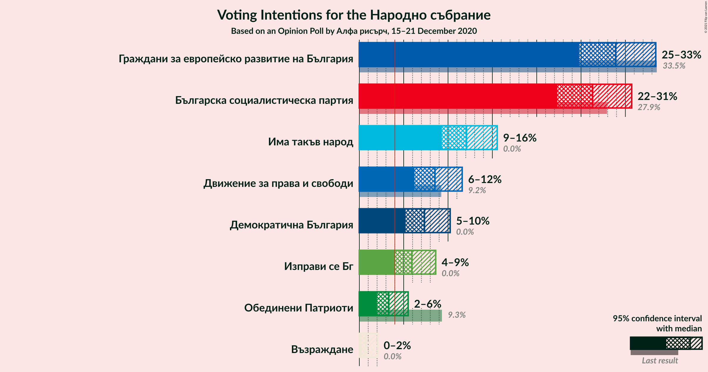

### Confidence Intervals

| Party | Last Result | Poll Result | 80% Confidence Interval | 90% Confidence Interval | 95% Confidence Interval | 99% Confidence Interval |
|:-----:|:-----------:|:-----------:|:-----------------------:|:-----------------------:|:-----------------------:|:-----------------------:|
| Граждани за европейско развитие на България | 33.5% | 28.9% | 26.2–31.9% |25.4–32.7% |24.8–33.4% |23.5–34.9% |
| Българска социалистическа партия | 27.9% | 26.3% | 23.7–29.2% |23.0–30.0% |22.3–30.7% |21.1–32.1% |
| Има такъв народ | 0.0% | 12.1% | 10.3–14.3% |9.7–15.0% |9.3–15.5% |8.5–16.7% |
| Движение за права и свободи | 9.2% | 8.5% | 7.0–10.5% |6.6–11.1% |6.2–11.6% |5.6–12.6% |
| Демократична България | 0.0% | 7.3% | 5.9–9.2% |5.5–9.8% |5.2–10.2% |4.6–11.2% |
| Изправи се Бг | 0.0% | 5.9% | 4.7–7.7% |4.3–8.2% |4.0–8.6% |3.5–9.5% |
| Обединени Патриоти | 9.3% | 3.3% | 2.4–4.7% |2.2–5.1% |2.0–5.5% |1.6–6.2% |
| Възраждане | 0.0% | 0.7% | 0.4–1.6% |0.3–1.8% |0.2–2.1% |0.2–2.6% |

*Note:* The poll result column reflects the actual value used in the calculations. Published results may vary slightly, and in addition be rounded to fewer digits.

## Seats

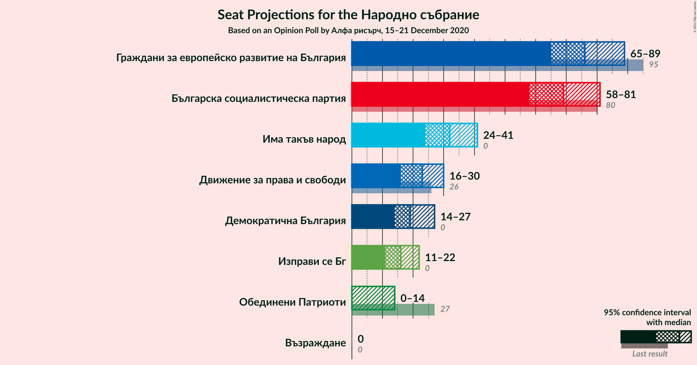

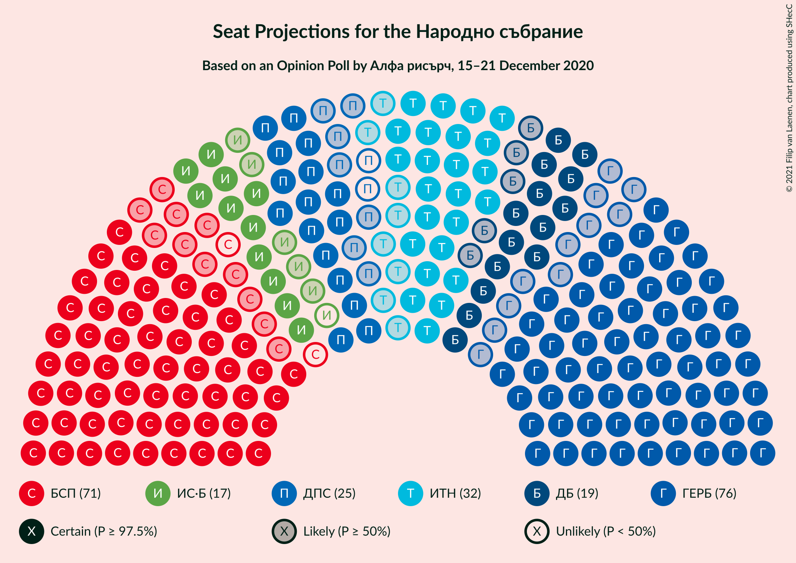

### Confidence Intervals

| Party | Last Result | Median | 80% Confidence Interval | 90% Confidence Interval | 95% Confidence Interval | 99% Confidence Interval |
|:-----:|:-----------:|:------:|:-----------------------:|:-----------------------:|:-----------------------:|:-----------------------:|
| <a href="#граждани-за-европейско-развитие-на-българия">Граждани за европейско развитие на България</a> | 95 | 76 | 69–84 |67–86 |65–89 |61–91 |
| <a href="#българска-социалистическа-партия">Българска социалистическа партия</a> | 80 | 69 | 62–77 |61–79 |58–81 |55–85 |
| <a href="#има-такъв-народ">Има такъв народ</a> | 0 | 32 | 27–38 |26–40 |24–41 |22–44 |
| <a href="#движение-за-права-и-свободи">Движение за права и свободи</a> | 26 | 23 | 18–28 |17–30 |16–30 |14–33 |
| <a href="#демократична-българия">Демократична България</a> | 0 | 19 | 16–25 |15–26 |14–27 |12–30 |
| <a href="#изправи-се-бг">Изправи се Бг</a> | 0 | 16 | 12–20 |11–21 |11–22 |0–25 |
| <a href="#обединени-патриоти">Обединени Патриоти</a> | 27 | 0 | 0–12 |0–13 |0–14 |0–16 |
| <a href="#възраждане">Възраждане</a> | 0 | 0 | 0 |0 |0 |0 |

### Граждани за европейско развитие на България

*For a full overview of the results for this party, see the [Граждани за европейско развитие на България](party-гражданизаевропейскоразвитиенабългария.html) page.*

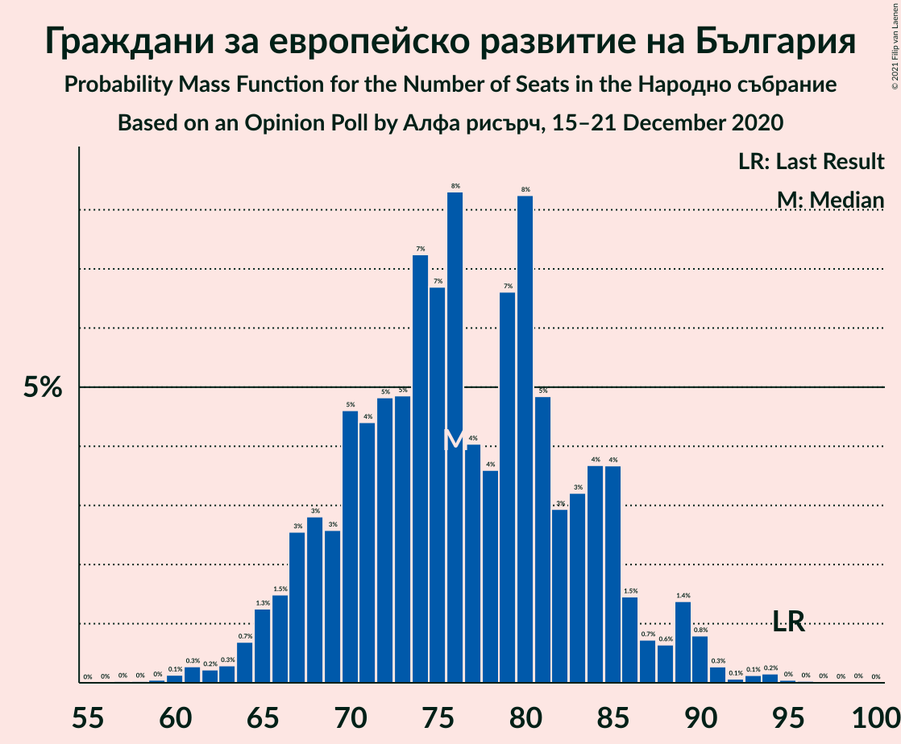

| Number of Seats | Probability | Accumulated | Special Marks |
|:---------------:|:-----------:|:-----------:|:-------------:|
| 58 | 0% | 100% |  |
| 59 | 0% | 99.9% |  |
| 60 | 0.1% | 99.9% |  |
| 61 | 0.3% | 99.7% |  |
| 62 | 0.2% | 99.5% |  |
| 63 | 0.3% | 99.2% |  |
| 64 | 0.7% | 98.9% |  |
| 65 | 1.3% | 98% |  |
| 66 | 1.5% | 97% |  |
| 67 | 3% | 96% |  |
| 68 | 3% | 93% |  |
| 69 | 3% | 90% |  |
| 70 | 5% | 88% |  |
| 71 | 4% | 83% |  |
| 72 | 5% | 79% |  |
| 73 | 5% | 74% |  |
| 74 | 7% | 69% |  |
| 75 | 7% | 62% |  |
| 76 | 8% | 55% | Median |
| 77 | 4% | 47% |  |
| 78 | 4% | 43% |  |
| 79 | 7% | 39% |  |
| 80 | 8% | 32% |  |
| 81 | 5% | 24% |  |
| 82 | 3% | 19% |  |
| 83 | 3% | 16% |  |
| 84 | 4% | 13% |  |
| 85 | 4% | 9% |  |
| 86 | 1.5% | 6% |  |
| 87 | 0.7% | 4% |  |
| 88 | 0.6% | 4% |  |
| 89 | 1.4% | 3% |  |
| 90 | 0.8% | 2% |  |
| 91 | 0.3% | 0.8% |  |
| 92 | 0.1% | 0.5% |  |
| 93 | 0.1% | 0.4% |  |
| 94 | 0.2% | 0.3% |  |
| 95 | 0% | 0.1% | Last Result |
| 96 | 0% | 0.1% |  |
| 97 | 0% | 0.1% |  |
| 98 | 0% | 0% |  |

### Българска социалистическа партия

*For a full overview of the results for this party, see the [Българска социалистическа партия](party-българскасоциалистическапартия.html) page.*

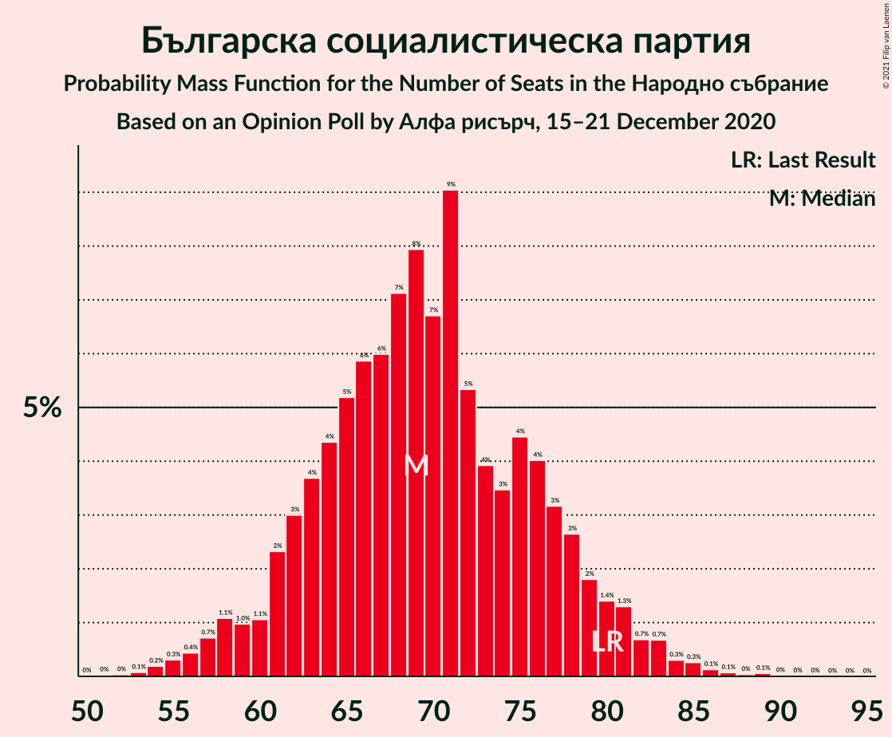

| Number of Seats | Probability | Accumulated | Special Marks |
|:---------------:|:-----------:|:-----------:|:-------------:|
| 51 | 0% | 100% |  |
| 52 | 0% | 99.9% |  |
| 53 | 0.1% | 99.9% |  |
| 54 | 0.2% | 99.8% |  |
| 55 | 0.3% | 99.6% |  |
| 56 | 0.4% | 99.3% |  |
| 57 | 0.7% | 98.9% |  |
| 58 | 1.1% | 98% |  |
| 59 | 1.0% | 97% |  |
| 60 | 1.1% | 96% |  |
| 61 | 2% | 95% |  |
| 62 | 3% | 93% |  |
| 63 | 4% | 90% |  |
| 64 | 4% | 86% |  |
| 65 | 5% | 82% |  |
| 66 | 6% | 76% |  |
| 67 | 6% | 71% |  |
| 68 | 7% | 65% |  |
| 69 | 8% | 58% | Median |
| 70 | 7% | 50% |  |
| 71 | 9% | 43% |  |
| 72 | 5% | 34% |  |
| 73 | 4% | 28% |  |
| 74 | 3% | 25% |  |
| 75 | 4% | 21% |  |
| 76 | 4% | 17% |  |
| 77 | 3% | 13% |  |
| 78 | 3% | 9% |  |
| 79 | 2% | 7% |  |
| 80 | 1.4% | 5% | Last Result |
| 81 | 1.3% | 4% |  |
| 82 | 0.7% | 2% |  |
| 83 | 0.7% | 2% |  |
| 84 | 0.3% | 0.9% |  |
| 85 | 0.3% | 0.6% |  |
| 86 | 0.1% | 0.3% |  |
| 87 | 0.1% | 0.2% |  |
| 88 | 0% | 0.1% |  |
| 89 | 0.1% | 0.1% |  |
| 90 | 0% | 0.1% |  |
| 91 | 0% | 0% |  |

### Има такъв народ

*For a full overview of the results for this party, see the [Има такъв народ](party-иматакъвнарод.html) page.*

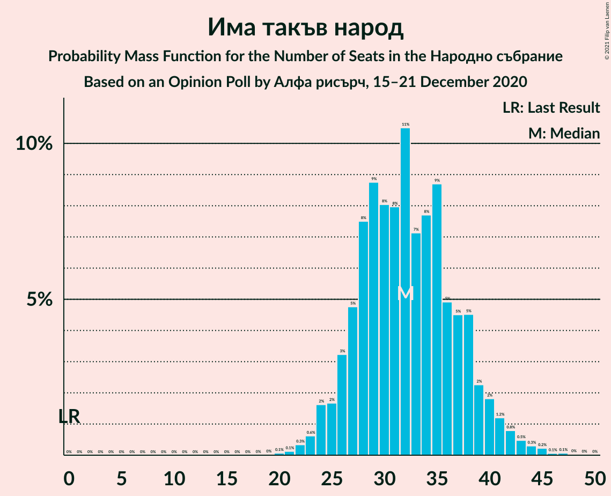

| Number of Seats | Probability | Accumulated | Special Marks |
|:---------------:|:-----------:|:-----------:|:-------------:|
| 0 | 0% | 100% | Last Result |
| 1 | 0% | 100% |  |
| 2 | 0% | 100% |  |
| 3 | 0% | 100% |  |
| 4 | 0% | 100% |  |
| 5 | 0% | 100% |  |
| 6 | 0% | 100% |  |
| 7 | 0% | 100% |  |
| 8 | 0% | 100% |  |
| 9 | 0% | 100% |  |
| 10 | 0% | 100% |  |
| 11 | 0% | 100% |  |
| 12 | 0% | 100% |  |
| 13 | 0% | 100% |  |
| 14 | 0% | 100% |  |
| 15 | 0% | 100% |  |
| 16 | 0% | 100% |  |
| 17 | 0% | 100% |  |
| 18 | 0% | 100% |  |
| 19 | 0% | 100% |  |
| 20 | 0.1% | 100% |  |
| 21 | 0.1% | 99.9% |  |
| 22 | 0.3% | 99.8% |  |
| 23 | 0.6% | 99.4% |  |
| 24 | 2% | 98.8% |  |
| 25 | 2% | 97% |  |
| 26 | 3% | 96% |  |
| 27 | 5% | 92% |  |
| 28 | 8% | 88% |  |
| 29 | 9% | 80% |  |
| 30 | 8% | 71% |  |
| 31 | 8% | 63% |  |
| 32 | 11% | 55% | Median |
| 33 | 7% | 45% |  |
| 34 | 8% | 38% |  |
| 35 | 9% | 30% |  |
| 36 | 5% | 21% |  |
| 37 | 5% | 16% |  |
| 38 | 5% | 12% |  |
| 39 | 2% | 7% |  |
| 40 | 2% | 5% |  |
| 41 | 1.2% | 3% |  |
| 42 | 0.8% | 2% |  |
| 43 | 0.5% | 1.2% |  |
| 44 | 0.3% | 0.7% |  |
| 45 | 0.2% | 0.4% |  |
| 46 | 0.1% | 0.2% |  |
| 47 | 0.1% | 0.1% |  |
| 48 | 0% | 0.1% |  |
| 49 | 0% | 0% |  |

### Движение за права и свободи

*For a full overview of the results for this party, see the [Движение за права и свободи](party-движениезаправаисвободи.html) page.*

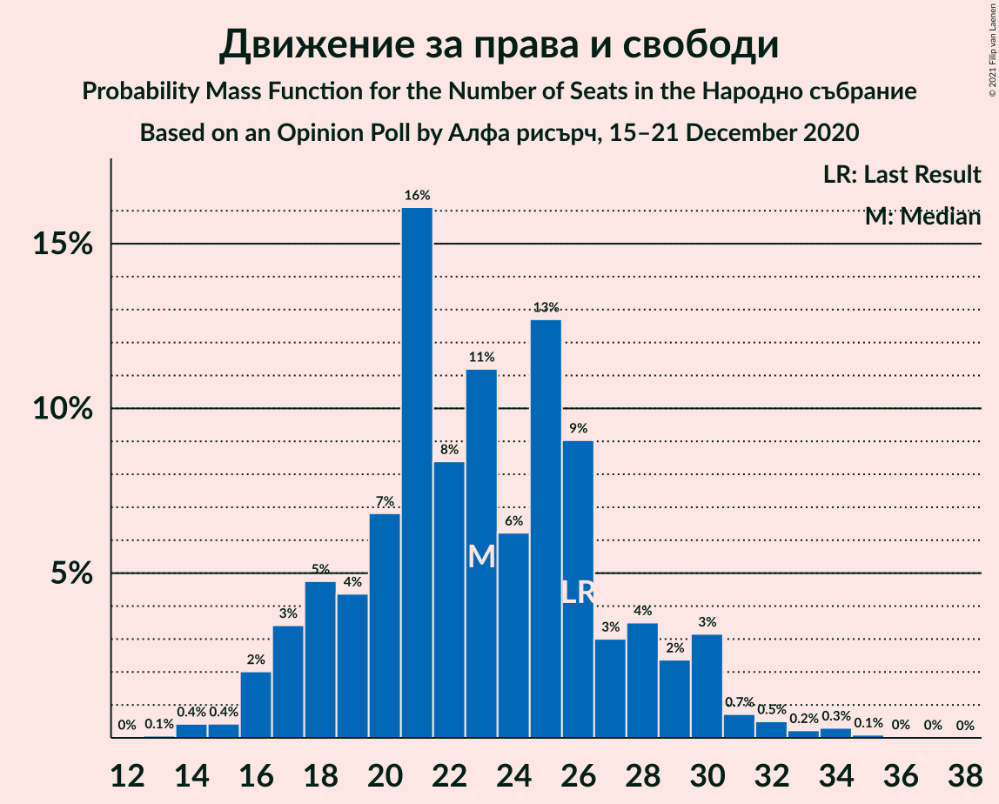

| Number of Seats | Probability | Accumulated | Special Marks |
|:---------------:|:-----------:|:-----------:|:-------------:|
| 13 | 0.1% | 100% |  |
| 14 | 0.4% | 99.9% |  |
| 15 | 0.4% | 99.5% |  |
| 16 | 2% | 99.0% |  |
| 17 | 3% | 97% |  |
| 18 | 5% | 94% |  |
| 19 | 4% | 89% |  |
| 20 | 7% | 84% |  |
| 21 | 16% | 78% |  |
| 22 | 8% | 62% |  |
| 23 | 11% | 53% | Median |
| 24 | 6% | 42% |  |
| 25 | 13% | 36% |  |
| 26 | 9% | 23% | Last Result |
| 27 | 3% | 14% |  |
| 28 | 4% | 11% |  |
| 29 | 2% | 7% |  |
| 30 | 3% | 5% |  |
| 31 | 0.7% | 2% |  |
| 32 | 0.5% | 1.2% |  |
| 33 | 0.2% | 0.7% |  |
| 34 | 0.3% | 0.5% |  |
| 35 | 0.1% | 0.2% |  |
| 36 | 0% | 0.1% |  |
| 37 | 0% | 0.1% |  |
| 38 | 0% | 0% |  |

### Демократична България

*For a full overview of the results for this party, see the [Демократична България](party-демократичнабългария.html) page.*

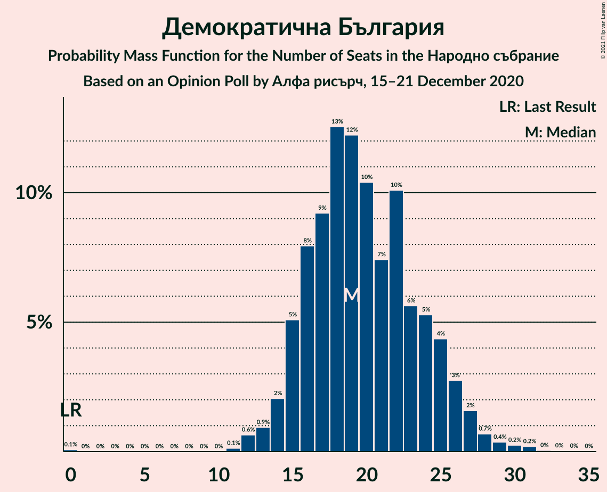

| Number of Seats | Probability | Accumulated | Special Marks |
|:---------------:|:-----------:|:-----------:|:-------------:|
| 0 | 0.1% | 100% | Last Result |
| 1 | 0% | 99.9% |  |
| 2 | 0% | 99.9% |  |
| 3 | 0% | 99.9% |  |
| 4 | 0% | 99.9% |  |
| 5 | 0% | 99.9% |  |
| 6 | 0% | 99.9% |  |
| 7 | 0% | 99.9% |  |
| 8 | 0% | 99.9% |  |
| 9 | 0% | 99.9% |  |
| 10 | 0% | 99.9% |  |
| 11 | 0.1% | 99.9% |  |
| 12 | 0.6% | 99.8% |  |
| 13 | 0.9% | 99.2% |  |
| 14 | 2% | 98% |  |
| 15 | 5% | 96% |  |
| 16 | 8% | 91% |  |
| 17 | 9% | 83% |  |
| 18 | 13% | 74% |  |
| 19 | 12% | 61% | Median |
| 20 | 10% | 49% |  |
| 21 | 7% | 39% |  |
| 22 | 10% | 31% |  |
| 23 | 6% | 21% |  |
| 24 | 5% | 16% |  |
| 25 | 4% | 10% |  |
| 26 | 3% | 6% |  |
| 27 | 2% | 3% |  |
| 28 | 0.7% | 2% |  |
| 29 | 0.4% | 0.9% |  |
| 30 | 0.2% | 0.6% |  |
| 31 | 0.2% | 0.3% |  |
| 32 | 0% | 0.1% |  |
| 33 | 0% | 0.1% |  |
| 34 | 0% | 0% |  |

### Изправи се Бг

*For a full overview of the results for this party, see the [Изправи се Бг](party-изправисебг.html) page.*

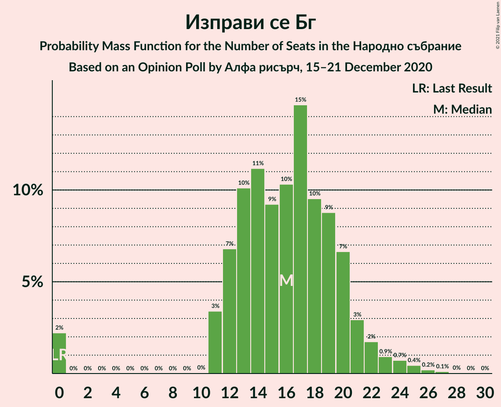

| Number of Seats | Probability | Accumulated | Special Marks |
|:---------------:|:-----------:|:-----------:|:-------------:|
| 0 | 2% | 100% | Last Result |
| 1 | 0% | 98% |  |
| 2 | 0% | 98% |  |
| 3 | 0% | 98% |  |
| 4 | 0% | 98% |  |
| 5 | 0% | 98% |  |
| 6 | 0% | 98% |  |
| 7 | 0% | 98% |  |
| 8 | 0% | 98% |  |
| 9 | 0% | 98% |  |
| 10 | 0% | 98% |  |
| 11 | 3% | 98% |  |
| 12 | 7% | 94% |  |
| 13 | 10% | 88% |  |
| 14 | 11% | 77% |  |
| 15 | 9% | 66% |  |
| 16 | 10% | 57% | Median |
| 17 | 15% | 47% |  |
| 18 | 10% | 32% |  |
| 19 | 9% | 23% |  |
| 20 | 7% | 14% |  |
| 21 | 3% | 7% |  |
| 22 | 2% | 4% |  |
| 23 | 0.9% | 2% |  |
| 24 | 0.7% | 2% |  |
| 25 | 0.4% | 0.8% |  |
| 26 | 0.2% | 0.4% |  |
| 27 | 0.1% | 0.2% |  |
| 28 | 0% | 0.1% |  |
| 29 | 0% | 0% |  |

### Обединени Патриоти

*For a full overview of the results for this party, see the [Обединени Патриоти](party-обединенипатриоти.html) page.*

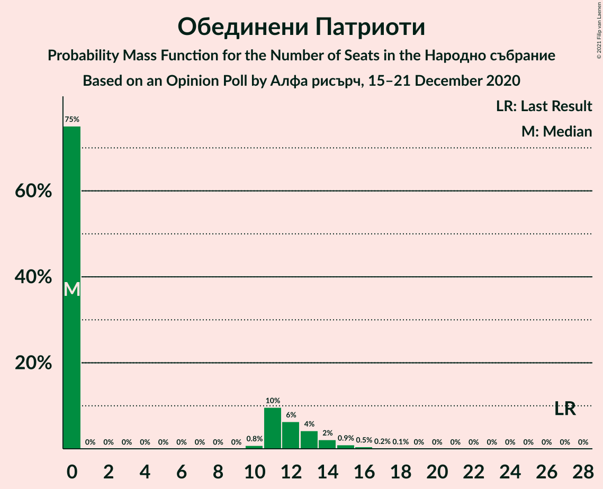

| Number of Seats | Probability | Accumulated | Special Marks |
|:---------------:|:-----------:|:-----------:|:-------------:|
| 0 | 75% | 100% | Median |
| 1 | 0% | 25% |  |
| 2 | 0% | 25% |  |
| 3 | 0% | 25% |  |
| 4 | 0% | 25% |  |
| 5 | 0% | 25% |  |
| 6 | 0% | 25% |  |
| 7 | 0% | 25% |  |
| 8 | 0% | 25% |  |
| 9 | 0% | 25% |  |
| 10 | 0.8% | 25% |  |
| 11 | 10% | 24% |  |
| 12 | 6% | 14% |  |
| 13 | 4% | 8% |  |
| 14 | 2% | 4% |  |
| 15 | 0.9% | 2% |  |
| 16 | 0.5% | 0.8% |  |
| 17 | 0.2% | 0.3% |  |
| 18 | 0.1% | 0.1% |  |
| 19 | 0% | 0% |  |
| 20 | 0% | 0% |  |
| 21 | 0% | 0% |  |
| 22 | 0% | 0% |  |
| 23 | 0% | 0% |  |
| 24 | 0% | 0% |  |
| 25 | 0% | 0% |  |
| 26 | 0% | 0% |  |
| 27 | 0% | 0% | Last Result |

### Възраждане

*For a full overview of the results for this party, see the [Възраждане](party-възраждане.html) page.*

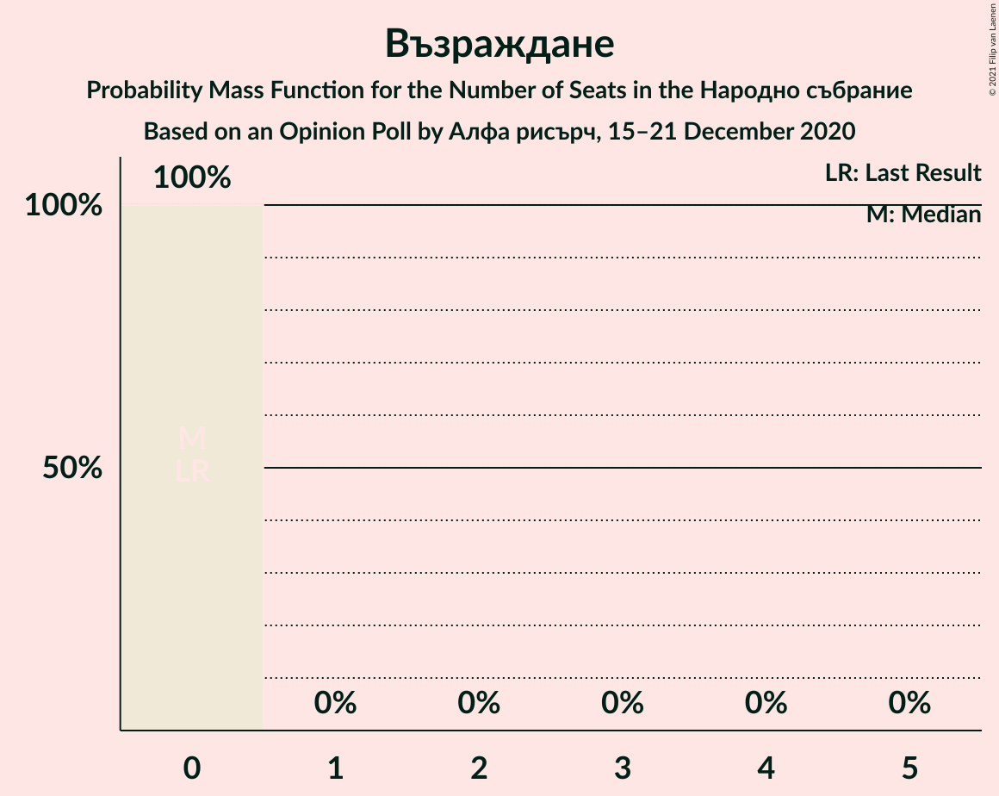

| Number of Seats | Probability | Accumulated | Special Marks |
|:---------------:|:-----------:|:-----------:|:-------------:|
| 0 | 100% | 100% | Last Result, Median |

## Coalitions

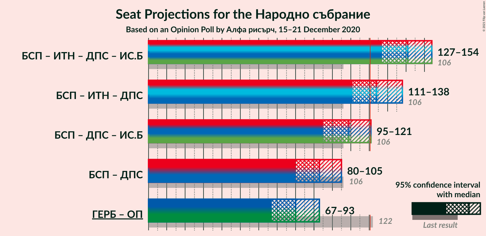

### Confidence Intervals

| Coalition | Last Result | Median | Majority? | 80% Confidence Interval | 90% Confidence Interval | 95% Confidence Interval | 99% Confidence Interval |
|:---------:|:-----------:|:------:|:---------:|:-----------------------:|:-----------------------:|:-----------------------:|:-----------------------:|
| Българска социалистическа партия – Има такъв народ – Движение за права и свободи – Изправи се Бг | 106 | 141 | 99.8% | 132–150 | 129–152 | 127–154 | 122–157 |
| Българска социалистическа партия – Има такъв народ – Движение за права и свободи | 106 | 124 | 77% | 116–134 | 113–136 | 111–138 | 107–142 |
| Българска социалистическа партия – Движение за права и свободи – Изправи се Бг | 106 | 109 | 3% | 100–118 | 97–120 | 95–121 | 91–125 |
| Българска социалистическа партия – Движение за права и свободи | 106 | 93 | 0% | 85–101 | 82–104 | 80–105 | 76–109 |
| Граждани за европейско развитие на България – Обединени Патриоти | 122 | 80 | 0% | 70–88 | 69–91 | 67–93 | 64–98 |

### Българска социалистическа партия – Има такъв народ – Движение за права и свободи – Изправи се Бг

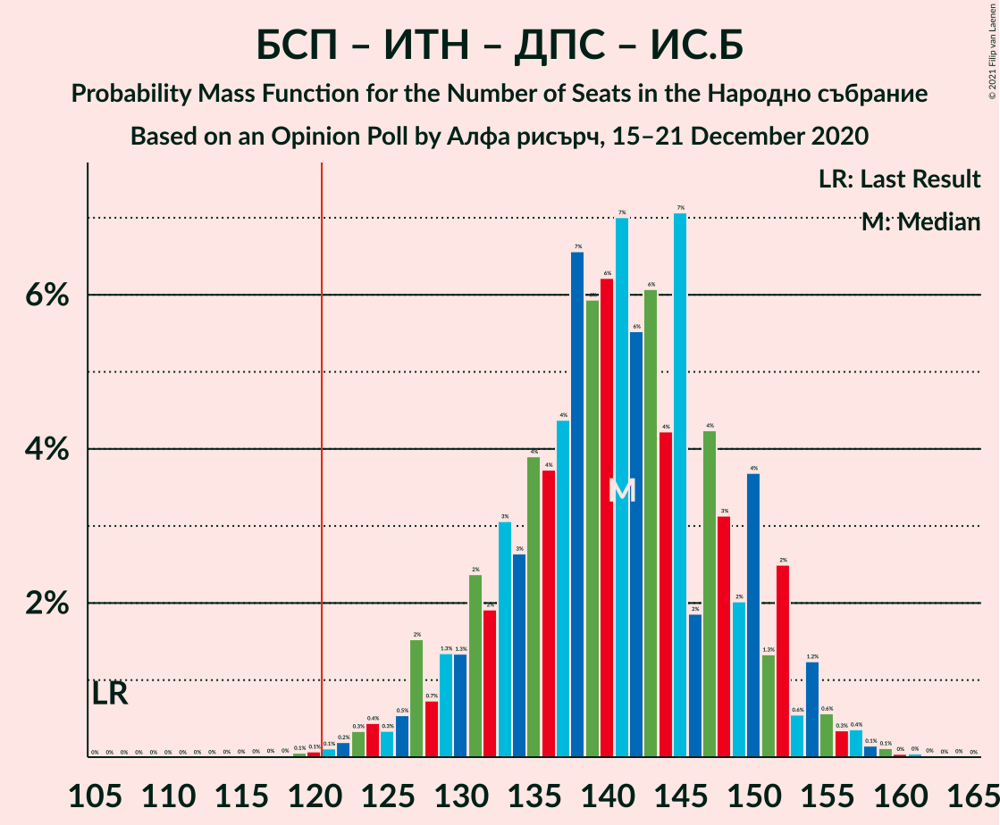

| Number of Seats | Probability | Accumulated | Special Marks |
|:---------------:|:-----------:|:-----------:|:-------------:|
| 106 | 0% | 100% | Last Result |
| 107 | 0% | 100% |  |
| 108 | 0% | 100% |  |
| 109 | 0% | 100% |  |
| 110 | 0% | 100% |  |
| 111 | 0% | 100% |  |
| 112 | 0% | 100% |  |
| 113 | 0% | 100% |  |
| 114 | 0% | 100% |  |
| 115 | 0% | 100% |  |
| 116 | 0% | 100% |  |
| 117 | 0% | 100% |  |
| 118 | 0% | 99.9% |  |
| 119 | 0.1% | 99.9% |  |
| 120 | 0.1% | 99.9% |  |
| 121 | 0.1% | 99.8% | Majority |
| 122 | 0.2% | 99.7% |  |
| 123 | 0.3% | 99.5% |  |
| 124 | 0.4% | 99.2% |  |
| 125 | 0.3% | 98.7% |  |
| 126 | 0.5% | 98% |  |
| 127 | 2% | 98% |  |
| 128 | 0.7% | 96% |  |
| 129 | 1.3% | 96% |  |
| 130 | 1.3% | 94% |  |
| 131 | 2% | 93% |  |
| 132 | 2% | 90% |  |
| 133 | 3% | 89% |  |
| 134 | 3% | 86% |  |
| 135 | 4% | 83% |  |
| 136 | 4% | 79% |  |
| 137 | 4% | 75% |  |
| 138 | 7% | 71% |  |
| 139 | 6% | 64% |  |
| 140 | 6% | 58% | Median |
| 141 | 7% | 52% |  |
| 142 | 6% | 45% |  |
| 143 | 6% | 40% |  |
| 144 | 4% | 34% |  |
| 145 | 7% | 29% |  |
| 146 | 2% | 22% |  |
| 147 | 4% | 20% |  |
| 148 | 3% | 16% |  |
| 149 | 2% | 13% |  |
| 150 | 4% | 11% |  |
| 151 | 1.3% | 7% |  |
| 152 | 2% | 6% |  |
| 153 | 0.6% | 3% |  |
| 154 | 1.2% | 3% |  |
| 155 | 0.6% | 2% |  |
| 156 | 0.3% | 1.1% |  |
| 157 | 0.4% | 0.8% |  |
| 158 | 0.1% | 0.4% |  |
| 159 | 0.1% | 0.3% |  |
| 160 | 0% | 0.1% |  |
| 161 | 0% | 0.1% |  |
| 162 | 0% | 0.1% |  |
| 163 | 0% | 0% |  |

### Българска социалистическа партия – Има такъв народ – Движение за права и свободи

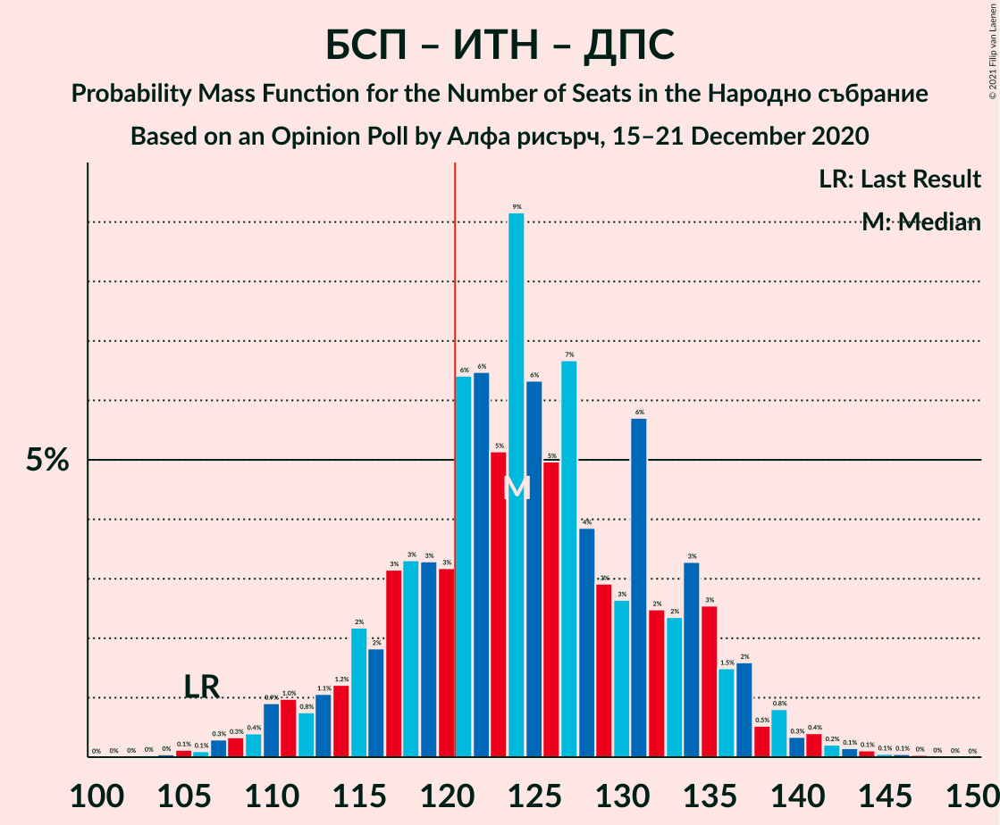

| Number of Seats | Probability | Accumulated | Special Marks |
|:---------------:|:-----------:|:-----------:|:-------------:|
| 103 | 0% | 100% |  |
| 104 | 0% | 99.9% |  |
| 105 | 0.1% | 99.9% |  |
| 106 | 0.1% | 99.8% | Last Result |
| 107 | 0.3% | 99.7% |  |
| 108 | 0.3% | 99.4% |  |
| 109 | 0.4% | 99.0% |  |
| 110 | 0.9% | 98.6% |  |
| 111 | 1.0% | 98% |  |
| 112 | 0.8% | 97% |  |
| 113 | 1.1% | 96% |  |
| 114 | 1.2% | 95% |  |
| 115 | 2% | 94% |  |
| 116 | 2% | 92% |  |
| 117 | 3% | 90% |  |
| 118 | 3% | 87% |  |
| 119 | 3% | 83% |  |
| 120 | 3% | 80% |  |
| 121 | 6% | 77% | Majority |
| 122 | 6% | 70% |  |
| 123 | 5% | 64% |  |
| 124 | 9% | 59% | Median |
| 125 | 6% | 50% |  |
| 126 | 5% | 43% |  |
| 127 | 7% | 38% |  |
| 128 | 4% | 32% |  |
| 129 | 3% | 28% |  |
| 130 | 3% | 25% |  |
| 131 | 6% | 22% |  |
| 132 | 2% | 16% |  |
| 133 | 2% | 14% |  |
| 134 | 3% | 12% |  |
| 135 | 3% | 8% |  |
| 136 | 1.5% | 6% |  |
| 137 | 2% | 4% |  |
| 138 | 0.5% | 3% |  |
| 139 | 0.8% | 2% |  |
| 140 | 0.3% | 1.4% |  |
| 141 | 0.4% | 1.1% |  |
| 142 | 0.2% | 0.7% |  |
| 143 | 0.1% | 0.5% |  |
| 144 | 0.1% | 0.3% |  |
| 145 | 0.1% | 0.2% |  |
| 146 | 0.1% | 0.1% |  |
| 147 | 0% | 0.1% |  |
| 148 | 0% | 0% |  |

### Българска социалистическа партия – Движение за права и свободи – Изправи се Бг

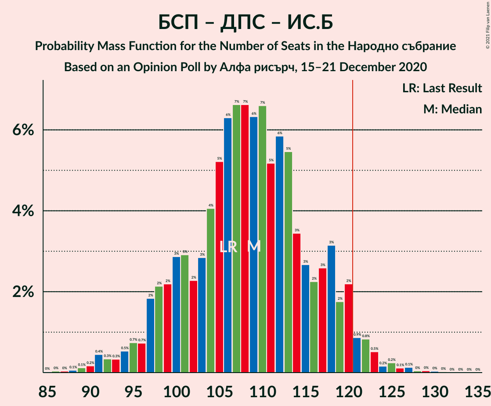

| Number of Seats | Probability | Accumulated | Special Marks |
|:---------------:|:-----------:|:-----------:|:-------------:|
| 85 | 0% | 100% |  |
| 86 | 0% | 99.9% |  |
| 87 | 0% | 99.9% |  |
| 88 | 0.1% | 99.9% |  |
| 89 | 0.1% | 99.8% |  |
| 90 | 0.2% | 99.7% |  |
| 91 | 0.4% | 99.5% |  |
| 92 | 0.3% | 99.1% |  |
| 93 | 0.3% | 98.7% |  |
| 94 | 0.5% | 98% |  |
| 95 | 0.7% | 98% |  |
| 96 | 0.7% | 97% |  |
| 97 | 2% | 96% |  |
| 98 | 2% | 95% |  |
| 99 | 2% | 92% |  |
| 100 | 3% | 90% |  |
| 101 | 3% | 87% |  |
| 102 | 2% | 84% |  |
| 103 | 3% | 82% |  |
| 104 | 4% | 79% |  |
| 105 | 5% | 75% |  |
| 106 | 6% | 70% | Last Result |
| 107 | 7% | 64% |  |
| 108 | 7% | 57% | Median |
| 109 | 6% | 50% |  |
| 110 | 7% | 44% |  |
| 111 | 5% | 38% |  |
| 112 | 6% | 32% |  |
| 113 | 5% | 27% |  |
| 114 | 3% | 21% |  |
| 115 | 3% | 18% |  |
| 116 | 2% | 15% |  |
| 117 | 3% | 13% |  |
| 118 | 3% | 10% |  |
| 119 | 2% | 7% |  |
| 120 | 2% | 5% |  |
| 121 | 0.9% | 3% | Majority |
| 122 | 0.8% | 2% |  |
| 123 | 0.5% | 1.3% |  |
| 124 | 0.2% | 0.8% |  |
| 125 | 0.2% | 0.7% |  |
| 126 | 0.1% | 0.4% |  |
| 127 | 0.1% | 0.3% |  |
| 128 | 0% | 0.2% |  |
| 129 | 0% | 0.1% |  |
| 130 | 0% | 0.1% |  |
| 131 | 0% | 0% |  |

### Българска социалистическа партия – Движение за права и свободи

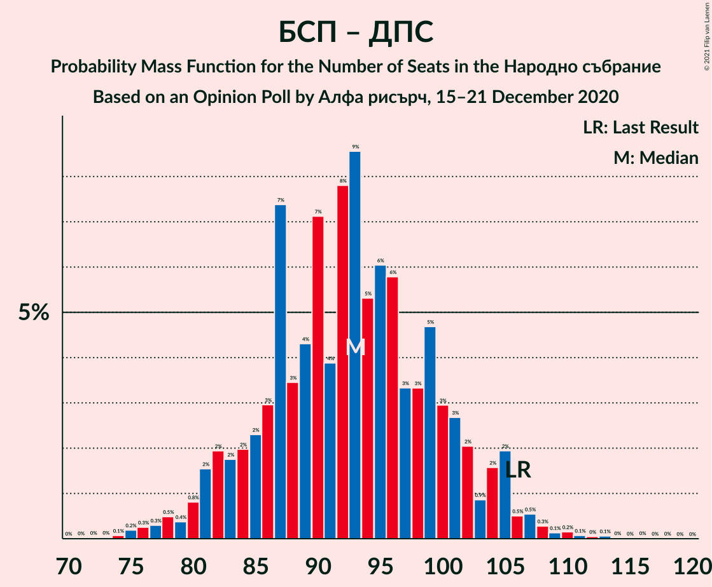

| Number of Seats | Probability | Accumulated | Special Marks |
|:---------------:|:-----------:|:-----------:|:-------------:|
| 72 | 0% | 100% |  |
| 73 | 0% | 99.9% |  |
| 74 | 0.1% | 99.9% |  |
| 75 | 0.2% | 99.8% |  |
| 76 | 0.3% | 99.6% |  |
| 77 | 0.3% | 99.4% |  |
| 78 | 0.5% | 99.1% |  |
| 79 | 0.4% | 98.6% |  |
| 80 | 0.8% | 98% |  |
| 81 | 2% | 97% |  |
| 82 | 2% | 96% |  |
| 83 | 2% | 94% |  |
| 84 | 2% | 92% |  |
| 85 | 2% | 90% |  |
| 86 | 3% | 88% |  |
| 87 | 7% | 85% |  |
| 88 | 3% | 78% |  |
| 89 | 4% | 74% |  |
| 90 | 7% | 70% |  |
| 91 | 4% | 63% |  |
| 92 | 8% | 59% | Median |
| 93 | 9% | 51% |  |
| 94 | 5% | 42% |  |
| 95 | 6% | 37% |  |
| 96 | 6% | 31% |  |
| 97 | 3% | 25% |  |
| 98 | 3% | 22% |  |
| 99 | 5% | 19% |  |
| 100 | 3% | 14% |  |
| 101 | 3% | 11% |  |
| 102 | 2% | 8% |  |
| 103 | 0.9% | 6% |  |
| 104 | 2% | 5% |  |
| 105 | 2% | 4% |  |
| 106 | 0.5% | 2% | Last Result |
| 107 | 0.5% | 1.4% |  |
| 108 | 0.3% | 0.8% |  |
| 109 | 0.1% | 0.5% |  |
| 110 | 0.2% | 0.4% |  |
| 111 | 0.1% | 0.3% |  |
| 112 | 0% | 0.2% |  |
| 113 | 0.1% | 0.1% |  |
| 114 | 0% | 0.1% |  |
| 115 | 0% | 0.1% |  |
| 116 | 0% | 0% |  |

### Граждани за европейско развитие на България – Обединени Патриоти

| Number of Seats | Probability | Accumulated | Special Marks |
|:---------------:|:-----------:|:-----------:|:-------------:|
| 60 | 0.1% | 100% |  |
| 61 | 0.1% | 99.9% |  |
| 62 | 0.1% | 99.8% |  |
| 63 | 0.1% | 99.8% |  |
| 64 | 0.5% | 99.7% |  |
| 65 | 0.8% | 99.2% |  |
| 66 | 0.9% | 98% |  |
| 67 | 0.8% | 98% |  |
| 68 | 1.3% | 97% |  |
| 69 | 2% | 95% |  |
| 70 | 4% | 93% |  |
| 71 | 1.4% | 90% |  |
| 72 | 2% | 88% |  |
| 73 | 4% | 86% |  |
| 74 | 6% | 82% |  |
| 75 | 5% | 76% |  |
| 76 | 6% | 71% | Median |
| 77 | 3% | 65% |  |
| 78 | 4% | 61% |  |
| 79 | 7% | 57% |  |
| 80 | 9% | 50% |  |
| 81 | 5% | 41% |  |
| 82 | 3% | 36% |  |
| 83 | 6% | 33% |  |
| 84 | 5% | 27% |  |
| 85 | 5% | 22% |  |
| 86 | 2% | 17% |  |
| 87 | 2% | 14% |  |
| 88 | 2% | 12% |  |
| 89 | 3% | 10% |  |
| 90 | 1.2% | 6% |  |
| 91 | 1.0% | 5% |  |
| 92 | 0.5% | 4% |  |
| 93 | 1.3% | 4% |  |
| 94 | 0.7% | 2% |  |
| 95 | 0.6% | 2% |  |
| 96 | 0.3% | 1.1% |  |
| 97 | 0.3% | 0.8% |  |
| 98 | 0.2% | 0.5% |  |
| 99 | 0.1% | 0.3% |  |
| 100 | 0.1% | 0.2% |  |
| 101 | 0.1% | 0.2% |  |
| 102 | 0.1% | 0.1% |  |
| 103 | 0% | 0% |  |
| 104 | 0% | 0% |  |
| 105 | 0% | 0% |  |
| 106 | 0% | 0% |  |
| 107 | 0% | 0% |  |
| 108 | 0% | 0% |  |
| 109 | 0% | 0% |  |
| 110 | 0% | 0% |  |
| 111 | 0% | 0% |  |
| 112 | 0% | 0% |  |
| 113 | 0% | 0% |  |
| 114 | 0% | 0% |  |
| 115 | 0% | 0% |  |
| 116 | 0% | 0% |  |
| 117 | 0% | 0% |  |
| 118 | 0% | 0% |  |
| 119 | 0% | 0% |  |
| 120 | 0% | 0% |  |
| 121 | 0% | 0% | Majority |
| 122 | 0% | 0% | Last Result |

## Technical Information

### Opinion Poll

+ **Polling firm:** Алфа рисърч
+ **Commissioner(s):** —
+ **Fieldwork period:** 15–21 December 2020

### Calculations

+ **Sample size:** 422
+ **Simulations done:** 1,048,576
+ **Error estimate:** 1.57%

