# Opinion Poll by Sova Harris, 26 January 2020–31 January 2021

<a href="#voting-intentions">Voting Intentions</a> | <a href="#seats">Seats</a> | <a href="#coalitions">Coalitions</a> | <a href="#technical-information">Technical Information</a>

## Voting Intentions

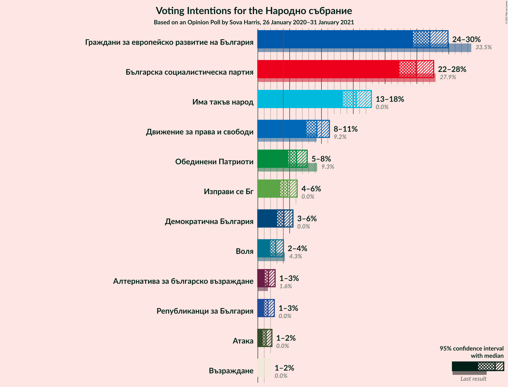

### Confidence Intervals

| Party | Last Result | Poll Result | 80% Confidence Interval | 90% Confidence Interval | 95% Confidence Interval | 99% Confidence Interval |
|:-----:|:-----------:|:-----------:|:-----------------------:|:-----------------------:|:-----------------------:|:-----------------------:|
| Граждани за европейско развитие на България | 33.5% | 27.0% | 25.3–28.9% |24.8–29.4% |24.4–29.9% |23.6–30.8% |
| Българска социалистическа партия | 27.9% | 24.9% | 23.2–26.7% |22.7–27.2% |22.3–27.6% |21.5–28.5% |
| Има такъв народ | 0.0% | 15.5% | 14.1–17.0% |13.7–17.5% |13.4–17.8% |12.7–18.6% |
| Движение за права и свободи | 9.2% | 9.3% | 8.2–10.6% |7.9–10.9% |7.6–11.2% |7.1–11.9% |
| Обединени Патриоти | 9.3% | 6.1% | 5.2–7.2% |5.0–7.5% |4.8–7.8% |4.4–8.3% |
| Изправи се Бг | 0.0% | 4.7% | 3.9–5.7% |3.7–5.9% |3.5–6.2% |3.2–6.7% |
| Демократична България | 0.0% | 4.1% | 3.4–5.0% |3.2–5.3% |3.0–5.5% |2.7–6.0% |
| Воля | 4.3% | 2.8% | 2.2–3.6% |2.1–3.8% |1.9–4.0% |1.7–4.4% |
| Алтернатива за българско възраждане | 1.6% | 1.7% | 1.3–2.3% |1.2–2.5% |1.1–2.7% |0.9–3.1% |
| Републиканци за България | 0.0% | 1.6% | 1.2–2.2% |1.1–2.4% |1.0–2.6% |0.8–2.9% |
| Атака | 0.0% | 1.3% | 0.9–1.9% |0.8–2.1% |0.8–2.2% |0.6–2.5% |
| Възраждане | 0.0% | 1.1% | 0.8–1.7% |0.7–1.8% |0.6–2.0% |0.5–2.3% |

*Note:* The poll result column reflects the actual value used in the calculations. Published results may vary slightly, and in addition be rounded to fewer digits.

## Seats

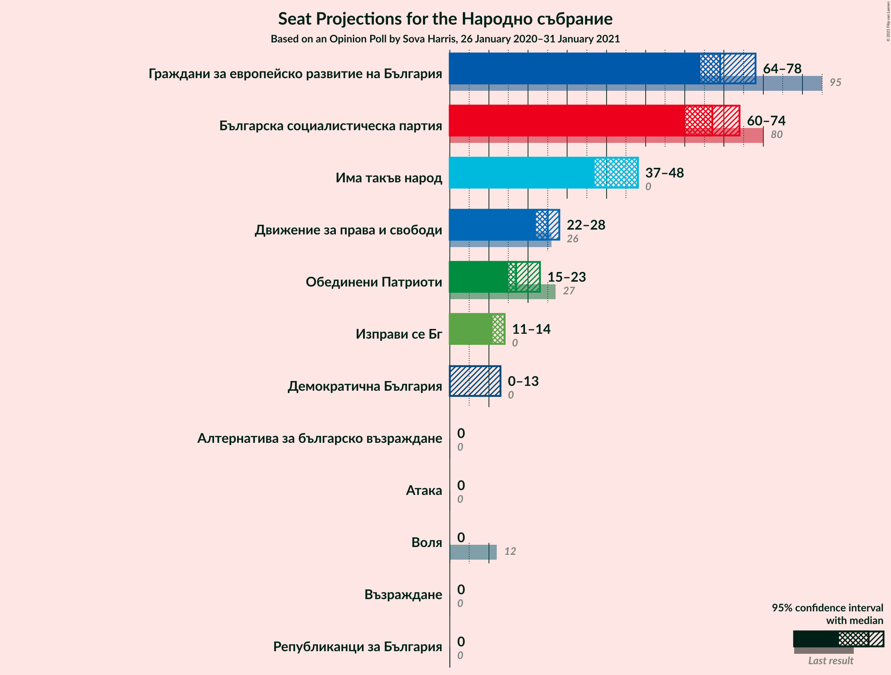

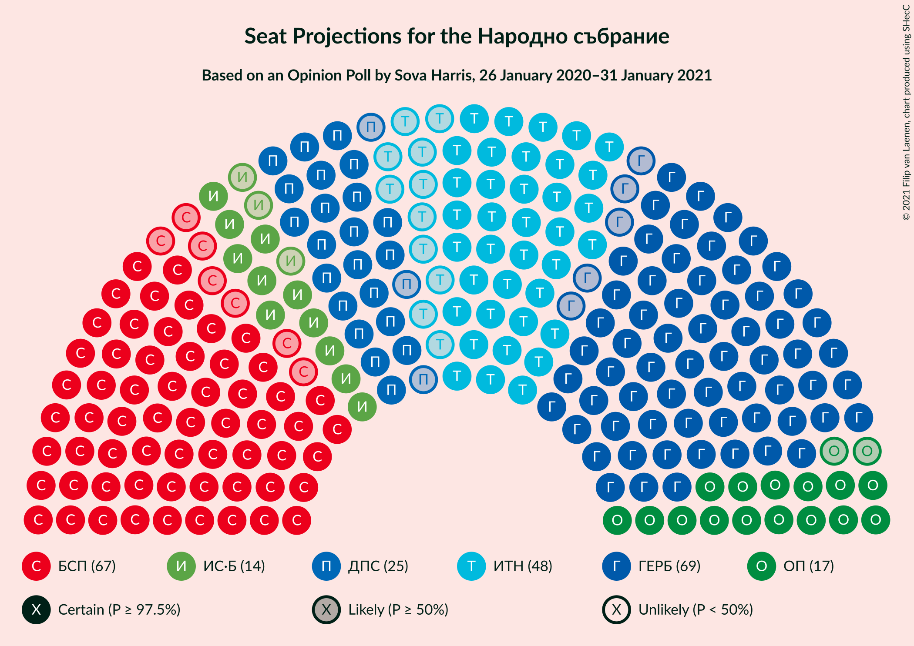

### Confidence Intervals

| Party | Last Result | Median | 80% Confidence Interval | 90% Confidence Interval | 95% Confidence Interval | 99% Confidence Interval |
|:-----:|:-----------:|:------:|:-----------------------:|:-----------------------:|:-----------------------:|:-----------------------:|
| <a href="#граждани-за-европейско-развитие-на-българия">Граждани за европейско развитие на България</a> | 95 | 69 | 69–75 |67–75 |64–78 |63–81 |
| <a href="#българска-социалистическа-партия">Българска социалистическа партия</a> | 80 | 67 | 64–68 |62–72 |60–74 |59–79 |
| <a href="#има-такъв-народ">Има такъв народ</a> | 0 | 48 | 39–48 |38–48 |37–48 |36–50 |
| <a href="#движение-за-права-и-свободи">Движение за права и свободи</a> | 26 | 25 | 22–25 |22–28 |22–28 |20–30 |
| <a href="#обединени-патриоти">Обединени Патриоти</a> | 27 | 17 | 17–20 |15–23 |15–23 |12–23 |
| <a href="#изправи-се-бг">Изправи се Бг</a> | 0 | 14 | 12–14 |11–14 |11–14 |0–16 |
| <a href="#демократична-българия">Демократична България</a> | 0 | 0 | 0–11 |0–12 |0–13 |0–15 |
| <a href="#воля">Воля</a> | 12 | 0 | 0 |0 |0 |0–11 |
| <a href="#алтернатива-за-българско-възраждане">Алтернатива за българско възраждане</a> | 0 | 0 | 0 |0 |0 |0 |
| <a href="#републиканци-за-българия">Републиканци за България</a> | 0 | 0 | 0 |0 |0 |0 |
| <a href="#атака">Атака</a> | 0 | 0 | 0 |0 |0 |0 |
| <a href="#възраждане">Възраждане</a> | 0 | 0 | 0 |0 |0 |0 |

### Граждани за европейско развитие на България

*For a full overview of the results for this party, see the [Граждани за европейско развитие на България](party-гражданизаевропейскоразвитиенабългария.html) page.*

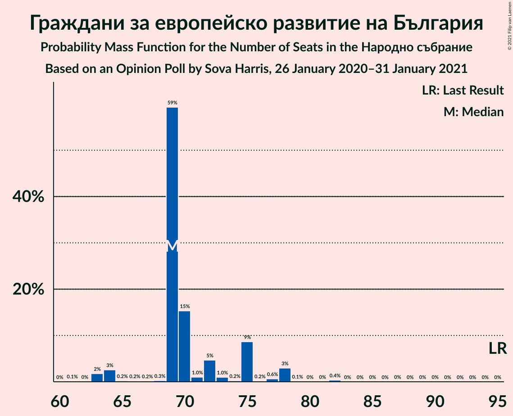

| Number of Seats | Probability | Accumulated | Special Marks |
|:---------------:|:-----------:|:-----------:|:-------------:|
| 61 | 0.1% | 100% |  |
| 62 | 0% | 99.8% |  |
| 63 | 2% | 99.8% |  |
| 64 | 3% | 98% |  |
| 65 | 0.2% | 95% |  |
| 66 | 0.2% | 95% |  |
| 67 | 0.2% | 95% |  |
| 68 | 0.3% | 95% |  |
| 69 | 59% | 95% | Median |
| 70 | 15% | 35% |  |
| 71 | 1.0% | 20% |  |
| 72 | 5% | 19% |  |
| 73 | 1.0% | 14% |  |
| 74 | 0.2% | 13% |  |
| 75 | 9% | 13% |  |
| 76 | 0.2% | 4% |  |
| 77 | 0.6% | 4% |  |
| 78 | 3% | 4% |  |
| 79 | 0.1% | 0.7% |  |
| 80 | 0% | 0.5% |  |
| 81 | 0% | 0.5% |  |
| 82 | 0.4% | 0.5% |  |
| 83 | 0% | 0.1% |  |
| 84 | 0% | 0.1% |  |
| 85 | 0% | 0.1% |  |
| 86 | 0% | 0.1% |  |
| 87 | 0% | 0.1% |  |
| 88 | 0% | 0.1% |  |
| 89 | 0% | 0% |  |
| 90 | 0% | 0% |  |
| 91 | 0% | 0% |  |
| 92 | 0% | 0% |  |
| 93 | 0% | 0% |  |
| 94 | 0% | 0% |  |
| 95 | 0% | 0% | Last Result |

### Българска социалистическа партия

*For a full overview of the results for this party, see the [Българска социалистическа партия](party-българскасоциалистическапартия.html) page.*

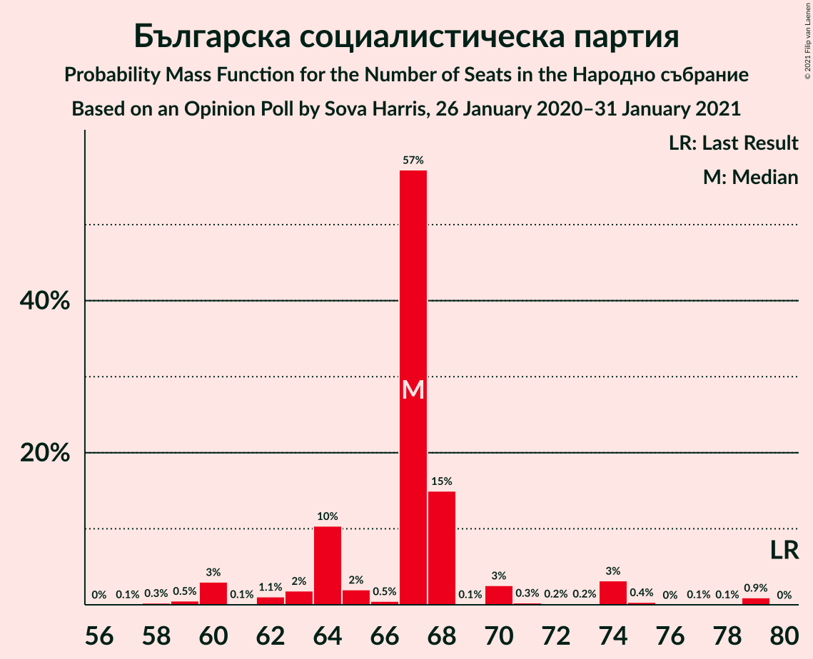

| Number of Seats | Probability | Accumulated | Special Marks |
|:---------------:|:-----------:|:-----------:|:-------------:|
| 56 | 0% | 100% |  |
| 57 | 0.1% | 99.9% |  |
| 58 | 0.3% | 99.8% |  |
| 59 | 0.5% | 99.6% |  |
| 60 | 3% | 99.1% |  |
| 61 | 0.1% | 96% |  |
| 62 | 1.1% | 96% |  |
| 63 | 2% | 95% |  |
| 64 | 10% | 93% |  |
| 65 | 2% | 83% |  |
| 66 | 0.5% | 81% |  |
| 67 | 57% | 80% | Median |
| 68 | 15% | 23% |  |
| 69 | 0.1% | 8% |  |
| 70 | 3% | 8% |  |
| 71 | 0.3% | 5% |  |
| 72 | 0.2% | 5% |  |
| 73 | 0.2% | 5% |  |
| 74 | 3% | 5% |  |
| 75 | 0.4% | 2% |  |
| 76 | 0% | 1.2% |  |
| 77 | 0.1% | 1.1% |  |
| 78 | 0.1% | 1.1% |  |
| 79 | 0.9% | 1.0% |  |
| 80 | 0% | 0% | Last Result |

### Има такъв народ

*For a full overview of the results for this party, see the [Има такъв народ](party-иматакъвнарод.html) page.*

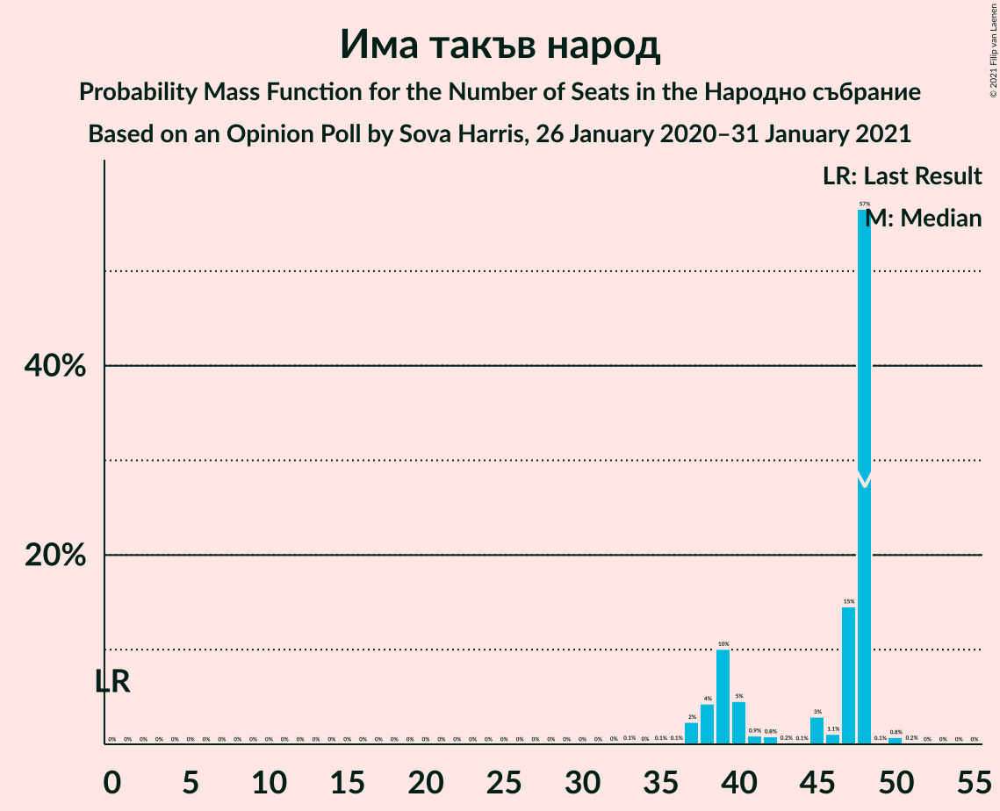

| Number of Seats | Probability | Accumulated | Special Marks |
|:---------------:|:-----------:|:-----------:|:-------------:|
| 0 | 0% | 100% | Last Result |
| 1 | 0% | 100% |  |
| 2 | 0% | 100% |  |
| 3 | 0% | 100% |  |
| 4 | 0% | 100% |  |
| 5 | 0% | 100% |  |
| 6 | 0% | 100% |  |
| 7 | 0% | 100% |  |
| 8 | 0% | 100% |  |
| 9 | 0% | 100% |  |
| 10 | 0% | 100% |  |
| 11 | 0% | 100% |  |
| 12 | 0% | 100% |  |
| 13 | 0% | 100% |  |
| 14 | 0% | 100% |  |
| 15 | 0% | 100% |  |
| 16 | 0% | 100% |  |
| 17 | 0% | 100% |  |
| 18 | 0% | 100% |  |
| 19 | 0% | 100% |  |
| 20 | 0% | 100% |  |
| 21 | 0% | 100% |  |
| 22 | 0% | 100% |  |
| 23 | 0% | 100% |  |
| 24 | 0% | 100% |  |
| 25 | 0% | 100% |  |
| 26 | 0% | 100% |  |
| 27 | 0% | 100% |  |
| 28 | 0% | 100% |  |
| 29 | 0% | 100% |  |
| 30 | 0% | 100% |  |
| 31 | 0% | 100% |  |
| 32 | 0% | 100% |  |
| 33 | 0.1% | 99.9% |  |
| 34 | 0% | 99.8% |  |
| 35 | 0.1% | 99.8% |  |
| 36 | 0.1% | 99.6% |  |
| 37 | 2% | 99.5% |  |
| 38 | 4% | 97% |  |
| 39 | 10% | 93% |  |
| 40 | 5% | 83% |  |
| 41 | 0.9% | 78% |  |
| 42 | 0.8% | 77% |  |
| 43 | 0.2% | 76% |  |
| 44 | 0.1% | 76% |  |
| 45 | 3% | 76% |  |
| 46 | 1.1% | 73% |  |
| 47 | 15% | 72% |  |
| 48 | 57% | 58% | Median |
| 49 | 0.1% | 1.1% |  |
| 50 | 0.8% | 0.9% |  |
| 51 | 0.2% | 0.2% |  |
| 52 | 0% | 0% |  |

### Движение за права и свободи

*For a full overview of the results for this party, see the [Движение за права и свободи](party-движениезаправаисвободи.html) page.*

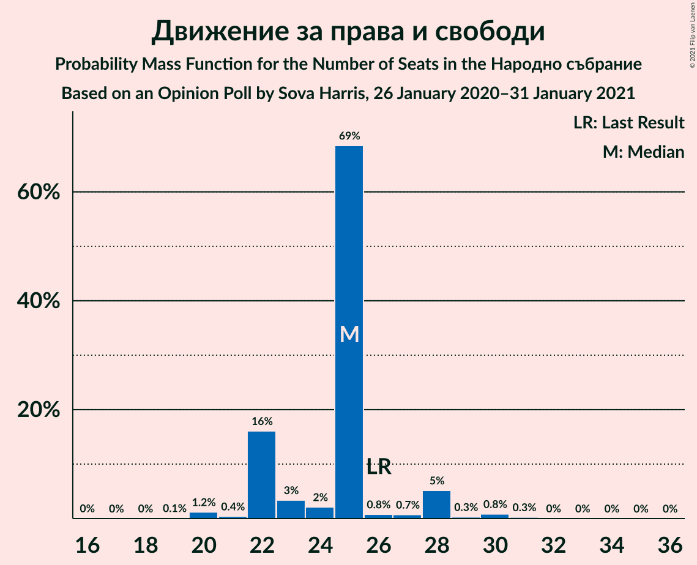

| Number of Seats | Probability | Accumulated | Special Marks |
|:---------------:|:-----------:|:-----------:|:-------------:|
| 17 | 0% | 100% |  |
| 18 | 0% | 99.9% |  |
| 19 | 0.1% | 99.9% |  |
| 20 | 1.2% | 99.8% |  |
| 21 | 0.4% | 98.6% |  |
| 22 | 16% | 98% |  |
| 23 | 3% | 82% |  |
| 24 | 2% | 79% |  |
| 25 | 69% | 77% | Median |
| 26 | 0.8% | 8% | Last Result |
| 27 | 0.7% | 7% |  |
| 28 | 5% | 7% |  |
| 29 | 0.3% | 1.5% |  |
| 30 | 0.8% | 1.2% |  |
| 31 | 0.3% | 0.4% |  |
| 32 | 0% | 0.1% |  |
| 33 | 0% | 0.1% |  |
| 34 | 0% | 0.1% |  |
| 35 | 0% | 0% |  |

### Обединени Патриоти

*For a full overview of the results for this party, see the [Обединени Патриоти](party-обединенипатриоти.html) page.*

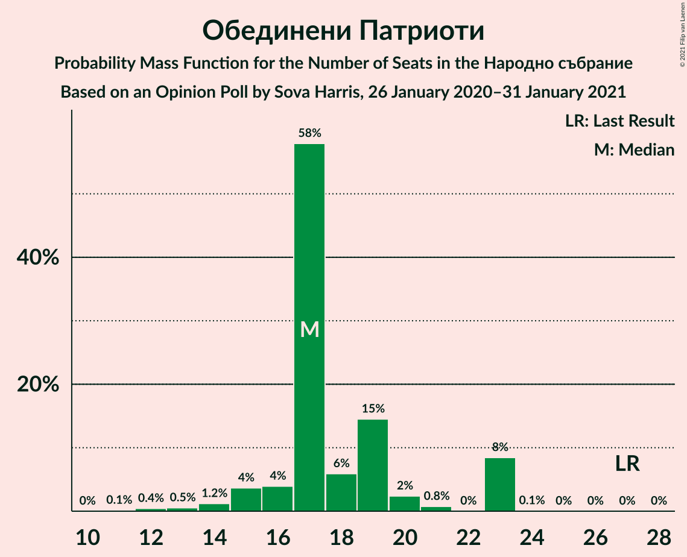

| Number of Seats | Probability | Accumulated | Special Marks |
|:---------------:|:-----------:|:-----------:|:-------------:|
| 11 | 0.1% | 100% |  |
| 12 | 0.4% | 99.8% |  |
| 13 | 0.5% | 99.4% |  |
| 14 | 1.2% | 98.8% |  |
| 15 | 4% | 98% |  |
| 16 | 4% | 94% |  |
| 17 | 58% | 90% | Median |
| 18 | 6% | 32% |  |
| 19 | 15% | 26% |  |
| 20 | 2% | 12% |  |
| 21 | 0.8% | 9% |  |
| 22 | 0% | 9% |  |
| 23 | 8% | 9% |  |
| 24 | 0.1% | 0.1% |  |
| 25 | 0% | 0% |  |
| 26 | 0% | 0% |  |
| 27 | 0% | 0% | Last Result |

### Изправи се Бг

*For a full overview of the results for this party, see the [Изправи се Бг](party-изправисебг.html) page.*

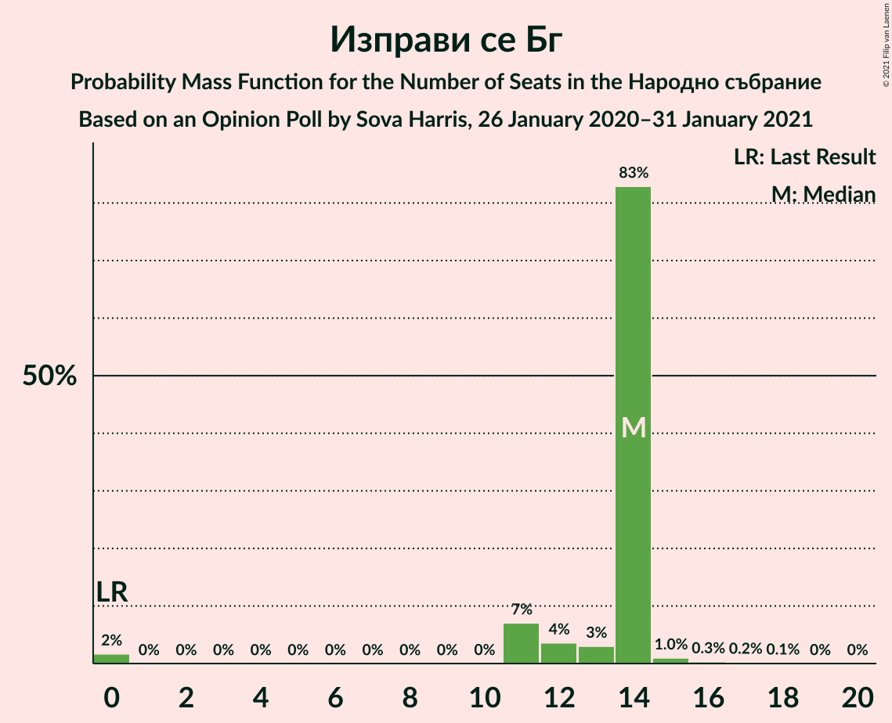

| Number of Seats | Probability | Accumulated | Special Marks |
|:---------------:|:-----------:|:-----------:|:-------------:|
| 0 | 2% | 100% | Last Result |
| 1 | 0% | 98% |  |
| 2 | 0% | 98% |  |
| 3 | 0% | 98% |  |
| 4 | 0% | 98% |  |
| 5 | 0% | 98% |  |
| 6 | 0% | 98% |  |
| 7 | 0% | 98% |  |
| 8 | 0% | 98% |  |
| 9 | 0% | 98% |  |
| 10 | 0% | 98% |  |
| 11 | 7% | 98% |  |
| 12 | 4% | 91% |  |
| 13 | 3% | 88% |  |
| 14 | 83% | 85% | Median |
| 15 | 1.0% | 2% |  |
| 16 | 0.3% | 0.7% |  |
| 17 | 0.2% | 0.4% |  |
| 18 | 0.1% | 0.1% |  |
| 19 | 0% | 0% |  |

### Демократична България

*For a full overview of the results for this party, see the [Демократична България](party-демократичнабългария.html) page.*

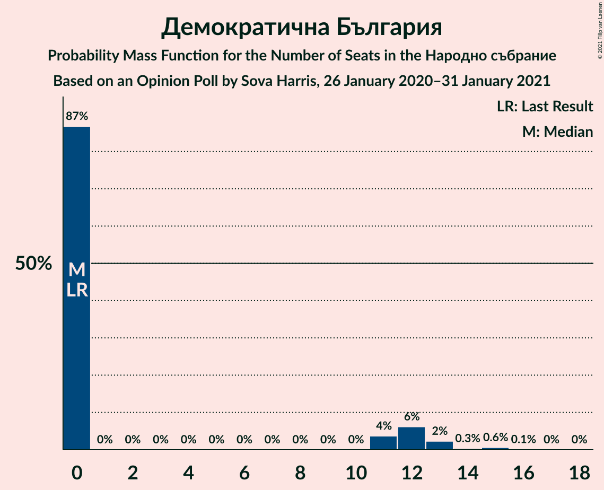

| Number of Seats | Probability | Accumulated | Special Marks |
|:---------------:|:-----------:|:-----------:|:-------------:|
| 0 | 87% | 100% | Last Result, Median |
| 1 | 0% | 13% |  |
| 2 | 0% | 13% |  |
| 3 | 0% | 13% |  |
| 4 | 0% | 13% |  |
| 5 | 0% | 13% |  |
| 6 | 0% | 13% |  |
| 7 | 0% | 13% |  |
| 8 | 0% | 13% |  |
| 9 | 0% | 13% |  |
| 10 | 0% | 13% |  |
| 11 | 4% | 13% |  |
| 12 | 6% | 10% |  |
| 13 | 2% | 3% |  |
| 14 | 0.3% | 1.0% |  |
| 15 | 0.6% | 0.7% |  |
| 16 | 0.1% | 0.1% |  |
| 17 | 0% | 0% |  |

### Воля

*For a full overview of the results for this party, see the [Воля](party-воля.html) page.*

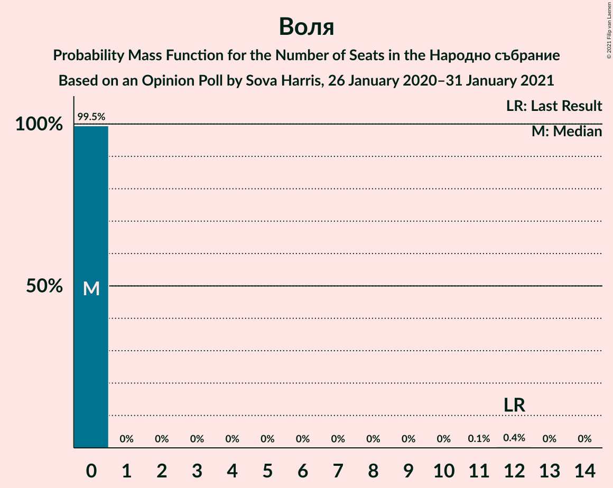

| Number of Seats | Probability | Accumulated | Special Marks |
|:---------------:|:-----------:|:-----------:|:-------------:|
| 0 | 99.5% | 100% | Median |
| 1 | 0% | 0.5% |  |
| 2 | 0% | 0.5% |  |
| 3 | 0% | 0.5% |  |
| 4 | 0% | 0.5% |  |
| 5 | 0% | 0.5% |  |
| 6 | 0% | 0.5% |  |
| 7 | 0% | 0.5% |  |
| 8 | 0% | 0.5% |  |
| 9 | 0% | 0.5% |  |
| 10 | 0% | 0.5% |  |
| 11 | 0.1% | 0.5% |  |
| 12 | 0.4% | 0.4% | Last Result |
| 13 | 0% | 0.1% |  |
| 14 | 0% | 0% |  |

### Алтернатива за българско възраждане

*For a full overview of the results for this party, see the [Алтернатива за българско възраждане](party-алтернативазабългарсковъзраждане.html) page.*

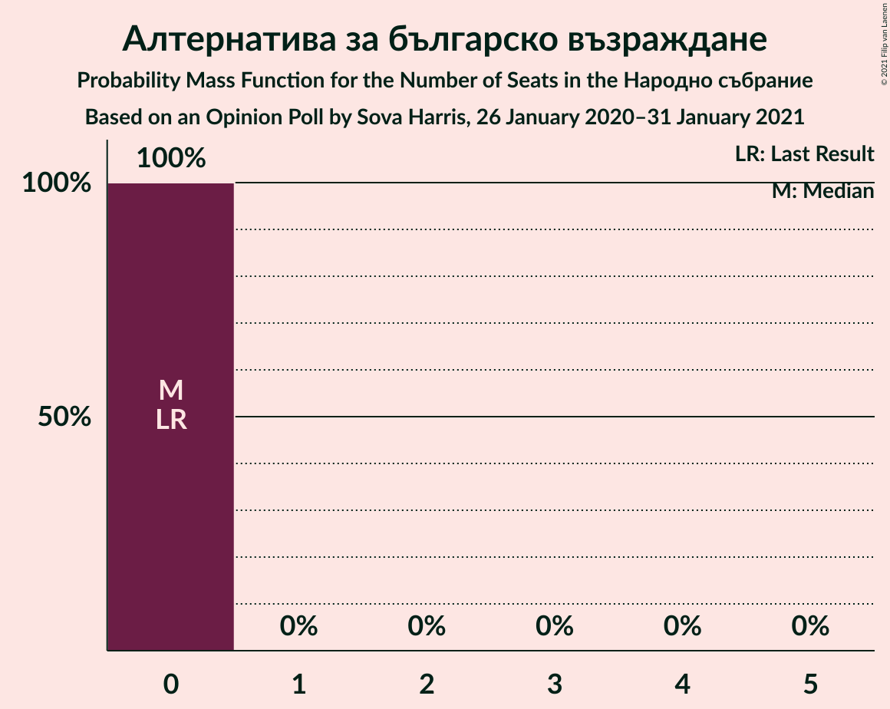

| Number of Seats | Probability | Accumulated | Special Marks |
|:---------------:|:-----------:|:-----------:|:-------------:|
| 0 | 100% | 100% | Last Result, Median |

### Републиканци за България

*For a full overview of the results for this party, see the [Републиканци за България](party-републиканцизабългария.html) page.*

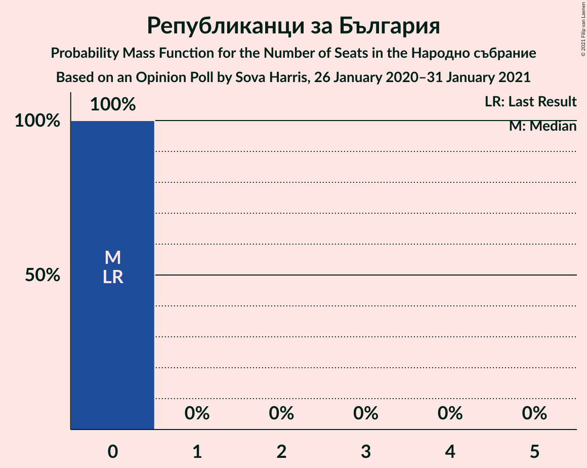

| Number of Seats | Probability | Accumulated | Special Marks |
|:---------------:|:-----------:|:-----------:|:-------------:|
| 0 | 100% | 100% | Last Result, Median |

### Атака

*For a full overview of the results for this party, see the [Атака](party-атака.html) page.*

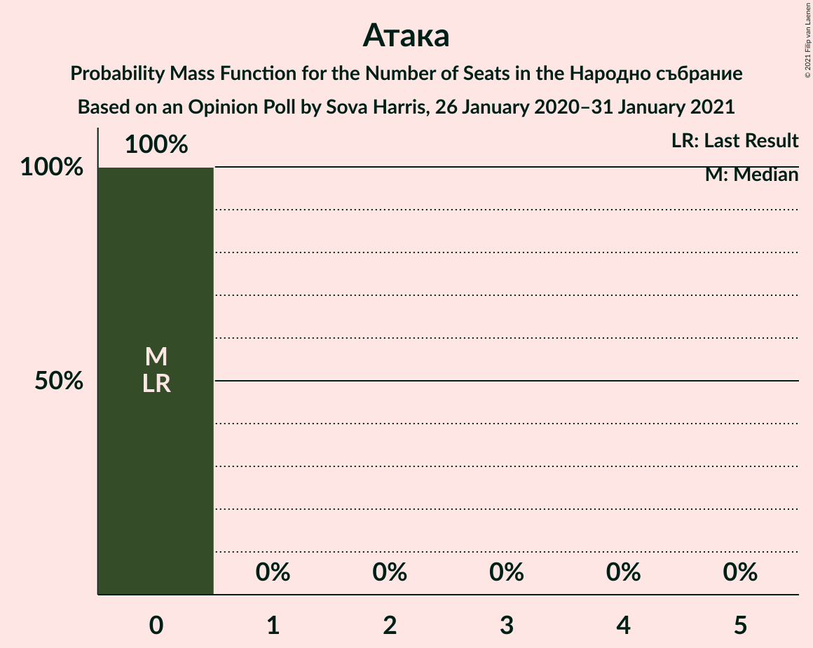

| Number of Seats | Probability | Accumulated | Special Marks |
|:---------------:|:-----------:|:-----------:|:-------------:|
| 0 | 100% | 100% | Last Result, Median |

### Възраждане

*For a full overview of the results for this party, see the [Възраждане](party-възраждане.html) page.*

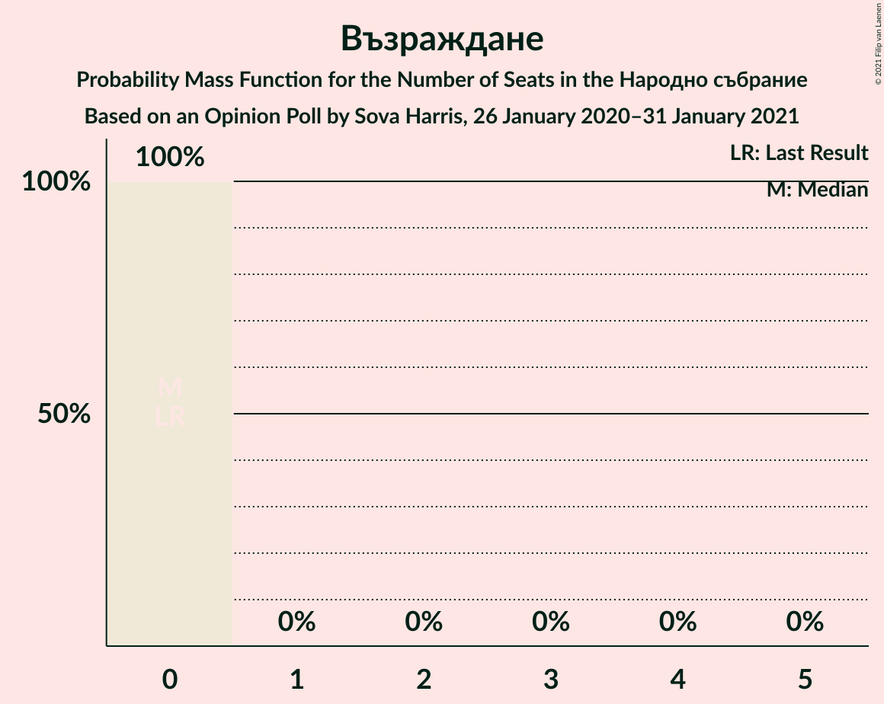

| Number of Seats | Probability | Accumulated | Special Marks |
|:---------------:|:-----------:|:-----------:|:-------------:|
| 0 | 100% | 100% | Last Result, Median |

## Coalitions

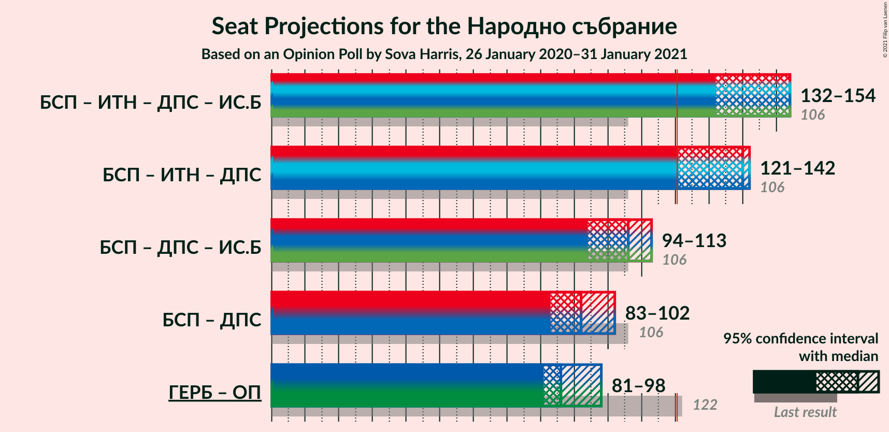

### Confidence Intervals

| Coalition | Last Result | Median | Majority? | 80% Confidence Interval | 90% Confidence Interval | 95% Confidence Interval | 99% Confidence Interval |
|:---------:|:-----------:|:------:|:---------:|:-----------------------:|:-----------------------:|:-----------------------:|:-----------------------:|
| Българска социалистическа партия – Има такъв народ – Движение за права и свободи – Изправи се Бг | 106 | 154 | 100% | 142–154 | 138–154 | 132–154 | 132–154 |
| Българска социалистическа партия – Има такъв народ – Движение за права и свободи | 106 | 140 | 99.9% | 128–140 | 126–142 | 121–142 | 121–147 |
| Българска социалистическа партия – Движение за права и свободи – Изправи се Бг | 106 | 106 | 0% | 103–106 | 97–110 | 94–113 | 94–116 |
| Българска социалистическа партия – Движение за права и свободи | 106 | 92 | 0% | 89–92 | 85–98 | 83–102 | 82–104 |
| Граждани за европейско развитие на България – Обединени Патриоти | 122 | 86 | 0% | 86–96 | 83–98 | 81–98 | 80–98 |

### Българска социалистическа партия – Има такъв народ – Движение за права и свободи – Изправи се Бг

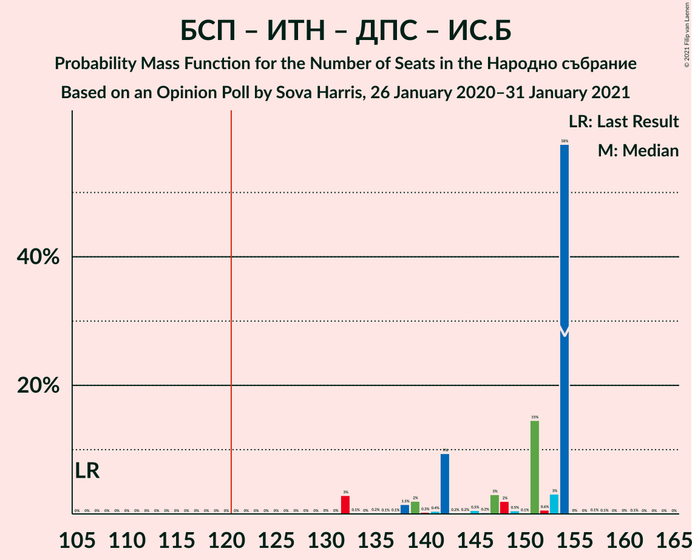

| Number of Seats | Probability | Accumulated | Special Marks |
|:---------------:|:-----------:|:-----------:|:-------------:|
| 106 | 0% | 100% | Last Result |
| 107 | 0% | 100% |  |
| 108 | 0% | 100% |  |
| 109 | 0% | 100% |  |
| 110 | 0% | 100% |  |
| 111 | 0% | 100% |  |
| 112 | 0% | 100% |  |
| 113 | 0% | 100% |  |
| 114 | 0% | 100% |  |
| 115 | 0% | 100% |  |
| 116 | 0% | 100% |  |
| 117 | 0% | 100% |  |
| 118 | 0% | 100% |  |
| 119 | 0% | 100% |  |
| 120 | 0% | 100% |  |
| 121 | 0% | 100% | Majority |
| 122 | 0% | 100% |  |
| 123 | 0% | 100% |  |
| 124 | 0% | 100% |  |
| 125 | 0% | 100% |  |
| 126 | 0% | 100% |  |
| 127 | 0% | 100% |  |
| 128 | 0% | 100% |  |
| 129 | 0% | 100% |  |
| 130 | 0% | 100% |  |
| 131 | 0% | 99.9% |  |
| 132 | 3% | 99.9% |  |
| 133 | 0.1% | 97% |  |
| 134 | 0% | 97% |  |
| 135 | 0.2% | 97% |  |
| 136 | 0.1% | 97% |  |
| 137 | 0.1% | 97% |  |
| 138 | 1.5% | 96% |  |
| 139 | 2% | 95% |  |
| 140 | 0.3% | 93% |  |
| 141 | 0.4% | 93% |  |
| 142 | 9% | 92% |  |
| 143 | 0.2% | 83% |  |
| 144 | 0.2% | 83% |  |
| 145 | 0.5% | 83% |  |
| 146 | 0.2% | 82% |  |
| 147 | 3% | 82% |  |
| 148 | 2% | 79% |  |
| 149 | 0.5% | 77% |  |
| 150 | 0.1% | 76% |  |
| 151 | 15% | 76% |  |
| 152 | 0.6% | 62% |  |
| 153 | 3% | 61% |  |
| 154 | 58% | 58% | Median |
| 155 | 0% | 0.4% |  |
| 156 | 0% | 0.3% |  |
| 157 | 0.1% | 0.3% |  |
| 158 | 0.1% | 0.2% |  |
| 159 | 0% | 0.1% |  |
| 160 | 0% | 0.1% |  |
| 161 | 0.1% | 0.1% |  |
| 162 | 0% | 0% |  |

### Българска социалистическа партия – Има такъв народ – Движение за права и свободи

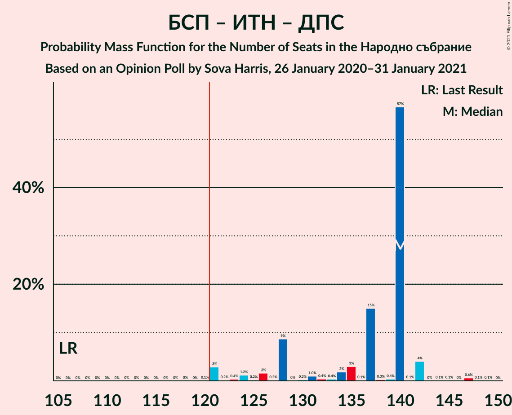

| Number of Seats | Probability | Accumulated | Special Marks |
|:---------------:|:-----------:|:-----------:|:-------------:|
| 106 | 0% | 100% | Last Result |
| 107 | 0% | 100% |  |
| 108 | 0% | 100% |  |
| 109 | 0% | 100% |  |
| 110 | 0% | 100% |  |
| 111 | 0% | 100% |  |
| 112 | 0% | 100% |  |
| 113 | 0% | 100% |  |
| 114 | 0% | 100% |  |
| 115 | 0% | 100% |  |
| 116 | 0% | 100% |  |
| 117 | 0% | 100% |  |
| 118 | 0% | 100% |  |
| 119 | 0% | 99.9% |  |
| 120 | 0.1% | 99.9% |  |
| 121 | 3% | 99.9% | Majority |
| 122 | 0.2% | 97% |  |
| 123 | 0.4% | 97% |  |
| 124 | 1.2% | 96% |  |
| 125 | 0.2% | 95% |  |
| 126 | 2% | 95% |  |
| 127 | 0.2% | 93% |  |
| 128 | 9% | 93% |  |
| 129 | 0% | 85% |  |
| 130 | 0.3% | 85% |  |
| 131 | 1.0% | 84% |  |
| 132 | 0.4% | 83% |  |
| 133 | 0.4% | 83% |  |
| 134 | 2% | 83% |  |
| 135 | 3% | 81% |  |
| 136 | 0.1% | 78% |  |
| 137 | 15% | 78% |  |
| 138 | 0.3% | 63% |  |
| 139 | 0.4% | 62% |  |
| 140 | 57% | 62% | Median |
| 141 | 0.1% | 5% |  |
| 142 | 4% | 5% |  |
| 143 | 0% | 1.0% |  |
| 144 | 0.1% | 1.0% |  |
| 145 | 0.1% | 0.9% |  |
| 146 | 0% | 0.8% |  |
| 147 | 0.6% | 0.8% |  |
| 148 | 0.1% | 0.2% |  |
| 149 | 0.1% | 0.1% |  |
| 150 | 0% | 0% |  |

### Българска социалистическа партия – Движение за права и свободи – Изправи се Бг

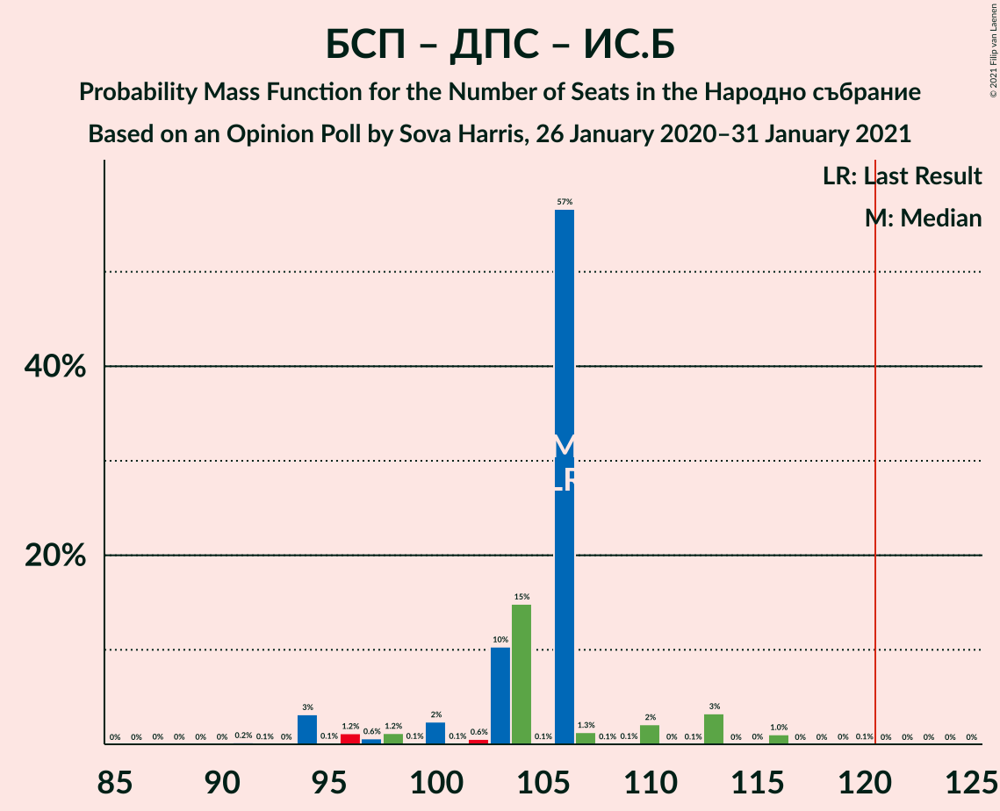

| Number of Seats | Probability | Accumulated | Special Marks |
|:---------------:|:-----------:|:-----------:|:-------------:|
| 87 | 0% | 100% |  |
| 88 | 0% | 99.9% |  |
| 89 | 0% | 99.9% |  |
| 90 | 0% | 99.9% |  |
| 91 | 0.2% | 99.8% |  |
| 92 | 0.1% | 99.6% |  |
| 93 | 0% | 99.6% |  |
| 94 | 3% | 99.5% |  |
| 95 | 0.1% | 96% |  |
| 96 | 1.2% | 96% |  |
| 97 | 0.6% | 95% |  |
| 98 | 1.2% | 94% |  |
| 99 | 0.1% | 93% |  |
| 100 | 2% | 93% |  |
| 101 | 0.1% | 91% |  |
| 102 | 0.6% | 91% |  |
| 103 | 10% | 90% |  |
| 104 | 15% | 80% |  |
| 105 | 0.1% | 65% |  |
| 106 | 57% | 65% | Last Result, Median |
| 107 | 1.3% | 8% |  |
| 108 | 0.1% | 7% |  |
| 109 | 0.1% | 7% |  |
| 110 | 2% | 7% |  |
| 111 | 0% | 5% |  |
| 112 | 0.1% | 5% |  |
| 113 | 3% | 4% |  |
| 114 | 0% | 1.2% |  |
| 115 | 0% | 1.2% |  |
| 116 | 1.0% | 1.2% |  |
| 117 | 0% | 0.1% |  |
| 118 | 0% | 0.1% |  |
| 119 | 0% | 0.1% |  |
| 120 | 0.1% | 0.1% |  |
| 121 | 0% | 0% | Majority |

### Българска социалистическа партия – Движение за права и свободи

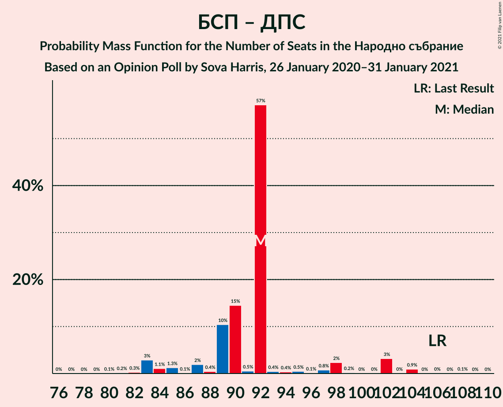

| Number of Seats | Probability | Accumulated | Special Marks |
|:---------------:|:-----------:|:-----------:|:-------------:|
| 77 | 0% | 100% |  |
| 78 | 0% | 99.9% |  |
| 79 | 0% | 99.9% |  |
| 80 | 0.1% | 99.9% |  |
| 81 | 0.2% | 99.9% |  |
| 82 | 0.3% | 99.7% |  |
| 83 | 3% | 99.4% |  |
| 84 | 1.1% | 97% |  |
| 85 | 1.3% | 95% |  |
| 86 | 0.1% | 94% |  |
| 87 | 2% | 94% |  |
| 88 | 0.4% | 92% |  |
| 89 | 10% | 92% |  |
| 90 | 15% | 81% |  |
| 91 | 0.5% | 67% |  |
| 92 | 57% | 66% | Median |
| 93 | 0.4% | 9% |  |
| 94 | 0.4% | 9% |  |
| 95 | 0.5% | 8% |  |
| 96 | 0.1% | 8% |  |
| 97 | 0.8% | 8% |  |
| 98 | 2% | 7% |  |
| 99 | 0.2% | 5% |  |
| 100 | 0% | 4% |  |
| 101 | 0% | 4% |  |
| 102 | 3% | 4% |  |
| 103 | 0% | 1.1% |  |
| 104 | 0.9% | 1.1% |  |
| 105 | 0% | 0.2% |  |
| 106 | 0% | 0.1% | Last Result |
| 107 | 0% | 0.1% |  |
| 108 | 0.1% | 0.1% |  |
| 109 | 0% | 0% |  |

### Граждани за европейско развитие на България – Обединени Патриоти

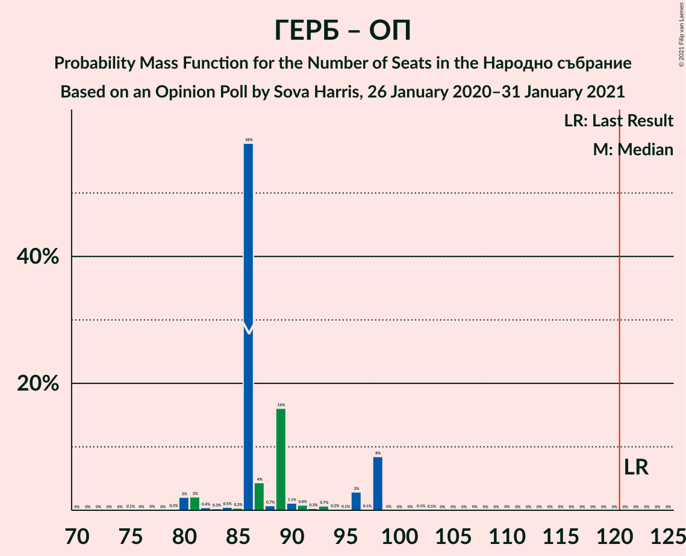

| Number of Seats | Probability | Accumulated | Special Marks |
|:---------------:|:-----------:|:-----------:|:-------------:|
| 75 | 0.1% | 100% |  |
| 76 | 0% | 99.9% |  |
| 77 | 0% | 99.9% |  |
| 78 | 0% | 99.8% |  |
| 79 | 0.2% | 99.8% |  |
| 80 | 2% | 99.6% |  |
| 81 | 2% | 98% |  |
| 82 | 0.4% | 95% |  |
| 83 | 0.3% | 95% |  |
| 84 | 0.5% | 95% |  |
| 85 | 0.3% | 94% |  |
| 86 | 58% | 94% | Median |
| 87 | 4% | 36% |  |
| 88 | 0.7% | 32% |  |
| 89 | 16% | 31% |  |
| 90 | 1.1% | 15% |  |
| 91 | 0.8% | 14% |  |
| 92 | 0.3% | 13% |  |
| 93 | 0.7% | 13% |  |
| 94 | 0.2% | 12% |  |
| 95 | 0.1% | 12% |  |
| 96 | 3% | 12% |  |
| 97 | 0.1% | 9% |  |
| 98 | 8% | 9% |  |
| 99 | 0% | 0.3% |  |
| 100 | 0% | 0.3% |  |
| 101 | 0% | 0.3% |  |
| 102 | 0.1% | 0.3% |  |
| 103 | 0.1% | 0.1% |  |
| 104 | 0% | 0% |  |
| 105 | 0% | 0% |  |
| 106 | 0% | 0% |  |
| 107 | 0% | 0% |  |
| 108 | 0% | 0% |  |
| 109 | 0% | 0% |  |
| 110 | 0% | 0% |  |
| 111 | 0% | 0% |  |
| 112 | 0% | 0% |  |
| 113 | 0% | 0% |  |
| 114 | 0% | 0% |  |
| 115 | 0% | 0% |  |
| 116 | 0% | 0% |  |
| 117 | 0% | 0% |  |
| 118 | 0% | 0% |  |
| 119 | 0% | 0% |  |
| 120 | 0% | 0% |  |
| 121 | 0% | 0% | Majority |
| 122 | 0% | 0% | Last Result |

## Technical Information

### Opinion Poll

+ **Polling firm:** Sova Harris
+ **Commissioner(s):** —
+ **Fieldwork period:** 26 January 2020–31 January 2021

### Calculations

+ **Sample size:** 1002
+ **Simulations done:** 1,048,576
+ **Error estimate:** 2.85%

