# Opinion Poll by Маркет ЛИНКС, 23–31 January 2021

<a href="#voting-intentions">Voting Intentions</a> | <a href="#seats">Seats</a> | <a href="#coalitions">Coalitions</a> | <a href="#technical-information">Technical Information</a>

## Voting Intentions

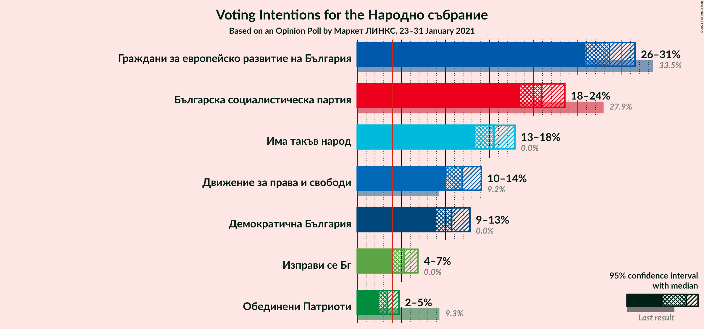

### Confidence Intervals

| Party | Last Result | Poll Result | 80% Confidence Interval | 90% Confidence Interval | 95% Confidence Interval | 99% Confidence Interval |
|:-----:|:-----------:|:-----------:|:-----------------------:|:-----------------------:|:-----------------------:|:-----------------------:|
| Граждани за европейско развитие на България | 33.5% | 28.6% | 26.8–30.5% |26.3–31.0% |25.9–31.5% |25.0–32.4% |
| Българска социалистическа партия | 27.9% | 20.9% | 19.3–22.6% |18.9–23.1% |18.5–23.5% |17.8–24.4% |
| Има такъв народ | 0.0% | 15.5% | 14.1–17.1% |13.7–17.5% |13.4–17.9% |12.7–18.7% |
| Движение за права и свободи | 9.2% | 11.9% | 10.7–13.3% |10.3–13.7% |10.0–14.1% |9.5–14.8% |
| Демократична България | 0.0% | 10.7% | 9.5–12.1% |9.2–12.4% |8.9–12.8% |8.4–13.5% |
| Изправи се Бг | 0.0% | 5.3% | 4.5–6.3% |4.3–6.6% |4.1–6.9% |3.7–7.4% |
| Обединени Патриоти | 9.3% | 3.4% | 2.8–4.3% |2.6–4.5% |2.4–4.7% |2.2–5.2% |

*Note:* The poll result column reflects the actual value used in the calculations. Published results may vary slightly, and in addition be rounded to fewer digits.

## Seats

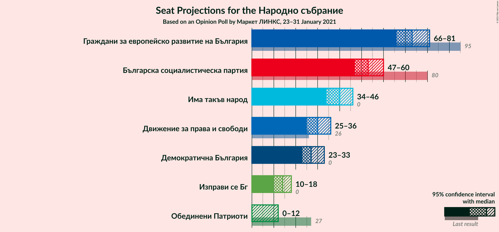

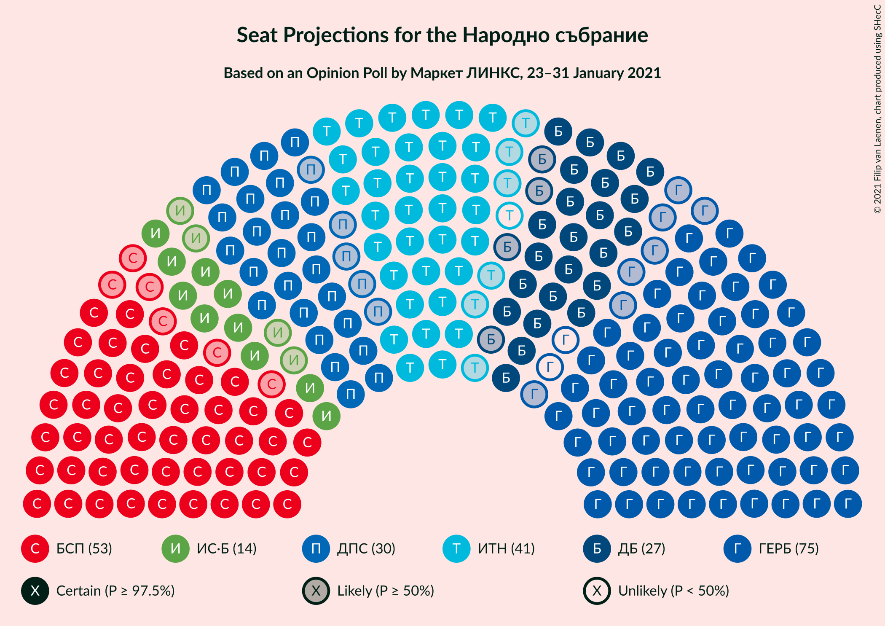

### Confidence Intervals

| Party | Last Result | Median | 80% Confidence Interval | 90% Confidence Interval | 95% Confidence Interval | 99% Confidence Interval |
|:-----:|:-----------:|:------:|:-----------------------:|:-----------------------:|:-----------------------:|:-----------------------:|
| <a href="#граждани-за-европейско-развитие-на-българия">Граждани за европейско развитие на България</a> | 95 | 73 | 68–78 |67–79 |66–81 |63–83 |
| <a href="#българска-социалистическа-партия">Българска социалистическа партия</a> | 80 | 53 | 49–58 |48–59 |47–60 |45–62 |
| <a href="#има-такъв-народ">Има такъв народ</a> | 0 | 40 | 36–44 |35–45 |34–46 |32–48 |
| <a href="#движение-за-права-и-свободи">Движение за права и свободи</a> | 26 | 30 | 27–34 |26–35 |25–36 |24–38 |
| <a href="#демократична-българия">Демократична България</a> | 0 | 27 | 24–31 |23–32 |23–33 |21–34 |
| <a href="#изправи-се-бг">Изправи се Бг</a> | 0 | 14 | 11–16 |11–17 |10–18 |0–19 |
| <a href="#обединени-патриоти">Обединени Патриоти</a> | 27 | 0 | 0–11 |0–11 |0–12 |0–13 |

### Граждани за европейско развитие на България

*For a full overview of the results for this party, see the [Граждани за европейско развитие на България](party-гражданизаевропейскоразвитиенабългария.html) page.*

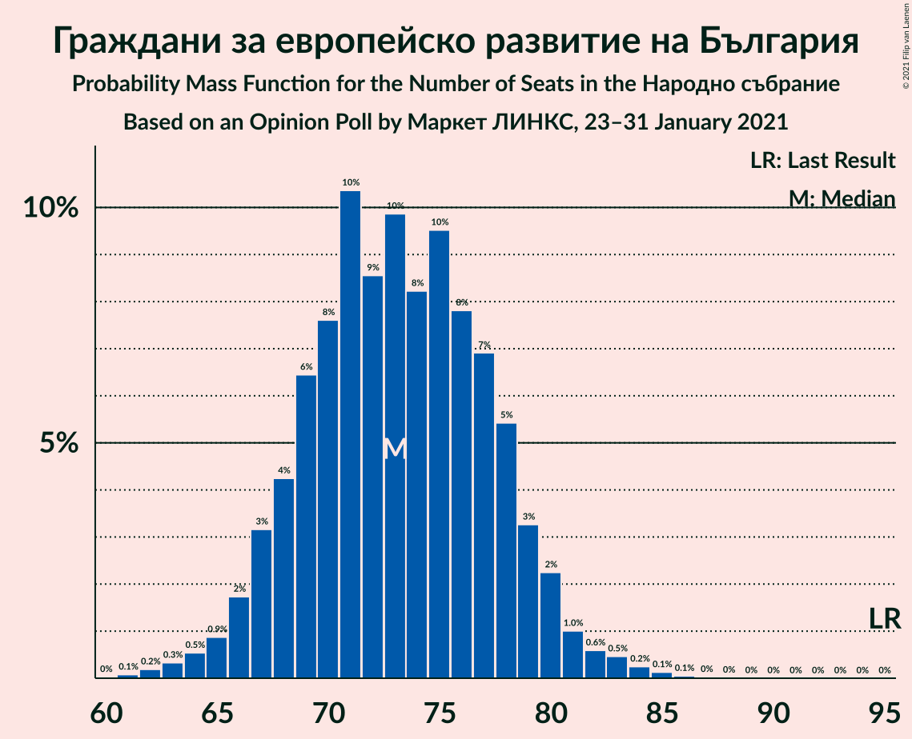

| Number of Seats | Probability | Accumulated | Special Marks |
|:---------------:|:-----------:|:-----------:|:-------------:|
| 61 | 0.1% | 100% |  |
| 62 | 0.2% | 99.9% |  |
| 63 | 0.3% | 99.7% |  |
| 64 | 0.5% | 99.4% |  |
| 65 | 0.9% | 98.8% |  |
| 66 | 2% | 98% |  |
| 67 | 3% | 96% |  |
| 68 | 4% | 93% |  |
| 69 | 6% | 89% |  |
| 70 | 8% | 82% |  |
| 71 | 10% | 75% |  |
| 72 | 9% | 64% |  |
| 73 | 10% | 56% | Median |
| 74 | 8% | 46% |  |
| 75 | 10% | 38% |  |
| 76 | 8% | 28% |  |
| 77 | 7% | 20% |  |
| 78 | 5% | 13% |  |
| 79 | 3% | 8% |  |
| 80 | 2% | 5% |  |
| 81 | 1.0% | 3% |  |
| 82 | 0.6% | 2% |  |
| 83 | 0.5% | 0.9% |  |
| 84 | 0.2% | 0.5% |  |
| 85 | 0.1% | 0.2% |  |
| 86 | 0.1% | 0.1% |  |
| 87 | 0% | 0% |  |
| 88 | 0% | 0% |  |
| 89 | 0% | 0% |  |
| 90 | 0% | 0% |  |
| 91 | 0% | 0% |  |
| 92 | 0% | 0% |  |
| 93 | 0% | 0% |  |
| 94 | 0% | 0% |  |
| 95 | 0% | 0% | Last Result |

### Българска социалистическа партия

*For a full overview of the results for this party, see the [Българска социалистическа партия](party-българскасоциалистическапартия.html) page.*

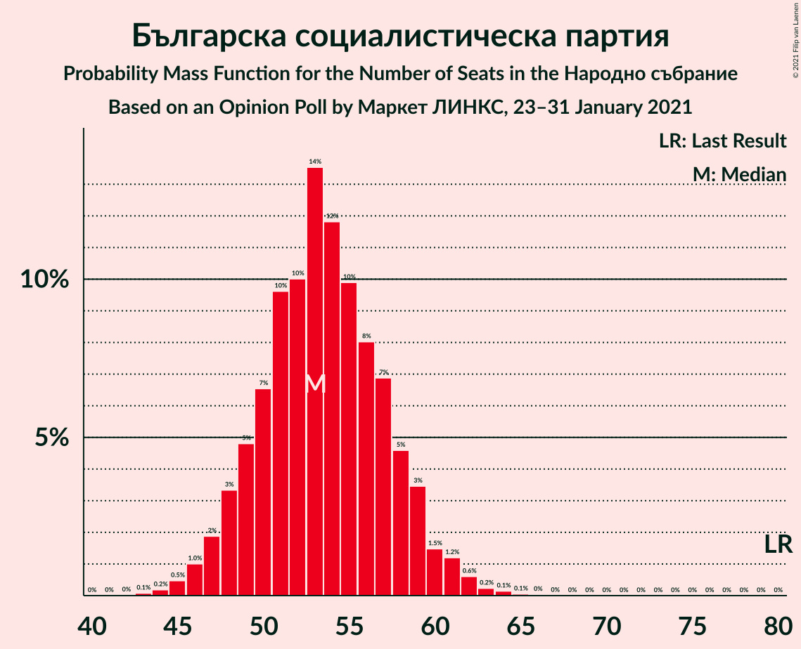

| Number of Seats | Probability | Accumulated | Special Marks |
|:---------------:|:-----------:|:-----------:|:-------------:|
| 43 | 0.1% | 100% |  |
| 44 | 0.2% | 99.9% |  |
| 45 | 0.5% | 99.7% |  |
| 46 | 1.0% | 99.2% |  |
| 47 | 2% | 98% |  |
| 48 | 3% | 96% |  |
| 49 | 5% | 93% |  |
| 50 | 7% | 88% |  |
| 51 | 10% | 82% |  |
| 52 | 10% | 72% |  |
| 53 | 14% | 62% | Median |
| 54 | 12% | 48% |  |
| 55 | 10% | 37% |  |
| 56 | 8% | 27% |  |
| 57 | 7% | 19% |  |
| 58 | 5% | 12% |  |
| 59 | 3% | 7% |  |
| 60 | 1.5% | 4% |  |
| 61 | 1.2% | 2% |  |
| 62 | 0.6% | 1.1% |  |
| 63 | 0.2% | 0.5% |  |
| 64 | 0.1% | 0.3% |  |
| 65 | 0.1% | 0.1% |  |
| 66 | 0% | 0.1% |  |
| 67 | 0% | 0% |  |
| 68 | 0% | 0% |  |
| 69 | 0% | 0% |  |
| 70 | 0% | 0% |  |
| 71 | 0% | 0% |  |
| 72 | 0% | 0% |  |
| 73 | 0% | 0% |  |
| 74 | 0% | 0% |  |
| 75 | 0% | 0% |  |
| 76 | 0% | 0% |  |
| 77 | 0% | 0% |  |
| 78 | 0% | 0% |  |
| 79 | 0% | 0% |  |
| 80 | 0% | 0% | Last Result |

### Има такъв народ

*For a full overview of the results for this party, see the [Има такъв народ](party-иматакъвнарод.html) page.*

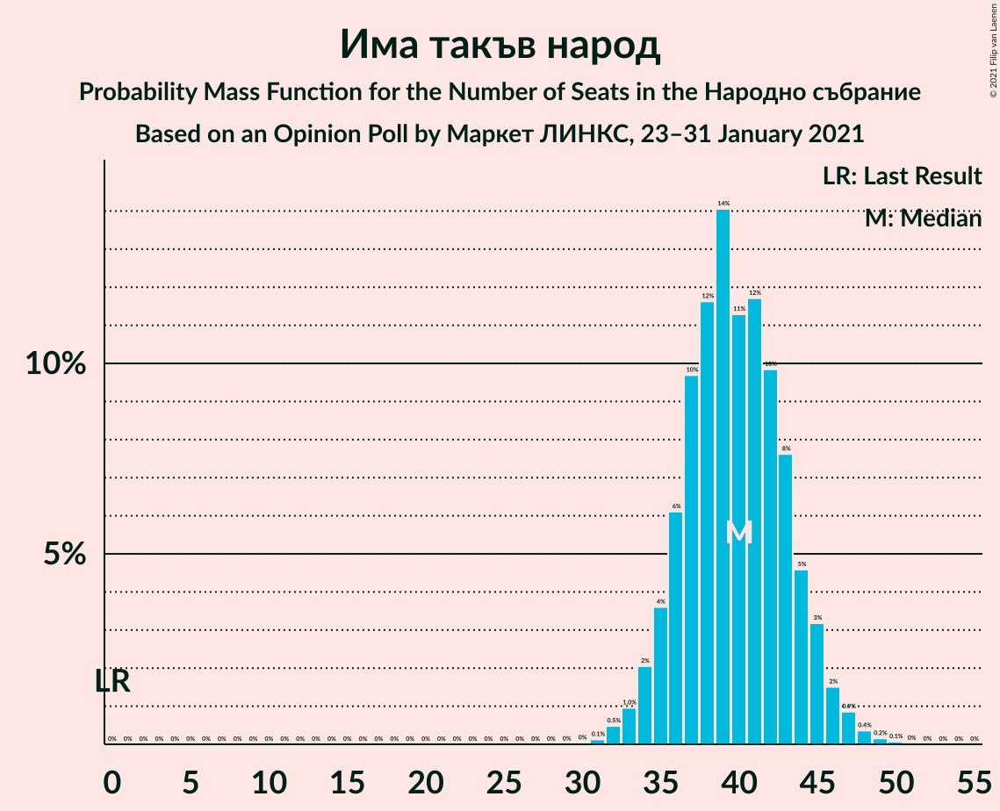

| Number of Seats | Probability | Accumulated | Special Marks |
|:---------------:|:-----------:|:-----------:|:-------------:|
| 0 | 0% | 100% | Last Result |
| 1 | 0% | 100% |  |
| 2 | 0% | 100% |  |
| 3 | 0% | 100% |  |
| 4 | 0% | 100% |  |
| 5 | 0% | 100% |  |
| 6 | 0% | 100% |  |
| 7 | 0% | 100% |  |
| 8 | 0% | 100% |  |
| 9 | 0% | 100% |  |
| 10 | 0% | 100% |  |
| 11 | 0% | 100% |  |
| 12 | 0% | 100% |  |
| 13 | 0% | 100% |  |
| 14 | 0% | 100% |  |
| 15 | 0% | 100% |  |
| 16 | 0% | 100% |  |
| 17 | 0% | 100% |  |
| 18 | 0% | 100% |  |
| 19 | 0% | 100% |  |
| 20 | 0% | 100% |  |
| 21 | 0% | 100% |  |
| 22 | 0% | 100% |  |
| 23 | 0% | 100% |  |
| 24 | 0% | 100% |  |
| 25 | 0% | 100% |  |
| 26 | 0% | 100% |  |
| 27 | 0% | 100% |  |
| 28 | 0% | 100% |  |
| 29 | 0% | 100% |  |
| 30 | 0% | 100% |  |
| 31 | 0.1% | 99.9% |  |
| 32 | 0.5% | 99.8% |  |
| 33 | 1.0% | 99.3% |  |
| 34 | 2% | 98% |  |
| 35 | 4% | 96% |  |
| 36 | 6% | 93% |  |
| 37 | 10% | 87% |  |
| 38 | 12% | 77% |  |
| 39 | 14% | 65% |  |
| 40 | 11% | 51% | Median |
| 41 | 12% | 40% |  |
| 42 | 10% | 28% |  |
| 43 | 8% | 18% |  |
| 44 | 5% | 11% |  |
| 45 | 3% | 6% |  |
| 46 | 2% | 3% |  |
| 47 | 0.9% | 1.5% |  |
| 48 | 0.4% | 0.6% |  |
| 49 | 0.2% | 0.3% |  |
| 50 | 0.1% | 0.1% |  |
| 51 | 0% | 0% |  |

### Движение за права и свободи

*For a full overview of the results for this party, see the [Движение за права и свободи](party-движениезаправаисвободи.html) page.*

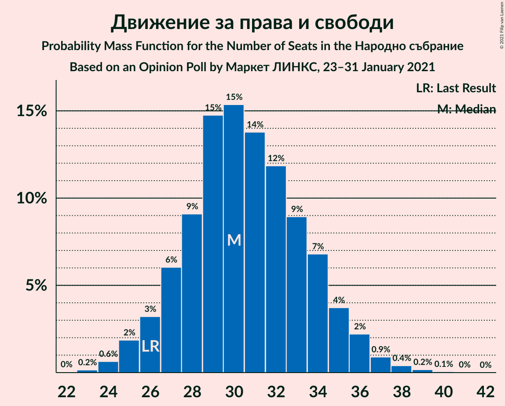

| Number of Seats | Probability | Accumulated | Special Marks |
|:---------------:|:-----------:|:-----------:|:-------------:|
| 23 | 0.2% | 100% |  |
| 24 | 0.6% | 99.8% |  |
| 25 | 2% | 99.2% |  |
| 26 | 3% | 97% | Last Result |
| 27 | 6% | 94% |  |
| 28 | 9% | 88% |  |
| 29 | 15% | 79% |  |
| 30 | 15% | 64% | Median |
| 31 | 14% | 49% |  |
| 32 | 12% | 35% |  |
| 33 | 9% | 23% |  |
| 34 | 7% | 14% |  |
| 35 | 4% | 7% |  |
| 36 | 2% | 4% |  |
| 37 | 0.9% | 2% |  |
| 38 | 0.4% | 0.7% |  |
| 39 | 0.2% | 0.3% |  |
| 40 | 0.1% | 0.1% |  |
| 41 | 0% | 0% |  |

### Демократична България

*For a full overview of the results for this party, see the [Демократична България](party-демократичнабългария.html) page.*

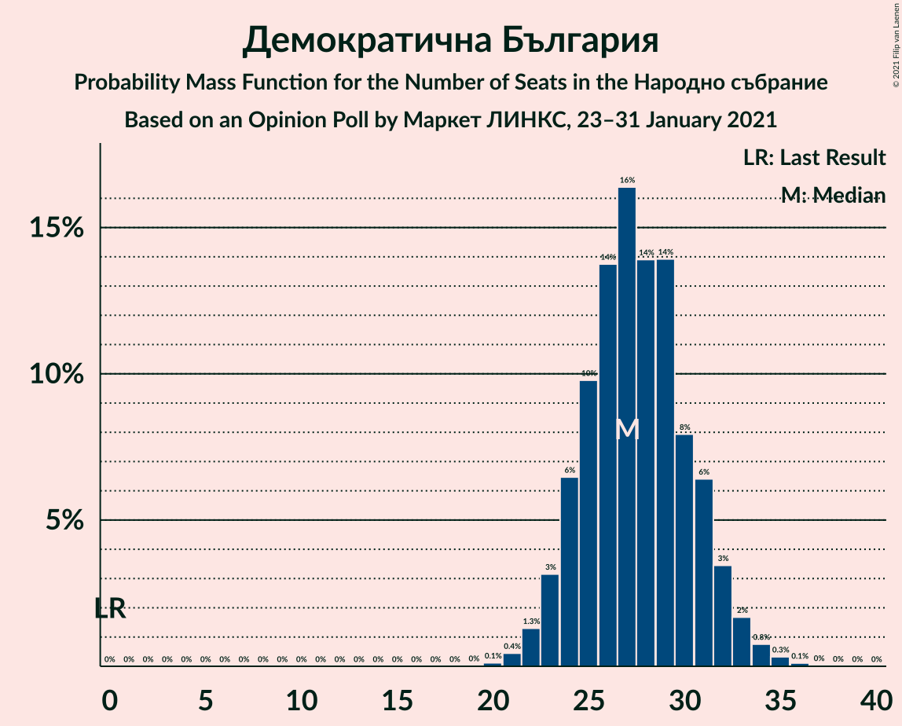

| Number of Seats | Probability | Accumulated | Special Marks |
|:---------------:|:-----------:|:-----------:|:-------------:|
| 0 | 0% | 100% | Last Result |
| 1 | 0% | 100% |  |
| 2 | 0% | 100% |  |
| 3 | 0% | 100% |  |
| 4 | 0% | 100% |  |
| 5 | 0% | 100% |  |
| 6 | 0% | 100% |  |
| 7 | 0% | 100% |  |
| 8 | 0% | 100% |  |
| 9 | 0% | 100% |  |
| 10 | 0% | 100% |  |
| 11 | 0% | 100% |  |
| 12 | 0% | 100% |  |
| 13 | 0% | 100% |  |
| 14 | 0% | 100% |  |
| 15 | 0% | 100% |  |
| 16 | 0% | 100% |  |
| 17 | 0% | 100% |  |
| 18 | 0% | 100% |  |
| 19 | 0% | 100% |  |
| 20 | 0.1% | 100% |  |
| 21 | 0.4% | 99.9% |  |
| 22 | 1.3% | 99.4% |  |
| 23 | 3% | 98% |  |
| 24 | 6% | 95% |  |
| 25 | 10% | 88% |  |
| 26 | 14% | 79% |  |
| 27 | 16% | 65% | Median |
| 28 | 14% | 49% |  |
| 29 | 14% | 35% |  |
| 30 | 8% | 21% |  |
| 31 | 6% | 13% |  |
| 32 | 3% | 6% |  |
| 33 | 2% | 3% |  |
| 34 | 0.8% | 1.2% |  |
| 35 | 0.3% | 0.5% |  |
| 36 | 0.1% | 0.2% |  |
| 37 | 0% | 0% |  |

### Изправи се Бг

*For a full overview of the results for this party, see the [Изправи се Бг](party-изправисебг.html) page.*

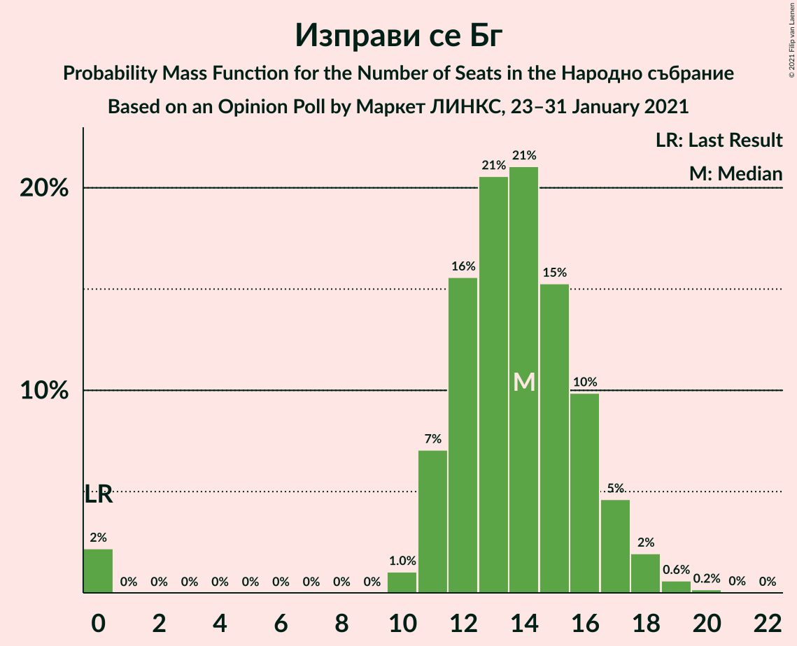

| Number of Seats | Probability | Accumulated | Special Marks |
|:---------------:|:-----------:|:-----------:|:-------------:|
| 0 | 2% | 100% | Last Result |
| 1 | 0% | 98% |  |
| 2 | 0% | 98% |  |
| 3 | 0% | 98% |  |
| 4 | 0% | 98% |  |
| 5 | 0% | 98% |  |
| 6 | 0% | 98% |  |
| 7 | 0% | 98% |  |
| 8 | 0% | 98% |  |
| 9 | 0% | 98% |  |
| 10 | 1.0% | 98% |  |
| 11 | 7% | 97% |  |
| 12 | 16% | 90% |  |
| 13 | 21% | 74% |  |
| 14 | 21% | 54% | Median |
| 15 | 15% | 33% |  |
| 16 | 10% | 17% |  |
| 17 | 5% | 7% |  |
| 18 | 2% | 3% |  |
| 19 | 0.6% | 0.8% |  |
| 20 | 0.2% | 0.2% |  |
| 21 | 0% | 0% |  |

### Обединени Патриоти

*For a full overview of the results for this party, see the [Обединени Патриоти](party-обединенипатриоти.html) page.*

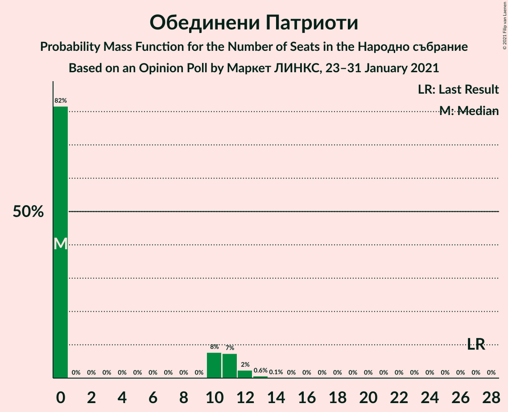

| Number of Seats | Probability | Accumulated | Special Marks |
|:---------------:|:-----------:|:-----------:|:-------------:|
| 0 | 82% | 100% | Median |
| 1 | 0% | 18% |  |
| 2 | 0% | 18% |  |
| 3 | 0% | 18% |  |
| 4 | 0% | 18% |  |
| 5 | 0% | 18% |  |
| 6 | 0% | 18% |  |
| 7 | 0% | 18% |  |
| 8 | 0% | 18% |  |
| 9 | 0% | 18% |  |
| 10 | 8% | 18% |  |
| 11 | 7% | 11% |  |
| 12 | 2% | 3% |  |
| 13 | 0.6% | 0.8% |  |
| 14 | 0.1% | 0.2% |  |
| 15 | 0% | 0% |  |
| 16 | 0% | 0% |  |
| 17 | 0% | 0% |  |
| 18 | 0% | 0% |  |
| 19 | 0% | 0% |  |
| 20 | 0% | 0% |  |
| 21 | 0% | 0% |  |
| 22 | 0% | 0% |  |
| 23 | 0% | 0% |  |
| 24 | 0% | 0% |  |
| 25 | 0% | 0% |  |
| 26 | 0% | 0% |  |
| 27 | 0% | 0% | Last Result |

## Coalitions

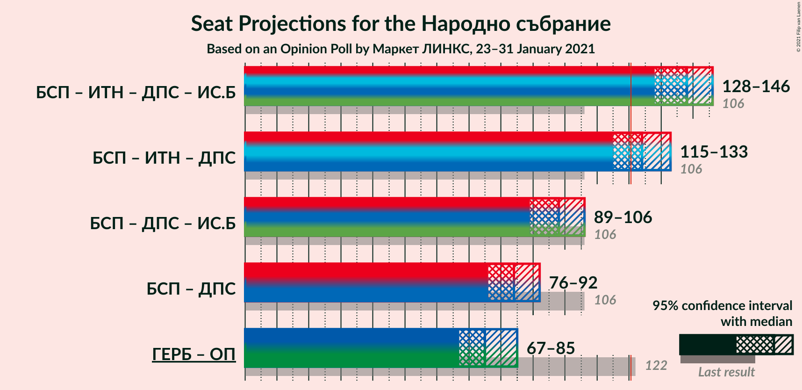

### Confidence Intervals

| Coalition | Last Result | Median | Majority? | 80% Confidence Interval | 90% Confidence Interval | 95% Confidence Interval | 99% Confidence Interval |
|:---------:|:-----------:|:------:|:---------:|:-----------------------:|:-----------------------:|:-----------------------:|:-----------------------:|
| Българска социалистическа партия – Има такъв народ – Движение за права и свободи – Изправи се Бг | 106 | 138 | 100% | 131–143 | 129–145 | 128–146 | 124–148 |
| Българска социалистическа партия – Има такъв народ – Движение за права и свободи | 106 | 124 | 77% | 118–129 | 116–131 | 115–133 | 112–136 |
| Българска социалистическа партия – Движение за права и свободи – Изправи се Бг | 106 | 98 | 0% | 92–103 | 90–105 | 89–106 | 85–108 |
| Българска социалистическа партия – Движение за права и свободи | 106 | 84 | 0% | 79–89 | 77–91 | 76–92 | 74–95 |
| Граждани за европейско развитие на България – Обединени Патриоти | 122 | 75 | 0% | 69–81 | 68–83 | 67–85 | 65–88 |

### Българска социалистическа партия – Има такъв народ – Движение за права и свободи – Изправи се Бг

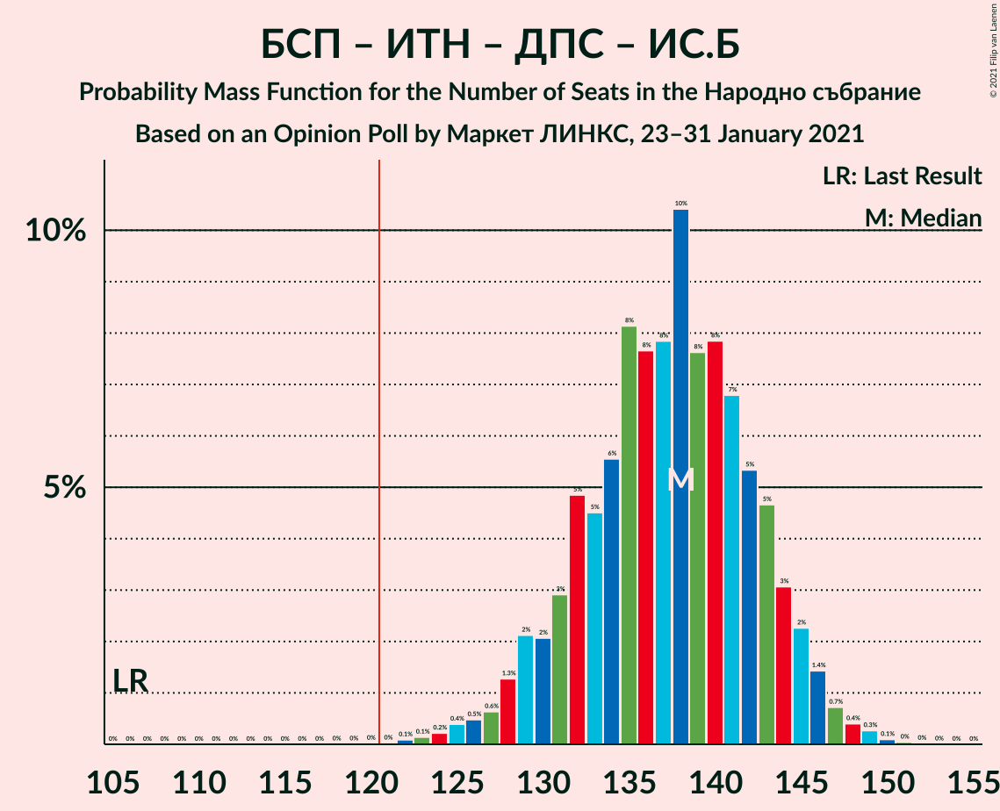

| Number of Seats | Probability | Accumulated | Special Marks |
|:---------------:|:-----------:|:-----------:|:-------------:|
| 106 | 0% | 100% | Last Result |
| 107 | 0% | 100% |  |
| 108 | 0% | 100% |  |
| 109 | 0% | 100% |  |
| 110 | 0% | 100% |  |
| 111 | 0% | 100% |  |
| 112 | 0% | 100% |  |
| 113 | 0% | 100% |  |
| 114 | 0% | 100% |  |
| 115 | 0% | 100% |  |
| 116 | 0% | 100% |  |
| 117 | 0% | 100% |  |
| 118 | 0% | 100% |  |
| 119 | 0% | 100% |  |
| 120 | 0% | 100% |  |
| 121 | 0% | 100% | Majority |
| 122 | 0.1% | 99.9% |  |
| 123 | 0.1% | 99.8% |  |
| 124 | 0.2% | 99.7% |  |
| 125 | 0.4% | 99.5% |  |
| 126 | 0.5% | 99.1% |  |
| 127 | 0.6% | 98.6% |  |
| 128 | 1.3% | 98% |  |
| 129 | 2% | 97% |  |
| 130 | 2% | 95% |  |
| 131 | 3% | 92% |  |
| 132 | 5% | 90% |  |
| 133 | 5% | 85% |  |
| 134 | 6% | 80% |  |
| 135 | 8% | 75% |  |
| 136 | 8% | 67% |  |
| 137 | 8% | 59% | Median |
| 138 | 10% | 51% |  |
| 139 | 8% | 41% |  |
| 140 | 8% | 33% |  |
| 141 | 7% | 25% |  |
| 142 | 5% | 18% |  |
| 143 | 5% | 13% |  |
| 144 | 3% | 8% |  |
| 145 | 2% | 5% |  |
| 146 | 1.4% | 3% |  |
| 147 | 0.7% | 2% |  |
| 148 | 0.4% | 0.8% |  |
| 149 | 0.3% | 0.4% |  |
| 150 | 0.1% | 0.2% |  |
| 151 | 0% | 0.1% |  |
| 152 | 0% | 0% |  |

### Българска социалистическа партия – Има такъв народ – Движение за права и свободи

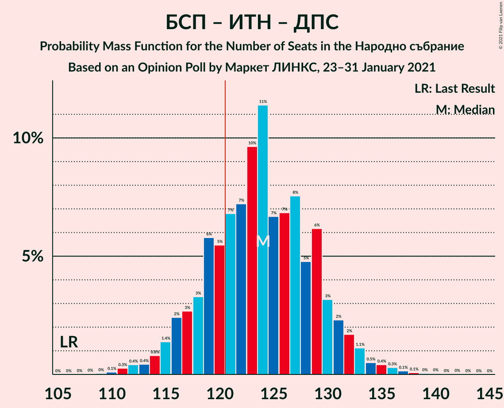

| Number of Seats | Probability | Accumulated | Special Marks |
|:---------------:|:-----------:|:-----------:|:-------------:|
| 106 | 0% | 100% | Last Result |
| 107 | 0% | 100% |  |
| 108 | 0% | 100% |  |
| 109 | 0% | 100% |  |
| 110 | 0.1% | 99.9% |  |
| 111 | 0.3% | 99.8% |  |
| 112 | 0.4% | 99.6% |  |
| 113 | 0.4% | 99.1% |  |
| 114 | 0.8% | 98.7% |  |
| 115 | 1.4% | 98% |  |
| 116 | 2% | 97% |  |
| 117 | 3% | 94% |  |
| 118 | 3% | 91% |  |
| 119 | 6% | 88% |  |
| 120 | 5% | 82% |  |
| 121 | 7% | 77% | Majority |
| 122 | 7% | 70% |  |
| 123 | 10% | 63% | Median |
| 124 | 11% | 53% |  |
| 125 | 7% | 42% |  |
| 126 | 7% | 35% |  |
| 127 | 8% | 28% |  |
| 128 | 5% | 21% |  |
| 129 | 6% | 16% |  |
| 130 | 3% | 10% |  |
| 131 | 2% | 7% |  |
| 132 | 2% | 4% |  |
| 133 | 1.1% | 3% |  |
| 134 | 0.5% | 2% |  |
| 135 | 0.4% | 1.1% |  |
| 136 | 0.3% | 0.6% |  |
| 137 | 0.1% | 0.3% |  |
| 138 | 0.1% | 0.2% |  |
| 139 | 0% | 0.1% |  |
| 140 | 0% | 0.1% |  |
| 141 | 0% | 0% |  |

### Българска социалистическа партия – Движение за права и свободи – Изправи се Бг

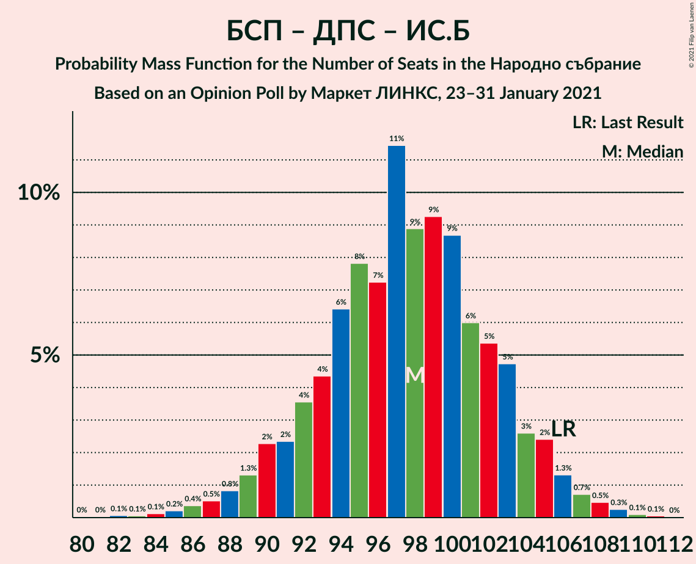

| Number of Seats | Probability | Accumulated | Special Marks |
|:---------------:|:-----------:|:-----------:|:-------------:|
| 80 | 0% | 100% |  |
| 81 | 0% | 99.9% |  |
| 82 | 0.1% | 99.9% |  |
| 83 | 0.1% | 99.8% |  |
| 84 | 0.1% | 99.8% |  |
| 85 | 0.2% | 99.7% |  |
| 86 | 0.4% | 99.4% |  |
| 87 | 0.5% | 99.1% |  |
| 88 | 0.8% | 98.6% |  |
| 89 | 1.3% | 98% |  |
| 90 | 2% | 96% |  |
| 91 | 2% | 94% |  |
| 92 | 4% | 92% |  |
| 93 | 4% | 88% |  |
| 94 | 6% | 84% |  |
| 95 | 8% | 77% |  |
| 96 | 7% | 70% |  |
| 97 | 11% | 62% | Median |
| 98 | 9% | 51% |  |
| 99 | 9% | 42% |  |
| 100 | 9% | 33% |  |
| 101 | 6% | 24% |  |
| 102 | 5% | 18% |  |
| 103 | 5% | 13% |  |
| 104 | 3% | 8% |  |
| 105 | 2% | 5% |  |
| 106 | 1.3% | 3% | Last Result |
| 107 | 0.7% | 2% |  |
| 108 | 0.5% | 0.9% |  |
| 109 | 0.3% | 0.4% |  |
| 110 | 0.1% | 0.2% |  |
| 111 | 0.1% | 0.1% |  |
| 112 | 0% | 0% |  |

### Българска социалистическа партия – Движение за права и свободи

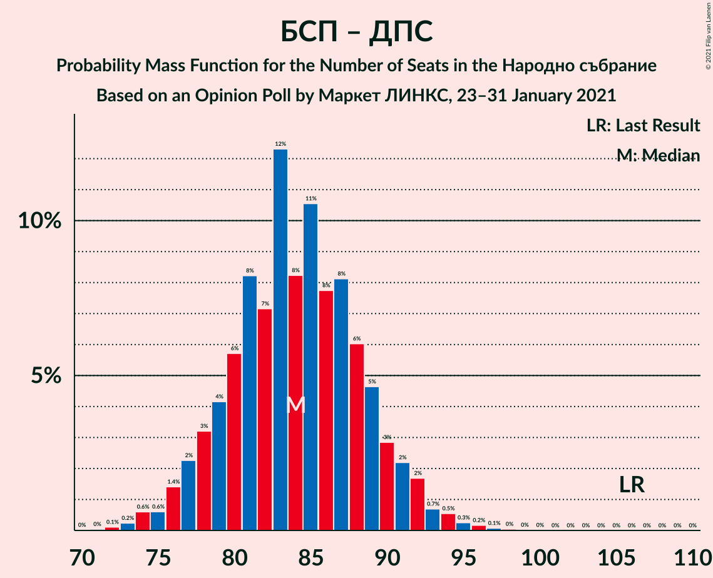

| Number of Seats | Probability | Accumulated | Special Marks |
|:---------------:|:-----------:|:-----------:|:-------------:|
| 71 | 0% | 100% |  |
| 72 | 0.1% | 99.9% |  |
| 73 | 0.2% | 99.8% |  |
| 74 | 0.6% | 99.6% |  |
| 75 | 0.6% | 99.0% |  |
| 76 | 1.4% | 98% |  |
| 77 | 2% | 97% |  |
| 78 | 3% | 95% |  |
| 79 | 4% | 91% |  |
| 80 | 6% | 87% |  |
| 81 | 8% | 82% |  |
| 82 | 7% | 73% |  |
| 83 | 12% | 66% | Median |
| 84 | 8% | 54% |  |
| 85 | 11% | 46% |  |
| 86 | 8% | 35% |  |
| 87 | 8% | 27% |  |
| 88 | 6% | 19% |  |
| 89 | 5% | 13% |  |
| 90 | 3% | 9% |  |
| 91 | 2% | 6% |  |
| 92 | 2% | 4% |  |
| 93 | 0.7% | 2% |  |
| 94 | 0.5% | 1.1% |  |
| 95 | 0.3% | 0.6% |  |
| 96 | 0.2% | 0.3% |  |
| 97 | 0.1% | 0.2% |  |
| 98 | 0% | 0.1% |  |
| 99 | 0% | 0% |  |
| 100 | 0% | 0% |  |
| 101 | 0% | 0% |  |
| 102 | 0% | 0% |  |
| 103 | 0% | 0% |  |
| 104 | 0% | 0% |  |
| 105 | 0% | 0% |  |
| 106 | 0% | 0% | Last Result |

### Граждани за европейско развитие на България – Обединени Патриоти

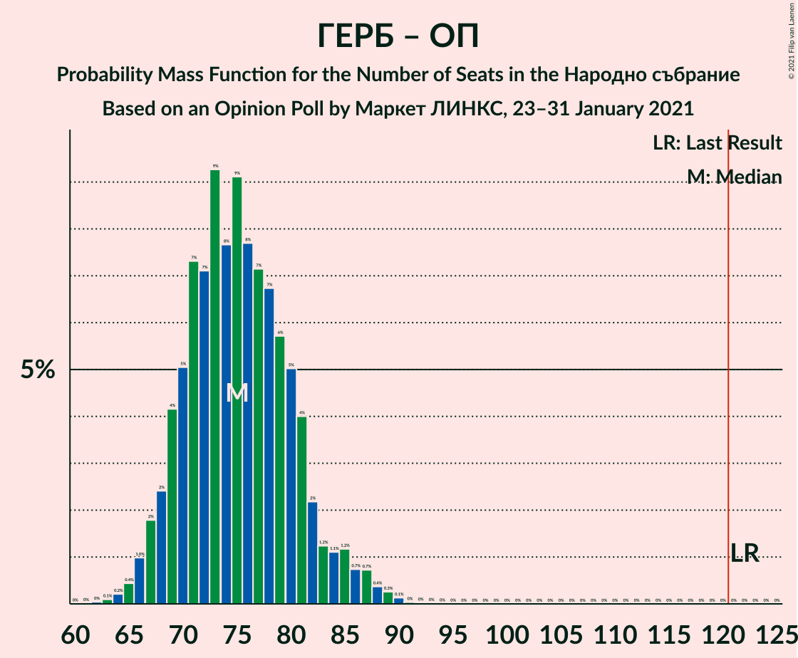

| Number of Seats | Probability | Accumulated | Special Marks |
|:---------------:|:-----------:|:-----------:|:-------------:|
| 62 | 0% | 100% |  |
| 63 | 0.1% | 99.9% |  |
| 64 | 0.2% | 99.8% |  |
| 65 | 0.4% | 99.6% |  |
| 66 | 1.0% | 99.2% |  |
| 67 | 2% | 98% |  |
| 68 | 2% | 96% |  |
| 69 | 4% | 94% |  |
| 70 | 5% | 90% |  |
| 71 | 7% | 85% |  |
| 72 | 7% | 77% |  |
| 73 | 9% | 70% | Median |
| 74 | 8% | 61% |  |
| 75 | 9% | 53% |  |
| 76 | 8% | 44% |  |
| 77 | 7% | 37% |  |
| 78 | 7% | 29% |  |
| 79 | 6% | 23% |  |
| 80 | 5% | 17% |  |
| 81 | 4% | 12% |  |
| 82 | 2% | 8% |  |
| 83 | 1.2% | 6% |  |
| 84 | 1.1% | 5% |  |
| 85 | 1.2% | 3% |  |
| 86 | 0.7% | 2% |  |
| 87 | 0.7% | 2% |  |
| 88 | 0.4% | 0.8% |  |
| 89 | 0.3% | 0.5% |  |
| 90 | 0.1% | 0.2% |  |
| 91 | 0% | 0.1% |  |
| 92 | 0% | 0.1% |  |
| 93 | 0% | 0% |  |
| 94 | 0% | 0% |  |
| 95 | 0% | 0% |  |
| 96 | 0% | 0% |  |
| 97 | 0% | 0% |  |
| 98 | 0% | 0% |  |
| 99 | 0% | 0% |  |
| 100 | 0% | 0% |  |
| 101 | 0% | 0% |  |
| 102 | 0% | 0% |  |
| 103 | 0% | 0% |  |
| 104 | 0% | 0% |  |
| 105 | 0% | 0% |  |
| 106 | 0% | 0% |  |
| 107 | 0% | 0% |  |
| 108 | 0% | 0% |  |
| 109 | 0% | 0% |  |
| 110 | 0% | 0% |  |
| 111 | 0% | 0% |  |
| 112 | 0% | 0% |  |
| 113 | 0% | 0% |  |
| 114 | 0% | 0% |  |
| 115 | 0% | 0% |  |
| 116 | 0% | 0% |  |
| 117 | 0% | 0% |  |
| 118 | 0% | 0% |  |
| 119 | 0% | 0% |  |
| 120 | 0% | 0% |  |
| 121 | 0% | 0% | Majority |
| 122 | 0% | 0% | Last Result |

## Technical Information

### Opinion Poll

+ **Polling firm:** Маркет ЛИНКС
+ **Commissioner(s):** —
+ **Fieldwork period:** 23–31 January 2021

### Calculations

+ **Sample size:** 1000
+ **Simulations done:** 1,048,576
+ **Error estimate:** 0.67%

