# Opinion Poll by Gallup for BNR/BNT, 22 February–1 March 2021

<a href="#voting-intentions">Voting Intentions</a> | <a href="#seats">Seats</a> | <a href="#coalitions">Coalitions</a> | <a href="#technical-information">Technical Information</a>

## Voting Intentions

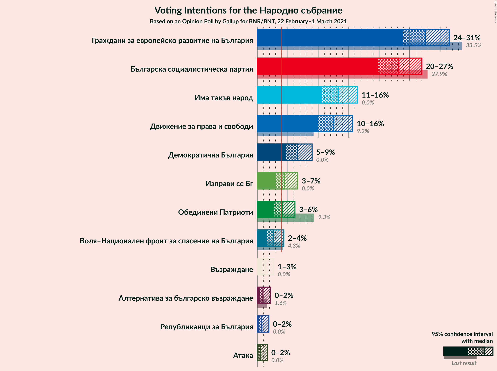

### Confidence Intervals

| Party | Last Result | Poll Result | 80% Confidence Interval | 90% Confidence Interval | 95% Confidence Interval | 99% Confidence Interval |
|:-----:|:-----------:|:-----------:|:-----------------------:|:-----------------------:|:-----------------------:|:-----------------------:|
| Граждани за европейско развитие на България | 33.5% | 27.5% | 25.1–30.1% |24.5–30.8% |23.9–31.5% |22.8–32.7% |
| Българска социалистическа партия | 27.9% | 23.2% | 21.0–25.7% |20.4–26.4% |19.8–27.0% |18.8–28.2% |
| Има такъв народ | 0.0% | 13.3% | 11.6–15.3% |11.1–15.9% |10.7–16.4% |9.9–17.5% |
| Движение за права и свободи | 9.2% | 12.5% | 10.9–14.6% |10.4–15.1% |10.0–15.6% |9.3–16.6% |
| Демократична България | 0.0% | 6.6% | 5.4–8.1% |5.0–8.6% |4.8–9.0% |4.2–9.8% |
| Изправи се Бг | 0.0% | 4.5% | 3.5–5.9% |3.3–6.3% |3.0–6.6% |2.6–7.3% |
| Обединени Патриоти | 9.3% | 4.1% | 3.2–5.5% |2.9–5.8% |2.7–6.2% |2.3–6.9% |
| Воля–Национален фронт за спасение на България | 4.3% | 2.6% | 1.9–3.7% |1.7–4.1% |1.6–4.4% |1.3–5.0% |
| Възраждане | 0.0% | 1.3% | 0.9–2.2% |0.7–2.5% |0.6–2.7% |0.5–3.2% |
| Алтернатива за българско възраждане | 1.6% | 0.9% | 0.6–1.7% |0.5–2.0% |0.4–2.2% |0.3–2.6% |
| Републиканци за България | 0.0% | 0.7% | 0.4–1.5% |0.4–1.7% |0.3–1.9% |0.2–2.3% |
| Атака | 0.0% | 0.6% | 0.3–1.2% |0.2–1.4% |0.2–1.6% |0.1–2.0% |

*Note:* The poll result column reflects the actual value used in the calculations. Published results may vary slightly, and in addition be rounded to fewer digits.

## Seats

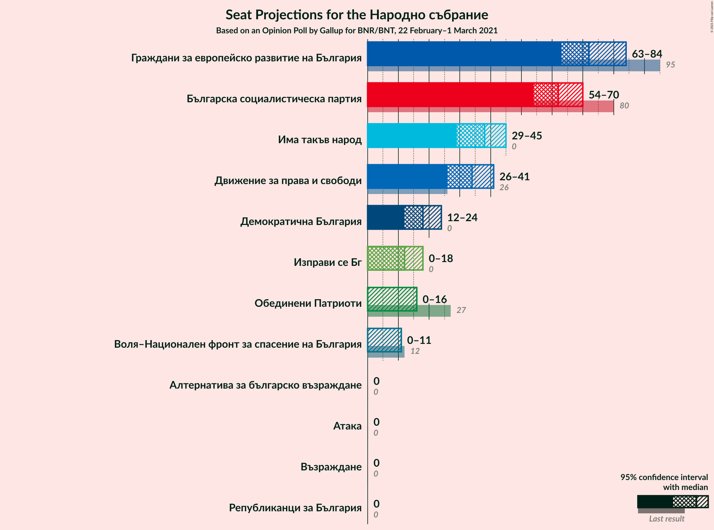

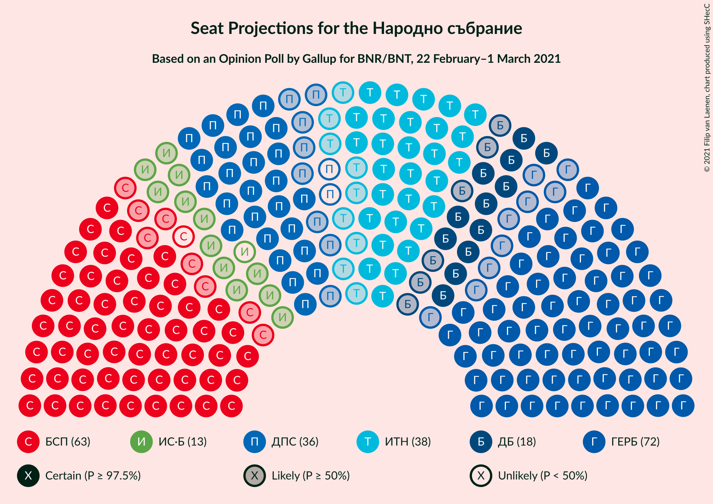

### Confidence Intervals

| Party | Last Result | Median | 80% Confidence Interval | 90% Confidence Interval | 95% Confidence Interval | 99% Confidence Interval |
|:-----:|:-----------:|:------:|:-----------------------:|:-----------------------:|:-----------------------:|:-----------------------:|
| <a href="#граждани-за-европейско-развитие-на-българия">Граждани за европейско развитие на България</a> | 95 | 72 | 66–81 |63–81 |63–84 |59–90 |
| <a href="#българска-социалистическа-партия">Българска социалистическа партия</a> | 80 | 62 | 58–67 |56–69 |54–70 |50–74 |
| <a href="#има-такъв-народ">Има такъв народ</a> | 0 | 38 | 31–44 |30–45 |29–45 |25–47 |
| <a href="#движение-за-права-и-свободи">Движение за права и свободи</a> | 26 | 34 | 29–40 |27–40 |26–41 |25–43 |
| <a href="#демократична-българия">Демократична България</a> | 0 | 18 | 15–22 |14–23 |12–24 |11–26 |
| <a href="#изправи-се-бг">Изправи се Бг</a> | 0 | 12 | 0–16 |0–16 |0–18 |0–19 |
| <a href="#обединени-патриоти">Обединени Патриоти</a> | 27 | 0 | 0–15 |0–16 |0–16 |0–17 |
| <a href="#воля–национален-фронт-за-спасение-на-българия">Воля–Национален фронт за спасение на България</a> | 12 | 0 | 0 |0 |0–11 |0–13 |
| <a href="#възраждане">Възраждане</a> | 0 | 0 | 0 |0 |0 |0 |
| <a href="#алтернатива-за-българско-възраждане">Алтернатива за българско възраждане</a> | 0 | 0 | 0 |0 |0 |0 |
| <a href="#републиканци-за-българия">Републиканци за България</a> | 0 | 0 | 0 |0 |0 |0 |
| <a href="#атака">Атака</a> | 0 | 0 | 0 |0 |0 |0 |

### Граждани за европейско развитие на България

*For a full overview of the results for this party, see the [Граждани за европейско развитие на България](party-гражданизаевропейскоразвитиенабългария.html) page.*

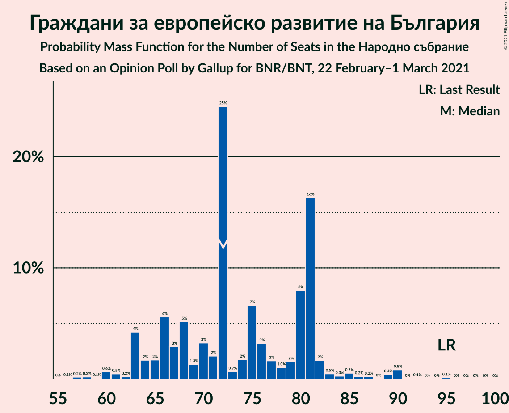

| Number of Seats | Probability | Accumulated | Special Marks |
|:---------------:|:-----------:|:-----------:|:-------------:|
| 56 | 0.1% | 100% |  |
| 57 | 0.2% | 99.9% |  |
| 58 | 0.2% | 99.7% |  |
| 59 | 0.1% | 99.5% |  |
| 60 | 0.6% | 99.4% |  |
| 61 | 0.5% | 98.8% |  |
| 62 | 0.2% | 98% |  |
| 63 | 4% | 98% |  |
| 64 | 2% | 94% |  |
| 65 | 2% | 92% |  |
| 66 | 6% | 90% |  |
| 67 | 3% | 85% |  |
| 68 | 5% | 82% |  |
| 69 | 1.3% | 77% |  |
| 70 | 3% | 76% |  |
| 71 | 2% | 72% |  |
| 72 | 25% | 70% | Median |
| 73 | 0.7% | 46% |  |
| 74 | 2% | 45% |  |
| 75 | 7% | 43% |  |
| 76 | 3% | 37% |  |
| 77 | 2% | 33% |  |
| 78 | 1.0% | 32% |  |
| 79 | 2% | 31% |  |
| 80 | 8% | 29% |  |
| 81 | 16% | 21% |  |
| 82 | 2% | 5% |  |
| 83 | 0.5% | 3% |  |
| 84 | 0.3% | 3% |  |
| 85 | 0.5% | 2% |  |
| 86 | 0.2% | 2% |  |
| 87 | 0.2% | 2% |  |
| 88 | 0% | 2% |  |
| 89 | 0.4% | 1.5% |  |
| 90 | 0.8% | 1.1% |  |
| 91 | 0% | 0.2% |  |
| 92 | 0.1% | 0.2% |  |
| 93 | 0% | 0.2% |  |
| 94 | 0% | 0.1% |  |
| 95 | 0.1% | 0.1% | Last Result |
| 96 | 0% | 0% |  |

### Българска социалистическа партия

*For a full overview of the results for this party, see the [Българска социалистическа партия](party-българскасоциалистическапартия.html) page.*

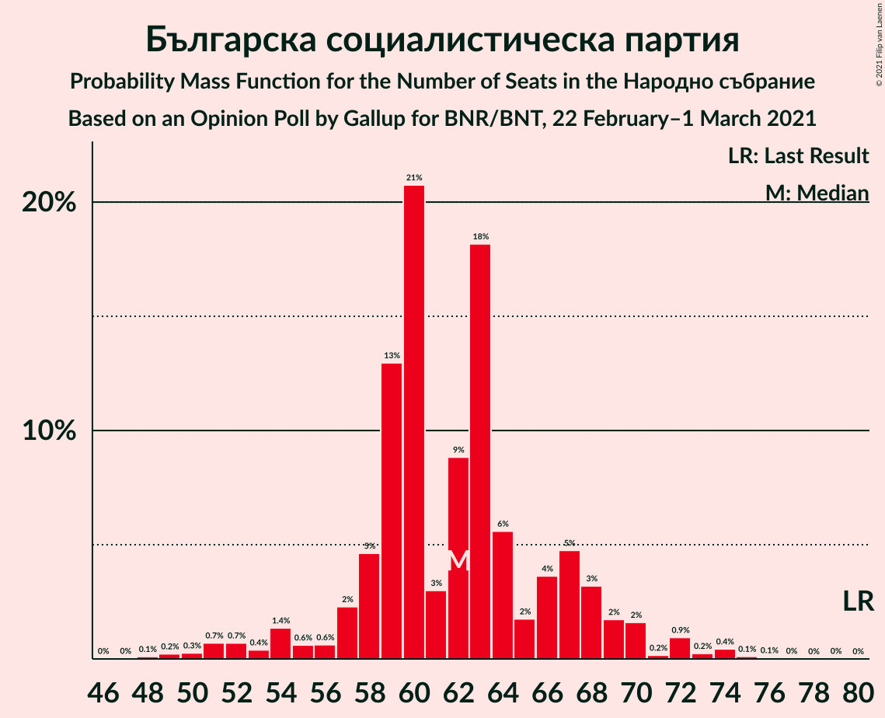

| Number of Seats | Probability | Accumulated | Special Marks |
|:---------------:|:-----------:|:-----------:|:-------------:|
| 47 | 0% | 100% |  |
| 48 | 0.1% | 99.9% |  |
| 49 | 0.2% | 99.8% |  |
| 50 | 0.3% | 99.6% |  |
| 51 | 0.7% | 99.3% |  |
| 52 | 0.7% | 98.6% |  |
| 53 | 0.4% | 98% |  |
| 54 | 1.4% | 98% |  |
| 55 | 0.6% | 96% |  |
| 56 | 0.6% | 96% |  |
| 57 | 2% | 95% |  |
| 58 | 5% | 93% |  |
| 59 | 13% | 88% |  |
| 60 | 21% | 75% |  |
| 61 | 3% | 54% |  |
| 62 | 9% | 51% | Median |
| 63 | 18% | 42% |  |
| 64 | 6% | 24% |  |
| 65 | 2% | 19% |  |
| 66 | 4% | 17% |  |
| 67 | 5% | 13% |  |
| 68 | 3% | 9% |  |
| 69 | 2% | 5% |  |
| 70 | 2% | 4% |  |
| 71 | 0.2% | 2% |  |
| 72 | 0.9% | 2% |  |
| 73 | 0.2% | 0.9% |  |
| 74 | 0.4% | 0.7% |  |
| 75 | 0.1% | 0.3% |  |
| 76 | 0.1% | 0.2% |  |
| 77 | 0% | 0.1% |  |
| 78 | 0% | 0.1% |  |
| 79 | 0% | 0.1% |  |
| 80 | 0% | 0% | Last Result |

### Има такъв народ

*For a full overview of the results for this party, see the [Има такъв народ](party-иматакъвнарод.html) page.*

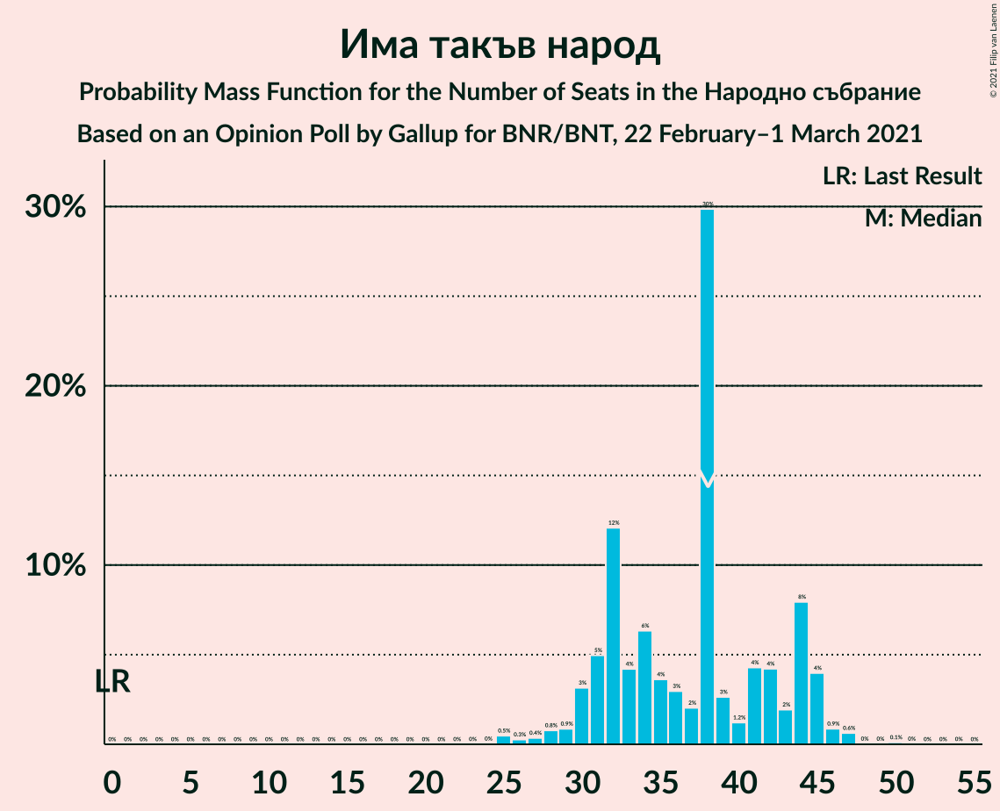

| Number of Seats | Probability | Accumulated | Special Marks |
|:---------------:|:-----------:|:-----------:|:-------------:|
| 0 | 0% | 100% | Last Result |
| 1 | 0% | 100% |  |
| 2 | 0% | 100% |  |
| 3 | 0% | 100% |  |
| 4 | 0% | 100% |  |
| 5 | 0% | 100% |  |
| 6 | 0% | 100% |  |
| 7 | 0% | 100% |  |
| 8 | 0% | 100% |  |
| 9 | 0% | 100% |  |
| 10 | 0% | 100% |  |
| 11 | 0% | 100% |  |
| 12 | 0% | 100% |  |
| 13 | 0% | 100% |  |
| 14 | 0% | 100% |  |
| 15 | 0% | 100% |  |
| 16 | 0% | 100% |  |
| 17 | 0% | 100% |  |
| 18 | 0% | 100% |  |
| 19 | 0% | 100% |  |
| 20 | 0% | 100% |  |
| 21 | 0% | 100% |  |
| 22 | 0% | 100% |  |
| 23 | 0% | 100% |  |
| 24 | 0% | 100% |  |
| 25 | 0.5% | 99.9% |  |
| 26 | 0.3% | 99.5% |  |
| 27 | 0.4% | 99.2% |  |
| 28 | 0.8% | 98.8% |  |
| 29 | 0.9% | 98% |  |
| 30 | 3% | 97% |  |
| 31 | 5% | 94% |  |
| 32 | 12% | 89% |  |
| 33 | 4% | 77% |  |
| 34 | 6% | 73% |  |
| 35 | 4% | 66% |  |
| 36 | 3% | 63% |  |
| 37 | 2% | 60% |  |
| 38 | 30% | 58% | Median |
| 39 | 3% | 28% |  |
| 40 | 1.2% | 25% |  |
| 41 | 4% | 24% |  |
| 42 | 4% | 20% |  |
| 43 | 2% | 16% |  |
| 44 | 8% | 14% |  |
| 45 | 4% | 6% |  |
| 46 | 0.9% | 2% |  |
| 47 | 0.6% | 0.8% |  |
| 48 | 0% | 0.2% |  |
| 49 | 0% | 0.2% |  |
| 50 | 0.1% | 0.2% |  |
| 51 | 0% | 0.1% |  |
| 52 | 0% | 0% |  |

### Движение за права и свободи

*For a full overview of the results for this party, see the [Движение за права и свободи](party-движениезаправаисвободи.html) page.*

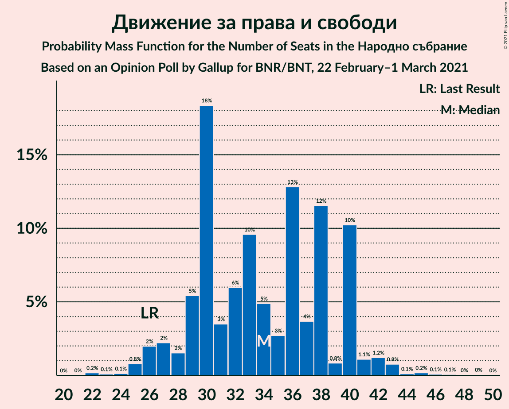

| Number of Seats | Probability | Accumulated | Special Marks |
|:---------------:|:-----------:|:-----------:|:-------------:|
| 22 | 0.2% | 100% |  |
| 23 | 0.1% | 99.8% |  |
| 24 | 0.1% | 99.7% |  |
| 25 | 0.8% | 99.6% |  |
| 26 | 2% | 98.8% | Last Result |
| 27 | 2% | 97% |  |
| 28 | 2% | 95% |  |
| 29 | 5% | 93% |  |
| 30 | 18% | 88% |  |
| 31 | 3% | 69% |  |
| 32 | 6% | 66% |  |
| 33 | 10% | 60% |  |
| 34 | 5% | 50% | Median |
| 35 | 3% | 45% |  |
| 36 | 13% | 43% |  |
| 37 | 4% | 30% |  |
| 38 | 12% | 26% |  |
| 39 | 0.8% | 15% |  |
| 40 | 10% | 14% |  |
| 41 | 1.1% | 4% |  |
| 42 | 1.2% | 2% |  |
| 43 | 0.8% | 1.3% |  |
| 44 | 0.1% | 0.5% |  |
| 45 | 0.2% | 0.4% |  |
| 46 | 0.1% | 0.2% |  |
| 47 | 0.1% | 0.1% |  |
| 48 | 0% | 0.1% |  |
| 49 | 0% | 0.1% |  |
| 50 | 0% | 0% |  |

### Демократична България

*For a full overview of the results for this party, see the [Демократична България](party-демократичнабългария.html) page.*

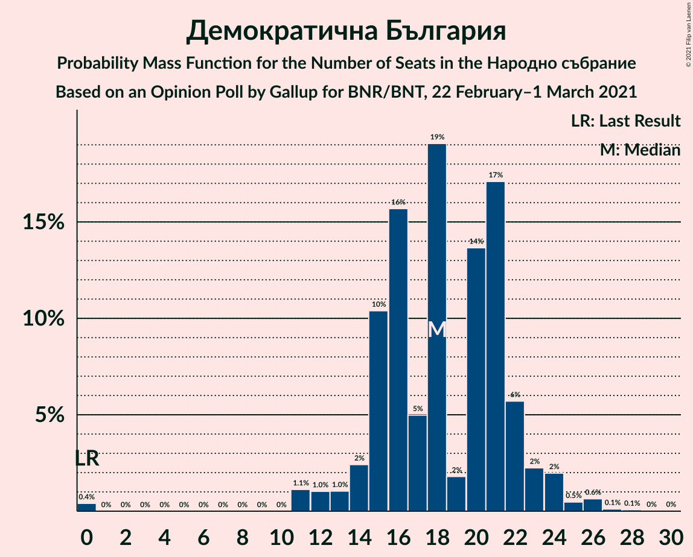

| Number of Seats | Probability | Accumulated | Special Marks |
|:---------------:|:-----------:|:-----------:|:-------------:|
| 0 | 0.4% | 100% | Last Result |
| 1 | 0% | 99.6% |  |
| 2 | 0% | 99.6% |  |
| 3 | 0% | 99.6% |  |
| 4 | 0% | 99.6% |  |
| 5 | 0% | 99.6% |  |
| 6 | 0% | 99.6% |  |
| 7 | 0% | 99.6% |  |
| 8 | 0% | 99.6% |  |
| 9 | 0% | 99.6% |  |
| 10 | 0% | 99.6% |  |
| 11 | 1.1% | 99.6% |  |
| 12 | 1.0% | 98% |  |
| 13 | 1.0% | 97% |  |
| 14 | 2% | 96% |  |
| 15 | 10% | 94% |  |
| 16 | 16% | 84% |  |
| 17 | 5% | 68% |  |
| 18 | 19% | 63% | Median |
| 19 | 2% | 44% |  |
| 20 | 14% | 42% |  |
| 21 | 17% | 28% |  |
| 22 | 6% | 11% |  |
| 23 | 2% | 6% |  |
| 24 | 2% | 3% |  |
| 25 | 0.5% | 1.4% |  |
| 26 | 0.6% | 0.9% |  |
| 27 | 0.1% | 0.2% |  |
| 28 | 0.1% | 0.1% |  |
| 29 | 0% | 0% |  |

### Изправи се Бг

*For a full overview of the results for this party, see the [Изправи се Бг](party-изправисебг.html) page.*

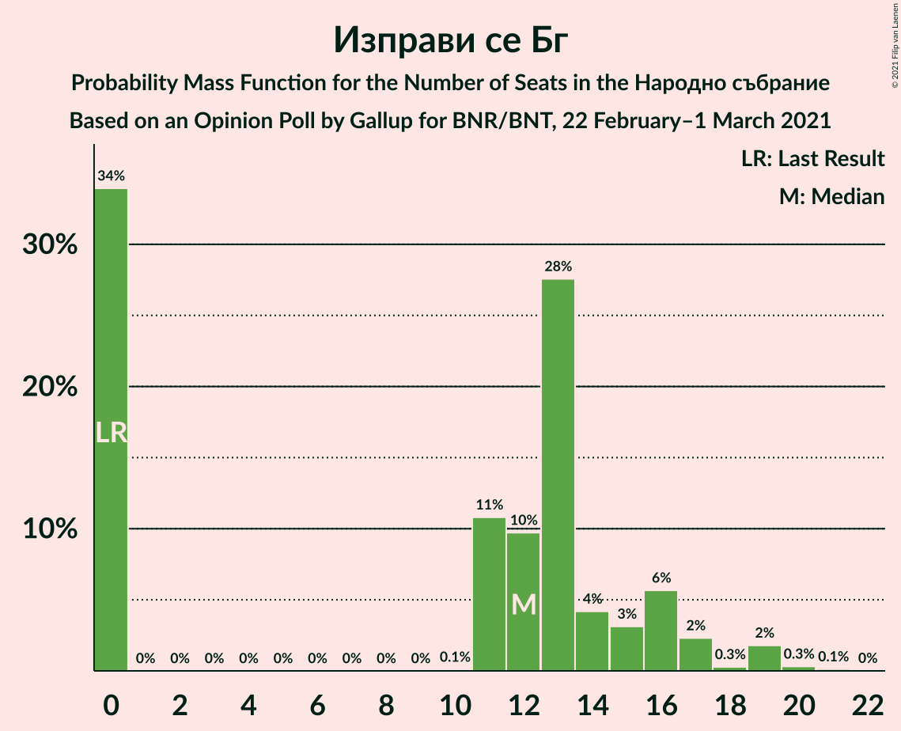

| Number of Seats | Probability | Accumulated | Special Marks |
|:---------------:|:-----------:|:-----------:|:-------------:|
| 0 | 34% | 100% | Last Result |
| 1 | 0% | 66% |  |
| 2 | 0% | 66% |  |
| 3 | 0% | 66% |  |
| 4 | 0% | 66% |  |
| 5 | 0% | 66% |  |
| 6 | 0% | 66% |  |
| 7 | 0% | 66% |  |
| 8 | 0% | 66% |  |
| 9 | 0% | 66% |  |
| 10 | 0.1% | 66% |  |
| 11 | 11% | 66% |  |
| 12 | 10% | 55% | Median |
| 13 | 28% | 45% |  |
| 14 | 4% | 18% |  |
| 15 | 3% | 14% |  |
| 16 | 6% | 11% |  |
| 17 | 2% | 5% |  |
| 18 | 0.3% | 3% |  |
| 19 | 2% | 2% |  |
| 20 | 0.3% | 0.5% |  |
| 21 | 0.1% | 0.2% |  |
| 22 | 0% | 0% |  |

### Обединени Патриоти

*For a full overview of the results for this party, see the [Обединени Патриоти](party-обединенипатриоти.html) page.*

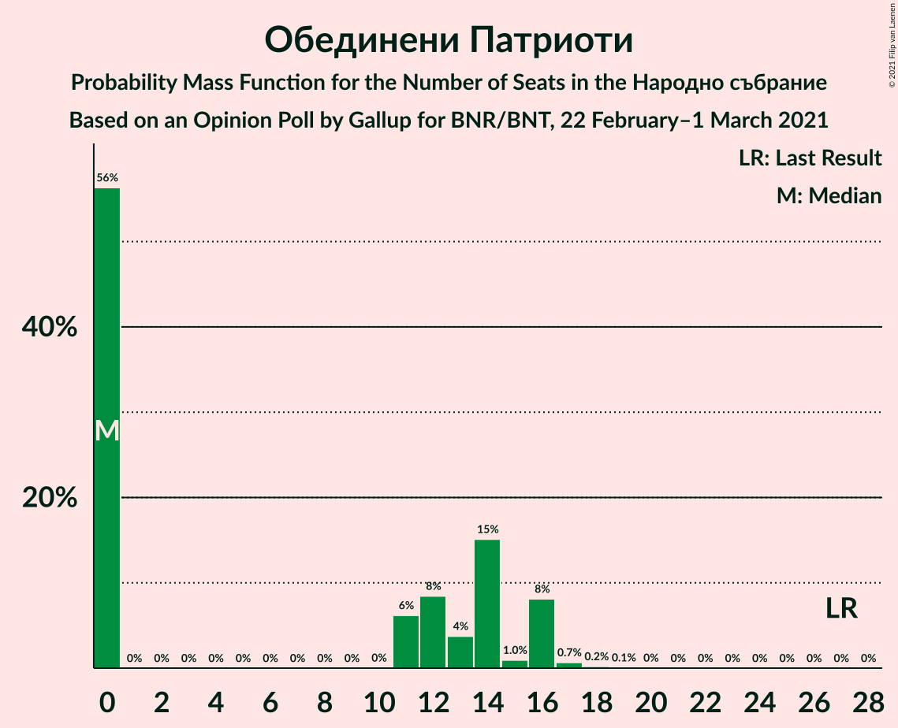

| Number of Seats | Probability | Accumulated | Special Marks |
|:---------------:|:-----------:|:-----------:|:-------------:|
| 0 | 56% | 100% | Median |
| 1 | 0% | 44% |  |
| 2 | 0% | 44% |  |
| 3 | 0% | 44% |  |
| 4 | 0% | 44% |  |
| 5 | 0% | 44% |  |
| 6 | 0% | 44% |  |
| 7 | 0% | 44% |  |
| 8 | 0% | 44% |  |
| 9 | 0% | 44% |  |
| 10 | 0% | 44% |  |
| 11 | 6% | 44% |  |
| 12 | 8% | 37% |  |
| 13 | 4% | 29% |  |
| 14 | 15% | 25% |  |
| 15 | 1.0% | 10% |  |
| 16 | 8% | 9% |  |
| 17 | 0.7% | 1.0% |  |
| 18 | 0.2% | 0.3% |  |
| 19 | 0.1% | 0.1% |  |
| 20 | 0% | 0.1% |  |
| 21 | 0% | 0% |  |
| 22 | 0% | 0% |  |
| 23 | 0% | 0% |  |
| 24 | 0% | 0% |  |
| 25 | 0% | 0% |  |
| 26 | 0% | 0% |  |
| 27 | 0% | 0% | Last Result |

### Воля–Национален фронт за спасение на България

*For a full overview of the results for this party, see the [Воля–Национален фронт за спасение на България](party-воля–националенфронтзаспасениенабългария.html) page.*

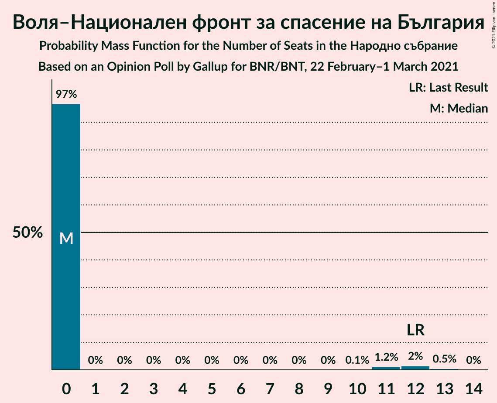

| Number of Seats | Probability | Accumulated | Special Marks |
|:---------------:|:-----------:|:-----------:|:-------------:|
| 0 | 97% | 100% | Median |
| 1 | 0% | 3% |  |
| 2 | 0% | 3% |  |
| 3 | 0% | 3% |  |
| 4 | 0% | 3% |  |
| 5 | 0% | 3% |  |
| 6 | 0% | 3% |  |
| 7 | 0% | 3% |  |
| 8 | 0% | 3% |  |
| 9 | 0% | 3% |  |
| 10 | 0.1% | 3% |  |
| 11 | 1.2% | 3% |  |
| 12 | 2% | 2% | Last Result |
| 13 | 0.5% | 0.5% |  |
| 14 | 0% | 0% |  |

### Възраждане

*For a full overview of the results for this party, see the [Възраждане](party-възраждане.html) page.*

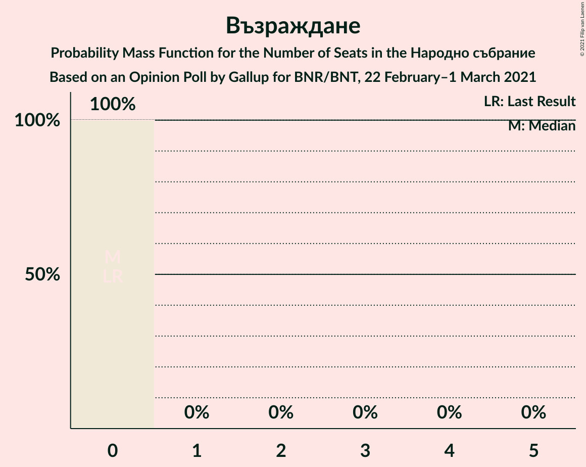

| Number of Seats | Probability | Accumulated | Special Marks |
|:---------------:|:-----------:|:-----------:|:-------------:|
| 0 | 100% | 100% | Last Result, Median |

### Алтернатива за българско възраждане

*For a full overview of the results for this party, see the [Алтернатива за българско възраждане](party-алтернативазабългарсковъзраждане.html) page.*

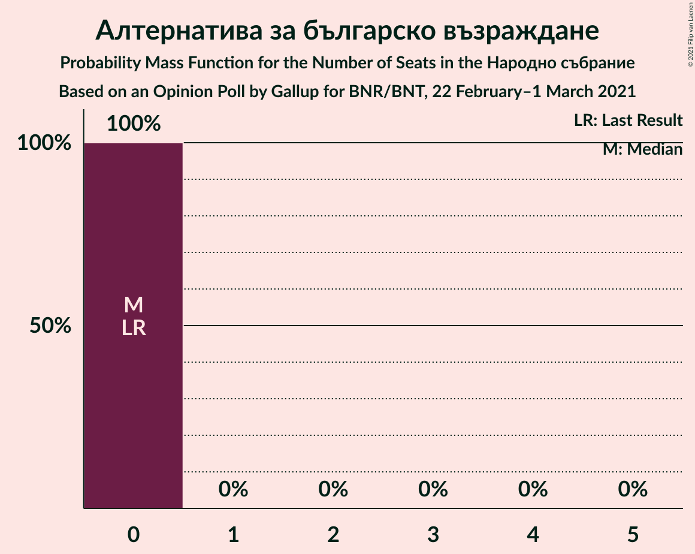

| Number of Seats | Probability | Accumulated | Special Marks |
|:---------------:|:-----------:|:-----------:|:-------------:|
| 0 | 100% | 100% | Last Result, Median |

### Републиканци за България

*For a full overview of the results for this party, see the [Републиканци за България](party-републиканцизабългария.html) page.*

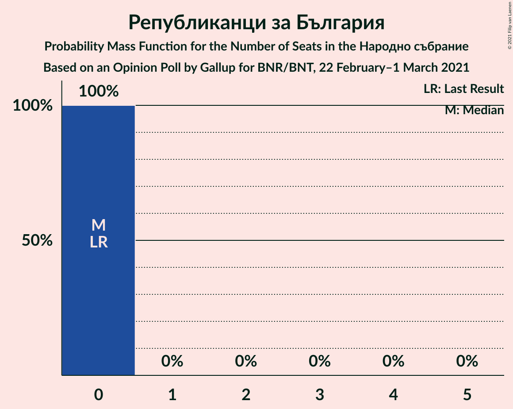

| Number of Seats | Probability | Accumulated | Special Marks |
|:---------------:|:-----------:|:-----------:|:-------------:|
| 0 | 100% | 100% | Last Result, Median |

### Атака

*For a full overview of the results for this party, see the [Атака](party-атака.html) page.*

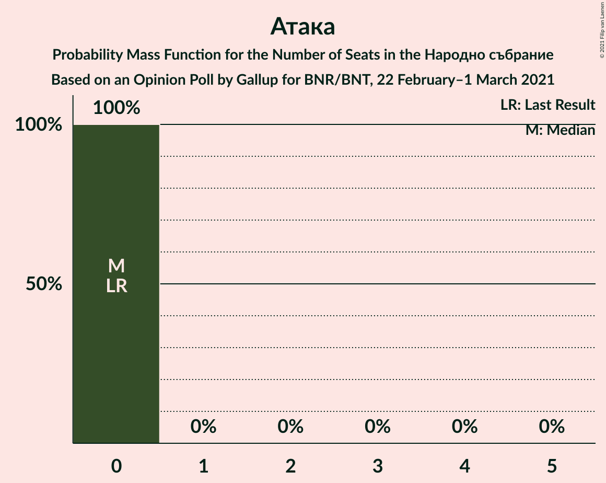

| Number of Seats | Probability | Accumulated | Special Marks |
|:---------------:|:-----------:|:-----------:|:-------------:|
| 0 | 100% | 100% | Last Result, Median |

## Coalitions

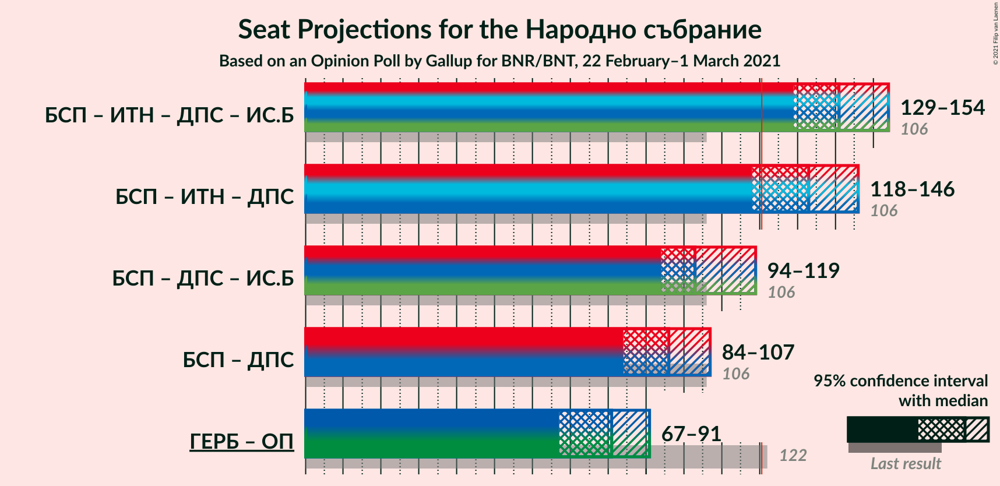

### Confidence Intervals

| Coalition | Last Result | Median | Majority? | 80% Confidence Interval | 90% Confidence Interval | 95% Confidence Interval | 99% Confidence Interval |
|:---------:|:-----------:|:------:|:---------:|:-----------------------:|:-----------------------:|:-----------------------:|:-----------------------:|
| Българска социалистическа партия – Има такъв народ – Движение за права и свободи – Изправи се Бг | 106 | 141 | 99.8% | 133–150 | 130–152 | 129–154 | 124–161 |
| Българска социалистическа партия – Има такъв народ – Движение за права и свободи | 106 | 133 | 96% | 127–144 | 123–144 | 118–146 | 115–148 |
| Българска социалистическа партия – Движение за права и свободи – Изправи се Бг | 106 | 103 | 1.5% | 95–116 | 95–117 | 94–119 | 84–124 |
| Българска социалистическа партия – Движение за права и свободи | 106 | 96 | 0% | 89–103 | 86–104 | 84–107 | 81–111 |
| Граждани за европейско развитие на България – Обединени Патриоти | 122 | 81 | 0% | 72–86 | 69–89 | 67–91 | 64–96 |

### Българска социалистическа партия – Има такъв народ – Движение за права и свободи – Изправи се Бг

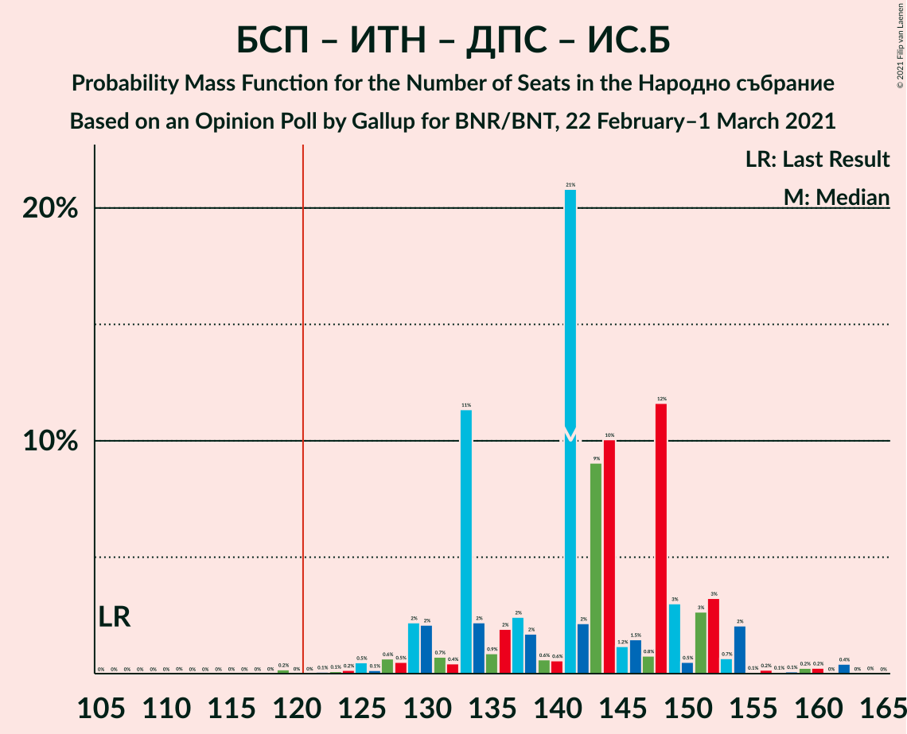

| Number of Seats | Probability | Accumulated | Special Marks |
|:---------------:|:-----------:|:-----------:|:-------------:|
| 106 | 0% | 100% | Last Result |
| 107 | 0% | 100% |  |
| 108 | 0% | 100% |  |
| 109 | 0% | 100% |  |
| 110 | 0% | 100% |  |
| 111 | 0% | 100% |  |
| 112 | 0% | 100% |  |
| 113 | 0% | 100% |  |
| 114 | 0% | 100% |  |
| 115 | 0% | 100% |  |
| 116 | 0% | 100% |  |
| 117 | 0% | 100% |  |
| 118 | 0% | 100% |  |
| 119 | 0.2% | 99.9% |  |
| 120 | 0% | 99.8% |  |
| 121 | 0% | 99.8% | Majority |
| 122 | 0.1% | 99.7% |  |
| 123 | 0.1% | 99.7% |  |
| 124 | 0.2% | 99.6% |  |
| 125 | 0.5% | 99.4% |  |
| 126 | 0.1% | 98.9% |  |
| 127 | 0.6% | 98.8% |  |
| 128 | 0.5% | 98% |  |
| 129 | 2% | 98% |  |
| 130 | 2% | 95% |  |
| 131 | 0.7% | 93% |  |
| 132 | 0.4% | 93% |  |
| 133 | 11% | 92% |  |
| 134 | 2% | 81% |  |
| 135 | 0.9% | 79% |  |
| 136 | 2% | 78% |  |
| 137 | 2% | 76% |  |
| 138 | 2% | 73% |  |
| 139 | 0.6% | 72% |  |
| 140 | 0.6% | 71% |  |
| 141 | 21% | 71% |  |
| 142 | 2% | 50% |  |
| 143 | 9% | 48% |  |
| 144 | 10% | 39% |  |
| 145 | 1.2% | 29% |  |
| 146 | 1.5% | 27% | Median |
| 147 | 0.8% | 26% |  |
| 148 | 12% | 25% |  |
| 149 | 3% | 13% |  |
| 150 | 0.5% | 10% |  |
| 151 | 3% | 10% |  |
| 152 | 3% | 7% |  |
| 153 | 0.7% | 4% |  |
| 154 | 2% | 3% |  |
| 155 | 0.1% | 1.4% |  |
| 156 | 0.2% | 1.3% |  |
| 157 | 0.1% | 1.1% |  |
| 158 | 0.1% | 1.1% |  |
| 159 | 0.2% | 1.0% |  |
| 160 | 0.2% | 0.7% |  |
| 161 | 0% | 0.5% |  |
| 162 | 0.4% | 0.5% |  |
| 163 | 0% | 0.1% |  |
| 164 | 0% | 0.1% |  |
| 165 | 0% | 0% |  |

### Българска социалистическа партия – Има такъв народ – Движение за права и свободи

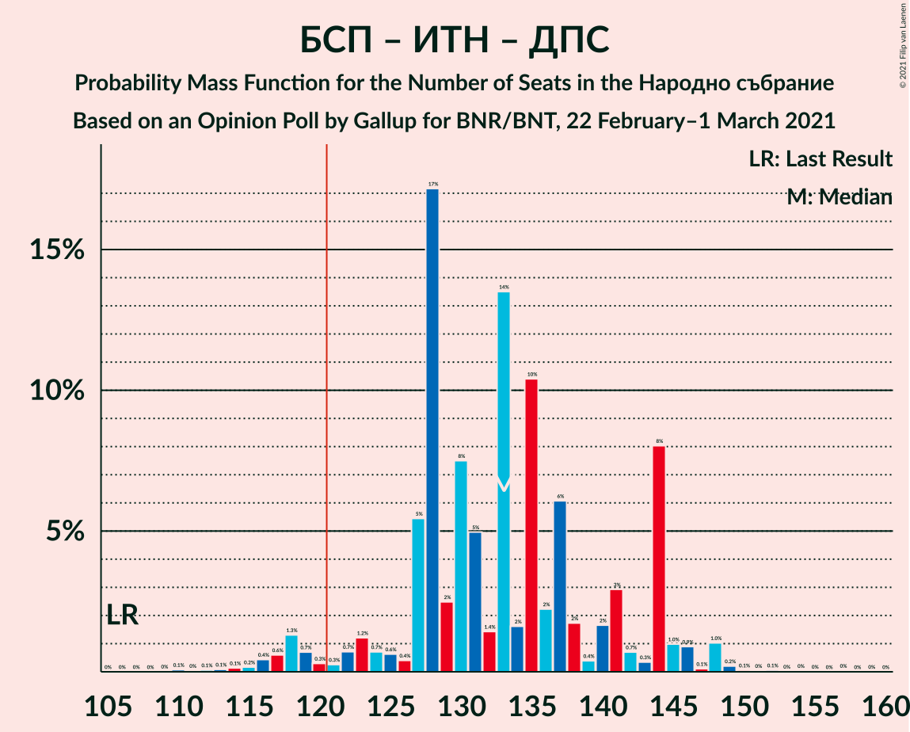

| Number of Seats | Probability | Accumulated | Special Marks |
|:---------------:|:-----------:|:-----------:|:-------------:|
| 106 | 0% | 100% | Last Result |
| 107 | 0% | 100% |  |
| 108 | 0% | 100% |  |
| 109 | 0% | 100% |  |
| 110 | 0.1% | 100% |  |
| 111 | 0% | 99.9% |  |
| 112 | 0.1% | 99.9% |  |
| 113 | 0.1% | 99.8% |  |
| 114 | 0.1% | 99.7% |  |
| 115 | 0.2% | 99.6% |  |
| 116 | 0.4% | 99.4% |  |
| 117 | 0.6% | 99.0% |  |
| 118 | 1.3% | 98% |  |
| 119 | 0.7% | 97% |  |
| 120 | 0.3% | 96% |  |
| 121 | 0.3% | 96% | Majority |
| 122 | 0.7% | 96% |  |
| 123 | 1.2% | 95% |  |
| 124 | 0.7% | 94% |  |
| 125 | 0.6% | 93% |  |
| 126 | 0.4% | 93% |  |
| 127 | 5% | 92% |  |
| 128 | 17% | 87% |  |
| 129 | 2% | 70% |  |
| 130 | 8% | 67% |  |
| 131 | 5% | 60% |  |
| 132 | 1.4% | 55% |  |
| 133 | 14% | 53% |  |
| 134 | 2% | 40% | Median |
| 135 | 10% | 38% |  |
| 136 | 2% | 28% |  |
| 137 | 6% | 25% |  |
| 138 | 2% | 19% |  |
| 139 | 0.4% | 18% |  |
| 140 | 2% | 17% |  |
| 141 | 3% | 16% |  |
| 142 | 0.7% | 13% |  |
| 143 | 0.3% | 12% |  |
| 144 | 8% | 12% |  |
| 145 | 1.0% | 4% |  |
| 146 | 0.9% | 3% |  |
| 147 | 0.1% | 2% |  |
| 148 | 1.0% | 2% |  |
| 149 | 0.2% | 0.5% |  |
| 150 | 0.1% | 0.3% |  |
| 151 | 0% | 0.2% |  |
| 152 | 0.1% | 0.2% |  |
| 153 | 0% | 0.1% |  |
| 154 | 0% | 0.1% |  |
| 155 | 0% | 0.1% |  |
| 156 | 0% | 0.1% |  |
| 157 | 0% | 0.1% |  |
| 158 | 0% | 0% |  |

### Българска социалистическа партия – Движение за права и свободи – Изправи се Бг

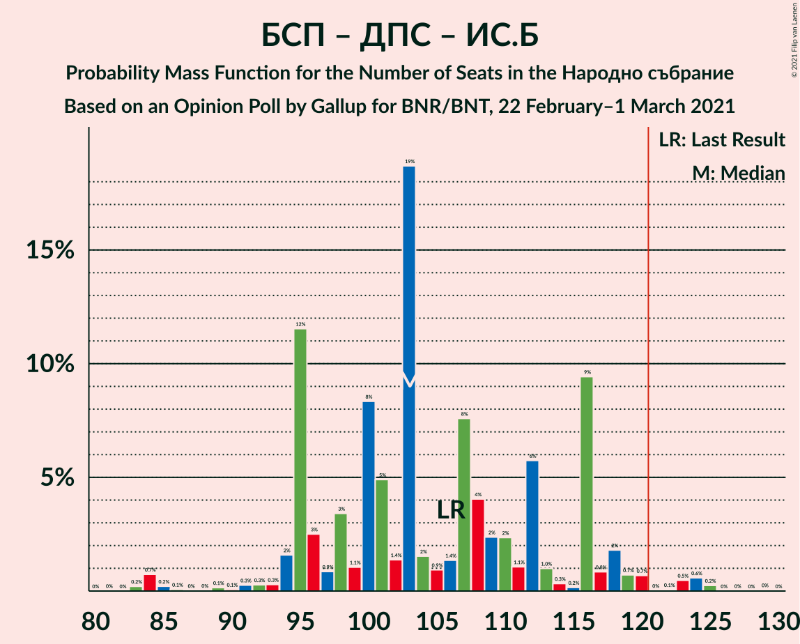

| Number of Seats | Probability | Accumulated | Special Marks |
|:---------------:|:-----------:|:-----------:|:-------------:|
| 83 | 0.2% | 100% |  |
| 84 | 0.7% | 99.8% |  |
| 85 | 0.2% | 99.0% |  |
| 86 | 0.1% | 98.8% |  |
| 87 | 0% | 98.7% |  |
| 88 | 0% | 98.7% |  |
| 89 | 0.1% | 98.7% |  |
| 90 | 0.1% | 98.6% |  |
| 91 | 0.3% | 98% |  |
| 92 | 0.3% | 98% |  |
| 93 | 0.3% | 98% |  |
| 94 | 2% | 98% |  |
| 95 | 12% | 96% |  |
| 96 | 3% | 85% |  |
| 97 | 0.9% | 82% |  |
| 98 | 3% | 81% |  |
| 99 | 1.1% | 78% |  |
| 100 | 8% | 77% |  |
| 101 | 5% | 68% |  |
| 102 | 1.4% | 63% |  |
| 103 | 19% | 62% |  |
| 104 | 2% | 43% |  |
| 105 | 0.9% | 42% |  |
| 106 | 1.4% | 41% | Last Result |
| 107 | 8% | 40% |  |
| 108 | 4% | 32% | Median |
| 109 | 2% | 28% |  |
| 110 | 2% | 26% |  |
| 111 | 1.1% | 23% |  |
| 112 | 6% | 22% |  |
| 113 | 1.0% | 16% |  |
| 114 | 0.3% | 15% |  |
| 115 | 0.2% | 15% |  |
| 116 | 9% | 15% |  |
| 117 | 0.8% | 6% |  |
| 118 | 2% | 5% |  |
| 119 | 0.7% | 3% |  |
| 120 | 0.7% | 2% |  |
| 121 | 0% | 1.5% | Majority |
| 122 | 0.1% | 1.4% |  |
| 123 | 0.5% | 1.4% |  |
| 124 | 0.6% | 0.9% |  |
| 125 | 0.2% | 0.3% |  |
| 126 | 0% | 0.1% |  |
| 127 | 0% | 0.1% |  |
| 128 | 0% | 0.1% |  |
| 129 | 0% | 0.1% |  |
| 130 | 0% | 0% |  |

### Българска социалистическа партия – Движение за права и свободи

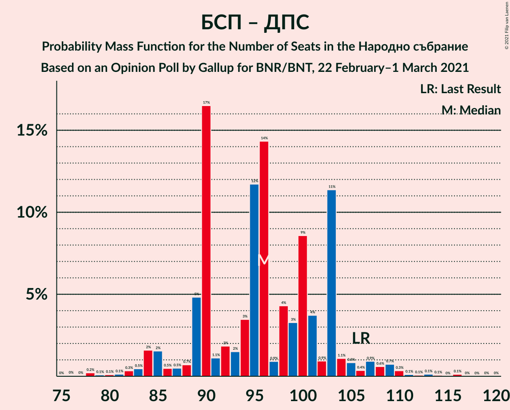

| Number of Seats | Probability | Accumulated | Special Marks |
|:---------------:|:-----------:|:-----------:|:-------------:|
| 76 | 0% | 100% |  |
| 77 | 0% | 99.9% |  |
| 78 | 0.2% | 99.9% |  |
| 79 | 0.1% | 99.7% |  |
| 80 | 0.1% | 99.6% |  |
| 81 | 0.1% | 99.5% |  |
| 82 | 0.3% | 99.4% |  |
| 83 | 0.5% | 99.0% |  |
| 84 | 2% | 98.6% |  |
| 85 | 2% | 97% |  |
| 86 | 0.5% | 95% |  |
| 87 | 0.5% | 95% |  |
| 88 | 0.7% | 94% |  |
| 89 | 5% | 94% |  |
| 90 | 17% | 89% |  |
| 91 | 1.1% | 72% |  |
| 92 | 2% | 71% |  |
| 93 | 2% | 69% |  |
| 94 | 3% | 68% |  |
| 95 | 12% | 65% |  |
| 96 | 14% | 53% | Median |
| 97 | 0.9% | 38% |  |
| 98 | 4% | 38% |  |
| 99 | 3% | 33% |  |
| 100 | 9% | 30% |  |
| 101 | 4% | 21% |  |
| 102 | 0.9% | 18% |  |
| 103 | 11% | 17% |  |
| 104 | 1.1% | 5% |  |
| 105 | 0.8% | 4% |  |
| 106 | 0.4% | 3% | Last Result |
| 107 | 0.9% | 3% |  |
| 108 | 0.6% | 2% |  |
| 109 | 0.7% | 2% |  |
| 110 | 0.3% | 0.9% |  |
| 111 | 0.1% | 0.5% |  |
| 112 | 0.1% | 0.4% |  |
| 113 | 0.1% | 0.4% |  |
| 114 | 0.1% | 0.2% |  |
| 115 | 0% | 0.2% |  |
| 116 | 0.1% | 0.2% |  |
| 117 | 0% | 0% |  |

### Граждани за европейско развитие на България – Обединени Патриоти

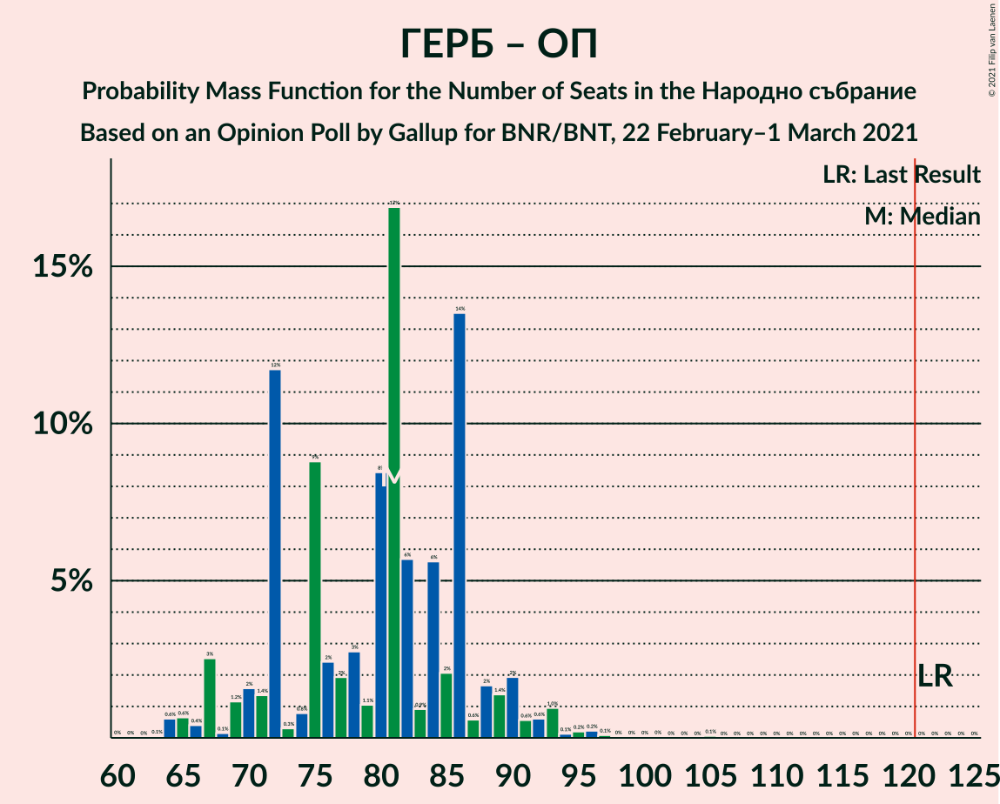

| Number of Seats | Probability | Accumulated | Special Marks |
|:---------------:|:-----------:|:-----------:|:-------------:|
| 60 | 0% | 100% |  |
| 61 | 0% | 99.9% |  |
| 62 | 0% | 99.9% |  |
| 63 | 0.1% | 99.9% |  |
| 64 | 0.6% | 99.8% |  |
| 65 | 0.6% | 99.2% |  |
| 66 | 0.4% | 98.6% |  |
| 67 | 3% | 98% |  |
| 68 | 0.1% | 96% |  |
| 69 | 1.2% | 95% |  |
| 70 | 2% | 94% |  |
| 71 | 1.4% | 93% |  |
| 72 | 12% | 91% | Median |
| 73 | 0.3% | 80% |  |
| 74 | 0.8% | 79% |  |
| 75 | 9% | 79% |  |
| 76 | 2% | 70% |  |
| 77 | 2% | 67% |  |
| 78 | 3% | 65% |  |
| 79 | 1.1% | 63% |  |
| 80 | 8% | 62% |  |
| 81 | 17% | 53% |  |
| 82 | 6% | 36% |  |
| 83 | 0.9% | 31% |  |
| 84 | 6% | 30% |  |
| 85 | 2% | 24% |  |
| 86 | 14% | 22% |  |
| 87 | 0.6% | 9% |  |
| 88 | 2% | 8% |  |
| 89 | 1.4% | 6% |  |
| 90 | 2% | 5% |  |
| 91 | 0.6% | 3% |  |
| 92 | 0.6% | 2% |  |
| 93 | 1.0% | 2% |  |
| 94 | 0.1% | 0.8% |  |
| 95 | 0.2% | 0.7% |  |
| 96 | 0.2% | 0.5% |  |
| 97 | 0.1% | 0.3% |  |
| 98 | 0% | 0.2% |  |
| 99 | 0% | 0.2% |  |
| 100 | 0% | 0.1% |  |
| 101 | 0% | 0.1% |  |
| 102 | 0% | 0.1% |  |
| 103 | 0% | 0.1% |  |
| 104 | 0% | 0.1% |  |
| 105 | 0.1% | 0.1% |  |
| 106 | 0% | 0% |  |
| 107 | 0% | 0% |  |
| 108 | 0% | 0% |  |
| 109 | 0% | 0% |  |
| 110 | 0% | 0% |  |
| 111 | 0% | 0% |  |
| 112 | 0% | 0% |  |
| 113 | 0% | 0% |  |
| 114 | 0% | 0% |  |
| 115 | 0% | 0% |  |
| 116 | 0% | 0% |  |
| 117 | 0% | 0% |  |
| 118 | 0% | 0% |  |
| 119 | 0% | 0% |  |
| 120 | 0% | 0% |  |
| 121 | 0% | 0% | Majority |
| 122 | 0% | 0% | Last Result |

## Technical Information

### Opinion Poll

+ **Polling firm:** Gallup
+ **Commissioner(s):** BNR/BNT
+ **Fieldwork period:** 22 February–1 March 2021

### Calculations

+ **Sample size:** 534
+ **Simulations done:** 1,048,576
+ **Error estimate:** 3.73%

