# Opinion Poll by Sova Harris for Trud, 11–16 March 2021

<a href="#voting-intentions">Voting Intentions</a> | <a href="#seats">Seats</a> | <a href="#coalitions">Coalitions</a> | <a href="#technical-information">Technical Information</a>

## Voting Intentions

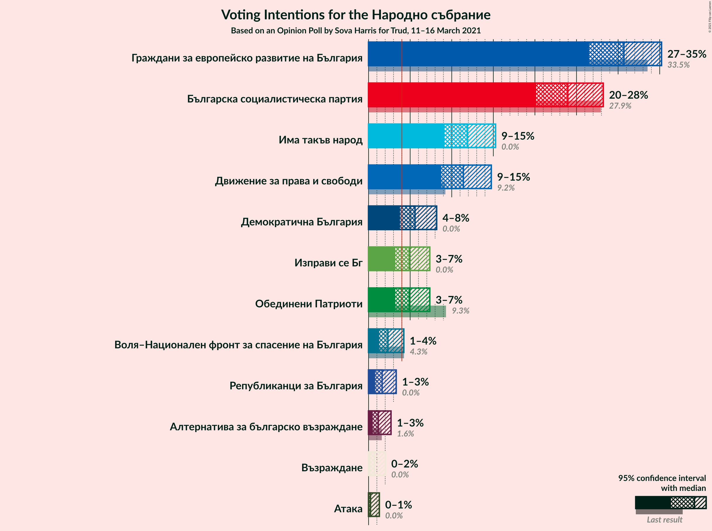

### Confidence Intervals

| Party | Last Result | Poll Result | 80% Confidence Interval | 90% Confidence Interval | 95% Confidence Interval | 99% Confidence Interval |
|:-----:|:-----------:|:-----------:|:-----------------------:|:-----------------------:|:-----------------------:|:-----------------------:|
| Граждани за европейско развитие на България | 33.5% | 30.7% | 28.0–33.7% |27.2–34.5% |26.5–35.2% |25.2–36.7% |
| Българска социалистическа партия | 27.9% | 24.0% | 21.5–26.7% |20.8–27.5% |20.1–28.2% |19.0–29.6% |
| Има такъв народ | 0.0% | 11.9% | 10.1–14.1% |9.6–14.7% |9.1–15.3% |8.3–16.4% |
| Движение за права и свободи | 9.2% | 11.4% | 9.6–13.6% |9.1–14.2% |8.7–14.8% |7.9–15.9% |
| Демократична България | 0.0% | 5.6% | 4.4–7.3% |4.1–7.7% |3.8–8.2% |3.3–9.1% |
| Обединени Патриоти | 9.3% | 4.9% | 3.8–6.5% |3.5–7.0% |3.2–7.4% |2.8–8.2% |
| Изправи се Бг | 0.0% | 4.9% | 3.8–6.5% |3.5–7.0% |3.2–7.4% |2.8–8.2% |
| Воля–Национален фронт за спасение на България | 4.3% | 2.3% | 1.6–3.6% |1.4–3.9% |1.3–4.2% |1.0–4.9% |
| Републиканци за България | 0.0% | 1.6% | 1.1–2.7% |0.9–3.0% |0.8–3.3% |0.6–3.9% |
| Алтернатива за българско възраждане | 1.6% | 1.2% | 0.7–2.1% |0.6–2.4% |0.5–2.7% |0.4–3.3% |
| Възраждане | 0.0% | 0.7% | 0.4–1.6% |0.3–1.8% |0.2–2.0% |0.2–2.5% |
| Атака | 0.0% | 0.2% | 0.1–0.9% |0.1–1.1% |0.0–1.3% |0.0–1.7% |

*Note:* The poll result column reflects the actual value used in the calculations. Published results may vary slightly, and in addition be rounded to fewer digits.

## Seats

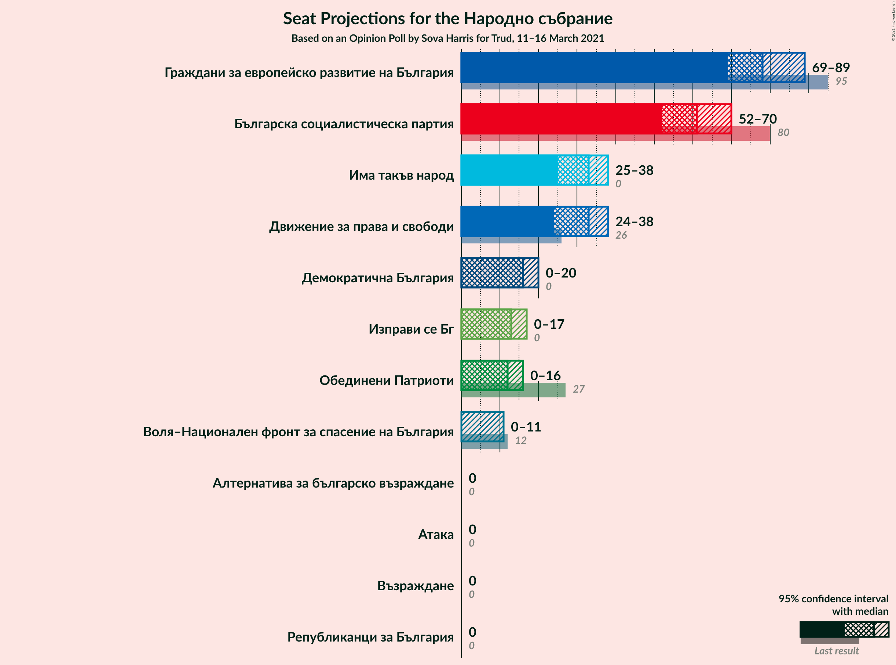

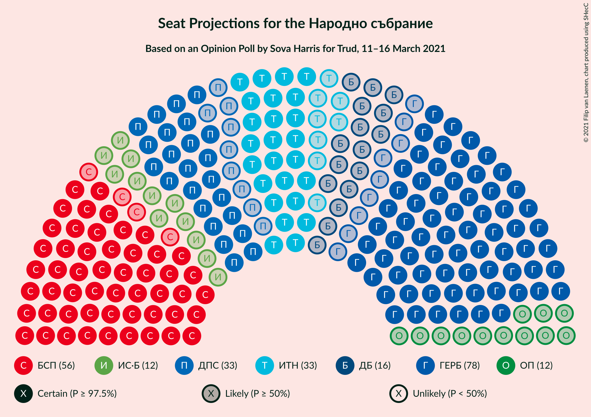

### Confidence Intervals

| Party | Last Result | Median | 80% Confidence Interval | 90% Confidence Interval | 95% Confidence Interval | 99% Confidence Interval |
|:-----:|:-----------:|:------:|:-----------------------:|:-----------------------:|:-----------------------:|:-----------------------:|
| <a href="#граждани-за-европейско-развитие-на-българия">Граждани за европейско развитие на България</a> | 95 | 78 | 75–83 |71–87 |69–89 |66–93 |
| <a href="#българска-социалистическа-партия">Българска социалистическа партия</a> | 80 | 61 | 56–66 |55–70 |52–70 |46–76 |
| <a href="#има-такъв-народ">Има такъв народ</a> | 0 | 33 | 27–34 |26–37 |25–38 |22–41 |
| <a href="#движение-за-права-и-свободи">Движение за права и свободи</a> | 26 | 33 | 27–34 |25–36 |24–38 |21–43 |
| <a href="#демократична-българия">Демократична България</a> | 0 | 16 | 13–17 |0–18 |0–20 |0–22 |
| <a href="#обединени-патриоти">Обединени Патриоти</a> | 27 | 12 | 11–14 |0–15 |0–16 |0–19 |
| <a href="#изправи-се-бг">Изправи се Бг</a> | 0 | 13 | 12–15 |0–16 |0–17 |0–19 |
| <a href="#воля–национален-фронт-за-спасение-на-българия">Воля–Национален фронт за спасение на България</a> | 12 | 0 | 0 |0 |0–11 |0–13 |
| <a href="#републиканци-за-българия">Републиканци за България</a> | 0 | 0 | 0 |0 |0 |0 |
| <a href="#алтернатива-за-българско-възраждане">Алтернатива за българско възраждане</a> | 0 | 0 | 0 |0 |0 |0 |
| <a href="#възраждане">Възраждане</a> | 0 | 0 | 0 |0 |0 |0 |
| <a href="#атака">Атака</a> | 0 | 0 | 0 |0 |0 |0 |

### Граждани за европейско развитие на България

*For a full overview of the results for this party, see the [Граждани за европейско развитие на България](party-гражданизаевропейскоразвитиенабългария.html) page.*

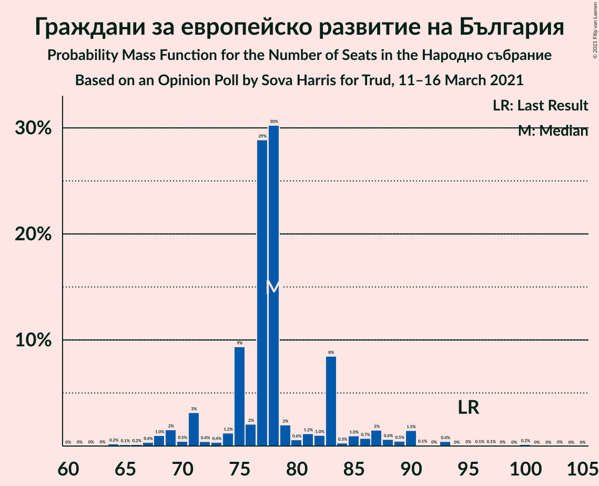

| Number of Seats | Probability | Accumulated | Special Marks |
|:---------------:|:-----------:|:-----------:|:-------------:|
| 62 | 0% | 100% |  |
| 63 | 0% | 99.9% |  |
| 64 | 0.2% | 99.9% |  |
| 65 | 0.1% | 99.7% |  |
| 66 | 0.2% | 99.5% |  |
| 67 | 0.4% | 99.4% |  |
| 68 | 1.0% | 99.0% |  |
| 69 | 2% | 98% |  |
| 70 | 0.5% | 97% |  |
| 71 | 3% | 96% |  |
| 72 | 0.4% | 93% |  |
| 73 | 0.4% | 92% |  |
| 74 | 1.2% | 92% |  |
| 75 | 9% | 91% |  |
| 76 | 2% | 82% |  |
| 77 | 29% | 79% |  |
| 78 | 30% | 51% | Median |
| 79 | 2% | 20% |  |
| 80 | 0.6% | 18% |  |
| 81 | 1.2% | 18% |  |
| 82 | 1.0% | 17% |  |
| 83 | 8% | 16% |  |
| 84 | 0.3% | 7% |  |
| 85 | 1.0% | 7% |  |
| 86 | 0.7% | 6% |  |
| 87 | 2% | 5% |  |
| 88 | 0.6% | 4% |  |
| 89 | 0.5% | 3% |  |
| 90 | 1.5% | 2% |  |
| 91 | 0.1% | 1.0% |  |
| 92 | 0% | 0.9% |  |
| 93 | 0.4% | 0.8% |  |
| 94 | 0% | 0.4% |  |
| 95 | 0% | 0.4% | Last Result |
| 96 | 0.1% | 0.3% |  |
| 97 | 0.1% | 0.3% |  |
| 98 | 0% | 0.2% |  |
| 99 | 0% | 0.2% |  |
| 100 | 0.2% | 0.2% |  |
| 101 | 0% | 0% |  |

### Българска социалистическа партия

*For a full overview of the results for this party, see the [Българска социалистическа партия](party-българскасоциалистическапартия.html) page.*

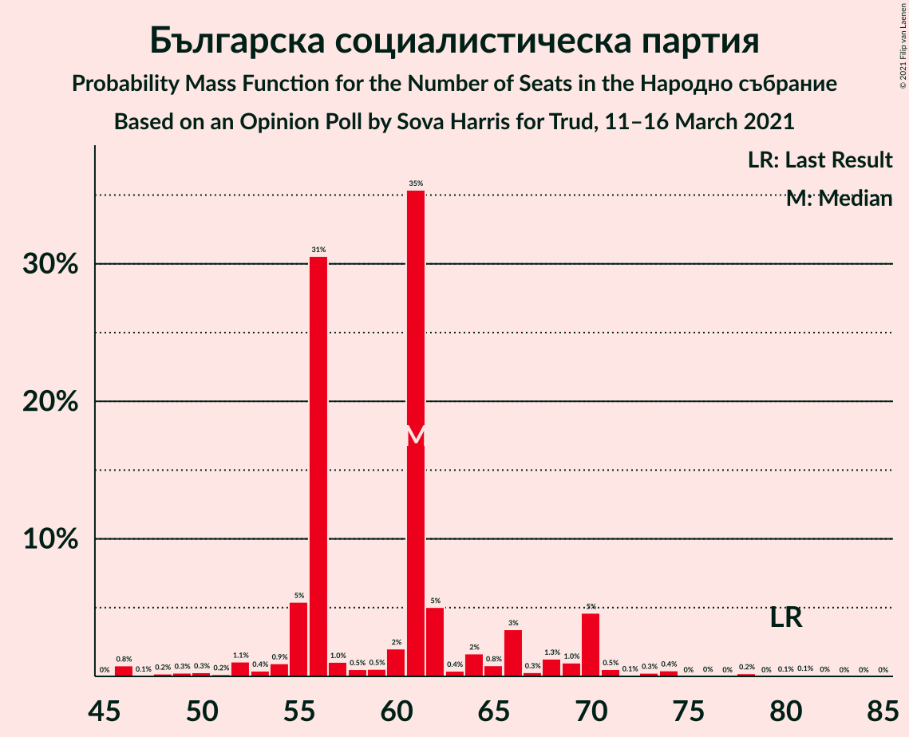

| Number of Seats | Probability | Accumulated | Special Marks |
|:---------------:|:-----------:|:-----------:|:-------------:|
| 46 | 0.8% | 100% |  |
| 47 | 0.1% | 99.2% |  |
| 48 | 0.2% | 99.1% |  |
| 49 | 0.3% | 98.9% |  |
| 50 | 0.3% | 98.7% |  |
| 51 | 0.2% | 98% |  |
| 52 | 1.1% | 98% |  |
| 53 | 0.4% | 97% |  |
| 54 | 0.9% | 97% |  |
| 55 | 5% | 96% |  |
| 56 | 31% | 90% |  |
| 57 | 1.0% | 60% |  |
| 58 | 0.5% | 59% |  |
| 59 | 0.5% | 58% |  |
| 60 | 2% | 58% |  |
| 61 | 35% | 56% | Median |
| 62 | 5% | 20% |  |
| 63 | 0.4% | 15% |  |
| 64 | 2% | 15% |  |
| 65 | 0.8% | 13% |  |
| 66 | 3% | 12% |  |
| 67 | 0.3% | 9% |  |
| 68 | 1.3% | 9% |  |
| 69 | 1.0% | 7% |  |
| 70 | 5% | 6% |  |
| 71 | 0.5% | 2% |  |
| 72 | 0.1% | 1.3% |  |
| 73 | 0.3% | 1.2% |  |
| 74 | 0.4% | 1.0% |  |
| 75 | 0% | 0.5% |  |
| 76 | 0% | 0.5% |  |
| 77 | 0% | 0.5% |  |
| 78 | 0.2% | 0.5% |  |
| 79 | 0% | 0.2% |  |
| 80 | 0.1% | 0.2% | Last Result |
| 81 | 0.1% | 0.2% |  |
| 82 | 0% | 0.1% |  |
| 83 | 0% | 0% |  |

### Има такъв народ

*For a full overview of the results for this party, see the [Има такъв народ](party-иматакъвнарод.html) page.*

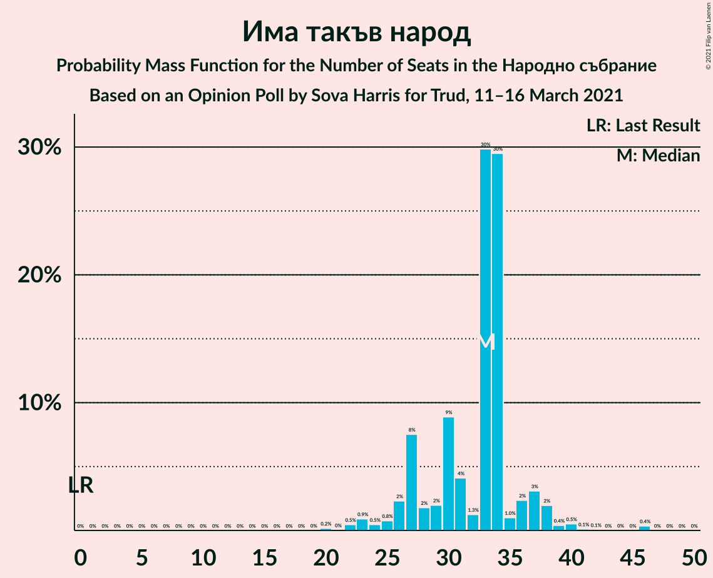

| Number of Seats | Probability | Accumulated | Special Marks |
|:---------------:|:-----------:|:-----------:|:-------------:|
| 0 | 0% | 100% | Last Result |
| 1 | 0% | 100% |  |
| 2 | 0% | 100% |  |
| 3 | 0% | 100% |  |
| 4 | 0% | 100% |  |
| 5 | 0% | 100% |  |
| 6 | 0% | 100% |  |
| 7 | 0% | 100% |  |
| 8 | 0% | 100% |  |
| 9 | 0% | 100% |  |
| 10 | 0% | 100% |  |
| 11 | 0% | 100% |  |
| 12 | 0% | 100% |  |
| 13 | 0% | 100% |  |
| 14 | 0% | 100% |  |
| 15 | 0% | 100% |  |
| 16 | 0% | 100% |  |
| 17 | 0% | 100% |  |
| 18 | 0% | 100% |  |
| 19 | 0% | 100% |  |
| 20 | 0.2% | 100% |  |
| 21 | 0% | 99.8% |  |
| 22 | 0.5% | 99.8% |  |
| 23 | 0.9% | 99.3% |  |
| 24 | 0.5% | 98% |  |
| 25 | 0.8% | 98% |  |
| 26 | 2% | 97% |  |
| 27 | 8% | 95% |  |
| 28 | 2% | 87% |  |
| 29 | 2% | 86% |  |
| 30 | 9% | 84% |  |
| 31 | 4% | 75% |  |
| 32 | 1.3% | 71% |  |
| 33 | 30% | 69% | Median |
| 34 | 30% | 39% |  |
| 35 | 1.0% | 10% |  |
| 36 | 2% | 9% |  |
| 37 | 3% | 7% |  |
| 38 | 2% | 3% |  |
| 39 | 0.4% | 1.5% |  |
| 40 | 0.5% | 1.1% |  |
| 41 | 0.1% | 0.6% |  |
| 42 | 0.1% | 0.5% |  |
| 43 | 0% | 0.4% |  |
| 44 | 0% | 0.4% |  |
| 45 | 0% | 0.4% |  |
| 46 | 0.4% | 0.4% |  |
| 47 | 0% | 0% |  |

### Движение за права и свободи

*For a full overview of the results for this party, see the [Движение за права и свободи](party-движениезаправаисвободи.html) page.*

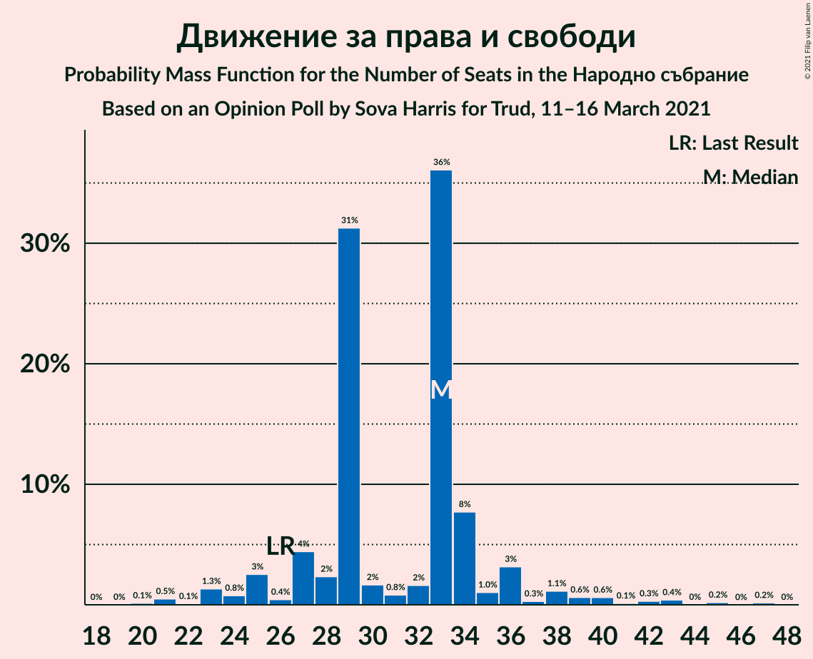

| Number of Seats | Probability | Accumulated | Special Marks |
|:---------------:|:-----------:|:-----------:|:-------------:|
| 18 | 0% | 100% |  |
| 19 | 0% | 99.9% |  |
| 20 | 0.1% | 99.9% |  |
| 21 | 0.5% | 99.8% |  |
| 22 | 0.1% | 99.3% |  |
| 23 | 1.3% | 99.2% |  |
| 24 | 0.8% | 98% |  |
| 25 | 3% | 97% |  |
| 26 | 0.4% | 95% | Last Result |
| 27 | 4% | 94% |  |
| 28 | 2% | 90% |  |
| 29 | 31% | 87% |  |
| 30 | 2% | 56% |  |
| 31 | 0.8% | 54% |  |
| 32 | 2% | 54% |  |
| 33 | 36% | 52% | Median |
| 34 | 8% | 16% |  |
| 35 | 1.0% | 8% |  |
| 36 | 3% | 7% |  |
| 37 | 0.3% | 4% |  |
| 38 | 1.1% | 4% |  |
| 39 | 0.6% | 2% |  |
| 40 | 0.6% | 2% |  |
| 41 | 0.1% | 1.3% |  |
| 42 | 0.3% | 1.1% |  |
| 43 | 0.4% | 0.8% |  |
| 44 | 0% | 0.4% |  |
| 45 | 0.2% | 0.4% |  |
| 46 | 0% | 0.2% |  |
| 47 | 0.2% | 0.2% |  |
| 48 | 0% | 0% |  |

### Демократична България

*For a full overview of the results for this party, see the [Демократична България](party-демократичнабългария.html) page.*

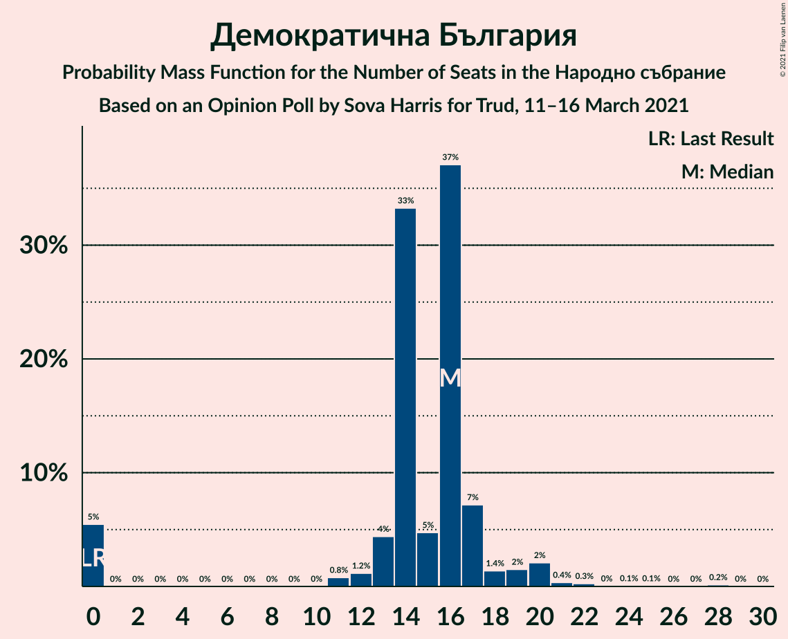

| Number of Seats | Probability | Accumulated | Special Marks |
|:---------------:|:-----------:|:-----------:|:-------------:|
| 0 | 5% | 100% | Last Result |
| 1 | 0% | 95% |  |
| 2 | 0% | 95% |  |
| 3 | 0% | 95% |  |
| 4 | 0% | 95% |  |
| 5 | 0% | 95% |  |
| 6 | 0% | 95% |  |
| 7 | 0% | 95% |  |
| 8 | 0% | 95% |  |
| 9 | 0% | 95% |  |
| 10 | 0% | 95% |  |
| 11 | 0.8% | 95% |  |
| 12 | 1.2% | 94% |  |
| 13 | 4% | 93% |  |
| 14 | 33% | 88% |  |
| 15 | 5% | 55% |  |
| 16 | 37% | 50% | Median |
| 17 | 7% | 13% |  |
| 18 | 1.4% | 6% |  |
| 19 | 2% | 5% |  |
| 20 | 2% | 3% |  |
| 21 | 0.4% | 0.9% |  |
| 22 | 0.3% | 0.6% |  |
| 23 | 0% | 0.3% |  |
| 24 | 0.1% | 0.3% |  |
| 25 | 0.1% | 0.2% |  |
| 26 | 0% | 0.2% |  |
| 27 | 0% | 0.2% |  |
| 28 | 0.2% | 0.2% |  |
| 29 | 0% | 0% |  |

### Обединени Патриоти

*For a full overview of the results for this party, see the [Обединени Патриоти](party-обединенипатриоти.html) page.*

| Number of Seats | Probability | Accumulated | Special Marks |
|:---------------:|:-----------:|:-----------:|:-------------:|
| 0 | 7% | 100% |  |
| 1 | 0% | 93% |  |
| 2 | 0% | 93% |  |
| 3 | 0% | 93% |  |
| 4 | 0% | 93% |  |
| 5 | 0% | 93% |  |
| 6 | 0% | 93% |  |
| 7 | 0% | 93% |  |
| 8 | 0% | 93% |  |
| 9 | 0% | 93% |  |
| 10 | 0% | 93% |  |
| 11 | 33% | 93% |  |
| 12 | 37% | 60% | Median |
| 13 | 6% | 23% |  |
| 14 | 10% | 17% |  |
| 15 | 3% | 6% |  |
| 16 | 2% | 3% |  |
| 17 | 0.5% | 1.5% |  |
| 18 | 0.4% | 1.0% |  |
| 19 | 0.3% | 0.6% |  |
| 20 | 0.1% | 0.4% |  |
| 21 | 0.2% | 0.2% |  |
| 22 | 0% | 0% |  |
| 23 | 0% | 0% |  |
| 24 | 0% | 0% |  |
| 25 | 0% | 0% |  |
| 26 | 0% | 0% |  |
| 27 | 0% | 0% | Last Result |

### Изправи се Бг

*For a full overview of the results for this party, see the [Изправи се Бг](party-изправисебг.html) page.*

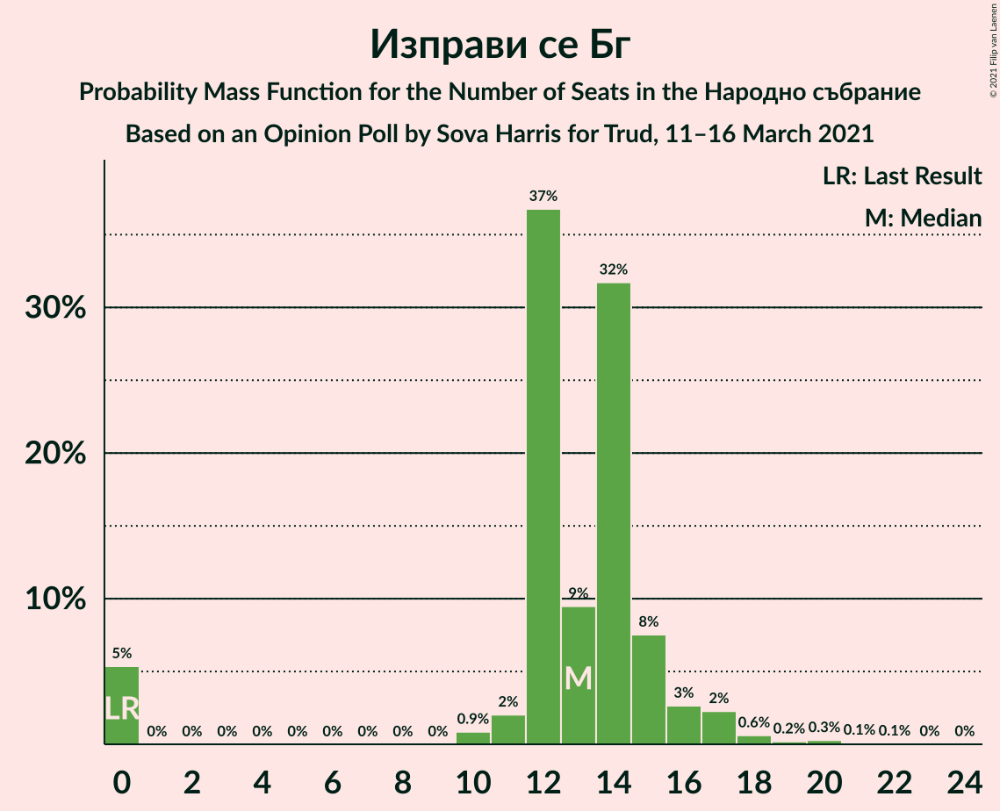

| Number of Seats | Probability | Accumulated | Special Marks |
|:---------------:|:-----------:|:-----------:|:-------------:|
| 0 | 5% | 100% | Last Result |
| 1 | 0% | 95% |  |
| 2 | 0% | 95% |  |
| 3 | 0% | 95% |  |
| 4 | 0% | 95% |  |
| 5 | 0% | 95% |  |
| 6 | 0% | 95% |  |
| 7 | 0% | 95% |  |
| 8 | 0% | 95% |  |
| 9 | 0% | 95% |  |
| 10 | 0.9% | 95% |  |
| 11 | 2% | 94% |  |
| 12 | 37% | 92% |  |
| 13 | 9% | 55% | Median |
| 14 | 32% | 45% |  |
| 15 | 8% | 14% |  |
| 16 | 3% | 6% |  |
| 17 | 2% | 4% |  |
| 18 | 0.6% | 1.3% |  |
| 19 | 0.2% | 0.7% |  |
| 20 | 0.3% | 0.5% |  |
| 21 | 0.1% | 0.2% |  |
| 22 | 0.1% | 0.1% |  |
| 23 | 0% | 0% |  |

### Воля–Национален фронт за спасение на България

*For a full overview of the results for this party, see the [Воля–Национален фронт за спасение на България](party-воля–националенфронтзаспасениенабългария.html) page.*

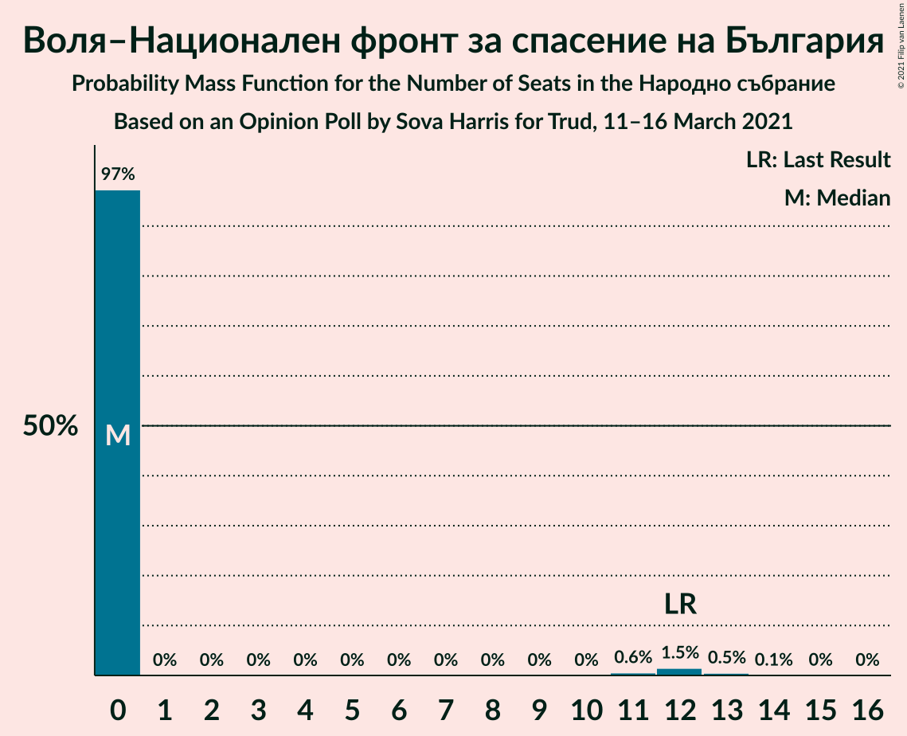

| Number of Seats | Probability | Accumulated | Special Marks |
|:---------------:|:-----------:|:-----------:|:-------------:|
| 0 | 97% | 100% | Median |
| 1 | 0% | 3% |  |
| 2 | 0% | 3% |  |
| 3 | 0% | 3% |  |
| 4 | 0% | 3% |  |
| 5 | 0% | 3% |  |
| 6 | 0% | 3% |  |
| 7 | 0% | 3% |  |
| 8 | 0% | 3% |  |
| 9 | 0% | 3% |  |
| 10 | 0% | 3% |  |
| 11 | 0.6% | 3% |  |
| 12 | 1.5% | 2% | Last Result |
| 13 | 0.5% | 0.6% |  |
| 14 | 0.1% | 0.1% |  |
| 15 | 0% | 0.1% |  |
| 16 | 0% | 0% |  |

### Републиканци за България

*For a full overview of the results for this party, see the [Републиканци за България](party-републиканцизабългария.html) page.*

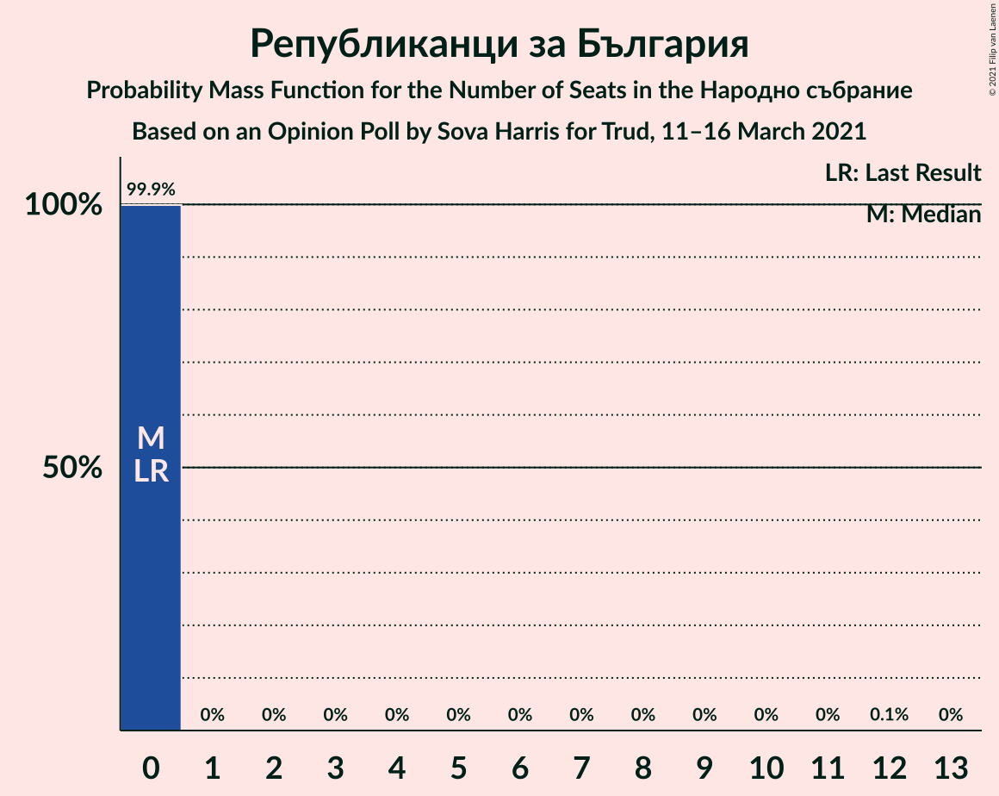

| Number of Seats | Probability | Accumulated | Special Marks |
|:---------------:|:-----------:|:-----------:|:-------------:|
| 0 | 99.9% | 100% | Last Result, Median |
| 1 | 0% | 0.1% |  |
| 2 | 0% | 0.1% |  |
| 3 | 0% | 0.1% |  |
| 4 | 0% | 0.1% |  |
| 5 | 0% | 0.1% |  |
| 6 | 0% | 0.1% |  |
| 7 | 0% | 0.1% |  |
| 8 | 0% | 0.1% |  |
| 9 | 0% | 0.1% |  |
| 10 | 0% | 0.1% |  |
| 11 | 0% | 0.1% |  |
| 12 | 0.1% | 0.1% |  |
| 13 | 0% | 0% |  |

### Алтернатива за българско възраждане

*For a full overview of the results for this party, see the [Алтернатива за българско възраждане](party-алтернативазабългарсковъзраждане.html) page.*

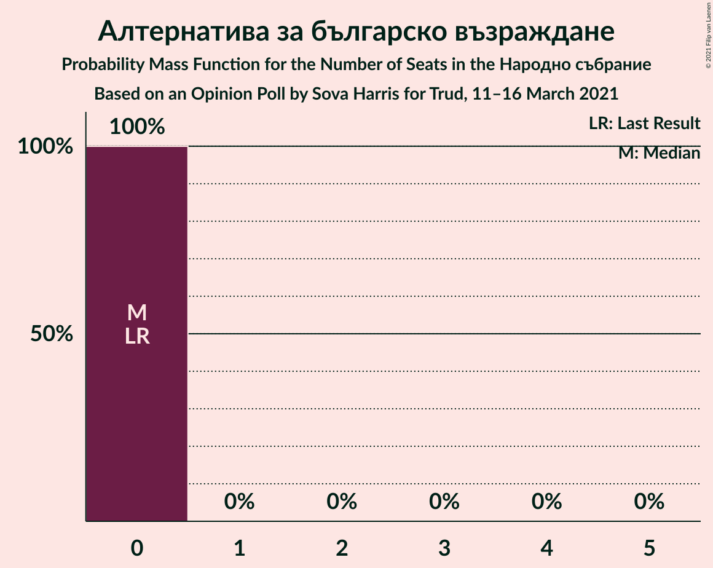

| Number of Seats | Probability | Accumulated | Special Marks |
|:---------------:|:-----------:|:-----------:|:-------------:|
| 0 | 100% | 100% | Last Result, Median |

### Възраждане

*For a full overview of the results for this party, see the [Възраждане](party-възраждане.html) page.*

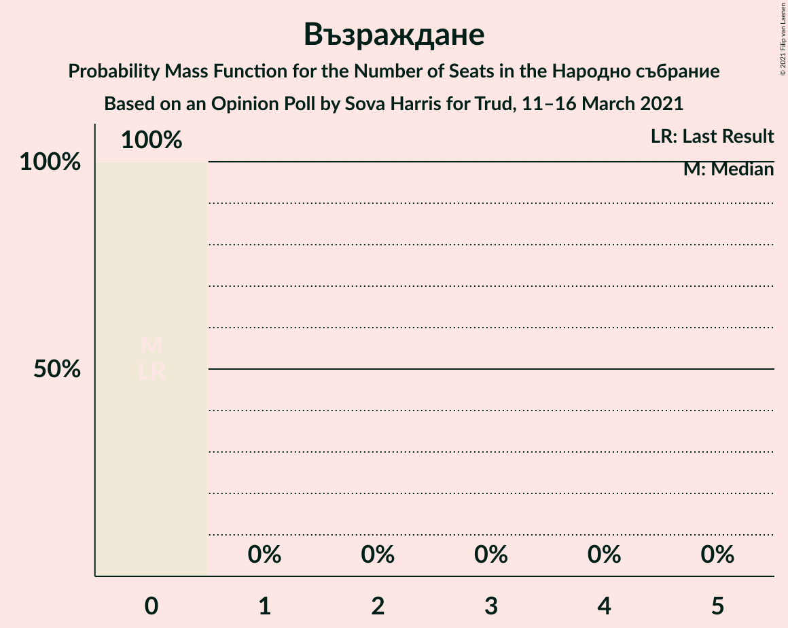

| Number of Seats | Probability | Accumulated | Special Marks |
|:---------------:|:-----------:|:-----------:|:-------------:|
| 0 | 100% | 100% | Last Result, Median |

### Атака

*For a full overview of the results for this party, see the [Атака](party-атака.html) page.*

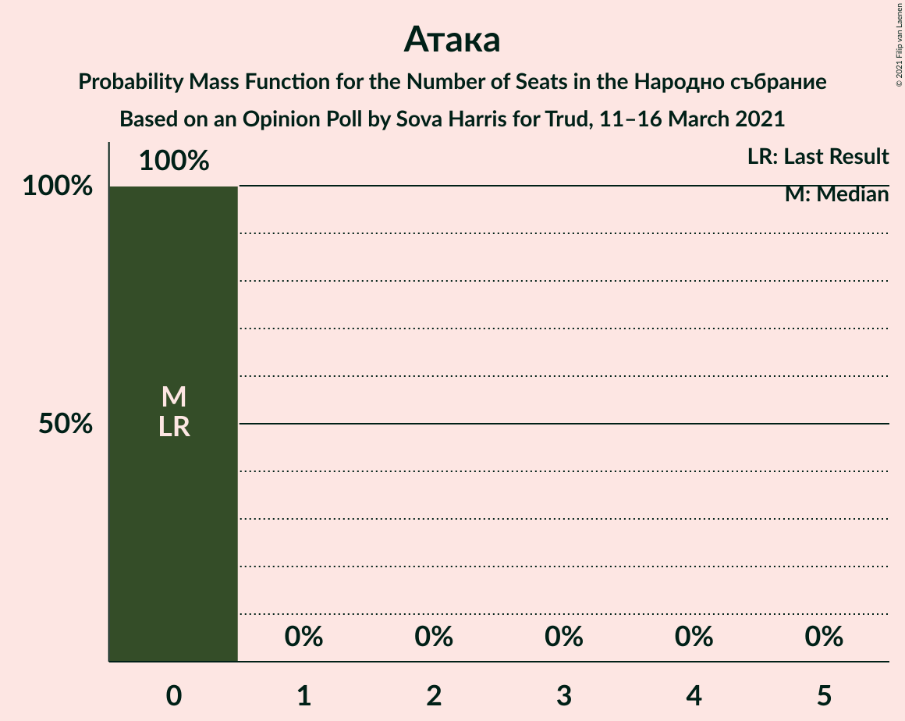

| Number of Seats | Probability | Accumulated | Special Marks |
|:---------------:|:-----------:|:-----------:|:-------------:|
| 0 | 100% | 100% | Last Result, Median |

## Coalitions

### Confidence Intervals

| Coalition | Last Result | Median | Majority? | 80% Confidence Interval | 90% Confidence Interval | 95% Confidence Interval | 99% Confidence Interval |
|:---------:|:-----------:|:------:|:---------:|:-----------------------:|:-----------------------:|:-----------------------:|:-----------------------:|
| Българска социалистическа партия – Има такъв народ – Движение за права и свободи – Изправи се Бг | 106 | 136 | 98.9% | 130–140 | 129–144 | 125–145 | 120–150 |
| Българска социалистическа партия – Има такъв народ – Движение за права и свободи | 106 | 123 | 86% | 118–129 | 116–132 | 113–136 | 108–143 |
| Българска социалистическа партия – Движение за права и свободи – Изправи се Бг | 106 | 103 | 0.5% | 100–111 | 97–114 | 94–115 | 86–120 |
| Българска социалистическа партия – Движение за права и свободи | 106 | 90 | 0% | 88–99 | 85–100 | 81–103 | 79–113 |
| Граждани за европейско развитие на България – Обединени Патриоти | 122 | 89 | 0% | 85–95 | 83–97 | 82–99 | 74–102 |

### Българска социалистическа партия – Има такъв народ – Движение за права и свободи – Изправи се Бг

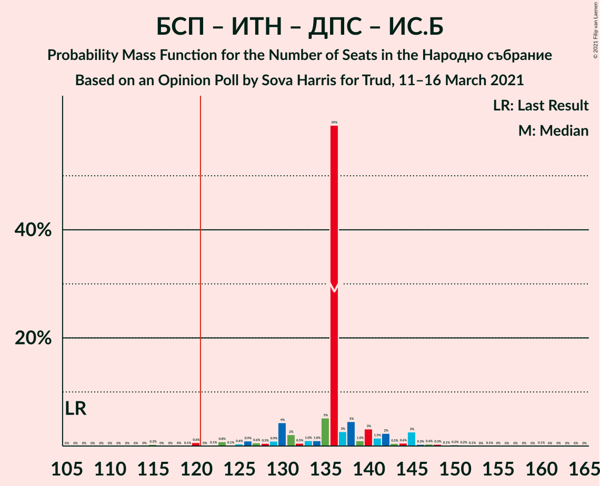

| Number of Seats | Probability | Accumulated | Special Marks |
|:---------------:|:-----------:|:-----------:|:-------------:|
| 106 | 0% | 100% | Last Result |
| 107 | 0% | 100% |  |
| 108 | 0% | 100% |  |
| 109 | 0% | 100% |  |
| 110 | 0% | 100% |  |
| 111 | 0% | 100% |  |
| 112 | 0% | 100% |  |
| 113 | 0% | 100% |  |
| 114 | 0% | 100% |  |
| 115 | 0.3% | 99.9% |  |
| 116 | 0% | 99.6% |  |
| 117 | 0% | 99.6% |  |
| 118 | 0% | 99.6% |  |
| 119 | 0.1% | 99.6% |  |
| 120 | 0.6% | 99.5% |  |
| 121 | 0% | 98.9% | Majority |
| 122 | 0.1% | 98.8% |  |
| 123 | 0.8% | 98.7% |  |
| 124 | 0.1% | 98% |  |
| 125 | 0.4% | 98% |  |
| 126 | 0.9% | 97% |  |
| 127 | 0.6% | 96% |  |
| 128 | 0.5% | 96% |  |
| 129 | 0.9% | 95% |  |
| 130 | 4% | 94% |  |
| 131 | 2% | 90% |  |
| 132 | 0.5% | 88% |  |
| 133 | 1.0% | 87% |  |
| 134 | 1.0% | 86% |  |
| 135 | 5% | 85% |  |
| 136 | 59% | 80% |  |
| 137 | 3% | 21% |  |
| 138 | 5% | 18% |  |
| 139 | 1.0% | 14% |  |
| 140 | 3% | 13% | Median |
| 141 | 1.5% | 9% |  |
| 142 | 2% | 8% |  |
| 143 | 0.5% | 6% |  |
| 144 | 0.6% | 5% |  |
| 145 | 3% | 4% |  |
| 146 | 0.3% | 2% |  |
| 147 | 0.4% | 2% |  |
| 148 | 0.3% | 1.2% |  |
| 149 | 0.1% | 0.8% |  |
| 150 | 0.2% | 0.7% |  |
| 151 | 0.2% | 0.5% |  |
| 152 | 0.1% | 0.3% |  |
| 153 | 0% | 0.2% |  |
| 154 | 0.1% | 0.2% |  |
| 155 | 0% | 0.2% |  |
| 156 | 0% | 0.1% |  |
| 157 | 0% | 0.1% |  |
| 158 | 0% | 0.1% |  |
| 159 | 0% | 0.1% |  |
| 160 | 0.1% | 0.1% |  |
| 161 | 0% | 0% |  |

### Българска социалистическа партия – Има такъв народ – Движение за права и свободи

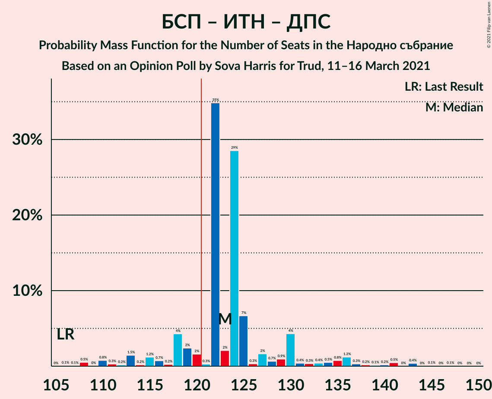

| Number of Seats | Probability | Accumulated | Special Marks |
|:---------------:|:-----------:|:-----------:|:-------------:|
| 105 | 0% | 100% |  |
| 106 | 0.1% | 99.9% | Last Result |
| 107 | 0.1% | 99.9% |  |
| 108 | 0.5% | 99.8% |  |
| 109 | 0% | 99.3% |  |
| 110 | 0.8% | 99.2% |  |
| 111 | 0.3% | 98% |  |
| 112 | 0.2% | 98% |  |
| 113 | 1.5% | 98% |  |
| 114 | 0.2% | 97% |  |
| 115 | 1.2% | 96% |  |
| 116 | 0.7% | 95% |  |
| 117 | 0.2% | 94% |  |
| 118 | 4% | 94% |  |
| 119 | 2% | 90% |  |
| 120 | 2% | 87% |  |
| 121 | 0.3% | 86% | Majority |
| 122 | 35% | 86% |  |
| 123 | 2% | 51% |  |
| 124 | 29% | 49% |  |
| 125 | 7% | 20% |  |
| 126 | 0.3% | 13% |  |
| 127 | 2% | 13% | Median |
| 128 | 0.7% | 11% |  |
| 129 | 0.9% | 11% |  |
| 130 | 4% | 10% |  |
| 131 | 0.4% | 6% |  |
| 132 | 0.3% | 5% |  |
| 133 | 0.4% | 5% |  |
| 134 | 0.5% | 4% |  |
| 135 | 0.8% | 4% |  |
| 136 | 1.2% | 3% |  |
| 137 | 0.3% | 2% |  |
| 138 | 0.2% | 2% |  |
| 139 | 0.1% | 1.4% |  |
| 140 | 0.2% | 1.3% |  |
| 141 | 0.5% | 1.1% |  |
| 142 | 0% | 0.6% |  |
| 143 | 0.4% | 0.6% |  |
| 144 | 0% | 0.2% |  |
| 145 | 0.1% | 0.2% |  |
| 146 | 0% | 0.1% |  |
| 147 | 0.1% | 0.1% |  |
| 148 | 0% | 0.1% |  |
| 149 | 0% | 0% |  |

### Българска социалистическа партия – Движение за права и свободи – Изправи се Бг

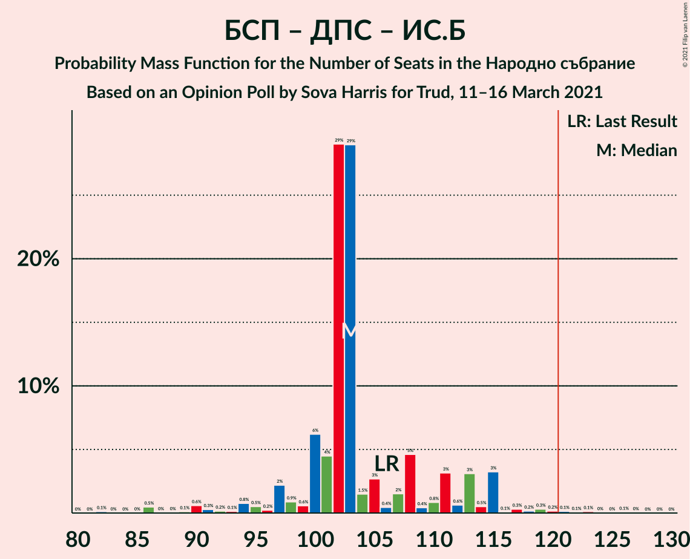

| Number of Seats | Probability | Accumulated | Special Marks |
|:---------------:|:-----------:|:-----------:|:-------------:|
| 82 | 0.1% | 100% |  |
| 83 | 0% | 99.9% |  |
| 84 | 0% | 99.8% |  |
| 85 | 0% | 99.8% |  |
| 86 | 0.5% | 99.8% |  |
| 87 | 0% | 99.3% |  |
| 88 | 0% | 99.3% |  |
| 89 | 0.1% | 99.3% |  |
| 90 | 0.6% | 99.2% |  |
| 91 | 0.3% | 98.6% |  |
| 92 | 0.2% | 98% |  |
| 93 | 0.1% | 98% |  |
| 94 | 0.8% | 98% |  |
| 95 | 0.5% | 97% |  |
| 96 | 0.2% | 97% |  |
| 97 | 2% | 96% |  |
| 98 | 0.9% | 94% |  |
| 99 | 0.6% | 93% |  |
| 100 | 6% | 93% |  |
| 101 | 4% | 87% |  |
| 102 | 29% | 82% |  |
| 103 | 29% | 53% |  |
| 104 | 1.5% | 24% |  |
| 105 | 3% | 23% |  |
| 106 | 0.4% | 20% | Last Result |
| 107 | 2% | 20% | Median |
| 108 | 5% | 18% |  |
| 109 | 0.4% | 13% |  |
| 110 | 0.8% | 13% |  |
| 111 | 3% | 12% |  |
| 112 | 0.6% | 9% |  |
| 113 | 3% | 8% |  |
| 114 | 0.5% | 5% |  |
| 115 | 3% | 5% |  |
| 116 | 0.1% | 1.5% |  |
| 117 | 0.3% | 1.4% |  |
| 118 | 0.2% | 1.1% |  |
| 119 | 0.3% | 0.9% |  |
| 120 | 0.2% | 0.6% |  |
| 121 | 0.1% | 0.5% | Majority |
| 122 | 0.1% | 0.3% |  |
| 123 | 0.1% | 0.3% |  |
| 124 | 0% | 0.2% |  |
| 125 | 0% | 0.1% |  |
| 126 | 0.1% | 0.1% |  |
| 127 | 0% | 0% |  |

### Българска социалистическа партия – Движение за права и свободи

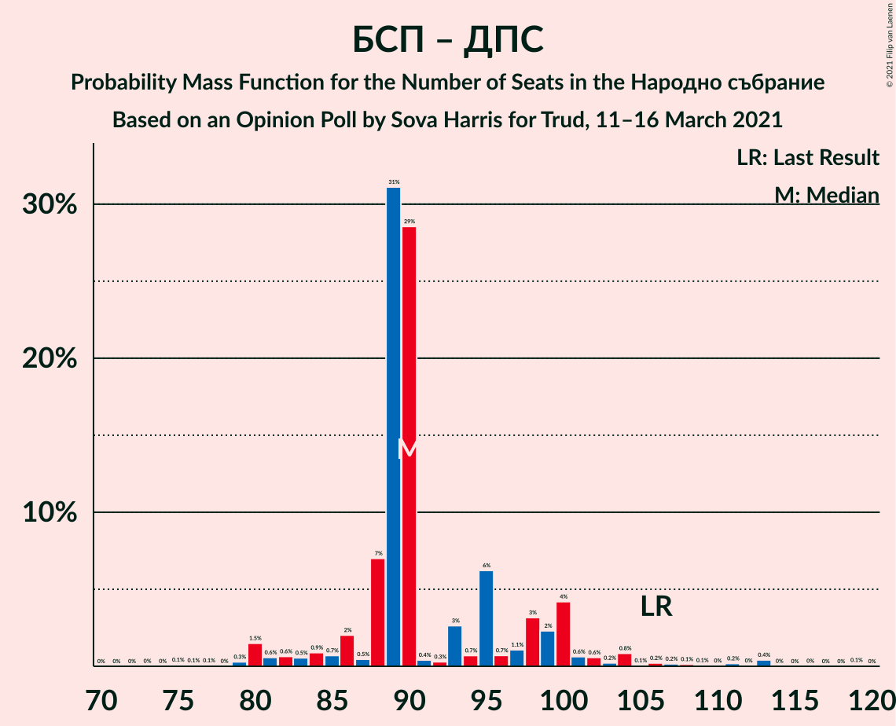

| Number of Seats | Probability | Accumulated | Special Marks |
|:---------------:|:-----------:|:-----------:|:-------------:|
| 75 | 0.1% | 100% |  |
| 76 | 0.1% | 99.9% |  |
| 77 | 0.1% | 99.8% |  |
| 78 | 0% | 99.7% |  |
| 79 | 0.3% | 99.7% |  |
| 80 | 1.5% | 99.4% |  |
| 81 | 0.6% | 98% |  |
| 82 | 0.6% | 97% |  |
| 83 | 0.5% | 97% |  |
| 84 | 0.9% | 96% |  |
| 85 | 0.7% | 95% |  |
| 86 | 2% | 95% |  |
| 87 | 0.5% | 93% |  |
| 88 | 7% | 92% |  |
| 89 | 31% | 85% |  |
| 90 | 29% | 54% |  |
| 91 | 0.4% | 25% |  |
| 92 | 0.3% | 25% |  |
| 93 | 3% | 25% |  |
| 94 | 0.7% | 22% | Median |
| 95 | 6% | 21% |  |
| 96 | 0.7% | 15% |  |
| 97 | 1.1% | 14% |  |
| 98 | 3% | 13% |  |
| 99 | 2% | 10% |  |
| 100 | 4% | 8% |  |
| 101 | 0.6% | 4% |  |
| 102 | 0.6% | 3% |  |
| 103 | 0.2% | 3% |  |
| 104 | 0.8% | 2% |  |
| 105 | 0.1% | 1.4% |  |
| 106 | 0.2% | 1.4% | Last Result |
| 107 | 0.2% | 1.2% |  |
| 108 | 0.1% | 1.0% |  |
| 109 | 0.1% | 0.9% |  |
| 110 | 0% | 0.8% |  |
| 111 | 0.2% | 0.8% |  |
| 112 | 0% | 0.6% |  |
| 113 | 0.4% | 0.5% |  |
| 114 | 0% | 0.1% |  |
| 115 | 0% | 0.1% |  |
| 116 | 0% | 0.1% |  |
| 117 | 0% | 0.1% |  |
| 118 | 0% | 0.1% |  |
| 119 | 0.1% | 0.1% |  |
| 120 | 0% | 0% |  |

### Граждани за европейско развитие на България – Обединени Патриоти

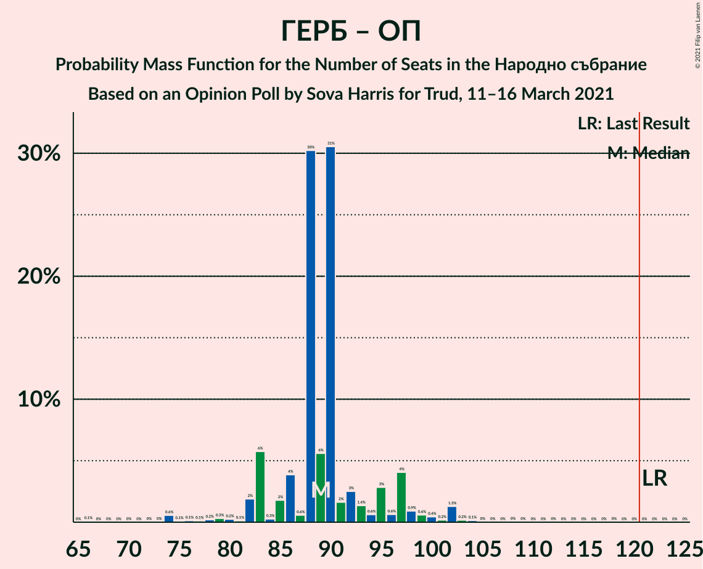

| Number of Seats | Probability | Accumulated | Special Marks |
|:---------------:|:-----------:|:-----------:|:-------------:|
| 66 | 0.1% | 100% |  |
| 67 | 0% | 99.9% |  |
| 68 | 0% | 99.9% |  |
| 69 | 0% | 99.9% |  |
| 70 | 0% | 99.9% |  |
| 71 | 0% | 99.9% |  |
| 72 | 0% | 99.9% |  |
| 73 | 0% | 99.9% |  |
| 74 | 0.6% | 99.8% |  |
| 75 | 0.1% | 99.3% |  |
| 76 | 0.1% | 99.2% |  |
| 77 | 0.1% | 99.0% |  |
| 78 | 0.2% | 98.9% |  |
| 79 | 0.3% | 98.7% |  |
| 80 | 0.2% | 98% |  |
| 81 | 0.1% | 98% |  |
| 82 | 2% | 98% |  |
| 83 | 6% | 96% |  |
| 84 | 0.3% | 90% |  |
| 85 | 2% | 90% |  |
| 86 | 4% | 88% |  |
| 87 | 0.6% | 84% |  |
| 88 | 30% | 84% |  |
| 89 | 6% | 54% |  |
| 90 | 31% | 48% | Median |
| 91 | 2% | 18% |  |
| 92 | 3% | 16% |  |
| 93 | 1.4% | 13% |  |
| 94 | 0.6% | 12% |  |
| 95 | 3% | 11% |  |
| 96 | 0.6% | 9% |  |
| 97 | 4% | 8% |  |
| 98 | 0.9% | 4% |  |
| 99 | 0.6% | 3% |  |
| 100 | 0.4% | 2% |  |
| 101 | 0.2% | 2% |  |
| 102 | 1.3% | 2% |  |
| 103 | 0.2% | 0.5% |  |
| 104 | 0.1% | 0.3% |  |
| 105 | 0% | 0.2% |  |
| 106 | 0% | 0.1% |  |
| 107 | 0% | 0.1% |  |
| 108 | 0% | 0.1% |  |
| 109 | 0% | 0.1% |  |
| 110 | 0% | 0.1% |  |
| 111 | 0% | 0.1% |  |
| 112 | 0% | 0.1% |  |
| 113 | 0% | 0% |  |
| 114 | 0% | 0% |  |
| 115 | 0% | 0% |  |
| 116 | 0% | 0% |  |
| 117 | 0% | 0% |  |
| 118 | 0% | 0% |  |
| 119 | 0% | 0% |  |
| 120 | 0% | 0% |  |
| 121 | 0% | 0% | Majority |
| 122 | 0% | 0% | Last Result |

## Technical Information

### Opinion Poll

+ **Polling firm:** Sova Harris
+ **Commissioner(s):** Trud
+ **Fieldwork period:** 11–16 March 2021

### Calculations

+ **Sample size:** 430
+ **Simulations done:** 1,048,576
+ **Error estimate:** 2.21%

