# Opinion Poll by Маркет ЛИНКС for bTV, 18–23 March 2021

<a href="#voting-intentions">Voting Intentions</a> | <a href="#seats">Seats</a> | <a href="#coalitions">Coalitions</a> | <a href="#technical-information">Technical Information</a>

## Voting Intentions

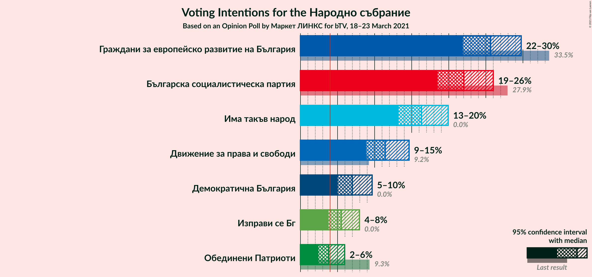

### Confidence Intervals

| Party | Last Result | Poll Result | 80% Confidence Interval | 90% Confidence Interval | 95% Confidence Interval | 99% Confidence Interval |
|:-----:|:-----------:|:-----------:|:-----------------------:|:-----------------------:|:-----------------------:|:-----------------------:|
| Граждани за европейско развитие на България | 33.5% | 25.6% | 23.2–28.3% |22.5–29.1% |21.9–29.8% |20.8–31.1% |
| Българска социалистическа партия | 27.9% | 22.0% | 19.7–24.6% |19.1–25.4% |18.5–26.0% |17.5–27.3% |
| Има такъв народ | 0.0% | 16.3% | 14.3–18.7% |13.7–19.3% |13.2–19.9% |12.3–21.1% |
| Движение за права и свободи | 9.2% | 11.4% | 9.8–13.5% |9.3–14.1% |8.9–14.6% |8.1–15.7% |
| Демократична България | 0.0% | 7.0% | 5.7–8.7% |5.3–9.2% |5.0–9.7% |4.5–10.6% |
| Изправи се Бг | 0.0% | 5.5% | 4.4–7.1% |4.1–7.6% |3.8–8.0% |3.3–8.8% |
| Обединени Патриоти | 9.3% | 3.8% | 2.9–5.2% |2.6–5.6% |2.4–6.0% |2.0–6.7% |

*Note:* The poll result column reflects the actual value used in the calculations. Published results may vary slightly, and in addition be rounded to fewer digits.

## Seats

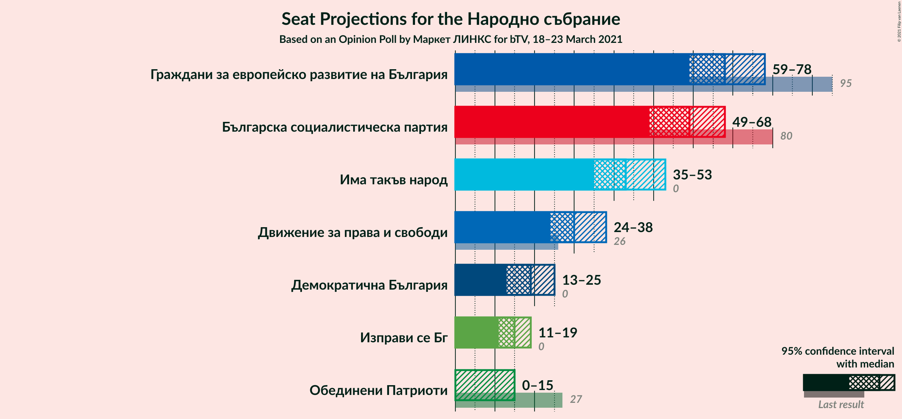

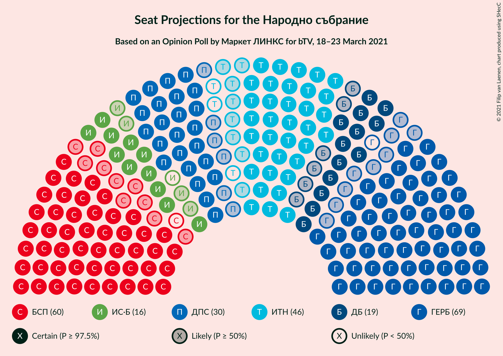

### Confidence Intervals

| Party | Last Result | Median | 80% Confidence Interval | 90% Confidence Interval | 95% Confidence Interval | 99% Confidence Interval |
|:-----:|:-----------:|:------:|:-----------------------:|:-----------------------:|:-----------------------:|:-----------------------:|
| <a href="#граждани-за-европейско-развитие-на-българия">Граждани за европейско развитие на България</a> | 95 | 68 | 62–75 |60–77 |59–78 |56–82 |
| <a href="#българска-социалистическа-партия">Българска социалистическа партия</a> | 80 | 59 | 52–65 |50–66 |49–68 |46–71 |
| <a href="#има-такъв-народ">Има такъв народ</a> | 0 | 43 | 38–50 |36–52 |35–53 |32–56 |
| <a href="#движение-за-права-и-свободи">Движение за права и свободи</a> | 26 | 30 | 26–35 |25–37 |24–38 |22–41 |
| <a href="#демократична-българия">Демократична България</a> | 0 | 19 | 15–23 |14–24 |13–25 |12–27 |
| <a href="#изправи-се-бг">Изправи се Бг</a> | 0 | 15 | 12–18 |12–19 |11–19 |0–22 |
| <a href="#обединени-патриоти">Обединени Патриоти</a> | 27 | 0 | 0–13 |0–14 |0–15 |0–17 |

### Граждани за европейско развитие на България

*For a full overview of the results for this party, see the [Граждани за европейско развитие на България](party-гражданизаевропейскоразвитиенабългария.html) page.*

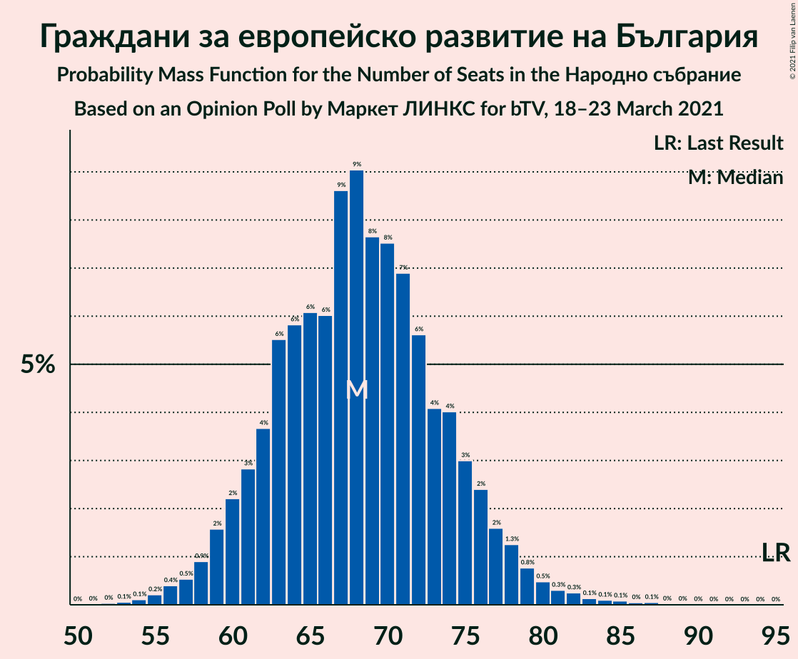

| Number of Seats | Probability | Accumulated | Special Marks |
|:---------------:|:-----------:|:-----------:|:-------------:|
| 52 | 0% | 100% |  |
| 53 | 0.1% | 99.9% |  |
| 54 | 0.1% | 99.9% |  |
| 55 | 0.2% | 99.8% |  |
| 56 | 0.4% | 99.6% |  |
| 57 | 0.5% | 99.2% |  |
| 58 | 0.9% | 98.6% |  |
| 59 | 2% | 98% |  |
| 60 | 2% | 96% |  |
| 61 | 3% | 94% |  |
| 62 | 4% | 91% |  |
| 63 | 6% | 87% |  |
| 64 | 6% | 82% |  |
| 65 | 6% | 76% |  |
| 66 | 6% | 70% |  |
| 67 | 9% | 64% |  |
| 68 | 9% | 55% | Median |
| 69 | 8% | 46% |  |
| 70 | 8% | 39% |  |
| 71 | 7% | 31% |  |
| 72 | 6% | 24% |  |
| 73 | 4% | 19% |  |
| 74 | 4% | 15% |  |
| 75 | 3% | 11% |  |
| 76 | 2% | 8% |  |
| 77 | 2% | 5% |  |
| 78 | 1.3% | 4% |  |
| 79 | 0.8% | 2% |  |
| 80 | 0.5% | 2% |  |
| 81 | 0.3% | 1.0% |  |
| 82 | 0.3% | 0.7% |  |
| 83 | 0.1% | 0.5% |  |
| 84 | 0.1% | 0.3% |  |
| 85 | 0.1% | 0.2% |  |
| 86 | 0% | 0.1% |  |
| 87 | 0.1% | 0.1% |  |
| 88 | 0% | 0% |  |
| 89 | 0% | 0% |  |
| 90 | 0% | 0% |  |
| 91 | 0% | 0% |  |
| 92 | 0% | 0% |  |
| 93 | 0% | 0% |  |
| 94 | 0% | 0% |  |
| 95 | 0% | 0% | Last Result |

### Българска социалистическа партия

*For a full overview of the results for this party, see the [Българска социалистическа партия](party-българскасоциалистическапартия.html) page.*

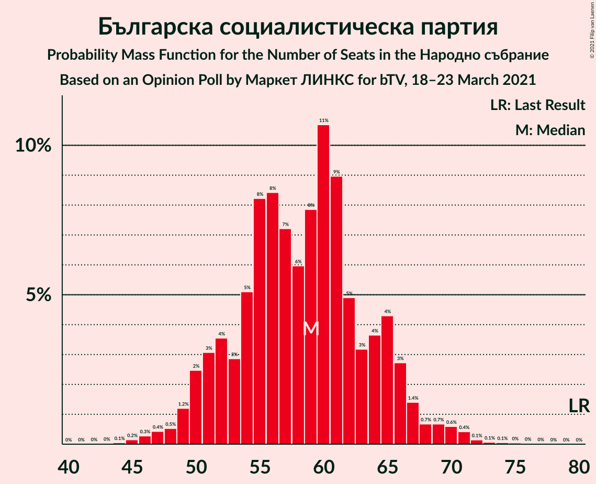

| Number of Seats | Probability | Accumulated | Special Marks |
|:---------------:|:-----------:|:-----------:|:-------------:|
| 44 | 0.1% | 100% |  |
| 45 | 0.2% | 99.9% |  |
| 46 | 0.3% | 99.7% |  |
| 47 | 0.4% | 99.5% |  |
| 48 | 0.5% | 99.0% |  |
| 49 | 1.2% | 98.5% |  |
| 50 | 2% | 97% |  |
| 51 | 3% | 95% |  |
| 52 | 4% | 92% |  |
| 53 | 3% | 88% |  |
| 54 | 5% | 85% |  |
| 55 | 8% | 80% |  |
| 56 | 8% | 72% |  |
| 57 | 7% | 64% |  |
| 58 | 6% | 56% |  |
| 59 | 8% | 50% | Median |
| 60 | 11% | 43% |  |
| 61 | 9% | 32% |  |
| 62 | 5% | 23% |  |
| 63 | 3% | 18% |  |
| 64 | 4% | 15% |  |
| 65 | 4% | 11% |  |
| 66 | 3% | 7% |  |
| 67 | 1.4% | 4% |  |
| 68 | 0.7% | 3% |  |
| 69 | 0.7% | 2% |  |
| 70 | 0.6% | 1.4% |  |
| 71 | 0.4% | 0.8% |  |
| 72 | 0.1% | 0.4% |  |
| 73 | 0.1% | 0.2% |  |
| 74 | 0.1% | 0.2% |  |
| 75 | 0% | 0.1% |  |
| 76 | 0% | 0.1% |  |
| 77 | 0% | 0% |  |
| 78 | 0% | 0% |  |
| 79 | 0% | 0% |  |
| 80 | 0% | 0% | Last Result |

### Има такъв народ

*For a full overview of the results for this party, see the [Има такъв народ](party-иматакъвнарод.html) page.*

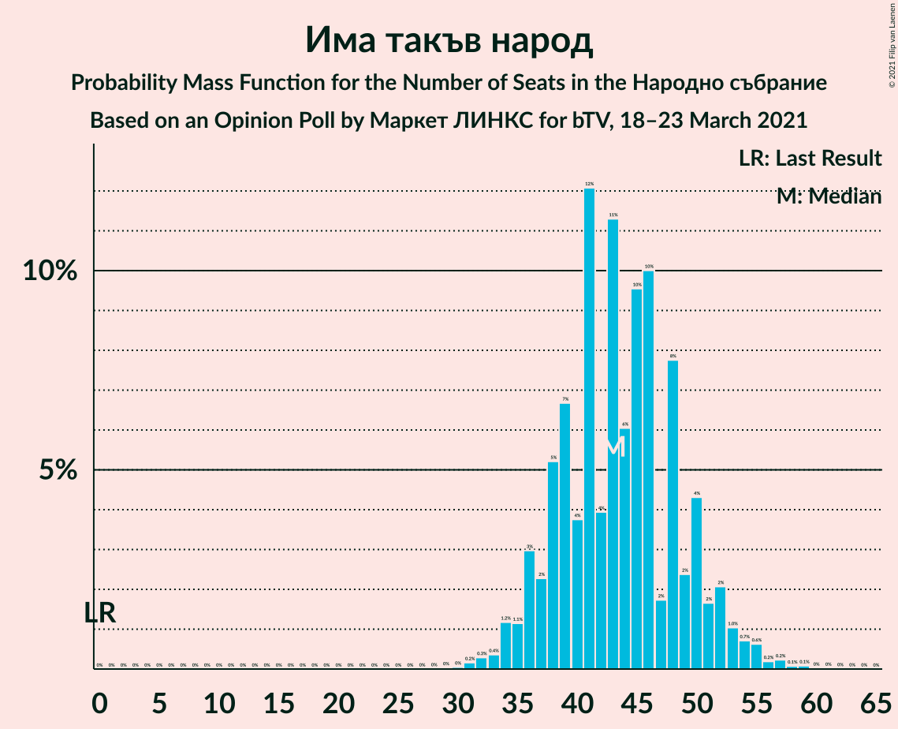

| Number of Seats | Probability | Accumulated | Special Marks |
|:---------------:|:-----------:|:-----------:|:-------------:|
| 0 | 0% | 100% | Last Result |
| 1 | 0% | 100% |  |
| 2 | 0% | 100% |  |
| 3 | 0% | 100% |  |
| 4 | 0% | 100% |  |
| 5 | 0% | 100% |  |
| 6 | 0% | 100% |  |
| 7 | 0% | 100% |  |
| 8 | 0% | 100% |  |
| 9 | 0% | 100% |  |
| 10 | 0% | 100% |  |
| 11 | 0% | 100% |  |
| 12 | 0% | 100% |  |
| 13 | 0% | 100% |  |
| 14 | 0% | 100% |  |
| 15 | 0% | 100% |  |
| 16 | 0% | 100% |  |
| 17 | 0% | 100% |  |
| 18 | 0% | 100% |  |
| 19 | 0% | 100% |  |
| 20 | 0% | 100% |  |
| 21 | 0% | 100% |  |
| 22 | 0% | 100% |  |
| 23 | 0% | 100% |  |
| 24 | 0% | 100% |  |
| 25 | 0% | 100% |  |
| 26 | 0% | 100% |  |
| 27 | 0% | 100% |  |
| 28 | 0% | 100% |  |
| 29 | 0% | 100% |  |
| 30 | 0% | 100% |  |
| 31 | 0.2% | 99.9% |  |
| 32 | 0.3% | 99.7% |  |
| 33 | 0.4% | 99.5% |  |
| 34 | 1.2% | 99.1% |  |
| 35 | 1.1% | 98% |  |
| 36 | 3% | 97% |  |
| 37 | 2% | 94% |  |
| 38 | 5% | 92% |  |
| 39 | 7% | 86% |  |
| 40 | 4% | 80% |  |
| 41 | 12% | 76% |  |
| 42 | 4% | 64% |  |
| 43 | 11% | 60% | Median |
| 44 | 6% | 49% |  |
| 45 | 10% | 42% |  |
| 46 | 10% | 33% |  |
| 47 | 2% | 23% |  |
| 48 | 8% | 21% |  |
| 49 | 2% | 13% |  |
| 50 | 4% | 11% |  |
| 51 | 2% | 7% |  |
| 52 | 2% | 5% |  |
| 53 | 1.0% | 3% |  |
| 54 | 0.7% | 2% |  |
| 55 | 0.6% | 1.3% |  |
| 56 | 0.2% | 0.6% |  |
| 57 | 0.2% | 0.5% |  |
| 58 | 0.1% | 0.2% |  |
| 59 | 0.1% | 0.1% |  |
| 60 | 0% | 0.1% |  |
| 61 | 0% | 0% |  |

### Движение за права и свободи

*For a full overview of the results for this party, see the [Движение за права и свободи](party-движениезаправаисвободи.html) page.*

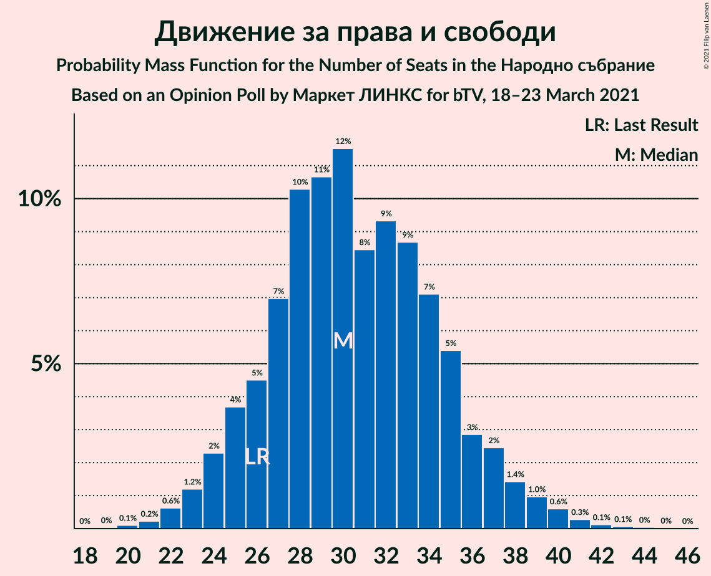

| Number of Seats | Probability | Accumulated | Special Marks |
|:---------------:|:-----------:|:-----------:|:-------------:|
| 20 | 0.1% | 100% |  |
| 21 | 0.2% | 99.9% |  |
| 22 | 0.6% | 99.6% |  |
| 23 | 1.2% | 99.0% |  |
| 24 | 2% | 98% |  |
| 25 | 4% | 96% |  |
| 26 | 5% | 92% | Last Result |
| 27 | 7% | 87% |  |
| 28 | 10% | 80% |  |
| 29 | 11% | 70% |  |
| 30 | 12% | 59% | Median |
| 31 | 8% | 48% |  |
| 32 | 9% | 39% |  |
| 33 | 9% | 30% |  |
| 34 | 7% | 21% |  |
| 35 | 5% | 14% |  |
| 36 | 3% | 9% |  |
| 37 | 2% | 6% |  |
| 38 | 1.4% | 4% |  |
| 39 | 1.0% | 2% |  |
| 40 | 0.6% | 1.2% |  |
| 41 | 0.3% | 0.6% |  |
| 42 | 0.1% | 0.3% |  |
| 43 | 0.1% | 0.1% |  |
| 44 | 0% | 0.1% |  |
| 45 | 0% | 0% |  |

### Демократична България

*For a full overview of the results for this party, see the [Демократична България](party-демократичнабългария.html) page.*

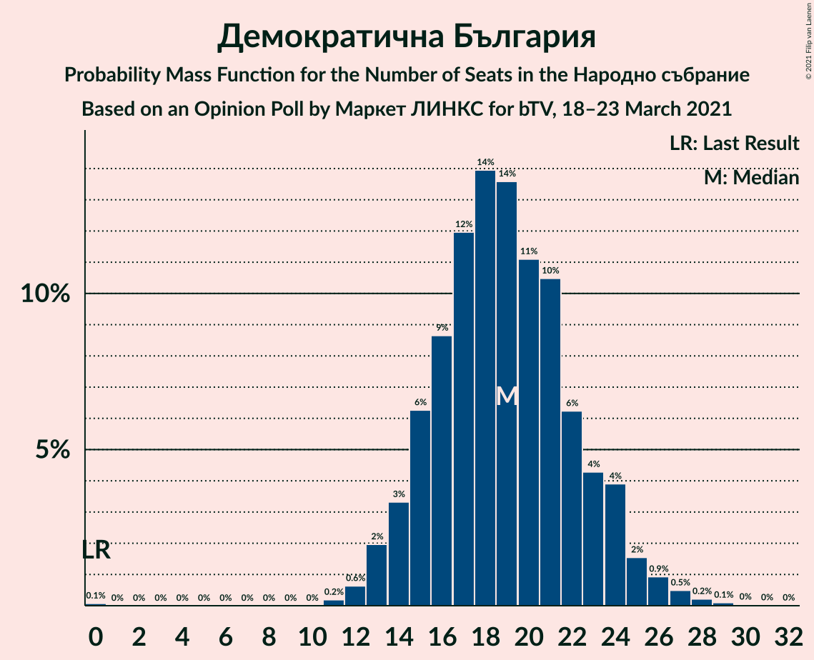

| Number of Seats | Probability | Accumulated | Special Marks |
|:---------------:|:-----------:|:-----------:|:-------------:|
| 0 | 0.1% | 100% | Last Result |
| 1 | 0% | 99.9% |  |
| 2 | 0% | 99.9% |  |
| 3 | 0% | 99.9% |  |
| 4 | 0% | 99.9% |  |
| 5 | 0% | 99.9% |  |
| 6 | 0% | 99.9% |  |
| 7 | 0% | 99.9% |  |
| 8 | 0% | 99.9% |  |
| 9 | 0% | 99.9% |  |
| 10 | 0% | 99.9% |  |
| 11 | 0.2% | 99.9% |  |
| 12 | 0.6% | 99.7% |  |
| 13 | 2% | 99.1% |  |
| 14 | 3% | 97% |  |
| 15 | 6% | 94% |  |
| 16 | 9% | 88% |  |
| 17 | 12% | 79% |  |
| 18 | 14% | 67% |  |
| 19 | 14% | 53% | Median |
| 20 | 11% | 39% |  |
| 21 | 10% | 28% |  |
| 22 | 6% | 18% |  |
| 23 | 4% | 12% |  |
| 24 | 4% | 7% |  |
| 25 | 2% | 3% |  |
| 26 | 0.9% | 2% |  |
| 27 | 0.5% | 0.9% |  |
| 28 | 0.2% | 0.4% |  |
| 29 | 0.1% | 0.2% |  |
| 30 | 0% | 0.1% |  |
| 31 | 0% | 0% |  |

### Изправи се Бг

*For a full overview of the results for this party, see the [Изправи се Бг](party-изправисебг.html) page.*

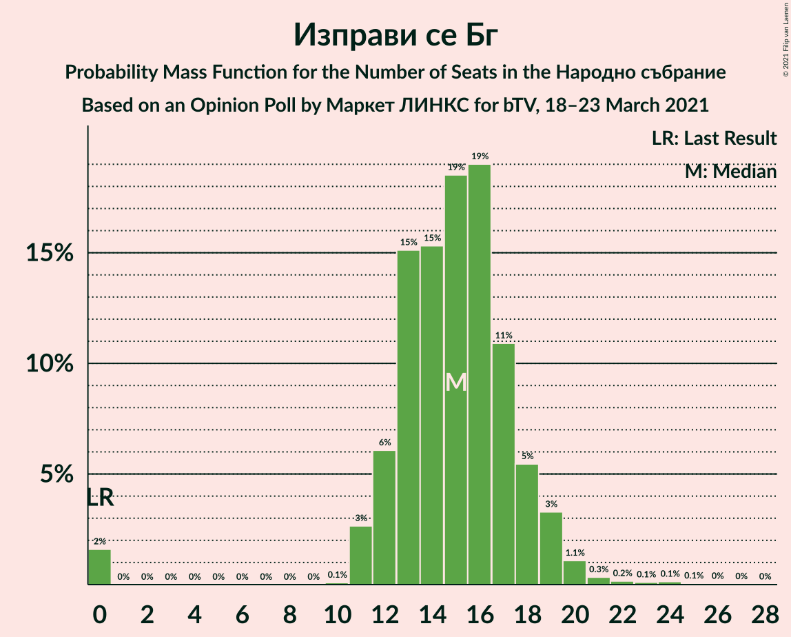

| Number of Seats | Probability | Accumulated | Special Marks |
|:---------------:|:-----------:|:-----------:|:-------------:|
| 0 | 2% | 100% | Last Result |
| 1 | 0% | 98% |  |
| 2 | 0% | 98% |  |
| 3 | 0% | 98% |  |
| 4 | 0% | 98% |  |
| 5 | 0% | 98% |  |
| 6 | 0% | 98% |  |
| 7 | 0% | 98% |  |
| 8 | 0% | 98% |  |
| 9 | 0% | 98% |  |
| 10 | 0.1% | 98% |  |
| 11 | 3% | 98% |  |
| 12 | 6% | 96% |  |
| 13 | 15% | 90% |  |
| 14 | 15% | 74% |  |
| 15 | 19% | 59% | Median |
| 16 | 19% | 41% |  |
| 17 | 11% | 22% |  |
| 18 | 5% | 11% |  |
| 19 | 3% | 5% |  |
| 20 | 1.1% | 2% |  |
| 21 | 0.3% | 0.9% |  |
| 22 | 0.2% | 0.5% |  |
| 23 | 0.1% | 0.4% |  |
| 24 | 0.1% | 0.3% |  |
| 25 | 0.1% | 0.1% |  |
| 26 | 0% | 0.1% |  |
| 27 | 0% | 0% |  |

### Обединени Патриоти

*For a full overview of the results for this party, see the [Обединени Патриоти](party-обединенипатриоти.html) page.*

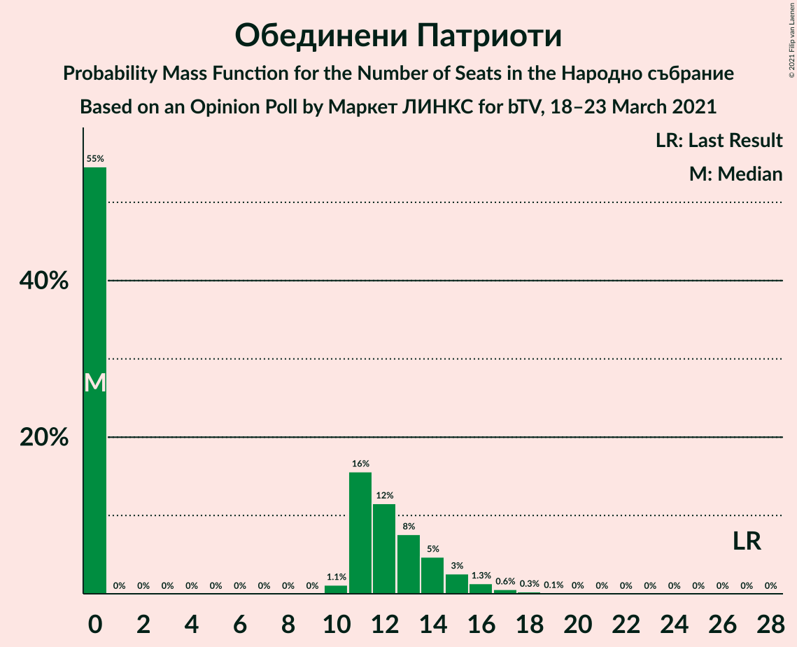

| Number of Seats | Probability | Accumulated | Special Marks |
|:---------------:|:-----------:|:-----------:|:-------------:|
| 0 | 55% | 100% | Median |
| 1 | 0% | 45% |  |
| 2 | 0% | 45% |  |
| 3 | 0% | 45% |  |
| 4 | 0% | 45% |  |
| 5 | 0% | 45% |  |
| 6 | 0% | 45% |  |
| 7 | 0% | 45% |  |
| 8 | 0% | 45% |  |
| 9 | 0% | 45% |  |
| 10 | 1.1% | 45% |  |
| 11 | 16% | 44% |  |
| 12 | 12% | 29% |  |
| 13 | 8% | 17% |  |
| 14 | 5% | 10% |  |
| 15 | 3% | 5% |  |
| 16 | 1.3% | 2% |  |
| 17 | 0.6% | 1.0% |  |
| 18 | 0.3% | 0.4% |  |
| 19 | 0.1% | 0.2% |  |
| 20 | 0% | 0.1% |  |
| 21 | 0% | 0% |  |
| 22 | 0% | 0% |  |
| 23 | 0% | 0% |  |
| 24 | 0% | 0% |  |
| 25 | 0% | 0% |  |
| 26 | 0% | 0% |  |
| 27 | 0% | 0% | Last Result |

## Coalitions

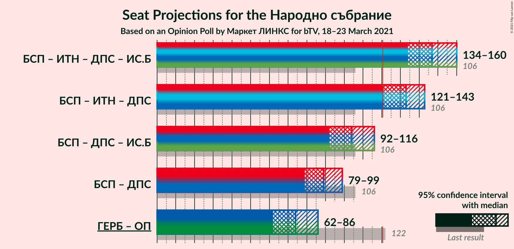

### Confidence Intervals

| Coalition | Last Result | Median | Majority? | 80% Confidence Interval | 90% Confidence Interval | 95% Confidence Interval | 99% Confidence Interval |
|:---------:|:-----------:|:------:|:---------:|:-----------------------:|:-----------------------:|:-----------------------:|:-----------------------:|
| Българска социалистическа партия – Има такъв народ – Движение за права и свободи – Изправи се Бг | 106 | 147 | 100% | 139–156 | 136–158 | 134–160 | 129–164 |
| Българска социалистическа партия – Има такъв народ – Движение за права и свободи | 106 | 133 | 98% | 125–140 | 123–142 | 121–143 | 118–147 |
| Българска социалистическа партия – Движение за права и свободи – Изправи се Бг | 106 | 104 | 0.4% | 95–112 | 93–114 | 92–116 | 85–120 |
| Българска социалистическа партия – Движение за права и свободи | 106 | 89 | 0% | 82–95 | 81–97 | 79–99 | 76–102 |
| Граждани за европейско развитие на България – Обединени Патриоти | 122 | 74 | 0% | 65–82 | 64–84 | 62–86 | 59–91 |

### Българска социалистическа партия – Има такъв народ – Движение за права и свободи – Изправи се Бг

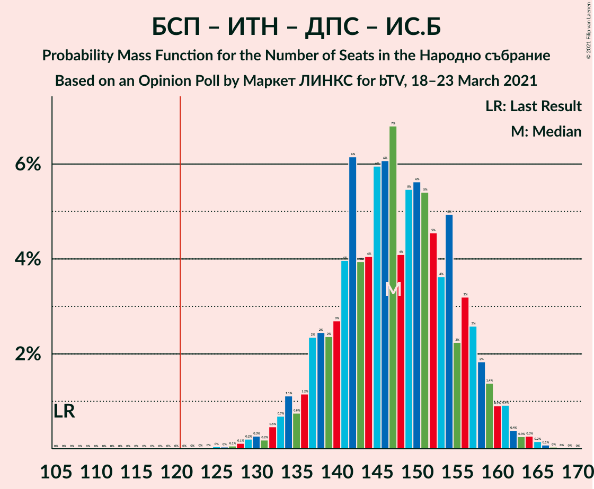

| Number of Seats | Probability | Accumulated | Special Marks |
|:---------------:|:-----------:|:-----------:|:-------------:|
| 106 | 0% | 100% | Last Result |
| 107 | 0% | 100% |  |
| 108 | 0% | 100% |  |
| 109 | 0% | 100% |  |
| 110 | 0% | 100% |  |
| 111 | 0% | 100% |  |
| 112 | 0% | 100% |  |
| 113 | 0% | 100% |  |
| 114 | 0% | 100% |  |
| 115 | 0% | 100% |  |
| 116 | 0% | 100% |  |
| 117 | 0% | 100% |  |
| 118 | 0% | 100% |  |
| 119 | 0% | 100% |  |
| 120 | 0% | 100% |  |
| 121 | 0% | 100% | Majority |
| 122 | 0% | 100% |  |
| 123 | 0% | 100% |  |
| 124 | 0% | 100% |  |
| 125 | 0% | 99.9% |  |
| 126 | 0% | 99.9% |  |
| 127 | 0.1% | 99.9% |  |
| 128 | 0.1% | 99.8% |  |
| 129 | 0.2% | 99.7% |  |
| 130 | 0.3% | 99.5% |  |
| 131 | 0.2% | 99.2% |  |
| 132 | 0.5% | 99.0% |  |
| 133 | 0.7% | 98.6% |  |
| 134 | 1.1% | 98% |  |
| 135 | 0.8% | 97% |  |
| 136 | 1.2% | 96% |  |
| 137 | 2% | 95% |  |
| 138 | 2% | 92% |  |
| 139 | 2% | 90% |  |
| 140 | 3% | 88% |  |
| 141 | 4% | 85% |  |
| 142 | 6% | 81% |  |
| 143 | 4% | 75% |  |
| 144 | 4% | 71% |  |
| 145 | 6% | 67% |  |
| 146 | 6% | 61% |  |
| 147 | 7% | 55% | Median |
| 148 | 4% | 48% |  |
| 149 | 5% | 44% |  |
| 150 | 6% | 38% |  |
| 151 | 5% | 33% |  |
| 152 | 5% | 27% |  |
| 153 | 4% | 23% |  |
| 154 | 5% | 19% |  |
| 155 | 2% | 14% |  |
| 156 | 3% | 12% |  |
| 157 | 3% | 9% |  |
| 158 | 2% | 6% |  |
| 159 | 1.4% | 4% |  |
| 160 | 0.9% | 3% |  |
| 161 | 0.9% | 2% |  |
| 162 | 0.4% | 1.2% |  |
| 163 | 0.3% | 0.9% |  |
| 164 | 0.3% | 0.6% |  |
| 165 | 0.2% | 0.3% |  |
| 166 | 0.1% | 0.2% |  |
| 167 | 0% | 0.1% |  |
| 168 | 0% | 0.1% |  |
| 169 | 0% | 0% |  |

### Българска социалистическа партия – Има такъв народ – Движение за права и свободи

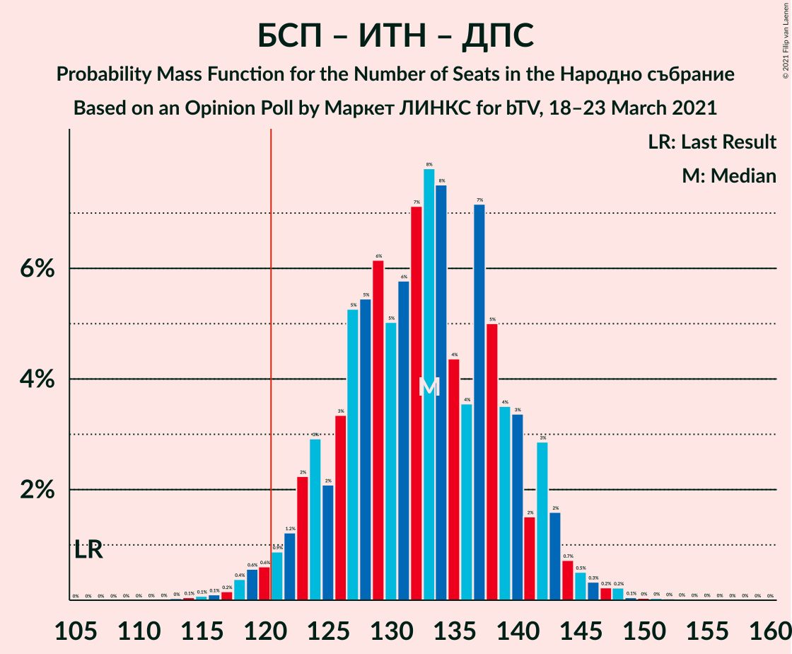

| Number of Seats | Probability | Accumulated | Special Marks |
|:---------------:|:-----------:|:-----------:|:-------------:|
| 106 | 0% | 100% | Last Result |
| 107 | 0% | 100% |  |
| 108 | 0% | 100% |  |
| 109 | 0% | 100% |  |
| 110 | 0% | 100% |  |
| 111 | 0% | 100% |  |
| 112 | 0% | 100% |  |
| 113 | 0% | 100% |  |
| 114 | 0.1% | 99.9% |  |
| 115 | 0.1% | 99.9% |  |
| 116 | 0.1% | 99.8% |  |
| 117 | 0.2% | 99.7% |  |
| 118 | 0.4% | 99.5% |  |
| 119 | 0.6% | 99.2% |  |
| 120 | 0.6% | 98.6% |  |
| 121 | 0.9% | 98% | Majority |
| 122 | 1.2% | 97% |  |
| 123 | 2% | 96% |  |
| 124 | 3% | 94% |  |
| 125 | 2% | 91% |  |
| 126 | 3% | 89% |  |
| 127 | 5% | 85% |  |
| 128 | 5% | 80% |  |
| 129 | 6% | 75% |  |
| 130 | 5% | 68% |  |
| 131 | 6% | 63% |  |
| 132 | 7% | 58% | Median |
| 133 | 8% | 51% |  |
| 134 | 8% | 43% |  |
| 135 | 4% | 35% |  |
| 136 | 4% | 31% |  |
| 137 | 7% | 27% |  |
| 138 | 5% | 20% |  |
| 139 | 4% | 15% |  |
| 140 | 3% | 12% |  |
| 141 | 2% | 8% |  |
| 142 | 3% | 7% |  |
| 143 | 2% | 4% |  |
| 144 | 0.7% | 2% |  |
| 145 | 0.5% | 2% |  |
| 146 | 0.3% | 1.0% |  |
| 147 | 0.2% | 0.7% |  |
| 148 | 0.2% | 0.5% |  |
| 149 | 0.1% | 0.2% |  |
| 150 | 0% | 0.2% |  |
| 151 | 0% | 0.2% |  |
| 152 | 0% | 0.1% |  |
| 153 | 0% | 0.1% |  |
| 154 | 0% | 0.1% |  |
| 155 | 0% | 0.1% |  |
| 156 | 0% | 0% |  |

### Българска социалистическа партия – Движение за права и свободи – Изправи се Бг

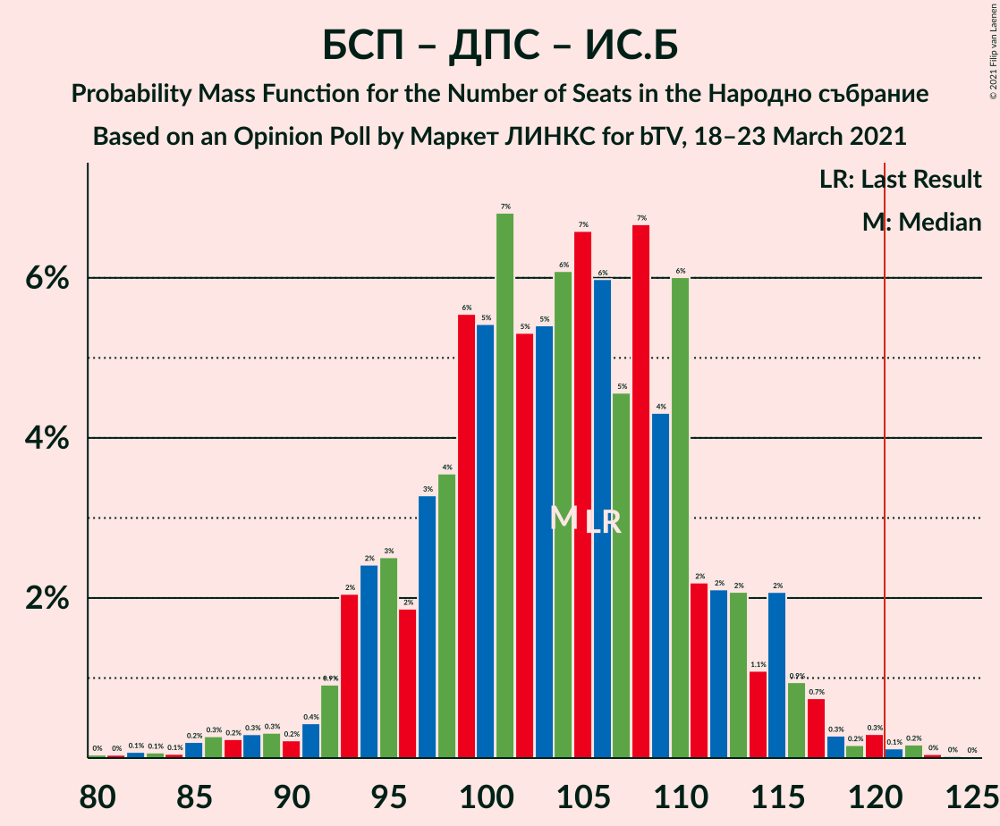

| Number of Seats | Probability | Accumulated | Special Marks |
|:---------------:|:-----------:|:-----------:|:-------------:|
| 80 | 0% | 100% |  |
| 81 | 0% | 99.9% |  |
| 82 | 0.1% | 99.9% |  |
| 83 | 0.1% | 99.8% |  |
| 84 | 0.1% | 99.7% |  |
| 85 | 0.2% | 99.7% |  |
| 86 | 0.3% | 99.5% |  |
| 87 | 0.2% | 99.2% |  |
| 88 | 0.3% | 99.0% |  |
| 89 | 0.3% | 98.7% |  |
| 90 | 0.2% | 98% |  |
| 91 | 0.4% | 98% |  |
| 92 | 0.9% | 98% |  |
| 93 | 2% | 97% |  |
| 94 | 2% | 95% |  |
| 95 | 3% | 92% |  |
| 96 | 2% | 90% |  |
| 97 | 3% | 88% |  |
| 98 | 4% | 85% |  |
| 99 | 6% | 81% |  |
| 100 | 5% | 76% |  |
| 101 | 7% | 70% |  |
| 102 | 5% | 63% |  |
| 103 | 5% | 58% |  |
| 104 | 6% | 53% | Median |
| 105 | 7% | 47% |  |
| 106 | 6% | 40% | Last Result |
| 107 | 5% | 34% |  |
| 108 | 7% | 29% |  |
| 109 | 4% | 23% |  |
| 110 | 6% | 18% |  |
| 111 | 2% | 12% |  |
| 112 | 2% | 10% |  |
| 113 | 2% | 8% |  |
| 114 | 1.1% | 6% |  |
| 115 | 2% | 5% |  |
| 116 | 0.9% | 3% |  |
| 117 | 0.7% | 2% |  |
| 118 | 0.3% | 1.1% |  |
| 119 | 0.2% | 0.9% |  |
| 120 | 0.3% | 0.7% |  |
| 121 | 0.1% | 0.4% | Majority |
| 122 | 0.2% | 0.3% |  |
| 123 | 0% | 0.1% |  |
| 124 | 0% | 0.1% |  |
| 125 | 0% | 0% |  |

### Българска социалистическа партия – Движение за права и свободи

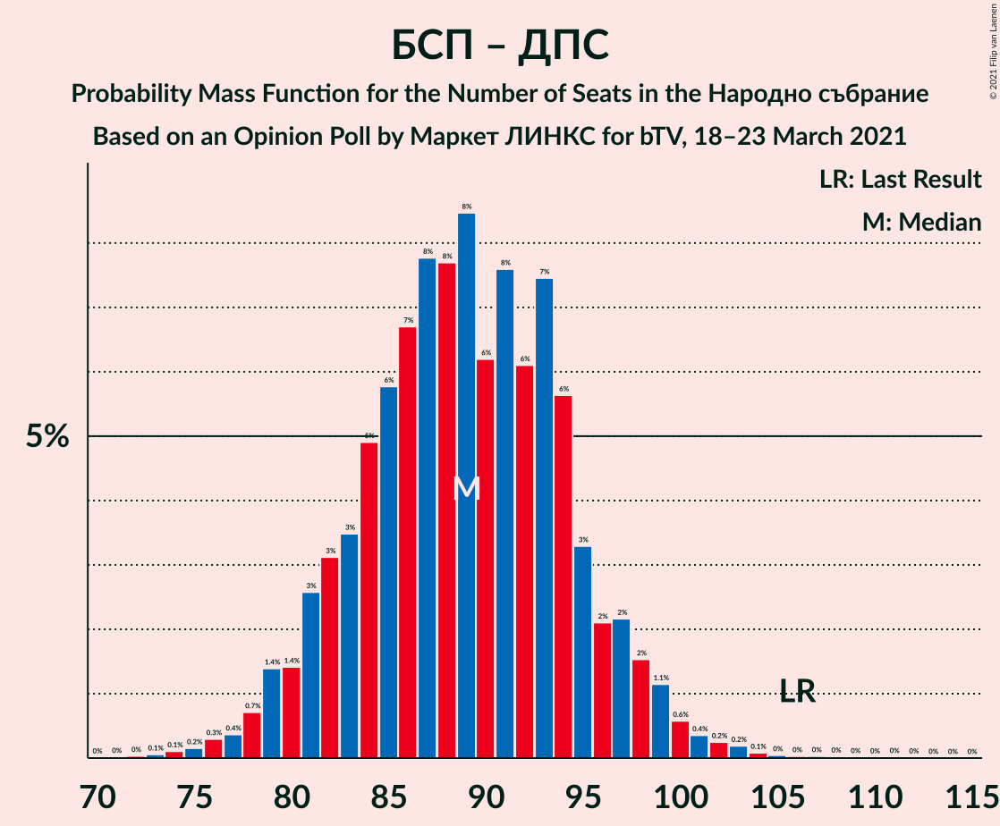

| Number of Seats | Probability | Accumulated | Special Marks |
|:---------------:|:-----------:|:-----------:|:-------------:|
| 72 | 0% | 100% |  |
| 73 | 0.1% | 99.9% |  |
| 74 | 0.1% | 99.9% |  |
| 75 | 0.2% | 99.8% |  |
| 76 | 0.3% | 99.6% |  |
| 77 | 0.4% | 99.3% |  |
| 78 | 0.7% | 98.9% |  |
| 79 | 1.4% | 98% |  |
| 80 | 1.4% | 97% |  |
| 81 | 3% | 95% |  |
| 82 | 3% | 93% |  |
| 83 | 3% | 90% |  |
| 84 | 5% | 86% |  |
| 85 | 6% | 81% |  |
| 86 | 7% | 76% |  |
| 87 | 8% | 69% |  |
| 88 | 8% | 61% |  |
| 89 | 8% | 53% | Median |
| 90 | 6% | 45% |  |
| 91 | 8% | 39% |  |
| 92 | 6% | 31% |  |
| 93 | 7% | 25% |  |
| 94 | 6% | 18% |  |
| 95 | 3% | 12% |  |
| 96 | 2% | 9% |  |
| 97 | 2% | 7% |  |
| 98 | 2% | 4% |  |
| 99 | 1.1% | 3% |  |
| 100 | 0.6% | 2% |  |
| 101 | 0.4% | 1.1% |  |
| 102 | 0.2% | 0.7% |  |
| 103 | 0.2% | 0.5% |  |
| 104 | 0.1% | 0.3% |  |
| 105 | 0% | 0.2% |  |
| 106 | 0% | 0.2% | Last Result |
| 107 | 0% | 0.1% |  |
| 108 | 0% | 0.1% |  |
| 109 | 0% | 0.1% |  |
| 110 | 0% | 0.1% |  |
| 111 | 0% | 0% |  |

### Граждани за европейско развитие на България – Обединени Патриоти

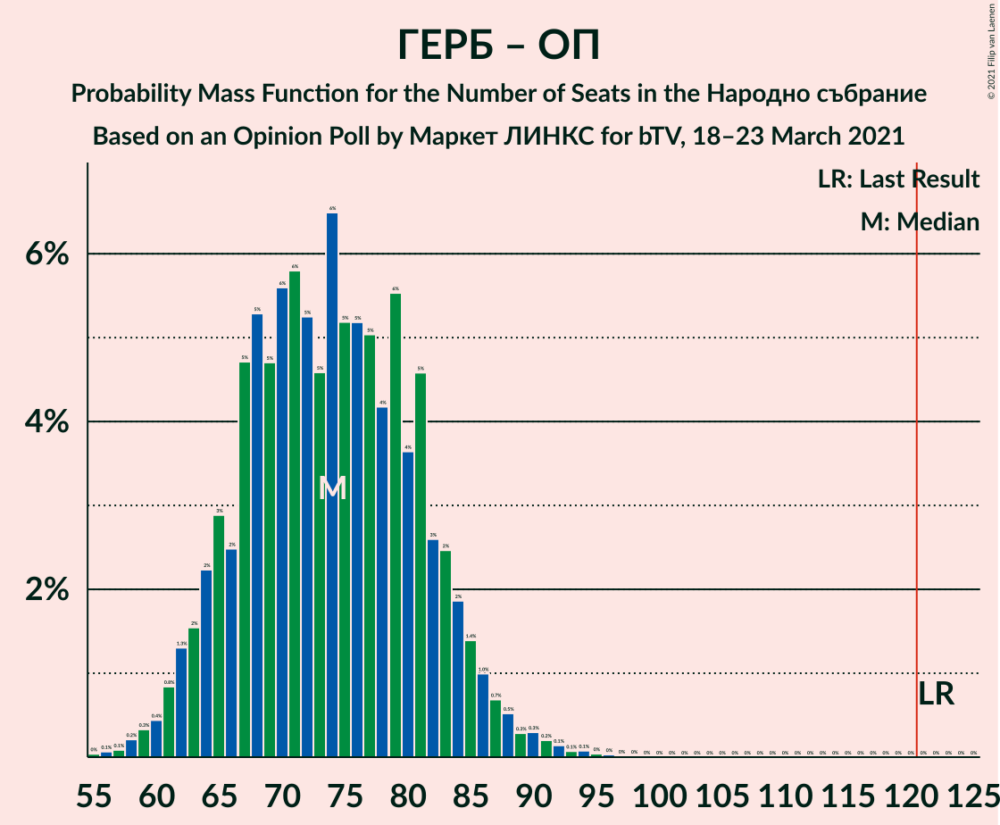

| Number of Seats | Probability | Accumulated | Special Marks |
|:---------------:|:-----------:|:-----------:|:-------------:|
| 55 | 0% | 100% |  |
| 56 | 0.1% | 99.9% |  |
| 57 | 0.1% | 99.9% |  |
| 58 | 0.2% | 99.8% |  |
| 59 | 0.3% | 99.6% |  |
| 60 | 0.4% | 99.2% |  |
| 61 | 0.8% | 98.8% |  |
| 62 | 1.3% | 98% |  |
| 63 | 2% | 97% |  |
| 64 | 2% | 95% |  |
| 65 | 3% | 93% |  |
| 66 | 2% | 90% |  |
| 67 | 5% | 87% |  |
| 68 | 5% | 83% | Median |
| 69 | 5% | 77% |  |
| 70 | 6% | 73% |  |
| 71 | 6% | 67% |  |
| 72 | 5% | 61% |  |
| 73 | 5% | 56% |  |
| 74 | 6% | 52% |  |
| 75 | 5% | 45% |  |
| 76 | 5% | 40% |  |
| 77 | 5% | 35% |  |
| 78 | 4% | 30% |  |
| 79 | 6% | 25% |  |
| 80 | 4% | 20% |  |
| 81 | 5% | 16% |  |
| 82 | 3% | 12% |  |
| 83 | 2% | 9% |  |
| 84 | 2% | 7% |  |
| 85 | 1.4% | 5% |  |
| 86 | 1.0% | 3% |  |
| 87 | 0.7% | 2% |  |
| 88 | 0.5% | 2% |  |
| 89 | 0.3% | 1.2% |  |
| 90 | 0.3% | 0.9% |  |
| 91 | 0.2% | 0.6% |  |
| 92 | 0.1% | 0.4% |  |
| 93 | 0.1% | 0.3% |  |
| 94 | 0.1% | 0.2% |  |
| 95 | 0% | 0.1% |  |
| 96 | 0% | 0.1% |  |
| 97 | 0% | 0% |  |
| 98 | 0% | 0% |  |
| 99 | 0% | 0% |  |
| 100 | 0% | 0% |  |
| 101 | 0% | 0% |  |
| 102 | 0% | 0% |  |
| 103 | 0% | 0% |  |
| 104 | 0% | 0% |  |
| 105 | 0% | 0% |  |
| 106 | 0% | 0% |  |
| 107 | 0% | 0% |  |
| 108 | 0% | 0% |  |
| 109 | 0% | 0% |  |
| 110 | 0% | 0% |  |
| 111 | 0% | 0% |  |
| 112 | 0% | 0% |  |
| 113 | 0% | 0% |  |
| 114 | 0% | 0% |  |
| 115 | 0% | 0% |  |
| 116 | 0% | 0% |  |
| 117 | 0% | 0% |  |
| 118 | 0% | 0% |  |
| 119 | 0% | 0% |  |
| 120 | 0% | 0% |  |
| 121 | 0% | 0% | Majority |
| 122 | 0% | 0% | Last Result |

## Technical Information

### Opinion Poll

+ **Polling firm:** Маркет ЛИНКС
+ **Commissioner(s):** bTV
+ **Fieldwork period:** 18–23 March 2021

### Calculations

+ **Sample size:** 472
+ **Simulations done:** 1,048,576
+ **Error estimate:** 0.76%

