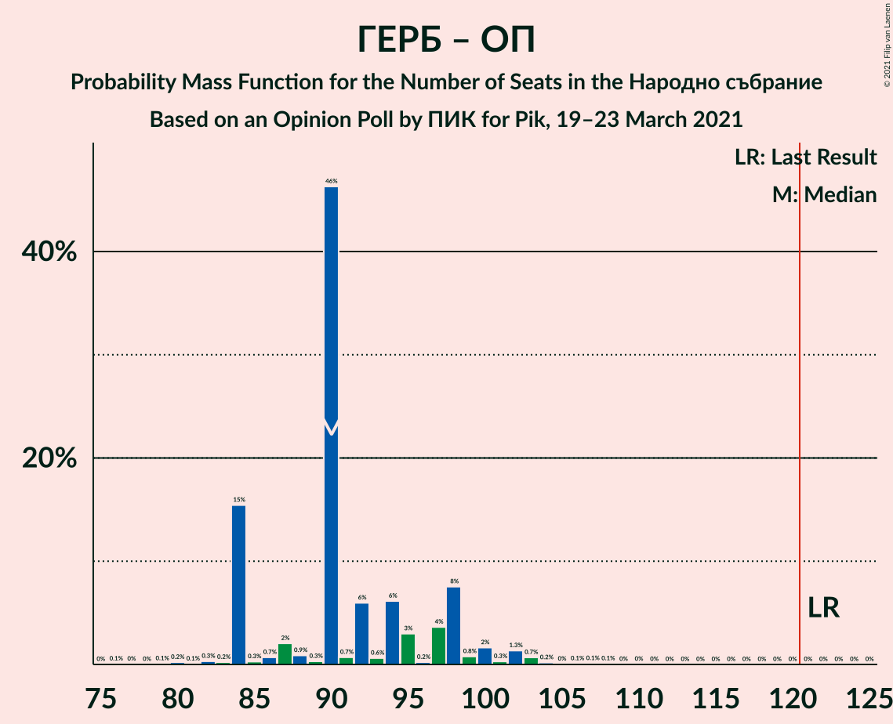

# Opinion Poll by ПИК for Pik, 19–23 March 2021

<a href="#voting-intentions">Voting Intentions</a> | <a href="#seats">Seats</a> | <a href="#coalitions">Coalitions</a> | <a href="#technical-information">Technical Information</a>

## Voting Intentions

### Confidence Intervals

| Party | Last Result | Poll Result | 80% Confidence Interval | 90% Confidence Interval | 95% Confidence Interval | 99% Confidence Interval |
|:-----:|:-----------:|:-----------:|:-----------------------:|:-----------------------:|:-----------------------:|:-----------------------:|
| Граждани за европейско развитие на България | 33.5% | 29.9% | 28.1–31.8% |27.6–32.3% |27.1–32.8% |26.3–33.7% |
| Българска социалистическа партия | 27.9% | 21.0% | 19.4–22.7% |19.0–23.2% |18.6–23.6% |17.8–24.5% |
| Има такъв народ | 0.0% | 11.5% | 10.3–12.9% |10.0–13.3% |9.7–13.6% |9.1–14.3% |
| Движение за права и свободи | 9.2% | 11.2% | 10.0–12.6% |9.7–13.0% |9.4–13.3% |8.8–14.0% |
| Демократична България | 0.0% | 5.8% | 5.0–6.9% |4.7–7.2% |4.5–7.4% |4.1–8.0% |
| Обединени Патриоти | 9.3% | 4.4% | 3.7–5.3% |3.5–5.6% |3.3–5.9% |3.0–6.4% |
| Изправи се Бг | 0.0% | 4.3% | 3.6–5.2% |3.4–5.5% |3.2–5.7% |2.9–6.2% |
| Воля–Национален фронт за спасение на България | 4.3% | 2.3% | 1.8–3.0% |1.6–3.2% |1.5–3.4% |1.3–3.8% |
| Републиканци за България | 0.0% | 1.5% | 1.1–2.1% |1.0–2.3% |0.9–2.5% |0.7–2.8% |
| Възраждане | 0.0% | 1.2% | 0.9–1.8% |0.8–1.9% |0.7–2.1% |0.5–2.4% |
| Атака | 0.0% | 1.1% | 0.8–1.7% |0.7–1.8% |0.6–2.0% |0.5–2.3% |
| Алтернатива за българско възраждане | 1.6% | 1.0% | 0.7–1.5% |0.6–1.7% |0.5–1.8% |0.4–2.1% |

*Note:* The poll result column reflects the actual value used in the calculations. Published results may vary slightly, and in addition be rounded to fewer digits.

## Seats

### Confidence Intervals

| Party | Last Result | Median | 80% Confidence Interval | 90% Confidence Interval | 95% Confidence Interval | 99% Confidence Interval |
|:-----:|:-----------:|:------:|:-----------------------:|:-----------------------:|:-----------------------:|:-----------------------:|
| <a href="#граждани-за-европейско-развитие-на-българия">Граждани за европейско развитие на България</a> | 95 | 88 | 81–90 |80–90 |77–90 |73–94 |
| <a href="#българска-социалистическа-партия">Българска социалистическа партия</a> | 80 | 62 | 55–64 |53–64 |51–65 |50–68 |
| <a href="#има-такъв-народ">Има такъв народ</a> | 0 | 35 | 29–35 |28–35 |27–37 |26–39 |
| <a href="#движение-за-права-и-свободи">Движение за права и свободи</a> | 26 | 34 | 28–34 |28–34 |28–37 |25–38 |
| <a href="#демократична-българия">Демократична България</a> | 0 | 19 | 13–19 |13–19 |13–19 |12–21 |
| <a href="#обединени-патриоти">Обединени Патриоти</a> | 27 | 0 | 0–14 |0–15 |0–15 |0–18 |
| <a href="#изправи-се-бг">Изправи се Бг</a> | 0 | 0 | 0–14 |0–14 |0–14 |0–17 |
| <a href="#воля–национален-фронт-за-спасение-на-българия">Воля–Национален фронт за спасение на България</a> | 12 | 0 | 0 |0 |0 |0 |
| <a href="#републиканци-за-българия">Републиканци за България</a> | 0 | 0 | 0 |0 |0 |0 |
| <a href="#възраждане">Възраждане</a> | 0 | 0 | 0 |0 |0 |0 |
| <a href="#атака">Атака</a> | 0 | 0 | 0 |0 |0 |0 |
| <a href="#алтернатива-за-българско-възраждане">Алтернатива за българско възраждане</a> | 0 | 0 | 0 |0 |0 |0 |

### Граждани за европейско развитие на България

*For a full overview of the results for this party, see the [Граждани за европейско развитие на България](party-гражданизаевропейскоразвитиенабългария.html) page.*

| Number of Seats | Probability | Accumulated | Special Marks |
|:---------------:|:-----------:|:-----------:|:-------------:|
| 70 | 0.1% | 100% |  |
| 71 | 0% | 99.9% |  |
| 72 | 0% | 99.9% |  |
| 73 | 0.4% | 99.8% |  |
| 74 | 0.3% | 99.4% |  |
| 75 | 0.7% | 99.2% |  |
| 76 | 0.3% | 98.5% |  |
| 77 | 1.1% | 98% |  |
| 78 | 0.2% | 97% |  |
| 79 | 0.7% | 97% |  |
| 80 | 6% | 96% |  |
| 81 | 6% | 91% |  |
| 82 | 4% | 85% |  |
| 83 | 3% | 81% |  |
| 84 | 16% | 78% |  |
| 85 | 5% | 62% |  |
| 86 | 5% | 57% |  |
| 87 | 2% | 52% |  |
| 88 | 0.7% | 50% | Median |
| 89 | 0.9% | 49% |  |
| 90 | 46% | 49% |  |
| 91 | 0.5% | 2% |  |
| 92 | 0.1% | 2% |  |
| 93 | 0.2% | 2% |  |
| 94 | 1.1% | 1.3% |  |
| 95 | 0.1% | 0.3% | Last Result |
| 96 | 0% | 0.1% |  |
| 97 | 0% | 0.1% |  |
| 98 | 0% | 0.1% |  |
| 99 | 0% | 0.1% |  |
| 100 | 0% | 0.1% |  |
| 101 | 0% | 0.1% |  |
| 102 | 0% | 0% |  |

### Българска социалистическа партия

*For a full overview of the results for this party, see the [Българска социалистическа партия](party-българскасоциалистическапартия.html) page.*

| Number of Seats | Probability | Accumulated | Special Marks |
|:---------------:|:-----------:|:-----------:|:-------------:|
| 47 | 0% | 100% |  |
| 48 | 0.1% | 99.9% |  |
| 49 | 0.3% | 99.8% |  |
| 50 | 0% | 99.5% |  |
| 51 | 3% | 99.5% |  |
| 52 | 0.3% | 97% |  |
| 53 | 5% | 96% |  |
| 54 | 1.5% | 92% |  |
| 55 | 1.3% | 90% |  |
| 56 | 0.8% | 89% |  |
| 57 | 1.1% | 88% |  |
| 58 | 3% | 87% |  |
| 59 | 4% | 84% |  |
| 60 | 2% | 79% |  |
| 61 | 17% | 77% |  |
| 62 | 46% | 60% | Median |
| 63 | 0.8% | 14% |  |
| 64 | 10% | 13% |  |
| 65 | 0.7% | 3% |  |
| 66 | 0.1% | 2% |  |
| 67 | 0.4% | 2% |  |
| 68 | 2% | 2% |  |
| 69 | 0.1% | 0.2% |  |
| 70 | 0% | 0.1% |  |
| 71 | 0% | 0.1% |  |
| 72 | 0% | 0.1% |  |
| 73 | 0% | 0.1% |  |
| 74 | 0% | 0% |  |
| 75 | 0% | 0% |  |
| 76 | 0% | 0% |  |
| 77 | 0% | 0% |  |
| 78 | 0% | 0% |  |
| 79 | 0% | 0% |  |
| 80 | 0% | 0% | Last Result |

### Има такъв народ

*For a full overview of the results for this party, see the [Има такъв народ](party-иматакъвнарод.html) page.*

| Number of Seats | Probability | Accumulated | Special Marks |
|:---------------:|:-----------:|:-----------:|:-------------:|
| 0 | 0% | 100% | Last Result |
| 1 | 0% | 100% |  |
| 2 | 0% | 100% |  |
| 3 | 0% | 100% |  |
| 4 | 0% | 100% |  |
| 5 | 0% | 100% |  |
| 6 | 0% | 100% |  |
| 7 | 0% | 100% |  |
| 8 | 0% | 100% |  |
| 9 | 0% | 100% |  |
| 10 | 0% | 100% |  |
| 11 | 0% | 100% |  |
| 12 | 0% | 100% |  |
| 13 | 0% | 100% |  |
| 14 | 0% | 100% |  |
| 15 | 0% | 100% |  |
| 16 | 0% | 100% |  |
| 17 | 0% | 100% |  |
| 18 | 0% | 100% |  |
| 19 | 0% | 100% |  |
| 20 | 0% | 100% |  |
| 21 | 0% | 100% |  |
| 22 | 0% | 100% |  |
| 23 | 0% | 100% |  |
| 24 | 0% | 99.9% |  |
| 25 | 0.3% | 99.9% |  |
| 26 | 0.7% | 99.6% |  |
| 27 | 2% | 99.0% |  |
| 28 | 4% | 97% |  |
| 29 | 4% | 94% |  |
| 30 | 21% | 90% |  |
| 31 | 1.4% | 69% |  |
| 32 | 5% | 68% |  |
| 33 | 2% | 63% |  |
| 34 | 1.0% | 60% |  |
| 35 | 55% | 59% | Median |
| 36 | 2% | 5% |  |
| 37 | 0.8% | 3% |  |
| 38 | 0.4% | 2% |  |
| 39 | 2% | 2% |  |
| 40 | 0.1% | 0.3% |  |
| 41 | 0% | 0.2% |  |
| 42 | 0.2% | 0.2% |  |
| 43 | 0% | 0% |  |

### Движение за права и свободи

*For a full overview of the results for this party, see the [Движение за права и свободи](party-движениезаправаисвободи.html) page.*

| Number of Seats | Probability | Accumulated | Special Marks |
|:---------------:|:-----------:|:-----------:|:-------------:|
| 23 | 0.1% | 100% |  |
| 24 | 0.1% | 99.9% |  |
| 25 | 1.0% | 99.9% |  |
| 26 | 0.3% | 98.9% | Last Result |
| 27 | 0.7% | 98.6% |  |
| 28 | 9% | 98% |  |
| 29 | 2% | 88% |  |
| 30 | 5% | 87% |  |
| 31 | 5% | 81% |  |
| 32 | 22% | 76% |  |
| 33 | 4% | 54% |  |
| 34 | 46% | 50% | Median |
| 35 | 0.7% | 4% |  |
| 36 | 0.6% | 3% |  |
| 37 | 2% | 3% |  |
| 38 | 0.4% | 0.7% |  |
| 39 | 0.2% | 0.3% |  |
| 40 | 0.1% | 0.1% |  |
| 41 | 0% | 0% |  |

### Демократична България

*For a full overview of the results for this party, see the [Демократична България](party-демократичнабългария.html) page.*

| Number of Seats | Probability | Accumulated | Special Marks |
|:---------------:|:-----------:|:-----------:|:-------------:|
| 0 | 0.3% | 100% | Last Result |
| 1 | 0% | 99.7% |  |
| 2 | 0% | 99.7% |  |
| 3 | 0% | 99.7% |  |
| 4 | 0% | 99.7% |  |
| 5 | 0% | 99.7% |  |
| 6 | 0% | 99.7% |  |
| 7 | 0% | 99.7% |  |
| 8 | 0% | 99.7% |  |
| 9 | 0% | 99.7% |  |
| 10 | 0% | 99.7% |  |
| 11 | 0% | 99.7% |  |
| 12 | 0.8% | 99.7% |  |
| 13 | 10% | 98.9% |  |
| 14 | 1.3% | 89% |  |
| 15 | 12% | 88% |  |
| 16 | 4% | 76% |  |
| 17 | 4% | 72% |  |
| 18 | 6% | 68% |  |
| 19 | 61% | 62% | Median |
| 20 | 0.5% | 1.5% |  |
| 21 | 0.8% | 1.0% |  |
| 22 | 0.1% | 0.2% |  |
| 23 | 0% | 0.1% |  |
| 24 | 0% | 0.1% |  |
| 25 | 0% | 0% |  |

### Обединени Патриоти

*For a full overview of the results for this party, see the [Обединени Патриоти](party-обединенипатриоти.html) page.*

| Number of Seats | Probability | Accumulated | Special Marks |
|:---------------:|:-----------:|:-----------:|:-------------:|
| 0 | 66% | 100% | Median |
| 1 | 0% | 34% |  |
| 2 | 0% | 34% |  |
| 3 | 0% | 34% |  |
| 4 | 0% | 34% |  |
| 5 | 0% | 34% |  |
| 6 | 0% | 34% |  |
| 7 | 0% | 34% |  |
| 8 | 0% | 34% |  |
| 9 | 0% | 34% |  |
| 10 | 0% | 34% |  |
| 11 | 6% | 34% |  |
| 12 | 7% | 28% |  |
| 13 | 8% | 21% |  |
| 14 | 7% | 12% |  |
| 15 | 3% | 5% |  |
| 16 | 0.5% | 2% |  |
| 17 | 0.2% | 1.5% |  |
| 18 | 1.3% | 1.3% |  |
| 19 | 0% | 0% |  |
| 20 | 0% | 0% |  |
| 21 | 0% | 0% |  |
| 22 | 0% | 0% |  |
| 23 | 0% | 0% |  |
| 24 | 0% | 0% |  |
| 25 | 0% | 0% |  |
| 26 | 0% | 0% |  |
| 27 | 0% | 0% | Last Result |

### Изправи се Бг

*For a full overview of the results for this party, see the [Изправи се Бг](party-изправисебг.html) page.*

| Number of Seats | Probability | Accumulated | Special Marks |
|:---------------:|:-----------:|:-----------:|:-------------:|
| 0 | 60% | 100% | Last Result, Median |
| 1 | 0% | 40% |  |
| 2 | 0% | 40% |  |
| 3 | 0% | 40% |  |
| 4 | 0% | 40% |  |
| 5 | 0% | 40% |  |
| 6 | 0% | 40% |  |
| 7 | 0% | 40% |  |
| 8 | 0% | 40% |  |
| 9 | 0% | 40% |  |
| 10 | 0% | 40% |  |
| 11 | 3% | 40% |  |
| 12 | 9% | 37% |  |
| 13 | 9% | 28% |  |
| 14 | 17% | 19% |  |
| 15 | 0.9% | 2% |  |
| 16 | 0.4% | 1.0% |  |
| 17 | 0.3% | 0.5% |  |
| 18 | 0.2% | 0.3% |  |
| 19 | 0% | 0% |  |

### Воля–Национален фронт за спасение на България

*For a full overview of the results for this party, see the [Воля–Национален фронт за спасение на България](party-воля–националенфронтзаспасениенабългария.html) page.*

| Number of Seats | Probability | Accumulated | Special Marks |
|:---------------:|:-----------:|:-----------:|:-------------:|
| 0 | 99.9% | 100% | Median |
| 1 | 0% | 0.1% |  |
| 2 | 0% | 0.1% |  |
| 3 | 0% | 0.1% |  |
| 4 | 0% | 0.1% |  |
| 5 | 0% | 0.1% |  |
| 6 | 0% | 0.1% |  |
| 7 | 0% | 0.1% |  |
| 8 | 0% | 0.1% |  |
| 9 | 0% | 0.1% |  |
| 10 | 0% | 0.1% |  |
| 11 | 0.1% | 0.1% |  |
| 12 | 0% | 0% | Last Result |

### Републиканци за България

*For a full overview of the results for this party, see the [Републиканци за България](party-републиканцизабългария.html) page.*

| Number of Seats | Probability | Accumulated | Special Marks |
|:---------------:|:-----------:|:-----------:|:-------------:|
| 0 | 100% | 100% | Last Result, Median |

### Възраждане

*For a full overview of the results for this party, see the [Възраждане](party-възраждане.html) page.*

| Number of Seats | Probability | Accumulated | Special Marks |
|:---------------:|:-----------:|:-----------:|:-------------:|
| 0 | 100% | 100% | Last Result, Median |

### Атака

*For a full overview of the results for this party, see the [Атака](party-атака.html) page.*

| Number of Seats | Probability | Accumulated | Special Marks |
|:---------------:|:-----------:|:-----------:|:-------------:|
| 0 | 100% | 100% | Last Result, Median |

### Алтернатива за българско възраждане

*For a full overview of the results for this party, see the [Алтернатива за българско възраждане](party-алтернативазабългарсковъзраждане.html) page.*

| Number of Seats | Probability | Accumulated | Special Marks |
|:---------------:|:-----------:|:-----------:|:-------------:|
| 0 | 100% | 100% | Last Result, Median |

## Coalitions

### Confidence Intervals

| Coalition | Last Result | Median | Majority? | 80% Confidence Interval | 90% Confidence Interval | 95% Confidence Interval | 99% Confidence Interval |
|:---------:|:-----------:|:------:|:---------:|:-----------------------:|:-----------------------:|:-----------------------:|:-----------------------:|
| Българска социалистическа партия – Има такъв народ – Движение за права и свободи – Изправи се Бг | 106 | 131 | 99.5% | 127–137 | 125–137 | 123–137 | 120–142 |
| Българска социалистическа партия – Има такъв народ – Движение за права и свободи | 106 | 129 | 84% | 118–131 | 115–131 | 115–133 | 110–135 |
| Българска социалистическа партия – Движение за права и свободи – Изправи се Бг | 106 | 96 | 0% | 95–107 | 93–107 | 91–107 | 89–110 |
| Граждани за европейско развитие на България – Обединени Патриоти | 122 | 90 | 0% | 84–98 | 84–99 | 84–102 | 82–104 |
| Българска социалистическа партия – Движение за права и свободи | 106 | 96 | 0% | 86–96 | 84–96 | 83–98 | 81–101 |

### Българска социалистическа партия – Има такъв народ – Движение за права и свободи – Изправи се Бг

| Number of Seats | Probability | Accumulated | Special Marks |
|:---------------:|:-----------:|:-----------:|:-------------:|
| 106 | 0% | 100% | Last Result |
| 107 | 0% | 100% |  |
| 108 | 0% | 100% |  |
| 109 | 0% | 100% |  |
| 110 | 0% | 100% |  |
| 111 | 0% | 100% |  |
| 112 | 0% | 100% |  |
| 113 | 0% | 100% |  |
| 114 | 0% | 100% |  |
| 115 | 0% | 100% |  |
| 116 | 0% | 100% |  |
| 117 | 0% | 100% |  |
| 118 | 0.1% | 100% |  |
| 119 | 0.2% | 99.9% |  |
| 120 | 0.2% | 99.6% |  |
| 121 | 0.1% | 99.5% | Majority |
| 122 | 1.4% | 99.3% |  |
| 123 | 0.9% | 98% |  |
| 124 | 2% | 97% |  |
| 125 | 0.9% | 95% |  |
| 126 | 0.3% | 94% |  |
| 127 | 7% | 94% |  |
| 128 | 3% | 87% |  |
| 129 | 5% | 84% |  |
| 130 | 0.8% | 79% |  |
| 131 | 49% | 79% | Median |
| 132 | 2% | 29% |  |
| 133 | 2% | 28% |  |
| 134 | 0.9% | 26% |  |
| 135 | 7% | 25% |  |
| 136 | 0.2% | 19% |  |
| 137 | 16% | 18% |  |
| 138 | 0.8% | 2% |  |
| 139 | 0.5% | 2% |  |
| 140 | 0.3% | 1.0% |  |
| 141 | 0% | 0.7% |  |
| 142 | 0.2% | 0.6% |  |
| 143 | 0.2% | 0.4% |  |
| 144 | 0% | 0.2% |  |
| 145 | 0% | 0.2% |  |
| 146 | 0.1% | 0.2% |  |
| 147 | 0% | 0.1% |  |
| 148 | 0% | 0.1% |  |
| 149 | 0% | 0% |  |

### Българска социалистическа партия – Има такъв народ – Движение за права и свободи

| Number of Seats | Probability | Accumulated | Special Marks |
|:---------------:|:-----------:|:-----------:|:-------------:|
| 106 | 0.1% | 100% | Last Result |
| 107 | 0% | 99.9% |  |
| 108 | 0% | 99.9% |  |
| 109 | 0.2% | 99.9% |  |
| 110 | 0.9% | 99.7% |  |
| 111 | 0.1% | 98.8% |  |
| 112 | 0.4% | 98.7% |  |
| 113 | 0.5% | 98% |  |
| 114 | 0.3% | 98% |  |
| 115 | 6% | 98% |  |
| 116 | 0.7% | 91% |  |
| 117 | 0.2% | 91% |  |
| 118 | 1.1% | 90% |  |
| 119 | 5% | 89% |  |
| 120 | 0.4% | 85% |  |
| 121 | 2% | 84% | Majority |
| 122 | 6% | 83% |  |
| 123 | 16% | 76% |  |
| 124 | 2% | 60% |  |
| 125 | 1.1% | 58% |  |
| 126 | 0.6% | 57% |  |
| 127 | 3% | 57% |  |
| 128 | 0.6% | 54% |  |
| 129 | 4% | 53% |  |
| 130 | 0.5% | 49% |  |
| 131 | 46% | 48% | Median |
| 132 | 0% | 3% |  |
| 133 | 0.7% | 3% |  |
| 134 | 0.2% | 2% |  |
| 135 | 1.4% | 2% |  |
| 136 | 0.1% | 0.5% |  |
| 137 | 0.3% | 0.4% |  |
| 138 | 0% | 0% |  |

### Българска социалистическа партия – Движение за права и свободи – Изправи се Бг

| Number of Seats | Probability | Accumulated | Special Marks |
|:---------------:|:-----------:|:-----------:|:-------------:|
| 85 | 0% | 100% |  |
| 86 | 0.3% | 99.9% |  |
| 87 | 0.1% | 99.7% |  |
| 88 | 0% | 99.5% |  |
| 89 | 0.7% | 99.5% |  |
| 90 | 0.1% | 98.8% |  |
| 91 | 2% | 98.7% |  |
| 92 | 2% | 97% |  |
| 93 | 0.5% | 95% |  |
| 94 | 4% | 95% |  |
| 95 | 1.2% | 91% |  |
| 96 | 54% | 89% | Median |
| 97 | 3% | 36% |  |
| 98 | 3% | 33% |  |
| 99 | 4% | 30% |  |
| 100 | 0.7% | 26% |  |
| 101 | 0.4% | 26% |  |
| 102 | 0.9% | 25% |  |
| 103 | 0.7% | 24% |  |
| 104 | 0.7% | 24% |  |
| 105 | 5% | 23% |  |
| 106 | 0.9% | 17% | Last Result |
| 107 | 15% | 17% |  |
| 108 | 0.6% | 1.3% |  |
| 109 | 0.1% | 0.7% |  |
| 110 | 0.4% | 0.6% |  |
| 111 | 0.1% | 0.2% |  |
| 112 | 0.1% | 0.2% |  |
| 113 | 0% | 0% |  |

### Граждани за европейско развитие на България – Обединени Патриоти

| Number of Seats | Probability | Accumulated | Special Marks |
|:---------------:|:-----------:|:-----------:|:-------------:|
| 76 | 0.1% | 100% |  |
| 77 | 0% | 99.9% |  |
| 78 | 0% | 99.9% |  |
| 79 | 0.1% | 99.9% |  |
| 80 | 0.2% | 99.8% |  |
| 81 | 0.1% | 99.6% |  |
| 82 | 0.3% | 99.5% |  |
| 83 | 0.2% | 99.2% |  |
| 84 | 15% | 99.0% |  |
| 85 | 0.3% | 84% |  |
| 86 | 0.7% | 83% |  |
| 87 | 2% | 83% |  |
| 88 | 0.9% | 81% | Median |
| 89 | 0.3% | 80% |  |
| 90 | 46% | 79% |  |
| 91 | 0.7% | 33% |  |
| 92 | 6% | 32% |  |
| 93 | 0.6% | 26% |  |
| 94 | 6% | 26% |  |
| 95 | 3% | 20% |  |
| 96 | 0.2% | 17% |  |
| 97 | 4% | 16% |  |
| 98 | 8% | 13% |  |
| 99 | 0.8% | 5% |  |
| 100 | 2% | 4% |  |
| 101 | 0.3% | 3% |  |
| 102 | 1.3% | 3% |  |
| 103 | 0.7% | 1.2% |  |
| 104 | 0.2% | 0.5% |  |
| 105 | 0% | 0.4% |  |
| 106 | 0.1% | 0.3% |  |
| 107 | 0.1% | 0.2% |  |
| 108 | 0.1% | 0.1% |  |
| 109 | 0% | 0.1% |  |
| 110 | 0% | 0% |  |
| 111 | 0% | 0% |  |
| 112 | 0% | 0% |  |
| 113 | 0% | 0% |  |
| 114 | 0% | 0% |  |
| 115 | 0% | 0% |  |
| 116 | 0% | 0% |  |
| 117 | 0% | 0% |  |
| 118 | 0% | 0% |  |
| 119 | 0% | 0% |  |
| 120 | 0% | 0% |  |
| 121 | 0% | 0% | Majority |
| 122 | 0% | 0% | Last Result |

### Българска социалистическа партия – Движение за права и свободи

| Number of Seats | Probability | Accumulated | Special Marks |
|:---------------:|:-----------:|:-----------:|:-------------:|
| 77 | 0.1% | 100% |  |
| 78 | 0% | 99.9% |  |
| 79 | 0% | 99.9% |  |
| 80 | 0.1% | 99.8% |  |
| 81 | 0.6% | 99.7% |  |
| 82 | 0.3% | 99.1% |  |
| 83 | 3% | 98.8% |  |
| 84 | 5% | 96% |  |
| 85 | 0.7% | 92% |  |
| 86 | 2% | 91% |  |
| 87 | 4% | 88% |  |
| 88 | 0.6% | 84% |  |
| 89 | 1.3% | 84% |  |
| 90 | 0.5% | 82% |  |
| 91 | 3% | 82% |  |
| 92 | 7% | 79% |  |
| 93 | 16% | 72% |  |
| 94 | 4% | 56% |  |
| 95 | 1.2% | 52% |  |
| 96 | 47% | 51% | Median |
| 97 | 0.9% | 4% |  |
| 98 | 2% | 3% |  |
| 99 | 0.2% | 1.0% |  |
| 100 | 0.1% | 0.8% |  |
| 101 | 0.3% | 0.7% |  |
| 102 | 0% | 0.4% |  |
| 103 | 0.3% | 0.4% |  |
| 104 | 0% | 0.1% |  |
| 105 | 0% | 0% |  |
| 106 | 0% | 0% | Last Result |

## Technical Information

### Opinion Poll

+ **Polling firm:** ПИК
+ **Commissioner(s):** Pik
+ **Fieldwork period:** 19–23 March 2021

### Calculations

+ **Sample size:** 1000
+ **Simulations done:** 1,048,576
+ **Error estimate:** 1.20%

