# Opinion Poll by Рего, 25–28 March 2021

<a href="#voting-intentions">Voting Intentions</a> | <a href="#seats">Seats</a> | <a href="#coalitions">Coalitions</a> | <a href="#technical-information">Technical Information</a>

## Voting Intentions

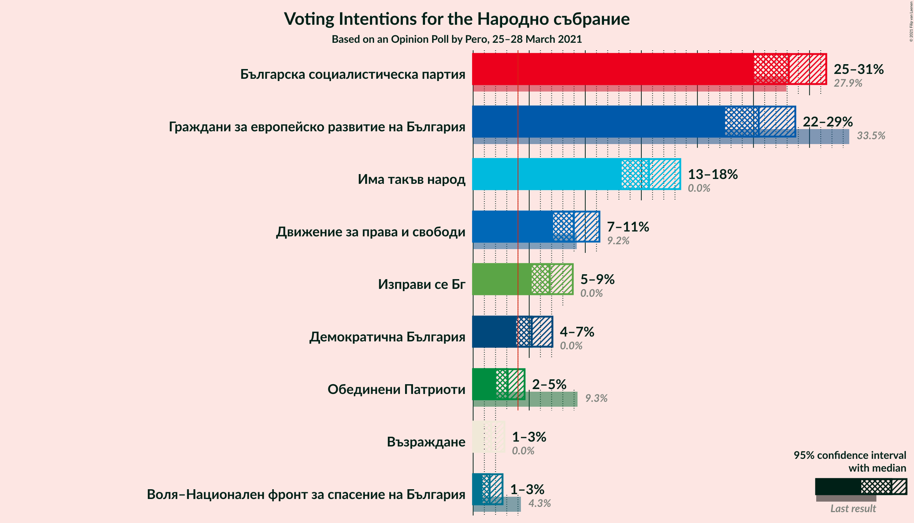

### Confidence Intervals

| Party | Last Result | Poll Result | 80% Confidence Interval | 90% Confidence Interval | 95% Confidence Interval | 99% Confidence Interval |
|:-----:|:-----------:|:-----------:|:-----------------------:|:-----------------------:|:-----------------------:|:-----------------------:|
| Българска социалистическа партия | 27.9% | 28.2% | 26.1–30.3% |25.5–31.0% |25.0–31.5% |24.1–32.6% |
| Граждани за европейско развитие на България | 33.5% | 25.5% | 23.5–27.6% |22.9–28.2% |22.5–28.7% |21.6–29.8% |
| Има такъв народ | 0.0% | 15.7% | 14.1–17.5% |13.6–18.0% |13.2–18.5% |12.5–19.4% |
| Движение за права и свободи | 9.2% | 9.0% | 7.8–10.5% |7.4–10.9% |7.1–11.3% |6.6–12.0% |
| Изправи се Бг | 0.0% | 6.8% | 5.8–8.2% |5.5–8.6% |5.2–8.9% |4.8–9.6% |
| Демократична България | 0.0% | 5.2% | 4.3–6.4% |4.1–6.8% |3.8–7.1% |3.4–7.7% |
| Обединени Патриоти | 9.3% | 3.1% | 2.4–4.1% |2.2–4.3% |2.1–4.6% |1.8–5.1% |
| Възраждане | 0.0% | 1.6% | 1.2–2.4% |1.0–2.6% |0.9–2.8% |0.7–3.2% |
| Воля–Национален фронт за спасение на България | 4.3% | 1.5% | 1.0–2.2% |0.9–2.4% |0.8–2.6% |0.7–3.0% |

*Note:* The poll result column reflects the actual value used in the calculations. Published results may vary slightly, and in addition be rounded to fewer digits.

## Seats

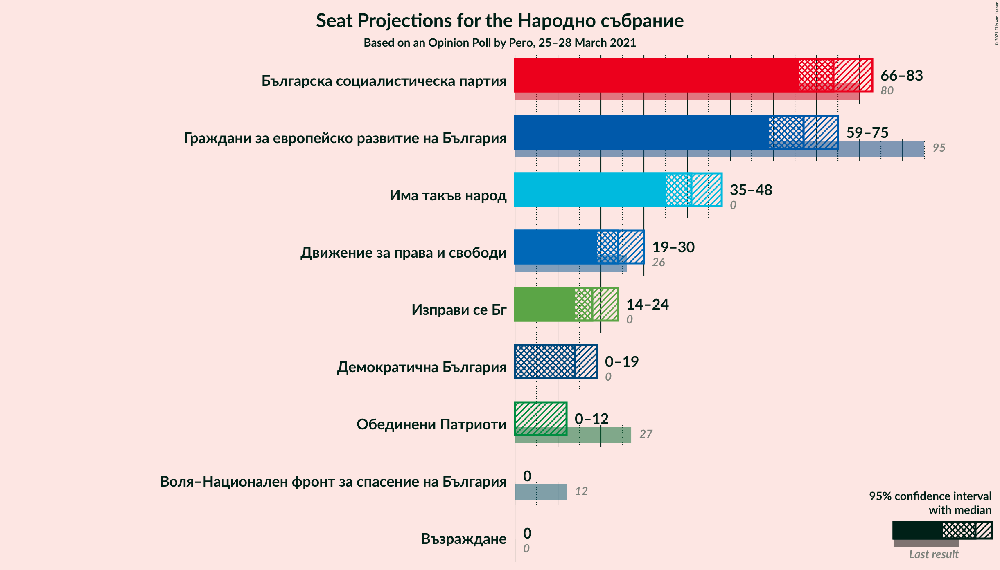

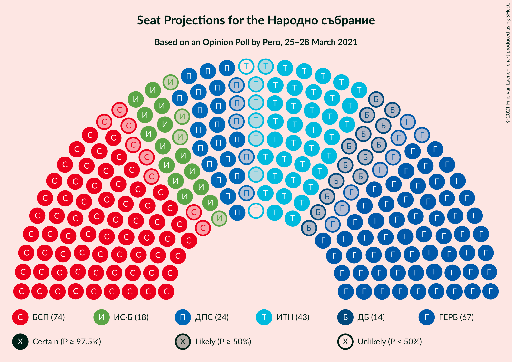

### Confidence Intervals

| Party | Last Result | Median | 80% Confidence Interval | 90% Confidence Interval | 95% Confidence Interval | 99% Confidence Interval |
|:-----:|:-----------:|:------:|:-----------------------:|:-----------------------:|:-----------------------:|:-----------------------:|
| <a href="#българска-социалистическа-партия">Българска социалистическа партия</a> | 80 | 74 | 69–80 |67–82 |66–83 |63–86 |
| <a href="#граждани-за-европейско-развитие-на-българия">Граждани за европейско развитие на България</a> | 95 | 67 | 62–72 |60–74 |59–75 |56–79 |
| <a href="#има-такъв-народ">Има такъв народ</a> | 0 | 41 | 38–45 |35–48 |35–48 |33–52 |
| <a href="#движение-за-права-и-свободи">Движение за права и свободи</a> | 26 | 24 | 21–28 |20–29 |19–30 |17–31 |
| <a href="#изправи-се-бг">Изправи се Бг</a> | 0 | 18 | 15–21 |14–22 |14–24 |13–25 |
| <a href="#демократична-българия">Демократична България</a> | 0 | 14 | 11–17 |11–18 |0–19 |0–20 |
| <a href="#обединени-патриоти">Обединени Патриоти</a> | 27 | 0 | 0–10 |0–11 |0–12 |0–13 |
| <a href="#възраждане">Възраждане</a> | 0 | 0 | 0 |0 |0 |0 |
| <a href="#воля–национален-фронт-за-спасение-на-българия">Воля–Национален фронт за спасение на България</a> | 12 | 0 | 0 |0 |0 |0 |

### Българска социалистическа партия

*For a full overview of the results for this party, see the [Българска социалистическа партия](party-българскасоциалистическапартия.html) page.*

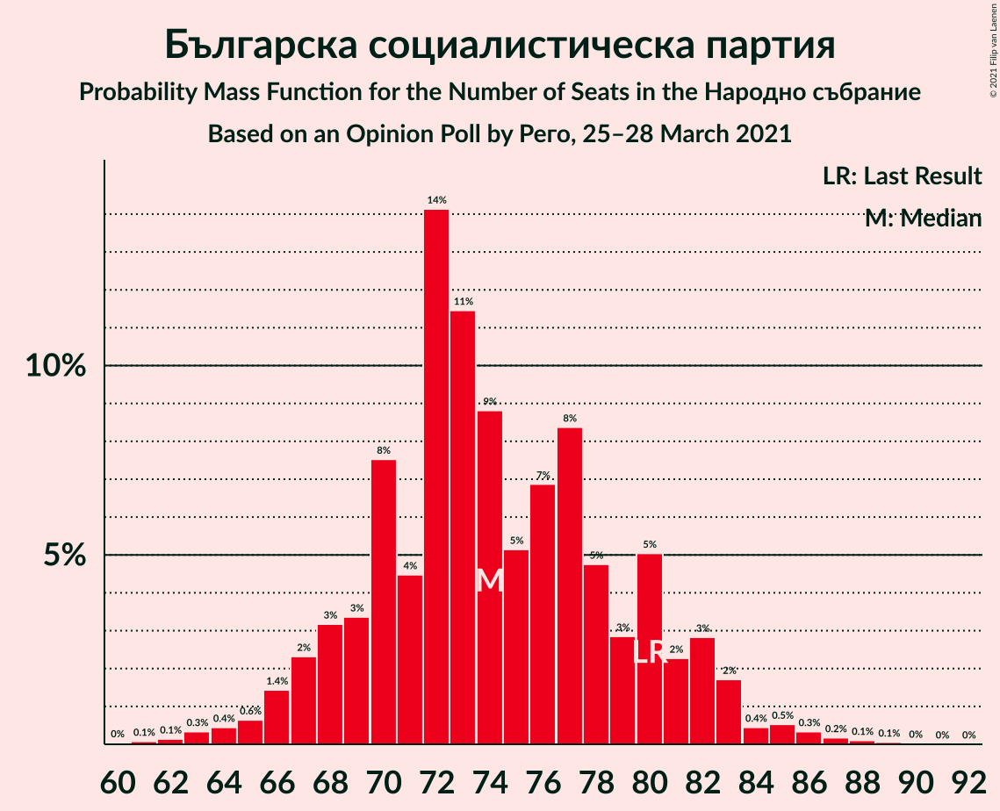

| Number of Seats | Probability | Accumulated | Special Marks |
|:---------------:|:-----------:|:-----------:|:-------------:|
| 60 | 0% | 100% |  |
| 61 | 0.1% | 99.9% |  |
| 62 | 0.1% | 99.9% |  |
| 63 | 0.3% | 99.7% |  |
| 64 | 0.4% | 99.4% |  |
| 65 | 0.6% | 98.9% |  |
| 66 | 1.4% | 98% |  |
| 67 | 2% | 97% |  |
| 68 | 3% | 95% |  |
| 69 | 3% | 91% |  |
| 70 | 8% | 88% |  |
| 71 | 4% | 80% |  |
| 72 | 14% | 76% |  |
| 73 | 11% | 62% |  |
| 74 | 9% | 50% | Median |
| 75 | 5% | 42% |  |
| 76 | 7% | 36% |  |
| 77 | 8% | 30% |  |
| 78 | 5% | 21% |  |
| 79 | 3% | 16% |  |
| 80 | 5% | 14% | Last Result |
| 81 | 2% | 9% |  |
| 82 | 3% | 6% |  |
| 83 | 2% | 3% |  |
| 84 | 0.4% | 2% |  |
| 85 | 0.5% | 1.3% |  |
| 86 | 0.3% | 0.7% |  |
| 87 | 0.2% | 0.4% |  |
| 88 | 0.1% | 0.2% |  |
| 89 | 0.1% | 0.1% |  |
| 90 | 0% | 0.1% |  |
| 91 | 0% | 0% |  |

### Граждани за европейско развитие на България

*For a full overview of the results for this party, see the [Граждани за европейско развитие на България](party-гражданизаевропейскоразвитиенабългария.html) page.*

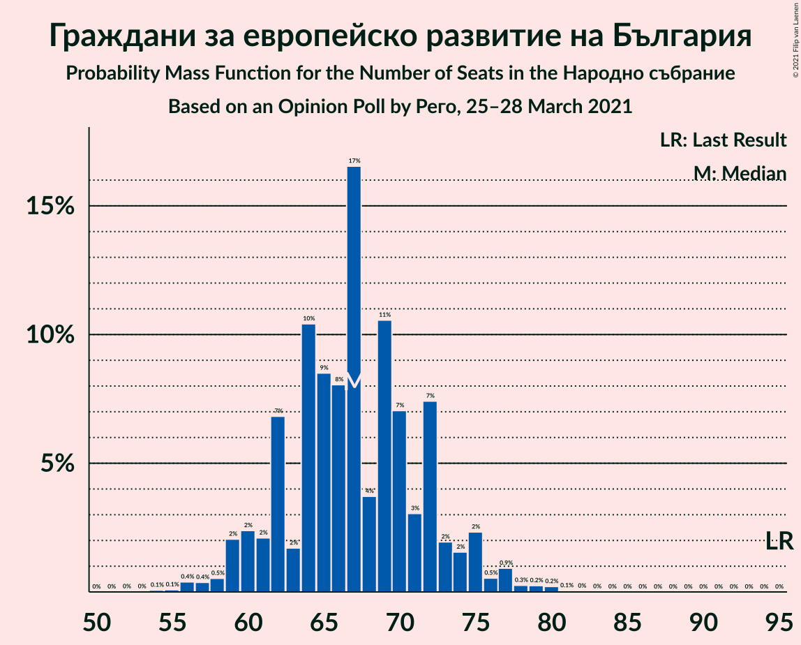

| Number of Seats | Probability | Accumulated | Special Marks |
|:---------------:|:-----------:|:-----------:|:-------------:|
| 54 | 0.1% | 100% |  |
| 55 | 0.1% | 99.9% |  |
| 56 | 0.4% | 99.8% |  |
| 57 | 0.4% | 99.4% |  |
| 58 | 0.5% | 99.0% |  |
| 59 | 2% | 98.5% |  |
| 60 | 2% | 96% |  |
| 61 | 2% | 94% |  |
| 62 | 7% | 92% |  |
| 63 | 2% | 85% |  |
| 64 | 10% | 83% |  |
| 65 | 9% | 73% |  |
| 66 | 8% | 65% |  |
| 67 | 17% | 56% | Median |
| 68 | 4% | 40% |  |
| 69 | 11% | 36% |  |
| 70 | 7% | 26% |  |
| 71 | 3% | 19% |  |
| 72 | 7% | 16% |  |
| 73 | 2% | 8% |  |
| 74 | 2% | 6% |  |
| 75 | 2% | 5% |  |
| 76 | 0.5% | 2% |  |
| 77 | 0.9% | 2% |  |
| 78 | 0.3% | 0.8% |  |
| 79 | 0.2% | 0.6% |  |
| 80 | 0.2% | 0.3% |  |
| 81 | 0.1% | 0.1% |  |
| 82 | 0% | 0.1% |  |
| 83 | 0% | 0% |  |
| 84 | 0% | 0% |  |
| 85 | 0% | 0% |  |
| 86 | 0% | 0% |  |
| 87 | 0% | 0% |  |
| 88 | 0% | 0% |  |
| 89 | 0% | 0% |  |
| 90 | 0% | 0% |  |
| 91 | 0% | 0% |  |
| 92 | 0% | 0% |  |
| 93 | 0% | 0% |  |
| 94 | 0% | 0% |  |
| 95 | 0% | 0% | Last Result |

### Има такъв народ

*For a full overview of the results for this party, see the [Има такъв народ](party-иматакъвнарод.html) page.*

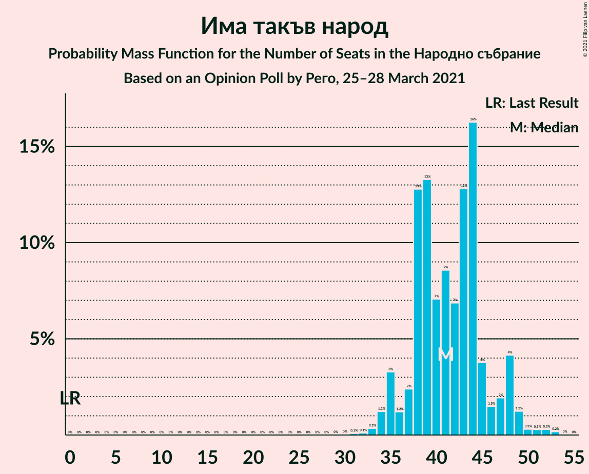

| Number of Seats | Probability | Accumulated | Special Marks |
|:---------------:|:-----------:|:-----------:|:-------------:|
| 0 | 0% | 100% | Last Result |
| 1 | 0% | 100% |  |
| 2 | 0% | 100% |  |
| 3 | 0% | 100% |  |
| 4 | 0% | 100% |  |
| 5 | 0% | 100% |  |
| 6 | 0% | 100% |  |
| 7 | 0% | 100% |  |
| 8 | 0% | 100% |  |
| 9 | 0% | 100% |  |
| 10 | 0% | 100% |  |
| 11 | 0% | 100% |  |
| 12 | 0% | 100% |  |
| 13 | 0% | 100% |  |
| 14 | 0% | 100% |  |
| 15 | 0% | 100% |  |
| 16 | 0% | 100% |  |
| 17 | 0% | 100% |  |
| 18 | 0% | 100% |  |
| 19 | 0% | 100% |  |
| 20 | 0% | 100% |  |
| 21 | 0% | 100% |  |
| 22 | 0% | 100% |  |
| 23 | 0% | 100% |  |
| 24 | 0% | 100% |  |
| 25 | 0% | 100% |  |
| 26 | 0% | 100% |  |
| 27 | 0% | 100% |  |
| 28 | 0% | 100% |  |
| 29 | 0% | 100% |  |
| 30 | 0% | 100% |  |
| 31 | 0.1% | 100% |  |
| 32 | 0.1% | 99.9% |  |
| 33 | 0.3% | 99.8% |  |
| 34 | 1.2% | 99.4% |  |
| 35 | 3% | 98% |  |
| 36 | 1.2% | 95% |  |
| 37 | 2% | 94% |  |
| 38 | 13% | 91% |  |
| 39 | 13% | 79% |  |
| 40 | 7% | 65% |  |
| 41 | 9% | 58% | Median |
| 42 | 7% | 50% |  |
| 43 | 13% | 43% |  |
| 44 | 16% | 30% |  |
| 45 | 4% | 14% |  |
| 46 | 1.5% | 10% |  |
| 47 | 2% | 8% |  |
| 48 | 4% | 6% |  |
| 49 | 1.2% | 2% |  |
| 50 | 0.3% | 1.1% |  |
| 51 | 0.3% | 0.8% |  |
| 52 | 0.3% | 0.5% |  |
| 53 | 0.2% | 0.2% |  |
| 54 | 0% | 0% |  |

### Движение за права и свободи

*For a full overview of the results for this party, see the [Движение за права и свободи](party-движениезаправаисвободи.html) page.*

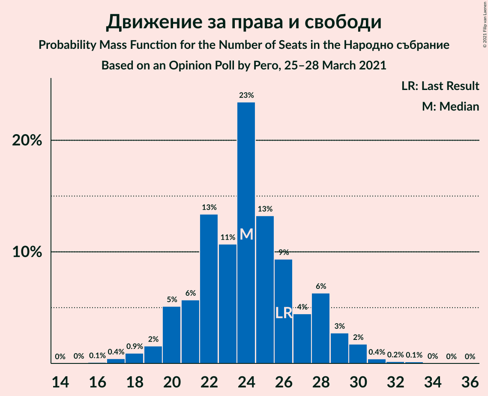

| Number of Seats | Probability | Accumulated | Special Marks |
|:---------------:|:-----------:|:-----------:|:-------------:|
| 15 | 0% | 100% |  |
| 16 | 0.1% | 99.9% |  |
| 17 | 0.4% | 99.8% |  |
| 18 | 0.9% | 99.4% |  |
| 19 | 2% | 98% |  |
| 20 | 5% | 97% |  |
| 21 | 6% | 92% |  |
| 22 | 13% | 86% |  |
| 23 | 11% | 73% |  |
| 24 | 23% | 62% | Median |
| 25 | 13% | 39% |  |
| 26 | 9% | 25% | Last Result |
| 27 | 4% | 16% |  |
| 28 | 6% | 12% |  |
| 29 | 3% | 5% |  |
| 30 | 2% | 3% |  |
| 31 | 0.4% | 0.8% |  |
| 32 | 0.2% | 0.4% |  |
| 33 | 0.1% | 0.2% |  |
| 34 | 0% | 0.1% |  |
| 35 | 0% | 0% |  |

### Изправи се Бг

*For a full overview of the results for this party, see the [Изправи се Бг](party-изправисебг.html) page.*

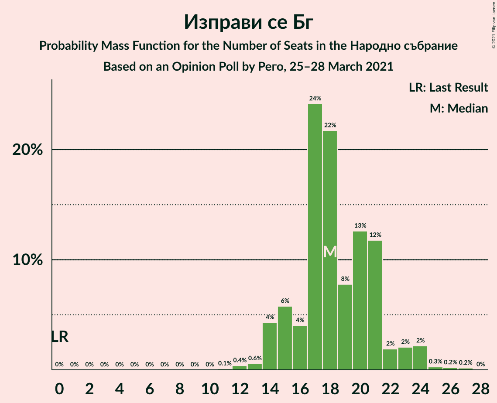

| Number of Seats | Probability | Accumulated | Special Marks |
|:---------------:|:-----------:|:-----------:|:-------------:|
| 0 | 0% | 100% | Last Result |
| 1 | 0% | 100% |  |
| 2 | 0% | 100% |  |
| 3 | 0% | 100% |  |
| 4 | 0% | 100% |  |
| 5 | 0% | 100% |  |
| 6 | 0% | 100% |  |
| 7 | 0% | 100% |  |
| 8 | 0% | 100% |  |
| 9 | 0% | 100% |  |
| 10 | 0% | 100% |  |
| 11 | 0.1% | 100% |  |
| 12 | 0.4% | 99.9% |  |
| 13 | 0.6% | 99.5% |  |
| 14 | 4% | 98.9% |  |
| 15 | 6% | 95% |  |
| 16 | 4% | 89% |  |
| 17 | 24% | 85% |  |
| 18 | 22% | 61% | Median |
| 19 | 8% | 39% |  |
| 20 | 13% | 31% |  |
| 21 | 12% | 19% |  |
| 22 | 2% | 7% |  |
| 23 | 2% | 5% |  |
| 24 | 2% | 3% |  |
| 25 | 0.3% | 0.7% |  |
| 26 | 0.2% | 0.4% |  |
| 27 | 0.2% | 0.2% |  |
| 28 | 0% | 0% |  |

### Демократична България

*For a full overview of the results for this party, see the [Демократична България](party-демократичнабългария.html) page.*

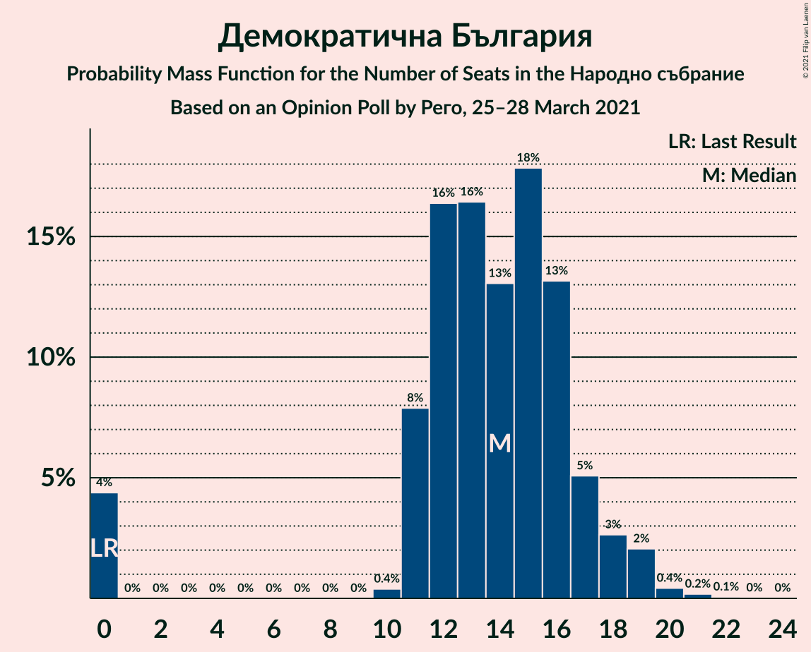

| Number of Seats | Probability | Accumulated | Special Marks |
|:---------------:|:-----------:|:-----------:|:-------------:|
| 0 | 4% | 100% | Last Result |
| 1 | 0% | 96% |  |
| 2 | 0% | 96% |  |
| 3 | 0% | 96% |  |
| 4 | 0% | 96% |  |
| 5 | 0% | 96% |  |
| 6 | 0% | 96% |  |
| 7 | 0% | 96% |  |
| 8 | 0% | 96% |  |
| 9 | 0% | 96% |  |
| 10 | 0.4% | 96% |  |
| 11 | 8% | 95% |  |
| 12 | 16% | 87% |  |
| 13 | 16% | 71% |  |
| 14 | 13% | 55% | Median |
| 15 | 18% | 41% |  |
| 16 | 13% | 24% |  |
| 17 | 5% | 10% |  |
| 18 | 3% | 5% |  |
| 19 | 2% | 3% |  |
| 20 | 0.4% | 0.7% |  |
| 21 | 0.2% | 0.3% |  |
| 22 | 0.1% | 0.1% |  |
| 23 | 0% | 0% |  |

### Обединени Патриоти

*For a full overview of the results for this party, see the [Обединени Патриоти](party-обединенипатриоти.html) page.*

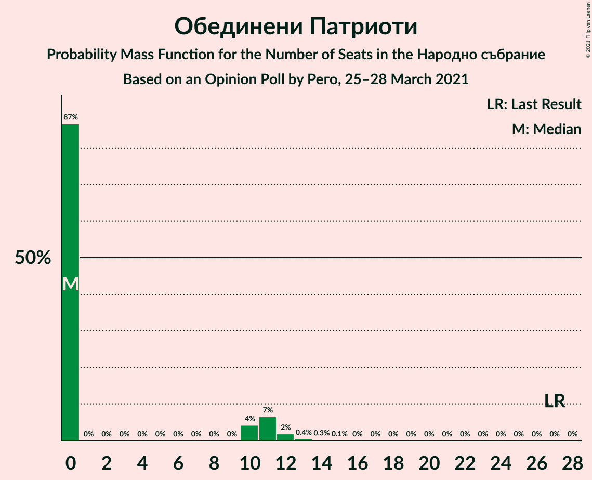

| Number of Seats | Probability | Accumulated | Special Marks |
|:---------------:|:-----------:|:-----------:|:-------------:|
| 0 | 87% | 100% | Median |
| 1 | 0% | 13% |  |
| 2 | 0% | 13% |  |
| 3 | 0% | 13% |  |
| 4 | 0% | 13% |  |
| 5 | 0% | 13% |  |
| 6 | 0% | 13% |  |
| 7 | 0% | 13% |  |
| 8 | 0% | 13% |  |
| 9 | 0% | 13% |  |
| 10 | 4% | 13% |  |
| 11 | 7% | 9% |  |
| 12 | 2% | 3% |  |
| 13 | 0.4% | 0.8% |  |
| 14 | 0.3% | 0.3% |  |
| 15 | 0.1% | 0.1% |  |
| 16 | 0% | 0% |  |
| 17 | 0% | 0% |  |
| 18 | 0% | 0% |  |
| 19 | 0% | 0% |  |
| 20 | 0% | 0% |  |
| 21 | 0% | 0% |  |
| 22 | 0% | 0% |  |
| 23 | 0% | 0% |  |
| 24 | 0% | 0% |  |
| 25 | 0% | 0% |  |
| 26 | 0% | 0% |  |
| 27 | 0% | 0% | Last Result |

### Възраждане

*For a full overview of the results for this party, see the [Възраждане](party-възраждане.html) page.*

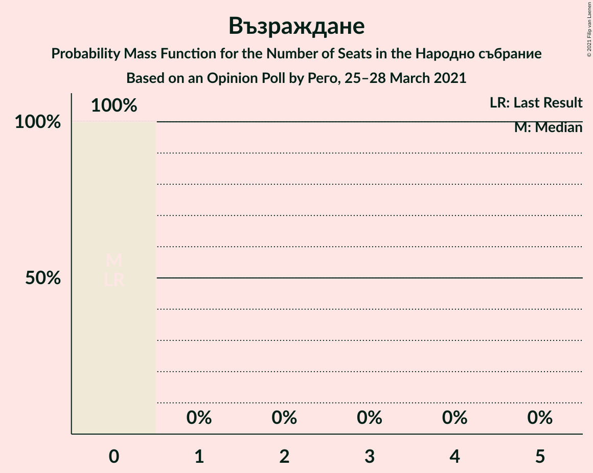

| Number of Seats | Probability | Accumulated | Special Marks |
|:---------------:|:-----------:|:-----------:|:-------------:|
| 0 | 100% | 100% | Last Result, Median |

### Воля–Национален фронт за спасение на България

*For a full overview of the results for this party, see the [Воля–Национален фронт за спасение на България](party-воля–националенфронтзаспасениенабългария.html) page.*

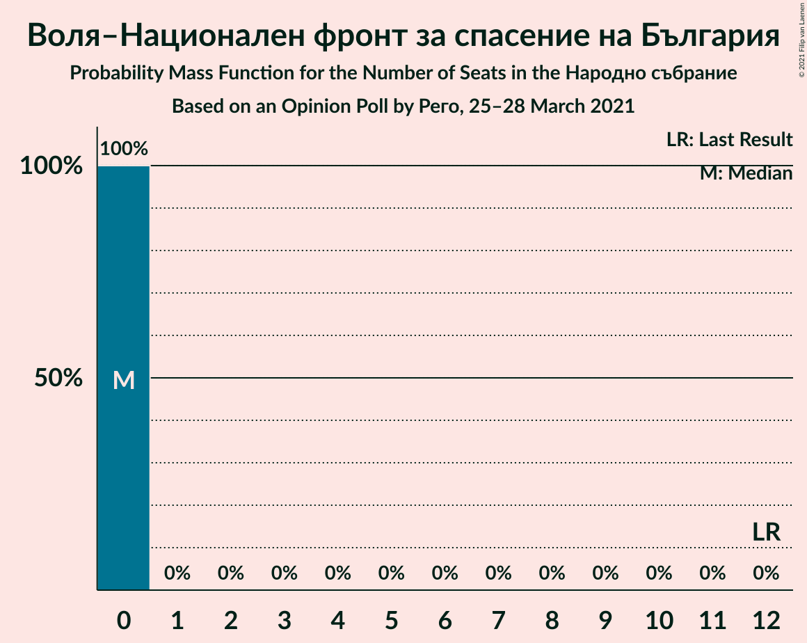

| Number of Seats | Probability | Accumulated | Special Marks |
|:---------------:|:-----------:|:-----------:|:-------------:|
| 0 | 100% | 100% | Median |
| 1 | 0% | 0% |  |
| 2 | 0% | 0% |  |
| 3 | 0% | 0% |  |
| 4 | 0% | 0% |  |
| 5 | 0% | 0% |  |
| 6 | 0% | 0% |  |
| 7 | 0% | 0% |  |
| 8 | 0% | 0% |  |
| 9 | 0% | 0% |  |
| 10 | 0% | 0% |  |
| 11 | 0% | 0% |  |
| 12 | 0% | 0% | Last Result |

## Coalitions

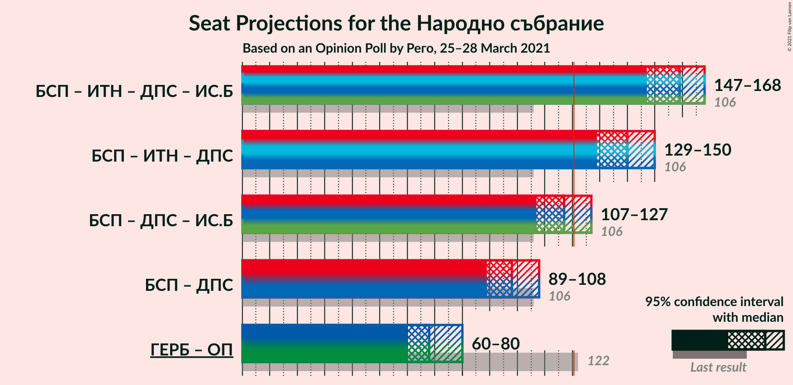

### Confidence Intervals

| Coalition | Last Result | Median | Majority? | 80% Confidence Interval | 90% Confidence Interval | 95% Confidence Interval | 99% Confidence Interval |
|:---------:|:-----------:|:------:|:---------:|:-----------------------:|:-----------------------:|:-----------------------:|:-----------------------:|
| Българска социалистическа партия – Има такъв народ – Движение за права и свободи – Изправи се Бг | 106 | 159 | 100% | 151–164 | 149–167 | 147–168 | 145–173 |
| Българска социалистическа партия – Има такъв народ – Движение за права и свободи | 106 | 140 | 100% | 133–146 | 132–149 | 129–150 | 127–153 |
| Българска социалистическа партия – Движение за права и свободи – Изправи се Бг | 106 | 117 | 22% | 111–123 | 108–125 | 107–127 | 103–129 |
| Българска социалистическа партия – Движение за права и свободи | 106 | 98 | 0% | 92–104 | 91–107 | 89–108 | 86–111 |
| Граждани за европейско развитие на България – Обединени Патриоти | 122 | 68 | 0% | 63–75 | 62–77 | 60–80 | 57–82 |

### Българска социалистическа партия – Има такъв народ – Движение за права и свободи – Изправи се Бг

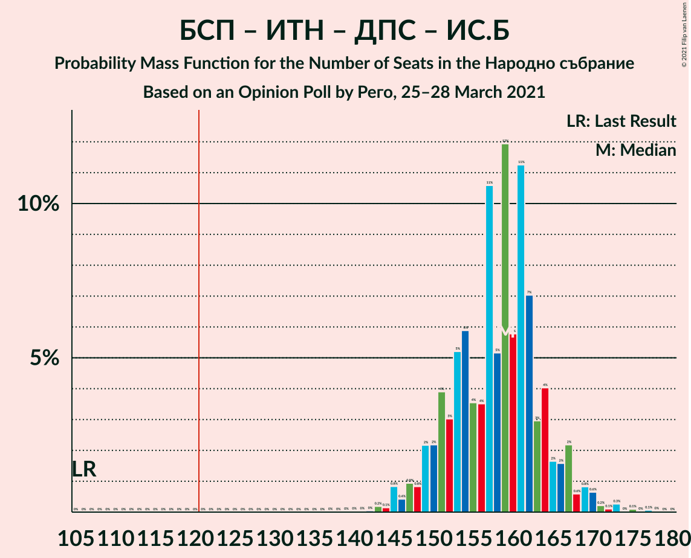

| Number of Seats | Probability | Accumulated | Special Marks |
|:---------------:|:-----------:|:-----------:|:-------------:|
| 106 | 0% | 100% | Last Result |
| 107 | 0% | 100% |  |
| 108 | 0% | 100% |  |
| 109 | 0% | 100% |  |
| 110 | 0% | 100% |  |
| 111 | 0% | 100% |  |
| 112 | 0% | 100% |  |
| 113 | 0% | 100% |  |
| 114 | 0% | 100% |  |
| 115 | 0% | 100% |  |
| 116 | 0% | 100% |  |
| 117 | 0% | 100% |  |
| 118 | 0% | 100% |  |
| 119 | 0% | 100% |  |
| 120 | 0% | 100% |  |
| 121 | 0% | 100% | Majority |
| 122 | 0% | 100% |  |
| 123 | 0% | 100% |  |
| 124 | 0% | 100% |  |
| 125 | 0% | 100% |  |
| 126 | 0% | 100% |  |
| 127 | 0% | 100% |  |
| 128 | 0% | 100% |  |
| 129 | 0% | 100% |  |
| 130 | 0% | 100% |  |
| 131 | 0% | 100% |  |
| 132 | 0% | 100% |  |
| 133 | 0% | 100% |  |
| 134 | 0% | 100% |  |
| 135 | 0% | 100% |  |
| 136 | 0% | 100% |  |
| 137 | 0% | 100% |  |
| 138 | 0% | 100% |  |
| 139 | 0% | 100% |  |
| 140 | 0% | 100% |  |
| 141 | 0% | 99.9% |  |
| 142 | 0% | 99.9% |  |
| 143 | 0.2% | 99.9% |  |
| 144 | 0.1% | 99.7% |  |
| 145 | 0.8% | 99.5% |  |
| 146 | 0.4% | 98.7% |  |
| 147 | 0.9% | 98% |  |
| 148 | 0.8% | 97% |  |
| 149 | 2% | 96% |  |
| 150 | 2% | 94% |  |
| 151 | 4% | 92% |  |
| 152 | 3% | 88% |  |
| 153 | 5% | 85% |  |
| 154 | 6% | 80% |  |
| 155 | 4% | 74% |  |
| 156 | 4% | 71% |  |
| 157 | 11% | 67% | Median |
| 158 | 5% | 56% |  |
| 159 | 12% | 51% |  |
| 160 | 6% | 39% |  |
| 161 | 11% | 34% |  |
| 162 | 7% | 22% |  |
| 163 | 3% | 15% |  |
| 164 | 4% | 12% |  |
| 165 | 2% | 8% |  |
| 166 | 2% | 7% |  |
| 167 | 2% | 5% |  |
| 168 | 0.6% | 3% |  |
| 169 | 0.8% | 2% |  |
| 170 | 0.6% | 1.5% |  |
| 171 | 0.2% | 0.8% |  |
| 172 | 0.1% | 0.6% |  |
| 173 | 0.3% | 0.5% |  |
| 174 | 0% | 0.3% |  |
| 175 | 0.1% | 0.2% |  |
| 176 | 0% | 0.1% |  |
| 177 | 0.1% | 0.1% |  |
| 178 | 0% | 0.1% |  |
| 179 | 0% | 0% |  |

### Българска социалистическа партия – Има такъв народ – Движение за права и свободи

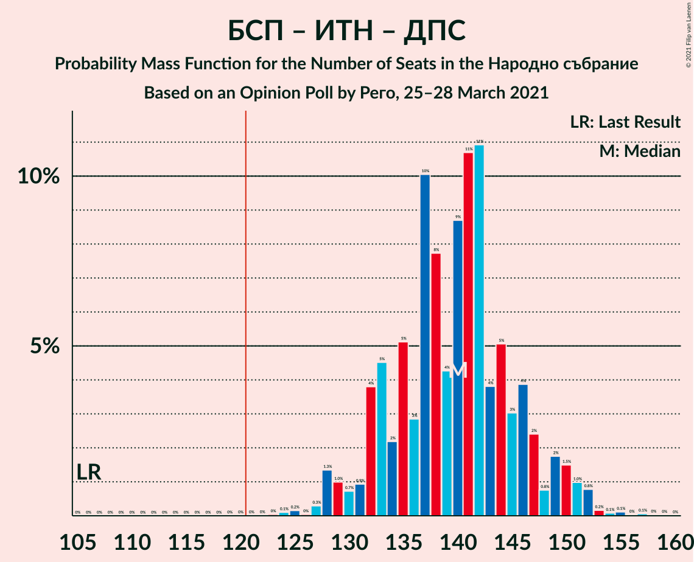

| Number of Seats | Probability | Accumulated | Special Marks |
|:---------------:|:-----------:|:-----------:|:-------------:|
| 106 | 0% | 100% | Last Result |
| 107 | 0% | 100% |  |
| 108 | 0% | 100% |  |
| 109 | 0% | 100% |  |
| 110 | 0% | 100% |  |
| 111 | 0% | 100% |  |
| 112 | 0% | 100% |  |
| 113 | 0% | 100% |  |
| 114 | 0% | 100% |  |
| 115 | 0% | 100% |  |
| 116 | 0% | 100% |  |
| 117 | 0% | 100% |  |
| 118 | 0% | 100% |  |
| 119 | 0% | 100% |  |
| 120 | 0% | 100% |  |
| 121 | 0% | 100% | Majority |
| 122 | 0% | 100% |  |
| 123 | 0% | 100% |  |
| 124 | 0.1% | 99.9% |  |
| 125 | 0.2% | 99.8% |  |
| 126 | 0% | 99.7% |  |
| 127 | 0.3% | 99.6% |  |
| 128 | 1.3% | 99.3% |  |
| 129 | 1.0% | 98% |  |
| 130 | 0.7% | 97% |  |
| 131 | 0.9% | 96% |  |
| 132 | 4% | 95% |  |
| 133 | 5% | 92% |  |
| 134 | 2% | 87% |  |
| 135 | 5% | 85% |  |
| 136 | 3% | 80% |  |
| 137 | 10% | 77% |  |
| 138 | 8% | 67% |  |
| 139 | 4% | 59% | Median |
| 140 | 9% | 55% |  |
| 141 | 11% | 46% |  |
| 142 | 11% | 35% |  |
| 143 | 4% | 24% |  |
| 144 | 5% | 21% |  |
| 145 | 3% | 16% |  |
| 146 | 4% | 13% |  |
| 147 | 2% | 9% |  |
| 148 | 0.8% | 6% |  |
| 149 | 2% | 6% |  |
| 150 | 1.5% | 4% |  |
| 151 | 1.0% | 2% |  |
| 152 | 0.8% | 1.3% |  |
| 153 | 0.2% | 0.5% |  |
| 154 | 0.1% | 0.4% |  |
| 155 | 0.1% | 0.3% |  |
| 156 | 0% | 0.2% |  |
| 157 | 0.1% | 0.1% |  |
| 158 | 0% | 0.1% |  |
| 159 | 0% | 0.1% |  |
| 160 | 0% | 0% |  |

### Българска социалистическа партия – Движение за права и свободи – Изправи се Бг

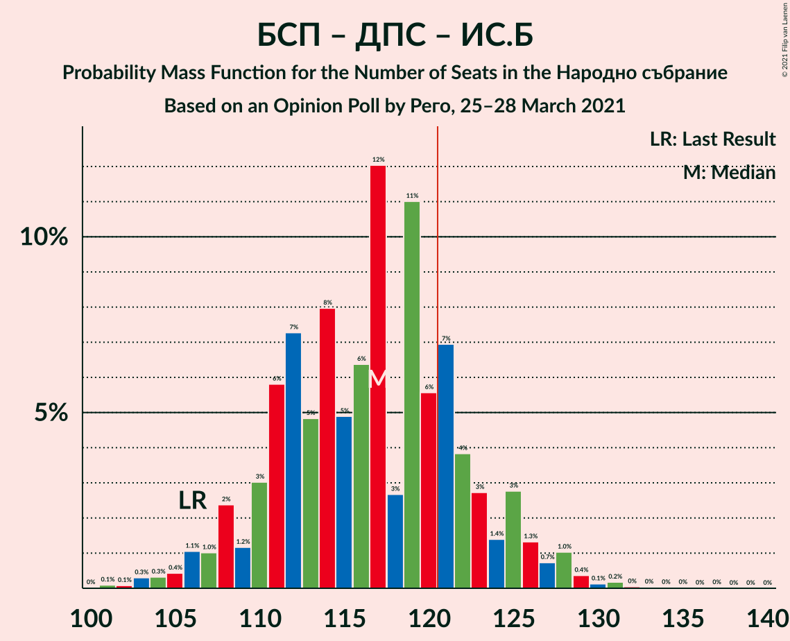

| Number of Seats | Probability | Accumulated | Special Marks |
|:---------------:|:-----------:|:-----------:|:-------------:|
| 100 | 0% | 100% |  |
| 101 | 0.1% | 99.9% |  |
| 102 | 0.1% | 99.8% |  |
| 103 | 0.3% | 99.8% |  |
| 104 | 0.3% | 99.5% |  |
| 105 | 0.4% | 99.1% |  |
| 106 | 1.1% | 98.7% | Last Result |
| 107 | 1.0% | 98% |  |
| 108 | 2% | 97% |  |
| 109 | 1.2% | 94% |  |
| 110 | 3% | 93% |  |
| 111 | 6% | 90% |  |
| 112 | 7% | 84% |  |
| 113 | 5% | 77% |  |
| 114 | 8% | 72% |  |
| 115 | 5% | 64% |  |
| 116 | 6% | 59% | Median |
| 117 | 12% | 53% |  |
| 118 | 3% | 41% |  |
| 119 | 11% | 38% |  |
| 120 | 6% | 27% |  |
| 121 | 7% | 22% | Majority |
| 122 | 4% | 15% |  |
| 123 | 3% | 11% |  |
| 124 | 1.4% | 8% |  |
| 125 | 3% | 7% |  |
| 126 | 1.3% | 4% |  |
| 127 | 0.7% | 3% |  |
| 128 | 1.0% | 2% |  |
| 129 | 0.4% | 0.8% |  |
| 130 | 0.1% | 0.5% |  |
| 131 | 0.2% | 0.3% |  |
| 132 | 0% | 0.2% |  |
| 133 | 0% | 0.1% |  |
| 134 | 0% | 0.1% |  |
| 135 | 0% | 0.1% |  |
| 136 | 0% | 0% |  |

### Българска социалистическа партия – Движение за права и свободи

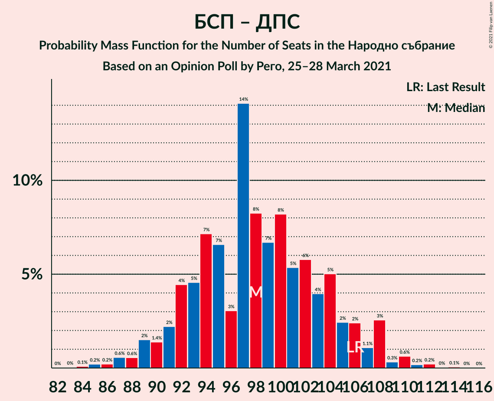

| Number of Seats | Probability | Accumulated | Special Marks |
|:---------------:|:-----------:|:-----------:|:-------------:|
| 83 | 0% | 100% |  |
| 84 | 0.1% | 99.9% |  |
| 85 | 0.2% | 99.8% |  |
| 86 | 0.2% | 99.6% |  |
| 87 | 0.6% | 99.4% |  |
| 88 | 0.6% | 98.8% |  |
| 89 | 2% | 98% |  |
| 90 | 1.4% | 97% |  |
| 91 | 2% | 95% |  |
| 92 | 4% | 93% |  |
| 93 | 5% | 89% |  |
| 94 | 7% | 84% |  |
| 95 | 7% | 77% |  |
| 96 | 3% | 70% |  |
| 97 | 14% | 67% |  |
| 98 | 8% | 53% | Median |
| 99 | 7% | 45% |  |
| 100 | 8% | 38% |  |
| 101 | 5% | 30% |  |
| 102 | 6% | 25% |  |
| 103 | 4% | 19% |  |
| 104 | 5% | 15% |  |
| 105 | 2% | 10% |  |
| 106 | 2% | 8% | Last Result |
| 107 | 1.1% | 5% |  |
| 108 | 3% | 4% |  |
| 109 | 0.3% | 2% |  |
| 110 | 0.6% | 1.2% |  |
| 111 | 0.2% | 0.6% |  |
| 112 | 0.2% | 0.4% |  |
| 113 | 0% | 0.2% |  |
| 114 | 0.1% | 0.1% |  |
| 115 | 0% | 0.1% |  |
| 116 | 0% | 0% |  |

### Граждани за европейско развитие на България – Обединени Патриоти

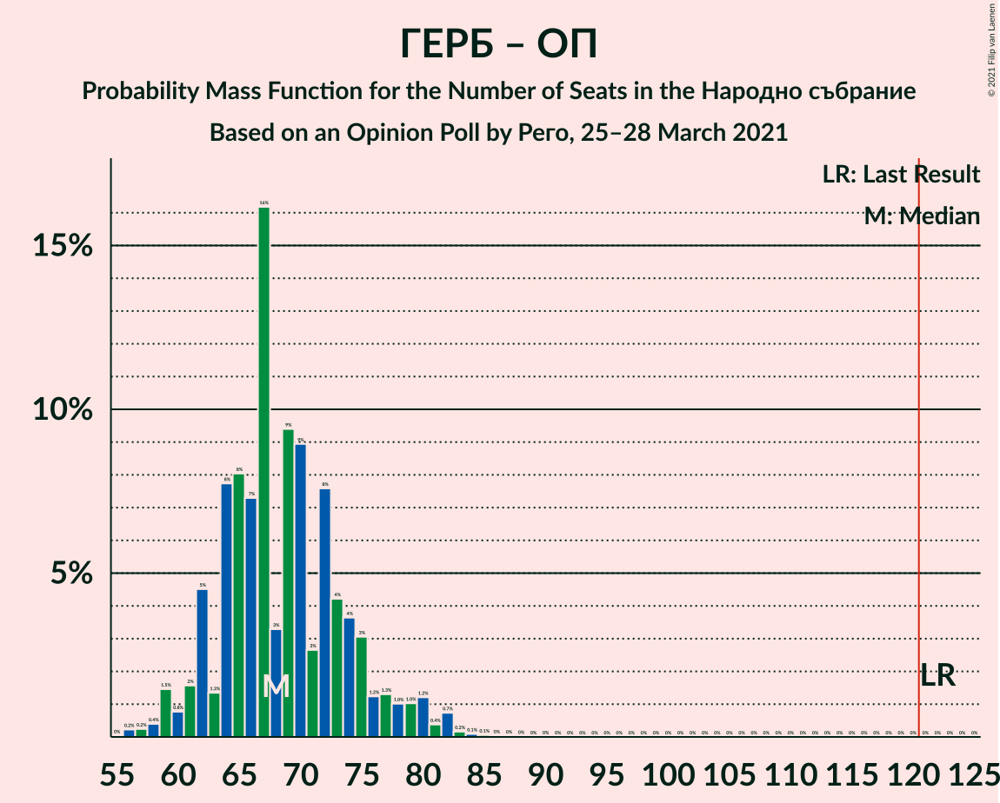

| Number of Seats | Probability | Accumulated | Special Marks |
|:---------------:|:-----------:|:-----------:|:-------------:|
| 55 | 0% | 100% |  |
| 56 | 0.2% | 99.9% |  |
| 57 | 0.2% | 99.7% |  |
| 58 | 0.4% | 99.4% |  |
| 59 | 1.5% | 99.0% |  |
| 60 | 0.8% | 98% |  |
| 61 | 2% | 97% |  |
| 62 | 5% | 95% |  |
| 63 | 1.3% | 91% |  |
| 64 | 8% | 89% |  |
| 65 | 8% | 82% |  |
| 66 | 7% | 74% |  |
| 67 | 16% | 66% | Median |
| 68 | 3% | 50% |  |
| 69 | 9% | 47% |  |
| 70 | 9% | 37% |  |
| 71 | 3% | 28% |  |
| 72 | 8% | 26% |  |
| 73 | 4% | 18% |  |
| 74 | 4% | 14% |  |
| 75 | 3% | 10% |  |
| 76 | 1.2% | 7% |  |
| 77 | 1.3% | 6% |  |
| 78 | 1.0% | 5% |  |
| 79 | 1.0% | 4% |  |
| 80 | 1.2% | 3% |  |
| 81 | 0.4% | 2% |  |
| 82 | 0.7% | 1.1% |  |
| 83 | 0.2% | 0.4% |  |
| 84 | 0.1% | 0.2% |  |
| 85 | 0.1% | 0.2% |  |
| 86 | 0% | 0.1% |  |
| 87 | 0% | 0.1% |  |
| 88 | 0% | 0% |  |
| 89 | 0% | 0% |  |
| 90 | 0% | 0% |  |
| 91 | 0% | 0% |  |
| 92 | 0% | 0% |  |
| 93 | 0% | 0% |  |
| 94 | 0% | 0% |  |
| 95 | 0% | 0% |  |
| 96 | 0% | 0% |  |
| 97 | 0% | 0% |  |
| 98 | 0% | 0% |  |
| 99 | 0% | 0% |  |
| 100 | 0% | 0% |  |
| 101 | 0% | 0% |  |
| 102 | 0% | 0% |  |
| 103 | 0% | 0% |  |
| 104 | 0% | 0% |  |
| 105 | 0% | 0% |  |
| 106 | 0% | 0% |  |
| 107 | 0% | 0% |  |
| 108 | 0% | 0% |  |
| 109 | 0% | 0% |  |
| 110 | 0% | 0% |  |
| 111 | 0% | 0% |  |
| 112 | 0% | 0% |  |
| 113 | 0% | 0% |  |
| 114 | 0% | 0% |  |
| 115 | 0% | 0% |  |
| 116 | 0% | 0% |  |
| 117 | 0% | 0% |  |
| 118 | 0% | 0% |  |
| 119 | 0% | 0% |  |
| 120 | 0% | 0% |  |
| 121 | 0% | 0% | Majority |
| 122 | 0% | 0% | Last Result |

## Technical Information

### Opinion Poll

+ **Polling firm:** Рего
+ **Commissioner(s):** —
+ **Fieldwork period:** 25–28 March 2021

### Calculations

+ **Sample size:** 746
+ **Simulations done:** 1,048,576
+ **Error estimate:** 1.34%

