# Opinion Poll by Exacta, 23–29 March 2021

<a href="#voting-intentions">Voting Intentions</a> | <a href="#seats">Seats</a> | <a href="#coalitions">Coalitions</a> | <a href="#technical-information">Technical Information</a>

## Voting Intentions

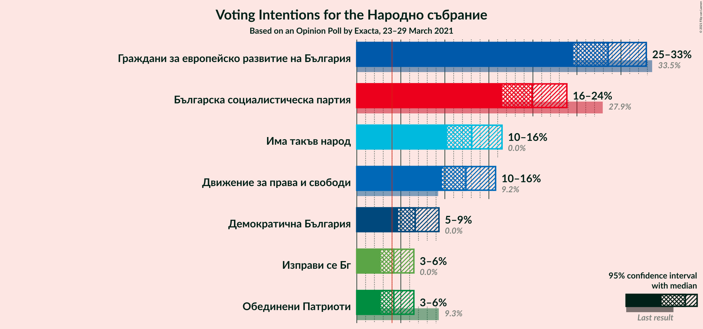

### Confidence Intervals

| Party | Last Result | Poll Result | 80% Confidence Interval | 90% Confidence Interval | 95% Confidence Interval | 99% Confidence Interval |
|:-----:|:-----------:|:-----------:|:-----------------------:|:-----------------------:|:-----------------------:|:-----------------------:|
| Граждани за европейско развитие на България | 33.5% | 28.5% | 25.9–31.4% |25.2–32.2% |24.6–32.9% |23.4–34.3% |
| Българска социалистическа партия | 27.9% | 19.9% | 17.7–22.5% |17.0–23.2% |16.5–23.9% |15.5–25.1% |
| Има такъв народ | 0.0% | 13.1% | 11.2–15.3% |10.7–15.9% |10.3–16.5% |9.4–17.6% |
| Движение за права и свободи | 9.2% | 12.4% | 10.6–14.6% |10.1–15.2% |9.7–15.8% |8.9–16.9% |
| Демократична България | 0.0% | 6.6% | 5.3–8.4% |5.0–8.9% |4.7–9.3% |4.1–10.2% |
| Обединени Патриоти | 9.3% | 4.2% | 3.2–5.7% |2.9–6.1% |2.7–6.5% |2.3–7.3% |
| Изправи се Бг | 0.0% | 4.2% | 3.2–5.7% |2.9–6.1% |2.7–6.5% |2.3–7.3% |

*Note:* The poll result column reflects the actual value used in the calculations. Published results may vary slightly, and in addition be rounded to fewer digits.

## Seats

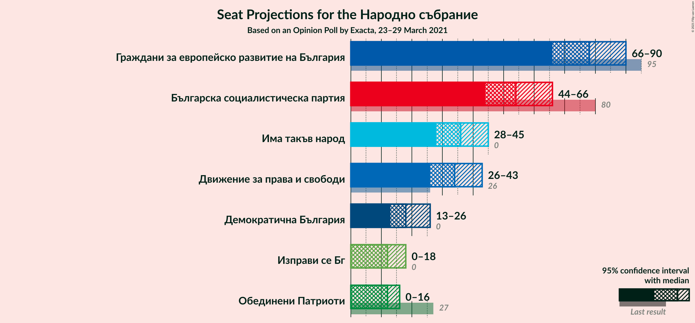

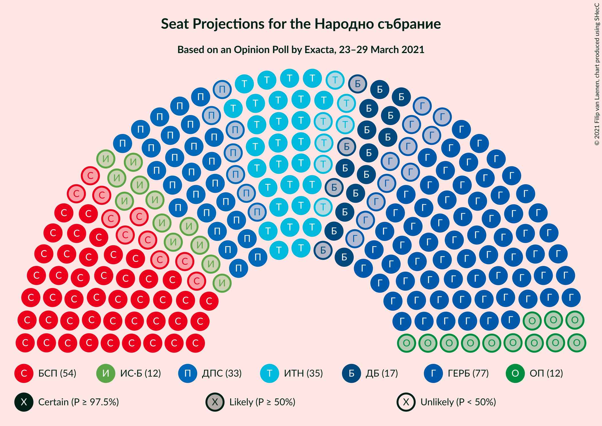

### Confidence Intervals

| Party | Last Result | Median | 80% Confidence Interval | 90% Confidence Interval | 95% Confidence Interval | 99% Confidence Interval |
|:-----:|:-----------:|:------:|:-----------------------:|:-----------------------:|:-----------------------:|:-----------------------:|
| <a href="#граждани-за-европейско-развитие-на-българия">Граждани за европейско развитие на България</a> | 95 | 78 | 70–86 |68–88 |66–90 |63–95 |
| <a href="#българска-социалистическа-партия">Българска социалистическа партия</a> | 80 | 54 | 48–62 |46–64 |44–66 |42–69 |
| <a href="#има-такъв-народ">Има такъв народ</a> | 0 | 36 | 30–42 |29–44 |28–45 |26–48 |
| <a href="#движение-за-права-и-свободи">Движение за права и свободи</a> | 26 | 34 | 29–40 |27–42 |26–43 |24–46 |
| <a href="#демократична-българия">Демократична България</a> | 0 | 18 | 14–23 |13–24 |13–26 |11–28 |
| <a href="#обединени-патриоти">Обединени Патриоти</a> | 27 | 12 | 0–16 |0–16 |0–16 |0–20 |
| <a href="#изправи-се-бг">Изправи се Бг</a> | 0 | 12 | 0–15 |0–17 |0–18 |0–20 |

### Граждани за европейско развитие на България

*For a full overview of the results for this party, see the [Граждани за европейско развитие на България](party-гражданизаевропейскоразвитиенабългария.html) page.*

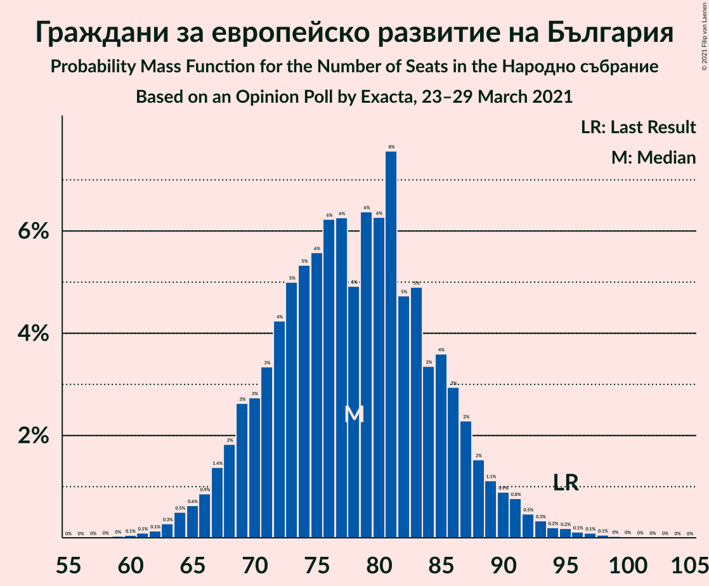

| Number of Seats | Probability | Accumulated | Special Marks |
|:---------------:|:-----------:|:-----------:|:-------------:|
| 59 | 0% | 100% |  |
| 60 | 0.1% | 99.9% |  |
| 61 | 0.1% | 99.9% |  |
| 62 | 0.1% | 99.8% |  |
| 63 | 0.3% | 99.7% |  |
| 64 | 0.5% | 99.4% |  |
| 65 | 0.6% | 98.9% |  |
| 66 | 0.9% | 98% |  |
| 67 | 1.4% | 97% |  |
| 68 | 2% | 96% |  |
| 69 | 3% | 94% |  |
| 70 | 3% | 92% |  |
| 71 | 3% | 89% |  |
| 72 | 4% | 85% |  |
| 73 | 5% | 81% |  |
| 74 | 5% | 76% |  |
| 75 | 6% | 71% |  |
| 76 | 6% | 65% |  |
| 77 | 6% | 59% |  |
| 78 | 5% | 53% | Median |
| 79 | 6% | 48% |  |
| 80 | 6% | 42% |  |
| 81 | 8% | 35% |  |
| 82 | 5% | 28% |  |
| 83 | 5% | 23% |  |
| 84 | 3% | 18% |  |
| 85 | 4% | 15% |  |
| 86 | 3% | 11% |  |
| 87 | 2% | 8% |  |
| 88 | 2% | 6% |  |
| 89 | 1.1% | 4% |  |
| 90 | 0.9% | 3% |  |
| 91 | 0.8% | 2% |  |
| 92 | 0.5% | 2% |  |
| 93 | 0.3% | 1.1% |  |
| 94 | 0.2% | 0.7% |  |
| 95 | 0.2% | 0.5% | Last Result |
| 96 | 0.1% | 0.4% |  |
| 97 | 0.1% | 0.2% |  |
| 98 | 0.1% | 0.2% |  |
| 99 | 0% | 0.1% |  |
| 100 | 0% | 0.1% |  |
| 101 | 0% | 0% |  |

### Българска социалистическа партия

*For a full overview of the results for this party, see the [Българска социалистическа партия](party-българскасоциалистическапартия.html) page.*

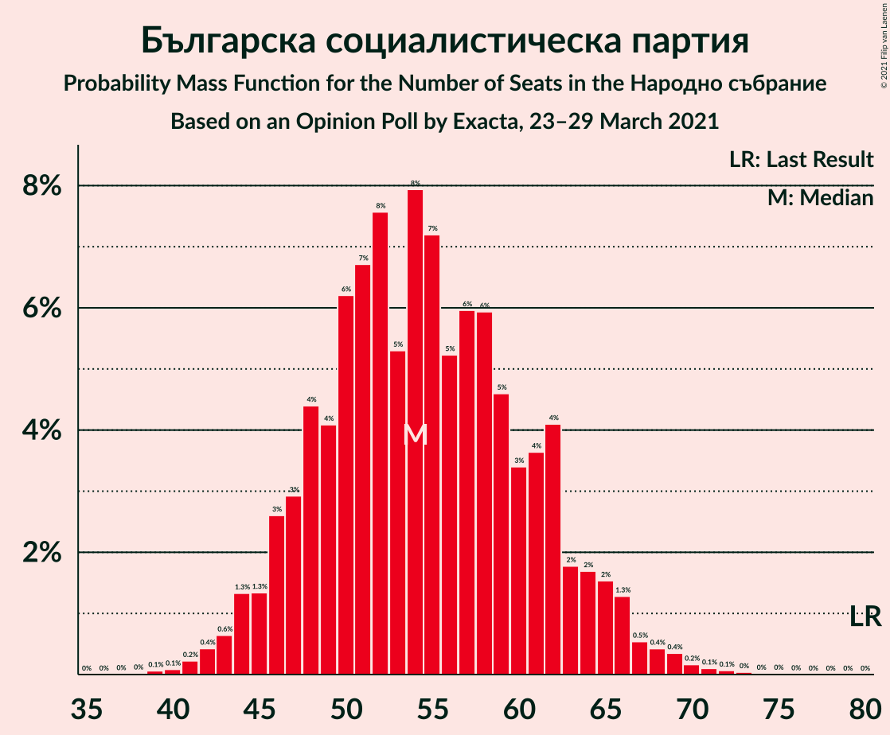

| Number of Seats | Probability | Accumulated | Special Marks |
|:---------------:|:-----------:|:-----------:|:-------------:|
| 39 | 0.1% | 100% |  |
| 40 | 0.1% | 99.9% |  |
| 41 | 0.2% | 99.8% |  |
| 42 | 0.4% | 99.6% |  |
| 43 | 0.6% | 99.2% |  |
| 44 | 1.3% | 98.5% |  |
| 45 | 1.3% | 97% |  |
| 46 | 3% | 96% |  |
| 47 | 3% | 93% |  |
| 48 | 4% | 90% |  |
| 49 | 4% | 86% |  |
| 50 | 6% | 82% |  |
| 51 | 7% | 76% |  |
| 52 | 8% | 69% |  |
| 53 | 5% | 61% |  |
| 54 | 8% | 56% | Median |
| 55 | 7% | 48% |  |
| 56 | 5% | 41% |  |
| 57 | 6% | 36% |  |
| 58 | 6% | 30% |  |
| 59 | 5% | 24% |  |
| 60 | 3% | 19% |  |
| 61 | 4% | 16% |  |
| 62 | 4% | 12% |  |
| 63 | 2% | 8% |  |
| 64 | 2% | 6% |  |
| 65 | 2% | 5% |  |
| 66 | 1.3% | 3% |  |
| 67 | 0.5% | 2% |  |
| 68 | 0.4% | 1.2% |  |
| 69 | 0.4% | 0.8% |  |
| 70 | 0.2% | 0.4% |  |
| 71 | 0.1% | 0.3% |  |
| 72 | 0.1% | 0.2% |  |
| 73 | 0% | 0.1% |  |
| 74 | 0% | 0% |  |
| 75 | 0% | 0% |  |
| 76 | 0% | 0% |  |
| 77 | 0% | 0% |  |
| 78 | 0% | 0% |  |
| 79 | 0% | 0% |  |
| 80 | 0% | 0% | Last Result |

### Има такъв народ

*For a full overview of the results for this party, see the [Има такъв народ](party-иматакъвнарод.html) page.*

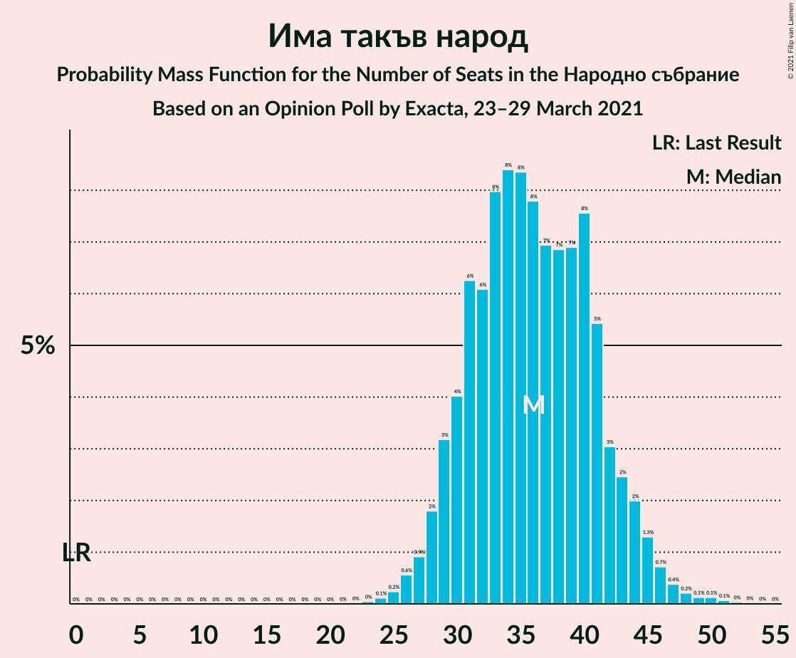

| Number of Seats | Probability | Accumulated | Special Marks |
|:---------------:|:-----------:|:-----------:|:-------------:|
| 0 | 0% | 100% | Last Result |
| 1 | 0% | 100% |  |
| 2 | 0% | 100% |  |
| 3 | 0% | 100% |  |
| 4 | 0% | 100% |  |
| 5 | 0% | 100% |  |
| 6 | 0% | 100% |  |
| 7 | 0% | 100% |  |
| 8 | 0% | 100% |  |
| 9 | 0% | 100% |  |
| 10 | 0% | 100% |  |
| 11 | 0% | 100% |  |
| 12 | 0% | 100% |  |
| 13 | 0% | 100% |  |
| 14 | 0% | 100% |  |
| 15 | 0% | 100% |  |
| 16 | 0% | 100% |  |
| 17 | 0% | 100% |  |
| 18 | 0% | 100% |  |
| 19 | 0% | 100% |  |
| 20 | 0% | 100% |  |
| 21 | 0% | 100% |  |
| 22 | 0% | 100% |  |
| 23 | 0% | 100% |  |
| 24 | 0.1% | 99.9% |  |
| 25 | 0.2% | 99.8% |  |
| 26 | 0.6% | 99.6% |  |
| 27 | 0.9% | 99.0% |  |
| 28 | 2% | 98% |  |
| 29 | 3% | 96% |  |
| 30 | 4% | 93% |  |
| 31 | 6% | 89% |  |
| 32 | 6% | 83% |  |
| 33 | 8% | 77% |  |
| 34 | 8% | 69% |  |
| 35 | 8% | 60% |  |
| 36 | 8% | 52% | Median |
| 37 | 7% | 44% |  |
| 38 | 7% | 37% |  |
| 39 | 7% | 30% |  |
| 40 | 8% | 24% |  |
| 41 | 5% | 16% |  |
| 42 | 3% | 11% |  |
| 43 | 2% | 7% |  |
| 44 | 2% | 5% |  |
| 45 | 1.3% | 3% |  |
| 46 | 0.7% | 2% |  |
| 47 | 0.4% | 1.0% |  |
| 48 | 0.2% | 0.6% |  |
| 49 | 0.1% | 0.4% |  |
| 50 | 0.1% | 0.3% |  |
| 51 | 0.1% | 0.1% |  |
| 52 | 0% | 0.1% |  |
| 53 | 0% | 0% |  |

### Движение за права и свободи

*For a full overview of the results for this party, see the [Движение за права и свободи](party-движениезаправаисвободи.html) page.*

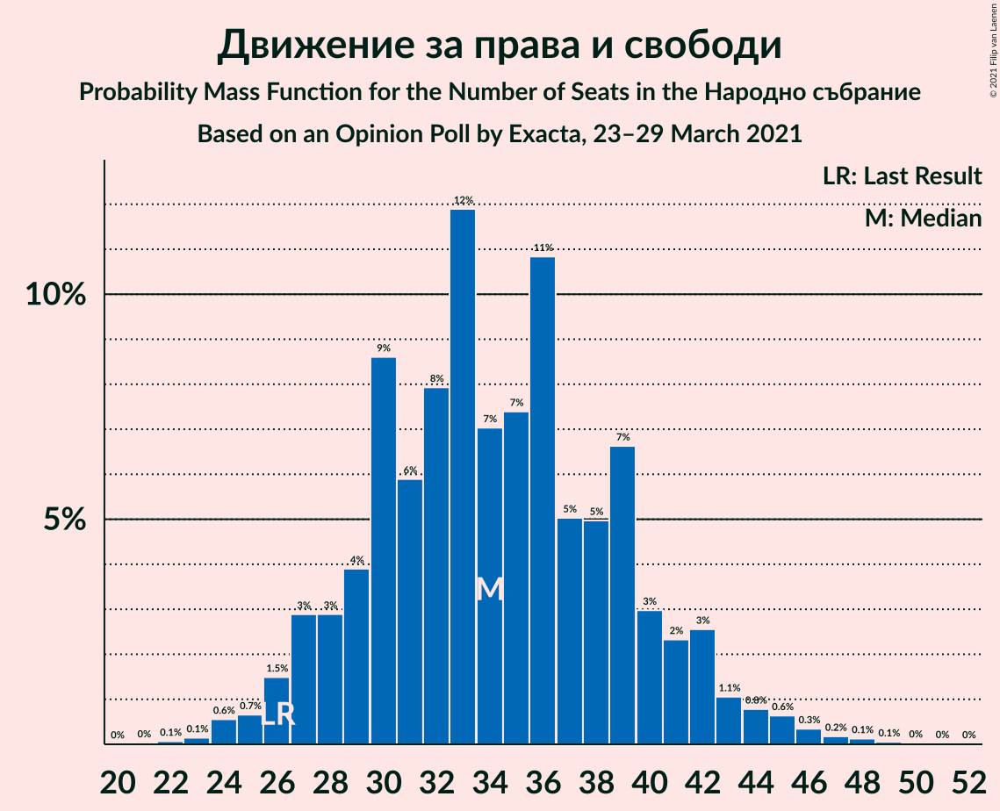

| Number of Seats | Probability | Accumulated | Special Marks |
|:---------------:|:-----------:|:-----------:|:-------------:|
| 22 | 0.1% | 100% |  |
| 23 | 0.1% | 99.9% |  |
| 24 | 0.6% | 99.7% |  |
| 25 | 0.7% | 99.2% |  |
| 26 | 1.5% | 98.5% | Last Result |
| 27 | 3% | 97% |  |
| 28 | 3% | 94% |  |
| 29 | 4% | 91% |  |
| 30 | 9% | 87% |  |
| 31 | 6% | 79% |  |
| 32 | 8% | 73% |  |
| 33 | 12% | 65% |  |
| 34 | 7% | 53% | Median |
| 35 | 7% | 46% |  |
| 36 | 11% | 39% |  |
| 37 | 5% | 28% |  |
| 38 | 5% | 23% |  |
| 39 | 7% | 18% |  |
| 40 | 3% | 11% |  |
| 41 | 2% | 8% |  |
| 42 | 3% | 6% |  |
| 43 | 1.1% | 3% |  |
| 44 | 0.8% | 2% |  |
| 45 | 0.6% | 1.4% |  |
| 46 | 0.3% | 0.8% |  |
| 47 | 0.2% | 0.4% |  |
| 48 | 0.1% | 0.2% |  |
| 49 | 0.1% | 0.1% |  |
| 50 | 0% | 0.1% |  |
| 51 | 0% | 0% |  |

### Демократична България

*For a full overview of the results for this party, see the [Демократична България](party-демократичнабългария.html) page.*

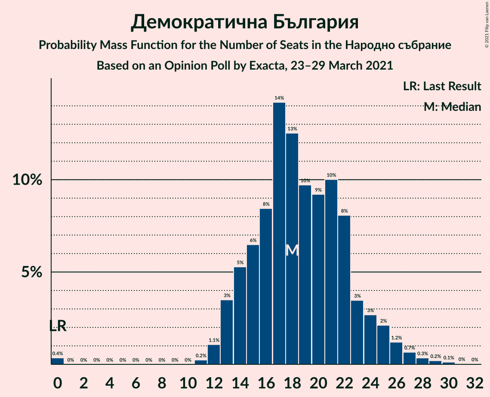

| Number of Seats | Probability | Accumulated | Special Marks |
|:---------------:|:-----------:|:-----------:|:-------------:|
| 0 | 0.4% | 100% | Last Result |
| 1 | 0% | 99.6% |  |
| 2 | 0% | 99.6% |  |
| 3 | 0% | 99.6% |  |
| 4 | 0% | 99.6% |  |
| 5 | 0% | 99.6% |  |
| 6 | 0% | 99.6% |  |
| 7 | 0% | 99.6% |  |
| 8 | 0% | 99.6% |  |
| 9 | 0% | 99.6% |  |
| 10 | 0% | 99.6% |  |
| 11 | 0.2% | 99.6% |  |
| 12 | 1.1% | 99.4% |  |
| 13 | 3% | 98% |  |
| 14 | 5% | 95% |  |
| 15 | 6% | 90% |  |
| 16 | 8% | 83% |  |
| 17 | 14% | 75% |  |
| 18 | 13% | 60% | Median |
| 19 | 10% | 48% |  |
| 20 | 9% | 38% |  |
| 21 | 10% | 29% |  |
| 22 | 8% | 19% |  |
| 23 | 3% | 11% |  |
| 24 | 3% | 7% |  |
| 25 | 2% | 5% |  |
| 26 | 1.2% | 3% |  |
| 27 | 0.7% | 1.4% |  |
| 28 | 0.3% | 0.8% |  |
| 29 | 0.2% | 0.4% |  |
| 30 | 0.1% | 0.2% |  |
| 31 | 0% | 0.1% |  |
| 32 | 0% | 0% |  |

### Обединени Патриоти

*For a full overview of the results for this party, see the [Обединени Патриоти](party-обединенипатриоти.html) page.*

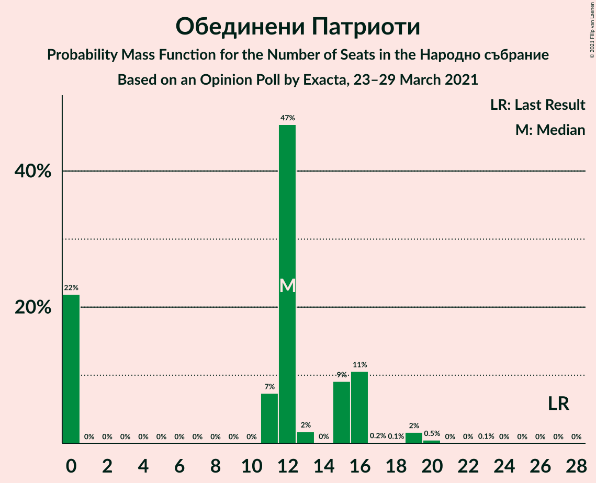

| Number of Seats | Probability | Accumulated | Special Marks |
|:---------------:|:-----------:|:-----------:|:-------------:|
| 0 | 22% | 100% |  |
| 1 | 0% | 78% |  |
| 2 | 0% | 78% |  |
| 3 | 0% | 78% |  |
| 4 | 0% | 78% |  |
| 5 | 0% | 78% |  |
| 6 | 0% | 78% |  |
| 7 | 0% | 78% |  |
| 8 | 0% | 78% |  |
| 9 | 0% | 78% |  |
| 10 | 0% | 78% |  |
| 11 | 7% | 78% |  |
| 12 | 47% | 71% | Median |
| 13 | 2% | 24% |  |
| 14 | 0% | 22% |  |
| 15 | 9% | 22% |  |
| 16 | 11% | 13% |  |
| 17 | 0.2% | 2% |  |
| 18 | 0.1% | 2% |  |
| 19 | 2% | 2% |  |
| 20 | 0.5% | 0.6% |  |
| 21 | 0% | 0.1% |  |
| 22 | 0% | 0.1% |  |
| 23 | 0.1% | 0.1% |  |
| 24 | 0% | 0% |  |
| 25 | 0% | 0% |  |
| 26 | 0% | 0% |  |
| 27 | 0% | 0% | Last Result |

### Изправи се Бг

*For a full overview of the results for this party, see the [Изправи се Бг](party-изправисебг.html) page.*

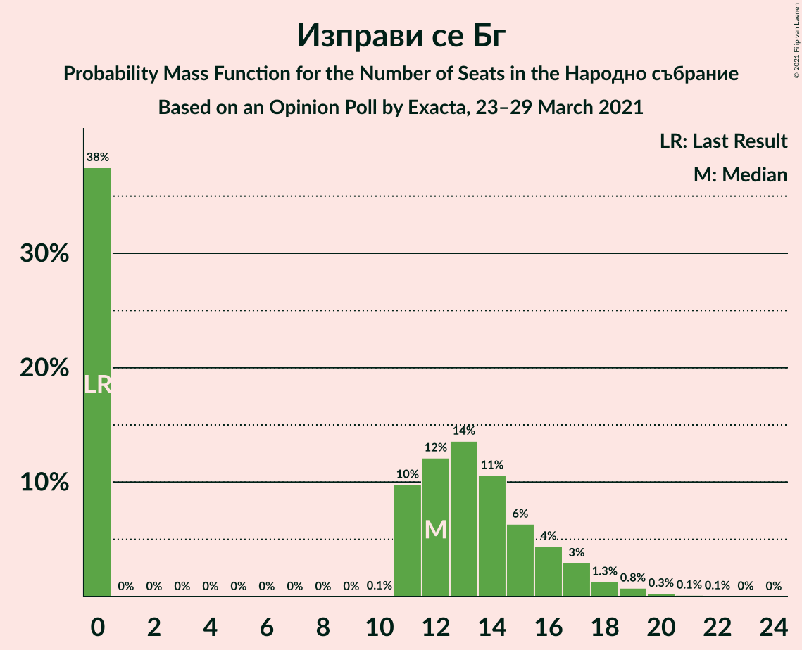

| Number of Seats | Probability | Accumulated | Special Marks |
|:---------------:|:-----------:|:-----------:|:-------------:|
| 0 | 38% | 100% | Last Result |
| 1 | 0% | 62% |  |
| 2 | 0% | 62% |  |
| 3 | 0% | 62% |  |
| 4 | 0% | 62% |  |
| 5 | 0% | 62% |  |
| 6 | 0% | 62% |  |
| 7 | 0% | 62% |  |
| 8 | 0% | 62% |  |
| 9 | 0% | 62% |  |
| 10 | 0.1% | 62% |  |
| 11 | 10% | 62% |  |
| 12 | 12% | 53% | Median |
| 13 | 14% | 41% |  |
| 14 | 11% | 27% |  |
| 15 | 6% | 16% |  |
| 16 | 4% | 10% |  |
| 17 | 3% | 6% |  |
| 18 | 1.3% | 3% |  |
| 19 | 0.8% | 1.3% |  |
| 20 | 0.3% | 0.6% |  |
| 21 | 0.1% | 0.3% |  |
| 22 | 0.1% | 0.1% |  |
| 23 | 0% | 0% |  |

## Coalitions

### Confidence Intervals

| Coalition | Last Result | Median | Majority? | 80% Confidence Interval | 90% Confidence Interval | 95% Confidence Interval | 99% Confidence Interval |
|:---------:|:-----------:|:------:|:---------:|:-----------------------:|:-----------------------:|:-----------------------:|:-----------------------:|
| Българска социалистическа партия – Има такъв народ – Движение за права и свободи – Изправи се Бг | 106 | 133 | 96% | 124–143 | 122–146 | 119–148 | 114–153 |
| Българска социалистическа партия – Има такъв народ – Движение за права и свободи | 106 | 125 | 69% | 115–135 | 113–138 | 111–140 | 108–145 |
| Българска социалистическа партия – Движение за права и свободи – Изправи се Бг | 106 | 97 | 0.1% | 88–107 | 84–110 | 82–112 | 78–116 |
| Българска социалистическа партия – Движение за права и свободи | 106 | 89 | 0% | 80–98 | 78–100 | 77–102 | 73–107 |
| Граждани за европейско развитие на България – Обединени Патриоти | 122 | 88 | 0% | 79–97 | 76–99 | 73–102 | 69–106 |

### Българска социалистическа партия – Има такъв народ – Движение за права и свободи – Изправи се Бг

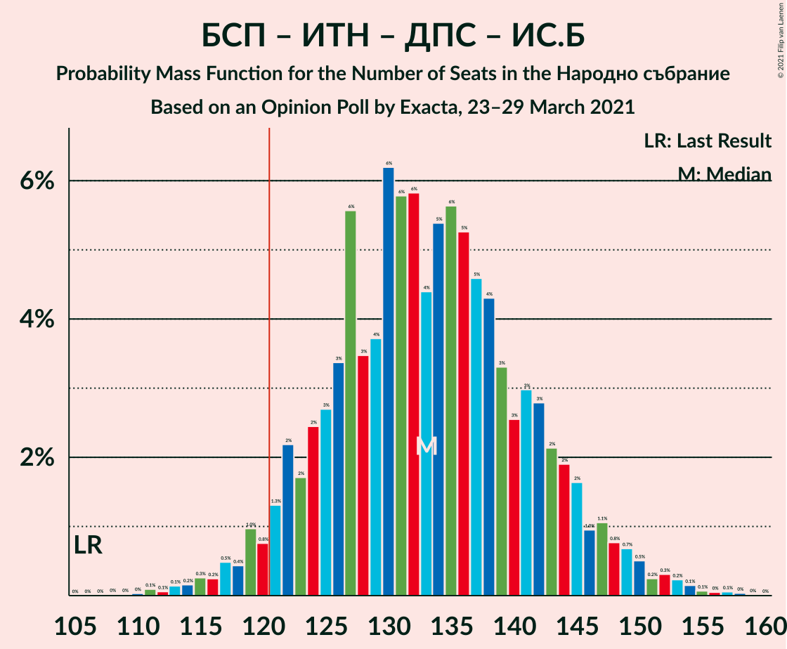

| Number of Seats | Probability | Accumulated | Special Marks |
|:---------------:|:-----------:|:-----------:|:-------------:|
| 106 | 0% | 100% | Last Result |
| 107 | 0% | 100% |  |
| 108 | 0% | 100% |  |
| 109 | 0% | 100% |  |
| 110 | 0% | 100% |  |
| 111 | 0.1% | 99.9% |  |
| 112 | 0.1% | 99.8% |  |
| 113 | 0.1% | 99.8% |  |
| 114 | 0.2% | 99.6% |  |
| 115 | 0.3% | 99.5% |  |
| 116 | 0.2% | 99.2% |  |
| 117 | 0.5% | 99.0% |  |
| 118 | 0.4% | 98% |  |
| 119 | 1.0% | 98% |  |
| 120 | 0.8% | 97% |  |
| 121 | 1.3% | 96% | Majority |
| 122 | 2% | 95% |  |
| 123 | 2% | 93% |  |
| 124 | 2% | 91% |  |
| 125 | 3% | 89% |  |
| 126 | 3% | 86% |  |
| 127 | 6% | 83% |  |
| 128 | 3% | 77% |  |
| 129 | 4% | 74% |  |
| 130 | 6% | 70% |  |
| 131 | 6% | 64% |  |
| 132 | 6% | 58% |  |
| 133 | 4% | 52% |  |
| 134 | 5% | 48% |  |
| 135 | 6% | 42% |  |
| 136 | 5% | 37% | Median |
| 137 | 5% | 31% |  |
| 138 | 4% | 27% |  |
| 139 | 3% | 22% |  |
| 140 | 3% | 19% |  |
| 141 | 3% | 17% |  |
| 142 | 3% | 14% |  |
| 143 | 2% | 11% |  |
| 144 | 2% | 9% |  |
| 145 | 2% | 7% |  |
| 146 | 1.0% | 5% |  |
| 147 | 1.1% | 4% |  |
| 148 | 0.8% | 3% |  |
| 149 | 0.7% | 2% |  |
| 150 | 0.5% | 2% |  |
| 151 | 0.2% | 1.2% |  |
| 152 | 0.3% | 0.9% |  |
| 153 | 0.2% | 0.6% |  |
| 154 | 0.1% | 0.4% |  |
| 155 | 0.1% | 0.2% |  |
| 156 | 0% | 0.2% |  |
| 157 | 0.1% | 0.1% |  |
| 158 | 0% | 0.1% |  |
| 159 | 0% | 0% |  |

### Българска социалистическа партия – Има такъв народ – Движение за права и свободи

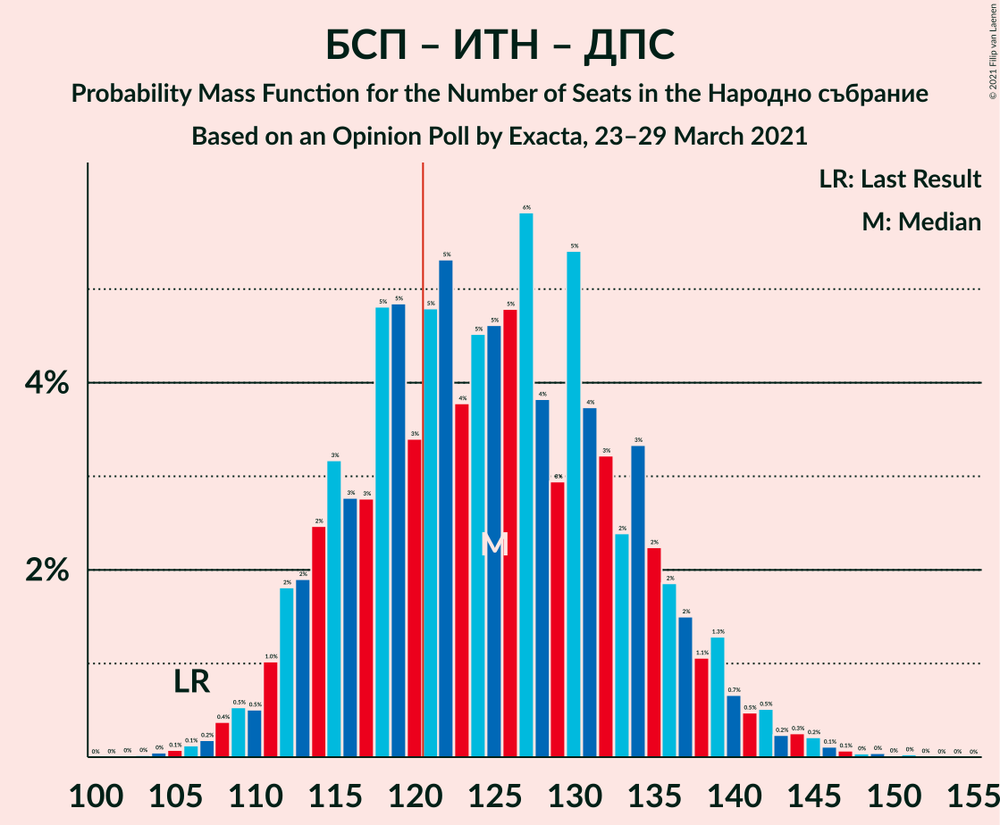

| Number of Seats | Probability | Accumulated | Special Marks |
|:---------------:|:-----------:|:-----------:|:-------------:|
| 103 | 0% | 100% |  |
| 104 | 0% | 99.9% |  |
| 105 | 0.1% | 99.9% |  |
| 106 | 0.1% | 99.8% | Last Result |
| 107 | 0.2% | 99.7% |  |
| 108 | 0.4% | 99.5% |  |
| 109 | 0.5% | 99.1% |  |
| 110 | 0.5% | 98.6% |  |
| 111 | 1.0% | 98% |  |
| 112 | 2% | 97% |  |
| 113 | 2% | 95% |  |
| 114 | 2% | 93% |  |
| 115 | 3% | 91% |  |
| 116 | 3% | 88% |  |
| 117 | 3% | 85% |  |
| 118 | 5% | 82% |  |
| 119 | 5% | 77% |  |
| 120 | 3% | 73% |  |
| 121 | 5% | 69% | Majority |
| 122 | 5% | 64% |  |
| 123 | 4% | 59% |  |
| 124 | 5% | 55% | Median |
| 125 | 5% | 51% |  |
| 126 | 5% | 46% |  |
| 127 | 6% | 41% |  |
| 128 | 4% | 36% |  |
| 129 | 3% | 32% |  |
| 130 | 5% | 29% |  |
| 131 | 4% | 23% |  |
| 132 | 3% | 20% |  |
| 133 | 2% | 16% |  |
| 134 | 3% | 14% |  |
| 135 | 2% | 11% |  |
| 136 | 2% | 8% |  |
| 137 | 2% | 7% |  |
| 138 | 1.1% | 5% |  |
| 139 | 1.3% | 4% |  |
| 140 | 0.7% | 3% |  |
| 141 | 0.5% | 2% |  |
| 142 | 0.5% | 2% |  |
| 143 | 0.2% | 1.0% |  |
| 144 | 0.3% | 0.8% |  |
| 145 | 0.2% | 0.5% |  |
| 146 | 0.1% | 0.3% |  |
| 147 | 0.1% | 0.2% |  |
| 148 | 0% | 0.2% |  |
| 149 | 0% | 0.1% |  |
| 150 | 0% | 0.1% |  |
| 151 | 0% | 0.1% |  |
| 152 | 0% | 0% |  |

### Българска социалистическа партия – Движение за права и свободи – Изправи се Бг

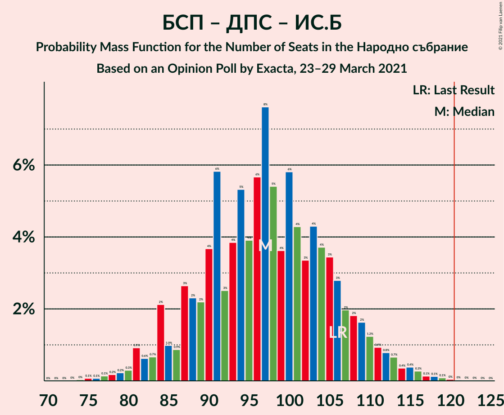

| Number of Seats | Probability | Accumulated | Special Marks |
|:---------------:|:-----------:|:-----------:|:-------------:|
| 74 | 0% | 100% |  |
| 75 | 0.1% | 99.9% |  |
| 76 | 0.1% | 99.9% |  |
| 77 | 0.1% | 99.8% |  |
| 78 | 0.2% | 99.7% |  |
| 79 | 0.2% | 99.5% |  |
| 80 | 0.3% | 99.3% |  |
| 81 | 0.9% | 99.0% |  |
| 82 | 0.6% | 98% |  |
| 83 | 0.7% | 97% |  |
| 84 | 2% | 97% |  |
| 85 | 1.0% | 95% |  |
| 86 | 0.9% | 94% |  |
| 87 | 3% | 93% |  |
| 88 | 2% | 90% |  |
| 89 | 2% | 88% |  |
| 90 | 4% | 86% |  |
| 91 | 6% | 82% |  |
| 92 | 3% | 76% |  |
| 93 | 4% | 74% |  |
| 94 | 5% | 70% |  |
| 95 | 4% | 64% |  |
| 96 | 6% | 61% |  |
| 97 | 8% | 55% |  |
| 98 | 5% | 47% |  |
| 99 | 4% | 42% |  |
| 100 | 6% | 38% | Median |
| 101 | 4% | 32% |  |
| 102 | 3% | 28% |  |
| 103 | 4% | 25% |  |
| 104 | 4% | 20% |  |
| 105 | 3% | 17% |  |
| 106 | 3% | 13% | Last Result |
| 107 | 2% | 11% |  |
| 108 | 2% | 9% |  |
| 109 | 2% | 7% |  |
| 110 | 1.2% | 5% |  |
| 111 | 0.9% | 4% |  |
| 112 | 0.8% | 3% |  |
| 113 | 0.7% | 2% |  |
| 114 | 0.4% | 1.5% |  |
| 115 | 0.4% | 1.1% |  |
| 116 | 0.3% | 0.7% |  |
| 117 | 0.1% | 0.5% |  |
| 118 | 0.1% | 0.3% |  |
| 119 | 0.1% | 0.2% |  |
| 120 | 0% | 0.1% |  |
| 121 | 0% | 0.1% | Majority |
| 122 | 0% | 0.1% |  |
| 123 | 0% | 0% |  |

### Българска социалистическа партия – Движение за права и свободи

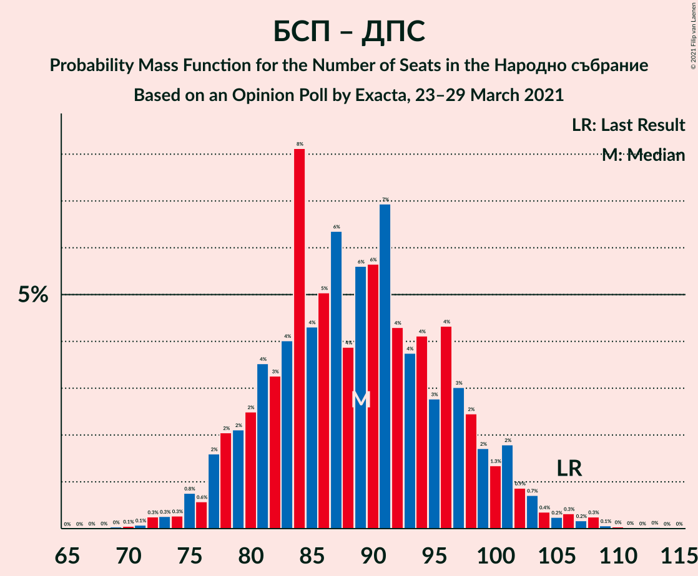

| Number of Seats | Probability | Accumulated | Special Marks |
|:---------------:|:-----------:|:-----------:|:-------------:|
| 69 | 0% | 100% |  |
| 70 | 0.1% | 99.9% |  |
| 71 | 0.1% | 99.9% |  |
| 72 | 0.3% | 99.8% |  |
| 73 | 0.3% | 99.5% |  |
| 74 | 0.3% | 99.3% |  |
| 75 | 0.8% | 99.0% |  |
| 76 | 0.6% | 98% |  |
| 77 | 2% | 98% |  |
| 78 | 2% | 96% |  |
| 79 | 2% | 94% |  |
| 80 | 2% | 92% |  |
| 81 | 4% | 89% |  |
| 82 | 3% | 86% |  |
| 83 | 4% | 83% |  |
| 84 | 8% | 79% |  |
| 85 | 4% | 70% |  |
| 86 | 5% | 66% |  |
| 87 | 6% | 61% |  |
| 88 | 4% | 55% | Median |
| 89 | 6% | 51% |  |
| 90 | 6% | 45% |  |
| 91 | 7% | 40% |  |
| 92 | 4% | 33% |  |
| 93 | 4% | 28% |  |
| 94 | 4% | 25% |  |
| 95 | 3% | 21% |  |
| 96 | 4% | 18% |  |
| 97 | 3% | 13% |  |
| 98 | 2% | 10% |  |
| 99 | 2% | 8% |  |
| 100 | 1.3% | 6% |  |
| 101 | 2% | 5% |  |
| 102 | 0.9% | 3% |  |
| 103 | 0.7% | 2% |  |
| 104 | 0.4% | 2% |  |
| 105 | 0.2% | 1.2% |  |
| 106 | 0.3% | 0.9% | Last Result |
| 107 | 0.2% | 0.6% |  |
| 108 | 0.3% | 0.4% |  |
| 109 | 0.1% | 0.2% |  |
| 110 | 0% | 0.1% |  |
| 111 | 0% | 0.1% |  |
| 112 | 0% | 0.1% |  |
| 113 | 0% | 0% |  |

### Граждани за европейско развитие на България – Обединени Патриоти

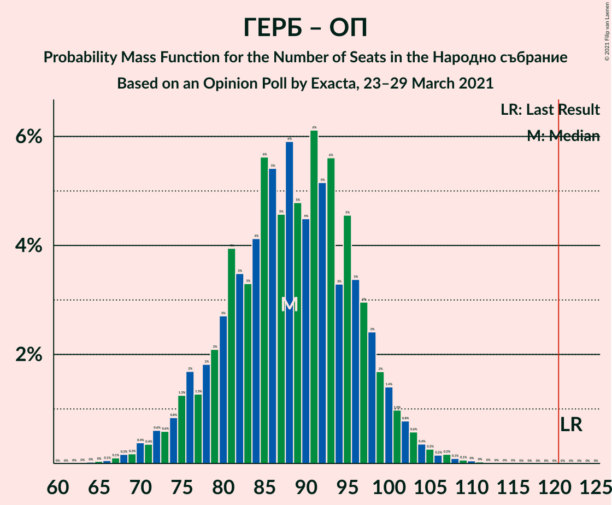

| Number of Seats | Probability | Accumulated | Special Marks |
|:---------------:|:-----------:|:-----------:|:-------------:|
| 64 | 0% | 100% |  |
| 65 | 0% | 99.9% |  |
| 66 | 0.1% | 99.9% |  |
| 67 | 0.1% | 99.9% |  |
| 68 | 0.2% | 99.7% |  |
| 69 | 0.2% | 99.6% |  |
| 70 | 0.4% | 99.4% |  |
| 71 | 0.4% | 99.0% |  |
| 72 | 0.6% | 98.7% |  |
| 73 | 0.6% | 98% |  |
| 74 | 0.8% | 97% |  |
| 75 | 1.3% | 97% |  |
| 76 | 2% | 95% |  |
| 77 | 1.3% | 94% |  |
| 78 | 2% | 92% |  |
| 79 | 2% | 91% |  |
| 80 | 3% | 89% |  |
| 81 | 4% | 86% |  |
| 82 | 3% | 82% |  |
| 83 | 3% | 78% |  |
| 84 | 4% | 75% |  |
| 85 | 6% | 71% |  |
| 86 | 5% | 65% |  |
| 87 | 5% | 60% |  |
| 88 | 6% | 55% |  |
| 89 | 5% | 49% |  |
| 90 | 4% | 45% | Median |
| 91 | 6% | 40% |  |
| 92 | 5% | 34% |  |
| 93 | 6% | 29% |  |
| 94 | 3% | 23% |  |
| 95 | 5% | 20% |  |
| 96 | 3% | 15% |  |
| 97 | 3% | 12% |  |
| 98 | 2% | 9% |  |
| 99 | 2% | 7% |  |
| 100 | 1.4% | 5% |  |
| 101 | 1.0% | 4% |  |
| 102 | 0.8% | 3% |  |
| 103 | 0.6% | 2% |  |
| 104 | 0.4% | 1.2% |  |
| 105 | 0.3% | 0.9% |  |
| 106 | 0.2% | 0.6% |  |
| 107 | 0.2% | 0.4% |  |
| 108 | 0.1% | 0.3% |  |
| 109 | 0.1% | 0.2% |  |
| 110 | 0% | 0.1% |  |
| 111 | 0% | 0.1% |  |
| 112 | 0% | 0% |  |
| 113 | 0% | 0% |  |
| 114 | 0% | 0% |  |
| 115 | 0% | 0% |  |
| 116 | 0% | 0% |  |
| 117 | 0% | 0% |  |
| 118 | 0% | 0% |  |
| 119 | 0% | 0% |  |
| 120 | 0% | 0% |  |
| 121 | 0% | 0% | Majority |
| 122 | 0% | 0% | Last Result |

## Technical Information

### Opinion Poll

+ **Polling firm:** Exacta
+ **Commissioner(s):** —
+ **Fieldwork period:** 23–29 March 2021

### Calculations

+ **Sample size:** 452
+ **Simulations done:** 1,048,576
+ **Error estimate:** 1.51%

