# Opinion Poll by Gallup for BNR, 24–31 March 2021

<a href="#voting-intentions">Voting Intentions</a> | <a href="#seats">Seats</a> | <a href="#coalitions">Coalitions</a> | <a href="#technical-information">Technical Information</a>

## Voting Intentions

### Confidence Intervals

| Party | Last Result | Poll Result | 80% Confidence Interval | 90% Confidence Interval | 95% Confidence Interval | 99% Confidence Interval |
|:-----:|:-----------:|:-----------:|:-----------------------:|:-----------------------:|:-----------------------:|:-----------------------:|
| Граждани за европейско развитие на България | 33.5% | 28.1% | 25.4–31.1% |24.6–32.0% |24.0–32.7% |22.7–34.2% |
| Българска социалистическа партия | 27.9% | 20.7% | 18.3–23.5% |17.6–24.3% |17.1–25.0% |16.0–26.3% |
| Има такъв народ | 0.0% | 12.8% | 10.9–15.2% |10.4–15.9% |9.9–16.5% |9.1–17.6% |
| Движение за права и свободи | 9.2% | 12.6% | 10.7–14.9% |10.2–15.6% |9.7–16.2% |8.9–17.4% |
| Демократична България | 0.0% | 6.2% | 4.9–8.0% |4.5–8.5% |4.2–9.0% |3.7–9.9% |
| Изправи се Бг | 0.0% | 5.2% | 4.0–6.9% |3.7–7.4% |3.4–7.8% |2.9–8.7% |
| Обединени Патриоти | 9.3% | 4.4% | 3.4–6.1% |3.1–6.5% |2.8–6.9% |2.4–7.8% |
| Воля–Национален фронт за спасение на България | 4.3% | 3.0% | 2.1–4.4% |1.9–4.8% |1.7–5.1% |1.4–5.9% |
| Алтернатива за българско възраждане | 1.6% | 1.5% | 1.0–2.6% |0.8–2.9% |0.7–3.2% |0.5–3.8% |
| Възраждане | 0.0% | 1.5% | 1.0–2.6% |0.8–2.9% |0.7–3.2% |0.5–3.8% |
| Републиканци за България | 0.0% | 1.2% | 0.8–2.3% |0.6–2.6% |0.5–2.9% |0.4–3.5% |
| Атака | 0.0% | 0.5% | 0.3–1.3% |0.2–1.6% |0.2–1.8% |0.1–2.3% |

*Note:* The poll result column reflects the actual value used in the calculations. Published results may vary slightly, and in addition be rounded to fewer digits.

## Seats

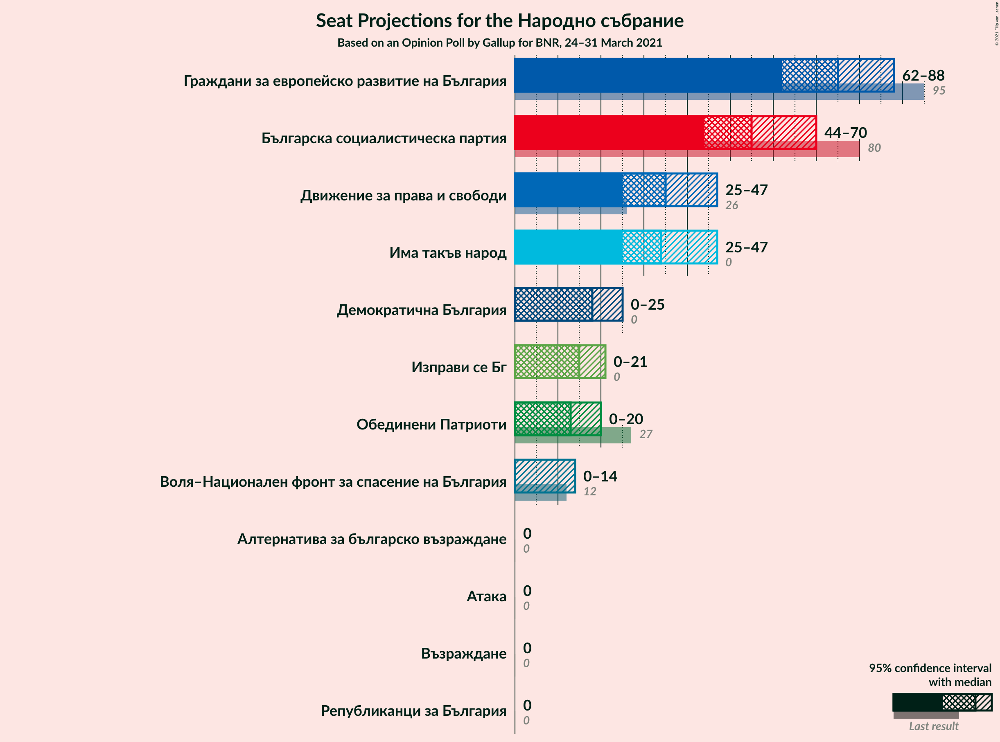

### Confidence Intervals

| Party | Last Result | Median | 80% Confidence Interval | 90% Confidence Interval | 95% Confidence Interval | 99% Confidence Interval |
|:-----:|:-----------:|:------:|:-----------------------:|:-----------------------:|:-----------------------:|:-----------------------:|
| <a href="#граждани-за-европейско-развитие-на-българия">Граждани за европейско развитие на България</a> | 95 | 75 | 66–84 |64–86 |62–88 |58–93 |
| <a href="#българска-социалистическа-партия">Българска социалистическа партия</a> | 80 | 55 | 47–64 |46–66 |44–70 |41–72 |
| <a href="#има-такъв-народ">Има такъв народ</a> | 0 | 34 | 28–41 |27–44 |25–47 |24–50 |
| <a href="#движение-за-права-и-свободи">Движение за права и свободи</a> | 26 | 35 | 28–40 |27–43 |25–47 |23–47 |
| <a href="#демократична-българия">Демократична България</a> | 0 | 18 | 0–23 |0–23 |0–25 |0–28 |
| <a href="#изправи-се-бг">Изправи се Бг</a> | 0 | 15 | 0–19 |0–21 |0–21 |0–25 |
| <a href="#обединени-патриоти">Обединени Патриоти</a> | 27 | 13 | 0–17 |0–18 |0–20 |0–21 |
| <a href="#воля–национален-фронт-за-спасение-на-българия">Воля–Национален фронт за спасение на България</a> | 12 | 0 | 0–11 |0–13 |0–14 |0–17 |
| <a href="#алтернатива-за-българско-възраждане">Алтернатива за българско възраждане</a> | 0 | 0 | 0 |0 |0 |0–11 |
| <a href="#възраждане">Възраждане</a> | 0 | 0 | 0 |0 |0 |0–12 |
| <a href="#републиканци-за-българия">Републиканци за България</a> | 0 | 0 | 0 |0 |0 |0 |
| <a href="#атака">Атака</a> | 0 | 0 | 0 |0 |0 |0 |

### Граждани за европейско развитие на България

*For a full overview of the results for this party, see the [Граждани за европейско развитие на България](party-гражданизаевропейскоразвитиенабългария.html) page.*

| Number of Seats | Probability | Accumulated | Special Marks |
|:---------------:|:-----------:|:-----------:|:-------------:|
| 54 | 0% | 100% |  |
| 55 | 0.1% | 99.9% |  |
| 56 | 0.1% | 99.8% |  |
| 57 | 0.1% | 99.7% |  |
| 58 | 0.1% | 99.6% |  |
| 59 | 0.1% | 99.5% |  |
| 60 | 0.6% | 99.4% |  |
| 61 | 1.1% | 98.7% |  |
| 62 | 1.3% | 98% |  |
| 63 | 0.5% | 96% |  |
| 64 | 1.0% | 96% |  |
| 65 | 4% | 95% |  |
| 66 | 1.4% | 91% |  |
| 67 | 2% | 89% |  |
| 68 | 8% | 88% |  |
| 69 | 3% | 80% |  |
| 70 | 7% | 78% |  |
| 71 | 5% | 71% |  |
| 72 | 2% | 66% |  |
| 73 | 3% | 64% |  |
| 74 | 5% | 61% |  |
| 75 | 7% | 56% | Median |
| 76 | 9% | 49% |  |
| 77 | 3% | 39% |  |
| 78 | 7% | 36% |  |
| 79 | 5% | 29% |  |
| 80 | 2% | 25% |  |
| 81 | 2% | 22% |  |
| 82 | 3% | 20% |  |
| 83 | 3% | 17% |  |
| 84 | 7% | 14% |  |
| 85 | 1.3% | 7% |  |
| 86 | 2% | 6% |  |
| 87 | 1.2% | 4% |  |
| 88 | 0.5% | 3% |  |
| 89 | 0.2% | 2% |  |
| 90 | 0.1% | 2% |  |
| 91 | 0.6% | 2% |  |
| 92 | 0.2% | 1.1% |  |
| 93 | 0.5% | 1.0% |  |
| 94 | 0% | 0.4% |  |
| 95 | 0% | 0.4% | Last Result |
| 96 | 0.2% | 0.4% |  |
| 97 | 0% | 0.1% |  |
| 98 | 0.1% | 0.1% |  |
| 99 | 0% | 0% |  |

### Българска социалистическа партия

*For a full overview of the results for this party, see the [Българска социалистическа партия](party-българскасоциалистическапартия.html) page.*

| Number of Seats | Probability | Accumulated | Special Marks |
|:---------------:|:-----------:|:-----------:|:-------------:|
| 36 | 0% | 100% |  |
| 37 | 0% | 99.9% |  |
| 38 | 0% | 99.9% |  |
| 39 | 0.1% | 99.9% |  |
| 40 | 0.2% | 99.9% |  |
| 41 | 0.4% | 99.6% |  |
| 42 | 0.8% | 99.2% |  |
| 43 | 0.8% | 98% |  |
| 44 | 0.8% | 98% |  |
| 45 | 2% | 97% |  |
| 46 | 4% | 95% |  |
| 47 | 2% | 91% |  |
| 48 | 2% | 90% |  |
| 49 | 2% | 88% |  |
| 50 | 7% | 86% |  |
| 51 | 4% | 79% |  |
| 52 | 4% | 75% |  |
| 53 | 10% | 71% |  |
| 54 | 10% | 60% |  |
| 55 | 11% | 50% | Median |
| 56 | 2% | 40% |  |
| 57 | 4% | 38% |  |
| 58 | 4% | 34% |  |
| 59 | 6% | 30% |  |
| 60 | 2% | 24% |  |
| 61 | 4% | 22% |  |
| 62 | 2% | 18% |  |
| 63 | 2% | 16% |  |
| 64 | 7% | 14% |  |
| 65 | 0.9% | 7% |  |
| 66 | 1.0% | 6% |  |
| 67 | 1.0% | 5% |  |
| 68 | 0.4% | 4% |  |
| 69 | 0.2% | 3% |  |
| 70 | 1.1% | 3% |  |
| 71 | 0.3% | 2% |  |
| 72 | 1.4% | 2% |  |
| 73 | 0% | 0.3% |  |
| 74 | 0.1% | 0.2% |  |
| 75 | 0.1% | 0.1% |  |
| 76 | 0% | 0.1% |  |
| 77 | 0% | 0% |  |
| 78 | 0% | 0% |  |
| 79 | 0% | 0% |  |
| 80 | 0% | 0% | Last Result |

### Има такъв народ

*For a full overview of the results for this party, see the [Има такъв народ](party-иматакъвнарод.html) page.*

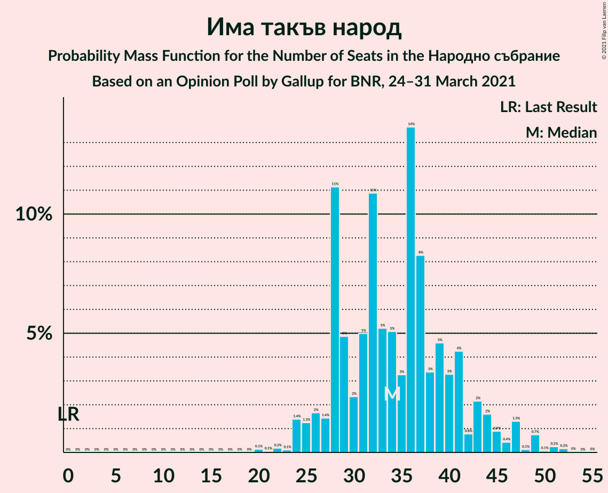

| Number of Seats | Probability | Accumulated | Special Marks |
|:---------------:|:-----------:|:-----------:|:-------------:|
| 0 | 0% | 100% | Last Result |
| 1 | 0% | 100% |  |
| 2 | 0% | 100% |  |
| 3 | 0% | 100% |  |
| 4 | 0% | 100% |  |
| 5 | 0% | 100% |  |
| 6 | 0% | 100% |  |
| 7 | 0% | 100% |  |
| 8 | 0% | 100% |  |
| 9 | 0% | 100% |  |
| 10 | 0% | 100% |  |
| 11 | 0% | 100% |  |
| 12 | 0% | 100% |  |
| 13 | 0% | 100% |  |
| 14 | 0% | 100% |  |
| 15 | 0% | 100% |  |
| 16 | 0% | 100% |  |
| 17 | 0% | 100% |  |
| 18 | 0% | 100% |  |
| 19 | 0% | 100% |  |
| 20 | 0.1% | 100% |  |
| 21 | 0.1% | 99.9% |  |
| 22 | 0.2% | 99.8% |  |
| 23 | 0.1% | 99.6% |  |
| 24 | 1.4% | 99.5% |  |
| 25 | 1.3% | 98% |  |
| 26 | 2% | 97% |  |
| 27 | 1.4% | 95% |  |
| 28 | 11% | 94% |  |
| 29 | 5% | 83% |  |
| 30 | 2% | 78% |  |
| 31 | 5% | 75% |  |
| 32 | 11% | 70% |  |
| 33 | 5% | 60% |  |
| 34 | 5% | 54% | Median |
| 35 | 3% | 49% |  |
| 36 | 14% | 46% |  |
| 37 | 8% | 32% |  |
| 38 | 3% | 24% |  |
| 39 | 5% | 21% |  |
| 40 | 3% | 16% |  |
| 41 | 4% | 13% |  |
| 42 | 0.8% | 9% |  |
| 43 | 2% | 8% |  |
| 44 | 2% | 6% |  |
| 45 | 0.9% | 4% |  |
| 46 | 0.4% | 3% |  |
| 47 | 1.3% | 3% |  |
| 48 | 0.1% | 1.4% |  |
| 49 | 0.7% | 1.3% |  |
| 50 | 0.1% | 0.5% |  |
| 51 | 0.2% | 0.5% |  |
| 52 | 0.2% | 0.2% |  |
| 53 | 0% | 0.1% |  |
| 54 | 0% | 0% |  |

### Движение за права и свободи

*For a full overview of the results for this party, see the [Движение за права и свободи](party-движениезаправаисвободи.html) page.*

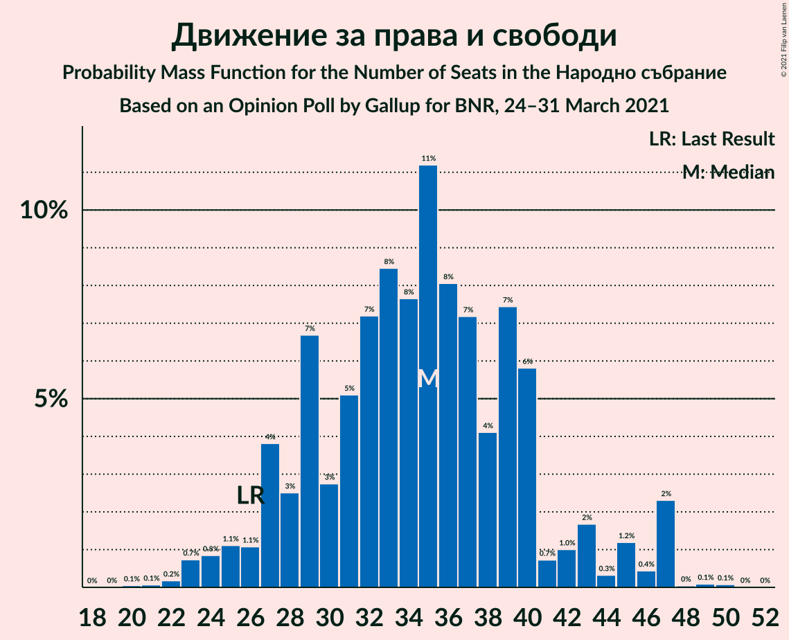

| Number of Seats | Probability | Accumulated | Special Marks |
|:---------------:|:-----------:|:-----------:|:-------------:|
| 20 | 0.1% | 100% |  |
| 21 | 0.1% | 99.9% |  |
| 22 | 0.2% | 99.9% |  |
| 23 | 0.7% | 99.7% |  |
| 24 | 0.8% | 99.0% |  |
| 25 | 1.1% | 98% |  |
| 26 | 1.1% | 97% | Last Result |
| 27 | 4% | 96% |  |
| 28 | 3% | 92% |  |
| 29 | 7% | 90% |  |
| 30 | 3% | 83% |  |
| 31 | 5% | 80% |  |
| 32 | 7% | 75% |  |
| 33 | 8% | 68% |  |
| 34 | 8% | 59% |  |
| 35 | 11% | 52% | Median |
| 36 | 8% | 41% |  |
| 37 | 7% | 32% |  |
| 38 | 4% | 25% |  |
| 39 | 7% | 21% |  |
| 40 | 6% | 14% |  |
| 41 | 0.7% | 8% |  |
| 42 | 1.0% | 7% |  |
| 43 | 2% | 6% |  |
| 44 | 0.3% | 5% |  |
| 45 | 1.2% | 4% |  |
| 46 | 0.4% | 3% |  |
| 47 | 2% | 3% |  |
| 48 | 0% | 0.2% |  |
| 49 | 0.1% | 0.2% |  |
| 50 | 0.1% | 0.1% |  |
| 51 | 0% | 0% |  |

### Демократична България

*For a full overview of the results for this party, see the [Демократична България](party-демократичнабългария.html) page.*

| Number of Seats | Probability | Accumulated | Special Marks |
|:---------------:|:-----------:|:-----------:|:-------------:|
| 0 | 13% | 100% | Last Result |
| 1 | 0% | 87% |  |
| 2 | 0% | 87% |  |
| 3 | 0% | 87% |  |
| 4 | 0% | 87% |  |
| 5 | 0% | 87% |  |
| 6 | 0% | 87% |  |
| 7 | 0% | 87% |  |
| 8 | 0% | 87% |  |
| 9 | 0% | 87% |  |
| 10 | 0% | 87% |  |
| 11 | 2% | 87% |  |
| 12 | 3% | 85% |  |
| 13 | 4% | 82% |  |
| 14 | 10% | 79% |  |
| 15 | 5% | 69% |  |
| 16 | 3% | 63% |  |
| 17 | 5% | 60% |  |
| 18 | 7% | 56% | Median |
| 19 | 7% | 48% |  |
| 20 | 4% | 41% |  |
| 21 | 7% | 37% |  |
| 22 | 11% | 30% |  |
| 23 | 14% | 19% |  |
| 24 | 1.2% | 5% |  |
| 25 | 2% | 4% |  |
| 26 | 0.9% | 2% |  |
| 27 | 0.2% | 1.1% |  |
| 28 | 0.6% | 0.9% |  |
| 29 | 0.2% | 0.3% |  |
| 30 | 0.1% | 0.1% |  |
| 31 | 0% | 0.1% |  |
| 32 | 0% | 0% |  |

### Изправи се Бг

*For a full overview of the results for this party, see the [Изправи се Бг](party-изправисебг.html) page.*

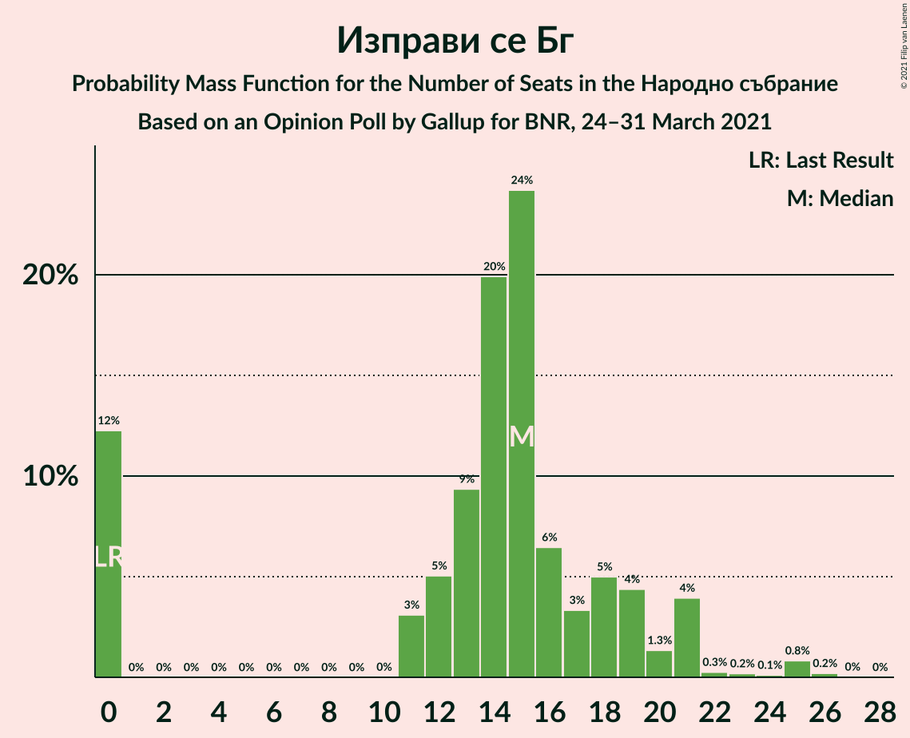

| Number of Seats | Probability | Accumulated | Special Marks |
|:---------------:|:-----------:|:-----------:|:-------------:|
| 0 | 12% | 100% | Last Result |
| 1 | 0% | 88% |  |
| 2 | 0% | 88% |  |
| 3 | 0% | 88% |  |
| 4 | 0% | 88% |  |
| 5 | 0% | 88% |  |
| 6 | 0% | 88% |  |
| 7 | 0% | 88% |  |
| 8 | 0% | 88% |  |
| 9 | 0% | 88% |  |
| 10 | 0% | 88% |  |
| 11 | 3% | 88% |  |
| 12 | 5% | 85% |  |
| 13 | 9% | 80% |  |
| 14 | 20% | 70% |  |
| 15 | 24% | 50% | Median |
| 16 | 6% | 26% |  |
| 17 | 3% | 20% |  |
| 18 | 5% | 16% |  |
| 19 | 4% | 11% |  |
| 20 | 1.3% | 7% |  |
| 21 | 4% | 6% |  |
| 22 | 0.3% | 2% |  |
| 23 | 0.2% | 1.4% |  |
| 24 | 0.1% | 1.2% |  |
| 25 | 0.8% | 1.1% |  |
| 26 | 0.2% | 0.2% |  |
| 27 | 0% | 0% |  |

### Обединени Патриоти

*For a full overview of the results for this party, see the [Обединени Патриоти](party-обединенипатриоти.html) page.*

| Number of Seats | Probability | Accumulated | Special Marks |
|:---------------:|:-----------:|:-----------:|:-------------:|
| 0 | 39% | 100% |  |
| 1 | 0% | 61% |  |
| 2 | 0% | 61% |  |
| 3 | 0% | 61% |  |
| 4 | 0% | 61% |  |
| 5 | 0% | 61% |  |
| 6 | 0% | 61% |  |
| 7 | 0% | 61% |  |
| 8 | 0% | 61% |  |
| 9 | 0% | 61% |  |
| 10 | 0.3% | 61% |  |
| 11 | 6% | 61% |  |
| 12 | 5% | 55% |  |
| 13 | 8% | 50% | Median |
| 14 | 9% | 42% |  |
| 15 | 10% | 33% |  |
| 16 | 11% | 22% |  |
| 17 | 2% | 12% |  |
| 18 | 5% | 9% |  |
| 19 | 0.3% | 5% |  |
| 20 | 3% | 4% |  |
| 21 | 0.9% | 1.3% |  |
| 22 | 0.1% | 0.3% |  |
| 23 | 0.1% | 0.2% |  |
| 24 | 0.1% | 0.1% |  |
| 25 | 0% | 0.1% |  |
| 26 | 0% | 0% |  |
| 27 | 0% | 0% | Last Result |

### Воля–Национален фронт за спасение на България

*For a full overview of the results for this party, see the [Воля–Национален фронт за спасение на България](party-воля–националенфронтзаспасениенабългария.html) page.*

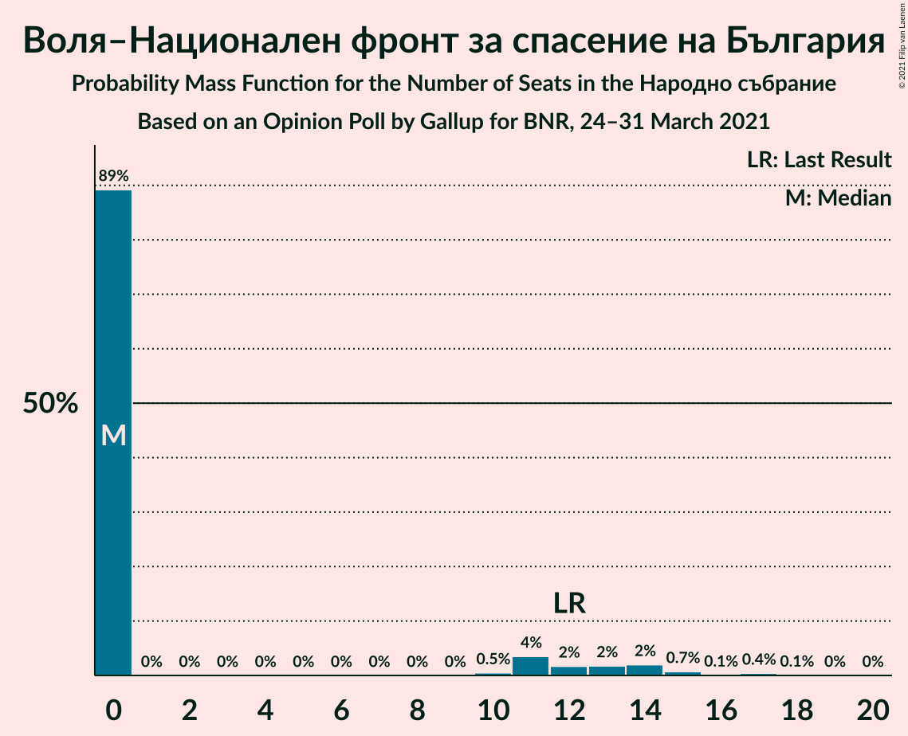

| Number of Seats | Probability | Accumulated | Special Marks |
|:---------------:|:-----------:|:-----------:|:-------------:|
| 0 | 89% | 100% | Median |
| 1 | 0% | 11% |  |
| 2 | 0% | 11% |  |
| 3 | 0% | 11% |  |
| 4 | 0% | 11% |  |
| 5 | 0% | 11% |  |
| 6 | 0% | 11% |  |
| 7 | 0% | 11% |  |
| 8 | 0% | 11% |  |
| 9 | 0% | 11% |  |
| 10 | 0.5% | 11% |  |
| 11 | 4% | 10% |  |
| 12 | 2% | 7% | Last Result |
| 13 | 2% | 5% |  |
| 14 | 2% | 3% |  |
| 15 | 0.7% | 1.3% |  |
| 16 | 0.1% | 0.6% |  |
| 17 | 0.4% | 0.5% |  |
| 18 | 0.1% | 0.1% |  |
| 19 | 0% | 0% |  |

### Алтернатива за българско възраждане

*For a full overview of the results for this party, see the [Алтернатива за българско възраждане](party-алтернативазабългарсковъзраждане.html) page.*

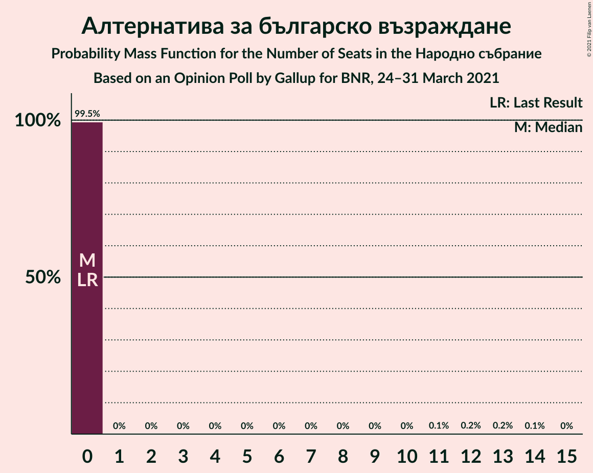

| Number of Seats | Probability | Accumulated | Special Marks |
|:---------------:|:-----------:|:-----------:|:-------------:|
| 0 | 99.5% | 100% | Last Result, Median |
| 1 | 0% | 0.5% |  |
| 2 | 0% | 0.5% |  |
| 3 | 0% | 0.5% |  |
| 4 | 0% | 0.5% |  |
| 5 | 0% | 0.5% |  |
| 6 | 0% | 0.5% |  |
| 7 | 0% | 0.5% |  |
| 8 | 0% | 0.5% |  |
| 9 | 0% | 0.5% |  |
| 10 | 0% | 0.5% |  |
| 11 | 0.1% | 0.5% |  |
| 12 | 0.2% | 0.4% |  |
| 13 | 0.2% | 0.2% |  |
| 14 | 0.1% | 0.1% |  |
| 15 | 0% | 0% |  |

### Възраждане

*For a full overview of the results for this party, see the [Възраждане](party-възраждане.html) page.*

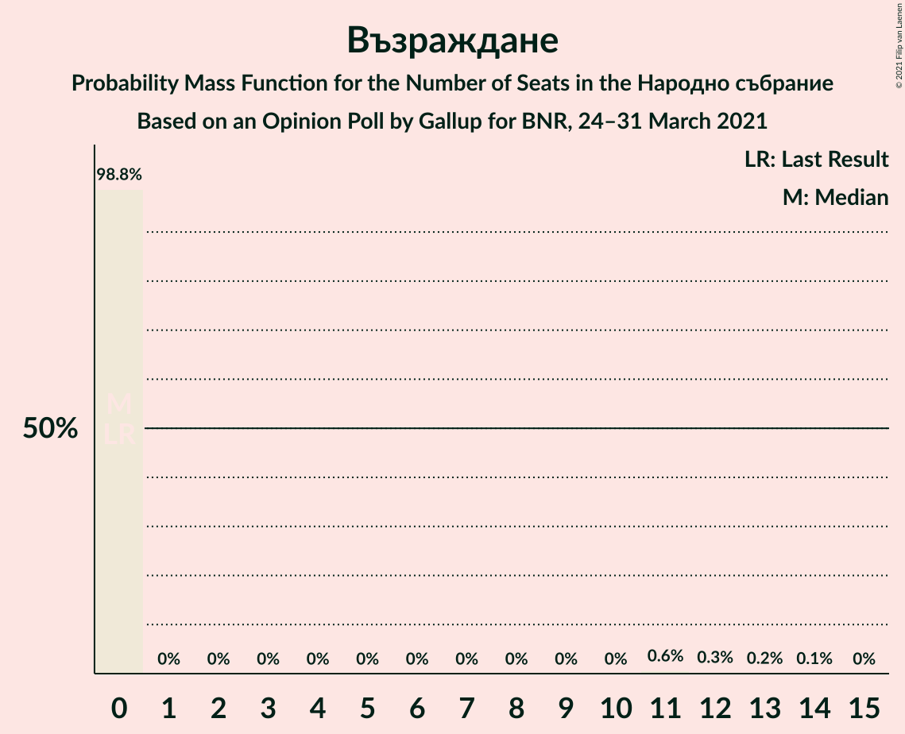

| Number of Seats | Probability | Accumulated | Special Marks |
|:---------------:|:-----------:|:-----------:|:-------------:|
| 0 | 98.8% | 100% | Last Result, Median |
| 1 | 0% | 1.2% |  |
| 2 | 0% | 1.2% |  |
| 3 | 0% | 1.2% |  |
| 4 | 0% | 1.2% |  |
| 5 | 0% | 1.2% |  |
| 6 | 0% | 1.2% |  |
| 7 | 0% | 1.2% |  |
| 8 | 0% | 1.2% |  |
| 9 | 0% | 1.2% |  |
| 10 | 0% | 1.2% |  |
| 11 | 0.6% | 1.2% |  |
| 12 | 0.3% | 0.6% |  |
| 13 | 0.2% | 0.3% |  |
| 14 | 0.1% | 0.1% |  |
| 15 | 0% | 0% |  |

### Републиканци за България

*For a full overview of the results for this party, see the [Републиканци за България](party-републиканцизабългария.html) page.*

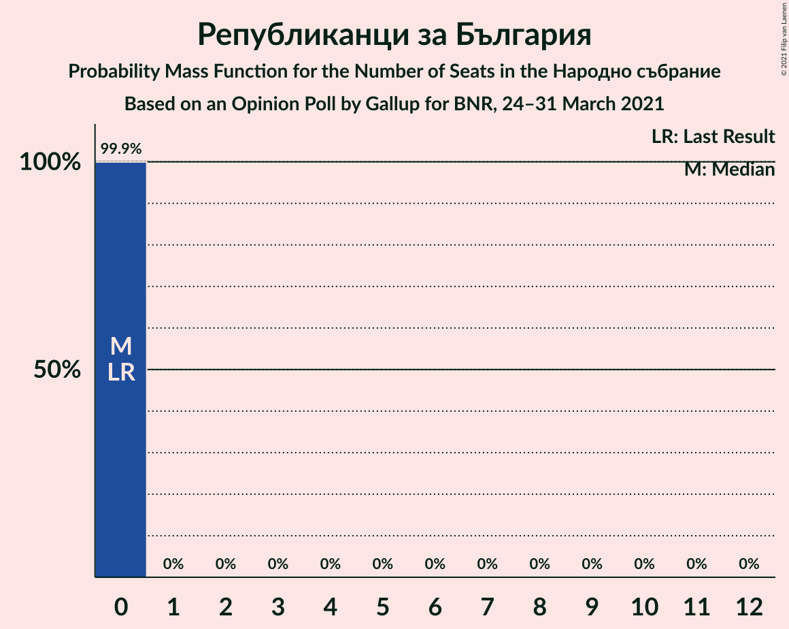

| Number of Seats | Probability | Accumulated | Special Marks |
|:---------------:|:-----------:|:-----------:|:-------------:|
| 0 | 99.9% | 100% | Last Result, Median |
| 1 | 0% | 0.1% |  |
| 2 | 0% | 0.1% |  |
| 3 | 0% | 0.1% |  |
| 4 | 0% | 0.1% |  |
| 5 | 0% | 0.1% |  |
| 6 | 0% | 0.1% |  |
| 7 | 0% | 0.1% |  |
| 8 | 0% | 0.1% |  |
| 9 | 0% | 0.1% |  |
| 10 | 0% | 0.1% |  |
| 11 | 0% | 0.1% |  |
| 12 | 0% | 0% |  |

### Атака

*For a full overview of the results for this party, see the [Атака](party-атака.html) page.*

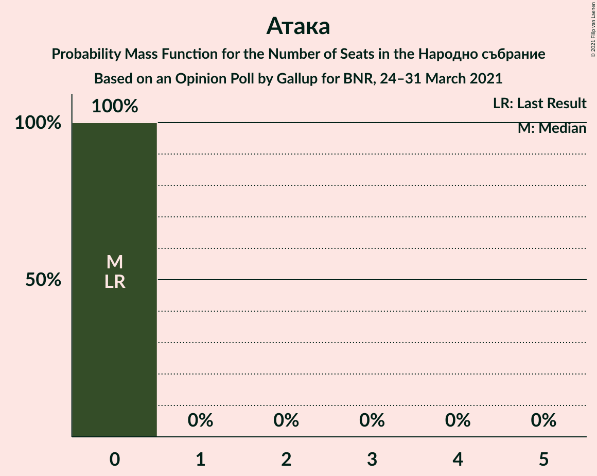

| Number of Seats | Probability | Accumulated | Special Marks |
|:---------------:|:-----------:|:-----------:|:-------------:|
| 0 | 100% | 100% | Last Result, Median |

## Coalitions

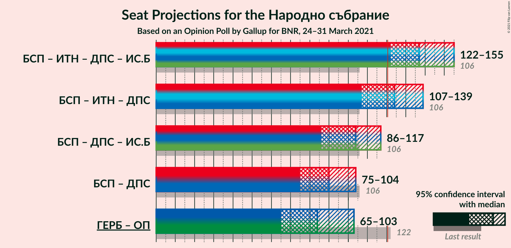

### Confidence Intervals

| Coalition | Last Result | Median | Majority? | 80% Confidence Interval | 90% Confidence Interval | 95% Confidence Interval | 99% Confidence Interval |
|:---------:|:-----------:|:------:|:---------:|:-----------------------:|:-----------------------:|:-----------------------:|:-----------------------:|
| Българска социалистическа партия – Има такъв народ – Движение за права и свободи – Изправи се Бг | 106 | 137 | 98% | 127–150 | 123–152 | 122–155 | 116–159 |
| Българска социалистическа партия – Има такъв народ – Движение за права и свободи | 106 | 124 | 66% | 113–136 | 109–137 | 107–139 | 103–144 |
| Българска социалистическа партия – Движение за права и свободи – Изправи се Бг | 106 | 104 | 0.7% | 94–113 | 91–115 | 86–117 | 81–123 |
| Българска социалистическа партия – Движение за права и свободи | 106 | 90 | 0% | 80–99 | 76–102 | 75–104 | 72–108 |
| Граждани за европейско развитие на България – Обединени Патриоти | 122 | 84 | 0% | 72–99 | 69–102 | 65–103 | 63–106 |

### Българска социалистическа партия – Има такъв народ – Движение за права и свободи – Изправи се Бг

| Number of Seats | Probability | Accumulated | Special Marks |
|:---------------:|:-----------:|:-----------:|:-------------:|
| 106 | 0% | 100% | Last Result |
| 107 | 0% | 100% |  |
| 108 | 0% | 100% |  |
| 109 | 0% | 100% |  |
| 110 | 0% | 100% |  |
| 111 | 0% | 99.9% |  |
| 112 | 0% | 99.9% |  |
| 113 | 0.1% | 99.9% |  |
| 114 | 0.1% | 99.8% |  |
| 115 | 0% | 99.8% |  |
| 116 | 0.5% | 99.7% |  |
| 117 | 0.4% | 99.2% |  |
| 118 | 0.2% | 98.8% |  |
| 119 | 0.4% | 98.6% |  |
| 120 | 0.2% | 98% |  |
| 121 | 0.3% | 98% | Majority |
| 122 | 1.2% | 98% |  |
| 123 | 2% | 97% |  |
| 124 | 0.6% | 94% |  |
| 125 | 2% | 94% |  |
| 126 | 1.4% | 91% |  |
| 127 | 1.1% | 90% |  |
| 128 | 2% | 89% |  |
| 129 | 3% | 87% |  |
| 130 | 2% | 84% |  |
| 131 | 3% | 82% |  |
| 132 | 2% | 79% |  |
| 133 | 9% | 77% |  |
| 134 | 2% | 67% |  |
| 135 | 7% | 65% |  |
| 136 | 7% | 58% |  |
| 137 | 1.4% | 51% |  |
| 138 | 6% | 50% |  |
| 139 | 3% | 44% | Median |
| 140 | 7% | 41% |  |
| 141 | 3% | 34% |  |
| 142 | 2% | 31% |  |
| 143 | 3% | 29% |  |
| 144 | 3% | 26% |  |
| 145 | 2% | 23% |  |
| 146 | 3% | 21% |  |
| 147 | 5% | 18% |  |
| 148 | 1.1% | 13% |  |
| 149 | 0.6% | 12% |  |
| 150 | 4% | 12% |  |
| 151 | 0.7% | 8% |  |
| 152 | 4% | 7% |  |
| 153 | 0.2% | 3% |  |
| 154 | 0% | 3% |  |
| 155 | 0.7% | 3% |  |
| 156 | 0.3% | 2% |  |
| 157 | 0.1% | 2% |  |
| 158 | 0.7% | 1.5% |  |
| 159 | 0.6% | 0.8% |  |
| 160 | 0.1% | 0.2% |  |
| 161 | 0.1% | 0.1% |  |
| 162 | 0% | 0.1% |  |
| 163 | 0% | 0.1% |  |
| 164 | 0% | 0% |  |

### Българска социалистическа партия – Има такъв народ – Движение за права и свободи

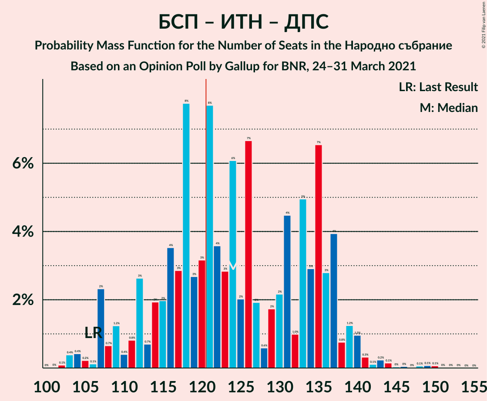

| Number of Seats | Probability | Accumulated | Special Marks |
|:---------------:|:-----------:|:-----------:|:-------------:|
| 100 | 0% | 100% |  |
| 101 | 0% | 99.9% |  |
| 102 | 0.1% | 99.9% |  |
| 103 | 0.4% | 99.8% |  |
| 104 | 0.4% | 99.4% |  |
| 105 | 0.2% | 99.0% |  |
| 106 | 0.1% | 98.8% | Last Result |
| 107 | 2% | 98.7% |  |
| 108 | 0.7% | 96% |  |
| 109 | 1.2% | 96% |  |
| 110 | 0.4% | 94% |  |
| 111 | 0.8% | 94% |  |
| 112 | 3% | 93% |  |
| 113 | 0.7% | 91% |  |
| 114 | 2% | 90% |  |
| 115 | 2% | 88% |  |
| 116 | 4% | 86% |  |
| 117 | 3% | 82% |  |
| 118 | 8% | 80% |  |
| 119 | 3% | 72% |  |
| 120 | 3% | 69% |  |
| 121 | 8% | 66% | Majority |
| 122 | 4% | 58% |  |
| 123 | 3% | 55% |  |
| 124 | 6% | 52% | Median |
| 125 | 2% | 46% |  |
| 126 | 7% | 44% |  |
| 127 | 2% | 37% |  |
| 128 | 0.6% | 35% |  |
| 129 | 2% | 35% |  |
| 130 | 2% | 33% |  |
| 131 | 4% | 31% |  |
| 132 | 1.0% | 26% |  |
| 133 | 5% | 25% |  |
| 134 | 3% | 20% |  |
| 135 | 7% | 17% |  |
| 136 | 3% | 11% |  |
| 137 | 4% | 8% |  |
| 138 | 0.8% | 4% |  |
| 139 | 1.2% | 3% |  |
| 140 | 1.0% | 2% |  |
| 141 | 0.3% | 1.2% |  |
| 142 | 0.1% | 0.8% |  |
| 143 | 0.2% | 0.7% |  |
| 144 | 0.1% | 0.5% |  |
| 145 | 0% | 0.4% |  |
| 146 | 0% | 0.3% |  |
| 147 | 0% | 0.3% |  |
| 148 | 0.1% | 0.3% |  |
| 149 | 0.1% | 0.2% |  |
| 150 | 0.1% | 0.1% |  |
| 151 | 0% | 0.1% |  |
| 152 | 0% | 0% |  |

### Българска социалистическа партия – Движение за права и свободи – Изправи се Бг

| Number of Seats | Probability | Accumulated | Special Marks |
|:---------------:|:-----------:|:-----------:|:-------------:|
| 74 | 0.1% | 100% |  |
| 75 | 0% | 99.9% |  |
| 76 | 0% | 99.9% |  |
| 77 | 0% | 99.8% |  |
| 78 | 0.1% | 99.8% |  |
| 79 | 0.1% | 99.7% |  |
| 80 | 0.2% | 99.7% |  |
| 81 | 0.1% | 99.5% |  |
| 82 | 0.5% | 99.5% |  |
| 83 | 0.1% | 99.0% |  |
| 84 | 0.3% | 98.9% |  |
| 85 | 0.5% | 98.6% |  |
| 86 | 0.7% | 98% |  |
| 87 | 0.3% | 97% |  |
| 88 | 0.6% | 97% |  |
| 89 | 0.3% | 97% |  |
| 90 | 1.0% | 96% |  |
| 91 | 3% | 95% |  |
| 92 | 0.8% | 92% |  |
| 93 | 1.3% | 91% |  |
| 94 | 2% | 90% |  |
| 95 | 3% | 88% |  |
| 96 | 2% | 85% |  |
| 97 | 2% | 83% |  |
| 98 | 1.4% | 82% |  |
| 99 | 8% | 80% |  |
| 100 | 10% | 72% |  |
| 101 | 1.0% | 62% |  |
| 102 | 2% | 61% |  |
| 103 | 2% | 59% |  |
| 104 | 9% | 57% |  |
| 105 | 10% | 48% | Median |
| 106 | 5% | 38% | Last Result |
| 107 | 6% | 33% |  |
| 108 | 2% | 26% |  |
| 109 | 3% | 25% |  |
| 110 | 1.5% | 22% |  |
| 111 | 6% | 20% |  |
| 112 | 2% | 15% |  |
| 113 | 6% | 13% |  |
| 114 | 2% | 7% |  |
| 115 | 2% | 5% |  |
| 116 | 0.7% | 4% |  |
| 117 | 1.4% | 3% |  |
| 118 | 0.2% | 2% |  |
| 119 | 0.2% | 1.3% |  |
| 120 | 0.4% | 1.1% |  |
| 121 | 0% | 0.7% | Majority |
| 122 | 0.1% | 0.6% |  |
| 123 | 0.2% | 0.5% |  |
| 124 | 0.1% | 0.3% |  |
| 125 | 0.1% | 0.2% |  |
| 126 | 0% | 0.1% |  |
| 127 | 0% | 0.1% |  |
| 128 | 0% | 0.1% |  |
| 129 | 0% | 0% |  |

### Българска социалистическа партия – Движение за права и свободи

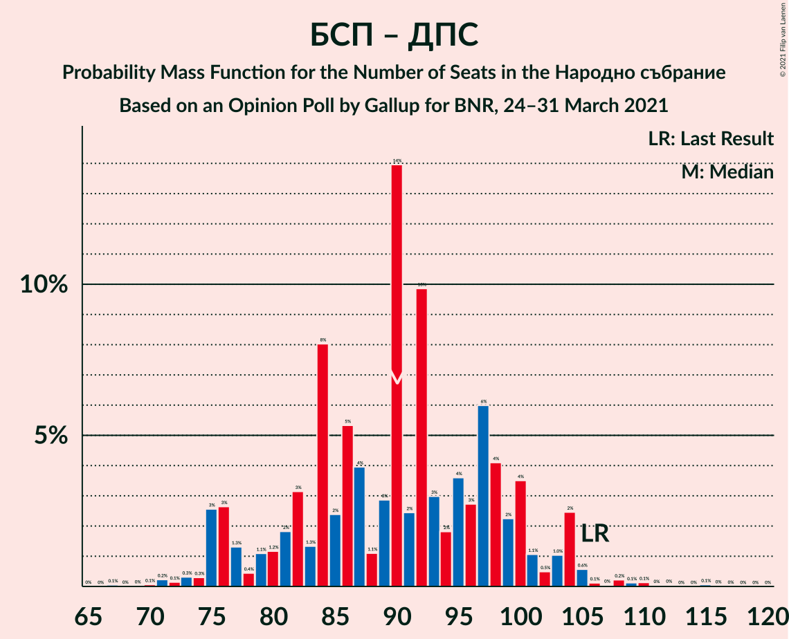

| Number of Seats | Probability | Accumulated | Special Marks |
|:---------------:|:-----------:|:-----------:|:-------------:|
| 67 | 0.1% | 100% |  |
| 68 | 0% | 99.9% |  |
| 69 | 0% | 99.9% |  |
| 70 | 0.1% | 99.9% |  |
| 71 | 0.2% | 99.8% |  |
| 72 | 0.1% | 99.6% |  |
| 73 | 0.3% | 99.5% |  |
| 74 | 0.3% | 99.2% |  |
| 75 | 3% | 98.9% |  |
| 76 | 3% | 96% |  |
| 77 | 1.3% | 94% |  |
| 78 | 0.4% | 92% |  |
| 79 | 1.1% | 92% |  |
| 80 | 1.2% | 91% |  |
| 81 | 2% | 90% |  |
| 82 | 3% | 88% |  |
| 83 | 1.3% | 85% |  |
| 84 | 8% | 83% |  |
| 85 | 2% | 75% |  |
| 86 | 5% | 73% |  |
| 87 | 4% | 68% |  |
| 88 | 1.1% | 64% |  |
| 89 | 3% | 63% |  |
| 90 | 14% | 60% | Median |
| 91 | 2% | 46% |  |
| 92 | 10% | 43% |  |
| 93 | 3% | 33% |  |
| 94 | 2% | 30% |  |
| 95 | 4% | 29% |  |
| 96 | 3% | 25% |  |
| 97 | 6% | 22% |  |
| 98 | 4% | 16% |  |
| 99 | 2% | 12% |  |
| 100 | 4% | 10% |  |
| 101 | 1.1% | 6% |  |
| 102 | 0.5% | 5% |  |
| 103 | 1.0% | 5% |  |
| 104 | 2% | 4% |  |
| 105 | 0.6% | 1.4% |  |
| 106 | 0.1% | 0.8% | Last Result |
| 107 | 0% | 0.7% |  |
| 108 | 0.2% | 0.6% |  |
| 109 | 0.1% | 0.4% |  |
| 110 | 0.1% | 0.3% |  |
| 111 | 0% | 0.2% |  |
| 112 | 0% | 0.1% |  |
| 113 | 0% | 0.1% |  |
| 114 | 0% | 0.1% |  |
| 115 | 0.1% | 0.1% |  |
| 116 | 0% | 0% |  |

### Граждани за европейско развитие на България – Обединени Патриоти

| Number of Seats | Probability | Accumulated | Special Marks |
|:---------------:|:-----------:|:-----------:|:-------------:|
| 59 | 0% | 100% |  |
| 60 | 0.3% | 99.9% |  |
| 61 | 0.1% | 99.7% |  |
| 62 | 0.1% | 99.6% |  |
| 63 | 0.1% | 99.5% |  |
| 64 | 0% | 99.4% |  |
| 65 | 3% | 99.4% |  |
| 66 | 0% | 97% |  |
| 67 | 1.4% | 97% |  |
| 68 | 0.2% | 95% |  |
| 69 | 2% | 95% |  |
| 70 | 2% | 94% |  |
| 71 | 1.3% | 92% |  |
| 72 | 0.9% | 90% |  |
| 73 | 1.1% | 90% |  |
| 74 | 5% | 88% |  |
| 75 | 2% | 83% |  |
| 76 | 3% | 81% |  |
| 77 | 2% | 78% |  |
| 78 | 7% | 76% |  |
| 79 | 2% | 69% |  |
| 80 | 2% | 66% |  |
| 81 | 2% | 64% |  |
| 82 | 3% | 62% |  |
| 83 | 2% | 58% |  |
| 84 | 10% | 57% |  |
| 85 | 5% | 47% |  |
| 86 | 4% | 42% |  |
| 87 | 3% | 38% |  |
| 88 | 3% | 35% | Median |
| 89 | 1.2% | 33% |  |
| 90 | 11% | 31% |  |
| 91 | 2% | 20% |  |
| 92 | 3% | 19% |  |
| 93 | 1.2% | 16% |  |
| 94 | 1.0% | 15% |  |
| 95 | 0.6% | 14% |  |
| 96 | 0.9% | 13% |  |
| 97 | 0.6% | 12% |  |
| 98 | 0.3% | 12% |  |
| 99 | 3% | 11% |  |
| 100 | 0.5% | 9% |  |
| 101 | 1.2% | 8% |  |
| 102 | 4% | 7% |  |
| 103 | 2% | 3% |  |
| 104 | 0% | 0.9% |  |
| 105 | 0.3% | 0.9% |  |
| 106 | 0.3% | 0.6% |  |
| 107 | 0% | 0.3% |  |
| 108 | 0% | 0.3% |  |
| 109 | 0% | 0.2% |  |
| 110 | 0% | 0.2% |  |
| 111 | 0.1% | 0.2% |  |
| 112 | 0% | 0.1% |  |
| 113 | 0% | 0% |  |
| 114 | 0% | 0% |  |
| 115 | 0% | 0% |  |
| 116 | 0% | 0% |  |
| 117 | 0% | 0% |  |
| 118 | 0% | 0% |  |
| 119 | 0% | 0% |  |
| 120 | 0% | 0% |  |
| 121 | 0% | 0% | Majority |
| 122 | 0% | 0% | Last Result |

## Technical Information

### Opinion Poll

+ **Polling firm:** Gallup
+ **Commissioner(s):** BNR
+ **Fieldwork period:** 24–31 March 2021

### Calculations

+ **Sample size:** 405
+ **Simulations done:** 1,048,576
+ **Error estimate:** 4.01%

