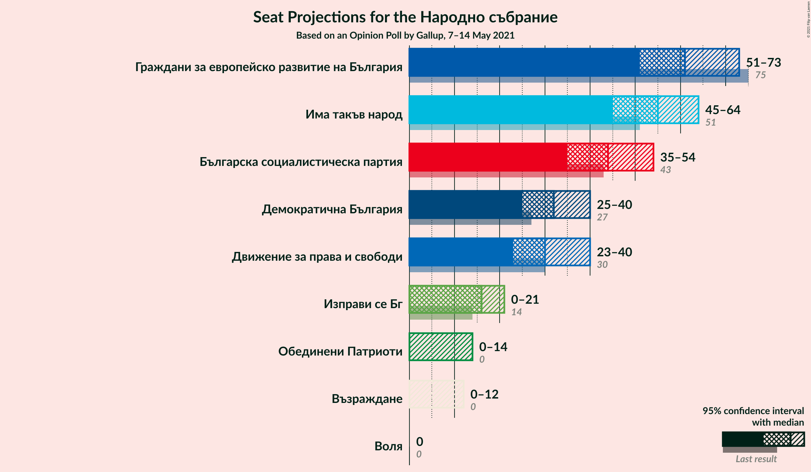
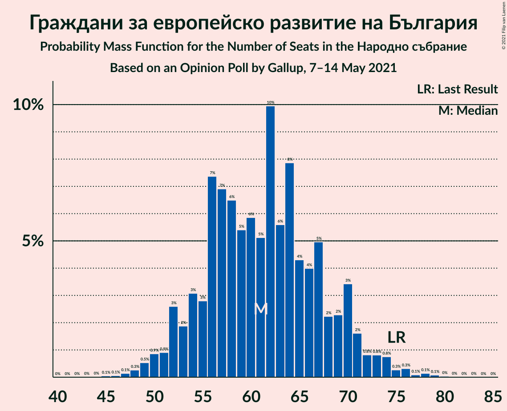
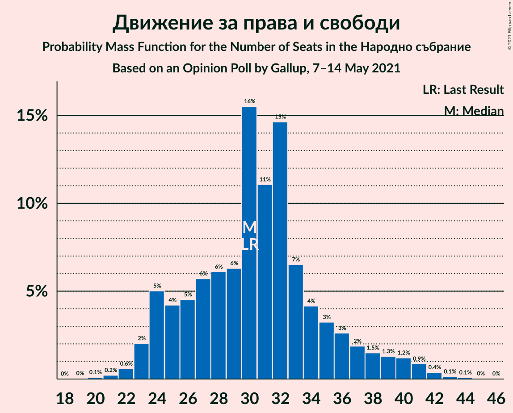
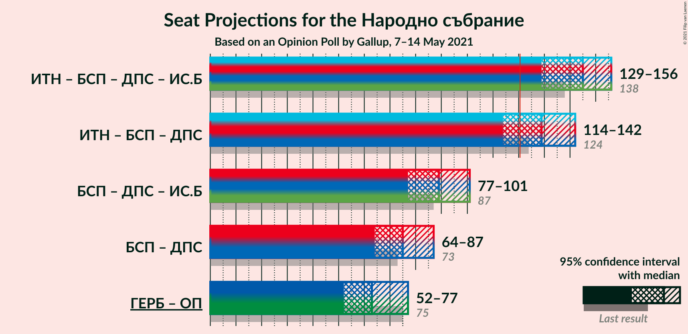
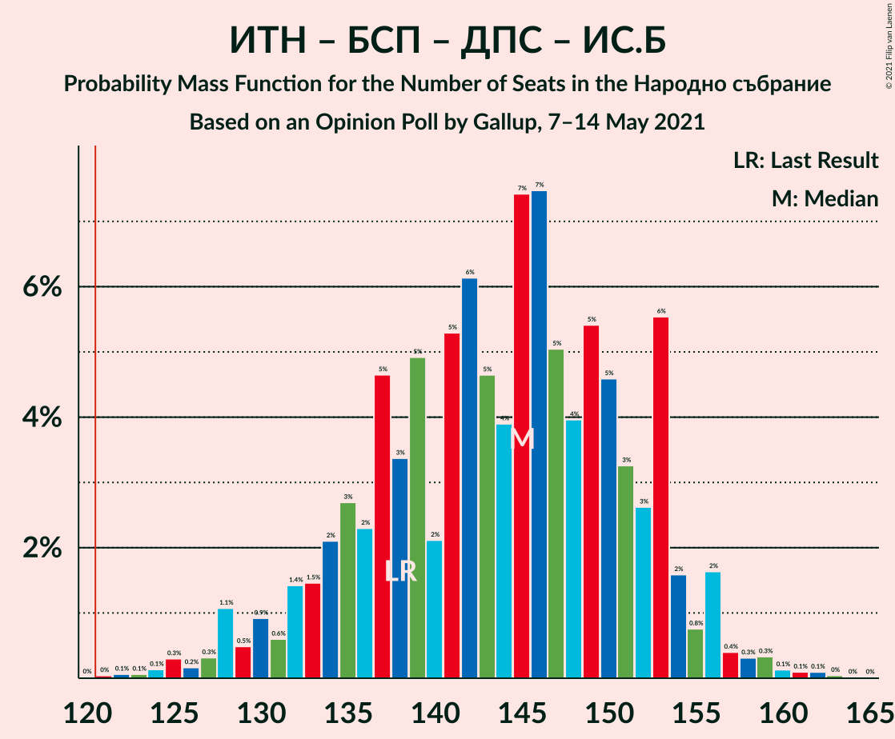
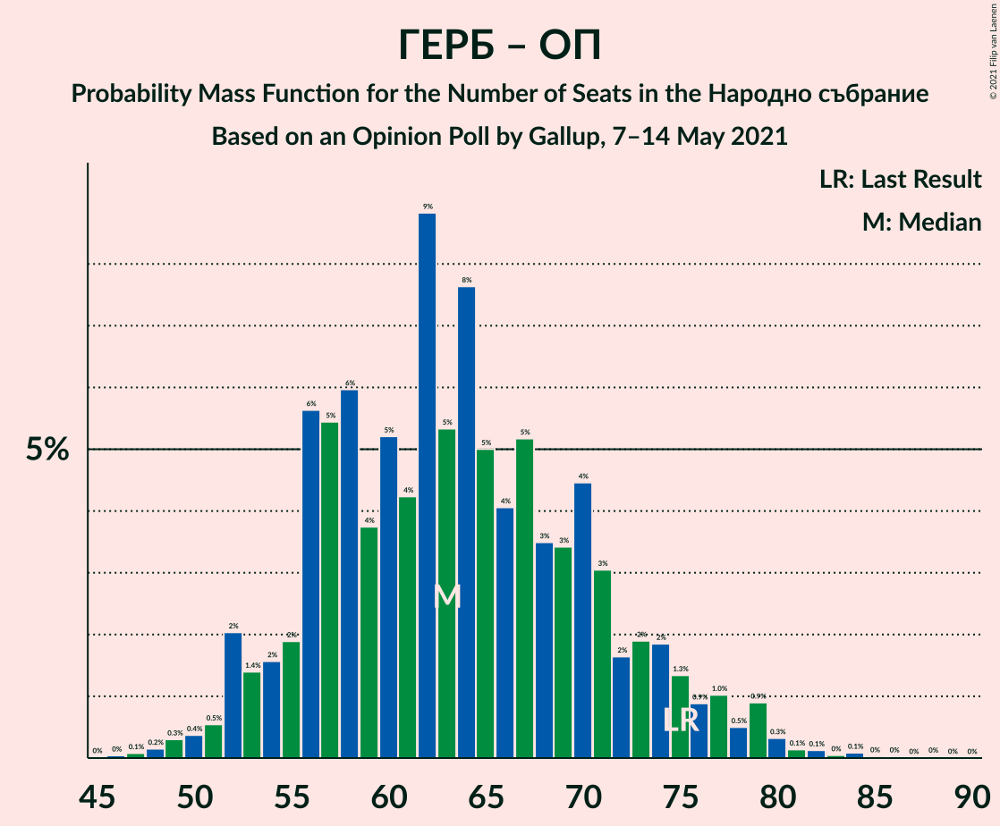

# Opinion Poll by Gallup, 7–14 May 2021

<a href="#voting-intentions">Voting Intentions</a> | <a href="#seats">Seats</a> | <a href="#coalitions">Coalitions</a> | <a href="#technical-information">Technical Information</a>

## Voting Intentions

### Confidence Intervals

| Party | Last Result | Poll Result | 80% Confidence Interval | 90% Confidence Interval | 95% Confidence Interval | 99% Confidence Interval |
|:-----:|:-----------:|:-----------:|:-----------------------:|:-----------------------:|:-----------------------:|:-----------------------:|
| Граждани за европейско развитие на България | 25.8% | 22.8% | 20.4–25.4% |19.8–26.1% |19.2–26.8% |18.1–28.1% |
| Има такъв народ | 17.4% | 20.0% | 17.8–22.5% |17.2–23.2% |16.6–23.9% |15.6–25.1% |
| Българска социалистическа партия | 14.8% | 16.2% | 14.2–18.5% |13.6–19.2% |13.1–19.8% |12.2–21.0% |
| Демократична България | 9.3% | 11.7% | 10.0–13.8% |9.5–14.4% |9.1–14.9% |8.3–16.0% |
| Движение за права и свободи | 10.4% | 11.3% | 9.6–13.4% |9.1–13.9% |8.7–14.5% |8.0–15.5% |
| Изправи се Бг | 4.6% | 5.5% | 4.4–7.1% |4.1–7.6% |3.8–8.0% |3.3–8.8% |
| Обединени Патриоти | 0.0% | 3.2% | 2.4–4.5% |2.1–4.9% |2.0–5.2% |1.6–5.9% |
| Възраждане | 2.4% | 2.6% | 1.8–3.8% |1.6–4.1% |1.5–4.4% |1.2–5.1% |
| Воля | 0.0% | 1.5% | 1.0–2.5% |0.8–2.8% |0.7–3.0% |0.5–3.6% |

*Note:* The poll result column reflects the actual value used in the calculations. Published results may vary slightly, and in addition be rounded to fewer digits.

## Seats

### Confidence Intervals

| Party | Last Result | Median | 80% Confidence Interval | 90% Confidence Interval | 95% Confidence Interval | 99% Confidence Interval |
|:-----:|:-----------:|:------:|:-----------------------:|:-----------------------:|:-----------------------:|:-----------------------:|
| <a href="#граждани-за-европейско-развитие-на-българия">Граждани за европейско развитие на България</a> | 75 | 61 | 54–69 |52–70 |51–73 |48–76 |
| <a href="#има-такъв-народ">Има такъв народ</a> | 51 | 55 | 48–60 |46–62 |45–64 |41–68 |
| <a href="#българска-социалистическа-партия">Българска социалистическа партия</a> | 43 | 44 | 38–50 |36–52 |35–54 |33–57 |
| <a href="#демократична-българия">Демократична България</a> | 27 | 32 | 27–37 |25–39 |25–40 |23–43 |
| <a href="#движение-за-права-и-свободи">Движение за права и свободи</a> | 30 | 30 | 25–36 |24–38 |23–40 |22–42 |
| <a href="#изправи-се-бг">Изправи се Бг</a> | 14 | 16 | 12–19 |0–20 |0–21 |0–24 |
| <a href="#обединени-патриоти">Обединени Патриоти</a> | 0 | 0 | 0–12 |0–12 |0–14 |0–15 |
| <a href="#възраждане">Възраждане</a> | 0 | 0 | 0 |0–11 |0–12 |0–13 |
| <a href="#воля">Воля</a> | 0 | 0 | 0 |0 |0 |0 |

### Граждани за европейско развитие на България

*For a full overview of the results for this party, see the [Граждани за европейско развитие на България](party-гражданизаевропейскоразвитиенабългария.html) page.*

| Number of Seats | Probability | Accumulated | Special Marks |
|:---------------:|:-----------:|:-----------:|:-------------:|
| 45 | 0.1% | 100% |  |
| 46 | 0.1% | 99.9% |  |
| 47 | 0.1% | 99.9% |  |
| 48 | 0.3% | 99.7% |  |
| 49 | 0.5% | 99.4% |  |
| 50 | 0.9% | 98.9% |  |
| 51 | 0.9% | 98% |  |
| 52 | 3% | 97% |  |
| 53 | 2% | 95% |  |
| 54 | 3% | 93% |  |
| 55 | 3% | 90% |  |
| 56 | 7% | 87% |  |
| 57 | 7% | 79% |  |
| 58 | 6% | 73% |  |
| 59 | 5% | 66% |  |
| 60 | 6% | 61% |  |
| 61 | 5% | 55% | Median |
| 62 | 10% | 50% |  |
| 63 | 6% | 40% |  |
| 64 | 8% | 34% |  |
| 65 | 4% | 26% |  |
| 66 | 4% | 22% |  |
| 67 | 5% | 18% |  |
| 68 | 2% | 13% |  |
| 69 | 2% | 11% |  |
| 70 | 3% | 8% |  |
| 71 | 2% | 5% |  |
| 72 | 0.8% | 3% |  |
| 73 | 0.8% | 3% |  |
| 74 | 0.8% | 2% |  |
| 75 | 0.3% | 1.0% | Last Result |
| 76 | 0.3% | 0.7% |  |
| 77 | 0.1% | 0.4% |  |
| 78 | 0.1% | 0.3% |  |
| 79 | 0.1% | 0.2% |  |
| 80 | 0% | 0.1% |  |
| 81 | 0% | 0% |  |

### Има такъв народ

*For a full overview of the results for this party, see the [Има такъв народ](party-иматакъвнарод.html) page.*

| Number of Seats | Probability | Accumulated | Special Marks |
|:---------------:|:-----------:|:-----------:|:-------------:|
| 39 | 0.1% | 100% |  |
| 40 | 0.2% | 99.9% |  |
| 41 | 0.3% | 99.7% |  |
| 42 | 0.4% | 99.5% |  |
| 43 | 0.5% | 99.1% |  |
| 44 | 0.6% | 98.7% |  |
| 45 | 1.3% | 98% |  |
| 46 | 3% | 97% |  |
| 47 | 2% | 94% |  |
| 48 | 4% | 91% |  |
| 49 | 5% | 87% |  |
| 50 | 6% | 82% |  |
| 51 | 7% | 75% | Last Result |
| 52 | 6% | 68% |  |
| 53 | 4% | 62% |  |
| 54 | 5% | 57% |  |
| 55 | 6% | 52% | Median |
| 56 | 6% | 46% |  |
| 57 | 10% | 40% |  |
| 58 | 5% | 30% |  |
| 59 | 12% | 25% |  |
| 60 | 3% | 13% |  |
| 61 | 4% | 9% |  |
| 62 | 2% | 5% |  |
| 63 | 0.8% | 4% |  |
| 64 | 0.5% | 3% |  |
| 65 | 0.6% | 2% |  |
| 66 | 0.4% | 2% |  |
| 67 | 0.6% | 1.3% |  |
| 68 | 0.3% | 0.7% |  |
| 69 | 0.1% | 0.4% |  |
| 70 | 0.2% | 0.3% |  |
| 71 | 0% | 0.1% |  |
| 72 | 0% | 0.1% |  |
| 73 | 0% | 0.1% |  |
| 74 | 0% | 0% |  |

### Българска социалистическа партия

*For a full overview of the results for this party, see the [Българска социалистическа партия](party-българскасоциалистическапартия.html) page.*

| Number of Seats | Probability | Accumulated | Special Marks |
|:---------------:|:-----------:|:-----------:|:-------------:|
| 30 | 0.1% | 100% |  |
| 31 | 0.1% | 99.9% |  |
| 32 | 0.2% | 99.7% |  |
| 33 | 0.5% | 99.5% |  |
| 34 | 0.7% | 99.0% |  |
| 35 | 1.1% | 98% |  |
| 36 | 3% | 97% |  |
| 37 | 3% | 94% |  |
| 38 | 5% | 91% |  |
| 39 | 5% | 86% |  |
| 40 | 5% | 81% |  |
| 41 | 5% | 76% |  |
| 42 | 10% | 71% |  |
| 43 | 6% | 61% | Last Result |
| 44 | 7% | 55% | Median |
| 45 | 11% | 48% |  |
| 46 | 9% | 37% |  |
| 47 | 5% | 28% |  |
| 48 | 6% | 23% |  |
| 49 | 4% | 17% |  |
| 50 | 3% | 13% |  |
| 51 | 3% | 10% |  |
| 52 | 2% | 7% |  |
| 53 | 2% | 5% |  |
| 54 | 1.0% | 3% |  |
| 55 | 0.5% | 2% |  |
| 56 | 0.6% | 1.1% |  |
| 57 | 0.1% | 0.5% |  |
| 58 | 0.2% | 0.4% |  |
| 59 | 0.1% | 0.2% |  |
| 60 | 0.1% | 0.1% |  |
| 61 | 0% | 0.1% |  |
| 62 | 0% | 0% |  |

### Демократична България

*For a full overview of the results for this party, see the [Демократична България](party-демократичнабългария.html) page.*

| Number of Seats | Probability | Accumulated | Special Marks |
|:---------------:|:-----------:|:-----------:|:-------------:|
| 20 | 0.1% | 100% |  |
| 21 | 0.1% | 99.9% |  |
| 22 | 0.2% | 99.8% |  |
| 23 | 0.9% | 99.6% |  |
| 24 | 1.2% | 98.7% |  |
| 25 | 3% | 98% |  |
| 26 | 3% | 95% |  |
| 27 | 5% | 92% | Last Result |
| 28 | 6% | 87% |  |
| 29 | 9% | 80% |  |
| 30 | 5% | 71% |  |
| 31 | 10% | 66% |  |
| 32 | 13% | 57% | Median |
| 33 | 11% | 44% |  |
| 34 | 8% | 33% |  |
| 35 | 4% | 25% |  |
| 36 | 5% | 21% |  |
| 37 | 6% | 15% |  |
| 38 | 4% | 10% |  |
| 39 | 3% | 6% |  |
| 40 | 1.4% | 3% |  |
| 41 | 0.4% | 1.5% |  |
| 42 | 0.4% | 1.1% |  |
| 43 | 0.3% | 0.6% |  |
| 44 | 0.1% | 0.3% |  |
| 45 | 0.1% | 0.2% |  |
| 46 | 0.1% | 0.1% |  |
| 47 | 0% | 0% |  |

### Движение за права и свободи

*For a full overview of the results for this party, see the [Движение за права и свободи](party-движениезаправаисвободи.html) page.*

| Number of Seats | Probability | Accumulated | Special Marks |
|:---------------:|:-----------:|:-----------:|:-------------:|
| 19 | 0% | 100% |  |
| 20 | 0.1% | 99.9% |  |
| 21 | 0.2% | 99.8% |  |
| 22 | 0.6% | 99.6% |  |
| 23 | 2% | 99.0% |  |
| 24 | 5% | 97% |  |
| 25 | 4% | 92% |  |
| 26 | 5% | 88% |  |
| 27 | 6% | 83% |  |
| 28 | 6% | 78% |  |
| 29 | 6% | 71% |  |
| 30 | 16% | 65% | Last Result, Median |
| 31 | 11% | 50% |  |
| 32 | 15% | 39% |  |
| 33 | 7% | 24% |  |
| 34 | 4% | 17% |  |
| 35 | 3% | 13% |  |
| 36 | 3% | 10% |  |
| 37 | 2% | 7% |  |
| 38 | 1.5% | 6% |  |
| 39 | 1.3% | 4% |  |
| 40 | 1.2% | 3% |  |
| 41 | 0.9% | 2% |  |
| 42 | 0.4% | 0.7% |  |
| 43 | 0.1% | 0.3% |  |
| 44 | 0.1% | 0.2% |  |
| 45 | 0% | 0.1% |  |
| 46 | 0% | 0% |  |

### Изправи се Бг

*For a full overview of the results for this party, see the [Изправи се Бг](party-изправисебг.html) page.*

| Number of Seats | Probability | Accumulated | Special Marks |
|:---------------:|:-----------:|:-----------:|:-------------:|
| 0 | 6% | 100% |  |
| 1 | 0% | 94% |  |
| 2 | 0% | 94% |  |
| 3 | 0% | 94% |  |
| 4 | 0% | 94% |  |
| 5 | 0% | 94% |  |
| 6 | 0% | 94% |  |
| 7 | 0% | 94% |  |
| 8 | 0% | 94% |  |
| 9 | 0% | 94% |  |
| 10 | 0% | 94% |  |
| 11 | 4% | 94% |  |
| 12 | 9% | 90% |  |
| 13 | 6% | 82% |  |
| 14 | 14% | 75% | Last Result |
| 15 | 10% | 61% |  |
| 16 | 16% | 52% | Median |
| 17 | 11% | 36% |  |
| 18 | 7% | 25% |  |
| 19 | 10% | 18% |  |
| 20 | 4% | 8% |  |
| 21 | 2% | 4% |  |
| 22 | 1.0% | 2% |  |
| 23 | 0.3% | 0.8% |  |
| 24 | 0.3% | 0.5% |  |
| 25 | 0.1% | 0.2% |  |
| 26 | 0% | 0.1% |  |
| 27 | 0.1% | 0.1% |  |
| 28 | 0% | 0% |  |

### Обединени Патриоти

*For a full overview of the results for this party, see the [Обединени Патриоти](party-обединенипатриоти.html) page.*

| Number of Seats | Probability | Accumulated | Special Marks |
|:---------------:|:-----------:|:-----------:|:-------------:|
| 0 | 82% | 100% | Last Result, Median |
| 1 | 0% | 18% |  |
| 2 | 0% | 18% |  |
| 3 | 0% | 18% |  |
| 4 | 0% | 18% |  |
| 5 | 0% | 18% |  |
| 6 | 0% | 18% |  |
| 7 | 0% | 18% |  |
| 8 | 0% | 18% |  |
| 9 | 0% | 18% |  |
| 10 | 0.6% | 18% |  |
| 11 | 6% | 17% |  |
| 12 | 7% | 12% |  |
| 13 | 2% | 5% |  |
| 14 | 2% | 3% |  |
| 15 | 0.5% | 1.0% |  |
| 16 | 0.3% | 0.5% |  |
| 17 | 0.1% | 0.2% |  |
| 18 | 0.1% | 0.1% |  |
| 19 | 0% | 0% |  |

### Възраждане

*For a full overview of the results for this party, see the [Възраждане](party-възраждане.html) page.*

| Number of Seats | Probability | Accumulated | Special Marks |
|:---------------:|:-----------:|:-----------:|:-------------:|
| 0 | 94% | 100% | Last Result, Median |
| 1 | 0% | 6% |  |
| 2 | 0% | 6% |  |
| 3 | 0% | 6% |  |
| 4 | 0% | 6% |  |
| 5 | 0% | 6% |  |
| 6 | 0% | 6% |  |
| 7 | 0% | 6% |  |
| 8 | 0% | 6% |  |
| 9 | 0% | 6% |  |
| 10 | 0.2% | 6% |  |
| 11 | 2% | 5% |  |
| 12 | 2% | 3% |  |
| 13 | 1.0% | 1.3% |  |
| 14 | 0.2% | 0.3% |  |
| 15 | 0.1% | 0.1% |  |
| 16 | 0% | 0% |  |

### Воля

*For a full overview of the results for this party, see the [Воля](party-воля.html) page.*

| Number of Seats | Probability | Accumulated | Special Marks |
|:---------------:|:-----------:|:-----------:|:-------------:|
| 0 | 99.9% | 100% | Last Result, Median |
| 1 | 0% | 0.1% |  |
| 2 | 0% | 0.1% |  |
| 3 | 0% | 0.1% |  |
| 4 | 0% | 0.1% |  |
| 5 | 0% | 0.1% |  |
| 6 | 0% | 0.1% |  |
| 7 | 0% | 0.1% |  |
| 8 | 0% | 0.1% |  |
| 9 | 0% | 0.1% |  |
| 10 | 0% | 0.1% |  |
| 11 | 0.1% | 0.1% |  |
| 12 | 0% | 0% |  |

## Coalitions

### Confidence Intervals

| Coalition | Last Result | Median | Majority? | 80% Confidence Interval | 90% Confidence Interval | 95% Confidence Interval | 99% Confidence Interval |
|:---------:|:-----------:|:------:|:---------:|:-----------------------:|:-----------------------:|:-----------------------:|:-----------------------:|
| Има такъв народ – Българска социалистическа партия – Движение за права и свободи – Изправи се Бг | 138 | 145 | 99.9% | 135–153 | 132–154 | 129–156 | 125–159 |
| Има такъв народ – Българска социалистическа партия – Движение за права и свободи | 124 | 129 | 89% | 120–137 | 117–140 | 114–142 | 112–147 |
| Българска социалистическа партия – Движение за права и свободи – Изправи се Бг | 87 | 89 | 0% | 80–97 | 78–100 | 77–101 | 71–106 |
| Българска социалистическа партия – Движение за права и свободи | 73 | 75 | 0% | 67–81 | 65–84 | 64–87 | 61–90 |
| Граждани за европейско развитие на България – Обединени Патриоти | 75 | 63 | 0% | 56–72 | 54–75 | 52–77 | 49–81 |

### Има такъв народ – Българска социалистическа партия – Движение за права и свободи – Изправи се Бг

| Number of Seats | Probability | Accumulated | Special Marks |
|:---------------:|:-----------:|:-----------:|:-------------:|
| 120 | 0% | 100% |  |
| 121 | 0% | 99.9% | Majority |
| 122 | 0.1% | 99.9% |  |
| 123 | 0.1% | 99.8% |  |
| 124 | 0.1% | 99.8% |  |
| 125 | 0.3% | 99.6% |  |
| 126 | 0.2% | 99.3% |  |
| 127 | 0.3% | 99.2% |  |
| 128 | 1.1% | 98.9% |  |
| 129 | 0.5% | 98% |  |
| 130 | 0.9% | 97% |  |
| 131 | 0.6% | 96% |  |
| 132 | 1.4% | 96% |  |
| 133 | 1.5% | 94% |  |
| 134 | 2% | 93% |  |
| 135 | 3% | 91% |  |
| 136 | 2% | 88% |  |
| 137 | 5% | 86% |  |
| 138 | 3% | 81% | Last Result |
| 139 | 5% | 78% |  |
| 140 | 2% | 73% |  |
| 141 | 5% | 71% |  |
| 142 | 6% | 65% |  |
| 143 | 5% | 59% |  |
| 144 | 4% | 55% |  |
| 145 | 7% | 51% | Median |
| 146 | 7% | 43% |  |
| 147 | 5% | 36% |  |
| 148 | 4% | 31% |  |
| 149 | 5% | 27% |  |
| 150 | 5% | 21% |  |
| 151 | 3% | 17% |  |
| 152 | 3% | 14% |  |
| 153 | 6% | 11% |  |
| 154 | 2% | 5% |  |
| 155 | 0.8% | 4% |  |
| 156 | 2% | 3% |  |
| 157 | 0.4% | 1.5% |  |
| 158 | 0.3% | 1.1% |  |
| 159 | 0.3% | 0.7% |  |
| 160 | 0.1% | 0.4% |  |
| 161 | 0.1% | 0.3% |  |
| 162 | 0.1% | 0.2% |  |
| 163 | 0% | 0.1% |  |
| 164 | 0% | 0% |  |

### Има такъв народ – Българска социалистическа партия – Движение за права и свободи

| Number of Seats | Probability | Accumulated | Special Marks |
|:---------------:|:-----------:|:-----------:|:-------------:|
| 107 | 0% | 100% |  |
| 108 | 0% | 99.9% |  |
| 109 | 0% | 99.9% |  |
| 110 | 0.2% | 99.8% |  |
| 111 | 0.2% | 99.7% |  |
| 112 | 0.3% | 99.5% |  |
| 113 | 0.4% | 99.2% |  |
| 114 | 2% | 98.8% |  |
| 115 | 0.6% | 97% |  |
| 116 | 0.9% | 97% |  |
| 117 | 1.0% | 96% |  |
| 118 | 2% | 95% |  |
| 119 | 1.3% | 93% |  |
| 120 | 3% | 92% |  |
| 121 | 2% | 89% | Majority |
| 122 | 4% | 87% |  |
| 123 | 5% | 83% |  |
| 124 | 4% | 78% | Last Result |
| 125 | 4% | 74% |  |
| 126 | 6% | 70% |  |
| 127 | 6% | 63% |  |
| 128 | 3% | 57% |  |
| 129 | 6% | 54% | Median |
| 130 | 4% | 49% |  |
| 131 | 8% | 44% |  |
| 132 | 5% | 37% |  |
| 133 | 6% | 31% |  |
| 134 | 3% | 25% |  |
| 135 | 6% | 22% |  |
| 136 | 2% | 16% |  |
| 137 | 6% | 14% |  |
| 138 | 1.0% | 8% |  |
| 139 | 1.2% | 7% |  |
| 140 | 2% | 6% |  |
| 141 | 0.5% | 3% |  |
| 142 | 1.2% | 3% |  |
| 143 | 0.5% | 2% |  |
| 144 | 0.2% | 1.3% |  |
| 145 | 0.2% | 1.0% |  |
| 146 | 0.2% | 0.8% |  |
| 147 | 0.1% | 0.5% |  |
| 148 | 0.1% | 0.4% |  |
| 149 | 0% | 0.3% |  |
| 150 | 0% | 0.3% |  |
| 151 | 0.2% | 0.2% |  |
| 152 | 0% | 0.1% |  |
| 153 | 0% | 0.1% |  |
| 154 | 0% | 0% |  |

### Българска социалистическа партия – Движение за права и свободи – Изправи се Бг

| Number of Seats | Probability | Accumulated | Special Marks |
|:---------------:|:-----------:|:-----------:|:-------------:|
| 67 | 0% | 100% |  |
| 68 | 0% | 99.9% |  |
| 69 | 0.2% | 99.9% |  |
| 70 | 0.1% | 99.8% |  |
| 71 | 0.2% | 99.6% |  |
| 72 | 0.3% | 99.4% |  |
| 73 | 0.3% | 99.1% |  |
| 74 | 0.5% | 98.9% |  |
| 75 | 0.2% | 98% |  |
| 76 | 0.3% | 98% |  |
| 77 | 0.7% | 98% |  |
| 78 | 3% | 97% |  |
| 79 | 2% | 95% |  |
| 80 | 3% | 92% |  |
| 81 | 2% | 90% |  |
| 82 | 1.3% | 88% |  |
| 83 | 1.5% | 86% |  |
| 84 | 3% | 85% |  |
| 85 | 6% | 82% |  |
| 86 | 11% | 76% |  |
| 87 | 7% | 66% | Last Result |
| 88 | 4% | 59% |  |
| 89 | 6% | 55% |  |
| 90 | 3% | 49% | Median |
| 91 | 4% | 46% |  |
| 92 | 6% | 41% |  |
| 93 | 5% | 36% |  |
| 94 | 9% | 31% |  |
| 95 | 6% | 22% |  |
| 96 | 3% | 16% |  |
| 97 | 5% | 13% |  |
| 98 | 1.3% | 8% |  |
| 99 | 1.5% | 7% |  |
| 100 | 2% | 5% |  |
| 101 | 1.2% | 3% |  |
| 102 | 0.6% | 2% |  |
| 103 | 0.5% | 2% |  |
| 104 | 0.3% | 1.1% |  |
| 105 | 0.4% | 0.9% |  |
| 106 | 0.3% | 0.5% |  |
| 107 | 0.1% | 0.3% |  |
| 108 | 0.1% | 0.1% |  |
| 109 | 0.1% | 0.1% |  |
| 110 | 0% | 0% |  |

### Българска социалистическа партия – Движение за права и свободи

| Number of Seats | Probability | Accumulated | Special Marks |
|:---------------:|:-----------:|:-----------:|:-------------:|
| 56 | 0% | 100% |  |
| 57 | 0% | 99.9% |  |
| 58 | 0% | 99.9% |  |
| 59 | 0.1% | 99.9% |  |
| 60 | 0.1% | 99.7% |  |
| 61 | 0.3% | 99.6% |  |
| 62 | 0.3% | 99.3% |  |
| 63 | 0.6% | 99.0% |  |
| 64 | 2% | 98% |  |
| 65 | 2% | 97% |  |
| 66 | 3% | 94% |  |
| 67 | 3% | 91% |  |
| 68 | 4% | 88% |  |
| 69 | 3% | 84% |  |
| 70 | 8% | 81% |  |
| 71 | 3% | 74% |  |
| 72 | 10% | 71% |  |
| 73 | 3% | 60% | Last Result |
| 74 | 6% | 57% | Median |
| 75 | 4% | 51% |  |
| 76 | 10% | 47% |  |
| 77 | 6% | 37% |  |
| 78 | 8% | 31% |  |
| 79 | 4% | 23% |  |
| 80 | 4% | 18% |  |
| 81 | 6% | 14% |  |
| 82 | 1.2% | 8% |  |
| 83 | 2% | 7% |  |
| 84 | 1.0% | 6% |  |
| 85 | 1.0% | 5% |  |
| 86 | 0.8% | 4% |  |
| 87 | 0.7% | 3% |  |
| 88 | 1.1% | 2% |  |
| 89 | 0.4% | 1.1% |  |
| 90 | 0.4% | 0.7% |  |
| 91 | 0.2% | 0.4% |  |
| 92 | 0% | 0.2% |  |
| 93 | 0.1% | 0.2% |  |
| 94 | 0% | 0.1% |  |
| 95 | 0% | 0.1% |  |
| 96 | 0% | 0% |  |

### Граждани за европейско развитие на България – Обединени Патриоти

| Number of Seats | Probability | Accumulated | Special Marks |
|:---------------:|:-----------:|:-----------:|:-------------:|
| 46 | 0% | 100% |  |
| 47 | 0.1% | 99.9% |  |
| 48 | 0.2% | 99.8% |  |
| 49 | 0.3% | 99.7% |  |
| 50 | 0.4% | 99.4% |  |
| 51 | 0.5% | 99.0% |  |
| 52 | 2% | 98% |  |
| 53 | 1.4% | 96% |  |
| 54 | 2% | 95% |  |
| 55 | 2% | 93% |  |
| 56 | 6% | 92% |  |
| 57 | 5% | 86% |  |
| 58 | 6% | 80% |  |
| 59 | 4% | 75% |  |
| 60 | 5% | 71% |  |
| 61 | 4% | 66% | Median |
| 62 | 9% | 61% |  |
| 63 | 5% | 53% |  |
| 64 | 8% | 47% |  |
| 65 | 5% | 40% |  |
| 66 | 4% | 35% |  |
| 67 | 5% | 30% |  |
| 68 | 3% | 25% |  |
| 69 | 3% | 22% |  |
| 70 | 4% | 18% |  |
| 71 | 3% | 14% |  |
| 72 | 2% | 11% |  |
| 73 | 2% | 9% |  |
| 74 | 2% | 7% |  |
| 75 | 1.3% | 5% | Last Result |
| 76 | 0.9% | 4% |  |
| 77 | 1.0% | 3% |  |
| 78 | 0.5% | 2% |  |
| 79 | 0.9% | 2% |  |
| 80 | 0.3% | 0.8% |  |
| 81 | 0.1% | 0.5% |  |
| 82 | 0.1% | 0.4% |  |
| 83 | 0% | 0.2% |  |
| 84 | 0.1% | 0.2% |  |
| 85 | 0% | 0.1% |  |
| 86 | 0% | 0.1% |  |
| 87 | 0% | 0% |  |

## Technical Information

### Opinion Poll

+ **Polling firm:** Gallup
+ **Commissioner(s):** —
+ **Fieldwork period:** 7–14 May 2021

### Calculations

+ **Sample size:** 470
+ **Simulations done:** 1,048,576
+ **Error estimate:** 2.74%

