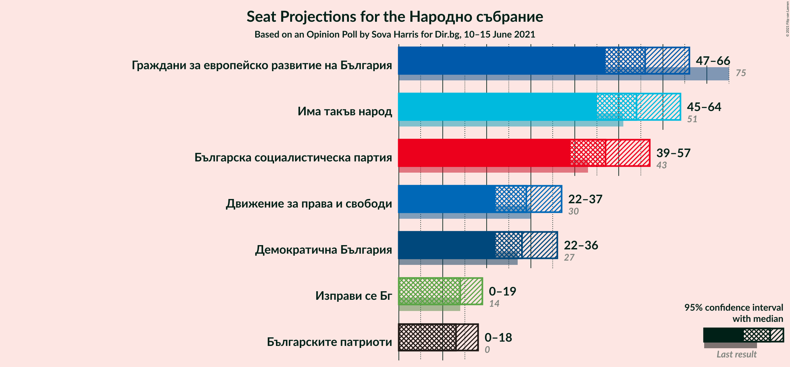
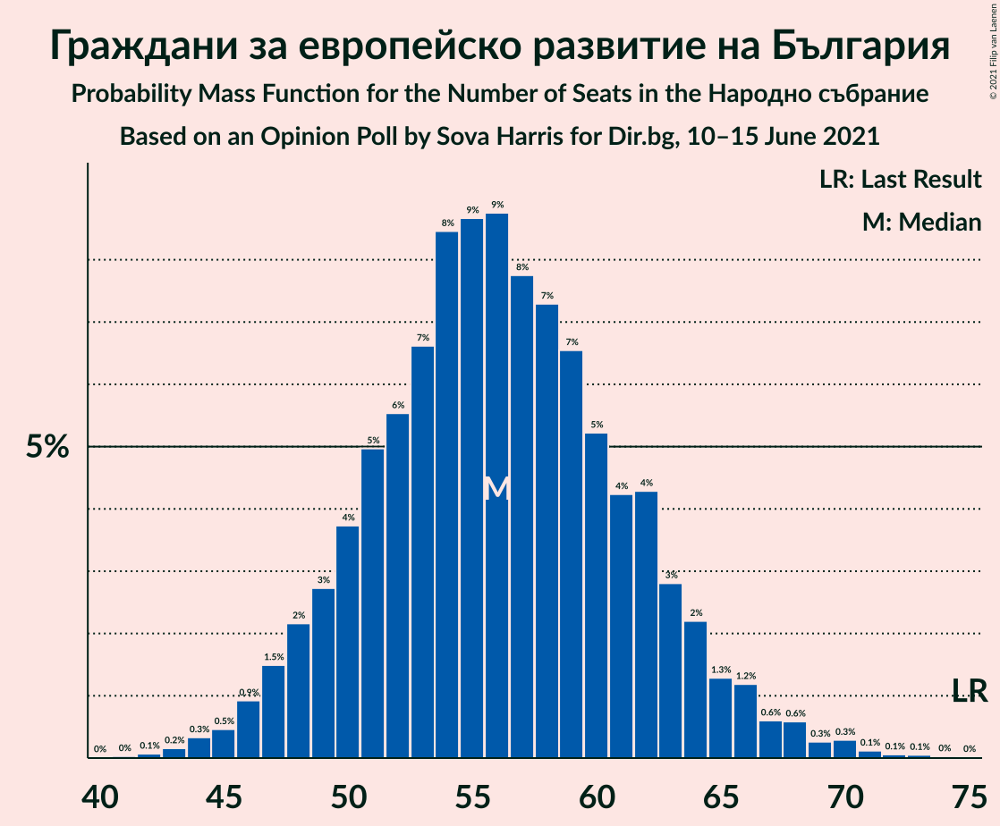
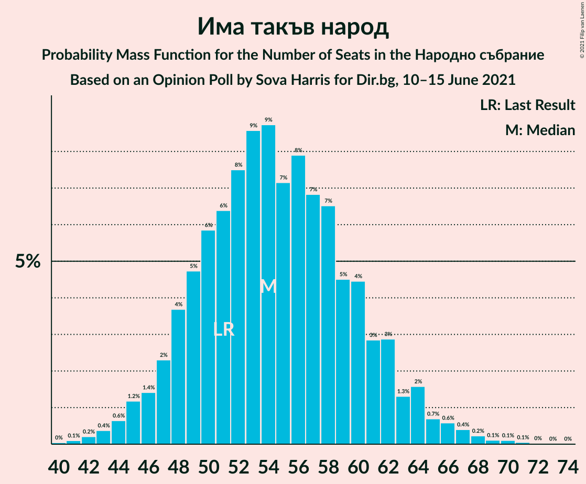
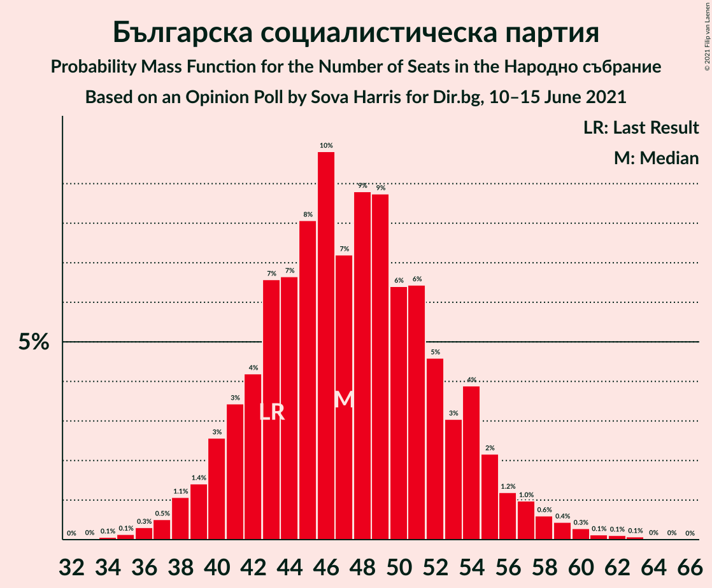
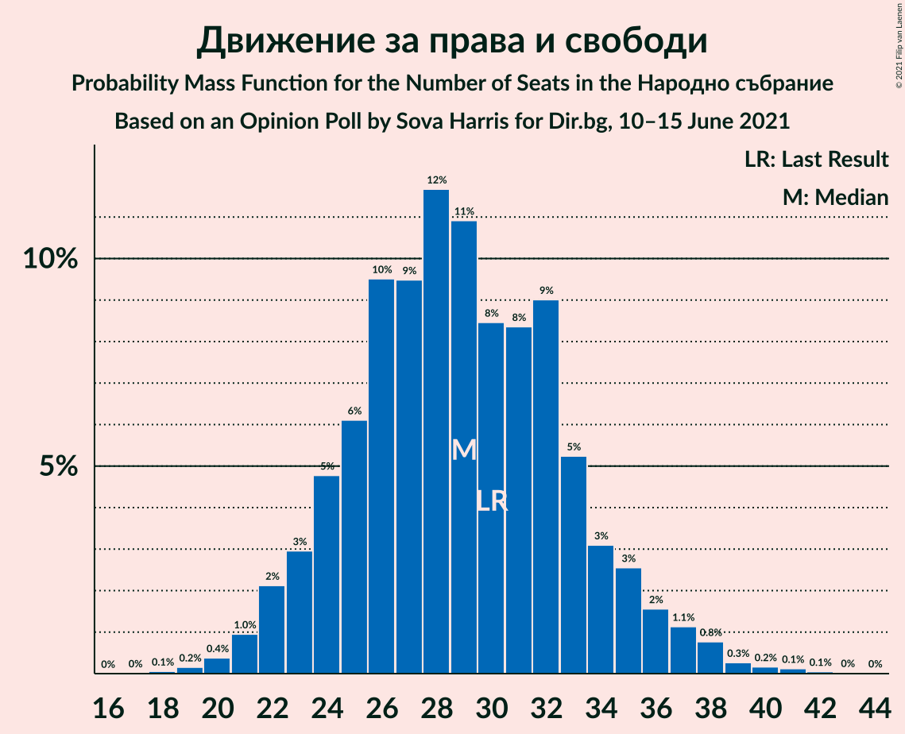
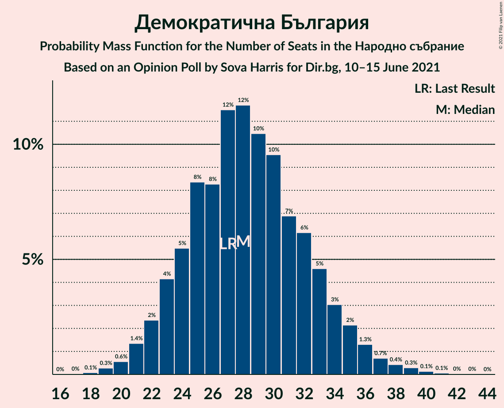
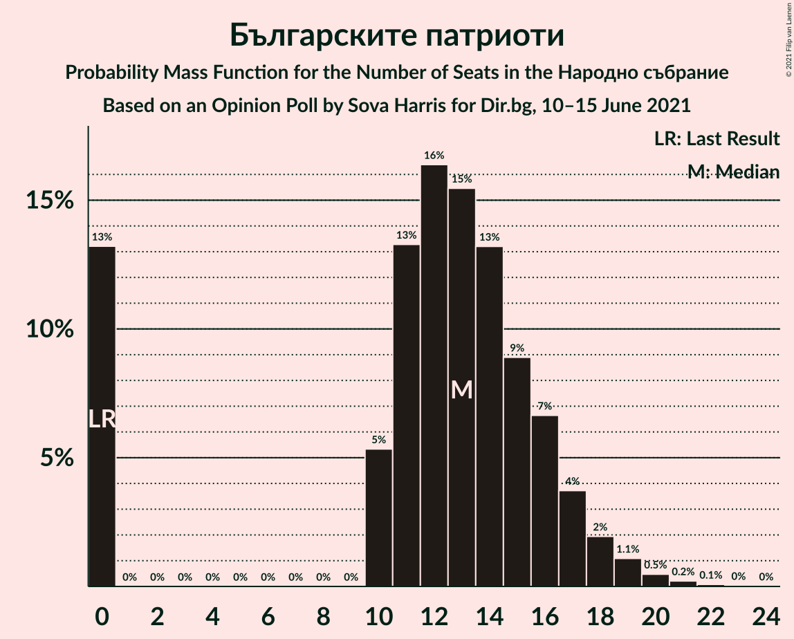
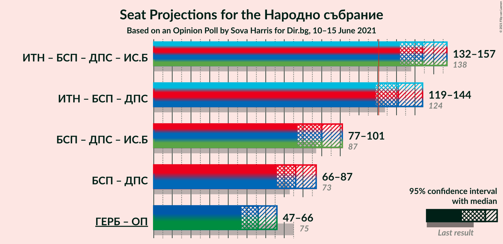
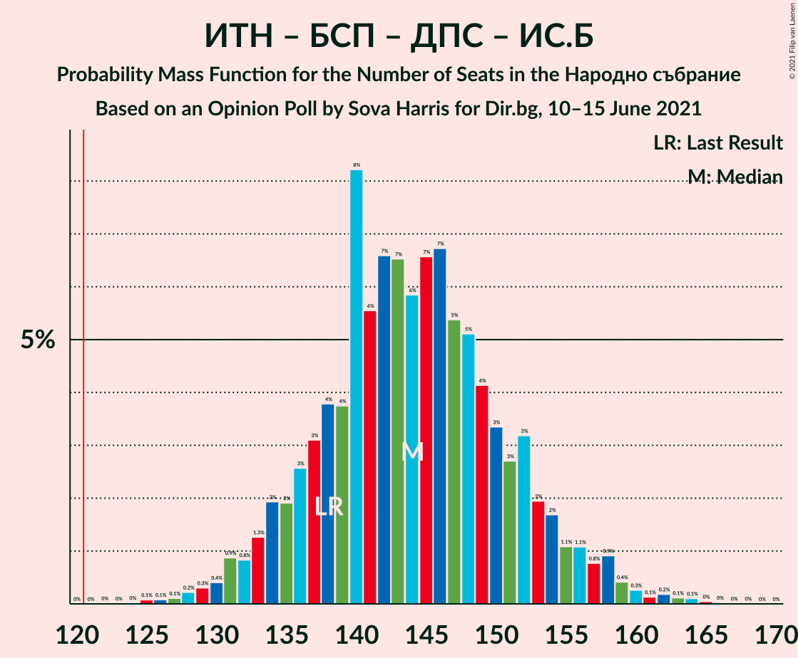
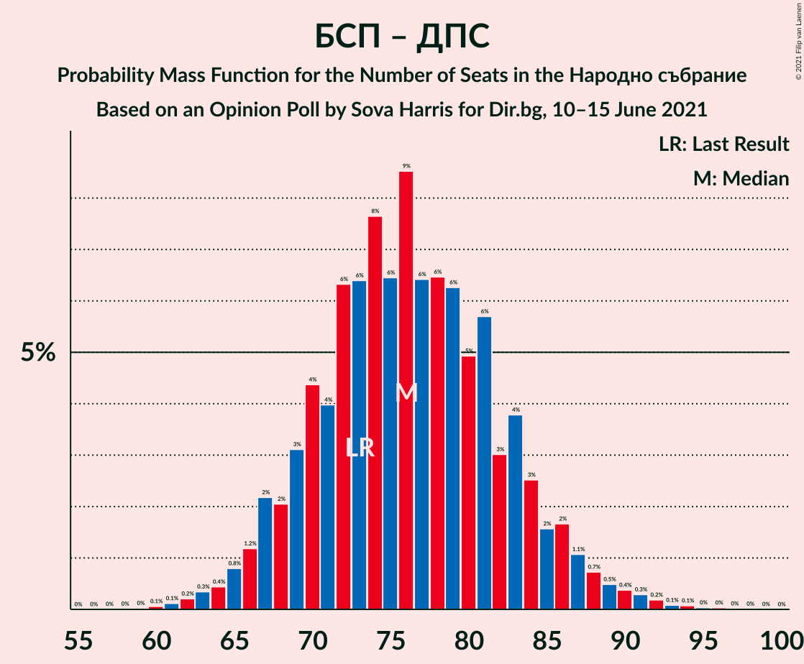

# Opinion Poll by Sova Harris for Dir.bg, 10–15 June 2021

<a href="#voting-intentions">Voting Intentions</a> | <a href="#seats">Seats</a> | <a href="#coalitions">Coalitions</a> | <a href="#technical-information">Technical Information</a>

## Voting Intentions

### Confidence Intervals

| Party | Last Result | Poll Result | 80% Confidence Interval | 90% Confidence Interval | 95% Confidence Interval | 99% Confidence Interval |
|:-----:|:-----------:|:-----------:|:-----------------------:|:-----------------------:|:-----------------------:|:-----------------------:|
| Граждани за европейско развитие на България | 25.8% | 22.3% | 20.0–24.9% |19.4–25.6% |18.8–26.2% |17.8–27.5% |
| Има такъв народ | 17.4% | 21.7% | 19.4–24.2% |18.8–25.0% |18.2–25.6% |17.2–26.8% |
| Българска социалистическа партия | 14.8% | 18.8% | 16.7–21.2% |16.1–21.9% |15.6–22.5% |14.6–23.7% |
| Движение за права и свободи | 10.4% | 11.4% | 9.7–13.4% |9.2–14.0% |8.8–14.5% |8.1–15.5% |
| Демократична България | 9.3% | 11.2% | 9.5–13.2% |9.0–13.8% |8.7–14.3% |7.9–15.3% |
| Изправи се Бг | 4.6% | 5.4% | 4.3–6.9% |3.9–7.4% |3.7–7.8% |3.2–8.6% |
| Българските патриоти | 0.0% | 5.0% | 3.9–6.5% |3.6–6.9% |3.4–7.3% |2.9–8.1% |

*Note:* The poll result column reflects the actual value used in the calculations. Published results may vary slightly, and in addition be rounded to fewer digits.

## Seats

### Confidence Intervals

| Party | Last Result | Median | 80% Confidence Interval | 90% Confidence Interval | 95% Confidence Interval | 99% Confidence Interval |
|:-----:|:-----------:|:------:|:-----------------------:|:-----------------------:|:-----------------------:|:-----------------------:|
| <a href="#граждани-за-европейско-развитие-на-българия">Граждани за европейско развитие на България</a> | 75 | 56 | 50–62 |48–64 |47–66 |44–70 |
| <a href="#има-такъв-народ">Има такъв народ</a> | 51 | 54 | 49–61 |47–63 |45–64 |43–68 |
| <a href="#българска-социалистическа-партия">Българска социалистическа партия</a> | 43 | 47 | 42–53 |40–55 |39–57 |36–60 |
| <a href="#движение-за-права-и-свободи">Движение за права и свободи</a> | 30 | 29 | 24–33 |23–35 |22–37 |20–39 |
| <a href="#демократична-българия">Демократична България</a> | 27 | 28 | 24–33 |23–35 |22–36 |20–39 |
| <a href="#изправи-се-бг">Изправи се Бг</a> | 14 | 14 | 11–17 |0–18 |0–19 |0–21 |
| <a href="#българските-патриоти">Българските патриоти</a> | 0 | 13 | 0–16 |0–17 |0–18 |0–20 |

### Граждани за европейско развитие на България

*For a full overview of the results for this party, see the [Граждани за европейско развитие на България](party-гражданизаевропейскоразвитиенабългария.html) page.*

| Number of Seats | Probability | Accumulated | Special Marks |
|:---------------:|:-----------:|:-----------:|:-------------:|
| 41 | 0% | 100% |  |
| 42 | 0.1% | 99.9% |  |
| 43 | 0.2% | 99.9% |  |
| 44 | 0.3% | 99.7% |  |
| 45 | 0.5% | 99.4% |  |
| 46 | 0.9% | 98.9% |  |
| 47 | 1.5% | 98% |  |
| 48 | 2% | 97% |  |
| 49 | 3% | 94% |  |
| 50 | 4% | 92% |  |
| 51 | 5% | 88% |  |
| 52 | 6% | 83% |  |
| 53 | 7% | 77% |  |
| 54 | 8% | 71% |  |
| 55 | 9% | 62% |  |
| 56 | 9% | 54% | Median |
| 57 | 8% | 45% |  |
| 58 | 7% | 37% |  |
| 59 | 7% | 30% |  |
| 60 | 5% | 23% |  |
| 61 | 4% | 18% |  |
| 62 | 4% | 14% |  |
| 63 | 3% | 10% |  |
| 64 | 2% | 7% |  |
| 65 | 1.3% | 5% |  |
| 66 | 1.2% | 3% |  |
| 67 | 0.6% | 2% |  |
| 68 | 0.6% | 1.4% |  |
| 69 | 0.3% | 0.8% |  |
| 70 | 0.3% | 0.6% |  |
| 71 | 0.1% | 0.3% |  |
| 72 | 0.1% | 0.2% |  |
| 73 | 0.1% | 0.1% |  |
| 74 | 0% | 0.1% |  |
| 75 | 0% | 0% | Last Result |

### Има такъв народ

*For a full overview of the results for this party, see the [Има такъв народ](party-иматакъвнарод.html) page.*

| Number of Seats | Probability | Accumulated | Special Marks |
|:---------------:|:-----------:|:-----------:|:-------------:|
| 40 | 0% | 100% |  |
| 41 | 0.1% | 99.9% |  |
| 42 | 0.2% | 99.8% |  |
| 43 | 0.4% | 99.6% |  |
| 44 | 0.6% | 99.2% |  |
| 45 | 1.2% | 98.6% |  |
| 46 | 1.4% | 97% |  |
| 47 | 2% | 96% |  |
| 48 | 4% | 94% |  |
| 49 | 5% | 90% |  |
| 50 | 6% | 85% |  |
| 51 | 6% | 79% | Last Result |
| 52 | 8% | 73% |  |
| 53 | 9% | 66% |  |
| 54 | 9% | 57% | Median |
| 55 | 7% | 48% |  |
| 56 | 8% | 41% |  |
| 57 | 7% | 33% |  |
| 58 | 7% | 26% |  |
| 59 | 5% | 20% |  |
| 60 | 4% | 15% |  |
| 61 | 3% | 11% |  |
| 62 | 3% | 8% |  |
| 63 | 1.3% | 5% |  |
| 64 | 2% | 4% |  |
| 65 | 0.7% | 2% |  |
| 66 | 0.6% | 2% |  |
| 67 | 0.4% | 1.0% |  |
| 68 | 0.2% | 0.6% |  |
| 69 | 0.1% | 0.3% |  |
| 70 | 0.1% | 0.2% |  |
| 71 | 0.1% | 0.1% |  |
| 72 | 0% | 0.1% |  |
| 73 | 0% | 0% |  |

### Българска социалистическа партия

*For a full overview of the results for this party, see the [Българска социалистическа партия](party-българскасоциалистическапартия.html) page.*

| Number of Seats | Probability | Accumulated | Special Marks |
|:---------------:|:-----------:|:-----------:|:-------------:|
| 34 | 0.1% | 100% |  |
| 35 | 0.1% | 99.9% |  |
| 36 | 0.3% | 99.8% |  |
| 37 | 0.5% | 99.5% |  |
| 38 | 1.1% | 98.9% |  |
| 39 | 1.4% | 98% |  |
| 40 | 3% | 96% |  |
| 41 | 3% | 94% |  |
| 42 | 4% | 90% |  |
| 43 | 7% | 86% | Last Result |
| 44 | 7% | 80% |  |
| 45 | 8% | 73% |  |
| 46 | 10% | 65% |  |
| 47 | 7% | 55% | Median |
| 48 | 9% | 48% |  |
| 49 | 9% | 39% |  |
| 50 | 6% | 30% |  |
| 51 | 6% | 24% |  |
| 52 | 5% | 18% |  |
| 53 | 3% | 13% |  |
| 54 | 4% | 10% |  |
| 55 | 2% | 6% |  |
| 56 | 1.2% | 4% |  |
| 57 | 1.0% | 3% |  |
| 58 | 0.6% | 2% |  |
| 59 | 0.4% | 1.1% |  |
| 60 | 0.3% | 0.7% |  |
| 61 | 0.1% | 0.4% |  |
| 62 | 0.1% | 0.2% |  |
| 63 | 0.1% | 0.1% |  |
| 64 | 0% | 0.1% |  |
| 65 | 0% | 0% |  |

### Движение за права и свободи

*For a full overview of the results for this party, see the [Движение за права и свободи](party-движениезаправаисвободи.html) page.*

| Number of Seats | Probability | Accumulated | Special Marks |
|:---------------:|:-----------:|:-----------:|:-------------:|
| 18 | 0.1% | 100% |  |
| 19 | 0.2% | 99.9% |  |
| 20 | 0.4% | 99.8% |  |
| 21 | 1.0% | 99.4% |  |
| 22 | 2% | 98% |  |
| 23 | 3% | 96% |  |
| 24 | 5% | 93% |  |
| 25 | 6% | 89% |  |
| 26 | 10% | 82% |  |
| 27 | 9% | 73% |  |
| 28 | 12% | 63% |  |
| 29 | 11% | 52% | Median |
| 30 | 8% | 41% | Last Result |
| 31 | 8% | 32% |  |
| 32 | 9% | 24% |  |
| 33 | 5% | 15% |  |
| 34 | 3% | 10% |  |
| 35 | 3% | 7% |  |
| 36 | 2% | 4% |  |
| 37 | 1.1% | 3% |  |
| 38 | 0.8% | 1.4% |  |
| 39 | 0.3% | 0.7% |  |
| 40 | 0.2% | 0.4% |  |
| 41 | 0.1% | 0.2% |  |
| 42 | 0.1% | 0.1% |  |
| 43 | 0% | 0% |  |

### Демократична България

*For a full overview of the results for this party, see the [Демократична България](party-демократичнабългария.html) page.*

| Number of Seats | Probability | Accumulated | Special Marks |
|:---------------:|:-----------:|:-----------:|:-------------:|
| 18 | 0.1% | 100% |  |
| 19 | 0.3% | 99.9% |  |
| 20 | 0.6% | 99.6% |  |
| 21 | 1.4% | 99.0% |  |
| 22 | 2% | 98% |  |
| 23 | 4% | 95% |  |
| 24 | 5% | 91% |  |
| 25 | 8% | 86% |  |
| 26 | 8% | 77% |  |
| 27 | 12% | 69% | Last Result |
| 28 | 12% | 58% | Median |
| 29 | 10% | 46% |  |
| 30 | 10% | 35% |  |
| 31 | 7% | 26% |  |
| 32 | 6% | 19% |  |
| 33 | 5% | 13% |  |
| 34 | 3% | 8% |  |
| 35 | 2% | 5% |  |
| 36 | 1.3% | 3% |  |
| 37 | 0.7% | 2% |  |
| 38 | 0.4% | 1.0% |  |
| 39 | 0.3% | 0.5% |  |
| 40 | 0.1% | 0.3% |  |
| 41 | 0.1% | 0.1% |  |
| 42 | 0% | 0.1% |  |
| 43 | 0% | 0% |  |

### Изправи се Бг

*For a full overview of the results for this party, see the [Изправи се Бг](party-изправисебг.html) page.*

| Number of Seats | Probability | Accumulated | Special Marks |
|:---------------:|:-----------:|:-----------:|:-------------:|
| 0 | 6% | 100% |  |
| 1 | 0% | 94% |  |
| 2 | 0% | 94% |  |
| 3 | 0% | 94% |  |
| 4 | 0% | 94% |  |
| 5 | 0% | 94% |  |
| 6 | 0% | 94% |  |
| 7 | 0% | 94% |  |
| 8 | 0% | 94% |  |
| 9 | 0% | 94% |  |
| 10 | 3% | 94% |  |
| 11 | 9% | 91% |  |
| 12 | 14% | 81% |  |
| 13 | 14% | 68% |  |
| 14 | 15% | 53% | Last Result, Median |
| 15 | 13% | 39% |  |
| 16 | 10% | 25% |  |
| 17 | 7% | 15% |  |
| 18 | 4% | 8% |  |
| 19 | 2% | 4% |  |
| 20 | 1.3% | 2% |  |
| 21 | 0.6% | 1.1% |  |
| 22 | 0.3% | 0.5% |  |
| 23 | 0.1% | 0.2% |  |
| 24 | 0% | 0.1% |  |
| 25 | 0% | 0% |  |

### Българските патриоти

*For a full overview of the results for this party, see the [Българските патриоти](party-българскитепатриоти.html) page.*

| Number of Seats | Probability | Accumulated | Special Marks |
|:---------------:|:-----------:|:-----------:|:-------------:|
| 0 | 13% | 100% | Last Result |
| 1 | 0% | 87% |  |
| 2 | 0% | 87% |  |
| 3 | 0% | 87% |  |
| 4 | 0% | 87% |  |
| 5 | 0% | 87% |  |
| 6 | 0% | 87% |  |
| 7 | 0% | 87% |  |
| 8 | 0% | 87% |  |
| 9 | 0% | 87% |  |
| 10 | 5% | 87% |  |
| 11 | 13% | 81% |  |
| 12 | 16% | 68% |  |
| 13 | 15% | 52% | Median |
| 14 | 13% | 36% |  |
| 15 | 9% | 23% |  |
| 16 | 7% | 14% |  |
| 17 | 4% | 8% |  |
| 18 | 2% | 4% |  |
| 19 | 1.1% | 2% |  |
| 20 | 0.5% | 0.8% |  |
| 21 | 0.2% | 0.3% |  |
| 22 | 0.1% | 0.1% |  |
| 23 | 0% | 0.1% |  |
| 24 | 0% | 0% |  |

## Coalitions

### Confidence Intervals

| Coalition | Last Result | Median | Majority? | 80% Confidence Interval | 90% Confidence Interval | 95% Confidence Interval | 99% Confidence Interval |
|:---------:|:-----------:|:------:|:---------:|:-----------------------:|:-----------------------:|:-----------------------:|:-----------------------:|
| Има такъв народ – Българска социалистическа партия – Движение за права и свободи – Изправи се Бг | 138 | 144 | 100% | 136–152 | 134–155 | 132–157 | 128–162 |
| Има такъв народ – Българска социалистическа партия – Движение за права и свободи | 124 | 131 | 96% | 123–139 | 121–142 | 119–144 | 115–149 |
| Българска социалистическа партия – Движение за права и свободи – Изправи се Бг | 87 | 90 | 0% | 82–97 | 80–99 | 77–101 | 73–105 |
| Българска социалистическа партия – Движение за права и свободи | 73 | 76 | 0% | 69–83 | 67–86 | 66–87 | 63–91 |

### Има такъв народ – Българска социалистическа партия – Движение за права и свободи – Изправи се Бг

| Number of Seats | Probability | Accumulated | Special Marks |
|:---------------:|:-----------:|:-----------:|:-------------:|
| 124 | 0% | 100% |  |
| 125 | 0.1% | 99.9% |  |
| 126 | 0.1% | 99.9% |  |
| 127 | 0.1% | 99.8% |  |
| 128 | 0.2% | 99.7% |  |
| 129 | 0.3% | 99.4% |  |
| 130 | 0.4% | 99.1% |  |
| 131 | 0.9% | 98.7% |  |
| 132 | 0.8% | 98% |  |
| 133 | 1.3% | 97% |  |
| 134 | 2% | 96% |  |
| 135 | 2% | 94% |  |
| 136 | 3% | 92% |  |
| 137 | 3% | 89% |  |
| 138 | 4% | 86% | Last Result |
| 139 | 4% | 82% |  |
| 140 | 8% | 79% |  |
| 141 | 6% | 70% |  |
| 142 | 7% | 65% |  |
| 143 | 7% | 58% |  |
| 144 | 6% | 52% | Median |
| 145 | 7% | 46% |  |
| 146 | 7% | 39% |  |
| 147 | 5% | 33% |  |
| 148 | 5% | 27% |  |
| 149 | 4% | 22% |  |
| 150 | 3% | 18% |  |
| 151 | 3% | 15% |  |
| 152 | 3% | 12% |  |
| 153 | 2% | 9% |  |
| 154 | 2% | 7% |  |
| 155 | 1.1% | 5% |  |
| 156 | 1.1% | 4% |  |
| 157 | 0.8% | 3% |  |
| 158 | 0.9% | 2% |  |
| 159 | 0.4% | 1.3% |  |
| 160 | 0.3% | 0.9% |  |
| 161 | 0.1% | 0.6% |  |
| 162 | 0.2% | 0.5% |  |
| 163 | 0.1% | 0.3% |  |
| 164 | 0.1% | 0.2% |  |
| 165 | 0% | 0.1% |  |
| 166 | 0% | 0.1% |  |
| 167 | 0% | 0% |  |

### Има такъв народ – Българска социалистическа партия – Движение за права и свободи

| Number of Seats | Probability | Accumulated | Special Marks |
|:---------------:|:-----------:|:-----------:|:-------------:|
| 111 | 0% | 100% |  |
| 112 | 0% | 99.9% |  |
| 113 | 0% | 99.9% |  |
| 114 | 0.1% | 99.9% |  |
| 115 | 0.3% | 99.8% |  |
| 116 | 0.3% | 99.5% |  |
| 117 | 0.6% | 99.1% |  |
| 118 | 0.4% | 98.6% |  |
| 119 | 0.8% | 98% |  |
| 120 | 2% | 97% |  |
| 121 | 2% | 96% | Majority |
| 122 | 3% | 93% |  |
| 123 | 2% | 91% |  |
| 124 | 3% | 88% | Last Result |
| 125 | 6% | 86% |  |
| 126 | 6% | 80% |  |
| 127 | 7% | 74% |  |
| 128 | 6% | 67% |  |
| 129 | 4% | 62% |  |
| 130 | 7% | 57% | Median |
| 131 | 8% | 50% |  |
| 132 | 8% | 43% |  |
| 133 | 4% | 35% |  |
| 134 | 5% | 31% |  |
| 135 | 4% | 27% |  |
| 136 | 5% | 23% |  |
| 137 | 4% | 18% |  |
| 138 | 3% | 13% |  |
| 139 | 1.4% | 10% |  |
| 140 | 2% | 9% |  |
| 141 | 2% | 7% |  |
| 142 | 1.2% | 5% |  |
| 143 | 1.2% | 4% |  |
| 144 | 0.6% | 3% |  |
| 145 | 0.4% | 2% |  |
| 146 | 0.7% | 2% |  |
| 147 | 0.3% | 1.1% |  |
| 148 | 0.3% | 0.8% |  |
| 149 | 0.1% | 0.5% |  |
| 150 | 0.1% | 0.4% |  |
| 151 | 0.1% | 0.3% |  |
| 152 | 0.1% | 0.2% |  |
| 153 | 0% | 0.1% |  |
| 154 | 0% | 0.1% |  |
| 155 | 0% | 0.1% |  |
| 156 | 0% | 0% |  |

### Българска социалистическа партия – Движение за права и свободи – Изправи се Бг

| Number of Seats | Probability | Accumulated | Special Marks |
|:---------------:|:-----------:|:-----------:|:-------------:|
| 68 | 0% | 100% |  |
| 69 | 0.1% | 99.9% |  |
| 70 | 0% | 99.9% |  |
| 71 | 0.1% | 99.8% |  |
| 72 | 0.1% | 99.7% |  |
| 73 | 0.3% | 99.5% |  |
| 74 | 0.3% | 99.3% |  |
| 75 | 0.4% | 99.0% |  |
| 76 | 0.5% | 98.6% |  |
| 77 | 0.7% | 98% |  |
| 78 | 1.1% | 97% |  |
| 79 | 1.2% | 96% |  |
| 80 | 2% | 95% |  |
| 81 | 3% | 93% |  |
| 82 | 3% | 91% |  |
| 83 | 3% | 88% |  |
| 84 | 4% | 85% |  |
| 85 | 5% | 81% |  |
| 86 | 5% | 75% |  |
| 87 | 7% | 70% | Last Result |
| 88 | 6% | 64% |  |
| 89 | 6% | 58% |  |
| 90 | 8% | 51% | Median |
| 91 | 8% | 44% |  |
| 92 | 6% | 35% |  |
| 93 | 5% | 30% |  |
| 94 | 5% | 25% |  |
| 95 | 4% | 20% |  |
| 96 | 3% | 15% |  |
| 97 | 3% | 12% |  |
| 98 | 3% | 9% |  |
| 99 | 2% | 6% |  |
| 100 | 2% | 5% |  |
| 101 | 0.9% | 3% |  |
| 102 | 0.8% | 2% |  |
| 103 | 0.6% | 2% |  |
| 104 | 0.3% | 1.0% |  |
| 105 | 0.2% | 0.7% |  |
| 106 | 0.1% | 0.4% |  |
| 107 | 0.1% | 0.3% |  |
| 108 | 0.1% | 0.1% |  |
| 109 | 0% | 0.1% |  |
| 110 | 0% | 0.1% |  |
| 111 | 0% | 0% |  |

### Българска социалистическа партия – Движение за права и свободи

| Number of Seats | Probability | Accumulated | Special Marks |
|:---------------:|:-----------:|:-----------:|:-------------:|
| 60 | 0.1% | 100% |  |
| 61 | 0.1% | 99.9% |  |
| 62 | 0.2% | 99.8% |  |
| 63 | 0.3% | 99.6% |  |
| 64 | 0.4% | 99.2% |  |
| 65 | 0.8% | 98.8% |  |
| 66 | 1.2% | 98% |  |
| 67 | 2% | 97% |  |
| 68 | 2% | 95% |  |
| 69 | 3% | 93% |  |
| 70 | 4% | 89% |  |
| 71 | 4% | 85% |  |
| 72 | 6% | 81% |  |
| 73 | 6% | 75% | Last Result |
| 74 | 8% | 68% |  |
| 75 | 6% | 61% |  |
| 76 | 9% | 54% | Median |
| 77 | 6% | 46% |  |
| 78 | 6% | 39% |  |
| 79 | 6% | 33% |  |
| 80 | 5% | 27% |  |
| 81 | 6% | 22% |  |
| 82 | 3% | 16% |  |
| 83 | 4% | 13% |  |
| 84 | 3% | 9% |  |
| 85 | 2% | 7% |  |
| 86 | 2% | 5% |  |
| 87 | 1.1% | 3% |  |
| 88 | 0.7% | 2% |  |
| 89 | 0.5% | 2% |  |
| 90 | 0.4% | 1.1% |  |
| 91 | 0.3% | 0.7% |  |
| 92 | 0.2% | 0.5% |  |
| 93 | 0.1% | 0.3% |  |
| 94 | 0.1% | 0.2% |  |
| 95 | 0% | 0.1% |  |
| 96 | 0% | 0.1% |  |
| 97 | 0% | 0% |  |

## Technical Information

### Opinion Poll

+ **Polling firm:** Sova Harris
+ **Commissioner(s):** Dir.bg
+ **Fieldwork period:** 10–15 June 2021

### Calculations

+ **Sample size:** 484
+ **Simulations done:** 1,048,576
+ **Error estimate:** 1.68%

