# Opinion Poll by Тренд for 24 часа, 11–18 June 2021

<a href="#voting-intentions">Voting Intentions</a> | <a href="#seats">Seats</a> | <a href="#coalitions">Coalitions</a> | <a href="#technical-information">Technical Information</a>

## Voting Intentions

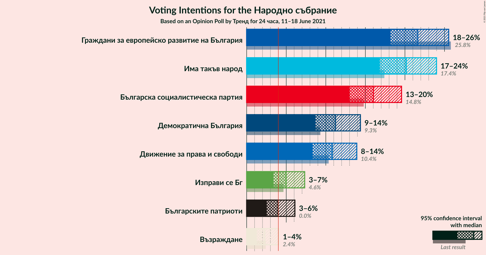

### Confidence Intervals

| Party | Last Result | Poll Result | 80% Confidence Interval | 90% Confidence Interval | 95% Confidence Interval | 99% Confidence Interval |
|:-----:|:-----------:|:-----------:|:-----------------------:|:-----------------------:|:-----------------------:|:-----------------------:|
| Граждани за европейско развитие на България | 25.8% | 21.6% | 19.4–24.2% |18.7–24.9% |18.2–25.5% |17.1–26.8% |
| Има такъв народ | 17.4% | 20.2% | 18.0–22.7% |17.3–23.4% |16.8–24.0% |15.8–25.2% |
| Българска социалистическа партия | 14.8% | 16.0% | 14.0–18.3% |13.5–19.0% |13.0–19.6% |12.1–20.7% |
| Демократична България | 9.3% | 11.2% | 9.6–13.3% |9.1–13.9% |8.7–14.4% |8.0–15.4% |
| Движение за права и свободи | 10.4% | 10.8% | 9.2–12.8% |8.7–13.4% |8.3–13.9% |7.6–14.9% |
| Изправи се Бг | 4.6% | 5.0% | 3.9–6.5% |3.6–6.9% |3.4–7.3% |2.9–8.1% |
| Българските патриоти | 0.0% | 4.0% | 3.0–5.3% |2.8–5.7% |2.5–6.1% |2.2–6.8% |
| Възраждане | 2.4% | 2.3% | 1.6–3.4% |1.4–3.7% |1.3–4.1% |1.0–4.7% |

*Note:* The poll result column reflects the actual value used in the calculations. Published results may vary slightly, and in addition be rounded to fewer digits.

## Seats

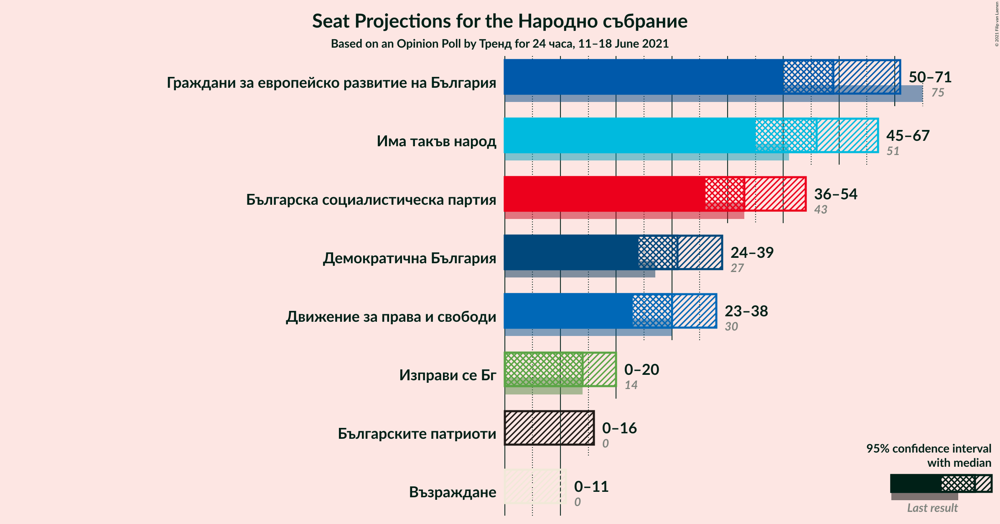

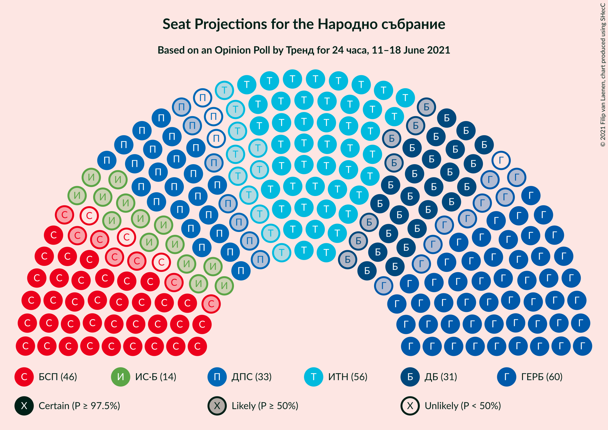

### Confidence Intervals

| Party | Last Result | Median | 80% Confidence Interval | 90% Confidence Interval | 95% Confidence Interval | 99% Confidence Interval |
|:-----:|:-----------:|:------:|:-----------------------:|:-----------------------:|:-----------------------:|:-----------------------:|
| <a href="#граждани-за-европейско-развитие-на-българия">Граждани за европейско развитие на България</a> | 75 | 59 | 53–67 |51–69 |50–71 |47–74 |
| <a href="#има-такъв-народ">Има такъв народ</a> | 51 | 56 | 48–64 |46–66 |45–67 |44–69 |
| <a href="#българска-социалистическа-партия">Българска социалистическа партия</a> | 43 | 43 | 38–51 |37–53 |36–54 |33–57 |
| <a href="#демократична-българия">Демократична България</a> | 27 | 31 | 26–37 |25–38 |24–39 |22–42 |
| <a href="#движение-за-права-и-свободи">Движение за права и свободи</a> | 30 | 30 | 25–35 |24–37 |23–38 |21–41 |
| <a href="#изправи-се-бг">Изправи се Бг</a> | 14 | 14 | 0–18 |0–19 |0–20 |0–22 |
| <a href="#българските-патриоти">Българските патриоти</a> | 0 | 0 | 0–15 |0–15 |0–16 |0–18 |
| <a href="#възраждане">Възраждане</a> | 0 | 0 | 0 |0 |0–11 |0–13 |

### Граждани за европейско развитие на България

*For a full overview of the results for this party, see the [Граждани за европейско развитие на България](party-гражданизаевропейскоразвитиенабългария.html) page.*

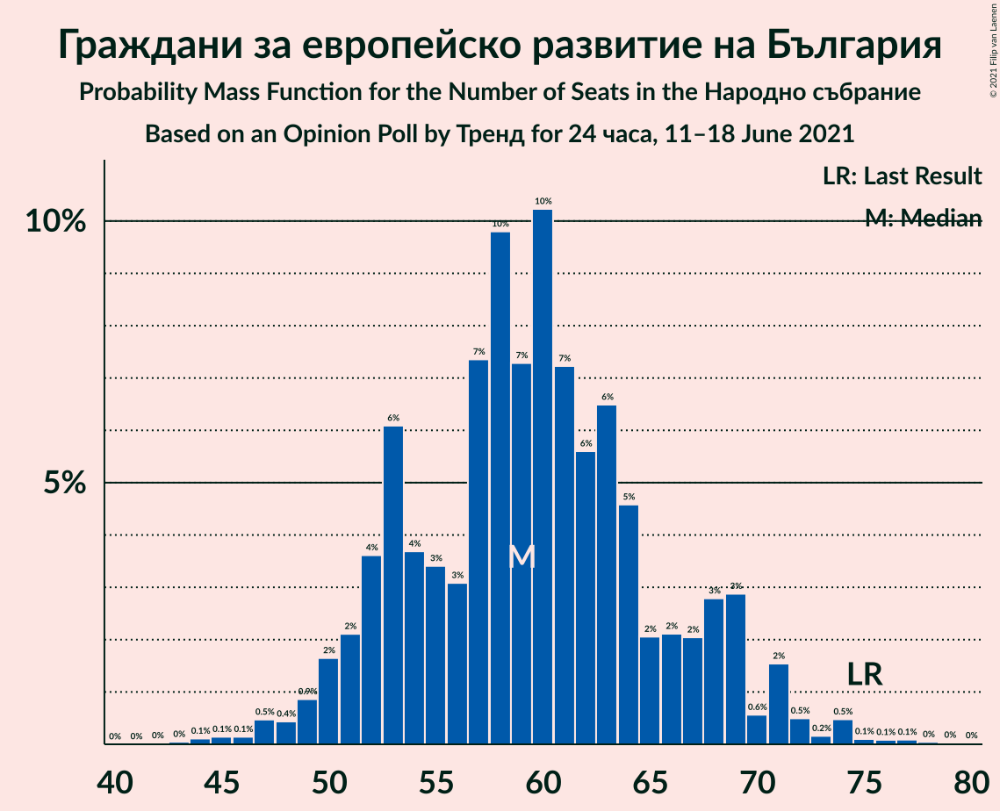

| Number of Seats | Probability | Accumulated | Special Marks |
|:---------------:|:-----------:|:-----------:|:-------------:|
| 43 | 0% | 100% |  |
| 44 | 0.1% | 99.9% |  |
| 45 | 0.1% | 99.8% |  |
| 46 | 0.1% | 99.7% |  |
| 47 | 0.5% | 99.5% |  |
| 48 | 0.4% | 99.1% |  |
| 49 | 0.9% | 98.6% |  |
| 50 | 2% | 98% |  |
| 51 | 2% | 96% |  |
| 52 | 4% | 94% |  |
| 53 | 6% | 90% |  |
| 54 | 4% | 84% |  |
| 55 | 3% | 81% |  |
| 56 | 3% | 77% |  |
| 57 | 7% | 74% |  |
| 58 | 10% | 67% |  |
| 59 | 7% | 57% | Median |
| 60 | 10% | 50% |  |
| 61 | 7% | 39% |  |
| 62 | 6% | 32% |  |
| 63 | 6% | 27% |  |
| 64 | 5% | 20% |  |
| 65 | 2% | 16% |  |
| 66 | 2% | 13% |  |
| 67 | 2% | 11% |  |
| 68 | 3% | 9% |  |
| 69 | 3% | 7% |  |
| 70 | 0.6% | 4% |  |
| 71 | 2% | 3% |  |
| 72 | 0.5% | 2% |  |
| 73 | 0.2% | 1.0% |  |
| 74 | 0.5% | 0.9% |  |
| 75 | 0.1% | 0.4% | Last Result |
| 76 | 0.1% | 0.3% |  |
| 77 | 0.1% | 0.2% |  |
| 78 | 0% | 0.1% |  |
| 79 | 0% | 0.1% |  |
| 80 | 0% | 0% |  |

### Има такъв народ

*For a full overview of the results for this party, see the [Има такъв народ](party-иматакъвнарод.html) page.*

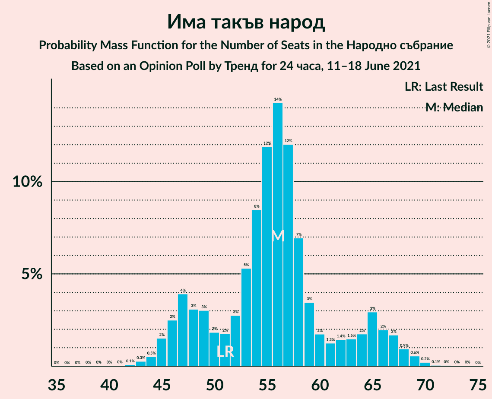

| Number of Seats | Probability | Accumulated | Special Marks |
|:---------------:|:-----------:|:-----------:|:-------------:|
| 39 | 0% | 100% |  |
| 40 | 0% | 99.9% |  |
| 41 | 0% | 99.9% |  |
| 42 | 0.1% | 99.9% |  |
| 43 | 0.3% | 99.8% |  |
| 44 | 0.5% | 99.5% |  |
| 45 | 2% | 99.0% |  |
| 46 | 2% | 97% |  |
| 47 | 4% | 95% |  |
| 48 | 3% | 91% |  |
| 49 | 3% | 88% |  |
| 50 | 2% | 85% |  |
| 51 | 2% | 83% | Last Result |
| 52 | 3% | 81% |  |
| 53 | 5% | 79% |  |
| 54 | 8% | 73% |  |
| 55 | 12% | 65% |  |
| 56 | 14% | 53% | Median |
| 57 | 12% | 39% |  |
| 58 | 7% | 27% |  |
| 59 | 3% | 20% |  |
| 60 | 2% | 16% |  |
| 61 | 1.3% | 14% |  |
| 62 | 1.4% | 13% |  |
| 63 | 1.5% | 12% |  |
| 64 | 2% | 10% |  |
| 65 | 3% | 9% |  |
| 66 | 2% | 6% |  |
| 67 | 2% | 4% |  |
| 68 | 0.9% | 2% |  |
| 69 | 0.6% | 1.0% |  |
| 70 | 0.2% | 0.4% |  |
| 71 | 0.1% | 0.2% |  |
| 72 | 0% | 0.2% |  |
| 73 | 0% | 0.1% |  |
| 74 | 0% | 0.1% |  |
| 75 | 0% | 0% |  |

### Българска социалистическа партия

*For a full overview of the results for this party, see the [Българска социалистическа партия](party-българскасоциалистическапартия.html) page.*

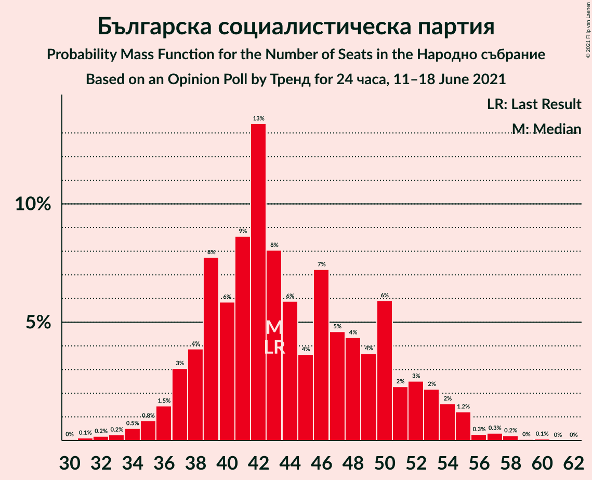

| Number of Seats | Probability | Accumulated | Special Marks |
|:---------------:|:-----------:|:-----------:|:-------------:|
| 30 | 0% | 100% |  |
| 31 | 0.1% | 99.9% |  |
| 32 | 0.2% | 99.8% |  |
| 33 | 0.2% | 99.6% |  |
| 34 | 0.5% | 99.4% |  |
| 35 | 0.8% | 98.9% |  |
| 36 | 1.5% | 98% |  |
| 37 | 3% | 97% |  |
| 38 | 4% | 94% |  |
| 39 | 8% | 90% |  |
| 40 | 6% | 82% |  |
| 41 | 9% | 76% |  |
| 42 | 13% | 67% |  |
| 43 | 8% | 54% | Last Result, Median |
| 44 | 6% | 46% |  |
| 45 | 4% | 40% |  |
| 46 | 7% | 36% |  |
| 47 | 5% | 29% |  |
| 48 | 4% | 25% |  |
| 49 | 4% | 20% |  |
| 50 | 6% | 17% |  |
| 51 | 2% | 11% |  |
| 52 | 3% | 8% |  |
| 53 | 2% | 6% |  |
| 54 | 2% | 4% |  |
| 55 | 1.2% | 2% |  |
| 56 | 0.3% | 1.0% |  |
| 57 | 0.3% | 0.7% |  |
| 58 | 0.2% | 0.4% |  |
| 59 | 0% | 0.2% |  |
| 60 | 0.1% | 0.1% |  |
| 61 | 0% | 0.1% |  |
| 62 | 0% | 0% |  |

### Демократична България

*For a full overview of the results for this party, see the [Демократична България](party-демократичнабългария.html) page.*

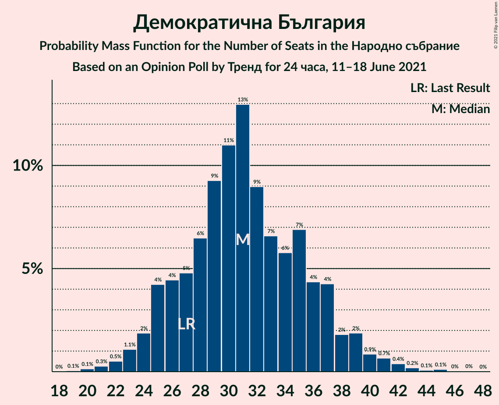

| Number of Seats | Probability | Accumulated | Special Marks |
|:---------------:|:-----------:|:-----------:|:-------------:|
| 19 | 0.1% | 100% |  |
| 20 | 0.1% | 99.9% |  |
| 21 | 0.3% | 99.8% |  |
| 22 | 0.5% | 99.5% |  |
| 23 | 1.1% | 99.0% |  |
| 24 | 2% | 98% |  |
| 25 | 4% | 96% |  |
| 26 | 4% | 92% |  |
| 27 | 5% | 87% | Last Result |
| 28 | 6% | 83% |  |
| 29 | 9% | 76% |  |
| 30 | 11% | 67% |  |
| 31 | 13% | 56% | Median |
| 32 | 9% | 43% |  |
| 33 | 7% | 34% |  |
| 34 | 6% | 27% |  |
| 35 | 7% | 22% |  |
| 36 | 4% | 15% |  |
| 37 | 4% | 10% |  |
| 38 | 2% | 6% |  |
| 39 | 2% | 4% |  |
| 40 | 0.9% | 2% |  |
| 41 | 0.7% | 1.5% |  |
| 42 | 0.4% | 0.8% |  |
| 43 | 0.2% | 0.4% |  |
| 44 | 0.1% | 0.3% |  |
| 45 | 0.1% | 0.2% |  |
| 46 | 0% | 0.1% |  |
| 47 | 0% | 0.1% |  |
| 48 | 0% | 0% |  |

### Движение за права и свободи

*For a full overview of the results for this party, see the [Движение за права и свободи](party-движениезаправаисвободи.html) page.*

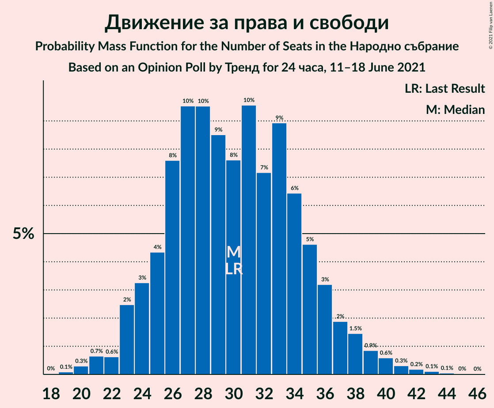

| Number of Seats | Probability | Accumulated | Special Marks |
|:---------------:|:-----------:|:-----------:|:-------------:|
| 18 | 0% | 100% |  |
| 19 | 0.1% | 99.9% |  |
| 20 | 0.3% | 99.9% |  |
| 21 | 0.7% | 99.6% |  |
| 22 | 0.6% | 98.9% |  |
| 23 | 2% | 98% |  |
| 24 | 3% | 96% |  |
| 25 | 4% | 93% |  |
| 26 | 8% | 88% |  |
| 27 | 10% | 81% |  |
| 28 | 10% | 71% |  |
| 29 | 9% | 62% |  |
| 30 | 8% | 53% | Last Result, Median |
| 31 | 10% | 45% |  |
| 32 | 7% | 36% |  |
| 33 | 9% | 29% |  |
| 34 | 6% | 20% |  |
| 35 | 5% | 13% |  |
| 36 | 3% | 9% |  |
| 37 | 2% | 5% |  |
| 38 | 1.5% | 4% |  |
| 39 | 0.9% | 2% |  |
| 40 | 0.6% | 1.3% |  |
| 41 | 0.3% | 0.7% |  |
| 42 | 0.2% | 0.4% |  |
| 43 | 0.1% | 0.2% |  |
| 44 | 0.1% | 0.1% |  |
| 45 | 0% | 0.1% |  |
| 46 | 0% | 0% |  |

### Изправи се Бг

*For a full overview of the results for this party, see the [Изправи се Бг](party-изправисебг.html) page.*

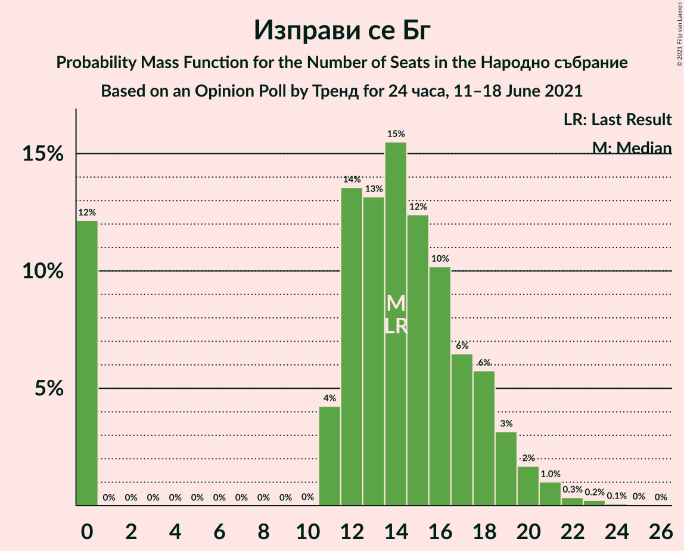

| Number of Seats | Probability | Accumulated | Special Marks |
|:---------------:|:-----------:|:-----------:|:-------------:|
| 0 | 12% | 100% |  |
| 1 | 0% | 88% |  |
| 2 | 0% | 88% |  |
| 3 | 0% | 88% |  |
| 4 | 0% | 88% |  |
| 5 | 0% | 88% |  |
| 6 | 0% | 88% |  |
| 7 | 0% | 88% |  |
| 8 | 0% | 88% |  |
| 9 | 0% | 88% |  |
| 10 | 0% | 88% |  |
| 11 | 4% | 88% |  |
| 12 | 14% | 84% |  |
| 13 | 13% | 70% |  |
| 14 | 15% | 57% | Last Result, Median |
| 15 | 12% | 41% |  |
| 16 | 10% | 29% |  |
| 17 | 6% | 19% |  |
| 18 | 6% | 12% |  |
| 19 | 3% | 7% |  |
| 20 | 2% | 3% |  |
| 21 | 1.0% | 2% |  |
| 22 | 0.3% | 0.7% |  |
| 23 | 0.2% | 0.4% |  |
| 24 | 0.1% | 0.2% |  |
| 25 | 0% | 0.1% |  |
| 26 | 0% | 0% |  |

### Българските патриоти

*For a full overview of the results for this party, see the [Българските патриоти](party-българскитепатриоти.html) page.*

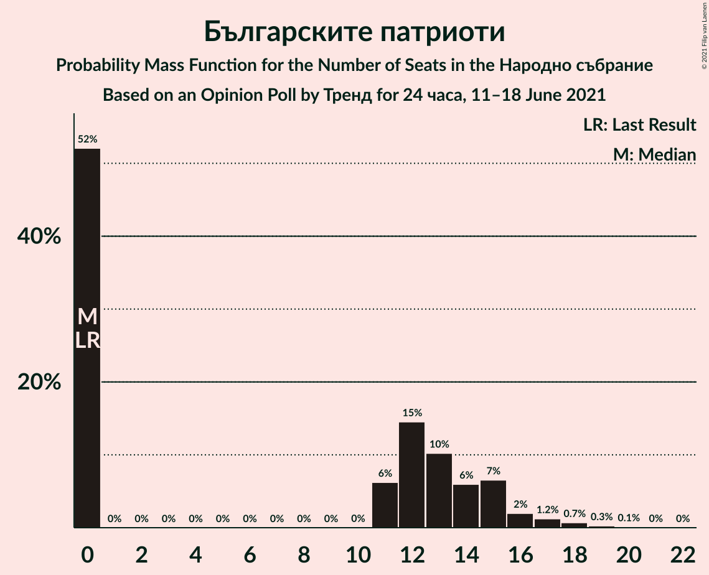

| Number of Seats | Probability | Accumulated | Special Marks |
|:---------------:|:-----------:|:-----------:|:-------------:|
| 0 | 52% | 100% | Last Result, Median |
| 1 | 0% | 48% |  |
| 2 | 0% | 48% |  |
| 3 | 0% | 48% |  |
| 4 | 0% | 48% |  |
| 5 | 0% | 48% |  |
| 6 | 0% | 48% |  |
| 7 | 0% | 48% |  |
| 8 | 0% | 48% |  |
| 9 | 0% | 48% |  |
| 10 | 0% | 48% |  |
| 11 | 6% | 48% |  |
| 12 | 15% | 42% |  |
| 13 | 10% | 27% |  |
| 14 | 6% | 17% |  |
| 15 | 7% | 11% |  |
| 16 | 2% | 4% |  |
| 17 | 1.2% | 2% |  |
| 18 | 0.7% | 1.1% |  |
| 19 | 0.3% | 0.4% |  |
| 20 | 0.1% | 0.2% |  |
| 21 | 0% | 0.1% |  |
| 22 | 0% | 0% |  |

### Възраждане

*For a full overview of the results for this party, see the [Възраждане](party-възраждане.html) page.*

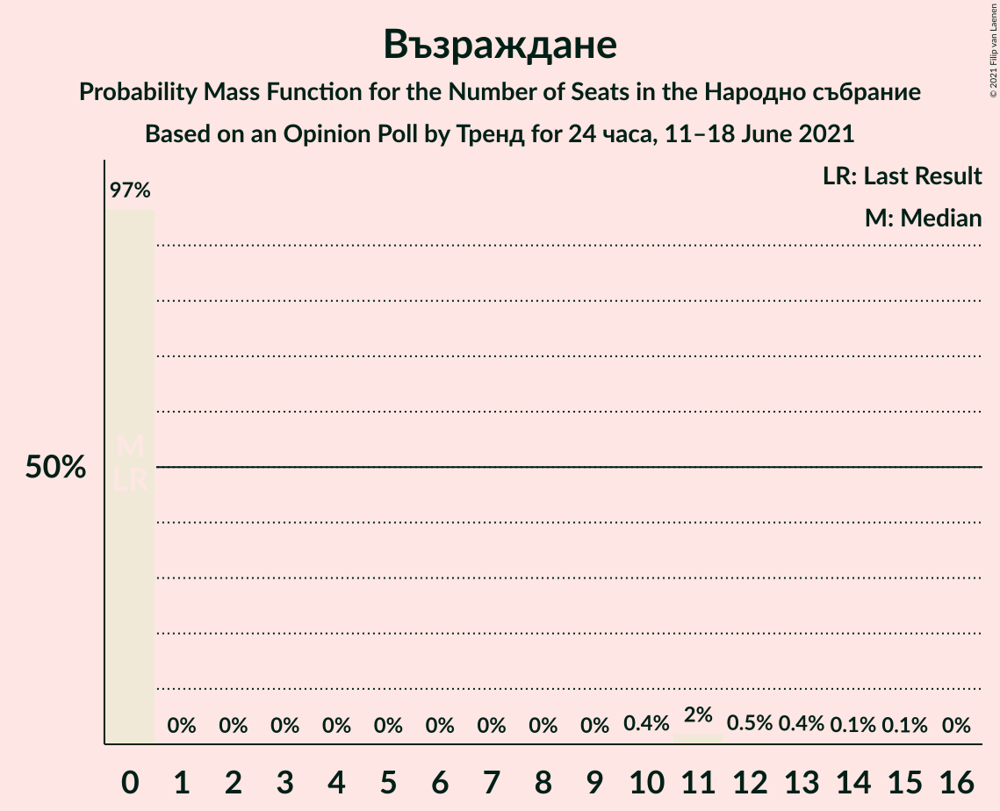

| Number of Seats | Probability | Accumulated | Special Marks |
|:---------------:|:-----------:|:-----------:|:-------------:|
| 0 | 97% | 100% | Last Result, Median |
| 1 | 0% | 3% |  |
| 2 | 0% | 3% |  |
| 3 | 0% | 3% |  |
| 4 | 0% | 3% |  |
| 5 | 0% | 3% |  |
| 6 | 0% | 3% |  |
| 7 | 0% | 3% |  |
| 8 | 0% | 3% |  |
| 9 | 0% | 3% |  |
| 10 | 0.4% | 3% |  |
| 11 | 2% | 3% |  |
| 12 | 0.5% | 1.0% |  |
| 13 | 0.4% | 0.6% |  |
| 14 | 0.1% | 0.2% |  |
| 15 | 0.1% | 0.1% |  |
| 16 | 0% | 0% |  |

## Coalitions

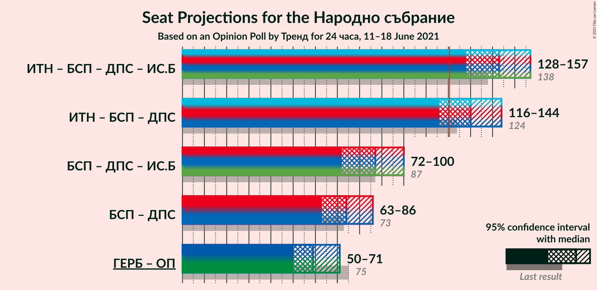

### Confidence Intervals

| Coalition | Last Result | Median | Majority? | 80% Confidence Interval | 90% Confidence Interval | 95% Confidence Interval | 99% Confidence Interval |
|:---------:|:-----------:|:------:|:---------:|:-----------------------:|:-----------------------:|:-----------------------:|:-----------------------:|
| Има такъв народ – Българска социалистическа партия – Движение за права и свободи – Изправи се Бг | 138 | 143 | 99.8% | 133–152 | 130–154 | 128–157 | 123–161 |
| Има такъв народ – Българска социалистическа партия – Движение за права и свободи | 124 | 130 | 90% | 121–139 | 118–142 | 116–144 | 112–149 |
| Българска социалистическа партия – Движение за права и свободи – Изправи се Бг | 87 | 87 | 0% | 78–96 | 75–98 | 72–100 | 68–104 |
| Българска социалистическа партия – Движение за права и свободи | 73 | 74 | 0% | 67–82 | 64–85 | 63–86 | 60–90 |

### Има такъв народ – Българска социалистическа партия – Движение за права и свободи – Изправи се Бг

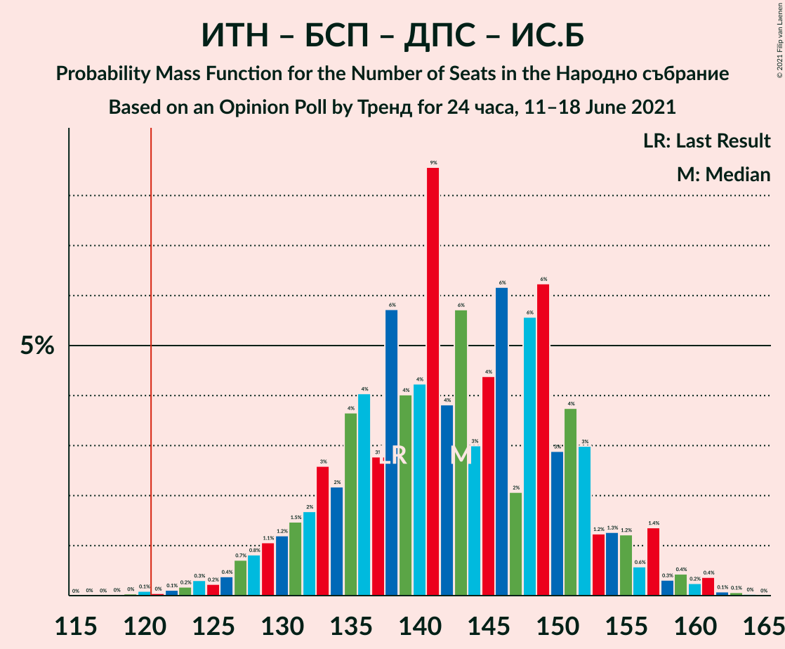

| Number of Seats | Probability | Accumulated | Special Marks |
|:---------------:|:-----------:|:-----------:|:-------------:|
| 118 | 0% | 100% |  |
| 119 | 0% | 99.9% |  |
| 120 | 0.1% | 99.9% |  |
| 121 | 0% | 99.8% | Majority |
| 122 | 0.1% | 99.8% |  |
| 123 | 0.2% | 99.7% |  |
| 124 | 0.3% | 99.5% |  |
| 125 | 0.2% | 99.2% |  |
| 126 | 0.4% | 98.9% |  |
| 127 | 0.7% | 98.6% |  |
| 128 | 0.8% | 98% |  |
| 129 | 1.1% | 97% |  |
| 130 | 1.2% | 96% |  |
| 131 | 1.5% | 95% |  |
| 132 | 2% | 93% |  |
| 133 | 3% | 92% |  |
| 134 | 2% | 89% |  |
| 135 | 4% | 87% |  |
| 136 | 4% | 83% |  |
| 137 | 3% | 79% |  |
| 138 | 6% | 76% | Last Result |
| 139 | 4% | 71% |  |
| 140 | 4% | 67% |  |
| 141 | 9% | 62% |  |
| 142 | 4% | 54% |  |
| 143 | 6% | 50% | Median |
| 144 | 3% | 44% |  |
| 145 | 4% | 41% |  |
| 146 | 6% | 37% |  |
| 147 | 2% | 31% |  |
| 148 | 6% | 29% |  |
| 149 | 6% | 23% |  |
| 150 | 3% | 17% |  |
| 151 | 4% | 14% |  |
| 152 | 3% | 10% |  |
| 153 | 1.2% | 7% |  |
| 154 | 1.3% | 6% |  |
| 155 | 1.2% | 5% |  |
| 156 | 0.6% | 4% |  |
| 157 | 1.4% | 3% |  |
| 158 | 0.3% | 2% |  |
| 159 | 0.4% | 1.3% |  |
| 160 | 0.2% | 0.8% |  |
| 161 | 0.4% | 0.6% |  |
| 162 | 0.1% | 0.2% |  |
| 163 | 0.1% | 0.1% |  |
| 164 | 0% | 0.1% |  |
| 165 | 0% | 0% |  |

### Има такъв народ – Българска социалистическа партия – Движение за права и свободи

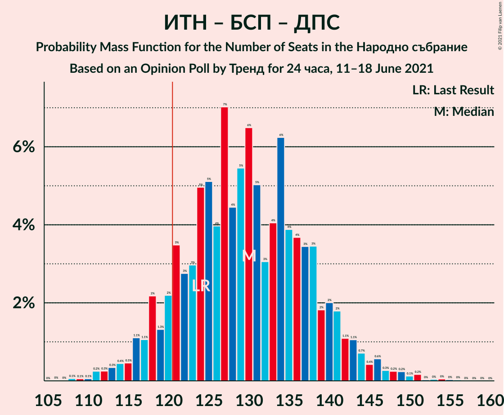

| Number of Seats | Probability | Accumulated | Special Marks |
|:---------------:|:-----------:|:-----------:|:-------------:|
| 108 | 0.1% | 100% |  |
| 109 | 0.1% | 99.9% |  |
| 110 | 0.1% | 99.8% |  |
| 111 | 0.2% | 99.8% |  |
| 112 | 0.3% | 99.5% |  |
| 113 | 0.3% | 99.3% |  |
| 114 | 0.4% | 98.9% |  |
| 115 | 0.5% | 98.5% |  |
| 116 | 1.1% | 98% |  |
| 117 | 1.1% | 97% |  |
| 118 | 2% | 96% |  |
| 119 | 1.3% | 94% |  |
| 120 | 2% | 92% |  |
| 121 | 3% | 90% | Majority |
| 122 | 3% | 87% |  |
| 123 | 3% | 84% |  |
| 124 | 5% | 81% | Last Result |
| 125 | 5% | 76% |  |
| 126 | 4% | 71% |  |
| 127 | 7% | 67% |  |
| 128 | 4% | 60% |  |
| 129 | 5% | 55% | Median |
| 130 | 6% | 50% |  |
| 131 | 5% | 44% |  |
| 132 | 3% | 38% |  |
| 133 | 4% | 35% |  |
| 134 | 6% | 31% |  |
| 135 | 4% | 25% |  |
| 136 | 4% | 21% |  |
| 137 | 3% | 18% |  |
| 138 | 3% | 14% |  |
| 139 | 2% | 11% |  |
| 140 | 2% | 9% |  |
| 141 | 2% | 7% |  |
| 142 | 1.1% | 5% |  |
| 143 | 1.1% | 4% |  |
| 144 | 0.7% | 3% |  |
| 145 | 0.4% | 2% |  |
| 146 | 0.6% | 2% |  |
| 147 | 0.3% | 1.2% |  |
| 148 | 0.2% | 1.0% |  |
| 149 | 0.2% | 0.7% |  |
| 150 | 0.1% | 0.5% |  |
| 151 | 0.2% | 0.4% |  |
| 152 | 0% | 0.2% |  |
| 153 | 0% | 0.2% |  |
| 154 | 0% | 0.1% |  |
| 155 | 0% | 0.1% |  |
| 156 | 0% | 0% |  |

### Българска социалистическа партия – Движение за права и свободи – Изправи се Бг

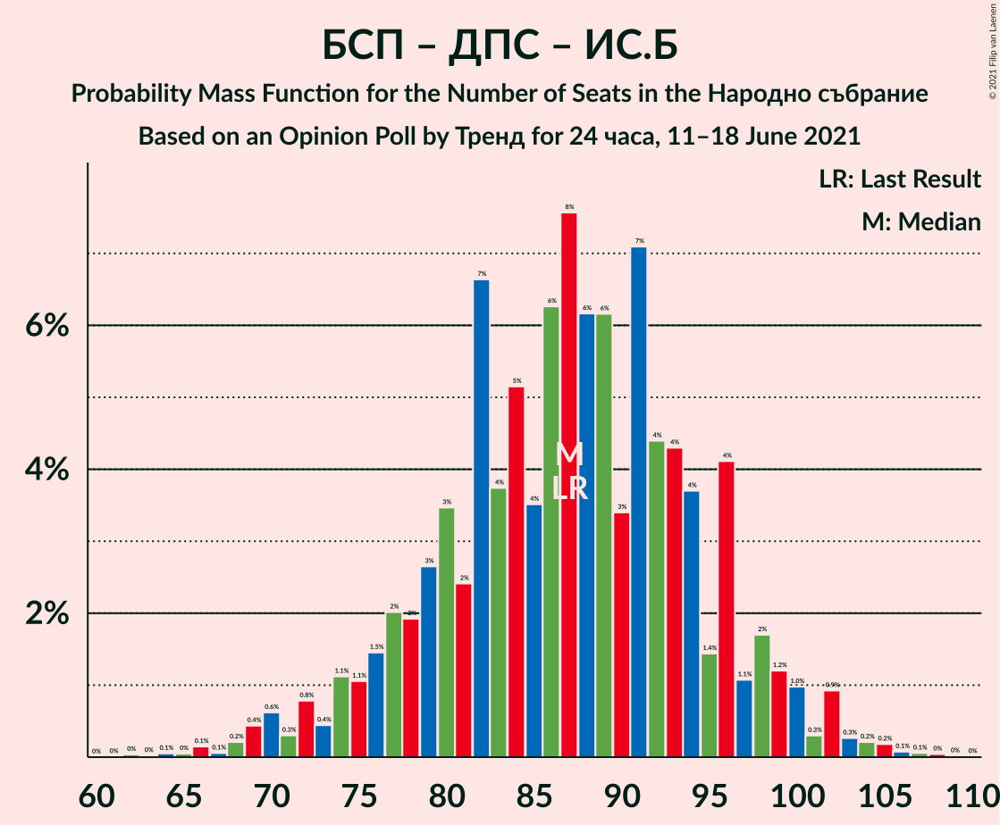

| Number of Seats | Probability | Accumulated | Special Marks |
|:---------------:|:-----------:|:-----------:|:-------------:|
| 62 | 0% | 100% |  |
| 63 | 0% | 99.9% |  |
| 64 | 0.1% | 99.9% |  |
| 65 | 0% | 99.9% |  |
| 66 | 0.1% | 99.8% |  |
| 67 | 0.1% | 99.7% |  |
| 68 | 0.2% | 99.6% |  |
| 69 | 0.4% | 99.4% |  |
| 70 | 0.6% | 99.0% |  |
| 71 | 0.3% | 98% |  |
| 72 | 0.8% | 98% |  |
| 73 | 0.4% | 97% |  |
| 74 | 1.1% | 97% |  |
| 75 | 1.1% | 96% |  |
| 76 | 1.5% | 95% |  |
| 77 | 2% | 93% |  |
| 78 | 2% | 91% |  |
| 79 | 3% | 89% |  |
| 80 | 3% | 87% |  |
| 81 | 2% | 83% |  |
| 82 | 7% | 81% |  |
| 83 | 4% | 74% |  |
| 84 | 5% | 70% |  |
| 85 | 4% | 65% |  |
| 86 | 6% | 62% |  |
| 87 | 8% | 55% | Last Result, Median |
| 88 | 6% | 48% |  |
| 89 | 6% | 42% |  |
| 90 | 3% | 36% |  |
| 91 | 7% | 32% |  |
| 92 | 4% | 25% |  |
| 93 | 4% | 21% |  |
| 94 | 4% | 16% |  |
| 95 | 1.4% | 13% |  |
| 96 | 4% | 11% |  |
| 97 | 1.1% | 7% |  |
| 98 | 2% | 6% |  |
| 99 | 1.2% | 4% |  |
| 100 | 1.0% | 3% |  |
| 101 | 0.3% | 2% |  |
| 102 | 0.9% | 2% |  |
| 103 | 0.3% | 0.9% |  |
| 104 | 0.2% | 0.6% |  |
| 105 | 0.2% | 0.4% |  |
| 106 | 0.1% | 0.2% |  |
| 107 | 0.1% | 0.1% |  |
| 108 | 0% | 0.1% |  |
| 109 | 0% | 0% |  |

### Българска социалистическа партия – Движение за права и свободи

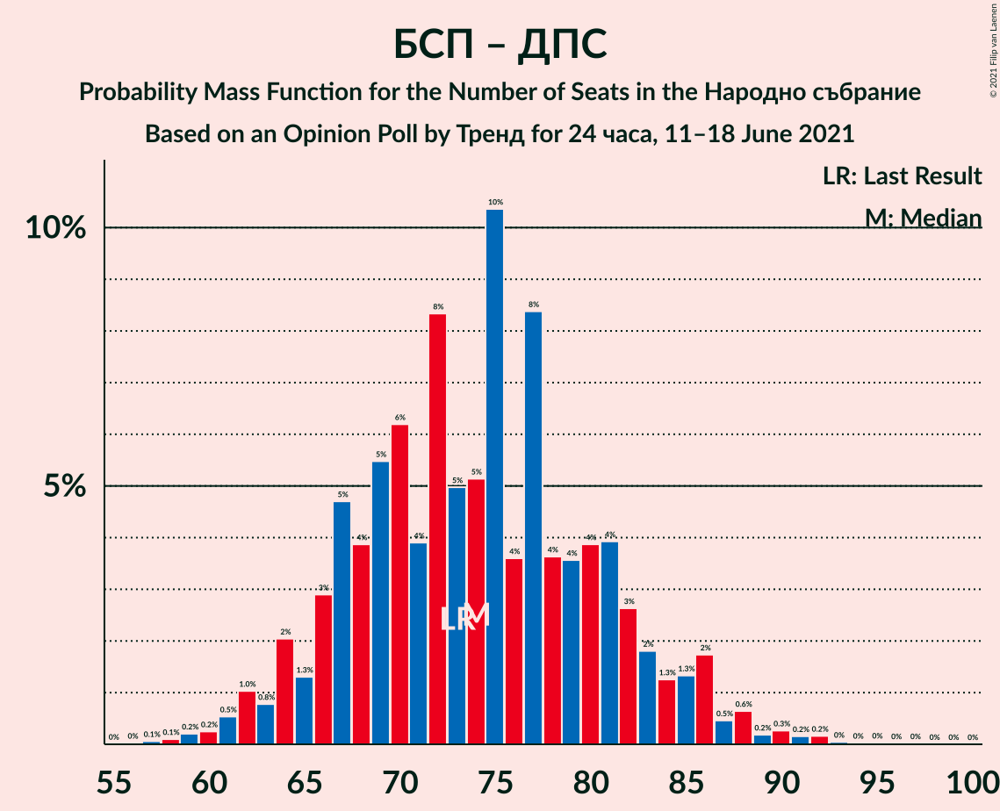

| Number of Seats | Probability | Accumulated | Special Marks |
|:---------------:|:-----------:|:-----------:|:-------------:|
| 57 | 0.1% | 100% |  |
| 58 | 0.1% | 99.9% |  |
| 59 | 0.2% | 99.8% |  |
| 60 | 0.2% | 99.6% |  |
| 61 | 0.5% | 99.3% |  |
| 62 | 1.0% | 98.8% |  |
| 63 | 0.8% | 98% |  |
| 64 | 2% | 97% |  |
| 65 | 1.3% | 95% |  |
| 66 | 3% | 94% |  |
| 67 | 5% | 91% |  |
| 68 | 4% | 86% |  |
| 69 | 5% | 82% |  |
| 70 | 6% | 77% |  |
| 71 | 4% | 70% |  |
| 72 | 8% | 67% |  |
| 73 | 5% | 58% | Last Result, Median |
| 74 | 5% | 53% |  |
| 75 | 10% | 48% |  |
| 76 | 4% | 38% |  |
| 77 | 8% | 34% |  |
| 78 | 4% | 26% |  |
| 79 | 4% | 22% |  |
| 80 | 4% | 19% |  |
| 81 | 4% | 15% |  |
| 82 | 3% | 11% |  |
| 83 | 2% | 8% |  |
| 84 | 1.3% | 6% |  |
| 85 | 1.3% | 5% |  |
| 86 | 2% | 4% |  |
| 87 | 0.5% | 2% |  |
| 88 | 0.6% | 2% |  |
| 89 | 0.2% | 0.9% |  |
| 90 | 0.3% | 0.7% |  |
| 91 | 0.2% | 0.5% |  |
| 92 | 0.2% | 0.3% |  |
| 93 | 0% | 0.2% |  |
| 94 | 0% | 0.1% |  |
| 95 | 0% | 0.1% |  |
| 96 | 0% | 0% |  |

## Technical Information

### Opinion Poll

+ **Polling firm:** Тренд
+ **Commissioner(s):** 24 часа
+ **Fieldwork period:** 11–18 June 2021

### Calculations

+ **Sample size:** 481
+ **Simulations done:** 1,048,576
+ **Error estimate:** 1.57%

