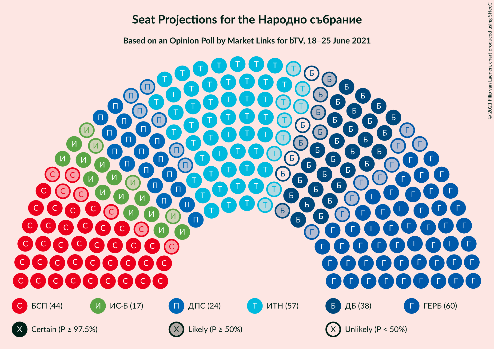
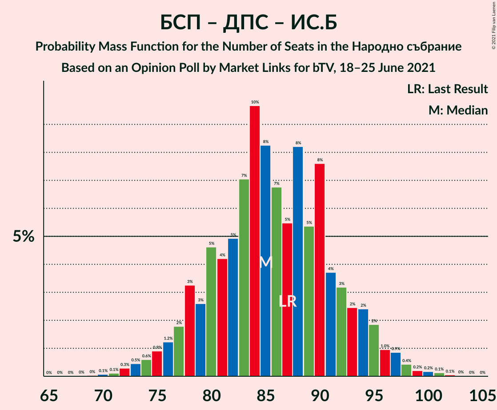

# Opinion Poll by Market Links for bTV, 18–25 June 2021

<a href="#voting-intentions">Voting Intentions</a> | <a href="#seats">Seats</a> | <a href="#coalitions">Coalitions</a> | <a href="#technical-information">Technical Information</a>

## Voting Intentions

### Confidence Intervals

| Party | Last Result | Poll Result | 80% Confidence Interval | 90% Confidence Interval | 95% Confidence Interval | 99% Confidence Interval |
|:-----:|:-----------:|:-----------:|:-----------------------:|:-----------------------:|:-----------------------:|:-----------------------:|
| Граждани за европейско развитие на България | 25.8% | 23.1% | 21.0–25.3% |20.4–26.0% |19.9–26.6% |19.0–27.7% |
| Има такъв народ | 17.4% | 22.0% | 19.9–24.2% |19.4–24.8% |18.9–25.4% |17.9–26.5% |
| Българска социалистическа партия | 14.8% | 17.1% | 15.3–19.2% |14.8–19.8% |14.4–20.3% |13.6–21.3% |
| Демократична България | 9.3% | 13.3% | 11.7–15.2% |11.2–15.7% |10.9–16.2% |10.1–17.1% |
| Движение за права и свободи | 10.4% | 9.1% | 7.8–10.8% |7.4–11.2% |7.1–11.7% |6.5–12.5% |
| Изправи се Бг | 4.6% | 6.6% | 5.5–8.0% |5.1–8.4% |4.9–8.8% |4.4–9.5% |
| Българските патриоти | 0.0% | 3.2% | 2.5–4.3% |2.3–4.6% |2.1–4.9% |1.8–5.5% |
| Възраждане | 2.4% | 3.0% | 2.3–4.1% |2.1–4.4% |2.0–4.7% |1.7–5.3% |

*Note:* The poll result column reflects the actual value used in the calculations. Published results may vary slightly, and in addition be rounded to fewer digits.

## Seats

### Confidence Intervals

| Party | Last Result | Median | 80% Confidence Interval | 90% Confidence Interval | 95% Confidence Interval | 99% Confidence Interval |
|:-----:|:-----------:|:------:|:-----------------------:|:-----------------------:|:-----------------------:|:-----------------------:|
| <a href="#граждани-за-европейско-развитие-на-българия">Граждани за европейско развитие на България</a> | 75 | 60 | 54–66 |52–67 |51–69 |49–72 |
| <a href="#има-такъв-народ">Има такъв народ</a> | 51 | 57 | 51–63 |50–64 |48–66 |46–69 |
| <a href="#българска-социалистическа-партия">Българска социалистическа партия</a> | 43 | 44 | 39–50 |38–51 |37–52 |35–55 |
| <a href="#демократична-българия">Демократична България</a> | 27 | 34 | 30–39 |29–41 |28–42 |26–44 |
| <a href="#движение-за-права-и-свободи">Движение за права и свободи</a> | 30 | 24 | 20–28 |19–29 |18–30 |17–32 |
| <a href="#изправи-се-бг">Изправи се Бг</a> | 14 | 17 | 14–21 |13–22 |13–23 |11–25 |
| <a href="#българските-патриоти">Българските патриоти</a> | 0 | 0 | 0–11 |0–12 |0–12 |0–14 |
| <a href="#възраждане">Възраждане</a> | 0 | 0 | 0–10 |0–11 |0–12 |0–13 |

### Граждани за европейско развитие на България

*For a full overview of the results for this party, see the [Граждани за европейско развитие на България](party-гражданизаевропейскоразвитиенабългария.html) page.*

| Number of Seats | Probability | Accumulated | Special Marks |
|:---------------:|:-----------:|:-----------:|:-------------:|
| 46 | 0.1% | 100% |  |
| 47 | 0.2% | 99.9% |  |
| 48 | 0.2% | 99.7% |  |
| 49 | 0.5% | 99.5% |  |
| 50 | 0.6% | 99.0% |  |
| 51 | 2% | 98% |  |
| 52 | 3% | 97% |  |
| 53 | 1.5% | 94% |  |
| 54 | 4% | 93% |  |
| 55 | 8% | 89% |  |
| 56 | 3% | 80% |  |
| 57 | 7% | 77% |  |
| 58 | 10% | 70% |  |
| 59 | 6% | 61% |  |
| 60 | 12% | 55% | Median |
| 61 | 9% | 43% |  |
| 62 | 3% | 34% |  |
| 63 | 12% | 31% |  |
| 64 | 5% | 20% |  |
| 65 | 1.3% | 15% |  |
| 66 | 7% | 13% |  |
| 67 | 3% | 6% |  |
| 68 | 0.6% | 4% |  |
| 69 | 1.4% | 3% |  |
| 70 | 0.9% | 2% |  |
| 71 | 0.1% | 0.8% |  |
| 72 | 0.4% | 0.7% |  |
| 73 | 0.2% | 0.3% |  |
| 74 | 0% | 0.1% |  |
| 75 | 0% | 0.1% | Last Result |
| 76 | 0% | 0% |  |

### Има такъв народ

*For a full overview of the results for this party, see the [Има такъв народ](party-иматакъвнарод.html) page.*

| Number of Seats | Probability | Accumulated | Special Marks |
|:---------------:|:-----------:|:-----------:|:-------------:|
| 43 | 0% | 100% |  |
| 44 | 0.1% | 99.9% |  |
| 45 | 0.3% | 99.9% |  |
| 46 | 0.4% | 99.6% |  |
| 47 | 0.7% | 99.2% |  |
| 48 | 1.3% | 98% |  |
| 49 | 2% | 97% |  |
| 50 | 2% | 95% |  |
| 51 | 3% | 93% | Last Result |
| 52 | 6% | 90% |  |
| 53 | 6% | 84% |  |
| 54 | 9% | 78% |  |
| 55 | 9% | 69% |  |
| 56 | 9% | 60% |  |
| 57 | 10% | 51% | Median |
| 58 | 8% | 40% |  |
| 59 | 7% | 33% |  |
| 60 | 5% | 25% |  |
| 61 | 5% | 20% |  |
| 62 | 3% | 15% |  |
| 63 | 4% | 12% |  |
| 64 | 4% | 7% |  |
| 65 | 1.3% | 4% |  |
| 66 | 1.0% | 3% |  |
| 67 | 0.8% | 2% |  |
| 68 | 0.3% | 0.9% |  |
| 69 | 0.4% | 0.6% |  |
| 70 | 0.1% | 0.2% |  |
| 71 | 0.1% | 0.1% |  |
| 72 | 0% | 0.1% |  |
| 73 | 0% | 0% |  |

### Българска социалистическа партия

*For a full overview of the results for this party, see the [Българска социалистическа партия](party-българскасоциалистическапартия.html) page.*

| Number of Seats | Probability | Accumulated | Special Marks |
|:---------------:|:-----------:|:-----------:|:-------------:|
| 32 | 0% | 100% |  |
| 33 | 0.1% | 99.9% |  |
| 34 | 0.3% | 99.8% |  |
| 35 | 0.7% | 99.6% |  |
| 36 | 1.0% | 98.9% |  |
| 37 | 2% | 98% |  |
| 38 | 3% | 96% |  |
| 39 | 3% | 93% |  |
| 40 | 5% | 90% |  |
| 41 | 6% | 85% |  |
| 42 | 8% | 78% |  |
| 43 | 10% | 70% | Last Result |
| 44 | 12% | 60% | Median |
| 45 | 10% | 49% |  |
| 46 | 9% | 38% |  |
| 47 | 6% | 29% |  |
| 48 | 6% | 23% |  |
| 49 | 6% | 17% |  |
| 50 | 3% | 11% |  |
| 51 | 3% | 8% |  |
| 52 | 2% | 4% |  |
| 53 | 1.3% | 2% |  |
| 54 | 0.5% | 1.2% |  |
| 55 | 0.3% | 0.7% |  |
| 56 | 0.2% | 0.4% |  |
| 57 | 0.1% | 0.2% |  |
| 58 | 0.1% | 0.1% |  |
| 59 | 0% | 0% |  |

### Демократична България

*For a full overview of the results for this party, see the [Демократична България](party-демократичнабългария.html) page.*

| Number of Seats | Probability | Accumulated | Special Marks |
|:---------------:|:-----------:|:-----------:|:-------------:|
| 24 | 0.1% | 100% |  |
| 25 | 0.2% | 99.9% |  |
| 26 | 0.4% | 99.7% |  |
| 27 | 0.9% | 99.2% | Last Result |
| 28 | 2% | 98% |  |
| 29 | 3% | 97% |  |
| 30 | 5% | 94% |  |
| 31 | 11% | 89% |  |
| 32 | 7% | 78% |  |
| 33 | 16% | 71% |  |
| 34 | 6% | 55% | Median |
| 35 | 15% | 49% |  |
| 36 | 6% | 34% |  |
| 37 | 7% | 28% |  |
| 38 | 7% | 21% |  |
| 39 | 4% | 14% |  |
| 40 | 4% | 10% |  |
| 41 | 2% | 6% |  |
| 42 | 3% | 4% |  |
| 43 | 0.4% | 1.4% |  |
| 44 | 0.7% | 0.9% |  |
| 45 | 0.1% | 0.3% |  |
| 46 | 0.1% | 0.2% |  |
| 47 | 0.1% | 0.1% |  |
| 48 | 0% | 0% |  |

### Движение за права и свободи

*For a full overview of the results for this party, see the [Движение за права и свободи](party-движениезаправаисвободи.html) page.*

| Number of Seats | Probability | Accumulated | Special Marks |
|:---------------:|:-----------:|:-----------:|:-------------:|
| 15 | 0.1% | 100% |  |
| 16 | 0.3% | 99.9% |  |
| 17 | 0.8% | 99.6% |  |
| 18 | 2% | 98.8% |  |
| 19 | 4% | 97% |  |
| 20 | 7% | 93% |  |
| 21 | 7% | 87% |  |
| 22 | 12% | 79% |  |
| 23 | 11% | 67% |  |
| 24 | 15% | 55% | Median |
| 25 | 10% | 41% |  |
| 26 | 11% | 30% |  |
| 27 | 7% | 20% |  |
| 28 | 6% | 13% |  |
| 29 | 3% | 6% |  |
| 30 | 2% | 4% | Last Result |
| 31 | 1.0% | 2% |  |
| 32 | 0.6% | 1.0% |  |
| 33 | 0.2% | 0.4% |  |
| 34 | 0.1% | 0.2% |  |
| 35 | 0.1% | 0.1% |  |
| 36 | 0% | 0% |  |

### Изправи се Бг

*For a full overview of the results for this party, see the [Изправи се Бг](party-изправисебг.html) page.*

| Number of Seats | Probability | Accumulated | Special Marks |
|:---------------:|:-----------:|:-----------:|:-------------:|
| 0 | 0.1% | 100% |  |
| 1 | 0% | 99.9% |  |
| 2 | 0% | 99.9% |  |
| 3 | 0% | 99.9% |  |
| 4 | 0% | 99.9% |  |
| 5 | 0% | 99.9% |  |
| 6 | 0% | 99.9% |  |
| 7 | 0% | 99.9% |  |
| 8 | 0% | 99.9% |  |
| 9 | 0% | 99.9% |  |
| 10 | 0% | 99.9% |  |
| 11 | 0.6% | 99.9% |  |
| 12 | 2% | 99.3% |  |
| 13 | 4% | 98% |  |
| 14 | 6% | 93% | Last Result |
| 15 | 13% | 87% |  |
| 16 | 14% | 74% |  |
| 17 | 16% | 59% | Median |
| 18 | 12% | 43% |  |
| 19 | 12% | 31% |  |
| 20 | 8% | 19% |  |
| 21 | 5% | 11% |  |
| 22 | 3% | 6% |  |
| 23 | 1.4% | 3% |  |
| 24 | 0.8% | 1.3% |  |
| 25 | 0.3% | 0.6% |  |
| 26 | 0.1% | 0.2% |  |
| 27 | 0% | 0.1% |  |
| 28 | 0% | 0% |  |

### Българските патриоти

*For a full overview of the results for this party, see the [Българските патриоти](party-българскитепатриоти.html) page.*

| Number of Seats | Probability | Accumulated | Special Marks |
|:---------------:|:-----------:|:-----------:|:-------------:|
| 0 | 84% | 100% | Last Result, Median |
| 1 | 0% | 16% |  |
| 2 | 0% | 16% |  |
| 3 | 0% | 16% |  |
| 4 | 0% | 16% |  |
| 5 | 0% | 16% |  |
| 6 | 0% | 16% |  |
| 7 | 0% | 16% |  |
| 8 | 0% | 16% |  |
| 9 | 0% | 16% |  |
| 10 | 4% | 16% |  |
| 11 | 6% | 12% |  |
| 12 | 4% | 6% |  |
| 13 | 1.5% | 2% |  |
| 14 | 0.4% | 0.6% |  |
| 15 | 0.2% | 0.2% |  |
| 16 | 0% | 0% |  |

### Възраждане

*For a full overview of the results for this party, see the [Възраждане](party-възраждане.html) page.*

| Number of Seats | Probability | Accumulated | Special Marks |
|:---------------:|:-----------:|:-----------:|:-------------:|
| 0 | 88% | 100% | Last Result, Median |
| 1 | 0% | 12% |  |
| 2 | 0% | 12% |  |
| 3 | 0% | 12% |  |
| 4 | 0% | 12% |  |
| 5 | 0% | 12% |  |
| 6 | 0% | 12% |  |
| 7 | 0% | 12% |  |
| 8 | 0% | 12% |  |
| 9 | 0% | 12% |  |
| 10 | 3% | 12% |  |
| 11 | 6% | 9% |  |
| 12 | 2% | 3% |  |
| 13 | 0.9% | 1.2% |  |
| 14 | 0.2% | 0.3% |  |
| 15 | 0.1% | 0.1% |  |
| 16 | 0% | 0% |  |

## Coalitions

### Confidence Intervals

| Coalition | Last Result | Median | Majority? | 80% Confidence Interval | 90% Confidence Interval | 95% Confidence Interval | 99% Confidence Interval |
|:---------:|:-----------:|:------:|:---------:|:-----------------------:|:-----------------------:|:-----------------------:|:-----------------------:|
| Има такъв народ – Българска социалистическа партия – Движение за права и свободи – Изправи се Бг | 138 | 143 | 100% | 135–150 | 132–152 | 130–153 | 127–157 |
| Има такъв народ – Българска социалистическа партия – Движение за права и свободи | 124 | 125 | 79% | 117–132 | 116–134 | 114–136 | 110–140 |
| Българска социалистическа партия – Движение за права и свободи – Изправи се Бг | 87 | 85 | 0% | 79–92 | 77–94 | 75–96 | 72–99 |
| Българска социалистическа партия – Движение за права и свободи | 73 | 68 | 0% | 62–75 | 60–76 | 59–78 | 57–81 |

### Има такъв народ – Българска социалистическа партия – Движение за права и свободи – Изправи се Бг

| Number of Seats | Probability | Accumulated | Special Marks |
|:---------------:|:-----------:|:-----------:|:-------------:|
| 122 | 0% | 100% |  |
| 123 | 0% | 99.9% |  |
| 124 | 0% | 99.9% |  |
| 125 | 0.2% | 99.8% |  |
| 126 | 0.1% | 99.6% |  |
| 127 | 0.3% | 99.5% |  |
| 128 | 0.3% | 99.3% |  |
| 129 | 0.7% | 98.9% |  |
| 130 | 0.9% | 98% |  |
| 131 | 1.4% | 97% |  |
| 132 | 1.1% | 96% |  |
| 133 | 2% | 95% |  |
| 134 | 2% | 93% |  |
| 135 | 3% | 91% |  |
| 136 | 4% | 88% |  |
| 137 | 4% | 84% |  |
| 138 | 4% | 80% | Last Result |
| 139 | 8% | 76% |  |
| 140 | 5% | 68% |  |
| 141 | 6% | 64% |  |
| 142 | 8% | 58% | Median |
| 143 | 4% | 50% |  |
| 144 | 10% | 46% |  |
| 145 | 6% | 36% |  |
| 146 | 4% | 30% |  |
| 147 | 6% | 27% |  |
| 148 | 4% | 20% |  |
| 149 | 4% | 16% |  |
| 150 | 4% | 12% |  |
| 151 | 2% | 8% |  |
| 152 | 2% | 6% |  |
| 153 | 2% | 4% |  |
| 154 | 0.5% | 2% |  |
| 155 | 0.8% | 2% |  |
| 156 | 0.3% | 0.8% |  |
| 157 | 0.3% | 0.5% |  |
| 158 | 0.2% | 0.3% |  |
| 159 | 0% | 0.1% |  |
| 160 | 0% | 0.1% |  |
| 161 | 0% | 0% |  |

### Има такъв народ – Българска социалистическа партия – Движение за права и свободи

| Number of Seats | Probability | Accumulated | Special Marks |
|:---------------:|:-----------:|:-----------:|:-------------:|
| 106 | 0% | 100% |  |
| 107 | 0.1% | 99.9% |  |
| 108 | 0.1% | 99.9% |  |
| 109 | 0.1% | 99.8% |  |
| 110 | 0.3% | 99.6% |  |
| 111 | 0.3% | 99.3% |  |
| 112 | 0.4% | 99.0% |  |
| 113 | 1.1% | 98.7% |  |
| 114 | 1.3% | 98% |  |
| 115 | 1.1% | 96% |  |
| 116 | 3% | 95% |  |
| 117 | 2% | 92% |  |
| 118 | 4% | 90% |  |
| 119 | 3% | 86% |  |
| 120 | 4% | 83% |  |
| 121 | 3% | 79% | Majority |
| 122 | 6% | 76% |  |
| 123 | 10% | 70% |  |
| 124 | 4% | 61% | Last Result |
| 125 | 9% | 57% | Median |
| 126 | 7% | 48% |  |
| 127 | 4% | 40% |  |
| 128 | 3% | 36% |  |
| 129 | 8% | 33% |  |
| 130 | 8% | 25% |  |
| 131 | 3% | 17% |  |
| 132 | 5% | 14% |  |
| 133 | 3% | 9% |  |
| 134 | 1.4% | 6% |  |
| 135 | 0.9% | 5% |  |
| 136 | 1.4% | 4% |  |
| 137 | 0.9% | 2% |  |
| 138 | 0.3% | 1.3% |  |
| 139 | 0.5% | 1.0% |  |
| 140 | 0.3% | 0.5% |  |
| 141 | 0.1% | 0.2% |  |
| 142 | 0% | 0.1% |  |
| 143 | 0.1% | 0.1% |  |
| 144 | 0% | 0% |  |

### Българска социалистическа партия – Движение за права и свободи – Изправи се Бг

| Number of Seats | Probability | Accumulated | Special Marks |
|:---------------:|:-----------:|:-----------:|:-------------:|
| 69 | 0% | 100% |  |
| 70 | 0.1% | 99.9% |  |
| 71 | 0.1% | 99.8% |  |
| 72 | 0.3% | 99.7% |  |
| 73 | 0.5% | 99.4% |  |
| 74 | 0.6% | 99.0% |  |
| 75 | 0.9% | 98% |  |
| 76 | 1.2% | 97% |  |
| 77 | 2% | 96% |  |
| 78 | 3% | 94% |  |
| 79 | 3% | 91% |  |
| 80 | 5% | 89% |  |
| 81 | 4% | 84% |  |
| 82 | 5% | 80% |  |
| 83 | 7% | 75% |  |
| 84 | 10% | 68% |  |
| 85 | 8% | 58% | Median |
| 86 | 7% | 50% |  |
| 87 | 5% | 43% | Last Result |
| 88 | 8% | 38% |  |
| 89 | 5% | 29% |  |
| 90 | 8% | 24% |  |
| 91 | 4% | 16% |  |
| 92 | 3% | 13% |  |
| 93 | 2% | 10% |  |
| 94 | 2% | 7% |  |
| 95 | 2% | 5% |  |
| 96 | 1.0% | 3% |  |
| 97 | 0.9% | 2% |  |
| 98 | 0.4% | 1.0% |  |
| 99 | 0.2% | 0.6% |  |
| 100 | 0.2% | 0.4% |  |
| 101 | 0.1% | 0.2% |  |
| 102 | 0.1% | 0.1% |  |
| 103 | 0% | 0% |  |

### Българска социалистическа партия – Движение за права и свободи

| Number of Seats | Probability | Accumulated | Special Marks |
|:---------------:|:-----------:|:-----------:|:-------------:|
| 53 | 0% | 100% |  |
| 54 | 0.1% | 99.9% |  |
| 55 | 0.1% | 99.9% |  |
| 56 | 0.2% | 99.8% |  |
| 57 | 0.5% | 99.5% |  |
| 58 | 1.0% | 99.0% |  |
| 59 | 1.2% | 98% |  |
| 60 | 2% | 97% |  |
| 61 | 2% | 95% |  |
| 62 | 4% | 93% |  |
| 63 | 5% | 89% |  |
| 64 | 4% | 84% |  |
| 65 | 6% | 80% |  |
| 66 | 7% | 74% |  |
| 67 | 11% | 67% |  |
| 68 | 9% | 57% | Median |
| 69 | 6% | 48% |  |
| 70 | 6% | 41% |  |
| 71 | 9% | 35% |  |
| 72 | 6% | 26% |  |
| 73 | 5% | 20% | Last Result |
| 74 | 4% | 15% |  |
| 75 | 4% | 11% |  |
| 76 | 3% | 7% |  |
| 77 | 2% | 5% |  |
| 78 | 1.0% | 3% |  |
| 79 | 0.6% | 2% |  |
| 80 | 0.7% | 1.3% |  |
| 81 | 0.3% | 0.6% |  |
| 82 | 0.1% | 0.3% |  |
| 83 | 0.1% | 0.2% |  |
| 84 | 0.1% | 0.1% |  |
| 85 | 0% | 0% |  |

## Technical Information

### Opinion Poll

+ **Polling firm:** Market Links
+ **Commissioner(s):** bTV
+ **Fieldwork period:** 18–25 June 2021

### Calculations

+ **Sample size:** 624
+ **Simulations done:** 1,048,576
+ **Error estimate:** 2.93%

