# Opinion Poll by Nasoca, 23–30 June 2021

<a href="#voting-intentions">Voting Intentions</a> | <a href="#seats">Seats</a> | <a href="#coalitions">Coalitions</a> | <a href="#technical-information">Technical Information</a>

## Voting Intentions

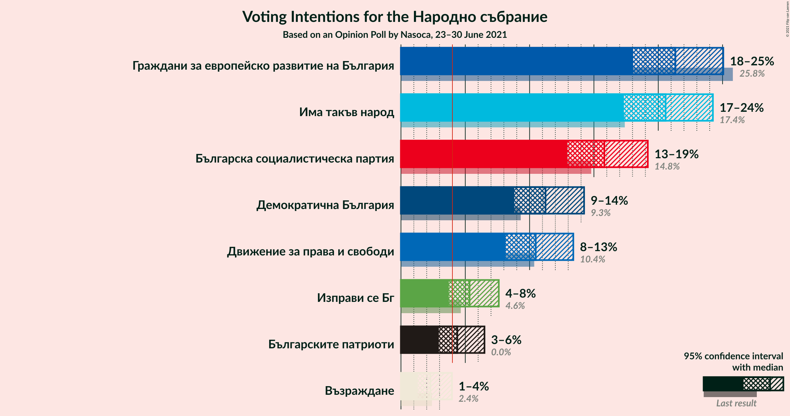

### Confidence Intervals

| Party | Last Result | Poll Result | 80% Confidence Interval | 90% Confidence Interval | 95% Confidence Interval | 99% Confidence Interval |
|:-----:|:-----------:|:-----------:|:-----------------------:|:-----------------------:|:-----------------------:|:-----------------------:|
| Граждани за европейско развитие на България | 25.8% | 21.3% | 19.2–23.8% |18.6–24.4% |18.0–25.1% |17.0–26.2% |
| Има такъв народ | 17.4% | 20.6% | 18.4–23.0% |17.8–23.7% |17.3–24.2% |16.4–25.4% |
| Българска социалистическа партия | 14.8% | 15.8% | 13.9–18.0% |13.4–18.6% |12.9–19.2% |12.1–20.3% |
| Демократична България | 9.3% | 11.2% | 9.6–13.2% |9.2–13.7% |8.8–14.2% |8.1–15.2% |
| Движение за права и свободи | 10.4% | 10.5% | 8.9–12.4% |8.5–12.9% |8.1–13.4% |7.5–14.4% |
| Изправи се Бг | 4.6% | 5.3% | 4.3–6.8% |4.0–7.2% |3.7–7.6% |3.3–8.4% |
| Българските патриоти | 0.0% | 4.4% | 3.4–5.8% |3.2–6.1% |2.9–6.5% |2.5–7.2% |
| Възраждане | 2.4% | 2.3% | 1.6–3.4% |1.5–3.7% |1.3–4.0% |1.1–4.5% |

*Note:* The poll result column reflects the actual value used in the calculations. Published results may vary slightly, and in addition be rounded to fewer digits.

## Seats

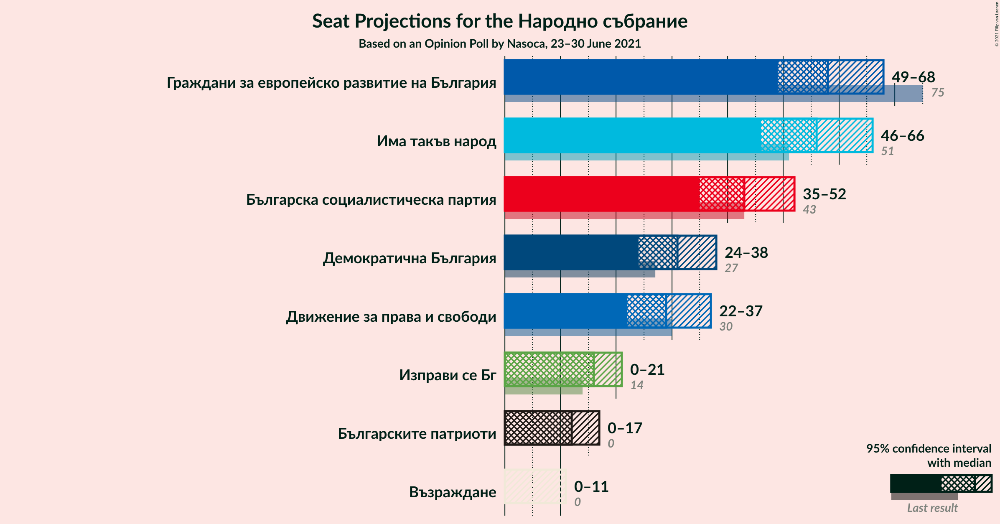

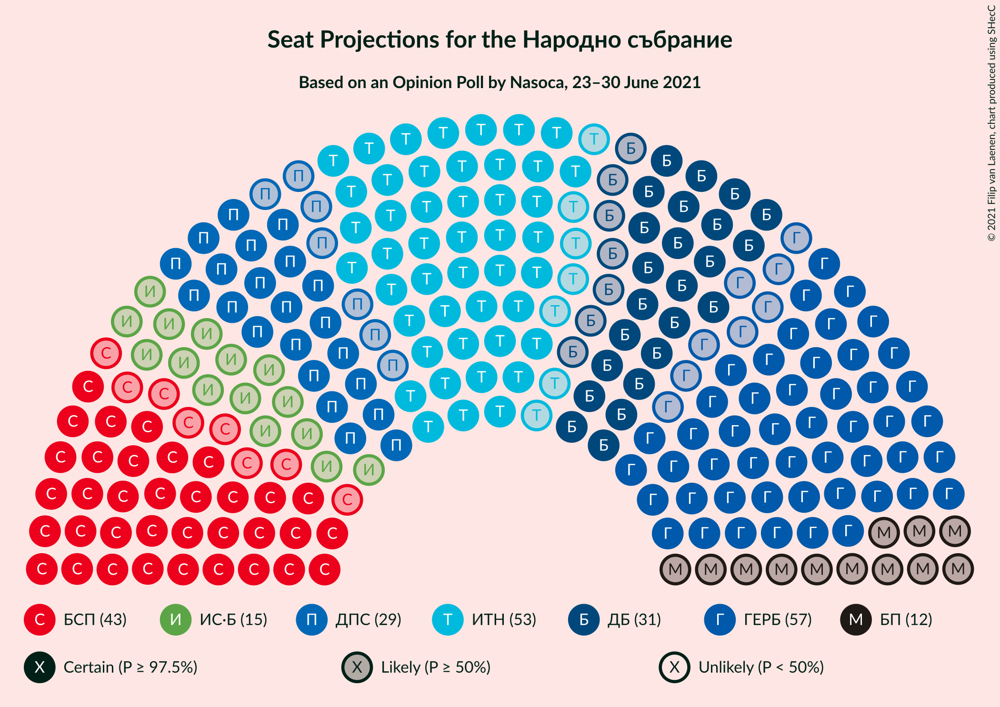

### Confidence Intervals

| Party | Last Result | Median | 80% Confidence Interval | 90% Confidence Interval | 95% Confidence Interval | 99% Confidence Interval |
|:-----:|:-----------:|:------:|:-----------------------:|:-----------------------:|:-----------------------:|:-----------------------:|
| <a href="#граждани-за-европейско-развитие-на-българия">Граждани за европейско развитие на България</a> | 75 | 58 | 52–65 |50–67 |49–68 |46–72 |
| <a href="#има-такъв-народ">Има такъв народ</a> | 51 | 56 | 50–62 |48–64 |46–66 |44–70 |
| <a href="#българска-социалистическа-партия">Българска социалистическа партия</a> | 43 | 43 | 37–49 |36–51 |35–52 |32–55 |
| <a href="#демократична-българия">Демократична България</a> | 27 | 31 | 26–36 |25–37 |24–38 |21–42 |
| <a href="#движение-за-права-и-свободи">Движение за права и свободи</a> | 30 | 29 | 24–33 |23–35 |22–37 |20–39 |
| <a href="#изправи-се-бг">Изправи се Бг</a> | 14 | 16 | 11–19 |0–20 |0–21 |0–23 |
| <a href="#българските-патриоти">Българските патриоти</a> | 0 | 12 | 0–15 |0–17 |0–17 |0–19 |
| <a href="#възраждане">Възраждане</a> | 0 | 0 | 0 |0 |0–11 |0–12 |

### Граждани за европейско развитие на България

*For a full overview of the results for this party, see the [Граждани за европейско развитие на България](party-гражданизаевропейскоразвитиенабългария.html) page.*

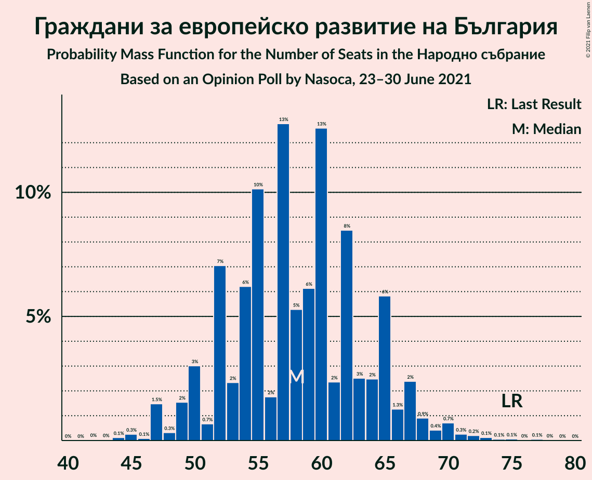

| Number of Seats | Probability | Accumulated | Special Marks |
|:---------------:|:-----------:|:-----------:|:-------------:|
| 42 | 0% | 100% |  |
| 43 | 0% | 99.9% |  |
| 44 | 0.1% | 99.9% |  |
| 45 | 0.3% | 99.8% |  |
| 46 | 0.1% | 99.5% |  |
| 47 | 1.5% | 99.5% |  |
| 48 | 0.3% | 98% |  |
| 49 | 2% | 98% |  |
| 50 | 3% | 96% |  |
| 51 | 0.7% | 93% |  |
| 52 | 7% | 92% |  |
| 53 | 2% | 85% |  |
| 54 | 6% | 83% |  |
| 55 | 10% | 77% |  |
| 56 | 2% | 67% |  |
| 57 | 13% | 65% |  |
| 58 | 5% | 52% | Median |
| 59 | 6% | 47% |  |
| 60 | 13% | 41% |  |
| 61 | 2% | 28% |  |
| 62 | 8% | 26% |  |
| 63 | 3% | 17% |  |
| 64 | 2% | 15% |  |
| 65 | 6% | 12% |  |
| 66 | 1.3% | 6% |  |
| 67 | 2% | 5% |  |
| 68 | 0.9% | 3% |  |
| 69 | 0.4% | 2% |  |
| 70 | 0.7% | 2% |  |
| 71 | 0.3% | 0.8% |  |
| 72 | 0.2% | 0.5% |  |
| 73 | 0.1% | 0.3% |  |
| 74 | 0.1% | 0.2% |  |
| 75 | 0.1% | 0.2% | Last Result |
| 76 | 0% | 0.1% |  |
| 77 | 0.1% | 0.1% |  |
| 78 | 0% | 0% |  |

### Има такъв народ

*For a full overview of the results for this party, see the [Има такъв народ](party-иматакъвнарод.html) page.*

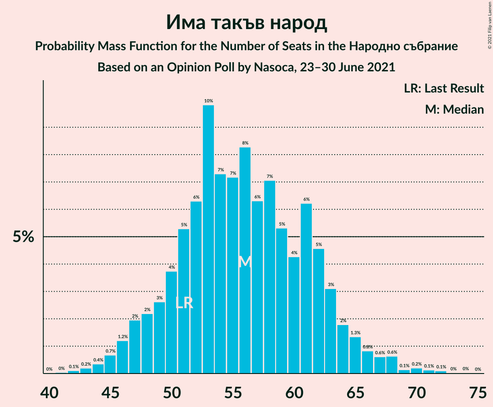

| Number of Seats | Probability | Accumulated | Special Marks |
|:---------------:|:-----------:|:-----------:|:-------------:|
| 41 | 0% | 100% |  |
| 42 | 0.1% | 99.9% |  |
| 43 | 0.2% | 99.8% |  |
| 44 | 0.4% | 99.6% |  |
| 45 | 0.7% | 99.3% |  |
| 46 | 1.2% | 98.6% |  |
| 47 | 2% | 97% |  |
| 48 | 2% | 95% |  |
| 49 | 3% | 93% |  |
| 50 | 4% | 91% |  |
| 51 | 5% | 87% | Last Result |
| 52 | 6% | 82% |  |
| 53 | 10% | 75% |  |
| 54 | 7% | 65% |  |
| 55 | 7% | 58% |  |
| 56 | 8% | 51% | Median |
| 57 | 6% | 43% |  |
| 58 | 7% | 36% |  |
| 59 | 5% | 29% |  |
| 60 | 4% | 24% |  |
| 61 | 6% | 20% |  |
| 62 | 5% | 14% |  |
| 63 | 3% | 9% |  |
| 64 | 2% | 6% |  |
| 65 | 1.3% | 4% |  |
| 66 | 0.8% | 3% |  |
| 67 | 0.6% | 2% |  |
| 68 | 0.6% | 1.3% |  |
| 69 | 0.1% | 0.7% |  |
| 70 | 0.2% | 0.5% |  |
| 71 | 0.1% | 0.3% |  |
| 72 | 0.1% | 0.2% |  |
| 73 | 0% | 0.1% |  |
| 74 | 0% | 0.1% |  |
| 75 | 0% | 0% |  |

### Българска социалистическа партия

*For a full overview of the results for this party, see the [Българска социалистическа партия](party-българскасоциалистическапартия.html) page.*

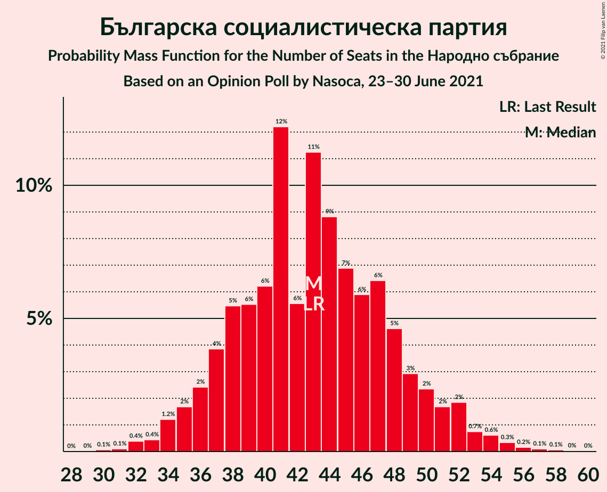

| Number of Seats | Probability | Accumulated | Special Marks |
|:---------------:|:-----------:|:-----------:|:-------------:|
| 30 | 0.1% | 100% |  |
| 31 | 0.1% | 99.9% |  |
| 32 | 0.4% | 99.8% |  |
| 33 | 0.4% | 99.4% |  |
| 34 | 1.2% | 99.0% |  |
| 35 | 2% | 98% |  |
| 36 | 2% | 96% |  |
| 37 | 4% | 94% |  |
| 38 | 5% | 90% |  |
| 39 | 6% | 84% |  |
| 40 | 6% | 79% |  |
| 41 | 12% | 73% |  |
| 42 | 6% | 60% |  |
| 43 | 11% | 55% | Last Result, Median |
| 44 | 9% | 44% |  |
| 45 | 7% | 35% |  |
| 46 | 6% | 28% |  |
| 47 | 6% | 22% |  |
| 48 | 5% | 16% |  |
| 49 | 3% | 11% |  |
| 50 | 2% | 8% |  |
| 51 | 2% | 6% |  |
| 52 | 2% | 4% |  |
| 53 | 0.7% | 2% |  |
| 54 | 0.6% | 1.4% |  |
| 55 | 0.3% | 0.7% |  |
| 56 | 0.2% | 0.4% |  |
| 57 | 0.1% | 0.2% |  |
| 58 | 0.1% | 0.1% |  |
| 59 | 0% | 0.1% |  |
| 60 | 0% | 0% |  |

### Демократична България

*For a full overview of the results for this party, see the [Демократична България](party-демократичнабългария.html) page.*

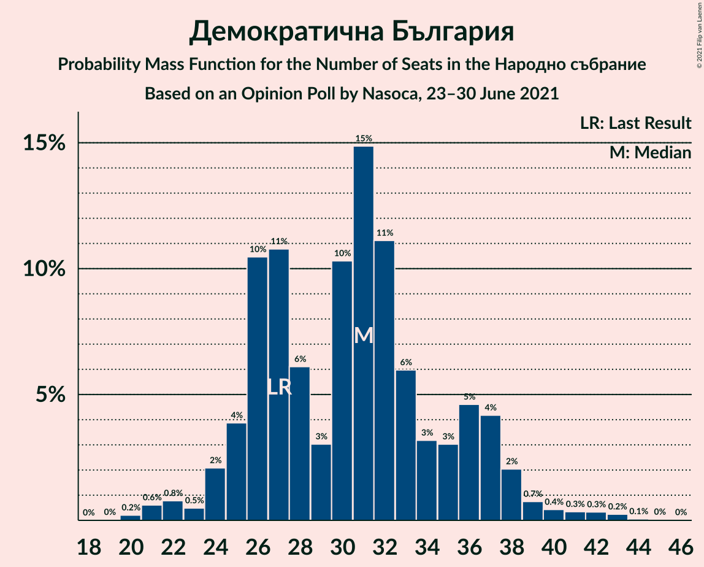

| Number of Seats | Probability | Accumulated | Special Marks |
|:---------------:|:-----------:|:-----------:|:-------------:|
| 20 | 0.2% | 100% |  |
| 21 | 0.6% | 99.8% |  |
| 22 | 0.8% | 99.1% |  |
| 23 | 0.5% | 98% |  |
| 24 | 2% | 98% |  |
| 25 | 4% | 96% |  |
| 26 | 10% | 92% |  |
| 27 | 11% | 81% | Last Result |
| 28 | 6% | 71% |  |
| 29 | 3% | 65% |  |
| 30 | 10% | 62% |  |
| 31 | 15% | 51% | Median |
| 32 | 11% | 36% |  |
| 33 | 6% | 25% |  |
| 34 | 3% | 19% |  |
| 35 | 3% | 16% |  |
| 36 | 5% | 13% |  |
| 37 | 4% | 8% |  |
| 38 | 2% | 4% |  |
| 39 | 0.7% | 2% |  |
| 40 | 0.4% | 1.5% |  |
| 41 | 0.3% | 1.1% |  |
| 42 | 0.3% | 0.7% |  |
| 43 | 0.2% | 0.4% |  |
| 44 | 0.1% | 0.1% |  |
| 45 | 0% | 0.1% |  |
| 46 | 0% | 0% |  |

### Движение за права и свободи

*For a full overview of the results for this party, see the [Движение за права и свободи](party-движениезаправаисвободи.html) page.*

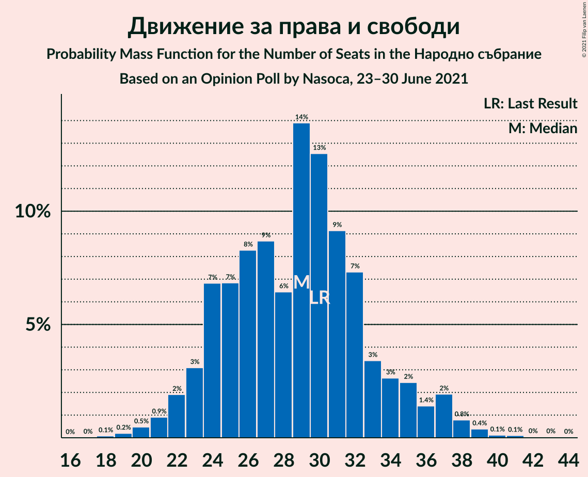

| Number of Seats | Probability | Accumulated | Special Marks |
|:---------------:|:-----------:|:-----------:|:-------------:|
| 18 | 0.1% | 100% |  |
| 19 | 0.2% | 99.9% |  |
| 20 | 0.5% | 99.7% |  |
| 21 | 0.9% | 99.2% |  |
| 22 | 2% | 98% |  |
| 23 | 3% | 96% |  |
| 24 | 7% | 93% |  |
| 25 | 7% | 86% |  |
| 26 | 8% | 80% |  |
| 27 | 9% | 71% |  |
| 28 | 6% | 63% |  |
| 29 | 14% | 56% | Median |
| 30 | 13% | 42% | Last Result |
| 31 | 9% | 30% |  |
| 32 | 7% | 21% |  |
| 33 | 3% | 13% |  |
| 34 | 3% | 10% |  |
| 35 | 2% | 7% |  |
| 36 | 1.4% | 5% |  |
| 37 | 2% | 3% |  |
| 38 | 0.8% | 2% |  |
| 39 | 0.4% | 0.7% |  |
| 40 | 0.1% | 0.3% |  |
| 41 | 0.1% | 0.2% |  |
| 42 | 0% | 0.1% |  |
| 43 | 0% | 0.1% |  |
| 44 | 0% | 0% |  |

### Изправи се Бг

*For a full overview of the results for this party, see the [Изправи се Бг](party-изправисебг.html) page.*

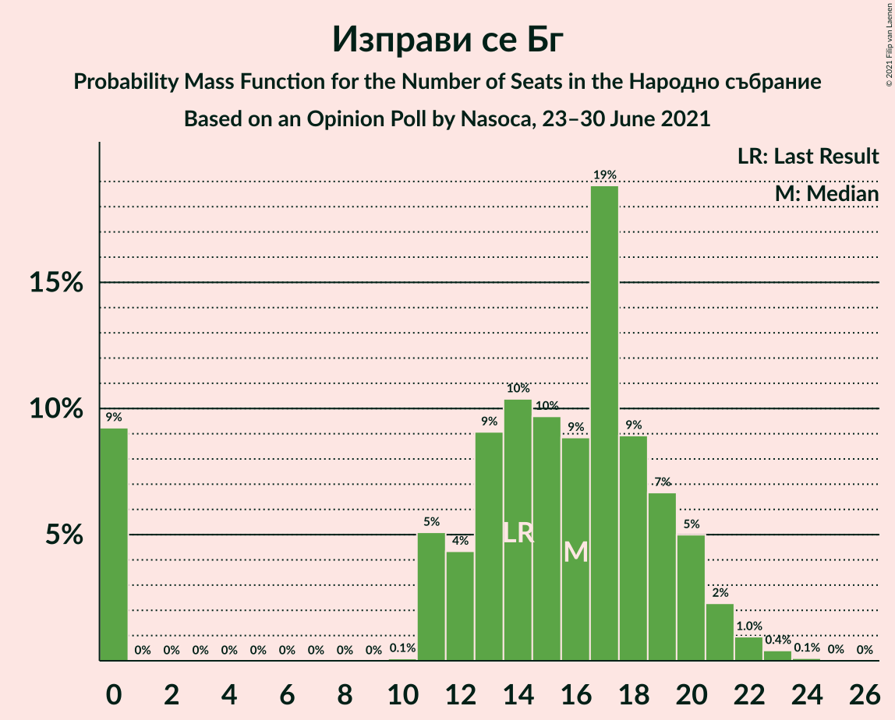

| Number of Seats | Probability | Accumulated | Special Marks |
|:---------------:|:-----------:|:-----------:|:-------------:|
| 0 | 9% | 100% |  |
| 1 | 0% | 91% |  |
| 2 | 0% | 91% |  |
| 3 | 0% | 91% |  |
| 4 | 0% | 91% |  |
| 5 | 0% | 91% |  |
| 6 | 0% | 91% |  |
| 7 | 0% | 91% |  |
| 8 | 0% | 91% |  |
| 9 | 0% | 91% |  |
| 10 | 0.1% | 91% |  |
| 11 | 5% | 91% |  |
| 12 | 4% | 86% |  |
| 13 | 9% | 81% |  |
| 14 | 10% | 72% | Last Result |
| 15 | 10% | 62% |  |
| 16 | 9% | 52% | Median |
| 17 | 19% | 43% |  |
| 18 | 9% | 24% |  |
| 19 | 7% | 15% |  |
| 20 | 5% | 9% |  |
| 21 | 2% | 4% |  |
| 22 | 1.0% | 2% |  |
| 23 | 0.4% | 0.6% |  |
| 24 | 0.1% | 0.2% |  |
| 25 | 0% | 0.1% |  |
| 26 | 0% | 0% |  |

### Българските патриоти

*For a full overview of the results for this party, see the [Българските патриоти](party-българскитепатриоти.html) page.*

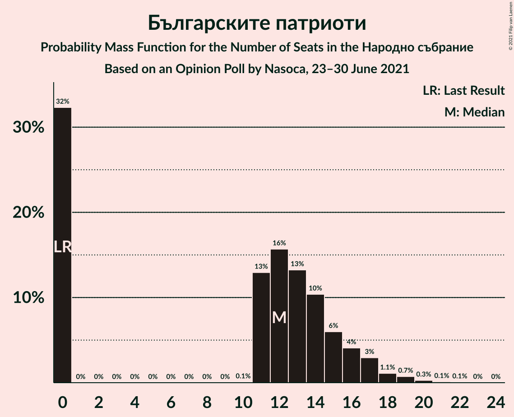

| Number of Seats | Probability | Accumulated | Special Marks |
|:---------------:|:-----------:|:-----------:|:-------------:|
| 0 | 32% | 100% | Last Result |
| 1 | 0% | 68% |  |
| 2 | 0% | 68% |  |
| 3 | 0% | 68% |  |
| 4 | 0% | 68% |  |
| 5 | 0% | 68% |  |
| 6 | 0% | 68% |  |
| 7 | 0% | 68% |  |
| 8 | 0% | 68% |  |
| 9 | 0% | 68% |  |
| 10 | 0.1% | 68% |  |
| 11 | 13% | 68% |  |
| 12 | 16% | 55% | Median |
| 13 | 13% | 39% |  |
| 14 | 10% | 26% |  |
| 15 | 6% | 15% |  |
| 16 | 4% | 9% |  |
| 17 | 3% | 5% |  |
| 18 | 1.1% | 2% |  |
| 19 | 0.7% | 1.2% |  |
| 20 | 0.3% | 0.5% |  |
| 21 | 0.1% | 0.2% |  |
| 22 | 0.1% | 0.1% |  |
| 23 | 0% | 0% |  |

### Възраждане

*For a full overview of the results for this party, see the [Възраждане](party-възраждане.html) page.*

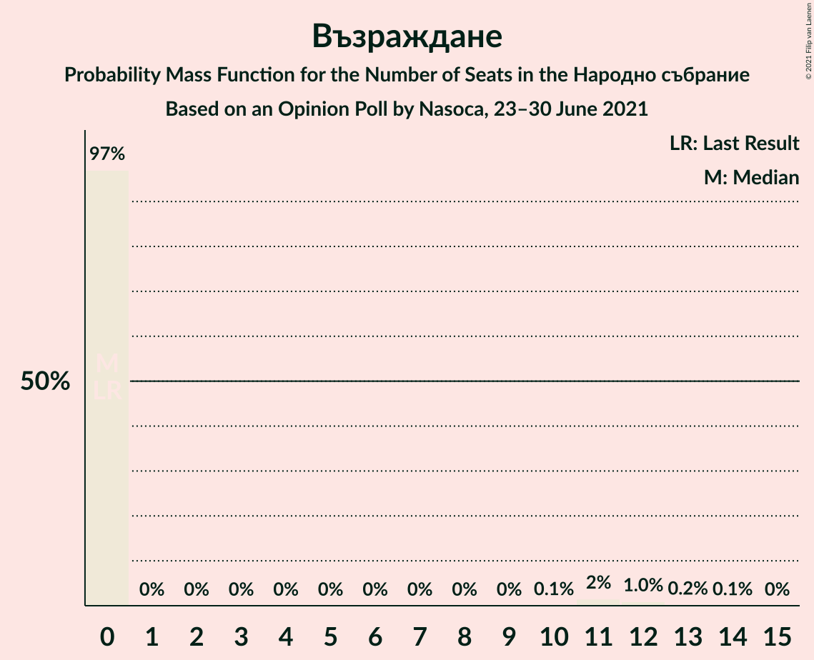

| Number of Seats | Probability | Accumulated | Special Marks |
|:---------------:|:-----------:|:-----------:|:-------------:|
| 0 | 97% | 100% | Last Result, Median |
| 1 | 0% | 3% |  |
| 2 | 0% | 3% |  |
| 3 | 0% | 3% |  |
| 4 | 0% | 3% |  |
| 5 | 0% | 3% |  |
| 6 | 0% | 3% |  |
| 7 | 0% | 3% |  |
| 8 | 0% | 3% |  |
| 9 | 0% | 3% |  |
| 10 | 0.1% | 3% |  |
| 11 | 2% | 3% |  |
| 12 | 1.0% | 1.3% |  |
| 13 | 0.2% | 0.3% |  |
| 14 | 0.1% | 0.1% |  |
| 15 | 0% | 0% |  |

## Coalitions

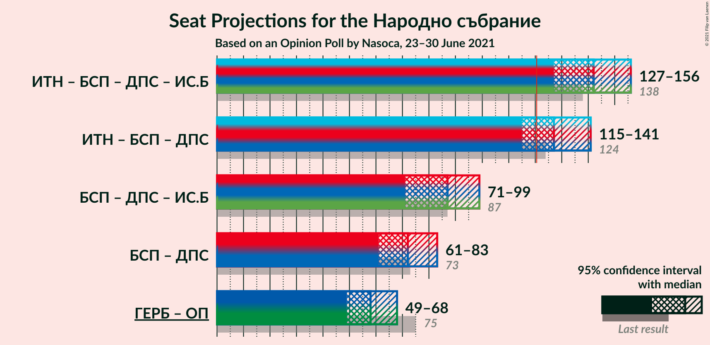

### Confidence Intervals

| Coalition | Last Result | Median | Majority? | 80% Confidence Interval | 90% Confidence Interval | 95% Confidence Interval | 99% Confidence Interval |
|:---------:|:-----------:|:------:|:---------:|:-----------------------:|:-----------------------:|:-----------------------:|:-----------------------:|
| Има такъв народ – Българска социалистическа партия – Движение за права и свободи – Изправи се Бг | 138 | 142 | 99.9% | 133–152 | 130–154 | 127–156 | 124–160 |
| Има такъв народ – Българска социалистическа партия – Движение за права и свободи | 124 | 127 | 86% | 119–137 | 117–139 | 115–141 | 112–146 |
| Българска социалистическа партия – Движение за права и свободи – Изправи се Бг | 87 | 87 | 0% | 77–95 | 74–97 | 71–99 | 67–102 |
| Българска социалистическа партия – Движение за права и свободи | 73 | 72 | 0% | 65–79 | 63–82 | 61–83 | 58–87 |

### Има такъв народ – Българска социалистическа партия – Движение за права и свободи – Изправи се Бг

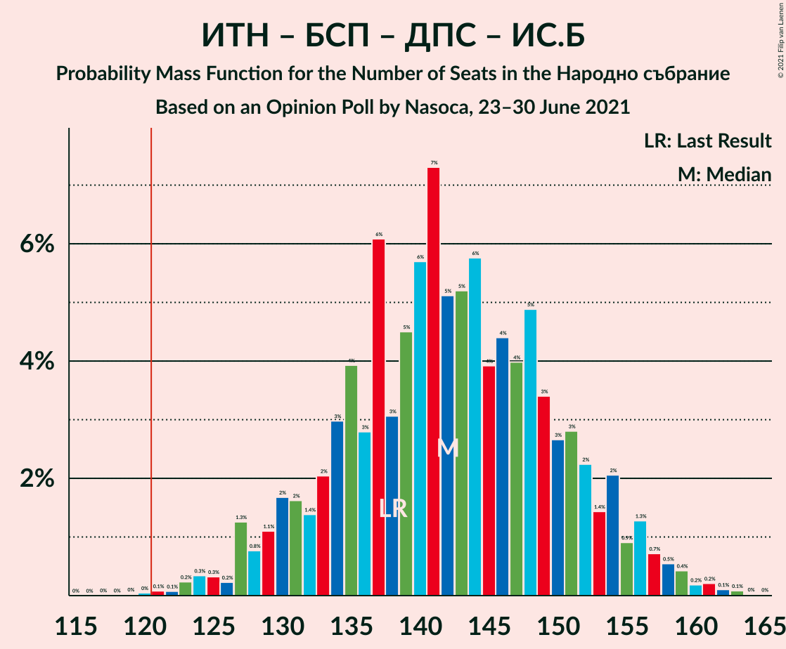

| Number of Seats | Probability | Accumulated | Special Marks |
|:---------------:|:-----------:|:-----------:|:-------------:|
| 119 | 0% | 100% |  |
| 120 | 0% | 99.9% |  |
| 121 | 0.1% | 99.9% | Majority |
| 122 | 0.1% | 99.8% |  |
| 123 | 0.2% | 99.7% |  |
| 124 | 0.3% | 99.5% |  |
| 125 | 0.3% | 99.2% |  |
| 126 | 0.2% | 98.8% |  |
| 127 | 1.3% | 98.6% |  |
| 128 | 0.8% | 97% |  |
| 129 | 1.1% | 97% |  |
| 130 | 2% | 95% |  |
| 131 | 2% | 94% |  |
| 132 | 1.4% | 92% |  |
| 133 | 2% | 91% |  |
| 134 | 3% | 89% |  |
| 135 | 4% | 86% |  |
| 136 | 3% | 82% |  |
| 137 | 6% | 79% |  |
| 138 | 3% | 73% | Last Result |
| 139 | 5% | 70% |  |
| 140 | 6% | 65% |  |
| 141 | 7% | 60% |  |
| 142 | 5% | 52% |  |
| 143 | 5% | 47% |  |
| 144 | 6% | 42% | Median |
| 145 | 4% | 36% |  |
| 146 | 4% | 32% |  |
| 147 | 4% | 28% |  |
| 148 | 5% | 24% |  |
| 149 | 3% | 19% |  |
| 150 | 3% | 16% |  |
| 151 | 3% | 13% |  |
| 152 | 2% | 10% |  |
| 153 | 1.4% | 8% |  |
| 154 | 2% | 7% |  |
| 155 | 0.9% | 5% |  |
| 156 | 1.3% | 4% |  |
| 157 | 0.7% | 2% |  |
| 158 | 0.5% | 2% |  |
| 159 | 0.4% | 1.1% |  |
| 160 | 0.2% | 0.6% |  |
| 161 | 0.2% | 0.5% |  |
| 162 | 0.1% | 0.2% |  |
| 163 | 0.1% | 0.1% |  |
| 164 | 0% | 0.1% |  |
| 165 | 0% | 0% |  |

### Има такъв народ – Българска социалистическа партия – Движение за права и свободи

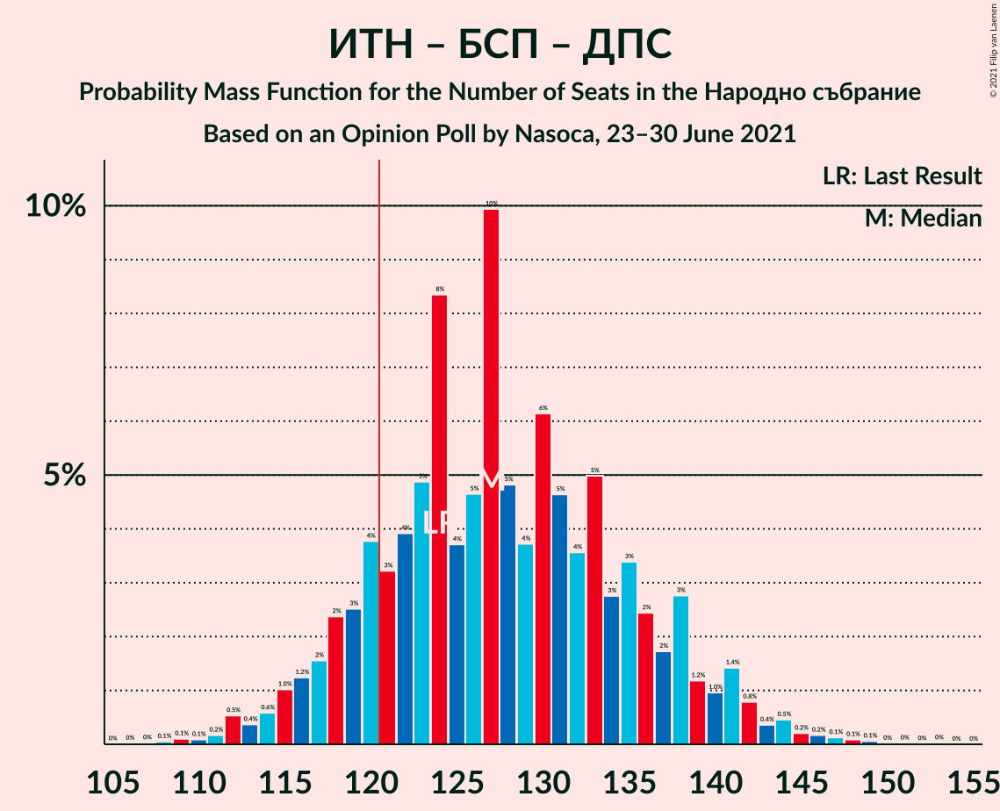

| Number of Seats | Probability | Accumulated | Special Marks |
|:---------------:|:-----------:|:-----------:|:-------------:|
| 107 | 0% | 100% |  |
| 108 | 0.1% | 99.9% |  |
| 109 | 0.1% | 99.9% |  |
| 110 | 0.1% | 99.8% |  |
| 111 | 0.2% | 99.7% |  |
| 112 | 0.5% | 99.5% |  |
| 113 | 0.4% | 99.0% |  |
| 114 | 0.6% | 98.6% |  |
| 115 | 1.0% | 98% |  |
| 116 | 1.2% | 97% |  |
| 117 | 2% | 96% |  |
| 118 | 2% | 94% |  |
| 119 | 3% | 92% |  |
| 120 | 4% | 89% |  |
| 121 | 3% | 86% | Majority |
| 122 | 4% | 82% |  |
| 123 | 5% | 78% |  |
| 124 | 8% | 74% | Last Result |
| 125 | 4% | 65% |  |
| 126 | 5% | 61% |  |
| 127 | 10% | 57% |  |
| 128 | 5% | 47% | Median |
| 129 | 4% | 42% |  |
| 130 | 6% | 38% |  |
| 131 | 5% | 32% |  |
| 132 | 4% | 28% |  |
| 133 | 5% | 24% |  |
| 134 | 3% | 19% |  |
| 135 | 3% | 16% |  |
| 136 | 2% | 13% |  |
| 137 | 2% | 10% |  |
| 138 | 3% | 9% |  |
| 139 | 1.2% | 6% |  |
| 140 | 1.0% | 5% |  |
| 141 | 1.4% | 4% |  |
| 142 | 0.8% | 2% |  |
| 143 | 0.4% | 2% |  |
| 144 | 0.5% | 1.2% |  |
| 145 | 0.2% | 0.7% |  |
| 146 | 0.2% | 0.5% |  |
| 147 | 0.1% | 0.4% |  |
| 148 | 0.1% | 0.2% |  |
| 149 | 0.1% | 0.2% |  |
| 150 | 0% | 0.1% |  |
| 151 | 0% | 0.1% |  |
| 152 | 0% | 0.1% |  |
| 153 | 0% | 0% |  |

### Българска социалистическа партия – Движение за права и свободи – Изправи се Бг

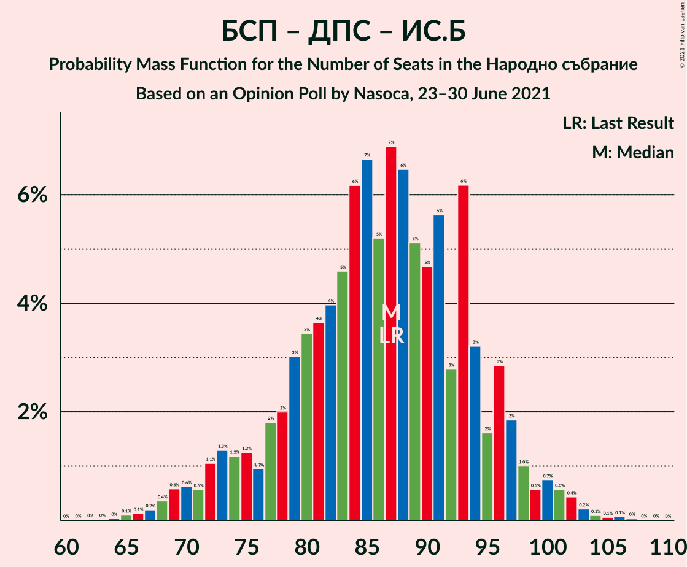

| Number of Seats | Probability | Accumulated | Special Marks |
|:---------------:|:-----------:|:-----------:|:-------------:|
| 63 | 0% | 100% |  |
| 64 | 0% | 99.9% |  |
| 65 | 0.1% | 99.9% |  |
| 66 | 0.1% | 99.8% |  |
| 67 | 0.2% | 99.7% |  |
| 68 | 0.4% | 99.5% |  |
| 69 | 0.6% | 99.1% |  |
| 70 | 0.6% | 98.5% |  |
| 71 | 0.6% | 98% |  |
| 72 | 1.1% | 97% |  |
| 73 | 1.3% | 96% |  |
| 74 | 1.2% | 95% |  |
| 75 | 1.3% | 94% |  |
| 76 | 1.0% | 93% |  |
| 77 | 2% | 92% |  |
| 78 | 2% | 90% |  |
| 79 | 3% | 88% |  |
| 80 | 3% | 85% |  |
| 81 | 4% | 81% |  |
| 82 | 4% | 78% |  |
| 83 | 5% | 74% |  |
| 84 | 6% | 69% |  |
| 85 | 7% | 63% |  |
| 86 | 5% | 56% |  |
| 87 | 7% | 51% | Last Result |
| 88 | 6% | 44% | Median |
| 89 | 5% | 38% |  |
| 90 | 5% | 33% |  |
| 91 | 6% | 28% |  |
| 92 | 3% | 22% |  |
| 93 | 6% | 20% |  |
| 94 | 3% | 13% |  |
| 95 | 2% | 10% |  |
| 96 | 3% | 9% |  |
| 97 | 2% | 6% |  |
| 98 | 1.0% | 4% |  |
| 99 | 0.6% | 3% |  |
| 100 | 0.7% | 2% |  |
| 101 | 0.6% | 2% |  |
| 102 | 0.4% | 0.9% |  |
| 103 | 0.2% | 0.5% |  |
| 104 | 0.1% | 0.3% |  |
| 105 | 0.1% | 0.2% |  |
| 106 | 0.1% | 0.1% |  |
| 107 | 0% | 0.1% |  |
| 108 | 0% | 0% |  |

### Българска социалистическа партия – Движение за права и свободи

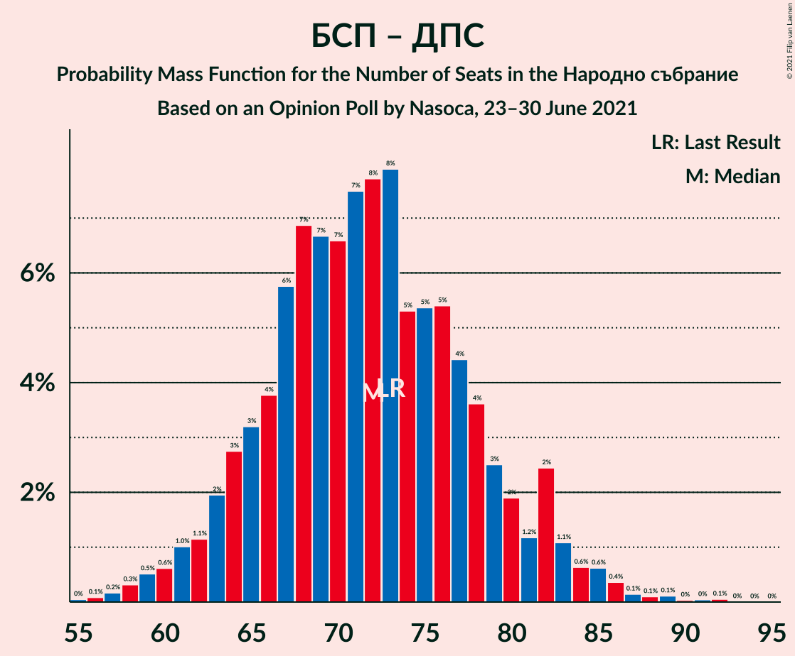

| Number of Seats | Probability | Accumulated | Special Marks |
|:---------------:|:-----------:|:-----------:|:-------------:|
| 55 | 0% | 100% |  |
| 56 | 0.1% | 99.9% |  |
| 57 | 0.2% | 99.8% |  |
| 58 | 0.3% | 99.7% |  |
| 59 | 0.5% | 99.3% |  |
| 60 | 0.6% | 98.8% |  |
| 61 | 1.0% | 98% |  |
| 62 | 1.1% | 97% |  |
| 63 | 2% | 96% |  |
| 64 | 3% | 94% |  |
| 65 | 3% | 91% |  |
| 66 | 4% | 88% |  |
| 67 | 6% | 84% |  |
| 68 | 7% | 79% |  |
| 69 | 7% | 72% |  |
| 70 | 7% | 65% |  |
| 71 | 7% | 58% |  |
| 72 | 8% | 51% | Median |
| 73 | 8% | 43% | Last Result |
| 74 | 5% | 35% |  |
| 75 | 5% | 30% |  |
| 76 | 5% | 25% |  |
| 77 | 4% | 19% |  |
| 78 | 4% | 15% |  |
| 79 | 3% | 11% |  |
| 80 | 2% | 9% |  |
| 81 | 1.2% | 7% |  |
| 82 | 2% | 6% |  |
| 83 | 1.1% | 3% |  |
| 84 | 0.6% | 2% |  |
| 85 | 0.6% | 1.5% |  |
| 86 | 0.4% | 0.9% |  |
| 87 | 0.1% | 0.5% |  |
| 88 | 0.1% | 0.4% |  |
| 89 | 0.1% | 0.3% |  |
| 90 | 0% | 0.2% |  |
| 91 | 0% | 0.1% |  |
| 92 | 0.1% | 0.1% |  |
| 93 | 0% | 0% |  |

## Technical Information

### Opinion Poll

+ **Polling firm:** Nasoca
+ **Commissioner(s):** —
+ **Fieldwork period:** 23–30 June 2021

### Calculations

+ **Sample size:** 525
+ **Simulations done:** 1,048,576
+ **Error estimate:** 2.35%

