# Opinion Poll by Sova Harris for Dir.bg, 2–6 July 2021

<a href="#voting-intentions">Voting Intentions</a> | <a href="#seats">Seats</a> | <a href="#coalitions">Coalitions</a> | <a href="#technical-information">Technical Information</a>

## Voting Intentions

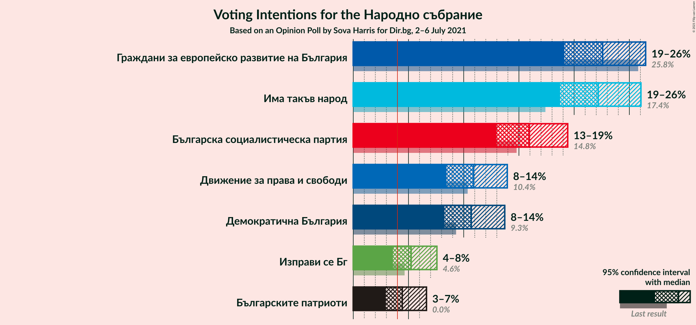

### Confidence Intervals

| Party | Last Result | Poll Result | 80% Confidence Interval | 90% Confidence Interval | 95% Confidence Interval | 99% Confidence Interval |
|:-----:|:-----------:|:-----------:|:-----------------------:|:-----------------------:|:-----------------------:|:-----------------------:|
| Граждани за европейско развитие на България | 25.8% | 22.6% | 20.3–25.1% |19.7–25.8% |19.1–26.5% |18.1–27.7% |
| Има такъв народ | 17.4% | 22.2% | 19.9–24.7% |19.3–25.4% |18.7–26.0% |17.7–27.3% |
| Българска социалистическа партия | 14.8% | 15.9% | 14.0–18.2% |13.4–18.9% |13.0–19.4% |12.1–20.5% |
| Движение за права и свободи | 10.4% | 10.9% | 9.3–12.9% |8.8–13.4% |8.4–13.9% |7.7–15.0% |
| Демократична България | 9.3% | 10.7% | 9.1–12.7% |8.6–13.2% |8.3–13.7% |7.5–14.7% |
| Изправи се Бг | 4.6% | 5.2% | 4.2–6.8% |3.9–7.2% |3.6–7.6% |3.1–8.4% |
| Българските патриоти | 0.0% | 4.4% | 3.4–5.9% |3.2–6.3% |2.9–6.6% |2.5–7.4% |

*Note:* The poll result column reflects the actual value used in the calculations. Published results may vary slightly, and in addition be rounded to fewer digits.

## Seats

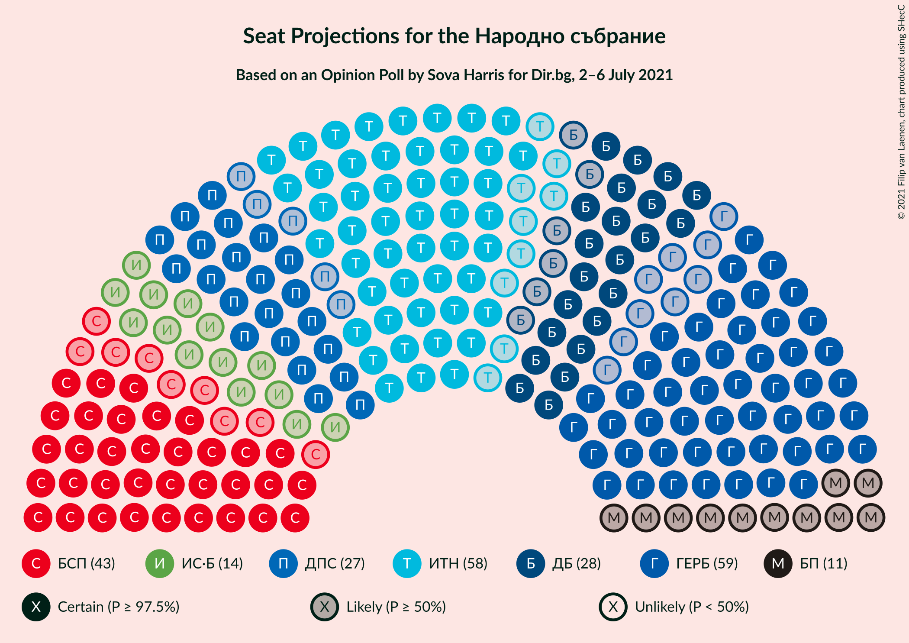

### Confidence Intervals

| Party | Last Result | Median | 80% Confidence Interval | 90% Confidence Interval | 95% Confidence Interval | 99% Confidence Interval |
|:-----:|:-----------:|:------:|:-----------------------:|:-----------------------:|:-----------------------:|:-----------------------:|
| <a href="#граждани-за-европейско-развитие-на-българия">Граждани за европейско развитие на България</a> | 75 | 59 | 53–66 |51–68 |50–70 |47–74 |
| <a href="#има-такъв-народ">Има такъв народ</a> | 51 | 58 | 52–65 |50–67 |49–69 |46–73 |
| <a href="#българска-социалистическа-партия">Българска социалистическа партия</a> | 43 | 43 | 36–47 |35–49 |34–52 |32–55 |
| <a href="#движение-за-права-и-свободи">Движение за права и свободи</a> | 30 | 29 | 24–34 |23–35 |22–37 |20–40 |
| <a href="#демократична-българия">Демократична България</a> | 27 | 28 | 24–33 |23–35 |22–36 |20–39 |
| <a href="#изправи-се-бг">Изправи се Бг</a> | 14 | 14 | 11–18 |0–19 |0–20 |0–22 |
| <a href="#българските-патриоти">Българските патриоти</a> | 0 | 12 | 0–15 |0–16 |0–17 |0–19 |

### Граждани за европейско развитие на България

*For a full overview of the results for this party, see the [Граждани за европейско развитие на България](party-гражданизаевропейскоразвитиенабългария.html) page.*

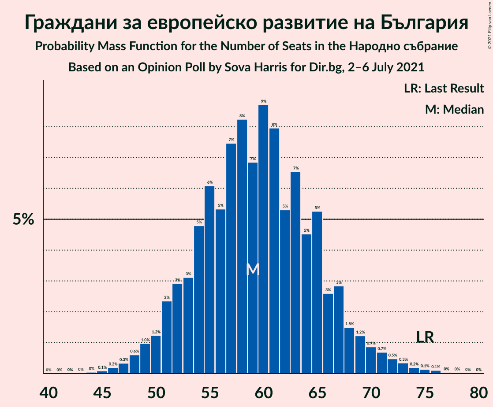

| Number of Seats | Probability | Accumulated | Special Marks |
|:---------------:|:-----------:|:-----------:|:-------------:|
| 44 | 0% | 100% |  |
| 45 | 0.1% | 99.9% |  |
| 46 | 0.2% | 99.8% |  |
| 47 | 0.3% | 99.6% |  |
| 48 | 0.6% | 99.3% |  |
| 49 | 1.0% | 98.7% |  |
| 50 | 1.2% | 98% |  |
| 51 | 2% | 96% |  |
| 52 | 3% | 94% |  |
| 53 | 3% | 91% |  |
| 54 | 5% | 88% |  |
| 55 | 6% | 83% |  |
| 56 | 5% | 77% |  |
| 57 | 7% | 72% |  |
| 58 | 8% | 64% |  |
| 59 | 7% | 56% | Median |
| 60 | 9% | 49% |  |
| 61 | 8% | 41% |  |
| 62 | 5% | 33% |  |
| 63 | 7% | 27% |  |
| 64 | 5% | 21% |  |
| 65 | 5% | 16% |  |
| 66 | 3% | 11% |  |
| 67 | 3% | 8% |  |
| 68 | 1.5% | 6% |  |
| 69 | 1.2% | 4% |  |
| 70 | 0.9% | 3% |  |
| 71 | 0.7% | 2% |  |
| 72 | 0.5% | 1.3% |  |
| 73 | 0.3% | 0.9% |  |
| 74 | 0.2% | 0.5% |  |
| 75 | 0.1% | 0.3% | Last Result |
| 76 | 0.1% | 0.2% |  |
| 77 | 0% | 0.1% |  |
| 78 | 0% | 0.1% |  |
| 79 | 0% | 0% |  |

### Има такъв народ

*For a full overview of the results for this party, see the [Има такъв народ](party-иматакъвнарод.html) page.*

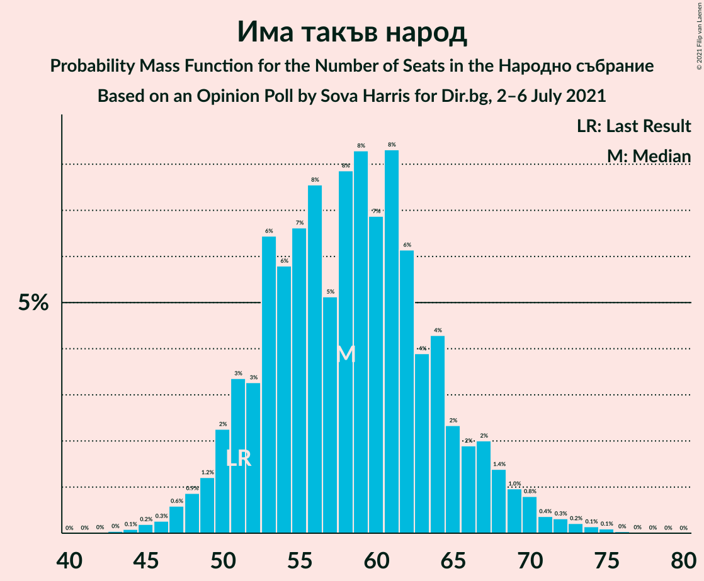

| Number of Seats | Probability | Accumulated | Special Marks |
|:---------------:|:-----------:|:-----------:|:-------------:|
| 43 | 0% | 100% |  |
| 44 | 0.1% | 99.9% |  |
| 45 | 0.2% | 99.8% |  |
| 46 | 0.3% | 99.6% |  |
| 47 | 0.6% | 99.4% |  |
| 48 | 0.9% | 98.8% |  |
| 49 | 1.2% | 98% |  |
| 50 | 2% | 97% |  |
| 51 | 3% | 94% | Last Result |
| 52 | 3% | 91% |  |
| 53 | 6% | 88% |  |
| 54 | 6% | 81% |  |
| 55 | 7% | 76% |  |
| 56 | 8% | 69% |  |
| 57 | 5% | 61% |  |
| 58 | 8% | 56% | Median |
| 59 | 8% | 48% |  |
| 60 | 7% | 40% |  |
| 61 | 8% | 33% |  |
| 62 | 6% | 25% |  |
| 63 | 4% | 19% |  |
| 64 | 4% | 15% |  |
| 65 | 2% | 11% |  |
| 66 | 2% | 8% |  |
| 67 | 2% | 6% |  |
| 68 | 1.4% | 4% |  |
| 69 | 1.0% | 3% |  |
| 70 | 0.8% | 2% |  |
| 71 | 0.4% | 1.2% |  |
| 72 | 0.3% | 0.9% |  |
| 73 | 0.2% | 0.5% |  |
| 74 | 0.1% | 0.3% |  |
| 75 | 0.1% | 0.2% |  |
| 76 | 0% | 0.1% |  |
| 77 | 0% | 0% |  |

### Българска социалистическа партия

*For a full overview of the results for this party, see the [Българска социалистическа партия](party-българскасоциалистическапартия.html) page.*

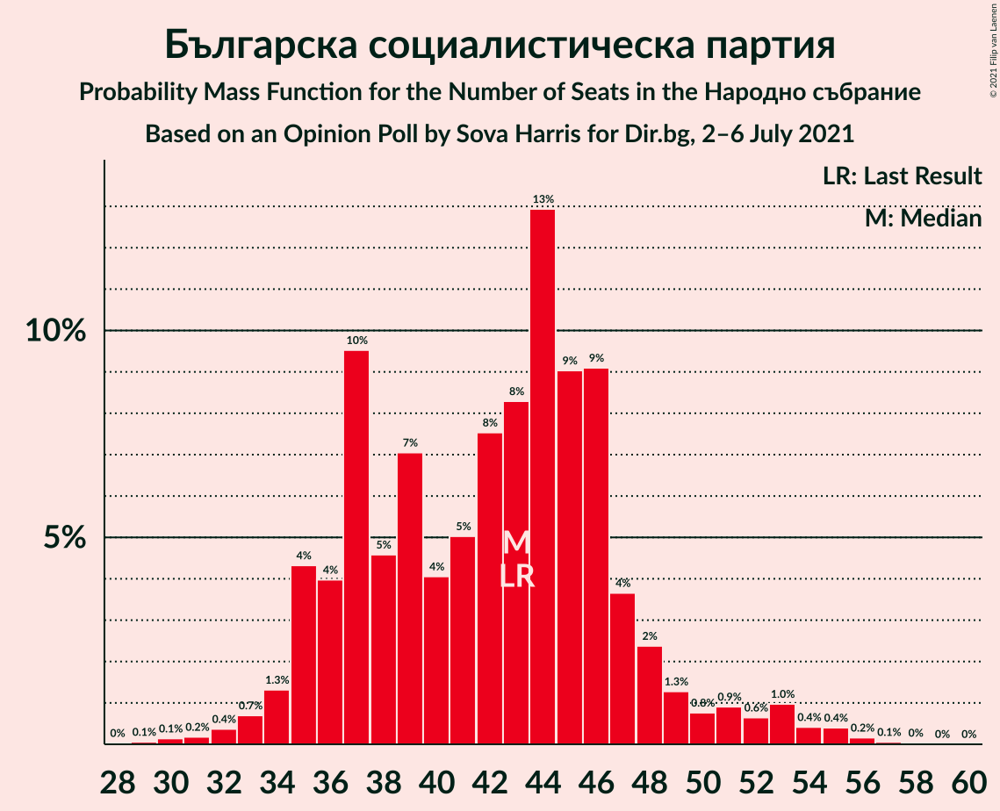

| Number of Seats | Probability | Accumulated | Special Marks |
|:---------------:|:-----------:|:-----------:|:-------------:|
| 29 | 0.1% | 100% |  |
| 30 | 0.1% | 99.9% |  |
| 31 | 0.2% | 99.8% |  |
| 32 | 0.4% | 99.6% |  |
| 33 | 0.7% | 99.2% |  |
| 34 | 1.3% | 98.5% |  |
| 35 | 4% | 97% |  |
| 36 | 4% | 93% |  |
| 37 | 10% | 89% |  |
| 38 | 5% | 79% |  |
| 39 | 7% | 75% |  |
| 40 | 4% | 68% |  |
| 41 | 5% | 64% |  |
| 42 | 8% | 59% |  |
| 43 | 8% | 51% | Last Result, Median |
| 44 | 13% | 43% |  |
| 45 | 9% | 30% |  |
| 46 | 9% | 21% |  |
| 47 | 4% | 12% |  |
| 48 | 2% | 8% |  |
| 49 | 1.3% | 6% |  |
| 50 | 0.8% | 4% |  |
| 51 | 0.9% | 4% |  |
| 52 | 0.6% | 3% |  |
| 53 | 1.0% | 2% |  |
| 54 | 0.4% | 1.1% |  |
| 55 | 0.4% | 0.7% |  |
| 56 | 0.2% | 0.3% |  |
| 57 | 0.1% | 0.1% |  |
| 58 | 0% | 0.1% |  |
| 59 | 0% | 0% |  |

### Движение за права и свободи

*For a full overview of the results for this party, see the [Движение за права и свободи](party-движениезаправаисвободи.html) page.*

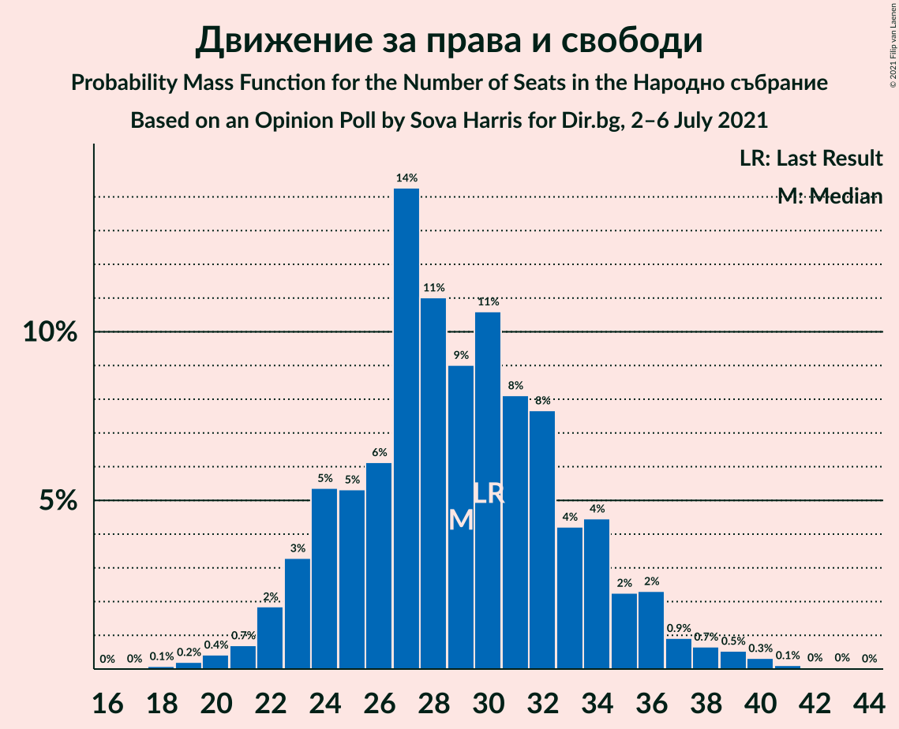

| Number of Seats | Probability | Accumulated | Special Marks |
|:---------------:|:-----------:|:-----------:|:-------------:|
| 18 | 0.1% | 100% |  |
| 19 | 0.2% | 99.9% |  |
| 20 | 0.4% | 99.7% |  |
| 21 | 0.7% | 99.3% |  |
| 22 | 2% | 98.6% |  |
| 23 | 3% | 97% |  |
| 24 | 5% | 93% |  |
| 25 | 5% | 88% |  |
| 26 | 6% | 83% |  |
| 27 | 14% | 77% |  |
| 28 | 11% | 62% |  |
| 29 | 9% | 51% | Median |
| 30 | 11% | 42% | Last Result |
| 31 | 8% | 32% |  |
| 32 | 8% | 24% |  |
| 33 | 4% | 16% |  |
| 34 | 4% | 12% |  |
| 35 | 2% | 7% |  |
| 36 | 2% | 5% |  |
| 37 | 0.9% | 3% |  |
| 38 | 0.7% | 2% |  |
| 39 | 0.5% | 1.1% |  |
| 40 | 0.3% | 0.6% |  |
| 41 | 0.1% | 0.2% |  |
| 42 | 0% | 0.1% |  |
| 43 | 0% | 0.1% |  |
| 44 | 0% | 0% |  |

### Демократична България

*For a full overview of the results for this party, see the [Демократична България](party-демократичнабългария.html) page.*

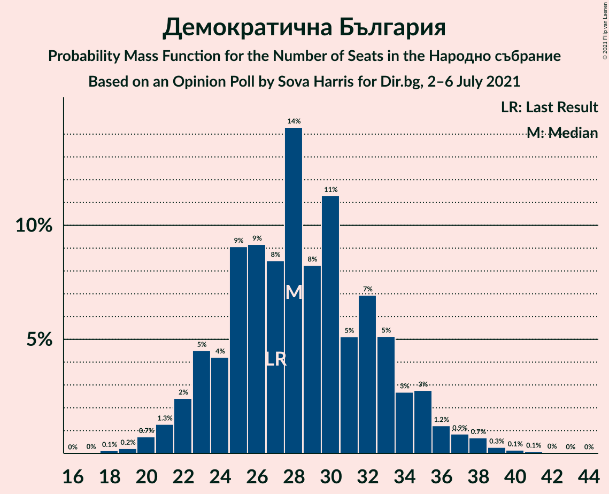

| Number of Seats | Probability | Accumulated | Special Marks |
|:---------------:|:-----------:|:-----------:|:-------------:|
| 18 | 0.1% | 100% |  |
| 19 | 0.2% | 99.8% |  |
| 20 | 0.7% | 99.6% |  |
| 21 | 1.3% | 98.9% |  |
| 22 | 2% | 98% |  |
| 23 | 5% | 95% |  |
| 24 | 4% | 91% |  |
| 25 | 9% | 86% |  |
| 26 | 9% | 77% |  |
| 27 | 8% | 68% | Last Result |
| 28 | 14% | 60% | Median |
| 29 | 8% | 46% |  |
| 30 | 11% | 37% |  |
| 31 | 5% | 26% |  |
| 32 | 7% | 21% |  |
| 33 | 5% | 14% |  |
| 34 | 3% | 9% |  |
| 35 | 3% | 6% |  |
| 36 | 1.2% | 3% |  |
| 37 | 0.9% | 2% |  |
| 38 | 0.7% | 1.3% |  |
| 39 | 0.3% | 0.6% |  |
| 40 | 0.1% | 0.3% |  |
| 41 | 0.1% | 0.2% |  |
| 42 | 0% | 0.1% |  |
| 43 | 0% | 0% |  |

### Изправи се Бг

*For a full overview of the results for this party, see the [Изправи се Бг](party-изправисебг.html) page.*

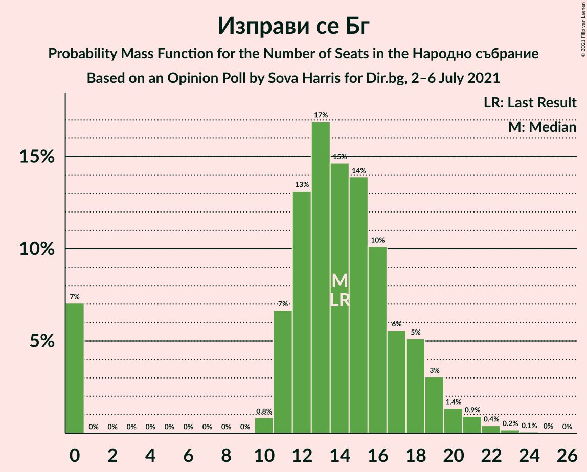

| Number of Seats | Probability | Accumulated | Special Marks |
|:---------------:|:-----------:|:-----------:|:-------------:|
| 0 | 7% | 100% |  |
| 1 | 0% | 93% |  |
| 2 | 0% | 93% |  |
| 3 | 0% | 93% |  |
| 4 | 0% | 93% |  |
| 5 | 0% | 93% |  |
| 6 | 0% | 93% |  |
| 7 | 0% | 93% |  |
| 8 | 0% | 93% |  |
| 9 | 0% | 93% |  |
| 10 | 0.8% | 93% |  |
| 11 | 7% | 92% |  |
| 12 | 13% | 85% |  |
| 13 | 17% | 72% |  |
| 14 | 15% | 55% | Last Result, Median |
| 15 | 14% | 41% |  |
| 16 | 10% | 27% |  |
| 17 | 6% | 17% |  |
| 18 | 5% | 11% |  |
| 19 | 3% | 6% |  |
| 20 | 1.4% | 3% |  |
| 21 | 0.9% | 2% |  |
| 22 | 0.4% | 0.7% |  |
| 23 | 0.2% | 0.3% |  |
| 24 | 0.1% | 0.1% |  |
| 25 | 0% | 0.1% |  |
| 26 | 0% | 0% |  |

### Българските патриоти

*For a full overview of the results for this party, see the [Българските патриоти](party-българскитепатриоти.html) page.*

| Number of Seats | Probability | Accumulated | Special Marks |
|:---------------:|:-----------:|:-----------:|:-------------:|
| 0 | 27% | 100% | Last Result |
| 1 | 0% | 73% |  |
| 2 | 0% | 73% |  |
| 3 | 0% | 73% |  |
| 4 | 0% | 73% |  |
| 5 | 0% | 73% |  |
| 6 | 0% | 73% |  |
| 7 | 0% | 73% |  |
| 8 | 0% | 73% |  |
| 9 | 0% | 73% |  |
| 10 | 0.9% | 73% |  |
| 11 | 19% | 72% |  |
| 12 | 13% | 53% | Median |
| 13 | 15% | 40% |  |
| 14 | 10% | 24% |  |
| 15 | 6% | 15% |  |
| 16 | 4% | 8% |  |
| 17 | 2% | 4% |  |
| 18 | 1.4% | 2% |  |
| 19 | 0.4% | 0.8% |  |
| 20 | 0.3% | 0.4% |  |
| 21 | 0.1% | 0.1% |  |
| 22 | 0% | 0.1% |  |
| 23 | 0% | 0% |  |

## Coalitions

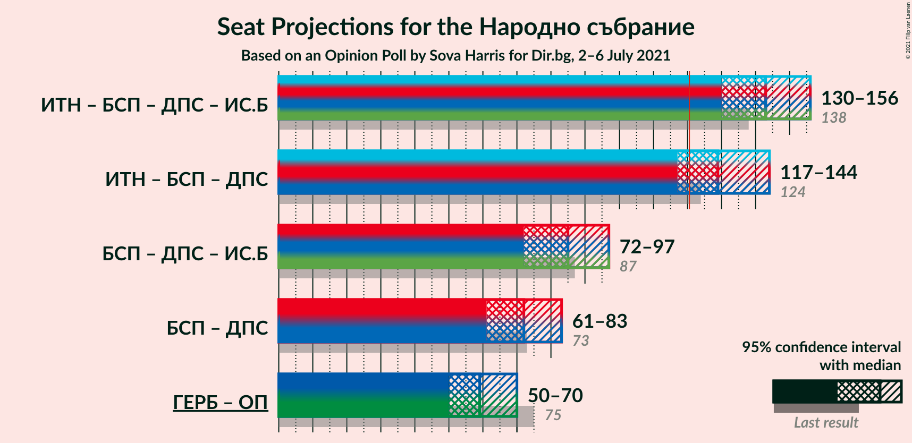

### Confidence Intervals

| Coalition | Last Result | Median | Majority? | 80% Confidence Interval | 90% Confidence Interval | 95% Confidence Interval | 99% Confidence Interval |
|:---------:|:-----------:|:------:|:---------:|:-----------------------:|:-----------------------:|:-----------------------:|:-----------------------:|
| Има такъв народ – Българска социалистическа партия – Движение за права и свободи – Изправи се Бг | 138 | 143 | 100% | 134–151 | 132–154 | 130–156 | 126–160 |
| Има такъв народ – Българска социалистическа партия – Движение за права и свободи | 124 | 129 | 91% | 121–138 | 118–141 | 117–144 | 113–149 |
| Българска социалистическа партия – Движение за права и свободи – Изправи се Бг | 87 | 85 | 0% | 76–92 | 74–94 | 72–97 | 66–101 |
| Българска социалистическа партия – Движение за права и свободи | 73 | 72 | 0% | 64–78 | 62–80 | 61–83 | 58–87 |

### Има такъв народ – Българска социалистическа партия – Движение за права и свободи – Изправи се Бг

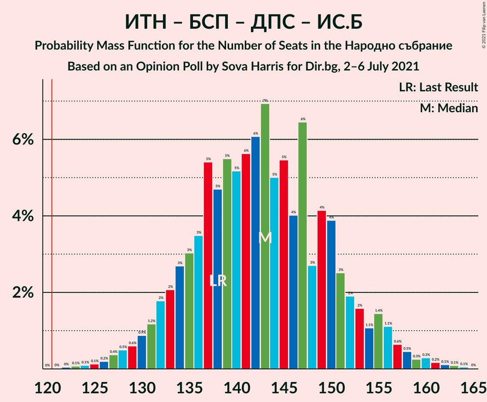

| Number of Seats | Probability | Accumulated | Special Marks |
|:---------------:|:-----------:|:-----------:|:-------------:|
| 121 | 0% | 100% | Majority |
| 122 | 0% | 99.9% |  |
| 123 | 0.1% | 99.9% |  |
| 124 | 0.1% | 99.8% |  |
| 125 | 0.1% | 99.7% |  |
| 126 | 0.2% | 99.6% |  |
| 127 | 0.4% | 99.4% |  |
| 128 | 0.5% | 99.0% |  |
| 129 | 0.6% | 98.5% |  |
| 130 | 0.9% | 98% |  |
| 131 | 1.2% | 97% |  |
| 132 | 2% | 96% |  |
| 133 | 2% | 94% |  |
| 134 | 3% | 92% |  |
| 135 | 3% | 89% |  |
| 136 | 3% | 86% |  |
| 137 | 5% | 83% |  |
| 138 | 5% | 77% | Last Result |
| 139 | 5% | 73% |  |
| 140 | 5% | 67% |  |
| 141 | 6% | 62% |  |
| 142 | 6% | 56% |  |
| 143 | 7% | 50% |  |
| 144 | 5% | 43% | Median |
| 145 | 5% | 38% |  |
| 146 | 4% | 33% |  |
| 147 | 6% | 29% |  |
| 148 | 3% | 22% |  |
| 149 | 4% | 20% |  |
| 150 | 4% | 16% |  |
| 151 | 3% | 12% |  |
| 152 | 2% | 9% |  |
| 153 | 2% | 7% |  |
| 154 | 1.1% | 6% |  |
| 155 | 1.4% | 5% |  |
| 156 | 1.1% | 3% |  |
| 157 | 0.6% | 2% |  |
| 158 | 0.5% | 1.5% |  |
| 159 | 0.3% | 1.0% |  |
| 160 | 0.3% | 0.8% |  |
| 161 | 0.2% | 0.5% |  |
| 162 | 0.1% | 0.3% |  |
| 163 | 0.1% | 0.2% |  |
| 164 | 0.1% | 0.1% |  |
| 165 | 0% | 0% |  |

### Има такъв народ – Българска социалистическа партия – Движение за права и свободи

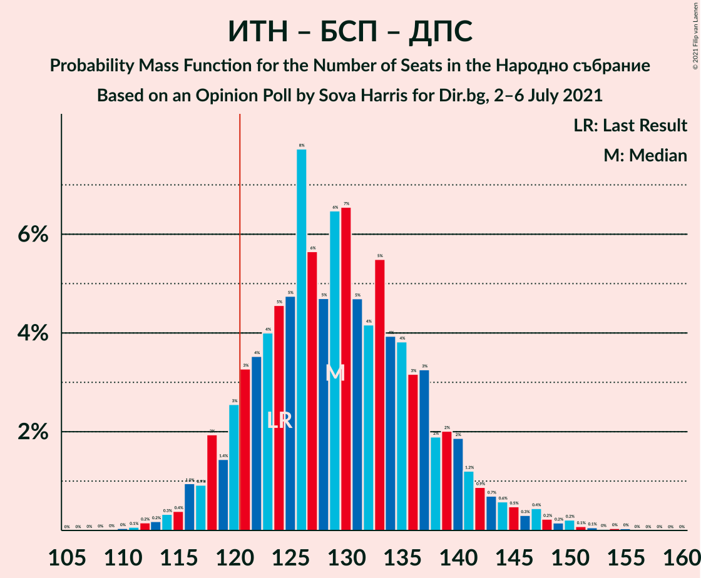

| Number of Seats | Probability | Accumulated | Special Marks |
|:---------------:|:-----------:|:-----------:|:-------------:|
| 109 | 0% | 100% |  |
| 110 | 0% | 99.9% |  |
| 111 | 0.1% | 99.9% |  |
| 112 | 0.2% | 99.8% |  |
| 113 | 0.2% | 99.7% |  |
| 114 | 0.3% | 99.5% |  |
| 115 | 0.4% | 99.2% |  |
| 116 | 1.0% | 98.8% |  |
| 117 | 0.9% | 98% |  |
| 118 | 2% | 97% |  |
| 119 | 1.4% | 95% |  |
| 120 | 3% | 94% |  |
| 121 | 3% | 91% | Majority |
| 122 | 4% | 88% |  |
| 123 | 4% | 84% |  |
| 124 | 5% | 80% | Last Result |
| 125 | 5% | 76% |  |
| 126 | 8% | 71% |  |
| 127 | 6% | 63% |  |
| 128 | 5% | 57% |  |
| 129 | 6% | 53% |  |
| 130 | 7% | 46% | Median |
| 131 | 5% | 40% |  |
| 132 | 4% | 35% |  |
| 133 | 5% | 31% |  |
| 134 | 4% | 25% |  |
| 135 | 4% | 21% |  |
| 136 | 3% | 18% |  |
| 137 | 3% | 14% |  |
| 138 | 2% | 11% |  |
| 139 | 2% | 9% |  |
| 140 | 2% | 7% |  |
| 141 | 1.2% | 5% |  |
| 142 | 0.9% | 4% |  |
| 143 | 0.7% | 3% |  |
| 144 | 0.6% | 3% |  |
| 145 | 0.5% | 2% |  |
| 146 | 0.3% | 2% |  |
| 147 | 0.4% | 1.3% |  |
| 148 | 0.2% | 0.9% |  |
| 149 | 0.2% | 0.6% |  |
| 150 | 0.2% | 0.5% |  |
| 151 | 0.1% | 0.3% |  |
| 152 | 0.1% | 0.2% |  |
| 153 | 0% | 0.1% |  |
| 154 | 0% | 0.1% |  |
| 155 | 0% | 0.1% |  |
| 156 | 0% | 0% |  |

### Българска социалистическа партия – Движение за права и свободи – Изправи се Бг

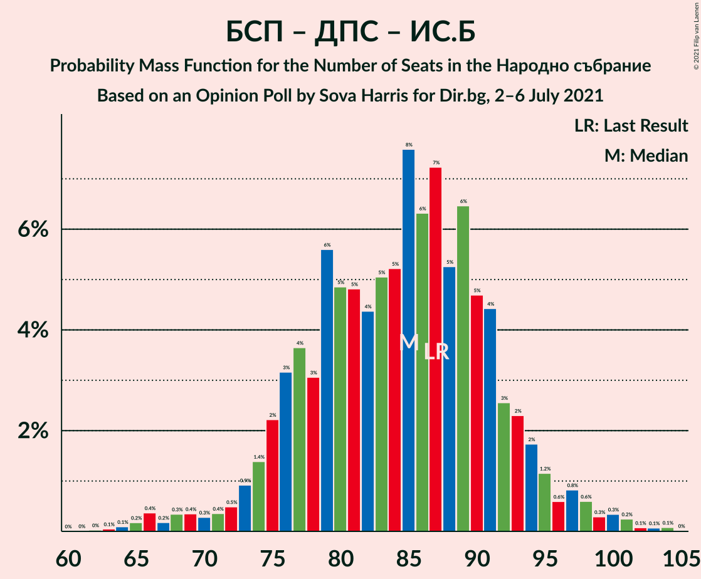

| Number of Seats | Probability | Accumulated | Special Marks |
|:---------------:|:-----------:|:-----------:|:-------------:|
| 62 | 0% | 100% |  |
| 63 | 0.1% | 99.9% |  |
| 64 | 0.1% | 99.9% |  |
| 65 | 0.2% | 99.8% |  |
| 66 | 0.4% | 99.6% |  |
| 67 | 0.2% | 99.3% |  |
| 68 | 0.3% | 99.1% |  |
| 69 | 0.4% | 98.7% |  |
| 70 | 0.3% | 98% |  |
| 71 | 0.4% | 98% |  |
| 72 | 0.5% | 98% |  |
| 73 | 0.9% | 97% |  |
| 74 | 1.4% | 96% |  |
| 75 | 2% | 95% |  |
| 76 | 3% | 93% |  |
| 77 | 4% | 90% |  |
| 78 | 3% | 86% |  |
| 79 | 6% | 83% |  |
| 80 | 5% | 77% |  |
| 81 | 5% | 72% |  |
| 82 | 4% | 68% |  |
| 83 | 5% | 63% |  |
| 84 | 5% | 58% |  |
| 85 | 8% | 53% |  |
| 86 | 6% | 45% | Median |
| 87 | 7% | 39% | Last Result |
| 88 | 5% | 32% |  |
| 89 | 6% | 27% |  |
| 90 | 5% | 20% |  |
| 91 | 4% | 15% |  |
| 92 | 3% | 11% |  |
| 93 | 2% | 8% |  |
| 94 | 2% | 6% |  |
| 95 | 1.2% | 4% |  |
| 96 | 0.6% | 3% |  |
| 97 | 0.8% | 3% |  |
| 98 | 0.6% | 2% |  |
| 99 | 0.3% | 1.2% |  |
| 100 | 0.3% | 0.9% |  |
| 101 | 0.2% | 0.5% |  |
| 102 | 0.1% | 0.3% |  |
| 103 | 0.1% | 0.2% |  |
| 104 | 0.1% | 0.1% |  |
| 105 | 0% | 0% |  |

### Българска социалистическа партия – Движение за права и свободи

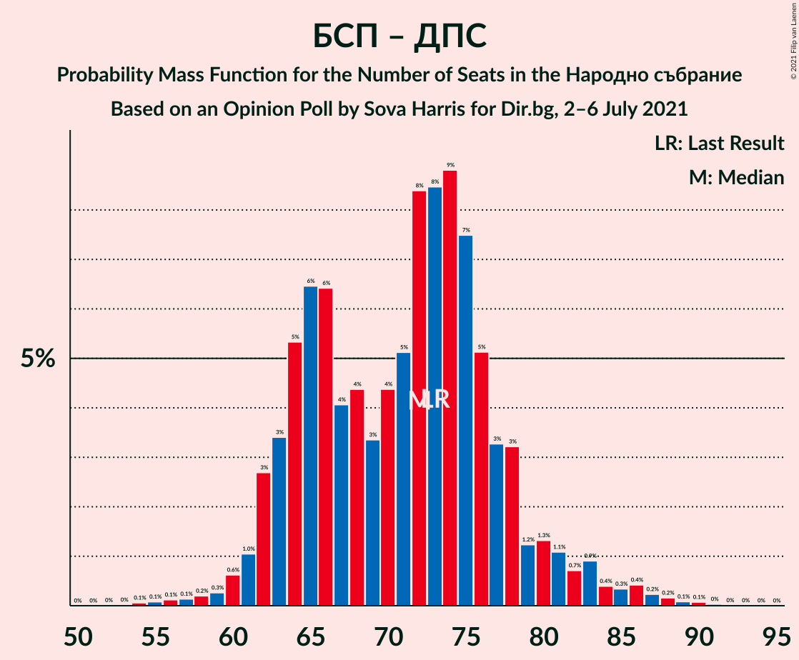

| Number of Seats | Probability | Accumulated | Special Marks |
|:---------------:|:-----------:|:-----------:|:-------------:|
| 54 | 0.1% | 100% |  |
| 55 | 0.1% | 99.9% |  |
| 56 | 0.1% | 99.8% |  |
| 57 | 0.1% | 99.7% |  |
| 58 | 0.2% | 99.6% |  |
| 59 | 0.3% | 99.4% |  |
| 60 | 0.6% | 99.1% |  |
| 61 | 1.0% | 98% |  |
| 62 | 3% | 97% |  |
| 63 | 3% | 95% |  |
| 64 | 5% | 91% |  |
| 65 | 6% | 86% |  |
| 66 | 6% | 80% |  |
| 67 | 4% | 73% |  |
| 68 | 4% | 69% |  |
| 69 | 3% | 65% |  |
| 70 | 4% | 61% |  |
| 71 | 5% | 57% |  |
| 72 | 8% | 52% | Median |
| 73 | 8% | 43% | Last Result |
| 74 | 9% | 35% |  |
| 75 | 7% | 26% |  |
| 76 | 5% | 19% |  |
| 77 | 3% | 14% |  |
| 78 | 3% | 10% |  |
| 79 | 1.2% | 7% |  |
| 80 | 1.3% | 6% |  |
| 81 | 1.1% | 4% |  |
| 82 | 0.7% | 3% |  |
| 83 | 0.9% | 3% |  |
| 84 | 0.4% | 2% |  |
| 85 | 0.3% | 1.4% |  |
| 86 | 0.4% | 1.0% |  |
| 87 | 0.2% | 0.6% |  |
| 88 | 0.2% | 0.4% |  |
| 89 | 0.1% | 0.2% |  |
| 90 | 0.1% | 0.1% |  |
| 91 | 0% | 0.1% |  |
| 92 | 0% | 0% |  |

## Technical Information

### Opinion Poll

+ **Polling firm:** Sova Harris
+ **Commissioner(s):** Dir.bg
+ **Fieldwork period:** 2–6 July 2021

### Calculations

+ **Sample size:** 496
+ **Simulations done:** 1,048,576
+ **Error estimate:** 2.62%

