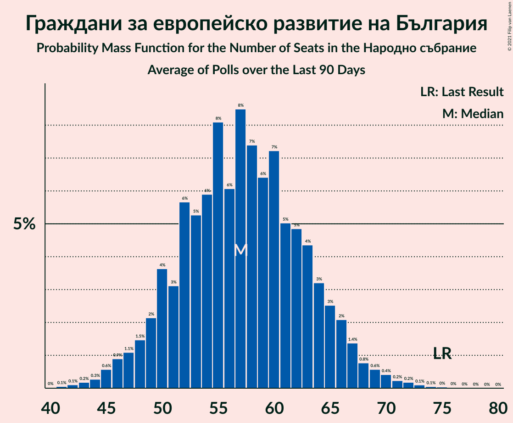

# Граждани за европейско развитие на България

<a href="#voting-intentions">Voting Intentions</a> | <a href="#seats">Seats</a>

## Voting Intentions

Last result: **25.8%** (General Election of 4 April 2021)

### Confidence Intervals

| Period     | Polling firm/Commissioner(s) | Median | 80% Confidence Interval | 90% Confidence Interval | 95% Confidence Interval | 99% Confidence Interval |
|:----------:|:----------------:|:-----------:|:-----------------------:|:-----------------------:|:-----------------------:|:-----------------------:|
| N/A | [Poll Average](average.html) | 21.8% | 19.2–24.3% | 18.5–25.0% | 17.9–25.6% | 16.8–26.9% |
| [3–7 July 2021](2021-07-07-Тренд.html) | Тренд   Nova | 20.5% | 18.4–23.0% | 17.8–23.7% | 17.3–24.3% | 16.3–25.5% |
| [4–7 July 2021](2021-07-07-Алфарисърч.html) | Алфа рисърч | 21.4% | 19.2–24.0% | 18.5–24.7% | 18.0–25.3% | 16.9–26.6% |
| [30 June–7 July 2021](2021-07-07-Gallup.html) | Gallup   BNR | 20.4% | 18.2–22.8% | 17.6–23.5% | 17.1–24.1% | 16.1–25.3% |
| [2–6 July 2021](2021-07-06-SovaHarris.html) | Sova Harris   Dir.bg | 22.6% | 20.3–25.1% | 19.7–25.8% | 19.1–26.5% | 18.1–27.7% |
| [1–5 July 2021](2021-07-05-Exacta.html) | Exacta | 21.4% | 19.1–23.9% | 18.5–24.6% | 17.9–25.3% | 16.9–26.5% |
| [26 June–2 July 2021](2021-07-02-Медиана.html) | Медиана | 22.5% | 20.8–24.3% | 20.3–24.9% | 19.9–25.3% | 19.1–26.2% |
| [23–30 June 2021](2021-06-30-Nasoca.html) | Nasoca | 21.3% | 19.2–23.8% | 18.6–24.4% | 18.0–25.1% | 17.0–26.2% |
| [18–25 June 2021](2021-06-25-MarketLinks.html) | Market Links   bTV | 23.1% | 21.0–25.3% | 20.4–26.0% | 19.9–26.6% | 19.0–27.7% |
| [11–18 June 2021](2021-06-18-Тренд.html) | Тренд   24 часа | 21.6% | 19.4–24.2% | 18.7–24.9% | 18.2–25.5% | 17.1–26.8% |
| [10–15 June 2021](2021-06-15-Медиана.html) | Медиана | 21.4% | 19.8–23.2% | 19.4–23.7% | 19.0–24.1% | 18.3–24.9% |
| [10–15 June 2021](2021-06-15-SovaHarris.html) | Sova Harris   Dir.bg | 22.3% | 20.0–24.9% | 19.4–25.6% | 18.8–26.2% | 17.8–27.5% |
| [3–11 June 2021](2021-06-11-Gallup.html) | Gallup   BNR | 21.1% | 19.0–23.3% | 18.4–24.0% | 18.0–24.5% | 17.0–25.7% |
| [30 May–7 June 2021](2021-06-07-Алфарисърч.html) | Алфа рисърч | 20.3% | 18.2–22.7% | 17.6–23.4% | 17.1–24.0% | 16.2–25.1% |
| [19–27 May 2021](2021-05-27-MarketLinks.html) | Market Links   bTV | 23.7% | 21.6–25.9% | 21.1–26.5% | 20.6–27.0% | 19.7–28.1% |
| [7–14 May 2021](2021-05-14-Gallup.html) | Gallup | 22.8% | 20.4–25.4% | 19.8–26.1% | 19.2–26.8% | 18.1–28.1% |
| [16–23 April 2021](2021-04-23-МаркетЛИНКС.html) | Маркет ЛИНКС   bTV | 23.1% | 21.0–25.4% | 20.5–26.0% | 20.0–26.6% | 19.0–27.7% |

### Probability Mass Function

The following table shows the probability mass function per percentage block of voting intentions for the [poll average](average.html) for Граждани за европейско развитие на България.

| Voting Intentions | Probability | Accumulated | Special Marks |
|:-----------------:|:-----------:|:-----------:|:-------------:|
| 14.5–15.5% | 0% | 100% |  |
| 15.5–16.5% | 0.3% | 100% |  |
| 16.5–17.5% | 1.2% | 99.7% |  |
| 17.5–18.5% | 4% | 98% |  |
| 18.5–19.5% | 8% | 95% |  |
| 19.5–20.5% | 14% | 86% |  |
| 20.5–21.5% | 19% | 73% |  |
| 21.5–22.5% | 20% | 54% | Median |
| 22.5–23.5% | 16% | 34% |  |
| 23.5–24.5% | 10% | 18% |  |
| 24.5–25.5% | 5% | 8% |  |
| 25.5–26.5% | 2% | 3% | Last Result |
| 26.5–27.5% | 0.6% | 0.8% |  |
| 27.5–28.5% | 0.2% | 0.2% |  |
| 28.5–29.5% | 0% | 0% |  |

## Seats

Last result: **75** seats (General Election of 4 April 2021)

### Confidence Intervals

| Period     | Polling firm/Commissioner(s) | Median | 80% Confidence Interval | 90% Confidence Interval | 95% Confidence Interval | 99% Confidence Interval |
|:----------:|:----------------:|:------:|:-----------------------:|:-----------------------:|:-----------------------:|:-----------------------:|
| N/A | [Poll Average](average.html) | 57 | 50–64 | 49–66 | 47–67 | 44–71 |
| [3–7 July 2021](2021-07-07-Тренд.html) | Тренд   Nova | 55 | 49–62 | 47–63 | 45–65 | 43–69 |
| [4–7 July 2021](2021-07-07-Алфарисърч.html) | Алфа рисърч | 58 | 50–65 | 48–66 | 46–67 | 43–69 |
| [30 June–7 July 2021](2021-07-07-Gallup.html) | Gallup   BNR | 54 | 48–60 | 46–63 | 44–64 | 42–68 |
| [2–6 July 2021](2021-07-06-SovaHarris.html) | Sova Harris   Dir.bg | 59 | 53–66 | 51–68 | 50–70 | 47–74 |
| [1–5 July 2021](2021-07-05-Exacta.html) | Exacta | 57 | 50–64 | 49–66 | 47–68 | 44–71 |
| [26 June–2 July 2021](2021-07-02-Медиана.html) | Медиана | 56 | 52–61 | 51–63 | 50–64 | 48–66 |
| [23–30 June 2021](2021-06-30-Nasoca.html) | Nasoca | 58 | 52–65 | 50–67 | 49–68 | 46–72 |
| [18–25 June 2021](2021-06-25-MarketLinks.html) | Market Links   bTV | 60 | 54–66 | 52–67 | 51–69 | 49–72 |
| [11–18 June 2021](2021-06-18-Тренд.html) | Тренд   24 часа | 59 | 53–67 | 51–69 | 50–71 | 47–74 |
| [10–15 June 2021](2021-06-15-Медиана.html) | Медиана | 53 | 49–57 | 48–58 | 47–59 | 45–62 |
| [10–15 June 2021](2021-06-15-SovaHarris.html) | Sova Harris   Dir.bg | 56 | 50–62 | 48–64 | 47–66 | 44–70 |
| [3–11 June 2021](2021-06-11-Gallup.html) | Gallup   BNR | 56 | 51–63 | 49–64 | 48–66 | 45–69 |
| [30 May–7 June 2021](2021-06-07-Алфарисърч.html) | Алфа рисърч | 60 | 53–67 | 51–69 | 49–72 | 47–74 |
| [19–27 May 2021](2021-05-27-MarketLinks.html) | Market Links   bTV | 61 | 56–68 | 54–69 | 53–72 | 51–74 |
| [7–14 May 2021](2021-05-14-Gallup.html) | Gallup | 61 | 54–69 | 52–70 | 51–73 | 48–76 |
| [16–23 April 2021](2021-04-23-МаркетЛИНКС.html) | Маркет ЛИНКС   bTV | 59 | 53–64 | 52–66 | 50–67 | 48–70 |

### Probability Mass Function

The following table shows the probability mass function per seat for the [poll average](average.html) for Граждани за европейско развитие на България.

| Number of Seats | Probability | Accumulated | Special Marks |
|:---------------:|:-----------:|:-----------:|:-------------:|
| 41 | 0.1% | 100% |  |
| 42 | 0.1% | 99.9% |  |
| 43 | 0.2% | 99.8% |  |
| 44 | 0.3% | 99.6% |  |
| 45 | 0.6% | 99.3% |  |
| 46 | 0.9% | 98.8% |  |
| 47 | 1.1% | 98% |  |
| 48 | 1.5% | 97% |  |
| 49 | 2% | 95% |  |
| 50 | 4% | 93% |  |
| 51 | 3% | 90% |  |
| 52 | 6% | 86% |  |
| 53 | 5% | 81% |  |
| 54 | 6% | 75% |  |
| 55 | 8% | 70% |  |
| 56 | 6% | 61% |  |
| 57 | 8% | 55% | Median |
| 58 | 7% | 47% |  |
| 59 | 6% | 40% |  |
| 60 | 7% | 33% |  |
| 61 | 5% | 26% |  |
| 62 | 5% | 21% |  |
| 63 | 4% | 16% |  |
| 64 | 3% | 12% |  |
| 65 | 3% | 8% |  |
| 66 | 2% | 6% |  |
| 67 | 1.4% | 4% |  |
| 68 | 0.8% | 2% |  |
| 69 | 0.6% | 2% |  |
| 70 | 0.4% | 1.1% |  |
| 71 | 0.2% | 0.7% |  |
| 72 | 0.2% | 0.4% |  |
| 73 | 0.1% | 0.2% |  |
| 74 | 0.1% | 0.1% |  |
| 75 | 0% | 0.1% | Last Result |
| 76 | 0% | 0.1% |  |
| 77 | 0% | 0% |  |

