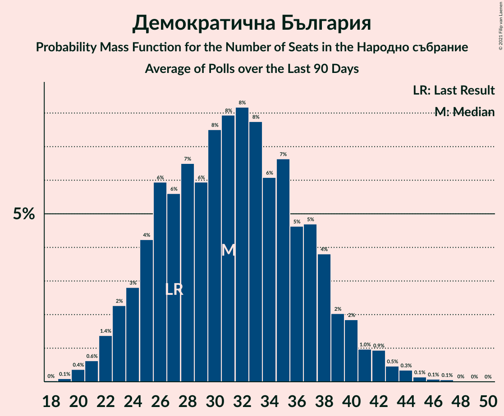

# Демократична България

<a href="#voting-intentions">Voting Intentions</a> | <a href="#seats">Seats</a>

## Voting Intentions

Last result: **9.3%** (General Election of 4 April 2021)

### Confidence Intervals

| Period     | Polling firm/Commissioner(s) | Median | 80% Confidence Interval | 90% Confidence Interval | 95% Confidence Interval | 99% Confidence Interval |
|:----------:|:----------------:|:-----------:|:-----------------------:|:-----------------------:|:-----------------------:|:-----------------------:|
| N/A | [Poll Average](average.html) | 11.9% | 9.7–14.3% | 9.2–14.9% | 8.8–15.5% | 8.1–16.6% |
| [3–7 July 2021](2021-07-07-Тренд.html) | Тренд   Nova | 12.3% | 10.6–14.4% | 10.2–15.0% | 9.8–15.5% | 9.0–16.5% |
| [4–7 July 2021](2021-07-07-Алфарисърч.html) | Алфа рисърч | 12.0% | 10.3–14.1% | 9.8–14.7% | 9.4–15.2% | 8.6–16.3% |
| [30 June–7 July 2021](2021-07-07-Gallup.html) | Gallup   BNR | 12.3% | 10.6–14.3% | 10.1–14.9% | 9.7–15.4% | 8.9–16.5% |
| [2–6 July 2021](2021-07-06-SovaHarris.html) | Sova Harris   Dir.bg | 10.7% | 9.1–12.7% | 8.6–13.2% | 8.3–13.7% | 7.5–14.7% |
| [1–5 July 2021](2021-07-05-Exacta.html) | Exacta | 12.9% | 11.1–15.0% | 10.6–15.6% | 10.2–16.2% | 9.4–17.2% |
| [26 June–2 July 2021](2021-07-02-Медиана.html) | Медиана | 10.0% | 8.8–11.4% | 8.5–11.8% | 8.2–12.1% | 7.7–12.8% |
| [23–30 June 2021](2021-06-30-Nasoca.html) | Nasoca | 11.2% | 9.6–13.2% | 9.2–13.7% | 8.8–14.2% | 8.1–15.2% |
| [18–25 June 2021](2021-06-25-MarketLinks.html) | Market Links   bTV | 13.3% | 11.7–15.2% | 11.2–15.7% | 10.9–16.2% | 10.1–17.1% |
| [11–18 June 2021](2021-06-18-Тренд.html) | Тренд   24 часа | 11.2% | 9.6–13.3% | 9.1–13.9% | 8.7–14.4% | 8.0–15.4% |
| [10–15 June 2021](2021-06-15-Медиана.html) | Медиана | 7.2% | 6.3–8.4% | 6.0–8.7% | 5.8–9.0% | 5.4–9.6% |
| [10–15 June 2021](2021-06-15-SovaHarris.html) | Sova Harris   Dir.bg | 11.2% | 9.5–13.2% | 9.0–13.8% | 8.7–14.3% | 7.9–15.3% |
| [3–11 June 2021](2021-06-11-Gallup.html) | Gallup   BNR | 12.1% | 10.5–13.9% | 10.0–14.5% | 9.7–14.9% | 9.0–15.9% |
| [30 May–7 June 2021](2021-06-07-Алфарисърч.html) | Алфа рисърч | 11.9% | 10.3–13.9% | 9.8–14.5% | 9.5–15.0% | 8.7–16.0% |
| [19–27 May 2021](2021-05-27-MarketLinks.html) | Market Links   bTV | 13.2% | 11.7–15.1% | 11.2–15.6% | 10.9–16.0% | 10.2–16.9% |
| [7–14 May 2021](2021-05-14-Gallup.html) | Gallup | 11.7% | 10.0–13.8% | 9.5–14.4% | 9.1–14.9% | 8.3–16.0% |
| [16–23 April 2021](2021-04-23-МаркетЛИНКС.html) | Маркет ЛИНКС   bTV | 13.1% | 11.5–15.0% | 11.1–15.5% | 10.7–16.0% | 10.0–16.9% |

### Probability Mass Function

The following table shows the probability mass function per percentage block of voting intentions for the [poll average](average.html) for Демократична България.

| Voting Intentions | Probability | Accumulated | Special Marks |
|:-----------------:|:-----------:|:-----------:|:-------------:|
| 5.5–6.5% | 0% | 100% |  |
| 6.5–7.5% | 0.1% | 100% |  |
| 7.5–8.5% | 1.4% | 99.9% |  |
| 8.5–9.5% | 7% | 98% | Last Result |
| 9.5–10.5% | 14% | 92% |  |
| 10.5–11.5% | 20% | 78% |  |
| 11.5–12.5% | 21% | 58% | Median |
| 12.5–13.5% | 18% | 37% |  |
| 13.5–14.5% | 11% | 19% |  |
| 14.5–15.5% | 5% | 7% |  |
| 15.5–16.5% | 2% | 2% |  |
| 16.5–17.5% | 0.4% | 0.5% |  |
| 17.5–18.5% | 0.1% | 0.1% |  |
| 18.5–19.5% | 0% | 0% |  |

## Seats

Last result: **27** seats (General Election of 4 April 2021)

### Confidence Intervals

| Period     | Polling firm/Commissioner(s) | Median | 80% Confidence Interval | 90% Confidence Interval | 95% Confidence Interval | 99% Confidence Interval |
|:----------:|:----------------:|:------:|:-----------------------:|:-----------------------:|:-----------------------:|:-----------------------:|
| N/A | [Poll Average](average.html) | 31 | 25–38 | 24–39 | 22–41 | 20–44 |
| [3–7 July 2021](2021-07-07-Тренд.html) | Тренд   Nova | 33 | 28–38 | 27–40 | 26–42 | 24–45 |
| [4–7 July 2021](2021-07-07-Алфарисърч.html) | Алфа рисърч | 31 | 27–37 | 25–38 | 24–40 | 22–43 |
| [30 June–7 July 2021](2021-07-07-Gallup.html) | Gallup   BNR | 33 | 28–38 | 26–39 | 25–40 | 23–44 |
| [2–6 July 2021](2021-07-06-SovaHarris.html) | Sova Harris   Dir.bg | 28 | 24–33 | 23–35 | 22–36 | 20–39 |
| [1–5 July 2021](2021-07-05-Exacta.html) | Exacta | 35 | 29–40 | 28–42 | 27–44 | 25–47 |
| [26 June–2 July 2021](2021-07-02-Медиана.html) | Медиана | 25 | 22–29 | 21–30 | 20–30 | 19–32 |
| [23–30 June 2021](2021-06-30-Nasoca.html) | Nasoca | 31 | 26–36 | 25–37 | 24–38 | 21–42 |
| [18–25 June 2021](2021-06-25-MarketLinks.html) | Market Links   bTV | 34 | 30–39 | 29–41 | 28–42 | 26–44 |
| [11–18 June 2021](2021-06-18-Тренд.html) | Тренд   24 часа | 31 | 26–37 | 25–38 | 24–39 | 22–42 |
| [10–15 June 2021](2021-06-15-Медиана.html) | Медиана | 18 | 15–21 | 15–22 | 14–22 | 13–24 |
| [10–15 June 2021](2021-06-15-SovaHarris.html) | Sova Harris   Dir.bg | 28 | 24–33 | 23–35 | 22–36 | 20–39 |
| [3–11 June 2021](2021-06-11-Gallup.html) | Gallup   BNR | 31 | 27–36 | 26–38 | 25–39 | 23–42 |
| [30 May–7 June 2021](2021-06-07-Алфарисърч.html) | Алфа рисърч | 35 | 30–41 | 29–42 | 28–44 | 26–47 |
| [19–27 May 2021](2021-05-27-MarketLinks.html) | Market Links   bTV | 35 | 31–39 | 29–41 | 28–42 | 26–44 |
| [7–14 May 2021](2021-05-14-Gallup.html) | Gallup | 32 | 27–37 | 25–39 | 25–40 | 23–43 |
| [16–23 April 2021](2021-04-23-МаркетЛИНКС.html) | Маркет ЛИНКС   bTV | 33 | 29–37 | 28–38 | 27–40 | 25–43 |

### Probability Mass Function

The following table shows the probability mass function per seat for the [poll average](average.html) for Демократична България.

| Number of Seats | Probability | Accumulated | Special Marks |
|:---------------:|:-----------:|:-----------:|:-------------:|
| 19 | 0.1% | 100% |  |
| 20 | 0.4% | 99.9% |  |
| 21 | 0.6% | 99.5% |  |
| 22 | 1.4% | 98.9% |  |
| 23 | 2% | 97% |  |
| 24 | 3% | 95% |  |
| 25 | 4% | 92% |  |
| 26 | 6% | 88% |  |
| 27 | 6% | 82% | Last Result |
| 28 | 7% | 77% |  |
| 29 | 6% | 70% |  |
| 30 | 8% | 64% |  |
| 31 | 8% | 57% | Median |
| 32 | 8% | 49% |  |
| 33 | 8% | 41% |  |
| 34 | 6% | 33% |  |
| 35 | 7% | 27% |  |
| 36 | 5% | 20% |  |
| 37 | 5% | 15% |  |
| 38 | 4% | 11% |  |
| 39 | 2% | 7% |  |
| 40 | 2% | 5% |  |
| 41 | 1.0% | 3% |  |
| 42 | 0.9% | 2% |  |
| 43 | 0.5% | 1.2% |  |
| 44 | 0.3% | 0.7% |  |
| 45 | 0.1% | 0.3% |  |
| 46 | 0.1% | 0.2% |  |
| 47 | 0.1% | 0.1% |  |
| 48 | 0% | 0.1% |  |
| 49 | 0% | 0% |  |

