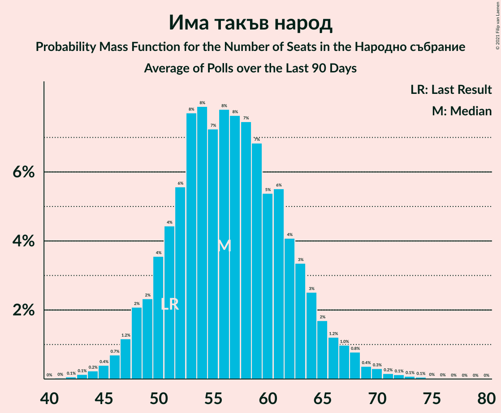

# Има такъв народ

<a href="#voting-intentions">Voting Intentions</a> | <a href="#seats">Seats</a>

## Voting Intentions

Last result: **17.4%** (General Election of 4 April 2021)

### Confidence Intervals

| Period     | Polling firm/Commissioner(s) | Median | 80% Confidence Interval | 90% Confidence Interval | 95% Confidence Interval | 99% Confidence Interval |
|:----------:|:----------------:|:-----------:|:-----------------------:|:-----------------------:|:-----------------------:|:-----------------------:|
| N/A | [Poll Average](average.html) | 21.6% | 19.2–23.9% | 18.6–24.6% | 18.0–25.3% | 16.9–26.5% |
| [3–7 July 2021](2021-07-07-Тренд.html) | Тренд   Nova | 21.3% | 19.1–23.8% | 18.5–24.5% | 18.0–25.1% | 17.0–26.3% |
| [4–7 July 2021](2021-07-07-Алфарисърч.html) | Алфа рисърч | 21.8% | 19.6–24.4% | 18.9–25.1% | 18.4–25.8% | 17.3–27.1% |
| [30 June–7 July 2021](2021-07-07-Gallup.html) | Gallup   BNR | 21.4% | 19.2–23.9% | 18.6–24.6% | 18.0–25.2% | 17.0–26.4% |
| [2–6 July 2021](2021-07-06-SovaHarris.html) | Sova Harris   Dir.bg | 22.2% | 19.9–24.7% | 19.3–25.4% | 18.7–26.0% | 17.7–27.3% |
| [1–5 July 2021](2021-07-05-Exacta.html) | Exacta | 20.7% | 18.5–23.3% | 17.9–24.0% | 17.4–24.6% | 16.3–25.8% |
| [26 June–2 July 2021](2021-07-02-Медиана.html) | Медиана | 21.7% | 20.1–23.6% | 19.6–24.1% | 19.2–24.5% | 18.4–25.4% |
| [23–30 June 2021](2021-06-30-Nasoca.html) | Nasoca | 20.6% | 18.4–23.0% | 17.8–23.7% | 17.3–24.2% | 16.4–25.4% |
| [18–25 June 2021](2021-06-25-MarketLinks.html) | Market Links   bTV | 22.0% | 19.9–24.2% | 19.4–24.8% | 18.9–25.4% | 17.9–26.5% |
| [11–18 June 2021](2021-06-18-Тренд.html) | Тренд   24 часа | 20.2% | 18.0–22.7% | 17.3–23.4% | 16.8–24.0% | 15.8–25.2% |
| [10–15 June 2021](2021-06-15-Медиана.html) | Медиана | 24.0% | 22.3–25.8% | 21.9–26.3% | 21.5–26.7% | 20.7–27.6% |
| [10–15 June 2021](2021-06-15-SovaHarris.html) | Sova Harris   Dir.bg | 21.7% | 19.4–24.2% | 18.8–25.0% | 18.2–25.6% | 17.2–26.8% |
| [3–11 June 2021](2021-06-11-Gallup.html) | Gallup   BNR | 21.2% | 19.2–23.5% | 18.6–24.2% | 18.1–24.7% | 17.2–25.8% |
| [30 May–7 June 2021](2021-06-07-Алфарисърч.html) | Алфа рисърч | 18.3% | 16.3–20.6% | 15.7–21.2% | 15.2–21.8% | 14.3–22.9% |
| [19–27 May 2021](2021-05-27-MarketLinks.html) | Market Links   bTV | 19.8% | 17.9–21.9% | 17.4–22.5% | 16.9–23.0% | 16.1–24.0% |
| [7–14 May 2021](2021-05-14-Gallup.html) | Gallup | 20.0% | 17.8–22.5% | 17.2–23.2% | 16.6–23.9% | 15.6–25.1% |
| [16–23 April 2021](2021-04-23-МаркетЛИНКС.html) | Маркет ЛИНКС   bTV | 22.3% | 20.3–24.5% | 19.7–25.2% | 19.2–25.7% | 18.3–26.8% |

### Probability Mass Function

The following table shows the probability mass function per percentage block of voting intentions for the [poll average](average.html) for Има такъв народ.

| Voting Intentions | Probability | Accumulated | Special Marks |
|:-----------------:|:-----------:|:-----------:|:-------------:|
| 14.5–15.5% | 0% | 100% |  |
| 15.5–16.5% | 0.2% | 100% |  |
| 16.5–17.5% | 1.0% | 99.7% | Last Result |
| 17.5–18.5% | 4% | 98.7% |  |
| 18.5–19.5% | 9% | 95% |  |
| 19.5–20.5% | 15% | 87% |  |
| 20.5–21.5% | 21% | 71% |  |
| 21.5–22.5% | 21% | 50% | Median |
| 22.5–23.5% | 15% | 29% |  |
| 23.5–24.5% | 9% | 14% |  |
| 24.5–25.5% | 4% | 5% |  |
| 25.5–26.5% | 1.3% | 2% |  |
| 26.5–27.5% | 0.4% | 0.5% |  |
| 27.5–28.5% | 0.1% | 0.1% |  |
| 28.5–29.5% | 0% | 0% |  |

## Seats

Last result: **51** seats (General Election of 4 April 2021)

### Confidence Intervals

| Period     | Polling firm/Commissioner(s) | Median | 80% Confidence Interval | 90% Confidence Interval | 95% Confidence Interval | 99% Confidence Interval |
|:----------:|:----------------:|:------:|:-----------------------:|:-----------------------:|:-----------------------:|:-----------------------:|
| N/A | [Poll Average](average.html) | 56 | 50–63 | 49–65 | 47–67 | 45–70 |
| [3–7 July 2021](2021-07-07-Тренд.html) | Тренд   Nova | 57 | 51–64 | 49–66 | 48–68 | 45–71 |
| [4–7 July 2021](2021-07-07-Алфарисърч.html) | Алфа рисърч | 57 | 50–64 | 48–66 | 48–68 | 45–72 |
| [30 June–7 July 2021](2021-07-07-Gallup.html) | Gallup   BNR | 56 | 50–63 | 48–65 | 47–67 | 44–70 |
| [2–6 July 2021](2021-07-06-SovaHarris.html) | Sova Harris   Dir.bg | 58 | 52–65 | 50–67 | 49–69 | 46–73 |
| [1–5 July 2021](2021-07-05-Exacta.html) | Exacta | 56 | 49–62 | 47–64 | 46–66 | 43–70 |
| [26 June–2 July 2021](2021-07-02-Медиана.html) | Медиана | 54 | 50–59 | 49–61 | 48–62 | 46–64 |
| [23–30 June 2021](2021-06-30-Nasoca.html) | Nasoca | 56 | 50–62 | 48–64 | 46–66 | 44–70 |
| [18–25 June 2021](2021-06-25-MarketLinks.html) | Market Links   bTV | 57 | 51–63 | 50–64 | 48–66 | 46–69 |
| [11–18 June 2021](2021-06-18-Тренд.html) | Тренд   24 часа | 56 | 48–64 | 46–66 | 45–67 | 44–69 |
| [10–15 June 2021](2021-06-15-Медиана.html) | Медиана | 59 | 55–63 | 54–65 | 53–66 | 51–68 |
| [10–15 June 2021](2021-06-15-SovaHarris.html) | Sova Harris   Dir.bg | 54 | 49–61 | 47–63 | 45–64 | 43–68 |
| [3–11 June 2021](2021-06-11-Gallup.html) | Gallup   BNR | 59 | 52–64 | 51–65 | 49–67 | 46–69 |
| [30 May–7 June 2021](2021-06-07-Алфарисърч.html) | Алфа рисърч | 54 | 47–61 | 46–63 | 44–64 | 41–68 |
| [19–27 May 2021](2021-05-27-MarketLinks.html) | Market Links   bTV | 52 | 46–57 | 44–58 | 44–60 | 42–63 |
| [7–14 May 2021](2021-05-14-Gallup.html) | Gallup | 55 | 48–60 | 46–62 | 45–64 | 41–68 |
| [16–23 April 2021](2021-04-23-МаркетЛИНКС.html) | Маркет ЛИНКС   bTV | 56 | 51–62 | 50–64 | 48–65 | 46–68 |

### Probability Mass Function

The following table shows the probability mass function per seat for the [poll average](average.html) for Има такъв народ.

| Number of Seats | Probability | Accumulated | Special Marks |
|:---------------:|:-----------:|:-----------:|:-------------:|
| 41 | 0% | 100% |  |
| 42 | 0.1% | 99.9% |  |
| 43 | 0.1% | 99.9% |  |
| 44 | 0.2% | 99.7% |  |
| 45 | 0.4% | 99.5% |  |
| 46 | 0.7% | 99.1% |  |
| 47 | 1.2% | 98% |  |
| 48 | 2% | 97% |  |
| 49 | 2% | 95% |  |
| 50 | 4% | 93% |  |
| 51 | 4% | 89% | Last Result |
| 52 | 6% | 85% |  |
| 53 | 8% | 79% |  |
| 54 | 8% | 72% |  |
| 55 | 7% | 64% |  |
| 56 | 8% | 56% | Median |
| 57 | 8% | 49% |  |
| 58 | 7% | 41% |  |
| 59 | 7% | 34% |  |
| 60 | 5% | 27% |  |
| 61 | 6% | 21% |  |
| 62 | 4% | 16% |  |
| 63 | 3% | 12% |  |
| 64 | 3% | 8% |  |
| 65 | 2% | 6% |  |
| 66 | 1.2% | 4% |  |
| 67 | 1.0% | 3% |  |
| 68 | 0.8% | 2% |  |
| 69 | 0.4% | 1.2% |  |
| 70 | 0.3% | 0.8% |  |
| 71 | 0.2% | 0.5% |  |
| 72 | 0.1% | 0.3% |  |
| 73 | 0.1% | 0.2% |  |
| 74 | 0.1% | 0.1% |  |
| 75 | 0% | 0.1% |  |
| 76 | 0% | 0% |  |

