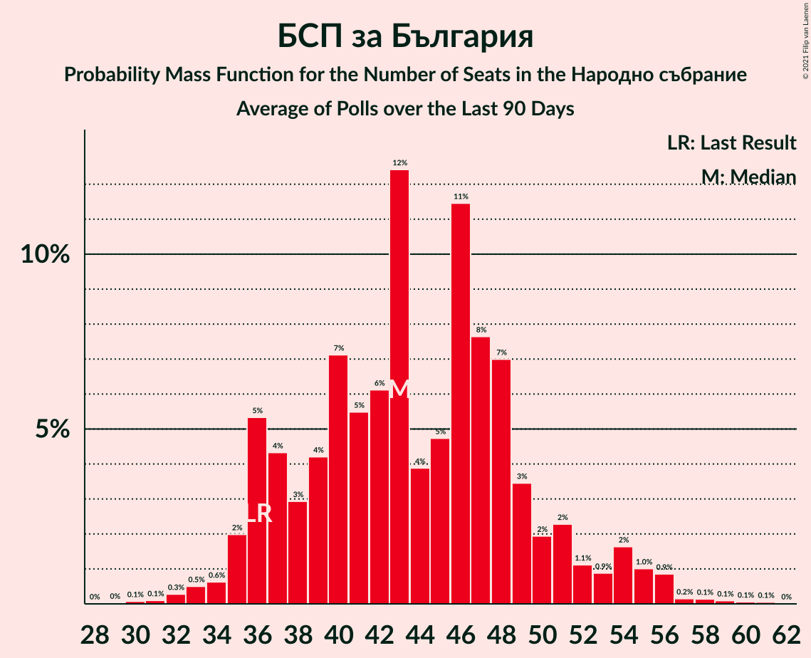
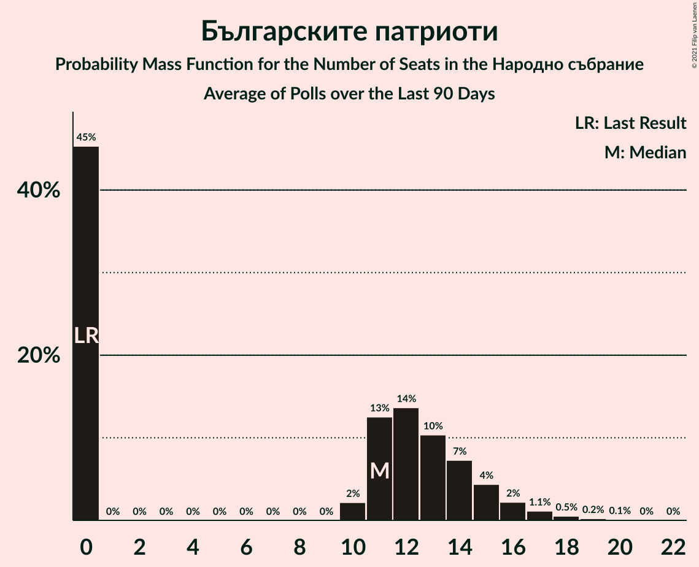
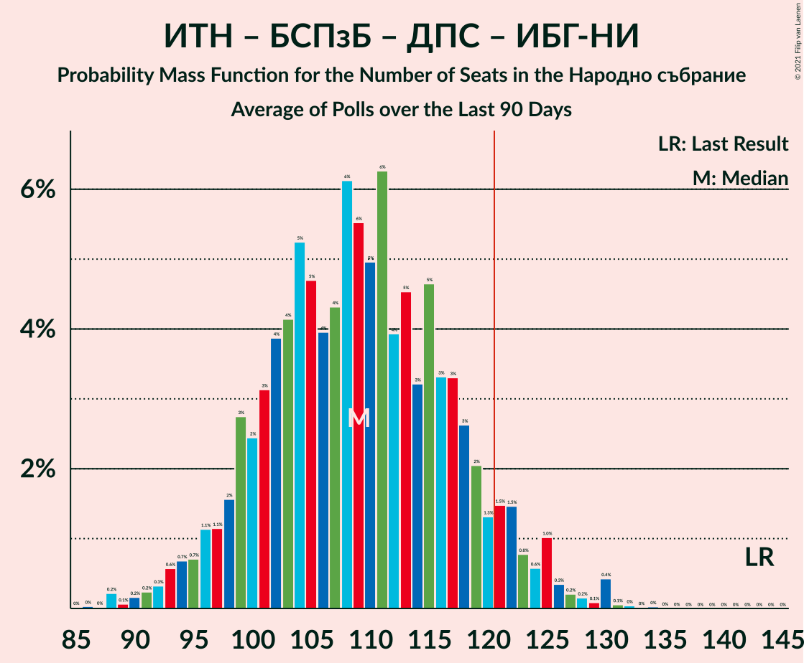
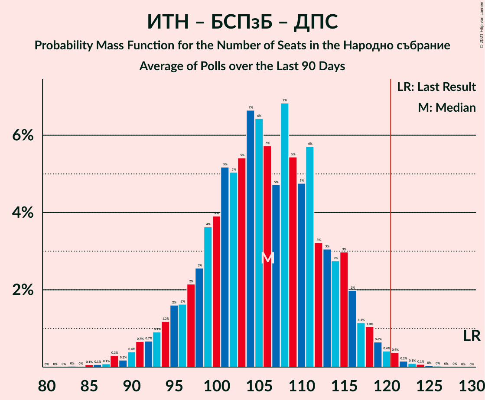
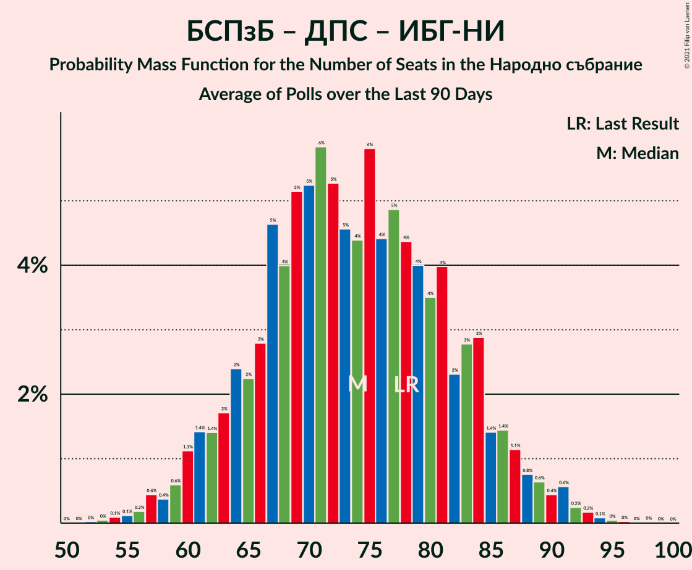
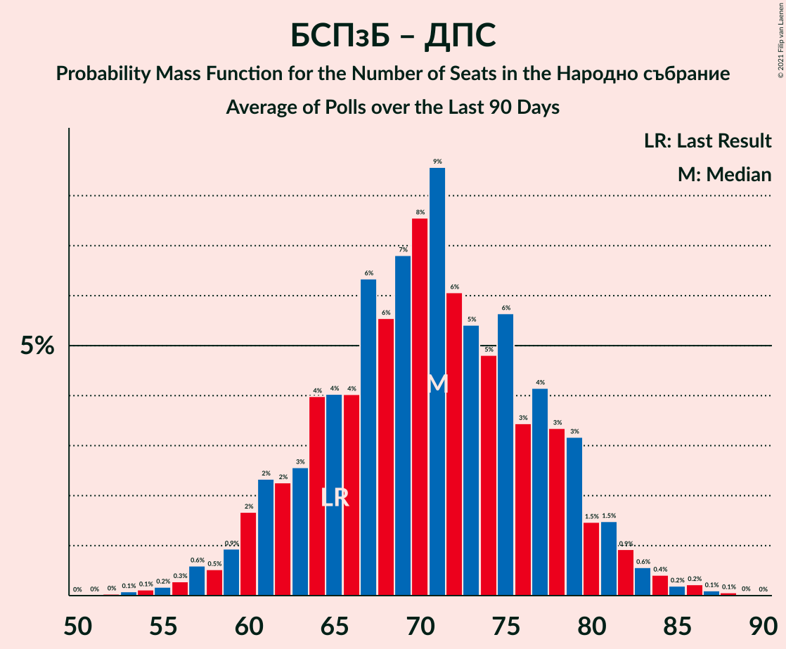

# Poll Average

<a href="#voting-intentions">Voting Intentions</a> | <a href="#seats">Seats</a> | <a href="#coalitions">Coalitions</a> | <a href="#technical-information">Technical Information</a>

## Summary

The table below lists the polls on which the average is based. They are the most recent polls (less than 90 days old) registered and analyzed so far.

| Period     | Polling firm/Commissioner(s) | ИТН | ГЕРБ | БСПзБ | ДБ | ДПС | ИБГ-НИ | БП | ВМРО–БНД | В | ПП |
|:----------:|:----------------------------:|:--:|:--:|:--:|:--:|:--:|:--:|:--:|:--:|:--:|:--:|
| 11 July 2021 | General Election | 23.8%   65 | 23.2%   63 | 13.2%   36 | 12.5%   34 | 10.6%   29 | 5.0%   13 | 3.1%   0 | 3.1%   0 | 3.0%   0 | 0.0%   0 |
| N/A | Poll Average | 10–18%   28–45 | 20–28%   53–72 | 13–22%   35–53 | 8–13%   19–37 | 7–13%   17–37 | 2–6%   0–16 | N/A   N/A | 0–4%   0 | 1–4%   0–11 | 11–18%   30–46 |
| [10–17 October 2021](2021-10-17-Gallup.html) | Gallup   BNR | 10–15%   26–42 | 19–26%   52–70 | 12–18%   33–51 | 9–14%   24–39 | 8–14%   23–38 | 2–6%   0–15 | N/A   N/A | 1–4%   0–11 | 2–5%   0–12 | 11–16%   30–45 |
| [5–12 October 2021](2021-10-12-SovaHarris.html) | Sova Harris   Dir.bg | 12–18%   29–46 | 21–28%   53–70 | 16–23%   41–57 | 7–12%   17–30 | 7–12%   16–30 | 3–6%   0–16 | N/A   N/A | 1–3%   0 | 1–4%   0 | 12–18%   29–46 |
| [6–12 October 2021](2021-10-12-Exacta.html) | Exacta | 12–19%   34–48 | 20–27%   55–72 | 12–18%   35–49 | 8–13%   22–36 | 7–12%   21–31 | 2–4%   0 | N/A   N/A | 1–4%   0 | 1–3%   0 | 12–19%   33–47 |
| [6–10 October 2021](2021-10-10-Центързаанализиимаркетинг.html) | Център за анализи и маркетинг | 10–15%   28–36 | 23–29%   62–73 | 14–19%   39–51 | 9–13%   24–33 | 10–14%   26–37 | 2–5%   0 | N/A   N/A | 0–2%   0 | 1–3%   0 | 11–16%   30–40 |
| [4–10 October 2021](2021-10-10-Алфарисърч.html) | Алфа рисърч | N/A   N/A | N/A   N/A | N/A   N/A | N/A   N/A | N/A   N/A | N/A   N/A | N/A   N/A | N/A   N/A | N/A   N/A | N/A   N/A |
| [14–20 September 2021](2021-09-20-МаркетЛИНКС.html) | Маркет ЛИНКС   bTV | N/A   N/A | N/A   N/A | N/A   N/A | N/A   N/A | N/A   N/A | N/A   N/A | N/A   N/A | N/A   N/A | N/A   N/A | N/A   N/A |
| 11 July 2021 | General Election | 23.8%   65 | 23.2%   63 | 13.2%   36 | 12.5%   34 | 10.6%   29 | 5.0%   13 | 3.1%   0 | 3.1%   0 | 3.0%   0 | 0.0%   0 |

Only polls for which at least the sample size has been published are included in the table above.

**Legend:**
+ **Top half of each row:** Voting intentions (95% confidence interval)
+ **Bottom half of each row:** Seat projections for the Народно събрание (95% confidence interval)
+ **ИТН:** Има такъв народ
+ **ГЕРБ:** Граждани за европейско развитие на България
+ **БСПзБ:** БСП за България
+ **ДБ:** Демократична България
+ **ДПС:** Движение за права и свободи
+ **ИБГ-НИ:** Изправи се БГ! Ние идваме!
+ **БП:** Българските патриоти
+ **ВМРО–БНД:** ВМРО–Българско Национално Движение
+ **В:** Възраждане
+ **ПП:** Продължаваме промяната
+ **N/A (single party):** Party not included the published results
+ **N/A (entire row):** Calculation for this opinion poll not started yet

## Voting Intentions

### Confidence Intervals

| Party | Last Result | Median | 80% Confidence Interval | 90% Confidence Interval | 95% Confidence Interval | 99% Confidence Interval |
|:-----:|:-----------:|:------:|:-----------------------:|:-----------------------:|:-----------------------:|:-----------------------:|
| <a href="#има-такъв-народ">Има такъв народ</a> | 23.8% | 13.5% | 11.3–16.3% |10.8–17.0% | 10.3–17.7% | 9.5–18.9% |
| <a href="#граждани-за-европейско-развитие-на-българия">Граждани за европейско развитие на България</a> | 23.2% | 24.1% | 21.3–26.7% |20.6–27.4% | 20.0–28.0% | 18.8–29.2% |
| <a href="#бсп-за-българия">БСП за България</a> | 13.2% | 16.4% | 13.8–19.9% |13.2–20.9% | 12.7–21.6% | 11.7–23.0% |
| <a href="#демократична-българия">Демократична България</a> | 12.5% | 10.4% | 8.6–12.3% |8.0–12.9% | 7.6–13.4% | 6.9–14.4% |
| <a href="#движение-за-права-и-свободи">Движение за права и свободи</a> | 10.6% | 10.2% | 8.1–12.4% |7.6–13.0% | 7.2–13.4% | 6.5–14.3% |
| <a href="#изправи-се-бг!-ние-идваме!">Изправи се БГ! Ние идваме!</a> | 5.0% | 3.6% | 2.4–4.9% |2.1–5.4% | 1.9–5.7% | 1.5–6.5% |
| <a href="#българските-патриоти">Българските патриоти</a> | 3.1% | N/A | N/A |N/A | N/A | N/A |
| <a href="#вмро–българско-национално-движение">ВМРО–Българско Национално Движение</a> | 3.1% | 2.0% | 0.7–3.2% |0.6–3.5% | 0.5–3.8% | 0.3–4.4% |
| <a href="#възраждане">Възраждане</a> | 3.0% | 2.1% | 1.4–3.4% |1.2–3.8% | 1.1–4.1% | 0.8–4.8% |
| <a href="#продължаваме-промяната">Продължаваме промяната</a> | 0.0% | 14.3% | 12.3–16.6% |11.8–17.3% | 11.3–17.9% | 10.5–19.1% |

### Има такъв народ

*For a full overview of the results for this party, see the [Има такъв народ](party-иматакъвнарод.html) page.*

| Voting Intentions | Probability | Accumulated | Special Marks |
|:-----------------:|:-----------:|:-----------:|:-------------:|
| 7.5–8.5% | 0% | 100% |  |
| 8.5–9.5% | 0.5% | 100% |  |
| 9.5–10.5% | 3% | 99.5% |  |
| 10.5–11.5% | 10% | 96% |  |
| 11.5–12.5% | 17% | 87% |  |
| 12.5–13.5% | 20% | 69% |  |
| 13.5–14.5% | 18% | 50% | Median |
| 14.5–15.5% | 14% | 32% |  |
| 15.5–16.5% | 10% | 18% |  |
| 16.5–17.5% | 5% | 8% |  |
| 17.5–18.5% | 2% | 3% |  |
| 18.5–19.5% | 0.6% | 0.8% |  |
| 19.5–20.5% | 0.1% | 0.2% |  |
| 20.5–21.5% | 0% | 0% |  |
| 21.5–22.5% | 0% | 0% |  |
| 22.5–23.5% | 0% | 0% |  |
| 23.5–24.5% | 0% | 0% | Last Result |

### Граждани за европейско развитие на България

*For a full overview of the results for this party, see the [Граждани за европейско развитие на България](party-гражданизаевропейскоразвитиенабългария.html) page.*

| Voting Intentions | Probability | Accumulated | Special Marks |
|:-----------------:|:-----------:|:-----------:|:-------------:|
| 16.5–17.5% | 0% | 100% |  |
| 17.5–18.5% | 0.3% | 100% |  |
| 18.5–19.5% | 1.2% | 99.7% |  |
| 19.5–20.5% | 3% | 98.5% |  |
| 20.5–21.5% | 7% | 95% |  |
| 21.5–22.5% | 12% | 88% |  |
| 22.5–23.5% | 16% | 76% | Last Result |
| 23.5–24.5% | 18% | 60% | Median |
| 24.5–25.5% | 17% | 41% |  |
| 25.5–26.5% | 13% | 25% |  |
| 26.5–27.5% | 7% | 12% |  |
| 27.5–28.5% | 3% | 4% |  |
| 28.5–29.5% | 1.0% | 1.3% |  |
| 29.5–30.5% | 0.2% | 0.3% |  |
| 30.5–31.5% | 0% | 0% |  |
| 31.5–32.5% | 0% | 0% |  |

### БСП за България

*For a full overview of the results for this party, see the [БСП за България](party-бспзабългария.html) page.*

| Voting Intentions | Probability | Accumulated | Special Marks |
|:-----------------:|:-----------:|:-----------:|:-------------:|
| 9.5–10.5% | 0% | 100% |  |
| 10.5–11.5% | 0.3% | 100% |  |
| 11.5–12.5% | 2% | 99.6% |  |
| 12.5–13.5% | 5% | 98% | Last Result |
| 13.5–14.5% | 11% | 93% |  |
| 14.5–15.5% | 16% | 81% |  |
| 15.5–16.5% | 18% | 65% | Median |
| 16.5–17.5% | 15% | 47% |  |
| 17.5–18.5% | 11% | 32% |  |
| 18.5–19.5% | 8% | 21% |  |
| 19.5–20.5% | 6% | 12% |  |
| 20.5–21.5% | 4% | 6% |  |
| 21.5–22.5% | 2% | 3% |  |
| 22.5–23.5% | 0.7% | 0.9% |  |
| 23.5–24.5% | 0.2% | 0.2% |  |
| 24.5–25.5% | 0% | 0% |  |
| 25.5–26.5% | 0% | 0% |  |

### Демократична България

*For a full overview of the results for this party, see the [Демократична България](party-демократичнабългария.html) page.*

| Voting Intentions | Probability | Accumulated | Special Marks |
|:-----------------:|:-----------:|:-----------:|:-------------:|
| 4.5–5.5% | 0% | 100% |  |
| 5.5–6.5% | 0.2% | 100% |  |
| 6.5–7.5% | 2% | 99.8% |  |
| 7.5–8.5% | 8% | 98% |  |
| 8.5–9.5% | 17% | 90% |  |
| 9.5–10.5% | 25% | 73% | Median |
| 10.5–11.5% | 25% | 47% |  |
| 11.5–12.5% | 15% | 23% | Last Result |
| 12.5–13.5% | 6% | 8% |  |
| 13.5–14.5% | 2% | 2% |  |
| 14.5–15.5% | 0.3% | 0.4% |  |
| 15.5–16.5% | 0% | 0.1% |  |
| 16.5–17.5% | 0% | 0% |  |

### Движение за права и свободи

*For a full overview of the results for this party, see the [Движение за права и свободи](party-движениезаправаисвободи.html) page.*

| Voting Intentions | Probability | Accumulated | Special Marks |
|:-----------------:|:-----------:|:-----------:|:-------------:|
| 4.5–5.5% | 0% | 100% |  |
| 5.5–6.5% | 0.5% | 100% |  |
| 6.5–7.5% | 4% | 99.5% |  |
| 7.5–8.5% | 12% | 96% |  |
| 8.5–9.5% | 19% | 84% |  |
| 9.5–10.5% | 21% | 65% | Median |
| 10.5–11.5% | 20% | 43% | Last Result |
| 11.5–12.5% | 14% | 23% |  |
| 12.5–13.5% | 7% | 9% |  |
| 13.5–14.5% | 2% | 2% |  |
| 14.5–15.5% | 0.3% | 0.3% |  |
| 15.5–16.5% | 0% | 0% |  |

### Изправи се БГ! Ние идваме!

*For a full overview of the results for this party, see the [Изправи се БГ! Ние идваме!](party-изправисебгниеидваме.html) page.*

| Voting Intentions | Probability | Accumulated | Special Marks |
|:-----------------:|:-----------:|:-----------:|:-------------:|
| 0.0–0.5% | 0% | 100% |  |
| 0.5–1.5% | 0.7% | 100% |  |
| 1.5–2.5% | 12% | 99.3% |  |
| 2.5–3.5% | 36% | 87% |  |
| 3.5–4.5% | 33% | 50% | Median |
| 4.5–5.5% | 13% | 17% | Last Result |
| 5.5–6.5% | 3% | 4% |  |
| 6.5–7.5% | 0.4% | 0.4% |  |
| 7.5–8.5% | 0% | 0% |  |

### ВМРО–Българско Национално Движение

*For a full overview of the results for this party, see the [ВМРО–Българско Национално Движение](party-вмро–българсконационалнодвижение.html) page.*

| Voting Intentions | Probability | Accumulated | Special Marks |
|:-----------------:|:-----------:|:-----------:|:-------------:|
| 0.0–0.5% | 4% | 100% |  |
| 0.5–1.5% | 29% | 96% |  |
| 1.5–2.5% | 39% | 67% | Median |
| 2.5–3.5% | 23% | 28% | Last Result |
| 3.5–4.5% | 4% | 5% |  |
| 4.5–5.5% | 0.3% | 0.4% |  |
| 5.5–6.5% | 0% | 0% |  |

### Възраждане

*For a full overview of the results for this party, see the [Възраждане](party-възраждане.html) page.*

| Voting Intentions | Probability | Accumulated | Special Marks |
|:-----------------:|:-----------:|:-----------:|:-------------:|
| 0.0–0.5% | 0% | 100% |  |
| 0.5–1.5% | 18% | 100% |  |
| 1.5–2.5% | 51% | 82% | Median |
| 2.5–3.5% | 24% | 31% | Last Result |
| 3.5–4.5% | 6% | 7% |  |
| 4.5–5.5% | 0.8% | 0.9% |  |
| 5.5–6.5% | 0.1% | 0.1% |  |
| 6.5–7.5% | 0% | 0% |  |

### Продължаваме промяната

*For a full overview of the results for this party, see the [Продължаваме промяната](party-продължавамепромяната.html) page.*

| Voting Intentions | Probability | Accumulated | Special Marks |
|:-----------------:|:-----------:|:-----------:|:-------------:|
| 0.0–0.5% | 0% | 100% | Last Result |
| 0.5–1.5% | 0% | 100% |  |
| 1.5–2.5% | 0% | 100% |  |
| 2.5–3.5% | 0% | 100% |  |
| 3.5–4.5% | 0% | 100% |  |
| 4.5–5.5% | 0% | 100% |  |
| 5.5–6.5% | 0% | 100% |  |
| 6.5–7.5% | 0% | 100% |  |
| 7.5–8.5% | 0% | 100% |  |
| 8.5–9.5% | 0% | 100% |  |
| 9.5–10.5% | 0.5% | 100% |  |
| 10.5–11.5% | 3% | 99.4% |  |
| 11.5–12.5% | 10% | 96% |  |
| 12.5–13.5% | 20% | 86% |  |
| 13.5–14.5% | 23% | 67% | Median |
| 14.5–15.5% | 19% | 43% |  |
| 15.5–16.5% | 13% | 24% |  |
| 16.5–17.5% | 7% | 11% |  |
| 17.5–18.5% | 3% | 4% |  |
| 18.5–19.5% | 0.9% | 1.1% |  |
| 19.5–20.5% | 0.2% | 0.3% |  |
| 20.5–21.5% | 0% | 0% |  |
| 21.5–22.5% | 0% | 0% |  |

## Seats

### Confidence Intervals

| Party | Last Result | Median | 80% Confidence Interval | 90% Confidence Interval | 95% Confidence Interval | 99% Confidence Interval |
|:-----:|:-----------:|:------:|:-----------------------:|:-----------------------:|:-----------------------:|:-----------------------:|
| <a href="#има-такъв-народ">Има такъв народ</a> | 65 | 36 | 30–44 |29–44 | 28–45 | 26–50 |
| <a href="#граждани-за-европейско-развитие-на-българия">Граждани за европейско развитие на България</a> | 63 | 64 | 57–70 |54–72 | 53–72 | 50–74 |
| <a href="#бсп-за-българия">БСП за България</a> | 36 | 44 | 37–51 |36–52 | 35–53 | 32–57 |
| <a href="#демократична-българия">Демократична България</a> | 34 | 27 | 21–32 |20–34 | 19–37 | 17–39 |
| <a href="#движение-за-права-и-свободи">Движение за права и свободи</a> | 29 | 27 | 20–34 |19–36 | 17–37 | 15–39 |
| <a href="#изправи-се-бг!-ние-идваме!">Изправи се БГ! Ние идваме!</a> | 13 | 0 | 0–13 |0–14 | 0–16 | 0–17 |
| <a href="#българските-патриоти">Българските патриоти</a> | 0 | N/A | N/A |N/A | N/A | N/A |
| <a href="#вмро–българско-национално-движение">ВМРО–Българско Национално Движение</a> | 0 | 0 | 0 |0 | 0 | 0–12 |
| <a href="#възраждане">Възраждане</a> | 0 | 0 | 0 |0 | 0–11 | 0–12 |
| <a href="#продължаваме-промяната">Продължаваме промяната</a> | 0 | 38 | 33–42 |31–44 | 30–46 | 28–48 |

### Има такъв народ

*For a full overview of the results for this party, see the [Има такъв народ](party-иматакъвнарод.html) page.*

| Number of Seats | Probability | Accumulated | Special Marks |
|:---------------:|:-----------:|:-----------:|:-------------:|
| 24 | 0.1% | 100% |  |
| 25 | 0.2% | 99.9% |  |
| 26 | 0.4% | 99.7% |  |
| 27 | 0.6% | 99.2% |  |
| 28 | 2% | 98.6% |  |
| 29 | 4% | 96% |  |
| 30 | 6% | 93% |  |
| 31 | 3% | 87% |  |
| 32 | 10% | 84% |  |
| 33 | 9% | 74% |  |
| 34 | 6% | 65% |  |
| 35 | 4% | 59% |  |
| 36 | 6% | 56% | Median |
| 37 | 7% | 50% |  |
| 38 | 9% | 42% |  |
| 39 | 4% | 34% |  |
| 40 | 6% | 29% |  |
| 41 | 3% | 23% |  |
| 42 | 4% | 20% |  |
| 43 | 2% | 16% |  |
| 44 | 11% | 15% |  |
| 45 | 1.1% | 3% |  |
| 46 | 1.0% | 2% |  |
| 47 | 0.2% | 1.3% |  |
| 48 | 0.3% | 1.0% |  |
| 49 | 0.2% | 0.8% |  |
| 50 | 0.1% | 0.6% |  |
| 51 | 0.2% | 0.4% |  |
| 52 | 0.1% | 0.2% |  |
| 53 | 0% | 0.1% |  |
| 54 | 0% | 0.1% |  |
| 55 | 0.1% | 0.1% |  |
| 56 | 0% | 0% |  |
| 57 | 0% | 0% |  |
| 58 | 0% | 0% |  |
| 59 | 0% | 0% |  |
| 60 | 0% | 0% |  |
| 61 | 0% | 0% |  |
| 62 | 0% | 0% |  |
| 63 | 0% | 0% |  |
| 64 | 0% | 0% |  |
| 65 | 0% | 0% | Last Result |

### Граждани за европейско развитие на България

*For a full overview of the results for this party, see the [Граждани за европейско развитие на България](party-гражданизаевропейскоразвитиенабългария.html) page.*

| Number of Seats | Probability | Accumulated | Special Marks |
|:---------------:|:-----------:|:-----------:|:-------------:|
| 47 | 0.2% | 100% |  |
| 48 | 0.1% | 99.8% |  |
| 49 | 0.1% | 99.7% |  |
| 50 | 0.1% | 99.6% |  |
| 51 | 0.4% | 99.5% |  |
| 52 | 0.9% | 99.1% |  |
| 53 | 2% | 98% |  |
| 54 | 2% | 96% |  |
| 55 | 2% | 94% |  |
| 56 | 2% | 92% |  |
| 57 | 1.4% | 90% |  |
| 58 | 4% | 89% |  |
| 59 | 4% | 85% |  |
| 60 | 4% | 81% |  |
| 61 | 6% | 76% |  |
| 62 | 8% | 71% |  |
| 63 | 4% | 63% | Last Result |
| 64 | 15% | 59% | Median |
| 65 | 6% | 44% |  |
| 66 | 12% | 38% |  |
| 67 | 3% | 26% |  |
| 68 | 6% | 23% |  |
| 69 | 3% | 17% |  |
| 70 | 6% | 14% |  |
| 71 | 3% | 8% |  |
| 72 | 4% | 5% |  |
| 73 | 0.3% | 2% |  |
| 74 | 0.8% | 1.3% |  |
| 75 | 0.2% | 0.5% |  |
| 76 | 0.1% | 0.3% |  |
| 77 | 0.1% | 0.2% |  |
| 78 | 0% | 0.1% |  |
| 79 | 0% | 0.1% |  |
| 80 | 0% | 0% |  |

### БСП за България

*For a full overview of the results for this party, see the [БСП за България](party-бспзабългария.html) page.*

| Number of Seats | Probability | Accumulated | Special Marks |
|:---------------:|:-----------:|:-----------:|:-------------:|
| 30 | 0.1% | 100% |  |
| 31 | 0.1% | 99.9% |  |
| 32 | 0.3% | 99.8% |  |
| 33 | 0.5% | 99.5% |  |
| 34 | 0.1% | 99.0% |  |
| 35 | 2% | 98.9% |  |
| 36 | 4% | 97% | Last Result |
| 37 | 4% | 93% |  |
| 38 | 2% | 89% |  |
| 39 | 4% | 88% |  |
| 40 | 10% | 84% |  |
| 41 | 3% | 74% |  |
| 42 | 4% | 71% |  |
| 43 | 16% | 67% |  |
| 44 | 5% | 51% | Median |
| 45 | 7% | 46% |  |
| 46 | 6% | 39% |  |
| 47 | 7% | 34% |  |
| 48 | 5% | 27% |  |
| 49 | 3% | 22% |  |
| 50 | 5% | 19% |  |
| 51 | 8% | 14% |  |
| 52 | 1.4% | 6% |  |
| 53 | 2% | 4% |  |
| 54 | 0.7% | 2% |  |
| 55 | 0.2% | 1.2% |  |
| 56 | 0.1% | 0.9% |  |
| 57 | 0.4% | 0.8% |  |
| 58 | 0.1% | 0.4% |  |
| 59 | 0% | 0.3% |  |
| 60 | 0% | 0.3% |  |
| 61 | 0.2% | 0.2% |  |
| 62 | 0% | 0% |  |

### Демократична България

*For a full overview of the results for this party, see the [Демократична България](party-демократичнабългария.html) page.*

| Number of Seats | Probability | Accumulated | Special Marks |
|:---------------:|:-----------:|:-----------:|:-------------:|
| 15 | 0% | 100% |  |
| 16 | 0.2% | 99.9% |  |
| 17 | 0.8% | 99.8% |  |
| 18 | 0.7% | 99.0% |  |
| 19 | 2% | 98% |  |
| 20 | 4% | 97% |  |
| 21 | 4% | 92% |  |
| 22 | 2% | 88% |  |
| 23 | 3% | 86% |  |
| 24 | 3% | 83% |  |
| 25 | 9% | 79% |  |
| 26 | 6% | 71% |  |
| 27 | 20% | 64% | Median |
| 28 | 7% | 44% |  |
| 29 | 13% | 38% |  |
| 30 | 5% | 25% |  |
| 31 | 8% | 19% |  |
| 32 | 2% | 11% |  |
| 33 | 4% | 9% |  |
| 34 | 0.7% | 5% | Last Result |
| 35 | 1.0% | 4% |  |
| 36 | 0.9% | 3% |  |
| 37 | 0.5% | 3% |  |
| 38 | 0.9% | 2% |  |
| 39 | 0.7% | 1.1% |  |
| 40 | 0.1% | 0.4% |  |
| 41 | 0.1% | 0.3% |  |
| 42 | 0.1% | 0.2% |  |
| 43 | 0.1% | 0.1% |  |
| 44 | 0% | 0% |  |

### Движение за права и свободи

*For a full overview of the results for this party, see the [Движение за права и свободи](party-движениезаправаисвободи.html) page.*

| Number of Seats | Probability | Accumulated | Special Marks |
|:---------------:|:-----------:|:-----------:|:-------------:|
| 15 | 0.5% | 100% |  |
| 16 | 0.2% | 99.4% |  |
| 17 | 2% | 99.2% |  |
| 18 | 0.5% | 97% |  |
| 19 | 6% | 97% |  |
| 20 | 1.1% | 91% |  |
| 21 | 2% | 90% |  |
| 22 | 2% | 88% |  |
| 23 | 3% | 86% |  |
| 24 | 15% | 83% |  |
| 25 | 10% | 68% |  |
| 26 | 7% | 58% |  |
| 27 | 8% | 51% | Median |
| 28 | 6% | 43% |  |
| 29 | 7% | 37% | Last Result |
| 30 | 9% | 30% |  |
| 31 | 4% | 21% |  |
| 32 | 4% | 17% |  |
| 33 | 2% | 13% |  |
| 34 | 0.7% | 10% |  |
| 35 | 5% | 10% |  |
| 36 | 2% | 5% |  |
| 37 | 2% | 3% |  |
| 38 | 0.8% | 1.3% |  |
| 39 | 0.4% | 0.5% |  |
| 40 | 0.1% | 0.1% |  |
| 41 | 0% | 0.1% |  |
| 42 | 0% | 0% |  |

### Изправи се БГ! Ние идваме!

*For a full overview of the results for this party, see the [Изправи се БГ! Ние идваме!](party-изправисебгниеидваме.html) page.*

| Number of Seats | Probability | Accumulated | Special Marks |
|:---------------:|:-----------:|:-----------:|:-------------:|
| 0 | 75% | 100% | Median |
| 1 | 0% | 25% |  |
| 2 | 0% | 25% |  |
| 3 | 0% | 25% |  |
| 4 | 0% | 25% |  |
| 5 | 0% | 25% |  |
| 6 | 0% | 25% |  |
| 7 | 0% | 25% |  |
| 8 | 0% | 25% |  |
| 9 | 0% | 25% |  |
| 10 | 2% | 25% |  |
| 11 | 4% | 23% |  |
| 12 | 8% | 19% |  |
| 13 | 3% | 11% | Last Result |
| 14 | 4% | 8% |  |
| 15 | 1.1% | 4% |  |
| 16 | 2% | 3% |  |
| 17 | 0.3% | 0.5% |  |
| 18 | 0.1% | 0.2% |  |
| 19 | 0.1% | 0.1% |  |
| 20 | 0% | 0% |  |

### Българските патриоти

*For a full overview of the results for this party, see the [Българските патриоти](party-българскитепатриоти.html) page.*

### ВМРО–Българско Национално Движение

*For a full overview of the results for this party, see the [ВМРО–Българско Национално Движение](party-вмро–българсконационалнодвижение.html) page.*

| Number of Seats | Probability | Accumulated | Special Marks |
|:---------------:|:-----------:|:-----------:|:-------------:|
| 0 | 98% | 100% | Last Result, Median |
| 1 | 0% | 2% |  |
| 2 | 0% | 2% |  |
| 3 | 0% | 2% |  |
| 4 | 0% | 2% |  |
| 5 | 0% | 2% |  |
| 6 | 0% | 2% |  |
| 7 | 0% | 2% |  |
| 8 | 0% | 2% |  |
| 9 | 0% | 2% |  |
| 10 | 0.1% | 2% |  |
| 11 | 1.1% | 2% |  |
| 12 | 0.5% | 0.6% |  |
| 13 | 0% | 0.1% |  |
| 14 | 0% | 0.1% |  |
| 15 | 0% | 0% |  |

### Възраждане

*For a full overview of the results for this party, see the [Възраждане](party-възраждане.html) page.*

| Number of Seats | Probability | Accumulated | Special Marks |
|:---------------:|:-----------:|:-----------:|:-------------:|
| 0 | 97% | 100% | Last Result, Median |
| 1 | 0% | 3% |  |
| 2 | 0% | 3% |  |
| 3 | 0% | 3% |  |
| 4 | 0% | 3% |  |
| 5 | 0% | 3% |  |
| 6 | 0% | 3% |  |
| 7 | 0% | 3% |  |
| 8 | 0% | 3% |  |
| 9 | 0% | 3% |  |
| 10 | 0.1% | 3% |  |
| 11 | 2% | 3% |  |
| 12 | 0.8% | 1.2% |  |
| 13 | 0.2% | 0.4% |  |
| 14 | 0.1% | 0.2% |  |
| 15 | 0% | 0.1% |  |
| 16 | 0% | 0% |  |

### Продължаваме промяната

*For a full overview of the results for this party, see the [Продължаваме промяната](party-продължавамепромяната.html) page.*

| Number of Seats | Probability | Accumulated | Special Marks |
|:---------------:|:-----------:|:-----------:|:-------------:|
| 0 | 0% | 100% | Last Result |
| 1 | 0% | 100% |  |
| 2 | 0% | 100% |  |
| 3 | 0% | 100% |  |
| 4 | 0% | 100% |  |
| 5 | 0% | 100% |  |
| 6 | 0% | 100% |  |
| 7 | 0% | 100% |  |
| 8 | 0% | 100% |  |
| 9 | 0% | 100% |  |
| 10 | 0% | 100% |  |
| 11 | 0% | 100% |  |
| 12 | 0% | 100% |  |
| 13 | 0% | 100% |  |
| 14 | 0% | 100% |  |
| 15 | 0% | 100% |  |
| 16 | 0% | 100% |  |
| 17 | 0% | 100% |  |
| 18 | 0% | 100% |  |
| 19 | 0% | 100% |  |
| 20 | 0% | 100% |  |
| 21 | 0% | 100% |  |
| 22 | 0% | 100% |  |
| 23 | 0% | 100% |  |
| 24 | 0% | 100% |  |
| 25 | 0.1% | 100% |  |
| 26 | 0.1% | 99.9% |  |
| 27 | 0.2% | 99.8% |  |
| 28 | 0.4% | 99.6% |  |
| 29 | 0.9% | 99.2% |  |
| 30 | 2% | 98% |  |
| 31 | 1.5% | 96% |  |
| 32 | 4% | 95% |  |
| 33 | 11% | 91% |  |
| 34 | 6% | 80% |  |
| 35 | 4% | 74% |  |
| 36 | 6% | 70% |  |
| 37 | 7% | 64% |  |
| 38 | 18% | 58% | Median |
| 39 | 9% | 40% |  |
| 40 | 12% | 31% |  |
| 41 | 6% | 19% |  |
| 42 | 4% | 13% |  |
| 43 | 3% | 9% |  |
| 44 | 2% | 6% |  |
| 45 | 0.9% | 5% |  |
| 46 | 2% | 4% |  |
| 47 | 0.6% | 1.4% |  |
| 48 | 0.4% | 0.8% |  |
| 49 | 0.1% | 0.5% |  |
| 50 | 0.1% | 0.4% |  |
| 51 | 0.1% | 0.3% |  |
| 52 | 0.1% | 0.2% |  |
| 53 | 0% | 0.1% |  |
| 54 | 0% | 0.1% |  |
| 55 | 0% | 0% |  |

## Coalitions

### Confidence Intervals

| Coalition | Last Result | Median | Majority? | 80% Confidence Interval | 90% Confidence Interval | 95% Confidence Interval | 99% Confidence Interval |
|:---------:|:-----------:|:------:|:---------:|:-----------------------:|:-----------------------:|:-----------------------:|:-----------------------:|
| Има такъв народ – БСП за България – Движение за права и свободи – Изправи се БГ! Ние идваме! | 143 | 111 | 9% | 103–120 | 101–124 | 100–125 | 94–130 |
| Има такъв народ – БСП за България – Движение за права и свободи | 130 | 108 | 0.8% | 100–115 | 98–116 | 95–118 | 91–121 |
| БСП за България – Движение за права и свободи – Изправи се БГ! Ние идваме! | 78 | 75 | 0% | 65–85 | 64–88 | 64–90 | 59–93 |
| БСП за България – Движение за права и свободи | 65 | 71 | 0% | 64–80 | 63–81 | 61–83 | 57–86 |

### Има такъв народ – БСП за България – Движение за права и свободи – Изправи се БГ! Ние идваме!

| Number of Seats | Probability | Accumulated | Special Marks |
|:---------------:|:-----------:|:-----------:|:-------------:|
| 90 | 0% | 100% |  |
| 91 | 0% | 99.9% |  |
| 92 | 0% | 99.9% |  |
| 93 | 0% | 99.9% |  |
| 94 | 0.4% | 99.8% |  |
| 95 | 0.1% | 99.5% |  |
| 96 | 1.2% | 99.4% |  |
| 97 | 0.1% | 98% |  |
| 98 | 0.4% | 98% |  |
| 99 | 0.2% | 98% |  |
| 100 | 2% | 98% |  |
| 101 | 1.0% | 96% |  |
| 102 | 3% | 95% |  |
| 103 | 2% | 92% |  |
| 104 | 5% | 89% |  |
| 105 | 7% | 84% |  |
| 106 | 6% | 78% |  |
| 107 | 3% | 72% | Median |
| 108 | 5% | 69% |  |
| 109 | 5% | 64% |  |
| 110 | 7% | 60% |  |
| 111 | 14% | 53% |  |
| 112 | 5% | 39% |  |
| 113 | 2% | 33% |  |
| 114 | 5% | 32% |  |
| 115 | 2% | 27% |  |
| 116 | 5% | 25% |  |
| 117 | 3% | 19% |  |
| 118 | 2% | 17% |  |
| 119 | 4% | 15% |  |
| 120 | 2% | 11% |  |
| 121 | 2% | 9% | Majority |
| 122 | 1.5% | 7% |  |
| 123 | 0.8% | 6% |  |
| 124 | 2% | 5% |  |
| 125 | 0.9% | 3% |  |
| 126 | 0.6% | 2% |  |
| 127 | 0.3% | 1.5% |  |
| 128 | 0.4% | 1.2% |  |
| 129 | 0.1% | 0.8% |  |
| 130 | 0.3% | 0.7% |  |
| 131 | 0% | 0.4% |  |
| 132 | 0.3% | 0.4% |  |
| 133 | 0.1% | 0.1% |  |
| 134 | 0% | 0% |  |
| 135 | 0% | 0% |  |
| 136 | 0% | 0% |  |
| 137 | 0% | 0% |  |
| 138 | 0% | 0% |  |
| 139 | 0% | 0% |  |
| 140 | 0% | 0% |  |
| 141 | 0% | 0% |  |
| 142 | 0% | 0% |  |
| 143 | 0% | 0% | Last Result |

### Има такъв народ – БСП за България – Движение за права и свободи

| Number of Seats | Probability | Accumulated | Special Marks |
|:---------------:|:-----------:|:-----------:|:-------------:|
| 88 | 0.1% | 100% |  |
| 89 | 0.1% | 99.9% |  |
| 90 | 0.2% | 99.8% |  |
| 91 | 0.1% | 99.6% |  |
| 92 | 0.1% | 99.5% |  |
| 93 | 0.1% | 99.3% |  |
| 94 | 0.5% | 99.3% |  |
| 95 | 2% | 98.7% |  |
| 96 | 2% | 97% |  |
| 97 | 0.2% | 95% |  |
| 98 | 2% | 95% |  |
| 99 | 0.9% | 93% |  |
| 100 | 3% | 92% |  |
| 101 | 1.5% | 90% |  |
| 102 | 5% | 88% |  |
| 103 | 6% | 83% |  |
| 104 | 6% | 78% |  |
| 105 | 7% | 72% |  |
| 106 | 7% | 65% |  |
| 107 | 3% | 58% | Median |
| 108 | 6% | 56% |  |
| 109 | 5% | 50% |  |
| 110 | 9% | 45% |  |
| 111 | 13% | 36% |  |
| 112 | 7% | 24% |  |
| 113 | 2% | 16% |  |
| 114 | 4% | 15% |  |
| 115 | 2% | 11% |  |
| 116 | 4% | 8% |  |
| 117 | 0.7% | 4% |  |
| 118 | 1.2% | 3% |  |
| 119 | 1.1% | 2% |  |
| 120 | 0.3% | 1.2% |  |
| 121 | 0.4% | 0.8% | Majority |
| 122 | 0.2% | 0.4% |  |
| 123 | 0.1% | 0.3% |  |
| 124 | 0% | 0.1% |  |
| 125 | 0.1% | 0.1% |  |
| 126 | 0% | 0% |  |
| 127 | 0% | 0% |  |
| 128 | 0% | 0% |  |
| 129 | 0% | 0% |  |
| 130 | 0% | 0% | Last Result |

### БСП за България – Движение за права и свободи – Изправи се БГ! Ние идваме!

| Number of Seats | Probability | Accumulated | Special Marks |
|:---------------:|:-----------:|:-----------:|:-------------:|
| 53 | 0.1% | 100% |  |
| 54 | 0% | 99.9% |  |
| 55 | 0% | 99.8% |  |
| 56 | 0% | 99.8% |  |
| 57 | 0.1% | 99.8% |  |
| 58 | 0.1% | 99.7% |  |
| 59 | 0.2% | 99.6% |  |
| 60 | 0.5% | 99.5% |  |
| 61 | 0.4% | 99.0% |  |
| 62 | 0.4% | 98.5% |  |
| 63 | 0.3% | 98% |  |
| 64 | 5% | 98% |  |
| 65 | 3% | 92% |  |
| 66 | 3% | 89% |  |
| 67 | 11% | 86% |  |
| 68 | 3% | 75% |  |
| 69 | 4% | 71% |  |
| 70 | 2% | 67% |  |
| 71 | 4% | 65% | Median |
| 72 | 6% | 62% |  |
| 73 | 2% | 56% |  |
| 74 | 4% | 54% |  |
| 75 | 4% | 50% |  |
| 76 | 6% | 47% |  |
| 77 | 6% | 41% |  |
| 78 | 5% | 35% | Last Result |
| 79 | 4% | 31% |  |
| 80 | 6% | 27% |  |
| 81 | 6% | 21% |  |
| 82 | 2% | 15% |  |
| 83 | 1.0% | 13% |  |
| 84 | 1.2% | 12% |  |
| 85 | 2% | 11% |  |
| 86 | 2% | 9% |  |
| 87 | 0.4% | 7% |  |
| 88 | 2% | 7% |  |
| 89 | 2% | 5% |  |
| 90 | 2% | 3% |  |
| 91 | 0.2% | 1.3% |  |
| 92 | 0.4% | 1.0% |  |
| 93 | 0.1% | 0.6% |  |
| 94 | 0.3% | 0.5% |  |
| 95 | 0.1% | 0.2% |  |
| 96 | 0.1% | 0.1% |  |
| 97 | 0% | 0.1% |  |
| 98 | 0% | 0% |  |

### БСП за България – Движение за права и свободи

| Number of Seats | Probability | Accumulated | Special Marks |
|:---------------:|:-----------:|:-----------:|:-------------:|
| 52 | 0% | 100% |  |
| 53 | 0.1% | 99.9% |  |
| 54 | 0% | 99.9% |  |
| 55 | 0.1% | 99.8% |  |
| 56 | 0.2% | 99.8% |  |
| 57 | 0.1% | 99.6% |  |
| 58 | 0.1% | 99.5% |  |
| 59 | 0.7% | 99.4% |  |
| 60 | 0.7% | 98.7% |  |
| 61 | 2% | 98% |  |
| 62 | 0.7% | 96% |  |
| 63 | 1.1% | 95% |  |
| 64 | 6% | 94% |  |
| 65 | 6% | 88% | Last Result |
| 66 | 6% | 82% |  |
| 67 | 14% | 76% |  |
| 68 | 4% | 62% |  |
| 69 | 5% | 58% |  |
| 70 | 2% | 53% |  |
| 71 | 5% | 51% | Median |
| 72 | 7% | 46% |  |
| 73 | 2% | 40% |  |
| 74 | 4% | 38% |  |
| 75 | 4% | 34% |  |
| 76 | 6% | 30% |  |
| 77 | 5% | 24% |  |
| 78 | 5% | 19% |  |
| 79 | 3% | 14% |  |
| 80 | 5% | 11% |  |
| 81 | 2% | 6% |  |
| 82 | 1.4% | 4% |  |
| 83 | 0.4% | 3% |  |
| 84 | 0.8% | 2% |  |
| 85 | 0.4% | 2% |  |
| 86 | 0.9% | 1.1% |  |
| 87 | 0% | 0.2% |  |
| 88 | 0.1% | 0.2% |  |
| 89 | 0% | 0.1% |  |
| 90 | 0% | 0% |  |

## Technical Information

+ **Number of polls included in this average:** 6
+ **Lowest number of simulations done in a poll included in this average:** 0
+ **Total number of simulations done in the polls included in this average:** 458,752
+ **Error estimate:** 5.43%
