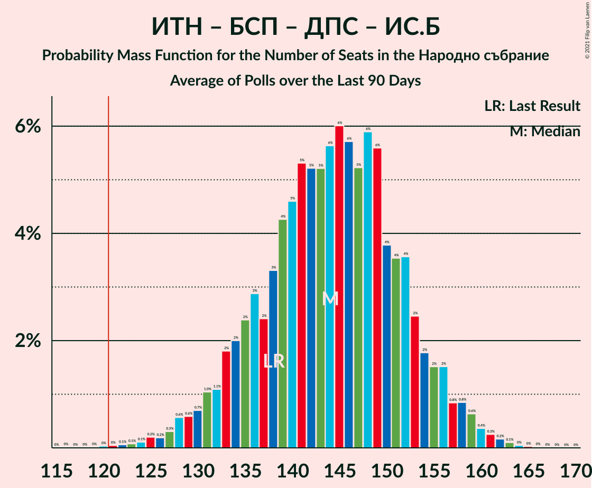
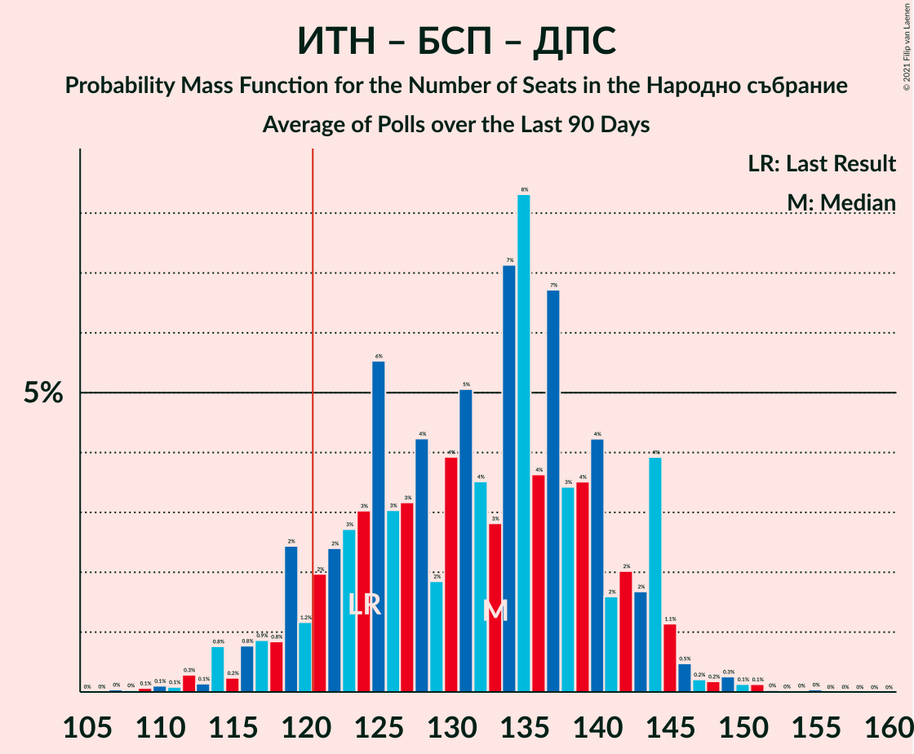

# Poll Average

<a href="#voting-intentions">Voting Intentions</a> | <a href="#seats">Seats</a> | <a href="#coalitions">Coalitions</a> | <a href="#technical-information">Technical Information</a>

## Summary

The table below lists the polls on which the average is based. They are the most recent polls (less than 90 days old) registered and analyzed so far.

| Period     | Polling firm/Commissioner(s) | ГЕРБ | ИТН | БСП | ДПС | ДБ | ИС.Б | ВМРО | В | Воля–НФСБ | РзБ | Атака | АБВ | ОП | Воля | РБ | Да | НФСБ | ДСБ | БП |
|:----------:|:----------------------------:|:--:|:--:|:--:|:--:|:--:|:--:|:--:|:--:|:--:|:--:|:--:|:--:|:--:|:--:|:--:|:--:|:--:|:--:|:--:|
| 4 April 2021 | General Election | 25.8%   75 | 17.4%   51 | 14.8%   43 | 10.4%   30 | 9.3%   27 | 4.6%   14 | 3.6%   0 | 2.4%   0 | 2.3%   0 | 1.3%   0 | 0.5%   0 | 0.5%   0 | 0.0%   0 | 0.0%   0 | 0.0%   0 | 0.0%   0 | 0.0%   0 | 0.0%   0 | 0.0%   0 |
| N/A | Poll Average | 18–26%   47–68 | 18–25%   47–67 | 13–22%   35–55 | 8–14%   21–37 | 9–15%   22–41 | 4–8%   0–21 | N/A   N/A | 2–5%   0–12 | N/A   N/A | N/A   N/A | N/A   N/A | N/A   N/A | N/A   N/A | N/A   N/A | N/A   N/A | N/A   N/A | N/A   N/A | N/A   N/A | 2–6%   0–16 |
| [4–7 July 2021](2021-07-07-Алфарисърч.html) | Алфа рисърч | 18–25%   46–67 | 18–26%   48–68 | 13–20%   34–52 | 9–14%   22–37 | 9–15%   24–40 | 4–8%   0–20 | N/A   N/A | 2–5%   0–13 | N/A   N/A | N/A   N/A | N/A   N/A | N/A   N/A | N/A   N/A | N/A   N/A | N/A   N/A | N/A   N/A | N/A   N/A | N/A   N/A | 2–6%   0–15 |
| [30 June–7 July 2021](2021-07-07-Gallup.html) | Gallup   BNR | 17–24%   44–64 | 18–25%   47–67 | 13–19%   34–51 | 9–15%   24–38 | 10–15%   25–40 | 4–9%   12–23 | N/A   N/A | 2–5%   0–13 | N/A   N/A | N/A   N/A | N/A   N/A | N/A   N/A | N/A   N/A | N/A   N/A | N/A   N/A | N/A   N/A | N/A   N/A | N/A   N/A | 3–6%   0–16 |
| [2–6 July 2021](2021-07-06-SovaHarris.html) | Sova Harris   Dir.bg | 19–26%   50–70 | 19–26%   49–69 | 13–19%   34–52 | 8–14%   22–37 | 8–14%   22–36 | 4–8%   0–20 | N/A   N/A | N/A   N/A | N/A   N/A | N/A   N/A | N/A   N/A | N/A   N/A | N/A   N/A | N/A   N/A | N/A   N/A | N/A   N/A | N/A   N/A | N/A   N/A | 3–7%   0–17 |
| [1–5 July 2021](2021-07-05-Exacta.html) | Exacta | 18–25%   47–68 | 17–25%   46–66 | 13–20%   34–52 | 9–14%   23–39 | 10–16%   27–44 | 3–7%   0–19 | N/A   N/A | 2–5%   0–12 | N/A   N/A | N/A   N/A | N/A   N/A | N/A   N/A | N/A   N/A | N/A   N/A | N/A   N/A | N/A   N/A | N/A   N/A | N/A   N/A | 3–6%   0–16 |
| [26 June–2 July 2021](2021-07-02-Медиана.html) | Медиана | 20–25%   50–64 | 19–25%   48–62 | 18–23%   45–59 | 9–13%   23–33 | 8–12%   20–30 | 4–7%   0–17 | N/A   N/A | 1–3%   0 | N/A   N/A | N/A   N/A | N/A   N/A | N/A   N/A | N/A   N/A | N/A   N/A | N/A   N/A | N/A   N/A | N/A   N/A | N/A   N/A | 4–6%   0–16 |
| [23–30 June 2021](2021-06-30-Nasoca.html) | Nasoca | 18–25%   49–68 | 17–24%   46–66 | 13–19%   35–52 | 8–13%   22–37 | 9–14%   24–38 | 4–8%   0–21 | N/A   N/A | 1–4%   0–11 | N/A   N/A | N/A   N/A | N/A   N/A | N/A   N/A | N/A   N/A | N/A   N/A | N/A   N/A | N/A   N/A | N/A   N/A | N/A   N/A | 3–6%   0–17 |
| [18–25 June 2021](2021-06-25-MarketLinks.html) | Market Links   bTV | 20–27%   51–69 | 19–25%   48–66 | 14–20%   37–52 | 7–12%   18–30 | 11–16%   28–42 | 5–9%   13–23 | N/A   N/A | 2–5%   0–12 | N/A   N/A | N/A   N/A | N/A   N/A | N/A   N/A | N/A   N/A | N/A   N/A | N/A   N/A | N/A   N/A | N/A   N/A | N/A   N/A | 2–5%   0–12 |
| [11–18 June 2021](2021-06-18-Тренд.html) | Тренд   24 часа | 18–26%   50–71 | 17–24%   45–67 | 13–20%   36–54 | 8–14%   23–38 | 9–14%   24–39 | 3–7%   0–20 | N/A   N/A | 1–4%   0–11 | N/A   N/A | N/A   N/A | N/A   N/A | N/A   N/A | N/A   N/A | N/A   N/A | N/A   N/A | N/A   N/A | N/A   N/A | N/A   N/A | 3–6%   0–16 |
| 4 April 2021 | General Election | 25.8%   75 | 17.4%   51 | 14.8%   43 | 10.4%   30 | 9.3%   27 | 4.6%   14 | 3.6%   0 | 2.4%   0 | 2.3%   0 | 1.3%   0 | 0.5%   0 | 0.5%   0 | 0.0%   0 | 0.0%   0 | 0.0%   0 | 0.0%   0 | 0.0%   0 | 0.0%   0 | 0.0%   0 |

Only polls for which at least the sample size has been published are included in the table above.

**Legend:**
+ **Top half of each row:** Voting intentions (95% confidence interval)
+ **Bottom half of each row:** Seat projections for the Народно събрание (95% confidence interval)
+ **ГЕРБ:** Граждани за европейско развитие на България
+ **ИТН:** Има такъв народ
+ **БСП:** Българска социалистическа партия
+ **ДПС:** Движение за права и свободи
+ **ДБ:** Демократична България
+ **ИС.Б:** Изправи се Бг
+ **ВМРО:** ВМРО–Българско Национално Движение
+ **В:** Възраждане
+ **Воля–НФСБ:** Воля–Национален фронт за спасение на България
+ **РзБ:** Републиканци за България
+ **Атака:** Атака
+ **АБВ:** Алтернатива за българско възраждане
+ **ОП:** Обединени Патриоти
+ **Воля:** Воля
+ **РБ:** Реформаторски блок
+ **Да:** Да, България!
+ **НФСБ:** Национален фронт за спасение на България
+ **ДСБ:** Демократи за силна България
+ **БП:** Българските патриоти
+ **N/A (single party):** Party not included the published results
+ **N/A (entire row):** Calculation for this opinion poll not started yet

## Voting Intentions

### Confidence Intervals

| Party | Last Result | Median | 80% Confidence Interval | 90% Confidence Interval | 95% Confidence Interval | 99% Confidence Interval |
|:-----:|:-----------:|:------:|:-----------------------:|:-----------------------:|:-----------------------:|:-----------------------:|
| <a href="#граждани-за-европейско-развитие-на-българия">Граждани за европейско развитие на България</a> | 25.8% | 21.9% | 19.4–24.4% |18.7–25.1% | 18.1–25.7% | 17.0–27.0% |
| <a href="#има-такъв-народ">Има такъв народ</a> | 17.4% | 21.4% | 19.0–23.8% |18.3–24.5% | 17.7–25.2% | 16.6–26.5% |
| <a href="#българска-социалистическа-партия">Българска социалистическа партия</a> | 14.8% | 16.6% | 14.3–20.1% |13.7–21.1% | 13.2–21.9% | 12.3–23.1% |
| <a href="#движение-за-права-и-свободи">Движение за права и свободи</a> | 10.4% | 10.9% | 9.0–12.9% |8.5–13.4% | 8.0–14.0% | 7.2–15.0% |
| <a href="#демократична-българия">Демократична България</a> | 9.3% | 11.8% | 9.6–14.2% |9.1–14.8% | 8.7–15.4% | 8.0–16.5% |
| <a href="#изправи-се-бг">Изправи се Бг</a> | 4.6% | 5.5% | 4.2–7.1% |3.9–7.6% | 3.6–8.1% | 3.1–8.9% |
| <a href="#вмро–българско-национално-движение">ВМРО–Българско Национално Движение</a> | 3.6% | N/A | N/A |N/A | N/A | N/A |
| <a href="#възраждане">Възраждане</a> | 2.4% | 2.8% | 1.9–4.0% |1.7–4.4% | 1.5–4.7% | 1.2–5.4% |
| <a href="#воля–национален-фронт-за-спасение-на-българия">Воля–Национален фронт за спасение на България</a> | 2.3% | N/A | N/A |N/A | N/A | N/A |
| <a href="#републиканци-за-българия">Републиканци за България</a> | 1.3% | N/A | N/A |N/A | N/A | N/A |
| <a href="#атака">Атака</a> | 0.5% | N/A | N/A |N/A | N/A | N/A |
| <a href="#алтернатива-за-българско-възраждане">Алтернатива за българско възраждане</a> | 0.5% | N/A | N/A |N/A | N/A | N/A |
| <a href="#обединени-патриоти">Обединени Патриоти</a> | 0.0% | N/A | N/A |N/A | N/A | N/A |
| <a href="#воля">Воля</a> | 0.0% | N/A | N/A |N/A | N/A | N/A |
| <a href="#реформаторски-блок">Реформаторски блок</a> | 0.0% | N/A | N/A |N/A | N/A | N/A |
| <a href="#да,-българия!">Да, България!</a> | 0.0% | N/A | N/A |N/A | N/A | N/A |
| <a href="#национален-фронт-за-спасение-на-българия">Национален фронт за спасение на България</a> | 0.0% | N/A | N/A |N/A | N/A | N/A |
| <a href="#демократи-за-силна-българия">Демократи за силна България</a> | 0.0% | N/A | N/A |N/A | N/A | N/A |
| <a href="#българските-патриоти">Българските патриоти</a> | 0.0% | 4.2% | 3.0–5.5% |2.7–5.9% | 2.5–6.2% | 2.1–6.9% |

### Граждани за европейско развитие на България

*For a full overview of the results for this party, see the [Граждани за европейско развитие на България](party-гражданизаевропейскоразвитиенабългария.html) page.*

| Voting Intentions | Probability | Accumulated | Special Marks |
|:-----------------:|:-----------:|:-----------:|:-------------:|
| 14.5–15.5% | 0% | 100% |  |
| 15.5–16.5% | 0.2% | 100% |  |
| 16.5–17.5% | 1.0% | 99.8% |  |
| 17.5–18.5% | 3% | 98.8% |  |
| 18.5–19.5% | 7% | 96% |  |
| 19.5–20.5% | 13% | 88% |  |
| 20.5–21.5% | 18% | 75% |  |
| 21.5–22.5% | 20% | 57% | Median |
| 22.5–23.5% | 17% | 37% |  |
| 23.5–24.5% | 11% | 20% |  |
| 24.5–25.5% | 5% | 8% |  |
| 25.5–26.5% | 2% | 3% | Last Result |
| 26.5–27.5% | 0.7% | 0.9% |  |
| 27.5–28.5% | 0.2% | 0.2% |  |
| 28.5–29.5% | 0% | 0% |  |

### Има такъв народ

*For a full overview of the results for this party, see the [Има такъв народ](party-иматакъвнарод.html) page.*

| Voting Intentions | Probability | Accumulated | Special Marks |
|:-----------------:|:-----------:|:-----------:|:-------------:|
| 13.5–14.5% | 0% | 100% |  |
| 14.5–15.5% | 0.1% | 100% |  |
| 15.5–16.5% | 0.4% | 99.9% |  |
| 16.5–17.5% | 1.5% | 99.6% | Last Result |
| 17.5–18.5% | 4% | 98% |  |
| 18.5–19.5% | 10% | 94% |  |
| 19.5–20.5% | 16% | 84% |  |
| 20.5–21.5% | 21% | 68% | Median |
| 21.5–22.5% | 20% | 47% |  |
| 22.5–23.5% | 14% | 27% |  |
| 23.5–24.5% | 8% | 13% |  |
| 24.5–25.5% | 3% | 5% |  |
| 25.5–26.5% | 1.2% | 2% |  |
| 26.5–27.5% | 0.3% | 0.4% |  |
| 27.5–28.5% | 0.1% | 0.1% |  |
| 28.5–29.5% | 0% | 0% |  |

### Българска социалистическа партия

*For a full overview of the results for this party, see the [Българска социалистическа партия](party-българскасоциалистическапартия.html) page.*

| Voting Intentions | Probability | Accumulated | Special Marks |
|:-----------------:|:-----------:|:-----------:|:-------------:|
| 9.5–10.5% | 0% | 100% |  |
| 10.5–11.5% | 0.1% | 100% |  |
| 11.5–12.5% | 0.7% | 99.9% |  |
| 12.5–13.5% | 3% | 99.2% |  |
| 13.5–14.5% | 9% | 96% |  |
| 14.5–15.5% | 16% | 87% | Last Result |
| 15.5–16.5% | 20% | 70% |  |
| 16.5–17.5% | 18% | 50% | Median |
| 17.5–18.5% | 12% | 32% |  |
| 18.5–19.5% | 7% | 20% |  |
| 19.5–20.5% | 5% | 13% |  |
| 20.5–21.5% | 4% | 7% |  |
| 21.5–22.5% | 2% | 3% |  |
| 22.5–23.5% | 0.9% | 1.1% |  |
| 23.5–24.5% | 0.2% | 0.2% |  |
| 24.5–25.5% | 0% | 0% |  |

### Движение за права и свободи

*For a full overview of the results for this party, see the [Движение за права и свободи](party-движениезаправаисвободи.html) page.*

| Voting Intentions | Probability | Accumulated | Special Marks |
|:-----------------:|:-----------:|:-----------:|:-------------:|
| 4.5–5.5% | 0% | 100% |  |
| 5.5–6.5% | 0.1% | 100% |  |
| 6.5–7.5% | 0.9% | 99.9% |  |
| 7.5–8.5% | 5% | 99.0% |  |
| 8.5–9.5% | 13% | 94% |  |
| 9.5–10.5% | 22% | 82% | Last Result |
| 10.5–11.5% | 26% | 60% | Median |
| 11.5–12.5% | 19% | 33% |  |
| 12.5–13.5% | 10% | 14% |  |
| 13.5–14.5% | 3% | 4% |  |
| 14.5–15.5% | 0.8% | 1.0% |  |
| 15.5–16.5% | 0.2% | 0.2% |  |
| 16.5–17.5% | 0% | 0% |  |

### Демократична България

*For a full overview of the results for this party, see the [Демократична България](party-демократичнабългария.html) page.*

| Voting Intentions | Probability | Accumulated | Special Marks |
|:-----------------:|:-----------:|:-----------:|:-------------:|
| 5.5–6.5% | 0% | 100% |  |
| 6.5–7.5% | 0.1% | 100% |  |
| 7.5–8.5% | 2% | 99.9% |  |
| 8.5–9.5% | 7% | 98% | Last Result |
| 9.5–10.5% | 16% | 91% |  |
| 10.5–11.5% | 21% | 75% |  |
| 11.5–12.5% | 21% | 54% | Median |
| 12.5–13.5% | 17% | 34% |  |
| 13.5–14.5% | 10% | 17% |  |
| 14.5–15.5% | 5% | 7% |  |
| 15.5–16.5% | 2% | 2% |  |
| 16.5–17.5% | 0.4% | 0.5% |  |
| 17.5–18.5% | 0.1% | 0.1% |  |
| 18.5–19.5% | 0% | 0% |  |

### Изправи се Бг

*For a full overview of the results for this party, see the [Изправи се Бг](party-изправисебг.html) page.*

| Voting Intentions | Probability | Accumulated | Special Marks |
|:-----------------:|:-----------:|:-----------:|:-------------:|
| 1.5–2.5% | 0% | 100% |  |
| 2.5–3.5% | 2% | 100% |  |
| 3.5–4.5% | 16% | 98% |  |
| 4.5–5.5% | 33% | 82% | Last Result |
| 5.5–6.5% | 29% | 49% | Median |
| 6.5–7.5% | 14% | 20% |  |
| 7.5–8.5% | 5% | 6% |  |
| 8.5–9.5% | 0.9% | 1.0% |  |
| 9.5–10.5% | 0.1% | 0.1% |  |
| 10.5–11.5% | 0% | 0% |  |

### Възраждане

*For a full overview of the results for this party, see the [Възраждане](party-възраждане.html) page.*

| Voting Intentions | Probability | Accumulated | Special Marks |
|:-----------------:|:-----------:|:-----------:|:-------------:|
| 0.0–0.5% | 0% | 100% |  |
| 0.5–1.5% | 3% | 100% |  |
| 1.5–2.5% | 35% | 97% | Last Result |
| 2.5–3.5% | 42% | 61% | Median |
| 3.5–4.5% | 16% | 20% |  |
| 4.5–5.5% | 3% | 3% |  |
| 5.5–6.5% | 0.3% | 0.3% |  |
| 6.5–7.5% | 0% | 0% |  |

### Българските патриоти

*For a full overview of the results for this party, see the [Българските патриоти](party-българскитепатриоти.html) page.*

| Voting Intentions | Probability | Accumulated | Special Marks |
|:-----------------:|:-----------:|:-----------:|:-------------:|
| 0.0–0.5% | 0% | 100% | Last Result |
| 0.5–1.5% | 0% | 100% |  |
| 1.5–2.5% | 3% | 100% |  |
| 2.5–3.5% | 23% | 97% |  |
| 3.5–4.5% | 39% | 74% | Median |
| 4.5–5.5% | 26% | 36% |  |
| 5.5–6.5% | 8% | 9% |  |
| 6.5–7.5% | 1.1% | 1.2% |  |
| 7.5–8.5% | 0.1% | 0.1% |  |
| 8.5–9.5% | 0% | 0% |  |

## Seats

### Confidence Intervals

| Party | Last Result | Median | 80% Confidence Interval | 90% Confidence Interval | 95% Confidence Interval | 99% Confidence Interval |
|:-----:|:-----------:|:------:|:-----------------------:|:-----------------------:|:-----------------------:|:-----------------------:|
| <a href="#граждани-за-европейско-развитие-на-българия">Граждани за европейско развитие на България</a> | 75 | 58 | 51–64 |49–67 | 47–68 | 44–72 |
| <a href="#има-такъв-народ">Има такъв народ</a> | 51 | 56 | 50–63 |48–65 | 47–67 | 44–70 |
| <a href="#българска-социалистическа-партия">Българска социалистическа партия</a> | 43 | 44 | 37–51 |36–54 | 35–55 | 32–58 |
| <a href="#движение-за-права-и-свободи">Движение за права и свободи</a> | 30 | 29 | 24–34 |22–36 | 21–37 | 19–40 |
| <a href="#демократична-българия">Демократична България</a> | 27 | 31 | 25–37 |24–39 | 22–41 | 20–44 |
| <a href="#изправи-се-бг">Изправи се Бг</a> | 14 | 15 | 11–19 |0–20 | 0–21 | 0–23 |
| <a href="#вмро–българско-национално-движение">ВМРО–Българско Национално Движение</a> | 0 | N/A | N/A |N/A | N/A | N/A |
| <a href="#възраждане">Възраждане</a> | 0 | 0 | 0 |0–11 | 0–12 | 0–14 |
| <a href="#воля–национален-фронт-за-спасение-на-българия">Воля–Национален фронт за спасение на България</a> | 0 | N/A | N/A |N/A | N/A | N/A |
| <a href="#републиканци-за-българия">Републиканци за България</a> | 0 | N/A | N/A |N/A | N/A | N/A |
| <a href="#атака">Атака</a> | 0 | N/A | N/A |N/A | N/A | N/A |
| <a href="#алтернатива-за-българско-възраждане">Алтернатива за българско възраждане</a> | 0 | N/A | N/A |N/A | N/A | N/A |
| <a href="#обединени-патриоти">Обединени Патриоти</a> | 0 | N/A | N/A |N/A | N/A | N/A |
| <a href="#воля">Воля</a> | 0 | N/A | N/A |N/A | N/A | N/A |
| <a href="#реформаторски-блок">Реформаторски блок</a> | 0 | N/A | N/A |N/A | N/A | N/A |
| <a href="#да,-българия!">Да, България!</a> | 0 | N/A | N/A |N/A | N/A | N/A |
| <a href="#национален-фронт-за-спасение-на-българия">Национален фронт за спасение на България</a> | 0 | N/A | N/A |N/A | N/A | N/A |
| <a href="#демократи-за-силна-българия">Демократи за силна България</a> | 0 | N/A | N/A |N/A | N/A | N/A |
| <a href="#българските-патриоти">Българските патриоти</a> | 0 | 11 | 0–14 |0–15 | 0–16 | 0–18 |

### Граждани за европейско развитие на България

*For a full overview of the results for this party, see the [Граждани за европейско развитие на България](party-гражданизаевропейскоразвитиенабългария.html) page.*

| Number of Seats | Probability | Accumulated | Special Marks |
|:---------------:|:-----------:|:-----------:|:-------------:|
| 41 | 0% | 100% |  |
| 42 | 0.1% | 99.9% |  |
| 43 | 0.2% | 99.8% |  |
| 44 | 0.2% | 99.7% |  |
| 45 | 0.4% | 99.4% |  |
| 46 | 0.7% | 99.1% |  |
| 47 | 1.0% | 98% |  |
| 48 | 1.3% | 97% |  |
| 49 | 2% | 96% |  |
| 50 | 3% | 94% |  |
| 51 | 3% | 91% |  |
| 52 | 5% | 89% |  |
| 53 | 5% | 84% |  |
| 54 | 6% | 78% |  |
| 55 | 7% | 73% |  |
| 56 | 5% | 65% |  |
| 57 | 9% | 60% |  |
| 58 | 8% | 51% | Median |
| 59 | 7% | 44% |  |
| 60 | 8% | 37% |  |
| 61 | 5% | 29% |  |
| 62 | 5% | 23% |  |
| 63 | 5% | 18% |  |
| 64 | 4% | 14% |  |
| 65 | 3% | 10% |  |
| 66 | 2% | 7% |  |
| 67 | 2% | 5% |  |
| 68 | 1.1% | 3% |  |
| 69 | 0.9% | 2% |  |
| 70 | 0.5% | 1.5% |  |
| 71 | 0.4% | 1.0% |  |
| 72 | 0.2% | 0.6% |  |
| 73 | 0.1% | 0.4% |  |
| 74 | 0.1% | 0.3% |  |
| 75 | 0% | 0.1% | Last Result |
| 76 | 0% | 0.1% |  |
| 77 | 0% | 0.1% |  |
| 78 | 0% | 0% |  |

### Има такъв народ

*For a full overview of the results for this party, see the [Има такъв народ](party-иматакъвнарод.html) page.*

| Number of Seats | Probability | Accumulated | Special Marks |
|:---------------:|:-----------:|:-----------:|:-------------:|
| 41 | 0% | 100% |  |
| 42 | 0.1% | 99.9% |  |
| 43 | 0.2% | 99.9% |  |
| 44 | 0.3% | 99.7% |  |
| 45 | 0.5% | 99.4% |  |
| 46 | 0.9% | 98.9% |  |
| 47 | 2% | 98% |  |
| 48 | 2% | 96% |  |
| 49 | 2% | 94% |  |
| 50 | 3% | 92% |  |
| 51 | 4% | 88% | Last Result |
| 52 | 5% | 84% |  |
| 53 | 7% | 79% |  |
| 54 | 8% | 72% |  |
| 55 | 8% | 64% |  |
| 56 | 9% | 56% | Median |
| 57 | 8% | 47% |  |
| 58 | 7% | 38% |  |
| 59 | 6% | 31% |  |
| 60 | 5% | 25% |  |
| 61 | 5% | 20% |  |
| 62 | 3% | 15% |  |
| 63 | 3% | 11% |  |
| 64 | 2% | 8% |  |
| 65 | 2% | 6% |  |
| 66 | 1.2% | 4% |  |
| 67 | 1.0% | 3% |  |
| 68 | 0.7% | 2% |  |
| 69 | 0.4% | 1.1% |  |
| 70 | 0.3% | 0.7% |  |
| 71 | 0.1% | 0.4% |  |
| 72 | 0.1% | 0.3% |  |
| 73 | 0.1% | 0.2% |  |
| 74 | 0% | 0.1% |  |
| 75 | 0% | 0.1% |  |
| 76 | 0% | 0% |  |

### Българска социалистическа партия

*For a full overview of the results for this party, see the [Българска социалистическа партия](party-българскасоциалистическапартия.html) page.*

| Number of Seats | Probability | Accumulated | Special Marks |
|:---------------:|:-----------:|:-----------:|:-------------:|
| 30 | 0.1% | 100% |  |
| 31 | 0.2% | 99.9% |  |
| 32 | 0.3% | 99.7% |  |
| 33 | 0.6% | 99.4% |  |
| 34 | 1.0% | 98.8% |  |
| 35 | 2% | 98% |  |
| 36 | 2% | 96% |  |
| 37 | 4% | 94% |  |
| 38 | 4% | 90% |  |
| 39 | 5% | 85% |  |
| 40 | 5% | 80% |  |
| 41 | 7% | 75% |  |
| 42 | 8% | 69% |  |
| 43 | 8% | 61% | Last Result |
| 44 | 8% | 52% | Median |
| 45 | 7% | 45% |  |
| 46 | 7% | 38% |  |
| 47 | 6% | 31% |  |
| 48 | 5% | 25% |  |
| 49 | 4% | 20% |  |
| 50 | 4% | 17% |  |
| 51 | 3% | 13% |  |
| 52 | 3% | 10% |  |
| 53 | 2% | 7% |  |
| 54 | 2% | 6% |  |
| 55 | 2% | 4% |  |
| 56 | 1.0% | 2% |  |
| 57 | 0.5% | 1.3% |  |
| 58 | 0.3% | 0.8% |  |
| 59 | 0.2% | 0.5% |  |
| 60 | 0.2% | 0.3% |  |
| 61 | 0.1% | 0.2% |  |
| 62 | 0% | 0.1% |  |
| 63 | 0% | 0% |  |

### Движение за права и свободи

*For a full overview of the results for this party, see the [Движение за права и свободи](party-движениезаправаисвободи.html) page.*

| Number of Seats | Probability | Accumulated | Special Marks |
|:---------------:|:-----------:|:-----------:|:-------------:|
| 16 | 0% | 100% |  |
| 17 | 0.1% | 99.9% |  |
| 18 | 0.2% | 99.8% |  |
| 19 | 0.6% | 99.6% |  |
| 20 | 1.1% | 99.0% |  |
| 21 | 1.5% | 98% |  |
| 22 | 3% | 96% |  |
| 23 | 4% | 94% |  |
| 24 | 6% | 90% |  |
| 25 | 7% | 85% |  |
| 26 | 8% | 78% |  |
| 27 | 11% | 70% |  |
| 28 | 9% | 60% |  |
| 29 | 11% | 51% | Median |
| 30 | 9% | 40% | Last Result |
| 31 | 8% | 31% |  |
| 32 | 7% | 23% |  |
| 33 | 5% | 17% |  |
| 34 | 4% | 12% |  |
| 35 | 3% | 8% |  |
| 36 | 2% | 5% |  |
| 37 | 1.2% | 3% |  |
| 38 | 0.8% | 2% |  |
| 39 | 0.5% | 1.3% |  |
| 40 | 0.3% | 0.7% |  |
| 41 | 0.2% | 0.4% |  |
| 42 | 0.1% | 0.2% |  |
| 43 | 0.1% | 0.1% |  |
| 44 | 0% | 0.1% |  |
| 45 | 0% | 0% |  |

### Демократична България

*For a full overview of the results for this party, see the [Демократична България](party-демократичнабългария.html) page.*

| Number of Seats | Probability | Accumulated | Special Marks |
|:---------------:|:-----------:|:-----------:|:-------------:|
| 19 | 0.1% | 100% |  |
| 20 | 0.4% | 99.9% |  |
| 21 | 0.7% | 99.5% |  |
| 22 | 1.4% | 98.8% |  |
| 23 | 2% | 97% |  |
| 24 | 3% | 95% |  |
| 25 | 5% | 92% |  |
| 26 | 6% | 87% |  |
| 27 | 6% | 81% | Last Result |
| 28 | 7% | 75% |  |
| 29 | 6% | 69% |  |
| 30 | 8% | 62% |  |
| 31 | 9% | 54% | Median |
| 32 | 8% | 46% |  |
| 33 | 8% | 38% |  |
| 34 | 5% | 30% |  |
| 35 | 6% | 25% |  |
| 36 | 5% | 19% |  |
| 37 | 4% | 14% |  |
| 38 | 3% | 10% |  |
| 39 | 2% | 6% |  |
| 40 | 2% | 4% |  |
| 41 | 0.9% | 3% |  |
| 42 | 0.8% | 2% |  |
| 43 | 0.4% | 1.0% |  |
| 44 | 0.3% | 0.6% |  |
| 45 | 0.1% | 0.3% |  |
| 46 | 0.1% | 0.2% |  |
| 47 | 0.1% | 0.1% |  |
| 48 | 0% | 0.1% |  |
| 49 | 0% | 0% |  |

### Изправи се Бг

*For a full overview of the results for this party, see the [Изправи се Бг](party-изправисебг.html) page.*

| Number of Seats | Probability | Accumulated | Special Marks |
|:---------------:|:-----------:|:-----------:|:-------------:|
| 0 | 7% | 100% |  |
| 1 | 0% | 93% |  |
| 2 | 0% | 93% |  |
| 3 | 0% | 93% |  |
| 4 | 0% | 93% |  |
| 5 | 0% | 93% |  |
| 6 | 0% | 93% |  |
| 7 | 0% | 93% |  |
| 8 | 0% | 93% |  |
| 9 | 0% | 93% |  |
| 10 | 0.5% | 93% |  |
| 11 | 6% | 92% |  |
| 12 | 10% | 86% |  |
| 13 | 12% | 76% |  |
| 14 | 13% | 63% | Last Result |
| 15 | 12% | 50% | Median |
| 16 | 10% | 38% |  |
| 17 | 10% | 28% |  |
| 18 | 6% | 18% |  |
| 19 | 5% | 12% |  |
| 20 | 3% | 7% |  |
| 21 | 2% | 4% |  |
| 22 | 1.0% | 2% |  |
| 23 | 0.5% | 0.9% |  |
| 24 | 0.2% | 0.4% |  |
| 25 | 0.1% | 0.2% |  |
| 26 | 0.1% | 0.1% |  |
| 27 | 0% | 0% |  |

### ВМРО–Българско Национално Движение

*For a full overview of the results for this party, see the [ВМРО–Българско Национално Движение](party-вмро–българсконационалнодвижение.html) page.*

### Възраждане

*For a full overview of the results for this party, see the [Възраждане](party-възраждане.html) page.*

| Number of Seats | Probability | Accumulated | Special Marks |
|:---------------:|:-----------:|:-----------:|:-------------:|
| 0 | 90% | 100% | Last Result, Median |
| 1 | 0% | 10% |  |
| 2 | 0% | 10% |  |
| 3 | 0% | 10% |  |
| 4 | 0% | 10% |  |
| 5 | 0% | 10% |  |
| 6 | 0% | 10% |  |
| 7 | 0% | 10% |  |
| 8 | 0% | 10% |  |
| 9 | 0% | 10% |  |
| 10 | 1.3% | 10% |  |
| 11 | 5% | 8% |  |
| 12 | 2% | 4% |  |
| 13 | 1.1% | 2% |  |
| 14 | 0.4% | 0.6% |  |
| 15 | 0.1% | 0.2% |  |
| 16 | 0% | 0.1% |  |
| 17 | 0% | 0% |  |

### Воля–Национален фронт за спасение на България

*For a full overview of the results for this party, see the [Воля–Национален фронт за спасение на България](party-воля–националенфронтзаспасениенабългария.html) page.*

### Републиканци за България

*For a full overview of the results for this party, see the [Републиканци за България](party-републиканцизабългария.html) page.*

### Атака

*For a full overview of the results for this party, see the [Атака](party-атака.html) page.*

### Алтернатива за българско възраждане

*For a full overview of the results for this party, see the [Алтернатива за българско възраждане](party-алтернативазабългарсковъзраждане.html) page.*

### Обединени Патриоти

*For a full overview of the results for this party, see the [Обединени Патриоти](party-обединенипатриоти.html) page.*

### Воля

*For a full overview of the results for this party, see the [Воля](party-воля.html) page.*

### Реформаторски блок

*For a full overview of the results for this party, see the [Реформаторски блок](party-реформаторскиблок.html) page.*

### Да, България!

*For a full overview of the results for this party, see the [Да, България!](party-дабългария.html) page.*

### Национален фронт за спасение на България

*For a full overview of the results for this party, see the [Национален фронт за спасение на България](party-националенфронтзаспасениенабългария.html) page.*

### Демократи за силна България

*For a full overview of the results for this party, see the [Демократи за силна България](party-демократизасилнабългария.html) page.*

### Българските патриоти

*For a full overview of the results for this party, see the [Българските патриоти](party-българскитепатриоти.html) page.*

| Number of Seats | Probability | Accumulated | Special Marks |
|:---------------:|:-----------:|:-----------:|:-------------:|
| 0 | 45% | 100% | Last Result |
| 1 | 0% | 55% |  |
| 2 | 0% | 55% |  |
| 3 | 0% | 55% |  |
| 4 | 0% | 55% |  |
| 5 | 0% | 55% |  |
| 6 | 0% | 55% |  |
| 7 | 0% | 55% |  |
| 8 | 0% | 55% |  |
| 9 | 0% | 55% |  |
| 10 | 2% | 55% |  |
| 11 | 13% | 52% | Median |
| 12 | 14% | 40% |  |
| 13 | 10% | 26% |  |
| 14 | 7% | 16% |  |
| 15 | 4% | 9% |  |
| 16 | 2% | 4% |  |
| 17 | 1.1% | 2% |  |
| 18 | 0.5% | 0.9% |  |
| 19 | 0.2% | 0.4% |  |
| 20 | 0.1% | 0.2% |  |
| 21 | 0% | 0.1% |  |
| 22 | 0% | 0% |  |

## Coalitions

### Confidence Intervals

| Coalition | Last Result | Median | Majority? | 80% Confidence Interval | 90% Confidence Interval | 95% Confidence Interval | 99% Confidence Interval |
|:---------:|:-----------:|:------:|:---------:|:-----------------------:|:-----------------------:|:-----------------------:|:-----------------------:|
| Има такъв народ – Българска социалистическа партия – Движение за права и свободи – Изправи се Бг | 138 | 143 | 99.9% | 134–152 | 132–155 | 129–157 | 124–161 |
| Има такъв народ – Българска социалистическа партия – Движение за права и свободи | 124 | 129 | 89% | 120–138 | 118–141 | 116–143 | 112–148 |
| Българска социалистическа партия – Движение за права и свободи – Изправи се Бг | 87 | 87 | 0% | 78–95 | 76–98 | 73–100 | 68–103 |
| Българска социалистическа партия – Движение за права и свободи | 73 | 73 | 0% | 65–81 | 63–83 | 62–85 | 58–89 |
| Граждани за европейско развитие на България – Обединени Патриоти | 75 | 58 | 0% | 51–64 | 49–67 | 47–68 | 44–72 |

### Има такъв народ – Българска социалистическа партия – Движение за права и свободи – Изправи се Бг

| Number of Seats | Probability | Accumulated | Special Marks |
|:---------------:|:-----------:|:-----------:|:-------------:|
| 119 | 0% | 100% |  |
| 120 | 0% | 99.9% |  |
| 121 | 0% | 99.9% | Majority |
| 122 | 0.1% | 99.9% |  |
| 123 | 0.1% | 99.8% |  |
| 124 | 0.2% | 99.6% |  |
| 125 | 0.3% | 99.5% |  |
| 126 | 0.3% | 99.2% |  |
| 127 | 0.5% | 98.9% |  |
| 128 | 0.5% | 98% |  |
| 129 | 0.7% | 98% |  |
| 130 | 1.0% | 97% |  |
| 131 | 1.2% | 96% |  |
| 132 | 1.3% | 95% |  |
| 133 | 2% | 94% |  |
| 134 | 2% | 92% |  |
| 135 | 3% | 90% |  |
| 136 | 3% | 87% |  |
| 137 | 3% | 83% |  |
| 138 | 5% | 80% | Last Result |
| 139 | 5% | 76% |  |
| 140 | 5% | 71% |  |
| 141 | 6% | 66% |  |
| 142 | 6% | 60% |  |
| 143 | 5% | 54% |  |
| 144 | 6% | 49% | Median |
| 145 | 6% | 43% |  |
| 146 | 5% | 37% |  |
| 147 | 5% | 32% |  |
| 148 | 5% | 27% |  |
| 149 | 5% | 22% |  |
| 150 | 4% | 18% |  |
| 151 | 3% | 14% |  |
| 152 | 2% | 11% |  |
| 153 | 2% | 9% |  |
| 154 | 1.5% | 7% |  |
| 155 | 1.4% | 5% |  |
| 156 | 0.9% | 4% |  |
| 157 | 0.7% | 3% |  |
| 158 | 0.7% | 2% |  |
| 159 | 0.6% | 2% |  |
| 160 | 0.3% | 1.0% |  |
| 161 | 0.3% | 0.7% |  |
| 162 | 0.1% | 0.4% |  |
| 163 | 0.1% | 0.2% |  |
| 164 | 0.1% | 0.2% |  |
| 165 | 0% | 0.1% |  |
| 166 | 0% | 0% |  |

### Има такъв народ – Българска социалистическа партия – Движение за права и свободи

| Number of Seats | Probability | Accumulated | Special Marks |
|:---------------:|:-----------:|:-----------:|:-------------:|
| 107 | 0% | 100% |  |
| 108 | 0% | 99.9% |  |
| 109 | 0.1% | 99.9% |  |
| 110 | 0.1% | 99.8% |  |
| 111 | 0.1% | 99.7% |  |
| 112 | 0.3% | 99.6% |  |
| 113 | 0.4% | 99.3% |  |
| 114 | 0.5% | 98.9% |  |
| 115 | 0.6% | 98% |  |
| 116 | 1.2% | 98% |  |
| 117 | 1.1% | 97% |  |
| 118 | 2% | 95% |  |
| 119 | 2% | 94% |  |
| 120 | 2% | 92% |  |
| 121 | 3% | 89% | Majority |
| 122 | 4% | 86% |  |
| 123 | 4% | 83% |  |
| 124 | 4% | 79% | Last Result |
| 125 | 5% | 74% |  |
| 126 | 5% | 69% |  |
| 127 | 6% | 64% |  |
| 128 | 5% | 58% |  |
| 129 | 5% | 53% | Median |
| 130 | 6% | 48% |  |
| 131 | 6% | 42% |  |
| 132 | 5% | 36% |  |
| 133 | 5% | 31% |  |
| 134 | 4% | 26% |  |
| 135 | 4% | 22% |  |
| 136 | 4% | 19% |  |
| 137 | 3% | 15% |  |
| 138 | 3% | 12% |  |
| 139 | 2% | 9% |  |
| 140 | 2% | 7% |  |
| 141 | 1.3% | 6% |  |
| 142 | 1.1% | 4% |  |
| 143 | 0.8% | 3% |  |
| 144 | 0.7% | 2% |  |
| 145 | 0.4% | 2% |  |
| 146 | 0.3% | 1.3% |  |
| 147 | 0.3% | 1.0% |  |
| 148 | 0.2% | 0.6% |  |
| 149 | 0.1% | 0.4% |  |
| 150 | 0.1% | 0.3% |  |
| 151 | 0.1% | 0.2% |  |
| 152 | 0% | 0.1% |  |
| 153 | 0% | 0.1% |  |
| 154 | 0% | 0.1% |  |
| 155 | 0% | 0% |  |

### Българска социалистическа партия – Движение за права и свободи – Изправи се Бг

| Number of Seats | Probability | Accumulated | Special Marks |
|:---------------:|:-----------:|:-----------:|:-------------:|
| 63 | 0% | 100% |  |
| 64 | 0% | 99.9% |  |
| 65 | 0.1% | 99.9% |  |
| 66 | 0.1% | 99.8% |  |
| 67 | 0.1% | 99.7% |  |
| 68 | 0.2% | 99.6% |  |
| 69 | 0.3% | 99.4% |  |
| 70 | 0.3% | 99.2% |  |
| 71 | 0.3% | 98.8% |  |
| 72 | 0.6% | 98% |  |
| 73 | 0.7% | 98% |  |
| 74 | 0.8% | 97% |  |
| 75 | 1.1% | 96% |  |
| 76 | 1.4% | 95% |  |
| 77 | 2% | 94% |  |
| 78 | 2% | 92% |  |
| 79 | 3% | 90% |  |
| 80 | 3% | 87% |  |
| 81 | 4% | 84% |  |
| 82 | 5% | 80% |  |
| 83 | 5% | 75% |  |
| 84 | 6% | 71% |  |
| 85 | 6% | 65% |  |
| 86 | 6% | 59% |  |
| 87 | 7% | 53% | Last Result |
| 88 | 6% | 46% | Median |
| 89 | 6% | 40% |  |
| 90 | 5% | 35% |  |
| 91 | 5% | 30% |  |
| 92 | 4% | 25% |  |
| 93 | 4% | 20% |  |
| 94 | 3% | 16% |  |
| 95 | 3% | 13% |  |
| 96 | 3% | 10% |  |
| 97 | 2% | 7% |  |
| 98 | 2% | 5% |  |
| 99 | 1.0% | 4% |  |
| 100 | 0.9% | 3% |  |
| 101 | 0.6% | 2% |  |
| 102 | 0.4% | 1.2% |  |
| 103 | 0.3% | 0.8% |  |
| 104 | 0.2% | 0.5% |  |
| 105 | 0.1% | 0.3% |  |
| 106 | 0.1% | 0.1% |  |
| 107 | 0% | 0.1% |  |
| 108 | 0% | 0.1% |  |
| 109 | 0% | 0% |  |

### Българска социалистическа партия – Движение за права и свободи

| Number of Seats | Probability | Accumulated | Special Marks |
|:---------------:|:-----------:|:-----------:|:-------------:|
| 55 | 0% | 100% |  |
| 56 | 0.1% | 99.9% |  |
| 57 | 0.2% | 99.8% |  |
| 58 | 0.3% | 99.7% |  |
| 59 | 0.4% | 99.4% |  |
| 60 | 0.6% | 99.0% |  |
| 61 | 0.9% | 98% |  |
| 62 | 1.5% | 98% |  |
| 63 | 2% | 96% |  |
| 64 | 3% | 94% |  |
| 65 | 3% | 91% |  |
| 66 | 4% | 88% |  |
| 67 | 4% | 84% |  |
| 68 | 5% | 79% |  |
| 69 | 5% | 74% |  |
| 70 | 5% | 69% |  |
| 71 | 7% | 64% |  |
| 72 | 7% | 57% |  |
| 73 | 6% | 50% | Last Result, Median |
| 74 | 6% | 44% |  |
| 75 | 6% | 39% |  |
| 76 | 5% | 32% |  |
| 77 | 5% | 28% |  |
| 78 | 4% | 23% |  |
| 79 | 4% | 19% |  |
| 80 | 3% | 15% |  |
| 81 | 3% | 12% |  |
| 82 | 2% | 9% |  |
| 83 | 2% | 7% |  |
| 84 | 1.2% | 5% |  |
| 85 | 1.2% | 4% |  |
| 86 | 1.0% | 2% |  |
| 87 | 0.4% | 2% |  |
| 88 | 0.4% | 1.1% |  |
| 89 | 0.2% | 0.7% |  |
| 90 | 0.2% | 0.5% |  |
| 91 | 0.1% | 0.3% |  |
| 92 | 0.1% | 0.2% |  |
| 93 | 0% | 0.1% |  |
| 94 | 0% | 0.1% |  |
| 95 | 0% | 0% |  |

### Граждани за европейско развитие на България – Обединени Патриоти

| Number of Seats | Probability | Accumulated | Special Marks |
|:---------------:|:-----------:|:-----------:|:-------------:|
| 41 | 0% | 100% |  |
| 42 | 0.1% | 99.9% |  |
| 43 | 0.2% | 99.8% |  |
| 44 | 0.2% | 99.7% |  |
| 45 | 0.4% | 99.4% |  |
| 46 | 0.7% | 99.1% |  |
| 47 | 1.0% | 98% |  |
| 48 | 1.3% | 97% |  |
| 49 | 2% | 96% |  |
| 50 | 3% | 94% |  |
| 51 | 3% | 91% |  |
| 52 | 5% | 89% |  |
| 53 | 5% | 84% |  |
| 54 | 6% | 78% |  |
| 55 | 7% | 73% |  |
| 56 | 5% | 65% |  |
| 57 | 9% | 60% |  |
| 58 | 8% | 51% | Median |
| 59 | 7% | 44% |  |
| 60 | 8% | 37% |  |
| 61 | 5% | 29% |  |
| 62 | 5% | 23% |  |
| 63 | 5% | 18% |  |
| 64 | 4% | 14% |  |
| 65 | 3% | 10% |  |
| 66 | 2% | 7% |  |
| 67 | 2% | 5% |  |
| 68 | 1.1% | 3% |  |
| 69 | 0.9% | 2% |  |
| 70 | 0.5% | 1.5% |  |
| 71 | 0.4% | 1.0% |  |
| 72 | 0.2% | 0.6% |  |
| 73 | 0.1% | 0.4% |  |
| 74 | 0.1% | 0.3% |  |
| 75 | 0% | 0.1% | Last Result |
| 76 | 0% | 0.1% |  |
| 77 | 0% | 0.1% |  |
| 78 | 0% | 0% |  |

## Technical Information

+ **Number of polls included in this average:** 8
+ **Lowest number of simulations done in a poll included in this average:** 1,048,576
+ **Total number of simulations done in the polls included in this average:** 8,388,608
+ **Error estimate:** 2.93%
