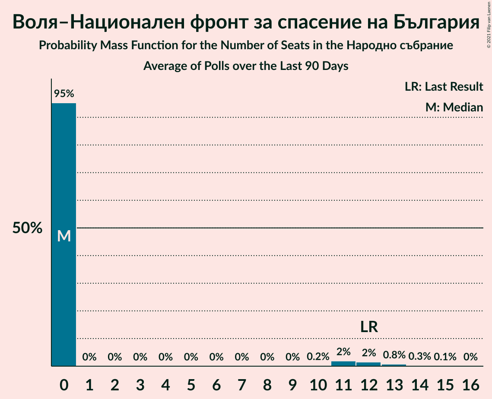

# Poll Average

<a href="#voting-intentions">Voting Intentions</a> | <a href="#seats">Seats</a> | <a href="#coalitions">Coalitions</a> | <a href="#technical-information">Technical Information</a>

## Summary

The table below lists the polls on which the average is based. They are the most recent polls (less than 90 days old) registered and analyzed so far.

| Period     | Polling firm/Commissioner(s) | ГЕРБ | БСП | ОП | ДПС | Воля | РБ | Да | АБВ | ВМРО | НФСБ | Атака | ДБ | ДСБ | ИТН | В | ИС.Б | РзБ | Воля–НФСБ |
|:----------:|:----------------------------:|:--:|:--:|:--:|:--:|:--:|:--:|:--:|:--:|:--:|:--:|:--:|:--:|:--:|:--:|:--:|:--:|:--:|:--:|
| 27 March 2017 | General Election | 33.5%   95 | 27.9%   80 | 9.3%   27 | 9.2%   26 | 4.3%   12 | 3.1%   0 | 3.0%   0 | 1.6%   0 | 0.0%   0 | 0.0%   0 | 0.0%   0 | 0.0%   0 | 0.0%   0 | 0.0%   0 | 0.0%   0 | 0.0%   0 | 0.0%   0 | 4.3%   12 |
| N/A | Poll Average | 23–32%   64–90 | 19–27%   50–78 | 2–7%   0–19 | 8–15%   22–40 | 2–4%   0 | N/A   N/A | N/A   N/A | 0–3%   0 | N/A   N/A | N/A   N/A | 0–3%   0 | 3–12%   0–30 | N/A   N/A | 11–18%   30–49 | 0–3%   0 | 3–7%   0–18 | 0–3%   0 | 1–4%   0–12 |
| [26 February–1 March 2021](2021-03-01-Алфарисърч.html) | Алфа рисърч   bTV | 25–33%   65–90 | 20–27%   54–72 | 2–6%   0–16 | 10–15%   27–42 | N/A   N/A | N/A   N/A | N/A   N/A | 0–2%   0 | N/A   N/A | N/A   N/A | 0–2%   0 | 4–8%   12–21 | N/A   N/A | 11–17%   31–44 | 0–2%   0 | 3–7%   0–19 | 0–2%   0 | 1–3%   0 |
| [22 February–1 March 2021](2021-03-01-GallupInternational.html) | Gallup International   BNR/BNT | 24–31%   63–84 | 20–27%   54–70 | 3–6%   0–16 | 10–16%   26–41 | N/A   N/A | N/A   N/A | N/A   N/A | 0–2%   0 | N/A   N/A | N/A   N/A | 0–2%   0 | 5–9%   12–24 | N/A   N/A | 11–16%   29–45 | 1–3%   0 | 3–7%   0–18 | 0–2%   0 | 2–4%   0–11 |
| [22–26 February 2021](2021-02-26-Медиана.html) | Медиана | 24–31%   64–86 | 21–28%   56–77 | 3–6%   0–16 | 9–14%   23–37 | N/A   N/A | N/A   N/A | N/A   N/A | 1–3%   0 | N/A   N/A | N/A   N/A | N/A   N/A | 3–6%   0–16 | N/A   N/A | 12–18%   33–50 | N/A   N/A | 4–7%   0–19 | N/A   N/A | 2–5%   0–13 |
| [15–22 February 2021](2021-02-22-Exacta.html) | Exacta | 23–30%   73–95 | 19–26%   61–81 | N/A   N/A | 6–11%   21–35 | N/A   N/A | N/A   N/A | N/A   N/A | N/A   N/A | N/A   N/A | N/A   N/A | N/A   N/A | 4–7%   0–23 | N/A   N/A | 11–16%   35–52 | N/A   N/A | N/A   N/A | N/A   N/A | N/A   N/A |
| [12–19 February 2021](2021-02-19-Тренд.html) | Тренд   24 часа/BNT | 25–33%   67–91 | 20–28%   55–78 | 2–6%   0–16 | 9–14%   23–39 | N/A   N/A | N/A   N/A | N/A   N/A | N/A   N/A | N/A   N/A | N/A   N/A | N/A   N/A | 4–9%   11–24 | N/A   N/A | 10–16%   27–45 | 0–2%   0 | 3–6%   0–17 | N/A   N/A | 1–4%   0–12 |
| [12–17 February 2021](2021-02-17-AFIS.html) | AFIS | 21–30%   62–88 | 19–27%   52–78 | 2–5%   0–15 | 9–15%   25–41 | N/A   N/A | N/A   N/A | N/A   N/A | 1–3%   0 | N/A   N/A | N/A   N/A | 1–3%   0 | 4–8%   0–25 | N/A   N/A | 11–18%   32–51 | 1–4%   0–12 | 3–6%   0–18 | 1–3%   0 | 1–4%   0 |
| [23–31 January 2021](2021-01-31-МаркетЛИНКС.html) | Маркет ЛИНКС | 26–31%   66–81 | 18–24%   47–60 | 2–5%   0–12 | 10–14%   25–36 | N/A   N/A | N/A   N/A | N/A   N/A | N/A   N/A | N/A   N/A | N/A   N/A | N/A   N/A | 9–13%   23–33 | N/A   N/A | 13–18%   34–46 | N/A   N/A | 4–7%   10–18 | N/A   N/A | N/A   N/A |
| [26 January 2020–31 January 2021](2021-01-31-SovaHarris.html) | Sova Harris | 24–30%   64–78 | 22–28%   60–74 | 5–8%   15–23 | 8–11%   22–28 | 2–4%   0 | N/A   N/A | N/A   N/A | 1–3%   0 | N/A   N/A | N/A   N/A | 1–2%   0 | 3–6%   0–13 | N/A   N/A | 13–18%   37–48 | 1–2%   0 | 4–6%   11–14 | 1–3%   0 | N/A   N/A |
| 27 March 2017 | General Election | 33.5%   95 | 27.9%   80 | 9.3%   27 | 9.2%   26 | 4.3%   12 | 3.1%   0 | 3.0%   0 | 1.6%   0 | 0.0%   0 | 0.0%   0 | 0.0%   0 | 0.0%   0 | 0.0%   0 | 0.0%   0 | 0.0%   0 | 0.0%   0 | 0.0%   0 | 4.3%   12 |

Only polls for which at least the sample size has been published are included in the table above.

**Legend:**
+ **Top half of each row:** Voting intentions (95% confidence interval)
+ **Bottom half of each row:** Seat projections for the Народно събрание (95% confidence interval)
+ **ГЕРБ:** Граждани за европейско развитие на България
+ **БСП:** Българска социалистическа партия
+ **ОП:** Обединени Патриоти
+ **ДПС:** Движение за права и свободи
+ **Воля:** Воля
+ **РБ:** Реформаторски блок
+ **Да:** Да, България!
+ **АБВ:** Алтернатива за българско възраждане
+ **ВМРО:** ВМРО–Българско Национално Движение
+ **НФСБ:** Национален фронт за спасение на България
+ **Атака:** Атака
+ **ДБ:** Демократична България
+ **ДСБ:** Демократи за силна България
+ **ИТН:** Има такъв народ
+ **В:** Възраждане
+ **ИС.Б:** Изправи се Бг
+ **РзБ:** Републиканци за България
+ **Воля–НФСБ:** Воля–Национален фронт за спасение на България
+ **N/A (single party):** Party not included the published results
+ **N/A (entire row):** Calculation for this opinion poll not started yet

## Voting Intentions

### Confidence Intervals

| Party | Last Result | Median | 80% Confidence Interval | 90% Confidence Interval | 95% Confidence Interval | 99% Confidence Interval |
|:-----:|:-----------:|:------:|:-----------------------:|:-----------------------:|:-----------------------:|:-----------------------:|
| <a href="#граждани-за-европейско-развитие-на-българия">Граждани за европейско развитие на България</a> | 33.5% | 27.6% | 24.8–30.3% |24.0–31.1% | 23.2–31.8% | 21.7–33.2% |
| <a href="#българска-социалистическа-партия">Българска социалистическа партия</a> | 27.9% | 23.2% | 20.5–25.9% |19.8–26.6% | 19.3–27.3% | 18.3–28.5% |
| <a href="#обединени-патриоти">Обединени Патриоти</a> | 9.3% | 4.0% | 2.9–6.0% |2.6–6.5% | 2.4–6.9% | 1.9–7.6% |
| <a href="#движение-за-права-и-свободи">Движение за права и свободи</a> | 9.2% | 11.2% | 8.6–13.5% |8.0–14.2% | 7.5–14.7% | 6.7–15.8% |
| <a href="#воля">Воля</a> | 4.3% | 2.9% | 2.2–3.6% |2.1–3.8% | 1.9–4.0% | 1.7–4.4% |
| <a href="#воля–национален-фронт-за-спасение-на-българия">Воля–Национален фронт за спасение на България</a> | 4.3% | 2.6% | 1.6–3.7% |1.4–4.1% | 1.2–4.4% | 1.0–5.1% |
| <a href="#реформаторски-блок">Реформаторски блок</a> | 3.1% | N/A | N/A |N/A | N/A | N/A |
| <a href="#да,-българия!">Да, България!</a> | 3.0% | N/A | N/A |N/A | N/A | N/A |
| <a href="#алтернатива-за-българско-възраждане">Алтернатива за българско възраждане</a> | 1.6% | 1.4% | 0.8–2.2% |0.6–2.5% | 0.5–2.8% | 0.4–3.3% |
| <a href="#вмро–българско-национално-движение">ВМРО–Българско Национално Движение</a> | 0.0% | N/A | N/A |N/A | N/A | N/A |
| <a href="#национален-фронт-за-спасение-на-българия">Национален фронт за спасение на България</a> | 0.0% | N/A | N/A |N/A | N/A | N/A |
| <a href="#атака">Атака</a> | 0.0% | 1.1% | 0.4–2.0% |0.3–2.4% | 0.3–2.7% | 0.2–3.3% |
| <a href="#демократична-българия">Демократична България</a> | 0.0% | 5.7% | 3.9–10.0% |3.6–11.0% | 3.3–11.6% | 2.9–12.6% |
| <a href="#демократи-за-силна-българия">Демократи за силна България</a> | 0.0% | N/A | N/A |N/A | N/A | N/A |
| <a href="#има-такъв-народ">Има такъв народ</a> | 0.0% | 14.3% | 12.0–16.5% |11.4–17.0% | 10.9–17.6% | 10.1–18.5% |
| <a href="#възраждане">Възраждане</a> | 0.0% | 1.3% | 0.7–2.5% |0.6–3.0% | 0.4–3.4% | 0.3–4.1% |
| <a href="#изправи-се-бг">Изправи се Бг</a> | 0.0% | 4.7% | 3.5–6.0% |3.2–6.3% | 2.9–6.7% | 2.5–7.4% |
| <a href="#републиканци-за-българия">Републиканци за България</a> | 0.0% | 1.3% | 0.6–2.1% |0.5–2.3% | 0.4–2.6% | 0.3–3.1% |

### Граждани за европейско развитие на България

*For a full overview of the results for this party, see the [Граждани за европейско развитие на България](party-гражданизаевропейскоразвитиенабългария.html) page.*

| Voting Intentions | Probability | Accumulated | Special Marks |
|:-----------------:|:-----------:|:-----------:|:-------------:|
| 18.5–19.5% | 0% | 100% |  |
| 19.5–20.5% | 0.1% | 100% |  |
| 20.5–21.5% | 0.3% | 99.9% |  |
| 21.5–22.5% | 0.9% | 99.6% |  |
| 22.5–23.5% | 2% | 98.7% |  |
| 23.5–24.5% | 5% | 97% |  |
| 24.5–25.5% | 9% | 92% |  |
| 25.5–26.5% | 14% | 83% |  |
| 26.5–27.5% | 18% | 68% |  |
| 27.5–28.5% | 18% | 50% | Median |
| 28.5–29.5% | 15% | 32% |  |
| 29.5–30.5% | 9% | 17% |  |
| 30.5–31.5% | 5% | 8% |  |
| 31.5–32.5% | 2% | 3% |  |
| 32.5–33.5% | 0.7% | 1.1% |  |
| 33.5–34.5% | 0.2% | 0.3% | Last Result |
| 34.5–35.5% | 0.1% | 0.1% |  |
| 35.5–36.5% | 0% | 0% |  |

### Българска социалистическа партия

*For a full overview of the results for this party, see the [Българска социалистическа партия](party-българскасоциалистическапартия.html) page.*

| Voting Intentions | Probability | Accumulated | Special Marks |
|:-----------------:|:-----------:|:-----------:|:-------------:|
| 15.5–16.5% | 0% | 100% |  |
| 16.5–17.5% | 0.1% | 100% |  |
| 17.5–18.5% | 0.7% | 99.9% |  |
| 18.5–19.5% | 3% | 99.2% |  |
| 19.5–20.5% | 7% | 96% |  |
| 20.5–21.5% | 12% | 89% |  |
| 21.5–22.5% | 16% | 77% |  |
| 22.5–23.5% | 17% | 62% | Median |
| 23.5–24.5% | 17% | 44% |  |
| 24.5–25.5% | 13% | 27% |  |
| 25.5–26.5% | 8% | 14% |  |
| 26.5–27.5% | 4% | 6% |  |
| 27.5–28.5% | 1.3% | 2% | Last Result |
| 28.5–29.5% | 0.4% | 0.5% |  |
| 29.5–30.5% | 0.1% | 0.1% |  |
| 30.5–31.5% | 0% | 0% |  |

### Обединени Патриоти

*For a full overview of the results for this party, see the [Обединени Патриоти](party-обединенипатриоти.html) page.*

| Voting Intentions | Probability | Accumulated | Special Marks |
|:-----------------:|:-----------:|:-----------:|:-------------:|
| 0.5–1.5% | 0.1% | 100% |  |
| 1.5–2.5% | 4% | 99.9% |  |
| 2.5–3.5% | 28% | 96% |  |
| 3.5–4.5% | 35% | 67% | Median |
| 4.5–5.5% | 17% | 32% |  |
| 5.5–6.5% | 10% | 15% |  |
| 6.5–7.5% | 4% | 5% |  |
| 7.5–8.5% | 0.6% | 0.6% |  |
| 8.5–9.5% | 0% | 0% | Last Result |

### Движение за права и свободи

*For a full overview of the results for this party, see the [Движение за права и свободи](party-движениезаправаисвободи.html) page.*

| Voting Intentions | Probability | Accumulated | Special Marks |
|:-----------------:|:-----------:|:-----------:|:-------------:|
| 4.5–5.5% | 0% | 100% |  |
| 5.5–6.5% | 0.3% | 100% |  |
| 6.5–7.5% | 2% | 99.6% |  |
| 7.5–8.5% | 7% | 97% |  |
| 8.5–9.5% | 13% | 91% | Last Result |
| 9.5–10.5% | 16% | 78% |  |
| 10.5–11.5% | 19% | 62% | Median |
| 11.5–12.5% | 20% | 43% |  |
| 12.5–13.5% | 14% | 23% |  |
| 13.5–14.5% | 7% | 10% |  |
| 14.5–15.5% | 2% | 3% |  |
| 15.5–16.5% | 0.6% | 0.8% |  |
| 16.5–17.5% | 0.1% | 0.2% |  |
| 17.5–18.5% | 0% | 0% |  |

### Воля–Национален фронт за спасение на България

*For a full overview of the results for this party, see the [Воля–Национален фронт за спасение на България](party-воля–националенфронтзаспасениенабългария.html) page.*

| Voting Intentions | Probability | Accumulated | Special Marks |
|:-----------------:|:-----------:|:-----------:|:-------------:|
| 0.0–0.5% | 0% | 100% |  |
| 0.5–1.5% | 9% | 100% |  |
| 1.5–2.5% | 41% | 91% |  |
| 2.5–3.5% | 37% | 51% | Median |
| 3.5–4.5% | 12% | 14% | Last Result |
| 4.5–5.5% | 2% | 2% |  |
| 5.5–6.5% | 0.1% | 0.1% |  |
| 6.5–7.5% | 0% | 0% |  |

### Воля

*For a full overview of the results for this party, see the [Воля](party-воля.html) page.*

| Voting Intentions | Probability | Accumulated | Special Marks |
|:-----------------:|:-----------:|:-----------:|:-------------:|
| 0.5–1.5% | 0.1% | 100% |  |
| 1.5–2.5% | 27% | 99.9% |  |
| 2.5–3.5% | 62% | 73% | Median |
| 3.5–4.5% | 11% | 11% | Last Result |
| 4.5–5.5% | 0.3% | 0.3% |  |
| 5.5–6.5% | 0% | 0% |  |

### Алтернатива за българско възраждане

*For a full overview of the results for this party, see the [Алтернатива за българско възраждане](party-алтернативазабългарсковъзраждане.html) page.*

| Voting Intentions | Probability | Accumulated | Special Marks |
|:-----------------:|:-----------:|:-----------:|:-------------:|
| 0.0–0.5% | 3% | 100% |  |
| 0.5–1.5% | 55% | 97% | Median |
| 1.5–2.5% | 38% | 42% | Last Result |
| 2.5–3.5% | 4% | 5% |  |
| 3.5–4.5% | 0.3% | 0.3% |  |
| 4.5–5.5% | 0% | 0% |  |

### Атака

*For a full overview of the results for this party, see the [Атака](party-атака.html) page.*

| Voting Intentions | Probability | Accumulated | Special Marks |
|:-----------------:|:-----------:|:-----------:|:-------------:|
| 0.0–0.5% | 17% | 100% | Last Result |
| 0.5–1.5% | 58% | 83% | Median |
| 1.5–2.5% | 22% | 25% |  |
| 2.5–3.5% | 3% | 3% |  |
| 3.5–4.5% | 0.3% | 0.3% |  |
| 4.5–5.5% | 0% | 0% |  |

### Демократична България

*For a full overview of the results for this party, see the [Демократична България](party-демократичнабългария.html) page.*

| Voting Intentions | Probability | Accumulated | Special Marks |
|:-----------------:|:-----------:|:-----------:|:-------------:|
| 0.0–0.5% | 0% | 100% | Last Result |
| 0.5–1.5% | 0% | 100% |  |
| 1.5–2.5% | 0.1% | 100% |  |
| 2.5–3.5% | 5% | 99.9% |  |
| 3.5–4.5% | 18% | 95% |  |
| 4.5–5.5% | 24% | 77% |  |
| 5.5–6.5% | 22% | 53% | Median |
| 6.5–7.5% | 13% | 31% |  |
| 7.5–8.5% | 5% | 19% |  |
| 8.5–9.5% | 2% | 14% |  |
| 9.5–10.5% | 4% | 11% |  |
| 10.5–11.5% | 5% | 7% |  |
| 11.5–12.5% | 2% | 3% |  |
| 12.5–13.5% | 0.5% | 0.5% |  |
| 13.5–14.5% | 0% | 0% |  |
| 14.5–15.5% | 0% | 0% |  |

### Има такъв народ

*For a full overview of the results for this party, see the [Има такъв народ](party-иматакъвнарод.html) page.*

| Voting Intentions | Probability | Accumulated | Special Marks |
|:-----------------:|:-----------:|:-----------:|:-------------:|
| 0.0–0.5% | 0% | 100% | Last Result |
| 0.5–1.5% | 0% | 100% |  |
| 1.5–2.5% | 0% | 100% |  |
| 2.5–3.5% | 0% | 100% |  |
| 3.5–4.5% | 0% | 100% |  |
| 4.5–5.5% | 0% | 100% |  |
| 5.5–6.5% | 0% | 100% |  |
| 6.5–7.5% | 0% | 100% |  |
| 7.5–8.5% | 0% | 100% |  |
| 8.5–9.5% | 0.2% | 100% |  |
| 9.5–10.5% | 1.1% | 99.8% |  |
| 10.5–11.5% | 5% | 98.7% |  |
| 11.5–12.5% | 11% | 94% |  |
| 12.5–13.5% | 18% | 83% |  |
| 13.5–14.5% | 21% | 65% | Median |
| 14.5–15.5% | 20% | 44% |  |
| 15.5–16.5% | 15% | 24% |  |
| 16.5–17.5% | 7% | 9% |  |
| 17.5–18.5% | 2% | 3% |  |
| 18.5–19.5% | 0.4% | 0.5% |  |
| 19.5–20.5% | 0.1% | 0.1% |  |
| 20.5–21.5% | 0% | 0% |  |

### Изправи се Бг

*For a full overview of the results for this party, see the [Изправи се Бг](party-изправисебг.html) page.*

| Voting Intentions | Probability | Accumulated | Special Marks |
|:-----------------:|:-----------:|:-----------:|:-------------:|
| 0.0–0.5% | 0% | 100% | Last Result |
| 0.5–1.5% | 0% | 100% |  |
| 1.5–2.5% | 0.7% | 100% |  |
| 2.5–3.5% | 10% | 99.3% |  |
| 3.5–4.5% | 32% | 90% |  |
| 4.5–5.5% | 37% | 57% | Median |
| 5.5–6.5% | 16% | 20% |  |
| 6.5–7.5% | 3% | 3% |  |
| 7.5–8.5% | 0.3% | 0.3% |  |
| 8.5–9.5% | 0% | 0% |  |

### Възраждане

*For a full overview of the results for this party, see the [Възраждане](party-възраждане.html) page.*

| Voting Intentions | Probability | Accumulated | Special Marks |
|:-----------------:|:-----------:|:-----------:|:-------------:|
| 0.0–0.5% | 5% | 100% | Last Result |
| 0.5–1.5% | 59% | 95% | Median |
| 1.5–2.5% | 26% | 36% |  |
| 2.5–3.5% | 8% | 10% |  |
| 3.5–4.5% | 2% | 2% |  |
| 4.5–5.5% | 0.2% | 0.2% |  |
| 5.5–6.5% | 0% | 0% |  |

### Републиканци за България

*For a full overview of the results for this party, see the [Републиканци за България](party-републиканцизабългария.html) page.*

| Voting Intentions | Probability | Accumulated | Special Marks |
|:-----------------:|:-----------:|:-----------:|:-------------:|
| 0.0–0.5% | 7% | 100% | Last Result |
| 0.5–1.5% | 60% | 93% | Median |
| 1.5–2.5% | 30% | 33% |  |
| 2.5–3.5% | 3% | 3% |  |
| 3.5–4.5% | 0.1% | 0.1% |  |
| 4.5–5.5% | 0% | 0% |  |

## Seats

### Confidence Intervals

| Party | Last Result | Median | 80% Confidence Interval | 90% Confidence Interval | 95% Confidence Interval | 99% Confidence Interval |
|:-----:|:-----------:|:------:|:-----------------------:|:-----------------------:|:-----------------------:|:-----------------------:|
| <a href="#граждани-за-европейско-развитие-на-българия">Граждани за европейско развитие на България</a> | 95 | 76 | 68–85 |66–88 | 64–90 | 60–95 |
| <a href="#българска-социалистическа-партия">Българска социалистическа партия</a> | 80 | 64 | 55–72 |52–75 | 50–78 | 48–81 |
| <a href="#обединени-патриоти">Обединени Патриоти</a> | 27 | 0 | 0–17 |0–17 | 0–19 | 0–23 |
| <a href="#движение-за-права-и-свободи">Движение за права и свободи</a> | 26 | 30 | 25–37 |23–38 | 22–40 | 20–43 |
| <a href="#воля">Воля</a> | 12 | 0 | 0 |0 | 0 | 0–11 |
| <a href="#воля–национален-фронт-за-спасение-на-българия">Воля–Национален фронт за спасение на България</a> | 12 | 0 | 0 |0 | 0–12 | 0–13 |
| <a href="#реформаторски-блок">Реформаторски блок</a> | 0 | N/A | N/A |N/A | N/A | N/A |
| <a href="#да,-българия!">Да, България!</a> | 0 | N/A | N/A |N/A | N/A | N/A |
| <a href="#алтернатива-за-българско-възраждане">Алтернатива за българско възраждане</a> | 0 | 0 | 0 |0 | 0 | 0 |
| <a href="#вмро–българско-национално-движение">ВМРО–Българско Национално Движение</a> | 0 | N/A | N/A |N/A | N/A | N/A |
| <a href="#национален-фронт-за-спасение-на-българия">Национален фронт за спасение на България</a> | 0 | N/A | N/A |N/A | N/A | N/A |
| <a href="#атака">Атака</a> | 0 | 0 | 0 |0 | 0 | 0 |
| <a href="#демократична-българия">Демократична България</a> | 0 | 16 | 0–26 |0–28 | 0–30 | 0–32 |
| <a href="#демократи-за-силна-българия">Демократи за силна България</a> | 0 | N/A | N/A |N/A | N/A | N/A |
| <a href="#има-такъв-народ">Има такъв народ</a> | 0 | 41 | 33–48 |32–48 | 30–49 | 27–53 |
| <a href="#възраждане">Възраждане</a> | 0 | 0 | 0 |0 | 0 | 0–12 |
| <a href="#изправи-се-бг">Изправи се Бг</a> | 0 | 13 | 0–16 |0–17 | 0–18 | 0–20 |
| <a href="#републиканци-за-българия">Републиканци за България</a> | 0 | 0 | 0 |0 | 0 | 0 |

### Граждани за европейско развитие на България

*For a full overview of the results for this party, see the [Граждани за европейско развитие на България](party-гражданизаевропейскоразвитиенабългария.html) page.*

| Number of Seats | Probability | Accumulated | Special Marks |
|:---------------:|:-----------:|:-----------:|:-------------:|
| 56 | 0% | 100% |  |
| 57 | 0.1% | 99.9% |  |
| 58 | 0% | 99.9% |  |
| 59 | 0.1% | 99.8% |  |
| 60 | 0.3% | 99.7% |  |
| 61 | 0.2% | 99.5% |  |
| 62 | 0.4% | 99.2% |  |
| 63 | 1.1% | 98.9% |  |
| 64 | 1.0% | 98% |  |
| 65 | 1.2% | 97% |  |
| 66 | 2% | 96% |  |
| 67 | 2% | 94% |  |
| 68 | 2% | 92% |  |
| 69 | 9% | 90% |  |
| 70 | 5% | 80% |  |
| 71 | 6% | 76% |  |
| 72 | 7% | 70% |  |
| 73 | 4% | 63% |  |
| 74 | 3% | 59% |  |
| 75 | 5% | 56% |  |
| 76 | 5% | 51% | Median |
| 77 | 5% | 46% |  |
| 78 | 6% | 42% |  |
| 79 | 4% | 36% |  |
| 80 | 4% | 32% |  |
| 81 | 9% | 28% |  |
| 82 | 3% | 19% |  |
| 83 | 3% | 16% |  |
| 84 | 2% | 13% |  |
| 85 | 1.3% | 11% |  |
| 86 | 1.5% | 10% |  |
| 87 | 2% | 8% |  |
| 88 | 2% | 7% |  |
| 89 | 2% | 5% |  |
| 90 | 1.2% | 3% |  |
| 91 | 0.5% | 2% |  |
| 92 | 0.4% | 1.4% |  |
| 93 | 0.3% | 1.1% |  |
| 94 | 0.3% | 0.8% |  |
| 95 | 0.2% | 0.5% | Last Result |
| 96 | 0.1% | 0.3% |  |
| 97 | 0.1% | 0.2% |  |
| 98 | 0% | 0.1% |  |
| 99 | 0% | 0.1% |  |
| 100 | 0% | 0.1% |  |
| 101 | 0% | 0% |  |

### Българска социалистическа партия

*For a full overview of the results for this party, see the [Българска социалистическа партия](party-българскасоциалистическапартия.html) page.*

| Number of Seats | Probability | Accumulated | Special Marks |
|:---------------:|:-----------:|:-----------:|:-------------:|
| 45 | 0.1% | 100% |  |
| 46 | 0.1% | 99.9% |  |
| 47 | 0.2% | 99.7% |  |
| 48 | 0.4% | 99.5% |  |
| 49 | 0.7% | 99.1% |  |
| 50 | 0.9% | 98% |  |
| 51 | 1.4% | 97% |  |
| 52 | 2% | 96% |  |
| 53 | 2% | 94% |  |
| 54 | 2% | 92% |  |
| 55 | 2% | 90% |  |
| 56 | 3% | 88% |  |
| 57 | 2% | 86% |  |
| 58 | 7% | 83% |  |
| 59 | 4% | 76% |  |
| 60 | 5% | 72% |  |
| 61 | 4% | 67% |  |
| 62 | 4% | 63% |  |
| 63 | 5% | 59% |  |
| 64 | 5% | 54% | Median |
| 65 | 5% | 49% |  |
| 66 | 4% | 44% |  |
| 67 | 11% | 40% |  |
| 68 | 6% | 29% |  |
| 69 | 3% | 23% |  |
| 70 | 5% | 21% |  |
| 71 | 3% | 16% |  |
| 72 | 4% | 13% |  |
| 73 | 2% | 9% |  |
| 74 | 2% | 8% |  |
| 75 | 1.3% | 6% |  |
| 76 | 0.8% | 5% |  |
| 77 | 1.0% | 4% |  |
| 78 | 1.3% | 3% |  |
| 79 | 0.7% | 2% |  |
| 80 | 0.3% | 0.9% | Last Result |
| 81 | 0.2% | 0.6% |  |
| 82 | 0.1% | 0.4% |  |
| 83 | 0.1% | 0.3% |  |
| 84 | 0.1% | 0.2% |  |
| 85 | 0% | 0.1% |  |
| 86 | 0% | 0.1% |  |
| 87 | 0% | 0% |  |

### Обединени Патриоти

*For a full overview of the results for this party, see the [Обединени Патриоти](party-обединенипатриоти.html) page.*

| Number of Seats | Probability | Accumulated | Special Marks |
|:---------------:|:-----------:|:-----------:|:-------------:|
| 0 | 52% | 100% | Median |
| 1 | 0% | 48% |  |
| 2 | 0% | 48% |  |
| 3 | 0% | 48% |  |
| 4 | 0% | 48% |  |
| 5 | 0% | 48% |  |
| 6 | 0% | 48% |  |
| 7 | 0% | 48% |  |
| 8 | 0% | 48% |  |
| 9 | 0% | 48% |  |
| 10 | 1.2% | 48% |  |
| 11 | 7% | 47% |  |
| 12 | 12% | 40% |  |
| 13 | 5% | 28% |  |
| 14 | 5% | 24% |  |
| 15 | 2% | 18% |  |
| 16 | 3% | 16% |  |
| 17 | 9% | 14% |  |
| 18 | 1.0% | 5% |  |
| 19 | 2% | 4% |  |
| 20 | 0.4% | 2% |  |
| 21 | 0.1% | 1.3% |  |
| 22 | 0% | 1.2% |  |
| 23 | 1.2% | 1.2% |  |
| 24 | 0% | 0% |  |
| 25 | 0% | 0% |  |
| 26 | 0% | 0% |  |
| 27 | 0% | 0% | Last Result |

### Движение за права и свободи

*For a full overview of the results for this party, see the [Движение за права и свободи](party-движениезаправаисвободи.html) page.*

| Number of Seats | Probability | Accumulated | Special Marks |
|:---------------:|:-----------:|:-----------:|:-------------:|
| 18 | 0% | 100% |  |
| 19 | 0.1% | 99.9% |  |
| 20 | 0.4% | 99.8% |  |
| 21 | 0.5% | 99.5% |  |
| 22 | 3% | 98.9% |  |
| 23 | 2% | 96% |  |
| 24 | 2% | 94% |  |
| 25 | 12% | 92% |  |
| 26 | 5% | 80% | Last Result |
| 27 | 6% | 76% |  |
| 28 | 6% | 69% |  |
| 29 | 7% | 64% |  |
| 30 | 8% | 57% | Median |
| 31 | 8% | 49% |  |
| 32 | 12% | 41% |  |
| 33 | 6% | 29% |  |
| 34 | 4% | 23% |  |
| 35 | 4% | 18% |  |
| 36 | 3% | 14% |  |
| 37 | 3% | 11% |  |
| 38 | 4% | 8% |  |
| 39 | 0.9% | 4% |  |
| 40 | 2% | 3% |  |
| 41 | 0.4% | 1.5% |  |
| 42 | 0.5% | 1.1% |  |
| 43 | 0.3% | 0.6% |  |
| 44 | 0.1% | 0.3% |  |
| 45 | 0.1% | 0.2% |  |
| 46 | 0% | 0.1% |  |
| 47 | 0% | 0.1% |  |
| 48 | 0% | 0% |  |

### Воля

*For a full overview of the results for this party, see the [Воля](party-воля.html) page.*

| Number of Seats | Probability | Accumulated | Special Marks |
|:---------------:|:-----------:|:-----------:|:-------------:|
| 0 | 99.5% | 100% | Median |
| 1 | 0% | 0.5% |  |
| 2 | 0% | 0.5% |  |
| 3 | 0% | 0.5% |  |
| 4 | 0% | 0.5% |  |
| 5 | 0% | 0.5% |  |
| 6 | 0% | 0.5% |  |
| 7 | 0% | 0.5% |  |
| 8 | 0% | 0.5% |  |
| 9 | 0% | 0.5% |  |
| 10 | 0% | 0.5% |  |
| 11 | 0.1% | 0.5% |  |
| 12 | 0.4% | 0.4% | Last Result |
| 13 | 0% | 0.1% |  |
| 14 | 0% | 0% |  |

### Воля–Национален фронт за спасение на България

*For a full overview of the results for this party, see the [Воля–Национален фронт за спасение на България](party-воля–националенфронтзаспасениенабългария.html) page.*

| Number of Seats | Probability | Accumulated | Special Marks |
|:---------------:|:-----------:|:-----------:|:-------------:|
| 0 | 95% | 100% | Median |
| 1 | 0% | 5% |  |
| 2 | 0% | 5% |  |
| 3 | 0% | 5% |  |
| 4 | 0% | 5% |  |
| 5 | 0% | 5% |  |
| 6 | 0% | 5% |  |
| 7 | 0% | 5% |  |
| 8 | 0% | 5% |  |
| 9 | 0% | 5% |  |
| 10 | 0.2% | 5% |  |
| 11 | 2% | 5% |  |
| 12 | 2% | 3% | Last Result |
| 13 | 0.8% | 1.1% |  |
| 14 | 0.3% | 0.4% |  |
| 15 | 0.1% | 0.1% |  |
| 16 | 0% | 0% |  |

### Реформаторски блок

*For a full overview of the results for this party, see the [Реформаторски блок](party-реформаторскиблок.html) page.*

### Да, България!

*For a full overview of the results for this party, see the [Да, България!](party-дабългария.html) page.*

### Алтернатива за българско възраждане

*For a full overview of the results for this party, see the [Алтернатива за българско възраждане](party-алтернативазабългарсковъзраждане.html) page.*

| Number of Seats | Probability | Accumulated | Special Marks |
|:---------------:|:-----------:|:-----------:|:-------------:|
| 0 | 99.9% | 100% | Last Result, Median |
| 1 | 0% | 0.1% |  |
| 2 | 0% | 0.1% |  |
| 3 | 0% | 0.1% |  |
| 4 | 0% | 0.1% |  |
| 5 | 0% | 0.1% |  |
| 6 | 0% | 0.1% |  |
| 7 | 0% | 0.1% |  |
| 8 | 0% | 0.1% |  |
| 9 | 0% | 0.1% |  |
| 10 | 0% | 0.1% |  |
| 11 | 0% | 0.1% |  |
| 12 | 0% | 0% |  |

### ВМРО–Българско Национално Движение

*For a full overview of the results for this party, see the [ВМРО–Българско Национално Движение](party-вмро–българсконационалнодвижение.html) page.*

### Национален фронт за спасение на България

*For a full overview of the results for this party, see the [Национален фронт за спасение на България](party-националенфронтзаспасениенабългария.html) page.*

### Атака

*For a full overview of the results for this party, see the [Атака](party-атака.html) page.*

| Number of Seats | Probability | Accumulated | Special Marks |
|:---------------:|:-----------:|:-----------:|:-------------:|
| 0 | 100% | 100% | Last Result, Median |

### Демократична България

*For a full overview of the results for this party, see the [Демократична България](party-демократичнабългария.html) page.*

| Number of Seats | Probability | Accumulated | Special Marks |
|:---------------:|:-----------:|:-----------:|:-------------:|
| 0 | 18% | 100% | Last Result |
| 1 | 0% | 82% |  |
| 2 | 0% | 82% |  |
| 3 | 0% | 82% |  |
| 4 | 0% | 82% |  |
| 5 | 0% | 82% |  |
| 6 | 0% | 82% |  |
| 7 | 0% | 82% |  |
| 8 | 0% | 82% |  |
| 9 | 0% | 82% |  |
| 10 | 0.1% | 82% |  |
| 11 | 3% | 82% |  |
| 12 | 6% | 79% |  |
| 13 | 7% | 73% |  |
| 14 | 5% | 66% |  |
| 15 | 10% | 61% |  |
| 16 | 8% | 52% | Median |
| 17 | 6% | 44% |  |
| 18 | 8% | 38% |  |
| 19 | 5% | 30% |  |
| 20 | 4% | 25% |  |
| 21 | 4% | 21% |  |
| 22 | 2% | 17% |  |
| 23 | 2% | 15% |  |
| 24 | 1.4% | 13% |  |
| 25 | 2% | 12% |  |
| 26 | 2% | 10% |  |
| 27 | 2% | 8% |  |
| 28 | 2% | 6% |  |
| 29 | 2% | 4% |  |
| 30 | 1.0% | 3% |  |
| 31 | 0.8% | 2% |  |
| 32 | 0.4% | 0.8% |  |
| 33 | 0.2% | 0.4% |  |
| 34 | 0.1% | 0.2% |  |
| 35 | 0% | 0.1% |  |
| 36 | 0% | 0% |  |

### Демократи за силна България

*For a full overview of the results for this party, see the [Демократи за силна България](party-демократизасилнабългария.html) page.*

### Има такъв народ

*For a full overview of the results for this party, see the [Има такъв народ](party-иматакъвнарод.html) page.*

| Number of Seats | Probability | Accumulated | Special Marks |
|:---------------:|:-----------:|:-----------:|:-------------:|
| 0 | 0% | 100% | Last Result |
| 1 | 0% | 100% |  |
| 2 | 0% | 100% |  |
| 3 | 0% | 100% |  |
| 4 | 0% | 100% |  |
| 5 | 0% | 100% |  |
| 6 | 0% | 100% |  |
| 7 | 0% | 100% |  |
| 8 | 0% | 100% |  |
| 9 | 0% | 100% |  |
| 10 | 0% | 100% |  |
| 11 | 0% | 100% |  |
| 12 | 0% | 100% |  |
| 13 | 0% | 100% |  |
| 14 | 0% | 100% |  |
| 15 | 0% | 100% |  |
| 16 | 0% | 100% |  |
| 17 | 0% | 100% |  |
| 18 | 0% | 100% |  |
| 19 | 0% | 100% |  |
| 20 | 0% | 100% |  |
| 21 | 0% | 100% |  |
| 22 | 0% | 100% |  |
| 23 | 0% | 100% |  |
| 24 | 0% | 100% |  |
| 25 | 0.1% | 99.9% |  |
| 26 | 0.1% | 99.8% |  |
| 27 | 0.3% | 99.7% |  |
| 28 | 0.5% | 99.4% |  |
| 29 | 0.7% | 98.8% |  |
| 30 | 1.1% | 98% |  |
| 31 | 2% | 97% |  |
| 32 | 3% | 95% |  |
| 33 | 2% | 92% |  |
| 34 | 4% | 90% |  |
| 35 | 4% | 86% |  |
| 36 | 5% | 82% |  |
| 37 | 5% | 77% |  |
| 38 | 10% | 72% |  |
| 39 | 6% | 62% |  |
| 40 | 6% | 56% |  |
| 41 | 6% | 50% | Median |
| 42 | 14% | 45% |  |
| 43 | 4% | 31% |  |
| 44 | 5% | 27% |  |
| 45 | 3% | 22% |  |
| 46 | 3% | 20% |  |
| 47 | 4% | 16% |  |
| 48 | 9% | 12% |  |
| 49 | 0.8% | 3% |  |
| 50 | 0.8% | 2% |  |
| 51 | 0.3% | 1.2% |  |
| 52 | 0.3% | 0.8% |  |
| 53 | 0.3% | 0.6% |  |
| 54 | 0.1% | 0.3% |  |
| 55 | 0.1% | 0.2% |  |
| 56 | 0% | 0.1% |  |
| 57 | 0% | 0.1% |  |
| 58 | 0% | 0% |  |

### Възраждане

*For a full overview of the results for this party, see the [Възраждане](party-възраждане.html) page.*

| Number of Seats | Probability | Accumulated | Special Marks |
|:---------------:|:-----------:|:-----------:|:-------------:|
| 0 | 99.4% | 100% | Last Result, Median |
| 1 | 0% | 0.6% |  |
| 2 | 0% | 0.6% |  |
| 3 | 0% | 0.6% |  |
| 4 | 0% | 0.6% |  |
| 5 | 0% | 0.6% |  |
| 6 | 0% | 0.6% |  |
| 7 | 0% | 0.6% |  |
| 8 | 0% | 0.6% |  |
| 9 | 0% | 0.6% |  |
| 10 | 0% | 0.6% |  |
| 11 | 0% | 0.6% |  |
| 12 | 0.1% | 0.5% |  |
| 13 | 0.3% | 0.4% |  |
| 14 | 0.1% | 0.2% |  |
| 15 | 0% | 0% |  |

### Изправи се Бг

*For a full overview of the results for this party, see the [Изправи се Бг](party-изправисебг.html) page.*

| Number of Seats | Probability | Accumulated | Special Marks |
|:---------------:|:-----------:|:-----------:|:-------------:|
| 0 | 32% | 100% | Last Result |
| 1 | 0% | 68% |  |
| 2 | 0% | 68% |  |
| 3 | 0% | 68% |  |
| 4 | 0% | 68% |  |
| 5 | 0% | 68% |  |
| 6 | 0% | 68% |  |
| 7 | 0% | 68% |  |
| 8 | 0% | 68% |  |
| 9 | 0% | 68% |  |
| 10 | 0.3% | 68% |  |
| 11 | 8% | 68% |  |
| 12 | 10% | 60% |  |
| 13 | 11% | 50% | Median |
| 14 | 20% | 39% |  |
| 15 | 7% | 19% |  |
| 16 | 6% | 12% |  |
| 17 | 3% | 6% |  |
| 18 | 1.0% | 3% |  |
| 19 | 0.9% | 2% |  |
| 20 | 0.4% | 0.7% |  |
| 21 | 0.2% | 0.3% |  |
| 22 | 0.1% | 0.1% |  |
| 23 | 0% | 0% |  |

### Републиканци за България

*For a full overview of the results for this party, see the [Републиканци за България](party-републиканцизабългария.html) page.*

| Number of Seats | Probability | Accumulated | Special Marks |
|:---------------:|:-----------:|:-----------:|:-------------:|
| 0 | 100% | 100% | Last Result, Median |

## Coalitions

### Confidence Intervals

| Coalition | Last Result | Median | Majority? | 80% Confidence Interval | 90% Confidence Interval | 95% Confidence Interval | 99% Confidence Interval |
|:---------:|:-----------:|:------:|:---------:|:-----------------------:|:-----------------------:|:-----------------------:|:-----------------------:|
| Българска социалистическа партия – Движение за права и свободи – Изправи се Бг – Има такъв народ | 106 | 142 | 99.8% | 132–154 | 130–156 | 128–160 | 124–164 |
| Българска социалистическа партия – Движение за права и свободи – Има такъв народ | 106 | 135 | 95% | 123–146 | 121–148 | 118–150 | 114–156 |
| Българска социалистическа партия – Движение за права и свободи – Изправи се Бг | 106 | 103 | 1.1% | 92–113 | 90–116 | 90–119 | 85–124 |
| Българска социалистическа партия – Движение за права и свободи | 106 | 93 | 0% | 85–104 | 82–107 | 80–109 | 77–113 |
| Граждани за европейско развитие на България – Обединени Патриоти | 122 | 82 | 0% | 72–93 | 70–93 | 67–97 | 63–101 |

### Българска социалистическа партия – Движение за права и свободи – Изправи се Бг – Има такъв народ

| Number of Seats | Probability | Accumulated | Special Marks |
|:---------------:|:-----------:|:-----------:|:-------------:|
| 106 | 0% | 100% | Last Result |
| 107 | 0% | 100% |  |
| 108 | 0% | 100% |  |
| 109 | 0% | 100% |  |
| 110 | 0% | 100% |  |
| 111 | 0% | 100% |  |
| 112 | 0% | 100% |  |
| 113 | 0% | 100% |  |
| 114 | 0% | 100% |  |
| 115 | 0% | 100% |  |
| 116 | 0% | 100% |  |
| 117 | 0% | 100% |  |
| 118 | 0% | 99.9% |  |
| 119 | 0% | 99.9% |  |
| 120 | 0% | 99.9% |  |
| 121 | 0.1% | 99.8% | Majority |
| 122 | 0.1% | 99.8% |  |
| 123 | 0.1% | 99.7% |  |
| 124 | 0.1% | 99.6% |  |
| 125 | 0.3% | 99.5% |  |
| 126 | 0.7% | 99.1% |  |
| 127 | 0.7% | 98% |  |
| 128 | 0.7% | 98% |  |
| 129 | 1.1% | 97% |  |
| 130 | 1.1% | 96% |  |
| 131 | 1.5% | 95% |  |
| 132 | 7% | 93% |  |
| 133 | 3% | 86% |  |
| 134 | 3% | 83% |  |
| 135 | 3% | 80% |  |
| 136 | 3% | 77% |  |
| 137 | 3% | 74% |  |
| 138 | 4% | 71% |  |
| 139 | 4% | 67% |  |
| 140 | 4% | 63% |  |
| 141 | 6% | 59% |  |
| 142 | 6% | 54% |  |
| 143 | 4% | 48% |  |
| 144 | 4% | 44% |  |
| 145 | 3% | 40% |  |
| 146 | 2% | 37% |  |
| 147 | 4% | 35% |  |
| 148 | 3% | 30% | Median |
| 149 | 3% | 28% |  |
| 150 | 2% | 25% |  |
| 151 | 4% | 22% |  |
| 152 | 1.3% | 18% |  |
| 153 | 2% | 17% |  |
| 154 | 9% | 15% |  |
| 155 | 1.2% | 6% |  |
| 156 | 0.5% | 5% |  |
| 157 | 1.1% | 5% |  |
| 158 | 0.4% | 3% |  |
| 159 | 0.5% | 3% |  |
| 160 | 0.6% | 3% |  |
| 161 | 0.7% | 2% |  |
| 162 | 0.3% | 1.3% |  |
| 163 | 0.5% | 1.0% |  |
| 164 | 0.1% | 0.5% |  |
| 165 | 0.1% | 0.4% |  |
| 166 | 0% | 0.4% |  |
| 167 | 0% | 0.4% |  |
| 168 | 0.2% | 0.3% |  |
| 169 | 0.1% | 0.2% |  |
| 170 | 0% | 0.1% |  |
| 171 | 0% | 0% |  |

### Българска социалистическа партия – Движение за права и свободи – Има такъв народ

| Number of Seats | Probability | Accumulated | Special Marks |
|:---------------:|:-----------:|:-----------:|:-------------:|
| 106 | 0% | 100% | Last Result |
| 107 | 0% | 100% |  |
| 108 | 0% | 100% |  |
| 109 | 0% | 100% |  |
| 110 | 0% | 100% |  |
| 111 | 0.1% | 99.9% |  |
| 112 | 0.1% | 99.9% |  |
| 113 | 0.1% | 99.8% |  |
| 114 | 0.2% | 99.7% |  |
| 115 | 0.3% | 99.5% |  |
| 116 | 0.5% | 99.2% |  |
| 117 | 0.7% | 98.7% |  |
| 118 | 0.8% | 98% |  |
| 119 | 1.2% | 97% |  |
| 120 | 1.0% | 96% |  |
| 121 | 2% | 95% | Majority |
| 122 | 2% | 93% |  |
| 123 | 2% | 91% |  |
| 124 | 2% | 89% |  |
| 125 | 2% | 87% |  |
| 126 | 3% | 85% |  |
| 127 | 3% | 82% |  |
| 128 | 6% | 79% |  |
| 129 | 3% | 73% |  |
| 130 | 3% | 71% |  |
| 131 | 3% | 68% |  |
| 132 | 7% | 65% |  |
| 133 | 3% | 57% |  |
| 134 | 3% | 54% |  |
| 135 | 4% | 51% | Median |
| 136 | 4% | 47% |  |
| 137 | 5% | 44% |  |
| 138 | 3% | 39% |  |
| 139 | 3% | 36% |  |
| 140 | 11% | 33% |  |
| 141 | 2% | 22% |  |
| 142 | 2% | 20% |  |
| 143 | 3% | 18% |  |
| 144 | 3% | 15% |  |
| 145 | 2% | 12% |  |
| 146 | 1.3% | 11% |  |
| 147 | 3% | 9% |  |
| 148 | 1.3% | 6% |  |
| 149 | 2% | 5% |  |
| 150 | 0.9% | 3% |  |
| 151 | 0.4% | 2% |  |
| 152 | 0.3% | 2% |  |
| 153 | 0.2% | 1.4% |  |
| 154 | 0.6% | 1.2% |  |
| 155 | 0.1% | 0.6% |  |
| 156 | 0.1% | 0.5% |  |
| 157 | 0.1% | 0.4% |  |
| 158 | 0.1% | 0.3% |  |
| 159 | 0% | 0.2% |  |
| 160 | 0% | 0.1% |  |
| 161 | 0% | 0.1% |  |
| 162 | 0% | 0.1% |  |
| 163 | 0% | 0% |  |

### Българска социалистическа партия – Движение за права и свободи – Изправи се Бг

| Number of Seats | Probability | Accumulated | Special Marks |
|:---------------:|:-----------:|:-----------:|:-------------:|
| 81 | 0% | 100% |  |
| 82 | 0.1% | 99.9% |  |
| 83 | 0.1% | 99.9% |  |
| 84 | 0.2% | 99.8% |  |
| 85 | 0.2% | 99.6% |  |
| 86 | 0.2% | 99.4% |  |
| 87 | 0.3% | 99.2% |  |
| 88 | 0.6% | 98.9% |  |
| 89 | 0.6% | 98% |  |
| 90 | 6% | 98% |  |
| 91 | 1.2% | 92% |  |
| 92 | 2% | 91% |  |
| 93 | 3% | 89% |  |
| 94 | 3% | 86% |  |
| 95 | 4% | 84% |  |
| 96 | 3% | 79% |  |
| 97 | 4% | 76% |  |
| 98 | 5% | 72% |  |
| 99 | 5% | 68% |  |
| 100 | 4% | 63% |  |
| 101 | 4% | 58% |  |
| 102 | 3% | 54% |  |
| 103 | 6% | 51% |  |
| 104 | 5% | 45% |  |
| 105 | 2% | 40% |  |
| 106 | 9% | 38% | Last Result |
| 107 | 5% | 29% | Median |
| 108 | 3% | 23% |  |
| 109 | 3% | 20% |  |
| 110 | 3% | 17% |  |
| 111 | 1.3% | 14% |  |
| 112 | 2% | 13% |  |
| 113 | 3% | 11% |  |
| 114 | 1.1% | 8% |  |
| 115 | 0.8% | 7% |  |
| 116 | 2% | 6% |  |
| 117 | 0.5% | 4% |  |
| 118 | 0.8% | 4% |  |
| 119 | 0.6% | 3% |  |
| 120 | 1.0% | 2% |  |
| 121 | 0.3% | 1.1% | Majority |
| 122 | 0.1% | 0.8% |  |
| 123 | 0.1% | 0.7% |  |
| 124 | 0.4% | 0.6% |  |
| 125 | 0.1% | 0.2% |  |
| 126 | 0% | 0.1% |  |
| 127 | 0% | 0.1% |  |
| 128 | 0% | 0.1% |  |
| 129 | 0% | 0% |  |

### Българска социалистическа партия – Движение за права и свободи

| Number of Seats | Probability | Accumulated | Special Marks |
|:---------------:|:-----------:|:-----------:|:-------------:|
| 73 | 0% | 100% |  |
| 74 | 0.1% | 99.9% |  |
| 75 | 0.1% | 99.9% |  |
| 76 | 0.2% | 99.8% |  |
| 77 | 0.3% | 99.5% |  |
| 78 | 0.5% | 99.2% |  |
| 79 | 0.6% | 98.8% |  |
| 80 | 0.9% | 98% |  |
| 81 | 1.2% | 97% |  |
| 82 | 1.3% | 96% |  |
| 83 | 2% | 95% |  |
| 84 | 2% | 92% |  |
| 85 | 2% | 91% |  |
| 86 | 2% | 88% |  |
| 87 | 3% | 86% |  |
| 88 | 2% | 83% |  |
| 89 | 4% | 81% |  |
| 90 | 11% | 77% |  |
| 91 | 4% | 66% |  |
| 92 | 10% | 63% |  |
| 93 | 4% | 53% |  |
| 94 | 4% | 49% | Median |
| 95 | 5% | 45% |  |
| 96 | 4% | 40% |  |
| 97 | 3% | 36% |  |
| 98 | 4% | 33% |  |
| 99 | 4% | 29% |  |
| 100 | 4% | 25% |  |
| 101 | 4% | 21% |  |
| 102 | 3% | 17% |  |
| 103 | 3% | 15% |  |
| 104 | 3% | 11% |  |
| 105 | 1.2% | 9% |  |
| 106 | 0.8% | 8% | Last Result |
| 107 | 2% | 7% |  |
| 108 | 1.1% | 4% |  |
| 109 | 0.8% | 3% |  |
| 110 | 1.4% | 2% |  |
| 111 | 0.3% | 1.0% |  |
| 112 | 0.2% | 0.8% |  |
| 113 | 0.3% | 0.6% |  |
| 114 | 0.1% | 0.3% |  |
| 115 | 0% | 0.2% |  |
| 116 | 0.1% | 0.2% |  |
| 117 | 0% | 0.1% |  |
| 118 | 0% | 0.1% |  |
| 119 | 0% | 0.1% |  |
| 120 | 0% | 0% |  |

### Граждани за европейско развитие на България – Обединени Патриоти

| Number of Seats | Probability | Accumulated | Special Marks |
|:---------------:|:-----------:|:-----------:|:-------------:|
| 59 | 0.1% | 100% |  |
| 60 | 0% | 99.9% |  |
| 61 | 0% | 99.9% |  |
| 62 | 0.2% | 99.8% |  |
| 63 | 0.1% | 99.6% |  |
| 64 | 0.3% | 99.5% |  |
| 65 | 0.3% | 99.2% |  |
| 66 | 0.4% | 98.9% |  |
| 67 | 1.2% | 98.6% |  |
| 68 | 0.7% | 97% |  |
| 69 | 1.0% | 97% |  |
| 70 | 1.5% | 96% |  |
| 71 | 3% | 94% |  |
| 72 | 4% | 91% |  |
| 73 | 2% | 88% |  |
| 74 | 2% | 85% |  |
| 75 | 3% | 83% |  |
| 76 | 4% | 80% | Median |
| 77 | 4% | 75% |  |
| 78 | 5% | 72% |  |
| 79 | 4% | 67% |  |
| 80 | 5% | 63% |  |
| 81 | 6% | 57% |  |
| 82 | 4% | 52% |  |
| 83 | 4% | 48% |  |
| 84 | 4% | 44% |  |
| 85 | 4% | 40% |  |
| 86 | 11% | 36% |  |
| 87 | 2% | 25% |  |
| 88 | 3% | 23% |  |
| 89 | 5% | 20% |  |
| 90 | 2% | 15% |  |
| 91 | 2% | 13% |  |
| 92 | 0.8% | 11% |  |
| 93 | 6% | 10% |  |
| 94 | 0.8% | 5% |  |
| 95 | 0.4% | 4% |  |
| 96 | 0.9% | 4% |  |
| 97 | 0.2% | 3% |  |
| 98 | 1.3% | 2% |  |
| 99 | 0.2% | 1.1% |  |
| 100 | 0.3% | 1.0% |  |
| 101 | 0.4% | 0.7% |  |
| 102 | 0.1% | 0.2% |  |
| 103 | 0% | 0.2% |  |
| 104 | 0% | 0.1% |  |
| 105 | 0% | 0.1% |  |
| 106 | 0% | 0% |  |
| 107 | 0% | 0% |  |
| 108 | 0% | 0% |  |
| 109 | 0% | 0% |  |
| 110 | 0% | 0% |  |
| 111 | 0% | 0% |  |
| 112 | 0% | 0% |  |
| 113 | 0% | 0% |  |
| 114 | 0% | 0% |  |
| 115 | 0% | 0% |  |
| 116 | 0% | 0% |  |
| 117 | 0% | 0% |  |
| 118 | 0% | 0% |  |
| 119 | 0% | 0% |  |
| 120 | 0% | 0% |  |
| 121 | 0% | 0% | Majority |
| 122 | 0% | 0% | Last Result |

## Technical Information

+ **Number of polls included in this average:** 8
+ **Lowest number of simulations done in a poll included in this average:** 1,048,576
+ **Total number of simulations done in the polls included in this average:** 8,388,608
+ **Error estimate:** 3.78%
