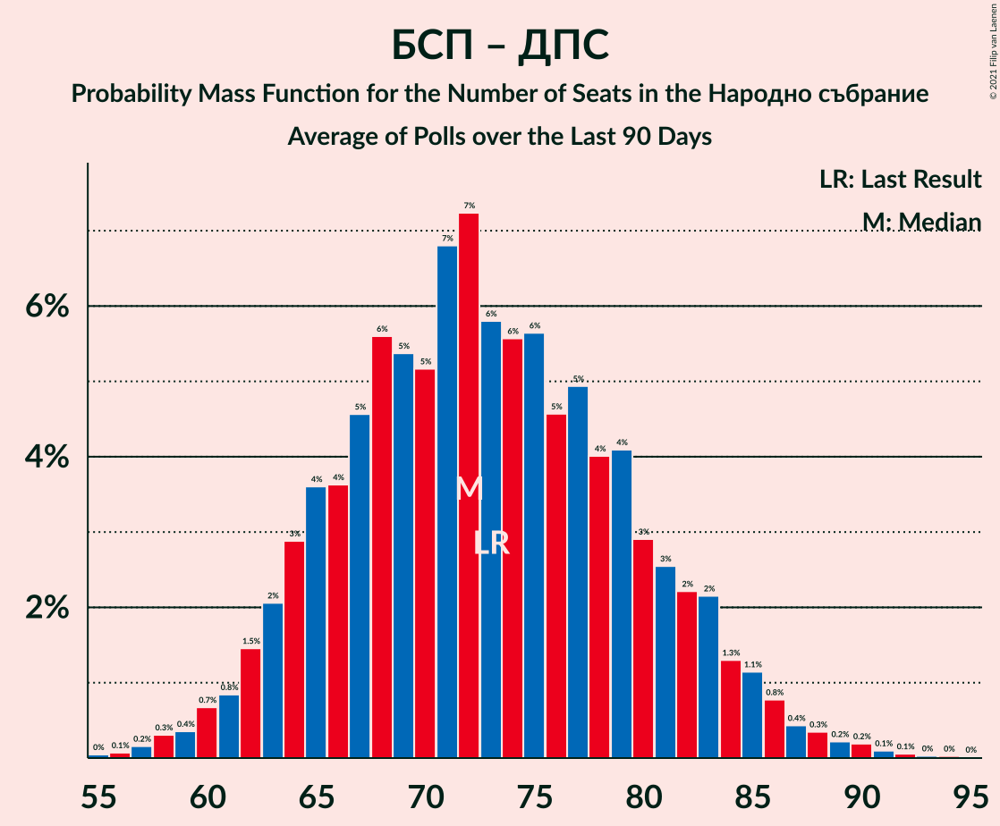

# Poll Average

<a href="#voting-intentions">Voting Intentions</a> | <a href="#seats">Seats</a> | <a href="#coalitions">Coalitions</a> | <a href="#technical-information">Technical Information</a>

## Summary

The table below lists the polls on which the average is based. They are the most recent polls (less than 90 days old) registered and analyzed so far.

| Period     | Polling firm/Commissioner(s) | ГЕРБ | БСП | ОП | ДПС | Воля | РБ | Да | АБВ | ВМРО | НФСБ | Атака | ДБ | ДСБ | ИТН | В | ИС.Б |
|:----------:|:----------------------------:|:--:|:--:|:--:|:--:|:--:|:--:|:--:|:--:|:--:|:--:|:--:|:--:|:--:|:--:|:--:|:--:|
| 27 March 2017 | General Election | 33.5%   95 | 27.9%   80 | 9.3%   27 | 9.2%   26 | 4.3%   12 | 3.1%   0 | 3.0%   0 | 1.6%   0 | 0.0%   0 | 0.0%   0 | 0.0%   0 | 0.0%   0 | 0.0%   0 | 0.0%   0 | 0.0%   0 | 0.0%   0 |
| N/A | Poll Average | 18–31%   55–80 | 18–30%   53–78 | 2–6%   0–15 | 8–13%   21–38 | 0–4%   0–10 | N/A   N/A | N/A   N/A | 0–2%   0 | N/A   N/A | N/A   N/A | 0–2%   0 | 6–14%   16–36 | N/A   N/A | 11–18%   31–50 | 0–2%   0 | 2–6%   0–16 |
| [3–10 October 2020](2020-10-10-Тренд.html) | Тренд | 22–27%   59–77 | 21–26%   58–74 | 3–5%   0–14 | 8–12%   24–35 | 1–3%   0 | N/A   N/A | N/A   N/A | N/A   N/A | N/A   N/A | N/A   N/A | N/A   N/A | 7–11%   20–30 | N/A   N/A | 14–18%   37–50 | N/A   N/A | 3–5%   0–14 |
| [1–9 October 2020](2020-10-09-GallupInternational.html) | Gallup International | 16–22%   55–74 | 17–23%   56–76 | 2–5%   0–16 | 8–12%   27–41 | 2–4%   0 | N/A   N/A | N/A   N/A | N/A   N/A | N/A   N/A | N/A   N/A | N/A   N/A | 6–9%   19–31 | N/A   N/A | 10–15%   35–52 | N/A   N/A | 3–5%   0–17 |
| [21–30 September 2020](2020-09-30-Алфарисърч.html) | Алфа рисърч | 20–25%   53–67 | 19–24%   51–64 | 3–6%   0–15 | 9–13%   25–35 | 0–1%   0 | N/A   N/A | N/A   N/A | N/A   N/A | N/A   N/A | N/A   N/A | N/A   N/A | 9–12%   23–33 | N/A   N/A | 14–19%   38–50 | N/A   N/A | 4–7%   0–18 |
| [18–26 September 2020](2020-09-26-МаркетЛИНКС.html) | Маркет ЛИНКС | 24–31%   62–82 | 24–31%   62–82 | 2–5%   0–12 | 8–13%   20–33 | N/A   N/A | N/A   N/A | N/A   N/A | N/A   N/A | N/A   N/A | N/A   N/A | N/A   N/A | 9–15%   24–39 | N/A   N/A | 11–17%   28–43 | N/A   N/A | 2–5%   0–13 |
| [19–25 August 2020](2020-08-25-SovaHarris.html) | Sova Harris | 25–31%   62–83 | 21–28%   55–73 | 3–6%   0–15 | 7–12%   19–30 | 2–5%   0–12 | N/A   N/A | N/A   N/A | 1–2%   0 | N/A   N/A | N/A   N/A | 0–2%   0 | 5–9%   13–24 | N/A   N/A | 13–19%   35–47 | 0–2%   0 | 3–6%   0–16 |
| 27 March 2017 | General Election | 33.5%   95 | 27.9%   80 | 9.3%   27 | 9.2%   26 | 4.3%   12 | 3.1%   0 | 3.0%   0 | 1.6%   0 | 0.0%   0 | 0.0%   0 | 0.0%   0 | 0.0%   0 | 0.0%   0 | 0.0%   0 | 0.0%   0 | 0.0%   0 |

Only polls for which at least the sample size has been published are included in the table above.

**Legend:**
+ **Top half of each row:** Voting intentions (95% confidence interval)
+ **Bottom half of each row:** Seat projections for the Народно събрание (95% confidence interval)
+ **ГЕРБ:** Граждани за европейско развитие на България
+ **БСП:** Българска социалистическа партия
+ **ОП:** Обединени Патриоти
+ **ДПС:** Движение за права и свободи
+ **Воля:** Воля
+ **РБ:** Реформаторски блок
+ **Да:** Да, България!
+ **АБВ:** Алтернатива за българско възраждане
+ **ВМРО:** ВМРО–Българско Национално Движение
+ **НФСБ:** Национален фронт за спасение на България
+ **Атака:** Атака
+ **ДБ:** Демократична България
+ **ДСБ:** Демократи за силна България
+ **ИТН:** Има такъв народ
+ **В:** Възраждане
+ **ИС.Б:** Изправи се Бг
+ **N/A (single party):** Party not included the published results
+ **N/A (entire row):** Calculation for this opinion poll not started yet

## Voting Intentions

### Confidence Intervals

| Party | Last Result | Median | 80% Confidence Interval | 90% Confidence Interval | 95% Confidence Interval | 99% Confidence Interval |
|:-----:|:-----------:|:------:|:-----------------------:|:-----------------------:|:-----------------------:|:-----------------------:|
| <a href="#граждани-за-европейско-развитие-на-българия">Граждани за европейско развитие на България</a> | 33.5% | 24.3% | 19.1–29.0% |18.2–29.9% | 17.6–30.6% | 16.5–31.9% |
| <a href="#българска-социалистическа-партия">Българска социалистическа партия</a> | 27.9% | 23.3% | 19.7–27.5% |18.9–28.6% | 18.3–29.5% | 17.2–31.1% |
| <a href="#обединени-патриоти">Обединени Патриоти</a> | 9.3% | 3.8% | 2.7–5.0% |2.4–5.3% | 2.1–5.6% | 1.7–6.3% |
| <a href="#движение-за-права-и-свободи">Движение за права и свободи</a> | 9.2% | 10.2% | 8.6–11.8% |8.2–12.2% | 7.8–12.6% | 7.1–13.4% |
| <a href="#воля">Воля</a> | 4.3% | 2.1% | 0.3–3.5% |0.2–3.8% | 0.2–4.1% | 0.1–4.7% |
| <a href="#реформаторски-блок">Реформаторски блок</a> | 3.1% | N/A | N/A |N/A | N/A | N/A |
| <a href="#да,-българия!">Да, България!</a> | 3.0% | N/A | N/A |N/A | N/A | N/A |
| <a href="#алтернатива-за-българско-възраждане">Алтернатива за българско възраждане</a> | 1.6% | 1.2% | 0.7–1.8% |0.6–2.0% | 0.5–2.2% | 0.4–2.6% |
| <a href="#вмро–българско-национално-движение">ВМРО–Българско Национално Движение</a> | 0.0% | N/A | N/A |N/A | N/A | N/A |
| <a href="#национален-фронт-за-спасение-на-българия">Национален фронт за спасение на България</a> | 0.0% | N/A | N/A |N/A | N/A | N/A |
| <a href="#атака">Атака</a> | 0.0% | 1.0% | 0.6–1.6% |0.5–1.8% | 0.4–2.0% | 0.3–2.4% |
| <a href="#демократична-българия">Демократична България</a> | 0.0% | 9.0% | 6.6–12.1% |6.2–12.9% | 5.8–13.5% | 5.2–14.7% |
| <a href="#демократи-за-силна-българия">Демократи за силна България</a> | 0.0% | N/A | N/A |N/A | N/A | N/A |
| <a href="#има-такъв-народ">Има такъв народ</a> | 0.0% | 15.1% | 12.1–17.4% |11.5–18.0% | 11.1–18.4% | 10.3–19.3% |
| <a href="#възраждане">Възраждане</a> | 0.0% | 0.7% | 0.4–1.2% |0.3–1.4% | 0.3–1.6% | 0.2–1.9% |
| <a href="#изправи-се-бг">Изправи се Бг</a> | 0.0% | 4.1% | 3.0–5.5% |2.7–5.9% | 2.4–6.2% | 2.0–6.8% |

### Граждани за европейско развитие на България

*For a full overview of the results for this party, see the [Граждани за европейско развитие на България](party-гражданизаевропейскоразвитиенабългария.html) page.*

| Voting Intentions | Probability | Accumulated | Special Marks |
|:-----------------:|:-----------:|:-----------:|:-------------:|
| 13.5–14.5% | 0% | 100% |  |
| 14.5–15.5% | 0.1% | 100% |  |
| 15.5–16.5% | 0.5% | 99.9% |  |
| 16.5–17.5% | 2% | 99.4% |  |
| 17.5–18.5% | 4% | 98% |  |
| 18.5–19.5% | 6% | 93% |  |
| 19.5–20.5% | 5% | 87% |  |
| 20.5–21.5% | 5% | 82% |  |
| 21.5–22.5% | 8% | 77% |  |
| 22.5–23.5% | 11% | 69% |  |
| 23.5–24.5% | 11% | 59% | Median |
| 24.5–25.5% | 9% | 48% |  |
| 25.5–26.5% | 8% | 39% |  |
| 26.5–27.5% | 9% | 30% |  |
| 27.5–28.5% | 8% | 21% |  |
| 28.5–29.5% | 7% | 13% |  |
| 29.5–30.5% | 4% | 6% |  |
| 30.5–31.5% | 2% | 3% |  |
| 31.5–32.5% | 0.6% | 0.8% |  |
| 32.5–33.5% | 0.2% | 0.2% |  |
| 33.5–34.5% | 0% | 0% | Last Result |

### Българска социалистическа партия

*For a full overview of the results for this party, see the [Българска социалистическа партия](party-българскасоциалистическапартия.html) page.*

| Voting Intentions | Probability | Accumulated | Special Marks |
|:-----------------:|:-----------:|:-----------:|:-------------:|
| 14.5–15.5% | 0% | 100% |  |
| 15.5–16.5% | 0.1% | 100% |  |
| 16.5–17.5% | 0.8% | 99.9% |  |
| 17.5–18.5% | 3% | 99.1% |  |
| 18.5–19.5% | 5% | 96% |  |
| 19.5–20.5% | 8% | 91% |  |
| 20.5–21.5% | 10% | 83% |  |
| 21.5–22.5% | 12% | 73% |  |
| 22.5–23.5% | 13% | 60% | Median |
| 23.5–24.5% | 13% | 47% |  |
| 24.5–25.5% | 10% | 34% |  |
| 25.5–26.5% | 8% | 24% |  |
| 26.5–27.5% | 6% | 16% |  |
| 27.5–28.5% | 4% | 10% | Last Result |
| 28.5–29.5% | 3% | 5% |  |
| 29.5–30.5% | 1.5% | 2% |  |
| 30.5–31.5% | 0.6% | 0.9% |  |
| 31.5–32.5% | 0.2% | 0.3% |  |
| 32.5–33.5% | 0.1% | 0.1% |  |
| 33.5–34.5% | 0% | 0% |  |

### Обединени Патриоти

*For a full overview of the results for this party, see the [Обединени Патриоти](party-обединенипатриоти.html) page.*

| Voting Intentions | Probability | Accumulated | Special Marks |
|:-----------------:|:-----------:|:-----------:|:-------------:|
| 0.0–0.5% | 0% | 100% |  |
| 0.5–1.5% | 0.3% | 100% |  |
| 1.5–2.5% | 8% | 99.7% |  |
| 2.5–3.5% | 30% | 92% |  |
| 3.5–4.5% | 41% | 62% | Median |
| 4.5–5.5% | 17% | 20% |  |
| 5.5–6.5% | 3% | 3% |  |
| 6.5–7.5% | 0.2% | 0.3% |  |
| 7.5–8.5% | 0% | 0% |  |
| 8.5–9.5% | 0% | 0% | Last Result |

### Движение за права и свободи

*For a full overview of the results for this party, see the [Движение за права и свободи](party-движениезаправаисвободи.html) page.*

| Voting Intentions | Probability | Accumulated | Special Marks |
|:-----------------:|:-----------:|:-----------:|:-------------:|
| 4.5–5.5% | 0% | 100% |  |
| 5.5–6.5% | 0.1% | 100% |  |
| 6.5–7.5% | 1.4% | 99.9% |  |
| 7.5–8.5% | 8% | 98% |  |
| 8.5–9.5% | 21% | 91% | Last Result |
| 9.5–10.5% | 31% | 70% | Median |
| 10.5–11.5% | 25% | 39% |  |
| 11.5–12.5% | 11% | 14% |  |
| 12.5–13.5% | 3% | 3% |  |
| 13.5–14.5% | 0.3% | 0.4% |  |
| 14.5–15.5% | 0% | 0% |  |

### Воля

*For a full overview of the results for this party, see the [Воля](party-воля.html) page.*

| Voting Intentions | Probability | Accumulated | Special Marks |
|:-----------------:|:-----------:|:-----------:|:-------------:|
| 0.0–0.5% | 20% | 100% |  |
| 0.5–1.5% | 15% | 80% |  |
| 1.5–2.5% | 29% | 65% | Median |
| 2.5–3.5% | 27% | 35% |  |
| 3.5–4.5% | 7% | 8% | Last Result |
| 4.5–5.5% | 0.7% | 0.7% |  |
| 5.5–6.5% | 0% | 0% |  |

### Алтернатива за българско възраждане

*For a full overview of the results for this party, see the [Алтернатива за българско възраждане](party-алтернативазабългарсковъзраждане.html) page.*

| Voting Intentions | Probability | Accumulated | Special Marks |
|:-----------------:|:-----------:|:-----------:|:-------------:|
| 0.0–0.5% | 3% | 100% |  |
| 0.5–1.5% | 75% | 97% | Median |
| 1.5–2.5% | 21% | 22% | Last Result |
| 2.5–3.5% | 0.7% | 0.7% |  |
| 3.5–4.5% | 0% | 0% |  |

### Демократична България

*For a full overview of the results for this party, see the [Демократична България](party-демократичнабългария.html) page.*

| Voting Intentions | Probability | Accumulated | Special Marks |
|:-----------------:|:-----------:|:-----------:|:-------------:|
| 0.0–0.5% | 0% | 100% | Last Result |
| 0.5–1.5% | 0% | 100% |  |
| 1.5–2.5% | 0% | 100% |  |
| 2.5–3.5% | 0% | 100% |  |
| 3.5–4.5% | 0% | 100% |  |
| 4.5–5.5% | 1.2% | 100% |  |
| 5.5–6.5% | 8% | 98.7% |  |
| 6.5–7.5% | 16% | 91% |  |
| 7.5–8.5% | 18% | 74% |  |
| 8.5–9.5% | 15% | 57% | Median |
| 9.5–10.5% | 14% | 41% |  |
| 10.5–11.5% | 13% | 27% |  |
| 11.5–12.5% | 8% | 15% |  |
| 12.5–13.5% | 4% | 7% |  |
| 13.5–14.5% | 2% | 2% |  |
| 14.5–15.5% | 0.5% | 0.7% |  |
| 15.5–16.5% | 0.1% | 0.1% |  |
| 16.5–17.5% | 0% | 0% |  |

### Има такъв народ

*For a full overview of the results for this party, see the [Има такъв народ](party-иматакъвнарод.html) page.*

| Voting Intentions | Probability | Accumulated | Special Marks |
|:-----------------:|:-----------:|:-----------:|:-------------:|
| 0.0–0.5% | 0% | 100% | Last Result |
| 0.5–1.5% | 0% | 100% |  |
| 1.5–2.5% | 0% | 100% |  |
| 2.5–3.5% | 0% | 100% |  |
| 3.5–4.5% | 0% | 100% |  |
| 4.5–5.5% | 0% | 100% |  |
| 5.5–6.5% | 0% | 100% |  |
| 6.5–7.5% | 0% | 100% |  |
| 7.5–8.5% | 0% | 100% |  |
| 8.5–9.5% | 0.1% | 100% |  |
| 9.5–10.5% | 0.8% | 99.9% |  |
| 10.5–11.5% | 4% | 99.1% |  |
| 11.5–12.5% | 9% | 95% |  |
| 12.5–13.5% | 13% | 85% |  |
| 13.5–14.5% | 13% | 73% |  |
| 14.5–15.5% | 17% | 59% | Median |
| 15.5–16.5% | 20% | 43% |  |
| 16.5–17.5% | 14% | 23% |  |
| 17.5–18.5% | 7% | 9% |  |
| 18.5–19.5% | 2% | 2% |  |
| 19.5–20.5% | 0.3% | 0.3% |  |
| 20.5–21.5% | 0% | 0% |  |

### Изправи се Бг

*For a full overview of the results for this party, see the [Изправи се Бг](party-изправисебг.html) page.*

| Voting Intentions | Probability | Accumulated | Special Marks |
|:-----------------:|:-----------:|:-----------:|:-------------:|
| 0.0–0.5% | 0% | 100% | Last Result |
| 0.5–1.5% | 0.1% | 100% |  |
| 1.5–2.5% | 4% | 99.9% |  |
| 2.5–3.5% | 23% | 96% |  |
| 3.5–4.5% | 38% | 73% | Median |
| 4.5–5.5% | 25% | 35% |  |
| 5.5–6.5% | 9% | 10% |  |
| 6.5–7.5% | 1.0% | 1.1% |  |
| 7.5–8.5% | 0% | 0.1% |  |
| 8.5–9.5% | 0% | 0% |  |

### Атака

*For a full overview of the results for this party, see the [Атака](party-атака.html) page.*

| Voting Intentions | Probability | Accumulated | Special Marks |
|:-----------------:|:-----------:|:-----------:|:-------------:|
| 0.0–0.5% | 7% | 100% | Last Result |
| 0.5–1.5% | 80% | 93% | Median |
| 1.5–2.5% | 13% | 13% |  |
| 2.5–3.5% | 0.3% | 0.3% |  |
| 3.5–4.5% | 0% | 0% |  |

### Възраждане

*For a full overview of the results for this party, see the [Възраждане](party-възраждане.html) page.*

| Voting Intentions | Probability | Accumulated | Special Marks |
|:-----------------:|:-----------:|:-----------:|:-------------:|
| 0.0–0.5% | 28% | 100% | Last Result |
| 0.5–1.5% | 69% | 72% | Median |
| 1.5–2.5% | 3% | 3% |  |
| 2.5–3.5% | 0% | 0% |  |

## Seats

### Confidence Intervals

| Party | Last Result | Median | 80% Confidence Interval | 90% Confidence Interval | 95% Confidence Interval | 99% Confidence Interval |
|:-----:|:-----------:|:------:|:-----------------------:|:-----------------------:|:-----------------------:|:-----------------------:|
| <a href="#граждани-за-европейско-развитие-на-българия">Граждани за европейско развитие на България</a> | 95 | 66 | 59–75 |57–78 | 55–80 | 53–85 |
| <a href="#българска-социалистическа-партия">Българска социалистическа партия</a> | 80 | 66 | 56–73 |54–76 | 53–78 | 50–82 |
| <a href="#обединени-патриоти">Обединени Патриоти</a> | 27 | 0 | 0–13 |0–14 | 0–15 | 0–16 |
| <a href="#движение-за-права-и-свободи">Движение за права и свободи</a> | 26 | 28 | 23–35 |22–37 | 21–38 | 18–41 |
| <a href="#воля">Воля</a> | 12 | 0 | 0 |0 | 0–10 | 0–13 |
| <a href="#реформаторски-блок">Реформаторски блок</a> | 0 | N/A | N/A |N/A | N/A | N/A |
| <a href="#да,-българия!">Да, България!</a> | 0 | N/A | N/A |N/A | N/A | N/A |
| <a href="#алтернатива-за-българско-възраждане">Алтернатива за българско възраждане</a> | 0 | 0 | 0 |0 | 0 | 0 |
| <a href="#вмро–българско-национално-движение">ВМРО–Българско Национално Движение</a> | 0 | N/A | N/A |N/A | N/A | N/A |
| <a href="#национален-фронт-за-спасение-на-българия">Национален фронт за спасение на България</a> | 0 | N/A | N/A |N/A | N/A | N/A |
| <a href="#атака">Атака</a> | 0 | 0 | 0 |0 | 0 | 0 |
| <a href="#демократична-българия">Демократична България</a> | 0 | 26 | 18–32 |17–34 | 16–36 | 13–39 |
| <a href="#демократи-за-силна-българия">Демократи за силна България</a> | 0 | N/A | N/A |N/A | N/A | N/A |
| <a href="#има-такъв-народ">Има такъв народ</a> | 0 | 42 | 35–47 |33–48 | 31–50 | 28–52 |
| <a href="#възраждане">Възраждане</a> | 0 | 0 | 0 |0 | 0 | 0 |
| <a href="#изправи-се-бг">Изправи се Бг</a> | 0 | 11 | 0–15 |0–16 | 0–16 | 0–18 |

### Граждани за европейско развитие на България

*For a full overview of the results for this party, see the [Граждани за европейско развитие на България](party-гражданизаевропейскоразвитиенабългария.html) page.*

| Number of Seats | Probability | Accumulated | Special Marks |
|:---------------:|:-----------:|:-----------:|:-------------:|
| 49 | 0% | 100% |  |
| 50 | 0.1% | 99.9% |  |
| 51 | 0.1% | 99.9% |  |
| 52 | 0.2% | 99.8% |  |
| 53 | 0.4% | 99.6% |  |
| 54 | 0.7% | 99.2% |  |
| 55 | 1.3% | 98% |  |
| 56 | 2% | 97% |  |
| 57 | 3% | 95% |  |
| 58 | 3% | 93% |  |
| 59 | 3% | 90% |  |
| 60 | 5% | 87% |  |
| 61 | 4% | 82% |  |
| 62 | 5% | 79% |  |
| 63 | 6% | 74% |  |
| 64 | 5% | 68% |  |
| 65 | 5% | 63% |  |
| 66 | 11% | 58% | Median |
| 67 | 6% | 48% |  |
| 68 | 5% | 42% |  |
| 69 | 8% | 38% |  |
| 70 | 3% | 29% |  |
| 71 | 4% | 26% |  |
| 72 | 3% | 22% |  |
| 73 | 3% | 19% |  |
| 74 | 3% | 15% |  |
| 75 | 3% | 12% |  |
| 76 | 2% | 10% |  |
| 77 | 2% | 7% |  |
| 78 | 2% | 6% |  |
| 79 | 0.8% | 4% |  |
| 80 | 0.9% | 3% |  |
| 81 | 0.3% | 2% |  |
| 82 | 0.4% | 2% |  |
| 83 | 0.4% | 1.1% |  |
| 84 | 0.2% | 0.7% |  |
| 85 | 0.1% | 0.5% |  |
| 86 | 0.1% | 0.4% |  |
| 87 | 0.1% | 0.3% |  |
| 88 | 0% | 0.2% |  |
| 89 | 0.2% | 0.2% |  |
| 90 | 0% | 0% |  |
| 91 | 0% | 0% |  |
| 92 | 0% | 0% |  |
| 93 | 0% | 0% |  |
| 94 | 0% | 0% |  |
| 95 | 0% | 0% | Last Result |

### Българска социалистическа партия

*For a full overview of the results for this party, see the [Българска социалистическа партия](party-българскасоциалистическапартия.html) page.*

| Number of Seats | Probability | Accumulated | Special Marks |
|:---------------:|:-----------:|:-----------:|:-------------:|
| 48 | 0.1% | 100% |  |
| 49 | 0.1% | 99.9% |  |
| 50 | 0.3% | 99.8% |  |
| 51 | 0.5% | 99.5% |  |
| 52 | 1.1% | 99.0% |  |
| 53 | 1.4% | 98% |  |
| 54 | 2% | 96% |  |
| 55 | 2% | 94% |  |
| 56 | 3% | 92% |  |
| 57 | 3% | 89% |  |
| 58 | 3% | 86% |  |
| 59 | 4% | 83% |  |
| 60 | 5% | 80% |  |
| 61 | 5% | 74% |  |
| 62 | 3% | 69% |  |
| 63 | 4% | 66% |  |
| 64 | 4% | 61% |  |
| 65 | 7% | 57% |  |
| 66 | 5% | 51% | Median |
| 67 | 13% | 46% |  |
| 68 | 5% | 33% |  |
| 69 | 4% | 28% |  |
| 70 | 4% | 24% |  |
| 71 | 3% | 19% |  |
| 72 | 4% | 16% |  |
| 73 | 2% | 12% |  |
| 74 | 2% | 10% |  |
| 75 | 2% | 8% |  |
| 76 | 2% | 6% |  |
| 77 | 1.3% | 4% |  |
| 78 | 0.8% | 3% |  |
| 79 | 0.6% | 2% |  |
| 80 | 0.4% | 1.5% | Last Result |
| 81 | 0.4% | 1.0% |  |
| 82 | 0.2% | 0.6% |  |
| 83 | 0.2% | 0.4% |  |
| 84 | 0.1% | 0.2% |  |
| 85 | 0.1% | 0.1% |  |
| 86 | 0% | 0.1% |  |
| 87 | 0% | 0.1% |  |
| 88 | 0% | 0% |  |

### Обединени Патриоти

*For a full overview of the results for this party, see the [Обединени Патриоти](party-обединенипатриоти.html) page.*

| Number of Seats | Probability | Accumulated | Special Marks |
|:---------------:|:-----------:|:-----------:|:-------------:|
| 0 | 58% | 100% | Median |
| 1 | 0% | 42% |  |
| 2 | 0% | 42% |  |
| 3 | 0% | 42% |  |
| 4 | 0% | 42% |  |
| 5 | 0% | 42% |  |
| 6 | 0% | 42% |  |
| 7 | 0% | 42% |  |
| 8 | 0% | 42% |  |
| 9 | 0% | 42% |  |
| 10 | 2% | 42% |  |
| 11 | 10% | 40% |  |
| 12 | 15% | 30% |  |
| 13 | 7% | 16% |  |
| 14 | 4% | 8% |  |
| 15 | 3% | 4% |  |
| 16 | 0.8% | 1.3% |  |
| 17 | 0.2% | 0.5% |  |
| 18 | 0.1% | 0.2% |  |
| 19 | 0.1% | 0.1% |  |
| 20 | 0% | 0% |  |
| 21 | 0% | 0% |  |
| 22 | 0% | 0% |  |
| 23 | 0% | 0% |  |
| 24 | 0% | 0% |  |
| 25 | 0% | 0% |  |
| 26 | 0% | 0% |  |
| 27 | 0% | 0% | Last Result |

### Движение за права и свободи

*For a full overview of the results for this party, see the [Движение за права и свободи](party-движениезаправаисвободи.html) page.*

| Number of Seats | Probability | Accumulated | Special Marks |
|:---------------:|:-----------:|:-----------:|:-------------:|
| 17 | 0.2% | 100% |  |
| 18 | 0.3% | 99.7% |  |
| 19 | 0.5% | 99.5% |  |
| 20 | 1.2% | 98.9% |  |
| 21 | 2% | 98% |  |
| 22 | 3% | 96% |  |
| 23 | 3% | 93% |  |
| 24 | 3% | 90% |  |
| 25 | 8% | 87% |  |
| 26 | 7% | 78% | Last Result |
| 27 | 14% | 71% |  |
| 28 | 10% | 57% | Median |
| 29 | 8% | 46% |  |
| 30 | 6% | 39% |  |
| 31 | 6% | 33% |  |
| 32 | 7% | 27% |  |
| 33 | 5% | 19% |  |
| 34 | 4% | 14% |  |
| 35 | 3% | 10% |  |
| 36 | 2% | 8% |  |
| 37 | 2% | 5% |  |
| 38 | 0.7% | 3% |  |
| 39 | 0.8% | 2% |  |
| 40 | 0.7% | 2% |  |
| 41 | 0.5% | 1.0% |  |
| 42 | 0.2% | 0.5% |  |
| 43 | 0.1% | 0.3% |  |
| 44 | 0.1% | 0.2% |  |
| 45 | 0.1% | 0.1% |  |
| 46 | 0% | 0% |  |

### Воля

*For a full overview of the results for this party, see the [Воля](party-воля.html) page.*

| Number of Seats | Probability | Accumulated | Special Marks |
|:---------------:|:-----------:|:-----------:|:-------------:|
| 0 | 97% | 100% | Median |
| 1 | 0% | 3% |  |
| 2 | 0% | 3% |  |
| 3 | 0% | 3% |  |
| 4 | 0% | 3% |  |
| 5 | 0% | 3% |  |
| 6 | 0% | 3% |  |
| 7 | 0% | 3% |  |
| 8 | 0% | 3% |  |
| 9 | 0% | 3% |  |
| 10 | 0.5% | 3% |  |
| 11 | 0.9% | 2% |  |
| 12 | 0.6% | 1.3% | Last Result |
| 13 | 0.3% | 0.7% |  |
| 14 | 0.3% | 0.4% |  |
| 15 | 0.1% | 0.1% |  |
| 16 | 0% | 0% |  |

### Реформаторски блок

*For a full overview of the results for this party, see the [Реформаторски блок](party-реформаторскиблок.html) page.*

### Да, България!

*For a full overview of the results for this party, see the [Да, България!](party-дабългария.html) page.*

### Алтернатива за българско възраждане

*For a full overview of the results for this party, see the [Алтернатива за българско възраждане](party-алтернативазабългарсковъзраждане.html) page.*

| Number of Seats | Probability | Accumulated | Special Marks |
|:---------------:|:-----------:|:-----------:|:-------------:|
| 0 | 100% | 100% | Last Result, Median |

### ВМРО–Българско Национално Движение

*For a full overview of the results for this party, see the [ВМРО–Българско Национално Движение](party-вмро–българсконационалнодвижение.html) page.*

### Национален фронт за спасение на България

*For a full overview of the results for this party, see the [Национален фронт за спасение на България](party-националенфронтзаспасениенабългария.html) page.*

### Атака

*For a full overview of the results for this party, see the [Атака](party-атака.html) page.*

| Number of Seats | Probability | Accumulated | Special Marks |
|:---------------:|:-----------:|:-----------:|:-------------:|
| 0 | 100% | 100% | Last Result, Median |

### Демократична България

*For a full overview of the results for this party, see the [Демократична България](party-демократичнабългария.html) page.*

| Number of Seats | Probability | Accumulated | Special Marks |
|:---------------:|:-----------:|:-----------:|:-------------:|
| 0 | 0% | 100% | Last Result |
| 1 | 0% | 100% |  |
| 2 | 0% | 100% |  |
| 3 | 0% | 100% |  |
| 4 | 0% | 100% |  |
| 5 | 0% | 100% |  |
| 6 | 0% | 100% |  |
| 7 | 0% | 100% |  |
| 8 | 0% | 100% |  |
| 9 | 0% | 100% |  |
| 10 | 0% | 100% |  |
| 11 | 0% | 100% |  |
| 12 | 0.1% | 100% |  |
| 13 | 0.9% | 99.9% |  |
| 14 | 0.5% | 99.0% |  |
| 15 | 0.9% | 98% |  |
| 16 | 0.7% | 98% |  |
| 17 | 5% | 97% |  |
| 18 | 2% | 92% |  |
| 19 | 7% | 89% |  |
| 20 | 2% | 83% |  |
| 21 | 3% | 80% |  |
| 22 | 5% | 77% |  |
| 23 | 5% | 72% |  |
| 24 | 7% | 67% |  |
| 25 | 7% | 60% |  |
| 26 | 9% | 53% | Median |
| 27 | 8% | 44% |  |
| 28 | 9% | 36% |  |
| 29 | 7% | 28% |  |
| 30 | 6% | 21% |  |
| 31 | 3% | 15% |  |
| 32 | 3% | 12% |  |
| 33 | 3% | 8% |  |
| 34 | 2% | 6% |  |
| 35 | 1.3% | 4% |  |
| 36 | 1.0% | 3% |  |
| 37 | 0.6% | 2% |  |
| 38 | 0.6% | 1.2% |  |
| 39 | 0.3% | 0.6% |  |
| 40 | 0.1% | 0.3% |  |
| 41 | 0.1% | 0.2% |  |
| 42 | 0% | 0.1% |  |
| 43 | 0% | 0% |  |

### Демократи за силна България

*For a full overview of the results for this party, see the [Демократи за силна България](party-демократизасилнабългария.html) page.*

### Има такъв народ

*For a full overview of the results for this party, see the [Има такъв народ](party-иматакъвнарод.html) page.*

| Number of Seats | Probability | Accumulated | Special Marks |
|:---------------:|:-----------:|:-----------:|:-------------:|
| 0 | 0% | 100% | Last Result |
| 1 | 0% | 100% |  |
| 2 | 0% | 100% |  |
| 3 | 0% | 100% |  |
| 4 | 0% | 100% |  |
| 5 | 0% | 100% |  |
| 6 | 0% | 100% |  |
| 7 | 0% | 100% |  |
| 8 | 0% | 100% |  |
| 9 | 0% | 100% |  |
| 10 | 0% | 100% |  |
| 11 | 0% | 100% |  |
| 12 | 0% | 100% |  |
| 13 | 0% | 100% |  |
| 14 | 0% | 100% |  |
| 15 | 0% | 100% |  |
| 16 | 0% | 100% |  |
| 17 | 0% | 100% |  |
| 18 | 0% | 100% |  |
| 19 | 0% | 100% |  |
| 20 | 0% | 100% |  |
| 21 | 0% | 100% |  |
| 22 | 0% | 100% |  |
| 23 | 0% | 100% |  |
| 24 | 0% | 100% |  |
| 25 | 0% | 100% |  |
| 26 | 0.1% | 100% |  |
| 27 | 0.2% | 99.9% |  |
| 28 | 0.3% | 99.7% |  |
| 29 | 0.5% | 99.4% |  |
| 30 | 0.9% | 98.9% |  |
| 31 | 0.9% | 98% |  |
| 32 | 2% | 97% |  |
| 33 | 2% | 95% |  |
| 34 | 2% | 93% |  |
| 35 | 3% | 91% |  |
| 36 | 3% | 88% |  |
| 37 | 5% | 85% |  |
| 38 | 5% | 80% |  |
| 39 | 6% | 75% |  |
| 40 | 10% | 70% |  |
| 41 | 7% | 60% |  |
| 42 | 11% | 53% | Median |
| 43 | 8% | 42% |  |
| 44 | 6% | 34% |  |
| 45 | 8% | 27% |  |
| 46 | 6% | 20% |  |
| 47 | 6% | 14% |  |
| 48 | 3% | 8% |  |
| 49 | 2% | 5% |  |
| 50 | 1.2% | 3% |  |
| 51 | 0.8% | 2% |  |
| 52 | 0.6% | 1.0% |  |
| 53 | 0.2% | 0.4% |  |
| 54 | 0.1% | 0.2% |  |
| 55 | 0.1% | 0.1% |  |
| 56 | 0% | 0.1% |  |
| 57 | 0% | 0% |  |

### Възраждане

*For a full overview of the results for this party, see the [Възраждане](party-възраждане.html) page.*

| Number of Seats | Probability | Accumulated | Special Marks |
|:---------------:|:-----------:|:-----------:|:-------------:|
| 0 | 100% | 100% | Last Result, Median |

### Изправи се Бг

*For a full overview of the results for this party, see the [Изправи се Бг](party-изправисебг.html) page.*

| Number of Seats | Probability | Accumulated | Special Marks |
|:---------------:|:-----------:|:-----------:|:-------------:|
| 0 | 47% | 100% | Last Result |
| 1 | 0% | 53% |  |
| 2 | 0% | 53% |  |
| 3 | 0% | 53% |  |
| 4 | 0% | 53% |  |
| 5 | 0% | 53% |  |
| 6 | 0% | 53% |  |
| 7 | 0% | 53% |  |
| 8 | 0% | 53% |  |
| 9 | 0% | 53% |  |
| 10 | 1.2% | 53% |  |
| 11 | 11% | 52% | Median |
| 12 | 7% | 41% |  |
| 13 | 8% | 33% |  |
| 14 | 9% | 25% |  |
| 15 | 9% | 16% |  |
| 16 | 5% | 7% |  |
| 17 | 1.2% | 2% |  |
| 18 | 0.7% | 1.1% |  |
| 19 | 0.3% | 0.4% |  |
| 20 | 0.1% | 0.1% |  |
| 21 | 0% | 0% |  |

## Coalitions

### Confidence Intervals

| Coalition | Last Result | Median | Majority? | 80% Confidence Interval | 90% Confidence Interval | 95% Confidence Interval | 99% Confidence Interval |
|:---------:|:-----------:|:------:|:---------:|:-----------------------:|:-----------------------:|:-----------------------:|:-----------------------:|
| Българска социалистическа партия – Движение за права и свободи – Изправи се Бг – Има такъв народ | 106 | 143 | 99.9% | 133–152 | 130–154 | 127–156 | 123–160 |
| Българска социалистическа партия – Движение за права и свободи – Има такъв народ | 106 | 135 | 98% | 125–145 | 123–149 | 121–152 | 117–156 |
| Българска социалистическа партия – Движение за права и свободи – Изправи се Бг | 106 | 101 | 0.2% | 93–110 | 90–113 | 88–115 | 82–118 |
| Българска социалистическа партия – Движение за права и свободи | 106 | 94 | 0% | 83–104 | 81–106 | 80–108 | 77–114 |
| Граждани за европейско развитие на България – Обединени Патриоти | 122 | 71 | 0% | 62–81 | 60–85 | 58–89 | 55–93 |

### Българска социалистическа партия – Движение за права и свободи – Изправи се Бг – Има такъв народ

| Number of Seats | Probability | Accumulated | Special Marks |
|:---------------:|:-----------:|:-----------:|:-------------:|
| 106 | 0% | 100% | Last Result |
| 107 | 0% | 100% |  |
| 108 | 0% | 100% |  |
| 109 | 0% | 100% |  |
| 110 | 0% | 100% |  |
| 111 | 0% | 100% |  |
| 112 | 0% | 100% |  |
| 113 | 0% | 100% |  |
| 114 | 0% | 100% |  |
| 115 | 0% | 100% |  |
| 116 | 0% | 100% |  |
| 117 | 0% | 100% |  |
| 118 | 0% | 100% |  |
| 119 | 0% | 100% |  |
| 120 | 0% | 99.9% |  |
| 121 | 0.1% | 99.9% | Majority |
| 122 | 0.1% | 99.8% |  |
| 123 | 0.5% | 99.7% |  |
| 124 | 0.3% | 99.2% |  |
| 125 | 0.4% | 98.9% |  |
| 126 | 0.5% | 98% |  |
| 127 | 0.6% | 98% |  |
| 128 | 1.0% | 97% |  |
| 129 | 0.8% | 96% |  |
| 130 | 1.1% | 96% |  |
| 131 | 2% | 95% |  |
| 132 | 3% | 93% |  |
| 133 | 2% | 90% |  |
| 134 | 3% | 88% |  |
| 135 | 4% | 86% |  |
| 136 | 4% | 81% |  |
| 137 | 4% | 77% |  |
| 138 | 4% | 74% |  |
| 139 | 5% | 69% |  |
| 140 | 4% | 64% |  |
| 141 | 6% | 60% |  |
| 142 | 4% | 54% |  |
| 143 | 5% | 51% |  |
| 144 | 6% | 46% |  |
| 145 | 8% | 40% |  |
| 146 | 4% | 32% |  |
| 147 | 4% | 28% | Median |
| 148 | 3% | 25% |  |
| 149 | 3% | 22% |  |
| 150 | 2% | 19% |  |
| 151 | 3% | 17% |  |
| 152 | 5% | 14% |  |
| 153 | 2% | 9% |  |
| 154 | 2% | 7% |  |
| 155 | 1.0% | 5% |  |
| 156 | 2% | 4% |  |
| 157 | 0.6% | 2% |  |
| 158 | 0.7% | 2% |  |
| 159 | 0.4% | 1.1% |  |
| 160 | 0.1% | 0.6% |  |
| 161 | 0.2% | 0.5% |  |
| 162 | 0.2% | 0.3% |  |
| 163 | 0% | 0.1% |  |
| 164 | 0% | 0.1% |  |
| 165 | 0% | 0.1% |  |
| 166 | 0% | 0% |  |

### Българска социалистическа партия – Движение за права и свободи – Има такъв народ

| Number of Seats | Probability | Accumulated | Special Marks |
|:---------------:|:-----------:|:-----------:|:-------------:|
| 106 | 0% | 100% | Last Result |
| 107 | 0% | 100% |  |
| 108 | 0% | 100% |  |
| 109 | 0% | 100% |  |
| 110 | 0% | 100% |  |
| 111 | 0% | 100% |  |
| 112 | 0% | 100% |  |
| 113 | 0.1% | 99.9% |  |
| 114 | 0% | 99.9% |  |
| 115 | 0.1% | 99.8% |  |
| 116 | 0.1% | 99.7% |  |
| 117 | 0.1% | 99.6% |  |
| 118 | 0.2% | 99.5% |  |
| 119 | 0.4% | 99.3% |  |
| 120 | 0.4% | 98.9% |  |
| 121 | 1.5% | 98% | Majority |
| 122 | 1.0% | 97% |  |
| 123 | 2% | 96% |  |
| 124 | 2% | 94% |  |
| 125 | 3% | 92% |  |
| 126 | 3% | 89% |  |
| 127 | 3% | 87% |  |
| 128 | 5% | 84% |  |
| 129 | 3% | 79% |  |
| 130 | 3% | 76% |  |
| 131 | 3% | 72% |  |
| 132 | 4% | 69% |  |
| 133 | 4% | 65% |  |
| 134 | 9% | 61% |  |
| 135 | 4% | 52% |  |
| 136 | 4% | 48% | Median |
| 137 | 8% | 44% |  |
| 138 | 4% | 36% |  |
| 139 | 5% | 32% |  |
| 140 | 3% | 27% |  |
| 141 | 4% | 24% |  |
| 142 | 3% | 20% |  |
| 143 | 3% | 17% |  |
| 144 | 3% | 14% |  |
| 145 | 2% | 12% |  |
| 146 | 2% | 10% |  |
| 147 | 2% | 8% |  |
| 148 | 1.2% | 7% |  |
| 149 | 1.4% | 5% |  |
| 150 | 0.7% | 4% |  |
| 151 | 0.6% | 3% |  |
| 152 | 0.5% | 3% |  |
| 153 | 0.9% | 2% |  |
| 154 | 0.5% | 1.4% |  |
| 155 | 0.3% | 1.0% |  |
| 156 | 0.3% | 0.7% |  |
| 157 | 0.1% | 0.4% |  |
| 158 | 0.1% | 0.2% |  |
| 159 | 0% | 0.1% |  |
| 160 | 0% | 0.1% |  |
| 161 | 0% | 0.1% |  |
| 162 | 0% | 0% |  |

### Българска социалистическа партия – Движение за права и свободи – Изправи се Бг

| Number of Seats | Probability | Accumulated | Special Marks |
|:---------------:|:-----------:|:-----------:|:-------------:|
| 79 | 0% | 100% |  |
| 80 | 0% | 99.9% |  |
| 81 | 0.4% | 99.9% |  |
| 82 | 0.1% | 99.5% |  |
| 83 | 0.1% | 99.4% |  |
| 84 | 0.1% | 99.3% |  |
| 85 | 0.2% | 99.2% |  |
| 86 | 0.3% | 99.0% |  |
| 87 | 0.7% | 98.7% |  |
| 88 | 1.0% | 98% |  |
| 89 | 1.0% | 97% |  |
| 90 | 1.1% | 96% |  |
| 91 | 3% | 95% |  |
| 92 | 2% | 92% |  |
| 93 | 4% | 91% |  |
| 94 | 5% | 87% |  |
| 95 | 5% | 82% |  |
| 96 | 5% | 77% |  |
| 97 | 4% | 72% |  |
| 98 | 4% | 68% |  |
| 99 | 6% | 63% |  |
| 100 | 5% | 58% |  |
| 101 | 5% | 53% |  |
| 102 | 5% | 47% |  |
| 103 | 5% | 42% |  |
| 104 | 5% | 37% |  |
| 105 | 9% | 32% | Median |
| 106 | 4% | 23% | Last Result |
| 107 | 3% | 19% |  |
| 108 | 2% | 15% |  |
| 109 | 2% | 14% |  |
| 110 | 4% | 12% |  |
| 111 | 1.5% | 9% |  |
| 112 | 2% | 7% |  |
| 113 | 1.3% | 6% |  |
| 114 | 2% | 4% |  |
| 115 | 0.7% | 3% |  |
| 116 | 0.8% | 2% |  |
| 117 | 0.3% | 1.2% |  |
| 118 | 0.5% | 0.9% |  |
| 119 | 0.1% | 0.4% |  |
| 120 | 0.1% | 0.3% |  |
| 121 | 0.1% | 0.2% | Majority |
| 122 | 0% | 0.2% |  |
| 123 | 0% | 0.1% |  |
| 124 | 0% | 0.1% |  |
| 125 | 0% | 0% |  |

### Българска социалистическа партия – Движение за права и свободи

| Number of Seats | Probability | Accumulated | Special Marks |
|:---------------:|:-----------:|:-----------:|:-------------:|
| 73 | 0% | 100% |  |
| 74 | 0.1% | 99.9% |  |
| 75 | 0.1% | 99.8% |  |
| 76 | 0.1% | 99.7% |  |
| 77 | 0.2% | 99.6% |  |
| 78 | 0.3% | 99.4% |  |
| 79 | 0.7% | 99.2% |  |
| 80 | 2% | 98% |  |
| 81 | 2% | 97% |  |
| 82 | 3% | 94% |  |
| 83 | 3% | 92% |  |
| 84 | 1.3% | 88% |  |
| 85 | 3% | 87% |  |
| 86 | 4% | 84% |  |
| 87 | 2% | 81% |  |
| 88 | 4% | 79% |  |
| 89 | 3% | 75% |  |
| 90 | 3% | 72% |  |
| 91 | 4% | 69% |  |
| 92 | 4% | 65% |  |
| 93 | 5% | 60% |  |
| 94 | 10% | 55% | Median |
| 95 | 6% | 45% |  |
| 96 | 3% | 39% |  |
| 97 | 3% | 36% |  |
| 98 | 4% | 33% |  |
| 99 | 5% | 29% |  |
| 100 | 4% | 24% |  |
| 101 | 4% | 20% |  |
| 102 | 3% | 16% |  |
| 103 | 3% | 13% |  |
| 104 | 3% | 10% |  |
| 105 | 2% | 8% |  |
| 106 | 1.5% | 6% | Last Result |
| 107 | 1.3% | 4% |  |
| 108 | 0.6% | 3% |  |
| 109 | 0.4% | 2% |  |
| 110 | 0.3% | 2% |  |
| 111 | 0.3% | 2% |  |
| 112 | 0.6% | 1.4% |  |
| 113 | 0.3% | 0.8% |  |
| 114 | 0.2% | 0.5% |  |
| 115 | 0.2% | 0.3% |  |
| 116 | 0.1% | 0.2% |  |
| 117 | 0% | 0.1% |  |
| 118 | 0% | 0% |  |

### Граждани за европейско развитие на България – Обединени Патриоти

| Number of Seats | Probability | Accumulated | Special Marks |
|:---------------:|:-----------:|:-----------:|:-------------:|
| 52 | 0.1% | 100% |  |
| 53 | 0.1% | 99.9% |  |
| 54 | 0.2% | 99.8% |  |
| 55 | 0.2% | 99.6% |  |
| 56 | 0.4% | 99.4% |  |
| 57 | 0.6% | 99.0% |  |
| 58 | 1.0% | 98% |  |
| 59 | 1.3% | 97% |  |
| 60 | 2% | 96% |  |
| 61 | 1.5% | 94% |  |
| 62 | 3% | 92% |  |
| 63 | 3% | 89% |  |
| 64 | 3% | 86% |  |
| 65 | 3% | 83% |  |
| 66 | 4% | 80% | Median |
| 67 | 4% | 76% |  |
| 68 | 5% | 72% |  |
| 69 | 8% | 67% |  |
| 70 | 4% | 59% |  |
| 71 | 6% | 55% |  |
| 72 | 4% | 49% |  |
| 73 | 5% | 45% |  |
| 74 | 4% | 41% |  |
| 75 | 5% | 36% |  |
| 76 | 3% | 32% |  |
| 77 | 5% | 29% |  |
| 78 | 8% | 24% |  |
| 79 | 2% | 15% |  |
| 80 | 2% | 13% |  |
| 81 | 2% | 11% |  |
| 82 | 1.3% | 9% |  |
| 83 | 2% | 8% |  |
| 84 | 0.7% | 6% |  |
| 85 | 0.7% | 6% |  |
| 86 | 0.6% | 5% |  |
| 87 | 1.0% | 4% |  |
| 88 | 0.3% | 3% |  |
| 89 | 0.9% | 3% |  |
| 90 | 0.4% | 2% |  |
| 91 | 0.8% | 2% |  |
| 92 | 0.3% | 0.9% |  |
| 93 | 0% | 0.5% |  |
| 94 | 0.1% | 0.5% |  |
| 95 | 0.2% | 0.4% |  |
| 96 | 0% | 0.1% |  |
| 97 | 0.1% | 0.1% |  |
| 98 | 0% | 0.1% |  |
| 99 | 0% | 0% |  |
| 100 | 0% | 0% |  |
| 101 | 0% | 0% |  |
| 102 | 0% | 0% |  |
| 103 | 0% | 0% |  |
| 104 | 0% | 0% |  |
| 105 | 0% | 0% |  |
| 106 | 0% | 0% |  |
| 107 | 0% | 0% |  |
| 108 | 0% | 0% |  |
| 109 | 0% | 0% |  |
| 110 | 0% | 0% |  |
| 111 | 0% | 0% |  |
| 112 | 0% | 0% |  |
| 113 | 0% | 0% |  |
| 114 | 0% | 0% |  |
| 115 | 0% | 0% |  |
| 116 | 0% | 0% |  |
| 117 | 0% | 0% |  |
| 118 | 0% | 0% |  |
| 119 | 0% | 0% |  |
| 120 | 0% | 0% |  |
| 121 | 0% | 0% | Majority |
| 122 | 0% | 0% | Last Result |

## Technical Information

+ **Number of polls included in this average:** 5
+ **Lowest number of simulations done in a poll included in this average:** 1,048,576
+ **Total number of simulations done in the polls included in this average:** 5,242,880
+ **Error estimate:** 2.23%
