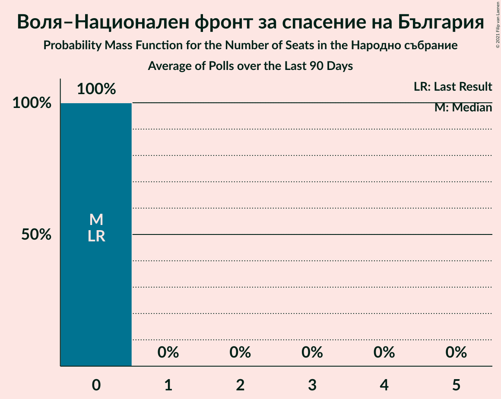
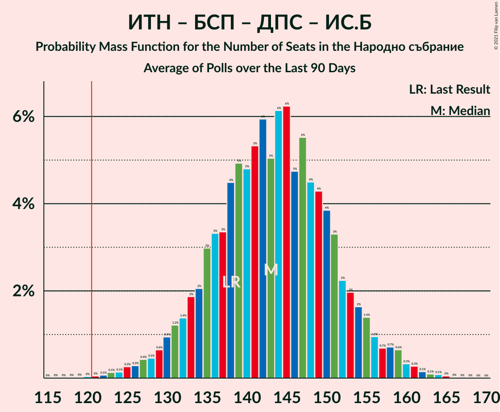

# Poll Average

<a href="#voting-intentions">Voting Intentions</a> | <a href="#seats">Seats</a> | <a href="#coalitions">Coalitions</a> | <a href="#technical-information">Technical Information</a>

## Summary

The table below lists the polls on which the average is based. They are the most recent polls (less than 90 days old) registered and analyzed so far.

| Period     | Polling firm/Commissioner(s) | ГЕРБ | ИТН | БСП | ДПС | ДБ | ИС.Б | ВМРО | В | Воля–НФСБ | РзБ | Атака | АБВ | ОП | Воля | РБ | Да | НФСБ | ДСБ | БП |
|:----------:|:----------------------------:|:--:|:--:|:--:|:--:|:--:|:--:|:--:|:--:|:--:|:--:|:--:|:--:|:--:|:--:|:--:|:--:|:--:|:--:|:--:|
| 4 April 2021 | General Election | 25.8%   75 | 17.4%   51 | 14.8%   43 | 10.4%   30 | 9.3%   27 | 4.6%   14 | 3.6%   0 | 2.4%   0 | 2.3%   0 | 1.3%   0 | 0.5%   0 | 0.5%   0 | 0.0%   0 | 0.0%   0 | 0.0%   0 | 0.0%   0 | 0.0%   0 | 0.0%   0 | 0.0%   0 |
| N/A | Poll Average | 18–26%   48–69 | 16–26%   45–66 | 13–23%   36–58 | 8–14%   23–37 | 6–15%   16–41 | 4–8%   0–21 | N/A   N/A | 1–4%   0–12 | 1–2%   0 | N/A   N/A | N/A   N/A | N/A   N/A | 2–5%   0–12 | N/A   N/A | N/A   N/A | N/A   N/A | N/A   N/A | N/A   N/A | 2–7%   0–17 |
| [11–18 June 2021](2021-06-18-Тренд.html) | Тренд   24 часа | 18–26%   50–71 | 17–24%   45–67 | 13–20%   36–54 | 8–14%   23–38 | 9–14%   24–39 | 3–7%   0–20 | N/A   N/A | 1–4%   0–11 | N/A   N/A | N/A   N/A | N/A   N/A | N/A   N/A | N/A   N/A | N/A   N/A | N/A   N/A | N/A   N/A | N/A   N/A | N/A   N/A | 3–6%   0–16 |
| [10–15 June 2021](2021-06-15-Медиана.html) | Медиана | 19–24%   47–59 | 21–27%   53–66 | 19–24%   46–60 | 9–13%   23–33 | 6–9%   14–22 | 6–9%   14–21 | N/A   N/A | 1–2%   0 | N/A   N/A | N/A   N/A | N/A   N/A | N/A   N/A | N/A   N/A | N/A   N/A | N/A   N/A | N/A   N/A | N/A   N/A | N/A   N/A | 4–7%   0–16 |
| [10–15 June 2021](2021-06-15-SovaHarris.html) | Sova Harris   Dir.bg | 19–26%   47–66 | 18–26%   45–64 | 16–23%   39–57 | 9–15%   22–37 | 9–14%   22–36 | 4–8%   0–19 | N/A   N/A | N/A   N/A | N/A   N/A | N/A   N/A | N/A   N/A | N/A   N/A | N/A   N/A | N/A   N/A | N/A   N/A | N/A   N/A | N/A   N/A | N/A   N/A | 3–7%   0–18 |
| [3–11 June 2021](2021-06-11-Gallup.html) | Gallup   BNR | 18–25%   48–66 | 18–25%   49–67 | 13–19%   35–50 | 10–15%   25–39 | 10–15%   25–39 | 4–8%   11–20 | N/A   N/A | 2–4%   0–12 | N/A   N/A | N/A   N/A | N/A   N/A | N/A   N/A | N/A   N/A | N/A   N/A | N/A   N/A | N/A   N/A | N/A   N/A | N/A   N/A | 2–5%   0–14 |
| [30 May–7 June 2021](2021-06-07-Алфарисърч.html) | Алфа рисърч | 17–24%   49–72 | 15–22%   44–64 | 12–18%   34–51 | 8–13%   22–37 | 9–15%   28–44 | 4–7%   0–22 | N/A   N/A | 2–5%   0–13 | N/A   N/A | N/A   N/A | N/A   N/A | N/A   N/A | N/A   N/A | N/A   N/A | N/A   N/A | N/A   N/A | N/A   N/A | N/A   N/A | 2–5%   0–15 |
| [19–27 May 2021](2021-05-27-MarketLinks.html) | Market Links   bTV | 21–27%   53–72 | 17–23%   44–60 | 17–23%   42–59 | 8–13%   22–34 | 11–16%   28–42 | 3–7%   0–17 | N/A   N/A | 1–3%   0 | 1–3%   0 | N/A   N/A | N/A   N/A | N/A   N/A | 2–5%   0–12 | N/A   N/A | N/A   N/A | N/A   N/A | N/A   N/A | N/A   N/A | N/A   N/A |
| 4 April 2021 | General Election | 25.8%   75 | 17.4%   51 | 14.8%   43 | 10.4%   30 | 9.3%   27 | 4.6%   14 | 3.6%   0 | 2.4%   0 | 2.3%   0 | 1.3%   0 | 0.5%   0 | 0.5%   0 | 0.0%   0 | 0.0%   0 | 0.0%   0 | 0.0%   0 | 0.0%   0 | 0.0%   0 | 0.0%   0 |

Only polls for which at least the sample size has been published are included in the table above.

**Legend:**
+ **Top half of each row:** Voting intentions (95% confidence interval)
+ **Bottom half of each row:** Seat projections for the Народно събрание (95% confidence interval)
+ **ГЕРБ:** Граждани за европейско развитие на България
+ **ИТН:** Има такъв народ
+ **БСП:** Българска социалистическа партия
+ **ДПС:** Движение за права и свободи
+ **ДБ:** Демократична България
+ **ИС.Б:** Изправи се Бг
+ **ВМРО:** ВМРО–Българско Национално Движение
+ **В:** Възраждане
+ **Воля–НФСБ:** Воля–Национален фронт за спасение на България
+ **РзБ:** Републиканци за България
+ **Атака:** Атака
+ **АБВ:** Алтернатива за българско възраждане
+ **ОП:** Обединени Патриоти
+ **Воля:** Воля
+ **РБ:** Реформаторски блок
+ **Да:** Да, България!
+ **НФСБ:** Национален фронт за спасение на България
+ **ДСБ:** Демократи за силна България
+ **БП:** Българските патриоти
+ **N/A (single party):** Party not included the published results
+ **N/A (entire row):** Calculation for this opinion poll not started yet

## Voting Intentions

### Confidence Intervals

| Party | Last Result | Median | 80% Confidence Interval | 90% Confidence Interval | 95% Confidence Interval | 99% Confidence Interval |
|:-----:|:-----------:|:------:|:-----------------------:|:-----------------------:|:-----------------------:|:-----------------------:|
| <a href="#граждани-за-европейско-развитие-на-българия">Граждани за европейско развитие на България</a> | 25.8% | 21.8% | 19.3–24.5% |18.7–25.2% | 18.1–25.9% | 17.0–27.2% |
| <a href="#има-такъв-народ">Има такъв народ</a> | 17.4% | 20.8% | 17.9–24.3% |17.1–25.0% | 16.5–25.7% | 15.3–26.8% |
| <a href="#българска-социалистическа-партия">Българска социалистическа партия</a> | 14.8% | 17.6% | 14.1–21.6% |13.3–22.3% | 12.7–22.9% | 11.7–24.0% |
| <a href="#движение-за-права-и-свободи">Движение за права и свободи</a> | 10.4% | 11.1% | 9.3–12.9% |8.8–13.5% | 8.4–14.0% | 7.6–15.1% |
| <a href="#демократична-българия">Демократична България</a> | 9.3% | 11.6% | 7.5–13.9% |6.9–14.6% | 6.5–15.1% | 5.9–16.1% |
| <a href="#изправи-се-бг">Изправи се Бг</a> | 4.6% | 5.6% | 4.2–7.2% |3.9–7.7% | 3.6–8.1% | 3.2–8.8% |
| <a href="#вмро–българско-национално-движение">ВМРО–Българско Национално Движение</a> | 3.6% | N/A | N/A |N/A | N/A | N/A |
| <a href="#възраждане">Възраждане</a> | 2.4% | 2.3% | 1.4–3.5% |1.2–3.8% | 1.1–4.2% | 0.9–4.8% |
| <a href="#воля–национален-фронт-за-спасение-на-българия">Воля–Национален фронт за спасение на България</a> | 2.3% | 1.4% | 0.9–2.1% |0.8–2.3% | 0.7–2.5% | 0.6–2.9% |
| <a href="#републиканци-за-българия">Републиканци за България</a> | 1.3% | N/A | N/A |N/A | N/A | N/A |
| <a href="#атака">Атака</a> | 0.5% | N/A | N/A |N/A | N/A | N/A |
| <a href="#алтернатива-за-българско-възраждане">Алтернатива за българско възраждане</a> | 0.5% | N/A | N/A |N/A | N/A | N/A |
| <a href="#обединени-патриоти">Обединени Патриоти</a> | 0.0% | 3.4% | 2.6–4.3% |2.3–4.6% | 2.2–4.9% | 1.9–5.5% |
| <a href="#воля">Воля</a> | 0.0% | N/A | N/A |N/A | N/A | N/A |
| <a href="#реформаторски-блок">Реформаторски блок</a> | 0.0% | N/A | N/A |N/A | N/A | N/A |
| <a href="#да,-българия!">Да, България!</a> | 0.0% | N/A | N/A |N/A | N/A | N/A |
| <a href="#национален-фронт-за-спасение-на-българия">Национален фронт за спасение на България</a> | 0.0% | N/A | N/A |N/A | N/A | N/A |
| <a href="#демократи-за-силна-българия">Демократи за силна България</a> | 0.0% | N/A | N/A |N/A | N/A | N/A |
| <a href="#българските-патриоти">Българските патриоти</a> | 0.0% | 4.3% | 3.0–5.8% |2.7–6.2% | 2.4–6.6% | 2.1–7.4% |

### Граждани за европейско развитие на България

*For a full overview of the results for this party, see the [Граждани за европейско развитие на България](party-гражданизаевропейскоразвитиенабългария.html) page.*

| Voting Intentions | Probability | Accumulated | Special Marks |
|:-----------------:|:-----------:|:-----------:|:-------------:|
| 14.5–15.5% | 0% | 100% |  |
| 15.5–16.5% | 0.2% | 100% |  |
| 16.5–17.5% | 0.9% | 99.8% |  |
| 17.5–18.5% | 3% | 98.8% |  |
| 18.5–19.5% | 8% | 96% |  |
| 19.5–20.5% | 14% | 88% |  |
| 20.5–21.5% | 20% | 74% |  |
| 21.5–22.5% | 20% | 54% | Median |
| 22.5–23.5% | 15% | 34% |  |
| 23.5–24.5% | 10% | 19% |  |
| 24.5–25.5% | 5% | 9% |  |
| 25.5–26.5% | 3% | 4% | Last Result |
| 26.5–27.5% | 0.9% | 1.2% |  |
| 27.5–28.5% | 0.2% | 0.3% |  |
| 28.5–29.5% | 0.1% | 0.1% |  |
| 29.5–30.5% | 0% | 0% |  |

### Има такъв народ

*For a full overview of the results for this party, see the [Има такъв народ](party-иматакъвнарод.html) page.*

| Voting Intentions | Probability | Accumulated | Special Marks |
|:-----------------:|:-----------:|:-----------:|:-------------:|
| 12.5–13.5% | 0% | 100% |  |
| 13.5–14.5% | 0.1% | 100% |  |
| 14.5–15.5% | 0.6% | 99.9% |  |
| 15.5–16.5% | 2% | 99.3% |  |
| 16.5–17.5% | 5% | 97% | Last Result |
| 17.5–18.5% | 9% | 92% |  |
| 18.5–19.5% | 13% | 83% |  |
| 19.5–20.5% | 15% | 70% |  |
| 20.5–21.5% | 15% | 55% | Median |
| 21.5–22.5% | 13% | 40% |  |
| 22.5–23.5% | 10% | 27% |  |
| 23.5–24.5% | 8% | 16% |  |
| 24.5–25.5% | 5% | 8% |  |
| 25.5–26.5% | 2% | 3% |  |
| 26.5–27.5% | 0.6% | 0.7% |  |
| 27.5–28.5% | 0.1% | 0.1% |  |
| 28.5–29.5% | 0% | 0% |  |

### Българска социалистическа партия

*For a full overview of the results for this party, see the [Българска социалистическа партия](party-българскасоциалистическапартия.html) page.*

| Voting Intentions | Probability | Accumulated | Special Marks |
|:-----------------:|:-----------:|:-----------:|:-------------:|
| 9.5–10.5% | 0% | 100% |  |
| 10.5–11.5% | 0.3% | 100% |  |
| 11.5–12.5% | 2% | 99.6% |  |
| 12.5–13.5% | 4% | 98% |  |
| 13.5–14.5% | 8% | 94% |  |
| 14.5–15.5% | 11% | 86% | Last Result |
| 15.5–16.5% | 12% | 75% |  |
| 16.5–17.5% | 11% | 62% |  |
| 17.5–18.5% | 11% | 51% | Median |
| 18.5–19.5% | 11% | 40% |  |
| 19.5–20.5% | 10% | 30% |  |
| 20.5–21.5% | 9% | 19% |  |
| 21.5–22.5% | 6% | 10% |  |
| 22.5–23.5% | 3% | 4% |  |
| 23.5–24.5% | 0.8% | 1.0% |  |
| 24.5–25.5% | 0.2% | 0.2% |  |
| 25.5–26.5% | 0% | 0% |  |

### Движение за права и свободи

*For a full overview of the results for this party, see the [Движение за права и свободи](party-движениезаправаисвободи.html) page.*

| Voting Intentions | Probability | Accumulated | Special Marks |
|:-----------------:|:-----------:|:-----------:|:-------------:|
| 5.5–6.5% | 0% | 100% |  |
| 6.5–7.5% | 0.4% | 100% |  |
| 7.5–8.5% | 3% | 99.5% |  |
| 8.5–9.5% | 11% | 97% |  |
| 9.5–10.5% | 22% | 86% | Last Result |
| 10.5–11.5% | 28% | 64% | Median |
| 11.5–12.5% | 21% | 36% |  |
| 12.5–13.5% | 10% | 15% |  |
| 13.5–14.5% | 4% | 5% |  |
| 14.5–15.5% | 0.9% | 1.2% |  |
| 15.5–16.5% | 0.2% | 0.2% |  |
| 16.5–17.5% | 0% | 0% |  |

### Демократична България

*For a full overview of the results for this party, see the [Демократична България](party-демократичнабългария.html) page.*

| Voting Intentions | Probability | Accumulated | Special Marks |
|:-----------------:|:-----------:|:-----------:|:-------------:|
| 3.5–4.5% | 0% | 100% |  |
| 4.5–5.5% | 0.2% | 100% |  |
| 5.5–6.5% | 3% | 99.8% |  |
| 6.5–7.5% | 7% | 97% |  |
| 7.5–8.5% | 6% | 90% |  |
| 8.5–9.5% | 5% | 84% | Last Result |
| 9.5–10.5% | 10% | 79% |  |
| 10.5–11.5% | 18% | 69% |  |
| 11.5–12.5% | 20% | 51% | Median |
| 12.5–13.5% | 17% | 31% |  |
| 13.5–14.5% | 9% | 15% |  |
| 14.5–15.5% | 4% | 5% |  |
| 15.5–16.5% | 1.1% | 1.3% |  |
| 16.5–17.5% | 0.2% | 0.2% |  |
| 17.5–18.5% | 0% | 0% |  |

### Изправи се Бг

*For a full overview of the results for this party, see the [Изправи се Бг](party-изправисебг.html) page.*

| Voting Intentions | Probability | Accumulated | Special Marks |
|:-----------------:|:-----------:|:-----------:|:-------------:|
| 1.5–2.5% | 0% | 100% |  |
| 2.5–3.5% | 2% | 100% |  |
| 3.5–4.5% | 16% | 98% |  |
| 4.5–5.5% | 31% | 82% | Last Result |
| 5.5–6.5% | 28% | 51% | Median |
| 6.5–7.5% | 16% | 23% |  |
| 7.5–8.5% | 6% | 6% |  |
| 8.5–9.5% | 0.8% | 0.9% |  |
| 9.5–10.5% | 0.1% | 0.1% |  |
| 10.5–11.5% | 0% | 0% |  |

### Възраждане

*For a full overview of the results for this party, see the [Възраждане](party-възраждане.html) page.*

| Voting Intentions | Probability | Accumulated | Special Marks |
|:-----------------:|:-----------:|:-----------:|:-------------:|
| 0.0–0.5% | 0% | 100% |  |
| 0.5–1.5% | 15% | 100% |  |
| 1.5–2.5% | 45% | 85% | Last Result, Median |
| 2.5–3.5% | 31% | 40% |  |
| 3.5–4.5% | 8% | 9% |  |
| 4.5–5.5% | 0.9% | 0.9% |  |
| 5.5–6.5% | 0.1% | 0.1% |  |
| 6.5–7.5% | 0% | 0% |  |

### Воля–Национален фронт за спасение на България

*For a full overview of the results for this party, see the [Воля–Национален фронт за спасение на България](party-воля–националенфронтзаспасениенабългария.html) page.*

| Voting Intentions | Probability | Accumulated | Special Marks |
|:-----------------:|:-----------:|:-----------:|:-------------:|
| 0.0–0.5% | 0.5% | 100% |  |
| 0.5–1.5% | 60% | 99.5% | Median |
| 1.5–2.5% | 38% | 40% | Last Result |
| 2.5–3.5% | 2% | 2% |  |
| 3.5–4.5% | 0% | 0% |  |

### Българските патриоти

*For a full overview of the results for this party, see the [Българските патриоти](party-българскитепатриоти.html) page.*

| Voting Intentions | Probability | Accumulated | Special Marks |
|:-----------------:|:-----------:|:-----------:|:-------------:|
| 0.0–0.5% | 0% | 100% | Last Result |
| 0.5–1.5% | 0% | 100% |  |
| 1.5–2.5% | 3% | 100% |  |
| 2.5–3.5% | 22% | 97% |  |
| 3.5–4.5% | 33% | 74% | Median |
| 4.5–5.5% | 27% | 41% |  |
| 5.5–6.5% | 11% | 14% |  |
| 6.5–7.5% | 2% | 3% |  |
| 7.5–8.5% | 0.3% | 0.3% |  |
| 8.5–9.5% | 0% | 0% |  |

### Обединени Патриоти

*For a full overview of the results for this party, see the [Обединени Патриоти](party-обединенипатриоти.html) page.*

| Voting Intentions | Probability | Accumulated | Special Marks |
|:-----------------:|:-----------:|:-----------:|:-------------:|
| 0.0–0.5% | 0% | 100% | Last Result |
| 0.5–1.5% | 0% | 100% |  |
| 1.5–2.5% | 10% | 100% |  |
| 2.5–3.5% | 51% | 90% | Median |
| 3.5–4.5% | 34% | 40% |  |
| 4.5–5.5% | 6% | 6% |  |
| 5.5–6.5% | 0.4% | 0.4% |  |
| 6.5–7.5% | 0% | 0% |  |

## Seats

### Confidence Intervals

| Party | Last Result | Median | 80% Confidence Interval | 90% Confidence Interval | 95% Confidence Interval | 99% Confidence Interval |
|:-----:|:-----------:|:------:|:-----------------------:|:-----------------------:|:-----------------------:|:-----------------------:|
| <a href="#граждани-за-европейско-развитие-на-българия">Граждани за европейско развитие на България</a> | 75 | 58 | 51–65 |49–68 | 48–69 | 45–73 |
| <a href="#има-такъв-народ">Има такъв народ</a> | 51 | 56 | 48–63 |47–64 | 45–66 | 43–69 |
| <a href="#българска-социалистическа-партия">Българска социалистическа партия</a> | 43 | 47 | 39–54 |37–56 | 36–58 | 33–60 |
| <a href="#движение-за-права-и-свободи">Движение за права и свободи</a> | 30 | 29 | 25–34 |24–36 | 23–37 | 21–40 |
| <a href="#демократична-българия">Демократична България</a> | 27 | 31 | 19–38 |17–40 | 16–41 | 14–44 |
| <a href="#изправи-се-бг">Изправи се Бг</a> | 14 | 15 | 11–19 |0–20 | 0–21 | 0–23 |
| <a href="#вмро–българско-национално-движение">ВМРО–Българско Национално Движение</a> | 0 | N/A | N/A |N/A | N/A | N/A |
| <a href="#възраждане">Възраждане</a> | 0 | 0 | 0 |0 | 0–12 | 0–13 |
| <a href="#воля–национален-фронт-за-спасение-на-българия">Воля–Национален фронт за спасение на България</a> | 0 | 0 | 0 |0 | 0 | 0 |
| <a href="#републиканци-за-българия">Републиканци за България</a> | 0 | N/A | N/A |N/A | N/A | N/A |
| <a href="#атака">Атака</a> | 0 | N/A | N/A |N/A | N/A | N/A |
| <a href="#алтернатива-за-българско-възраждане">Алтернатива за българско възраждане</a> | 0 | N/A | N/A |N/A | N/A | N/A |
| <a href="#обединени-патриоти">Обединени Патриоти</a> | 0 | 0 | 0–11 |0–12 | 0–12 | 0–14 |
| <a href="#воля">Воля</a> | 0 | N/A | N/A |N/A | N/A | N/A |
| <a href="#реформаторски-блок">Реформаторски блок</a> | 0 | N/A | N/A |N/A | N/A | N/A |
| <a href="#да,-българия!">Да, България!</a> | 0 | N/A | N/A |N/A | N/A | N/A |
| <a href="#национален-фронт-за-спасение-на-българия">Национален фронт за спасение на България</a> | 0 | N/A | N/A |N/A | N/A | N/A |
| <a href="#демократи-за-силна-българия">Демократи за силна България</a> | 0 | N/A | N/A |N/A | N/A | N/A |
| <a href="#българските-патриоти">Българските патриоти</a> | 0 | 11 | 0–15 |0–16 | 0–17 | 0–19 |

### Граждани за европейско развитие на България

*For a full overview of the results for this party, see the [Граждани за европейско развитие на България](party-гражданизаевропейскоразвитиенабългария.html) page.*

| Number of Seats | Probability | Accumulated | Special Marks |
|:---------------:|:-----------:|:-----------:|:-------------:|
| 43 | 0.1% | 100% |  |
| 44 | 0.2% | 99.9% |  |
| 45 | 0.3% | 99.7% |  |
| 46 | 0.5% | 99.5% |  |
| 47 | 1.0% | 98.9% |  |
| 48 | 2% | 98% |  |
| 49 | 3% | 96% |  |
| 50 | 3% | 94% |  |
| 51 | 4% | 91% |  |
| 52 | 5% | 87% |  |
| 53 | 6% | 82% |  |
| 54 | 6% | 75% |  |
| 55 | 5% | 70% |  |
| 56 | 6% | 64% |  |
| 57 | 7% | 58% |  |
| 58 | 8% | 51% | Median |
| 59 | 7% | 42% |  |
| 60 | 6% | 36% |  |
| 61 | 6% | 29% |  |
| 62 | 4% | 24% |  |
| 63 | 4% | 20% |  |
| 64 | 4% | 16% |  |
| 65 | 3% | 13% |  |
| 66 | 3% | 9% |  |
| 67 | 2% | 7% |  |
| 68 | 2% | 5% |  |
| 69 | 1.1% | 3% |  |
| 70 | 0.4% | 2% |  |
| 71 | 0.5% | 2% |  |
| 72 | 0.6% | 1.3% |  |
| 73 | 0.2% | 0.7% |  |
| 74 | 0.3% | 0.5% |  |
| 75 | 0.1% | 0.2% | Last Result |
| 76 | 0% | 0.1% |  |
| 77 | 0% | 0.1% |  |
| 78 | 0% | 0% |  |

### Има такъв народ

*For a full overview of the results for this party, see the [Има такъв народ](party-иматакъвнарод.html) page.*

| Number of Seats | Probability | Accumulated | Special Marks |
|:---------------:|:-----------:|:-----------:|:-------------:|
| 40 | 0% | 100% |  |
| 41 | 0.1% | 99.9% |  |
| 42 | 0.2% | 99.8% |  |
| 43 | 0.4% | 99.6% |  |
| 44 | 1.1% | 99.2% |  |
| 45 | 1.3% | 98% |  |
| 46 | 2% | 97% |  |
| 47 | 3% | 95% |  |
| 48 | 3% | 92% |  |
| 49 | 4% | 90% |  |
| 50 | 4% | 86% |  |
| 51 | 5% | 82% | Last Result |
| 52 | 5% | 78% |  |
| 53 | 7% | 73% |  |
| 54 | 8% | 66% |  |
| 55 | 8% | 59% |  |
| 56 | 7% | 51% | Median |
| 57 | 8% | 44% |  |
| 58 | 6% | 35% |  |
| 59 | 7% | 29% |  |
| 60 | 4% | 22% |  |
| 61 | 5% | 18% |  |
| 62 | 3% | 13% |  |
| 63 | 3% | 10% |  |
| 64 | 2% | 7% |  |
| 65 | 2% | 5% |  |
| 66 | 1.0% | 3% |  |
| 67 | 0.8% | 2% |  |
| 68 | 0.5% | 1.0% |  |
| 69 | 0.2% | 0.5% |  |
| 70 | 0.1% | 0.3% |  |
| 71 | 0.1% | 0.1% |  |
| 72 | 0% | 0.1% |  |
| 73 | 0% | 0% |  |

### Българска социалистическа партия

*For a full overview of the results for this party, see the [Българска социалистическа партия](party-българскасоциалистическапартия.html) page.*

| Number of Seats | Probability | Accumulated | Special Marks |
|:---------------:|:-----------:|:-----------:|:-------------:|
| 30 | 0% | 100% |  |
| 31 | 0.1% | 99.9% |  |
| 32 | 0.2% | 99.9% |  |
| 33 | 0.3% | 99.7% |  |
| 34 | 0.5% | 99.4% |  |
| 35 | 0.9% | 98.9% |  |
| 36 | 1.3% | 98% |  |
| 37 | 2% | 97% |  |
| 38 | 3% | 94% |  |
| 39 | 3% | 92% |  |
| 40 | 5% | 88% |  |
| 41 | 5% | 84% |  |
| 42 | 6% | 79% |  |
| 43 | 6% | 73% | Last Result |
| 44 | 6% | 67% |  |
| 45 | 4% | 61% |  |
| 46 | 6% | 56% |  |
| 47 | 6% | 51% | Median |
| 48 | 6% | 45% |  |
| 49 | 5% | 39% |  |
| 50 | 5% | 34% |  |
| 51 | 6% | 28% |  |
| 52 | 6% | 22% |  |
| 53 | 4% | 16% |  |
| 54 | 4% | 13% |  |
| 55 | 3% | 9% |  |
| 56 | 2% | 6% |  |
| 57 | 1.3% | 4% |  |
| 58 | 1.0% | 3% |  |
| 59 | 0.7% | 2% |  |
| 60 | 0.5% | 0.9% |  |
| 61 | 0.2% | 0.4% |  |
| 62 | 0.1% | 0.2% |  |
| 63 | 0% | 0.1% |  |
| 64 | 0% | 0% |  |

### Движение за права и свободи

*For a full overview of the results for this party, see the [Движение за права и свободи](party-движениезаправаисвободи.html) page.*

| Number of Seats | Probability | Accumulated | Special Marks |
|:---------------:|:-----------:|:-----------:|:-------------:|
| 19 | 0.1% | 100% |  |
| 20 | 0.2% | 99.9% |  |
| 21 | 0.6% | 99.6% |  |
| 22 | 1.3% | 99.0% |  |
| 23 | 3% | 98% |  |
| 24 | 4% | 95% |  |
| 25 | 6% | 91% |  |
| 26 | 8% | 85% |  |
| 27 | 9% | 78% |  |
| 28 | 12% | 68% |  |
| 29 | 9% | 56% | Median |
| 30 | 10% | 46% | Last Result |
| 31 | 9% | 36% |  |
| 32 | 8% | 28% |  |
| 33 | 7% | 20% |  |
| 34 | 4% | 13% |  |
| 35 | 3% | 9% |  |
| 36 | 2% | 5% |  |
| 37 | 1.2% | 4% |  |
| 38 | 1.0% | 2% |  |
| 39 | 0.6% | 1.3% |  |
| 40 | 0.3% | 0.7% |  |
| 41 | 0.2% | 0.4% |  |
| 42 | 0.1% | 0.2% |  |
| 43 | 0% | 0.1% |  |
| 44 | 0% | 0.1% |  |
| 45 | 0% | 0% |  |

### Демократична България

*For a full overview of the results for this party, see the [Демократична България](party-демократичнабългария.html) page.*

| Number of Seats | Probability | Accumulated | Special Marks |
|:---------------:|:-----------:|:-----------:|:-------------:|
| 13 | 0.1% | 100% |  |
| 14 | 0.4% | 99.9% |  |
| 15 | 1.4% | 99.4% |  |
| 16 | 2% | 98% |  |
| 17 | 3% | 96% |  |
| 18 | 3% | 93% |  |
| 19 | 3% | 90% |  |
| 20 | 2% | 87% |  |
| 21 | 1.5% | 85% |  |
| 22 | 1.1% | 84% |  |
| 23 | 1.1% | 83% |  |
| 24 | 1.4% | 82% |  |
| 25 | 2% | 80% |  |
| 26 | 3% | 78% |  |
| 27 | 4% | 75% | Last Result |
| 28 | 5% | 71% |  |
| 29 | 6% | 66% |  |
| 30 | 7% | 61% |  |
| 31 | 8% | 53% | Median |
| 32 | 7% | 45% |  |
| 33 | 6% | 38% |  |
| 34 | 6% | 32% |  |
| 35 | 6% | 26% |  |
| 36 | 5% | 19% |  |
| 37 | 3% | 14% |  |
| 38 | 3% | 11% |  |
| 39 | 3% | 8% |  |
| 40 | 2% | 5% |  |
| 41 | 1.0% | 3% |  |
| 42 | 0.8% | 2% |  |
| 43 | 0.6% | 1.3% |  |
| 44 | 0.3% | 0.8% |  |
| 45 | 0.2% | 0.5% |  |
| 46 | 0.1% | 0.3% |  |
| 47 | 0.1% | 0.2% |  |
| 48 | 0% | 0.1% |  |
| 49 | 0% | 0% |  |

### Изправи се Бг

*For a full overview of the results for this party, see the [Изправи се Бг](party-изправисебг.html) page.*

| Number of Seats | Probability | Accumulated | Special Marks |
|:---------------:|:-----------:|:-----------:|:-------------:|
| 0 | 8% | 100% |  |
| 1 | 0% | 92% |  |
| 2 | 0% | 92% |  |
| 3 | 0% | 92% |  |
| 4 | 0% | 92% |  |
| 5 | 0% | 92% |  |
| 6 | 0% | 92% |  |
| 7 | 0% | 92% |  |
| 8 | 0% | 92% |  |
| 9 | 0% | 92% |  |
| 10 | 0.7% | 92% |  |
| 11 | 5% | 92% |  |
| 12 | 8% | 87% |  |
| 13 | 9% | 79% |  |
| 14 | 13% | 70% | Last Result |
| 15 | 15% | 57% | Median |
| 16 | 13% | 41% |  |
| 17 | 10% | 28% |  |
| 18 | 7% | 19% |  |
| 19 | 6% | 12% |  |
| 20 | 3% | 6% |  |
| 21 | 1.4% | 3% |  |
| 22 | 0.7% | 1.3% |  |
| 23 | 0.4% | 0.6% |  |
| 24 | 0.1% | 0.2% |  |
| 25 | 0.1% | 0.1% |  |
| 26 | 0% | 0% |  |

### ВМРО–Българско Национално Движение

*For a full overview of the results for this party, see the [ВМРО–Българско Национално Движение](party-вмро–българсконационалнодвижение.html) page.*

### Възраждане

*For a full overview of the results for this party, see the [Възраждане](party-възраждане.html) page.*

| Number of Seats | Probability | Accumulated | Special Marks |
|:---------------:|:-----------:|:-----------:|:-------------:|
| 0 | 96% | 100% | Last Result, Median |
| 1 | 0% | 4% |  |
| 2 | 0% | 4% |  |
| 3 | 0% | 4% |  |
| 4 | 0% | 4% |  |
| 5 | 0% | 4% |  |
| 6 | 0% | 4% |  |
| 7 | 0% | 4% |  |
| 8 | 0% | 4% |  |
| 9 | 0% | 4% |  |
| 10 | 0.2% | 4% |  |
| 11 | 1.0% | 4% |  |
| 12 | 2% | 3% |  |
| 13 | 0.7% | 1.0% |  |
| 14 | 0.2% | 0.4% |  |
| 15 | 0.1% | 0.1% |  |
| 16 | 0% | 0.1% |  |
| 17 | 0% | 0% |  |

### Воля–Национален фронт за спасение на България

*For a full overview of the results for this party, see the [Воля–Национален фронт за спасение на България](party-воля–националенфронтзаспасениенабългария.html) page.*

| Number of Seats | Probability | Accumulated | Special Marks |
|:---------------:|:-----------:|:-----------:|:-------------:|
| 0 | 100% | 100% | Last Result, Median |

### Републиканци за България

*For a full overview of the results for this party, see the [Републиканци за България](party-републиканцизабългария.html) page.*

### Атака

*For a full overview of the results for this party, see the [Атака](party-атака.html) page.*

### Алтернатива за българско възраждане

*For a full overview of the results for this party, see the [Алтернатива за българско възраждане](party-алтернативазабългарсковъзраждане.html) page.*

### Обединени Патриоти

*For a full overview of the results for this party, see the [Обединени Патриоти](party-обединенипатриоти.html) page.*

| Number of Seats | Probability | Accumulated | Special Marks |
|:---------------:|:-----------:|:-----------:|:-------------:|
| 0 | 81% | 100% | Last Result, Median |
| 1 | 0% | 19% |  |
| 2 | 0% | 19% |  |
| 3 | 0% | 19% |  |
| 4 | 0% | 19% |  |
| 5 | 0% | 19% |  |
| 6 | 0% | 19% |  |
| 7 | 0% | 19% |  |
| 8 | 0% | 19% |  |
| 9 | 0% | 19% |  |
| 10 | 4% | 19% |  |
| 11 | 8% | 14% |  |
| 12 | 4% | 6% |  |
| 13 | 2% | 2% |  |
| 14 | 0.5% | 0.7% |  |
| 15 | 0.1% | 0.2% |  |
| 16 | 0% | 0.1% |  |
| 17 | 0% | 0% |  |

### Воля

*For a full overview of the results for this party, see the [Воля](party-воля.html) page.*

### Реформаторски блок

*For a full overview of the results for this party, see the [Реформаторски блок](party-реформаторскиблок.html) page.*

### Да, България!

*For a full overview of the results for this party, see the [Да, България!](party-дабългария.html) page.*

### Национален фронт за спасение на България

*For a full overview of the results for this party, see the [Национален фронт за спасение на България](party-националенфронтзаспасениенабългария.html) page.*

### Демократи за силна България

*For a full overview of the results for this party, see the [Демократи за силна България](party-демократизасилнабългария.html) page.*

### Българските патриоти

*For a full overview of the results for this party, see the [Българските патриоти](party-българскитепатриоти.html) page.*

| Number of Seats | Probability | Accumulated | Special Marks |
|:---------------:|:-----------:|:-----------:|:-------------:|
| 0 | 44% | 100% | Last Result |
| 1 | 0% | 56% |  |
| 2 | 0% | 56% |  |
| 3 | 0% | 56% |  |
| 4 | 0% | 56% |  |
| 5 | 0% | 56% |  |
| 6 | 0% | 56% |  |
| 7 | 0% | 56% |  |
| 8 | 0% | 56% |  |
| 9 | 0% | 56% |  |
| 10 | 2% | 56% |  |
| 11 | 10% | 53% | Median |
| 12 | 14% | 44% |  |
| 13 | 11% | 30% |  |
| 14 | 8% | 19% |  |
| 15 | 5% | 11% |  |
| 16 | 3% | 5% |  |
| 17 | 1.4% | 3% |  |
| 18 | 0.7% | 1.2% |  |
| 19 | 0.3% | 0.5% |  |
| 20 | 0.1% | 0.2% |  |
| 21 | 0.1% | 0.1% |  |
| 22 | 0% | 0% |  |

## Coalitions

### Confidence Intervals

| Coalition | Last Result | Median | Majority? | 80% Confidence Interval | 90% Confidence Interval | 95% Confidence Interval | 99% Confidence Interval |
|:---------:|:-----------:|:------:|:---------:|:-----------------------:|:-----------------------:|:-----------------------:|:-----------------------:|
| Има такъв народ – Българска социалистическа партия – Движение за права и свободи – Изправи се Бг | 138 | 146 | 99.9% | 134–157 | 132–159 | 130–161 | 125–165 |
| Има такъв народ – Българска социалистическа партия – Движение за права и свободи | 124 | 132 | 92% | 121–141 | 118–143 | 116–145 | 112–149 |
| Българска социалистическа партия – Движение за права и свободи – Изправи се Бг | 87 | 91 | 0% | 81–99 | 78–101 | 75–103 | 70–106 |
| Българска социалистическа партия – Движение за права и свободи | 73 | 76 | 0% | 68–83 | 66–85 | 64–87 | 61–91 |
| Граждани за европейско развитие на България – Обединени Патриоти | 75 | 58 | 0% | 51–66 | 49–69 | 48–72 | 45–76 |

### Има такъв народ – Българска социалистическа партия – Движение за права и свободи – Изправи се Бг

| Number of Seats | Probability | Accumulated | Special Marks |
|:---------------:|:-----------:|:-----------:|:-------------:|
| 119 | 0% | 100% |  |
| 120 | 0% | 99.9% |  |
| 121 | 0.1% | 99.9% | Majority |
| 122 | 0.1% | 99.8% |  |
| 123 | 0.1% | 99.8% |  |
| 124 | 0.1% | 99.7% |  |
| 125 | 0.2% | 99.6% |  |
| 126 | 0.3% | 99.4% |  |
| 127 | 0.3% | 99.1% |  |
| 128 | 0.6% | 98.8% |  |
| 129 | 0.5% | 98% |  |
| 130 | 0.8% | 98% |  |
| 131 | 1.1% | 97% |  |
| 132 | 2% | 96% |  |
| 133 | 2% | 94% |  |
| 134 | 2% | 92% |  |
| 135 | 2% | 90% |  |
| 136 | 3% | 87% |  |
| 137 | 2% | 84% |  |
| 138 | 3% | 82% | Last Result |
| 139 | 3% | 79% |  |
| 140 | 4% | 76% |  |
| 141 | 4% | 72% |  |
| 142 | 4% | 68% |  |
| 143 | 4% | 64% |  |
| 144 | 4% | 59% |  |
| 145 | 4% | 56% |  |
| 146 | 6% | 51% |  |
| 147 | 4% | 46% | Median |
| 148 | 5% | 41% |  |
| 149 | 4% | 37% |  |
| 150 | 3% | 32% |  |
| 151 | 3% | 29% |  |
| 152 | 4% | 26% |  |
| 153 | 3% | 23% |  |
| 154 | 3% | 20% |  |
| 155 | 3% | 17% |  |
| 156 | 3% | 14% |  |
| 157 | 2% | 11% |  |
| 158 | 3% | 9% |  |
| 159 | 2% | 7% |  |
| 160 | 2% | 5% |  |
| 161 | 1.0% | 3% |  |
| 162 | 0.7% | 2% |  |
| 163 | 0.5% | 1.5% |  |
| 164 | 0.3% | 1.0% |  |
| 165 | 0.3% | 0.7% |  |
| 166 | 0.1% | 0.4% |  |
| 167 | 0.1% | 0.3% |  |
| 168 | 0% | 0.2% |  |
| 169 | 0.1% | 0.2% |  |
| 170 | 0% | 0.1% |  |
| 171 | 0.1% | 0.1% |  |
| 172 | 0% | 0% |  |

### Има такъв народ – Българска социалистическа партия – Движение за права и свободи

| Number of Seats | Probability | Accumulated | Special Marks |
|:---------------:|:-----------:|:-----------:|:-------------:|
| 107 | 0% | 100% |  |
| 108 | 0% | 99.9% |  |
| 109 | 0.1% | 99.9% |  |
| 110 | 0.1% | 99.8% |  |
| 111 | 0.1% | 99.7% |  |
| 112 | 0.3% | 99.6% |  |
| 113 | 0.2% | 99.4% |  |
| 114 | 0.4% | 99.1% |  |
| 115 | 0.4% | 98.8% |  |
| 116 | 0.9% | 98% |  |
| 117 | 1.0% | 97% |  |
| 118 | 2% | 96% |  |
| 119 | 1.3% | 95% |  |
| 120 | 2% | 93% |  |
| 121 | 2% | 92% | Majority |
| 122 | 2% | 89% |  |
| 123 | 2% | 87% |  |
| 124 | 3% | 84% | Last Result |
| 125 | 3% | 81% |  |
| 126 | 4% | 78% |  |
| 127 | 4% | 74% |  |
| 128 | 4% | 70% |  |
| 129 | 3% | 66% |  |
| 130 | 5% | 62% |  |
| 131 | 6% | 58% |  |
| 132 | 5% | 52% | Median |
| 133 | 5% | 46% |  |
| 134 | 5% | 41% |  |
| 135 | 5% | 36% |  |
| 136 | 5% | 31% |  |
| 137 | 4% | 27% |  |
| 138 | 4% | 23% |  |
| 139 | 3% | 18% |  |
| 140 | 4% | 15% |  |
| 141 | 2% | 12% |  |
| 142 | 2% | 9% |  |
| 143 | 2% | 7% |  |
| 144 | 2% | 5% |  |
| 145 | 1.0% | 3% |  |
| 146 | 0.8% | 2% |  |
| 147 | 0.4% | 1.4% |  |
| 148 | 0.4% | 1.0% |  |
| 149 | 0.2% | 0.6% |  |
| 150 | 0.1% | 0.4% |  |
| 151 | 0.1% | 0.3% |  |
| 152 | 0.1% | 0.2% |  |
| 153 | 0% | 0.1% |  |
| 154 | 0% | 0.1% |  |
| 155 | 0% | 0% |  |

### Българска социалистическа партия – Движение за права и свободи – Изправи се Бг

| Number of Seats | Probability | Accumulated | Special Marks |
|:---------------:|:-----------:|:-----------:|:-------------:|
| 64 | 0% | 100% |  |
| 65 | 0% | 99.9% |  |
| 66 | 0.1% | 99.9% |  |
| 67 | 0% | 99.9% |  |
| 68 | 0.1% | 99.8% |  |
| 69 | 0.1% | 99.8% |  |
| 70 | 0.2% | 99.6% |  |
| 71 | 0.2% | 99.4% |  |
| 72 | 0.3% | 99.2% |  |
| 73 | 0.3% | 98.9% |  |
| 74 | 0.5% | 98.6% |  |
| 75 | 0.9% | 98% |  |
| 76 | 0.6% | 97% |  |
| 77 | 0.9% | 97% |  |
| 78 | 1.5% | 96% |  |
| 79 | 1.3% | 94% |  |
| 80 | 2% | 93% |  |
| 81 | 2% | 91% |  |
| 82 | 3% | 89% |  |
| 83 | 3% | 86% |  |
| 84 | 3% | 83% |  |
| 85 | 4% | 80% |  |
| 86 | 4% | 76% |  |
| 87 | 6% | 71% | Last Result |
| 88 | 5% | 66% |  |
| 89 | 5% | 60% |  |
| 90 | 5% | 55% |  |
| 91 | 6% | 50% | Median |
| 92 | 5% | 44% |  |
| 93 | 7% | 39% |  |
| 94 | 4% | 32% |  |
| 95 | 5% | 28% |  |
| 96 | 4% | 23% |  |
| 97 | 4% | 19% |  |
| 98 | 3% | 15% |  |
| 99 | 4% | 11% |  |
| 100 | 2% | 8% |  |
| 101 | 2% | 6% |  |
| 102 | 1.0% | 4% |  |
| 103 | 0.9% | 3% |  |
| 104 | 0.7% | 2% |  |
| 105 | 0.4% | 1.1% |  |
| 106 | 0.2% | 0.6% |  |
| 107 | 0.2% | 0.4% |  |
| 108 | 0.1% | 0.2% |  |
| 109 | 0% | 0.1% |  |
| 110 | 0% | 0.1% |  |
| 111 | 0% | 0% |  |

### Българска социалистическа партия – Движение за права и свободи

| Number of Seats | Probability | Accumulated | Special Marks |
|:---------------:|:-----------:|:-----------:|:-------------:|
| 57 | 0% | 100% |  |
| 58 | 0.1% | 99.9% |  |
| 59 | 0.1% | 99.8% |  |
| 60 | 0.2% | 99.7% |  |
| 61 | 0.4% | 99.5% |  |
| 62 | 0.5% | 99.1% |  |
| 63 | 0.7% | 98.7% |  |
| 64 | 1.0% | 98% |  |
| 65 | 1.3% | 97% |  |
| 66 | 2% | 96% |  |
| 67 | 2% | 94% |  |
| 68 | 3% | 92% |  |
| 69 | 3% | 89% |  |
| 70 | 4% | 86% |  |
| 71 | 3% | 81% |  |
| 72 | 6% | 78% |  |
| 73 | 5% | 72% | Last Result |
| 74 | 6% | 67% |  |
| 75 | 7% | 61% |  |
| 76 | 6% | 54% | Median |
| 77 | 7% | 48% |  |
| 78 | 6% | 41% |  |
| 79 | 7% | 35% |  |
| 80 | 6% | 28% |  |
| 81 | 6% | 22% |  |
| 82 | 4% | 17% |  |
| 83 | 3% | 12% |  |
| 84 | 2% | 9% |  |
| 85 | 2% | 7% |  |
| 86 | 2% | 5% |  |
| 87 | 0.9% | 3% |  |
| 88 | 0.8% | 2% |  |
| 89 | 0.5% | 1.4% |  |
| 90 | 0.3% | 0.9% |  |
| 91 | 0.2% | 0.6% |  |
| 92 | 0.1% | 0.4% |  |
| 93 | 0.2% | 0.3% |  |
| 94 | 0.1% | 0.1% |  |
| 95 | 0% | 0.1% |  |
| 96 | 0% | 0% |  |

### Граждани за европейско развитие на България – Обединени Патриоти

| Number of Seats | Probability | Accumulated | Special Marks |
|:---------------:|:-----------:|:-----------:|:-------------:|
| 43 | 0.1% | 100% |  |
| 44 | 0.2% | 99.9% |  |
| 45 | 0.3% | 99.7% |  |
| 46 | 0.5% | 99.5% |  |
| 47 | 0.9% | 98.9% |  |
| 48 | 2% | 98% |  |
| 49 | 3% | 96% |  |
| 50 | 3% | 94% |  |
| 51 | 4% | 91% |  |
| 52 | 5% | 87% |  |
| 53 | 6% | 82% |  |
| 54 | 6% | 76% |  |
| 55 | 5% | 70% |  |
| 56 | 6% | 65% |  |
| 57 | 6% | 58% |  |
| 58 | 8% | 52% | Median |
| 59 | 6% | 44% |  |
| 60 | 6% | 37% |  |
| 61 | 6% | 31% |  |
| 62 | 4% | 25% |  |
| 63 | 4% | 22% |  |
| 64 | 3% | 18% |  |
| 65 | 3% | 15% |  |
| 66 | 3% | 12% |  |
| 67 | 2% | 9% |  |
| 68 | 2% | 8% |  |
| 69 | 1.3% | 6% |  |
| 70 | 0.9% | 4% |  |
| 71 | 0.7% | 3% |  |
| 72 | 0.6% | 3% |  |
| 73 | 0.5% | 2% |  |
| 74 | 0.4% | 2% |  |
| 75 | 0.5% | 1.1% | Last Result |
| 76 | 0.3% | 0.7% |  |
| 77 | 0.2% | 0.4% |  |
| 78 | 0.1% | 0.2% |  |
| 79 | 0.1% | 0.1% |  |
| 80 | 0% | 0.1% |  |
| 81 | 0% | 0% |  |

## Technical Information

+ **Number of polls included in this average:** 6
+ **Lowest number of simulations done in a poll included in this average:** 1,048,576
+ **Total number of simulations done in the polls included in this average:** 6,291,456
+ **Error estimate:** 2.35%
