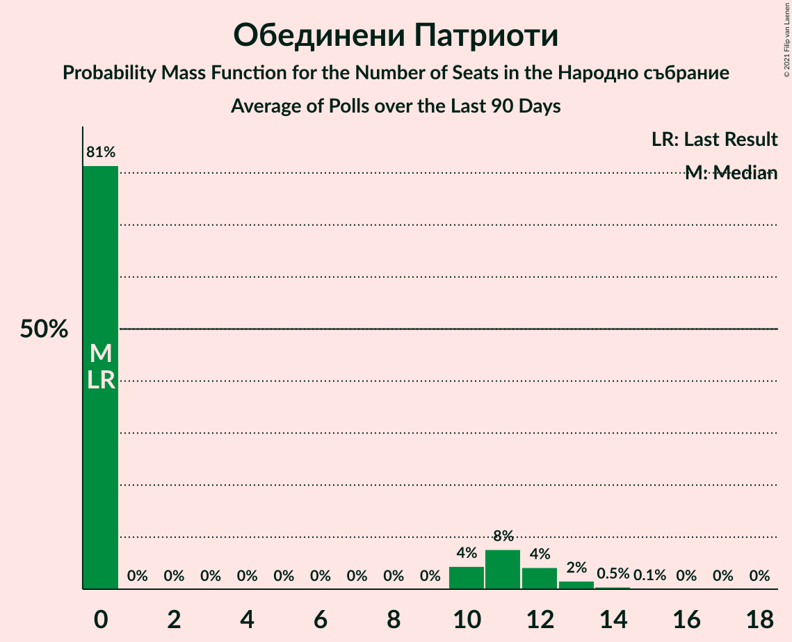

# Poll Average

<a href="#voting-intentions">Voting Intentions</a> | <a href="#seats">Seats</a> | <a href="#coalitions">Coalitions</a> | <a href="#technical-information">Technical Information</a>

## Summary

The table below lists the polls on which the average is based. They are the most recent polls (less than 90 days old) registered and analyzed so far.

| Period     | Polling firm/Commissioner(s) | ГЕРБ | БСП | ОП | ДПС | Воля | РБ | Да | АБВ | ВМРО | НФСБ | Атака | ДБ | ДСБ | ИТН | В | ИС.Б |
|:----------:|:----------------------------:|:--:|:--:|:--:|:--:|:--:|:--:|:--:|:--:|:--:|:--:|:--:|:--:|:--:|:--:|:--:|:--:|
| 27 March 2017 | General Election | 33.5%   95 | 27.9%   80 | 9.3%   27 | 9.2%   26 | 4.3%   12 | 3.1%   0 | 3.0%   0 | 1.6%   0 | 0.0%   0 | 0.0%   0 | 0.0%   0 | 0.0%   0 | 0.0%   0 | 0.0%   0 | 0.0%   0 | 0.0%   0 |
| N/A | Poll Average | 21–29%   58–77 | 20–28%   57–75 | 2–6%   0–17 | 7–12%   19–34 | 0–4%   0–10 | N/A   N/A | N/A   N/A | N/A   N/A | N/A   N/A | N/A   N/A | N/A   N/A | 7–14%   18–38 | N/A   N/A | 10–20%   26–53 | N/A   N/A | 3–7%   0–18 |
| [6–11 November 2020](2020-11-11-БарометърБългария.html) | Барометър България | N/A   N/A | N/A   N/A | N/A   N/A | N/A   N/A | N/A   N/A | N/A   N/A | N/A   N/A | N/A   N/A | N/A   N/A | N/A   N/A | N/A   N/A | N/A   N/A | N/A   N/A | N/A   N/A | N/A   N/A | N/A   N/A |
| [27 October–3 November 2020](2020-11-03-SovaHarris.html) | Sova Harris | 24–29%   62–77 | 23–28%   58–73 | 4–7%   11–18 | 7–11%   18–27 | 2–4%   0–11 | N/A   N/A | N/A   N/A | N/A   N/A | N/A   N/A | N/A   N/A | N/A   N/A | 7–10%   18–27 | N/A   N/A | 10–14%   25–35 | N/A   N/A | 4–7%   12–19 |
| [21–27 October 2020](2020-10-27-Рего.html) | Рего | 25–29%   66–78 | 24–28%   64–76 | 2–4%   0 | 7–10%   19–26 | 1–2%   0 | N/A   N/A | N/A   N/A | N/A   N/A | N/A   N/A | N/A   N/A | N/A   N/A | 7–9%   17–24 | N/A   N/A | 17–20%   44–55 | N/A   N/A | 3–5%   0–13 |
| [12–16 October 2020](2020-10-16-Спектър.html) | Спектър | 20–26%   56–72 | 19–24%   54–67 | 2–5%   0–13 | 9–12%   24–35 | 0–2%   0 | N/A   N/A | N/A   N/A | N/A   N/A | N/A   N/A | N/A   N/A | N/A   N/A | 10–14%   29–40 | N/A   N/A | 14–19%   39–53 | N/A   N/A | 3–5%   0–13 |
| [3–10 October 2020](2020-10-10-Тренд.html) | Тренд | 22–27%   59–77 | 21–26%   58–74 | 3–5%   0–14 | 8–12%   24–35 | 1–3%   0 | N/A   N/A | N/A   N/A | N/A   N/A | N/A   N/A | N/A   N/A | N/A   N/A | 7–11%   20–30 | N/A   N/A | 14–18%   37–50 | N/A   N/A | 3–5%   0–14 |
| 27 March 2017 | General Election | 33.5%   95 | 27.9%   80 | 9.3%   27 | 9.2%   26 | 4.3%   12 | 3.1%   0 | 3.0%   0 | 1.6%   0 | 0.0%   0 | 0.0%   0 | 0.0%   0 | 0.0%   0 | 0.0%   0 | 0.0%   0 | 0.0%   0 | 0.0%   0 |

Only polls for which at least the sample size has been published are included in the table above.

**Legend:**
+ **Top half of each row:** Voting intentions (95% confidence interval)
+ **Bottom half of each row:** Seat projections for the Народно събрание (95% confidence interval)
+ **ГЕРБ:** Граждани за европейско развитие на България
+ **БСП:** Българска социалистическа партия
+ **ОП:** Обединени Патриоти
+ **ДПС:** Движение за права и свободи
+ **Воля:** Воля
+ **РБ:** Реформаторски блок
+ **Да:** Да, България!
+ **АБВ:** Алтернатива за българско възраждане
+ **ВМРО:** ВМРО–Българско Национално Движение
+ **НФСБ:** Национален фронт за спасение на България
+ **Атака:** Атака
+ **ДБ:** Демократична България
+ **ДСБ:** Демократи за силна България
+ **ИТН:** Има такъв народ
+ **В:** Възраждане
+ **ИС.Б:** Изправи се Бг
+ **N/A (single party):** Party not included the published results
+ **N/A (entire row):** Calculation for this opinion poll not started yet

## Voting Intentions

### Confidence Intervals

| Party | Last Result | Median | 80% Confidence Interval | 90% Confidence Interval | 95% Confidence Interval | 99% Confidence Interval |
|:-----:|:-----------:|:------:|:-----------------------:|:-----------------------:|:-----------------------:|:-----------------------:|
| <a href="#граждани-за-европейско-развитие-на-българия">Граждани за европейско развитие на България</a> | 33.5% | 25.4% | 22.3–27.9% |21.7–28.4% | 21.2–28.9% | 20.3–29.7% |
| <a href="#българска-социалистическа-партия">Българска социалистическа партия</a> | 27.9% | 24.4% | 21.3–26.9% |20.7–27.4% | 20.1–27.8% | 19.2–28.6% |
| <a href="#обединени-патриоти">Обединени Патриоти</a> | 9.3% | 3.7% | 2.7–5.8% |2.5–6.2% | 2.4–6.5% | 2.1–7.2% |
| <a href="#движение-за-права-и-свободи">Движение за права и свободи</a> | 9.2% | 9.4% | 7.9–11.2% |7.6–11.7% | 7.4–12.0% | 6.9–12.8% |
| <a href="#воля">Воля</a> | 4.3% | 1.4% | 0.8–3.4% |0.6–3.8% | 0.5–4.0% | 0.4–4.5% |
| <a href="#реформаторски-блок">Реформаторски блок</a> | 3.1% | N/A | N/A |N/A | N/A | N/A |
| <a href="#да,-българия!">Да, България!</a> | 3.0% | N/A | N/A |N/A | N/A | N/A |
| <a href="#алтернатива-за-българско-възраждане">Алтернатива за българско възраждане</a> | 1.6% | N/A | N/A |N/A | N/A | N/A |
| <a href="#вмро–българско-национално-движение">ВМРО–Българско Национално Движение</a> | 0.0% | N/A | N/A |N/A | N/A | N/A |
| <a href="#национален-фронт-за-спасение-на-българия">Национален фронт за спасение на България</a> | 0.0% | N/A | N/A |N/A | N/A | N/A |
| <a href="#атака">Атака</a> | 0.0% | N/A | N/A |N/A | N/A | N/A |
| <a href="#демократична-българия">Демократична България</a> | 0.0% | 8.7% | 7.3–12.5% |7.0–13.1% | 6.8–13.6% | 6.4–14.5% |
| <a href="#демократи-за-силна-българия">Демократи за силна България</a> | 0.0% | N/A | N/A |N/A | N/A | N/A |
| <a href="#има-такъв-народ">Има такъв народ</a> | 0.0% | 16.1% | 11.2–18.9% |10.6–19.4% | 10.2–19.8% | 9.5–20.5% |
| <a href="#възраждане">Възраждане</a> | 0.0% | N/A | N/A |N/A | N/A | N/A |
| <a href="#изправи-се-бг">Изправи се Бг</a> | 0.0% | 4.1% | 3.2–6.0% |3.0–6.4% | 2.8–6.7% | 2.5–7.4% |

### Граждани за европейско развитие на България

*For a full overview of the results for this party, see the [Граждани за европейско развитие на България](party-гражданизаевропейскоразвитиенабългария.html) page.*

| Voting Intentions | Probability | Accumulated | Special Marks |
|:-----------------:|:-----------:|:-----------:|:-------------:|
| 17.5–18.5% | 0% | 100% |  |
| 18.5–19.5% | 0.1% | 100% |  |
| 19.5–20.5% | 0.7% | 99.9% |  |
| 20.5–21.5% | 3% | 99.2% |  |
| 21.5–22.5% | 8% | 96% |  |
| 22.5–23.5% | 13% | 88% |  |
| 23.5–24.5% | 14% | 75% |  |
| 24.5–25.5% | 13% | 61% | Median |
| 25.5–26.5% | 16% | 48% |  |
| 26.5–27.5% | 17% | 32% |  |
| 27.5–28.5% | 11% | 15% |  |
| 28.5–29.5% | 3% | 4% |  |
| 29.5–30.5% | 0.6% | 0.7% |  |
| 30.5–31.5% | 0.1% | 0.1% |  |
| 31.5–32.5% | 0% | 0% |  |
| 32.5–33.5% | 0% | 0% |  |
| 33.5–34.5% | 0% | 0% | Last Result |

### Българска социалистическа партия

*For a full overview of the results for this party, see the [Българска социалистическа партия](party-българскасоциалистическапартия.html) page.*

| Voting Intentions | Probability | Accumulated | Special Marks |
|:-----------------:|:-----------:|:-----------:|:-------------:|
| 16.5–17.5% | 0% | 100% |  |
| 17.5–18.5% | 0.1% | 100% |  |
| 18.5–19.5% | 0.9% | 99.9% |  |
| 19.5–20.5% | 3% | 99.0% |  |
| 20.5–21.5% | 8% | 96% |  |
| 21.5–22.5% | 12% | 88% |  |
| 22.5–23.5% | 14% | 76% |  |
| 23.5–24.5% | 15% | 62% | Median |
| 24.5–25.5% | 16% | 47% |  |
| 25.5–26.5% | 17% | 31% |  |
| 26.5–27.5% | 11% | 14% |  |
| 27.5–28.5% | 3% | 4% | Last Result |
| 28.5–29.5% | 0.5% | 0.5% |  |
| 29.5–30.5% | 0% | 0% |  |

### Обединени Патриоти

*For a full overview of the results for this party, see the [Обединени Патриоти](party-обединенипатриоти.html) page.*

| Voting Intentions | Probability | Accumulated | Special Marks |
|:-----------------:|:-----------:|:-----------:|:-------------:|
| 0.5–1.5% | 0% | 100% |  |
| 1.5–2.5% | 6% | 100% |  |
| 2.5–3.5% | 39% | 94% |  |
| 3.5–4.5% | 27% | 55% | Median |
| 4.5–5.5% | 15% | 28% |  |
| 5.5–6.5% | 10% | 13% |  |
| 6.5–7.5% | 2% | 2% |  |
| 7.5–8.5% | 0.2% | 0.2% |  |
| 8.5–9.5% | 0% | 0% | Last Result |

### Движение за права и свободи

*For a full overview of the results for this party, see the [Движение за права и свободи](party-движениезаправаисвободи.html) page.*

| Voting Intentions | Probability | Accumulated | Special Marks |
|:-----------------:|:-----------:|:-----------:|:-------------:|
| 4.5–5.5% | 0% | 100% |  |
| 5.5–6.5% | 0.1% | 100% |  |
| 6.5–7.5% | 4% | 99.9% |  |
| 7.5–8.5% | 23% | 96% |  |
| 8.5–9.5% | 27% | 73% | Last Result, Median |
| 9.5–10.5% | 24% | 46% |  |
| 10.5–11.5% | 16% | 22% |  |
| 11.5–12.5% | 5% | 6% |  |
| 12.5–13.5% | 0.8% | 0.8% |  |
| 13.5–14.5% | 0.1% | 0.1% |  |
| 14.5–15.5% | 0% | 0% |  |

### Воля

*For a full overview of the results for this party, see the [Воля](party-воля.html) page.*

| Voting Intentions | Probability | Accumulated | Special Marks |
|:-----------------:|:-----------:|:-----------:|:-------------:|
| 0.0–0.5% | 3% | 100% |  |
| 0.5–1.5% | 55% | 97% | Median |
| 1.5–2.5% | 18% | 42% |  |
| 2.5–3.5% | 16% | 24% |  |
| 3.5–4.5% | 7% | 8% | Last Result |
| 4.5–5.5% | 0.5% | 0.5% |  |
| 5.5–6.5% | 0% | 0% |  |

### Демократична България

*For a full overview of the results for this party, see the [Демократична България](party-демократичнабългария.html) page.*

| Voting Intentions | Probability | Accumulated | Special Marks |
|:-----------------:|:-----------:|:-----------:|:-------------:|
| 0.0–0.5% | 0% | 100% | Last Result |
| 0.5–1.5% | 0% | 100% |  |
| 1.5–2.5% | 0% | 100% |  |
| 2.5–3.5% | 0% | 100% |  |
| 3.5–4.5% | 0% | 100% |  |
| 4.5–5.5% | 0% | 100% |  |
| 5.5–6.5% | 1.0% | 100% |  |
| 6.5–7.5% | 15% | 99.0% |  |
| 7.5–8.5% | 30% | 84% |  |
| 8.5–9.5% | 21% | 54% | Median |
| 9.5–10.5% | 8% | 34% |  |
| 10.5–11.5% | 6% | 25% |  |
| 11.5–12.5% | 9% | 19% |  |
| 12.5–13.5% | 7% | 10% |  |
| 13.5–14.5% | 2% | 3% |  |
| 14.5–15.5% | 0.4% | 0.4% |  |
| 15.5–16.5% | 0% | 0% |  |

### Има такъв народ

*For a full overview of the results for this party, see the [Има такъв народ](party-иматакъвнарод.html) page.*

| Voting Intentions | Probability | Accumulated | Special Marks |
|:-----------------:|:-----------:|:-----------:|:-------------:|
| 0.0–0.5% | 0% | 100% | Last Result |
| 0.5–1.5% | 0% | 100% |  |
| 1.5–2.5% | 0% | 100% |  |
| 2.5–3.5% | 0% | 100% |  |
| 3.5–4.5% | 0% | 100% |  |
| 4.5–5.5% | 0% | 100% |  |
| 5.5–6.5% | 0% | 100% |  |
| 6.5–7.5% | 0% | 100% |  |
| 7.5–8.5% | 0% | 100% |  |
| 8.5–9.5% | 0.6% | 100% |  |
| 9.5–10.5% | 4% | 99.4% |  |
| 10.5–11.5% | 9% | 96% |  |
| 11.5–12.5% | 8% | 86% |  |
| 12.5–13.5% | 4% | 79% |  |
| 13.5–14.5% | 5% | 75% |  |
| 14.5–15.5% | 12% | 70% |  |
| 15.5–16.5% | 17% | 58% | Median |
| 16.5–17.5% | 14% | 42% |  |
| 17.5–18.5% | 13% | 28% |  |
| 18.5–19.5% | 11% | 14% |  |
| 19.5–20.5% | 3% | 4% |  |
| 20.5–21.5% | 0.4% | 0.4% |  |
| 21.5–22.5% | 0% | 0% |  |

### Изправи се Бг

*For a full overview of the results for this party, see the [Изправи се Бг](party-изправисебг.html) page.*

| Voting Intentions | Probability | Accumulated | Special Marks |
|:-----------------:|:-----------:|:-----------:|:-------------:|
| 0.0–0.5% | 0% | 100% | Last Result |
| 0.5–1.5% | 0% | 100% |  |
| 1.5–2.5% | 0.7% | 100% |  |
| 2.5–3.5% | 22% | 99.3% |  |
| 3.5–4.5% | 45% | 77% | Median |
| 4.5–5.5% | 16% | 32% |  |
| 5.5–6.5% | 12% | 16% |  |
| 6.5–7.5% | 3% | 4% |  |
| 7.5–8.5% | 0.3% | 0.3% |  |
| 8.5–9.5% | 0% | 0% |  |

## Seats

### Confidence Intervals

| Party | Last Result | Median | 80% Confidence Interval | 90% Confidence Interval | 95% Confidence Interval | 99% Confidence Interval |
|:-----:|:-----------:|:------:|:-----------------------:|:-----------------------:|:-----------------------:|:-----------------------:|
| <a href="#граждани-за-европейско-развитие-на-българия">Граждани за европейско развитие на България</a> | 95 | 68 | 62–74 |60–76 | 58–77 | 56–79 |
| <a href="#българска-социалистическа-партия">Българска социалистическа партия</a> | 80 | 66 | 60–72 |58–74 | 57–75 | 53–77 |
| <a href="#обединени-патриоти">Обединени Патриоти</a> | 27 | 0 | 0–15 |0–16 | 0–17 | 0–19 |
| <a href="#движение-за-права-и-свободи">Движение за права и свободи</a> | 26 | 25 | 21–32 |20–33 | 19–34 | 18–36 |
| <a href="#воля">Воля</a> | 12 | 0 | 0 |0 | 0–10 | 0–12 |
| <a href="#реформаторски-блок">Реформаторски блок</a> | 0 | N/A | N/A |N/A | N/A | N/A |
| <a href="#да,-българия!">Да, България!</a> | 0 | N/A | N/A |N/A | N/A | N/A |
| <a href="#алтернатива-за-българско-възраждане">Алтернатива за българско възраждане</a> | 0 | N/A | N/A |N/A | N/A | N/A |
| <a href="#вмро–българско-национално-движение">ВМРО–Българско Национално Движение</a> | 0 | N/A | N/A |N/A | N/A | N/A |
| <a href="#национален-фронт-за-спасение-на-българия">Национален фронт за спасение на България</a> | 0 | N/A | N/A |N/A | N/A | N/A |
| <a href="#атака">Атака</a> | 0 | N/A | N/A |N/A | N/A | N/A |
| <a href="#демократична-българия">Демократична България</a> | 0 | 24 | 19–35 |19–37 | 18–38 | 17–40 |
| <a href="#демократи-за-силна-българия">Демократи за силна България</a> | 0 | N/A | N/A |N/A | N/A | N/A |
| <a href="#има-такъв-народ">Има такъв народ</a> | 0 | 44 | 29–51 |27–52 | 26–53 | 25–55 |
| <a href="#възраждане">Възраждане</a> | 0 | N/A | N/A |N/A | N/A | N/A |
| <a href="#изправи-се-бг">Изправи се Бг</a> | 0 | 0 | 0–15 |0–17 | 0–18 | 0–19 |

### Граждани за европейско развитие на България

*For a full overview of the results for this party, see the [Граждани за европейско развитие на България](party-гражданизаевропейскоразвитиенабългария.html) page.*

| Number of Seats | Probability | Accumulated | Special Marks |
|:---------------:|:-----------:|:-----------:|:-------------:|
| 53 | 0% | 100% |  |
| 54 | 0.1% | 99.9% |  |
| 55 | 0.3% | 99.8% |  |
| 56 | 0.4% | 99.5% |  |
| 57 | 0.8% | 99.1% |  |
| 58 | 1.4% | 98% |  |
| 59 | 2% | 97% |  |
| 60 | 2% | 95% |  |
| 61 | 3% | 93% |  |
| 62 | 3% | 90% |  |
| 63 | 4% | 87% |  |
| 64 | 5% | 83% |  |
| 65 | 6% | 78% |  |
| 66 | 7% | 72% |  |
| 67 | 7% | 65% |  |
| 68 | 8% | 58% | Median |
| 69 | 8% | 50% |  |
| 70 | 9% | 42% |  |
| 71 | 7% | 34% |  |
| 72 | 6% | 27% |  |
| 73 | 6% | 21% |  |
| 74 | 5% | 14% |  |
| 75 | 3% | 9% |  |
| 76 | 3% | 6% |  |
| 77 | 2% | 3% |  |
| 78 | 0.9% | 2% |  |
| 79 | 0.4% | 0.8% |  |
| 80 | 0.2% | 0.4% |  |
| 81 | 0.1% | 0.1% |  |
| 82 | 0% | 0.1% |  |
| 83 | 0% | 0% |  |
| 84 | 0% | 0% |  |
| 85 | 0% | 0% |  |
| 86 | 0% | 0% |  |
| 87 | 0% | 0% |  |
| 88 | 0% | 0% |  |
| 89 | 0% | 0% |  |
| 90 | 0% | 0% |  |
| 91 | 0% | 0% |  |
| 92 | 0% | 0% |  |
| 93 | 0% | 0% |  |
| 94 | 0% | 0% |  |
| 95 | 0% | 0% | Last Result |

### Българска социалистическа партия

*For a full overview of the results for this party, see the [Българска социалистическа партия](party-българскасоциалистическапартия.html) page.*

| Number of Seats | Probability | Accumulated | Special Marks |
|:---------------:|:-----------:|:-----------:|:-------------:|
| 50 | 0% | 100% |  |
| 51 | 0.1% | 99.9% |  |
| 52 | 0.1% | 99.9% |  |
| 53 | 0.3% | 99.7% |  |
| 54 | 0.4% | 99.4% |  |
| 55 | 0.8% | 99.1% |  |
| 56 | 0.8% | 98% |  |
| 57 | 2% | 98% |  |
| 58 | 2% | 96% |  |
| 59 | 3% | 93% |  |
| 60 | 3% | 91% |  |
| 61 | 4% | 87% |  |
| 62 | 6% | 83% |  |
| 63 | 7% | 77% |  |
| 64 | 9% | 70% |  |
| 65 | 9% | 60% |  |
| 66 | 7% | 51% | Median |
| 67 | 8% | 44% |  |
| 68 | 6% | 36% |  |
| 69 | 7% | 29% |  |
| 70 | 5% | 23% |  |
| 71 | 6% | 17% |  |
| 72 | 4% | 11% |  |
| 73 | 2% | 8% |  |
| 74 | 2% | 6% |  |
| 75 | 1.4% | 3% |  |
| 76 | 1.2% | 2% |  |
| 77 | 0.5% | 0.7% |  |
| 78 | 0.1% | 0.2% |  |
| 79 | 0.1% | 0.1% |  |
| 80 | 0% | 0% | Last Result |

### Обединени Патриоти

*For a full overview of the results for this party, see the [Обединени Патриоти](party-обединенипатриоти.html) page.*

| Number of Seats | Probability | Accumulated | Special Marks |
|:---------------:|:-----------:|:-----------:|:-------------:|
| 0 | 59% | 100% | Median |
| 1 | 0% | 41% |  |
| 2 | 0% | 41% |  |
| 3 | 0% | 41% |  |
| 4 | 0% | 41% |  |
| 5 | 0% | 41% |  |
| 6 | 0% | 41% |  |
| 7 | 0% | 41% |  |
| 8 | 0% | 41% |  |
| 9 | 0% | 41% |  |
| 10 | 0.1% | 41% |  |
| 11 | 6% | 41% |  |
| 12 | 9% | 35% |  |
| 13 | 6% | 26% |  |
| 14 | 7% | 20% |  |
| 15 | 5% | 13% |  |
| 16 | 4% | 8% |  |
| 17 | 2% | 4% |  |
| 18 | 1.2% | 2% |  |
| 19 | 0.3% | 0.5% |  |
| 20 | 0.2% | 0.2% |  |
| 21 | 0% | 0% |  |
| 22 | 0% | 0% |  |
| 23 | 0% | 0% |  |
| 24 | 0% | 0% |  |
| 25 | 0% | 0% |  |
| 26 | 0% | 0% |  |
| 27 | 0% | 0% | Last Result |

### Движение за права и свободи

*For a full overview of the results for this party, see the [Движение за права и свободи](party-движениезаправаисвободи.html) page.*

| Number of Seats | Probability | Accumulated | Special Marks |
|:---------------:|:-----------:|:-----------:|:-------------:|
| 17 | 0.1% | 100% |  |
| 18 | 1.0% | 99.8% |  |
| 19 | 2% | 98.8% |  |
| 20 | 5% | 97% |  |
| 21 | 7% | 92% |  |
| 22 | 11% | 85% |  |
| 23 | 9% | 74% |  |
| 24 | 7% | 65% |  |
| 25 | 9% | 58% | Median |
| 26 | 5% | 48% | Last Result |
| 27 | 8% | 43% |  |
| 28 | 6% | 35% |  |
| 29 | 7% | 30% |  |
| 30 | 6% | 23% |  |
| 31 | 6% | 16% |  |
| 32 | 5% | 11% |  |
| 33 | 3% | 6% |  |
| 34 | 1.5% | 3% |  |
| 35 | 0.8% | 2% |  |
| 36 | 0.4% | 0.7% |  |
| 37 | 0.2% | 0.3% |  |
| 38 | 0.1% | 0.1% |  |
| 39 | 0% | 0% |  |

### Воля

*For a full overview of the results for this party, see the [Воля](party-воля.html) page.*

| Number of Seats | Probability | Accumulated | Special Marks |
|:---------------:|:-----------:|:-----------:|:-------------:|
| 0 | 97% | 100% | Median |
| 1 | 0% | 3% |  |
| 2 | 0% | 3% |  |
| 3 | 0% | 3% |  |
| 4 | 0% | 3% |  |
| 5 | 0% | 3% |  |
| 6 | 0% | 3% |  |
| 7 | 0% | 3% |  |
| 8 | 0% | 3% |  |
| 9 | 0% | 3% |  |
| 10 | 1.0% | 3% |  |
| 11 | 1.1% | 2% |  |
| 12 | 0.4% | 0.5% | Last Result |
| 13 | 0.1% | 0.1% |  |
| 14 | 0% | 0% |  |

### Реформаторски блок

*For a full overview of the results for this party, see the [Реформаторски блок](party-реформаторскиблок.html) page.*

### Да, България!

*For a full overview of the results for this party, see the [Да, България!](party-дабългария.html) page.*

### Алтернатива за българско възраждане

*For a full overview of the results for this party, see the [Алтернатива за българско възраждане](party-алтернативазабългарсковъзраждане.html) page.*

### ВМРО–Българско Национално Движение

*For a full overview of the results for this party, see the [ВМРО–Българско Национално Движение](party-вмро–българсконационалнодвижение.html) page.*

### Национален фронт за спасение на България

*For a full overview of the results for this party, see the [Национален фронт за спасение на България](party-националенфронтзаспасениенабългария.html) page.*

### Атака

*For a full overview of the results for this party, see the [Атака](party-атака.html) page.*

### Демократична България

*For a full overview of the results for this party, see the [Демократична България](party-демократичнабългария.html) page.*

| Number of Seats | Probability | Accumulated | Special Marks |
|:---------------:|:-----------:|:-----------:|:-------------:|
| 0 | 0% | 100% | Last Result |
| 1 | 0% | 100% |  |
| 2 | 0% | 100% |  |
| 3 | 0% | 100% |  |
| 4 | 0% | 100% |  |
| 5 | 0% | 100% |  |
| 6 | 0% | 100% |  |
| 7 | 0% | 100% |  |
| 8 | 0% | 100% |  |
| 9 | 0% | 100% |  |
| 10 | 0% | 100% |  |
| 11 | 0% | 100% |  |
| 12 | 0% | 100% |  |
| 13 | 0% | 100% |  |
| 14 | 0% | 100% |  |
| 15 | 0% | 100% |  |
| 16 | 0.2% | 99.9% |  |
| 17 | 1.1% | 99.7% |  |
| 18 | 3% | 98.6% |  |
| 19 | 7% | 96% |  |
| 20 | 8% | 89% |  |
| 21 | 11% | 81% |  |
| 22 | 11% | 70% |  |
| 23 | 8% | 58% |  |
| 24 | 7% | 50% | Median |
| 25 | 5% | 43% |  |
| 26 | 5% | 38% |  |
| 27 | 3% | 33% |  |
| 28 | 3% | 30% |  |
| 29 | 2% | 27% |  |
| 30 | 2% | 25% |  |
| 31 | 2% | 23% |  |
| 32 | 3% | 21% |  |
| 33 | 3% | 18% |  |
| 34 | 3% | 15% |  |
| 35 | 4% | 11% |  |
| 36 | 2% | 7% |  |
| 37 | 2% | 5% |  |
| 38 | 1.4% | 3% |  |
| 39 | 0.9% | 2% |  |
| 40 | 0.5% | 0.9% |  |
| 41 | 0.2% | 0.4% |  |
| 42 | 0.1% | 0.2% |  |
| 43 | 0% | 0.1% |  |
| 44 | 0% | 0% |  |

### Демократи за силна България

*For a full overview of the results for this party, see the [Демократи за силна България](party-демократизасилнабългария.html) page.*

### Има такъв народ

*For a full overview of the results for this party, see the [Има такъв народ](party-иматакъвнарод.html) page.*

| Number of Seats | Probability | Accumulated | Special Marks |
|:---------------:|:-----------:|:-----------:|:-------------:|
| 0 | 0% | 100% | Last Result |
| 1 | 0% | 100% |  |
| 2 | 0% | 100% |  |
| 3 | 0% | 100% |  |
| 4 | 0% | 100% |  |
| 5 | 0% | 100% |  |
| 6 | 0% | 100% |  |
| 7 | 0% | 100% |  |
| 8 | 0% | 100% |  |
| 9 | 0% | 100% |  |
| 10 | 0% | 100% |  |
| 11 | 0% | 100% |  |
| 12 | 0% | 100% |  |
| 13 | 0% | 100% |  |
| 14 | 0% | 100% |  |
| 15 | 0% | 100% |  |
| 16 | 0% | 100% |  |
| 17 | 0% | 100% |  |
| 18 | 0% | 100% |  |
| 19 | 0% | 100% |  |
| 20 | 0% | 100% |  |
| 21 | 0% | 100% |  |
| 22 | 0% | 100% |  |
| 23 | 0.1% | 100% |  |
| 24 | 0.3% | 99.9% |  |
| 25 | 0.8% | 99.6% |  |
| 26 | 2% | 98.9% |  |
| 27 | 2% | 97% |  |
| 28 | 3% | 95% |  |
| 29 | 4% | 91% |  |
| 30 | 4% | 88% |  |
| 31 | 3% | 84% |  |
| 32 | 3% | 82% |  |
| 33 | 2% | 79% |  |
| 34 | 1.1% | 77% |  |
| 35 | 0.8% | 76% |  |
| 36 | 0.5% | 75% |  |
| 37 | 0.7% | 75% |  |
| 38 | 1.2% | 74% |  |
| 39 | 2% | 73% |  |
| 40 | 2% | 71% |  |
| 41 | 4% | 69% |  |
| 42 | 5% | 66% |  |
| 43 | 6% | 60% |  |
| 44 | 6% | 54% | Median |
| 45 | 6% | 49% |  |
| 46 | 7% | 43% |  |
| 47 | 5% | 36% |  |
| 48 | 7% | 31% |  |
| 49 | 5% | 23% |  |
| 50 | 5% | 18% |  |
| 51 | 6% | 13% |  |
| 52 | 2% | 7% |  |
| 53 | 3% | 5% |  |
| 54 | 1.1% | 2% |  |
| 55 | 0.6% | 1.1% |  |
| 56 | 0.3% | 0.4% |  |
| 57 | 0.1% | 0.2% |  |
| 58 | 0.1% | 0.1% |  |
| 59 | 0% | 0% |  |

### Възраждане

*For a full overview of the results for this party, see the [Възраждане](party-възраждане.html) page.*

### Изправи се Бг

*For a full overview of the results for this party, see the [Изправи се Бг](party-изправисебг.html) page.*

| Number of Seats | Probability | Accumulated | Special Marks |
|:---------------:|:-----------:|:-----------:|:-------------:|
| 0 | 51% | 100% | Last Result, Median |
| 1 | 0% | 49% |  |
| 2 | 0% | 49% |  |
| 3 | 0% | 49% |  |
| 4 | 0% | 49% |  |
| 5 | 0% | 49% |  |
| 6 | 0% | 49% |  |
| 7 | 0% | 49% |  |
| 8 | 0% | 49% |  |
| 9 | 0% | 49% |  |
| 10 | 0.8% | 49% |  |
| 11 | 11% | 48% |  |
| 12 | 10% | 37% |  |
| 13 | 6% | 28% |  |
| 14 | 6% | 22% |  |
| 15 | 7% | 16% |  |
| 16 | 4% | 10% |  |
| 17 | 3% | 6% |  |
| 18 | 2% | 3% |  |
| 19 | 0.5% | 0.9% |  |
| 20 | 0.3% | 0.4% |  |
| 21 | 0.1% | 0.1% |  |
| 22 | 0% | 0% |  |

## Coalitions

### Confidence Intervals

| Coalition | Last Result | Median | Majority? | 80% Confidence Interval | 90% Confidence Interval | 95% Confidence Interval | 99% Confidence Interval |
|:---------:|:-----------:|:------:|:---------:|:-----------------------:|:-----------------------:|:-----------------------:|:-----------------------:|
| Българска социалистическа партия – Движение за права и свободи – Изправи се Бг – Има такъв народ | 106 | 141 | 99.9% | 131–150 | 129–151 | 127–153 | 123–155 |
| Българска социалистическа партия – Движение за права и свободи – Има такъв народ | 106 | 137 | 82% | 117–146 | 115–148 | 112–149 | 109–152 |
| Българска социалистическа партия – Движение за права и свободи – Изправи се Бг | 106 | 99 | 0% | 90–106 | 88–108 | 86–109 | 83–113 |
| Българска социалистическа партия – Движение за права и свободи | 106 | 92 | 0% | 85–98 | 83–100 | 82–101 | 79–106 |
| Граждани за европейско развитие на България – Обединени Патриоти | 122 | 73 | 0% | 64–85 | 62–87 | 60–89 | 57–92 |

### Българска социалистическа партия – Движение за права и свободи – Изправи се Бг – Има такъв народ

| Number of Seats | Probability | Accumulated | Special Marks |
|:---------------:|:-----------:|:-----------:|:-------------:|
| 106 | 0% | 100% | Last Result |
| 107 | 0% | 100% |  |
| 108 | 0% | 100% |  |
| 109 | 0% | 100% |  |
| 110 | 0% | 100% |  |
| 111 | 0% | 100% |  |
| 112 | 0% | 100% |  |
| 113 | 0% | 100% |  |
| 114 | 0% | 100% |  |
| 115 | 0% | 100% |  |
| 116 | 0% | 100% |  |
| 117 | 0% | 100% |  |
| 118 | 0% | 100% |  |
| 119 | 0% | 100% |  |
| 120 | 0% | 99.9% |  |
| 121 | 0.1% | 99.9% | Majority |
| 122 | 0.1% | 99.8% |  |
| 123 | 0.3% | 99.7% |  |
| 124 | 0.4% | 99.4% |  |
| 125 | 0.5% | 99.1% |  |
| 126 | 0.6% | 98.5% |  |
| 127 | 1.0% | 98% |  |
| 128 | 1.2% | 97% |  |
| 129 | 2% | 96% |  |
| 130 | 2% | 94% |  |
| 131 | 3% | 92% |  |
| 132 | 4% | 89% |  |
| 133 | 3% | 85% |  |
| 134 | 4% | 81% |  |
| 135 | 4% | 77% | Median |
| 136 | 4% | 74% |  |
| 137 | 5% | 69% |  |
| 138 | 5% | 64% |  |
| 139 | 5% | 59% |  |
| 140 | 3% | 54% |  |
| 141 | 4% | 51% |  |
| 142 | 5% | 46% |  |
| 143 | 5% | 42% |  |
| 144 | 5% | 36% |  |
| 145 | 5% | 32% |  |
| 146 | 4% | 27% |  |
| 147 | 5% | 22% |  |
| 148 | 4% | 17% |  |
| 149 | 3% | 14% |  |
| 150 | 3% | 11% |  |
| 151 | 3% | 8% |  |
| 152 | 2% | 5% |  |
| 153 | 1.2% | 3% |  |
| 154 | 0.7% | 2% |  |
| 155 | 0.5% | 0.9% |  |
| 156 | 0.2% | 0.5% |  |
| 157 | 0.1% | 0.3% |  |
| 158 | 0.1% | 0.1% |  |
| 159 | 0% | 0.1% |  |
| 160 | 0% | 0% |  |

### Българска социалистическа партия – Движение за права и свободи – Има такъв народ

| Number of Seats | Probability | Accumulated | Special Marks |
|:---------------:|:-----------:|:-----------:|:-------------:|
| 105 | 0% | 100% |  |
| 106 | 0.1% | 99.9% | Last Result |
| 107 | 0.1% | 99.9% |  |
| 108 | 0.2% | 99.8% |  |
| 109 | 0.3% | 99.6% |  |
| 110 | 0.4% | 99.3% |  |
| 111 | 0.6% | 98.9% |  |
| 112 | 0.9% | 98% |  |
| 113 | 1.4% | 97% |  |
| 114 | 1.0% | 96% |  |
| 115 | 2% | 95% |  |
| 116 | 2% | 93% |  |
| 117 | 2% | 91% |  |
| 118 | 3% | 89% |  |
| 119 | 2% | 86% |  |
| 120 | 2% | 84% |  |
| 121 | 2% | 82% | Majority |
| 122 | 2% | 80% |  |
| 123 | 2% | 78% |  |
| 124 | 1.1% | 77% |  |
| 125 | 1.1% | 76% |  |
| 126 | 0.9% | 75% |  |
| 127 | 1.1% | 74% |  |
| 128 | 1.3% | 72% |  |
| 129 | 1.0% | 71% |  |
| 130 | 1.4% | 70% |  |
| 131 | 2% | 69% |  |
| 132 | 3% | 67% |  |
| 133 | 3% | 64% |  |
| 134 | 3% | 62% |  |
| 135 | 3% | 59% | Median |
| 136 | 4% | 56% |  |
| 137 | 5% | 52% |  |
| 138 | 5% | 47% |  |
| 139 | 6% | 42% |  |
| 140 | 4% | 36% |  |
| 141 | 4% | 32% |  |
| 142 | 5% | 28% |  |
| 143 | 5% | 23% |  |
| 144 | 4% | 18% |  |
| 145 | 3% | 14% |  |
| 146 | 3% | 11% |  |
| 147 | 3% | 8% |  |
| 148 | 2% | 5% |  |
| 149 | 1.1% | 3% |  |
| 150 | 0.9% | 2% |  |
| 151 | 0.7% | 1.2% |  |
| 152 | 0.3% | 0.5% |  |
| 153 | 0.2% | 0.2% |  |
| 154 | 0% | 0.1% |  |
| 155 | 0% | 0% |  |

### Българска социалистическа партия – Движение за права и свободи – Изправи се Бг

| Number of Seats | Probability | Accumulated | Special Marks |
|:---------------:|:-----------:|:-----------:|:-------------:|
| 80 | 0.1% | 100% |  |
| 81 | 0.2% | 99.9% |  |
| 82 | 0.2% | 99.7% |  |
| 83 | 0.2% | 99.6% |  |
| 84 | 0.4% | 99.3% |  |
| 85 | 0.7% | 99.0% |  |
| 86 | 1.0% | 98% |  |
| 87 | 0.9% | 97% |  |
| 88 | 2% | 96% |  |
| 89 | 2% | 95% |  |
| 90 | 3% | 92% |  |
| 91 | 2% | 90% | Median |
| 92 | 3% | 87% |  |
| 93 | 6% | 84% |  |
| 94 | 8% | 78% |  |
| 95 | 6% | 71% |  |
| 96 | 6% | 64% |  |
| 97 | 4% | 59% |  |
| 98 | 5% | 55% |  |
| 99 | 7% | 50% |  |
| 100 | 6% | 43% |  |
| 101 | 6% | 38% |  |
| 102 | 6% | 32% |  |
| 103 | 5% | 25% |  |
| 104 | 4% | 21% |  |
| 105 | 5% | 17% |  |
| 106 | 3% | 12% | Last Result |
| 107 | 3% | 8% |  |
| 108 | 2% | 6% |  |
| 109 | 1.4% | 4% |  |
| 110 | 0.6% | 2% |  |
| 111 | 0.5% | 2% |  |
| 112 | 0.4% | 1.1% |  |
| 113 | 0.3% | 0.7% |  |
| 114 | 0.2% | 0.3% |  |
| 115 | 0.1% | 0.1% |  |
| 116 | 0% | 0.1% |  |
| 117 | 0% | 0% |  |

### Българска социалистическа партия – Движение за права и свободи

| Number of Seats | Probability | Accumulated | Special Marks |
|:---------------:|:-----------:|:-----------:|:-------------:|
| 76 | 0% | 100% |  |
| 77 | 0.1% | 99.9% |  |
| 78 | 0.2% | 99.8% |  |
| 79 | 0.2% | 99.6% |  |
| 80 | 0.8% | 99.4% |  |
| 81 | 0.9% | 98.6% |  |
| 82 | 1.2% | 98% |  |
| 83 | 2% | 97% |  |
| 84 | 3% | 95% |  |
| 85 | 3% | 92% |  |
| 86 | 4% | 89% |  |
| 87 | 5% | 85% |  |
| 88 | 6% | 80% |  |
| 89 | 7% | 74% |  |
| 90 | 8% | 67% |  |
| 91 | 6% | 59% | Median |
| 92 | 7% | 52% |  |
| 93 | 9% | 45% |  |
| 94 | 9% | 37% |  |
| 95 | 7% | 27% |  |
| 96 | 5% | 20% |  |
| 97 | 3% | 15% |  |
| 98 | 3% | 13% |  |
| 99 | 4% | 10% |  |
| 100 | 2% | 6% |  |
| 101 | 2% | 4% |  |
| 102 | 0.6% | 2% |  |
| 103 | 0.2% | 2% |  |
| 104 | 0.2% | 1.4% |  |
| 105 | 0.6% | 1.3% |  |
| 106 | 0.3% | 0.7% | Last Result |
| 107 | 0.3% | 0.3% |  |
| 108 | 0.1% | 0.1% |  |
| 109 | 0% | 0% |  |

### Граждани за европейско развитие на България – Обединени Патриоти

| Number of Seats | Probability | Accumulated | Special Marks |
|:---------------:|:-----------:|:-----------:|:-------------:|
| 54 | 0% | 100% |  |
| 55 | 0.1% | 99.9% |  |
| 56 | 0.2% | 99.8% |  |
| 57 | 0.3% | 99.6% |  |
| 58 | 0.5% | 99.4% |  |
| 59 | 0.7% | 98.9% |  |
| 60 | 0.9% | 98% |  |
| 61 | 1.4% | 97% |  |
| 62 | 2% | 96% |  |
| 63 | 2% | 94% |  |
| 64 | 2% | 92% |  |
| 65 | 4% | 90% |  |
| 66 | 4% | 86% |  |
| 67 | 4% | 82% |  |
| 68 | 4% | 79% | Median |
| 69 | 5% | 74% |  |
| 70 | 6% | 69% |  |
| 71 | 4% | 63% |  |
| 72 | 5% | 58% |  |
| 73 | 6% | 53% |  |
| 74 | 5% | 47% |  |
| 75 | 4% | 42% |  |
| 76 | 3% | 38% |  |
| 77 | 4% | 35% |  |
| 78 | 3% | 31% |  |
| 79 | 3% | 28% |  |
| 80 | 3% | 25% |  |
| 81 | 2% | 22% |  |
| 82 | 3% | 20% |  |
| 83 | 2% | 17% |  |
| 84 | 2% | 14% |  |
| 85 | 4% | 12% |  |
| 86 | 2% | 8% |  |
| 87 | 2% | 6% |  |
| 88 | 1.3% | 4% |  |
| 89 | 0.8% | 3% |  |
| 90 | 0.9% | 2% |  |
| 91 | 0.5% | 1.2% |  |
| 92 | 0.3% | 0.7% |  |
| 93 | 0.3% | 0.4% |  |
| 94 | 0.1% | 0.2% |  |
| 95 | 0% | 0.1% |  |
| 96 | 0% | 0% |  |
| 97 | 0% | 0% |  |
| 98 | 0% | 0% |  |
| 99 | 0% | 0% |  |
| 100 | 0% | 0% |  |
| 101 | 0% | 0% |  |
| 102 | 0% | 0% |  |
| 103 | 0% | 0% |  |
| 104 | 0% | 0% |  |
| 105 | 0% | 0% |  |
| 106 | 0% | 0% |  |
| 107 | 0% | 0% |  |
| 108 | 0% | 0% |  |
| 109 | 0% | 0% |  |
| 110 | 0% | 0% |  |
| 111 | 0% | 0% |  |
| 112 | 0% | 0% |  |
| 113 | 0% | 0% |  |
| 114 | 0% | 0% |  |
| 115 | 0% | 0% |  |
| 116 | 0% | 0% |  |
| 117 | 0% | 0% |  |
| 118 | 0% | 0% |  |
| 119 | 0% | 0% |  |
| 120 | 0% | 0% |  |
| 121 | 0% | 0% | Majority |
| 122 | 0% | 0% | Last Result |

## Technical Information

+ **Number of polls included in this average:** 5
+ **Lowest number of simulations done in a poll included in this average:** 0
+ **Total number of simulations done in the polls included in this average:** 4,194,304
+ **Error estimate:** 1.34%
