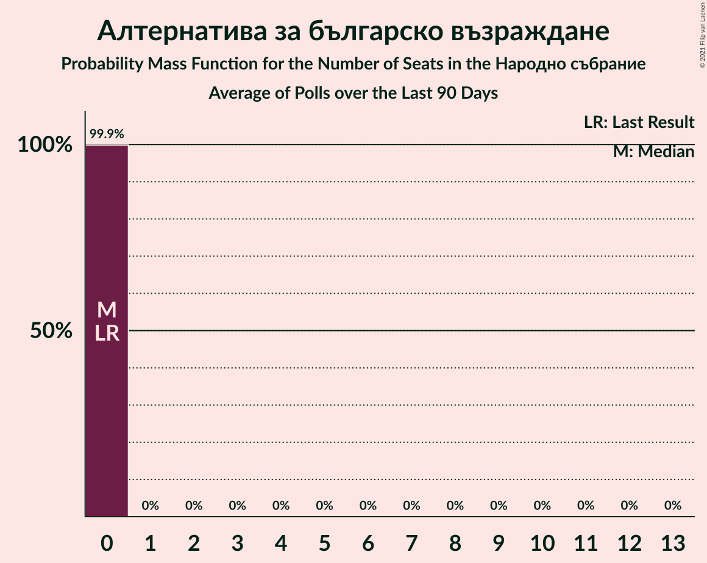

# Poll Average

<a href="#voting-intentions">Voting Intentions</a> | <a href="#seats">Seats</a> | <a href="#coalitions">Coalitions</a> | <a href="#technical-information">Technical Information</a>

## Summary

The table below lists the polls on which the average is based. They are the most recent polls (less than 90 days old) registered and analyzed so far.

| Period     | Polling firm/Commissioner(s) | ГЕРБ | БСП | ОП | ДПС | Воля | РБ | Да | АБВ | ВМРО | НФСБ | Атака | ДБ | ДСБ | ИТН | В | ИС.Б |
|:----------:|:----------------------------:|:--:|:--:|:--:|:--:|:--:|:--:|:--:|:--:|:--:|:--:|:--:|:--:|:--:|:--:|:--:|:--:|
| 27 March 2017 | General Election | 33.5%   95 | 27.9%   80 | 9.3%   27 | 9.2%   26 | 4.3%   12 | 3.1%   0 | 3.0%   0 | 1.6%   0 | 0.0%   0 | 0.0%   0 | 0.0%   0 | 0.0%   0 | 0.0%   0 | 0.0%   0 | 0.0%   0 | 0.0%   0 |
| N/A | Poll Average | 21–35%   59–94 | 20–28%   53–75 | 2–13%   0–35 | 7–14%   20–36 | 1–4%   0 | N/A   N/A | N/A   N/A | N/A   N/A | N/A   N/A | N/A   N/A | N/A   N/A | 4–14%   11–38 | N/A   N/A | 5–20%   14–53 | N/A   N/A | 2–7%   0–17 |
| [6–11 November 2020](2020-11-11-БарометърБългария.html) | Барометър България | 31–37%   80–98 | 19–24%   50–64 | 10–14%   26–38 | 10–15%   27–39 | 1–2%   0 | N/A   N/A | N/A   N/A | N/A   N/A | N/A   N/A | N/A   N/A | N/A   N/A | 4–7%   0–18 | N/A   N/A | 5–8%   12–21 | N/A   N/A | 2–4%   0 |
| [27 October–3 November 2020](2020-11-03-SovaHarris.html) | Sova Harris | 24–29%   62–77 | 23–28%   58–73 | 4–7%   11–18 | 7–11%   18–27 | 2–4%   0–11 | N/A   N/A | N/A   N/A | N/A   N/A | N/A   N/A | N/A   N/A | N/A   N/A | 7–10%   18–27 | N/A   N/A | 10–14%   25–35 | N/A   N/A | 4–7%   12–19 |
| [21–27 October 2020](2020-10-27-Рего.html) | Рего | 25–29%   66–78 | 24–28%   64–76 | 2–4%   0 | 7–10%   19–26 | 1–2%   0 | N/A   N/A | N/A   N/A | N/A   N/A | N/A   N/A | N/A   N/A | N/A   N/A | 7–9%   17–24 | N/A   N/A | 17–20%   44–55 | N/A   N/A | 3–5%   0–13 |
| [12–16 October 2020](2020-10-16-Спектър.html) | Спектър | 20–26%   56–72 | 19–24%   54–67 | 2–5%   0–13 | 9–12%   24–35 | 0–2%   0 | N/A   N/A | N/A   N/A | N/A   N/A | N/A   N/A | N/A   N/A | N/A   N/A | 10–14%   29–40 | N/A   N/A | 14–19%   39–53 | N/A   N/A | 3–5%   0–13 |
| [3–10 October 2020](2020-10-10-Тренд.html) | Тренд | 22–27%   59–77 | 21–26%   58–74 | 3–5%   0–14 | 8–12%   24–35 | 1–3%   0 | N/A   N/A | N/A   N/A | N/A   N/A | N/A   N/A | N/A   N/A | N/A   N/A | 7–11%   20–30 | N/A   N/A | 14–18%   37–50 | N/A   N/A | 3–5%   0–14 |
| 27 March 2017 | General Election | 33.5%   95 | 27.9%   80 | 9.3%   27 | 9.2%   26 | 4.3%   12 | 3.1%   0 | 3.0%   0 | 1.6%   0 | 0.0%   0 | 0.0%   0 | 0.0%   0 | 0.0%   0 | 0.0%   0 | 0.0%   0 | 0.0%   0 | 0.0%   0 |

Only polls for which at least the sample size has been published are included in the table above.

**Legend:**
+ **Top half of each row:** Voting intentions (95% confidence interval)
+ **Bottom half of each row:** Seat projections for the Народно събрание (95% confidence interval)
+ **ГЕРБ:** Граждани за европейско развитие на България
+ **БСП:** Българска социалистическа партия
+ **ОП:** Обединени Патриоти
+ **ДПС:** Движение за права и свободи
+ **Воля:** Воля
+ **РБ:** Реформаторски блок
+ **Да:** Да, България!
+ **АБВ:** Алтернатива за българско възраждане
+ **ВМРО:** ВМРО–Българско Национално Движение
+ **НФСБ:** Национален фронт за спасение на България
+ **Атака:** Атака
+ **ДБ:** Демократична България
+ **ДСБ:** Демократи за силна България
+ **ИТН:** Има такъв народ
+ **В:** Възраждане
+ **ИС.Б:** Изправи се Бг
+ **N/A (single party):** Party not included the published results
+ **N/A (entire row):** Calculation for this opinion poll not started yet

## Voting Intentions

### Confidence Intervals

| Party | Last Result | Median | 80% Confidence Interval | 90% Confidence Interval | 95% Confidence Interval | 99% Confidence Interval |
|:-----:|:-----------:|:------:|:-----------------------:|:-----------------------:|:-----------------------:|:-----------------------:|
| <a href="#граждани-за-европейско-развитие-на-българия">Граждани за европейско развитие на България</a> | 33.5% | 26.2% | 22.6–33.6% |21.9–34.7% | 21.4–35.4% | 20.4–36.7% |
| <a href="#българска-социалистическа-партия">Българска социалистическа партия</a> | 27.9% | 23.7% | 20.8–26.7% |20.2–27.2% | 19.7–27.7% | 18.8–28.5% |
| <a href="#обединени-патриоти">Обединени Патриоти</a> | 9.3% | 4.1% | 2.7–12.1% |2.5–12.8% | 2.4–13.4% | 2.1–14.3% |
| <a href="#движение-за-права-и-свободи">Движение за права и свободи</a> | 9.2% | 9.9% | 8.0–12.4% |7.7–13.1% | 7.4–13.6% | 7.0–14.6% |
| <a href="#воля">Воля</a> | 4.3% | 1.3% | 0.8–3.3% |0.6–3.7% | 0.6–4.0% | 0.4–4.5% |
| <a href="#реформаторски-блок">Реформаторски блок</a> | 3.1% | N/A | N/A |N/A | N/A | N/A |
| <a href="#да,-българия!">Да, България!</a> | 3.0% | N/A | N/A |N/A | N/A | N/A |
| <a href="#алтернатива-за-българско-възраждане">Алтернатива за българско възраждане</a> | 1.6% | N/A | N/A |N/A | N/A | N/A |
| <a href="#вмро–българско-национално-движение">ВМРО–Българско Национално Движение</a> | 0.0% | N/A | N/A |N/A | N/A | N/A |
| <a href="#национален-фронт-за-спасение-на-българия">Национален фронт за спасение на България</a> | 0.0% | N/A | N/A |N/A | N/A | N/A |
| <a href="#атака">Атака</a> | 0.0% | N/A | N/A |N/A | N/A | N/A |
| <a href="#демократична-българия">Демократична България</a> | 0.0% | 8.3% | 5.2–12.3% |4.7–13.0% | 4.4–13.5% | 3.8–14.4% |
| <a href="#демократи-за-силна-българия">Демократи за силна България</a> | 0.0% | N/A | N/A |N/A | N/A | N/A |
| <a href="#има-такъв-народ">Има такъв народ</a> | 0.0% | 15.3% | 6.2–18.7% |5.7–19.2% | 5.3–19.7% | 4.7–20.4% |
| <a href="#възраждане">Възраждане</a> | 0.0% | N/A | N/A |N/A | N/A | N/A |
| <a href="#изправи-се-бг">Изправи се Бг</a> | 0.0% | 3.8% | 2.6–5.8% |2.3–6.3% | 2.1–6.6% | 1.7–7.3% |

### Граждани за европейско развитие на България

*For a full overview of the results for this party, see the [Граждани за европейско развитие на България](party-гражданизаевропейскоразвитиенабългария.html) page.*

| Voting Intentions | Probability | Accumulated | Special Marks |
|:-----------------:|:-----------:|:-----------:|:-------------:|
| 17.5–18.5% | 0% | 100% |  |
| 18.5–19.5% | 0.1% | 100% |  |
| 19.5–20.5% | 0.6% | 99.9% |  |
| 20.5–21.5% | 3% | 99.4% |  |
| 21.5–22.5% | 7% | 97% |  |
| 22.5–23.5% | 10% | 90% |  |
| 23.5–24.5% | 11% | 80% |  |
| 24.5–25.5% | 10% | 69% |  |
| 25.5–26.5% | 13% | 58% | Median |
| 26.5–27.5% | 14% | 46% |  |
| 27.5–28.5% | 9% | 32% |  |
| 28.5–29.5% | 3% | 23% |  |
| 29.5–30.5% | 0.9% | 20% |  |
| 30.5–31.5% | 2% | 20% |  |
| 31.5–32.5% | 3% | 18% |  |
| 32.5–33.5% | 5% | 15% |  |
| 33.5–34.5% | 5% | 10% | Last Result |
| 34.5–35.5% | 3% | 5% |  |
| 35.5–36.5% | 2% | 2% |  |
| 36.5–37.5% | 0.5% | 0.7% |  |
| 37.5–38.5% | 0.1% | 0.1% |  |
| 38.5–39.5% | 0% | 0% |  |

### Българска социалистическа партия

*For a full overview of the results for this party, see the [Българска социалистическа партия](party-българскасоциалистическапартия.html) page.*

| Voting Intentions | Probability | Accumulated | Special Marks |
|:-----------------:|:-----------:|:-----------:|:-------------:|
| 16.5–17.5% | 0% | 100% |  |
| 17.5–18.5% | 0.3% | 100% |  |
| 18.5–19.5% | 2% | 99.7% |  |
| 19.5–20.5% | 6% | 98% |  |
| 20.5–21.5% | 12% | 92% |  |
| 21.5–22.5% | 15% | 80% |  |
| 22.5–23.5% | 14% | 66% |  |
| 23.5–24.5% | 13% | 52% | Median |
| 24.5–25.5% | 13% | 38% |  |
| 25.5–26.5% | 14% | 25% |  |
| 26.5–27.5% | 9% | 12% |  |
| 27.5–28.5% | 3% | 3% | Last Result |
| 28.5–29.5% | 0.4% | 0.4% |  |
| 29.5–30.5% | 0% | 0% |  |

### Обединени Патриоти

*For a full overview of the results for this party, see the [Обединени Патриоти](party-обединенипатриоти.html) page.*

| Voting Intentions | Probability | Accumulated | Special Marks |
|:-----------------:|:-----------:|:-----------:|:-------------:|
| 0.5–1.5% | 0% | 100% |  |
| 1.5–2.5% | 5% | 100% |  |
| 2.5–3.5% | 31% | 95% |  |
| 3.5–4.5% | 22% | 64% | Median |
| 4.5–5.5% | 12% | 42% |  |
| 5.5–6.5% | 8% | 30% |  |
| 6.5–7.5% | 2% | 22% |  |
| 7.5–8.5% | 0.1% | 20% |  |
| 8.5–9.5% | 0.1% | 20% | Last Result |
| 9.5–10.5% | 1.3% | 20% |  |
| 10.5–11.5% | 5% | 19% |  |
| 11.5–12.5% | 7% | 14% |  |
| 12.5–13.5% | 5% | 7% |  |
| 13.5–14.5% | 2% | 2% |  |
| 14.5–15.5% | 0.3% | 0.3% |  |
| 15.5–16.5% | 0% | 0% |  |

### Движение за права и свободи

*For a full overview of the results for this party, see the [Движение за права и свободи](party-движениезаправаисвободи.html) page.*

| Voting Intentions | Probability | Accumulated | Special Marks |
|:-----------------:|:-----------:|:-----------:|:-------------:|
| 4.5–5.5% | 0% | 100% |  |
| 5.5–6.5% | 0.1% | 100% |  |
| 6.5–7.5% | 3% | 99.9% |  |
| 7.5–8.5% | 18% | 96% |  |
| 8.5–9.5% | 21% | 78% | Last Result |
| 9.5–10.5% | 20% | 57% | Median |
| 10.5–11.5% | 17% | 37% |  |
| 11.5–12.5% | 11% | 20% |  |
| 12.5–13.5% | 6% | 9% |  |
| 13.5–14.5% | 2% | 3% |  |
| 14.5–15.5% | 0.5% | 0.5% |  |
| 15.5–16.5% | 0.1% | 0.1% |  |
| 16.5–17.5% | 0% | 0% |  |

### Воля

*For a full overview of the results for this party, see the [Воля](party-воля.html) page.*

| Voting Intentions | Probability | Accumulated | Special Marks |
|:-----------------:|:-----------:|:-----------:|:-------------:|
| 0.0–0.5% | 2% | 100% |  |
| 0.5–1.5% | 60% | 98% | Median |
| 1.5–2.5% | 18% | 37% |  |
| 2.5–3.5% | 13% | 19% |  |
| 3.5–4.5% | 6% | 6% | Last Result |
| 4.5–5.5% | 0.4% | 0.4% |  |
| 5.5–6.5% | 0% | 0% |  |

### Демократична България

*For a full overview of the results for this party, see the [Демократична България](party-демократичнабългария.html) page.*

| Voting Intentions | Probability | Accumulated | Special Marks |
|:-----------------:|:-----------:|:-----------:|:-------------:|
| 0.0–0.5% | 0% | 100% | Last Result |
| 0.5–1.5% | 0% | 100% |  |
| 1.5–2.5% | 0% | 100% |  |
| 2.5–3.5% | 0.1% | 100% |  |
| 3.5–4.5% | 4% | 99.9% |  |
| 4.5–5.5% | 10% | 96% |  |
| 5.5–6.5% | 6% | 86% |  |
| 6.5–7.5% | 13% | 80% |  |
| 7.5–8.5% | 24% | 67% | Median |
| 8.5–9.5% | 17% | 43% |  |
| 9.5–10.5% | 7% | 27% |  |
| 10.5–11.5% | 5% | 20% |  |
| 11.5–12.5% | 7% | 15% |  |
| 12.5–13.5% | 6% | 8% |  |
| 13.5–14.5% | 2% | 2% |  |
| 14.5–15.5% | 0.3% | 0.3% |  |
| 15.5–16.5% | 0% | 0% |  |

### Има такъв народ

*For a full overview of the results for this party, see the [Има такъв народ](party-иматакъвнарод.html) page.*

| Voting Intentions | Probability | Accumulated | Special Marks |
|:-----------------:|:-----------:|:-----------:|:-------------:|
| 0.0–0.5% | 0% | 100% | Last Result |
| 0.5–1.5% | 0% | 100% |  |
| 1.5–2.5% | 0% | 100% |  |
| 2.5–3.5% | 0% | 100% |  |
| 3.5–4.5% | 0.3% | 100% |  |
| 4.5–5.5% | 4% | 99.7% |  |
| 5.5–6.5% | 9% | 96% |  |
| 6.5–7.5% | 5% | 87% |  |
| 7.5–8.5% | 1.1% | 81% |  |
| 8.5–9.5% | 0.5% | 80% |  |
| 9.5–10.5% | 3% | 80% |  |
| 10.5–11.5% | 7% | 76% |  |
| 11.5–12.5% | 6% | 69% |  |
| 12.5–13.5% | 3% | 63% |  |
| 13.5–14.5% | 4% | 60% |  |
| 14.5–15.5% | 10% | 56% | Median |
| 15.5–16.5% | 14% | 47% |  |
| 16.5–17.5% | 11% | 33% |  |
| 17.5–18.5% | 11% | 22% |  |
| 18.5–19.5% | 8% | 11% |  |
| 19.5–20.5% | 3% | 3% |  |
| 20.5–21.5% | 0.3% | 0.3% |  |
| 21.5–22.5% | 0% | 0% |  |

### Изправи се Бг

*For a full overview of the results for this party, see the [Изправи се Бг](party-изправисебг.html) page.*

| Voting Intentions | Probability | Accumulated | Special Marks |
|:-----------------:|:-----------:|:-----------:|:-------------:|
| 0.0–0.5% | 0% | 100% | Last Result |
| 0.5–1.5% | 0.1% | 100% |  |
| 1.5–2.5% | 8% | 99.9% |  |
| 2.5–3.5% | 28% | 91% |  |
| 3.5–4.5% | 38% | 63% | Median |
| 4.5–5.5% | 13% | 26% |  |
| 5.5–6.5% | 10% | 13% |  |
| 6.5–7.5% | 3% | 3% |  |
| 7.5–8.5% | 0.3% | 0.3% |  |
| 8.5–9.5% | 0% | 0% |  |

## Seats

### Confidence Intervals

| Party | Last Result | Median | 80% Confidence Interval | 90% Confidence Interval | 95% Confidence Interval | 99% Confidence Interval |
|:-----:|:-----------:|:------:|:-----------------------:|:-----------------------:|:-----------------------:|:-----------------------:|
| <a href="#граждани-за-европейско-развитие-на-българия">Граждани за европейско развитие на България</a> | 95 | 70 | 62–88 |60–91 | 59–94 | 56–98 |
| <a href="#българска-социалистическа-партия">Българска социалистическа партия</a> | 80 | 64 | 56–71 |54–73 | 53–75 | 50–77 |
| <a href="#обединени-патриоти">Обединени Патриоти</a> | 27 | 11 | 0–32 |0–34 | 0–35 | 0–38 |
| <a href="#движение-за-права-и-свободи">Движение за права и свободи</a> | 26 | 27 | 21–33 |20–35 | 20–36 | 18–39 |
| <a href="#воля">Воля</a> | 12 | 0 | 0 |0 | 0 | 0–11 |
| <a href="#реформаторски-блок">Реформаторски блок</a> | 0 | N/A | N/A |N/A | N/A | N/A |
| <a href="#да,-българия!">Да, България!</a> | 0 | N/A | N/A |N/A | N/A | N/A |
| <a href="#алтернатива-за-българско-възраждане">Алтернатива за българско възраждане</a> | 0 | N/A | N/A |N/A | N/A | N/A |
| <a href="#вмро–българско-национално-движение">ВМРО–Българско Национално Движение</a> | 0 | N/A | N/A |N/A | N/A | N/A |
| <a href="#национален-фронт-за-спасение-на-българия">Национален фронт за спасение на България</a> | 0 | N/A | N/A |N/A | N/A | N/A |
| <a href="#атака">Атака</a> | 0 | N/A | N/A |N/A | N/A | N/A |
| <a href="#демократична-българия">Демократична България</a> | 0 | 22 | 13–34 |12–36 | 11–38 | 0–40 |
| <a href="#демократи-за-силна-българия">Демократи за силна България</a> | 0 | N/A | N/A |N/A | N/A | N/A |
| <a href="#има-такъв-народ">Има такъв народ</a> | 0 | 42 | 16–51 |15–52 | 14–53 | 12–55 |
| <a href="#възраждане">Възраждане</a> | 0 | N/A | N/A |N/A | N/A | N/A |
| <a href="#изправи-се-бг">Изправи се Бг</a> | 0 | 0 | 0–15 |0–16 | 0–17 | 0–19 |

### Граждани за европейско развитие на България

*For a full overview of the results for this party, see the [Граждани за европейско развитие на България](party-гражданизаевропейскоразвитиенабългария.html) page.*

| Number of Seats | Probability | Accumulated | Special Marks |
|:---------------:|:-----------:|:-----------:|:-------------:|
| 53 | 0% | 100% |  |
| 54 | 0.1% | 99.9% |  |
| 55 | 0.2% | 99.8% |  |
| 56 | 0.3% | 99.6% |  |
| 57 | 0.6% | 99.3% |  |
| 58 | 1.1% | 98.7% |  |
| 59 | 1.4% | 98% |  |
| 60 | 2% | 96% |  |
| 61 | 2% | 94% |  |
| 62 | 3% | 92% |  |
| 63 | 3% | 90% |  |
| 64 | 4% | 86% |  |
| 65 | 5% | 82% |  |
| 66 | 6% | 78% |  |
| 67 | 6% | 72% |  |
| 68 | 6% | 66% |  |
| 69 | 6% | 60% |  |
| 70 | 7% | 54% | Median |
| 71 | 5% | 47% |  |
| 72 | 5% | 41% |  |
| 73 | 5% | 36% |  |
| 74 | 4% | 31% |  |
| 75 | 2% | 27% |  |
| 76 | 2% | 25% |  |
| 77 | 1.3% | 23% |  |
| 78 | 0.8% | 21% |  |
| 79 | 0.5% | 20% |  |
| 80 | 0.5% | 20% |  |
| 81 | 0.5% | 20% |  |
| 82 | 0.8% | 19% |  |
| 83 | 1.0% | 18% |  |
| 84 | 1.3% | 17% |  |
| 85 | 2% | 16% |  |
| 86 | 2% | 14% |  |
| 87 | 1.5% | 12% |  |
| 88 | 2% | 11% |  |
| 89 | 2% | 9% |  |
| 90 | 1.3% | 7% |  |
| 91 | 1.2% | 6% |  |
| 92 | 0.9% | 5% |  |
| 93 | 1.0% | 4% |  |
| 94 | 1.1% | 3% |  |
| 95 | 0.6% | 2% | Last Result |
| 96 | 0.4% | 1.3% |  |
| 97 | 0.3% | 0.9% |  |
| 98 | 0.2% | 0.6% |  |
| 99 | 0.2% | 0.4% |  |
| 100 | 0.1% | 0.2% |  |
| 101 | 0% | 0.2% |  |
| 102 | 0.1% | 0.1% |  |
| 103 | 0% | 0% |  |

### Българска социалистическа партия

*For a full overview of the results for this party, see the [Българска социалистическа партия](party-българскасоциалистическапартия.html) page.*

| Number of Seats | Probability | Accumulated | Special Marks |
|:---------------:|:-----------:|:-----------:|:-------------:|
| 47 | 0% | 100% |  |
| 48 | 0.1% | 99.9% |  |
| 49 | 0.2% | 99.8% |  |
| 50 | 0.4% | 99.6% |  |
| 51 | 0.6% | 99.3% |  |
| 52 | 1.1% | 98.7% |  |
| 53 | 2% | 98% |  |
| 54 | 2% | 96% |  |
| 55 | 2% | 94% |  |
| 56 | 3% | 92% |  |
| 57 | 4% | 89% |  |
| 58 | 4% | 86% |  |
| 59 | 4% | 81% |  |
| 60 | 5% | 78% |  |
| 61 | 4% | 73% |  |
| 62 | 6% | 69% |  |
| 63 | 6% | 63% |  |
| 64 | 8% | 57% | Median |
| 65 | 7% | 49% |  |
| 66 | 6% | 41% |  |
| 67 | 6% | 35% |  |
| 68 | 5% | 29% |  |
| 69 | 6% | 24% |  |
| 70 | 4% | 18% |  |
| 71 | 5% | 14% |  |
| 72 | 3% | 9% |  |
| 73 | 2% | 6% |  |
| 74 | 2% | 4% |  |
| 75 | 1.1% | 3% |  |
| 76 | 1.0% | 2% |  |
| 77 | 0.4% | 0.6% |  |
| 78 | 0.1% | 0.2% |  |
| 79 | 0.1% | 0.1% |  |
| 80 | 0% | 0% | Last Result |

### Обединени Патриоти

*For a full overview of the results for this party, see the [Обединени Патриоти](party-обединенипатриоти.html) page.*

| Number of Seats | Probability | Accumulated | Special Marks |
|:---------------:|:-----------:|:-----------:|:-------------:|
| 0 | 47% | 100% |  |
| 1 | 0% | 53% |  |
| 2 | 0% | 53% |  |
| 3 | 0% | 53% |  |
| 4 | 0% | 53% |  |
| 5 | 0% | 53% |  |
| 6 | 0% | 53% |  |
| 7 | 0% | 53% |  |
| 8 | 0% | 53% |  |
| 9 | 0% | 53% |  |
| 10 | 0.1% | 53% |  |
| 11 | 4% | 53% | Median |
| 12 | 7% | 48% |  |
| 13 | 5% | 41% |  |
| 14 | 5% | 36% |  |
| 15 | 4% | 30% |  |
| 16 | 4% | 27% |  |
| 17 | 2% | 23% |  |
| 18 | 1.0% | 21% |  |
| 19 | 0.2% | 20% |  |
| 20 | 0.1% | 20% |  |
| 21 | 0% | 20% |  |
| 22 | 0% | 20% |  |
| 23 | 0% | 20% |  |
| 24 | 0.1% | 20% |  |
| 25 | 0.2% | 20% |  |
| 26 | 0.4% | 20% |  |
| 27 | 0.8% | 19% | Last Result |
| 28 | 1.3% | 19% |  |
| 29 | 2% | 17% |  |
| 30 | 2% | 16% |  |
| 31 | 2% | 13% |  |
| 32 | 2% | 12% |  |
| 33 | 2% | 9% |  |
| 34 | 3% | 7% |  |
| 35 | 2% | 5% |  |
| 36 | 1.1% | 2% |  |
| 37 | 0.6% | 1.3% |  |
| 38 | 0.3% | 0.7% |  |
| 39 | 0.2% | 0.4% |  |
| 40 | 0.1% | 0.2% |  |
| 41 | 0.1% | 0.1% |  |
| 42 | 0% | 0% |  |

### Движение за права и свободи

*For a full overview of the results for this party, see the [Движение за права и свободи](party-движениезаправаисвободи.html) page.*

| Number of Seats | Probability | Accumulated | Special Marks |
|:---------------:|:-----------:|:-----------:|:-------------:|
| 17 | 0.1% | 100% |  |
| 18 | 0.8% | 99.9% |  |
| 19 | 1.4% | 99.1% |  |
| 20 | 4% | 98% |  |
| 21 | 5% | 94% |  |
| 22 | 9% | 88% |  |
| 23 | 7% | 79% |  |
| 24 | 6% | 72% |  |
| 25 | 7% | 66% |  |
| 26 | 5% | 59% | Last Result |
| 27 | 7% | 54% | Median |
| 28 | 5% | 48% |  |
| 29 | 7% | 42% |  |
| 30 | 7% | 35% |  |
| 31 | 7% | 28% |  |
| 32 | 7% | 21% |  |
| 33 | 5% | 15% |  |
| 34 | 4% | 10% |  |
| 35 | 2% | 6% |  |
| 36 | 2% | 4% |  |
| 37 | 0.9% | 2% |  |
| 38 | 0.7% | 1.3% |  |
| 39 | 0.3% | 0.6% |  |
| 40 | 0.2% | 0.3% |  |
| 41 | 0.1% | 0.1% |  |
| 42 | 0% | 0.1% |  |
| 43 | 0% | 0% |  |

### Воля

*For a full overview of the results for this party, see the [Воля](party-воля.html) page.*

| Number of Seats | Probability | Accumulated | Special Marks |
|:---------------:|:-----------:|:-----------:|:-------------:|
| 0 | 98% | 100% | Median |
| 1 | 0% | 2% |  |
| 2 | 0% | 2% |  |
| 3 | 0% | 2% |  |
| 4 | 0% | 2% |  |
| 5 | 0% | 2% |  |
| 6 | 0% | 2% |  |
| 7 | 0% | 2% |  |
| 8 | 0% | 2% |  |
| 9 | 0% | 2% |  |
| 10 | 0.8% | 2% |  |
| 11 | 0.9% | 1.3% |  |
| 12 | 0.3% | 0.4% | Last Result |
| 13 | 0.1% | 0.1% |  |
| 14 | 0% | 0% |  |

### Реформаторски блок

*For a full overview of the results for this party, see the [Реформаторски блок](party-реформаторскиблок.html) page.*

### Да, България!

*For a full overview of the results for this party, see the [Да, България!](party-дабългария.html) page.*

### Алтернатива за българско възраждане

*For a full overview of the results for this party, see the [Алтернатива за българско възраждане](party-алтернативазабългарсковъзраждане.html) page.*

### ВМРО–Българско Национално Движение

*For a full overview of the results for this party, see the [ВМРО–Българско Национално Движение](party-вмро–българсконационалнодвижение.html) page.*

### Национален фронт за спасение на България

*For a full overview of the results for this party, see the [Национален фронт за спасение на България](party-националенфронтзаспасениенабългария.html) page.*

### Атака

*For a full overview of the results for this party, see the [Атака](party-атака.html) page.*

### Демократична България

*For a full overview of the results for this party, see the [Демократична България](party-демократичнабългария.html) page.*

| Number of Seats | Probability | Accumulated | Special Marks |
|:---------------:|:-----------:|:-----------:|:-------------:|
| 0 | 1.0% | 100% | Last Result |
| 1 | 0% | 99.0% |  |
| 2 | 0% | 99.0% |  |
| 3 | 0% | 99.0% |  |
| 4 | 0% | 99.0% |  |
| 5 | 0% | 99.0% |  |
| 6 | 0% | 99.0% |  |
| 7 | 0% | 99.0% |  |
| 8 | 0% | 99.0% |  |
| 9 | 0% | 99.0% |  |
| 10 | 0% | 99.0% |  |
| 11 | 2% | 98.9% |  |
| 12 | 3% | 97% |  |
| 13 | 5% | 94% |  |
| 14 | 4% | 90% |  |
| 15 | 3% | 86% |  |
| 16 | 2% | 84% |  |
| 17 | 2% | 82% |  |
| 18 | 3% | 80% |  |
| 19 | 6% | 77% |  |
| 20 | 6% | 71% |  |
| 21 | 9% | 65% |  |
| 22 | 9% | 56% | Median |
| 23 | 6% | 47% |  |
| 24 | 6% | 40% |  |
| 25 | 4% | 35% |  |
| 26 | 4% | 31% |  |
| 27 | 3% | 27% |  |
| 28 | 3% | 24% |  |
| 29 | 1.3% | 22% |  |
| 30 | 2% | 20% |  |
| 31 | 2% | 18% |  |
| 32 | 2% | 17% |  |
| 33 | 2% | 14% |  |
| 34 | 3% | 12% |  |
| 35 | 3% | 9% |  |
| 36 | 1.3% | 6% |  |
| 37 | 2% | 4% |  |
| 38 | 1.1% | 3% |  |
| 39 | 0.7% | 1.4% |  |
| 40 | 0.4% | 0.7% |  |
| 41 | 0.2% | 0.4% |  |
| 42 | 0.1% | 0.2% |  |
| 43 | 0% | 0.1% |  |
| 44 | 0% | 0% |  |

### Демократи за силна България

*For a full overview of the results for this party, see the [Демократи за силна България](party-демократизасилнабългария.html) page.*

### Има такъв народ

*For a full overview of the results for this party, see the [Има такъв народ](party-иматакъвнарод.html) page.*

| Number of Seats | Probability | Accumulated | Special Marks |
|:---------------:|:-----------:|:-----------:|:-------------:|
| 0 | 0% | 100% | Last Result |
| 1 | 0% | 100% |  |
| 2 | 0% | 100% |  |
| 3 | 0% | 100% |  |
| 4 | 0% | 100% |  |
| 5 | 0% | 100% |  |
| 6 | 0% | 100% |  |
| 7 | 0% | 100% |  |
| 8 | 0% | 100% |  |
| 9 | 0% | 100% |  |
| 10 | 0% | 100% |  |
| 11 | 0.1% | 100% |  |
| 12 | 0.4% | 99.9% |  |
| 13 | 1.0% | 99.5% |  |
| 14 | 2% | 98% |  |
| 15 | 3% | 96% |  |
| 16 | 3% | 93% |  |
| 17 | 3% | 90% |  |
| 18 | 3% | 87% |  |
| 19 | 2% | 84% |  |
| 20 | 1.2% | 82% |  |
| 21 | 0.5% | 81% |  |
| 22 | 0.3% | 80% |  |
| 23 | 0.2% | 80% |  |
| 24 | 0.2% | 80% |  |
| 25 | 0.6% | 80% |  |
| 26 | 1.2% | 79% |  |
| 27 | 2% | 78% |  |
| 28 | 3% | 76% |  |
| 29 | 3% | 73% |  |
| 30 | 3% | 70% |  |
| 31 | 2% | 67% |  |
| 32 | 2% | 65% |  |
| 33 | 2% | 63% |  |
| 34 | 0.9% | 62% |  |
| 35 | 0.6% | 61% |  |
| 36 | 0.4% | 60% |  |
| 37 | 0.5% | 60% |  |
| 38 | 1.0% | 59% |  |
| 39 | 1.3% | 58% |  |
| 40 | 2% | 57% |  |
| 41 | 3% | 55% |  |
| 42 | 4% | 53% | Median |
| 43 | 5% | 48% |  |
| 44 | 5% | 44% |  |
| 45 | 5% | 39% |  |
| 46 | 6% | 34% |  |
| 47 | 4% | 29% |  |
| 48 | 6% | 25% |  |
| 49 | 4% | 19% |  |
| 50 | 4% | 14% |  |
| 51 | 5% | 10% |  |
| 52 | 2% | 6% |  |
| 53 | 2% | 4% |  |
| 54 | 0.9% | 2% |  |
| 55 | 0.5% | 0.8% |  |
| 56 | 0.2% | 0.4% |  |
| 57 | 0.1% | 0.1% |  |
| 58 | 0% | 0.1% |  |
| 59 | 0% | 0% |  |

### Възраждане

*For a full overview of the results for this party, see the [Възраждане](party-възраждане.html) page.*

### Изправи се Бг

*For a full overview of the results for this party, see the [Изправи се Бг](party-изправисебг.html) page.*

| Number of Seats | Probability | Accumulated | Special Marks |
|:---------------:|:-----------:|:-----------:|:-------------:|
| 0 | 61% | 100% | Last Result, Median |
| 1 | 0% | 39% |  |
| 2 | 0% | 39% |  |
| 3 | 0% | 39% |  |
| 4 | 0% | 39% |  |
| 5 | 0% | 39% |  |
| 6 | 0% | 39% |  |
| 7 | 0% | 39% |  |
| 8 | 0% | 39% |  |
| 9 | 0% | 39% |  |
| 10 | 0.7% | 39% |  |
| 11 | 9% | 39% |  |
| 12 | 8% | 30% |  |
| 13 | 5% | 22% |  |
| 14 | 4% | 18% |  |
| 15 | 5% | 13% |  |
| 16 | 3% | 8% |  |
| 17 | 2% | 5% |  |
| 18 | 2% | 2% |  |
| 19 | 0.4% | 0.7% |  |
| 20 | 0.2% | 0.3% |  |
| 21 | 0.1% | 0.1% |  |
| 22 | 0% | 0% |  |

## Coalitions

### Confidence Intervals

| Coalition | Last Result | Median | Majority? | 80% Confidence Interval | 90% Confidence Interval | 95% Confidence Interval | 99% Confidence Interval |
|:---------:|:-----------:|:------:|:---------:|:-----------------------:|:-----------------------:|:-----------------------:|:-----------------------:|
| Българска социалистическа партия – Движение за права и свободи – Изправи се Бг – Има такъв народ | 106 | 138 | 80% | 106–149 | 103–151 | 101–152 | 98–155 |
| Българска социалистическа партия – Движение за права и свободи – Има такъв народ | 106 | 133 | 66% | 106–145 | 103–147 | 101–149 | 97–151 |
| Граждани за европейско развитие на България – Обединени Патриоти | 122 | 76 | 11% | 65–121 | 63–124 | 61–126 | 58–130 |
| Българска социалистическа партия – Движение за права и свободи – Изправи се Бг | 106 | 96 | 0% | 88–105 | 86–107 | 84–109 | 81–113 |
| Българска социалистическа партия – Движение за права и свободи | 106 | 91 | 0% | 85–98 | 83–100 | 82–101 | 79–106 |

### Българска социалистическа партия – Движение за права и свободи – Изправи се Бг – Има такъв народ

| Number of Seats | Probability | Accumulated | Special Marks |
|:---------------:|:-----------:|:-----------:|:-------------:|
| 94 | 0% | 100% |  |
| 95 | 0.1% | 99.9% |  |
| 96 | 0.2% | 99.9% |  |
| 97 | 0.2% | 99.7% |  |
| 98 | 0.4% | 99.5% |  |
| 99 | 0.5% | 99.2% |  |
| 100 | 0.6% | 98.6% |  |
| 101 | 1.3% | 98% |  |
| 102 | 1.2% | 97% |  |
| 103 | 1.0% | 96% |  |
| 104 | 2% | 94% |  |
| 105 | 1.3% | 93% |  |
| 106 | 2% | 91% | Last Result |
| 107 | 1.4% | 89% |  |
| 108 | 2% | 88% |  |
| 109 | 1.4% | 86% |  |
| 110 | 1.1% | 85% |  |
| 111 | 0.8% | 84% |  |
| 112 | 0.9% | 83% |  |
| 113 | 0.8% | 82% |  |
| 114 | 0.5% | 82% |  |
| 115 | 0.5% | 81% |  |
| 116 | 0.2% | 81% |  |
| 117 | 0.2% | 80% |  |
| 118 | 0.1% | 80% |  |
| 119 | 0.1% | 80% |  |
| 120 | 0.1% | 80% |  |
| 121 | 0.1% | 80% | Majority |
| 122 | 0.1% | 80% |  |
| 123 | 0.2% | 80% |  |
| 124 | 0.3% | 80% |  |
| 125 | 0.4% | 79% |  |
| 126 | 0.5% | 79% |  |
| 127 | 0.8% | 78% |  |
| 128 | 1.0% | 78% |  |
| 129 | 1.4% | 77% |  |
| 130 | 2% | 75% |  |
| 131 | 2% | 73% |  |
| 132 | 3% | 71% |  |
| 133 | 3% | 68% | Median |
| 134 | 3% | 65% |  |
| 135 | 3% | 62% |  |
| 136 | 3% | 59% |  |
| 137 | 4% | 55% |  |
| 138 | 4% | 51% |  |
| 139 | 4% | 47% |  |
| 140 | 3% | 43% |  |
| 141 | 3% | 40% |  |
| 142 | 4% | 37% |  |
| 143 | 4% | 33% |  |
| 144 | 4% | 29% |  |
| 145 | 4% | 25% |  |
| 146 | 4% | 22% |  |
| 147 | 4% | 18% |  |
| 148 | 3% | 14% |  |
| 149 | 2% | 11% |  |
| 150 | 2% | 8% |  |
| 151 | 2% | 6% |  |
| 152 | 1.3% | 4% |  |
| 153 | 1.0% | 2% |  |
| 154 | 0.6% | 1.3% |  |
| 155 | 0.4% | 0.7% |  |
| 156 | 0.2% | 0.4% |  |
| 157 | 0.1% | 0.2% |  |
| 158 | 0.1% | 0.1% |  |
| 159 | 0% | 0.1% |  |
| 160 | 0% | 0% |  |

### Българска социалистическа партия – Движение за права и свободи – Има такъв народ

| Number of Seats | Probability | Accumulated | Special Marks |
|:---------------:|:-----------:|:-----------:|:-------------:|
| 94 | 0% | 100% |  |
| 95 | 0.1% | 99.9% |  |
| 96 | 0.2% | 99.8% |  |
| 97 | 0.2% | 99.7% |  |
| 98 | 0.4% | 99.5% |  |
| 99 | 0.6% | 99.1% |  |
| 100 | 0.7% | 98.6% |  |
| 101 | 1.4% | 98% |  |
| 102 | 1.2% | 96% |  |
| 103 | 1.1% | 95% |  |
| 104 | 2% | 94% |  |
| 105 | 1.4% | 92% |  |
| 106 | 2% | 91% | Last Result |
| 107 | 2% | 89% |  |
| 108 | 2% | 88% |  |
| 109 | 2% | 86% |  |
| 110 | 1.4% | 84% |  |
| 111 | 1.2% | 83% |  |
| 112 | 2% | 82% |  |
| 113 | 2% | 80% |  |
| 114 | 1.3% | 78% |  |
| 115 | 2% | 77% |  |
| 116 | 2% | 75% |  |
| 117 | 2% | 73% |  |
| 118 | 2% | 71% |  |
| 119 | 2% | 69% |  |
| 120 | 2% | 67% |  |
| 121 | 2% | 66% | Majority |
| 122 | 1.4% | 64% |  |
| 123 | 1.2% | 63% |  |
| 124 | 0.9% | 61% |  |
| 125 | 0.9% | 61% |  |
| 126 | 0.7% | 60% |  |
| 127 | 0.9% | 59% |  |
| 128 | 1.0% | 58% |  |
| 129 | 0.8% | 57% |  |
| 130 | 1.1% | 56% |  |
| 131 | 1.3% | 55% |  |
| 132 | 2% | 54% |  |
| 133 | 2% | 52% | Median |
| 134 | 2% | 49% |  |
| 135 | 2% | 47% |  |
| 136 | 3% | 45% |  |
| 137 | 4% | 42% |  |
| 138 | 4% | 38% |  |
| 139 | 5% | 33% |  |
| 140 | 3% | 29% |  |
| 141 | 3% | 26% |  |
| 142 | 4% | 22% |  |
| 143 | 4% | 18% |  |
| 144 | 3% | 15% |  |
| 145 | 3% | 11% |  |
| 146 | 2% | 9% |  |
| 147 | 3% | 7% |  |
| 148 | 2% | 4% |  |
| 149 | 0.9% | 3% |  |
| 150 | 0.7% | 2% |  |
| 151 | 0.5% | 0.9% |  |
| 152 | 0.2% | 0.4% |  |
| 153 | 0.1% | 0.2% |  |
| 154 | 0% | 0.1% |  |
| 155 | 0% | 0% |  |

### Граждани за европейско развитие на България – Обединени Патриоти

| Number of Seats | Probability | Accumulated | Special Marks |
|:---------------:|:-----------:|:-----------:|:-------------:|
| 54 | 0% | 100% |  |
| 55 | 0.1% | 99.9% |  |
| 56 | 0.1% | 99.9% |  |
| 57 | 0.2% | 99.7% |  |
| 58 | 0.4% | 99.5% |  |
| 59 | 0.6% | 99.1% |  |
| 60 | 0.8% | 98.5% |  |
| 61 | 1.1% | 98% |  |
| 62 | 1.2% | 97% |  |
| 63 | 2% | 95% |  |
| 64 | 2% | 94% |  |
| 65 | 3% | 92% |  |
| 66 | 3% | 89% |  |
| 67 | 3% | 86% |  |
| 68 | 4% | 83% |  |
| 69 | 4% | 79% |  |
| 70 | 5% | 75% |  |
| 71 | 4% | 70% |  |
| 72 | 4% | 67% |  |
| 73 | 5% | 62% |  |
| 74 | 4% | 58% |  |
| 75 | 3% | 54% |  |
| 76 | 3% | 50% |  |
| 77 | 3% | 48% |  |
| 78 | 2% | 45% |  |
| 79 | 2% | 43% |  |
| 80 | 2% | 40% |  |
| 81 | 2% | 38% | Median |
| 82 | 3% | 36% |  |
| 83 | 2% | 33% |  |
| 84 | 2% | 32% |  |
| 85 | 3% | 30% |  |
| 86 | 1.4% | 27% |  |
| 87 | 2% | 25% |  |
| 88 | 1.0% | 23% |  |
| 89 | 0.6% | 22% |  |
| 90 | 0.7% | 22% |  |
| 91 | 0.4% | 21% |  |
| 92 | 0.2% | 21% |  |
| 93 | 0.2% | 20% |  |
| 94 | 0.1% | 20% |  |
| 95 | 0% | 20% |  |
| 96 | 0% | 20% |  |
| 97 | 0% | 20% |  |
| 98 | 0% | 20% |  |
| 99 | 0% | 20% |  |
| 100 | 0% | 20% |  |
| 101 | 0% | 20% |  |
| 102 | 0% | 20% |  |
| 103 | 0% | 20% |  |
| 104 | 0% | 20% |  |
| 105 | 0% | 20% |  |
| 106 | 0% | 20% |  |
| 107 | 0% | 20% |  |
| 108 | 0% | 20% |  |
| 109 | 0% | 20% |  |
| 110 | 0.1% | 20% |  |
| 111 | 0.3% | 20% |  |
| 112 | 0.6% | 19% |  |
| 113 | 0.9% | 19% |  |
| 114 | 1.0% | 18% |  |
| 115 | 1.0% | 17% |  |
| 116 | 0.7% | 16% |  |
| 117 | 0.9% | 15% |  |
| 118 | 1.1% | 14% |  |
| 119 | 1.4% | 13% |  |
| 120 | 1.4% | 12% |  |
| 121 | 2% | 11% | Majority |
| 122 | 1.3% | 9% | Last Result |
| 123 | 2% | 8% |  |
| 124 | 1.1% | 5% |  |
| 125 | 1.4% | 4% |  |
| 126 | 0.9% | 3% |  |
| 127 | 0.6% | 2% |  |
| 128 | 0.4% | 1.2% |  |
| 129 | 0.2% | 0.9% |  |
| 130 | 0.2% | 0.6% |  |
| 131 | 0.1% | 0.4% |  |
| 132 | 0.1% | 0.3% |  |
| 133 | 0.1% | 0.2% |  |
| 134 | 0% | 0.1% |  |
| 135 | 0% | 0.1% |  |
| 136 | 0% | 0% |  |

### Българска социалистическа партия – Движение за права и свободи – Изправи се Бг

| Number of Seats | Probability | Accumulated | Special Marks |
|:---------------:|:-----------:|:-----------:|:-------------:|
| 78 | 0% | 100% |  |
| 79 | 0.1% | 99.9% |  |
| 80 | 0.2% | 99.8% |  |
| 81 | 0.4% | 99.6% |  |
| 82 | 0.5% | 99.2% |  |
| 83 | 0.8% | 98.8% |  |
| 84 | 1.1% | 98% |  |
| 85 | 2% | 97% |  |
| 86 | 2% | 95% |  |
| 87 | 2% | 93% |  |
| 88 | 3% | 91% |  |
| 89 | 4% | 88% |  |
| 90 | 4% | 84% |  |
| 91 | 3% | 80% | Median |
| 92 | 4% | 77% |  |
| 93 | 7% | 73% |  |
| 94 | 7% | 67% |  |
| 95 | 6% | 59% |  |
| 96 | 5% | 54% |  |
| 97 | 4% | 48% |  |
| 98 | 4% | 45% |  |
| 99 | 6% | 41% |  |
| 100 | 5% | 35% |  |
| 101 | 5% | 30% |  |
| 102 | 5% | 25% |  |
| 103 | 4% | 20% |  |
| 104 | 3% | 16% |  |
| 105 | 4% | 14% |  |
| 106 | 3% | 9% | Last Result |
| 107 | 2% | 7% |  |
| 108 | 2% | 5% |  |
| 109 | 1.1% | 3% |  |
| 110 | 0.5% | 2% |  |
| 111 | 0.4% | 1.3% |  |
| 112 | 0.4% | 0.9% |  |
| 113 | 0.3% | 0.5% |  |
| 114 | 0.2% | 0.3% |  |
| 115 | 0.1% | 0.1% |  |
| 116 | 0% | 0% |  |

### Българска социалистическа партия – Движение за права и свободи

| Number of Seats | Probability | Accumulated | Special Marks |
|:---------------:|:-----------:|:-----------:|:-------------:|
| 76 | 0% | 100% |  |
| 77 | 0.1% | 99.9% |  |
| 78 | 0.2% | 99.8% |  |
| 79 | 0.3% | 99.6% |  |
| 80 | 0.8% | 99.4% |  |
| 81 | 1.0% | 98.6% |  |
| 82 | 1.3% | 98% |  |
| 83 | 2% | 96% |  |
| 84 | 3% | 94% |  |
| 85 | 3% | 91% |  |
| 86 | 5% | 88% |  |
| 87 | 5% | 83% |  |
| 88 | 6% | 77% |  |
| 89 | 8% | 71% |  |
| 90 | 8% | 63% |  |
| 91 | 7% | 55% | Median |
| 92 | 7% | 48% |  |
| 93 | 8% | 41% |  |
| 94 | 8% | 33% |  |
| 95 | 6% | 24% |  |
| 96 | 5% | 18% |  |
| 97 | 3% | 13% |  |
| 98 | 2% | 11% |  |
| 99 | 3% | 9% |  |
| 100 | 2% | 5% |  |
| 101 | 2% | 3% |  |
| 102 | 0.5% | 2% |  |
| 103 | 0.2% | 1.3% |  |
| 104 | 0.1% | 1.2% |  |
| 105 | 0.5% | 1.0% |  |
| 106 | 0.3% | 0.5% | Last Result |
| 107 | 0.2% | 0.3% |  |
| 108 | 0% | 0.1% |  |
| 109 | 0% | 0% |  |

## Technical Information

+ **Number of polls included in this average:** 5
+ **Lowest number of simulations done in a poll included in this average:** 1,048,576
+ **Total number of simulations done in the polls included in this average:** 5,242,880
+ **Error estimate:** 2.06%
