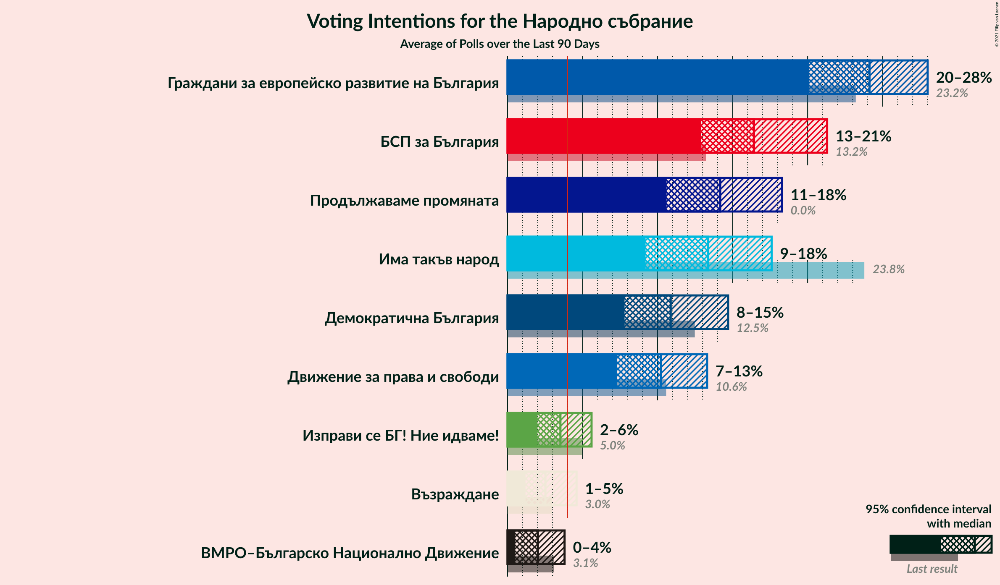

# Poll Average

<a href="#voting-intentions">Voting Intentions</a> | <a href="#seats">Seats</a> | <a href="#coalitions">Coalitions</a> | <a href="#technical-information">Technical Information</a>

## Summary

The table below lists the polls on which the average is based. They are the most recent polls (less than 90 days old) registered and analyzed so far.

| Period     | Polling firm/Commissioner(s) | ГЕРБ | БСП | ОП | ДПС | Воля | РБ | Да | АБВ | ВМРО | НФСБ | Атака | ДБ | ДСБ | ИТН | В | ИС.Б | РзБ | Воля–НФСБ |
|:----------:|:----------------------------:|:--:|:--:|:--:|:--:|:--:|:--:|:--:|:--:|:--:|:--:|:--:|:--:|:--:|:--:|:--:|:--:|:--:|:--:|
| 27 March 2017 | General Election | 33.5%   95 | 27.9%   80 | 9.3%   27 | 9.2%   26 | 4.3%   12 | 3.1%   0 | 3.0%   0 | 1.6%   0 | 0.0%   0 | 0.0%   0 | 0.0%   0 | 0.0%   0 | 0.0%   0 | 0.0%   0 | 0.0%   0 | 0.0%   0 | 0.0%   0 | 4.3%   12 |
| N/A | Poll Average | 23–33%   58–90 | 18–30%   49–78 | 2–6%   0–16 | 8–15%   22–41 | N/A   N/A | N/A   N/A | N/A   N/A | 0–3%   0 | N/A   N/A | N/A   N/A | 0–2%   0 | 4–9%   0–23 | N/A   N/A | 10–18%   26–48 | 0–3%   0 | 3–8%   0–23 | 0–3%   0 | 1–5%   0–13 |
| [26–30 March 2021](2021-03-30-Тренд.html) | Тренд   Nova | 25–33%   61–90 | 18–26%   46–66 | 3–6%   0–15 | 10–16%   29–42 | N/A   N/A | N/A   N/A | N/A   N/A | 0–2%   0 | N/A   N/A | N/A   N/A | N/A   N/A | 4–8%   12–22 | N/A   N/A | 10–16%   26–39 | 1–3%   0 | 3–7%   0–18 | 0–2%   0 | 2–5%   0–13 |
| [27–30 March 2021](2021-03-30-Алфарисърч.html) | Алфа рисърч | 24–32%   58–78 | 17–24%   40–55 | 3–6%   0–16 | 10–16%   30–41 | N/A   N/A | N/A   N/A | N/A   N/A | 0–2%   0 | N/A   N/A | N/A   N/A | 1–3%   0 | 4–9%   13–23 | N/A   N/A | 10–16%   23–40 | 1–3%   0 | 4–8%   13–26 | 0–2%   0 | 2–5%   0–14 |
| [26–30 March 2021](2021-03-30-AFIS.html) | AFIS | N/A   N/A | N/A   N/A | N/A   N/A | N/A   N/A | N/A   N/A | N/A   N/A | N/A   N/A | N/A   N/A | N/A   N/A | N/A   N/A | N/A   N/A | N/A   N/A | N/A   N/A | N/A   N/A | N/A   N/A | N/A   N/A | N/A   N/A | N/A   N/A |
| [25–28 March 2021](2021-03-28-Рего.html) | Рего | 22–29%   59–75 | 25–31%   66–83 | 2–5%   0–12 | 7–11%   19–30 | N/A   N/A | N/A   N/A | N/A   N/A | N/A   N/A | N/A   N/A | N/A   N/A | N/A   N/A | 4–7%   0–19 | N/A   N/A | 13–18%   35–48 | 1–3%   0 | 5–9%   14–24 | N/A   N/A | 1–3%   0 |
| [19–23 March 2021](2021-03-23-ПИК.html) | ПИК   Pik | 27–33%   77–90 | 19–24%   51–65 | 3–6%   0–15 | 9–13%   28–37 | N/A   N/A | N/A   N/A | N/A   N/A | 1–2%   0 | N/A   N/A | N/A   N/A | 1–2%   0 | 5–7%   13–19 | N/A   N/A | 10–14%   27–37 | 1–2%   0 | 3–6%   0–14 | 1–2%   0 | 2–3%   0 |
| [16–23 March 2021](2021-03-23-Медиана.html) | Медиана | 24–31%   61–84 | 20–26%   51–70 | 3–6%   0–16 | 9–14%   23–38 | N/A   N/A | N/A   N/A | N/A   N/A | 1–3%   0 | N/A   N/A | N/A   N/A | N/A   N/A | 3–7%   0–18 | N/A   N/A | 11–16%   29–44 | 1–3%   0 | 5–9%   13–23 | N/A   N/A | 3–6%   0–15 |
| [18–23 March 2021](2021-03-23-МаркетЛИНКС.html) | Маркет ЛИНКС   bTV | 22–30%   59–78 | 19–26%   49–68 | 2–6%   0–15 | 9–15%   24–38 | N/A   N/A | N/A   N/A | N/A   N/A | N/A   N/A | N/A   N/A | N/A   N/A | N/A   N/A | 5–10%   13–25 | N/A   N/A | 13–20%   35–53 | N/A   N/A | 4–8%   11–19 | N/A   N/A | N/A   N/A |
| [11–16 March 2021](2021-03-16-SovaHarris.html) | Sova Harris   Trud | 27–35%   69–89 | 20–28%   52–70 | 3–7%   0–16 | 9–15%   24–38 | N/A   N/A | N/A   N/A | N/A   N/A | 1–3%   0 | N/A   N/A | N/A   N/A | 0–1%   0 | 4–8%   0–20 | N/A   N/A | 9–15%   25–38 | 0–2%   0 | 3–7%   0–17 | 1–3%   0 | 1–4%   0–11 |
| [22 February–1 March 2021](2021-03-01-Gallup.html) | Gallup   BNR/BNT | 24–31%   63–84 | 20–27%   54–70 | 3–6%   0–16 | 10–16%   26–41 | N/A   N/A | N/A   N/A | N/A   N/A | 0–2%   0 | N/A   N/A | N/A   N/A | 0–2%   0 | 5–9%   12–24 | N/A   N/A | 11–16%   29–45 | 1–3%   0 | 3–7%   0–18 | 0–2%   0 | 2–4%   0–11 |
| 27 March 2017 | General Election | 33.5%   95 | 27.9%   80 | 9.3%   27 | 9.2%   26 | 4.3%   12 | 3.1%   0 | 3.0%   0 | 1.6%   0 | 0.0%   0 | 0.0%   0 | 0.0%   0 | 0.0%   0 | 0.0%   0 | 0.0%   0 | 0.0%   0 | 0.0%   0 | 0.0%   0 | 4.3%   12 |

Only polls for which at least the sample size has been published are included in the table above.

**Legend:**
+ **Top half of each row:** Voting intentions (95% confidence interval)
+ **Bottom half of each row:** Seat projections for the Народно събрание (95% confidence interval)
+ **ГЕРБ:** Граждани за европейско развитие на България
+ **БСП:** Българска социалистическа партия
+ **ОП:** Обединени Патриоти
+ **ДПС:** Движение за права и свободи
+ **Воля:** Воля
+ **РБ:** Реформаторски блок
+ **Да:** Да, България!
+ **АБВ:** Алтернатива за българско възраждане
+ **ВМРО:** ВМРО–Българско Национално Движение
+ **НФСБ:** Национален фронт за спасение на България
+ **Атака:** Атака
+ **ДБ:** Демократична България
+ **ДСБ:** Демократи за силна България
+ **ИТН:** Има такъв народ
+ **В:** Възраждане
+ **ИС.Б:** Изправи се Бг
+ **РзБ:** Републиканци за България
+ **Воля–НФСБ:** Воля–Национален фронт за спасение на България
+ **N/A (single party):** Party not included the published results
+ **N/A (entire row):** Calculation for this opinion poll not started yet

## Voting Intentions

### Confidence Intervals

| Party | Last Result | Median | 80% Confidence Interval | 90% Confidence Interval | 95% Confidence Interval | 99% Confidence Interval |
|:-----:|:-----------:|:------:|:-----------------------:|:-----------------------:|:-----------------------:|:-----------------------:|
| <a href="#граждани-за-европейско-развитие-на-българия">Граждани за европейско развитие на България</a> | 33.5% | 27.9% | 24.7–31.3% |23.9–32.2% | 23.2–33.1% | 21.9–34.8% |
| <a href="#българска-социалистическа-партия">Българска социалистическа партия</a> | 27.9% | 22.5% | 19.6–27.3% |18.8–28.7% | 18.2–29.6% | 16.9–31.1% |
| <a href="#обединени-патриоти">Обединени Патриоти</a> | 9.3% | 4.2% | 3.0–5.5% |2.7–6.0% | 2.5–6.4% | 2.1–7.3% |
| <a href="#движение-за-права-и-свободи">Движение за права и свободи</a> | 9.2% | 11.6% | 9.3–13.8% |8.6–14.5% | 8.1–15.1% | 7.3–16.2% |
| <a href="#воля">Воля</a> | 4.3% | N/A | N/A |N/A | N/A | N/A |
| <a href="#воля–национален-фронт-за-спасение-на-българия">Воля–Национален фронт за спасение на България</a> | 4.3% | 2.8% | 1.6–4.3% |1.3–4.7% | 1.2–5.1% | 0.9–5.8% |
| <a href="#реформаторски-блок">Реформаторски блок</a> | 3.1% | N/A | N/A |N/A | N/A | N/A |
| <a href="#да,-българия!">Да, България!</a> | 3.0% | N/A | N/A |N/A | N/A | N/A |
| <a href="#алтернатива-за-българско-възраждане">Алтернатива за българско възраждане</a> | 1.6% | 1.2% | 0.7–2.1% |0.6–2.3% | 0.5–2.6% | 0.3–3.1% |
| <a href="#вмро–българско-национално-движение">ВМРО–Българско Национално Движение</a> | 0.0% | N/A | N/A |N/A | N/A | N/A |
| <a href="#национален-фронт-за-спасение-на-българия">Национален фронт за спасение на България</a> | 0.0% | N/A | N/A |N/A | N/A | N/A |
| <a href="#атака">Атака</a> | 0.0% | 0.9% | 0.3–1.6% |0.2–1.9% | 0.1–2.1% | 0.1–2.6% |
| <a href="#демократична-българия">Демократична България</a> | 0.0% | 5.9% | 4.5–7.7% |4.1–8.2% | 3.8–8.7% | 3.3–9.6% |
| <a href="#демократи-за-силна-българия">Демократи за силна България</a> | 0.0% | N/A | N/A |N/A | N/A | N/A |
| <a href="#има-такъв-народ">Има такъв народ</a> | 0.0% | 13.3% | 10.9–16.6% |10.4–17.4% | 10.0–18.2% | 9.1–19.6% |
| <a href="#възраждане">Възраждане</a> | 0.0% | 1.5% | 0.8–2.4% |0.6–2.7% | 0.5–2.9% | 0.3–3.5% |
| <a href="#изправи-се-бг">Изправи се Бг</a> | 0.0% | 5.5% | 4.0–7.4% |3.6–7.9% | 3.4–8.3% | 2.9–9.1% |
| <a href="#републиканци-за-българия">Републиканци за България</a> | 0.0% | 1.3% | 0.6–2.1% |0.5–2.4% | 0.4–2.7% | 0.3–3.3% |

### Граждани за европейско развитие на България

*For a full overview of the results for this party, see the [Граждани за европейско развитие на България](party-гражданизаевропейскоразвитиенабългария.html) page.*

| Voting Intentions | Probability | Accumulated | Special Marks |
|:-----------------:|:-----------:|:-----------:|:-------------:|
| 19.5–20.5% | 0% | 100% |  |
| 20.5–21.5% | 0.2% | 99.9% |  |
| 21.5–22.5% | 0.9% | 99.7% |  |
| 22.5–23.5% | 2% | 98.8% |  |
| 23.5–24.5% | 6% | 96% |  |
| 24.5–25.5% | 9% | 91% |  |
| 25.5–26.5% | 13% | 82% |  |
| 26.5–27.5% | 14% | 69% |  |
| 27.5–28.5% | 14% | 55% | Median |
| 28.5–29.5% | 14% | 41% |  |
| 29.5–30.5% | 11% | 27% |  |
| 30.5–31.5% | 8% | 16% |  |
| 31.5–32.5% | 4% | 8% |  |
| 32.5–33.5% | 2% | 4% |  |
| 33.5–34.5% | 1.0% | 2% | Last Result |
| 34.5–35.5% | 0.4% | 0.7% |  |
| 35.5–36.5% | 0.2% | 0.2% |  |
| 36.5–37.5% | 0.1% | 0.1% |  |
| 37.5–38.5% | 0% | 0% |  |

### Българска социалистическа партия

*For a full overview of the results for this party, see the [Българска социалистическа партия](party-българскасоциалистическапартия.html) page.*

| Voting Intentions | Probability | Accumulated | Special Marks |
|:-----------------:|:-----------:|:-----------:|:-------------:|
| 14.5–15.5% | 0% | 100% |  |
| 15.5–16.5% | 0.3% | 99.9% |  |
| 16.5–17.5% | 0.9% | 99.7% |  |
| 17.5–18.5% | 3% | 98.8% |  |
| 18.5–19.5% | 6% | 96% |  |
| 19.5–20.5% | 10% | 90% |  |
| 20.5–21.5% | 14% | 80% |  |
| 21.5–22.5% | 16% | 66% |  |
| 22.5–23.5% | 14% | 50% | Median |
| 23.5–24.5% | 11% | 36% |  |
| 24.5–25.5% | 7% | 25% |  |
| 25.5–26.5% | 5% | 18% |  |
| 26.5–27.5% | 4% | 13% |  |
| 27.5–28.5% | 4% | 9% | Last Result |
| 28.5–29.5% | 3% | 5% |  |
| 29.5–30.5% | 2% | 3% |  |
| 30.5–31.5% | 0.7% | 1.0% |  |
| 31.5–32.5% | 0.2% | 0.3% |  |
| 32.5–33.5% | 0.1% | 0.1% |  |
| 33.5–34.5% | 0% | 0% |  |

### Обединени Патриоти

*For a full overview of the results for this party, see the [Обединени Патриоти](party-обединенипатриоти.html) page.*

| Voting Intentions | Probability | Accumulated | Special Marks |
|:-----------------:|:-----------:|:-----------:|:-------------:|
| 0.5–1.5% | 0% | 100% |  |
| 1.5–2.5% | 3% | 100% |  |
| 2.5–3.5% | 21% | 97% |  |
| 3.5–4.5% | 40% | 76% | Median |
| 4.5–5.5% | 26% | 36% |  |
| 5.5–6.5% | 8% | 10% |  |
| 6.5–7.5% | 2% | 2% |  |
| 7.5–8.5% | 0.3% | 0.3% |  |
| 8.5–9.5% | 0% | 0% | Last Result |

### Движение за права и свободи

*For a full overview of the results for this party, see the [Движение за права и свободи](party-движениезаправаисвободи.html) page.*

| Voting Intentions | Probability | Accumulated | Special Marks |
|:-----------------:|:-----------:|:-----------:|:-------------:|
| 5.5–6.5% | 0.1% | 100% |  |
| 6.5–7.5% | 0.8% | 99.9% |  |
| 7.5–8.5% | 4% | 99.2% |  |
| 8.5–9.5% | 8% | 96% | Last Result |
| 9.5–10.5% | 14% | 88% |  |
| 10.5–11.5% | 22% | 74% |  |
| 11.5–12.5% | 22% | 52% | Median |
| 12.5–13.5% | 16% | 29% |  |
| 13.5–14.5% | 9% | 13% |  |
| 14.5–15.5% | 3% | 5% |  |
| 15.5–16.5% | 1.0% | 1.3% |  |
| 16.5–17.5% | 0.2% | 0.3% |  |
| 17.5–18.5% | 0% | 0% |  |
| 18.5–19.5% | 0% | 0% |  |

### Воля–Национален фронт за спасение на България

*For a full overview of the results for this party, see the [Воля–Национален фронт за спасение на България](party-воля–националенфронтзаспасениенабългария.html) page.*

| Voting Intentions | Probability | Accumulated | Special Marks |
|:-----------------:|:-----------:|:-----------:|:-------------:|
| 0.0–0.5% | 0% | 100% |  |
| 0.5–1.5% | 9% | 100% |  |
| 1.5–2.5% | 32% | 91% |  |
| 2.5–3.5% | 34% | 59% | Median |
| 3.5–4.5% | 18% | 25% | Last Result |
| 4.5–5.5% | 6% | 7% |  |
| 5.5–6.5% | 0.9% | 1.0% |  |
| 6.5–7.5% | 0.1% | 0.1% |  |
| 7.5–8.5% | 0% | 0% |  |

### Алтернатива за българско възраждане

*For a full overview of the results for this party, see the [Алтернатива за българско възраждане](party-алтернативазабългарсковъзраждане.html) page.*

| Voting Intentions | Probability | Accumulated | Special Marks |
|:-----------------:|:-----------:|:-----------:|:-------------:|
| 0.0–0.5% | 4% | 100% |  |
| 0.5–1.5% | 68% | 96% | Median |
| 1.5–2.5% | 25% | 28% | Last Result |
| 2.5–3.5% | 3% | 3% |  |
| 3.5–4.5% | 0.1% | 0.1% |  |
| 4.5–5.5% | 0% | 0% |  |

### Демократична България

*For a full overview of the results for this party, see the [Демократична България](party-демократичнабългария.html) page.*

| Voting Intentions | Probability | Accumulated | Special Marks |
|:-----------------:|:-----------:|:-----------:|:-------------:|
| 0.0–0.5% | 0% | 100% | Last Result |
| 0.5–1.5% | 0% | 100% |  |
| 1.5–2.5% | 0% | 100% |  |
| 2.5–3.5% | 1.1% | 100% |  |
| 3.5–4.5% | 10% | 98.9% |  |
| 4.5–5.5% | 26% | 89% |  |
| 5.5–6.5% | 32% | 63% | Median |
| 6.5–7.5% | 20% | 31% |  |
| 7.5–8.5% | 8% | 11% |  |
| 8.5–9.5% | 2% | 3% |  |
| 9.5–10.5% | 0.5% | 0.6% |  |
| 10.5–11.5% | 0.1% | 0.1% |  |
| 11.5–12.5% | 0% | 0% |  |

### Има такъв народ

*For a full overview of the results for this party, see the [Има такъв народ](party-иматакъвнарод.html) page.*

| Voting Intentions | Probability | Accumulated | Special Marks |
|:-----------------:|:-----------:|:-----------:|:-------------:|
| 0.0–0.5% | 0% | 100% | Last Result |
| 0.5–1.5% | 0% | 100% |  |
| 1.5–2.5% | 0% | 100% |  |
| 2.5–3.5% | 0% | 100% |  |
| 3.5–4.5% | 0% | 100% |  |
| 4.5–5.5% | 0% | 100% |  |
| 5.5–6.5% | 0% | 100% |  |
| 6.5–7.5% | 0% | 100% |  |
| 7.5–8.5% | 0.1% | 100% |  |
| 8.5–9.5% | 1.1% | 99.9% |  |
| 9.5–10.5% | 5% | 98.8% |  |
| 10.5–11.5% | 13% | 94% |  |
| 11.5–12.5% | 18% | 81% |  |
| 12.5–13.5% | 18% | 63% | Median |
| 13.5–14.5% | 15% | 45% |  |
| 14.5–15.5% | 12% | 30% |  |
| 15.5–16.5% | 9% | 19% |  |
| 16.5–17.5% | 6% | 10% |  |
| 17.5–18.5% | 3% | 5% |  |
| 18.5–19.5% | 1.2% | 2% |  |
| 19.5–20.5% | 0.4% | 0.5% |  |
| 20.5–21.5% | 0.1% | 0.1% |  |
| 21.5–22.5% | 0% | 0% |  |

### Изправи се Бг

*For a full overview of the results for this party, see the [Изправи се Бг](party-изправисебг.html) page.*

| Voting Intentions | Probability | Accumulated | Special Marks |
|:-----------------:|:-----------:|:-----------:|:-------------:|
| 0.0–0.5% | 0% | 100% | Last Result |
| 0.5–1.5% | 0% | 100% |  |
| 1.5–2.5% | 0.1% | 100% |  |
| 2.5–3.5% | 4% | 99.9% |  |
| 3.5–4.5% | 20% | 96% |  |
| 4.5–5.5% | 27% | 76% |  |
| 5.5–6.5% | 24% | 49% | Median |
| 6.5–7.5% | 16% | 25% |  |
| 7.5–8.5% | 7% | 8% |  |
| 8.5–9.5% | 1.4% | 2% |  |
| 9.5–10.5% | 0.2% | 0.2% |  |
| 10.5–11.5% | 0% | 0% |  |

### Възраждане

*For a full overview of the results for this party, see the [Възраждане](party-възраждане.html) page.*

| Voting Intentions | Probability | Accumulated | Special Marks |
|:-----------------:|:-----------:|:-----------:|:-------------:|
| 0.0–0.5% | 3% | 100% | Last Result |
| 0.5–1.5% | 50% | 97% |  |
| 1.5–2.5% | 40% | 47% | Median |
| 2.5–3.5% | 6% | 7% |  |
| 3.5–4.5% | 0.4% | 0.4% |  |
| 4.5–5.5% | 0% | 0% |  |

### Републиканци за България

*For a full overview of the results for this party, see the [Републиканци за България](party-републиканцизабългария.html) page.*

| Voting Intentions | Probability | Accumulated | Special Marks |
|:-----------------:|:-----------:|:-----------:|:-------------:|
| 0.0–0.5% | 8% | 100% | Last Result |
| 0.5–1.5% | 61% | 92% | Median |
| 1.5–2.5% | 28% | 32% |  |
| 2.5–3.5% | 3% | 4% |  |
| 3.5–4.5% | 0.3% | 0.3% |  |
| 4.5–5.5% | 0% | 0% |  |

### Атака

*For a full overview of the results for this party, see the [Атака](party-атака.html) page.*

| Voting Intentions | Probability | Accumulated | Special Marks |
|:-----------------:|:-----------:|:-----------:|:-------------:|
| 0.0–0.5% | 26% | 100% | Last Result |
| 0.5–1.5% | 61% | 74% | Median |
| 1.5–2.5% | 12% | 13% |  |
| 2.5–3.5% | 0.6% | 0.6% |  |
| 3.5–4.5% | 0% | 0% |  |

## Seats

### Confidence Intervals

| Party | Last Result | Median | 80% Confidence Interval | 90% Confidence Interval | 95% Confidence Interval | 99% Confidence Interval |
|:-----:|:-----------:|:------:|:-----------------------:|:-----------------------:|:-----------------------:|:-----------------------:|
| <a href="#граждани-за-европейско-развитие-на-българия">Граждани за европейско развитие на България</a> | 95 | 72 | 61–84 |58–90 | 58–90 | 58–91 |
| <a href="#българска-социалистическа-партия">Българска социалистическа партия</a> | 80 | 61 | 52–72 |50–75 | 49–78 | 40–82 |
| <a href="#обединени-патриоти">Обединени Патриоти</a> | 27 | 11 | 0–15 |0–15 | 0–16 | 0–17 |
| <a href="#движение-за-права-и-свободи">Движение за права и свободи</a> | 26 | 33 | 25–38 |23–40 | 22–41 | 20–42 |
| <a href="#воля">Воля</a> | 12 | N/A | N/A |N/A | N/A | N/A |
| <a href="#воля–национален-фронт-за-спасение-на-българия">Воля–Национален фронт за спасение на България</a> | 12 | 0 | 0–13 |0–13 | 0–13 | 0–15 |
| <a href="#реформаторски-блок">Реформаторски блок</a> | 0 | N/A | N/A |N/A | N/A | N/A |
| <a href="#да,-българия!">Да, България!</a> | 0 | N/A | N/A |N/A | N/A | N/A |
| <a href="#алтернатива-за-българско-възраждане">Алтернатива за българско възраждане</a> | 0 | 0 | 0 |0 | 0 | 0 |
| <a href="#вмро–българско-национално-движение">ВМРО–Българско Национално Движение</a> | 0 | N/A | N/A |N/A | N/A | N/A |
| <a href="#национален-фронт-за-спасение-на-българия">Национален фронт за спасение на България</a> | 0 | N/A | N/A |N/A | N/A | N/A |
| <a href="#атака">Атака</a> | 0 | 0 | 0 |0 | 0 | 0 |
| <a href="#демократична-българия">Демократична България</a> | 0 | 16 | 12–21 |11–22 | 0–23 | 0–25 |
| <a href="#демократи-за-силна-българия">Демократи за силна България</a> | 0 | N/A | N/A |N/A | N/A | N/A |
| <a href="#има-такъв-народ">Има такъв народ</a> | 0 | 36 | 30–44 |28–46 | 26–48 | 23–52 |
| <a href="#възраждане">Възраждане</a> | 0 | 0 | 0 |0 | 0 | 0 |
| <a href="#изправи-се-бг">Изправи се Бг</a> | 0 | 14 | 0–20 |0–21 | 0–23 | 0–26 |
| <a href="#републиканци-за-българия">Републиканци за България</a> | 0 | 0 | 0 |0 | 0 | 0 |

### Граждани за европейско развитие на България

*For a full overview of the results for this party, see the [Граждани за европейско развитие на България](party-гражданизаевропейскоразвитиенабългария.html) page.*

| Number of Seats | Probability | Accumulated | Special Marks |
|:---------------:|:-----------:|:-----------:|:-------------:|
| 54 | 0% | 100% |  |
| 55 | 0.1% | 99.9% |  |
| 56 | 0.2% | 99.9% |  |
| 57 | 0.2% | 99.7% |  |
| 58 | 7% | 99.6% |  |
| 59 | 0.5% | 93% |  |
| 60 | 0.7% | 92% |  |
| 61 | 2% | 91% |  |
| 62 | 2% | 89% |  |
| 63 | 2% | 88% |  |
| 64 | 6% | 86% |  |
| 65 | 3% | 80% |  |
| 66 | 3% | 77% |  |
| 67 | 4% | 74% |  |
| 68 | 3% | 70% |  |
| 69 | 5% | 67% |  |
| 70 | 3% | 62% |  |
| 71 | 4% | 59% |  |
| 72 | 5% | 55% | Median |
| 73 | 2% | 50% |  |
| 74 | 3% | 48% |  |
| 75 | 6% | 45% |  |
| 76 | 2% | 39% |  |
| 77 | 7% | 37% |  |
| 78 | 8% | 31% |  |
| 79 | 0.9% | 22% |  |
| 80 | 2% | 21% |  |
| 81 | 3% | 20% |  |
| 82 | 1.4% | 16% |  |
| 83 | 2% | 15% |  |
| 84 | 3% | 13% |  |
| 85 | 1.2% | 10% |  |
| 86 | 0.7% | 9% |  |
| 87 | 0.6% | 8% |  |
| 88 | 0.3% | 7% |  |
| 89 | 0.3% | 7% |  |
| 90 | 6% | 7% |  |
| 91 | 0.1% | 0.6% |  |
| 92 | 0.1% | 0.5% |  |
| 93 | 0.1% | 0.4% |  |
| 94 | 0.1% | 0.3% |  |
| 95 | 0% | 0.1% | Last Result |
| 96 | 0% | 0.1% |  |
| 97 | 0% | 0.1% |  |
| 98 | 0% | 0% |  |

### Българска социалистическа партия

*For a full overview of the results for this party, see the [Българска социалистическа партия](party-българскасоциалистическапартия.html) page.*

| Number of Seats | Probability | Accumulated | Special Marks |
|:---------------:|:-----------:|:-----------:|:-------------:|
| 40 | 0.5% | 100% |  |
| 41 | 0% | 99.5% |  |
| 42 | 0% | 99.5% |  |
| 43 | 0% | 99.5% |  |
| 44 | 0% | 99.5% |  |
| 45 | 0% | 99.4% |  |
| 46 | 0.5% | 99.4% |  |
| 47 | 0.8% | 98.9% |  |
| 48 | 0.2% | 98% |  |
| 49 | 2% | 98% |  |
| 50 | 2% | 96% |  |
| 51 | 4% | 94% |  |
| 52 | 0.9% | 90% |  |
| 53 | 2% | 90% |  |
| 54 | 3% | 87% |  |
| 55 | 11% | 85% |  |
| 56 | 6% | 73% |  |
| 57 | 3% | 67% |  |
| 58 | 3% | 64% |  |
| 59 | 4% | 61% |  |
| 60 | 7% | 57% |  |
| 61 | 11% | 50% | Median |
| 62 | 9% | 39% |  |
| 63 | 5% | 30% |  |
| 64 | 4% | 25% |  |
| 65 | 2% | 21% |  |
| 66 | 2% | 19% |  |
| 67 | 2% | 17% |  |
| 68 | 2% | 16% |  |
| 69 | 1.0% | 14% |  |
| 70 | 2% | 13% |  |
| 71 | 0.8% | 11% |  |
| 72 | 2% | 10% |  |
| 73 | 2% | 8% |  |
| 74 | 1.3% | 7% |  |
| 75 | 0.7% | 5% |  |
| 76 | 0.9% | 5% |  |
| 77 | 1.1% | 4% |  |
| 78 | 0.6% | 3% |  |
| 79 | 0.4% | 2% |  |
| 80 | 0.6% | 2% | Last Result |
| 81 | 0.3% | 1.1% |  |
| 82 | 0.4% | 0.8% |  |
| 83 | 0.2% | 0.4% |  |
| 84 | 0.1% | 0.2% |  |
| 85 | 0.1% | 0.2% |  |
| 86 | 0% | 0.1% |  |
| 87 | 0% | 0% |  |

### Обединени Патриоти

*For a full overview of the results for this party, see the [Обединени Патриоти](party-обединенипатриоти.html) page.*

| Number of Seats | Probability | Accumulated | Special Marks |
|:---------------:|:-----------:|:-----------:|:-------------:|
| 0 | 44% | 100% |  |
| 1 | 0% | 56% |  |
| 2 | 0% | 56% |  |
| 3 | 0% | 56% |  |
| 4 | 0% | 56% |  |
| 5 | 0% | 56% |  |
| 6 | 0% | 56% |  |
| 7 | 0% | 56% |  |
| 8 | 0% | 56% |  |
| 9 | 0% | 56% |  |
| 10 | 0.7% | 56% |  |
| 11 | 10% | 55% | Median |
| 12 | 22% | 45% |  |
| 13 | 6% | 23% |  |
| 14 | 7% | 17% |  |
| 15 | 6% | 10% |  |
| 16 | 3% | 4% |  |
| 17 | 0.6% | 1.1% |  |
| 18 | 0.3% | 0.5% |  |
| 19 | 0.1% | 0.2% |  |
| 20 | 0% | 0.1% |  |
| 21 | 0% | 0% |  |
| 22 | 0% | 0% |  |
| 23 | 0% | 0% |  |
| 24 | 0% | 0% |  |
| 25 | 0% | 0% |  |
| 26 | 0% | 0% |  |
| 27 | 0% | 0% | Last Result |

### Движение за права и свободи

*For a full overview of the results for this party, see the [Движение за права и свободи](party-движениезаправаисвободи.html) page.*

| Number of Seats | Probability | Accumulated | Special Marks |
|:---------------:|:-----------:|:-----------:|:-------------:|
| 17 | 0.1% | 100% |  |
| 18 | 0.1% | 99.9% |  |
| 19 | 0.2% | 99.8% |  |
| 20 | 0.7% | 99.6% |  |
| 21 | 0.8% | 98.9% |  |
| 22 | 2% | 98% |  |
| 23 | 2% | 96% |  |
| 24 | 3% | 94% |  |
| 25 | 3% | 91% |  |
| 26 | 3% | 88% | Last Result |
| 27 | 4% | 85% |  |
| 28 | 5% | 81% |  |
| 29 | 8% | 76% |  |
| 30 | 6% | 68% |  |
| 31 | 4% | 62% |  |
| 32 | 7% | 59% |  |
| 33 | 13% | 52% | Median |
| 34 | 18% | 39% |  |
| 35 | 3% | 21% |  |
| 36 | 4% | 17% |  |
| 37 | 2% | 14% |  |
| 38 | 5% | 11% |  |
| 39 | 0.9% | 7% |  |
| 40 | 2% | 6% |  |
| 41 | 3% | 4% |  |
| 42 | 0.5% | 1.0% |  |
| 43 | 0.3% | 0.5% |  |
| 44 | 0.1% | 0.2% |  |
| 45 | 0.1% | 0.1% |  |
| 46 | 0% | 0.1% |  |
| 47 | 0% | 0% |  |

### Воля

*For a full overview of the results for this party, see the [Воля](party-воля.html) page.*

### Воля–Национален фронт за спасение на България

*For a full overview of the results for this party, see the [Воля–Национален фронт за спасение на България](party-воля–националенфронтзаспасениенабългария.html) page.*

| Number of Seats | Probability | Accumulated | Special Marks |
|:---------------:|:-----------:|:-----------:|:-------------:|
| 0 | 80% | 100% | Median |
| 1 | 0% | 20% |  |
| 2 | 0% | 20% |  |
| 3 | 0% | 20% |  |
| 4 | 0% | 20% |  |
| 5 | 0% | 20% |  |
| 6 | 0% | 20% |  |
| 7 | 0% | 20% |  |
| 8 | 0% | 20% |  |
| 9 | 0% | 20% |  |
| 10 | 3% | 20% |  |
| 11 | 3% | 18% |  |
| 12 | 3% | 15% | Last Result |
| 13 | 10% | 12% |  |
| 14 | 1.3% | 2% |  |
| 15 | 0.3% | 0.6% |  |
| 16 | 0.2% | 0.4% |  |
| 17 | 0.1% | 0.2% |  |
| 18 | 0% | 0% |  |

### Реформаторски блок

*For a full overview of the results for this party, see the [Реформаторски блок](party-реформаторскиблок.html) page.*

### Да, България!

*For a full overview of the results for this party, see the [Да, България!](party-дабългария.html) page.*

### Алтернатива за българско възраждане

*For a full overview of the results for this party, see the [Алтернатива за българско възраждане](party-алтернативазабългарсковъзраждане.html) page.*

| Number of Seats | Probability | Accumulated | Special Marks |
|:---------------:|:-----------:|:-----------:|:-------------:|
| 0 | 100% | 100% | Last Result, Median |

### ВМРО–Българско Национално Движение

*For a full overview of the results for this party, see the [ВМРО–Българско Национално Движение](party-вмро–българсконационалнодвижение.html) page.*

### Национален фронт за спасение на България

*For a full overview of the results for this party, see the [Национален фронт за спасение на България](party-националенфронтзаспасениенабългария.html) page.*

### Атака

*For a full overview of the results for this party, see the [Атака](party-атака.html) page.*

| Number of Seats | Probability | Accumulated | Special Marks |
|:---------------:|:-----------:|:-----------:|:-------------:|
| 0 | 100% | 100% | Last Result, Median |

### Демократична България

*For a full overview of the results for this party, see the [Демократична България](party-демократичнабългария.html) page.*

| Number of Seats | Probability | Accumulated | Special Marks |
|:---------------:|:-----------:|:-----------:|:-------------:|
| 0 | 4% | 100% | Last Result |
| 1 | 0% | 96% |  |
| 2 | 0% | 96% |  |
| 3 | 0% | 96% |  |
| 4 | 0% | 96% |  |
| 5 | 0% | 96% |  |
| 6 | 0% | 96% |  |
| 7 | 0% | 96% |  |
| 8 | 0% | 96% |  |
| 9 | 0% | 96% |  |
| 10 | 0.2% | 96% |  |
| 11 | 2% | 95% |  |
| 12 | 5% | 93% |  |
| 13 | 14% | 88% |  |
| 14 | 9% | 74% |  |
| 15 | 12% | 64% |  |
| 16 | 12% | 53% | Median |
| 17 | 5% | 41% |  |
| 18 | 9% | 35% |  |
| 19 | 11% | 27% |  |
| 20 | 4% | 16% |  |
| 21 | 5% | 12% |  |
| 22 | 3% | 6% |  |
| 23 | 1.2% | 3% |  |
| 24 | 0.8% | 1.5% |  |
| 25 | 0.3% | 0.7% |  |
| 26 | 0.2% | 0.4% |  |
| 27 | 0.1% | 0.2% |  |
| 28 | 0.1% | 0.1% |  |
| 29 | 0% | 0% |  |

### Демократи за силна България

*For a full overview of the results for this party, see the [Демократи за силна България](party-демократизасилнабългария.html) page.*

### Има такъв народ

*For a full overview of the results for this party, see the [Има такъв народ](party-иматакъвнарод.html) page.*

| Number of Seats | Probability | Accumulated | Special Marks |
|:---------------:|:-----------:|:-----------:|:-------------:|
| 0 | 0% | 100% | Last Result |
| 1 | 0% | 100% |  |
| 2 | 0% | 100% |  |
| 3 | 0% | 100% |  |
| 4 | 0% | 100% |  |
| 5 | 0% | 100% |  |
| 6 | 0% | 100% |  |
| 7 | 0% | 100% |  |
| 8 | 0% | 100% |  |
| 9 | 0% | 100% |  |
| 10 | 0% | 100% |  |
| 11 | 0% | 100% |  |
| 12 | 0% | 100% |  |
| 13 | 0% | 100% |  |
| 14 | 0% | 100% |  |
| 15 | 0% | 100% |  |
| 16 | 0% | 100% |  |
| 17 | 0% | 100% |  |
| 18 | 0% | 100% |  |
| 19 | 0% | 100% |  |
| 20 | 0% | 100% |  |
| 21 | 0% | 100% |  |
| 22 | 0.1% | 100% |  |
| 23 | 0.9% | 99.9% |  |
| 24 | 0.2% | 99.0% |  |
| 25 | 0.2% | 98.8% |  |
| 26 | 1.4% | 98.5% |  |
| 27 | 2% | 97% |  |
| 28 | 1.0% | 95% |  |
| 29 | 2% | 94% |  |
| 30 | 5% | 92% |  |
| 31 | 6% | 88% |  |
| 32 | 4% | 82% |  |
| 33 | 10% | 78% |  |
| 34 | 7% | 67% |  |
| 35 | 9% | 61% |  |
| 36 | 4% | 51% | Median |
| 37 | 2% | 47% |  |
| 38 | 8% | 45% |  |
| 39 | 5% | 37% |  |
| 40 | 10% | 32% |  |
| 41 | 4% | 22% |  |
| 42 | 2% | 18% |  |
| 43 | 4% | 16% |  |
| 44 | 4% | 12% |  |
| 45 | 2% | 8% |  |
| 46 | 2% | 6% |  |
| 47 | 0.6% | 4% |  |
| 48 | 2% | 4% |  |
| 49 | 0.5% | 2% |  |
| 50 | 0.6% | 2% |  |
| 51 | 0.2% | 1.0% |  |
| 52 | 0.3% | 0.7% |  |
| 53 | 0.2% | 0.4% |  |
| 54 | 0.1% | 0.3% |  |
| 55 | 0.1% | 0.2% |  |
| 56 | 0% | 0.1% |  |
| 57 | 0% | 0.1% |  |
| 58 | 0% | 0% |  |

### Възраждане

*For a full overview of the results for this party, see the [Възраждане](party-възраждане.html) page.*

| Number of Seats | Probability | Accumulated | Special Marks |
|:---------------:|:-----------:|:-----------:|:-------------:|
| 0 | 100% | 100% | Last Result, Median |

### Изправи се Бг

*For a full overview of the results for this party, see the [Изправи се Бг](party-изправисебг.html) page.*

| Number of Seats | Probability | Accumulated | Special Marks |
|:---------------:|:-----------:|:-----------:|:-------------:|
| 0 | 16% | 100% | Last Result |
| 1 | 0% | 84% |  |
| 2 | 0% | 84% |  |
| 3 | 0% | 84% |  |
| 4 | 0% | 84% |  |
| 5 | 0% | 84% |  |
| 6 | 0% | 84% |  |
| 7 | 0% | 84% |  |
| 8 | 0% | 84% |  |
| 9 | 0% | 84% |  |
| 10 | 0.1% | 84% |  |
| 11 | 5% | 84% |  |
| 12 | 9% | 79% |  |
| 13 | 10% | 70% |  |
| 14 | 11% | 61% | Median |
| 15 | 14% | 49% |  |
| 16 | 6% | 35% |  |
| 17 | 7% | 29% |  |
| 18 | 6% | 22% |  |
| 19 | 4% | 17% |  |
| 20 | 6% | 12% |  |
| 21 | 3% | 6% |  |
| 22 | 1.0% | 4% |  |
| 23 | 0.5% | 3% |  |
| 24 | 0.5% | 2% |  |
| 25 | 0.1% | 2% |  |
| 26 | 2% | 2% |  |
| 27 | 0% | 0.1% |  |
| 28 | 0% | 0% |  |

### Републиканци за България

*For a full overview of the results for this party, see the [Републиканци за България](party-републиканцизабългария.html) page.*

| Number of Seats | Probability | Accumulated | Special Marks |
|:---------------:|:-----------:|:-----------:|:-------------:|
| 0 | 100% | 100% | Last Result, Median |

## Coalitions

### Confidence Intervals

| Coalition | Last Result | Median | Majority? | 80% Confidence Interval | 90% Confidence Interval | 95% Confidence Interval | 99% Confidence Interval |
|:---------:|:-----------:|:------:|:---------:|:-----------------------:|:-----------------------:|:-----------------------:|:-----------------------:|
| Българска социалистическа партия – Движение за права и свободи – Изправи се Бг – Има такъв народ | 106 | 142 | 99.1% | 130–157 | 127–160 | 126–162 | 117–167 |
| Българска социалистическа партия – Движение за права и свободи – Има такъв народ | 106 | 129 | 89% | 119–140 | 117–143 | 113–145 | 102–150 |
| Българска социалистическа партия – Движение за права и свободи – Изправи се Бг | 106 | 104 | 4% | 96–117 | 94–119 | 93–121 | 87–126 |
| Българска социалистическа партия – Движение за права и свободи | 106 | 92 | 0% | 84–100 | 83–103 | 81–104 | 78–109 |
| Граждани за европейско развитие на България – Обединени Патриоти | 122 | 80 | 0% | 67–91 | 65–94 | 64–97 | 60–102 |

### Българска социалистическа партия – Движение за права и свободи – Изправи се Бг – Има такъв народ

| Number of Seats | Probability | Accumulated | Special Marks |
|:---------------:|:-----------:|:-----------:|:-------------:|
| 106 | 0% | 100% | Last Result |
| 107 | 0% | 100% |  |
| 108 | 0% | 100% |  |
| 109 | 0% | 100% |  |
| 110 | 0% | 100% |  |
| 111 | 0% | 100% |  |
| 112 | 0% | 100% |  |
| 113 | 0% | 100% |  |
| 114 | 0% | 100% |  |
| 115 | 0% | 100% |  |
| 116 | 0% | 99.9% |  |
| 117 | 0.6% | 99.9% |  |
| 118 | 0.1% | 99.3% |  |
| 119 | 0.1% | 99.3% |  |
| 120 | 0.1% | 99.2% |  |
| 121 | 0% | 99.1% | Majority |
| 122 | 0.3% | 99.0% |  |
| 123 | 0.2% | 98.8% |  |
| 124 | 0.3% | 98.5% |  |
| 125 | 0.3% | 98% |  |
| 126 | 2% | 98% |  |
| 127 | 1.1% | 96% |  |
| 128 | 0.6% | 95% |  |
| 129 | 3% | 94% |  |
| 130 | 2% | 92% |  |
| 131 | 7% | 90% |  |
| 132 | 0.8% | 82% |  |
| 133 | 2% | 81% |  |
| 134 | 1.3% | 79% |  |
| 135 | 2% | 78% |  |
| 136 | 8% | 75% |  |
| 137 | 3% | 67% |  |
| 138 | 5% | 64% |  |
| 139 | 2% | 59% |  |
| 140 | 2% | 57% |  |
| 141 | 5% | 55% |  |
| 142 | 2% | 50% |  |
| 143 | 5% | 48% |  |
| 144 | 9% | 43% | Median |
| 145 | 2% | 34% |  |
| 146 | 2% | 32% |  |
| 147 | 2% | 30% |  |
| 148 | 2% | 28% |  |
| 149 | 4% | 26% |  |
| 150 | 2% | 22% |  |
| 151 | 3% | 21% |  |
| 152 | 2% | 18% |  |
| 153 | 2% | 17% |  |
| 154 | 2% | 15% |  |
| 155 | 0.9% | 13% |  |
| 156 | 1.0% | 12% |  |
| 157 | 2% | 11% |  |
| 158 | 0.9% | 9% |  |
| 159 | 2% | 8% |  |
| 160 | 0.9% | 6% |  |
| 161 | 2% | 5% |  |
| 162 | 1.0% | 3% |  |
| 163 | 0.4% | 2% |  |
| 164 | 0.6% | 2% |  |
| 165 | 0.2% | 1.1% |  |
| 166 | 0.2% | 0.9% |  |
| 167 | 0.3% | 0.7% |  |
| 168 | 0.1% | 0.4% |  |
| 169 | 0.1% | 0.3% |  |
| 170 | 0.1% | 0.2% |  |
| 171 | 0% | 0.1% |  |
| 172 | 0% | 0.1% |  |
| 173 | 0% | 0.1% |  |
| 174 | 0% | 0% |  |

### Българска социалистическа партия – Движение за права и свободи – Има такъв народ

| Number of Seats | Probability | Accumulated | Special Marks |
|:---------------:|:-----------:|:-----------:|:-------------:|
| 102 | 0.5% | 100% |  |
| 103 | 0.1% | 99.5% |  |
| 104 | 0% | 99.4% |  |
| 105 | 0% | 99.4% |  |
| 106 | 0% | 99.4% | Last Result |
| 107 | 0% | 99.4% |  |
| 108 | 0.1% | 99.3% |  |
| 109 | 0.1% | 99.2% |  |
| 110 | 0.3% | 99.2% |  |
| 111 | 0.3% | 98.9% |  |
| 112 | 0.2% | 98.5% |  |
| 113 | 1.1% | 98% |  |
| 114 | 0.2% | 97% |  |
| 115 | 1.3% | 97% |  |
| 116 | 0.4% | 96% |  |
| 117 | 2% | 95% |  |
| 118 | 2% | 93% |  |
| 119 | 2% | 92% |  |
| 120 | 0.8% | 90% |  |
| 121 | 1.1% | 89% | Majority |
| 122 | 6% | 88% |  |
| 123 | 8% | 81% |  |
| 124 | 5% | 73% |  |
| 125 | 5% | 68% |  |
| 126 | 3% | 64% |  |
| 127 | 5% | 61% |  |
| 128 | 3% | 56% |  |
| 129 | 10% | 53% |  |
| 130 | 3% | 43% | Median |
| 131 | 8% | 40% |  |
| 132 | 2% | 32% |  |
| 133 | 4% | 30% |  |
| 134 | 3% | 26% |  |
| 135 | 3% | 23% |  |
| 136 | 2% | 20% |  |
| 137 | 4% | 18% |  |
| 138 | 2% | 15% |  |
| 139 | 1.2% | 12% |  |
| 140 | 2% | 11% |  |
| 141 | 2% | 9% |  |
| 142 | 2% | 7% |  |
| 143 | 0.8% | 5% |  |
| 144 | 2% | 5% |  |
| 145 | 0.6% | 3% |  |
| 146 | 0.7% | 2% |  |
| 147 | 0.4% | 1.5% |  |
| 148 | 0.3% | 1.1% |  |
| 149 | 0.3% | 0.8% |  |
| 150 | 0.2% | 0.6% |  |
| 151 | 0.1% | 0.4% |  |
| 152 | 0.1% | 0.2% |  |
| 153 | 0% | 0.1% |  |
| 154 | 0% | 0.1% |  |
| 155 | 0% | 0.1% |  |
| 156 | 0% | 0% |  |

### Българска социалистическа партия – Движение за права и свободи – Изправи се Бг

| Number of Seats | Probability | Accumulated | Special Marks |
|:---------------:|:-----------:|:-----------:|:-------------:|
| 82 | 0% | 100% |  |
| 83 | 0% | 99.9% |  |
| 84 | 0.1% | 99.9% |  |
| 85 | 0.1% | 99.8% |  |
| 86 | 0.2% | 99.7% |  |
| 87 | 0.1% | 99.6% |  |
| 88 | 0.1% | 99.5% |  |
| 89 | 0.4% | 99.4% |  |
| 90 | 0.1% | 99.0% |  |
| 91 | 0.8% | 98.9% |  |
| 92 | 0.4% | 98% |  |
| 93 | 2% | 98% |  |
| 94 | 2% | 96% |  |
| 95 | 2% | 94% |  |
| 96 | 7% | 91% |  |
| 97 | 2% | 84% |  |
| 98 | 2% | 82% |  |
| 99 | 2% | 80% |  |
| 100 | 5% | 79% |  |
| 101 | 3% | 74% |  |
| 102 | 5% | 71% |  |
| 103 | 9% | 66% |  |
| 104 | 9% | 57% |  |
| 105 | 5% | 49% |  |
| 106 | 3% | 44% | Last Result |
| 107 | 4% | 41% |  |
| 108 | 3% | 37% | Median |
| 109 | 5% | 33% |  |
| 110 | 3% | 28% |  |
| 111 | 2% | 26% |  |
| 112 | 5% | 24% |  |
| 113 | 2% | 18% |  |
| 114 | 2% | 16% |  |
| 115 | 2% | 15% |  |
| 116 | 2% | 13% |  |
| 117 | 3% | 10% |  |
| 118 | 1.0% | 8% |  |
| 119 | 2% | 7% |  |
| 120 | 1.2% | 5% |  |
| 121 | 1.2% | 4% | Majority |
| 122 | 0.7% | 2% |  |
| 123 | 0.5% | 2% |  |
| 124 | 0.3% | 1.3% |  |
| 125 | 0.5% | 1.0% |  |
| 126 | 0.2% | 0.6% |  |
| 127 | 0.1% | 0.4% |  |
| 128 | 0.1% | 0.3% |  |
| 129 | 0.1% | 0.1% |  |
| 130 | 0% | 0.1% |  |
| 131 | 0% | 0.1% |  |
| 132 | 0% | 0% |  |

### Българска социалистическа партия – Движение за права и свободи

| Number of Seats | Probability | Accumulated | Special Marks |
|:---------------:|:-----------:|:-----------:|:-------------:|
| 74 | 0% | 100% |  |
| 75 | 0.1% | 99.9% |  |
| 76 | 0.1% | 99.8% |  |
| 77 | 0.1% | 99.7% |  |
| 78 | 0.2% | 99.6% |  |
| 79 | 0.9% | 99.4% |  |
| 80 | 0.5% | 98.5% |  |
| 81 | 1.0% | 98% |  |
| 82 | 2% | 97% |  |
| 83 | 3% | 95% |  |
| 84 | 2% | 92% |  |
| 85 | 2% | 90% |  |
| 86 | 3% | 88% |  |
| 87 | 3% | 85% |  |
| 88 | 4% | 83% |  |
| 89 | 13% | 78% |  |
| 90 | 8% | 65% |  |
| 91 | 3% | 57% |  |
| 92 | 6% | 54% |  |
| 93 | 7% | 48% |  |
| 94 | 7% | 41% | Median |
| 95 | 4% | 34% |  |
| 96 | 9% | 30% |  |
| 97 | 3% | 21% |  |
| 98 | 4% | 18% |  |
| 99 | 2% | 14% |  |
| 100 | 3% | 12% |  |
| 101 | 2% | 9% |  |
| 102 | 1.2% | 7% |  |
| 103 | 2% | 5% |  |
| 104 | 1.0% | 3% |  |
| 105 | 0.5% | 2% |  |
| 106 | 0.4% | 2% | Last Result |
| 107 | 0.3% | 1.4% |  |
| 108 | 0.5% | 1.1% |  |
| 109 | 0.2% | 0.6% |  |
| 110 | 0.1% | 0.4% |  |
| 111 | 0.1% | 0.3% |  |
| 112 | 0.1% | 0.2% |  |
| 113 | 0.1% | 0.2% |  |
| 114 | 0% | 0.1% |  |
| 115 | 0% | 0% |  |

### Граждани за европейско развитие на България – Обединени Патриоти

| Number of Seats | Probability | Accumulated | Special Marks |
|:---------------:|:-----------:|:-----------:|:-------------:|
| 56 | 0% | 100% |  |
| 57 | 0% | 99.9% |  |
| 58 | 0.1% | 99.9% |  |
| 59 | 0.2% | 99.8% |  |
| 60 | 0.2% | 99.6% |  |
| 61 | 0.3% | 99.4% |  |
| 62 | 0.7% | 99.1% |  |
| 63 | 0.4% | 98% |  |
| 64 | 2% | 98% |  |
| 65 | 2% | 96% |  |
| 66 | 2% | 95% |  |
| 67 | 3% | 93% |  |
| 68 | 1.2% | 90% |  |
| 69 | 4% | 89% |  |
| 70 | 9% | 85% |  |
| 71 | 2% | 76% |  |
| 72 | 4% | 74% |  |
| 73 | 2% | 70% |  |
| 74 | 2% | 68% |  |
| 75 | 3% | 65% |  |
| 76 | 2% | 63% |  |
| 77 | 1.4% | 61% |  |
| 78 | 3% | 59% |  |
| 79 | 5% | 57% |  |
| 80 | 3% | 52% |  |
| 81 | 3% | 49% |  |
| 82 | 2% | 46% |  |
| 83 | 2% | 45% | Median |
| 84 | 4% | 42% |  |
| 85 | 2% | 38% |  |
| 86 | 3% | 36% |  |
| 87 | 4% | 33% |  |
| 88 | 5% | 29% |  |
| 89 | 4% | 24% |  |
| 90 | 10% | 21% |  |
| 91 | 0.8% | 10% |  |
| 92 | 1.3% | 10% |  |
| 93 | 2% | 8% |  |
| 94 | 1.5% | 6% |  |
| 95 | 1.1% | 5% |  |
| 96 | 0.2% | 3% |  |
| 97 | 1.0% | 3% |  |
| 98 | 1.1% | 2% |  |
| 99 | 0.2% | 1.2% |  |
| 100 | 0.3% | 1.0% |  |
| 101 | 0.1% | 0.7% |  |
| 102 | 0.3% | 0.6% |  |
| 103 | 0.1% | 0.3% |  |
| 104 | 0.1% | 0.2% |  |
| 105 | 0% | 0.1% |  |
| 106 | 0% | 0.1% |  |
| 107 | 0% | 0.1% |  |
| 108 | 0% | 0% |  |
| 109 | 0% | 0% |  |
| 110 | 0% | 0% |  |
| 111 | 0% | 0% |  |
| 112 | 0% | 0% |  |
| 113 | 0% | 0% |  |
| 114 | 0% | 0% |  |
| 115 | 0% | 0% |  |
| 116 | 0% | 0% |  |
| 117 | 0% | 0% |  |
| 118 | 0% | 0% |  |
| 119 | 0% | 0% |  |
| 120 | 0% | 0% |  |
| 121 | 0% | 0% | Majority |
| 122 | 0% | 0% | Last Result |

## Technical Information

+ **Number of polls included in this average:** 9
+ **Lowest number of simulations done in a poll included in this average:** 0
+ **Total number of simulations done in the polls included in this average:** 6,359,040
+ **Error estimate:** 8.20%
