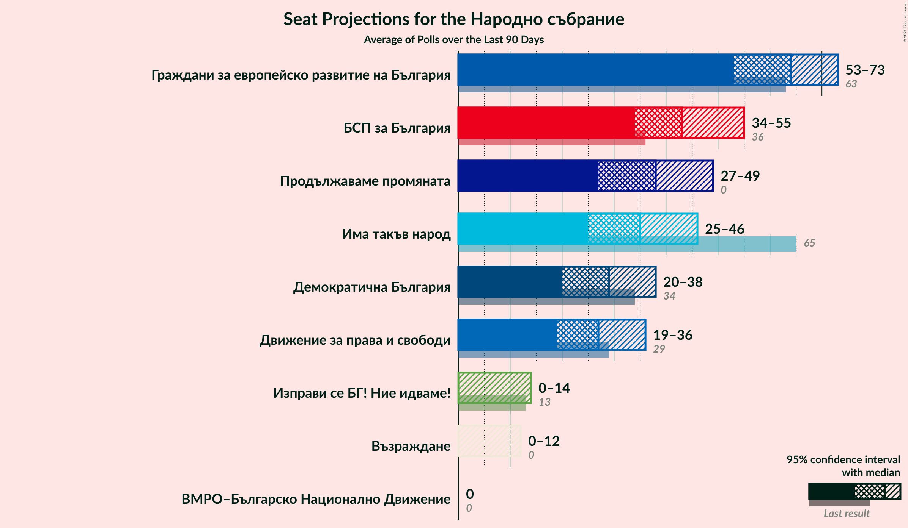

# Overview

The table below lists the most recent polls (less than 90 days old) registered and analyzed so far.

| Period     | Polling firm/Commissioner(s) | ГЕРБ | БСП | ОП | ДПС | Воля | РБ | Да | АБВ | ВМРО | НФСБ | Атака | ДБ | ДСБ | ИТН | В | ИС.Б |
|:----------:|:----------------------------:|:--:|:--:|:--:|:--:|:--:|:--:|:--:|:--:|:--:|:--:|:--:|:--:|:--:|:--:|:--:|:--:|
| 27 March 2017 | General Election | 33.5%   95 | 27.9%   80 | 9.3%   27 | 9.2%   26 | 4.3%   12 | 3.1%   0 | 3.0%   0 | 1.6%   0 | 0.0%   0 | 0.0%   0 | 0.0%   0 | 0.0%   0 | 0.0%   0 | 0.0%   0 | 0.0%   0 | 0.0%   0 |
| N/A | [Poll Average](average.html) | 19–41%   58–108 | 17–27%   45–77 | 2–13%   0–35 | 6–14%   19–36 | 1–4%   0 | N/A   N/A | N/A   N/A | 0–2%   0 | N/A   N/A | N/A   N/A | 0–2%   0 | 4–11%   0–30 | N/A   N/A | 4–19%   12–59 | 0–2%   0 | 1–6%   0–17 |
| [3–11 September 2020](2020-09-11-GallupInternational.html) | Gallup International | 17–25%   56–80 | 18–25%   57–81 | 2–5%   0–14 | 6–10%   18–33 | 1–3%   0 | N/A   N/A | N/A   N/A | N/A   N/A | N/A   N/A | N/A   N/A | N/A   N/A | 4–8%   0–24 | N/A   N/A | 13–20%   42–65 | N/A   N/A | 3–6%   0–19 |
| [29 August–5 September 2020](2020-09-05-Тренд.html) | Тренд   24 часа | 21–27%   57–72 | 21–26%   54–75 | 3–5%   0–14 | 9–12%   24–34 | 1–2%   0 | N/A   N/A | N/A   N/A | 0–1%   0 | N/A   N/A | N/A   N/A | 1–2%   0 | 8–12%   22–32 | N/A   N/A | 14–18%   38–51 | 1–2%   0 | 3–5%   0–15 |
| [19–25 August 2020](2020-08-25-SovaHarris.html) | Sova Harris | 25–31%   62–83 | 21–28%   55–73 | 3–6%   0–15 | 7–12%   19–30 | 2–5%   0–12 | N/A   N/A | N/A   N/A | 1–2%   0 | N/A   N/A | N/A   N/A | 0–2%   0 | 5–9%   13–24 | N/A   N/A | 13–19%   35–47 | 0–2%   0 | 3–6%   0–16 |
| [3–11 August 2020](2020-08-11-БарометърБългария.html) | Барометър България | 36–42%   93–112 | 16–22%   43–57 | 10–14%   25–37 | 10–15%   27–38 | 1–3%   0 | N/A   N/A | N/A   N/A | N/A   N/A | N/A   N/A | N/A   N/A | N/A   N/A | 4–7%   0–17 | N/A   N/A | 4–7%   0–19 | N/A   N/A | 1–3%   0 |
| [1–5 August 2020](2020-08-05-ПИК.html) | ПИК | N/A   N/A | N/A   N/A | N/A   N/A | N/A   N/A | N/A   N/A | N/A   N/A | N/A   N/A | N/A   N/A | N/A   N/A | N/A   N/A | N/A   N/A | N/A   N/A | N/A   N/A | N/A   N/A | N/A   N/A | N/A   N/A |
| 27 March 2017 | General Election | 33.5%   95 | 27.9%   80 | 9.3%   27 | 9.2%   26 | 4.3%   12 | 3.1%   0 | 3.0%   0 | 1.6%   0 | 0.0%   0 | 0.0%   0 | 0.0%   0 | 0.0%   0 | 0.0%   0 | 0.0%   0 | 0.0%   0 | 0.0%   0 |

Only polls for which at least the sample size has been published are included in the table above.

**Legend:**
+ **Top half of each row:** Voting intentions (95% confidence interval)
+ **Bottom half of each row:** Seat projections for the Народно събрание (95% confidence interval)
+ **ГЕРБ:** Граждани за европейско развитие на България
+ **БСП:** Българска социалистическа партия
+ **ОП:** Обединени Патриоти
+ **ДПС:** Движение за права и свободи
+ **Воля:** Воля
+ **РБ:** Реформаторски блок
+ **Да:** Да, България!
+ **АБВ:** Алтернатива за българско възраждане
+ **ВМРО:** ВМРО–Българско Национално Движение
+ **НФСБ:** Национален фронт за спасение на България
+ **Атака:** Атака
+ **ДБ:** Демократична България
+ **ДСБ:** Демократи за силна България
+ **ИТН:** Има такъв народ
+ **В:** Възраждане
+ **ИС.Б:** Изправи се Бг
+ **N/A (single party):** Party not included the published results
+ **N/A (entire row):** Calculation for this opinion poll not started yet

