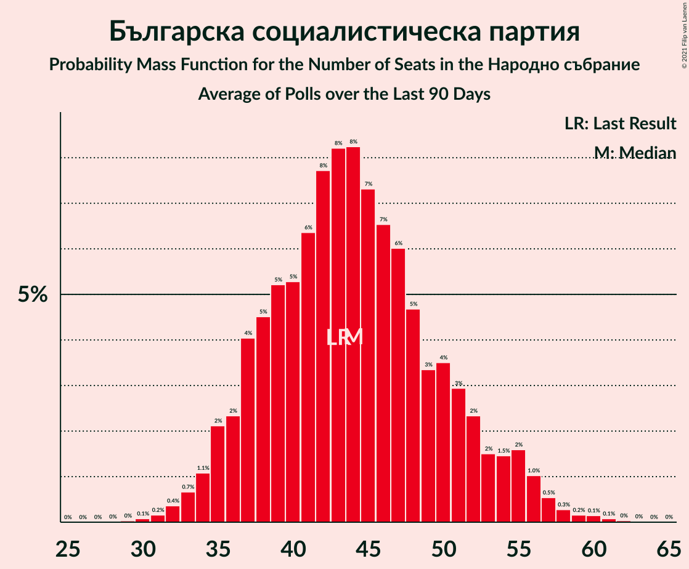

# Българска социалистическа партия

<a href="#voting-intentions">Voting Intentions</a> | <a href="#seats">Seats</a>

## Voting Intentions

Last result: **14.8%** (General Election of 4 April 2021)

### Confidence Intervals

| Period     | Polling firm/Commissioner(s) | Median | 80% Confidence Interval | 90% Confidence Interval | 95% Confidence Interval | 99% Confidence Interval |
|:----------:|:----------------:|:-----------:|:-----------------------:|:-----------------------:|:-----------------------:|:-----------------------:|
| N/A | [Poll Average](average.html) | 17.6% | 14.1–21.6% | 13.3–22.3% | 12.7–22.9% | 11.7–24.0% |
| [11–18 June 2021](2021-06-18-Тренд.html) | Тренд   24 часа | 16.0% | 14.0–18.3% | 13.5–19.0% | 13.0–19.6% | 12.1–20.7% |
| [10–15 June 2021](2021-06-15-Медиана.html) | Медиана | 21.3% | 19.7–23.1% | 19.3–23.5% | 18.9–24.0% | 18.2–24.8% |
| [10–15 June 2021](2021-06-15-SovaHarris.html) | Sova Harris   Dir.bg | 18.8% | 16.7–21.2% | 16.1–21.9% | 15.6–22.5% | 14.6–23.7% |
| [3–11 June 2021](2021-06-11-Gallup.html) | Gallup   BNR | 16.0% | 14.2–18.0% | 13.7–18.6% | 13.2–19.1% | 12.4–20.2% |
| [30 May–7 June 2021](2021-06-07-Алфарисърч.html) | Алфа рисърч | 14.4% | 12.6–16.5% | 12.1–17.1% | 11.6–17.6% | 10.8–18.7% |
| [19–27 May 2021](2021-05-27-MarketLinks.html) | Market Links   bTV | 19.3% | 17.5–21.4% | 17.0–22.0% | 16.5–22.5% | 15.7–23.5% |
| [7–14 May 2021](2021-05-14-Gallup.html) | Gallup | 16.2% | 14.2–18.5% | 13.6–19.2% | 13.1–19.8% | 12.2–21.0% |
| [16–23 April 2021](2021-04-23-МаркетЛИНКС.html) | Маркет ЛИНКС   bTV | 18.0% | 16.2–20.1% | 15.7–20.7% | 15.2–21.2% | 14.4–22.3% |

### Probability Mass Function

The following table shows the probability mass function per percentage block of voting intentions for the [poll average](average.html) for Българска социалистическа партия.

| Voting Intentions | Probability | Accumulated | Special Marks |
|:-----------------:|:-----------:|:-----------:|:-------------:|
| 9.5–10.5% | 0% | 100% |  |
| 10.5–11.5% | 0.3% | 100% |  |
| 11.5–12.5% | 2% | 99.6% |  |
| 12.5–13.5% | 4% | 98% |  |
| 13.5–14.5% | 8% | 94% |  |
| 14.5–15.5% | 11% | 86% | Last Result |
| 15.5–16.5% | 12% | 75% |  |
| 16.5–17.5% | 11% | 62% |  |
| 17.5–18.5% | 11% | 51% | Median |
| 18.5–19.5% | 11% | 40% |  |
| 19.5–20.5% | 10% | 30% |  |
| 20.5–21.5% | 9% | 19% |  |
| 21.5–22.5% | 6% | 10% |  |
| 22.5–23.5% | 3% | 4% |  |
| 23.5–24.5% | 0.8% | 1.0% |  |
| 24.5–25.5% | 0.2% | 0.2% |  |
| 25.5–26.5% | 0% | 0% |  |

## Seats

Last result: **43** seats (General Election of 4 April 2021)

### Confidence Intervals

| Period     | Polling firm/Commissioner(s) | Median | 80% Confidence Interval | 90% Confidence Interval | 95% Confidence Interval | 99% Confidence Interval |
|:----------:|:----------------:|:------:|:-----------------------:|:-----------------------:|:-----------------------:|:-----------------------:|
| N/A | [Poll Average](average.html) | 47 | 39–54 | 37–56 | 36–58 | 33–60 |
| [11–18 June 2021](2021-06-18-Тренд.html) | Тренд   24 часа | 43 | 38–51 | 37–53 | 36–54 | 33–57 |
| [10–15 June 2021](2021-06-15-Медиана.html) | Медиана | 52 | 49–57 | 47–58 | 46–60 | 45–61 |
| [10–15 June 2021](2021-06-15-SovaHarris.html) | Sova Harris   Dir.bg | 47 | 42–53 | 40–55 | 39–57 | 36–60 |
| [3–11 June 2021](2021-06-11-Gallup.html) | Gallup   BNR | 42 | 37–48 | 36–49 | 35–50 | 33–53 |
| [30 May–7 June 2021](2021-06-07-Алфарисърч.html) | Алфа рисърч | 43 | 37–48 | 35–50 | 34–51 | 32–55 |
| [19–27 May 2021](2021-05-27-MarketLinks.html) | Market Links   bTV | 51 | 46–56 | 44–58 | 42–59 | 41–62 |
| [7–14 May 2021](2021-05-14-Gallup.html) | Gallup | 44 | 38–50 | 36–52 | 35–54 | 33–57 |
| [16–23 April 2021](2021-04-23-МаркетЛИНКС.html) | Маркет ЛИНКС   bTV | 46 | 41–51 | 40–53 | 39–53 | 37–57 |

### Probability Mass Function

The following table shows the probability mass function per seat for the [poll average](average.html) for Българска социалистическа партия.

| Number of Seats | Probability | Accumulated | Special Marks |
|:---------------:|:-----------:|:-----------:|:-------------:|
| 30 | 0% | 100% |  |
| 31 | 0.1% | 99.9% |  |
| 32 | 0.2% | 99.9% |  |
| 33 | 0.3% | 99.7% |  |
| 34 | 0.5% | 99.4% |  |
| 35 | 0.9% | 98.9% |  |
| 36 | 1.3% | 98% |  |
| 37 | 2% | 97% |  |
| 38 | 3% | 94% |  |
| 39 | 3% | 92% |  |
| 40 | 5% | 88% |  |
| 41 | 5% | 84% |  |
| 42 | 6% | 79% |  |
| 43 | 6% | 73% | Last Result |
| 44 | 6% | 67% |  |
| 45 | 4% | 61% |  |
| 46 | 6% | 56% |  |
| 47 | 6% | 51% | Median |
| 48 | 6% | 45% |  |
| 49 | 5% | 39% |  |
| 50 | 5% | 34% |  |
| 51 | 6% | 28% |  |
| 52 | 6% | 22% |  |
| 53 | 4% | 16% |  |
| 54 | 4% | 13% |  |
| 55 | 3% | 9% |  |
| 56 | 2% | 6% |  |
| 57 | 1.3% | 4% |  |
| 58 | 1.0% | 3% |  |
| 59 | 0.7% | 2% |  |
| 60 | 0.5% | 0.9% |  |
| 61 | 0.2% | 0.4% |  |
| 62 | 0.1% | 0.2% |  |
| 63 | 0% | 0.1% |  |
| 64 | 0% | 0% |  |

