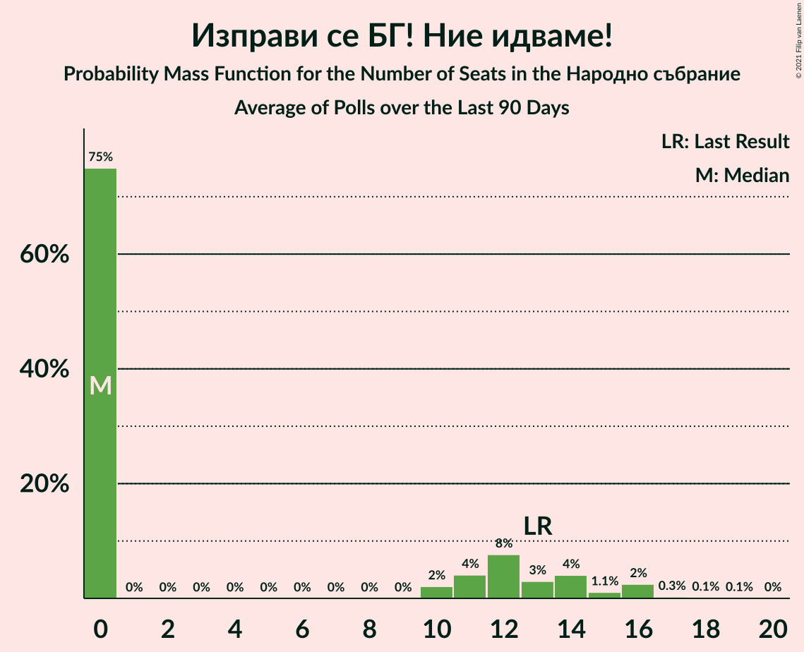

# Изправи се БГ! Ние идваме!

<a href="#voting-intentions">Voting Intentions</a> | <a href="#seats">Seats</a>

## Voting Intentions

Last result: **5.0%** (General Election of 11 July 2021)

### Confidence Intervals

| Period     | Polling firm/Commissioner(s) | Median | 80% Confidence Interval | 90% Confidence Interval | 95% Confidence Interval | 99% Confidence Interval |
|:----------:|:----------------:|:-----------:|:-----------------------:|:-----------------------:|:-----------------------:|:-----------------------:|
| N/A | [Poll Average](average.html) | 3.5% | 2.5–4.8% | 2.2–5.2% | 2.0–5.6% | 1.5–6.3% |
| [10–17 October 2021](2021-10-17-Gallup.html) | Gallup   BNR | 3.7% | 2.8–4.9% | 2.6–5.3% | 2.4–5.6% | 2.0–6.2% |
| [5–12 October 2021](2021-10-12-SovaHarris.html) | Sova Harris   Dir.bg | 4.3% | 3.4–5.6% | 3.1–6.0% | 2.9–6.3% | 2.5–7.0% |
| [6–12 October 2021](2021-10-12-Exacta.html) | Exacta | 2.6% | 1.9–3.7% | 1.7–4.1% | 1.5–4.4% | 1.2–5.0% |
| [6–10 October 2021](2021-10-10-Центързаанализиимаркетинг.html) | Център за анализи и маркетинг | 3.3% | 2.6–4.3% | 2.5–4.6% | 2.3–4.8% | 2.0–5.3% |
| [4–10 October 2021](2021-10-10-Алфарисърч.html) | Алфа рисърч | 3.2% | 2.4–4.4% | 2.2–4.7% | 2.0–5.0% | 1.7–5.7% |
| [21–26 September 2021](2021-09-26-Gallup.html) | Gallup | 4.1% | 3.4–5.0% | 3.2–5.2% | 3.0–5.5% | 2.7–5.9% |
| [14–20 September 2021](2021-09-20-МаркетЛИНКС.html) | Маркет ЛИНКС   bTV | 3.6% | 2.8–4.8% | 2.6–5.1% | 2.4–5.4% | 2.0–6.0% |
| [8–15 September 2021](2021-09-15-Тренд.html) | Тренд | 3.7% | 2.9–5.0% | 2.6–5.4% | 2.4–5.7% | 2.1–6.4% |
| [8–15 September 2021](2021-09-15-Алфарисърч.html) | Алфа рисърч | 4.6% | 3.6–6.0% | 3.3–6.4% | 3.1–6.7% | 2.7–7.4% |
| [2–10 September 2021](2021-09-10-Gallup.html) | Gallup | 4.9% | 3.8–6.4% | 3.5–6.8% | 3.3–7.2% | 2.8–8.0% |
| [13–22 August 2021](2021-08-22-МаркетЛИНКС.html) | Маркет ЛИНКС   bTV | 4.9% | 3.9–6.3% | 3.6–6.7% | 3.4–7.1% | 3.0–7.8% |
| [23–30 July 2021](2021-07-30-Тренд.html) | Тренд   24 часа | 4.4% | 3.6–5.3% | 3.4–5.6% | 3.3–5.8% | 3.0–6.3% |
| [21–28 July 2021](2021-07-28-МаркетЛИНКС.html) | Маркет ЛИНКС   bTV | 5.7% | 4.6–7.3% | 4.3–7.7% | 4.0–8.1% | 3.5–8.9% |

### Probability Mass Function

The following table shows the probability mass function per percentage block of voting intentions for the [poll average](average.html) for Изправи се БГ! Ние идваме!.

| Voting Intentions | Probability | Accumulated | Special Marks |
|:-----------------:|:-----------:|:-----------:|:-------------:|
| 0.0–0.5% | 0% | 100% |  |
| 0.5–1.5% | 0.5% | 100% |  |
| 1.5–2.5% | 11% | 99.5% |  |
| 2.5–3.5% | 39% | 88% |  |
| 3.5–4.5% | 34% | 49% | Median |
| 4.5–5.5% | 12% | 15% | Last Result |
| 5.5–6.5% | 2% | 3% |  |
| 6.5–7.5% | 0.3% | 0.3% |  |
| 7.5–8.5% | 0% | 0% |  |

## Seats

Last result: **13** seats (General Election of 11 July 2021)

### Confidence Intervals

| Period     | Polling firm/Commissioner(s) | Median | 80% Confidence Interval | 90% Confidence Interval | 95% Confidence Interval | 99% Confidence Interval |
|:----------:|:----------------:|:------:|:-----------------------:|:-----------------------:|:-----------------------:|:-----------------------:|
| N/A | [Poll Average](average.html) | 0 | 0–12 | 0–13 | 0–14 | 0–16 |
| [10–17 October 2021](2021-10-17-Gallup.html) | Gallup   BNR | 0 | 0–13 | 0–14 | 0–15 | 0–17 |
| [5–12 October 2021](2021-10-12-SovaHarris.html) | Sova Harris   Dir.bg | 11 | 0–14 | 0–15 | 0–16 | 0–17 |
| [6–12 October 2021](2021-10-12-Exacta.html) | Exacta | 0 | 0 | 0 | 0–11 | 0–13 |
| [6–10 October 2021](2021-10-10-Центързаанализиимаркетинг.html) | Център за анализи и маркетинг | 0 | 0–11 | 0–12 | 0–12 | 0–13 |
| [4–10 October 2021](2021-10-10-Алфарисърч.html) | Алфа рисърч | 0 | 0–11 | 0–12 | 0–13 | 0–15 |
| [21–26 September 2021](2021-09-26-Gallup.html) | Gallup | 11 | 0–13 | 0–14 | 0–14 | 0–16 |
| [14–20 September 2021](2021-09-20-МаркетЛИНКС.html) | Маркет ЛИНКС   bTV | 0 | 0–12 | 0–13 | 0–13 | 0–15 |
| [8–15 September 2021](2021-09-15-Тренд.html) | Тренд | 0 | 0–13 | 0–14 | 0–15 | 0–17 |
| [8–15 September 2021](2021-09-15-Алфарисърч.html) | Алфа рисърч | 12 | 0–16 | 0–17 | 0–18 | 0–19 |
| [2–10 September 2021](2021-09-10-Gallup.html) | Gallup | 13 | 0–17 | 0–19 | 0–19 | 0–22 |
| [13–22 August 2021](2021-08-22-МаркетЛИНКС.html) | Маркет ЛИНКС   bTV | 12 | 0–16 | 0–16 | 0–17 | 0–19 |
| [23–30 July 2021](2021-07-30-Тренд.html) | Тренд   24 часа | 12 | 0–14 | 0–15 | 0–16 | 0–17 |
| [21–28 July 2021](2021-07-28-МаркетЛИНКС.html) | Маркет ЛИНКС   bTV | 14 | 11–18 | 11–19 | 0–20 | 0–22 |

### Probability Mass Function

The following table shows the probability mass function per seat for the [poll average](average.html) for Изправи се БГ! Ние идваме!.

| Number of Seats | Probability | Accumulated | Special Marks |
|:---------------:|:-----------:|:-----------:|:-------------:|
| 0 | 73% | 100% | Median |
| 1 | 0% | 27% |  |
| 2 | 0% | 27% |  |
| 3 | 0% | 27% |  |
| 4 | 0% | 27% |  |
| 5 | 0% | 27% |  |
| 6 | 0% | 27% |  |
| 7 | 0% | 27% |  |
| 8 | 0% | 27% |  |
| 9 | 0% | 27% |  |
| 10 | 2% | 27% |  |
| 11 | 10% | 26% |  |
| 12 | 7% | 16% |  |
| 13 | 5% | 9% | Last Result |
| 14 | 2% | 4% |  |
| 15 | 0.9% | 2% |  |
| 16 | 0.6% | 0.9% |  |
| 17 | 0.2% | 0.3% |  |
| 18 | 0.1% | 0.1% |  |
| 19 | 0% | 0% |  |

